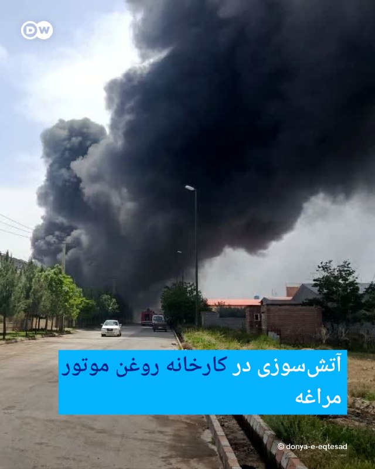
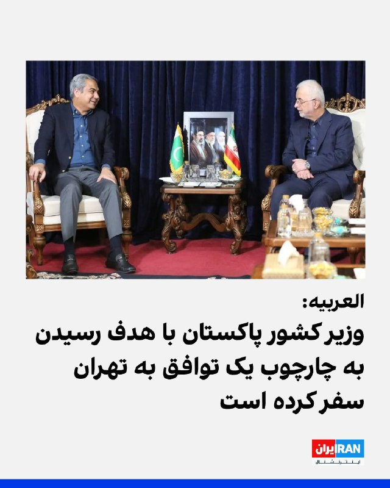
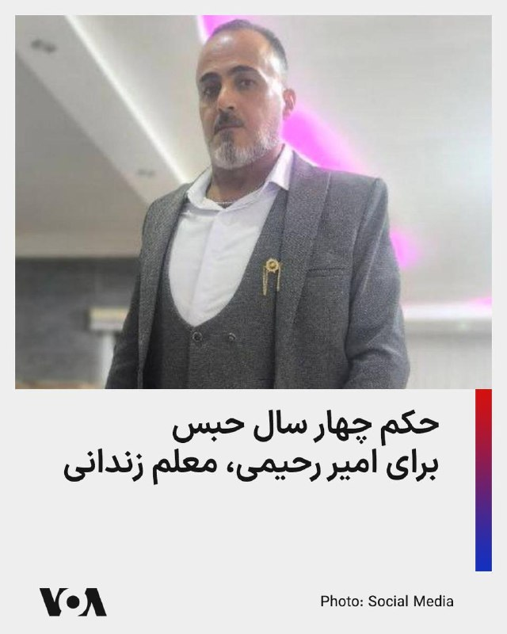

# خواننده تلگرام

<!-- TOP_NAV START -->

<a href="https://github.com/hhdoust2/aio-downloader/blob/main/telegram/content/archive_1.md" style="display:inline-block; padding:6px 12px; margin:0 4px; background-color:#2ea44f; color:white; text-decoration:none; border-radius:4px; font-weight:bold;">صفحه بعد</a>

<!-- TOP_NAV END -->

<!-- MSG START -->

---
📅 بروزرسانی: 1405/02/26 19:42
---

## VahidOOnLine — post 240503

  <a href="telegram/content/VahidOOnLine_240503_1778947934.mp4" target="_blank">🎬 Download video</a>

‌
گروه تروریستی حماس کشته شدن عزالدین الحداد، فرمانده گردان‌های« قسام» در نوار غزه را تایید کرد.

بر اساس بیانیه حماس عزالدین الحداد شامگاه جمعه «به همراه همسر، دخترش و چند غیرنظامی فلسطینی دیگر» کشته شده است.
‌🏁 🇬🇧 ManotoTV

🤖 @VahidOOnLine

## VahidOOnLine — post 240502

  <a href="telegram/content/VahidOOnLine_240502_1778947935.mp4" target="_blank">🎬 Download video</a>

اسلو | نروژ؛ راهپیمایی سکوت ایرانیان ـ گزارشگر شنبه ۲۶ اردیبهشت
‌🏁 🇬🇧 ManotoTV

🤖 @VahidOOnLine

## VahidOOnLine — post 240501

  <a href="telegram/content/VahidOOnLine_240501_1778947938.mp4" target="_blank">🎬 Download video</a>

‌
کپنهاگ | دانمارک؛ گردهمایی ایرانیان - گزارشگر شنبه ۲۶ اردیبهشت
‌🏁 🇬🇧 ManotoTV

🤖 @VahidOOnLine

## VahidOOnLine — post 240500

  

احسان قاضی‌زاده هاشمی، نماینده مجلس، درباره مذاکرات با آمریکا گفت: «قبل از ورود به بحث مذاکرات، باید آمریکا ادبیات ارعاب و تهدید خود را کنار بگذارد. وقتی چنین ادبیاتی وجود دارد، دیگر نمی‌توان آن را مذاکره نامید، بلکه به نوعی ارائه پیشنهادات و دادن سندی برای تسلیم است.»

قاضی‌زاده هاشمی گفت: «باید این ادبیات آمریکایی که شامل ارعاب، تهدید و قلدری است، برطرف شود.»
‌🏁 🇬🇧 IranintlTV

🤖 @VahidOOnLine

## VahidOOnLine — post 240499

  

♦️ میخاییل اولیانوف، نماینده روسیه در سازمان ملل متحد در ژنو، با بازنشر خبری درباره مخالفت چین با قطعنامه پیشنهادی مورد حمایت ایالات متحده به شورای امنیت سازمان ملل درباره تنگه هرمز، اعلام کرد که موضع روسیه نیز با چین یکسان است.

وزیر خارجه چین پیش‌تر، قطعنامه پیشنهادی علیه جمهوری اسلامی را «نادرست» خوانده و تاکید کرده بود که حل مسئله تنگه هرمز تنها از راه دستیابی به «آتش‌بس دائم و فراگیر» میان تهران و واشنگتن امکان‌پذیر است و استفاده از زور نمی‌تواند مسئله را حل کند.

مایک والتز، نماینده ایالات متحده در سازمان ملل در نیویورک، روز جمعه ۲۶ اردیبهشت اعلام کرد که این قطعنامه که با حمایت آمریکا و کشورهای حوزه خلیج فارس، به شورای امنیت ارائه شده، تاکنون حمایت ۱۲۰ کشور را به‌دست آورده است. با این‌وجود، مخالفت چین و روسیه که حق وتو دارند، مانع بزرگی برای تصویب قطعنامه پیشنهادی است.
‌🇸🇦 Indypersian

🤖 @VahidOOnLine

## VahidOOnLine — post 240498

  

محمدصالح جوکار، رییس کمیسیون امور داخلی مجلس، گفت: «آمریکا به دنبال آن است تا آنچه را که در میدان به دست نیاورده پای میز مذاکره به دست آورد. در این‌باره باید بگویم هرگز آمریکا به خواسته‌های نامشروعش در مذاکرات نخواهد رسید.»

جوکار گفت که آمریکا باید شروط تهران را برای توافق بپذیرد و راهی جز تعظیم در برابر خواسته‌های جمهوری اسلامی ندارد
‌🏁 🇬🇧 IranintlTV

🤖 @VahidOOnLine

## VahidOOnLine — post 240497

♦️در حالی که دونالد ترامپ، رئیس‌جمهوری ایالات متحده سفر خود به پکن را پایان داده و به آمریکا بازگشته است، حاشیه‌های این سفر ادامه دارد. یکی از این موارد، تصاویری از لحظه‌ای که ترامپ، نگاهی به یادداشت‌های شی جین‌پینگ، رئیس‌جمهوری چین می‌اندازد است که دستاویز طنزپردازان شده است. یک شبکه اینترنتی چینی، با انتشار این تصاویر، ترامپ را با عنوان «مامور ۰۰۴۷» که اشاره به اسم رمز جیمز باند، شخصیت مشهور کتاب‌های جاسوسی بریتانیایی دارد، خطاب کرده است.
‌🇸🇦 Indypersian

🤖 @VahidOOnLine

## VahidOOnLine — post 240496

  <a href="telegram/content/VahidOOnLine_240496_1778947943.mp4" target="_blank">🎬 Download video</a>

‌
اشتوتگارت | آلمان؛ گردهمایی ایرانیان - گزارشگر شنبه ۲۶ اردیبهشت
‌🏁 🇬🇧 ManotoTV

🤖 @VahidOOnLine

## VahidOOnLine — post 240495

♦️ پادشاه خودخوانده سوئیس که خود را «شاه یوناس اول» می‌نامد، با وجود جنجال‌های فراوان، همچنان به گسترش نفوذ خود ادامه می‌دهد. یوناس لاووینر، شهروند ۳۱ ساله سوئیسی-مراکشی، در سال ۲۰۱۹ طی مراسمی در کلیسای نایدگ شهر برن تاج‌گذاری کرد و خود را «پادشاه نمادین سوئیس» نامید؛ عنوانی که در کشوری بدون سنت سلطنتی و بدون خانواده سلطنتی رسمی، بحث‌برانگیز بوده است.

لاووینر که در یک شرکت داروسازی نیز مشغول به کار است، طی سال‌های اخیر با استفاده از یک خلا در قوانین سوئیس توانسته حدود ۱۱۷ هزار متر مربع زمین بدون مالک را در نقاط مختلف کشور به نام خود ثبت کند. او اکنون مالک حدود ۱۵۰ قطعه زمین، از جمله ۸۳ جاده، است و می‌گوید روزانه بیش از ۵ هزار نفر از جاده‌های متعلق به او استفاده می‌کنند.

فعالیت‌های او باعث درگیری‌های حقوقی با مقام‌های محلی شده است. در یکی از موارد، او برای واگذاری خیابانی در منطقه گئونزه خواستار پرداخت ۱۵۰ هزار فرانک یا تغییر نام آن به «خیابان لاووینر» شده است؛ پیشنهادی که رد شد و به شکایت قضایی انجامید.
‌🇸🇦 Indypersian

🤖 @VahidOOnLine

## WithYashar — post 11403

العربیه: طبق گفته منابع آگاه پاکستانی، در بحث تنگه هرمز، پیشرفت‌هایی حاصل شده است
@withyashar

## mwarmonitor — post 9161

🔴 سی‌ان‌ان به نقل از منابع آگاه:
در داخل دولت ترامپ درباره چگونگی ادامه مسیر در قبال ایران، اختلاف نظر وجود دارد.

🔸برخی مقام‌ها در دولت ترامپ و پنتاگون به سمت حملات محدود و هدفمند فشار می‌آورند، در حالی که برخی دیگر از دیپلماسی حمایت می‌کنند.

🔸سی‌ان‌ان به نقل از سخنگوی کاخ سفید ؛ رئیس‌جمهور تمام گزینه‌ها را در اختیار دارد، با این حال گزینه ترجیحی او دیپلماسی است.

🔸 سی‌ان‌ان به نقل از سخنگوی کاخ سفید:
رئیس‌جمهور تنها توافقی را خواهد پذیرفت که امنیت ملی ما را تضمین کند.

@mwarmonitor

## FoxNewsTwitter — post 341817

  <a href="telegram/content/FoxNewsTwitter_341817_1778947946.mp4" target="_blank">🎬 Download video</a>

Fox News (Twitter/X)

NEW: @VP lays out in blunt terms who the victims are when fraudsters target benefits Americans rely on most on @SatAmericaFNC.

“There really are two costs and two victims. One is taxpayers getting fleeced... But it’s also there’s these programs that people in my family that I have benefited from that are meant to provide food to low income kids, are meant to ensure that if you can’t afford a doctor, you can still have access to medical care. Those programs are going to be destroyed by the fraudsters.”

## pm_afshaa — post 90855

تلگراف : مقامات ارشد دولت ترامپ از امارات خواستن تو جنگ علیه ایران بیشتر وارد عمل بشه

💧 Rainbet.com the #1 Non-KYC Crypto Casino & Sportsbook @rainbetcom

😁 @Pm_Afshaa

## pm_afshaa — post 90854

🔴العربیه: طبق گفته منابع آگاه پاکستانی، در بحث تنگه هرمز، پیشرفت‌هایی حاصل شده

💧 Rainbet.com the #1 Non-KYC Crypto Casino & Sportsbook @rainbetcom

😁 @Pm_Afshaa

## IranIntlTV — post 337498

  <a href="telegram/content/IranIntlTV_337498_1778947948.mp4" target="_blank">🎬 Download video</a>

یک شهروند در آبادان با ارسال پیامی به ایران اینترنشنال از بیکاری در این شهر در پی بحران اقتصادی روایت می‌کند. پیام او با هوش مصنوعی خوانده شده است.

## IranIntlTV — post 337497

  <a href="telegram/content/IranIntlTV_337497_1778947951.mp4" target="_blank">🎬 Download video</a>

ستاد فرماندهی مرکزی آمریکا، سنتکام، اعلام کرد با ادامه محاصره دریایی جمهوری اسلامی، تاکنون ۷۸ کشتی تجاری وادار به تغییر مسیر شده و ۴ کشتی دیگر نیز غیرفعال شده‌اند.
جزییات بیشتر با اردوان روزبه، خبرنگار ایران‌اینترنشنال
@iranintltv

## IranIntlTV — post 337496

  

احسان قاضی‌زاده هاشمی، نماینده مجلس، درباره مذاکرات با آمریکا گفت: «قبل از ورود به بحث مذاکرات، باید آمریکا ادبیات ارعاب و تهدید خود را کنار بگذارد. وقتی چنین ادبیاتی وجود دارد، دیگر نمی‌توان آن را مذاکره نامید، بلکه به نوعی ارائه پیشنهادات و دادن سندی برای تسلیم است.»

قاضی‌زاده هاشمی گفت: «باید این ادبیات آمریکایی که شامل ارعاب، تهدید و قلدری است، برطرف شود.»
https://iranintl.com/202605169448

## IranIntlTV — post 337495

  <a href="telegram/content/IranIntlTV_337495_1778947954.mp4" target="_blank">🎬 Download video</a>

کانال ۱۲ اسرائیل به نقل از یک مقام این کشور خبر داد ترامپ ظرف ۲۴ ساعت آینده درباره حمله دوباره به ایران تصمیم می‌گیرد. این مقام رسمی گفت جنگ دوباره با جمهوری اسلامی نزدیک است. همزمان روزنامه معاریو چاپ اسرائیل نوشت ترامپ در آستانه دادن چراغ سبز جنگ است

گزارشی از مجتبا پورمحسن
@iranintltv

## IranIntlTV — post 337494

  

محمدصالح جوکار، رییس کمیسیون امور داخلی مجلس، گفت: «آمریکا به دنبال آن است تا آنچه را که در میدان به دست نیاورده پای میز مذاکره به دست آورد. در این‌باره باید بگویم هرگز آمریکا به خواسته‌های نامشروعش در مذاکرات نخواهد رسید.»

جوکار گفت که آمریکا باید شروط تهران را برای توافق بپذیرد و راهی جز تعظیم در برابر خواسته‌های جمهوری اسلامی ندارد
https://iranintl.com/202605165329

## IranIntlTV — post 337493

  <a href="telegram/content/IranIntlTV_337493_1778947957.mp4" target="_blank">🎬 Download video</a>

صداوسیمای جمهوری اسلامی در برنامه‌ای آموزش استفاده از سلاح گرم توسط یک نظامی به مجری را به نمایش گذاشت. در بخشی از این برنامه، مجری به پرچم امارات متحده عربی شلیک کرد.
گفت‌وگو با فروغ کنعانی، پژوهشگر جامعه‌شناسی
@iranintltv

## Shin_Persian — post 6032

📦 mhrv-rs v1.9.28 released

• Pipeline Full-mode polls for a faster tunnel (PR #1115)
• Improve WebRTC fallback by blocking STUN/TURN UDP (PR #1115)
• Add pipeline diagnostics and benchmark tooling (PR #1115)

Files (Android APKs, Windows, macOS, Linux, OpenWRT) on the files channel:

👉 v1.9.28 — all files with SHA-256

Channel:
https://t.me/mhrv_rs
or: https://t.me/+R1OyoHX2boA1ZDgx

#v1928

## ManotoTV — post 105525

  <a href="telegram/content/ManotoTV_105525_1778947960.mp4" target="_blank">🎬 Download video</a>

‌
گروه تروریستی حماس کشته شدن عزالدین الحداد، فرمانده گردان‌های« قسام» در نوار غزه را تایید کرد.

بر اساس بیانیه حماس عزالدین الحداد شامگاه جمعه «به همراه همسر، دخترش و چند غیرنظامی فلسطینی دیگر» کشته شده است.

## ManotoTV — post 105524

  <a href="telegram/content/ManotoTV_105524_1778947961.mp4" target="_blank">🎬 Download video</a>

اسلو | نروژ؛ راهپیمایی سکوت ایرانیان ـ گزارشگر شنبه ۲۶ اردیبهشت

## ManotoTV — post 105523

  <a href="telegram/content/ManotoTV_105523_1778947963.mp4" target="_blank">🎬 Download video</a>

‌
کپنهاگ | دانمارک؛ گردهمایی ایرانیان - گزارشگر شنبه ۲۶ اردیبهشت

## ManotoTV — post 105522

  <a href="telegram/content/ManotoTV_105522_1778947965.mp4" target="_blank">🎬 Download video</a>

‌
اشتوتگارت | آلمان؛ گردهمایی ایرانیان - گزارشگر شنبه ۲۶ اردیبهشت

## FarsiVOA — post 217910

رئیس انجمن روانپزشکان ایران می‌گوید کمبود دارو در حوزه روانپزشکی جدی است و نسبت به شرایط پیش از جنگ، به «طور قابل توجهی» تشدید شده است.

وحید شریعت به ایلنا گفته است در ماه‌های اخیر، کمبود قابل توجهی در برخی اقلام دارویی مشاهده شده است که برخی از آن‌ها از پیش از آغاز جنگ تشدید یافته و برخی دیگر کاملاً جدید هستند.

به گفته او احتمالاً مسئله به اختلال در روند تولید به خاطر نبود مواد اولیه یا نوعی دست نگه داشتن در توزیع، به منظور آماده‌سازی شرایط بازار برای افزایش قیمت مرتبط باشد.

حسین‌علی شهریاری رئیس کمیسیون بهداشت و درمان مجلس نیز روز پنج‌شنبه از افزایش قیمت برخی داروها بین ۵۰ تا ۳۰۰ درصد خبر داد و گفت بر اساس برآورد وزارت بهداشت، حدود ۱۵۰ هزار میلیارد تومان منابع نیاز است تا بتوان فشار هزینه‌های دارویی بر مردم را کاهش داد.

@FarsiVOA

## FarsiVOA — post 217909

مجریان صداوسیمای جمهوری اسلامی در برنامه‌های تلویزیونی با در دست گرفتن اسلحه ظاهر شدند. این تصاویر، واکنش‌های گسترده‌ای را درباره عادی‌سازی خشونت و ترویج فضای امنیتی در ایران برانگیخته است

## FarsiVOA — post 217908

🔺والتز: عقب‌نشینی چینی‌ها درمورد رژیم ایران پس از دیدار با ترامپ یک نتیجه بزرگ بود

▪️مایک والتز نماینده آمریکا در سازمان ملل متحد، روز شنبه ۲۶ اردیبهشت در مصاحبه با شبکه خبری فاکس گفت که تاکید آمریکا در سازمان ملل بر این واقعیت است که «نمی‌توانید یک درگیری را با مین‌گزاری دریایی در اقیانوس و دریافت عوارض پاسخ دهید.» و نمی‌توان این هنجارهای بین‌المللی را نقض کرد.

⬇️ بیشتر بخوانید:

https://ir.voanews.com/a/iran-waltz-mike-china-hormuz-trump/8150689.html/?nocach=1

## FarsiVOA — post 217907

🔺ارتش اسرائیل: سه تروریست حماس را کشتیم؛ دو نفر از آنها در کشتار ۷ اکتبر، دست داشتند

▪️ارتش اسرائیل روز شنبه ۲۶ اردیبهشت از کشته شدن سه تروریست عضو حماس خبر داد و اعلام کرد دو نفر از آنها، در «کشتار خونین» ۷ اکتبر در خاک اسرائیل نقش داشتند و در ماه‌های گذشته نیز تلاش می‌کردند علیه نیروهای اسرائیلی اقدامات تروریستی انجام دهند.

⬇️ بیشتر بخوانید:

https://ir.voanews.com/a/8150690.html/?nocach=1

## FarsiVOA — post 217906

در گفت‌وگو با شاهین مدرس، تحلیلگر مطالعات امنیتی، به بن‌بست مذاکرات هسته‌ای، گزارش نیویورک‌تایمز درباره آمادگی آمریکا و اسرائیل برای ازسرگیری حملات، سردرگمی تصمیم‌گیری در تهران و سناریوهای احتمالی پیش‌روی جمهوری اسلامی در صورت بازگشت عملیات نظامی پرداختیم

## FarsiVOA — post 217905

در گفت‌وگو با حسن هاشمیان، به آتش‌بس شکننده میان اسرائیل و لبنان، بازداشت چهره‌های کلیدی شبکه‌های نیابتی جمهوری اسلامی و تشدید عملیات پنهان آمریکا و اسرائیل پرداختیم و پرسیدیم چرا به رغم تلاش‌های جمهوری اسلامی و حزب الله لبنان، آتش بس میان اسرائیل و لبنان تمدید شد؟

## FarsiVOA — post 217904

دیدار وزیرخارجه امارات با نایجل فاراژ در بریتانیا، همزمان با افزایش تنش‌ها میان امارات و ایران

## DW_Farsi — post 124770

  

🔶 ایران از سازوکار جدید عبور کشتی‌ها از تنگه هرمز خبر داد

رسانه‌های دولتی ایران مدعی شدند که برخی کشورهای اروپایی برای عبور کشتی‌های خود از تنگه هرمز با تهران وارد مذاکره شده‌اند.

تلویزیون دولتی ایران گزارش داده که پس از عبور کشتی‌های چین، ژاپن و پاکستان، اکنون کشورهای اروپایی نیز برای دریافت مجوز عبور با نیروی دریایی سپاه پاسداران گفت‌وگو کرده‌اند، هرچند نامی از این کشورها برده نشده است.

هم‌زمان ابراهیم عزیزی، رئیس کمیسیون امنیت ملی مجلس جمهوری اسلامی، اعلام کرده تهران سازوکاری جدید برای مدیریت تردد کشتی‌ها در تنگه هرمز آماده کرده که "به‌زودی" رونمایی خواهد شد.

او گفته این سازوکار فقط شامل کشتی‌های تجاری و طرف‌های "همکار با ایران" می‌شود و در قبال خدمات ارائه‌شده، هزینه دریافت خواهد شد.

عزیزی همچنین تاکید کرده این مسیر همچنان به روی کشورهای مشارکت‌کننده در پروژه موسوم به "آزادی" بسته خواهد بود؛ پروژه‌ای که آمریکا برای همراهی و حفاظت از کشتی‌ها در تنگه هرمز مطرح کرده است.
@dw_farsi

## DW_Farsi — post 124769

  

🔶 آتش‌سوزی در کارخانه روغن موتور مراغه

یک کارخانه تولید روغن موتور در مراغه دچار آتش‌سوزی شده و نیروهای امدادی و آتش‌نشانی همچنان در حال مهار حریق هستند.

به گزارش رسانه‌های ایران، این آتش‌سوزی ظهر شنبه ۲۶ اردیبهشت آغاز شد و چندین خودروی آتش‌نشانی، نیروهای هلال احمر و آمبولانس‌های اورژانس به محل اعزام شدند.

رئیس آتش‌نشانی مراغه به ایسنا گفته است که تاکنون گزارشی از مصدومیت افراد منتشر نشده است.

گزارش‌ها حاکی است که دود غلیظ همچنان منطقه را فراگرفته و آتش هنوز به‌طور کامل مهار نشده است.

این واحد تولیدی از کارخانه‌های بزرگ تولید روغن موتور در ایران به شمار می‌رود و بیش از ۴۰۰ کارگر دارد.
@dw_farsi

## DW_Farsi — post 124768

🔶 اخراج مهاجران؛ رئیس جمهور شیلی دولت خود را خشمگین کرد

خوزه آنتونیو کاست، رئیس جمهور راست افراطی شیلی، با طرح‌های جدید خود برای تشدید اقدامات علیه مهاجران، اعتراض‌هایی را حتی در درون دولت خودش برانگیخته است.

بر اساس تازه‌ترین لایحه رئیس جمهور شیلی، مدارس، مراکز درمانی و نهادهای عمومی موظف خواهند شد اطلاعات شخصی مهاجران فاقد مدارک معتبر را به دولت ارائه دهند.

در متن این طرح مشخصاً آمده است: «تمامی نهادهای اداری دولتی موظف‌اند اطلاعات درخواست‌شده از سوی اداره مهاجرت، از جمله نشانی، شماره تلفن، آدرس ایمیل و دیگر اطلاعات مربوط به اتباع خارجی را که مراحل مهاجرتی‌شان در حال رسیدگی است، در اختیار این اداره قرار دهند.»

به گفته ماکسیمو پاوس، معاون وزیر کشور، هدف این است که اطلاعات از نهادهایی جمع‌آوری شود "که مهاجران معمولاً با آنها در تماس هستند و اطلاعات خود را در اختیارشان قرار می‌دهند".

پاوس با بیان اینکه مهدکودک‌ها نیز در این فهرست قرار می‌گیرند، در عین حال در گفت‌وگو با روزنامه "لا سگوندا" تأکید کرد که "هیچ‌کس کودکان را تحت تعقیب قرار نخواهد داد".

به گفته او، هدف در واقع جمع‌آوری اطلاعات مربوط به والدین است.

می چومالی، وزیر بهداشت شیلی، این پیشنهاد را به عنوا نقض محرمانه بودن اطلاعات مورد انتقاد قرار داد. او در گفت‌وگو با شبکه تلویزیونی "تله‌ترسه" گفت اطلاعات مورد بحث، "داده‌هایی هستند که در چارچوب خدمات درمانی ارائه می‌شوند و بر اساس قانون سلامت تحت حمایت قرار دارند".

وزیر بهداشت شیلی با اشاره به اینکه "ما نمی‌توانیم قانون را نادیده بگیریم"، وعده داده است که از حریم خصوصی افراد "دفاع" خواهد کرد.

به باور مخالفان دولت در شیلی، طرح قانونی رئیس جمهور راست افراطی شیلی در عمل، با هدف محروم کردن مهاجران فاقد مجوز اقامت از دسترسی به خدمات اجتماعی تدوین شده است.

از نظر آنها، این اقدام نیز بخشی دیگر از سیاست‌هایی است که برای وادار کردن مهاجران به ترک این کشور طراحی شده‌اند.

خوزه آنتونیو کاست اوایل ماه مارس گذشته به عنوان رئیس جمهور جدید شیلی سوگند یاد کرد. او فرزند یک افسر پیشین ورماخت و عضو حزب نازی آلمان (NSDAP) است که پس از جنگ جهانی دوم به شیلی مهاجرت کرد.

کاست کاتولیکی متعصب و مخالف سرسخت سقط جنین، طلاق، ازدواج همجنس‌گرایان و نیز یک تندرو تمام‌عیار در مورد موضوع مهاجرت است و بارها نیز از دیکتاتوری نظامی پینوشه دفاع کرده است؛ حکومتی که در جریان آن بیش از ۴۰ هزار نفر ناپدید شدند یا جان باختند.
@dw_farsi

## RadioFarda — post 157264

🔸ویدئوی دوربین مداربسته لحظه برخورد یک قطار باری با اتوبوسی را در بانکوک، پایتخت تایلند، نشان می‌دهد؛ حادثه‌ای که باعث آتش‌سوزی گسترده و کشته شدن دست‌کم هشت نفر شد.

🔸مقام‌های تایلندی اعلام کردند این حادثه روز شنبه ۲۶ اردیبهشت در نزدیکی ایستگاه «مککاسان» رخ داد و ۳۲ نفر دیگر نیز زخمی شدند.

🔸به گفته معاون وزیر حمل‌ونقل تایلند، اتوبوس پشت چراغ قرمز روی ریل متوقف شده بود و همین موضوع مانع بسته شدن موانع گذرگاه شد. قطار باری که کانتینر حمل می‌کرد نیز نتوانست به‌موقع متوقف شود.

🔸مقام‌ها گفتند هر هشت قربانی این حادثه سرنشین اتوبوس بودند. تصاویر منتشرشده در شبکه‌های اجتماعی همچنین نشان می‌دهد قطار پس از برخورد، چند خودرو و موتورسیکلت را نیز با خود کشیده است.

@RadioFarda

## IranianMinds — post 20251

🔴 تلگراف: مقامات ارشد دولت ترامپ از امارات خواستن به شکل جدی‌تری وارد جنگ با ایران شه.

@IranianMinds

## BBCPersian — post 281226

یکی از مربیان سگ‌های زنده‌یاب هلال احمر ایران در واکنش به «پست» خواندن سگ‌هایشان در یک مصاحبه که از تلویزیون ایران پخش شده گفت کسی که این حرف را زده‌ است باید عذرخواهی کند یا تغییر موضع بدهد.

۱۸ اردیبهشت در یک مصاحبه در تجمع‌های شبانه حامیان حکومت ایران، گزارشگر از یک شهروند می‌پرسد «چه کسانی از سگ‌های زنده‌یاب هلال‌احمر پست‌تر هستند؟»

امید برزگری، مربی هلال‌احمر که به همراه یکی دیگر از مربیان در گفت‌وگویی با خبرآنلاین شرکت کرده، گفت «این سگ‌ها فرشته نجات هستند. ما هر کدام با این سگ‌ها یک تیم هستیم.»

او گفت: « مثال زشتی بود. سگ پست نیست. اینها فرشته‌اند. این جمله ما را اذیت می‌کند. این سگ‌ها آموزش دیده‌اند به مردم خدمت کنند.»

سگ‌های زنده‌یاب در جریان جنگ ۱۲ روزه و جنگ اخیر نقش عمده‌ای در پیدا کردن افراد داشتند.

هلال‌ احمر اعلام کرده در جریان جنگ اخیر، این سگ‌ها ۷۹۲ عملیات انجام داده‌ن که در ۷۱۱ ماموریت در زنده‌یابی و پیدا کردن اجساد موفق بوده‌اند.
@BBCPersian

## BBCPersian — post 281225

  <a href="telegram/content/BBCPersian_281225_1778947969.mp4" target="_blank">🎬 Download video</a>

🔻برخورد یک قطار باری با یک اتوبوس شهری در بانکوک، پایتخت تایلند، روز شنبه ۲۶ اردیبهشت (۱۶ مه) منجر به یک آتش‌سوزی گسترده شد.

در این حادثه دست‌کم ۸ نفر کشته و طبق آخرین گزارش‌ها ۳۲ نفر زخمی شده‌اند.

مقام‌های امدادی اعلام کرده‌اند بر اثر این حادثه اتوبوس به‌سرعت آتش گرفته و علاوه بر آن چند خودرو و موتورسیکلت در آتش سوخته‌اند.

آتش‌نشانان پس از عملیات گسترده موفق شدند شعله‌ها را مهار کنند.

این حادثه در نزدیکی ایستگاه مکاسان و در یکی از تقاطع‌های شلوغ مرکز شهر رخ داده است.
گزارش‌های اولیه نشان می‌دهد اتوبوس روی ریل متوقف شده بود و قطار هم نتوانسته به‌موقع ترمز کند.

شدت حادثه به حدی بالا بوده که نیروهای امدادی ساعت‌ها برای خنک کردن خودروهای سوخته تلاش می‌کردند و در میان آهن‌پاره‌ها به دنبال قربانیان احتمالی می‌گشتند.

مصدومان به بیمارستان منتقل شده‌اند و علت دقیق این حادثه در دست بررسی است.

https://bbc.in/49Q2P0c

🎥 Reuters

@BBCPersian

## Dirty_Kids — post 389560

وقتی یه مانکن حامله میشه!
چجوری هیچ جاشون تپل نمیشه؟!!!!!

@Dirty_Kids 👻

## Dirty_Kids — post 389559

  <a href="telegram/content/Dirty_Kids_389559_1778947971.mp4" target="_blank">🎬 Download video</a>

ارزش دانلود: صفر
فقط برای اونایی که نت اضافی دارن

این قشنگ مشخص از خود وزارت‌اطلاعات دستور میگیره
برای اولین یکی پیدا شد از رضا گلزار ضعیفتر فیلم بازی میکنه :/ بابا یذره تف میزدی به چشات خیس بشه اقلا

جیندا جنگ میندازی گردن مردم؟ جنگی که کل دنیا درگیرن سیاست ابرقدرت‌ها داره عوض میشه بخاطرش

تا دیروز هرکی یه فیلم میگرفت میریختن تو خونش میگفتن جاسوس، الان دیدن کسی نمیتونه بره تو جزیره خودشون مستند میسازن میدن به این پرستو‌ها کصونه‌واویلا بازی دربیارن

@Dirty_Kids 👻

## Hranews — post 112972

دستور توقیف اموال ۱۲۹ شهروند در استان آذربایجان غربی صادر شد

❗️
❗️
❗️
❗️
❗️– رئیس‌ کل دادگستری آذربایجان غربی از صدور دستور #توقیف_اموال ۱۲۹ شهروند در این استان به دلیل آنچه “اقدامات ضدامنیتی” و همکاری با “کشورهای متخاصم” عنوان کرده، خبر داد.

ادامه مطلب

↘️
@hranews_bot تماس ✉️ - @Hranews کانال هرانا 🆑

## manototv — post 105525

  <a href="telegram/content/manototv_105525_1778947974.mp4" target="_blank">🎬 Download video</a>

‌
گروه تروریستی حماس کشته شدن عزالدین الحداد، فرمانده گردان‌های« قسام» در نوار غزه را تایید کرد.

بر اساس بیانیه حماس عزالدین الحداد شامگاه جمعه «به همراه همسر، دخترش و چند غیرنظامی فلسطینی دیگر» کشته شده است.

## manototv — post 105524

  <a href="telegram/content/manototv_105524_1778947975.mp4" target="_blank">🎬 Download video</a>

اسلو | نروژ؛ راهپیمایی سکوت ایرانیان ـ گزارشگر شنبه ۲۶ اردیبهشت

## manototv — post 105523

  <a href="telegram/content/manototv_105523_1778947978.mp4" target="_blank">🎬 Download video</a>

‌
کپنهاگ | دانمارک؛ گردهمایی ایرانیان - گزارشگر شنبه ۲۶ اردیبهشت

## manototv — post 105522

  <a href="telegram/content/manototv_105522_1778947979.mp4" target="_blank">🎬 Download video</a>

‌
اشتوتگارت | آلمان؛ گردهمایی ایرانیان - گزارشگر شنبه ۲۶ اردیبهشت

## alonews — post 120434

  <a href="telegram/content/alonews_120434_1778947983.webm" target="_blank">🎬 Download video</a>

👈هیمتی رئیس بانک مرکزی: با قدرت، شتاب تورم را کنترل خواهیم کرد

✅ @AloNews خبر جنگ

## alonews — post 120433

  <a href="telegram/content/alonews_120433_1778947983.mp4" target="_blank">🎬 Download video</a>

👈امروز ایران یه نفتکش حامل ۴۵۰ هزار بشکه نفت رو به دلیل نقض قوانین جدید تو تنگه هرمز توقیف کرد

✅ @AloNews خبر جنگ

## alonews — post 120432

  <a href="telegram/content/alonews_120432_1778947985.webm" target="_blank">🎬 Download video</a>

👈کامران یوسف خبرنگار رسانه پاکستانی اکسپرس نیوز: سفر اعلام‌نشده وزیر کشور پاکستان به تهران، بخشی از تلاش آخر برای حصول توافق بین ایران و آمریکا است.

🔴نقوی از معتمدان نزدیک فیلد مارشال (فرمانده ارتش پاکستان) است و یک ماه پیش نیز او را در سفر سه‌روزه‌اش به ایران همراهی کرده بود.

🔴با توجه به اینکه ترامپ پس از سفر پکن به واشنگتن بازگشته و در حال اندیشیدن به گام بعدی است، سفر وزیر کشور پاکستان حیاتی تلقی می‌شود.

✅ @AloNews خبر جنگ

## alonews — post 120431

  <a href="telegram/content/alonews_120431_1778947986.webm" target="_blank">🎬 Download video</a>

👈شبکهٔ ۱۴ اسرائیل از شنیده‌شدن ۲ انفجار در الجلیل غربی خبر داد

✅ @AloNews خبر جنگ

## alonews — post 120430

  <a href="telegram/content/alonews_120430_1778947986.webm" target="_blank">🎬 Download video</a>

👈تلگراف : مقامای ارشد دولت ترامپ از امارات خواستن تو جنگ علیه ایران بیشتر وارد عمل بشه..

🔴حتی صحبت از حمله به جزایر ایرانی تو خلیج فارس هم شده!

✅ @AloNews خبر جنگ

## alonews — post 120429

  <a href="telegram/content/alonews_120429_1778947986.webm" target="_blank">🎬 Download video</a>

👈حماس: جنبش حماس یک دور انتخابات برای انتخاب رئیس خود برگزار کرده اما نتیجه در دور اول مشخص نشده؛ دور دوم بعداً برگزار خواهد شد.

✅ @AloNews خبر جنگ

## alonews — post 120428

  <a href="telegram/content/alonews_120428_1778947986.webm" target="_blank">🎬 Download video</a>

👈وزیر بهداشت مستعفی در بریتانیا عزم خود را برای نامزدی جهت جانشینی استارمر اعلام کرد

✅ @AloNews خبر جنگ

## alonews — post 120427

  <a href="telegram/content/alonews_120427_1778947987.webm" target="_blank">🎬 Download video</a>

👈 به گزارش آناتولی، دونالد ترامپ، رئیس جمهور دولت آمریکا  در گفتگو با رسانه‌های فرانسوی درباره مذاکرات با ایران مدعی شد: آن‌ها علاقه‌مند به دستیابی به توافق هستند.

✅ @AloNews خبر جنگ

## alonews — post 120426

  <a href="telegram/content/alonews_120426_1778947987.webm" target="_blank">🎬 Download video</a>

👈اولیانوف دیپلمات ارشد روس اعلام کرد که مسکو نیز همانند چین، پیش‌نویس قطعنامه آمریکا و اعراب درمورد تنگه هرمز را مناسب نمی داند

✅ @AloNews خبر جنگ

## alonews — post 120425

  <a href="telegram/content/alonews_120425_1778947987.webm" target="_blank">🎬 Download video</a>

👈گسیل ترابری نظامی آمریکا به منطقه طی ساعات اخیر افزایشی بوده اما نکته مهم خاموش کردن سامانه و عدم ذکر مقصد در پروازهای اخیر است

✅ @AloNews خبر جنگ

## alonews — post 120424

  <a href="telegram/content/alonews_120424_1778947988.webm" target="_blank">🎬 Download video</a>

👈العربیه: طبق گفته منابع آگاه پاکستانی، در بحث تنگه هرمز، پیشرفت‌هایی حاصل شده است

✅ @AloNews خبر جنگ

## alonews — post 120423

  <a href="telegram/content/alonews_120423_1778947988.webm" target="_blank">🎬 Download video</a>

👈مدیر روس‌اتم: عملیات بتن‌ریزی و آرماتوربندی ساختمان‌های واحد دوم نیروگاه هسته‌ای بوشهر در ایران از سر گرفته شده است

✅ @AloNews خبر جنگ

## alonews — post 120422

  <a href="telegram/content/alonews_120422_1778947988.webm" target="_blank">🎬 Download video</a>

👈حملات ارتش اسرائیل به لبنان ادامه دارد

✅ @AloNews خبر جنگ

## alonews — post 120421

  <a href="telegram/content/alonews_120421_1778947989.mp4" target="_blank">🎬 Download video</a>

👈وضعیت عجیب و طوفانی توچال

✅ @AloNews خبر جنگ

## alonews — post 120420

  <a href="telegram/content/alonews_120420_1778947991.webm" target="_blank">🎬 Download video</a>

👈خبرگزاری صداوسیمای جمهوری اسلامی، روز شنبه ۲۶ اردیبهشت در گزارشی اختصاصی اعلام کرد که «چند کشور اروپایی» به‌دنبال انجام امور اداری و دریافت «تاییدیه» از تهران هستند تا بتوانند شناورهایشان را از تنگه هرمز عبور دهند.

🔴این خبرگزاری با اشاره به گزارش‌ها از عبور موفق نفتکش‌هایی از چین، ژاپن و پاکستان از مسیر تعیین شده از سوی جمهوری اسلامی، تاکید کرد که این عبورها با «اجازه نیروی دریایی ایران» انجام شده است. صداوسیما نام این «کشورهای اروپایی» را اعلام نکرد.

✅ @AloNews خبر جنگ

## alonews — post 120419

  <a href="telegram/content/alonews_120419_1778947991.webm" target="_blank">🎬 Download video</a>

👈امتحانات خرداد دانش‌آموزان پایه‌های هفتم تا دهم اصفهان غیرحضوری شد

✅ @AloNews خبر جنگ

## alonews — post 120418

  <a href="telegram/content/alonews_120418_1778947991.webm" target="_blank">🎬 Download video</a>

⭕️کویت تصویر تسلیم شدن چهار پاسدار را منتشر کرد!

🔴کویت با صدور بیانیه‌ای جمهوری اسلامی را به حمله به جزیره «بوبیان» با قایق‌های ماهیگیری  متهم کرد و اعلام کرد نیروهای سپاه پاسداران قصد خرابکاری داشتند؛ یک نظامی  کویتی در درگیری زخمی و ۴ تن از عناصر وابسته به سپاه دستگیر شدند.

🔴چهار پاسدار احتمالا نیروی قدس با دیدن اولین اسلحه دست طرف مقابل تسلیم شدند !

🔴دو سرهنگ، یک سرگرد و یک ستوان‌یکم.

🤔عملیات آغاز نشده لو رفت و تسلیم شدند!

✅@AloNews

## alonews — post 120417

  <a href="telegram/content/alonews_120417_1778947992.webm" target="_blank">🎬 Download video</a>

👈هم اکنون گزارش رسانه های عربی از تحرکات بزرگ نظامی در سراسر خاورمیانه

✅ @AloNews خبر جنگ

---
📅 بروزرسانی: 1405/02/26 18:38
---

## VahidOOnLine — post 240494

♦️پیت هگست، وزیر جنگ ایالات متحده، از خدمه ناو هواپیمابر «یو‌اس‌اس جرالد فورد» پس از بازگشت از یک ماموریت طولانی استقبال کرد.
این ناو پس از بیش از ۳۰۰ روز استقرار در مناطق تحت مسئولیت فرماندهی مرکزی ارتش آمریکا (سنتکام) و فرماندهی ارتش جنوبی (SOUTHCOM)، به پایگاه خود بازگشته است. در این مدت، این ناو در عملیات‌ها و ماموریت‌های مختلف نظامی حضور داشته است.
هگست در این مراسم با قدردانی از عملکرد خدمه، این ماموریت را یکی از طولانی‌ترین و مهم‌ترین استقرارهای دریایی اخیر توصیف کرد.
‌🇸🇦 Indypersian

🤖 @VahidOOnLine

## VahidOOnLine — post 240493

  <a href="telegram/content/VahidOOnLine_240493_1778944114.mp4" target="_blank">🎬 Download video</a>

یک دانش‌آموز در پیام به ایران اینترنشنال با اشاره به مجازی شدن آموزش می‌گوید باید برای مدرسه‌ای که نرفتیم ۱۵۰ میلیون تومان شهریه بدهیم. پیام این دانش‌آموز با هوش مصنوعی بازخوانی شده است.
‌🏁 🇬🇧 IranintlTV

🤖 @VahidOOnLine

## VahidOOnLine — post 240492

  

خبرگزاری آناتولی ترکیه گزارش داد که هاکان فیدان، وزیر خارجه ترکیه، با علی باقری‌کنی، معاون بین‌الملل دبیرخانه شورای عالی امنیت ملی، روز شنبه در استانبول دیدار کرد. این خبرگزاری اعلام کرد جزئیات بیشتری از این دیدار منتشر نشده است.
‌🏁 🇬🇧 IranintlTV

🤖 @VahidOOnLine

## VahidOOnLine — post 240491

  <a href="telegram/content/VahidOOnLine_240491_1778944118.mp4" target="_blank">🎬 Download video</a>

دوسلدورف | آلمان؛ گردهمایی ایرانیان - گزارشگر شنبه ۲۶ اردیبهشت
‌🏁 🇬🇧 ManotoTV

🤖 @VahidOOnLine

## VahidOOnLine — post 240490

  <a href="telegram/content/VahidOOnLine_240490_1778944120.mp4" target="_blank">🎬 Download video</a>

پرث استرالیا، تجمع ایرانیان، شنبه ۲۶ اردیبهشت
‌🏁 🇬🇧 ManotoTV

🤖 @VahidOOnLine

## VahidOOnLine — post 240489

  

العربیه به نقل از منابعی خبر داد که سفر محسن نقوی، وزیر کشور پاکستان، به ایران با هدف رسیدن به چارچوب یک توافق انجام شده است. بر اساس این گزارش، پیشرفت مثبتی درباره تنگه هرمز حاصل شده و درها برای مذاکره درباره موارد باقی‌مانده از جمله موضوع هسته‌ای، باز است
‌🏁 🇬🇧 IranintlTV

🤖 @VahidOOnLine

## VahidOOnLine — post 240488

  

♦️ خبرگزاری صداوسیمای جمهوری اسلامی، روز شنبه ۲۶ اردیبهشت در گزارشی اختصاصی اعلام کرد که «چند کشور اروپایی» به‌دنبال انجام امور اداری و دریافت «تاییدیه» از تهران هستند تا بتوانند شناورهایشان را از تنگه هرمز عبور دهند.

این خبرگزاری با اشاره به گزارش‌ها از عبور موفق نفتکش‌هایی از چین، ژاپن و پاکستان از مسیر تعیین شده از سوی جمهوری اسلامی، تاکید کرد که این عبورها با «اجازه نیروی دریایی ایران» انجام شده است. صداوسیما نام این «کشورهای اروپایی» را اعلام نکرد.
‌🇸🇦 Indypersian

🤖 @VahidOOnLine

## VahidOOnLine — post 240487

  <a href="telegram/content/VahidOOnLine_240487_1778944123.mp4" target="_blank">🎬 Download video</a>

♦️مایک والتز، سفیر ایالات متحده در سازمان ملل، در گفت‌وگو با فاکس‌نیوز تأکید کرد که نقض هنجارهای بین‌المللی در تنگه‌های مهم دریایی قابل پذیرش نیست و کشورها نمی‌توانند در واکنش به درگیری‌ها اقدام به مین‌گذاری یا دریافت عوارض از مسیرهای بین‌المللی کنند.
او با اشاره به تحولات اخیر گفت چین پس از دیدار با رئیس جمهوری، مواضعی اتخاذ کرده که نشان‌دهنده فاصله‌گیری از ایران است. والتز افزود پکن با «عدم دستیابی ایران به سلاح هسته‌ای» و «عدم نظامی‌سازی تنگه هرمز» موافقت کرده است.
 سفیر آمریکا گفت چین همچنین تاکید کرده که تنگه‌هایی مانند هرمز و جبل‌الطارق نباید به‌عنوان ابزار درآمدزایی یا فشار سیاسی مورد استفاده قرار گیرند.
والتز این موضع را «دستاوردی مهم» در چارچوب تحولات دیپلماتیک اخیر توصیف کرد.
‌🇸🇦 Indypersian

🤖 @VahidOOnLine

## VahidOOnLine — post 240486

  <a href="telegram/content/VahidOOnLine_240486_1778944125.mp4" target="_blank">🎬 Download video</a>

دوسلدورف آلمان، تجمع ایرانیان، شنبه ۲۶ اردیبهشت
‌🏁 🇬🇧 ManotoTV

🤖 @VahidOOnLine

## VahidOOnLine — post 240485

  <a href="telegram/content/VahidOOnLine_240485_1778944127.mp4" target="_blank">🎬 Download video</a>

ملبورن، تجمع ایرانیان، ۲۶ اردیبهشت
‌🏁 🇬🇧 ManotoTV

🤖 @VahidOOnLine

## VahidOOnLine — post 240484

  <a href="telegram/content/VahidOOnLine_240484_1778944129.mp4" target="_blank">🎬 Download video</a>

هامبورگ، راهپیمایی ایرانیان و حمایت از زندانیان سیاسی، ۲۶ اردیبهشت
‌🏁 🇬🇧 ManotoTV

🤖 @VahidOOnLine

## WithYashar — post 11402

  <a href="telegram/content/WithYashar_11402_1778944131.mp4" target="_blank">🎬 Download video</a>

دوئل نهایی ، وضعیت الان!
@withyashar

## WithYashar — post 11401

عرزشی ها اومدن که خبر مرگ بابای سپاهیشون رو زودتر تو چنلت ببینن
اخه از رسانه های دیگه ۱ ساعت حداقل جلوتری ستون😂🔥

## WithYashar — post 11400

  

پست جدید ترامپ :

شوخی نداریم!!!
ببین قراره بعدش تو موضوع مورد علاقت چه اتفاقی بیفته!
@withyashar

## WithYashar — post 11399

سقوط یک شهر پاکستان به دست جدایی‌طلبان

منابع محلی روز شنبه از تسلط جدایی‌طلبان بلوچ بر شهر راهبردی دالبندین در پاکستان خبر می‌دهند.
@withyashar

## WithYashar — post 11398

فقط برای یک پست که نمیشه ببندم مهندس ! کلا ببندمم که یعنی میگی خنده رو از روی لب چندین هزار نفر بگیرم به خاطر ده نفر. ما اینجا هدف اصلیمون مبارزه با اخبار سمیه و روحیه دادن به مردم. اجازه بدید در عرزشی سوزترین رسانه ایرانی بسوزند و حرص بخورند

## WithYashar — post 11397

میتونی ری‌اکشن رو هم ببندی داداش!

## WithYashar — post 11396

این پست اوناییکه استیکر خنده گذاشتن رو از کانال مسدودشون کن

## WithYashar — post 11395

این پست اوناییکه استیکر خنده گذاشتن رو از کانال مسدودشون کن

## FoxNewsTwitter — post 341816

  <a href="telegram/content/FoxNewsTwitter_341816_1778944134.mp4" target="_blank">🎬 Download video</a>

Fox News (Twitter/X)

RT @SatAmericaFNC: 🚨EXCLUSIVE: @KayleighMcEnany asks Vice President JD Vance if Newsom has contacted the administration to help investigate fraud in his state.

@VP @Vance says, "I would love it if Gavin Newsom had a come-to-Jesus moment and said, 'You know what, I’m going to take this fraud issue seriously.'”

## FoxNewsTwitter — post 341815

  <a href="telegram/content/FoxNewsTwitter_341815_1778944136.mp4" target="_blank">🎬 Download video</a>

Fox News (Twitter/X)

RT @SatAmericaFNC: 🚨EXCLUSIVE: @KayleighMcEnany presents a whistleblower report alleging that some Medicaid fraud proceeds in Minnesota may have been siphoned overseas to designated terrorist organizations.

@VP @JDVance responds, “We will IMMEDIATELY take that to the team because that should be a COUNTERTERRORISM investigation.”⬇️

## FoxNewsTwitter — post 341814

‌Fox News (Twitter/X)

BREAKING NEWS: Trump unloaded on Sen. Bill Cassidy ahead of Louisiana’s GOP primary election, calling him a “disloyal disaster” and a “sleazebag,” while urging voters to support Julia Letlow.

https://www.foxnews.com/politics/trump-blasts-sen-bill-cassidy-disloyal-disaster-pushes-challenger-julia-letlow-louisiana-gop-primary

## pm_afshaa — post 90853

جهت تبلیغات با بازدهی بالا میتونین دایرکت کانال پیام بدین

## pm_afshaa — post 90852

  <a href="telegram/content/pm_afshaa_90852_1778944139.webm" target="_blank">🎬 Download video</a>

🔴پست جدید ترامپ در تروث سوشال:
شوخی نداریم!!! ببین قراره بعدش تو موضوع مورد علاقت چه اتفاقی بیفته!

💧 Rainbet.com the #1 Non-KYC Crypto Casino & Sportsbook @rainbetcom

😁 @Pm_Afshaa

## pm_afshaa — post 90851

  <a href="telegram/content/pm_afshaa_90851_1778944140.webm" target="_blank">🎬 Download video</a>

🔴ایسنا: وزیر کشور پاکستان برای دیدار با مسئولان جمهوری اسلامی ساعاتی قبل به تهران سفر کرده. 
💧 Rainbet.com the #1 Non-KYC Crypto Casino & Sportsbook @rainbetcom 
😁 @Pm_Afshaa

## pm_afshaa — post 90850

  <a href="telegram/content/pm_afshaa_90850_1778944141.webm" target="_blank">🎬 Download video</a>

🔴استوری مشاور قالیباف همزمان با بالا گرفتن احتمال شروع مجدد جنگ :

💧 Rainbet.com the #1 Non-KYC Crypto Casino & Sportsbook @rainbetcom

😁 @Pm_Afshaa

## DEJradio — post 4667

  <a href="telegram/content/DEJradio_4667_1778944142.mp4" target="_blank">🎬 Download video</a>

🚨
🔸 امیررضا نصرآزادانی، فوتبالیست زندانی حامی معترضان و آزادی‌خواهان، در پیامی از درون زندان، از ایرانیان خواسته او را فراموش نکنند.

#امیررضا_نصرآزادانی #فوتبالیست_مردمی
@DEJradio

## IranIntlTV — post 337492

  <a href="telegram/content/IranIntlTV_337492_1778944144.mp4" target="_blank">🎬 Download video</a>

وزیر کشور پاکستان برای دیدار با مقام‌‌های جمهوری اسلامی وارد تهران شد. همزمان رسانه‌های ایران گزارش دادند محسن نقوی در دیدار با وزیر کشور جمهوری اسلامی، درباره‌ی ازسرگیری مذاکرات صلح، گفت‌وگوهای مفصلی انجام داده‌اند.

گفت‌وگو با جمشید برزگر، روزنامه‌نگار و تحلیل‌گر سیاسی
@iranintltv

## IranIntlTV — post 337491

  <a href="telegram/content/IranIntlTV_337491_1778944146.mp4" target="_blank">🎬 Download video</a>

یک دانش‌آموز در پیام به ایران اینترنشنال با اشاره به مجازی شدن آموزش می‌گوید باید برای مدرسه‌ای که نرفتیم ۱۵۰ میلیون تومان شهریه بدهیم. پیام این دانش‌آموز با هوش مصنوعی بازخوانی شده است.

## IranIntlTV — post 337490

  

خبرگزاری آناتولی ترکیه گزارش داد که هاکان فیدان، وزیر خارجه ترکیه، با علی باقری‌کنی، معاون بین‌الملل دبیرخانه شورای عالی امنیت ملی، روز شنبه در استانبول دیدار کرد. این خبرگزاری اعلام کرد جزئیات بیشتری از این دیدار منتشر نشده است.
https://iranintl.com/202605168367

## IranIntlTV — post 337489

  <a href="telegram/content/IranIntlTV_337489_1778944150.mp4" target="_blank">🎬 Download video</a>

ایرانیان مقیم استکهلم، شنبه ۲۶ اردیبهشت در حمایت از انقلاب ملی تجمع کردند. تجمع‌کنندگان ضمن حمایت از شاهزاده رضا پهلوی، می‌گویند هدف از برگزاری این تجمعات، رساندن صدای مردم ایران به جهان است.

مهران عباسیان، خبرنگار ایران‌اینترنشنال، گزارش می‌دهد
@iranintltv

## IranIntlTV — post 337488

  <a href="telegram/content/IranIntlTV_337488_1778944152.mp4" target="_blank">🎬 Download video</a>

سرخط خبرهای شنبه ۲۶ اردیبهشت
@iranintltv

## IranIntlTV — post 337487

  <a href="telegram/content/IranIntlTV_337487_1778944153.mp4" target="_blank">🎬 Download video</a>

در یکی دیگر از آخر هفته‌های اعتراضی ایرانیان خارج از کشور، شنبه ۲۶ اردیبهشت تجمعات و راهپیمایی‌های گسترده‌ای در شهرهای مختلف اروپا در حمایت از انقلاب ملی مردم ایران برگزار شد.

گفت‌وگوی احمد صمدی ، خبرنگار ایران‌اینترنشنال، با شرکت‌کنندگان در تجمع برلین
@iranintltv

## IranIntlTV — post 337486

  

العربیه به نقل از منابعی خبر داد که سفر محسن نقوی، وزیر کشور پاکستان، به ایران با هدف رسیدن به چارچوب یک توافق انجام شده است. بر اساس این گزارش، پیشرفت مثبتی درباره تنگه هرمز حاصل شده و درها برای مذاکره درباره موارد باقی‌مانده از جمله موضوع هسته‌ای، باز است
https://iranintl.com/202605165331

## IranIntlTV — post 337485

  <a href="telegram/content/IranIntlTV_337485_1778944156.mp4" target="_blank">🎬 Download video</a>

در یکی دیگر از آخر هفته‌های اعتراضی ایرانیان خارج از کشور، شنبه ۲۶ اردیبهشت تجمعات و راهپیمایی‌های گسترده‌ای در شهرهای مختلف اروپا در حمایت از انقلاب ملی مردم ایران برگزار شد.

احمد صمدی ، خبرنگار ایران‌اینترنشنال، از برلین گزارش می‌دهند
@iranintltv

## IranIntlTV — post 337484

  <a href="telegram/content/IranIntlTV_337484_1778944159.mp4" target="_blank">🎬 Download video</a>

در ادامه گزارش‌ها از لکه نفتی ایجادشده در اطراف جزیره خارک، وبسایت تانکر ترکرز نوشت این موضوع ناشی از نشت نفت از اسکله غربی این جزیره است. خبرگزاری بلومبرگ نیز نوشت توقف صادرات نفت ایران از خارک، به احتمال زیاد ناشی از نشت اخیر نفت بوده است.

گفت‌وگو با آرش آزرمی، دبیر بخش اقتصادی ایران‌اینترنشنال
@iranintltv

## IranIntlTV — post 337483

  <a href="https://t.me/IranintlTV/337483" target="_blank">📎 Download file</a>

🎧نسخه صوتی اخبار نیمروزی | شنبه ۲۶ اردیبهشت
@iranintlTV

## IranIntlTV — post 337482

  <a href="telegram/content/IranIntlTV_337482_1778944161.mp4" target="_blank">🎬 Download video</a>

دونالد ترامپ هشدار داد اگر جمهوری اسلامی اورانیوم غنی‌شده خود را تحویل ندهد، آمریکا «در زمان مناسب» وارد ایران خواهد شد. او تاکید کرد در صورت لزوم، زیرساخت‌های باقی‌مانده را «ظرف دو روز» نابود می‌کند.
گفت‌وگو با جابر رجبی، تحلیل‌گر سیاسی
@iranintltv

## Shin_Persian — post 6031

📦 mhrv-rs v1.9.27 released

• Fix exit_node.ts deployment on newer Deno (#1197, #1120)
• Fix the Deno exit-node path and browser Content Encoding Error (PR #1209, #1222)
• Harden relay fallback parsing against malformed responses (PR #1229)

Files (Android APKs, Windows, macOS, Linux, OpenWRT) on the files channel:

👉 v1.9.27 — all files with SHA-256

Channel:
https://t.me/mhrv_rs
or: https://t.me/+R1OyoHX2boA1ZDgx

#v1927

## ManotoTV — post 105521

  <a href="telegram/content/ManotoTV_105521_1778944164.mp4" target="_blank">🎬 Download video</a>

دوسلدورف | آلمان؛ گردهمایی ایرانیان - گزارشگر شنبه ۲۶ اردیبهشت

## ManotoTV — post 105520

  <a href="telegram/content/ManotoTV_105520_1778944166.mp4" target="_blank">🎬 Download video</a>

پرث استرالیا، تجمع ایرانیان، شنبه ۲۶ اردیبهشت

## ManotoTV — post 105519

  <a href="telegram/content/ManotoTV_105519_1778944168.mp4" target="_blank">🎬 Download video</a>

دوسلدورف آلمان، تجمع ایرانیان، شنبه ۲۶ اردیبهشت

## ManotoTV — post 105518

  <a href="telegram/content/ManotoTV_105518_1778944170.mp4" target="_blank">🎬 Download video</a>

ملبورن، تجمع ایرانیان، ۲۶ اردیبهشت

## ManotoTV — post 105517

  <a href="telegram/content/ManotoTV_105517_1778944172.mp4" target="_blank">🎬 Download video</a>

هامبورگ، راهپیمایی ایرانیان و حمایت از زندانیان سیاسی، ۲۶ اردیبهشت

## FarsiVOA — post 217903

🔺هگست: نفر دوم داعش، در راستای دستور پرزیدنت ترامپ برای محافظت از مسیحیان، در نیجریه کشته شد

▪️پیت هگست، وزیر جنگ ایالات متحده روز شنبه ۲۶ اردیبهشت اعلام کرد نیروهای آمریکایی، شامگاه جمعه با همکاری نیروهای مسلح نیجریه، ابوبلال المینوکی و دیگر رهبران داعش در این کشور را از میان برداشتند.

⬇️ بیشتر بخوانید:

https://ir.voanews.com/a/8150687.html/?nocach=1

## FarsiVOA — post 217902

  <a href="telegram/content/FarsiVOA_217902_1778944174.mp4" target="_blank">🎬 Download video</a>

ناسا می‌گوید در این ماموریت تدارکاتی، یک موشک اسپیس‌ایکس فالکون ۹ به سوی ایستگاه فضایی بین‌المللی پرتاب شد.
 
در این ماموریت، اقلام ‌ویژه‌ای برای یادبود دویست‌وپنجاهمین سالگرد استقلال آمریکا، فرستاده شده است.

@FarsiVOA

## FarsiVOA — post 217901

  <a href="telegram/content/FarsiVOA_217901_1778944175.mp4" target="_blank">🎬 Download video</a>

رسانه‌های جمهوری اسلامی ویدیویی از مهدی خانعلی‌زاده، کارشناس صداوسیما، منتشر کرده‌اند که تصویری جعلی و ساخته هوش مصنوعی را تحلیل می‌کند. این تصویر دونالد ترامپ، رئیس‌جمهور آمریکا، ایلان ماسک، مدیرعامل تسلا و جنسن هوانگ، مدیرعامل انویدیا را با مشت گره کرده جلوی پرچم حزب کمونیست نشان می‌دهد که به ادعای خانعلی‌زاده نشانه «نیاز آمریکا به چین» است.

## FarsiVOA — post 217900

🔺اختلال «بله» و «روبیکا»؛ پیام‌رسان‌های داخلی هم از دسترس خارج شدند

▪️همزمان با آغاز دوازدهمین هفته قطع کامل اینترنت بر روی مردم توسط جمهوری اسلامی، رسانه‌های داخلی گزارش دادند پیام‌رسان‌های بومی اینترنت روز شنبه ۲۶ اردیبهشت ۱۴۰۵ با اختلال گسترده روبرو و شماری از آنها از دسترس خارج شدند.

⬇️ بیشتر بخوانید:

https://ir.voanews.com/a/iran-internet-application-blocked-security/8150680.html/?nocach=1

## FarsiVOA — post 217899

  <a href="telegram/content/FarsiVOA_217899_1778944178.mp4" target="_blank">🎬 Download video</a>

ارتش اسرائیل اعلام کرد بعد از حملات موشکی به سمت نیروهای این ارتش در جنوب لبنان، نیروی هوایی با هدایت نیروهای لشکر ۹۱، دو مظنون این حملات را شناسایی و هدف قرار دادند.

به گفته ارتش اسرائیل، پس از حمله، انفجارهای ثانویه شناسایی شد که نشان‌دهنده وجود مهمات در داخل ساختمان بود.

علاوه بر این نیروهای تیپ یفتاح ۶۷۹، تحت فرماندهی لشکر ۹۱، یک انبار تسلیحاتی متعلق به نیروهای سازمان تروریستی حزب‌الله را در جنوب لبنان شناسایی کردند.

این ویدیو بی‌صدا است.

## FarsiVOA — post 217898

  

امیر رحیمی، معلم زندانی در زندان دورود، توسط دادگاه تجدیدنظر استان لرستان به چهار سال حبس محکوم شد.
 
او از بازداشت‌شدگان اعتراضات دی‌ماه ۱۴۰۲ است.
 
بر اساس گزارش‌ها، حکم روز پنجشنبه ۲۶ اردیبهشت به وکیل او ابلاغ شده است.
 
گفته می‌شود امیر رحیمی از معلولیت شدید رنج می‌برد و شرایط زندان برای او دشوار است.
 
او از زمان بازداشت تاکنون از آزادی موقت یا مرخصی درمانی برخوردار نشده است.

@FarsiVOA

## FarsiVOA — post 217897

🔺برنده اسکار فیلم کوتاه را بشناسیم: فیلمی یادآور خفقان ایران با بازی زر امیرابراهیمی

▪️«کشور من در شرایطی است که نه اسکار و نه هیچ چیزی [از این دست الان] برای مردم اهمیتی ندارد». این حرف جعفر پناهی است که کاندیدای دو اسکار بهترین فیلم بین‌‌المللی و بهترین فیلمنامه سال را از آن خود کرد. او درست پیش از برگزاری مراسم اسکار ۱۴۰۵ و در مرحله نهایی کمپین اسکار فیلمش «یک تصادف ساده» که در موزه آکادمی علوم و هنرهای سینمایی آمریکا برگزار می‌شد، می‌خواست توضیح دهد که فقط به خواست کمپانی «نئون» صاحب پخش جهانی فیلمش و به احترام آکادمی اسکار، در این کمپین حاضر شده است، اما در دل و از درون، رغبتی برای حضور در میدان این بازی ندارد. تأکید او در بسیاری مصاحبه‌ها و سخنرانی‌‌هایش در فصل جوایز سینمایی سال آمریکا بر این بود که مثل هر ایرانی دیگر بعد از کشتار دی ۱۴۰۴، در چنین حالی است.

⬇️ بیشتر بخوانید:

https://ir.voanews.com/a/iran-oscar-film-winner-zar-amirebrahimi-panahi-/8150673.html/?nocach=1

## DW_Farsi — post 124767

  <a href="telegram/content/DW_Farsi_124767_1778944181.mp4" target="_blank">🎬 Download video</a>

🎥 آموزش کار با اسلحه در صداوسیمای جمهوری اسلامی

در میانه بحران سیاسی، جنگ و آتش‌بسی شکننده، چند شبکه تلویزیونی جمهوری اسلامی صحنه‌هایی از آموزش کار با اسلحه پخش کرده‌اند؛ از مجری زنی که می‌گوید "زنان این سرزمین، دختران این سرزمین، اسلحه به دست، آماده هستیم مقابل دشمن بایستیم" تا برنامه‌ای که در آن نشانه‌گیری به سمت پرچم امارات متحده عربی دیده می‌شود.
@dw_farsi

## DW_Farsi — post 124766

🔶 جنگ ایران و زیر سؤال رفتن تلاش‌های میانجی‌گرانه پاکستان

پاکستان نقش مهمی در تلاش‌های صلح میان آمریکا و ایران بر عهده گرفته و میزبان گفت‌وگوها و میانجی دیپلماسی پشت‌پرده میان طرف‌های درگیر شده است.

این موضوع برای اسلام‌آباد از اهمیت زیادی برخوردار است. مقام‌های پاکستان ثبات در خلیج فارس را مستقیماً با منافع اقتصادی و امنیتی خود مرتبط می‌دانند. رویارویی گسترده‌تر میان آمریکا و ایران می‌تواند مسیرهای تجاری را مختل کند، فشارهای انرژی را افزایش دهد، تنش‌های فرقه‌ای را شعله‌ور سازد و بی‌ثباتی بیشتری در مناطق مرزی حساس پاکستان با ایران ایجاد کند.

پای اعتبار بین‌المللی نیز برای دولت پاکستان و تلاشش برای پایان دادن به مناقشه‌ای که کل جهان را تحت تأثیر قرار داده در میان است؛ اعتباری که می‌تواند حتی در این بین آسیب هم ببیند.

مایکل کوگلمن، پژوهشگر ارشد بخش جنوب آسیا در اندیشکده "شورای آتلانتیک" در واشنگتن، به دویچه وله گفت: «اگر تلاش‌های پاکستان برای احیای گفت‌وگوهای آمریکا و ایران شکست بخورد، به‌ویژه پس از آنکه علناً نقش میانجی‌گری را برعهده گرفته، ممکن است با انتقادهای فزاینده‌ای روبه‌رو شود.»

او افزود: «با متوقف شدن گفت‌وگوها، گزینه‌های پاکستان محدود شده‌اند، زیرا یک میانجی نمی‌تواند دو طرف عمیقاً بی‌اعتماد به یکدیگر را به مذاکره وادار کند.»

یکی از مقام‌های بلندپایه دخیل در مذاکرات در دولت پاکستان، به دویچه وله گفت: «پاکستان تمام تلاش خود را برای تعامل هر دو طرف انجام می‌دهد و تنش‌های فزاینده میان واشنگتن و تهران را با نگرانی جدی دنبال می‌کند.»

او افزود: «ما متعهد به ایفای نقشی سازنده در عرصه دیپلماتیک برای حمایت از کاهش فوری تنش‌ها و دستیابی به راه حلی مسالمت‌آمیز در راستای امنیت منطقه‌ای و جهانی هستیم.»

اوایل این هفته، گزارشی در رسانه‌های آمریکایی، بی‌طرفی پاکستان در مناقشه ایران را زیر سؤال برد. شبکه "سی‌بی‌اس نیوز" به نقل از مقام‌هایی آمریکایی که نامشان فاش نشد، گزارش داد که اسلام‌آباد به ایران اجازه داده هواپیماهای خود را در پایگاه‌های هوایی پاکستان مستقر کند و به این ترتیب عملاً آنها را از حملات آمریکا در امان نگه دارد.

وزارت خارجه پاکستان بلافاصله واکنش نشان داد و این گزارش را "گمراه‌کننده" و "گمانه‌زنی" خواند. اسلام‌آباد در بیانیه‌ای رسمی اعلام کرد فعالیت این هواپیماها به تمهیدات دیپلماتیک و لجستیکی مرتبط با تلاش‌های جاری صلح مربوط بوده و نیروهایی از چندین طرف در آن حضور داشته‌اند.

وزارت خارجه پاکستان همچنین هشدار داد که "گزارش‌های تأییدنشده و جنجالی" خطر تضعیف ابتکارهای حساس دیپلماتیک را به همراه دارند.

سناتور لیندسی گراهام، از حامیان سرسخت جنگ آمریکا علیه ایران، پس از انتشار گزارش "سی‌بی‌اس" علناً از پاکستان انتقاد کرد. سخنان او بازتاب‌دهنده نگرانی‌های گسترده‌تری در میان برخی سیاست‌گذاران آمریکایی است که بیم آن دارند پاکستان در حالی که همچنان در پی حفظ روابط راهبردی با واشنگتن است، بیش از حد با تهران مدارا کند.

در همین حال، رقیب آمریکا یعنی چین آشکارا پاکستان را به گسترش نقش دیپلماتیک‌اش ترغیب کرده است. به گزارش خبرگزاری فرانسه، وانگ یی، وزیر خارجه چین، از اسلام‌آباد خواسته است تلاش‌های میانجی‌گرانه میان ایران و آمریکا را "افزایش" دهد و به ثبات منطقه، به‌ویژه در اطراف تنگه هرمز، کمک کند.
@dw_farsi

## DW_Farsi — post 124765

  <a href="telegram/content/DW_Farsi_124765_1778944183.mp4" target="_blank">🎬 Download video</a>

🎥 آتش‌سوزی در کارخانه تولید روغن موتور در مراغه

رسانه‌های ایران روز شنبه ۲۶ اردیبهشت از آتش‌سوزی در کارخانه تولید روغن موتور در مراغه خبر دادند.
تا زمان تهیه این خبر، گزارشی از مصدومین احتمالی منتشر نشده است.
@dw_farsi

## DW_Farsi — post 124764

🔶 خودروسازان آلمانی به صنعت دفاعی نزدیک‌تر می‌شوند

در کارخانه‌هایی که سال‌ها نماد صنعت خودروسازی آلمان بودند، حالا بحث تازه‌ای مطرح شده است؛ آیا خطوط تولید خودرو در آینده می‌توانند به ساخت تجهیزات دفاعی و نظامی اختصاص پیدا کنند؟

افزایش تنش‌های جهانی، جنگ اوکراین، نگرانی‌های امنیتی اروپا و رشد بودجه‌های نظامی، حالا بخشی از صنایع آلمان را به فکر ورود به بازار دفاعی انداخته است؛ بازاری که تا همین چند سال پیش، برای بسیاری از خودروسازان سنتی موضوعی دور و حتی نامرتبط به نظر می‌رسید.

در جدید‌ترین نشانه از این تغییر، اولا کلنیوس، مدیرعامل مرسدس بنز، گفته است شرکتش احتمال ورود به حوزه تولیدات دفاعی را رد نمی‌کند؛ البته به شرطی که چنین اقدامی از نظر اقتصادی منطقی باشد.

او در گفت‌وگو با روزنامه وال‌استریت ژورنال گفته است: «جهان غیرقابل پیش‌بینی‌تر شده و کاملا روشن است که اروپا باید توان دفاعی خود را گسترش دهد.»

کلنیوس می‌گوید، اگر مرسدس بتواند "نقش مثبتی" در این مسیر ایفا کند، آماده این کار خواهد بود.

هرچند او تاکید کرده فعالیت‌های دفاعی در مقایسه با صنعت خودرو بخش کوچکی از کسب‌وکار مرسدس خواهد بود، اما آن را بازاری رو‌به‌رشد توصیف کرده که می‌تواند به بهبود وضعیت مالی شرکت کمک کند.

این اظهارات مدیرعامل مرسدس در حالی مطرح می‌شود که این شرکت اخیرا از افت قابل‌توجه سود خود خبر داده است.

مرسدس بنز اعلام کرده که سود این شرکت در سه‌ماهه گذشته بیش از ۱۷ درصد کاهش یافته و به حدود ۱.۴۳ میلیارد یورو رسیده است.
مرسدس تنها شرکتی نیست که نامش در ارتباط با صنایع دفاعی مطرح شده است.

خبرگزاری رویترز پیش‌تر گزارش داده بود که فولکس‌واگن، بزرگ‌ترین خودروساز اروپا، در حال مذاکره با شرکت اسرائیلی "رافائل"، سازنده سامانه دفاع موشکی "گنبد آهنین"، درباره احتمال تغییر کاربری کارخانه اوزنابروک برای تولید سامانه‌های دفاع موشکی است.

هرچند فولکس‌واگن بعدا اعلام کرد برنامه‌ای برای تولید سلاح ندارد، اما انتشار همین گزارش نشان داد که صنعت دفاعی حالا بیش از گذشته وارد محاسبات اقتصادی شرکت‌های بزرگ صنعتی آلمان شده است.

در همین حال، شرکت تسلیحاتی راین‌متال نیز از همکاری با دویچه تلکام برای توسعه سامانه مقابله با پهپادها خبر داده است.

هدف این پروژه، شناسایی زودهنگام پهپادها و متوقف کردن آن‌ها از طریق اختلال الکترونیکی یا حتی فناوری لیزری عنوان شده است.

دویچه تلکام هم پیش‌تر تحقیقاتی درباره شناسایی پهپادهای کنترل‌شده از طریق شبکه تلفن همراه انجام داده بود.

تحولات اخیر فقط یک تغییر اقتصادی نیست، بلکه بازتاب تغییری بزرگ‌تر در نگاه اروپا به امنیت و دفاع است.

پس از حمله روسیه به اوکراین، بسیاری از کشورهای اروپایی بودجه‌های نظامی خود را افزایش داده‌اند و آلمان نیز از این روند مستثنی نبوده است.

دولت آلمان در سال‌های اخیر بارها بر ضرورت تقویت توان دفاعی کشور تاکید کرده و همین مسئله باعث شده صنایع دفاعی دوباره به حوزه‌ای جذاب برای سرمایه‌گذاری و توسعه تبدیل شوند.
@dw_farsi

## DW_Farsi — post 124763

🔶 اعدام‌ خاموش و اتاق‌های انتظار مرگ در زندان‌های ایران

🔻گزارشی از آتفه چهارمحالیان

در روزهای اخیر، هشدارهای متعددی درباره وخامت وضعیت جسمی نرگس محمدی پس از بیهوشی‌های مکرر و مشکلات قلبی و شرایط حاد جسمی فاطمه سپهری در زندان مشهد منتشر شده است؛ اخباری که دیگربار محرومیت‌های درمانی زندانیان را به صدر خبرهای حقوق بشری آورده‌ است.

مستنداتی که در سال‌های اخیر با نام‌هایی چون مهوش ثابت، مطلب احمدیان، آرش صادقی، محمدعلی طاهری و نسرین جوادی گره خورده‌اند، حاکی از محرومیت سیستماتیک زندانیان از حق درمان است.

مرگ بکتاش آبتین به دلیل تعلل در درمان، ویلچر‌نشین‌ شدن خالد پیرزاده "قهرمان پرورش اندام" در زندان با ۴۰ کیلو کاهش وزن، سال‌ها حبس راحله راحمی‌پور ۷۳ ساله علی‌رغم ابتلا به تومور مغزی، شرایط وخیم زینب جلالیان پس از سال‌ها حبس بدون حتی یک روز مرخصی و مرگ سمیه رشیدی پس از ماه‌ها محرومیت درمانی در اوین و قرچک، روایت‌ تکرارشونده‌ سال‌های اخیر است از آنچه فعالان حقوق بشر آن را "شکنجه سفید" و "اعدام خاموش" در زندان‌های ایران می‌نامند.

در سال‌های گذشته، ده‌ها زندانی پس از تأخیر در درمان، نرسیدن دارو، جلوگیری از اعزام پزشکی یا بی‌توجهی به وضعیت اورژانسی جان باخته‌اند. تاکید بر "مرگ قابل پیشگیری" در زندان‌های ایران به وفور در گزارش‌ها دیده می‌شود.

هدی صابر پس از تأخیر در رسیدگی پزشکی جان باخت، ساسان نیک‌نفس با وجود هشدارها از انتقال فوری به بیمارستان محروم ماند و وحید صیادی نصیری به دلیل فقدان رسیدگی مؤثر پزشکی در زندان قم جان داد.

درباره محسن دکمه‌چی که به سرطان پانکراس مبتلا بود نیز گزارش‌هایی از محرومیت درمانی منتشر شد و خانواده اکبر محمدی، فعال دانشجویی بازداشت‌شده پس از ۱۸ تیر، مرگ او را قابل پیشگیری می‌دانستند.

در بسیاری از پرونده‌ها، "مرگ مشکوک" و "محرومیت درمانی" نعل بر نعل یکدیگر دارند؛ از بهنام محجوبی که پس از ماه‌ها هشدار درباره وضعیت جسمی‌ در بیمارستان لقمان جان باخت تا شاهین ناصری و سینا قنبری که روایت رسمی حکومت درباره مرگشان با تردید جدی خانواده‌ها و نهادهای حقوق بشری روبه‌رو است.

لیلا حسین‌زاده، زندانی سیاسی و فعال دانشجویی سابق، در گفت‌وگو با دویچه‌وله می‌گوید: «بیمار بودن در زندان نزدیک‌ترین تجربه به مرگ است؛ به‌ویژه در زندان‌های شهرستان که کمتر زیر ذره‌بین رسانه‌ها قرار دارند.»

او شرح می‌دهد که چگونه یک زندانی بیمار "رهاشدگی، انکار درد و فرسایش روانی" را در زندان به‌طور هم‌زمان تجربه می‌کند: «بعد از اعلام بیماری، اولین واکنش بخشی از کادر بهداری یا نیروهای زندان این است که بگویند تمارض می‌کنی. مدام باید ثابت کنی واقعاً درد داری. این روند آن‌قدر فرساینده است که بعضی زندانیان ترجیح می‌دهند درد را تحمل کنند اما دیگر وارد پروسه درمان نشوند. من در عادل‌آباد واقعاً احساس کردم در ساعت‌های آخر زندگی‌ام هستم.»

متن کامل گزارش را در وب سایت دویچه وله فارسی بخوانید.
@dw_farsi

## RadioFarda — post 157263

اسرائیل، یک روز پس از تمدید ۴۵روزه آتش‌بس با لبنان، به مناطق جنوبی این کشور حمله کرد

🔸ارتش اسرائیل، یک روز پس از تمدید ۴۵ روزهٔ آتش‌بس با لبنان، بار دیگر مناطق جنوبی این کشور را هدف حملات هوایی قرار داد.

🔸خبرگزاری رسمی لبنان روز شنبه ۲۶ اردیبهشت گزارش داد که دست‌کم پنج روستا هدف حمله قرار گرفتند؛ از جمله منطقه‌ای در بیش از ۵۰ کیلومتری مرز اسرائیل. این خبرگزاری همچنین می‌گوید ساکنان برخی مناطق جنوبی به‌سوی شهر صیدا و بیروت، پایتخت، گریخته و آوراه شده‌اند.

🔸ارتش اسرائیل پیش از حملات روز شنبه، برای ۹ روستای جنوب لبنان هشدار تخلیه صادر کرده بود. با این حال، به‌گزارش خبرگزاری فرانسه، دست‌کم یک شهر در نزدیکی نبطیه نیز بدون آن‌که در فهرست هشدارها قرار داشته باشد، هدف حمله قرار گرفت.

🔸این حملات تنها یک روز پس از آن انجام شد که اسرائیل و لبنان در مذاکراتی با میانجی‌گری آمریکا در واشینگتن، با تمدید ۴۵ روزهٔ آتش‌بس موافقت کردند.

🔸تامی پیگوت، سخنگوی وزارت خارجه آمریکا، روز جمعه گفت آتش‌بسی که دونالد ترامپ در ۲۷ فروردین اعلام کرده بود، برای فراهم شدن زمینه «پیشرفت بیشتر» تمدید می‌شود.

🔸وزارت خارجه آمریکا همچنین مذاکرات دو طرف در واشینگتن را «بسیار سازنده» توصیف و اعلام کرد ادامهٔ گفت‌وگوها روزهای ۱۲ و ۱۳ خرداد از سر گرفته خواهد شد.

🔸 گزارش کامل را در وب‌سایت رادیوفردا بخوانید.

@RadioFarda

## RadioFarda — post 157262

  

🔸قوه قضائیه جمهوری اسلامی با انتشار گزارشی، آماری از موارد سرکوب را تحت عنوان «عملکرد قوه قضائیه در ۷۷ روز گذشته» منتشر و به‌طور رسمی اعلام کرد از زمان آغاز جنگ ایران تاکنون «۳۰ نفر» از زندانیان سیاسی یا امنیتی را اعدام کرده است.

🔸قوه قضائیه اتهام ۱۰ نفر از اعدام‌شدگان را «جاسوسی» عنوان کرده و باقی موارد اعدام را مربوط به اعتراضات و «تروریسم» برشمرده است.

🔸این آمار در حالی است که منابع حقوق‌بشری می‌گویند حکومت ایران از نهم اسفند ۱۴۰۴ تاکنون دست‌کم ۳۲ زندانی سیاسی یا امنیتی را اعدام کرده.

🔸موارد دیگری از سرکوب مخالفان و منتقدان جمهوری اسلامی نیز در گزارش قوه قضائیه آمده است، از جمله «صدور حکم زندان طویل‌المدت برای ۳۶ نفر، توقیف ۲۶۲ فقره ملک، مصادرهٔ اموال بیش از ۴۰۰ خبرنگار و روزنامه‌نگار و مسدود کردن حساب‌های بانکی ده‌ها چهره‌ٔ شبکه اجتماعی و فعال سیاسی و فرهنگی».

🔸دستگاه قضائی جمهوری اسلامی برای صدور احکام اعدام معمولا به اعترافات اجباری متهمان استناد می‌کنند و اسناد و شواهدی که در دادگاه‌ها ارائه می‌شود و همچنین روند دادرسی توسط وکلای مستقل و نهادهای حقوق بشری غیر قابل قبول اعلام می‌شود.

@RadioFarda

## RadioFarda — post 157261

ظهور «ائتلاف تاریکِ» چین، روسیه و ایران علیه ایمان و آزادی؛ گفت‌وگو با سم براون‌بک

🔸جنگ روسیه علیه اوکراین فقط یک درگیری نظامی نیست، بلکه در مناطق اشغال‌شدهٔ اوکراین، کلیساها تعطیل شده‌اند، روحانیون بازداشت شده‌اند و جوامع مذهبی به فعالیت مخفیانه کشانده شده‌اند.

🔸سم براون‌بک، سناتور پیشین آمریکا و فرماندار سابق ایالت کانزاس که در سال‌های ۲۰۱۸ تا ۲۰۲۱ سفیر ویژهٔ ایالات متحده در امور آزادی مذهبی بود، می‌گوید اقدامات روسیه بخشی از پدیده‌ای گسترده‌تر از سرکوب و آزار توسط حکومت‌هایی است که همزمان با سرکوب مخالفت‌ها در داخل، می‌کوشند «در جوامع دموکراتیک اختلاف و تفرقه ایجاد کنند».

🔸براون‌بک در گفت‌وگو با رادیو اروپای آزاد/رادیو آزادی شرح می‌دهد که چگونه روسیه، چین و ایران به‌طور فزاینده‌ای در قالب آن‌چه او «ائتلاف تاریک» حکومت‌های اقتدارگرا می‌نامد، عمل می‌کنند؛ ائتلافی که بر فناوری نظارتی، سانسور، کنترل ایدئولوژیک و سرکوب نهادهای مستقل مذهبی و مدنی بنا شده است.

🔸او هشدار می‌دهد که دموکراسی‌ها با الگویی اقتدارگرا و هماهنگ روبه‌رو هستند، از سامانه‌های نظارت دیجیتال در چین گرفته تا سازوکارهای سرکوب و کنترل اجتماعی در ایران و خاموش کردن صداهای مخالف در روسیه.

🔸 گزارش کامل را در وب‌سایت رادیوفردا بخوانید.

@RadioFarda

## IranianMinds — post 20250

  

🔴پست ترامپ در تروث‌سوشال:

بازی نداریم! تماشا کن قراره بعدش تو موضع مورد علاقت چه اتفاقی رخ میده!

@IranianMinds

## IranianMinds — post 20249

  <a href="telegram/content/IranianMinds_20249_1778944186.mp4" target="_blank">🎬 Download video</a>

🔴 دفتر ریاست جمهوری تایوان: در مورد موضوع فروش تسلیحات که توجه خارجی را به خود جلب کرده است، کاملاً مشخص است که چین همچنان به تشدید تهدیدات نظامی ادامه می‌دهد. این تنها منبع ناامنی در تنگه تایوان و منطقه هند و اقیانوس آرام است و همچنین به همین دلیل است که کشورهای اطراف زنجیره جزایر اول به طور فعال با ایالات متحده برای تقویت دفاع همکاری می‌کنند.

@IranianMinds

## IranianMinds — post 20248

  <a href="telegram/content/IranianMinds_20248_1778944188.mp4" target="_blank">🎬 Download video</a>

🔴 دفتر ریاست جمهوری تایوان: از رئیس جمهور ترامپ به خاطر حمایت مستمرش از امنیت تنگه تایوان از زمان اولین دوره ریاست جمهوری‌اش تشکر می‌کنیم. ما همکاری تایوان و ایالات متحده را بیشتر تعمیق خواهیم کرد و از طریق قدرت، صلح را برقرار خواهیم کرد و اطمینان حاصل خواهیم کرد که امنیت و ثبات تنگه تایوان تهدید یا تضعیف نشود.

@IranianMinds

## IranianMinds — post 20247

  

✅ (فقط ۲۲۵ هزار تومن)🥺

🌱 قیمت اقتصادی + پشتیبانی حرفه‌ای

🚀 سریع و پایدار، بدون قطعی
🦋پشتیبانی واقعی، همیشه در دسترس

ربات ما🌴
📩 @dayaconfigbot

کانال ما🌳
📩 @dayavpn

## BBCPersian — post 281224

🔻تلویزیون ایران: اروپایی‌ها برای عبور کشتی‌ها از تنگه هرمز در حال مذاکره با تهران هستند

تلویزیون دولتی ایران گزارش کرده است کشورهای اروپایی درباره عبور کشتی‌ها از تنگه هرمز با تهران در حال مذاکره هستند.

شبکه خبر تلویزیون ایران و خبرگزاری صداوسیما بدون اشاره به نام این کشورها گزارش دادند «پس از عبور کشتی‌های کشورهای شرق آسیا، به‌ویژه چین، ژاپن و پاکستان، امروز اطلاعاتی دریافت کردیم که نشان می‌دهد کشورهای اروپایی هم مذاکراتی را با نیروی دریایی سپاه پاسداران برای دریافت مجوز عبور آغاز کرده‌اند.»

ایران از زمان آغاز جنگ با آمریکا و اسرائیل در نهم اسفند (۲۸ فوریه) عبور و مرور دریایی از این تنگه حیاتی را را مسدود کرده است.

کنترل ایران بر این آبراه، بازارهای جهانی را متزلزل کرده و به تهران در برابر آمریکا اهرم فشار داده است.

همزمان آمریکا هم محاصره دریایی خود علیه بنادر ایران را تداوم داده است.

در شرایط عادی، حدود یک‌پنجم صادرات جهانی نفت و گاز طبیعی مایع، به‌همراه دیگر کالاهای اساسی، از تنگه هرمز عبور می‌کند.

https://bbc.in/4tJv7AT
@BBCPersian

## BBCPersian — post 281223

🔻معاون استاندار تهران: ۷۰ درصد مردم در تهران در زمان جنگ از شهر خارج نشدند

معاون استاندار تهران گفته است که در جریان جنگ اخیر که با حملات آمریکا و اسرائیل در نهم اسفند (بیست و هشتم فوریه) شروع شد، «۷۰ درصد از مردم تهران در محل زندگی خود ماندند» و از شهرها خارج نشدند.

حسین کاغذلو گفت حضور مردم در شهرها با وجود این که بخشی از جنگ در تعطیلات نوروز بود، اتفاق افتاد.

او گفته است که در جریان جنگ ۱۲ روزه «تعداد قابل توجهی از مردم، به دلیل حملات دشمنان از شهر خارج شدند.»

https://bbc.in/4wuyApz
@BBCPersian

## BBCPersian — post 281222

  <a href="https://t.me/bbcpersian/281222" target="_blank">📎 Download file</a>

📻این هفته در پرگار: سلامت روانی

🔻سلامت روانی چیست و عوامل موثر در حفظ آن چه هستند؟ سلامت روانی شاخص‌های شناخته شده‌ی جهانی دارد یا متاثر از محیط فرهنگی و اجتماعی است؟

میهمان‌ها:
نازی اکبری، متخصص در روان درمانی بین فرهنگی
رضا کاظم زاده، روانشناس بالینی
ارشیا صدیق، متخصص مغز و اعصاب

این برنامه یک بار دیگر پیش از این پخش شده است.

@BBCPersian

## BBCPersian — post 281221

🔻‌حضور مجریان چند شبکه تلویزیون ایران با اسلحه و آموزش استفاده از آن در شبکه افق واکنش‌برانگیز شده است.

در یکی از این برنامه‌ها، حسین حسینی باز و بسته کردن اسلحه کلاشینکف را آموزش داد. مجری برنامه با هدف گرفتن پرچم امارات متحده در استودیو، به آن شلیک کرد.

بعضی از مجریان هم مثل مبینا نصیری در شبکه سه تلویزیون اعلام آمادگی کرد «در صورت نیاز، خودش و همه زنان به عنوان جان‌فدا به جنگ می‌پیوندند.». در ماه گذشته، انتشار رژه زنان مسلح در خودروهای حامل دوشکا نیز خبرساز شده بود.

گروهی از کاربران، این برنامه‌ها را به شرایط جنگی نامعلوم و بعضی به ایجاد ترس بین مردم برای شروع اعتراضات ربط دادند.  بعضی دیگر نیز به مجری تلویزیون لیبی اشاره کردند که در سال ۲۰۱۱ چند روز پیش از سقوط حکومت قذافی مخالفان را با اسلحه تهدید کرده بود.

از آغاز جنگ و تجمعات شبانه حامیان حکومت تصاویری از مردم با اسلحه منتشر شده است. تصاویری هم از کودکان مسلح با لباس نظامی در تجمع‌های شبانه حامیان حکومت منتشر شده است عملی که خلاف قوانین حقوق بشر است.

@‌‌BBCPersian

## Dirty_Kids — post 389558

  <a href="telegram/content/Dirty_Kids_389558_1778944191.mp4" target="_blank">🎬 Download video</a>

مداح‌: وقت نبرده بابا، به ترامپ بیناموس بگو، بچه کونه بابا

مجری اسلحه میکشه مداح فحش رکیک میده، چه دست و پایی میزنن

@Dirty_Kids 👻

## Hranews — post 112971

  

پخش یک گزارش ویدیویی در صداوسیما با محوریت «آموزش نظامی در سنگر مساجد»، نگرانی‌های جدی درباره وضعیت حقوق کودکان در ایران را تشدید کرده است. در این ویدیو، کودکان و نوجوانانی دیده می‌شوند که در کنار بزرگسالان، تحت نظارت نیروهای بسیج، نحوه کار با سلاح‌هایی مانند کلاشینکف و وینچستر را آموزش می‌بینند. در بخشی از این گزارش، برگزارکنندگان به‌صراحت از «آموزش جزئیات کار با سلاح» سخن می‌گویند و شرکت‌کنندگان نوجوان نیز از حضور خود برای یادگیری استفاده از این تجهیزات نظامی خبر می‌دهند؛ امری که نشان‌دهنده سازمان‌یافتگی این برنامه‌ها در بسترهای عمومی همچون مساجد است.

چندی پیش نیز یک نوجوان ۱۷ ساله در شهرستان دیر، هنگام شرکت در آموزش‌های نظامی تحت نظارت بسیج، جان باخت. این روند در حالی دنبال می‌شود که ایران از کشورهای عضو پیمان‌نامه #حقوق_کودک بوده و متعهد به جلوگیری از به‌کارگیری و آموزش نظامی به افراد زیر ۱۸ سال است.

↘️
@hranews_bot تماس ✉️ - @Hranews کانال هرانا 🆑

## manototv — post 105521

  <a href="telegram/content/manototv_105521_1778944193.mp4" target="_blank">🎬 Download video</a>

دوسلدورف | آلمان؛ گردهمایی ایرانیان - گزارشگر شنبه ۲۶ اردیبهشت

## manototv — post 105520

  <a href="telegram/content/manototv_105520_1778944196.mp4" target="_blank">🎬 Download video</a>

پرث استرالیا، تجمع ایرانیان، شنبه ۲۶ اردیبهشت

## manototv — post 105519

  <a href="telegram/content/manototv_105519_1778944198.mp4" target="_blank">🎬 Download video</a>

دوسلدورف آلمان، تجمع ایرانیان، شنبه ۲۶ اردیبهشت

## manototv — post 105518

  <a href="telegram/content/manototv_105518_1778944200.mp4" target="_blank">🎬 Download video</a>

ملبورن، تجمع ایرانیان، ۲۶ اردیبهشت

## manototv — post 105517

  <a href="telegram/content/manototv_105517_1778944202.mp4" target="_blank">🎬 Download video</a>

هامبورگ، راهپیمایی ایرانیان و حمایت از زندانیان سیاسی، ۲۶ اردیبهشت

## alonews — post 120416

  <a href="telegram/content/alonews_120416_1778944204.webm" target="_blank">🎬 Download video</a>

👈رویترز: به گفته دو منبع آگاه، در داخل کاخ سفید هیچ تلاشی برای متقاعد کردن ترامپ به خویشتنداری بیشتر در پیام‌هایش درباره ایران صورت نگرفته است

✅ @AloNews خبر جنگ

## alonews — post 120414

  <a href="telegram/content/alonews_120414_1778944205.webm" target="_blank">🎬 Download video</a>

👈حمله‌ی‌ نیروی هوایی اسرائیل به المنصوری، جنوب لبنان

✅ @AloNews خبر جنگ

## alonews — post 120413

  <a href="telegram/content/alonews_120413_1778944205.webm" target="_blank">🎬 Download video</a>

👈حماس تأیید کرد که عزالدین الحداد، فرماندهی از تیپ‌های عزالدین القسام، در حمله هوایی هدفمند اسرائیل شب گذشته در شهر غزه کشته شد.

🔴گروه ادعا می‌کند علاوه بر همسر و دختر الحداد، چندین غیرنظامی دیگر نیز در این حمله کشته شدند.

✅ @AloNews خبر جنگ

## alonews — post 120411

  <a href="telegram/content/alonews_120411_1778944205.mp4" target="_blank">🎬 Download video</a>

👈وزیر جنگ، پیت هگستث، دریانوردان گروه ضربت ناو هواپیمابر USS Gerald R. Ford را پس از بازگشت به پایگاه نیروی دریایی نورفولک از یک ماموریت تاریخی ۱۱ ماهه، خوش‌آمد گفت.

🔴ویدیوی اول از USS Gerald R. Ford (CVN-78) است و ویدیوی دوم هگستث را در حال خطاب قرار دادن نیروها در USS Bainbridge (DDG-96) نشان می‌دهد

✅ @AloNews خبر جنگ

## alonews — post 120408

  <a href="telegram/content/alonews_120408_1778944208.webm" target="_blank">🎬 Download video</a>

کرملین : پوتین با رئیس امارات متحده عربی درباره ایران گفتگو کرد

✅ @AloNews خبر جنگ

## alonews — post 120407

  <a href="telegram/content/alonews_120407_1778944208.webm" target="_blank">🎬 Download video</a>

👈پست جدید ترامپ در تروث سوشال:
بازی نداریم! ببین قراره بعدش تو موضوع مورد علاقت چه اتفاقی بیفته!

✅ @AloNews خبر جنگ

## alonews — post 120406

  <a href="telegram/content/alonews_120406_1778944208.webm" target="_blank">🎬 Download video</a>

👈ویدیویی از ورود وزیر کشور پاکستان به ایران 
✅ @AloNews خبر جنگ

## alonews — post 120404

  <a href="telegram/content/alonews_120404_1778944209.mp4" target="_blank">🎬 Download video</a>

👈چند طرفدار فلسطین از برج ایفل بالا رفتند و پرچم فلسطین را از طبقه اول آن آویزان کردند.

🔴شش نفر از این افراد توسط پلیس دستگیر شدند.

✅ @AloNews خبر جنگ

## alonews — post 120403

  <a href="telegram/content/alonews_120403_1778944211.webm" target="_blank">🎬 Download video</a>

👈پاول دورف، مالک تلگرام: دبی دوباره شلوغ و پر ترافیک شده
- از همین الان دلم برای آتش‌بازی‌های ایرانی تنگ شده، حداقل شهر رو از آدمای زودباور خالی می‌کردن
- پدافند اماراتم زیر اون حجم آتیش خیلی خوب کار کرد
- با مالیات صفر درصد، امنیتی بهتر از اروپاییایی داریم که نصف درآمدشونو مالیات میدن

✅ @AloNews خبر جنگ

## alonews — post 120402

  

بمب موسی 
😁
فروش کانفیگ وی توری 
🔐

گیگی 195.000 تومان
☄️
گیگی 220.000 تومان 
☄️

🔥 سرعت موشکی

💎 ( پنل مشاهده حجم در ربات )
لوکیشن ترکیه

برای خرید ربات رو استارت کنید

BOT 
📎 @WinstonMarket_bot

PV 
✉️ @mosadeveloper

CH 
📣 https://t.me/winstonservice

## alonews — post 120400

  <a href="telegram/content/alonews_120400_1778944212.mp4" target="_blank">🎬 Download video</a>

👈ویدیویی از حملات به جنوب لبنان

✅ @AloNews خبر جنگ

## alonews — post 120399

  <a href="telegram/content/alonews_120399_1778944214.webm" target="_blank">🎬 Download video</a>

👈وزیر نفت عراق: ۱۰ میلیون بشکه نفط در ماه گذشته از تنگه هرمز صادر کردیم

✅ @AloNews خبر جنگ

## alonews — post 120398

  <a href="telegram/content/alonews_120398_1778944214.webm" target="_blank">🎬 Download video</a>

👈ویدیویی از ورود وزیر کشور پاکستان به ایران

✅ @AloNews خبر جنگ

## alonews — post 120397

  <a href="telegram/content/alonews_120397_1778944214.webm" target="_blank">🎬 Download video</a>

👈هم اکنون بمباران در جنوب لبنان

✅ @AloNews خبر جنگ

## alonews — post 120396

  

آدرنالین خالص
🔥

💥سلتیک در آخرین بازی فصل مقابل هارت به برتری ۳بر۱ رسید و قهرمان اسکاتلند شد

🚫هارت رقیب مستقیم سلتیک بود و با یک تساوی هم میتونست قهرمان بشه اما با گل دقیقه ۸۹ مائدا قافیه رو باخت

@AloSport

<!-- MSG END -->

<!-- NAV START -->

<a href="https://github.com/hhdoust2/aio-downloader/blob/main/telegram/content/archive_1.md" style="display:inline-block; padding:6px 12px; margin:0 4px; background-color:#2ea44f; color:white; text-decoration:none; border-radius:4px; font-weight:bold;">صفحه بعد</a>

<!-- NAV END -->
