# خواننده تلگرام

<!-- TOP_NAV START -->

<a href="https://github.com/hhdoust2/aio-downloader/blob/main/telegram/content/archive_1.md" style="display:inline-block; padding:6px 12px; margin:0 4px; background-color:#2ea44f; color:white; text-decoration:none; border-radius:4px; font-weight:bold;">صفحه بعد</a>

<!-- TOP_NAV END -->

<!-- MSG START -->

---
📅 بروزرسانی: 1405/03/01 17:17
---

## VahidOOnLine — post 241526

  

کاوه راد، وکیل دادگستری، در پستی اینستاگرامی خبر داد امید بیات سرمدی، از بازداشت‌شدگان اعتراضات دی‌ماه، از سوی دادگاه انقلاب تهران به ۲۵ سال حبس محکوم شده است.

امید بیات سرمدی، ۲۳ دی ۱۴۰۴، بازداشت و به زندان تهران بزرگ منتقل شده بود.

وکیل او اعلام کرده که حکم ۲۵ سال حبس، غیرقطعی و قابل فرجام‌خواهی در دیوان عالی کشور است.
‌🏁 🇬🇧 IranintlTV

🤖 @VahidOOnLine

## VahidOOnLine — post 241525

  <a href="telegram/content/VahidOOnLine_241525_1779457647.mp4" target="_blank">🎬 Download video</a>

هامبورگ؛ به‌مناسبت سالگرد ریزش ساختمان متروپل، جمعه اول خرداد ۱۴۰۵
‌🏁 🇬🇧 ManotoTV

🤖 @VahidOOnLine

## VahidOOnLine — post 241524

♦️وزارت دفاع ایالات متحده روز جمعه، اول خرداد دومین بخش از پرونده‌های پیشتر طبقه‌بندی‌شده درباره رویت احتمالی اشیای ناشناس پرنده (UFO) را منتشر کرد. این اسناد شامل گزارش‌هایی از مشاهدات گوی‌های سبز رنگ، دیسک‌ها و گلوله‌های آتشین ناشناخته است.

این اقدام به دستور دونالد ترامپ، رئیس‌جمهوری آمریکا، صورت گرفت که پیش از این نیز نخستین بخش از این اسناد را در ۱۸ اردیبهشت منتشر کرده بود. پیت هگست، وزیر جنگ آمریکا، در بیانیه‌ای اعلام کرد که این اسناد، تصاویر و ویدیوها که رسما با عنوان «پدیده‌های ناشناخته ناهنجار» شناخته می‌شوند، برای مدتی طولانی به شایعات دامن زده بودند و اکنون وقت آن است که مردم آمریکا خودشان آن‌ها را ببینند.
در میان ۲۲۲ پرونده منتشرشده، گزارشی ۱۱۶ صفحه‌ای مربوط به یک مرکز فوق‌سری در نیومکزیکو بین سال‌های ۱۹۴۸ تا ۱۹۵۰ دیده می‌شود که شامل ۲۰۹ مورد گزارش رویت گوی‌های سبز، دیسک‌ها و گلوله‌های آتشین در نزدیکی یک پایگاه نظامی است.
به گفته کارشناسان، اگرچه بخش اول این اسناد حاوی ویدیوهای جدیدی از مشاهدات پیشین بود، اما هیچ مدرک قطعی دال بر وجود فناوری‌های بیگانه یا حیات فرازمینی ارائه نمی‌دهد.
‌🇸🇦 Indypersian

🤖 @VahidOOnLine

## VahidOOnLine — post 241523

  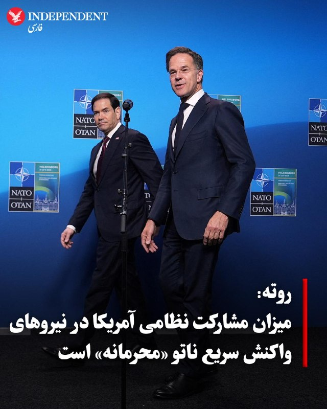

♦️مارک روته، دبیرکل ناتو، روز جمعه اول خرداد از ارائه جزئیات درباره برنامه‌های احتمالی ایالات متحده برای کاهش سهم توانمندی‌های نظامی خود جهت کمک به اروپا در بحران‌های بزرگ، خودداری کرد.

روته با اشاره به اینکه مشارکت آمریکا در طرح موسوم به «مدل نیروی ناتو» در حال بررسی است، تاکید کرد که ایالات متحده «نمی‌تواند هم‌زمان در همه جا حضور داشته باشد»، اما افزود که نمی‌تواند وارد جزئیات این موضوع شود.

دبیرکل ناتو پس از نشست وزرای کشورهای عضو ناتو در سوئد به خبرنگاران گفت: «البته این مسئله به شدت طبقه‌بندی‌شده و محرمانه است، چون ما نمی‌خواهیم اطلاعاتی به کسی بدهیم؛ اما این یک فرآیند در جریان است و چیز جدیدی نیست.»

او در ادامه افزود: «ما می‌دانیم که ایالات متحده باید این موضوع را بسنجد که در صورت مواجهه با تهدیدات متعدد، چگونه می‌توان مطمئن شد که همه توانمندی‌ها و ابزارهای کلیدی و پشتیبانی در هر جایی که به آن‌ها نیاز داریم، حضور داشته باشند.»
‌🇸🇦 Indypersian

🤖 @VahidOOnLine

## VahidOOnLine — post 241522

  

احمد مطهری‌اصل، امام جمعه تبریز، خطاب به دونالد ترامپ گفت: «ما به گفته‌هایمان عمل می‌کنیم.» او افزود جمهوری اسلامی تاکنون می‌گفت جنگ را منطقه‌ای می‌کند، اما اکنون هشدار می‌دهد که اگر خلاف کنید، جنگ را بین‌المللی خواهیم کرد.

مطهری‌اصل همچنین گفت «تمام خسارت‌های جنگ» از کشتی‌ها گرفته خواهد شد و از امروز فیبر نوری اینترنت بین‌المللی که از سواحل جمهوری اسلامی می‌گذرد، «مشمول هزینه» است و در غیر این صورت، «اینترنت بین‌المللی» قطع خواهد شد.

او در ادامه گفت جمهوری اسلامی هشدار داده بود با حزب‌الله و لبنان کاری نداشته باشند، اما اسرائیل گوش نمی‌دهد و اگر به کشتن «عزیزان مقاومت» ادامه دهد، باب‌المندب نیز به دستور مجتبی خامنه‌ای، رهبر جمهوری اسلامی، بسته خواهد شد.
‌🏁 🇬🇧 IranintlTV

🤖 @VahidOOnLine

## VahidOOnLine — post 241521

  <a href="telegram/content/VahidOOnLine_241521_1779457651.mp4" target="_blank">🎬 Download video</a>

یک شهروند در پیامی به ایران اینترنشنال با اشاره به وضعیت معیشتی و اقتصادی بد مردم می‌گوید خلبان و مهماندار هواپیمایی را می‌شناسد که برای درآمد کافی مسافرکشی می‌کنند. بازخوانی پیام این شهروند و ساخت تصویر با هوش مصنوعی انجام گرفته است.
‌🏁 🇬🇧 IranintlTV

🤖 @VahidOOnLine

## VahidOOnLine — post 241520

  <a href="telegram/content/VahidOOnLine_241520_1779457653.mp4" target="_blank">🎬 Download video</a>

ویدیوی ارسالی یک شهروند به ایران اینترنشنال نشان می‌دهد روز جمعه در پی بحران سوخت و شلوغی جایگاه‌های سوخت در شهرهای ایران در ایرانشهر، سیستان و بلوچستان، صف طولانی بنزین شکل گرفته است.
‌🏁 🇬🇧 IranintlTV

🤖 @VahidOOnLine

## VahidOOnLine — post 241519

  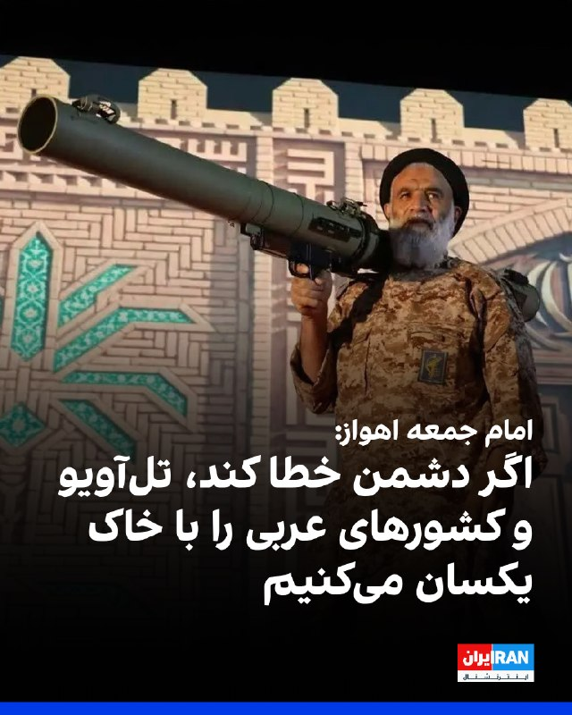

محمدنبی موسوی‌فرد، امام جمعه اهواز، با هشدار به آنچه «محور عبری-عربی-غربی» خواند، گفت

او افزود جمهوری اسلامی آغازگر جنگ نبوده، اما «آن‌قدر مشت محکمی بر دهان آمریکا» خواهد کوبید تا «بازدارندگی کامل» محقق شود.

موسوی‌فرد همچنین گفت «عده‌ای ضعیف‌الایمان» از ترس به «وعده‌های پوچ استکبار» دل خوش کرده‌اند و کسانی که «نسخه تسلیم» می‌پیچند، «ترسو و زبون» هستند.

امام جمعه اهواز افزود تا پای جان بر سر عهد خود با مجتبی خامنه‌ای، رهبر جمهوری اسلامی، ایستاده‌ایم و فریب «لبخند فریبکارانه دشمن» را نخواهیم خورد.

او همچنین گفت اگر امروز در برابر «بدحجابی» سکوت شود، فردا باید شاهد «برهنگی محض» بود.
‌🏁 🇬🇧 IranintlTV

🤖 @VahidOOnLine

## VahidOOnLine — post 241518

  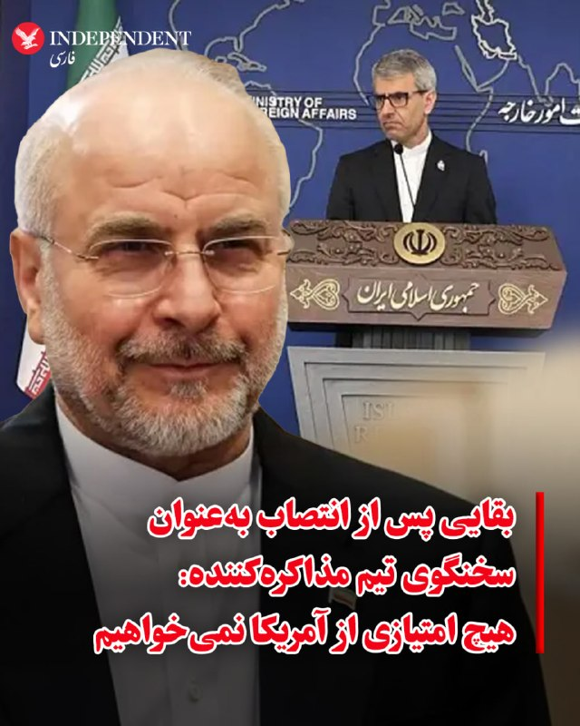

♦️محمدباقر قالیباف، رئیس مجلس جمهوری اسلامی و رئیس هیئت مذاکره‌کننده «میناب ۱۶۸»، اسماعیل بقائی، سخنگوی وزارت امور خارجه، را به‌عنوان سخنگوی این هیئت منصوب کرد. بقائی در این سمت مسئول اطلاع‌رسانی و تشریح مواضع تیم مذاکره‌کننده خواهد بود.
بقائی پس از این انتصاب گفت: «وقتی درباره امتیاز صحبت می‌کنیم، باید دقیق باشیم؛ ما هیچ امتیازی از ایالات متحده نمی‌خواهیم، بلکه صرفاً خواهان حقوق خود هستیم.» او با اشاره به دهه‌ها تحریم علیه ایران افزود این محدودیت‌ها به بهانه «تهدید هسته‌ای» اعمال شده، در حالی که ایران تهدیدی برای هیچ کشوری نبوده است.
سخنگوی وزارت خارجه همچنین خواستار پایان تحریم‌ها، آزادسازی دارایی‌های مسدودشده ایران و رفع آنچه «محاصره دریایی» در تنگه هرمز خواند شد و این اقدامات را برخلاف حقوق بین‌الملل توصیف کرد.
‌🇸🇦 Indypersian

🤖 @VahidOOnLine

## VahidOOnLine — post 241517

  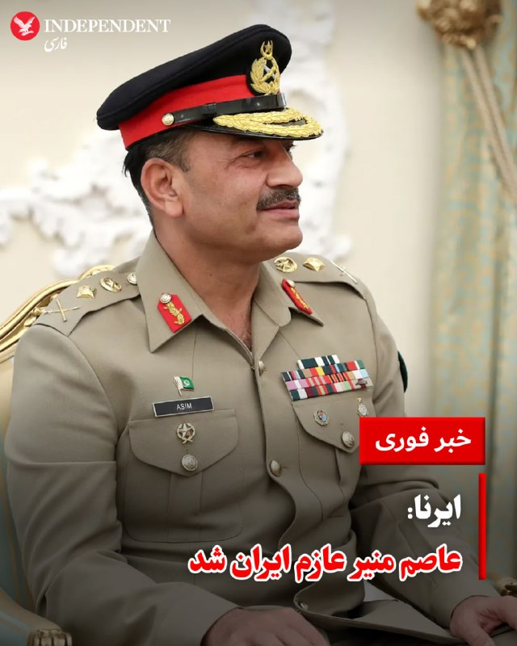

♦️ خبرگزاری دولتی ایرنا روز جمعه اول خرداد به نقل از «یک منبع دیپلماتیک در اسلام‌آباد» گزارش داد که عاصم منیر، فرمانده کل ارتش پاکستان، اسلام‌آباد را به مقصد تهران ترک کرده است. این سفر همزمان با حضور محسن رضا نقوی، وزیر کشور پاکستان در تهران انجام می‌شود.

این گزارش در حالی مطرح شد که طاهر اندرابی، سخنگوی وزارت خارجه پاکستان در نشست خبری روز جمعه، اعلام کرد که گزارش‌های مربوط به سفر منیر به ایران را تایید یا رد نکرد.

مارکو روبیو، وزیر امور خارجه آمریکا روز گذشته به خبرنگاران گفت که «مقام‌های پاکستانی امروز به تهران سفر خواهند کرد». اندرابی این اظهارات روبیو را مربوط به حضور نقوی در تهران دانست.
‌🇸🇦 Indypersian

🤖 @VahidOOnLine

## VahidOOnLine — post 241516

  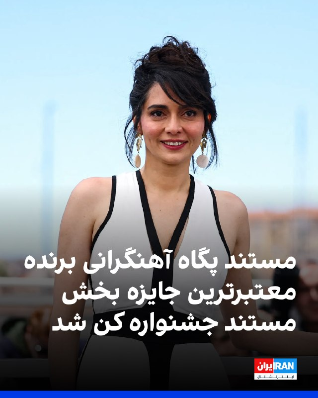

مستند «تمرین‌هایی برای یک انقلاب» ساخته پگاه آهنگرانی، جایزه «چشم طلایی» یا «لوئی دور» را در هفتاد و نهمین جشنواره فیلم کن دریافت کرد؛ جایزه‌ای که معتبرترین جایزه بخش مستند جشنواره کن محسوب می‌شود.

این مستند با استفاده از تصاویر آرشیوی، ویدیوهای خانوادگی و تصاویر اعتراض‌ها، به روایت بیش از چهار دهه تحولات سیاسی و اجتماعی ایران می‌پردازد. رسانه‌های سینمایی غربی، فیلم آهنگرانی را از آثار قابل توجه سیاسی و شخصی کن امسال توصیف کرده‌اند.
‌🏁 🇬🇧 IranintlTV

🤖 @VahidOOnLine

## VahidOOnLine — post 241515

  

با وجود آنکه از زمان انتصاب مجتبی خامنه‌ای به‌عنوان سومین رهبر جمهوری اسلامی، هیچ تصویر یا ویدیویی از او منتشر نشده، علیرضا زاکانی، شهردار تهران، در سخنرانی پیش از خطبه‌های نماز جمعه تهران گفت «قدرت و صلابت» او «فوق تصور» است.

زاکانی افزود نیروهای مسلح جمهوری اسلامی آماده‌اند «سیلی محکمی» به «دشمن آمریکایی» بزنند.

او گفت جمهوری اسلامی در جنگ اخیر، با وجود کشته شدن علی خامنه‌ای و شماری دیگر، اجازه نداده اهداف دشمن از جمله سرنگونی جمهوری اسلامی محقق شود.
‌🏁 🇬🇧 IranintlTV

🤖 @VahidOOnLine

## VahidOOnLine — post 241512

اطلاعیه منوتو درباره پایان پخش برنامه‌ها
‌🏁 🇬🇧 ManotoTV

🤖 @VahidOOnLine

## VahidOOnLine — post 241511

  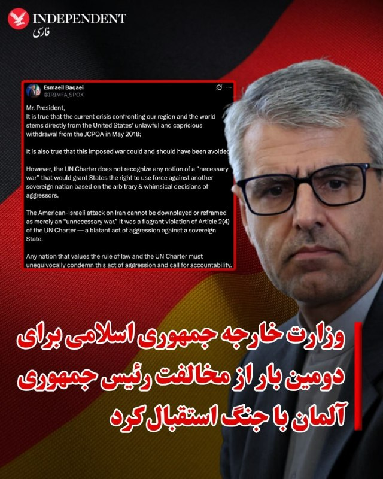

♦️اسماعیل بقایی، سخنگوی وزارت امور خارجه جمهوری اسلامی روز جمعه اول خردادماه با انتشار پیامی در اکس، از انتقاد فرانک اشتاینمایر، رئیس جمهوری آلمان از جنگ استقبال کرد.

اشتاینمایر، رئیس جمهوری آلمان یک روز پیش از این به یکی از رسانه‌های آلمان گفته بود که جنگ آمریکا و اسرائیل با جمهوری اسلامی «غیرضروی» و «قابل اجتناب» بود.

این دومین بار است که رئیس جمهوری آلمان، مواضعی متفاوت با موضع صدراعظم این کشور در قبال جنگ آمریکا و اسرائیل با جمهوری اسلامی اتخاذ می‌کند. پیش از این و در روزهای نخستین جنگ اخیر، اشتاینمایر، برخلاف فردریش مرتس، از حمله اسرائیل و آمریکا به ایران انتقاد کرده بود.
‌🇸🇦 Indypersian

🤖 @VahidOOnLine

## VahidOOnLine — post 241510

  <a href="telegram/content/VahidOOnLine_241510_1779457661.mp4" target="_blank">🎬 Download video</a>

یک شهروند در پیامی به ایران اینترنشنال از گرانی‌ اجناس و خوراکی‌ها گفت. بازخوانی پیام او و ساخت تصویر با هوش مصنوعی انجام گرفته است.
‌🏁 🇬🇧 IranintlTV

🤖 @VahidOOnLine

## VahidOOnLine — post 241509

  <a href="telegram/content/VahidOOnLine_241509_1779457663.mp4" target="_blank">🎬 Download video</a>

مارکو روبیو، وزیر خارجه آمریکا، در نشست خبری مشترک با مارک روته، دبیرکل ناتو، گفت تلاش جمهوری اسلامی برای ایجاد نظام عوارض‌گیری در یک آبراه بین‌المللی قابل قبول نیست و نباید اجازه داده شود چنین اقدامی در تنگه هرمز رخ دهد.

روبیو در این نشست که در حاشیه نشست وزیران خارجه ناتو در سوئد برگزار شد، گفت آمریکا می‌کوشد این موضوع را از مسیر سازمان ملل پیگیری کند و به نتیجه برساند. او افزود تقریبا همه کشورهایی که در این نشست حضور داشتند، از قطعنامه مربوط به این موضوع حمایت کرده‌اند یا به احتمال زیاد به آن خواهند پیوست.
‌🏁 🇬🇧 ManotoTV

🤖 @VahidOOnLine

## VahidOOnLine — post 241508

  <a href="telegram/content/VahidOOnLine_241508_1779457664.mp4" target="_blank">🎬 Download video</a>

پریتی پتل، وزیر خارجه سایه بریتانیا، در سخنانی در مجلس عوام این کشور گفت هرچه از برنامه هسته‌ای جمهوری اسلامی باقی مانده، باید برچیده شود و اورانیوم غنی‌شده موجود نیز باید از ایران خارج شود.

به گزارش متن رسمی نشست مجلس عوام بریتانیا، این سخنان روز پنجشنبه ۳۱ اردیبهشت در جریان جلسه‌ای درباره خاورمیانه مطرح شد. او گفت اورانیوم غنی‌شده‌ای که جمهوری اسلامی اکنون در اختیار دارد باید خارج شود و باید از چگونگی سوءاستفاده جمهوری اسلامی از توافق سال ۱۳۹۴ درس گرفت.

پتل از دولت بریتانیا خواست روشن کند آیا این موضع، موضع رسمی دولت نیز هست یا نه. او گفت شفافیت دولت درباره این موضوع «بسیار مهم» است و سپس پرسید موضع دولت در قبال توان موشکی و نظامی ایران چیست.
‌🏁 🇬🇧 ManotoTV

🤖 @VahidOOnLine

## VahidOOnLine — post 241507

روایت شما از زندگی در آتش‌بس- جمعه ۱ خرداد ۱۴۰۵

🔹 از کرمانشاه: من دانشجوی دندان‌پزشکی هستم. کلاس‌ها به‌صورت مجازی شده و درس‌های عملی را اصلاً نمی‌توانیم به‌طور مجازی یاد بگیریم. به ما می‌گویند وسیله بگیرید خودتان در خانه انجام بدهید. همه وسیله‌ها قیمتش چند برابر شده.
🔹 در مشهد فقر و فلاکت بیداد می‌کند. متأسفانه ۷۰٪ واحدهای اقامتی این شهر و بیشتر هتل‌ها خالی از مسافرند و تعدیل نیرو کرده‌اند و آژانس‌های مسافرتی یکی پس از دیگری در حال جمع کردن هستند، هیچ‌کس هم به فکر نیست.
🔹 از مشهد پیام می‌دم. یه قانون مسخره گذاشتن کافه‌ها و گیم‌سنترها باید ساعت ۱۱ شب به خاطر انرژی ببندن. کسی نیست بهشون بگه بیشتر مشتری‌های ما تایم شب میان. مغازه ما رو بدون اخطار پلمپ کردن. چند نفر از مغازه نون می‌خوردن، گفتن باید ۷۲ ساعت پلمپ باشید.
🔹 سفره مردم قربانی سیاستی می‌شود که پایانش معلوم نیست.
🔹 خواهش می‌کنم صدای ما دانشجوهای کارشناسی باشید. ما آموزش حضوری می‌خواهیم و از آموزش مجازی هیچ بهره‌ای نمی‌بریم.
🔹 این‌همه فیلم و سند از جنایات علیه مردم ایران منتشر شده، از قتل‌عام ۱۸ و ۱۹ دی تا احکام اعدام و تجاوز به زندانیان و... پس سازمان‌های بین‌المللی حقوق بشر کجایند؟ خجالت بکشید.
🔹 به‌خاطر جنگ و گرانی اجناس و مواد اولیه و بی‌پولی مردم، ورشکست شدم و مجبور شدم کارگاه تولیدی را ببندم و چند کارگر بیکار شدند. تمام دستگاه‌ها را نصف قیمت فروختم چون توانایی پرداخت اجاره نداشتم. اقتصاد ایران رسماً ورشکسته است. خدا بهمون کمک کنه.
🔹 آیا می‌دانید اگر هر روز یک دونه چیپس بخرید، کل حقوق ماهیانه‌تان به باد می‌رود؟ تو فقط بشین و تماشا کن.
🔹 ناامید دشمن است. هیچ کشوری با زور نتوانسته به مردمش حکومت کند. خون‌هایی که دادیم قطعاً پایمال نخواهد شد. به امید پیروزی.
🔹 از خوی پیام می‌دم. از اول گفتم تا آخر هم می‌گم ایران با یک رهبر وطن‌پرست مثل شاهزاده پهلوی ایران می‌شود.
‌🏁 🇬🇧 IranintlTV

🤖 @VahidOOnLine

## WithYashar — post 11959

## WithYashar — post 11958

  <a href="telegram/content/WithYashar_11958_1779457666.mp4" target="_blank">🎬 Download video</a>

🎬 Video

## WithYashar — post 11957

امشب مراسم دعای سرخپوستی در اتاق جنگ برگزار میکنیم 💨😬😂🙌🏾

## WithYashar — post 11956

الجزیره: شهباز شریف، نخست‌وزیر پاکستان، قصد دارد فردا به چین سفر کند. برداشت این است که او پیام‌هایی را از تهران به پکن می‌برد.
پاکستان در حال تعامل با بازیگران متعددی است: آمریکا، ایران، کشورهای منطقه و البته چین.
@withyashar

## WithYashar — post 11955

رویترز به نقل از منابع آگاه:
قطر با هماهنگی آمریکا تیم مذاکره کننده‌ای رو برای کمک به دستیابی به توافق برای پایان جنگ با ایران به تهران اعزام کرده.
@withyashar
این هیئت دقایقی پیش به تهران رسید

## WithYashar — post 11954

مارک لوین تحلیلگر و از نزدیکان ترامپ :

"زمان نابودی رژیم ایران فرا رسیده است. بیایید کار را تمام کنیم.
بگذارید کار را به انجام رسانیم.
تیک‌تاک ساعت را می‌شنوید."
@withyashar

## WithYashar — post 11953

## WithYashar — post 11952

وال استریت ژورنال: ترامپ درحال بررسی امکان تکیه بر گروه‌های مخالف مسلح ایرانی، از جمله جناح‌های کرد، در صورت اقدام مسلحانه اونا برعلیه دولت تهرانه.
@withyashar

## WithYashar — post 11951

## WithYashar — post 11950

یجور دایرکت میدید که انگار من این چند ماه قصه حسین کرد شبستری تعریف میکدم !!!🤬 بد میگین عصبی‌نشو

## WithYashar — post 11949

ادعای الحدث: عاصم منیر، فرمانده ارتش پاکستان در راه تهران است. @withyashar

## WithYashar — post 11948

خضریان، عضو کمیسیون امنیت ملی مجلس: جمهوری اسلامی در خصوص خروج اورانیوم از ایران هیچ مصالحه‌ای انجام نخواهد داد
@withyashar

## WithYashar — post 11947

ادعای الحدث: عاصم منیر، فرمانده ارتش پاکستان در راه تهران است.
@withyashar

## WithYashar — post 11946

تلویزیون منو‌تو : به اطلاع مخاطبان گرامی می‌رسانیم که پس از مدت‌ها تامل و ارزیابی، سرانجام به این تصمیم دشوار رسیده‌ایم که به پخش برنامه‌های منوتو پایان دهیم. آخرین پخش ما از ماهواره و یوتیوب، شامگاه ۲۴ مه ۲۰۲۶ (۳ خرداد ۱۴۰۵) خواهد بود.
@withyashar 🥲

## WithYashar — post 11945

بقائی: مرحله بعدی جنگ، قابل کنترل نیست / آمریکایی‌ها در حال ارسال سلاح به منطقه هستند
@withyashar

## WithYashar — post 11944

  <a href="https://t.me/withyashar/11944" target="_blank">📎 Download file</a>

🌐 @withyashar

🌐 instagram.com/yashar

## WithYashar — post 11943

یاشار میدونی
تو همیشه خط شکن بودی
اون زمان که کسی رپ رو نمیشناخت و همه اش ریسک بود
تو رپفا رو اوردی، که خود من سالها ازش استفاده میکردم

الانم کانالت، نحوه جدید و درست برخورد با اخبار و تحلیل های سیاسی رو داره میده که برای امروز خوبه و مخاطب بدون ترس و تردید میتونه دنبالت کنه

واقعا کار درست، خوش فکر و درجه یکی
و این یکی برای تو فقط زحمت هست ولی مثل همیشه پای کار هستی

## WithYashar — post 11942

فاکس نیوز: مذاکرات بین ایالات متحده و ایران همچنان در جریان است، با نشانه‌هایی از خوش‌بینی محتاطانه که هر دو طرف ممکن است در نهایت به توافق برسند
@withyashar

## WithYashar — post 11941

poshte-pardehaye-enghelab (@withyashar).pdf

## WithYashar — post 11940

عمو ترامپ در‌ تروث : رکورد جدید بازار سهام!
@withyashar
یاشار : عمو باز ببین اگه کمه ما گلریزون میکنیم بقیشو ولی ‌زودتر بزن😂

## mwarmonitor — post 9479

📰 رویترز: بر اساس منابع مطلع، قطر یک هیئت مذاکره‌کننده به تهران اعزام کرده است که با هماهنگی ایالات متحده فعالیت می‌کند تا به دستیابی به توافقی برای پایان دادن به جنگ با ایران کمک کند.

@mwarmonitor

## mwarmonitor — post 9478

🔹نخست‌وزیر هلند، Rob Jetten، می‌گوید دولت هلند با اعمال ممنوعیت واردات کالاهایی که در شهرک‌های یهودی در سرزمین‌های فلسطینی تحت اشغال اسرائیل تولید می‌شوند موافقت کرده است.

@mwarmonitor

## mwarmonitor — post 9477

🔸وزیر خارجه اوکراین، Andrii Sybiha، می‌گوید مذاکرات میان روسیه که با میانجی‌گری آمریکا انجام می‌شود به‌تدریج به نقطه فرسودگی و بن‌بست نزدیک می‌شود.

@mwarmonitor

## mwarmonitor — post 9476

🔴رئیس سازمان جهانی بهداشت (WHO) می‌گوید هلند یک مورد جدید ابتلا به ویروس هانتا را در یکی از خدمه یک کشتی تأیید کرده است.

@mwarmonitor

## mwarmonitor — post 9475

  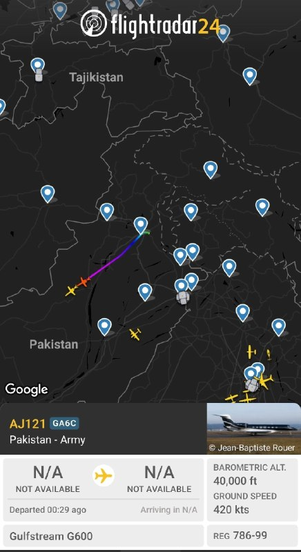

🔴رسانه‌های ایرانی به نقل از یک منبع دیپلماتیک در اسلام‌آباد: فرمانده ارتش پاکستان به ایران سفر کرده است. @mwarmonitor

## mwarmonitor — post 9474

🛸مرحله دوم از افشای پدیده‌های ناشناخته هوایی (UAP) توسط وزارت دفاع آمریکا منتشر شده است که شامل ۵.۶ گیگابایت ویدئو و بیش از ۷۰ مگابایت اسناد طبقه‌بندی‌زدایی‌شده می‌شود.

@mwarmonitor

## mwarmonitor — post 9473

🔴رسانه‌های ایرانی به نقل از یک منبع دیپلماتیک در اسلام‌آباد: فرمانده ارتش پاکستان به ایران سفر کرده است.

@mwarmonitor

## mwarmonitor — post 9472

🔴«محمدباقر قالیباف، رئیس هیئت مذاکره‌کننده ایران، با صدور حکمی اسماعیل بقایی را به‌عنوان سخنگوی هیئت مذاکره‌کننده منصوب کرد.»

@mwarmonitor

## mwarmonitor — post 9471

🔸مارکو روبیو می‌گوید به دبیرکل NATO گفته است که این ائتلاف باید در نشست پیشِ‌روی آنکارا متعهد شود به‌سرعت ظرفیت تولیدات دفاعی را افزایش دهد، پایه صنعتی دفاعی فرا‌آتلانتیکی را گسترش دهد و تعهدات مربوط به هزینه‌های دفاعی را به توانمندی‌های واقعی رزمی تبدیل کند.

@mwarmonitor

## mwarmonitor — post 9470

  <a href="telegram/content/mwarmonitor_9470_1779457668.mp4" target="_blank">🎬 Download video</a>

🔴گفت‌وگوهای آمریکا و ایران همچنان در جریان است و نشانه‌هایی از خوش‌بینی محتاطانه وجود دارد که نشان می‌دهد دو طرف ممکن است در نهایت به یک توافق دست پیدا کنند.

🔸هم‌زمان، ایران در حال ادامه تلاش‌ها برای نمایش قدرت در اطراف تنگه هرمز است و بنا بر گزارش‌ها می‌کوشد یک سامانه جدید برای دریافت عوارض در این منطقه ایجاد کند.

🔹رئیس‌جمهور ترامپ می‌گوید هرگونه دریافت عوارض در این آبراه غیرقابل‌قبول است و تأکید می‌کند که نباید به ایران اجازه داده شود به سلاح هسته‌ای دست یابد؛ در غیر این صورت آمریکا ناچار خواهد شد «اقدامی بسیار شدید» انجام دهد. – فاکس‌نیوز

@mwarmonitor

## FoxNewsTwitter — post 342096

‌Fox News (Twitter/X)

Who will win the American Music Award for New Artist of the Year?

Our sponsor Kalshi’s prediction market reveals the current frontrunners:
— Olivia Dean: 46%
— Ella Langley: 23%
— SOMBR: 18%

https://www.foxnews.com/entertainment/ella-langleys-behind-the-scenes-acm-awards-video-has-fans-crying-all-over-again-after-record-breaking-night

## FoxNewsTwitter — post 342095

  <a href="telegram/content/FoxNewsTwitter_342095_1779457670.mp4" target="_blank">🎬 Download video</a>

Fox News (Twitter/X)

NEW: Secretary of State Marco Rubio jokes about his visit to Sweden, comparing the weather to his home state of Florida while teasing hosts about the country's early sunrises.

"They keep apologizing to me for the weather. There's nothing wrong with this weather. Miami is 95 degrees with mosquitoes and humidity this time of year.

"But your sunrises are way too early."

## FoxNewsTwitter — post 342094

  

Fox News (Twitter/X)

“No talent, no ratings, no life. He was like a dead person.”

President Trump wasted no time celebrating Stephen Colbert’s exit from late-night television as Colbert wrapped up his 11-year run after CBS canceled 'The Late Show with Stephen Colbert' in 2025.

## FoxNewsTwitter — post 342093

  

Fox News (Twitter/X)

WATCH LIVE: Secretary Rubio speaks to reporters after meeting with NATO leaders https://twitter.com/i/broadcasts/1aJbdbjgejdKX

## FoxNewsTwitter — post 342092

  

Fox News (Twitter/X)

“See a problem, become a part of the solution.”

Erika Kirk is backing Spencer Pratt’s Los Angeles mayoral run, calling his campaign “authentically American” and “refreshing” because he isn’t talking like a career politician.

She says Pratt’s message should inspire more Americans to run, get involved, and fight for what makes the country exceptional.

## FoxNewsTwitter — post 342088

Fox News (Twitter/X)

Secretary of State Marco Rubio meeting with NATO leaders oversees for a major summit and signing in Sweden.

The new technology cooperation agreement was signed by Rubio and Swedish officials during a high-level gathering focused on NATO coordination, defense cooperation, and strengthening Western technology partnerships.

The meeting comes as the Trump administration pushes allies to increase defense spending while also deepening economic and tech ties across Europe.

## FoxNewsTwitter — post 342087

  

Fox News (Twitter/X)

Nancy Mace is proposing a ban on foreign-born citizens from serving in Congress, presidential cabinets, and becoming federal judges, arguing those positions should be reserved for natural-born American citizens.

The proposal would impact both Democrats and Republicans, including Rep. Ilhan Omar, Rep. Pramila Jayapal, Rep. Ted Lieu, Sen. Bernie Moreno, Rep. Young Kim, and several other lawmakers who immigrated to the U.S. before becoming citizens.

Mace suggests that naturalized citizens may have divided loyalty between the United States and their home countries, “For too long we have allowed foreign-born members to hold seats in this government, while making clear their loyalty is not here. We see it every day."

## FoxNewsTwitter — post 342086

  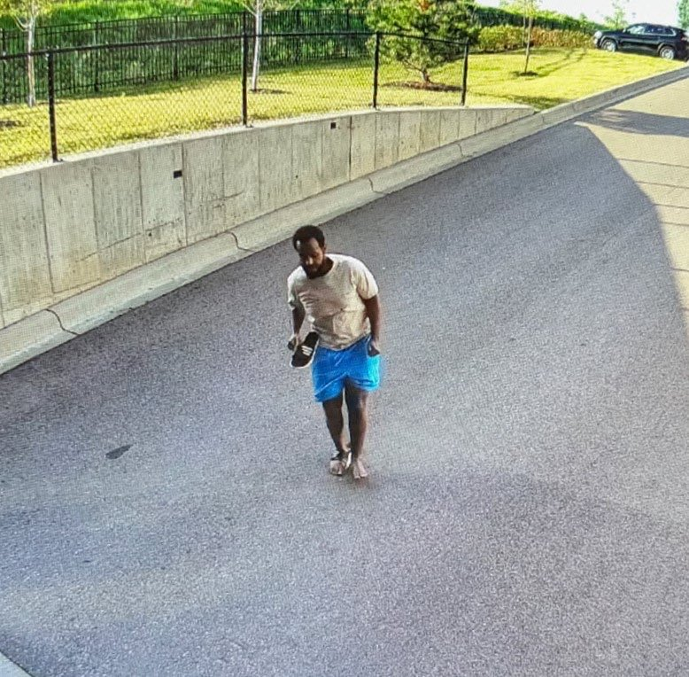

Fox News (Twitter/X)

NEW: Minnesota fraud suspect Muhammad Omar has been arrested after being publicly named during a major Department of Justice announcement.

FBI Director Kash Patel announcing Omar’s arrest hours after officials released video of him fleeing the scene while agents carried out a raid.

Federal authorities say Omar submitted millions in fraudulent Medicaid claims through two home health care companies for services he never provided, then diverting the proceeds for his personal benefit.

## FoxNewsTwitter — post 342085

  <a href="telegram/content/FoxNewsTwitter_342085_1779457675.mp4" target="_blank">🎬 Download video</a>

Fox News (Twitter/X)

JUST IN: U.S.-Iran talks are still underway, with signs of cautious optimism that both sides could eventually reach a deal.

At the same time, Iran is continuing efforts to project strength around the Strait of Hormuz while reportedly trying to build a new system to charge tolls in the region.

President Trump says any tolls in the waterway would be unacceptable and stressing that Iran cannot be allowed to develop a nuclear weapon or else the U.S. will be forced to "do something very drastic."

@Jeff_Paul reports.

## pm_afshaa — post 91198

  <a href="telegram/content/pm_afshaa_91198_1779457678.webm" target="_blank">🎬 Download video</a>

🔴مارکو روبیو، وزیر خارجه آمریکا:
باید تنگه هرمز کامل باز و آزاد باشه و ایران به طور کامل قید برنامه هسته‌ای رو بزنه!

💧 Rainbet.com the #1 Non-KYC Crypto Casino & Sportsbook @rainbetcom

😁 @Pm_Afshaa

## pm_afshaa — post 91197

یه هیئت قطری و ‌پاکستانی دارن میان تهران بله رو از عروس خانوم بگیرن

## pm_afshaa — post 91196

  <a href="telegram/content/pm_afshaa_91196_1779457678.webm" target="_blank">🎬 Download video</a>

🔴وال استریت ژورنال: ترامپ درحال بررسی امکان تکیه بر گروه‌های مخالف مسلح ایرانی، از جمله جناح‌های کرد، در صورت اقدام مسلحانه اونا برعلیه دولت تهرانه.

💧 Rainbet.com the #1 Non-KYC Crypto Casino & Sportsbook @rainbetcom

😁 @Pm_Afshaa

## pm_afshaa — post 91195

  <a href="telegram/content/pm_afshaa_91195_1779457679.webm" target="_blank">🎬 Download video</a>

🔴رویترز به نقل از منابع آگاه:
قطر با هماهنگی آمریکا تیم مذاکره کننده‌ای رو برای کمک به دستیابی به توافق برای پایان جنگ با ایران به تهران اعزام کرده.

💧 Rainbet.com the #1 Non-KYC Crypto Casino & Sportsbook @rainbetcom

😁 @Pm_Afshaa

## pm_afshaa — post 91194

  <a href="telegram/content/pm_afshaa_91194_1779457680.webm" target="_blank">🎬 Download video</a>

🔴اکسیوس: فرمانده ارتش پاکستان عاصم منیر، در تلاش برای بستن توافقنامه بین آمریکا و ایران و پایان جنگ، راهی تهران شد.

💧 Rainbet.com the #1 Non-KYC Crypto Casino & Sportsbook @rainbetcom

😁 @Pm_Afshaa

## pm_afshaa — post 91193

  <a href="telegram/content/pm_afshaa_91193_1779457680.webm" target="_blank">🎬 Download video</a>

🔴2 هواپیمای دولتی پاکستان از اسلام‌آباد، حرکت کرده و در مسیر تهران هستن.

💧 Rainbet.com the #1 Non-KYC Crypto Casino & Sportsbook @rainbetcom

😁 @Pm_Afshaa

## pm_afshaa — post 91192

  <a href="telegram/content/pm_afshaa_91192_1779457681.webm" target="_blank">🎬 Download video</a>

🔴وزیر نیروی دریایی ارتش آمریکا: دولت ترامپ فروش تسلیحات به ارزش 14 میلیارد دلار به تایوان رو متوقف کرد تا مهمات ایالات متحده رو برای جنگ با ایران حفظ کنه.

💧 Rainbet.com the #1 Non-KYC Crypto Casino & Sportsbook @rainbetcom

😁 @Pm_Afshaa

## pm_afshaa — post 91191

  <a href="telegram/content/pm_afshaa_91191_1779457682.webm" target="_blank">🎬 Download video</a>

🔴یک منبع دیپلماتیک در اسلام‌آباد به خبرنگار ایرنا: عاصم منیر، فرمانده ارتش پاکستان راهی ایران خواهد شد و قراره با مقامات بلندپایه جمهوری اسلامی دیدار کنه و پیامی رو آمریکا به ایران منتقل کنه. 
💧 Rainbet.com the #1 Non-KYC Crypto Casino & Sportsbook @rainbetcom…

## pm_afshaa — post 91190

  <a href="telegram/content/pm_afshaa_91190_1779457682.webm" target="_blank">🎬 Download video</a>

🔴یک منبع دیپلماتیک در اسلام‌آباد به خبرنگار ایرنا: عاصم منیر، فرمانده ارتش پاکستان راهی ایران خواهد شد و قراره با مقامات بلندپایه جمهوری اسلامی دیدار کنه و پیامی رو آمریکا به ایران منتقل کنه.

💧 Rainbet.com the #1 Non-KYC Crypto Casino & Sportsbook @rainbetcom

😁 @Pm_Afshaa

## pm_afshaa — post 91189

  <a href="telegram/content/pm_afshaa_91189_1779457683.webm" target="_blank">🎬 Download video</a>

🔴شبکه منوتو دوباره خدافظی کرد و از پایان پخش و اتمام فعالیتش خبر داد :

💧 Rainbet.com the #1 Non-KYC Crypto Casino & Sportsbook @rainbetcom

😁 @Pm_Afshaa

## pm_afshaa — post 91188

  <a href="telegram/content/pm_afshaa_91188_1779457684.webm" target="_blank">🎬 Download video</a>

🔴فاکس نیوز: مذاکرات بین آمریکا و ایران با نشانه هایی از خوش بینی محتاطانه هنوز در جریان است.

💧 Rainbet.com the #1 Non-KYC Crypto Casino & Sportsbook @rainbetcom

😁 @Pm_Afshaa

## DEJradio — post 4843

⭕️ مشاور رئیس امارات گفت تهران ممکن است از هر سلاحی که در دست داشته باشد استفاده کند

انور قرقاش، مشاور دیپلماتیک رئیس امارات متحدۀ عربی گفت رژیم حاکم بر ایران نشان داد قادر است از هر سلاحی که در اختیار دارد، استفاده کند.
او از کشورهای اروپایی خواست بحران تنگۀ هرمز را نه یک مشکل دوردست، بلکه مسئله‌ای مرتبط با انرژی و تجارت خود بدانند.
قرقاش روز آدینه در نشست امنیتی گلوبسک در پراگ، گفت هرگونه کنترل بر تنگۀ هرمز سابقه‌ای خطرناک ایجاد می‌کند. به گفتۀ او این موضوع در دست جمهوری اسلامی به یک ابزار سیاسی تبدیل می‌شود.
مشاور ارشد حاکم امارات افزود شانس دستیابی تهران و واشینگتن برای دستیابی به توافقی که به باز شدن تنگۀ هرمز منجر شود «پنجاه به پنجاه» است.
او گفت مقام‌های جمهوری اسلامی در سال‌های پیشین بارها توان و اهرم‌های قدرت خود را بیش از اندازۀ واقعی برآورد کردند.
مشاور رئیس امارات از سویی هشدار داد که برنامۀ هسته‌ای جمهوری اسلامی، اکنون به نخستین نگرانی ابوظبی تبدیل شده است.
او تأکید کرد امارات خواهان راه‌حل سیاسی است، اما نگران است که هر توافقی بدون حل ریشه‌ای بحران، به پیچیدگی‌های تازه در منطقه منجر شود.
قرقاش خطاب به مقامات غربی گفت اروپا باید بحران تنگۀ هرمز را مسئله خود بداند.

#امارات #جمهوری_اسلامی
@DEJradio

## DEJradio — post 4842

⭕️ روبیو: باجگیری جمهوری اسلامی در تنگۀ هرمز غیرقابل قبول است

مارکو روبیو، وزیر امور خارجۀ آمریکا، روز آدینه هشدار داد که اجرای هرگونه سیستم عوارض‌گیری از سوی جمهوری اسلامی در تنگۀ هرمز، غیرقابل پذیرش است.
روبیو پیش از نشست ناتو در هلسینگبورگ سوئد گفت این پیمان باید برای همۀ اعضای آن مفید باشد.
وزیر امور خارجۀ آمریکا تأکید کرد ناتو به‌سان هر ائتلافی، باید برای همۀ کسانی که در آن حضور دارند، خوب باشد.
روبیو پیش‌تر گفته بود دونالد ترامپ از برخی اعضای ناتو که اجازۀ استفاده از پایگاه‌هایشان برای جنگ علیه جمهوری اسلامی را نداده‌اند، «بسیار ناامید» است. او به‌طور مشخص از اسپانیا نام برده بود.

#مارکو_روبیو #تنگه_هرمز
@DEJradio

## DEJradio — post 4841

⭕️ مارک لوین: وقت نابودی جمهوری اسلامی است

مارک لوین، مفسر محافظه‌کار آمریکایی در شبکۀ اکس نوشت: وقت نابودی رژیم حاکم بر ایران است. بیایید کار را تمام کنیم.
این مجری و مفسر برجسته افزود: زمان دارد از دست می‌رود.
مارک لوین از چهره‌های نزدیک به جریان جمهوری‌خواه آمریکا است. لوین از حامیان سرسخت دونالد ترامپ و سیاست فشار حداکثری او علیه جمهوری اسلامی، به شمار می‌رود.

#جمهوری_اسلامی
@DEJradio

## DEJradio — post 4840

⭕️ خط قرمز آمریکا توقف غنی‌سازی و مهار جمهوری اسلامی است

لیندزی گراهام، سناتور جمهوری‌خواه آمریکا گفت دونالد ترامپ همچنان تأکید دارد که جمهوری اسلامی نباید اورانیوم‌ با غنای بالا را درون کشور نگه دارد.
او گفت این مواد می‌تواند برای ساخت «بمب کثیف» یا در آینده برای تولید سلاح هسته‌ای استفاده شود.
لیندزی گراهام افزود ترامپ همچنان بر جلوگیری کامل از دستیابی جمهوری اسلامی به سلاح هسته‌ای پافشاری می‌کند.
این سیاستمدار نزدیک به رئیس جمهوری آمریکا تأکید کرد بدون قابلیت غنی‌سازی، هیچ راهی برای دستیابی به سلاح هسته‌ای وجود ندارد.

#ترامپ #اورانیوم
@DEJradio

## DEJradio — post 4839

  <a href="telegram/content/DEJradio_4839_1779457684.webm" target="_blank">🎬 Download video</a>

🔺📢 رودرویی سـ.ـپاه و ارتش بعد از جنگ

*شهاب عنایتی، پرسنل پیشین نیروی هوایی

#جنگ #IRGCterrorists
@DEJradio

## DEJradio — post 4838

⭕️جمهوری اسلامی امکان جایگزینی سریع موشک‌های پیشرفته را ندارد

کامرون چل، مدیرعامل شرکت دراگان‌فلای، گزارش‌ها دربارۀ بازسازی سریع توان موشکی جمهوری اسلامی را زیر سؤال برد. او گفت توان تولید موشک در ایران در پی حملات اخیر آمریکا و اسرائیل به‌شدت آسیب دیده است.
این کارشناس دفاعی به فاکس‌نیوز گفت بسیار بعید است که جمهوری اسلامی بتواند انبار موشک‌های ماورای صوت یا کروز را در کوتاه‌مدت دوباره پر کند.
کامرون چل افزود ساخت این سلاح‌ها بسیار دشوار است و به تأسیساتی پیشرفته‌ نیاز دارد که بیشتر آن‌ها هدف حملات آمریکا قرار گرفته‌ است.
او همچنین گفت دسترسی جمهوری اسلامی به قطعات و تجهیزات مورد نیاز این سامانه‌ها اکنون بسیار سخت‌تر از پیش است.

#جمهوری_اسلامی #موشک
@DEJradio

## kianmeli1 — post 87553

🔴عاصم منیر، فرمانده ارتش پاکستان هم اکنون راهی تهران است.

انعقاد توافق؟ یا رساندن اولتیماتوم نهائی ترامپ؟
https://t.me/kianmeli1

## IranIntlTV — post 338422

  

کاوه راد، وکیل دادگستری، در پستی اینستاگرامی خبر داد امید بیات سرمدی، از بازداشت‌شدگان اعتراضات دی‌ماه، از سوی دادگاه انقلاب تهران به ۲۵ سال حبس محکوم شده است.

امید بیات سرمدی، ۲۳ دی ۱۴۰۴، بازداشت و به زندان تهران بزرگ منتقل شده بود.

وکیل او اعلام کرده که حکم ۲۵ سال حبس، غیرقطعی و قابل فرجام‌خواهی در دیوان عالی کشور است.
https://iranintl.com/202605226078

## IranIntlTV — post 338421

🔻مقام اماراتی: شانس توافق آمریکا و جمهوری اسلامی «پنجاه-پنجاه» است

انور قرقاش، مشاور دیپلماتیک رییس امارات متحده عربی، احتمال دستیابی تهران و واشینگتن به توافق را «پنجاه-پنجاه» ارزیابی کرد و هشدار داد دور تازه درگیری نظامی می‌تواند وضعیت منطقه را پیچیده‌تر کند.

به گزارش رویترز، قرقاش جمعه اول خرداد در کنفرانسی در پراگ گفت هرگونه توافق سیاسی میان تهران و واشینگتن باید ریشه‌های بی‌ثباتی در منطقه را حل کند تا از وقوع درگیری‌ها در آینده جلوگیری شود.

او ادامه داد: «نگرانی من این است که ایرانی‌ها همیشه بیش از حد مذاکره می‌کنند.»

قرقاش افزود: «این موضوع تازه‌ای نیست. آنها طی سال‌ها به‌دلیل تمایل به بزرگ‌نمایی برگ‌های خود، فرصت‌های زیادی را از دست داده‌اند. امیدوارم این بار چنین نکنند.»
در هفته‌های اخیر، پاکستان نقش میانجی را برای پایان جنگ میان آمریکا و جمهوری اسلامی ایفا کرده است؛ مناقشه‌ای که اقتصاد جهانی را تحت تاثیر قرار داده و تجارت در تنگه هرمز، مسیر عبور حدود یک‌پنجم صادرات جهانی نفت و گاز طبیعی مایع، را مختل کرده است.

سرنوشت ذخایر اورانیوم غنی‌شده و ادامه برنامه هسته‌ای جمهوری اسلامی از مهم‌ترین محورهای اختلاف دو طرف در جریان مذاکرات بوده است.

مشاور رییس امارات در ادامه سخنان خود گفت منطقه به راه‌حل سیاسی نیاز دارد و دور بعدی رویارویی نظامی می‌تواند به دشوارتر شدن شرایط بینجامد.

او هشدار داد اگر گفت‌وگوها تنها بر برقراری آتش‌بس متمرکز باشد و به حل‌وفصل «مسائل اصلی» نپردازد، ممکن است بستر درگیری‌های آینده را فراهم کند.

قرقاش تاکید کرد: «این چیزی نیست که ما به دنبال آن هستیم.»

به گزارش رویترز، جمهوری اسلامی از زمان آغاز جنگ اخیر، بارها امارات متحده عربی را هدف قرار داد و به زیرساخت‌های غیرنظامی و مناطق اطراف پایگاه‌های نظامی آمریکا در این کشور حمله کرد.

روزنامه اورشلیم‌پست ۲۷ اردیبهشت در مطلبی تحلیلی نوشت جمهوری اسلامی ممکن است حملات به امارات را تشدید کند.
قرقاش در ادامه هشدار داد هرگونه کنترل بر تنگه هرمز «رویه‌ای خطرناک» ایجاد می‌کند و این آبراه راهبردی را به ابزاری سیاسی تحت نفوذ جمهوری اسلامی تبدیل خواهد کرد.

او افزود هرگونه تغییر در وضعیت فعلی تنگه هرمز برای جامعه جهانی، از جمله اروپا، پیامدهای جدی به دنبال خواهد داشت و از کشورهای اروپایی خواست امنیت این آبراه را به‌طور مستقیم با امنیت انرژی و تجارت خود مرتبط بدانند.

این مقام اماراتی تاکید کرد تنگه هرمز باید به وضعیت پیش از جنگ بازگردد؛ وضعیتی که در آن، این گذرگاه به‌عنوان مسیر آزاد بین‌المللی برای انتقال انرژی، تجارت و کشتیرانی عمل می‌کرد.

مارکو روبیو، وزیر امور خارجه آمریکا، اول خرداد در سخنانی در حاشیه نشست ناتو، اقدامات تهران در تنگه هرمز را «غیرقابل قبول» خواند و گفت جمهوری اسلامی در پی جلب همراهی عمان و ایجاد سازوکاری برای دریافت عوارض در یک آبراه بین‌المللی است.

پیش‌تر فاکس‌نیوز با استناد به برخی گزارش‌ها نوشت تهران یک پلتفرم بیمه دیجیتال برای کشتی‌های باری فعال در تنگه هرمز راه‌اندازی کرده و تمامی پرداخت‌های این سامانه با بیت‌کوین تسویه می‌شود.
🔗وب‌سایت ایران‌اینترنشنال
@iranintltv

## IranIntlTV — post 338420

  <a href="telegram/content/IranIntlTV_338420_1779457686.mp4" target="_blank">🎬 Download video</a>

جاویدنامان انقلاب ملی ایرانیان
«پرهام آقامحمدی» در ۱۹ دی در محله کاشانی تهران در جریان اعتراضات توسط نیروهای سرکوب خامنه‌ای کشته شد. نامش در حافظه‌ این سرزمین می‌ماند و یادش چراغ راه آزادی‌خواهان است.
@iranintltv

## IranIntlTV — post 338419

مقام اماراتی: شانس توافق آمریکا و جمهوری اسلامی «پنجاه-پنجاه» است

انور قرقاش، مشاور دیپلماتیک رییس امارات متحده عربی، احتمال دستیابی تهران و واشینگتن به توافق را «پنجاه-پنجاه» ارزیابی کرد و هشدار داد دور تازه درگیری نظامی می‌تواند وضعیت منطقه را پیچیده‌تر کند.

به گزارش رویترز، قرقاش جمعه اول خرداد در کنفرانسی در پراگ گفت هرگونه توافق سیاسی میان تهران و واشینگتن باید ریشه‌های بی‌ثباتی در منطقه را حل کند تا از وقوع درگیری‌ها در آینده جلوگیری شود.

او ادامه داد: «نگرانی من این است که ایرانی‌ها همیشه بیش از حد مذاکره می‌کنند.»

قرقاش افزود: «این موضوع تازه‌ای نیست. آنها طی سال‌ها به‌دلیل تمایل به بزرگ‌نمایی برگ‌های خود، فرصت‌های زیادی را از دست داده‌اند. امیدوارم این بار چنین نکنند.»

در هفته‌های اخیر، پاکستان نقش میانجی را برای پایان جنگ میان آمریکا و جمهوری اسلامی ایفا کرده است؛ مناقشه‌ای که اقتصاد جهانی را تحت تاثیر قرار داده و تجارت در تنگه هرمز، مسیر عبور حدود یک‌پنجم صادرات جهانی نفت و گاز طبیعی مایع، را مختل کرده است.

سرنوشت ذخایر اورانیوم غنی‌شده و ادامه برنامه هسته‌ای جمهوری اسلامی از مهم‌ترین محورهای اختلاف دو طرف در جریان مذاکرات بوده است.

مشاور رییس امارات در ادامه سخنان خود گفت منطقه به راه‌حل سیاسی نیاز دارد و دور بعدی رویارویی نظامی می‌تواند به دشوارتر شدن شرایط بینجامد.

او هشدار داد اگر گفت‌وگوها تنها بر برقراری آتش‌بس متمرکز باشد و به حل‌وفصل «مسائل اصلی» نپردازد، ممکن است بستر درگیری‌های آینده را فراهم کند.

قرقاش تاکید کرد: «این چیزی نیست که ما به دنبال آن هستیم.»

به گزارش رویترز، جمهوری اسلامی از زمان آغاز جنگ اخیر، بارها امارات متحده عربی را هدف قرار داد و به زیرساخت‌های غیرنظامی و مناطق اطراف پایگاه‌های نظامی آمریکا در این کشور حمله کرد.

روزنامه اورشلیم‌پست ۲۷ اردیبهشت در مطلبی تحلیلی نوشت جمهوری اسلامی ممکن است حملات به امارات را تشدید کند.

قرقاش در ادامه هشدار داد هرگونه کنترل بر تنگه هرمز «رویه‌ای خطرناک» ایجاد می‌کند و این آبراه راهبردی را به ابزاری سیاسی تحت نفوذ جمهوری اسلامی تبدیل خواهد کرد.

او افزود هرگونه تغییر در وضعیت فعلی تنگه هرمز برای جامعه جهانی، از جمله اروپا، پیامدهای جدی به دنبال خواهد داشت و از کشورهای اروپایی خواست امنیت این آبراه را به‌طور مستقیم با امنیت انرژی و تجارت خود مرتبط بدانند.

این مقام اماراتی تاکید کرد تنگه هرمز باید به وضعیت پیش از جنگ بازگردد؛ وضعیتی که در آن، این گذرگاه به‌عنوان مسیر آزاد بین‌المللی برای انتقال انرژی، تجارت و کشتیرانی عمل می‌کرد.

مارکو روبیو، وزیر امور خارجه آمریکا، اول خرداد در سخنانی در حاشیه نشست ناتو، اقدامات تهران در تنگه هرمز را «غیرقابل قبول» خواند و گفت جمهوری اسلامی در پی جلب همراهی عمان و ایجاد سازوکاری برای دریافت عوارض در یک آبراه بین‌المللی است.

پیش‌تر فاکس‌نیوز با استناد به برخی گزارش‌ها نوشت تهران یک پلتفرم بیمه دیجیتال برای کشتی‌های باری فعال در تنگه هرمز راه‌اندازی کرده و تمامی پرداخت‌های این سامانه با بیت‌کوین تسویه می‌شود.
 
🔗وب‌سایت ایران‌اینترنشنال
@iranintltv

## IranIntlTV — post 338418

  <a href="telegram/content/IranIntlTV_338418_1779457688.mp4" target="_blank">🎬 Download video</a>

همزمان با هشتاد‌ و چهارمین روز خاموشی دیجیتال در ایران، کاربران رسانه‌های اجتماعی از دشوارتر شدن زندگی روزمره و آسیب به کسب‌وکارها نوشته‌اند.
آیه دریس، عضو تحریریه ایران‌اینترنشنال، از واکنش کاربران می‌گوید
@iranintltv

## IranIntlTV — post 338417

  <a href="telegram/content/IranIntlTV_338417_1779457690.mp4" target="_blank">🎬 Download video</a>

نماینده مجلس در یک تجمع مردمی گفت تعطیلی مجلس قانونی نیست و هیچ مصوبه‌ای از شورای عالی امنیت ملی برای آن وجود ندارد. او همچنین گفت مجلس را تعطیل کرده‌اند تا نمایندگان نتوانند درباره قانون مربوط به تنگه هرمز تذکر دهند یا نطق کنند و تاکید کرد مجلس هم وظیفه حمایت دارد و هم نظارت، و می‌تواند هم تشکر کند و هم تذکر دهد.
@iranintltv

## IranIntlTV — post 338416

  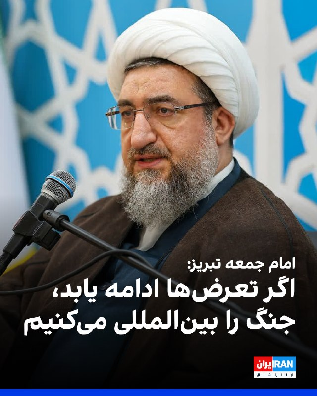

احمد مطهری‌اصل، امام جمعه تبریز، خطاب به دونالد ترامپ گفت: «ما به گفته‌هایمان عمل می‌کنیم.» او افزود جمهوری اسلامی تاکنون می‌گفت جنگ را منطقه‌ای می‌کند، اما اکنون هشدار می‌دهد که اگر خلاف کنید، جنگ را بین‌المللی خواهیم کرد.

مطهری‌اصل همچنین گفت «تمام خسارت‌های جنگ» از کشتی‌ها گرفته خواهد شد و از امروز فیبر نوری اینترنت بین‌المللی که از سواحل جمهوری اسلامی می‌گذرد، «مشمول هزینه» است و در غیر این صورت، «اینترنت بین‌المللی» قطع خواهد شد.

او در ادامه گفت جمهوری اسلامی هشدار داده بود با حزب‌الله و لبنان کاری نداشته باشند، اما اسرائیل گوش نمی‌دهد و اگر به کشتن «عزیزان مقاومت» ادامه دهد، باب‌المندب نیز به دستور مجتبی خامنه‌ای، رهبر جمهوری اسلامی، بسته خواهد شد.
https://iranintl.com/202605223119

## IranIntlTV — post 338415

  <a href="telegram/content/IranIntlTV_338415_1779457692.mp4" target="_blank">🎬 Download video</a>

یک شهروند در پیامی به ایران اینترنشنال با اشاره به وضعیت معیشتی و اقتصادی بد مردم می‌گوید خلبان و مهماندار هواپیمایی را می‌شناسد که برای درآمد کافی مسافرکشی می‌کنند. بازخوانی پیام این شهروند و ساخت تصویر با هوش مصنوعی انجام گرفته است.

## IranIntlTV — post 338414

  <a href="telegram/content/IranIntlTV_338414_1779457694.mp4" target="_blank">🎬 Download video</a>

ویدیوی ارسالی یک شهروند به ایران اینترنشنال نشان می‌دهد روز جمعه در پی بحران سوخت و شلوغی جایگاه‌های سوخت در شهرهای ایران در ایرانشهر، سیستان و بلوچستان، صف طولانی بنزین شکل گرفته است.

## IranIntlTV — post 338413

  <a href="telegram/content/IranIntlTV_338413_1779457697.mp4" target="_blank">🎬 Download video</a>

خبرگزاری رویترز گزارش داد بر اساس تصمیم جدید اتحادیه اروپا، افراد و نهادهایی که در محدود کردن آزادی کشتیرانی و اخلال در عبور قانونی کشتی‌ها در تنگه هرمز نقش داشته باشند، به فهرست تحریم‌های این اتحادیه اضافه خواهند شد.
لی‌لی نیکفر، خبرنگار ایران‌اینترنشنال، گزارش می‌دهد
@iranintltv

## IranIntlTV — post 338412

  

محمدنبی موسوی‌فرد، امام جمعه اهواز، با هشدار به آنچه «محور عبری-عربی-غربی» خواند، گفت

او افزود جمهوری اسلامی آغازگر جنگ نبوده، اما «آن‌قدر مشت محکمی بر دهان آمریکا» خواهد کوبید تا «بازدارندگی کامل» محقق شود.

موسوی‌فرد همچنین گفت «عده‌ای ضعیف‌الایمان» از ترس به «وعده‌های پوچ استکبار» دل خوش کرده‌اند و کسانی که «نسخه تسلیم» می‌پیچند، «ترسو و زبون» هستند.

امام جمعه اهواز افزود تا پای جان بر سر عهد خود با مجتبی خامنه‌ای، رهبر جمهوری اسلامی، ایستاده‌ایم و فریب «لبخند فریبکارانه دشمن» را نخواهیم خورد.

او همچنین گفت اگر امروز در برابر «بدحجابی» سکوت شود، فردا باید شاهد «برهنگی محض» بود.
https://iranintl.com/202605226113

## IranIntlTV — post 338411

🔻روسیه از کشته شدن ۴ نفر در حمله اوکراین به خوابگاه دانش‌آموزی خبر داد

مقام‌های روسیه اعلام کردند در حمله پهپادی شبانه اوکراین به یک خوابگاه دانش‌آموزی در منطقه لوهانسک، دست‌کم چهار نفر کشته و ۳۵ کودک زخمی شدند. هم‌زمان سازمان ملل خبر داد حمله موشکی روسیه به یکی از انبارهای این سازمان، یک میلیون دلار کمک بشردوستانه در اوکراین را نابود کرده است.

خبرگزاری رویترز جمعه اول خرداد به نقل از مقام‌های روسیه از حمله مرگبار به لوهانسک خبر داد و در عین حال تاکید کرد امکان تایید مستقل این گزارش را نداشته است و مقام‌های اوکراینی نیز تاکنون واکنشی به آن نشان نداده‌اند.

اوکراین در تلاش است کنترل منطقه لوهانسک را که روسیه در سال ۲۰۲۲ به‌طور یک‌جانبه به خاک خود ضمیمه کرد، بازپس بگیرد. کی‌یف تسلط مسکو بر این منطقه را «تصرف غیرقانونی» می‌داند.

یانا لانتراتوا، کمیسر حقوق بشر روسیه، در خصوص حمله به لوهانسک گفت هنگام وقوع این رویداد، ۸۶ نوجوان ۱۴ تا ۱۸ ساله در خوابگاه حضور داشتند و خواب بودند.

هر دو طرف جنگ هدف قرار دادن عمدی غیرنظامیان را رد می‌کنند.
لئونید پاسچنیک، مقام منصوب روسیه در لوهانسک، اعلام کرد دو نفر از زیر آوار بیرون کشیده شده‌اند و نیروهای امدادی همچنان در جست‌وجوی کودکانی هستند که احتمال می‌رود زیر آوار گرفتار شده باشند.

دمیتری پسکوف، سخنگوی کرملین، این رویداد را «جنایتی هولناک» توصیف کرد و گفت: «این حمله به یک مرکز آموزشی انجام شده؛ جایی که کودکان و جوانان حضور داشتند.»

او افزود اولویت فعلی، آواربرداری و کمک به افرادی است که همچنان زیر آوار گرفتار هستند.

تصاویر و ویدیوهایی که مقام‌های روسیه منتشر کرده‌اند، ساختمان‌های آسیب‌دیده، آتش‌سوزی و انتقال مجروحان از زیر آوار را نشان می‌دهد.

این حمله در حالی به وقوع پیوست که ولودیمیر زلنسکی، رییس‌جمهوری اوکراین، هفته گذشته پس از بازدید از محل حمله موشکی روسیه به یک ساختمان مسکونی در کی‌یف که ۲۴ کشته، از جمله سه کودک، برجا گذاشت، وعده «پاسخ» داده بود.
حمله به انبار کمیساریای عالی پناهندگان سازمان ملل در اوکراین

کمیساریای عالی پناهندگان سازمان ملل اعلام کرد انبار این نهاد که شامل تجهیزات اسکان اضطراری، زیرانداز و بسته‌های بهداشتی بود، چهارشنبه ۳۰ اردیبهشت در جریان حمله موشکی روسیه به شهر دنیپرو تخریب شد.

برنادت کاستل-هالینگورث، نماینده این سازمان در کی‌یف، گفت در این حمله دو نفر کشته شدند.

او افزود این کمک‌ها قرار بود میان آوارگان و افراد آسیب‌دیده از جنگ در مناطق خط مقدم اوکراین توزیع شود.

سازمان ملل اعلام کرد نابودی این محموله‌ها، دسترسی افراد نیازمند به کمک‌های حیاتی را در شرایطی که تخلیه ساکنان و آوارگی در مناطق جنگی ادامه دارد، دشوارتر می‌کند.

کاستل-هالینگورث ادامه داد: «این موضوع برای ما اهمیت زیادی دارد، زیرا نخستین بار است که یکی از تاسیسات کمیساریای عالی پناهندگان سازمان ملل هدف حمله قرار می‌گیرد.»

کمیساریای عالی پناهندگان سازمان ملل همچنین هشدار داد این حمله بخشی از روند گسترده‌تر حملات به کاروان‌ها و تاسیسات بشردوستانه در اوکراین است.
🔗وب‌سایت ایران‌اینترنشنال
@iranintltv

## IranIntlTV — post 338410

  

مستند «تمرین‌هایی برای یک انقلاب» ساخته پگاه آهنگرانی، جایزه «چشم طلایی» یا «لوئی دور» را در هفتاد و نهمین جشنواره فیلم کن دریافت کرد؛ جایزه‌ای که معتبرترین جایزه بخش مستند جشنواره کن محسوب می‌شود.

این مستند با استفاده از تصاویر آرشیوی، ویدیوهای خانوادگی و تصاویر اعتراض‌ها، به روایت بیش از چهار دهه تحولات سیاسی و اجتماعی ایران می‌پردازد. رسانه‌های سینمایی غربی، فیلم آهنگرانی را از آثار قابل توجه سیاسی و شخصی کن امسال توصیف کرده‌اند.
https://iranintl.com/202605229436

## IranIntlTV — post 338409

  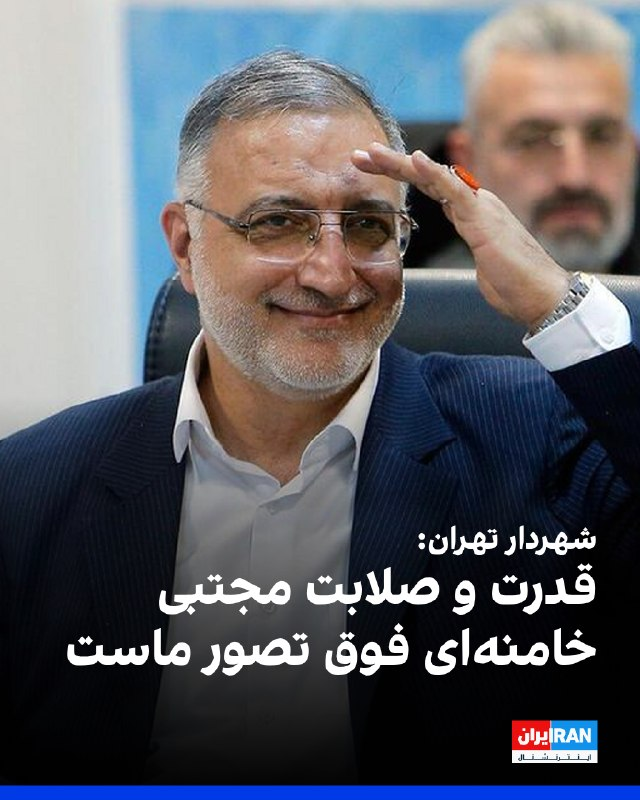

با وجود آنکه از زمان انتصاب مجتبی خامنه‌ای به‌عنوان سومین رهبر جمهوری اسلامی، هیچ تصویر یا ویدیویی از او منتشر نشده، علیرضا زاکانی، شهردار تهران، در سخنرانی پیش از خطبه‌های نماز جمعه تهران گفت «قدرت و صلابت» او «فوق تصور» است.

زاکانی افزود نیروهای مسلح جمهوری اسلامی آماده‌اند «سیلی محکمی» به «دشمن آمریکایی» بزنند.

او گفت جمهوری اسلامی در جنگ اخیر، با وجود کشته شدن علی خامنه‌ای و شماری دیگر، اجازه نداده اهداف دشمن از جمله سرنگونی جمهوری اسلامی محقق شود.
https://iranintl.com/202605220950

## IranIntlTV — post 338408

  <a href="https://t.me/IranintlTV/338408" target="_blank">📎 Download file</a>

🎧نسخه صوتی اخبار نیم‌روزی | جمعه ۱ خرداد
@iranintlTV

## IranIntlTV — post 338407

  <a href="telegram/content/IranIntlTV_338407_1779457701.mp4" target="_blank">🎬 Download video</a>

وزارت امور خارجه آمریکا اعلام کرد ۹ نفر را در لبنان به اتهام پیشبرد پروژه‌های حزب‌الله تحریم کرده است. در میان افراد تحریم‌شده، نام سفیر جمهوری اسلامی در بیروت و سه نماینده فراکسیون حزب‌الله در پارلمان لبنان دیده می‌شود.
جزییات بیشتر با می فرحات، خبرنگار ایران‌اینترنشنال
@iranintltv

## IranIntlTV — post 338406

  <a href="telegram/content/IranIntlTV_338406_1779457703.mp4" target="_blank">🎬 Download video</a>

یک شهروند در پیامی به ایران اینترنشنال از گرانی‌ اجناس و خوراکی‌ها گفت. بازخوانی پیام او و ساخت تصویر با هوش مصنوعی انجام گرفته است.

## IranIntlTV — post 338405

  <a href="telegram/content/IranIntlTV_338405_1779457705.mp4" target="_blank">🎬 Download video</a>

نهادهای حقوق بشری نسبت به وضعیت غلامرضا خانی‌ شکرآب، ورزشکار و زندانی سیاسی، که با اتهام «جاسوسی» بازداشت شده، هشدار داده‌اند. او به‌طور ناگهانی از بند امنیتی زندان اوین به سلول انفرادی در زندان قزل‌حصار منتقل شده است.
گفت‌وگو با رضا حاجی‌حسینی، روزنامه‌نگار
@iranintltv

## IranIntlTV — post 338404

🔻قطع اینترنت در ایران چگونه تصویر افکار عمومی را در فضای آنلاین تحریف می‌کند؟

🖋آرش سهرابی

در حالی که ۸۴ روز از قطع سراسری اینترنت در ایران می‌گذرد، فضای آنلاین و بخش نظرات درباره ایران بیش از آن‌که بازتابی واقعی از افکار عمومی باشد، تصویری محدود و کنترل‌شده را نشان می‌دهد. فضایی که زیر سایه دسترسی گزینشی و امتیاز اقتصادی کاربران، عملیات سایبری و ترس، شکل گرفته است.

خیابان‌ها و بخش نظرات آنلاین در ایران، بیش از پیش یک تصویر مشابه را بازتاب می‌دهند: «وحدت، مقاومت و وفاداری ...»

راهپیمایی‌های شبانه نیز تصاویر لازم را تولید می‌کنند: پرچم‌ها، پوسترها و جمعیت‌های سازمان‌دهی‌ شده.

هم‌زمان، زیر بسیاری از پست‌های مرتبط با ایران در شبکه‌های اجتماعی، موجی از حمایت از جمهوری اسلامی، تمجید از مواضع نظامی حکومت و حمله به منتقدان دیده می‌شود. همراه با پیام‌هایی در ستایش علی خامنه‌ای و جانشین هنوز دیده نشده‌اش، مجتبی خامنه‌ای.

اما آن‌چه در صفحه نمایش دیده نمی‌شود، جمعیتی است که پیش از آغاز بحث، از این فضا حذف شده‌اند.

اکنون پرسش فقط این نیست که مردم در اینترنت چه می‌گویند. سوال این است که چه کسانی امکان اتصال و اجازه، امنیت یا انگیزه صحبت کردن دارند.
میدان عمومی با آدم‌های حذف‌شده

بحران اخیر با یک قطع ناگهانی اینترنت آغاز نشد. در جریان خیزش دی‌ماه، اینترنت در ۱۹ دی ۱۴۰۴ قطع شد و تا ۹ بهمن همان سال به‌شدت محدود باقی ماند.

پس از آغاز حملات آمریکا و اسرائیل در ۹ اسفند ۱۴۰۴ نیز حکومت بار دیگر محدودیت‌های گسترده اینترنتی را اعمال کرد. محدودیت‌هایی که اکنون به پایان سومین ماه خود نزدیک می‌شوند.

در شرایط عادی، بخش نظرات در فضای آنلاین - با همه نقص‌هایش - محل برخورد دیدگاه‌های مختلف است، اما قطع اینترنت، ترکیب این فضا را تغییر می‌دهد.

بسیاری از کاربران عادی به استفاده از سرویس‌های داخلی محدود می‌شوند و برخی دیگر ناچارند استفاده از ابزارهای دور زدن فیلترینگ را محدود و جیره‌بندی کنند.
کسب‌وکارها ارتباط خود را با مشتریان از دست می‌دهند. دانشجویان به منابع آموزشی دسترسی ندارند و خانواده‌ها در خارج از کشور برای برقراری تماس روزمره با نزدیکان خود دچار مشکل می‌شوند.

در مقابل، کاربران نزدیک به حکومت، نهادهای مورد تایید و حساب‌های دارای دسترسی ویژه، همچنان در پلتفرم‌های جهانی فعال باقی می‌مانند.

این نابرابری پنهان هم نمانده است. دولت جمهوری اسلامی اسفند ۱۴۰۴ اعلام کرد برای برخی کاربران که توانایی «انتقال بهتر پیام» را دارند، دسترسی ویژه اینترنتی فراهم کرده است.

سخنگوی دولت از اصطلاح «سیم‌کارت سفید» استفاده نکرد، اما گفت این دسترسی به کسانی داده می‌شود که «می‌توانند پیام را بهتر منتقل کنند».

این همان «نمونه کنترل‌شده» است؛ نه کشوری که آزادانه سخن می‌گوید، بلکه جمعیتی محدودتر که هنوز اجازه سخن گفتن در فضای بیرونی را دارد.
وفاداری اجباری برای بازگشت به اینترنت

شاید مهم‌ترین بخش ماجرا فقط این نباشد که چه کسانی به اینترنت دسترسی دارند، بلکه این باشد که برخی افراد برای باز پس گرفتن دسترسی خود، چه کارهایی باید انجام دهند.

برخی ایرانیان که سیم‌کارت یا اینترنتشان به‌دلیل فعالیت آنلاین علیه جمهوری اسلامی مسدود شده، گفته‌اند از آن‌ها خواسته شده است برای بازگشت دسترسی، تعهدنامه دست‌نویس ارائه کنند، ضامن معرفی کنند و تولیداتی در حمایت از حکومت منتشر کنند.
همچنین از افراد خواسته شده نشانی منزل و محل کار، اطلاعات حساب بانکی، تصویر کارت بانکی و لینک حساب‌های شبکه‌های اجتماعی خود را ارائه دهند.

به ایشان هشدار داده شده است از انتشار مطالبی که به «امنیت روانی، اجتماعی یا سیاسی کشور» آسیب می‌زند، خودداری کنند و به برخی افراد گفته‌اند موظف‌اند دست‌کم ۲۰ پست در حمایت از جمهوری اسلامی منتشر و تصویر آن‌ها را به‌عنوان مدرک ارسال کنند.
به ایشان تاکید شده است این پست‌ها نباید یک‌باره منتشر شوند، بلکه باید با فاصله زمانی گذاشته شوند تا فعالیتشان طبیعی به نظر برسد.

🔗ادامه این گزارش را اینجا بخوانید
@iranintltv

## IranIntlTV — post 338403

🔻شهرداری سیاتل پیش از آغاز جام جهانی ۲۰۲۶، پرچم جمهوری اسلامی را روی ستون مونوریل این شهر نقاشی کرد اما شماری از ایرانیان ساکن سیاتل، نماد جمهوری اسلامی روی این پرچم را پاک کردند و نشان شیر و خورشید را جایگزین کردند.

🔹در روزهای گذشته، گزارش‌هایی درباره احتمال ممنوعیت ورود پرچم شیر و خورشید به ورزشگاه‌های میزبان جام جهانی، واکنش‌هایی را میان ایرانیان و فعالان سیاسی برانگیخته است.

🔹در پی انقلاب شیر و خورشید، ایرانیان خارج از کشور با در دست داشتن پرچم شیر و خورشید حمایت خود را از این انقلاب اعلام کردند.

@iranintltvsport

## Shin_Persian — post 6137

  

Shin ✓ @hey_itsmyturn
Fri, 22 May 2026 13:05:00 UTC

Munir might actually be on board one of these birds en route to Tehran.

فارسی

منیر ممکن است واقعاً در هواپیمای در حال پرواز به مقصد تهران باشد.

𝕏 · @shin_persian

## Shin_Persian — post 6136

  

↩️ Quoted tweet: Al Arabiya English @AlArabiya_Eng Fri, 22 May 2026 12:19:07 UTC 🔴 BREAKING: Pakistan’s army chief Asim Munir is en route to Iran’s Tehran, Al Arabiya sources say. ↩️ توییت نقل‌قول شده — برای پاسخ، پست زیر را ببینید. فارسی 🔴 فوری: منابع…

## Shin_Persian — post 6135

  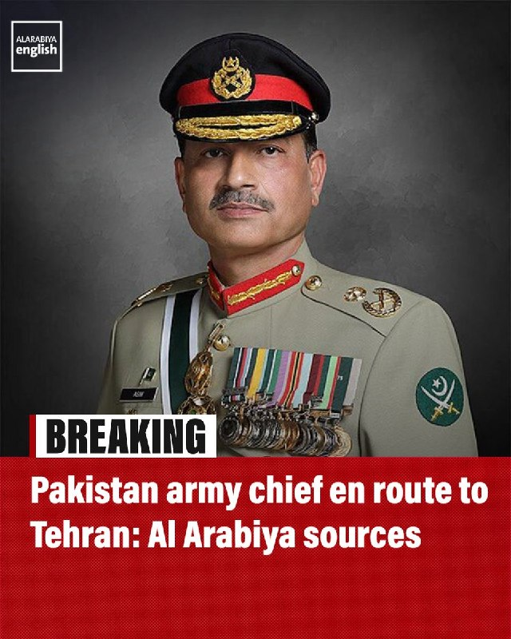

↩️ Quoted tweet:
Al Arabiya English @AlArabiya_Eng
Fri, 22 May 2026 12:19:07 UTC

🔴 BREAKING: Pakistan’s army chief Asim Munir is en route to Iran’s Tehran, Al Arabiya sources say.

↩️ توییت نقل‌قول شده — برای پاسخ، پست زیر را ببینید.

فارسی

🔴 فوری: منابع العربیه می‌گویند عاصم منیر، فرمانده ارتش پاکستان، در راه تهران، ایران است.

𝕏 · @shin_persian

## Shin_Persian — post 6134

Shin ✓ @hey_itsmyturn
Fri, 22 May 2026 11:37:26 UTC

Jet activity over Baghdad
#Iraq 🇮🇶

فارسی

فعالیت جنگنده‌ها بر فراز بغداد
#Iraq 🇮🇶

𝕏 · @shin_persian

## ManotoTV — post 105744

  <a href="telegram/content/ManotoTV_105744_1779457710.mp4" target="_blank">🎬 Download video</a>

هامبورگ؛ به‌مناسبت سالگرد ریزش ساختمان متروپل، جمعه اول خرداد ۱۴۰۵

## ManotoTV — post 105741

اطلاعیه منوتو درباره پایان پخش برنامه‌ها

## ManotoTV — post 105740

  <a href="telegram/content/ManotoTV_105740_1779457712.mp4" target="_blank">🎬 Download video</a>

مارکو روبیو، وزیر خارجه آمریکا، در نشست خبری مشترک با مارک روته، دبیرکل ناتو، گفت تلاش جمهوری اسلامی برای ایجاد نظام عوارض‌گیری در یک آبراه بین‌المللی قابل قبول نیست و نباید اجازه داده شود چنین اقدامی در تنگه هرمز رخ دهد.

روبیو در این نشست که در حاشیه نشست وزیران خارجه ناتو در سوئد برگزار شد، گفت آمریکا می‌کوشد این موضوع را از مسیر سازمان ملل پیگیری کند و به نتیجه برساند. او افزود تقریبا همه کشورهایی که در این نشست حضور داشتند، از قطعنامه مربوط به این موضوع حمایت کرده‌اند یا به احتمال زیاد به آن خواهند پیوست.

## ManotoTV — post 105739

  <a href="telegram/content/ManotoTV_105739_1779457714.mp4" target="_blank">🎬 Download video</a>

پریتی پتل، وزیر خارجه سایه بریتانیا، در سخنانی در مجلس عوام این کشور گفت هرچه از برنامه هسته‌ای جمهوری اسلامی باقی مانده، باید برچیده شود و اورانیوم غنی‌شده موجود نیز باید از ایران خارج شود.

به گزارش متن رسمی نشست مجلس عوام بریتانیا، این سخنان روز پنجشنبه ۳۱ اردیبهشت در جریان جلسه‌ای درباره خاورمیانه مطرح شد. او گفت اورانیوم غنی‌شده‌ای که جمهوری اسلامی اکنون در اختیار دارد باید خارج شود و باید از چگونگی سوءاستفاده جمهوری اسلامی از توافق سال ۱۳۹۴ درس گرفت.

پتل از دولت بریتانیا خواست روشن کند آیا این موضع، موضع رسمی دولت نیز هست یا نه. او گفت شفافیت دولت درباره این موضوع «بسیار مهم» است و سپس پرسید موضع دولت در قبال توان موشکی و نظامی ایران چیست.

## FarsiVOA — post 218360

مارکو روبیو، وزیر امور خارجه آمریکا، پس از دیدار با دبیرکل ناتو اعلام کرد اعضای این ائتلاف باید در نشست آینده آنکارا به‌طور جدی متعهد شوند که به‌سرعت تولیدات و صنایع دفاعی خود را گسترش دهند و تعهدات مالی خود را به «قابلیت‌های واقعی جنگی» تبدیل کنند. او گفت: «اروپای قوی‌تر به معنای ناتوی قوی‌تر است.»

@FarsiVOA

## FarsiVOA — post 218359

تعطیلی بی‌سابقه مجلس جمهوری اسلامی؛ جنگ قالیباف و جلیلی وارد فاز علنی شد

## FarsiVOA — post 218357

فرماندهی مرکزی ایالات متحده، سنتکام، اعلام کرد جنگنده‌های نیروی دریایی آمریکا از ناو هواپیمابر «یواس‌اس آبراهام لینکلن» در دریای عرب به پرواز درآمده‌اند.

سنتکام می‌گوید گروه رزمی آبراهام لینکلن در جریان اجرای محاصره دریایی آمریکا علیه جمهوری اسلامی، در بالاترین سطح آمادگی عملیاتی قرار دارد.

@FarsiVOA

## FarsiVOA — post 218356

  <a href="telegram/content/FarsiVOA_218356_1779457715.mp4" target="_blank">🎬 Download video</a>

ارتش اسرائیل اعلام کرد که روز پنجشنبه ۳۱ اردیبهشت، پنج عضو حزب‌الله را پس از آنکه وارد یک مرکز فرماندهی متعلق به این گروه شدند، هدف حمله قرار داده است.

بر اساس اعلام ارتش، این افراد در شمال منطقه تحت کنترل در جنوب لبنان شناسایی شده و پس از یک حمله هوایی کشته شده‌اند.

ارتش اسرائیل همچنین اعلام کرد که طی ۲۴ ساعت گذشته، انبارهای تسلیحاتی حزب‌الله و دیگر «زیرساخت‌های تروریستی» در لبنان را هدف قرار داده‌ و چندین عضو دیگر که تهدید محسوب می‌شدند را از پای درآورده است.

صبح روز جمعه اول خرداد نیز ارتش اسرائیل از هدف قرار دادن دو فرد مسلح مشکوک پیش از نزدیک شدن به مرز این کشور با لبنان، خبر داده بود.

ایالات متحده، اسرائیل و شماری دیگر از کشورها حزب‌الله لبنان را در فهرست گروه‌های تروریستی قرار داده‌اند.

@FarsiVOA

## FarsiVOA — post 218355

  

ارتش اسرائیل اعلام کرد که روز پنجشنبه ۳۱ اردیبهشت، پنج عضو حزب‌الله را پس از آنکه وارد یک مرکز فرماندهی متعلق به این گروه شدند، هدف حمله قرار داده است.

بر اساس اعلام ارتش، این افراد در شمال منطقه تحت کنترل در جنوب لبنان شناسایی شده و پس از یک حمله هوایی کشته شده‌اند.

ارتش اسرائیل همچنین اعلام کرد که طی ۲۴ ساعت گذشته، انبارهای تسلیحاتی حزب‌الله و دیگر «زیرساخت‌های تروریستی» در لبنان را هدف قرار داده‌ و چندین عضو دیگر که تهدید محسوب می‌شدند را از پای درآورده است.

صبح روز جمعه اول خرداد نیز ارتش اسرائیل از هدف قرار دادن دو فرد مسلح مشکوک پیش از نزدیک شدن به مرز این کشور با لبنان، خبر داده بود.

ایالات متحده، اسرائیل و شماری دیگر از کشورها حزب‌الله لبنان را در فهرست گروه‌های تروریستی قرار داده‌اند.
@FarsiVOA

## FarsiVOA — post 218354

  

کشورهای عرب حوزه خلیج فارس از جامعه جهانی خواستند که طرح جمهوری اسلامی برای مدیریت تنگه هرمز را رد کنند.

به گزارش بلومبرگ، در میانه مذاکرات دیپلماتیک سازمان بین‌المللی دریانوردی با ایران و عمان پیرامون بازگرداندن آزادی تردد و امنیت کامل کشتیرانی در این آبراه راهبردی، کشورهای عرب حوزه خلیج فارس طی نامه‌های به اعضای این نهاد زیرمجموعه سازمان ملل، نسبت به طرح جمهوری اسلامی موسوم به «نهاد مدیریت آبراه خلیج فارس» هشدار دادند.

پنج کشور عربستان، امارات، بحرین، کویت و قطر در نامه خود گفته‌اند که به رسمیت شناختن مسیر پیشنهادی جمهوری اسلامی می‌تواند یک «سابقه خطرناک» ایجاد کند.

سفیر ایران در فرانسه روز گذشته تأیید کرد که تهران با عمان درباره اعمال دائمی عوارض عبور در حال مذاکره است.
@FarsiVOA

## DW_Farsi — post 125009

  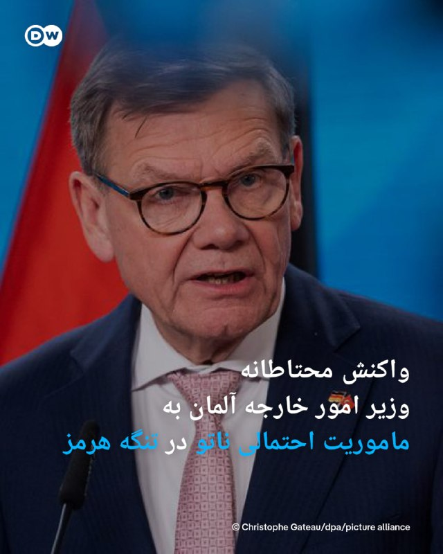

🔶 واکنش محتاطانه وزیر امور خارجه به ماموریت احتمالی ناتو در تنگه هرمز

یوهان واده‌فول، وزیر امور خارجه آلمان، در اظهارنظری محتاطانه در مورد مأموریت احتمالی ناتو در آزادسازی تنگه هرمز گفت که آلمان همیشه اعلام کرده که آماده است تا امنیت تردد آزاد در آنجا را تضمین کند و تحت رهبری بریتانیا و فرانسه در حال آماده‌سازی برای این عملیات‌ است.

این سیاستمدار حزب دموکرات مسیحی که در جریان نشست وزرای امور خارجه ناتو در شهر بندری هلسینگبوری سوئد سخن می‌گفت، در عین حال افزود: «اما من هیچ مأموریت فوری ناتو به معنای کلاسیک آن را در تنگه هرمز پیش‌بینی نمی‌کنم.»

دولت آلمان پیشنهاد داده است که پس از پایان جنگ ایران، در زمینه‌هایی مانند پاکسازی مین‌ها در این آبراه حیاتی که برای تأمین انرژی (نفت و گاز) بین‌المللی بسیار مهم است، کمک کند. آماده‌سازی‌ها برای این منظور در حال انجام است.

واده‌فول با وجود اظهارات محتاطانه‌اش درباره مأموریت ناتو در تنگه هرمز، تأکید کرد: «با این حال یک چیز روشن است، ما به ائتلاف فراآتلانتیک (ناتو) پایبندیم و ایالات متحده آمریکا می‌تواند مطمئن باشد که در هر زمانی می‌تواند روی ما حساب کند.»
@dw_farsi

## DW_Farsi — post 125008

🔶 کاهش مالیات بلیط پروازها در آلمان تحت تاثیر بحران خاورمیانه

پارلمان آلمان طرح کاهش مالیات بلیط در سفرهای هوایی را تصویب کرد. با این حال، قیمت بلیط هواپیما در بسیاری از مسیرها اخیراً به دلیل جنگ خاورمیانه به شدت افزایش یافته است، به طوری که مشتریان خطوط هوایی ممکن است در نهایت ارزانی چندانی را احساس نکنند.

به طور دقیق‌تر، قرار است عوارض پروازهای کوتاه دست‌کم ۲.۵۰ یورو، پروازهای میان‌برد ۶.۳۳ یورو و پروازهای بلندمدت (قاره‌ای) ۱۱.۴۰ یورو کاهش یابد.
@dw_farsi

## DW_Farsi — post 125007

🔶 وال‌استریت ژورنال از کمک بابک زنجانی به نقض تحریم‌ها خبر داد

وال‌استریت ژورنال گزارش داده بابک زنجانی، فعال اقتصادی تحریم‌شده ایرانی، با استفاده از شبکه‌ای از حساب‌ها در بایننس، دست‌کم ۸۵۰ میلیون دلار تراکنش را طی دو سال انجام داده است؛ تراکنش‌هایی که در گزارش‌های داخلی بایننس بارها مشکوک تشخیص داده شدند، اما حساب اصلی او ماه‌ها پس از هشدارهای داخلی همچنان فعال ماند.

این نشریه می‌نویسد این پول‌ها بخشی از میلیاردها دلار جریان مالی رمزارزی بوده‌اند که در سال‌های منتهی به جنگ اخیر، به شبکه‌های تامین مالی سپاه پاسداران متصل بوده‌اند.

بر اساس این گزارش، بخش عمده این تراکنش‌ها از طریق یک حساب اصلی و چند حساب دیگر که به خواهر، شریک عاطفی و مدیر شرکت زنجانی مرتبط بوده‌اند انجام شده است.

بررسی‌های داخلی بایننس نشان داده که این حساب‌ها از یک مجموعه دستگاه مشترک استفاده می‌کرده‌اند؛ الگویی که از نگاه تیم‌های تطبیق این صرافی، نشانه‌ای از تلاش برای دور زدن تحریم‌های آمریکا علیه جمهوری اسلامی بوده است.
@dw_farsi

## DW_Farsi — post 125006

🔶 وزارت خارجه جمهوری اسلامی تحریم سفیر خود در لبنان را محکوم کرد

وزارت امور خارجه جمهوری اسلامی، تحریم‌های اعلام‌شده از سوی ایالات متحده علیه محمدرضا رئوف شیبانی، سفیر خود در لبنان را محکوم کرد.

وزارت خارجه در بیانیه خود مدعی شده است که این اقدام وزارت خزانه‌داری آمریکا "غیرقانونی و غیرموجه" است. در این بیانیه همچنین گفته شده که این اقدام، "نمونه دیگری از رفتار قانون‌گریزانه و بی‌اعتنایی حاکمیت آمریکا به اصول بنیادین حقوق بین‌الملل و منشور سازمان ملل متحد است".

وزارت خارجه جمهوری اسلامی همچنین تحریم نمایندگان حزب‌الله را نشان‌دهنده "همدستی" آمریکا با اسرائیل توصیف کرد.

لبنان پیش از این در ماه مارس، سفیر معرفی‌شده جمهوری اسلامی در آن کشور را "عنصر نامطلوب" خوانده بود.

پیش از این یک منبع دیپلماتیک جمهوری اسلامی به خبرگزاری فرانسه گفته بود، سفیر جمهوری اسلامی علی‌رغم دستور ترک خاک لبنان، این کشور را ترک نخواهد کرد. این منبع که خواست ناشناس بماند به این خبرگزاری گفته بود: «سفیر، طبق خواست نبیه بری، رئیس پارلمان و حزب‌الله، لبنان را ترک نخواهد کرد.»

تنش بین جمهوری اسلامی و لبنان زمانی بالا گرفت که وزارت خارجه لبنان، از سفیر ایران در این کشور خواسته بود ظرف چند روز آینده لبنان را ترک کند.

در ادامه این تنش‌ها وزارت خارجه لبنان اعتبارنامه محمدرضا رئوف شیبانی، سفیر ایران را باطل کرد و توفیق صمدی خوشخو، کاردار ایران در بیروت نیز احضار شد.

یوسف رجی، وزیر امور خارجه لبنان در این رابطه در شبکه اجتماعی ایکس نوشته بود: «به دبیر کل وزارت امور خارجه دستور دادم، کاردار ایران در لبنان را احضار کند تا او را از تصمیمِ لغو رسمی سفیر تعیین‌شده ایران مطلع سازد.» رجی در پیام خود محمدرضا رئوف شیبانی را "عنصر نامطلوب" اعلام کرده و گفته بود، او باید حداکثر تا ۲۹ مارس (۹ فروردین) خاک لبنان را ترک کند.»
@dw_farsi

## Persian_Trend_Official — post 14665

  <a href="telegram/content/Persian_Trend_Official_14665_1779457719.mp4" target="_blank">🎬 Download video</a>

التماس تفکر 🤲

📝 Nick

📌 @persian_trend_official
پرشین ترند | متفاوت‌ترین کانال نظامی

## Persian_Trend_Official — post 14664

  

🔴فرمانده ارتش پاکستان راهی تهران شد؟؟؟

💢به گزارش الحدث به نقل از منابع خود گزارش داد که عاصم منیر فرمانده ارتش پاکستان عازم تهران شد.

🫆:Tony

📌 @persian_trend_official
پرشین ترند | متفاوت‌ترین کانال نظامی

## Persian_Trend_Official — post 14663

  <a href="telegram/content/Persian_Trend_Official_14663_1779457722.mp4" target="_blank">🎬 Download video</a>

⭕️ پست اینستاگرامی‌ بنیامین نتانیاهو:

ما اسرائیل کوچک را به قدرتمندترین کشور خاورمیانه تبدیل کردیم 🇮🇱💪

هنوز کارمان تمام نشده است.

📝 Nick

📌 @persian_trend_official
پرشین ترند | متفاوت‌ترین کانال نظامی

## RadioFarda — post 157452

  <a href="https://t.me/radiofarda/157452" target="_blank">📎 Download file</a>

📻بشنوید: ساعت ۱۴ با رادیوفردا، اول خرداد ۱۴۰۵‌

@Radiofarda

## RadioFarda — post 157451

ریزپرنده‌های «ضد ردیابی»؛ از اولین استفاده در جنگ اوکراین تا به‌کارگیری توسط حزب‌الله

🔸۲۹ اردیبهشت، یک پهپاد چارگرد مسلح که از مرز جنوبی لبنان وارد اسرائیل شد، یک سرباز اسرائیلی به‌سرعت از تپه‌ای نزدیک بالا رفت و تلاش کرد با یک تکه فلز قراضه کابل فیبر نوری کنترل این کوادکوپتر را قطع کند.

🔸این صحنه که عکاسان خبری آن را در مرز به‌شدت نظامی‌شده ثبت کردند، تا امروز روشن‌ترین نمونه از استفادهٔ نیروهای حزب‌الله مورد حمایت ایران از پهپادهای فیبر نوری به شمار می‌رود؛ ریزپرنده‌هایی که نخستین‌بار روسیه از آن‌ها استفاده کرد و حالا در جنگ اوکراین به‌طور گسترده به کار گرفته می‌شود.

🔸این ماجرا همچنین نشان داد که حتی پیشرفته‌ترین ارتش‌های جهان هم در برابر نوآوری‌های ساده و کم‌هزینه در فناوری پهپادها آسیب‌پذیرند.
در یک ماه گذشته، شبه‌نظامیان حزب‌الله با استفاده از پهپادهای انتحاری که با کابل‌های فیبر نوری چند کیلومتری هدایت می‌شوند، سه سرباز ارتش اسرائیل و یک غیرنظامی اسرائیلی را کشته‌اند.

🔸در واکنش، بنیامین نتانیاهو، نخست‌وزیر اسرائیل، از تشکیل تیمی برای مقابله با تهدید پهپادهای کابلی خبر داد. اسرائیل در حالی بودجه‌ای «نامحدود» در اختیار این گروه قرار داده که در داخل کشور، به‌دلیل نبود آمادگی در برابر سلاحی که نخستین‌بار در سال ۲۰۲۴ ظاهر شد، انتقادها رو به افزایش است.

🔸گزارش‌ها حاکی است که ارتش اسرائیل پیش‌تر پیشنهادهای کی‌یف برای آموزش نیروهای اسرائیلی در زمینهٔ مقابله با پهپادها را رد کرده بود، اما نتانیاهو هفته گذشته ادعا کرد سال‌ها پیش از بحران کنونی دربارهٔ تهدید چارگردهای مسلح هشدار داده بود.

🔸 گزارش کامل را در وب‌سایت رادیوفردا بخوانید.

@RadioFarda

## RadioFarda — post 157450

  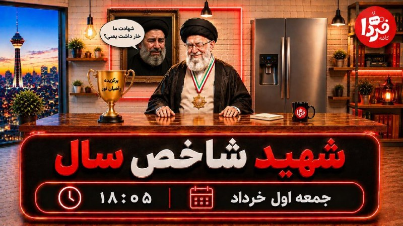

📷 Photo

## IranianMinds — post 20543

  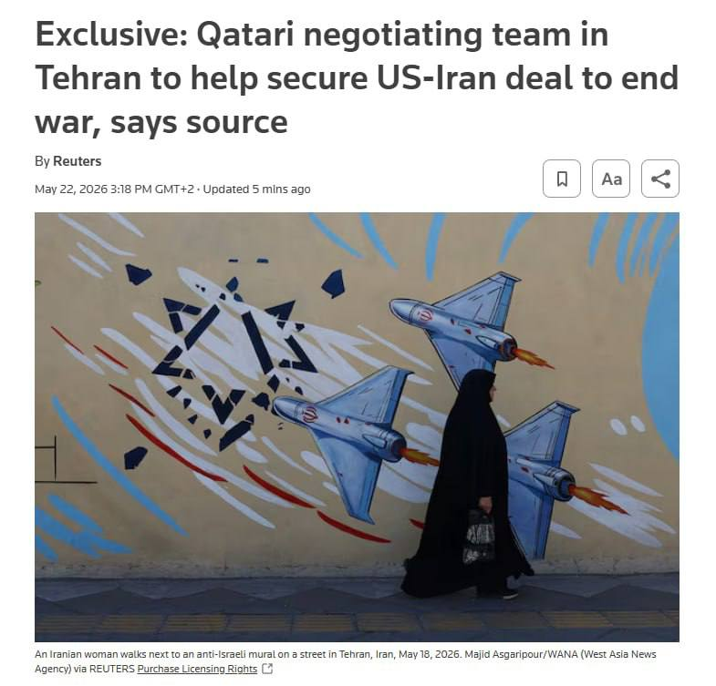

🔴 الحدث: فرمانده ارتش پاکستان، عاصم منیر، به سمت تهران حرکت کرد. @IranianMinds

## IranianMinds — post 20542

  

🔴مارک لوین:

زمان نابودی رژیم ایران فرا رسیده است. بیایید کار را تمام کنیم، بگذارید کار را به انجام برسانیم.

@IranianMinds

## IranianMinds — post 20541

  

🔴 سنتکام :

از زمان آغاز محاصره دریایی ایران مسیر ۹۷ کشتی را تغییر داده و ۴ کشتی را از کار انداخته ایم.

@IranianMinds

## IranianMinds — post 20540

🔴 بلومبرگ :

امارات متحده عربی به عربستان و قطر پیوسته و از ترامپ خواسته تا به جای شروع دوباره اقدام نظامی، به دیپلماسی با ایران فرصت بدهد.

کشورهای خلیج فارس نگرانند که درگیری دوباره منطقه را بی‌ثبات کند و به اقتصادشان آسیب بزند.

هرچند امارات، عربستان و قطر نظر متفاوتی درباره شدت برخورد آمریکا با ایران دارند، همه‌شان می‌خواهند از جنگ دیگری جلوگیری کنند.

@IranianMinds

## IranianMinds — post 20539

  

🔴 ترامپ :

دست از بازی بردارید و قانون نجات آمریکا (SAVE AMERICA ACT) را تصویب کنید!

@IranianMinds

## IranianMinds — post 20536

  <a href="telegram/content/IranianMinds_20536_1779457728.mp4" target="_blank">🎬 Download video</a>

🔴 حملات سنگین ارتش اسرائیل به حزب الله

@IranianMinds

## IranianMinds — post 20534

🔴 ویدیوهای مربوط به فاز ۲ پرونده‌های پنتاگون درباره UFO/UAP نشان‌دهنده برخورد با اشیای ناشناس شکل کروی هستند:

ویدیوی اول: یک UAP کروی شکل دیده می‌شود که بر روی آب می‌تپد (ژوئن ۲۰۲۴)

ویدیوی دوم: UAP کروی شکل در حال پرواز بر فراز یک شهر و کوه‌ها دیده می‌شود (۷ اکتبر ۲۰۲۰)

@IranianMinds

## IranianMinds — post 20533

🔴 الحدث: فرمانده ارتش پاکستان، عاصم منیر، به سمت تهران حرکت کرد. @IranianMinds

## IranianMinds — post 20532

🔴 خبرگزاری ایرنا : عاصم منیر فرمانده ارتش پاکستان برای انتقال پیام آمریکا بزودی وارد تهران میشه. @IranianMinds

## IranianMinds — post 20531

🔴 خبرگزاری ایرنا :

عاصم منیر فرمانده ارتش پاکستان برای انتقال پیام آمریکا بزودی وارد تهران میشه.

@IranianMinds

## IranianMinds — post 20530

  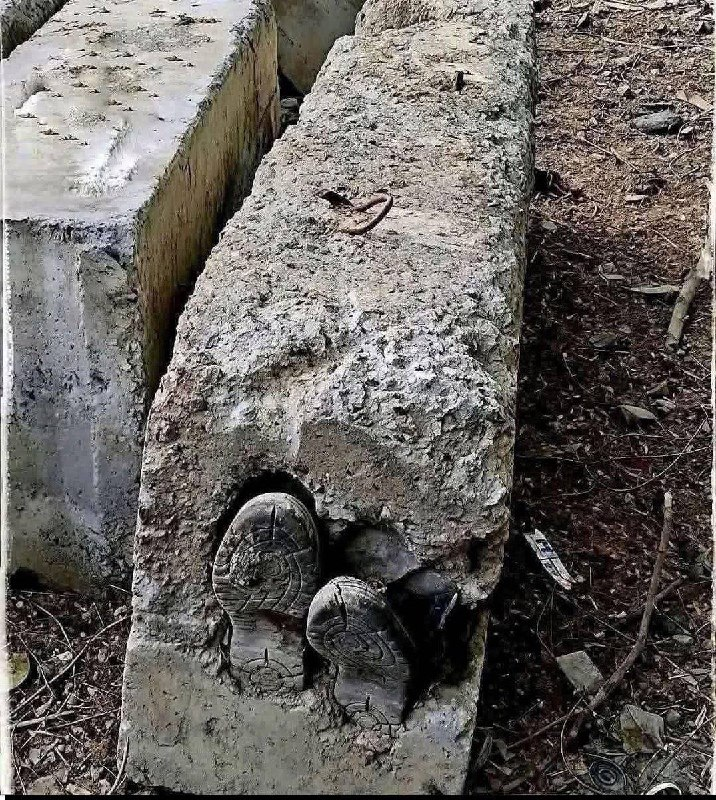

🔴هر روز مردم سوریه در حال کشف یک گور دسته‌جمعی دیگر و سطح دیگری از جنایات رژیم اسد، قاسم سلیمانی و سپاه‌ تروریستی پاسداران هستند.
اجسادی در داخل این بلوک‌های بتونی وجود دارند که زنده دفن شده‌اند.

@IranianMinds

## IranianMinds — post 20529

  

🔴 ترامپ ترسید

حسنعلی امیری نماینده مجلس:

طرح جایزه برای کشتن ترامپ به زودی تصویب میشه.

@IranianMinds

## BBCPersian — post 281792

  <a href="telegram/content/BBCPersian_281792_1779457731.mp4" target="_blank">🎬 Download video</a>

🔻سرخط خبرها، جمعه ۱ خرداد ۱۴۰۵

@BBCPersian

## BBCPersian — post 281790

🔻عراق، ازبکستان و قزاقستان کمک‌های بشردوستانه به ایران فرستادند

معاون جمعیت هلال احمر ایران می‌گوید که عراق، ازبکستان و قزاقستان کمک‌های بشردوستانه به ایران فرستادند و محموله‌های اهدایی آنها وارد کشور شده است.

راضیه عالیشوندی گفت: «این کمک‌ها شامل اقلام غذایی، دارویی و تجهیزات پزشکی است که در راستای حمایت از عملیات امدادی و تامین نیازهای اقشار آسیب‌پذیر در اختیار جمعیت هلال‌احمر قرار گرفته است.»

بر اساس اعلام جمعیت هلال احمر ایران، عراق ۹ تریلی حامل حدود ۱۸۰ تن اقلام غذایی، دارویی و تجهیزات پزشکی، ازبکستان ۱۵ تریلی به وزن ۳۰۰ تن و قزاقستان محموله‌هایی در ۳۰ واگن قطار با وزن هزار و ۷۰۰ تن به ایران فرستادند.

معاون جمعیت هلال احمر ایران گفت که «حجم قابل‌توجهی» از کمک های قزاقستان آرد و شکر است.

https://bbc.in/4v3pH4G
@BBCPersian

## BBCPersian — post 281789

🔻اسماعیل بقایی سخنگوی هیئت مذاکره کننده ایران با آمریکا شد

محمدباقر قالیباف، رئیس هیئت مذاکره کننده ایران با آمریکا، در حکمی اسماعیل بقایی، را به عنوان سخنگوی این هیئت منصوب کرد.

آقای بقایی در حال حاضر سخنگوی وزارت خارجه ایران نیز هست.

در اولین دور مذاکرات ایران و آمریکا پس از جنگ که در اسلام‌آباد انجام شد، آقای بقایی یکی از اعضای هیئت ایرانی بود که به پاکستان رفت.

در دو روز گذشته و با سفر وزیر کشور پاکستان به ایران، گفت‌و‌گوهای فشرده‌ای در جریان بوده است که به گزارش خبرگزاری فارس «برای بررسی پیشنهادهایی جهت حل اختلافات» میان ایران و آمریکا بوده است.

مارکو روبیو، وزیر خارجه آمریکا، امروز گفت که واشنگتن در انتظار شنیدن نتیجه این گفت‌وگوهاست.

https://bbc.in/4v3pH4G
@BBCPersian

## BBCPersian — post 281788

  <a href="telegram/content/BBCPersian_281788_1779457733.mp4" target="_blank">🎬 Download video</a>

🔻جمعیتی خشمگین بخشی از یک بیمارستان مخصوص بیماران ابولا را در شرق جمهوری دموکراتیک کنگو، در آفریقا به آتش کشیدند.

این اقدام پس از آن صورت گرفت که بیمارستان پیکر یک مرد جوان را که گمان می‌‌رفت بر اثر ویروس ابولا جان باخته است، به خانواده و دوستان او تحویل نداد.

یک سیاستمدار محلی به بی‌بی‌سی گفت برخی از بستگان قربانی، وجود این ویروس را که تاکنون بیش از ۱۳۰ نفر را در شرق کنگو به کام مرگ کشانده، باور ندارند.

در جریان ناآرامی‌ها، پلیس برای متفرق کردن جمعیت تیرهای هوایی شلیک کرد.

کارشناسان می‌گویند پیکر افرادی که بر اثر ابولا جان می‌بازند به‌شدت عفونی است و مقام‌های مسئول برای جلوگیری از گسترش این ویروس ناگزیرند اجساد را خود دفن ایمن کنند.

سازمان جهانی بهداشت نیز توصیه می‌کند قربانیان ابولا با رعایت اصول «تدفین ایمن و همراه با حفظ کرامت» به خاک سپرده شوند؛ به‌گونه‌ای که تیم‌های آموزش‌دیده با استفاده از تجهیزات حفاظتی، مسئولیت جابه‌جایی اجساد را بر عهده بگیرند.
@BBCPersian

## BBCPersian — post 281787

  <a href="telegram/content/BBCPersian_281787_1779457735.mp4" target="_blank">🎬 Download video</a>

🔻عباس علی‌آبادی، وزیر نیروی ایران، جمعه، اول خرداد ۱۴۰۵، در سفرش به استان مرکزی و در مراسم افتتاح فاز نخست نیروگاه خورشیدی ۱۳۰ مگاواتی متانول کاوه در ساوه گفت: «علیرغم بارش‌های بسیار خوب، وضعیت آب در استان‌های مرکزی و تهران همچنان وضعیت ضعیف است.»

وزیر نیرو همچنین با اشاره به سیاست‌های جدید مدیریت انرژی اعلام کرد در تامین برق و توسعه ظرفیت‌های جدید، استان‌هایی در اولویت خواهند بود که الگوی مصرف بهینه‌تری داشته باشند. او در ادامه گفت که مدیریت مصرف و سازگاری با شرایط اقلیمی، نقش مهمی در پایداری خدمات آب و انرژی و هدایت سرمایه‌گذاری‌های آینده خواهد داشت.

https://bbc.in/4uXXyMd
@BBCPersian

## BBCPersian — post 281786

🔻خطبه‌های نماز جمعه در شهرهای مختلف ایران با هشدار به آمریکا و اسرائیل اقامه شد

امامان جمعه در شهرهای مختلف ایران در خطبه‌های امروز نماز جمعه به آمریکا و اسرائیل درباره احتمال حمله مجدد هشدار دادند.

در تهران، محمد جواد حاج علی اکبری، امام جمعه موقت پایتخت، خطاب به آمریکا و اسرائیل گفت: «اگر دست به کار احمقانه‌ای بزنید، این بار ایران دیگری خواهید دید و موشک‌های جدیدی را تجربه خواهیم کرد که فکرش را نکردید.»

احمد علم‌الهدی، امام جمعه مشهد، هم با هشدارهای پی‌ در‌ پی به آمریکا و اسرائیل گفت: «یکی از آثار جنگ اخیر این بود که تکنولوژی ارزان قیمت پهپادی و موشکی ایران توانست با تکنولوژی پرهزینه و گران قیمت آمریکا رقابت و مقابله کند و اکنون همه مشتری صنایع دفاعی ایران شده‌اند. امروز ایران به عنوان ابرقدرت چهارم به دنیا معرفی شده است.»

عبدالحسین غبیشاوی، امام جمعه آبادان‌، از مهمترین شهرهای نفتی ایران هشدار داد: «نیروهای مسلح در صورت بروز جنگی دیگر علیه کشور، هیچ خط قرمزی را رعایت نخواهند کرد.»

محمدنبی موسوی فرد، امام جمعه اهواز، مرکز استان خوزستان تهدید کرد که در جنگ احتمالی بعدی «عربستان، امارات، کویت و بحرین را با خاک یکسان خواهیم کرد.»

مجتبی میردامادی، امام جمعه اصفهان هم گفت: «آینده درخشان منطقه خلیج فارس بدون آمریکاست و آن‌ها هیچ جایی در خلیج فارس جز در قعر آب هایش ندارند».

او در ادامه با اشاره به وضعیت اقتصادی ایران گفت که «برای این وضعیت اقتصادی و گران شدن ساعتی و دقیقه‌ای اجناس، شرمنده مردم هستیم.»

https://bbc.in/4v3pH4G
@BBCPersian

## BBCPersian — post 281785

  

🔻جعبه‌ای حاوی دو گرمک «نادر و فوق‌العاده» در یک حراجی در ژاپن با قیمت رکوردشکن ۳۶ هزار و ۵۰۰ دلار فروخته شد.

خریدار، یک عمده‌فروش میوه است؛ قرار است این گرمک‌های گران‌قیمت پیش از آغاز مراسم‌ چشیدن گرمک‌ها در هفته آینده، در فروشگاهی در توکیو به نمایش گذاشته شود.

این گرمک‌ها که در یوباری، واقع در جزیره شمالی هوکایدو، کشت می‌شوند، به‌دلیل گوشت نارنجی آبدارشان شناخته می‌شوند و در ژاپن اغلب به‌عنوان هدیه‌ای گران‌بها اهدا می‌شوند.

📸EPA
@BBCPersian

## Dirty_Kids — post 389942

  <a href="telegram/content/Dirty_Kids_389942_1779457738.mp4" target="_blank">🎬 Download video</a>

🎬 Video

## Dirty_Kids — post 389941

قديما
قيمتا ثبات داشت
اينقدرى كه اجناس با قيمتاشون نامگذاری ميشد
مثلا
كاغذ ده شاهى
كلوجه پنج زارى
آدامس ته شاهى

حتى روحانيون هم با قيمتشون ميشناختن
آخوند دوزارى

@Dirty_Kids 👻

## Dirty_Kids — post 389940

  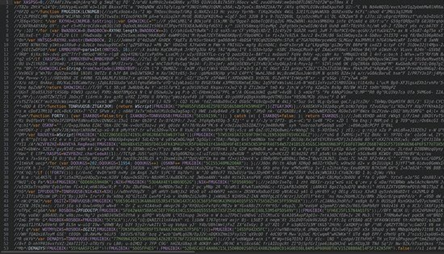

روش جدید وصل شدن به اینترنت بین الملل که آموزشش رو در تصویر گذاشتم

@Dirty_Kids 👻

## Dirty_Kids — post 389939

  <a href="telegram/content/Dirty_Kids_389939_1779457740.mp4" target="_blank">🎬 Download video</a>

یادی کنیم از سکس کال یه آخوند با یه جنده: 🔞

@Dirty_Kids 👻

## Dirty_Kids — post 389938

  <a href="telegram/content/Dirty_Kids_389938_1779457741.mp4" target="_blank">🎬 Download video</a>

پرفورمنس هنرمند ایرانی در خیابان؛
پیاز می‌فروشد و رنده می‌کند…
تا مردم،
بر وضعیتی که در آن زندگی می‌کنیم، اشک بریزند.

@Dirty_Kids 👻

## Dirty_Kids — post 389936

این زن مسلمان چپگرای طرفدار فلسطین، مد اسلامی را با سبک پانک هاردکور ترکیب کرده است و قفل مرحله جدیدی از بیماری روانی را باز کرده 🤣🤣🤣

غرب رسماً به دارالمجانین تبدیل شده

@Dirty_Kids 👻

## Dirty_Kids — post 389935

  <a href="https://t.me/Dirty_Kids/389935" target="_blank">📎 Download file</a>

📱 اپلیکیشن اندروید بدون فیلتر ریتزوبت

➖➖➖➖➖

🔹 ثبت نام آسان 
✅
🔹 رابط کاربری بسیار راحت و سریع 
✅
🔹 درگاه پرداخت کارت به کارت 
✅
🔹 درگاه پرداخت دلاری سریع 
✅
🔹 بونوس ۱۰۰ درصدی اولین واریز 
✅
🔹 بونوس ۱۰۰ درصدی واریز یکشنبه ها 
✅

➖➖➖➖➖
🌐 https://RitzoBet.com

⚡️ @RitzoBet_ir

## Dirty_Kids — post 389934

  

⚠️ برای #شرطبندی های فوتبال از سایت معتبر و بین المللی استفاده کنید ✅

سایت #ریتزوبت ، چهار سال هستش داخل ایران فعالیت میکنه 
✅

لایسنس بین المللی داره ، روش های شارژ و برداشت متنوع داره و بونوس 100% ورزشی و کش بک های جذاب
💎

⏪ اپلیکیشن بدون فیلتر ریتزوبت 
📱
⏩
R1

✅ لینک بدون‌ فیلتر ریتزوبت
🤣

🆔 @RitzoBet_ir 
🇮🇷

## Hranews — post 113094

  

ایران در محاصره بحران‌های محیط‌ زیستی؛ مروری بر رویدادهای دو هفته گذشته

❗️
❗️
❗️
❗️
❗️– حق بر #محیط_زیست و برخورداری از منابع طبیعی سالم، از بنیادی‌ترین حقوق انسانی به شمار می‌رود. با این حال، تداوم بهره‌برداری بی‌رویه از منابع طبیعی، کاهش نظارت مؤثر، گسترش آلاینده‌ها، خشکسالی‌های پی‌درپی و تخریب زیستگاه‌های طبیعی، محیط زیست ایران را با بحران‌های گسترده‌ای روبه‌رو کرده است. گزارش پیش‌رو حاصل ثبت ۸۴ گزارش و رویداد محیط زیستی منتشرشده در دو هفته اخیر است که با هدف آگاه‌سازی افکار عمومی گردآوری شده است.

به گزارش خبرگزاری هرانا، ارگان خبری مجموعه فعالان حقوق بشر در ایران، در دو هفته‌ای که گذشت، دست‌کم ۷۸ شکارچی، صیاد، متخلف محیط زیستی و قاچاقچی چوب بازداشت و شناسایی شدند. همچنین، بیش از ۴۳ تن چوب قاچاق و مقادیر قابل توجهی گیاهان کوهی و محصولات طبیعی کشف و ضبط شد. افزون بر این، شاخص کیفیت هوا در دست‌کم ۴۲ شهر در وضعیت ناسالم، بسیار ناسالم و خطرناک قرار گرفت. از سوی دیگر، گزارش‌های متعددی درباره تشدید تنش آبی، خشکسالی، تهدید گونه‌های جانوری، تخریب زیستگاه‌ها، بحران پسماند و اثرات جنگ و آلاینده‌های صنعتی بر محیط زیست منتشر شد که در ادامه به بخشی از آنها پرداخته می‌شود.

آسیب رسانی به جنبه‌های مختلف محیط زیست در ایران کماکان ادامه دارد. از یک سو، فقر، نبود آموزش‌های محیط زیستی و سودجویی موجب تخریب منابع طبیعی و حیات وحش شده و از سوی دیگر، نهادهای متولی با محدودیت امکانات و کمبود نیرو در تلاش برای کاهش ابعاد این بحران‌ها هستند؛ هرچند به نظر نمی‌رسد حجم اقدامات انجام‌شده متناسب با شدت بحران‌های محیط زیستی کشور باشد.

ادامه مطلب

↘️
@hranews_bot تماس ✉️ - @Hranews کانال هرانا 🆑

## Hranews — post 113093

  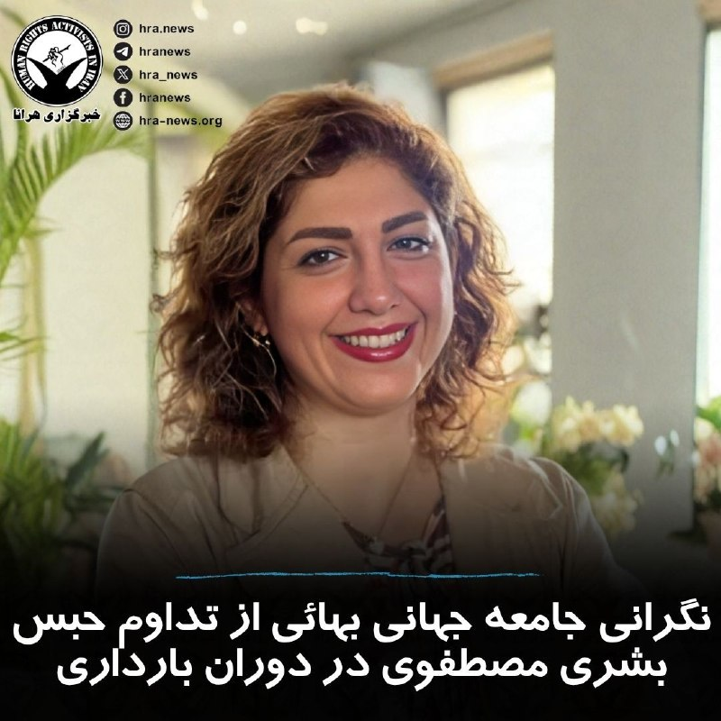

جامعه جهانی بهائی با نگارش بیانیه‌ای اعلام کرد که درخواست‌های بشری مصطفوی، زن باردار محبوس در زندان کرمان، در خصوص ارائه مرخصی برای مراجعه‌های پزشکی و انجام آزمایشات ضروری مربوط به بارداری او رد شده است. این در شرایطی است که وی می‌بایست چهار ماه از دوران بارداری خود را در زندان کرمان سپری کند. وضعیتی که باعث تشدید نگرانی این جامعه شده است.

همچنین در ادامه این بیانیه، جامعه #بهائی نسبت به تشدید سرکوب بهائیان طی جنگ اخیر در سراسر کشور ابراز نگرانی کرد. سیمین فهندژ، نماینده جامعۀ جهانی بهائی در سازمان ملل متحد در ژنو ضمن بیان اینکه زمامداری نباید ابزاری برای سرکوب انسان‌ها به خاطر باورها، قومیت یا جنسیت آن‌ها باشد، اظهار داشت که باور کردنی نیست که حکومت ایران، در شرایطی که در همه عرصه‌ها با بحران‌های فزاینده روبه‌روست، به‌جای آن‌که توجه خود را به نیازهای شهروندانش معطوف کند، آزار و سرکوب بیشتر جامعه‌ای بی‌گناه را در پیش گرفته است.

#بشری_مصطفوی

↘️
@hranews_bot تماس ✉️ - @Hranews کانال هرانا 🆑

## Hranews — post 113092

اموال ۷ شهروند در استان ایلام توقیف شد

❗️
❗️
❗️
❗️
❗️– رئیس کل دادگستری استان ایلام از #توقیف_اموال هفت شهروند در این استان خبر داد. وی این افراد را به “جاسوسی و همکاری با رژیم صهیونیستی” متهم کرده است.

ادامه مطلب

↘️
@hranews_bot تماس ✉️ - @Hranews کانال هرانا 🆑

## manototv — post 105744

  <a href="telegram/content/manototv_105744_1779457746.mp4" target="_blank">🎬 Download video</a>

هامبورگ؛ به‌مناسبت سالگرد ریزش ساختمان متروپل، جمعه اول خرداد ۱۴۰۵

## manototv — post 105741

اطلاعیه منوتو درباره پایان پخش برنامه‌ها

## manototv — post 105740

  <a href="telegram/content/manototv_105740_1779457747.mp4" target="_blank">🎬 Download video</a>

مارکو روبیو، وزیر خارجه آمریکا، در نشست خبری مشترک با مارک روته، دبیرکل ناتو، گفت تلاش جمهوری اسلامی برای ایجاد نظام عوارض‌گیری در یک آبراه بین‌المللی قابل قبول نیست و نباید اجازه داده شود چنین اقدامی در تنگه هرمز رخ دهد.

روبیو در این نشست که در حاشیه نشست وزیران خارجه ناتو در سوئد برگزار شد، گفت آمریکا می‌کوشد این موضوع را از مسیر سازمان ملل پیگیری کند و به نتیجه برساند. او افزود تقریبا همه کشورهایی که در این نشست حضور داشتند، از قطعنامه مربوط به این موضوع حمایت کرده‌اند یا به احتمال زیاد به آن خواهند پیوست.

## manototv — post 105739

  <a href="telegram/content/manototv_105739_1779457749.mp4" target="_blank">🎬 Download video</a>

پریتی پتل، وزیر خارجه سایه بریتانیا، در سخنانی در مجلس عوام این کشور گفت هرچه از برنامه هسته‌ای جمهوری اسلامی باقی مانده، باید برچیده شود و اورانیوم غنی‌شده موجود نیز باید از ایران خارج شود.

به گزارش متن رسمی نشست مجلس عوام بریتانیا، این سخنان روز پنجشنبه ۳۱ اردیبهشت در جریان جلسه‌ای درباره خاورمیانه مطرح شد. او گفت اورانیوم غنی‌شده‌ای که جمهوری اسلامی اکنون در اختیار دارد باید خارج شود و باید از چگونگی سوءاستفاده جمهوری اسلامی از توافق سال ۱۳۹۴ درس گرفت.

پتل از دولت بریتانیا خواست روشن کند آیا این موضع، موضع رسمی دولت نیز هست یا نه. او گفت شفافیت دولت درباره این موضوع «بسیار مهم» است و سپس پرسید موضع دولت در قبال توان موشکی و نظامی ایران چیست.

## alonews — post 121780

  <a href="telegram/content/alonews_121780_1779457751.mp4" target="_blank">🎬 Download video</a>

👈روبیو: ایران داره تو یه آبراه بین‌المللی سیستم عوارض‌گیری راه میندازه؛
- این اصلاً قابل قبول نیست و نباید اتفاق بیفته
- اگه این تو تنگه هرمز جا بیفته، ۵ جای دیگه دنیا هم همین کارو می‌کنن
- چرا کشورهای دیگه دنیا نباید بگن ما هم می‌خوایم همین کارو بکنیم؟
- جدا از اینکه تنگه هرمز برای همه کشورهایی که اینجا هستن حیاتیه، برای خیلی از کشورهایی که اینجا هم نیستن، مخصوصاً منطقه هند-اقیانوس آرام، فوق‌العاده مهمه

✅ @AloNews خبر جنگ

## alonews — post 121779

  <a href="telegram/content/alonews_121779_1779457752.mp4" target="_blank">🎬 Download video</a>

👈مارکو روبیو :
- تنگه هرمز کامل باز و آزاد باشه و ایران کامل قید برنامه هسته‌ای رو بزنه!

✅ @AloNews خبر جنگ

## alonews — post 121778

  <a href="telegram/content/alonews_121778_1779457755.webm" target="_blank">🎬 Download video</a>

👈باراک راوید، خبرنگار آکسیوس:
عاصم منیر فرمانده ارتش پاکستان، امروز برای بستن توافق بین آمریکا و ایران و تموم کردنِ جنگ، راهی تهران میشه.

✅ @AloNews خبر جنگ

## alonews — post 121777

  <a href="telegram/content/alonews_121777_1779457755.webm" target="_blank">🎬 Download video</a>

👈ادعای منبع نزدیک به مذاکرات ایران و آمریکا به «العربی الجدید»:

🔴سفر فرمانده ارتش پاکستان، عاصم منیر، به تهران به این معنا نیست که توافق در دسترس است.

🔴گزارش‌ها درباره وجود پیش‌نویس احتمالی توافق صحت ندارد و اینها صرفاً گمانه‌زنی‌های رسانه‌ای است.

🔴وزیر کشور پاکستان پیام جدیدی از آمریکا به ایران منتقل نکرده است.

🔴سفر مقامات پاکستانی به تهران در راستای تقویت میانجی‌گری اسلام‌آباد و نقش آن و تمایلش برای جلوگیری از تنش‌زایی است.

🔴تهران همچنان خواسته‌های آمریکا را افراطی و غیرمنطقی می‌داند و معتقد است مشکل در واشنگتن است، نه تهران.

✅ @AloNews خبر جنگ

## alonews — post 121776

  <a href="telegram/content/alonews_121776_1779457756.webm" target="_blank">🎬 Download video</a>

🔴فوری/منابع عربی: یک هیئت قطری نیز هم اکنون به تهران رسیده است.

✅ @AloNews خبر جنگ

## alonews — post 121775

  <a href="telegram/content/alonews_121775_1779457756.webm" target="_blank">🎬 Download video</a>

👈رسانه اسرائیلی i24news: احتمالا در مذاکرات پیشرفت قابل توجهی حاصل شده باشد

✅ @AloNews خبر جنگ

## alonews — post 121774

  <a href="telegram/content/alonews_121774_1779457756.webm" target="_blank">🎬 Download video</a>

👈الجزیره: شهباز شریف، نخست‌وزیر پاکستان، قصد دارد فردا به چین سفر کند. برداشت این است که او پیام‌هایی را از تهران به پکن می‌برد.

🔴پاکستان در حال تعامل با بازیگران متعددی است: آمریکا، ایران، کشورهای منطقه و البته چین.

✅ @AloNews خبر جنگ

## alonews — post 121773

  <a href="telegram/content/alonews_121773_1779457757.webm" target="_blank">🎬 Download video</a>

👈شبکه کان: رسانه‌های عربی اعلام کردند که آمدن عاصم منیر، که قوی‌ترین مرد پاکستان محسوب می‌شود، به ایران، باید نشانه‌ای از پیشرفت در مذاکرات باشد 
✅ @AloNews خبر جنگ

## alonews — post 121772

  <a href="telegram/content/alonews_121772_1779457757.mp4" target="_blank">🎬 Download video</a>

👈فرستاده ویژه ترامپ به گرینلند جف لندری:گرینلند به یک توافق نیاز دارد. گرینلند می‌تواند همین الان روزانه ۲ میلیون بشکه نفت صادر کند.

🔴فکر کنید این چه فشاری را در تنگه هرمز کاهش می‌دهد، چه اهرمی به آمریکا می‌دهد... وقت آن است که دانمارکی‌ها پای میز بیایند و بیایید یک توافق انجام دهیم.

✅ @AloNews خبر جنگ

## alonews — post 121771

  <a href="telegram/content/alonews_121771_1779457759.webm" target="_blank">🎬 Download video</a>

👈شبکه کان: رسانه‌های عربی اعلام کردند که آمدن عاصم منیر، که قوی‌ترین مرد پاکستان محسوب می‌شود، به ایران، باید نشانه‌ای از پیشرفت در مذاکرات باشد

✅ @AloNews خبر جنگ

## alonews — post 121770

  <a href="telegram/content/alonews_121770_1779457760.webm" target="_blank">🎬 Download video</a>

🔴فوری/الحدث: عاصم منیر، فرمانده ارتش پاکستان در راه تهران است. 
✅ @AloNews خبر جنگ

## alonews — post 121769

  <a href="telegram/content/alonews_121769_1779457760.webm" target="_blank">🎬 Download video</a>

👈شبکه منوتو دوباره خدافظی کرد و از پایان پخش و اتمام فعالیتش خبر داد

✅ @AloNews خبر جنگ

## alonews — post 121768

  <a href="telegram/content/alonews_121768_1779457760.webm" target="_blank">🎬 Download video</a>

🔴فوری/الحدث: عاصم منیر، فرمانده ارتش پاکستان در راه تهران است.

✅ @AloNews خبر جنگ

## alonews — post 121767

  <a href="telegram/content/alonews_121767_1779457760.webm" target="_blank">🎬 Download video</a>

👈پاکستان: سفر عاصم منیر به ایران را تأیید یا تکذیب نمی‌کنیم

🔴سخنگوی وزارت خارجه پاکستان درباره گزارش‌ها مربوط به سفر فرمانده ارتش این کشور به ایران سکوت کرد.

وی در پاسخ به پرسشی درباره سفر فیلد مارشال عاصم منیر، رئیس نیروهای دفاعی و رئیس ستاد ارتش پاکستان به ایران گفت:

🔴ما نه می‌توانیم این گزارش‌ها را تأیید کنیم و نه رد.

✅ @AloNews خبر جنگ

## alonews — post 121766

  

فکت تلخ:

[@AloTweet]

## alonews — post 121765

  <a href="telegram/content/alonews_121765_1779457761.webm" target="_blank">🎬 Download video</a>

👈صداوسیما:
حکم قالیباف رئیس هیئت مذاکره کننده

🔴 اسماعیل بقایی سخنگوی وزارت خارجه، سخنگوی هیئت مذاکراتی شد

✅ @AloNews خبر جنگ

## alonews — post 121764

  

قیمت استثنایی گیگی
9️⃣
8️⃣
1️⃣

تحویل زیر یک دقیقه
✅
دارای لینک سابسکریشن جهت دیدن حجم و کنترل مصرف
✅
بدون قطعی 
✅
بدون محدودیت کاربر و زمان
✅
جمینایو چت جی بی تی و... کامل اوکیه با سرورامون
✅

🏪پشتیبانی کامل
✅
شروع فعالیت از سال 2022 
✅
پرداخت ریالی
✅

ضریب و این چیزا ندارن و تا آخرین مگابایت برای پشتیبانیش درختمتیم
🥂

💤این تخفیف فقط تا ۱۲ شب فعاله
💤

⭐️ @Napsternetiran_bot
〰️〰️〰️〰️〰️〰️〰️

🔶 @Napsternetvirani

## alonews — post 121763

  <a href="telegram/content/alonews_121763_1779457762.mp4" target="_blank">🎬 Download video</a>

👈فعال آلمانی حاضر در ناوگان «صمود»:
در زمان بازداشت هر روز من را کتک میزدند و آب و غذا نمیدادند

✅ @AloNews خبر جنگ

## alonews — post 121762

  <a href="telegram/content/alonews_121762_1779457764.webm" target="_blank">🎬 Download video</a>

👈ترامپ پس از اطلاع از لغو برنامه چرخش نیروها به لهستان توسط پنتاگون، از وزیر جنگ پیت هگستث سوال کرد، طبق گزارش WSJ.

🔴ترامپ در تماس اخیر به هگستث گفت که ایالات متحده نباید به لهستان به دلیل رابطه نزدیکش با کاخ سفید بدرفتاری کند.

🔴این اقدام برخی مقامات را شگفت‌زده کرد زیرا این آلمان بود، نه لهستان، که رویکرد آمریکا در جنگ با ایران را نقد کرده بود.

🔴کمی بعد، ترامپ برنامه‌هایی برای اعزام ۵۰۰۰ نیروی اضافی آمریکایی به لهستان اعلام کرد

✅ @AloNews خبر جنگ

## alonews — post 121761

  <a href="telegram/content/alonews_121761_1779457764.webm" target="_blank">🎬 Download video</a>

👈وال‌استریت ژورنال: ترامپ شخصا خواستار اعزام نیروهای بیشتر به لهستان شد

✅ @AloNews خبر جنگ

---
📅 بروزرسانی: 1405/03/01 14:52
---

## VahidOOnLine — post 241505

  

♦️نهاد بین‌المللی ناظر بر وضعیت اینترنت، نت‌بلاکس، صبح جمعه اول خرداد اعلام کرد قطع گسترده اینترنت در ایران وارد هشتاد‌وچهارمین روز خود شده و بیش از هزار و ۹۹۲ ساعت است که دسترسی کاربران در ایران به شبکه‌های بین‌المللی همچنان قطع است.

این نهاد ناظر بر اینترنت نوشت با ادامه این وضعیت، شکاف‌های اجتماعی و اقتصادی عمیق‌تر می‌شود و هر ساعت از قطع اینترنت، ارتباط با جهان خارج را بیش از پیش به جایگاه، همراهی با حکومت و برخورداری از امتیاز وابسته می‌کند.
 این وضعیت در حالی ادامه دارد که علی یزدی‌خواه، نایب‌رئیس کمیسیون فرهنگی مجلس شورای اسلامی روز پنجشنبه ۳۱ با تأکید بر اینکه کشور در شرایط جنگی قرار دارد گفت: «در شرایط فعلی تصمیمی برای بازگشایی اینترنت جهانی وجود ندارد.»
‌🇸🇦 Indypersian

🤖 @VahidOOnLine

## VahidOOnLine — post 241504

  <a href="telegram/content/VahidOOnLine_241504_1779448968.mp4" target="_blank">🎬 Download video</a>

ویدیوی ارسالی یک شهروند به ایران اینترنشنال نشان می‌دهد روز جمعه در پی بحران سوخت و شلوغی جایگاه‌های سوخت در شهرهای ایران در قشم صف طولانی بنزین شکل گرفته است.
‌🏁 🇬🇧 IranintlTV

🤖 @VahidOOnLine

## VahidOOnLine — post 241503

  <a href="telegram/content/VahidOOnLine_241503_1779448971.mp4" target="_blank">🎬 Download video</a>

یک کارمند کارخانه لاستیک کرمان در پیامی به ایران اینترنشنال از کاهش شمار نیروهای این شرکت و کم شدن شیفت‌های آن در پی بحران اقتصادی شدید خبر داد. پیام او با هوش مصنوعی خوانده شده است.
‌🏁 🇬🇧 IranintlTV

🤖 @VahidOOnLine

## VahidOOnLine — post 241502

  

محمدجواد حاج‌علی‌اکبری، امام جمعه تهران، گفت نیروهای مسلح جمهوری اسلامی آماده‌تر از همیشه و دست به ماشه هستند و اگر دشمنان «دست به کار احمقانه‌ای بزنند»، این بار «موشک‌های جدیدی را تجربه خواهند کرد که فکرش را نکرده‌اند» و اسرائیل نیز «نفسش به شماره خواهد افتاد».

او در خطبه‌های نماز جمعه تهدید کرد در صورت تشدید درگیری‌ها، به جای «جنگ منطقه‌ای»، جنگ «فرامنطقه‌ای» رخ خواهد داد و به جای محدود شدن تنگه هرمز، باب‌المندب نیز بسته خواهد شد.

حاج‌علی‌اکبری افزود اگر زیرساخت‌های جمهوری اسلامی هدف قرار گیرد، «از تمام حامیان دشمن در منطقه، زیرساخت‌زدایی خواهد شد».
‌🏁 🇬🇧 IranintlTV

🤖 @VahidOOnLine

## VahidOOnLine — post 241501

  

شورای اتحادیه اروپا اعلام کرد چارچوب حقوقی تحریم‌های این اتحادیه علیه جمهوری اسلامی را گسترش داده تا افراد و نهادهای دخیل در مختل کردن عبور قانونی کشتی‌ها در تنگه هرمز را هدف تحریم قرار دهد.

این تحریم‌ها شامل مسدود شدن دارایی‌ها، ممنوعیت سفر و همکاری مالی و اقتصادی شرکت‌ها و شهروندان اروپایی با افراد و نهادهای تحریم‌شده است.

شورای اتحادیه اروپا تاکید کرد که اقدام‌های جمهوری اسلامی علیه کشتی‌ها در تنگه هرمز مغایر حقوق بین‌الملل است.
‌🏁 🇬🇧 IranintlTV

🤖 @VahidOOnLine

## VahidOOnLine — post 241500

روایت شما از زندگی در آتش‌بس- جمعه ۱ خرداد ۱۴۰۵

🔹 از شیراز پیام می‌دم. ۲ ماه بیکاریم. گرانی بیداد می‌کنه. ترامپ عزیز کار را تموم کن.
🔹 یه دندون‌پزشکی ساده نمیشه رفت اونقدر که هزینه‌هامون بالاست. خسته شدیم از این حکومت نکبتی اسلامی.
🔹 از کاشان هستم. تعدیل نیروها خیلی شده و گرونی هم سر به فلک کشیده، تا حدی که دیگه مرغ هم نمیشه خرید و کارگرهای بدبخت با این همه قسط و بدهی دارن تعدیل هم می‌شن.
🔹 شاید بتوان برای مدتی بر سر نیزه تکیه کرد، اما هرگز نمی‌توان بر روی آن نشست و حکومت کرد. قابل توجه آنانی که فکر می‌کنند می‌توانند بر سریر خون بنشینند و حکومت کنند. حکومتی که مشروعیتش را از دست بدهد، همه چیزش را باخته است.
🔹 از چابهار پیام می‌دم. امروز (۱ خرداد) رفتم مغازه واسه خواهرم ۴ تا چیپس مزمز گرفتم، جمع کل شد یک میلیون و صد هزار تومان.
🔹 از اراک، شهرستان کمیجان پیام می‌دهم. وضعیت نانوایی‌ها خیلی خراب است. در نبود آرد، نان به صورت سهمیه‌ای شده، صف‌های طولانی تشکیل می‌شود و بعضی نانوایی‌ها تعطیل هستند. نبود آرد این وضعیت را ساخته است. صدای ما را به گوش جهان برسانید.
🔹 از شهسوار مازندران. اوضاع خیلی داغونه. مایحتاج زندگی رو به زور و هر روز با یه قیمت جدید تهیه می‌کنیم. به ریال پول درمیاریم، به دلار داریم خرج می‌کنیم. جاوید شاه.
🔹 در بازار تهران بیشتر رستوران‌ها و فست‌فودی‌ها فروششون به صفر رسیده. یک پرس قرمه‌سبزی شده ۸۰۰ هزار تومان.
🔹 برق شهرک‌های صنعتی رو به علت کمبود برق قطع می‌کنن. کشوری که محاصره اقتصادی و تحریم هست، به جای حمایت از کارخونه‌ها برق‌شون رو قطع می‌کنه که باعث گرونی و تورم و بیکاری بیشتر خواهد شد.
🔹 اینترنت باز بشه، بازار بورس و تجارت به‌صورت رسمی باز بشه، دلار میشه ۵۰۰ تومن. فقط نمی‌دونم تا کی با بسته نگه داشتن می‌تونن قیمت رو کنترل کنن؟
‌🏁 🇬🇧 IranintlTV

🤖 @VahidOOnLine

## VahidOOnLine — post 241499

  

♦️سازمان جهانی کشتی روز جمعه، یکم خرداد از تعویق مسابقات جهانی در بحرین خبر داد.

این سازمان در بیانیه‌ای مشترک با کمیته المپیک بحرین و فدراسیون کشتی این کشور اعلام کرد که مسابقات جهانی که قرار بود در روزهای دوم تا دهم آبان‌ماه ۱۴۰۵ در بحرین برگزار شود، به دلیل جنگ ایران که بر کشورهای حاشیه خلیج فارس اثر گذاشته فعلا به تعویق می‌افتد.

سازمان جهانی کشتی اعلام کرده اسن که این تصمیم به دلیل عدم قطعیت مداوم پیرامون درگیری‌های در حال وقوع در منطقه خلیج فارس و تأثیر گسترده‌تر آن بر ثبات منطقه‌ای و سفرهای بین‌المللی گرفته شده است.

در این بیانیه تأکید شده است که هدف از اعلام زودهنگام این تصمیم آن بوده است که فرصت کافی برای انتخاب میزبانی دیگر برای مسابقات جهانی کشتی در سال جاری میلادی فراهم شود.

بحرین که میزبان یکی از بزرگ‌ترین پایگاه‌های نظامی آمریکا در منطقه است، ازجمله کشورهای حاشیه خلیج فارس است که از آغاز جنگ آمریکا و اسرائیل علیه جمهوری اسلامی چندین بار هدف حملات سپاه پاسداران قرار گرفت.
‌🇸🇦 Indypersian

🤖 @VahidOOnLine

## VahidOOnLine — post 241498

  <a href="telegram/content/VahidOOnLine_241498_1779448976.mp4" target="_blank">🎬 Download video</a>

تصویر رسیده به ایران اینترنشنال نشان می‌دهد بستگان و خانواده سعید یعقوبی، از جوانان اعدام‌شده در پرونده مشهور به «خانه اصفهان» بر سر مزارش برگزار شد. این پرونده بر سر مرگ یک مامور انتظامی و دو بسیجی در اعتراضات سال ۱۴۰۱ در محله «خانه اصفهان» تشکیل و در آن صالح میرهاشمی و مجید کاظمی نیز اعدام شده بودند.
‌🏁 🇬🇧 IranintlTV

🤖 @VahidOOnLine

## VahidOOnLine — post 241497

  <a href="telegram/content/VahidOOnLine_241497_1779448978.mp4" target="_blank">🎬 Download video</a>

⭕️روبیو: ناامیدی ترامپ از واکنش ناتو در جنگ ایران باید بررسی شود

♦️مارک روبیو، وزیر خارجه آمریکا، اعلام کرد «ناامیدی» دونالد ترامپ از برخی متحدان ناتو به‌دلیل حمایت‌نکردن از عملیات آمریکا در جنگ با ایران، موضوعی است که «باید مورد رسیدگی قرار گیرد».
او پیش از نشست وزیران خارجه ناتو در سوئد گفت، دیدگاه‌های ترامپ درباره واکنش متحدان اروپایی «کاملا مستند» است.

روبیو در عین حال تاکید کرد جابه‌جایی نیروهای آمریکایی در اروپا با هدف «تنبیه» متحدان انجام نمی‌شود و گفت واشنگتن به‌طور مداوم آرایش نظامی خود را بر اساس تعهدات جهانی بازبینی می‌کند.
این اظهارات در حالی مطرح می‌شود که اختلاف‌نظرها میان آمریکا و برخی اعضای ناتو بر سر جنگ ایران و نقش اروپا در امنیت منطقه‌ای افزایش یافته است.
‌🇸🇦 Indypersian

🤖 @VahidOOnLine

## VahidOOnLine — post 241496

  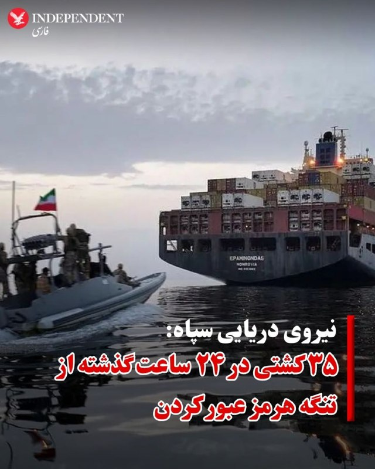

♦️روابط عمومی نیروی دریایی سپاه، روز جمعه یکم خرداد اعلام کرد که در ۲۴ ساعت گذشته، ۳۵ کشتی از تنگه هرمز عبور کرده‌اند.
سپاه بدون اعلام آمار دقیق انواع شناورهای عبوری گفت که این کشتی‌ها شامل نفتکش، کانتینربر و سایر کشتی‌های تجاری بوده است.
نیروی دریایی سپاه، روز پنجشنبه هم از عبور ۳۱ کشتی از تنگه هرمز خبر داده بود.

این خبر درحالی اعلام شده است که  بلومبرگ روز پنجشنبه ۳۱ اردیبهشت گزارش داد، جمهوری اسلامی در حال رایزنی با عمان است تا یک سازوکار دایمی وضع عوارض را برای رسمی کردن کنترل خود بر تردد دریایی در تنگه هرمز ایجاد کند.
‌🇸🇦 Indypersian

🤖 @VahidOOnLine

## VahidOOnLine — post 241495

  

حسنعلی اخلاقی‌امیری، عضو کمیسیون فرهنگی مجلس، به دیده‌بان ایران گفت جمهوری اسلامی بنا ندارد در حوزه خلیج فارس و تنگه هرمز از «حقوق» خود کوتاه بیاید و افزود: «قانون دریافت عوارض از تنگه هرمز را تصویب می‌کنیم.»

او اضافه کرد: «تمام مسئولان اتفاق نظر دارند که تنگه هرمز از منافع جمهوری اسلامی است. هر مذاکره‌ای هم صورت بگیرد، کشتی‌های دشمن و کشورهای همکار دشمن حق عبور نداشته و بقیه کشتی‌ها باید عوارض بپردازند.»

اخلاقی‌امیری همچنین با اشاره به تهدید دونالد ترامپ درباره بازگشایی تنگه هرمز گفت آمریکا می‌خواهد با باز کردن این تنگه «خود را از این معرکه خلاص کند»، اما پس از «تحمیل جنگ اخیر» و وارد شدن هزینه‌های سنگین به جمهوری اسلامی، «دیگر قرار نیست از حق خود بگذریم.»
‌🏁 🇬🇧 IranintlTV

🤖 @VahidOOnLine

## VahidOOnLine — post 241494

  

انور قرقاش، مشاور دیپلماتیک رییس امارات متحده عربی، روز جمعه هشدار داد دور دوم درگیری میان آمریکا و جمهوری اسلامی می‌تواند وضعیت منطقه را پیچیده‌تر کند اما تاکید کرد که هر راه‌حل سیاسی باید به «ریشه‌های» بحران بپردازد تا از ایجاد پیچیدگی‌های جدید در آینده جلوگیری شود.

قرقاش همچنین هشدار داد هرگونه تغییر در وضعیت کنترل تنگه هرمز پیامدهای جدی خواهد داشت.

او از کشورهای اروپایی خواست تنگه هرمز را نه مسئله‌ای دوردست، بلکه موضوعی مرتبط با امنیت انرژی و تجارت خود بدانند.
‌🏁 🇬🇧 IranintlTV

🤖 @VahidOOnLine

## VahidOOnLine — post 241493

  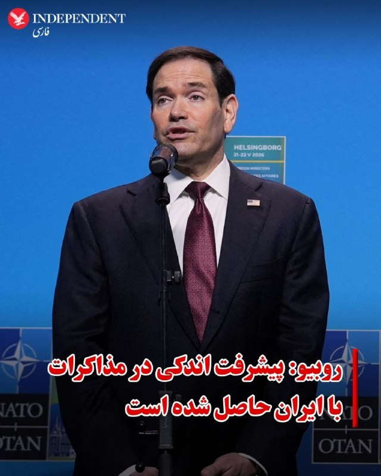

♦️مارکو روبیو، وزیر امور خارجه آمریکا روز جمعه اول خردادماه گفت پیشرفت‌های اندکی در مذاکرات با جمهوری اسلامی ایران حاصل شده است.
روبیو که برای شرکت در اجلاس وزاری خارجه ناتو به هلسینبورگ سوئد رفته است،‌ یک روز پیش از این هم گفته بود که «نشانه‌هایی از پیشرفت در مذاکرات با تهران دیده می‌شود.»

این سخنان در حالی عنوان می‌شود که تلویزیون الجزیره قطر روز جمعه به نقل از یک مقام آگاه پاکستان گزارش داد که کوتاه نیامدن تهران و واشنگتن درباره ذخایر اورانیوم و تنگه هرمز، باعث بن‌بست در مذاکرات شده است.
‌🇸🇦 Indypersian

🤖 @VahidOOnLine

## VahidOOnLine — post 241492

بحران جمعیت برای جمهوری اسلامی؛ چرا ایرانی‌ها دیگر فرزند نمی‌آورند؟
نعیمه دوستدار- کاهش تعداد تولدها در ایران و سقوط آمار موالید به زیر یک میلیون، بحران جمعیتی را به مرکز سیاست‌گذاری جمهوری اسلامی بازگردانده است. مساله جمعیت دیگر فقط یک نگرانی آماری نیست، بلکه موضوعی سیاسی، امنیتی و ایدئولوژیک برای حکومت است.
در روزهای اخیر، بحث جمعیت بار دیگر به یکی از موضوعات مهم در فضای سیاسی و رسانه‌ای ایران تبدیل شده است. این موج تازه پس از انتشار پیامی منتسب به مجتبی خامنه‌ای، رهبر غایب جمهوری اسلامی، درباره ضرورت افزایش جمعیت آغاز شد. پیامی که در آن، رشد جمعیت به‌عنوان مساله‌ای راهبردی برای آینده ایران توصیف شده است.
تقریبا هم‌زمان با این پیام، علیرضا رئیسی، معاون بهداشت وزارت بهداشت، درمان و آموزش پزشکی، در اظهاراتی هشدار داد تعداد موالید در سال ۱۴۰۳ نسبت به سال قبل حدود هفت درصد کاهش یافته و برای نخستین بار به زیر یک میلیون رسیده است.
بر اساس آمار ارائه‌شده از سوی مقام‌های وزارت بهداشت، تعداد تولدهای ثبت‌شده در سال ۱۴۰۳ حدود ۹۷۹ هزار مورد بوده است. رقمی که نسبت به دهه‌های گذشته کاهش چشمگیری نشان می‌دهد.
رئیسی همچنین گفت که اگر روند فعلی ادامه پیدا کند، رشد جمعیت ایران در دو دهه آینده به نزدیکی صفر خواهد رسید.
این هم‌زمانی معنادار است. از یک سو رهبر دیده نشده جمهوری اسلامی بر ضرورت افزایش جمعیت تاکید می‌کند و از سوی دیگر، مقام‌های رسمی دولت درباره کاهش موالید هشدار می‌دهند.
همین مساله نشان می‌دهد موضوع جمعیت برای جمهوری اسلامی تا چه اندازه جدی است.

‌🏁 🇬🇧 IranintlTV

🤖 @VahidOOnLine

## VahidOOnLine — post 241491

  

مارک روته، دبیرکل ناتو، در نشست وزیران خارجه این ائتلاف در سوئد گفت هرگونه تهدید علیه گذرگاه‌های راهبردی دریایی، از جمله تنگه هرمز، می‌تواند پیامدهای گسترده‌ای برای امنیت بین‌المللی و اقتصاد جهانی داشته باشد.

روته جمعه اول خرداد در دومین روز نشست وزیران خارجه سازمان پیمان نظامی آتلانتیک شمالی (ناتو) در هلسینبورگ سوئد، گفت که این سازمان تحولات مربوط به تنگه هرمز را با دقت دنبال می‌کند و بر حفظ آزادی کشتیرانی و امنیت خطوط انتقال انرژی تاکید دارد.

او همچنین گفت آزادی کشتیرانی در تنگه هرمز موضوعی مهم برای همه اعضای ناتو است، اما ممکن است مستقیما در چارچوب ماموریت رسمی این ائتلاف قرار نگیرد.

روته در عین حال بر ادامه نقش کلیدی آمریکا در امنیت اروپا تاکید کرد و گفت ارسال تجهیزات حیاتی آمریکایی به اوکراین، از جمله سامانه‌های پاتریوت، همچنان برای ناتو اهمیت اساسی دارد.
‌🏁 🇬🇧 IranintlTV

🤖 @VahidOOnLine

## VahidOOnLine — post 241490

  

♦️مارکو روبیو، وزیر خارجه ایالات متحده، روز جمعه یکم خرداد در حاشیه نشست ناتو اظهارات روز پنجشنبه خود در خصوص تلاش تهران برای دریافت عوارض عبور از تنگه هرمز را تکرار کرد و گفت: ایران در پی ایجاد نظامی اختصاصی برای اخذ عوارض در یک آبراه بین‌المللی است و این اقدام «غیرقابل قبول» است.

روبیو با اشاره به اینکه جمهوری اسلامی تلاش می‌کند عمان را نیز برای پیوستن به این سازوکار متقاعد کند، افزود: «من کشوری را نمی‌شناسم که جز ایران از آن حمایت کند و هیچ کشوری در جهان نباید چنین چیزی را بپذیرد.»

وزیر خارجه آمریکا با اشاره به قطعنامه‌ پیشنهادی بحرین در شورای امنیت درباره تنگه هرمز تاکید کرد که واشنگتن برای دستیابی به اجماع جهانی جهت جلوگیری از اجرای چنین طرحی تلاش می‌کند و گفت: «باید دید آیا سازمان ملل همچنان کارآمد است یا نه. ما می‌کوشیم از این مسیر به نتیجه برسیم.»

او همچنین ابراز نگرانی کرد که اگر اخذ عوارض در تنگه هرمز اجرایی شود، ممکن است این رویه در دیگر آبراه‌های مهم جهان نیز تکرار شود.
‌🇸🇦 Indypersian

🤖 @VahidOOnLine

## VahidOOnLine — post 241489

  

یوهان واده‌فول، وزیر خارجه آلمان، اعلام کرد برلین در حال آماده‌سازی برای مشارکت در تلاش‌هایی به رهبری بریتانیا برای تامین امنیت تنگه هرمز است، اما ماموریتی از سوی ناتو به این شکل وجود ندارد.

او گفت گفت‌وگوهای انجام‌شده با آمریکا نشان می‌دهد واشینگتن هرگونه انتقال مسئولیت را با متحدان اروپایی هماهنگ خواهد کرد.

واده‌فول همچنین از تصمیم دونالد ترامپ، رییس‌جمهوری آمریکا، برای اعزام ۵ هزار نیروی اضافی آمریکایی به لهستان استقبال کرد و آن را نشانه‌ای از تداوم تعهدات امنیتی آمریکا دانست.

وزیر خارجه آلمان افزود برلین از آمریکا دعوت کرده است به برنامه اولیه خود برای استقرار موشک‌های دوربرد در آلمان پایبند بماند.
‌🏁 🇬🇧 IranintlTV

🤖 @VahidOOnLine

## VahidOOnLine — post 241488

  

خبرگزاری رویترز گزارش داد یک مقام ارشد آمریکایی اعلام کرد واشینگتن برای اطمینان از تامین مهمات مورد نیاز در جنگ علیه جمهوری اسلامی، به‌طور موقت در روند فروش تسلیحات به تایوان وقفه ایجاد کرده است.

هانگ کائو، سرپرست وزارت نیروی دریایی آمریکا، در جلسه‌ای در سنای آمریکا گفت ایالات متحده می‌خواهد مطمئن شود مهمات کافی برای عملیات «خشم حماسی» علیه جمهوری اسلامی در اختیار دارد، اما فروش‌های نظامی خارجی، هر زمان دولت آمریکا لازم بداند، ادامه خواهد یافت.

دفتر ریاست‌جمهوری تایوان اعلام کرد تاکنون هیچ اطلاعاتی درباره تغییر در روند فروش تسلیحات آمریکا دریافت نکرده است.

رویترز نوشت تایوان در انتظار تایید بسته جدید فروش تسلیحات آمریکاست که ممکن است ارزش آن تا ۱۴ میلیارد دلار باشد.
‌🏁 🇬🇧 IranintlTV

🤖 @VahidOOnLine

## VahidOOnLine — post 241487

  

سعید جلالی‌قدیری، دبیر اتحادیه تولید و صادرات نساجی و پوشاک ایران، گفت کوچک شدن جیب مردم به افت فروش در صنعت پوشاک و نساجی منجر شده است.

او «شرایط نه جنگ نه صلح، نوسانات نرخ ارز و اختلال در تامین مواد اولیه» را از دیگر دلایل افت فروش در این صنعت عنوان کرد.

جلالی‌قدیری افزود صنعت نساجی و پوشاک ایران در آغاز سال جاری با مواردی از جمله انباشت بحران‌های اقتصادی، کاهش قدرت خرید مردم، دشواری در فروش و اختلال در تامین مواد اولیه مواجه است.
‌🏁 🇬🇧 IranintlTV

🤖 @VahidOOnLine

## VahidOOnLine — post 241486

  

مارکو روبیو، وزیر خارجه آمریکا، جمعه یکم خرداد در حاشیه نشست ناتو گفت جمهوری اسلامی در پی ایجاد نظامی اختصاصی برای اخذ عوارض در یک آبراه بین‌المللی است و تلاش می‌کند عمان را نیز به پیوستن به این سازوکار متقاعد کند. روبیو تاکید کرد که این اقدام «غیرقابل قبول» است.

او افزود: «هیچ کشوری در جهان نباید چنین چیزی را بپذیرد. من کشوری را نمی‌شناسم که جز ایران از آن حمایت کند.»

روبیو با اشاره به تحرکات دیپلماتیک در سازمان ملل متحد گفت قطعنامه‌ای با پیشنهاد بحرین در شورای امنیت مطرح شده که آمریکا در آن نقش فعالی داشته و به گفته او، بیشترین تعداد هم‌پیشنهاددهنده را در تاریخ شورای امنیت دارد. او هشدار داد چند کشور در حال بررسی وتوی این قطعنامه هستند و افزود: «این مایه تاسف خواهد بود.»

وزیر خارجه آمریکا تاکید کرد واشینگتن برای دستیابی به اجماع جهانی جهت جلوگیری از اجرای چنین طرحی تلاش می‌کند و گفت: «باید دید آیا سازمان ملل همچنان کارآمد است یا نه. ما می‌کوشیم از این مسیر به نتیجه برسیم.»

او تصریح کرد اگر اخذ عوارض در تنگه هرمز اجرایی شود، ممکن است در دیگر آبراه‌های مهم جهان نیز تکرار شود.
‌🏁 🇬🇧 IranintlTV

🤖 @VahidOOnLine

## WithYashar — post 11938

@withyashar روشن فکران

## WithYashar — post 11937

اتحادیه اروپا: به دلیل بسته ماندن تنگه هرمز، تحریم‌های جدیدی علیه ایران وضع کرديم.
@withyashar

## WithYashar — post 11936

العربیه: بر اساس ارزیابی ایالات متحده، حدود ۱۰۰ افسر از نیروهای سپاه پاسداران انقلاب اسلامی در ماه‌های اخیر به لبنان رسیده‌اند و در حال تسلیح و آموزش فعال نیروهای حزب‌الله هستند.
@withyashar

## WithYashar — post 11935

طبق گزارش العربیه با استناد به یک منبع پاکستانی : اسلام‌آباد به شدت رو چین برای کمک به پیشبرد یک توافق احتمالی بین ایالات متحده و ایران حساب می‌کنه و انتظار میره شهباز شریف، نخست‌وزیر پاکستان، تو مرحله‌‌ی بعدی به چین سفر کنه
@withyashar

## WithYashar — post 11934

  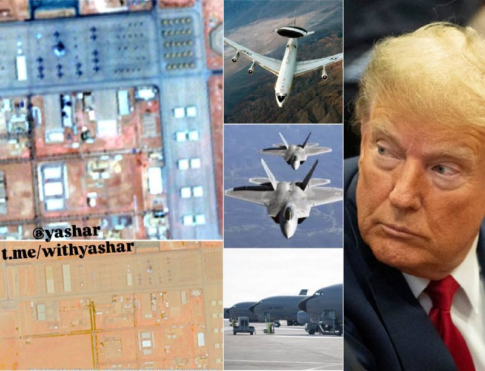

تصاویر ماهواره‌ای که امروز ثبت شده‌اند، آنچه به نظر می‌رسد بیش از یک دوجین هواپیمای سوخت‌رسان در محوطهٔ پایگاه هوایی شاهزاده سلطان را نشان می‌دهد، همچنین چندین هواپیمای شناسایی E-3 سنتری و دست‌کم ۲۰ جنگنده، به‌همراه چندین هواپیمای سوخت‌رسان که در وضعیت آمادهٔ برخاست هستند.

واشنگتن در حالی که دیپلمات‌ها در حال مذاکره هستند، ماشین جنگی خود را در وضعیت آماده شلیک نگه داشته است.
@withyashar

## WithYashar — post 11933

کانال ۱۲ اسرائیل : بر اساس گزارش، پیش‌نویس توافق‌نامه در مجموع شامل ۹ ماده است
از جمله توقف عملیات نظامی و جنگ رسانه‌ای بین کشورها، احترام به حاکمیت و خودداری از دخالت در امور داخلی و همچنین رعایت قوانین بین‌المللی و منشور سازمان ملل.
@withyashar

## WithYashar — post 11932

امروز ۲۲ می (۱ خرداد) روز جهانی پیتزای بیت‌کوین است . این روز به یادبود اولین تراکنش واقعی برای خرید یک کالای فیزیکی با بیت‌کوین در سال ۲۰۱۰ نام‌گذاری شده است که در آن کاربری به نام لازلو هانیچ (Laszlo Hanyecz) دو پیتزا را در ازای ۱۰,۰۰۰ بیت‌کوین خریداری کرد.
@withyashar

## WithYashar — post 11931

وزیر امور خارجه آلمان: ما در حال آماده شدن برای مشارکت در تأمین امنیت تنگه هرمز تحت رهبری بریتانیا هستیم، اما انتظار ماموریتی مشابه ناتو را ندارم
@withyashar

## WithYashar — post 11930

وال استریت ژورنال: میلیاردها دلار از طریق پلتفرم بایننس به شبکه‌هایی که نظام ایران را تامین مالی می‌کنند، جریان یافته است بابک زنجانی شخص مسئول ایرانی در معاملات از طریق پلتفرم بایننس است @withyashar

## WithYashar — post 11929

رسانه‌های داخلی ایران تصاویری منتشر کرده‌اند که نشان می‌دهد نیروهای سپاه به غیرنظامیان و کودکان آموزش باز و بسته کردن سلاح می‌دهند. خبرگزاری «آسوشیتدپرس» نیز گزارش داده نیروهای سپاه به‌طور منظم نحوه استفاده از تفنگ‌های تهاجمی مانند کلاشینکف به غیرنظامیان آموزش می‌دهند. پایتخت ایران همچنین شاهد رژه خودروهای نظامی مجهز به مسلسل‌های قدیمی ساخت شوروی است.
@withyashar

## mwarmonitor — post 9469

🚨 خبرنگار الجزیره: شورای اروپا تحریم‌های خود علیه ایران را گسترش داده و افراد و نهادهایی را نیز شامل کرده است که به تهدید کشتیرانی در خاورمیانه متهم هستند.

@mwarmonitor

## mwarmonitor — post 9468

🔴 منبع پاکستانی به الجزیره:
«آمریکا و ایران درگیر و اسیر مواضع سخت‌گیرانه و سقف‌های بالای خواسته‌های خود درباره اورانیوم، بستن تنگه هرمز و محاصره بنادر هستند.»

@mwarmonitor

## mwarmonitor — post 9467

📝 اظهار نظر تو شرایط فعلی بیشتر شبیه به شرط‌بندی روی مسابقات اسب‌دوانی است تا تحلیل سیاسی؛ با این حال، نظر من همچنان مانند گذشته است: توافقی در کار نخواهد بود و جنگ شروع خواهد شد.

@mwarmonitor

## mwarmonitor — post 9466

🔴 فوری | پیش‌نویس نهایی یک توافق احتمالی میان ایالات متحده و ایران با میانجی‌گری پاکستان، طبق منابع العربیه، انتظار می‌رود ظرف چند ساعت آینده اعلام شود. مفاد اصلی آن به شرح زیر است: 🔴 پیش‌نویس نهایی توافق احتمالی آمریکا–ایران با میانجی‌گری پاکستان ممکن است…

## mwarmonitor — post 9465

  

✈️🛰 تداخل GPS بر فراز امارات/خلیج عمان باعث می‌شود هواپیما در Flightradar24 در موقعیت‌های اشتباه نمایش داده شود.

✈️هواپیمای KC-46A نیروی هوایی آمریکا در واقع بر فراز خلیج عمان است، نه بر فراز ایران.

✈️هواپیمای Il-76TD اماراتی در واقع در امارات فرود آمده و در خلیج فارس نیست.

@mwarmonitor

## mwarmonitor — post 9464

🔴خبر اختصاصی: ترامپ سرکوب شهروندی را تشدید می‌کند

📝نویسنده: بریتانی گیبسون AXIOS

🔰دولت ترامپ به منظور سرعت بخشیدن به تلاش‌ها برای سلب شهروندی از آمریکایی‌های هیسپانیک‌تبار و سایر مهاجرانی که تابعیت گرفته‌اند (Naturalized Americans)، وکلای مهاجرت را به طور موقت به وزارت دادگستری منتقل می‌کند؛ موضوعی که اکسیوس به آن پی برده است.

چرا این موضوع اهمیت دارد؟
پرونده‌های «سلب تابعیت» (Denaturalization) نیاز به بار اثبات (مدارک و شواهد) بسیار سنگینی دارند، اما این موضوع به یکی از اولویت‌های اصلی مقامات دولت ترامپ تبدیل شده است که به دنبال کشف و ردیابی کلاهبرداری در سیستم مهاجرت قانونی هستند.
نگاهی دقیق‌تر (بزرگ‌نمایی)
چهار مقام سابق آژانس مهاجرت به اکسیوس اعلام کردند که وکلای اداره شهروندی و مهاجرت ایالات متحده (USCIS) — که دفتر اصلی خدمات مهاجرت قانونی است — به طور موقت به دفاتر دادستانی ایالات متحده منتقل می‌شوند تا روی پرونده‌های سلب تابعیت کار کنند.
یکی از منابع گفت که به کارمندان گفته شده به این دفاتر منتقل شوند (انتقال‌های اجباری در قالب داوطلبانه). منبع دوم این جابه‌جایی‌ها را مجبور کردن وکلا به «داوطلب شدن اجباری» توصیف کرد.
منبع سوم اشاره کرد که نیازی نیست این وکلا سابقه قبلی در دادگاه یا پرونده‌های سلب تابعیت داشته باشند؛ بلکه تنها داشتن پروانه وکالت فعال کافی است.
زک کالر، سخنگوی اداره شهروندی و مهاجرت آمریکا (USCIS) در این باره گفت: «ما مفتخریم که با اعزام تیمی از ماهرترین وکلای مهاجرتی خود به وزارت دادگستری، از این تلاش حیاتی حمایت می‌کنیم.»
پشت پرده ماجرا
دولت ترامپ در دوره اول ریاست‌جمهوری خود نیز تلاش کرد تا آمار پرونده‌های سلب تابعیت را افزایش دهد و تیمی اختصاصی متشکل از ۱۰ تا ۱۵ وکیل تشکیل داد. جو ادلو، رئیس سابق USCIS، سپتامبر گذشته گفت پرونده‌هایی که توسط آن تیم شناسایی شده‌اند «هنوز در دست بررسی و جریان هستند.»
یکی از منابع گفت: «دلیلی وجود دارد که چرا پرونده‌های سلب تابعیت هیچ‌وقت واقعاً اوج نگرفته‌اند. اثبات این موارد بسیار سخت است... معیارها بسیار سخت‌گیرانه هستند و شما به مدارک محکمی نیاز دارید. در بسیاری از پرونده‌ها، چنین مدارکی اصلاً وجود ندارد.»
بار حقوقی اثبات جرم: در پرونده‌های حقوقی (مدنی) که فرد به طور عمدی در درخواست خود دروغ گفته است، قانون نیاز به اثبات از طریق «شواهد واضح، متقاعدکننده و بدون ابهام دارد که هیچ شک و شبهه‌ای باقی نگذارد.»
در مواردی که فرد به طور غیرقانونی شهروندی کشوری را گرفته که واجد شرایط آن نبوده است، ممکن است اتهامات کیفری نیز علیه او مطرح شود.
تصویر کلی
بر اساس گزارش ماه آوریل روزنامه نیویورک تایمز، مقامات وزارت دادگستری نام ۳۸۵ نفر را در فهرست نهایی برای اتهامات سلب تابعیت قرار داده‌اند. در دوره اول ترامپ، اداره USCIS ادعا کرد که ۲۵۰۰ پرونده بالقوه را شناسایی کرده، اما تنها بخش کوچکی از آن‌ها را به وزارت دادگستری ارجاع داد.
به گفته سخنگوی وزارت دادگستری (DOJ)، دولت ترامپ از زمان آغاز دوره دوم خود ۳۵ پرونده سلب تابعیت تشکیل داده است که ۱۲ مورد آن همین ماه گذشته انجام شده است.
همچنین یادداشت وزارت دادگستری در ژوئن ۲۰۲۵، سلب تابعیت را به عنوان یکی از اولویت‌های اصلی دولت ترامپ فهرست کرده بود. در این یادداشت با اشاره به مزایای پیگیری این پرونده‌ها آمده است که این اقدام «از یکپارچگی و سلامت کل برنامه اعطای تابعیت حمایت می‌کند.»
سخنگوی وزارت دادگستری در بیانیه‌ای به اکسیوس گفت که این وزارتخانه از کمک وکلای USCIS «برای پیشبرد مأموریت رئیس‌جمهور جهت ارتقای امنیت عمومی و ریشه‌کن کردن کلاهبرداری» استقبال می‌کند.

📌افزایش پرونده‌های سلب تابعیت، مدت‌هاست که هدف اصلی جو ادلو در مبارزه او علیه درخواست‌های مهاجرتی مشکوک به کلاهبرداری بوده است.
ادلو سپتامبر گذشته در رویدادی که توسط «مرکز مطالعات مهاجرت» برگزار شد، در پاسخ به سؤالی درباره واحد سلب تابعیت در دوره اول ترامپ گفت: «فکر می‌کنم غیرمتمرکز کردن فرآیند سلب تابعیت نیز به همان اندازه مفید است.»
او افزود: «اگر موردی پیش بیاید که نیاز به سلب تابعیت داشته باشد، ما اقدام خواهیم کرد. نیازی ندارم که پرونده حتماً به یک دفتر خاص فرستاده شود؛ من می‌خواهم هر دفتری از این موضوع به عنوان یک معیار استاندارد استفاده کند.»

@mwarmonitor

## mwarmonitor — post 9463

مغزهای متفکر این یک پیش نویس نه توافق

## mwarmonitor — post 9462

استادان رسانه‌ ای این خبر الان نه دیشب

## mwarmonitor — post 9461

🔴 فوری | پیش‌نویس نهایی یک توافق احتمالی میان ایالات متحده و ایران با میانجی‌گری پاکستان، طبق منابع العربیه، انتظار می‌رود ظرف چند ساعت آینده اعلام شود. مفاد اصلی آن به شرح زیر است:

🔴 پیش‌نویس نهایی توافق احتمالی آمریکا–ایران با میانجی‌گری پاکستان ممکن است ظرف چند ساعت اعلام شود

🔴 آتش‌بس فوری، جامع و بدون قید و شرط در تمام جبهه‌ها شامل زمین، دریا و هوا

🔴 تعهد متقابل به عدم هدف قرار دادن زیرساخت‌های نظامی، غیرنظامی یا اقتصادی

🔴 پایان عملیات نظامی و توقف جنگ رسانه‌ای

🔴 تعهد به احترام به حاکمیت، تمامیت ارضی و عدم مداخله در امور داخلی

🔴 تضمین آزادی کشتیرانی در خلیج فارس، تنگه هرمز و خلیج عمان

🔴 ایجاد سازوکار مشترک برای نظارت بر اجرای توافق و حل اختلافات

🔴 آغاز مذاکرات درباره مسائل باقی‌مانده ظرف هفت روز

🔴 لغو تدریجی تحریم‌های آمریکا در ازای پایبندی ایران به مفاد توافق

🔴 پیش‌نویس توافق بر پایبندی به قوانین بین‌المللی و منشور سازمان ملل تأکید می‌کند

🔴 این توافق بلافاصله پس از اعلام رسمی از سوی هر دو طرف اجرایی خواهد شد

@mwarmonitor

## mwarmonitor — post 9460

🔴وزیر خارجه بریتانیا:
«این شرم‌آور است که ایران تلاش می‌کند با جلوگیری از حرکت کشتیرانی بین‌المللی، کل اقتصاد جهانی را به گروگان بگیرد.»

@mwarmonitor

## mwarmonitor — post 9459

🔴منبع پاکستانی به الجزیره:
«اسلام‌آباد همچنان نسبت به امکان رسیدن به یک تفاهم مرحله‌ای میان واشنگتن و تهران خوش‌بین است.»

@mwarmonitor

## pm_afshaa — post 91187

  <a href="telegram/content/pm_afshaa_91187_1779448991.webm" target="_blank">🎬 Download video</a>

🔴العربیه: اسلام‌آباد به شدت رو چین برای کمک به پیشبرد یک توافق احتمالی بین آمریکا و ایران حساب میکنه و انتظار میره شهباز شریف، نخست‌وزیر پاکستان، تو مرحله‌‌ی بعدی به چین سفر کنه.

💧 Rainbet.com the #1 Non-KYC Crypto Casino & Sportsbook @rainbetcom

😁 @Pm_Afshaa

## pm_afshaa — post 91186

  <a href="telegram/content/pm_afshaa_91186_1779448992.webm" target="_blank">🎬 Download video</a>

🔴وال‌استریت ژورنال:
میلیاردها دلار رمزارز از طریق بایننس به شبکه‌های مالی مرتبط با جمهوری اسلامی و سپاه منتقل شده و این روند ادامه داره.

طبق این گزارش، بابک زنجانی طی دو سال حدود 850 میلیون دلار تراکنش در بایننس داشته که گفته میشه صرف تامین مالی ساختار نظامی جمهوری اسلامی شده باشه.

وزارت دادگستری آمریکا تحقیقاتی رو درباره استفاده جمهوری اسلامی از پلتفرم بایننس به‌منظور دور زدن احتمالی تحریم‌ها آغاز کرده.

💧 Rainbet.com the #1 Non-KYC Crypto Casino & Sportsbook @rainbetcom

😁 @Pm_Afshaa

## pm_afshaa — post 91185

  <a href="telegram/content/pm_afshaa_91185_1779448992.webm" target="_blank">🎬 Download video</a>

🔴الجزیره به نقل از منبع پاکستانی:
اصرار آمریکا و ایران بر بالا بردن سقف خواسته‌هایشان درباره اورانیوم و تنگه هرمز، به بن‌بست در مذاکرات منجر شده.

💧 Rainbet.com the #1 Non-KYC Crypto Casino & Sportsbook @rainbetcom

😁 @Pm_Afshaa

## pm_afshaa — post 91184

  <a href="telegram/content/pm_afshaa_91184_1779448993.webm" target="_blank">🎬 Download video</a>

🔴رویترز به نقل از یک منبع پاکستانی:
نگرانی وجود داره که صبر ترامپ در حال تمام شدن است، اما ما در تلاشیم تا سرعت انتقال پیام بین دو طرف رو افزایش بدیم.

💧 Rainbet.com the #1 Non-KYC Crypto Casino & Sportsbook @rainbetcom

😁 @Pm_Afshaa

## DEJradio — post 4837

  <a href="telegram/content/DEJradio_4837_1779448994.webm" target="_blank">🎬 Download video</a>

🔺🎤 تهدیدات سپاه پاسداران در سایه جنگ؛

گفت‌وگو با شایان سمیعی، کارشناس امنیت ملی

#جنگ #IRGCterrorists
@DEJradio

## DEJradio — post 4836

  <a href="telegram/content/DEJradio_4836_1779448995.webm" target="_blank">🎬 Download video</a>

🚨📢 محاصره دریایی ایران؛
ذخیره‎سازی نفت در نفتکش‌های قدیمی و کوچک

روزنامه فایننشال‌تایمز گزارش داد جمهوری اسلامی در پی محاصره دریایی توسط آمریکا و کاهش شدید امکان صادرات نفت، به ذخیره‌سازی نفت روی نفتکش‌های فرسوده در خلیج فارس روی آورده است. این اقدام نشان‌دهنده فشار فزاینده بر صادرات نفت ایران در هفته‌های اخیر است.

براساس آخرین داده‌ها مخازن نفتکش‌های قدیمی هم پر شده و برای ذخیره نفت تولیدی از شناورهای کوچک‌تر استفاده می‌شود.
بر اساس تحلیل تصاویر ماهواره‌ای آژانس فضایی اروپا، تعداد نفتکش‌های متوقف‌شده در اطراف جزیره خارک، مهم‌ترین پایانه صادرات نفت ایران، از شش کشتی در یک ماه پیش به ۲۰ کشتی رسیده است. بسیاری از این کشتی‌ها سامانه‌های موقعیت‌یاب خود را خاموش کرده‌اند و در داده‌های معمول کشتیرانی قابل مشاهده نیستند.

نیما منصفی تحلیلگر «اطلاعات ژئوفضایی» با استناد به تصاویر ماهواره‌ای از ترمینال نفتی خارگ در «ایکس» نوشت، «دو نفتکش کوچک که سابقا مصرف داخلی داشتند در حال بارگیری در جزیره خارگ هستند. ظرفیت آنها حداکثر ۱۵۰ هزار بشکه است».

#محاصره_دریایی #خلیج_فارس #تنگه_هرمز
@DEJradio

## DEJradio — post 4835

  <a href="telegram/content/DEJradio_4835_1779448995.mp4" target="_blank">🎬 Download video</a>

🤡
🔺 چادری‌ها بی‌حجاب‌های حکومتی را تحمل نمی‌کنند.

#حجاب #چادری #تجمعات_حکومتی
@DEJradio

## DEJradio — post 4834

  <a href="telegram/content/DEJradio_4834_1779448997.webm" target="_blank">🎬 Download video</a>

🚨
⭕️ منابع مطلع به دژ می‌گویند، بامداد آدینه ابتدای خرداد، حوالی ساعت ۰۲:۰۰ در بهشهر استان مازندران محله «سارو»، فردی به‌نام حسین محمدی توسط ماموران نیروی انتظامی کشته شده است.

ایست بازرسی و گشت محله‌محور که توسط ماموران نیروی انتظامی [یگان امداد] برقرار شده بود یک ماشین پژو پارس را متوقف می‌کند و با بدرفتاری و توهین دو سرنشین را بازرسی بدنی می‌شوند.

شاهدان می‌گویند پلیس به دو جوان حرف‌های تحقیرآمیز زده‌اند.

حسین محمدی (پدر یکی از سرنشینان) برای آرام کردن قضیه وارد می‌شود اما ماموران به او نیز توهین می‌کنند و درگیر می‌شوند که یکی از ماموران او را با تیر مستقیم کلت به قتل می‌رساند. در پی این اقدام مردم و نیروی انتظامی درگیر شدند.

#مازندران #قتل #حسین_محمدی
@DEJradio

## DEJradio — post 4833

  <a href="telegram/content/DEJradio_4833_1779448998.webm" target="_blank">🎬 Download video</a>

🔺📢 اعتصاب مرغ‌داران بهبهان در استان خوزستان موجب کمبود مرغ در شهر شده است.
مرغ‌داران که ۸ روز است در اعتصاب به سر می‌برند، علت اعتصاب خود را بالا بودن هزینه‌ها عنوان کرده‌اند.
در مرغ‌فروشی‌ها تنها ران یخ زده مرغ که از شهرهای دیگر آورده می‌شود موجود است و هر کیلو نزدیک به ۴۰۰ هزار تومان به فروش می‌رسد که توان خرید آن برای اقشار ضعیف اصلا ممکن نیست.
مرغ‌داران می‌گویند توان تامین ذرت و سویا را ندارند و بدهکارند.

#مرغ #تورم
@DEJradio

## DEJradio — post 4832

  <a href="telegram/content/DEJradio_4832_1779448999.webm" target="_blank">🎬 Download video</a>

🚨📢 منابع غیررسمی می‌گویند احتمال دارد آمریکا برای آن‌دسته بازیکنان و اعضای کادر فنی تیم فوتبال جمهوری اسلامی که پیشینه حضور در تیم‌های سـ.ـپاه و بـ.ـسیج را دارند ویزا صادر نکند.

سوشا مکانی دروازه‌بان سابق تیم پرسپولیس و تیم ملی فوتبال، با اشاره به حضور بازیکنان تیم فوتبال در سفارت آمریکا در آنکارا برای دریافت ویزا، در استوری اینستاگرامش نوشت: «اگر فشار جیانی اینفانتینو [رئیس فیفا] به آمریکا نتیجه نده، مهدی طارمی، شجاع خلیل‌زاده، احسان حاج‌صفی و... به دلیل سربازی در سـ.ـپاه جام جهانی رو از دست میدن. روزبه چشمی هم سربازیش تو باشگاه مقاومت بـ.ـسیج بوده... سعید الهویی و آندرو تیموریان هم سرباز ســ.ـپاه بودند. اگر آمریکا تهدیدات کلامی چند بازیکن در تجمعات شبانه رو مبنا قرار بده چند بازیکن دیگه هم جا می‌مونند.»

بر اساس آخرین گزارش‌ها ادعا شد روزبه چشمی در اردوی آنتالیا مصدوم شده و احتمالا از فهرست تیم خط می‌خورد.
اعضای تیم فوتبال پنجشنبه ۳۱ اردیبهشت برای دریافت ویزا به سفارت آمریکا در آنکارا رفتند.

#تیم_ملی #تحریم
@DEJradio

## DEJradio — post 4831

  <a href="telegram/content/DEJradio_4831_1779448999.webm" target="_blank">🎬 Download video</a>

🔺📢 بر اساس اطلاعات دریافتی از ایران، حقوق اردیبهشت بازنشستگان صندوق بازنشستگی نیرو‌های مسلح واریز شده است اما برخلاف اعلام قبلی، مبلغ «فوق‌العاده خاص» افزایش نیافته است.
این مبلغ اضافه فقط ۶۰۰ هزار تومان (برابر با ۵ دلار) بود!

منابع نظامی می‌گویند سازمان برنامه و بودجه به علت ناکافی بودن منابع، با تامین اعتبار برای افزایش این مولفه مزدی موافقت نکرده است.

گفتنی است حقوق اردیبهشت پرسنل نیروهای مسلح بازنشسته‌های لشکری با تأخیر طولانی واریز شده است. همچنین پرسنل ارتش می‌گویند «بسیاری از داروها حتی آنهایی که در داخل تولید می‌شود از فهرست بیمه خدمات درمانی خارج شده‌ است و حتی آنتی‌بیوتیک‌ها و مُسکن‌ها آزاد حساب می‌شوند.»

دو ماه بعد از جنگ ۴۰ روزه باوجود اینکه نیروهای مسلح با تلفات سنگینی روبه‌رو شدند اما حکومت کمترین توجه را به آنها ندارد و نارضایتی بین آنها تشدید شده است.

#نیرو‌های_مسلح #ارتش
@DEJradio

## kianmeli1 — post 87552

  <a href="telegram/content/kianmeli1_87552_1779449000.mp4" target="_blank">🎬 Download video</a>

🔴میلیاردها دلار از طریق بابک زنجانی و صرافی بایننس برای تامین مالی سپاه پاسداران جابجا کرده است

ایران طی سال‌های اخیر میلیاردها دلار را از طریق صرافی رمزارزی «بایننس» جابه‌جا کرده تا شبکه‌های مالی مرتبط با سپاه پاسداران را تامین کند؛ تراکنش‌هایی که به گفته این رسانه، حتی تا همین ماه نیز ادامه داشته‌اند.

بر اساس گزارش وال استریست ژورنال، این انتقال‌ها شامل حدود ۸۵۰ میلیون دلار تنها از طریق یک حساب کاربری در بایننس بوده که طی دو سال توسط بابک زنجانی، تاجر ایرانی و آنچه در اسناد داخلی «اپراتور ضدتحریم» خوانده شده، اداره می‌شد.

گزارش می‌گوید سیستم‌های نظارتی داخلی بایننس دست‌کم ۱۲ بار این حساب را به‌عنوان حساب مشکوک علامت‌گذاری کرده بودند، اما این حساب بیش از ۱۵ ماه پس از نخستین هشدار همچنان فعال باقی ماند.

این گزارش همچنین از انتقال ۲۱۸ میلیون دلار به شبکه مالی وابسته به حکومت ایران از طریق یک کیف‌پول مرتبط با بایننس خبر می‌دهد. وال‌استریت ژورنال پیش‌تر گزارش داده بود که حدود ۱.۷ میلیارد دلار از طریق بایننس به همین شبکه مالی ایرانی منتقل شده است.
https://t.me/kianmeli1

## kianmeli1 — post 87551

  <a href="telegram/content/kianmeli1_87551_1779449002.mp4" target="_blank">🎬 Download video</a>

🔴صدای #بنیامین_نقدی و #منوچهر_فلاح باشیم

بنیامین نقدی، از معترضان بازداشت شده در ۱۳ دی‌ماه خونین در شهر شیراز است. وضعیت پرونده‌سازی، اخذ اعتراف اجباری و کینه‌ی قضات شیراز در تسریع اجرای حکم اعدام، جان او را در خطر جدی قرار داده است. همچنین منوچهر فلاح توسط قاضی مرگ گیلان «احمد درویش گفتار» پس از رد اعاده‌ی دادرسی دوباره به اعدام محکوم شده.

در روزها و ساعاتی که ماشین سرکوب جمهوری اسلامی، هر جان و نام بازداشتی محکوم به اعدام را تنها به عددی در کارنامه‌ی خونین خود بدل میکند، نام‌شان را فریاد بزنیم، آنها جز ما فریادرسی ندارند
https://t.me/kianmeli1

## kianmeli1 — post 87550

  <a href="telegram/content/kianmeli1_87550_1779449005.mp4" target="_blank">🎬 Download video</a>

🔴حزب‌الله با پهپاد انتحاری، یکی از باتری‌های گنبد آهنین اسرائیل را هدف قرار داده است

دقیقا مشخص نیست این نوع پهپادهای سبک از کجا تامین میشوند
https://t.me/kianmeli1

## kianmeli1 — post 87549

  

🔴درگیری در ایران به هند ضربه سختی وارد کرده است. این کشور به نفت وارداتی متکی است که بخش عمده آن از طریق تنگه هرمز وارد می‌شود، بنابراین افزایش قیمت انرژی باعث تضعیف رشد، افزایش تورم و ترساندن سرمایه‌گذاران می‌شود.

مودیز در حال حاضر پیش‌بینی رشد هند را به ۶ درصد کاهش داده است - بسیار کمتر از ۸ درصدی که مودی می‌گوید برای تبدیل هند به یک کشور توسعه‌یافته تا سال ۲۰۴۷ لازم است.

در عین حال، ترامپ به چین و پاکستان، دو رقیب اصلی هند، نزدیک‌تر شده است و سال‌ها تلاش مودی برای ایجاد روابط قوی‌تر با واشنگتن را تضعیف می‌کند.
https://t.me/kianmeli1

## IranIntlTV — post 338399

  <a href="telegram/content/IranIntlTV_338399_1779449009.mp4" target="_blank">🎬 Download video</a>

مخاطبان ایران‌اینترنشنال در پیام‌هایی از ادامه روند اخراج و تعدیل نیرو در کارخانه‌ها، پالایشگاه‌ها، شرکت‌های هواپیمایی و تاکسی‌های اینترنتی خبر می‌دهند.
گفت‌وگو با احمد علوی، استاد دانشگاه و اقتصاددان
@iranintltv

## IranIntlTV — post 338398

🔻بندر خَصَب، راه فرار جمهوری اسلامی از محاصره دریایی؟

🖋فرناز داوری

در میانه آتش‌بس شکننده و محاصره دریایی در تنگه هرمز، بندر خَصَب در عمان به یکی از مسیرهای حیاتی برای رساندن کالا به ایران تبدیل شده است. بندری که با قایق‌های «شوتی»، ماهیگیران و گردشگران شناخته می‌شد، حالا گذرگاهی پرهزینه اما مهم برای دور زدن محاصره بنادر جنوبی ایران شده است.

تا پیش از آغاز جنگ آمریکا و اسرائیل علیه جمهوری اسلامی، بخشی از رفت‌وآمدهای دریایی میان خصب و سواحل جنوبی ایران، به قایق‌های تندرو اختصاص داشت. قایق‌هایی که در ادبیات محلی به «شوتی» معروف‌ هستند و سال‌ها در مسیرهای غیررسمی میان عمان و جنوب ایران، رفت‌وآمد کرده‌اند.

این قایق‌ها معمولا به صورت گروهی حرکت می‌کردند و در زمانی کوتاه خود را از آب‌های عمان به قشم یا دیگر نقاط ساحلی ایران می‌رساندند.

این مسیر پیش از این بیشتر برای دادوستدهای غیررسمی و قاچاق خرد شناخته می‌شد. سیگار ایرانی، مشروبات الکلی و حشیش، از ایران به عمان منتقل می‌شد و در مسیر بازگشت، کالاهای مصرفی، لوازم خانگی و اجناس لوکس، از عمان به ایران می‌رسید.

حضور قایق‌های ماهیگیری ایرانی نیز در اطراف خصب همیشه بخشی از تصویر معمول این منطقه بود.
بندر خصب کجاست؟

خصب مرکز استان مُسندَم در کشور عمان است. منطقه‌ای برون‌بومی در شمال این کشور که از خاک اصلی عمان جدا مانده و میان آن و دیگر بخش‌های عمان، خاک امارات متحده عربی قرار دارد.

این موقعیت جغرافیایی، خصب را به نقطه‌ای کم‌نظیر در دهانه تنگه هرمز تبدیل کرده است.

بندری کوچک در فاصله حدود ۳۵ کیلومتری ایران، میان کوه‌های خشک و آبدره‌هایی که تا پیش از جنگ، بیشتر مقصد قایق‌های تفریحی و تورهای دریایی بودند.

اما محدودیت‌های دریایی، کارکرد این مسیر را تغییر داده است.

با بسته شدن مسیرهای اصلی در تنگه هرمز به روی کشتی‌های ایرانی و کشتی‌های مرتبط با جمهوری اسلامی، خصب از یک مسیر فرعی و محلی به یکی از راه‌های جایگزین برای رساندن کالا به ایران تبدیل شده است. کالاهایی که پیش از این از مسیرهای معمول تجاری و از بنادر امارات متحده عربی به ایران می‌رفتند، اکنون در بخشی از شبکه حمل‌ونقل، از مسیر عمان و بندر خصب عبور داده می‌شوند.
انتقال کالا به ایران چگونه انجام می‌شود؟

یک بازرگان مطلع به ایران‌اینترنشنال گفت پس از آتش‌بس، روند انتقال کالا به این شکل انجام می‌شود که بارهای به مقصد ایران، ابتدا با کشتی‌هایی با پرچم کشورهایی غیر از ایران، از بنادر امارات به خصب منتقل می‌شوند. سپس این محموله‌ها در اسکله خصب روی شناورهای ایرانی تخلیه می‌شوند و این شناورها، خارج از مسیرهای اصلی تحت کنترل، بار را به بنادر ایران می‌رسانند.

به گفته این بازرگان، بخش مهمی از این انتقال با شناورهای «لندینگ کرافت» انجام می‌شود.

این شناورها به‌دلیل امکان حرکت در آب‌های کم‌عمق و پهلوگیری در اسکله‌های کوچک، برای چنین مسیری مناسب‌ هستند و برخی از آن‌ها می‌توانند صدها تن تا حدود هزار تن بار حمل کنند و ظرفیت جابه‌جایی کانتینر، خودرو و محموله‌های سنگین‌تر را نیز دارند.

محموله‌هایی که از این مسیر به ایران می‌رسند، محدود به یک نوع کالا نیستند.

به گفته منابع تجاری، از خودرو و قطعات یدکی گرفته تا لوازم خانگی، تجهیزات مصرفی، کالاهای بهداشتی و حتی برخی اقلام مرتبط با فرآورده‌های نفتی می‌تواند در این مسیر جابه‌جا شود.
رفتن از این مسیر چه هزینه‌ای دارد؟

استفاده از این مسیر هزینه سنگینی دارد.

یک بازرگان به ایران‌اینترنشنال گفت انتقال کالا از مسیر خصب، در مقایسه با مسیری که پیش‌تر از امارات به خرمشهر استفاده می‌شد، حدود شش برابر گران‌تر است.

🔗ادامه این گزارش را اینجا بخوانید
@iranintltv

## IranIntlTV — post 338397

  <a href="telegram/content/IranIntlTV_338397_1779449011.mp4" target="_blank">🎬 Download video</a>

ویدیوی ارسالی یک شهروند به ایران اینترنشنال نشان می‌دهد روز جمعه در پی بحران سوخت و شلوغی جایگاه‌های سوخت در شهرهای ایران در قشم صف طولانی بنزین شکل گرفته است.

## IranIntlTV — post 338396

  <a href="telegram/content/IranIntlTV_338396_1779449014.mp4" target="_blank">🎬 Download video</a>

یک کارمند کارخانه لاستیک کرمان در پیامی به ایران اینترنشنال از کاهش شمار نیروهای این شرکت و کم شدن شیفت‌های آن در پی بحران اقتصادی شدید خبر داد. پیام او با هوش مصنوعی خوانده شده است.

## IranIntlTV — post 338395

  

محمدجواد حاج‌علی‌اکبری، امام جمعه تهران، گفت نیروهای مسلح جمهوری اسلامی آماده‌تر از همیشه و دست به ماشه هستند و اگر دشمنان «دست به کار احمقانه‌ای بزنند»، این بار «موشک‌های جدیدی را تجربه خواهند کرد که فکرش را نکرده‌اند» و اسرائیل نیز «نفسش به شماره خواهد افتاد».

او در خطبه‌های نماز جمعه تهدید کرد در صورت تشدید درگیری‌ها، به جای «جنگ منطقه‌ای»، جنگ «فرامنطقه‌ای» رخ خواهد داد و به جای محدود شدن تنگه هرمز، باب‌المندب نیز بسته خواهد شد.

حاج‌علی‌اکبری افزود اگر زیرساخت‌های جمهوری اسلامی هدف قرار گیرد، «از تمام حامیان دشمن در منطقه، زیرساخت‌زدایی خواهد شد».
https://iranintl.com/202605225939

## IranIntlTV — post 338394

  

شورای اتحادیه اروپا اعلام کرد چارچوب حقوقی تحریم‌های این اتحادیه علیه جمهوری اسلامی را گسترش داده تا افراد و نهادهای دخیل در مختل کردن عبور قانونی کشتی‌ها در تنگه هرمز را هدف تحریم قرار دهد.

این تحریم‌ها شامل مسدود شدن دارایی‌ها، ممنوعیت سفر و همکاری مالی و اقتصادی شرکت‌ها و شهروندان اروپایی با افراد و نهادهای تحریم‌شده است.

شورای اتحادیه اروپا تاکید کرد که اقدام‌های جمهوری اسلامی علیه کشتی‌ها در تنگه هرمز مغایر حقوق بین‌الملل است.
https://iranintl.com/202605226607

## IranIntlTV — post 338393

  <a href="telegram/content/IranIntlTV_338393_1779449018.mp4" target="_blank">🎬 Download video</a>

سرخط خبرهای جمعه ۱ خرداد
@iranintltv

## IranIntlTV — post 338392

  <a href="telegram/content/IranIntlTV_338392_1779449019.mp4" target="_blank">🎬 Download video</a>

با نزدیک شدن به جام جهانی ۲۰۲۶، هزینه‌های مرتبط با میزبانی این رویداد در تورنتو از مرز یک میلیارد دلار عبور کرده است. این در حالی است که آماده‌سازی برای برگزاری یکی از بزرگ‌ترین رویدادهای ورزشی جهان همچنان ادامه دارد و فشار بر بودجه عمومی افزایش یافته است.
مهسا مرتضوی، خبرنگار ایران‌اینترنشنال، گزارش می‌دهد
@iranintltv

## IranIntlTV — post 338391

روایت شما از زندگی در آتش‌بس- جمعه ۱ خرداد ۱۴۰۵

🔹 از شیراز پیام می‌دم. ۲ ماه بیکاریم. گرانی بیداد می‌کنه. ترامپ عزیز کار را تموم کن.
🔹 یه دندون‌پزشکی ساده نمیشه رفت اونقدر که هزینه‌هامون بالاست. خسته شدیم از این حکومت نکبتی اسلامی.
🔹 از کاشان هستم. تعدیل نیروها خیلی شده و گرونی هم سر به فلک کشیده، تا حدی که دیگه مرغ هم نمیشه خرید و کارگرهای بدبخت با این همه قسط و بدهی دارن تعدیل هم می‌شن.
🔹 شاید بتوان برای مدتی بر سر نیزه تکیه کرد، اما هرگز نمی‌توان بر روی آن نشست و حکومت کرد. قابل توجه آنانی که فکر می‌کنند می‌توانند بر سریر خون بنشینند و حکومت کنند. حکومتی که مشروعیتش را از دست بدهد، همه چیزش را باخته است.
🔹 از چابهار پیام می‌دم. امروز (۱ خرداد) رفتم مغازه واسه خواهرم ۴ تا چیپس مزمز گرفتم، جمع کل شد یک میلیون و صد هزار تومان.
🔹 از اراک، شهرستان کمیجان پیام می‌دهم. وضعیت نانوایی‌ها خیلی خراب است. در نبود آرد، نان به صورت سهمیه‌ای شده، صف‌های طولانی تشکیل می‌شود و بعضی نانوایی‌ها تعطیل هستند. نبود آرد این وضعیت را ساخته است. صدای ما را به گوش جهان برسانید.
🔹 از شهسوار مازندران. اوضاع خیلی داغونه. مایحتاج زندگی رو به زور و هر روز با یه قیمت جدید تهیه می‌کنیم. به ریال پول درمیاریم، به دلار داریم خرج می‌کنیم. جاوید شاه.
🔹 در بازار تهران بیشتر رستوران‌ها و فست‌فودی‌ها فروششون به صفر رسیده. یک پرس قرمه‌سبزی شده ۸۰۰ هزار تومان.
🔹 برق شهرک‌های صنعتی رو به علت کمبود برق قطع می‌کنن. کشوری که محاصره اقتصادی و تحریم هست، به جای حمایت از کارخونه‌ها برق‌شون رو قطع می‌کنه که باعث گرونی و تورم و بیکاری بیشتر خواهد شد.
🔹 اینترنت باز بشه، بازار بورس و تجارت به‌صورت رسمی باز بشه، دلار میشه ۵۰۰ تومن. فقط نمی‌دونم تا کی با بسته نگه داشتن می‌تونن قیمت رو کنترل کنن؟

## IranIntlTV — post 338390

  <a href="telegram/content/IranIntlTV_338390_1779449022.mp4" target="_blank">🎬 Download video</a>

مارکو روبیو، وزیر خارجه آمریکا، در دومین روز نشست وزیران خارجه کشورهای عضو ناتو در هلسینبرگ سوئد، هشدار داد هرگونه اقدام جمهوری اسلامی درباره محدودیت تردد یا دریافت عوارض در تنگه هرمز، می‌تواند روند رسیدن به توافق را با خطر مواجه کند.
گفت‌وگو با علی‌حسین قاضی‌زاده، عضو تحریریه ایران‌اینترنشنال
@iranintltv

## IranIntlTV — post 338389

  <a href="telegram/content/IranIntlTV_338389_1779449024.mp4" target="_blank">🎬 Download video</a>

تصویر رسیده به ایران اینترنشنال نشان می‌دهد بستگان و خانواده سعید یعقوبی، از جوانان اعدام‌شده در پرونده مشهور به «خانه اصفهان» بر سر مزارش برگزار شد. این پرونده بر سر مرگ یک مامور انتظامی و دو بسیجی در اعتراضات سال ۱۴۰۱ در محله «خانه اصفهان» تشکیل و در آن صالح میرهاشمی و مجید کاظمی نیز اعدام شده بودند.

## IranIntlTV — post 338388

  

حسنعلی اخلاقی‌امیری، عضو کمیسیون فرهنگی مجلس، به دیده‌بان ایران گفت جمهوری اسلامی بنا ندارد در حوزه خلیج فارس و تنگه هرمز از «حقوق» خود کوتاه بیاید و افزود: «قانون دریافت عوارض از تنگه هرمز را تصویب می‌کنیم.»

او اضافه کرد: «تمام مسئولان اتفاق نظر دارند که تنگه هرمز از منافع جمهوری اسلامی است. هر مذاکره‌ای هم صورت بگیرد، کشتی‌های دشمن و کشورهای همکار دشمن حق عبور نداشته و بقیه کشتی‌ها باید عوارض بپردازند.»

اخلاقی‌امیری همچنین با اشاره به تهدید دونالد ترامپ درباره بازگشایی تنگه هرمز گفت آمریکا می‌خواهد با باز کردن این تنگه «خود را از این معرکه خلاص کند»، اما پس از «تحمیل جنگ اخیر» و وارد شدن هزینه‌های سنگین به جمهوری اسلامی، «دیگر قرار نیست از حق خود بگذریم.»
https://iranintl.com/202605223337

## IranIntlTV — post 338387

  

انور قرقاش، مشاور دیپلماتیک رییس امارات متحده عربی، روز جمعه هشدار داد دور دوم درگیری میان آمریکا و جمهوری اسلامی می‌تواند وضعیت منطقه را پیچیده‌تر کند اما تاکید کرد که هر راه‌حل سیاسی باید به «ریشه‌های» بحران بپردازد تا از ایجاد پیچیدگی‌های جدید در آینده جلوگیری شود.

قرقاش همچنین هشدار داد هرگونه تغییر در وضعیت کنترل تنگه هرمز پیامدهای جدی خواهد داشت.

او از کشورهای اروپایی خواست تنگه هرمز را نه مسئله‌ای دوردست، بلکه موضوعی مرتبط با امنیت انرژی و تجارت خود بدانند.
https://iranintl.com/202605227157

## IranIntlTV — post 338386

  

🔻کنفدراسیون فوتبال آسیا سهمیه کشورهای حاضر در رقابت‌های آسیایی فصل ۲۰۲۸-۲۰۲۷ را اعلام کرد که بر اساس آن، ایران سه سهمیه مستقیم در لیگ نخبگان آسیا و یک سهمیه در لیگ قهرمانان آسیا خواهد داشت.

🔹این در حالی است که عربستان سعودی ۲+۳ و امارات متحده عربی ۱+۳ سهمیه برای لیگ نخبگان آسیا و هر کدام یک سهمیه برای لیگ قهرمانان آسیا توانستند کسب کنند.

🔹در شرق آسیا نیز ژاپن و کره جنوبی به ترتیب سهمیه‌هایی مشابه عربستان سعودی و امارات متحده عربی به دست آوردند و تایلند هم مانند ایران سه سهمیه لیگ نخبگان و یک سهمیه لیگ قهرمانان آسیا کسب کرد.

🔹فوتبال ایران در سال‌های اخیر، به دلیل نتایج ضعیف نمایندگانش و ناکامی در صعود به مراحل پایانی رقابت‌های آسیایی، نتوانسته سهمیه بیشتری به دست آورد. همچنین بیش از ۳۰ سال از آخرین قهرمانی یک تیم ایرانی در رقابت‌های باشگاهی آسیا می‌گذرد.

@iranintltvsport

## IranIntlTV — post 338385

بحران جمعیت برای جمهوری اسلامی؛ چرا ایرانی‌ها دیگر فرزند نمی‌آورند؟
نعیمه دوستدار- کاهش تعداد تولدها در ایران و سقوط آمار موالید به زیر یک میلیون، بحران جمعیتی را به مرکز سیاست‌گذاری جمهوری اسلامی بازگردانده است. مساله جمعیت دیگر فقط یک نگرانی آماری نیست، بلکه موضوعی سیاسی، امنیتی و ایدئولوژیک برای حکومت است.
در روزهای اخیر، بحث جمعیت بار دیگر به یکی از موضوعات مهم در فضای سیاسی و رسانه‌ای ایران تبدیل شده است. این موج تازه پس از انتشار پیامی منتسب به مجتبی خامنه‌ای، رهبر غایب جمهوری اسلامی، درباره ضرورت افزایش جمعیت آغاز شد. پیامی که در آن، رشد جمعیت به‌عنوان مساله‌ای راهبردی برای آینده ایران توصیف شده است.
تقریبا هم‌زمان با این پیام، علیرضا رئیسی، معاون بهداشت وزارت بهداشت، درمان و آموزش پزشکی، در اظهاراتی هشدار داد تعداد موالید در سال ۱۴۰۳ نسبت به سال قبل حدود هفت درصد کاهش یافته و برای نخستین بار به زیر یک میلیون رسیده است.
بر اساس آمار ارائه‌شده از سوی مقام‌های وزارت بهداشت، تعداد تولدهای ثبت‌شده در سال ۱۴۰۳ حدود ۹۷۹ هزار مورد بوده است. رقمی که نسبت به دهه‌های گذشته کاهش چشمگیری نشان می‌دهد.
رئیسی همچنین گفت که اگر روند فعلی ادامه پیدا کند، رشد جمعیت ایران در دو دهه آینده به نزدیکی صفر خواهد رسید.
این هم‌زمانی معنادار است. از یک سو رهبر دیده نشده جمهوری اسلامی بر ضرورت افزایش جمعیت تاکید می‌کند و از سوی دیگر، مقام‌های رسمی دولت درباره کاهش موالید هشدار می‌دهند.
همین مساله نشان می‌دهد موضوع جمعیت برای جمهوری اسلامی تا چه اندازه جدی است.

https://www.iranintl.com/fa/202605206473

## IranIntlTV — post 338384

  

مارک روته، دبیرکل ناتو، در نشست وزیران خارجه این ائتلاف در سوئد گفت هرگونه تهدید علیه گذرگاه‌های راهبردی دریایی، از جمله تنگه هرمز، می‌تواند پیامدهای گسترده‌ای برای امنیت بین‌المللی و اقتصاد جهانی داشته باشد.

روته جمعه اول خرداد در دومین روز نشست وزیران خارجه سازمان پیمان نظامی آتلانتیک شمالی (ناتو) در هلسینبورگ سوئد، گفت که این سازمان تحولات مربوط به تنگه هرمز را با دقت دنبال می‌کند و بر حفظ آزادی کشتیرانی و امنیت خطوط انتقال انرژی تاکید دارد.

او همچنین گفت آزادی کشتیرانی در تنگه هرمز موضوعی مهم برای همه اعضای ناتو است، اما ممکن است مستقیما در چارچوب ماموریت رسمی این ائتلاف قرار نگیرد.

روته در عین حال بر ادامه نقش کلیدی آمریکا در امنیت اروپا تاکید کرد و گفت ارسال تجهیزات حیاتی آمریکایی به اوکراین، از جمله سامانه‌های پاتریوت، همچنان برای ناتو اهمیت اساسی دارد.
https://iranintl.com/202605229748

## IranIntlTV — post 338383

  <a href="telegram/content/IranIntlTV_338383_1779449029.mp4" target="_blank">🎬 Download video</a>

بر اساس تصاویر رسیده به ایران‌اینترنشنال، تجمع دانش‌آموزان و خانواده‌هایشان در اعتراض به حضوری شدن امتحانات در شهرکرد که تا ساعات پایانی شب ادامه داشت، با دخالت نیروهای حکومتی مواجه شد. ماموران در تاریکی شب با استفاده از شوکر به دانش‌آموزان و خانواده‌های معترض حمله کردند.
جزییات بیشتر با لیلا سعادتی، عضو تحریریه ایران‌اینترنشنال
@iranintltv

## IranIntlTV — post 338382

  

یوهان واده‌فول، وزیر خارجه آلمان، اعلام کرد برلین در حال آماده‌سازی برای مشارکت در تلاش‌هایی به رهبری بریتانیا برای تامین امنیت تنگه هرمز است، اما ماموریتی از سوی ناتو به این شکل وجود ندارد.

او گفت گفت‌وگوهای انجام‌شده با آمریکا نشان می‌دهد واشینگتن هرگونه انتقال مسئولیت را با متحدان اروپایی هماهنگ خواهد کرد.

واده‌فول همچنین از تصمیم دونالد ترامپ، رییس‌جمهوری آمریکا، برای اعزام ۵ هزار نیروی اضافی آمریکایی به لهستان استقبال کرد و آن را نشانه‌ای از تداوم تعهدات امنیتی آمریکا دانست.

وزیر خارجه آلمان افزود برلین از آمریکا دعوت کرده است به برنامه اولیه خود برای استقرار موشک‌های دوربرد در آلمان پایبند بماند.
https://iranintl.com/202605225671

## IranIntlTV — post 338381

  <a href="telegram/content/IranIntlTV_338381_1779449032.mp4" target="_blank">🎬 Download video</a>

یک شهروند با ارسال پیامی به ایران اینترنشنال گفت که ماموران ایست بازرسی از اموال مردم هنگام توقف سرقت می‌کنند. پیام او با هوش مصنوعی خوانده شده است.

## IranIntlTV — post 338380

🔻پاکستان در تلاش برای دستیابی به پیشرفت در مذاکرات واشینگتن و تهران

هم‌زمان با ادامه اختلاف‌ها میان تهران و واشینگتن بر سر ذخایر اورانیوم غنی‌شده در ایران و کنترل تنگه هرمز، پاکستان در تلاش است زمینه دستیابی به توافقی برای پایان جنگ آمریکا و اسرائیل با جمهوری اسلامی را فراهم کند.

خبرگزاری رویترز جمعه اول خرداد در گزارشی نوشت عباس عراقچی، وزیر امور خارجه جمهوری اسلامی، با محسن نقوی، وزیر کشور پاکستان، در تهران دیدار کرد تا درباره پیشنهادهای مربوط به پایان جنگ آمریکا و اسرائیل علیه حکومت ایران گفت‌وگو کند.

بر اساس گزارش رسانه‌ها در ایران، این دومین دور گفت‌وگوهای نقوی با مقام‌های ایرانی در دو روز گذشته بوده است.

رویترز نوشت اسلام‌آباد در تلاش است ارتباط میان تهران و واشینگتن را تسهیل کند تا چارچوبی برای پایان جنگ و حل اختلاف‌ها شکل بگیرد.
نشانه‌های مثبت

مارکو روبیو، وزیر خارجه آمریکا، ۳۱ اردیبهشت گفت در مذاکرات «نشانه‌های مثبتی» دیده می‌شود، اما هشدار داد اگر جمهوری اسلامی طرح دریافت عوارض از کشتی‌های عبوری از تنگه هرمز را اجرا کند، دستیابی به توافق ممکن نخواهد بود.

او گفت: «ما می‌خواهیم این مسیر باز و آزاد باشد. تنگه هرمز یک آبراه بین‌المللی است.»

یک منبع ارشد ایرانی نیز به رویترز گفت اختلاف‌ها میان دو طرف کاهش یافته، اما موضوع غنی‌سازی اورانیوم و تنگه هرمز همچنان از اصلی‌ترین موانع توافق هستند.

جنگ جاری شوک بزرگی به اقتصاد جهانی وارد کرده و افزایش قیمت نفت، نگرانی‌ها را درباره تورم تشدید کرده است.

پیش از آغاز جنگ، حدود یک‌پنجم صادرات جهانی نفت و گاز طبیعی مایع از تنگه هرمز عبور می‌کرد.

هم‌زمان ارزش دلار آمریکا به بالاترین سطح شش هفته گذشته نزدیک شده و قیمت نفت نیز در پی تردید بازارها نسبت به موفقیت مذاکرات، افزایش یافته است.
اورانیوم و تنگه هرمز

دونالد ترامپ، رییس‌جمهوری آمریکا، ۳۱ اردیبهشت گفت واشینگتن در نهایت ذخایر اورانیوم غنی‌شده ایران را در اختیار خواهد گرفت.

او گفت: «آن را به دست خواهیم آورد. به آن نیاز نداریم و احتمالا بعد از به دست آوردنش نابودش خواهیم کرد، اما اجازه نمی‌دهیم ایران آن را داشته باشد.»

دو منبع ارشد ایرانی پیش‌تر به رویترز گفته بودند مجتبی خامنه‌ای، رهبر سوم جمهوری اسلامی، دستور داده ذخایر اورانیوم غنی‌شده از ایران خارج نشود.
پیشنهاد تازه جمهوری اسلامی که این هفته به آمریکا ارائه شده، شامل درخواست‌هایی مانند کنترل تنگه هرمز، دریافت غرامت جنگ، لغو تحریم‌ها، آزادسازی دارایی‌های بلوکه‌شده و خروج نیروهای آمریکایی از منطقه است. درخواست‌هایی که ترامپ پیش‌تر آن‌ها را رد کرده بود.

هم‌زمان آژانس بین‌المللی انرژی اعلام کرد جنگ جاری «بدترین شوک انرژی جهان» را ایجاد کرده است.

این نهاد هشدار داد هم‌زمانی اوج تقاضای تابستانی و کمبود عرضه جدید از خاورمیانه، ممکن است بازار انرژی را در ماه‌های ژوییه و اوت وارد «منطقه قرمز» کند.
🔗وب‌سایت ایران‌اینترنشنال
@iranintltv

## Shin_Persian — post 6133

Shin ✓ @hey_itsmyturn
Fri, 22 May 2026 10:53:22 UTC

Middle East: [European] Council extends EU legal framework to target those involved in Iran’s actions impeding lawful transit passage and freedom of navigation

The Council decided today to extend the scope of EU’s restrictive measures originally established to address Tehran’s military support for Russia’s war of aggression against Ukraine and various armed groups in the Middle East and the Red Sea region. The amended sanctions framework will now also target individuals and entities involved in Iran’s actions and policies threatening the freedom of navigation in the Middle East.The decision delivers on the political agreement reached by EU ministers at the Foreign Affairs Council on 21 April 2026.Iran’s actions against vessels transiting through the Strait of Hormuz are contrary to international law. Such actions infringe upon established rights of both transit and innocent passage through international straits.Thanks to the amended legal framework, the EU will now be able to introduce further restrictive measures in response to Iran’s actions undermining the freedom of navigation in the Strait of Hormuz. Such restrictive measures consist of travel restrictions that prohibit listed individual and entities from entering or transiting through EU territories, and an asset freeze. In addition, EU citizens and companies are forbidden from making funds, financial assets or economic resources available to listed individual and entities.

#Iran #EU
(Source: https://www.consilium.europa.eu/en/press/press-releases/2026/05/22/middle-east-council-extends-eu-legal-framework-to-target-those-involved-in-iran-s-actions-impeding-lawful-transit-passage-and-freedom-of-navigation/)

ترجمه فارسی در بخش نظرات

𝕏 · @shin_persian

## ManotoTV — post 105738

  <a href="telegram/content/ManotoTV_105738_1779449035.mp4" target="_blank">🎬 Download video</a>

سازمان نظارت بر اینترنت نت‌بلاکس اعلام کرد خاموشی گسترده اینترنت در ایران وارد هشتاد و چهارمین روز شده و دسترسی به شبکه جهانی اینترنت برای بیش از ۱۹۹۲ ساعت همچنان به‌طور گسترده مختل است.
نت‌بلاکس در گزارشی نوشت ادامه این محدودیت‌ها شکاف‌های اجتماعی و اقتصادی را عمیق‌تر کرده و ارتباط با جهان خارج بیش از پیش به «امتیاز، تبعیت و دسترسی ویژه» وابسته شده است.

## ManotoTV — post 105737

  <a href="telegram/content/ManotoTV_105737_1779449036.mp4" target="_blank">🎬 Download video</a>

روزنامه وال‌استریت ژورنال گزارش داد هم‌زمان با آماده شدن ایران برای احتمال درگیری با آمریکا، بابک زنجانی، بازرگان ایرانی که خود را «ضدتحریم» معرفی می‌کند، یک شبکه مخفی پرداخت برای تأمین مالی نیروهای نظامی جمهوری اسلامی ایجاد کرده بود که محور اصلی آن صرافی ارز دیجیتال بایننس بوده است.
بر اساس این گزارش، این شبکه تا ماه دسامبر گذشته طی دو سال حدود ۸۵۰ میلیون دلار تراکنش را عمدتاً از طریق یک حساب معاملاتی در بزرگ‌ترین صرافی رمزارز جهان انجام داده است. گزارش‌های داخلی بایننس نشان می‌دهد نزدیکان زنجانی، از جمله خواهرش، شریک عاطفی او و یکی از مدیران شرکتش، حساب‌های دیگری را نیز اداره می‌کردند که همگی از دستگاه‌های مشترک استفاده می‌کردند؛ موضوعی که بازرسان بایننس آن را نشانه‌ای از تلاش برای دور زدن تحریم‌های آمریکا علیه ایران دانسته‌اند.
وال‌استریت ژورنال نوشت با وجود هشدارهای داخلی متعدد، حساب اصلی این شبکه دست‌کم ۱۵ ماه همچنان فعال مانده و تا ژانویه امسال نیز باز بوده است. این گزارش همچنین می‌گوید میلیاردها دلار تراکنش رمزارزی طی دو سال گذشته از طریق بایننس به شبکه‌های مالی مرتبط با سپاه پاسداران منتقل شده است.
مقام‌های خارجی مسئول پیگیری تأمین مالی تروریسم گفته‌اند امسال نیز انتقال پول از طریق حساب‌های بایننس به نهادهای وابسته به جمهوری اسلامی ادامه داشته و تراکنش‌هایی حتی در همین ماه شناسایی شده است.

## ManotoTV — post 105736

  <a href="telegram/content/ManotoTV_105736_1779449037.mp4" target="_blank">🎬 Download video</a>

رییس اورژانس پیش‌بیمارستانی و مدیریت حوادث دانشگاه علوم پزشکی البرز اعلام کرد بر اثر تصادف زنجیره‌ای در آزادراه کرج قزوین، سه نفر جان باختند و چهار نفر دیگر مجروح شدند.
به گزارش رسانه‌های داخلی، در این سانحه دو مرد و یک زن کشته شدند و سه مرد و یک زن دیگر نیز مجروح شدند.
مصدومان توسط نیروهای اورژانس به بیمارستان امام جعفر صادق نظرآباد منتقل شدند.

## ManotoTV — post 105735

  <a href="telegram/content/ManotoTV_105735_1779449038.mp4" target="_blank">🎬 Download video</a>

وزارت خارجه جمهوری اسلامی تحریم محمدرضا رئوف شیبانی، سفیر ایران در لبنان، از سوی آمریکا را «غیرقانونی» و «ناموجه» توصیف کرد و آن را نشانه «بی‌اعتنایی هیئت حاکمه آمریکا به اصول حقوق بین‌الملل و منشور سازمان ملل» دانست.
این وزارتخانه همچنین تحریم تعدادی از نمایندگان حزب‌الله و مسئولان لبنانی را محکوم کرد و اقدامات آمریکا را «سخیف» و در راستای تضعیف حاکمیت ملی لبنان و «فتنه‌انگیزی در جامعه لبنان» خواند.

## ManotoTV — post 105734

  <a href="telegram/content/ManotoTV_105734_1779449039.mp4" target="_blank">🎬 Download video</a>

روزنامه نیویورک‌تایمز گزارش داد ایران و عمان درباره ایجاد یک نظام پرداخت برای عبور کشتی‌ها از تنگه هرمز مذاکره کرده‌اند؛ اقدامی که می‌تواند به معنای دریافت هزینه از کشتی‌های عبوری در یکی از حیاتی‌ترین آبراه‌های جهان باشد.
بر اساس این گزارش، تهران و مسقط تأکید دارند موضوع مطرح‌شده «کارمزد خدمات» است، نه «عوارض عبور»؛ زیرا دریافت عوارض صرف برای عبور از تنگه‌های بین‌المللی طبق حقوق دریاها غیرقانونی تلقی می‌شود. با این حال، کارشناسان حقوقی می‌گویند اگر این کارمزد در عمل همان عوارض باشد، مشروعیت نخواهد داشت.
مقام‌های آمریکایی، از جمله دونالد ترامپ و مارکو روبیو، هرگونه دریافت پول برای عبور از تنگه هرمز را «غیرقابل قبول» توصیف کرده‌اند. کارشناسان نیز هشدار داده‌اند تغییر نام عوارض به «کارمزد» مانع چالش‌های حقوقی بین‌المللی نخواهد شد.

## ManotoTV — post 105733

  <a href="telegram/content/ManotoTV_105733_1779449039.mp4" target="_blank">🎬 Download video</a>

فرماندهی مرکزی آمریکا، سنتکام، در حساب کاربری خود در شبکه ایکس اعلام کرد جنگنده‌های نیروی دریایی آمریکا از ناو هواپیمابر «آبراهام لینکلن» در دریای عرب به پرواز درآمده‌اند.
سنتکام افزود گروه ضربتی ناو «آبراهام لینکلن» در بالاترین سطح آمادگی عملیاتی قرار دارد و در چارچوب اجرای محاصره دریایی آمریکا علیه بنادر ایران فعالیت می‌کند.

## FarsiVOA — post 218353

🔺روبیو: ناتو باید برای همه طرف‌ها مفید باشد

▪️وزیر امور خارجه آمریکا اعلام کرد ناتو باید برای همه طرف‌های عضو این ائتلاف مفید باشد و افزود انتظار دارد نشست جاری ناتو زمینه‌ساز اجلاس رهبران این سازمان در آنکارا، ترکیه در اواخر سال جاری میلادی شود.

▪️مارکو روبیو، روز جمعه گفت: «مثل هر ائتلافی، باید برای همه کسانی که در آن درگیر هستند خوب باشد. باید درک روشنی از این باشد که انتظارات چیست.»

▪️پیشتر دونالد ترامپ، رئیس‌جمهور آمریکا با انتقاد شدید از اعضای ناتو به دلیل این‌که برای کمک به عملیات نظامی آمریکا و اسرائیل تلاش بیشتری نکرده‌اند، تأکید کرده که آمریکا نیازی به کمک ناتو در آن عملیات نداشته است اما خودداری آن از کمک خیلی مسائل را روشن کرد.

⬇️ بیشتر بخوانید:
https://ir.voanews.com/a/8152737.html

## FarsiVOA — post 218352

🔺قرقاش: برنامه هسته‌ای ایران قبلاً نگرانی دوم یا سوم ما بود، اما اکنون نگرانی اول ماست

▪️مشاور دیپلماتیک رئیس‌ امارات متحده عربی، اعلام کرد که وقتی جمهوری اسلامی قادر است از هر سلاحی که دارد استفاده کند، برنامه اتمی‌اش از نگرانی دوم و سوم به نگرانی نخست ما تبدیل می‌شود.

▪️انور قرقاش تصریح کرد که کشورش خواهان یک راه‌حل سیاسی برای بحران کنونی در منطقه است، اما نگران است «که یک راه‌حل سیاسی خود باعث ایجاد پیچیدگی‌های بیشتر در منطقه شود.»

▪️او همچنین یادآور شد که «هرگونه کنترل بر تنگه هرمز یک سابقه بسیار خطرناک ایجاد می‌کند و این کنترل در دست حکومت ایران سیاسی خواهد شد.»

⬇️ بیشتر بخوانید:
https://ir.voanews.com/a/8152735.html

## FarsiVOA — post 218351

🔺۸۴ روز قطعی اینترنت؛ ایران و شکاف‌های عمیق اجتماعی و اقتصادی

▪️قطعی اینترنت در ایران وارد هشتاد و چهارمین روز خود شد و دسترسی شهروندان به شبکه‌های بین‌المللی عملاً برای بیش از ۱۹۹۲ ساعت قطع شده است.

▪️این وضعیت به گفته نت‌بلاکس زمینه‌ساز تعمیق شکاف‌های اقتصادی و اجتماعی بوده است. چرا که هرگونه ارتباط با جهان خارج، مشروط به جایگاه، همسویی (هم‌صدایی با حکومت) و داشتن امتیاز ویژه شده است.

▪️قطع دسترسی عادی به اینترنت، عملاً جامعه را به دو دسته تقسیم کرده است؛ یک اقلیت برخوردار که پول یا نفوذ دارند و ارتباطشان با جهان حفظ می‌شود، و یک اکثریت محروم، که بدنه اصلی جامعه و کسب‌وکار‌های خرد را شامل می‌شود و متأثر از قطع دسترسی در انزوای کامل قرار می‌گیرند.

⬇️ بیشتر بخوانید:
https://ir.voanews.com/a/8152734.html

## FarsiVOA — post 218350

🔺مدیر عامل آبفا: پولی برای کاهش تلفات آب وجود ندارد

▪️مدیرعامل شرکت مهندسی آب و فاضلاب ایران از هدرفت «۱۲ درصدی» آب در شبکه «فرسوده» انتقال و توزیع در کشور خبر داد و اعلام کرد اعتبارات لازم برای کاهش تلفات آب وجود ندارد.

▪️این مقام آبفا گفت اگر بخواهیم فقط یک درصد از هدررفت آب در شبکه را کاهش دهیم، سالانه حدود ۲۱ همت اعتبار نیاز خواهد بود؛ رقمی که با توجه به تورم، در سال‌های آینده افزایش نیز پیدا می‌کند.

▪️مقامات جمهوری اسلامی بارها شهروندان را به استفاده بی‌رویه در مصرف آب شرب متهم کرده و سال گذشته قطعی و جیره‌بندی آب در بخش گسترده‌ای از کشور اجرا شد.

▪️طبق ارزیابی‌های بین‌المللی ایران رتبه ۱۳ را در بین کشورهای جهان از منظر تنش آبی دارد.

⬇️ بیشتر بخوانید:
https://ir.voanews.com/a/8152733.html

## FarsiVOA — post 218349

🔺سفیر جنجالی جمهوری اسلامی در بیروت که آمریکا او را تحریم کرد، کیست؟

▪️محمدرضا رئوف ‌شیبانی، سفیر جمهوری اسلامی در بیروت، که به تازگی از سوی وزارت خزانه‌داری آمریکا تحریم شده است، نقش کلیدی در پیشبرد سیاست‌های مداخله‌جویانه حکومت ایران در لبنان داشته است.

▪️آمریکا روز چهارشنبه ۳۱ اردیبهشت اعلام کرد واشنگتن ۹ نفر از جمله رئوف شیبانی را به دلیل حمایت از «حزب‌الله» و کمک به تضعیف حاکمیت دولت لبنان تحریم کرده است.

▪️رئوف‌شیبانی، پس از پایان مأموریت مجتبی امانی، سفیر پیشین جمهوری اسلامی در بیروت، جایگزین او شد.

▪️رئوف شیبانی پیش از اعزام به بیروت، سوابقی سفارتخانه‌های جمهوری اسلامی در سوریه، تونس و لیبی داشت و از مهر ۱۴۰۳، نماینده ویژه وزیر خارجه جمهوری اسلامی در خاورمیانه شد.

⬇️ بیشتر بخوانید:
https://ir.voanews.com/a/who-is-raouf-sheibani-iranian-controversial-ambassador-to-lebanon/8152732.html

## DW_Farsi — post 124996

📸 چرا موهای فضانوردان نمی‌ریزد؟
هر یکشنبه صبح سوفی آدنو، فضانورد فرانسوی آژانس فضایی اروپا، ویدیوهای کوتاهی از ایستگاه فضایی بین‌المللی منتشر می‌کند. این خلبان آزمایشی هلیکوپتر که ۴۳ سال دارد، در این ویدیوها برای دنبال‌کنندگانش در شبکه‌های اجتماعی، پدیده‌های فیزیکی در شرایط بی‌وزنی را توضیح می‌دهد. گاهی موضوع دربارهٔ قطره‌های شناور آب است، گاهی رفتار فرفره‌ها در بی‌وزنی، و گاهی هم این پرسش که در فضا چگونه می‌توان اجسام را وزن کرد.

اما یک پدیدهٔ فیزیکی را می‌توان مستقیماً در ظاهر خود او هم مشاهده کرد: موهای بلند و بور او معمولاً آزادانه اطراف سرش در اهتزاز هستند. آدنو دومین زن فرانسوی است که به فضا رفته و نخستین فضانورد زنی نیست که موهایش را باز می‌گذارد؛ اما او عمداً این مدل مو را به نمایش می‌گذارد.

او در یک ارتباط زندهٔ ویدیویی با خبرنگاران اروپایی در روز چهارشنبه ۲۰ مه (۳۰ اردیبهشت) ، دربارهٔ اثری شگفت‌انگیز توضیح داد که مرتباً تجربه می‌کند: "موها نمی‌ریزند". اما چرا موهای فضانوردان نمی‌ریزند؟
@dw_farsi

## DW_Farsi — post 124995

  

🔶 ترامپ احتمالا در مراسم ازدواج فرزند ارشد خود شرکت نمی‌کند

دونالد ترامپ، رئیس‌ جمهور ایالات متحده آمریکا، در پاسخ به پرسشی در خصوص احتمال حضور خود در مراسم عروسی پسرش در این آخر هفته، با اشاره به مشغله‌های شدید خود گفت: «به پسرم گفتم الآن زمان‌بندی مناسبی برای من نیست؛ مساله‌ای به نام ایران و مسائل دیگر را در دست دارم. این از آن مواردی است که اگر در عروسی شرکت کنم، از سوی رسانه‌های اخبار جعلی، سلاخی می‌شوم و اگر شرکت نکنم هم باز من را می‌کشند.»

ترامپ با بیان اینکه این مراسم بسیار کوچک و خصوصی خواهد بود، گفت با این حال تلاش می‌کند در آن شرکت کند.

دونالد ترامپ جونیور، پسر ارشد رئیس ‌جمهور ایالات متحده قرار است آخر این هفته در جزیره‌ای کوچک در باهاما با بتینا اندرسون ازدواج کند.

بر اساس اعلام برخی منابع خبری، میزبانان برای حفظ حریم خصوصی و نیز صمیمی نگاه داشتن مراسم، فهرست مهمانان خود را به کمتر از ۵۰ نفر محدود کرده‌اند. گفته می‌شود تنها اعضای درجه‌یک خانواده و نزدیک‌ترین دوستان این زوج در مراسم حضور خواهند داشت.
@dw_farsi

## DW_Farsi — post 124994

🔶 روبیو: در مذاکرات با ایران "اندکی پیشرفت" حاصل شده است

مارکو روبیو، وزیر امور خارجه ایالات متحده آمریکا به خبرنگاران حاضر در نشست وزرای خارجه ناتو در سوئد گفت که در مذاکرات برای پایان دادن به جنگ در ایران "اندکی پیشرفت" به دست آمده است.

او در کنفرانس خبری در هلسینبوری گفت: «اندکی پیشرفت حاصل شده است. نمی‌خواهم در آن اغراق کنم. کمی حرکت ایجاد شده و این خوب است.»

وزیر خارجه آمریکا با تاکید بر این که ایالات متحده همچنان اصرار دارد که ایران هرگز به جنگ‌افزار هسته‌ای دست نیابد و کنترل تنگه هرمز را واگذار کند، افزود که جمهوری اسلامی "تلاش می‌کرد عمان را متقاعد کند به آن‌ها بپیوندد تا سامانه‌ای برای دریافت پول از کشتی‌هایی که از این آبراه مسدودشده عبور می‌کنند، ایجاد شود."

او با اشاره به این موضوع گفت: «هیچ کشوری در جهان نباید آن طرح را بپذیرد.»

روبیو همچنین با اشاره به اختلافات ترامپ و برخی از اعضای ناتو گفت که ناراحتی ترامپ از متحدان آمریکا به دلیل نبود حمایت در جنگ ایران باید "مورد رسیدگی قرار گیرد".

او افزود: «دیدگاه‌های رئیس‌ جمهور، صادقانه بگویم ناامیدی او، از برخی از متحدان ما در ناتو و واکنش آن‌ها به عملیات ما در خاورمیانه کاملا مستند است؛ این موضوع باید مورد رسیدگی قرار گیرد، اما حل یا رسیدگی آن [در نشست امروز] مطرح نخواهد شد.»

روبیو همچنین با اشاره به این که "جابه‌جایی نیروها از سوی واشنگتن در اروپا با هدف تنبیه متحدان به دلیل نبود حمایت درباره ایران انجام نشده است" گفت: «ایالات متحده همچنان تعهدات جهانی دارد که باید از نظر استقرار نیروهای خود به آن‌ها عمل کند، و این موضوع دائما ما را ملزم می‌کند دوباره بررسی کنیم که نیروها را کجا مستقر کنیم. این یک اقدام تنبیهی نیست، فقط چیزی است که ادامه دارد.»
@dw_farsi

## DW_Farsi — post 124993

🔶 دیدار دوباره وزیر کشور پاکستان با عراقچی

سفارت پاکستان در ایران روز جمعه ۲۲ مه (اول خرداد) از دیدار دوباره محسن نقوی، وزیر کشور پاکستان با عباس عراقچی، وزیر خارجه جمهوری اسلامی در تهران خبر داد.

خبرگزاری فارس، بر اساس اعلام سفارت پاکستان در تهران گزارش داد، "وزیر کشور پاکستان برای بررسی پیشنهادهایی جهت حل اختلافات دیدار کرده است".

روز گذشته سیدمحسن نقوی برای دومین بار در هفته جاری به تهران سفر کرده و روز گذشته نیز با عراقچی دیدار و گفت‌وگو کرده بود.

اسماعیل بقائی سخنگوی، وزارت امور خارجه جمهوری اسلامی چهارشنبه شب در یک گفت‌وگوی تلوزیونی گفت: «تبادل پیام‌ها همچنان بین ایران و آمریکااز طریق واسطه پاکستانی ادامه دارد و بر اساس همان متن اولیه ۱۴ بندی ایران تبادل پیام‌ها چند نوبت انجام شده است. نقطه نظرات طرف آمریکایی را دریافت کردیم و در حال بررسی است.»

بقایی گفته بود: «حضور وزیر کشور پاکستان برای تسهیل این تبادل پیام‌هاست.»

سخنگوی وزارت امور خارجه جمهوری اسلامی با اشاره به جزئیات فنی این مذاکرات گفت: «خیلی وقت‌ها طرف‌های واسطه ترجیح می‌دهند همراه با متونی که تبادل می‌شود خودشان هم حضور داشته باشند و کمک کنند، اگر جایی لازم است توضیحی داده شود و اگر لازم است با هر یک از طرفین تماسی بگیرند و برای روشن شدن برخی نکات این کار را انجام دهند.»

وزیر کشور پاکستان در هفته جاری در نخستین سفر خود به تهران با مسعود پزشکیان، رئیس ‌دولت جمهوری اسلامی، محمدباقر قالیباف، رئیس مجلس شورای اسلامی، اسکندر مومنی، وزیر کشور نیز دیدار و گفت‌وگو کرده بود.
@dw_farsi

## DW_Farsi — post 124992

🔶 ۱.۲ میلیارد نفر از مردم جهان به بیماری‌های روحی مبتلا هستند

یک مطالعه جدید که در نشریه تخصصی لنست منتشر شده حاکی از آن است که در سراسر جهان تقریبا ۱.۲ میلیارد نفر با مشکلات و نارحتی‌های روحی و روانی زندگی می‌کنند. به گفته دانشمندان، این رقم تقریبا دو برابر تعداد سال ۱۹۹۰ است.

در این مطالعه همچنین آمده است که به دلیل این افزایش شدید، بیماری‌های روانی اکنون شایع‌ترین علت اختلالات سلامتی هستند و از بیماری‌های قلبی‌عروقی، سرطان و بیماری‌های دستگاه حرکتی پیشی گرفته‌اند.

دانشمندان موسسه سنجش و ارزیابی سلامت و پژوهشگران دانشگاه کوئینزلند برای انجام این مطالعه، این موضوع را بررسی کردند که بیماری‌های روانی تا چه اندازه شایع‌اند و بار ناشی از آن‌ها تا چه اندازه شدید است. آن‌ها داده‌های به‌دست‌آمده را بر اساس جنسیت، در ۲۵ گروه سنی، ۲۱ منطقه و ۲۰۴ کشور و قلمرو در بازه زمانی ۱۹۹۰ تا ۲۰۲۳ ارزیابی کردند.

پژوهشگران می‌گویند این بررسی که گسترده‌ترین ارزیابی از نوع خود تا کنون به شمار می‌رود، حاکی از آن است که زنان و همچنین افراد ۱۵ تا ۱۹ ساله به صورتی محسوس بیشتر تحت تاثیر این روند قرار گرفته‌اند.
@dw_farsi

## DW_Farsi — post 124991

🔶 ترامپ از اعزام ۵ هزار نیروی بیشتر به لهستان خبر داد

دونالد ترامپ، رئیس‌ جمهور آمریکا، اعلام کرد ۵ هزار نیروی دیگر این کشور به لهستان اعزام خواهند شد. او جزئیات بیشتری درباره زمان اعزام یا محل استقرار این نیروها ارائه نکرد، اما این تصمیم را با مناسبات خوب خود با کارول ناوروتسکی، همتای لهستانی خود مرتبط دانست.

به گزارش خبرگزاری آلمان، ترامپ در حالی از اعزام نیروهای بیشتر به لهستان خبر داده که در روزهای گذشته گزارش‌هایی درباره توقف اعزام یک تیپ رزمی آمریکایی به اروپا و احتمال تاثیر آن بر لهستان منتشر شده بود. این گزارش‌ها در ورشو نگرانی ایجاد کرد، اما مقام‌های لهستانی آن را رد کردند.

ولادیسلاو کوشینیاک کامیش، وزیر دفاع لهستان، تصریح کرده بود که شمار نیروهای آمریکایی در لهستان کاهش نخواهد یافت و کشورش همچنان برای افزایش این حضور تلاش می‌کند. او همچنین گفته بود خروج حدود ۵ هزار نیروی آمریکایی از آلمان می‌تواند به بازآرایی نیروهای ایالات متحده در اروپا منجر شود.
@dw_farsi

## DW_Farsi — post 124990

  

📸 عکس روز: چیده‌مان "غار پونت نوف"

پل پونت نوف قدیمی‌ترین پل بر روی رودخانه سن در پاریس محسوب می‌شود. غار پونت-نوفِ چیدمان هنری چالش‌برانگیز جی‌آر (JR) هنرمند خیابانی و عکاس مشهور فرانسوی روز پنجشنبه ۲۱ مه (۳۱ اردیبهشت) رونمایی شد. ساختار این غار که ۱۲۰ متر امتداد دارد و در بالاترین نقطه به ۱۸ متر ارتفاع می‌رسد، در طول شب بر روی قدیمی‌ترین پل پاریس شکل گرفت.
@dw_farsi

## Persian_Trend_Official — post 14662

  <a href="telegram/content/Persian_Trend_Official_14662_1779449042.mp4" target="_blank">🎬 Download video</a>

تصاویری از 
🌊
🌊
🇮🇷

👩‍💻:PhantomDirective
✅

🆔 @persian_trend_official
پرشین ترند | متفاوت‌ترین کانال نظامی

​​​​​​​

## Persian_Trend_Official — post 14661

  

🔴 احتمال گسترش جنگ به باب‌المندب و زیرساخت‌های انرژی عربستان

💢با توجه به آخرین وضعیت میدانی یمن و مناطق تحت کنترل گروه‌های مختلف، تحلیلگران هشدار می‌دهند در صورت بازگشت جنگ گسترده و حمله به زیرساخت‌ها، احتمال ورود مستقیم انصارالله به مرحله جدیدی از درگیری‌ها بسیار بالاست.

سناریوهای محتمل شامل:

▪️ بستن تنگه باب‌المندب از سوی انصارالله
▪️ حملات موشکی و پهپادی به بندر «ینبع» عربستان
▪️ هدف قرار گرفتن خط لوله شرق به غرب عربستان که نفت را به دریای سرخ منتقل می‌کند

همچنین این احتمال مطرح شده که:

▪️ ائتلاف عربی برای جلوگیری از تهدیدات دریایی و انرژی، عملیات زمینی علیه سواحل تحت کنترل انصارالله را آغاز کند

تنگه باب‌المندب یکی از مهم‌ترین گذرگاه‌های تجارت و انرژی جهان محسوب می‌شود و هرگونه اختلال در آن می‌تواند تأثیر گسترده‌ای بر بازار جهانی نفت و حمل‌ونقل دریایی داشته باشد.

🫆:Tony

📌 @persian_trend_official
پرشین ترند | متفاوت‌ترین کانال نظامی

## Persian_Trend_Official — post 14660

🔴وزیر خارجه انگلیس:

💢از مذاکراتی که ایالات متحده در حال حاضر با ایران انجام می‌دهد، حمایت می‌کنیم.

🫆:Tony

📌 @persian_trend_official
پرشین ترند | متفاوت‌ترین کانال نظامی

## Persian_Trend_Official — post 14659

  

🔴 اسماعیل بقایی: حمله آمریکا و اسرائیل به ایران نقض آشکار منشور سازمان ملل بود

💢اسماعیل بقایی اعلام کرد بحران کنونی منطقه و جهان، نتیجه مستقیم خروج «غیرقانونی و خودسرانه» آمریکا از توافق هسته‌ای در مه ۲۰۱۸ است.
▪️ این جنگ قابل اجتناب بود و باید از وقوع آن جلوگیری می‌شد
▪️ منشور سازمان ملل مفهومی به نام «جنگ ضروری» را به رسمیت نمی‌شناسد
▪️ هیچ کشوری حق ندارد بر اساس تصمیمات یک‌جانبه و خودسرانه علیه یک کشور مستقل از زور استفاده کند
بقایی همچنین تأکید کرد:
▪️ حمله آمریکا و اسرائیل به ایران را نمی‌توان صرفاً «جنگی غیرضروری» توصیف کرد
▪️ این اقدام نقض صریح بند ۴ ماده ۲ منشور سازمان ملل و یک عمل آشکار تجاوزکارانه علیه یک کشور مستقل بوده است
▪️ هر کشوری که به قوانین بین‌المللی و منشور سازمان ملل احترام می‌گذارد، باید این اقدام را محکوم و عاملان آن را پاسخگو کند

🫆:Tony

📌 @persian_trend_official
پرشین ترند | متفاوت‌ترین کانال نظامی

## Persian_Trend_Official — post 14658

  

⭕️عبور 35 کشتی با هماهنگی نیروی دریایی سپاه از تنگهٔ هرمز

💢نیروی دریایی سپاه: در شبانه‌روز گذشته 35 کشتی اعم از نفتکش، کانتینربر و سایر کشتی های تجاری پس از کسب مجوز با هماهنگی و تامین امنیت نیروی دریایی سپاه از تنگهٔ هرمز عبور کردند.

🫆:Tony

📌 @persian_trend_official
پرشین ترند | متفاوت‌ترین کانال نظامی

## Persian_Trend_Official — post 14657

  

⭕️ پزشکیان:

💢 با استفاده از ظرفیت فضای مجازی می‌توان واقعیت‌ها را به مردم منتقل کرد؛ رسانه‌های صهیونیستی اجازه نمی‌دهند افکار عمومی واقعیت‌ها را ببیند

💢 وی با تأکید بر نقش روابط عمومی‌ها در افزایش آگاهی عمومی گفت: با استفاده از ظرفیت فضای مجازی، روابط عمومی‌ها می‌توانند واقعیت‌ها را به مردم منتقل کنند؛ چراکه رسانه‌های صهیونیستی اجازه دیدن واقعیت‌ها را به افکار عمومی نمی‌دهند.

🫆:Tony

📌 @persian_trend_official
پرشین ترند | متفاوت‌ترین کانال نظامی

## Persian_Trend_Official — post 14656

  <a href="telegram/content/Persian_Trend_Official_14656_1779449048.mp4" target="_blank">🎬 Download video</a>

🔴حمید رسایی هم تلویحا وجود یا عاملیت داشتن مجتبی خامنه‌ای در تصمیم‌گیری‌ها رو زیر سوال برد

💢مجلس پلمب شده است / حرفم را در خیابان می‌زنم

💢حمید رسایی،نماينده ٤ درصدي مجلس در جریان یکی از تجمع‌های شبانه مدعی شد دبیر شورای امنیت ملی در نامه‌ای خبر داده برگزاری جلسات صحن علنی مجلس به مصلحت نیست و در واقع مجلس پلمب شده است.

💢رسایی همچنین ادعا کرد چنین دستوری باید هم مصوبه شورای عالی امنیت ملی باشد و هم تاییدیه رهبری را داشته باشد اما چنین مصوبه‌ای وجود ندارد؛ کجای قانون اساسی آمده که دبیر شورای امنیت ملی می‌تواند برای نماینده مجلس تصمیم بگیرد؟

🫆:Tony

📌 @persian_trend_official
پرشین ترند | متفاوت‌ترین کانال نظامی

## Persian_Trend_Official — post 14655

  <a href="telegram/content/Persian_Trend_Official_14655_1779449051.mp4" target="_blank">🎬 Download video</a>

🔴ارتش اسرائیل

💢نیروهای تیپ ۵۵۱ تروریست‌های حزب‌الله را در حال ورود به مقر این سازمان شناسایی کرده و آن‌ها را به هلاکت رساندند

⭕️نیروهای تیم رزمی تیپ ۵۵۱ تحت فرماندهی لشکر ۱۴۶، روز گذشته (پنج‌شنبه) پنج تروریست از سازمان تروریستی حزب‌الله را شناسایی کردند که وارد مقر این سازمان در شمال خط دفاعی مقدم در جنوب لبنان شده بودند. در یک واکنش سریع، این نیروها نیروی هوایی را هدایت کردند که ساختمان را مورد حمله قرار داده و تروریست‌ها را به هلاکت رساند.

🫆:Tony

📌 @persian_trend_official
پرشین ترند | متفاوت‌ترین کانال نظامی

## Persian_Trend_Official — post 14654

  

💢مارکو روبیو: ایالات متحده و ایران در مذاکرات صلح پیشرفت محدودی داشته‌اند

💢روبیو، وزیر امور خارجه ایالات متحده در جریان نشست وزرای امور خارجه ناتو گفت: «پیشرفت‌هایی حاصل شده است. نمی‌خواهم اغراق کنم، اما حرکت‌هایی رو به جلو وجود دارد و این خوب است.»

💢به گفته وی، موضوع غنی‌سازی اورانیوم همچنان یک موضوع مهم در مذاکرات با ایران است.

🫆:Tony

📌 @persian_trend_official
پرشین ترند | متفاوت‌ترین کانال نظامی

## RadioFarda — post 157449

🔸انور قرقاش، مشاور رئیس امارات متحده عربی در امور خارجی، می‌گوید هرگونه تغییر در وضعیت تنگه هرمز پیامدهای جدی برای منطقه و حتی اروپا خواهد داشت و هرگونه کنترل بر تنگه هرمز «سابقه‌ای خطرناک» ایجاد خواهد کرد. 🔸انور قرقاش که روز جمعه یکم خرداد در نشست امنیتی…

## RadioFarda — post 157448

  

🔸انور قرقاش، مشاور رئیس امارات متحده عربی در امور خارجی، می‌گوید هرگونه تغییر در وضعیت تنگه هرمز پیامدهای جدی برای منطقه و حتی اروپا خواهد داشت و هرگونه کنترل بر تنگه هرمز «سابقه‌ای خطرناک» ایجاد خواهد کرد.

🔸انور قرقاش که روز جمعه یکم خرداد در نشست امنیتی گلوبسک در پراگ سخن می‌گفت، همچنین به‌نمایندگی از ابوظبی از اروپایی‌ها خواست این موضوع را نه مشکلی دوردست، بلکه مسئله‌ای مرتبط با انرژی و تجارت خود بدانند.

🔸او همچنین گفت شانس دستیابی آمریکا و ایران به توافقی که به باز شدن مسیر تنگه هرمز منجر شود «پنجاه پنجاه» است و افزود مقامات جمهوری اسلامی طی سال‌های گذشته فرصت‌های زیادی را از دست داده‌اند، «زیرا معمولاً توان و اهرم‌های خود را بیش از اندازه واقعی برآورد می‌کنند». او ابراز امیدواری کرد که «این بار چنین اشتباهی تکرار نشود».

🔸قرقاش در عین حال تأکید کرد که هرگونه کنترل بر تنگه هرمز «سابقه‌ای خطرناک» ایجاد می‌کند و مدعی شد این موضوع در دست ایران «سیاسی خواهد شد».

@RadioFarda

## RadioFarda — post 157447

  

🔸سازمان جهانی کشتی که مقر آن در سوئیس است روز جمعه، اول خرداد، در بیانیه‌ای مشترک با کمیته المپیک بحرین و فدراسیون کشتی این کشور اعلام کرد که مسابقات جهانی این ورزش که قرار بود در سال جاری میلادی در بحرین برگزار شود فعلا به تعویق می‌افتد.

🔸بر اساس این بیانیه، مسابقات جهانی کشتی در سال ۲۰۲۶ که برای روزهای دوم تا دهم آبان‌ماه ۱۴۰۵ برنامه‌ریزی شده بود به دلیل جنگ ایران که مستقیما بر کشورهای حاشیه خلیج فارس نیز اثر گذاشته عقب می‌افتد.

🔸این بیانیه آشکارا به «وضعیت ژئوپولیتیکی منطقه» و «عدم قطعیت» پیرامون آینده درگیری و آثار آن بر ثبات در منطقه و دشواری سفر اشاره می‌کند.

🔸در این بیانیه تأکید شده است که هدف از اعلام زودهنگام این تصمیم آن بوده است که شاید به این ترتیب فرصت کافی برای انتخاب میزبانی دیگر برای مسابقات جهانی کشتی در سال جاری میلادی فراهم شود.

🔸بحرین یکی از کشورهایی است که از آغاز جنگ مشترک آمریکا و اسرائیل علیه جمهوری اسلامی مستقیما هدف حملات سپاه پاسداران قرار گرفته است. این کشور میزبان یکی از بزرگ‌ترین پایگاه‌های نظامی آمریکا در منطقه است.

@RadioFarda

## IranianMinds — post 20528

  

🔴سنتکام:

گروه رزمی ناو هواپیمابر آبراهام لینکلن در بالاترین سطح آمادگی عملیاتی قرار دارد.

@IranianMinds

## IranianMinds — post 20527

  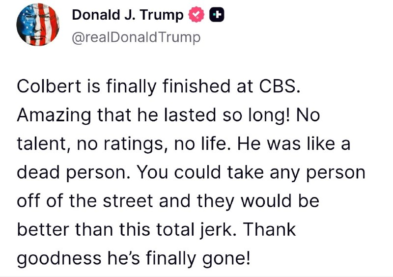

🔴 ترامپ:

«کولبرت بالاخره از CBS کنار رفت. شگفت‌انگیزه که این‌قدر دوام آورد! هیچ استعداد، هیچ رتبه‌بندی، هیچ زندگی. مثل یک مرده بود.

می‌شد هر کسی رو از خیابون بیاری و بهتر از این آدم مزخرف بود. خدا رو شکر که بالاخره رفت!»

@IranianMinds

## IranianMinds — post 20525

🔴 عمر اصلان، چپ‌ گرای حامی فلسطین که تو ناوگان صمود توسط اسرائیل بازداشت شده بود :

چون من شبیه کیانو ریوز ( جان ویک ) بودم، سربازای اسرائیلی ترسیدن ازم و ۶ نفری بهم حمله کردن و کتکم زدن.

@IranianMinds

## IranianMinds — post 20524

⭕️ ثبت نام کن ۵۰۰ هزارتومان جایزه بگیر
نیازی هم به واریز نیست
تنها سایت مورد #تایید ما با بونوس های واقعی:

🌐 Winro.io 
🌐

## IranianMinds — post 20523

  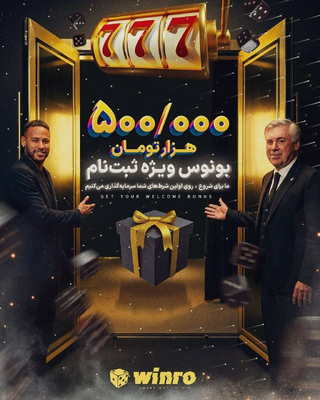

⭕️ رایگان بدون واریز شرط های فوتبالی ببند از همون اول موجودی 500 هزارتومانه
❌

🎉 500 هزارتومن رایگان فقط با ثبت نام بدون هیچگونه واریزی!

💳 پرداخت مستقیم و سریع بدون واسطه، بدون دردسر، واریز و برداشت در سریع‌ترین زمان ممکن

⌛ پشتیبانی 24 ساعته

🌐 Winro.io

🌐 Winro.io
کانال بونوس های رایگان r1

📱 @winro_io

## IranianMinds — post 20520

  

اکانت اسرائیل به فارسی:

چرخ روزگار… از پارسال تا امسال.

@IranianMinds

## IranianMinds — post 20519

🔴 خبرگزاری فارس :

بمولا ابرقدرت دنیا خودمونیم.

@IranianMinds

## IranianMinds — post 20518

🔴 وزیر خارجه انگلیس:

ما با ایالات متحده در تصمیمش برای بازگشایی تنگه هرمز برای ناوبری هم‌نظر هستیم.

@IranianMinds

## IranianMinds — post 20517

  <a href="telegram/content/IranianMinds_20517_1779449058.mp4" target="_blank">🎬 Download video</a>

🔴 مارکو‌ روبیو:

ایران در تلاش است یک سیستم عوارض در تنگه هرمز ایجاد کند و سعی دارد عمان را قانع کند تا به این سیستم عوارض بپیوندد.

@IranianMinds

## IranianMinds — post 20516

  

ایران دهه ۱۹۷۰ میلادی …

@IranianMinds

## IranianMinds — post 20515

🔴 مارکو روبیو وزیر خارجه آمریکا:

در مذاکرات با ایران پیشرفت هایی حاصل شده است.

@IranianMinds

## IranianMinds — post 20514

  

🔴 ابراهیم رضایی ، سخنگوی کمیسیون امنیت ملی :

آمریکایی ها هیچ تمایلی به دیپلماسی ندارن و مذاکرات فریب است، به جای دیپلمات موشک ها را برای مذاکره با شیطان بفرستید تا آدم شه.

@IranianMinds

## BBCPersian — post 281784

🔻دبیرکل ناتو: در مسیر تقویت این ائتلاف و کاهش وابستگی به آمریکا هستیم

مارک روته، دبیرکل ناتو، به خبرنگاران گفت که این ائتلاف در مسیر تقویت قرار دارد و همزمان به‌تدریج وابستگی خود به ایالات متحده را کاهش می‌دهد.

آقای روته این اظهارات را همزمان با گردهمایی وزیران خارجه ناتو در سوئد مطرح کرد و گفت این تغییر به آمریکا امکان خواهد داد تمرکز بیشتری بر اولویت‌های دیگر خود (در خارج از نانو) داشته باشد و همزمان اعضای اروپایی ناتو هم بودجه‌های دفاعی خود را افزایش دهند.

او افزود که این اقدام برای متعادل کردن میزان هزینه‌هایی که ایالات متحده در ناتو می کند «ضروری است.»

اظهارات او در حالی مطرح شد که آمریکا اخیرا از برخی از اعضای ناتو به دلیل اجازه ندادن به استفاده از پایگاه‌های نظامی‌شان در جریان جنگ آمریکا و اسرائیل با ایران انتقاد کرده بود.

آقای روته گفت متحدان اروپایی در چارچوب تعهدات دوجانبه، انتظارات آمریکا درباره دسترسی به پایگاه‌های نظامی را برآورده می‌کنند.

او همچنین به تلاش‌های متحدان اروپایی در تنگه هرمز اشاره کرد و گفت: «ما به‌عنوان متحدان اروپایی می‌توانیم حداکثر کمک ممکن را به ایالات متحده ارائه کنیم.»

https://bbc.in/4v3pH4G
@BBCPersian

## BBCPersian — post 281783

🔻آمریکا فروش ۱۴ میلیارد دلار تسلیحات به تایوان را «به‌دلیل جنگ ایران» متوقف کرد

آمریکا فروش ۱۴ میلیارد دلاری تسلیحات به تایوان را موقتاً متوقف کرده است تا مطمئن شود که برای جنگ احتمالی با ایران ذخایر کافی سلاح و مهمات در اختیار دارد.

https://bbc.in/3PFzHC1
@BBCPersian

## BBCPersian — post 281782

🔻سپاه: ۳۵ کشتی در شبانه‌روز گذشته با هماهنگی نیروی دریایی سپاه از تنگه هرمز عبور کردند

سپاه پاسداران می‌گوید با هماهنگی صورت گرفته با نیروی دریایی‌اش «طی شبانه روز گذشته ۳۵ فروند کشتی اعم از نفتکش، کانتینربر و سایر کشتی‌های تجاری پس از کسب مجوز» از تنگه هرمز عبور کرده‌اند.

روابط عمومی سپاه در اطلاعیه‌اش گفته «نیروی دریایی سپاه یک آبراه ایمن برای کشتیرانی و استمرار تجارت جهانی ایجاد» کرده است.

روز گذشته نهاد مدیریت آبراه خلیج‌فارس که توسط جمهوری اسلامی ایجاد شده با انتشار نقشه‌ای «محدوده نظارتی مدیریت تنگه هرمز» را اعلام کرد.

طبق این اعلام، این محدوده از «خط اتصال کوه مبارک در ایران و جنوب فجیره در امارات در شرق تنگه» تا «خط اتصال انتهای جزیره قشم در ایران و ام‌القیوین در امارات در غرب تنگه» تعریف شده است.

https://bbc.in/4v3pH4G
@BBCPersian

## BBCPersian — post 281781

🔻مشاور رئیس امارات: توافق ایران و آمریکا باید به مسائل ریشه‌ای بپردازد

مشاور دیپلماتیک رئیس امارات متحده عربی می‌گوید که هر توافقی بین ایران و آمریکا «باید به مسائل ریشه‌ای» بپردازد.

انور قرقاش هشدار داد که دور تازه‌ای از درگیری میان ایالات متحده و ایران، وضعیت را بیش از پیش پیچیده خواهد کرد.

آقای قرقاش گفت: «هرگونه راه‌ حل سیاسی هم باید به مسائل ریشه‌ای بپردازد، به‌ شکلی که خود زمینه‌ساز بحران‌ها و پیچیدگی‌های جدید در آینده نشود.»

ایران بعد از حملات آمریکا و اسرائیل و آغاز جنگ، امارات و شماری دیگر از کشورهای منطقه را که ایالات متحده در آنها پایگاه دارد، هدف حملات پهپادی و موشکی قرار داد.

از آنزمان تنش بین ایران و امارات تشدید شده است و دو طرف اتهامات و انتقادات تندی علیه یکدیگر مطرح کرده‌اند.

تهران امارات را متهم کرده است که «شریک فعال» آمریکا و اسرائیل در حمله به ایران بوده است؛ امارات هم در پاسخ ایران را به «تلاش برای توجیه» حملاتش به آن کشور متهم کرده است.

در پی انتشار گزارش‌هایی مبنی بر حمله مستقیم امارات به ایران در جریان جنگ اخیر، امارات متحده عربی اعلام کرد همه اقداماتش در چارچوب تدابیر دفاعی با هدف حفاظت از حاکمیت، غیرنظامیان و زیرساخت‌های حیاتی‌ بوده است.

https://bbc.in/4v3pH4G
@BBCPersian

## BBCPersian — post 281780

  <a href="telegram/content/BBCPersian_281780_1779449063.mp4" target="_blank">🎬 Download video</a>

🔻بیش از ۱۰۰ نفر در پی شیوع آخرین نوع ویروس ابولا در جمهوری دموکراتیک کنگو جان خود را از دست داده‌اند.
همچنین در همسایگی آن کشور، در اوگاندا هم مرگ یک نفر گزارش شده است.

سازمان جهانی بهداشت هشدار داده که شیوع این ویروس ممکن است سریع‌تر از آنچه در ابتدا تصور می‌شد در حال گسترش باشد.
بی‌بی‌سی با ساکنان استان ایتوری در شرق جمهوری دموکراتیک کنگو گفتگو کرده تا دریابد آن‌ها چگونه با این ویروس خطرناک که دائما هم در حال گسترش است مقابله می‌کنند.

https://bbc.in/4uXRUK1

@BBCPersian

## BBCPersian — post 281779

‌ ‌ ‌ مارکو روبیو، وزیر خارجه آمریکا، می‌گوید که واشنگتن در انتظار شنیدن نتیجه گفت‌وگوهایی است که در تهران در جریان است. آقای روبیو که برای شرکت در اجلاس وزرای خارجه کشورهای عضو ناتو به سوئد رفته همچنین گفت: «پیشرفت‌های اندکی حاصل شده» و «نمی‌خواهم اغراق…

## BBCPersian — post 281778

  

‌ ‌ ‌
مارکو روبیو، وزیر خارجه آمریکا، می‌گوید که واشنگتن در انتظار شنیدن نتیجه گفت‌وگوهایی است که در تهران در جریان است.

آقای روبیو که برای شرکت در اجلاس وزرای خارجه کشورهای عضو ناتو به سوئد رفته همچنین گفت: «پیشرفت‌های اندکی حاصل شده» و «نمی‌خواهم اغراق کنم، اما کمی تغییر در وضعیت وجود داشته است و این خوب است.»

عباس عراقچی، وزیر خارجه ایران، امروز در تهران با محسن نقوی، وزیر کشور پاکستان دیدار کرد. به گزارش رسانه‌های ایران این دیدار برای بررسی پیشنهادهایی جهت حل اختلافات میان تهران و واشنگتن است.

آقای روبیو تاکید کرد که «اصول اولیه همچنان یکسان است. ایران هرگز نمی‌تواند سلاح هسته‌ای داشته باشد، این حکومت هرگز نمی‌تواند سلاح هسته‌ای داشته باشد و برای رسیدن به این هدف، ما باید به موضوع غنی‌سازی در مذاکرات بپردازیم. لازم است که به موضوع اورانیوم غنی شده با خلوص بالا رسیدگی کنیم.»

https://bbc.in/49L7L6C
📷Reuters
@BBCPersian

## BBCPersian — post 281777

🔻 نت‌بلاکس: قطع اینترنت در ایران وارد هشتادوچهارمین روز شد

نت‌بلاکس که وضعیت اینترنت در جهان را ارزیابی می‌کند می‌گوید خاموشی اینترنت در ایران اکنون وارد هشتاد‌وچهارمین روز شده و دسترسی عمومی به شبکه‌های بین‌المللی برای بیش از ۱۹۹۲ ساعت عملا قطع مانده است.

نت‌بلاکس می‌گوید: «با گذشت هر ساعت، شکاف‌های اجتماعی و اقتصادی عمیق‌تر می‌شود؛ چرا که هرگونه ارتباط با جهان خارج اکنون به امتیاز، میزان تبعیت و برخورداری از رانت وابسته شده است.»

یک روز پیش از این، علی یزدی‌خواه، نماینده و عضو کمیسیون فرهنگی مجلس ایران گفته بود که «مسئولان به این نتیجه رسیده‌اند که وصل کردن اینترنت به صلاح همه نیست.»

دولت ایران گفته است که اتصال مجدد اینترنت منوط به تصمیم شورای عالی امنیت ملی است.

ایران استفاده از اینترنت ماهواره‌ای همچون استارلینک را هم ممنوع کرده و کاربران آن را تحت تعقیب قرار می‌دهد.

https://bbc.in/4dJqX69
@BBCPersian

## BBCPersian — post 281768

🖊 هیلکن دواچ بوران، بی‌بی‌سی ترکی، استانبول

🔻رونمایی مرکز تحقیق و توسعه وزارت دفاع ترکیه از موشک ییلدیریم‌هان در ۵ مه، نقطه عطفی برای صنایع دفاعی ترکیه به شمار می‌رود.

ترکیه با رونمایی از ییلدیریم‌هان، برای نخستین بار رسما اعلام کرد که قصد دارد موشک بالستیک قاره‌پیما تولید کند.

در مراسم معرفی این موشک که در نمایشگاه دفاعی ساها ۲۰۲۶ در استانبول برگزار شد، ماکتی از موشک همراه با مشخصات فنی‌ آن به نمایش در آمد.

کارشناسانی که با بخش ترکی بی‌بی‌سی گفت‌وگو کرده‌اند، ییلدیریم‌هان را بخشی از تلاش ترکیه برای تثبیت جایگاه خود به‌عنوان یک بازیگر بین‌المللی ارزیابی می‌کنند.

برخی کارشناسان با تاکید بر اینکه برد اعلام‌شده این موشک فراتر از نیازهای دفاعی ترکیه است، می‌گویند این موضوع می‌تواند در ذهن «رقبای بالقوه» آنکارا پرسش‌هایی ایجاد کند.

بیشتر بخوانید:

https://bbc.in/4tNsFcs
📸Getty Images/ Reuters/ Anadolu via Getty Images/ AFP via Getty Images/ Bloomberg via Getty Images
@BBCPersian

## idfinfarsi — post 11625

‼️نیروهای تیم رزمی تیپ شمالی که در شمال نوار غزه فعالیت می‌کنند، روز گذشته (پنج‌شنبه) یک تروریست را شناسایی کردند که از خط زرد عبور کرده و به‌گونه‌ای به سمت نیروها نزدیک شد که تهدیدی فوری محسوب می‌شد.

🔻در رویدادی دیگر طی شب (جمعه)، نیروهای تیم رزمی تیپ ۱۸۸ که در جنوب نوار غزه فعالیت می‌کنند، یک تروریست را شناسایی کردند که از خط زرد عبور کرده و به سمت نیروها نزدیک شد به‌گونه‌ای که تهدیدی فوری به‌شمار می‌رفت.

🔻بلافاصله پس از شناسایی‌ها، نیروها این تروریست‌ها را به هلاکت رساندند تا تهدید برطرف شود.

🔻علاوه بر این، نیروهای تیپ آتش ۴۵۴ که در شمال نوار غزه فعالیت می‌کنند، طی شب (جمعه) یک تروریست را که به‌صورت مشکوک در محدوده خط زرد فعالیت می‌کرد و تهدیدی فوری برای نیروها به‌شمار می‌رفت، شناسایی کردند. بلافاصله پس از شناسایی، نیروها این تروریست را از هوا مورد حمله قرار داده و به هلاکت رساندند.

⭕️نیروهای ارتش اسرائیل تحت فرماندهی جنوب، مطابق با توافق در منطقه مستقر هستند و به فعالیت خود برای رفع هرگونه تهدید فوری ادامه خواهند داد.

## idfinfarsi — post 11623

  <a href="telegram/content/idfinfarsi_11623_1779449067.mp4" target="_blank">🎬 Download video</a>

‼️ویدئو را تماشا کنید: نیروهای تیپ ۵۵۱ تروریست‌های حزب‌الله را در حال ورود به مقر این سازمان شناسایی کرده و آن‌ها را به هلاکت رساندند

⭕️نیروهای تیم رزمی تیپ ۵۵۱ تحت فرماندهی لشکر ۱۴۶، روز گذشته (پنج‌شنبه) پنج تروریست از سازمان تروریستی حزب‌الله را شناسایی کردند که وارد مقر این سازمان در شمال خط دفاعی مقدم در جنوب لبنان شده بودند. در یک واکنش سریع، این نیروها نیروی هوایی را هدایت کردند که ساختمان را مورد حمله قرار داده و تروریست‌ها را به هلاکت رساند.

⭕️در طول ۲۴ ساعت گذشته، انبارهای تسلیحات و زیرساخت‌های تروریستی مورد استفاده سازمان تروریستی حزب‌الله هدف قرار گرفتند و تروریست‌های دیگری که تهدیدی برای نیروهای ما بودند نیز به هلاکت رسیدند.

🔻ارتش اسرائیل به فعالیت خود برای رفع تهدیدها علیه نیروهای ارتش اسرائیل و غیرنظامیان کشور ادامه خواهد داد.

## Dirty_Kids — post 389933

  

این کسیه که بهش اس‌ام‌اس دادید خشخاش نکاره

@Dirty_Kids 👻

## Dirty_Kids — post 389932

هیتلر سقوط کرد شما چقدر بد سقوط‌اید جاکشا

@Dirty_Kids 👻

## Dirty_Kids — post 389930

  <a href="telegram/content/Dirty_Kids_389930_1779449070.mp4" target="_blank">🎬 Download video</a>

به «چشم کوری» ترامپ امشب آره!

@Dirty_Kids 👻

## Dirty_Kids — post 389929

  

🌪وقتی اینترنت طوفانیه فقط کافیه بادبان ها رو بکشی

⚫️100 هزار تومان تخفیف خرید اول 
🎁

⚫️پایین ترین قیمت گیگی 180 هزار تومان
🌐 

⚫️پورسانت %10 دائمی برای هر معرفی
💼

با بادبان، میتونی یه اتصال سریع، پایدار و امن
همراه با پشتیبانی ۲۴ ساعته داشته باشی
🚀

🛒کد تخفیف: badban4k

بادبان راهتو باز می‌کنه
⛵️
R1

🛡@BadBan_VPN | کانال 

🤖@BadBan_VPNBot | ربات 

📞@BadBan_VPNSupport | پشتیبانی

## Dirty_Kids — post 389928

  <a href="telegram/content/Dirty_Kids_389928_1779449072.mp4" target="_blank">🎬 Download video</a>

این چه سمیه اینترنشنال گذاشته؟ 😐😂😂😂😂 داداش دوبله کار میکنه فکر کنم

@Dirty_Kids 👻

## Dirty_Kids — post 389927

  <a href="telegram/content/Dirty_Kids_389927_1779449075.mp4" target="_blank">🎬 Download video</a>

جلوی رگبار مسلسل جاوید شاه گفتن و کشته شدن.
من کی باشم که حرف دیگه‌ای بزنم!

@Dirty_Kids 👻

## Dirty_Kids — post 389926

  

عروسیه یا جشن تعیین جنسیت با تفنگ؟

@Dirty_Kids 👻

## Dirty_Kids — post 389925

  <a href="telegram/content/Dirty_Kids_389925_1779449077.mp4" target="_blank">🎬 Download video</a>

این جلوه‌های ویژه سال ۱۹۸۱ روی دختر بریتانیایی بنام سوزانا ویلیس انجام شده توی فیلم "باشگاه هیولاها"

@Dirty_Kids 👻

## Hranews — post 113091

  

غزل مرزبان به بیش از ۹ سال حبس محکوم شد

❗️
❗️
❗️
❗️
❗️– غزل مرزبان، نوکیش مسیحی محبوس در زندان اوین، با حکم قاضی ایمان افشاری به ۹ سال و هشت ماه حبس محکوم شد.

به گزارش خبرگزاری هرانا، ارگان خبری مجموعه فعالان حقوق بشر در ایران، غزل مرزبان به حبس محکوم شد.

بر اساس حکمی که توسط شعبه ۲۶ دادگاه انقلاب تهران، به ریاست قاضی ایمان افشاری صادر و به خانم مرزبان ابلاغ شده، وی به ۹ سال و هشت ماه حبس محکوم شده است.

#غزل_مرزبان

ادامه مطلب

↘️
@hranews_bot تماس ✉️ - @Hranews کانال هرانا 🆑

## Hranews — post 113090

  

گزارش ماهانه؛ نگاهی اجمالی به وضعیت حقوق بشر – اردیبهشت ماه ۱۴۰۵

❗️
❗️
❗️
❗️
❗️– آنچه در پی می‌آید گزارش ماهانه و اجمالی از وضعیت حقوق بشر در ایران در دوره زمانی اردیبهشت ماه ۱۴۰۵ است که به همت نهاد آمار، نشر و آثار مجموعه فعالان حقوق بشر در ایران تهیه شده است، این گزارش، تصویری گسترده و تکان‌دهنده از نقض حقوق بشر در ابعاد مختلف ارائه می‌دهد. از اجرای حکم اعدام تا نقض آزادی‌های فردی و اجتماعی، از خشونت نظامی و قضایی تا مشکلات کارگری و اعتراضات، همگی نشان‌دهنده چالش‌های جدی در زمینه رعایت حقوق بشر در ایران هستند. این گزارش همچنین بر میزان بالای اعدام‌ها، بازداشت‌ها، و محکومیت‌های سنگین بر اساس اتهامات مختلف تاکید دارد و نشان می‌دهد که این رویدادها در سراسر کشور گسترده‌اند.

خلاصه اجرایی

در طول اردیبهشت ماه ۱۴۰۵، شاهد گستره‌ای از نقض‌های #حقوق_بشر در سراسر ایران بودیم. با ارزیابی‌های دقیق و گزارش‌های دریافتی، مجموعاً صدها مورد نقض حقوق بشر شناسایی و ثبت شده است که شامل نقض حقوق زندانیان، آزادی بیان، حقوق کودک، خشونت‌های خانگی، خشونت مبتنی بر جنسیت، بهداشت و محیط زیست، حقوق کار، و خشونت نظامی و قضایی می‌شود.

یافته‌های کلیدی این گزارش عبارت‌اند از:
⚫️ اجرای حکم اعدام در مواردی که فرآیندهای عدالتی منصفانه رعایت نشده است.

⚫️ سرکوب گسترده آزادی بیان و بازداشت‌های خودسرانه.

⚫️ افزایش نگران‌کننده خشونت علیه زنان.

⚫️ تداوم نقض حقوق کار و شرایط کاری ناعادلانه.

⚫️ استفاده بی‌رویه از زور توسط نیروهای انتظامی و امنیتی

دوره گزارش‌دهی این گزارش اردیبهشت ۱۴۰۵ است و تعداد کل موارد نقض گزارش شده بیانگر یک وضعیت نگران‌کننده و فوریت برای توجه جامعه بین‌المللی و دولت ایران به این مسائل است.

ادامه مطلب

↘️
@hranews_bot تماس ✉️ - @Hranews کانال هرانا 🆑

## Hranews — post 113089

  

اعتراضات ۱۴۰۴؛ دیوان عالی احکام اعدام محمدرضا مجیدی‌اصل و بیتا همتی را نقض کرد

❗️
❗️
❗️
❗️
❗️– احکام اعدام محمدرضا مجیدی‌اصل و همسرش بیتا همتی از بازداشت‌شدگان اعتراضات دی‌ماه ۱۴۰۴، توسط دیوان عالی کشور نقض شد. این افراد پیشتر با حکم قاضی ایمان افشاری به #اعدام محکوم شده بودند.

به گزارش خبرگزاری هرانا، ارگان خبری مجموعه فعالان حقوق بشر در ایران، دیوان عالی کشور احکام اعدام دو تن از بازداشت‌شدگان اعتراضات دی‌ماه ۱۴۰۴، را نقض کرد.

بر این اساس، پرونده محمدرضا مجیدی‌اصل و بیتا همتی جهت رسیدگی مجدد به شعبه هم عرض ارجاع داده شده است.

#محمدرضا_مجیدی‌اصل #بیتا_همتی #اعتراضات_دی‌ماه

ادامه مطلب

↘️
@hranews_bot تماس ✉️ - @Hranews کانال هرانا 🆑

## Hranews — post 113088

  

آخرین داده‌های نت‌بلاکس نشان می‌دهد که قطع اینترنت در ایران پس از گذشت بیش از ۱۹۹۲ ساعت، وارد هشتاد و چهارمین روز خود شده و شبکه‌های بین‌المللی همچنان تا حد زیادی قطع هستند. این نهاد ناظر بر وضعیت دسترسی به #اینترنت در جهان همچنین اعلام کرد: با گذشت هر ساعت از قطع اینترنت در ایران، شکاف‌های اجتماعی و اقتصادی عمیق‌تر می‌شود، چرا که هرگونه ارتباط با جهان خارج به جایگاه، میزان تبعیت و برخورداری از امتیازات ویژه محدود شده است.

↘️
@hranews_bot تماس ✉️ - @Hranews کانال هرانا 🆑

## manototv — post 105738

  <a href="telegram/content/manototv_105738_1779449083.mp4" target="_blank">🎬 Download video</a>

سازمان نظارت بر اینترنت نت‌بلاکس اعلام کرد خاموشی گسترده اینترنت در ایران وارد هشتاد و چهارمین روز شده و دسترسی به شبکه جهانی اینترنت برای بیش از ۱۹۹۲ ساعت همچنان به‌طور گسترده مختل است.
نت‌بلاکس در گزارشی نوشت ادامه این محدودیت‌ها شکاف‌های اجتماعی و اقتصادی را عمیق‌تر کرده و ارتباط با جهان خارج بیش از پیش به «امتیاز، تبعیت و دسترسی ویژه» وابسته شده است.

## manototv — post 105737

  <a href="telegram/content/manototv_105737_1779449083.mp4" target="_blank">🎬 Download video</a>

روزنامه وال‌استریت ژورنال گزارش داد هم‌زمان با آماده شدن ایران برای احتمال درگیری با آمریکا، بابک زنجانی، بازرگان ایرانی که خود را «ضدتحریم» معرفی می‌کند، یک شبکه مخفی پرداخت برای تأمین مالی نیروهای نظامی جمهوری اسلامی ایجاد کرده بود که محور اصلی آن صرافی ارز دیجیتال بایننس بوده است.
بر اساس این گزارش، این شبکه تا ماه دسامبر گذشته طی دو سال حدود ۸۵۰ میلیون دلار تراکنش را عمدتاً از طریق یک حساب معاملاتی در بزرگ‌ترین صرافی رمزارز جهان انجام داده است. گزارش‌های داخلی بایننس نشان می‌دهد نزدیکان زنجانی، از جمله خواهرش، شریک عاطفی او و یکی از مدیران شرکتش، حساب‌های دیگری را نیز اداره می‌کردند که همگی از دستگاه‌های مشترک استفاده می‌کردند؛ موضوعی که بازرسان بایننس آن را نشانه‌ای از تلاش برای دور زدن تحریم‌های آمریکا علیه ایران دانسته‌اند.
وال‌استریت ژورنال نوشت با وجود هشدارهای داخلی متعدد، حساب اصلی این شبکه دست‌کم ۱۵ ماه همچنان فعال مانده و تا ژانویه امسال نیز باز بوده است. این گزارش همچنین می‌گوید میلیاردها دلار تراکنش رمزارزی طی دو سال گذشته از طریق بایننس به شبکه‌های مالی مرتبط با سپاه پاسداران منتقل شده است.
مقام‌های خارجی مسئول پیگیری تأمین مالی تروریسم گفته‌اند امسال نیز انتقال پول از طریق حساب‌های بایننس به نهادهای وابسته به جمهوری اسلامی ادامه داشته و تراکنش‌هایی حتی در همین ماه شناسایی شده است.

## manototv — post 105736

  <a href="telegram/content/manototv_105736_1779449085.mp4" target="_blank">🎬 Download video</a>

رییس اورژانس پیش‌بیمارستانی و مدیریت حوادث دانشگاه علوم پزشکی البرز اعلام کرد بر اثر تصادف زنجیره‌ای در آزادراه کرج قزوین، سه نفر جان باختند و چهار نفر دیگر مجروح شدند.
به گزارش رسانه‌های داخلی، در این سانحه دو مرد و یک زن کشته شدند و سه مرد و یک زن دیگر نیز مجروح شدند.
مصدومان توسط نیروهای اورژانس به بیمارستان امام جعفر صادق نظرآباد منتقل شدند.

## manototv — post 105735

  <a href="telegram/content/manototv_105735_1779449085.mp4" target="_blank">🎬 Download video</a>

وزارت خارجه جمهوری اسلامی تحریم محمدرضا رئوف شیبانی، سفیر ایران در لبنان، از سوی آمریکا را «غیرقانونی» و «ناموجه» توصیف کرد و آن را نشانه «بی‌اعتنایی هیئت حاکمه آمریکا به اصول حقوق بین‌الملل و منشور سازمان ملل» دانست.
این وزارتخانه همچنین تحریم تعدادی از نمایندگان حزب‌الله و مسئولان لبنانی را محکوم کرد و اقدامات آمریکا را «سخیف» و در راستای تضعیف حاکمیت ملی لبنان و «فتنه‌انگیزی در جامعه لبنان» خواند.

## manototv — post 105734

  <a href="telegram/content/manototv_105734_1779449086.mp4" target="_blank">🎬 Download video</a>

روزنامه نیویورک‌تایمز گزارش داد ایران و عمان درباره ایجاد یک نظام پرداخت برای عبور کشتی‌ها از تنگه هرمز مذاکره کرده‌اند؛ اقدامی که می‌تواند به معنای دریافت هزینه از کشتی‌های عبوری در یکی از حیاتی‌ترین آبراه‌های جهان باشد.
بر اساس این گزارش، تهران و مسقط تأکید دارند موضوع مطرح‌شده «کارمزد خدمات» است، نه «عوارض عبور»؛ زیرا دریافت عوارض صرف برای عبور از تنگه‌های بین‌المللی طبق حقوق دریاها غیرقانونی تلقی می‌شود. با این حال، کارشناسان حقوقی می‌گویند اگر این کارمزد در عمل همان عوارض باشد، مشروعیت نخواهد داشت.
مقام‌های آمریکایی، از جمله دونالد ترامپ و مارکو روبیو، هرگونه دریافت پول برای عبور از تنگه هرمز را «غیرقابل قبول» توصیف کرده‌اند. کارشناسان نیز هشدار داده‌اند تغییر نام عوارض به «کارمزد» مانع چالش‌های حقوقی بین‌المللی نخواهد شد.

## manototv — post 105733

  <a href="telegram/content/manototv_105733_1779449087.mp4" target="_blank">🎬 Download video</a>

فرماندهی مرکزی آمریکا، سنتکام، در حساب کاربری خود در شبکه ایکس اعلام کرد جنگنده‌های نیروی دریایی آمریکا از ناو هواپیمابر «آبراهام لینکلن» در دریای عرب به پرواز درآمده‌اند.
سنتکام افزود گروه ضربتی ناو «آبراهام لینکلن» در بالاترین سطح آمادگی عملیاتی قرار دارد و در چارچوب اجرای محاصره دریایی آمریکا علیه بنادر ایران فعالیت می‌کند.

## alonews — post 121755

  <a href="telegram/content/alonews_121755_1779449088.webm" target="_blank">🎬 Download video</a>

👈امیرحسین ثابتی: دور جدید جنگ در پیش است؛ شاید هم شروع حمله از سوی ایران باشد

🔴گر از همین فردا بخواهیم به دشمن حمله کنیم و در حین جنگ نیز هیچ موشک و پهپاد جدیدی نسازیم، تا دو سال به صورت شبانه روز میتوانیم آنها را بمباران کنیم و هیچ مشکلی از این جهت وجود ندارد

✅ @AloNews خبر جنگ

## alonews — post 121754

  <a href="telegram/content/alonews_121754_1779449088.webm" target="_blank">🎬 Download video</a>

👈حملات هوایی اسرائیل به دیر قانون النهر در جنوب لبنان شش نفر را کشت، از جمله دو امدادگر و یک دختر، در حالی که شش نفر دیگر زخمی شدند که در میان آنها سه امدادگر و یک زن بودند، طبق گزارش خبرگزاری ملی لبنان

✅ @AloNews خبر جنگ

## alonews — post 121753

  <a href="telegram/content/alonews_121753_1779449088.webm" target="_blank">🎬 Download video</a>

👈وریر خارجه انگلیس: از مذاکراتی که ایالات متحده در حال حاضر با ایران انجام می‌دهد، حمایت می‌کنیم.

✅ @AloNews خبر جنگ

## alonews — post 121752

  <a href="telegram/content/alonews_121752_1779449088.webm" target="_blank">🎬 Download video</a>

👈اتحادیه اروپا : به خاطر بستن تنگه هرمز توسط ایران، یه بسته تحریمی جدید علیه تهران اعمال کردیم 
✅ @AloNews خبر جنگ

## alonews — post 121751

  <a href="telegram/content/alonews_121751_1779449089.webm" target="_blank">🎬 Download video</a>

👈دانشگاه پیام نور از تصمیم قبلی خود برای برگزاری آزمون‌های حضوری عقب‌نشینی و اعلام کرد: آزمون‌های نیم‌سال جاری (سال ۱۴۰۵) به صورت غیرحضوری برگزار خواهد شد.

✅ @AloNews خبر جنگ

## alonews — post 121750

  <a href="telegram/content/alonews_121750_1779449089.webm" target="_blank">🎬 Download video</a>

👈خضریان، عضو کمیسیون امنیت ملی مجلس: جمهوری اسلامی در خصوص خروج اورانیوم از ایران هیچ مصالحه‌ای انجام نخواهد داد

✅ @AloNews خبر جنگ

## alonews — post 121749

  <a href="telegram/content/alonews_121749_1779449089.webm" target="_blank">🎬 Download video</a>

👈ترامپ از طریق Truth Social: کولبرت بالاخره در CBS تمام شد. شگفت‌آور است که این همه دوام آورد! هیچ استعدادی، هیچ رتبه‌ای، هیچ زندگی‌ای نداشت. او مثل یک مرده بود.

🔴می‌توانستید هر کسی را از خیابان بردارید و بهتر از این آدم بی‌ادب باشد. خدا را شکر که بالاخره رفت!

✅ @AloNews خبر جنگ

## alonews — post 121748

  <a href="telegram/content/alonews_121748_1779449089.mp4" target="_blank">🎬 Download video</a>

👈تصاویری از آخرین وضعیت تنگهٔ هرمز و کنترل آن توسط ایران

✅ @AloNews خبر جنگ

## alonews — post 121747

  <a href="telegram/content/alonews_121747_1779449092.webm" target="_blank">🎬 Download video</a>

👈طبق داده‌های دولتی ژاپن، صادرات خودروهای ژاپنی به خاورمیانه در آوریل به دلیل اختلال در مسیرهای کشتیرانی ناشی از جنگ علیه ایران، بیش از ۹۰ درصد کاهش یافته و تقریباً به صفر رسیده است.

✅ @AloNews خبر جنگ

## alonews — post 121746

  <a href="telegram/content/alonews_121746_1779449093.webm" target="_blank">🎬 Download video</a>

👈اتحادیه اروپا : به خاطر بستن تنگه هرمز توسط ایران، یه بسته تحریمی جدید علیه تهران اعمال کردیم

✅ @AloNews خبر جنگ

## alonews — post 121745

  <a href="telegram/content/alonews_121745_1779449093.webm" target="_blank">🎬 Download video</a>

👈روبیو: برخی از واکنش‌های متحدان ناتو ما به عملیات‌های ما در خاورمیانه به خوبی مستند شده‌اند و باید به آنها رسیدگی شود

✅ @AloNews خبر جنگ

## alonews — post 121744

  <a href="telegram/content/alonews_121744_1779449093.mp4" target="_blank">🎬 Download video</a>

👈یه ویدیو از خرابی‌های بعد حمله‌ ارتش اسرائیل به لبنان

✅ @AloNews خبر جنگ

## alonews — post 121743

  <a href="telegram/content/alonews_121743_1779449096.webm" target="_blank">🎬 Download video</a>

👈سی‌ان‌ان: آمریکا نگران موشک‌های کروز ساحلی ایران است، زیرا این موشک‌ها می‌توانند کشتی‌رانی در تنگه هرمز را تهدید کنند؛ ارزیابی‌های اطلاعاتی نشان می‌دهد که حدود دو سوم لانچرهای موشکی و بخش بزرگی از موشک‌های کروز ساحلی ایران همچنان فعال هستند.

✅ @AloNews خبر جنگ

## alonews — post 121742

  <a href="telegram/content/alonews_121742_1779449096.webm" target="_blank">🎬 Download video</a>

👈اسلام‌آباد به شدت روی چین حساب باز کرده است تا به پیشبرد توافق احتمالی آمریکا و ایران کمک کند، و انتظار می‌رود نخست‌وزیر پاکستان، شہباز شریف، در مرحله‌ای بعدی به چین سفر کند، طبق گزارش العربیه که به منبعی پاکستانی استناد می‌کند

✅ @AloNews خبر جنگ

## alonews — post 121741

  <a href="telegram/content/alonews_121741_1779449097.webm" target="_blank">🎬 Download video</a>

👈وزیر نیرو: با وجود بارش‌های خوب امسال، استان مرکزی و استان تهران در وضعیت ضعیف آب قرار دارند

✅ @AloNews خبر جنگ

## alonews — post 121740

  <a href="telegram/content/alonews_121740_1779449097.webm" target="_blank">🎬 Download video</a>

👈الحدث به نقل از یک منبع پاکستانی:
هیچ جایگزینی برای توافق موقت بین واشنگتن و تهران وجود ندارد

🔴کاهش فاصله‌ها آسان نیست زیرا هر طرف سقف بالایی از خواسته‌ها دارد

🔴 مسائل بزرگ در توافق به بازه زمانی طولانی در مذاکره نیاز دارند

🔴آمریکا و ایران بر مواضع خود درباره اورانیوم پایبند هستند

✅ @AloNews خبر جنگ

## alonews — post 121739

  <a href="telegram/content/alonews_121739_1779449097.mp4" target="_blank">🎬 Download video</a>

👈مارکو روبیو: "درحال حاضر، در سازمان ملل متحد، قطعنامه‌ای داریم که توسط بحرین ارائه شده است. ما بسیار درگیر آن بوده‌ایم. این قطعنامه بالاترین تعداد همکاران ارائه‌دهنده را در تاریخ هر قطعنامه‌ای در شورای امنیت داشته است. متأسفانه، چند کشور در شورای امنیت به وتوی آن فکر می‌کنند که این امر تأسف‌بار خواهد بود."

✅ @AloNews خبر جنگ

## alonews — post 121738

  <a href="telegram/content/alonews_121738_1779449100.webm" target="_blank">🎬 Download video</a>

👈نیروی دریایی سپاه: طی شبانه روز گذشته ۳۵ فروند کشتی اعم از نفتکش، کانتینربر و سایر کشتی های تجاری پس از کسب مجوز با هماهنگی و تامین امنیت نیروی دریایی سپاه از تنگه هرمز عبور کردند.

✅ @AloNews خبر جنگ

## alonews — post 121737

  <a href="telegram/content/alonews_121737_1779449100.webm" target="_blank">🎬 Download video</a>

👈عربستان: با هرگونه تلاش برای سیاسی‌کردن حج با قاطعیت برخورد می‌کنیم

✅ @AloNews خبر جنگ

## alonews — post 121736

  <a href="telegram/content/alonews_121736_1779449100.mp4" target="_blank">🎬 Download video</a>

👈مارک روته، دبیرکل ناتو : اینکه آمریکا داره توان هسته‌ای و موشک‌های دوربرد ایران رو تضعیف می‌کنه

🔴 برای خاورمیانه، اروپا و کل دنیا خیلی مهمه

✅ @AloNews خبر جنگ

<!-- MSG END -->

<!-- NAV START -->

<a href="https://github.com/hhdoust2/aio-downloader/blob/main/telegram/content/archive_1.md" style="display:inline-block; padding:6px 12px; margin:0 4px; background-color:#2ea44f; color:white; text-decoration:none; border-radius:4px; font-weight:bold;">صفحه بعد</a>

<!-- NAV END -->
