# خواننده تلگرام

<!-- TOP_NAV START -->

<a href="https://github.com/hhdoust2/aio-downloader/blob/main/telegram/content/archive_1.md" style="display:inline-block; padding:6px 12px; margin:0 4px; background-color:#2ea44f; color:white; text-decoration:none; border-radius:4px; font-weight:bold;">صفحه بعد</a>

<!-- TOP_NAV END -->

<!-- MSG START -->

---
📅 بروزرسانی: 1405/02/30 13:02
---

## VahidOOnLine — post 241107

  

♦️قیمت نفت در بازارهای جهانی روز چهارشنبه ۳۰ اردیبهشت و پس از آنکه دونالد ترامپ، رئیس جمهوری آمریکا گفت «جنگ با ایران را به سرعت خاتمه می‌دهیم»، در بازارهای جهانی نزدیک به دو دلار نسبت به روز گذشته کاهش یافت.

قیمت هر بشکه نفت خام برنت دریای شمال، صبح چهارشنبه و همزمان با آغاز به‌کار بازارهای اروپا به ۱۰۹ دلار و هفتاد یک سنت کاهش یافت.
همزمان با کاهش قیمت نفت، قیمت طلا هم افت کرد و شاخص سهام در بازارهای آسیا و اروپا افزایش یافت.
‌🇸🇦 Indypersian

🤖 @VahidOOnLine

## VahidOOnLine — post 241106

  

♦️یک مقام کاخ سفید روز سه‌شنبه ۲۹ اردیبهشت (چهارشنبه صبح به وقت تهران) به خبرگزاری رویترز گفت که دونالد ترامپ، رئیس جمهوری آمریکا، در نشست رهبران گروه ۷ در فرانسه در ماه ژوئن (خرداد) شرکت خواهد کرد.

پیش از این آکسیوس گزارش کرده بود که ترامپ می‌خواهد در مورد پیوند دادن کمک‌های ایالات متحده با تجارت، ترویج پذیرش ابزارهای هوش مصنوعی توسعه‌یافته ایالات متحده و کاهش تسلط چین بر زنجیره‌های تامین مواد معدنی حیاتی، از جمله موضوعات دیگر در این نشست صحبت کند.
‌🇸🇦 Indypersian

🤖 @VahidOOnLine

## VahidOOnLine — post 241105

♦️ولادیمیر پوتین، رئیس‌جمهوری روسیه روز چهارشنبه ۳۰ اردیبهشت ماه و در یک نشست خبری مشترک با شی‌ جین‌پینگ در پکن اعلام کرد مسکو و پکن به‌طور مشترک سیاست خارجی «مستقل و حاکمیتی (احترام با حاکمیت ملی کشورها)» را دنبال خواهند کرد.

پوتین در بخشی از سخنان خود گفت: «روابط روسیه و چین به سطحی بی‌سابقه رسیده و همچنان در حال توسعه است. روابط ما مستقل از شرایط فعلی جهان است و نمونه‌ای از الگویی است که کشورها باید امروز روابط خود را بر پایه آن بنا کنند.»

او همچنین تاکید کرد مذاکرات دو طرف «در فضایی گرم، دوستانه و سازنده» برگزار شده و همه حوزه‌های اصلی همکاری دوجانبه مورد بررسی قرار گرفته است.
‌🇸🇦 Indypersian

🤖 @VahidOOnLine

## VahidOOnLine — post 241104

♦️مراسم سنتی «پیک‌نیک کنگره» روز سه شنبه در محوطه چمن جنوبی کاخ سفید با حضور رئیس‌جمهور و بانوی اول آمریکا برگزار شد.

این مراسم سنتی به صورت سالانه در فضایی غیررسمی برگزار می‌شود و اعضای کنگره آمریکا از هر دو حزب دموکرات و جمهوری‌خواه به همراه خانواده‌هایشان در کنار رئیس‌جمهور و بانوی اول ایالات متحده در آن شرکت می‌کنند.

 در تصاویری که کاخ سفید منتشر کرده است استقبال دونالد ترامپ و ملانیا ترامپ از مهمانان در فضای باز کاخ سفید و در حال تماشای اجرای موسیقی زنده دیده می‌شوند.
‌🇸🇦 Indypersian

🤖 @VahidOOnLine

## VahidOOnLine — post 241103

  

♦️سپاه پاسدران روز چهارشنبه ۳۰ اردیبهشت‌ماه با انتشار بیانیه خطاب به آمریکا و اسرائیل هشدار داد که در صورت حمله دوباره، «این بار جنگ به فراتر از منطقه کشیده خواهد شد.»

سپاه در این بیانیه مدعی تحمیل «شکست‌های بزرگ و راهبردی مکرر» به آمریکا و اسرائیل شده و نوشته است: «گرچه آنها با تمام توانایی‌های دو ارتش که پر هزینه‌ترین ارتش‌های جهان هستند به ما حمله کردند اما ما همه ظرفیت‌های انقلاب اسلامی را علیه آنان وارد عمل نکردیم، اما اینک اگر تجاوز به ایران تکرار شود جنگ منطقه‌ای که وعده داده شده بود، این‌بار به فراتر از منطقه کشیده خواهد شد و ضربات کوبنده ما در جاهایی که تصور آن را ندارید شما را به خاک سیاه خواهد نشاند.»

علی خامنه‌ای، رهبر پیشین جمهوری اسلامی که در موج اول حملات آمریکا و اسرائیل در بیت رهبری کشته شد، چند هفته پیش از آغاز حملات گفته بود «آمریکا بداند که در صورت حمله، این‌بار جنگ منطقه‌ای خواهد بود.»

سپاه در بیانیه خود بدون اشاره مستقیم به تهدیدهای رئیس جمهوری آمریکا نوشته است: «ما مرد جنگیم و قدرت ما را در میدان نبرد خواهید دید و نه در بیانیه‌های توخالی و صفحات مجازی.»

دونالد ترامپ دو روز پیش گفته بود در آستانه صدور فرمان حمله همه‌جانبه به ایران، با درخواست رهبران عربستان سعودی، قطر و امارات متحده عربی، این حمله را برای چند روز به تعویق انداخته است.
‌🇸🇦 Indypersian

🤖 @VahidOOnLine

## VahidOOnLine — post 241102

  

انور قرقاش، مشاور دیپلماتیک رییس امارات متحده عربی، در پیامی در شبکه اجتماعی ایکس، نیروهای نیابتی جمهوری اسلامی در عراق را مسئول حمله اخیر به نیروگاه هسته‌ای براکه معرفی کرد.

او نوشت این حمله «نشانه‌ای بسیار خطرناک از میزان تهدیدی است که منطقه با آن روبه‌روست؛ تهدیدی که از یک سو ناشی از فقدان دولت ملی و از سوی دیگر نتیجه نقض آشکار حقوق بین‌الملل است».

قرقاش افزود: «همان‌گونه که ربایش و ایجاد اختلال در تنگه هرمز تهدیدی برای اقتصاد جهانی و نظم بین‌المللی به شمار می‌رود، هدف قرار دادن براکه نیز اقدامی مجرمانه و نقض مستقیم حقوق بین‌الملل است.»

او یادآور شد: «از هرمز تا براکه، این تهدید دیگر تنها محدود به خلیج فارس نیست، بلکه کل نظام بین‌المللی را هدف قرار داده و بازتاب‌دهنده ذهنیت آشوب‌طلبی و باج‌خواهی است؛ ذهنیتی که برای امنیت ملت‌ها، حقوق بین‌الملل و ثبات اقتصاد جهانی ارزشی قائل نیست و تنها در پی بقا و تحمیل منطق تهاجمی خود است.»
‌🏁 🇬🇧 IranintlTV

🤖 @VahidOOnLine

## VahidOOnLine — post 241101

  

نت‌بلاکس، نهاد پایش‌کننده وضعیت اینترنت در جهان، چهارشنبه ۳۰ اردیبهشت، اعلام کرد هشتاد و دومین روز از قطع دیجیتال اینترنت در ایران سپری شده و این کشور پس از ۱۹۴۴ ساعت همچنان تا حد زیادی از اینترنت جهانی جدا مانده است.

این نهاد افزود در شرایطی که قطعی چند دقیقه‌ای اینترنت می‌تواند بحران‌زا باشد، ادامه این وضعیت در ایران به «نابودی معیشت‌ها و فرسایش حقوق شهروندان» منجر شده است.
‌🏁 🇬🇧 IranintlTV

🤖 @VahidOOnLine

## VahidOOnLine — post 241100

  <a href="telegram/content/VahidOOnLine_241100_1779269541.mp4" target="_blank">🎬 Download video</a>

بر اساس پیام‌های رسیده به ایران‌اینترنشنال، کمبود بنزین در بندرعباس و شماری از شهرهای جنوب استان کرمان باعث شکل‌گیری صف‌های طولانی در جایگاه‌های سوخت شده است.

به‌گفته شهروندان، برخی جایگاه‌ها بیش از ۱۵ لیتر بنزین عرضه نمی‌کنند و در مواردی قیمت آن در بازار آزاد به لیتری ۱۰۰ هزار تومان رسیده است. شهروندان می‌گویند ناچارند شب‌ها در صف‌های چند کیلومتری بمانند تا صبح نوبت سوخت‌گیری آنان برسد.

این وضعیت در بندرعباس، با وجود گرمای شدید و نیاز ضروری به کولر خودرو، نارضایتی گسترده‌ای ایجاد کرده است.
‌🏁 🇬🇧 IranintlTV

🤖 @VahidOOnLine

## VahidOOnLine — post 241099

  

♦️مسعود پزشکیان، رئیس جمهوری اسلامی روز چهارشنبه ۳۰ اردیبهشت ماه در همایش دولتی استانداران گفت با روش‌های گذشته نمی‌توان کشور را اداره کرد و اگر شیوه‌های قبلی راه‌گشا بود، بسیاری از مشکلات تا الان «حل شده بود».

این سخنان در حالی عنوان می‌شود که پزشکیان دو روز پیش هم با انتقاد از «عادی نمایی» شرایط گفته بود که ایران پس از جنگ اخیر با آمریکا و اسرائیل، با مشکلات بسیاری در عرصه‌های مالی، انرژی و نفت و گاز مواجه است و حملات هوایی به تاسیسات نفتی و کارخانه‌های فولاد، آسیب جدی به این صنایع وارد کرده است. رئیس دولت چهاردهم خطاب به منتقدان مذاکرات با آمریکا گفته بود: «گفت‌وگو نکنیم، چه کنیم؟»
‌🇸🇦 Indypersian

🤖 @VahidOOnLine

## VahidOOnLine — post 241098

  

به گزارش خبرگزاری‌های داخلی، حکم اعدام بهمن فرزانه، قاتل الهه حسین‌نژاد، بامداد چهارشنبه اجرا شده است.
الهه حسین‌نژاد، زن ۲۴ ساله، خرداد سال گذشته هنگام بازگشت به خانه در تهران ناپدید شد و حدود ۱۰ روز بعد پیکر او با چندین ضربه چاقو در بیابان‌های اطراف تهران پیدا شد.
خبرگزاری میزان، وابسته به قوه قضاییه جمهوری اسلامی، اعلام کرده این حکم پس از طی مراحل قانونی و با درخواست اولیای دم اجرا شده است.
‌🏁 🇬🇧 ManotoTV

🤖 @VahidOOnLine

## VahidOOnLine — post 241097

  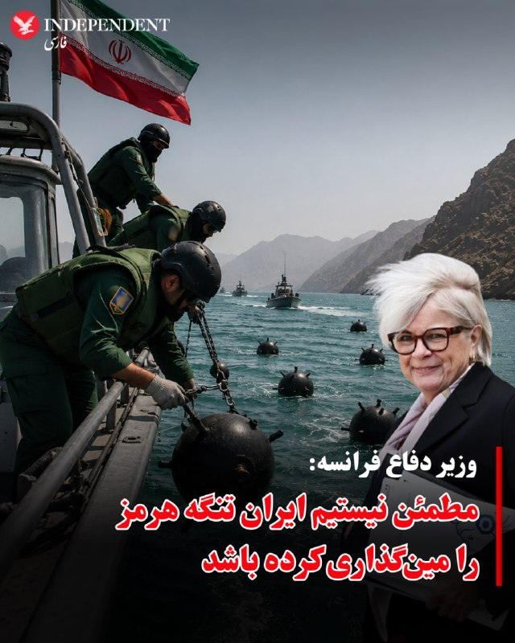

♦️کاترین ووترن، وزیر دفاع فرانسه روز چهارشنبه ۳۰ اردیبهشت ماه و پس از گزارش شبکه سی‌بس‌اس آمریکا مبنی بر شناسایی حداقل ۱۰ مین در تنگه هرمز گفت که فرانسه در حال حاضر هیچ اطمینانی ندارد که این منطقه اصلا مین‌گذاری شده باشد.

کاترین ووترن به رادیو فرانس انفو گفت: «در حال حاضر، من هیچ اطمینانی در این مورد ندارم، اما در هر صورت ما در حال آماده شدن برای لزوم پاکسازی احتمالی مین‌ها هستیم.»

وزیر دفاع فرانسه تاکید کرد «کشتی‌های مین‌روب به عنوان بخشی از یک ماموریت احتمالی به رهبری فرانسه و بریتانیا به منطقه اعزام شده‌اند و فرانسه یکی از این شناورها را در پایگاه نظامی خود در جیبوتی دارد.»

حدود ۱۰ روز پیش رسانه‌های آلمانی اعلام کرده بودند که این کشور هم کشتی‌ مین‌روب به منطقه اعزام کرده است.
‌🇸🇦 Indypersian

🤖 @VahidOOnLine

## VahidOOnLine — post 241096

♦️ولادیمیر پوتین و شی‌ جین‌پینگ، روسای جمهوری روسیه و چین، بیانیه مشترکی درباره تقویت «شراکت جامع و همکاری راهبردی» میان دو کشور امضا کردند.
این توافق که در جریان دیدار رسمی دو رهبر در پکن انجام شد و بر گسترش همکاری‌های سیاسی، اقتصادی، امنیتی و بین‌المللی میان مسکو و پکن تاکید دارد.
‌🇸🇦 Indypersian

🤖 @VahidOOnLine

## VahidOOnLine — post 241095

  

مسعود پزشکیان، رییس‌جمهور دولت جمهوری اسلامی، با اشاره به بحران اقتصادی در ایران، بار دیگر بر «صرفه‌جویی» مردم تاکید کرد و گفت: «امروز ضروری است برای مردم تبیین شود که لازمه عبور موفق از این شرایط، ایجاد تناسب میان داشته‌ها و خواسته‌هاست.»

او گفت: «با اسراف، افزایش بی‌رویه توقعات و بی‌توجهی به محدودیت‌ها نمی‌توان به اهداف بزرگ دست یافت.»
‌🏁 🇬🇧 IranintlTV

🤖 @VahidOOnLine

## VahidOOnLine — post 241094

  

زمین‌لرزه‌ای به بزرگی ۴.۷ بامداد چهارشنبه ۳۰ اردیبهشت حوالی لافت در استان هرمزگان را لرزاند. مرکز لرزه‌نگاری کشوری عمق این زلزله را ۲۰ کیلومتر اعلام کرده است. این زمین‌لرزه در بخش‌هایی از قشم، هرمز و مناطق روستایی بندرعباس نیز احساس شد. مقام‌های محلی می‌گویند تاکنون گزارشی از خسارت دریافت نشده، اما بررسی‌ها در مناطق نزدیک به کانون زلزله ادامه دارد.
‌🏁 🇬🇧 ManotoTV

🤖 @VahidOOnLine

## VahidOOnLine — post 241093

  <a href="telegram/content/VahidOOnLine_241093_1779269545.mp4" target="_blank">🎬 Download video</a>

دونالد ترامپ، رئیس‌جمهور آمریکا، بار دیگر مدعی شد که ایالات متحده جنگ با جمهوری اسلامی را «خیلی سریع» پایان خواهد داد و تهران «به‌شدت» خواهان توافق است.
ترامپ در جریان مراسم سالانه پیک‌نیک کنگره در محوطه جنوبی کاخ سفید گفت توافق با تهران «اتفاق خواهد افتاد و سریع هم اتفاق می‌افتد».
او همچنین مدعی شد با پایان این بحران، قیمت نفت «به‌شدت کاهش خواهد یافت».
این اظهارات پس از آن مطرح می‌شود که ترامپ اوایل هفته گفته بود تهران برای رسیدن به توافق «التماس» می‌کند و او تنها یک ساعت با صدور دستور حملات تازه علیه جمهوری اسلامی فاصله داشته است.
ترامپ گفت به درخواست متحدان خلیج فارس آمریکا، حملات را متوقف کرده تا به گفته او، «مذاکرات جدی» ادامه پیدا کند. با این حال، او هشدار داد اگر جمهوری اسلامی به توافق نرسد، آمریکا برای یک «حمله کامل» آماده است.
‌🏁 🇬🇧 ManotoTV

🤖 @VahidOOnLine

## VahidOOnLine — post 241092

  

شی جین‌پینگ، رئیس‌جمهوری چین، در دیدار با ولادیمیر پوتین در پکن خواستار توقف فوری درگیری‌ها در خاورمیانه شد و گفت پایان جنگ می‌تواند به کاهش اختلال در عرضه انرژی و زنجیره‌های تجارت جهانی کمک کند.

شی جین‌پینگ روز چهارشنبه، ۲۰ مه ۲۰۲۶، در دیدار با ولادیمیر پوتین در تالار بزرگ خلق پکن گفت وضعیت خاورمیانه در مرحله‌ای حساس میان جنگ و صلح قرار دارد و توقف درگیری‌ها «فوری‌ترین ضرورت» است. او تأکید کرد بازگشت به جنگ قابل قبول نیست و مسیر مذاکره باید در اولویت قرار گیرد. به گفته رئیس‌جمهور چین، پایان زودهنگام درگیری‌ها می‌تواند از اختلال بیشتر در عرضه انرژی و عملکرد زنجیره‌های صنعتی و تجاری جلوگیری کند.

پوتین نیز در آغاز این دیدار گفت روابط روسیه و چین به سطحی «بی‌سابقه» رسیده و از شی جین‌پینگ دعوت کرد سال آینده به روسیه سفر کند. رئیس‌جمهوری روسیه همچنین همکاری دو کشور را عاملی برای «بازدارندگی و ثبات» در روابط بین‌الملل توصیف کرد.

بر اساس گزارش‌ها، دو طرف در این دیدار درباره انرژی، امنیت و روابط کلی مسکو و پکن گفت‌وگو کردند و با تمدید پیمان دوستی چین و روسیه موافقت کردند؛ پیمانی که نخستین‌ب
‌🏁 🇬🇧 ManotoTV

🤖 @VahidOOnLine

## VahidOOnLine — post 241091

  

جی‌دی ونس، معاون رئیس‌جمهور آمریکا، گفت واشینگتن در برابر جنگ با ایران دو مسیر پیش رو دارد: ادامه مذاکره یا ازسرگیری عملیات نظامی.

جی‌دی ونس در نشست خبری کاخ سفید گفت آمریکا در برابر ایران «دو مسیر» دارد.

به گفته ونس، مسیر اول مذاکره است. او گفت دونالد ترامپ از تیم خود خواسته با جمهوری اسلامی «تهاجمی» مذاکره کنند.

ونس گفت آمریکا در موضوع اصلی، یعنی جلوگیری از دستیابی ایران به سلاح هسته‌ای، پیشرفت زیادی داشته و واشینگتن فکر می‌کند تهران خواهان توافق است.

او مسیر دوم را ازسرگیری عملیات نظامی دانست و گفت: «گزینه دوم این است که کارزار نظامی را دوباره شروع کنیم تا اهداف آمریکا دنبال شود.»

ونس گفت این مسیر چیزی نیست که ترامپ بخواهد و فکر نمی‌کند جمهوری اسلامی هم خواهان آن باشد.

او در پایان گفت: «برای توافق، دو طرف لازم است.»
‌🏁 🇬🇧 ManotoTV

🤖 @VahidOOnLine

## VahidOOnLine — post 241090

  <a href="telegram/content/VahidOOnLine_241090_1779269547.mp4" target="_blank">🎬 Download video</a>

«سکوت ما همدستی با جمهوری اسلامی است»
‌🏁 🇬🇧 ManotoTV

🤖 @VahidOOnLine

## VahidOOnLine — post 241089

  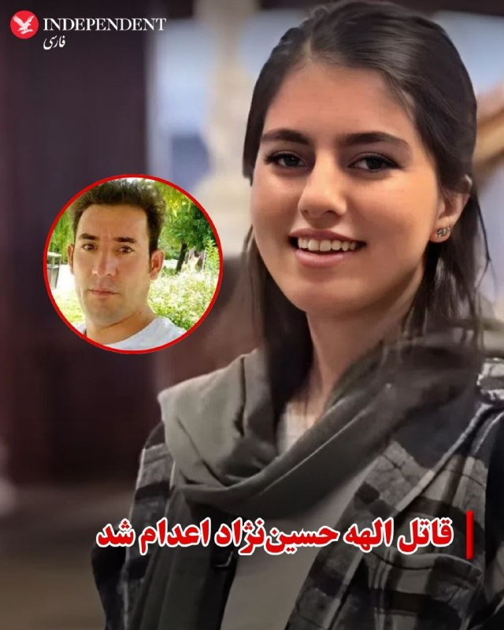

♦️میزان، خبرگزاری قوه قضائیه، از اجرای حکم اعدام قاتل الهه حسین‌نژاد، دختری که جسد او سال گذشته در بیابان‌های اطراف تهران پیدا شد، خبر داد و نوشت: «این حکم با درخواست اولیای دم و پس از طی تمامی مراحل قانونی و قضایی اجرا شد.»

 الهه حسین‌نژاد، زن ۲۴ ساله‌ در مسیر بازگشت از آرایشگاه به خانه در تهران ناپدید شد و حدود ۱۰ روز بعد پیکرش با چندین زخم چاقو در بیابان‌های اطراف تهران پیدا شد.

خانواده الهه حسین‌نژاد پیش از این اعلام کرده بود با آنکه خواستار قصاص قاتل است اما امکان پرداخت نصف دیه را ندارد.

اصغر جهانگیر، سخنگوی قوه قضائیه جمهوری اسلامی، روز سه‌شنبه نهم دی‌ماه اعلام کرد با دستور محسنی اژه‌ای، تفاصل دیه قاتل الهه حسین‌نژاد از «محلی غیر از بیت‌المال» پرداخت می‌شود تا امکان اجرای حکم قصاص او فراهم شود.

بر طبق قانون قصاص مندرج در قانون مجازات اسلامی ایران، اولیای دم (خانواده مقتول) زن، در صورت درخواست اجرای حکم قصاص قاتل مرد، باید نیمی از دیه او را بپردازند تا امکان اجرای حکم اعدام را پیدا کنند.
‌🇸🇦 Indypersian

🤖 @VahidOOnLine

## VahidOOnLine — post 241088

  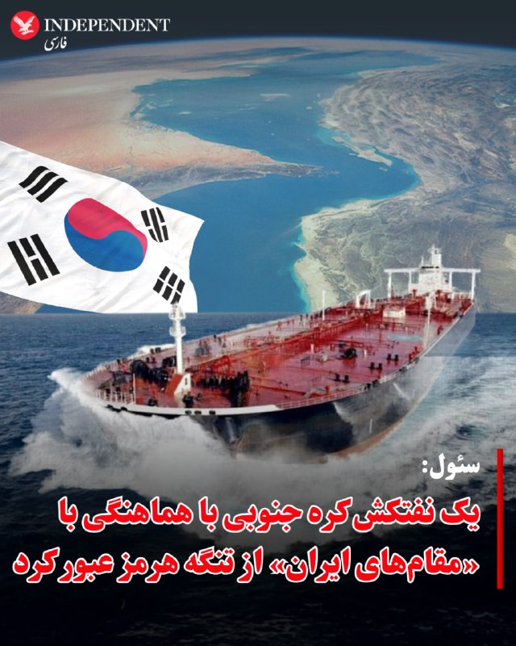

♦️چو هیون، وزیر امور خارجه کره جنوبی روز چهارشنبه ۳۰ اردیبهشت اعلام کرد یک نفتکش حامل نفت خام متعلق به این کشور «در هماهنگی با مقام‌های ایرانی در حال عبور از تنگه هرمز است.»

به گزارش خبرگزاری رویترز، وزیر امور خارجه کره جنوبی در یک جلسه استماع در مجلس این کشور با وجود اعلام ابن خبر، جزئیات بیشتری درباره نفتکش و چگونگی هماهنگی برای عبور آن نداد.

این خبر در حالی اعلام می‌شود که حدود سه هفته پیش یک کشتی باری کره جنوبی هدف یک حمله پهپادی قرار گرفت و به‌شدت آسیب دید. ریاست جمهوری کره جنوبی اعلام کرد بسیار بعید است این حمله از جایی به‌جز ایران انجام شده باشد.

پس از این «حادثه دریایی» کره جنوبی اعلام کرد مشارکت در عملیات بازگشایی تنگه هرمز به رهبری آمریکا را بررسی می‌کند.
‌🇸🇦 Indypersian

🤖 @VahidOOnLine

## WithYashar — post 11736

## WithYashar — post 11735

  

کانال ۱۲ اسرائیل: ترامپ و نتانیاهو دیشب تماس تلفنی طولانی داشتند که یک تماس محوری توصیف شده است
@withyashar

## WithYashar — post 11734

  <a href="telegram/content/WithYashar_11734_1779269549.mp4" target="_blank">🎬 Download video</a>

مراسم عروسی جان فداها: عروس رفته تنگه هرمز گل بچینه!
@withyashar
😂 جلبک دریایی 🪸

## WithYashar — post 11733

دو نفتکش چینی پس از دو ماه معطلی در خلیج فارس، روز چهارشنبه از تنگه هرمز عبور کردند.
@withyashar

## WithYashar — post 11732

  <a href="https://t.me/withyashar/11732" target="_blank">📎 Download file</a>

نسخه فارسی و بدون سانسور کتاب "پاسخ به تاریخ" نوشته‌ی، محمدرضا شاه پهلوی

🌐 @withyashar

🌐 instagram.com/yashar

## WithYashar — post 11731

  

آمار نشون می‌ده در ۳ ماه گذشته یک پاکسازی طبقاتی دیجیتال در ایران رخ داده. در این مدت سهم اندروید از ترافیک اینترنت ۲۵٪ افت و آیفون ۱۸۰٪ رشد داشته. این به معنی خروج میلیون‌ها کاربر طبقه متوسط و پایین از فضای آنلاینه. اونی که آیفون داره از پس هزینه کانفیگ یا اینترنت پرو برمیاد، اونی که نداره، اونقدر دغدغه مالی مختلف داره که عطای اینترنت رو به لقاش می‌بخشه

@withyashar

## WithYashar — post 11730

وزیر نیروهای مسلح فرانسه اعلام کرد این کشور از وجود مین‌های دریایی در تنگه هرمز اطمینان ندارد.
@withyashar

## WithYashar — post 11729

مقامات کره جنوبی تأیید کردند نفتکش «یونیورسال وینر» این کشور که حامل دو میلیون بشکه نفت از کویت است، از تنگه هرمز عبور کرد.
@withyashar

## WithYashar — post 11728

وزارت خارجه روسیه اعلام کرد ایران از «پیمان منع گسترش سلاح‌های هسته‌ای» (ان‌پی‌تی) خارج نخواهد شد.
@withyashar

## WithYashar — post 11727

۳پا تروریستی : جنگ منطقه‌ای که وعده داده شده بود با تکرار تجاوز، به فراتر از منطقه کشیده خواهد شد
@withyashar

## WithYashar — post 11726

شاهزاده رضا پهلوی:

با دولت ترامپ و اعضای کنگره آمریکا در تماس هستم.

@withyashar

## WithYashar — post 11725

  

رادار کلادفلر خبر از افزایش ترافیک‌ اینترنت ایران می‌دهد؛ شروعی برای موج قوی تر فیلترینگ؟
@withyashar

## WithYashar — post 11724

فایننشال تایمز: شرکت سرمایه‌گذاری خطر پذیر ترامپ که در حوزه هوش مصنوعی، فناوری دفاعی و املاک فعالیت می‌کند، در حدود یک سال از ۲۰۰ میلیون دلار به ۳.۵ میلیارد دلار دارایی رسید؛ یعنی جهشی ۱۷ برابری
@withyashar

## WithYashar — post 11723

  <a href="telegram/content/WithYashar_11723_1779269553.mp4" target="_blank">🎬 Download video</a>

ترامپ بعد از زدن حرفهای همیشگی مانند رهبرشان مرده، نیروی نظامی ندارند و سلاح هستهی نباید داشته باشند
پس از سخنرانی ملانیا ترامپ در کاخ سفید، گفت: عجب سخنرانی فوق‌العاده‌ای بود، من هیچوقت دوس ندارم بعد از بانوی اول آمریکا صحبت کنم، چون باعث میشه خیلی خوب به نظر نرسم.
@withyashar

## WithYashar — post 11722

  <a href="telegram/content/WithYashar_11722_1779269554.mp4" target="_blank">🎬 Download video</a>

پوتین و شی بیانیۀ مشترک تعمیق روابط چین و روسیه را امضا کردند

شی: جهان به دلیل اقدامات یک‌جانبه و سلطه‌طلبانه دیگر پایدار نیست، بنابراین ما به دنبال یک نظام جهانی جدید هستیم.

پوتین: همکاری ما در امور سیاست خارجی یکی از عوامل اصلی ثبات در صحنه بین‌المللی است.
در شرایط پرتنش فعلی در صحنه بین‌المللی، هماهنگی نزدیک ما به ویژه مورد نیاز است.
@withyashar

## WithYashar — post 11721

فراخوان دادن هرکی با سیدعلی خاطره داشته بیاد تعريف کنه می‌خوایم سریال بسازیم
@withyashar 😬😂

## WithYashar — post 11720

  <a href="telegram/content/WithYashar_11720_1779269556.mp4" target="_blank">🎬 Download video</a>

ترامپ: ما در ایران کار فوق‌العاده‌ای انجام دادیم؛ فکر میکنم خیلی زود این کار تمام بشه و آنها سلاح هسته‌ای نخواهند داشت؛ امیدوارم این کار رو به روشی بسیار خوب انجام بدیم.
@withyashar

## WithYashar — post 11718

  <a href="telegram/content/WithYashar_11718_1779269558.mp4" target="_blank">🎬 Download video</a>

استقبال شی از پوتین در پکن چین
@withyashar

## mwarmonitor — post 9334

🔴هدف اولیه جنگ، روی کار آوردن رئیس‌جمهور سابق تندرو به‌عنوان رهبر ایران بود. NYT 🔸به گفته مقام‌های آمریکایی، یک حمله اسرائیل که با هدف آزاد کردن محمود احمدی‌نژاد از حصر خانگی در تهران طراحی شده بود، بخشی از تلاشی برای ایجاد تغییر رژیم و رساندن او به قدرت…

## mwarmonitor — post 9333

  

🔴هدف اولیه جنگ، روی کار آوردن رئیس‌جمهور سابق تندرو به‌عنوان رهبر ایران بود. NYT

🔸به گفته مقام‌های آمریکایی، یک حمله اسرائیل که با هدف آزاد کردن محمود احمدی‌نژاد از حصر خانگی در تهران طراحی شده بود، بخشی از تلاشی برای ایجاد تغییر رژیم و رساندن او به قدرت محسوب می‌شد.

@mwarmonitor

## mwarmonitor — post 9332

🔴اختصاصی آکسیوس: ترامپ به‌رغم تنش با متحدان، در اجلاس G7 در فرانسه شرکت می‌کند

🔰رئیس‌جمهور ترامپ ماه ژوئن برای گفتگو درباره هوش مصنوعی، تجارت و مبارزه با جرم و جنایت در نشست سران گروه ۷ (G7) در فرانسه شرکت خواهد کرد؛ اقدامی که یک مقام کاخ سفید آن را در گفتگو با اکسیوس تایید کرده است.

چرا این موضوع اهمیت دارد؟
هرچند حضور روسای جمهور آمریکا در اجلاس‌های سالانه گروه ۷ امری مرسوم و سنتی است، اما شرکت ترامپ در این نشست به دلیل خشم فزاینده او از اعضای این گروه (مانند بریتانیا، فرانسه، آلمان و ایتالیا) به خاطر همراهی نکردن با تلاش‌های جنگی او در ایران، قطعی نبود.
یک مقام کاخ سفید اعلام کرد که این نشست منجر به امضای قراردادهای رسمی نخواهد شد، بلکه هدف آن ایجاد اجماع و همسویی برای توافقات آینده است.
تولد ترامپ درست پیش از آغاز این اجلاس، در ۱۴ ژوئن (۲۴ خرداد) است و او ۸۰ ساله خواهد شد.
نگاهی دقیق‌تر به برنامه‌ها
این نشست که از ۱۵ تا ۱۷ ژوئن (۲۵ تا ۲۷ خرداد) در شهر «اویان-له-بن» (Évian-les-Bains) در جنوب شرقی فرانسه برگزار می‌شود، قطعاً موضوع ایران را در دستور کار خواهد داشت، اما ترامپ می‌خواهد روی مسائل اقتصادی و تجاری تمرکز کند:
پیوند زدن کمک‌های آمریکا با تجارت: به گفته این مقام مسئول، هدف این است که تجارت برای هر دو کشور سرمایه‌گذار و دریافت‌کننده سود متقابل داشته باشد.
توسعه هوش مصنوعی: ترویج و به‌کارگیری ابزارهای هوش مصنوعی توسعه‌یافته در آمریکا.
کاهش نفوذ چین: توافق برای کاهش سلطه چین بر زنجیره تامین مواد معدنی حیاتی.
امنیت و مهاجرت: مبارزه با قاچاق مواد مخدر و مهاجرت غیرقانونی.
انرژی و صادرات: ترویج صادرات آمریکا، کاهش موانع مقرراتی و افزایش تولید انرژی، به‌ویژه سوخت‌های فسیلی.
پشت صحنه (روابط ترامپ و ماکرون)
امانوئل ماکرون، رئیس‌جمهور فرانسه که گاهی هدف خشم و انتقادهای ترامپ قرار گرفته است، تلاش کرده با پیشنهاد یک شام مجلل پس از پایان اجلاس در کاخ ورسای (نماد شکوه و زرق‌وبرق سبک باروک فرانسوی که ترامپ شیفته آن است)، دل رئیس‌جمهور آمریکا را به دست آورد. هنوز مشخص نیست که آیا ترامپ در این ضیافت شام شرکت خواهد کرد یا خیر.
نگاه کلان: سایه جنگ ایران بر روابط متحدان
جنگ در ایران همچنان سایه سنگینی بر روابط میان ایالات متحده و تقریباً تمام متحدان اصلی‌اش در گروه ۷ و فراتر از آن انداخته است.
حتی اگر از اکنون تا اواسط ژوئن توافقی حاصل شود، احتمالاً همچنان مقداری دلخوری و تنش در فضا باقی خواهد ماند.
هیچ‌کدام از کشورهای اروپایی به آمریکا در تلاش برای تضمین عبور امن کشتی‌های تجاری از تنگه هرمز کمک نکرده‌اند؛ هرچند ترامپ گاهی گفته به کمک آن‌ها نیازی ندارد و چندین رهبر اروپایی نیز اعلام کرده‌اند که پس از پایان جنگ، مشارکت خواهند کرد.
در همین حال، روز سه‌شنبه و در جریان نشست وزرای دارایی این گروه در پاریس، اسکات بسنت (Scott Bessent)، وزیر خزانه‌داری آمریکا، از اعضای گروه ۷ خواست تا برای مبارزه با «تروریسم ایرانی» و «منابع مالی پشتیبان آن»، تحریم‌های بیشتری وضع کنند.

📌اسکات بسنت در نشست پاریس گفت:
«درهم‌شکستن تهدید تروریسم ایجاب می‌کند که همه شما قدم پیش بگذارید و به ما ملحق شوید. ما از همه متحدان خود در G7 و در واقع از تمام جهان می‌خواهیم که از رژیم تحریم‌ها پیروی کنند تا بتوانیم جریان مالی نامشروعی را که ماشین جنگی ایران را تغذیه می‌کند، متوقف کنیم و این پول را به مردم ایران بازگردانیم.»

@mwarmonitor

## pm_afshaa — post 91090

🔴کرملین:ویتکاف بارها تمایل خود را برای بازدید از مسکو ابراز کرده است، اما تاریخ آن هنوز تعیین نشده

💧 Rainbet.com the #1 Non-KYC Crypto Casino & Sportsbook @rainbetcom

😁 @Pm_Afshaa

## pm_afshaa — post 91089

سپاه:اگر حمله به ایران دوباره رخ دهد، جنگ فراتر از مرزهای منطقه گسترش خواهد یافت

💧 Rainbet.com the #1 Non-KYC Crypto Casino & Sportsbook @rainbetcom

😁 @Pm_Afshaa

## pm_afshaa — post 91088

🔴بهمن فرزانه؛ قاتل الهه حسین نژاد صبح امروز اعـدام شد

💧 Rainbet.com the #1 Non-KYC Crypto Casino & Sportsbook @rainbetcom

😁 @Pm_Afshaa

## iaghapour — post 2620

  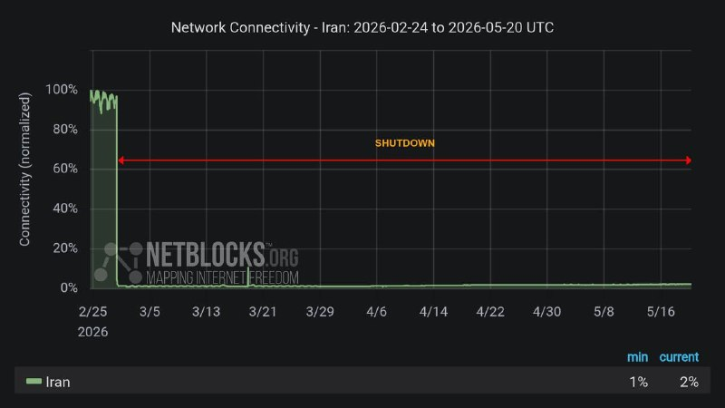

⚠️ بحران خاموشی دیجیتال؛ ضربه‌ای جبران‌ناپذیر بر پیکر اقتصاد و جامعه

🔻بیش از ۱۹۴۴ ساعت خاموشی دیجیتال، تنها قطع یک ابزار ارتباطی روزمره نیست، بلکه یک «بحران تمام‌عیار اقتصادی و اجتماعی» است. در زمانه‌ای که در سراسر جهان حتی چند دقیقه اختلال در اینترنت زیان‌های هنگفتی به بار می‌آورد، تداوم ۸۲ روزه این وضعیت در ایران، آسیبی عمیق به شریان‌های حیاتی کسب‌وکارها و زندگی عادی مردم وارد کرده است.

در واقع، تداوم این قطعی طولانی‌مدت نشان می‌دهد که حفظ حیات اقتصادی مشاغلِ وابسته به فضای مجازی و نیازهای ارتباطی جامعه، در اولویت تصمیم‌گیری‌ها قرار ندارد؛ رویکردی که پیامدی جز نابودی معیشت هزاران نفر، فرسایش سرمایه اجتماعی و آسیب جدی به بدنه نوپای اقتصاد دیجیتال کشور نخواهد داشت.

🆔 @iaghapour

## iaghapour — post 2619

  

⭕️ شگفتی گوگل در Google I/O 2026؛ معرفی جمینای ۳.۵ فلش با سرعتی باورنکردنی!

در گام نخست، مدل جمینای ۳.۵ فلش عرضه شده است؛ مدلی که با وجود طراحی شدن برای سرعت بالا و هزینه کم، در کمال شگفتی توانسته مدل‌های پرچمدار و پرو نسل‌های قبل را در بنچمارک‌های تخصصی شکست دهد.

🔹 پادشاهی در بخش ایجنت‌ها: این مدل با توانایی برنامه‌ریزی بالا، می‌تواند چندین ایجنت را به صورت موازی برای پیشبرد پروژه‌های پیچیده و کدنویسی مستقر کند.

🔸 سرعت خیره‌کننده و کاهش هزینه‌ها: ساندار پیچای اعلام کرد این مدل با سرعت پردازش ۲۸۹ توکن در ثانیه، حدود ۴ برابر سریع‌تر از رقباست.

🔹 شکست رقبای سرسخت: جمینای ۳.۵ فلش در آزمون‌های تخصصیِ مربوط به کارهای ایجنتی، امتیاز بی‌نظیر ۱۶۵۶ را کسب کرده و عملاً رقیب سرسختی مثل کلود سونیت ۴.۶ آنتروپیک را پشت سر گذاشته است.

🔸 همچنین نسخه قدرتمندتر یعنی جمینای ۳.۵ پرو در ماه ژوئن ۲۰۲۶ رسماً عرضه خواهد شد.

جمینای ۳.۵ فلش هم‌اکنون به عنوان مدل پیش‌فرض در اپلیکیشن جمینای و بخش سرچ گوگل فعال شده است.

🧠 @NovinAIplus

## DEJradio — post 4758

  <a href="telegram/content/DEJradio_4758_1779269561.webm" target="_blank">🎬 Download video</a>

🚨
🔸 "جاسوس واقعی کسی است که به خامنه‌ای اطمینان داد از لونه موش بیرون بیاد.

فریبرز کرمی‌زند، افسر پیشین پلیس.

#موشعلی #جاسوسی
@DEJradio

## DEJradio — post 4757

  <a href="telegram/content/DEJradio_4757_1779269561.webm" target="_blank">🎬 Download video</a>

🔺📢 “سـ.ـپاهی‌های با اخلاص که در تجمعات جانفدا محور تبلیغات شدن، همون سرکوبگرای قاتل هستند که با وضو آدم کشتند...

پیام دریافتی

#تجمعات_حکومتی #IRGCterrorists
@DEJradio

## DEJradio — post 4756

  <a href="telegram/content/DEJradio_4756_1779269561.mp4" target="_blank">🎬 Download video</a>

🛩️
🔺 ‏ایالات متحده در حال اعزام نیروهای نظامی به دریای عمان است؛ اقدامی که نشان می‌دهد آمریکا در حال آماده‌سازی برای ازسرگیری جنگ با ایران است.

یک فروند هواپیمای شناسایی دریایی P-8A آمریکا بر فراز دریای عرب و خلیج عمان پرواز کرده و همزمان یک تانکر سوخت‌رسان KC-46A نیز در شمال خلیج عمان برای پشتیبانی از عملیات هوایی حضور داشته است.

پیش‌تر نیز ظهور ناگهانی یک فروند هواپیمای نظارتی دریایی P-8A Poseidon نیروی دریایی آمریکا در نزدیکی سواحل پاکستان، جغرافیای راهبردی تقابل جاری میان آمریکا و ایران را از تنگه هرمز به شمال دریای عرب گسترش داده و الگوهای نظارت دریایی را وارد مرحله‌ای از تشدید بالقوه و مهم کرده است.

#آتشبس #جنگ
@DEJradio

## DEJradio — post 4755

  <a href="telegram/content/DEJradio_4755_1779269563.webm" target="_blank">🎬 Download video</a>

🚨📢 سازمان اطلاعات داخلی آلمان هشدار داده جمهوری اسلامی ممکن است پس از پایان جنگ با اسرائیل و آمریکا، دامنه عملیات‌های امنیتی و تروریستی خود در اروپا را گسترش دهد.

بر اساس گزارش اختصاصی یوراکتیو، سازمان اطلاعات داخلی آلمان (BfV) اعلام کرده تهدید علیه مراکز یهودی و اسرائیلی، مخالفان جمهوری اسلامی و افرادی که حکومت ایران آن‌ها را «خائن» می‌داند، همچنان در سطح بالایی قرار دارد.

این نهاد امنیتی گفته شماری از افراد ساکن آلمان برای آموزش نظامی یا همکاری با نهادهای حکومتی به ایران سفر کرده‌اند و برخی از آن‌ها در ویدئوهای تبلیغاتی جمهوری اسلامی و بسیج ظاهر شده‌اند.

در این گزارش همچنین به نگرانی سرویس‌های امنیتی اروپا از استفاده جمهوری اسلامی از شبکه‌های نیابتی، گروه‌های وابسته به جرایم سازمان‌یافته و نیروهای کم‌هزینه محلی برای انجام حملات اشاره شده است.

به گفته منابع امنیتی، جمهوری اسلامی از مارس ۲۰۲۶ کارزاری با نام «حرکت أصحاب الیمین الإسلامیه» (HAYI) راه‌اندازی کرده که از طریق شبکه‌های اجتماعی اقدام به جذب نیرو در میان محافل طرفدار جمهوری اسلامی و جریان‌های افراطی شیعه می‌کند.

پژوهشگران امنیتی هشدار داده‌اند این مدل عملیات، شامل حملات ساده اما پرتعداد توسط افراد محلی و بعضاً نوجوانان، می‌تواند فشار گسترده‌ای بر سرویس‌های امنیتی اروپا وارد کند؛ به‌ویژه برای حفاظت از مراکز یهودی، مدارس و مراکز اجتماعی.

سازمان اطلاعات داخلی آلمان تأکید کرده است که جمهوری اسلامی در گذشته نیز از روش‌هایی در حد «تروریسم دولتی» استفاده کرده؛ از عملیات‌های شناسایی و مراقبت گرفته تا طراحی حملات علیه مخالفان و اهداف اسرائیلی و یهودی در اروپا.

#تروریسم #آلمان
@DEJradio

## DEJradio — post 4754

  <a href="telegram/content/DEJradio_4754_1779269563.mp4" target="_blank">🎬 Download video</a>

🔺🎥 پیام یک شهروند در واکنش به آموزش استفاده از سلاح به طرفداران نظام در خیابان‌ها: "این کـ...مشنگا هر روز جمع می‌شن اینجا آموزش تفنگ می‌دن".

#تروریسم
@DEJradio

## DEJradio — post 4753

  <a href="telegram/content/DEJradio_4753_1779269566.webm" target="_blank">🎬 Download video</a>

🔺📢 سی‌بی‌اس نیوز به نقل از مقام‌های آمریکایی اعلام کرد ارزیابی اطلاعاتی جدید آمریکا نشان می‌دهد نیروهای این کشور دست‌کم ۱۰ مین دریایی را در تنگه هرمز شناسایی کرده‌اند. پیش از این گزارش شده بود که مقام‌های آمریکایی بر اساس ارزیابی‌های اطلاعاتی معتقد بودند دست‌کم ۱۲ مین زیرسطحی در تنگه هرمز وجود دارد.

مقام‌ها گفته بودند مین‌هایی که ایران در این تنگه به کار گرفته، از نوع «Maham 3» و «Maham 7 Limpet Mine» ساخت ایران هستند. با این حال، یک مقام دیگر آمریکایی گفته بود تعداد مین‌ها کمتر از ۱۲ عدد است.

#تنگه_هرمز #محاصره_دریایی
@DEJradio

## kianmeli1 — post 87514

  

🔴وزارت خارجه آمریکا تا سقف ۱۵ میلیون دلار پاداش برای اطلاعات در مورد شبکه مالی سپاه تروریستی پاسداران تعیین کرد.
https://t.me/kianmeli1

## kianmeli1 — post 87513

🔴 نیویورک تایمز به نقل از منابع آگاه: اسرائیل و آمریکا به دنبال رهبری احمدی نژاد بعد از سرنگونی جمهوری اسلامی و جنگ بودند نیویورک تایمز نوشت: احمدی‌نژاد در اولین روز جنگ در حمله هوایی اسرائیل که محل اقامتش در تهران را هدف قرار داد، مجروح شد. https://t.me/kianmeli1

## kianmeli1 — post 87512

‏🔴رسانه‌های اسرائیل خبر دادند که تماس تلفنی دیشب ترامپ و نتانیاهو طولانی و در آستانه یک تصمیم مهم بوده است
https://t.me/kianmeli1

## kianmeli1 — post 87511

  <a href="telegram/content/kianmeli1_87511_1779269567.mp4" target="_blank">🎬 Download video</a>

🔴سنژنوئه، منطقه دونتسک. حمله به محل استقرار سربازان روسی. گزارش شده است که تعداد زیادی کشته شده‌اند
https://t.me/kianmeli1

## kianmeli1 — post 87510

  <a href="telegram/content/kianmeli1_87510_1779269568.mp4" target="_blank">🎬 Download video</a>

🔴مراسم عروسی جان فداهای حکومت: عروس رفته تنگه هرمز گل بچینه!
https://t.me/kianmeli1

## kianmeli1 — post 87509

  

🔴مرضیه حسینی خبرنگار کنگره امریکا: یک منبع مطلع اینجا در کنگره به من گفت که ترامپ روزهای چهارشنبه یا پنج شنبه پیش رو، به ایران حمله خواهد کرد.

به گفته این فرد،این حملات برای یک عملیات "دو تا سه روز” متمرکز خواهد بود و به مراکزی با *هدف بازگشایی تنگه هرمز* انجام خواهد شد.
https://t.me/kianmeli1

## kianmeli1 — post 87508

  

🔴 نیویورک تایمز به نقل از منابع آگاه: اسرائیل و آمریکا به دنبال رهبری احمدی نژاد بعد از سرنگونی جمهوری اسلامی و جنگ بودند

نیویورک تایمز نوشت: احمدی‌نژاد در اولین روز جنگ در حمله هوایی اسرائیل که محل اقامتش در تهران را هدف قرار داد، مجروح شد.
https://t.me/kianmeli1

## kianmeli1 — post 87507

  <a href="telegram/content/kianmeli1_87507_1779269570.mp4" target="_blank">🎬 Download video</a>

🔴خبرنگار شبکه اسکای نیوز، فرمانده سنتکام درباره جنایت مدرسه میناب به چالش کشید و از او پرسید، تا کی می‌خواهید «پشت این ادعا که تحقیقات ادامه دارد پنهان شوید؟»

مارک استون خطاب به کوپر افزود، تیمی از شبکه اسکای نیوز همین الان در میناب هستند. آنچه آنجا رخ داد را دیده‌اند. هیچ مدرکی دال بر وجود پایگاه موشکی در آنجا وجود ندارد.

درحالیکه کوپر در حال فرار از پاسخگویی بود مارک استون دوباره وی را سوال پیچ کرد و گفت، تا کی میخواهید پشت این ادعا که تحقیقات در جریان است قایم شوید؟ «حداقل بگویید تحقیقات چه زمانی پایان خواهد یافت؟»

فرمانده سنتکام به جای پاسخگویی مسیر حرکت خود را تغییر داد و تلاش کرد با کمک محافظانش از دست خبرنگار اسکای نیوز فرار کند!
https://t.me/kianmeli1

## kianmeli1 — post 87506

  

🔴خطر اعدام فوری خواهر و برادر #زینب_موسوی و #حسن_موسوی

​زینب موسوی و برادرش، حسن موسوی، که در جریان اعتراضات سراسری دی‌ماه بازداشت شده بودند، اکنون در زندان وکیل‌آباد #مشهد با اتهام سنگین محاربه روبرو شده و به اعدام محکوم شده‌اند.
این خواهر و برادر معترض در بیدادگاهی فرمایشی و بدون دسترسی به دادرسی عادلانه به مرگ محکوم شده‌اند و جانشان در خطر فوری اجرای حکم قرار دارد.
خانواده موسوی در وضعیت روحی به‌شدت بحرانی و دلهره‌آوری به سر می‌برند و زیر سایه این احکام ظالمانه، چشم‌انتظار یاری و همصدایی افکار عمومی هستند.
سکوت در برابر این جنایت، دست دستگاه سرکوب را برای گرفتن جان این دو جوان بازتر می‌کند؛ نام زینب و حسن را فریاد بزنیم و اجازه ندهیم در بی‌خبری به مسلخ بروند.
https://t.me/kianmeli1

## kianmeli1 — post 87505

‏🔴سپاه پاسداران با انتشار بیانیه‌ای اعلام کرد جنگ منطقه‌ای که وعده داده شده بود با تکرار تجاوز، به فراتر از منطقه کشیده خواهد شد

‏در بیانیه سپاه پاسداران آمده است «ما همه ظرفیت‌های انقلاب اسلامی را علیه آمریکا و اسرائیل وارد عمل نکردیم» و در صورت وقوع جنگ «ضربات کوبنده ما در جاهایی که تصور آن را ندارید شما را به خاک سیاه خواهد نشاند»

‏سپاه پاسداران در پایان بیانیه خود خطاب به آمریکا و اسرائیل نوشت: «ما مرد جنگیم و قدرت ما را در میدان نبرد خواهید دید و نه در بیانیه‌های توخالی و صفحات مجازی»
https://t.me/kianmeli1

## kianmeli1 — post 87504

‏🔴سخنگوی انجمن صنایع فرآورده‌های لبنی: قیمت محصولات لبنی از یکم خرداد ۲۰ درصد گران خواهد شد
https://t.me/kianmeli1

## kianmeli1 — post 87503

‏🔴رييس کمیسیون تخصصی لوازم خانگی: امکان فروش اقساطی برای بسیاری از فروشندگان لوازم خانگی به‌دلیل افزایش مداوم قیمت کالاها وجود ندارد
https://t.me/kianmeli1

## kianmeli1 — post 87502

‏🔴عضو شورای عالی فضای مجازی: مسئول نهایی قطع اینترنت، سیم‌کارت سفید و اینترنت طبقاتی کسانی هستند که در بالاترین رده‌های حکمرانی، تصمیم‌سازی و تصمیم‌گیری می‌کنند، اما پاسخگو نیستند
https://t.me/kianmeli1

## kianmeli1 — post 87501

‏🔴نت‌بلاکس: قطع اینترنت در ایران وارد هشتاد و دومین روز خود شده است و پس از ۱۹۴۴ ساعت همچنان ادامه دارد
https://t.me/kianmeli1

## IranIntlTV — post 338056

  <a href="telegram/content/IranIntlTV_338056_1779269572.mp4" target="_blank">🎬 Download video</a>

آرسنال پس از ۲۲ سال قهرمان لیگ برتر فوتبال انگلستان شد. تصویر جاویدنام عارف جعفرزاده، ۳۲ ساله و اهل رشت که از هواداران آرسنال بود، به دست یک هنرمند انگلیسی روی دیوار ستاره‌های این تیم در شمال لندن نقش بست.

گزارش آیدین مقیمی، خبرنگار ایران‌اینترنشنال
@iranintltv

## IranIntlTV — post 338055

  <a href="telegram/content/IranIntlTV_338055_1779269573.mp4" target="_blank">🎬 Download video</a>

پیام‌های رسیده به ایران‌اینترنشنال از نگرانی دانش‌آموزان، دانشجویان و والدین آنها در پایان سال تحصیلی حکایت دارد. این افراد در پیام‌های خود به ایران‌اینترنشنال گفته‌اند قطع اینترنت و مجازی شدن کلاس‌ها، باعث افت کیفیت آموزش شده است.

لیلا سعادتی، عضو تحریریه ایران‌اینترنشنال، گزارش می‌دهد
@iranintltv

## IranIntlTV — post 338054

  

🔻نشریه نیویورک‌پست، چهارشنبه ۳۰ اردیبهشت در یادداشتی تحلیلی و انتقادی، تصمیم احتمالی فدراسیون بین‌المللی فوتبال، فیفا، برای ممنوع کردن ورود پرچم تاریخی «شیر و خورشید» را به استادیوم‌های جام جهانی ۲۰۲۶ به شدت محکوم کرد. این یادداشت، اقدام مذکور را «توهینی آشکار به آمریکا» و «هدیه‌ای ارزشمند به جمهوری اسلامی» توصیف کرده است.

🔹طبق این یادداشت، فدراسیون فوتبال جمهوری اسلامی ایران به ریاست مهدی تاج، ۱۰ شرط را برای حضور تیم ملی ایران در این مسابقات تعیین کرده است. یکی از اصلی‌ترین خواسته‌های آن‌ها این است که «هیچ پرچمی جز پرچم جمهوری اسلامی» در ورزشگاه‌های محل بازی ایران اجازه ورود نداشته باشد. نیویورک‌پست می‌نویسد که پاسخ فیفا، رد این باج‌خواهی نبوده؛ بلکه با استناد به آیین‌نامه ممنوعیت ورود نمادهای «سیاسی یا تبعیض‌آمیز»، به خواست ملاها تن داده است.

🔹به نوشته نیویورک‌پست بزرگ‌ترین نهاد ورزشی جهان در حال آماده شدن است تا درخواست سانسور یکی از بدترین رژیم‌های دنیا را در خاک آمریکا اجرا کند.

🔹جزییات بیشتر را در سایت بخوانید

@iranintltvsport

## IranIntlTV — post 338053

  <a href="telegram/content/IranIntlTV_338053_1779269575.mp4" target="_blank">🎬 Download video</a>

شورای هماهنگی تشکل‌های صنفی فرهنگیان ایران در بیانیه‌ای، آموزش نظامی به کودکان در مساجد و پایگاه‌های بسیج را نقض آشکار کنوانسیون حقوق کودک دانست. ایران به‌عنوان یکی از امضاکنندگان کنوانسیون حقوق کودک، متعهد به حمایت از کودکان در برابر اقداماتی است که می‌تواند سلامت جسمی و روانی آن‌ها را تهدید کند.
گفت‌وگو با اسماعیل عبدی، فعال صنفی معلمان
@iranintltv

## IranIntlTV — post 338052

  

🔻روزنامه جوان، وابسته به سپاه پاسداران با انتشار یادداشتی به انتقاد از فدراسیون فوتبال پرداخت و نوشت: «داریم تیم ملی‌مان را با خوش‌خیالی به کشور متجاوز به خاک‌مان می‌فرستیم. این خوش‌خیالی می‌تواند به ضرر ما منجر شود. آقایان، طرف‌حساب ما آمریکا و ترامپ هستند، نه فیفا.»

🔹روزنامه جوان در ادامه نوشت: «داریم تیم ملی‌مان را به کشوری که دشمنی‌اش با ما عیان است و کمر به نابودی‌مان بسته می‌فرستیم؛ ولی نمی‌دانیم چرا عده‌ای نمی‌خواهند این واقعیت عیان را ببینند و بپذیرند. این خوش‌خیالی، این اعتماد بی‌جا به دشمن بسیار نگران‌کننده است.»

🔹انتقاد روزنامه جوان در حالی مطرح می‌شود که اردوی آماده‌سازی تیم ملی فوتبال ایران هم‌اکنون در کشور ترکیه در حال برگزاری است و ملی‌پوشان قرار است پس از پایان این اردو، راهی شهر توسان در ایالت آریزونای آمریکا شوند.

@iranintltvsport

## IranIntlTV — post 338051

  <a href="telegram/content/IranIntlTV_338051_1779269577.mp4" target="_blank">🎬 Download video</a>

🔻ویدیو رسیده به ایران‌اینترنشنال نشان می‌دهد یکی از هواداران ایرانی آرسنال در شب مشخص شدن قهرمانی این تیم در لیگ برتر، یاد و نام جاویدنام عارف جعفرزاده را زنده نگه‌ می‌دارد و همچنین هواداران آرسنال شادی خود را با این جاویدنام تقسیم می‌کنند.

🔹جاویدنام عارف جعفرزاده، ۳۴ ساله و اهل رشت، شامگاه ۱۸ دی ۱۴۰۴ در جریان اعتراضات مردمی هدف شلیک مستقیم نیروهای جمهوری اسلامی قرار گرفت و جان باخت. او پس از فراخوان شاهزاده رضا پهلوی، در حالی که لباس تیم آرسنال را بر تن داشت به خیابان رفت. کشته شدن این هوادار آرسنال در فضای هواداری این باشگاه در انگلستان بازتاب گسترده‌ای داشت.

@iranintltvsport

## IranIntlTV — post 338050

  

🔻مهدی طارمی، بازیکن تیم ملی، با انتشار استوری در اینستاگرام به حذف سردار آزمون از تیم ملی واکنش نشان داد و نوشت: «سردار، بودنت کنارم باعث می‌شد خیلی چیزها راحت‌تر و قشنگ‌تر بشود.»

🔹سردار آزمون پس از موضع‌گیری‌هایی در مخالفت با جمهوری اسلامی، از فهرست تیم ملی برای جام جهانی کنار گذاشته شد

🔹سردار آزمون روز گذشته با انتشار تصویری از تیم ملی پیش از سفر به ترکیه نوشت: «درست است که پیش‌تان نیستم، ولی رفیق‌های من هستید، دلیل نمی‌شود که برای شما آرزوی موفقیت نکنم. خیلی‌ها می‌خواهند خرابم کنند، ولی این حرف‌ها اصلاً درست نیست. موفق باشید بچه‌ها.»

@iranintltvsport

## IranIntlTV — post 338049

  

انور قرقاش، مشاور دیپلماتیک رییس امارات متحده عربی، در پیامی در شبکه اجتماعی ایکس، نیروهای نیابتی جمهوری اسلامی در عراق را مسئول حمله اخیر به نیروگاه هسته‌ای براکه معرفی کرد.

او نوشت این حمله «نشانه‌ای بسیار خطرناک از میزان تهدیدی است که منطقه با آن روبه‌روست؛ تهدیدی که از یک سو ناشی از فقدان دولت ملی و از سوی دیگر نتیجه نقض آشکار حقوق بین‌الملل است».

قرقاش افزود: «همان‌گونه که ربایش و ایجاد اختلال در تنگه هرمز تهدیدی برای اقتصاد جهانی و نظم بین‌المللی به شمار می‌رود، هدف قرار دادن براکه نیز اقدامی مجرمانه و نقض مستقیم حقوق بین‌الملل است.»

او یادآور شد: «از هرمز تا براکه، این تهدید دیگر تنها محدود به خلیج فارس نیست، بلکه کل نظام بین‌المللی را هدف قرار داده و بازتاب‌دهنده ذهنیت آشوب‌طلبی و باج‌خواهی است؛ ذهنیتی که برای امنیت ملت‌ها، حقوق بین‌الملل و ثبات اقتصاد جهانی ارزشی قائل نیست و تنها در پی بقا و تحمیل منطق تهاجمی خود است.»
https://iranintl.com/202605200793

## IranIntlTV — post 338048

  <a href="telegram/content/IranIntlTV_338048_1779269579.mp4" target="_blank">🎬 Download video</a>

دونالد ترامپ، رییس‌جمهوری آمریکا، اعلام کرد جنگ با جمهوری اسلامی به‌زودی پایان می‌یابد و مقام‌های تهران به‌شدت به دنبال توافق هستند. هم‌زمان جی‌دی ونس، معاون رییس‌جمهور آمریکا، هشدار داد اگر جمهوری اسلامی از فرصت مذاکره استفاده نکند، گزینه نظامی همچنان روی میز خواهد ماند.
گفت‌وگو با مرتضی کاظمیان، عضو تحریریه ایران‌اینترنشنال
@iranintltv

## IranIntlTV — post 338047

  <a href="telegram/content/IranIntlTV_338047_1779269581.mp4" target="_blank">🎬 Download video</a>

رجب طیب اردوغان، رییس‌جمهوری ترکیه، در گفت‌وگوی تلفنی با اورسولا فون درلاین، رییس کمیسیون اروپا، اعلام کرد آنکارا از حفظ آتش‌بس و برقراری صلح در منطقه حمایت می‌کند و خواستار بازگشایی فوری تنگه هرمز است.

نرگس هورخش، خبرنگار ایران‌اینترنشنال، گزارش می‌دهد
@iranintltv

## IranIntlTV — post 338046

  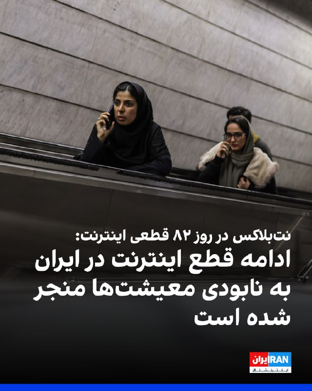

نت‌بلاکس، نهاد پایش‌کننده وضعیت اینترنت در جهان، چهارشنبه ۳۰ اردیبهشت، اعلام کرد هشتاد و دومین روز از قطع دیجیتال اینترنت در ایران سپری شده و این کشور پس از ۱۹۴۴ ساعت همچنان تا حد زیادی از اینترنت جهانی جدا مانده است.

این نهاد افزود در شرایطی که قطعی چند دقیقه‌ای اینترنت می‌تواند بحران‌زا باشد، ادامه این وضعیت در ایران به «نابودی معیشت‌ها و فرسایش حقوق شهروندان» منجر شده است.
https://iranintl.com/202605207927

## IranIntlTV — post 338045

  <a href="telegram/content/IranIntlTV_338045_1779269583.mp4" target="_blank">🎬 Download video</a>

بر اساس پیام‌های رسیده به ایران‌اینترنشنال، کمبود بنزین در بندرعباس و شماری از شهرهای جنوب استان کرمان باعث شکل‌گیری صف‌های طولانی در جایگاه‌های سوخت شده است.

به‌گفته شهروندان، برخی جایگاه‌ها بیش از ۱۵ لیتر بنزین عرضه نمی‌کنند و در مواردی قیمت آن در بازار آزاد به لیتری ۱۰۰ هزار تومان رسیده است. شهروندان می‌گویند ناچارند شب‌ها در صف‌های چند کیلومتری بمانند تا صبح نوبت سوخت‌گیری آنان برسد.

این وضعیت در بندرعباس، با وجود گرمای شدید و نیاز ضروری به کولر خودرو، نارضایتی گسترده‌ای ایجاد کرده است.

## IranIntlTV — post 338044

  <a href="telegram/content/IranIntlTV_338044_1779269585.mp4" target="_blank">🎬 Download video</a>

ربات‌هایی که پیش‌تر تنها در فیلم‌های علمی‌تخیلی دیده می‌شدند، اکنون به فضای فروشگاه‌ها و زندگی روزمره مردم راه یافته‌اند. در تازه‌ترین نمونه از این تحولات، یک ربات انسان‌نما در جنوب آلمان به کار گرفته شده است.
فرزیا ثابتی، خبرنگار ایران‌اینترنشنال، گزارش می‌دهد
@iranintltv

## IranIntlTV — post 338043

  <a href="telegram/content/IranIntlTV_338043_1779269586.mp4" target="_blank">🎬 Download video</a>

محمدجواد اکبرین، عضو تحریریه ایران‌اینترنشنال، گفت واشینگتن در مذاکرات با تهران، شروطی مرتبط با منافع و مطالبات ایالات متحده مطرح می‌کند، اما شروط جمهوری اسلامی لزوما به ایران مربوط نیست. او افزود جمهوری اسلامی خواستار خروج آمریکا از منطقه و پایان جنگ در لبنان شده، در حالی که این موضوعات اساسا از سوژه مذاکرات خارج است.
@iranintltv

## IranIntlTV — post 338042

  <a href="https://t.me/IranintlTV/338042" target="_blank">📎 Download file</a>

🎧نسخه صوتی اخبار بامدادی | چهارشنبه ۳۰ اردیبهشت
@iranintlTV

## IranIntlTV — post 338041

  

مسعود پزشکیان، رییس‌جمهور دولت جمهوری اسلامی، با اشاره به بحران اقتصادی در ایران، بار دیگر بر «صرفه‌جویی» مردم تاکید کرد و گفت: «امروز ضروری است برای مردم تبیین شود که لازمه عبور موفق از این شرایط، ایجاد تناسب میان داشته‌ها و خواسته‌هاست.»

او گفت: «با اسراف، افزایش بی‌رویه توقعات و بی‌توجهی به محدودیت‌ها نمی‌توان به اهداف بزرگ دست یافت.»
https://iranintl.com/202605208827

## IranIntlTV — post 338040

  <a href="telegram/content/IranIntlTV_338040_1779269588.mp4" target="_blank">🎬 Download video</a>

شی جین‌پینگ، رییس‌جمهور چین، در دیدار با ولادیمیر پوتین، رییس‌جمهوری روسیه، تاکید کرد پایان جنگ ایران «ضرورتی فوق‌العاده» است. شی همچنین گفت پایان جنگ می‌تواند به ثبات در بازار انرژی کمک کند.

توماج طاهباز، خبرنگار ایران‌اینترنشنال، گزارش می‌دهد
@iranintltv

## IranIntlTV — post 338039

  <a href="telegram/content/IranIntlTV_338039_1779269590.mp4" target="_blank">🎬 Download video</a>

دادگاهی در ایالت کالیفرنیا دعوای ایلان ماسک علیه اوپن‌ای‌آی را رد کرد. هیئت منصفه این دادگاه اعلام کرد ماسک شکایت را دیر مطرح کرده و مهلت قانونی سه‌ ساله برای ثبت آن به پایان رسیده است.

گزارش حمید رشید، خبرنگار ایران‌اینترنشنال
@iranintltv

## IranIntlTV — post 338038

  <a href="telegram/content/IranIntlTV_338038_1779269591.mp4" target="_blank">🎬 Download video</a>

جاویدنامان انقلاب ملی ایرانیان
«حدیثه اکبرزاده» متولد ۲۳ دی‌ ۱۳۸۵، پنج روز قبل از زادروزش در اعتراضات ۱۸ دی‌ در فردیس کرج با شلیک نیروهای سرکوب خامنه‌ای به سینه‌اش کشته شد. نامش در حافظه‌ این سرزمین می‌ماند و یادش چراغ راه آزادی‌خواهان است.
@iranintltv

## IranIntlTV — post 338037

  

نرگس باقری زمردی، مدیرکل دفتر مقررات صادرات و واردات وزارت صنعت، معدن و تجارت، در نامه‌ای به محمدعلی بهپوری، مدیرکل واردات گمرک ایران، اعلام کرد واردات مواد اولیه مرتبط با حوزه پتروشیمی و پلیمری از طریق «رویه کولبری و ملوانی» مجاز است.

تسنیم، خبرگزاری وابسته به سپاه پاسداران، نوشت بر اساس این ابلاغیه، «واردات این اقلام صرفا در چارچوب فهرست تعیین‌شده و با رعایت ضوابط و مقررات مربوط به رویه‌های ملوانی و کولبری امکان‌پذیر خواهد بود».

این رسانه حکومتی افزود این تصمیم در شرایطی اتخاذ شد که شماری از واحدهای تولیدی صنایع پتروشیمی و پلیمری طی ماه‌‌های اخیر در تامین برخی مواد اولیه با محدودیت روبه‌رو بوده‌اند.
https://iranintl.com/202605209869

## Shin_Persian — post 6104

  

NetBlocks ✓ @netblocks
Wed, 20 May 2026 07:43:12 UTC

📉 It's now the 82nd day of #Iran's digital blackout, with the country still largely cut off from the global internet after 1944 hours.

In an era when a disconnection lasting minutes would be a crisis, Iran continues to shatter records, destroying livelihoods and eroding rights.

فارسی

📉 اکنون ۸۲امین روز از خاموشی دیجیتال در #ایران است و کشور پس از ۱۹۴۴ ساعت همچنان تا حد زیادی از اینترنت جهانی قطع است.

در دورانی که قطعیِ تنها چند دقیقه‌ای یک بحران محسوب می‌شود، ایران همچنان به شکستن رکوردها، نابود کردن معیشت‌ها و تضعیف حقوق (شهروندی) ادامه می‌دهد.

𝕏 · @shin_persian

## ManotoTV — post 105669

  

به گزارش خبرگزاری‌های داخلی، حکم اعدام بهمن فرزانه، قاتل الهه حسین‌نژاد، بامداد چهارشنبه اجرا شده است.
الهه حسین‌نژاد، زن ۲۴ ساله، خرداد سال گذشته هنگام بازگشت به خانه در تهران ناپدید شد و حدود ۱۰ روز بعد پیکر او با چندین ضربه چاقو در بیابان‌های اطراف تهران پیدا شد.
خبرگزاری میزان، وابسته به قوه قضاییه جمهوری اسلامی، اعلام کرده این حکم پس از طی مراحل قانونی و با درخواست اولیای دم اجرا شده است.

## ManotoTV — post 105668

  

زمین‌لرزه‌ای به بزرگی ۴.۷ بامداد چهارشنبه ۳۰ اردیبهشت حوالی لافت در استان هرمزگان را لرزاند. مرکز لرزه‌نگاری کشوری عمق این زلزله را ۲۰ کیلومتر اعلام کرده است. این زمین‌لرزه در بخش‌هایی از قشم، هرمز و مناطق روستایی بندرعباس نیز احساس شد. مقام‌های محلی می‌گویند تاکنون گزارشی از خسارت دریافت نشده، اما بررسی‌ها در مناطق نزدیک به کانون زلزله ادامه دارد.

## ManotoTV — post 105667

  <a href="telegram/content/ManotoTV_105667_1779269594.mp4" target="_blank">🎬 Download video</a>

دونالد ترامپ، رئیس‌جمهور آمریکا، بار دیگر مدعی شد که ایالات متحده جنگ با جمهوری اسلامی را «خیلی سریع» پایان خواهد داد و تهران «به‌شدت» خواهان توافق است.
ترامپ در جریان مراسم سالانه پیک‌نیک کنگره در محوطه جنوبی کاخ سفید گفت توافق با تهران «اتفاق خواهد افتاد و سریع هم اتفاق می‌افتد».
او همچنین مدعی شد با پایان این بحران، قیمت نفت «به‌شدت کاهش خواهد یافت».
این اظهارات پس از آن مطرح می‌شود که ترامپ اوایل هفته گفته بود تهران برای رسیدن به توافق «التماس» می‌کند و او تنها یک ساعت با صدور دستور حملات تازه علیه جمهوری اسلامی فاصله داشته است.
ترامپ گفت به درخواست متحدان خلیج فارس آمریکا، حملات را متوقف کرده تا به گفته او، «مذاکرات جدی» ادامه پیدا کند. با این حال، او هشدار داد اگر جمهوری اسلامی به توافق نرسد، آمریکا برای یک «حمله کامل» آماده است.

## ManotoTV — post 105666

  

شی جین‌پینگ، رئیس‌جمهوری چین، در دیدار با ولادیمیر پوتین در پکن خواستار توقف فوری درگیری‌ها در خاورمیانه شد و گفت پایان جنگ می‌تواند به کاهش اختلال در عرضه انرژی و زنجیره‌های تجارت جهانی کمک کند.

شی جین‌پینگ روز چهارشنبه، ۲۰ مه ۲۰۲۶، در دیدار با ولادیمیر پوتین در تالار بزرگ خلق پکن گفت وضعیت خاورمیانه در مرحله‌ای حساس میان جنگ و صلح قرار دارد و توقف درگیری‌ها «فوری‌ترین ضرورت» است. او تأکید کرد بازگشت به جنگ قابل قبول نیست و مسیر مذاکره باید در اولویت قرار گیرد. به گفته رئیس‌جمهور چین، پایان زودهنگام درگیری‌ها می‌تواند از اختلال بیشتر در عرضه انرژی و عملکرد زنجیره‌های صنعتی و تجاری جلوگیری کند.

پوتین نیز در آغاز این دیدار گفت روابط روسیه و چین به سطحی «بی‌سابقه» رسیده و از شی جین‌پینگ دعوت کرد سال آینده به روسیه سفر کند. رئیس‌جمهوری روسیه همچنین همکاری دو کشور را عاملی برای «بازدارندگی و ثبات» در روابط بین‌الملل توصیف کرد.

بر اساس گزارش‌ها، دو طرف در این دیدار درباره انرژی، امنیت و روابط کلی مسکو و پکن گفت‌وگو کردند و با تمدید پیمان دوستی چین و روسیه موافقت کردند؛ پیمانی که نخستین‌ب

## ManotoTV — post 105665

  

جی‌دی ونس، معاون رئیس‌جمهور آمریکا، گفت واشینگتن در برابر جنگ با ایران دو مسیر پیش رو دارد: ادامه مذاکره یا ازسرگیری عملیات نظامی.

جی‌دی ونس در نشست خبری کاخ سفید گفت آمریکا در برابر ایران «دو مسیر» دارد.

به گفته ونس، مسیر اول مذاکره است. او گفت دونالد ترامپ از تیم خود خواسته با جمهوری اسلامی «تهاجمی» مذاکره کنند.

ونس گفت آمریکا در موضوع اصلی، یعنی جلوگیری از دستیابی ایران به سلاح هسته‌ای، پیشرفت زیادی داشته و واشینگتن فکر می‌کند تهران خواهان توافق است.

او مسیر دوم را ازسرگیری عملیات نظامی دانست و گفت: «گزینه دوم این است که کارزار نظامی را دوباره شروع کنیم تا اهداف آمریکا دنبال شود.»

ونس گفت این مسیر چیزی نیست که ترامپ بخواهد و فکر نمی‌کند جمهوری اسلامی هم خواهان آن باشد.

او در پایان گفت: «برای توافق، دو طرف لازم است.»

## ManotoTV — post 105664

  <a href="telegram/content/ManotoTV_105664_1779269596.mp4" target="_blank">🎬 Download video</a>

«سکوت ما همدستی با جمهوری اسلامی است»

## FarsiVOA — post 218208

  

سخنگوی انجمن صنایع فرآورده‌های لبنی از افزایش ۲۰ درصدی محصولات لبنی از اول خرداد ماه خبر داد. محمد فربد، دلیل این امر را افزایش قیمت شیرخام و اثر آن بر قیمت تمام شده تولید، عنوان کرد.

بر اساس مصوبه روز یکشنبه ۲۷ اردیبهشت، وزارت جهاد کشاورزی جمهوری اسلامی، قیمت هر کیلوگرم شیر خام، حداقل ۶۰ هزار و ۵۰۰ تومان اعلام شد. قیمت قبلی ۴۶ هزار و ۵۰۰ تومان بود که افزایش ۳۰ درصدی را نشان می‌دهد.

طبق اعلام مرکز آمار، در فروردین امسال تورم نسبت به ماه مشابه سال ۱۴۰۴ ۷۳.۵ درصد و در ۱۲ ماهه منتهی به فروردین، ۵۳.۷ درصد افزایش داشته است.

پیشتر مدیرکل دفتر بهبود تغذیه جامعه وزارت بهداشت، درباره وضعیت غذایی ایرانیان «با توجه به گرانی خارج از حد تصور اقلام خوراکی»، از اجرای طرحی با عنوان «آموزش تغذیه برای مردم» خبر داده بود. احمد اسماعیل‌زاده، مدعی شد که هدف از اجرای این طرح، آموزش «شیوه‌های ارزان‌تر تأمین مواد غذایی» به شهروندان است.
@FarsiVOA

## FarsiVOA — post 218207

🔺۸۲ روز قطع اینترنت؛ معاون پزشکیان از نابودی کسب‌وکارهای روستایی خبر داد

▪️قطع گسترده اینترنت در ایران وارد هشتادودومین روز شده و پس از ۱۹۴۴ ساعت، کشور همچنان تا حد زیادی از اینترنت جهانی جدا مانده است.

▪️نت‌بلاکس در این باره یادآور شد در دورانی که حتی چند دقیقه اختلال در اینترنت می‌تواند بحران‌ساز باشد، ایران همچنان رکوردهای تازه‌ای در قطع ارتباطات دیجیتال ثبت می‌کند؛ وضعیتی که معیشت شهروندان را نابود کرده و حقوق آنان را فرسوده است.

▪️پیامدهای اقتصادی این قطعی اکنون از سوی مقام‌های دولت نیز تأیید می‌شود. عبدالکریم حسین‌زاده، معاون رئیس‌جمهور در امور توسعه روستایی و مناطق محروم، با انتقاد از وضعیت اینترنت گفته است: «وضعیت اینترنت دمار از روزگار بوم‌گردی‌ها درآورده است.»

⬇️ بیشتر بخوانید:
https://ir.voanews.com/a/8151974.html

## FarsiVOA — post 218206

🔺شوک گرانی کود شیمیایی به امنیت غذایی؛ سفره خانوار زیر فشار زنجیره گرانی

▪️روزنامه دنیای اقتصاد به نقل از نرخ‌نامه وزارت جهاد کشاورزی گزارش داده هزینه تأمین کود شیمیایی در سال جاری حدود ۶۰۰ درصد رشد کرده و قیمت برخی کودها تا چند برابر افزایش یافته است.

▪️چنین جهشی می‌تواند به معنای کاهش مصرف کود، افت عملکرد زمین و کاهش تولید محصولات اساسی باشد.

▪️پیامد این روند، در مرحله بعد، خود را در قیمت نان، غلات، حبوبات، سبزیجات و سایر اقلام ضروری نشان می‌دهد؛ یعنی همان جایی که فشار تولید مستقیم به سفره مردم منتقل می‌شود.

▪️به این ترتیب، افزایش سنگین قیمت کودهای شیمیایی در ایران، نشانه تازه‌ای از بحرانی است که از مزرعه آغاز می‌شود و به سفره خانوار می‌رسد.

⬇️ بیشتر بخوانید:
https://ir.voanews.com/a/8151973.html

## FarsiVOA — post 218205

  

رئیس دولت جمهوری اسلامی گفت که اگر برای مدیریت مصرف آب، برق، گاز و بنزین برنامه‌ریزی دقیق نداشته باشیم، در ادامه با مشکلاتی مواجه خواهیم شد.

مسعود پزشکیان روز چهارشنبه ۳۰ اردیبهشت، در نشست سراسری با استانداران، مدعی شد که مشکلات مربوط به کمبودها، ناشی از «جنگ» است، اما همزمان بیان داشت که با «روش‌های گذشته» نمی‌توان برای امروز راه‌حلی پیدا کرد. او تصریح کرد که اگر روش‌های پیشین به‌تنهایی قادر به حل مسائل بود، بسیاری از مشکلات تاکنون برطرف شده بود.

پزشکیان از آن روی بر ضرورت کاهش مصرف انرژی به‌ویژه بنزین تاکید می‌کند که پیشتر رمضانعلی سنگدوینی، عضو کمیسیون انرژی مجلس شورای اسلامی، از «ناترازی روزانه ۲۰ میلیون لیتری بنزین» در کشور خبر داده بود.

همچنین علیرضا شریعت، دبیرکل فدراسیون صنعت آب ایران، با اشاره به تنش آبی در ایران، هشدار داده بود که در صورت عدم صرفه‌جویی در مصرف آب، کشور با بحران مهاجرت اجباری دست‌کم‌ ۱۵ میلیون نفر مواجه خواهد شد.
@FarsiVOA

## FarsiVOA — post 218204

🔺رویترز: آمریکا نیروهای در دسترس ناتو در بحران‌ها را کاهش می‌دهد

▪️رویترز به نقل از سه منبع آگاه گزارش داد دولت دونالد ترامپ قصد دارد این هفته به متحدان ناتو اعلام کند که آمریکا بخشی از توانایی‌های نظامی خود را که در بحران‌ها یا جنگ‌های بزرگ در اختیار ناتو قرار می‌داد، کاهش خواهد داد.

▪️این تصمیم در چارچوب «مدل نیروی ناتو» مطرح شده است؛ سازوکاری که بر اساس آن، کشورهای عضو مشخص می‌کنند در صورت حمله نظامی یا بحران بزرگ، چه نیروها و قابلیت‌هایی را می‌توانند در اختیار ائتلاف بگذارند.

▪️ترکیب دقیق این نیروها محرمانه است، اما پنتاگون تصمیم گرفته تعهدات خود را به شکل قابل توجهی کاهش دهد.

▪️دونالد ترامپ پیش‌تر بارها اعضای ناتو را به کم‌کاری در هزینه‌های دفاعی متهم کرده بود.

⬇️ بیشتر بخوانید:
https://ir.voanews.com/a/8151972.html

## FarsiVOA — post 218203

🔺بسنت: آمریکا عجله‌ای برای تمدید آتش‌بس تجاری با چین ندارد

▪️وزیر خزانه‌داری آمریکا می‌گوید ایالات متحده عجله‌ای برای تمدید آتش‌بس تجاری با چین ندارد، اما مذاکرات پیرامون طیفی از مسائل دوجانبه مانند کاهش تعرفه‌های تجاری، سرمایه‌گذاری و هوش مصنوعی ادامه خواهد داشت.

▪️دونالد ترامپ رئیس‌جمهور آمریکا هفته گذشته طی سفری به پکن با همتای چینی خود دیدار و نتیجه مذاکرات را «عالی» توصیف کرد.

▪️دو کشور طی سال‌های گذشته جنگ تمام عیار اقتصادی و تجاری علیه همدیگر آغاز کرده، اما پارسال توافقاتی برای تعدیل تعرفه‌های تجاری تا نوامبر امسال انجام شد.

▪️قرار است شی جین‌پینگ رئیس‌جمهور چین در ماه سپتامبر، دو ماه مانده به پایان مهلت آتش‌بس تجاری، سفری به آمریکا داشته باشد.

⬇️ بیشتر بخوانید:
https://ir.voanews.com/a/8151971.html

## FarsiVOA — post 218202

🔺بحران در تأمین مواد اولیه؛ جمهوری اسلامی بخشی از واردات پتروشیمی را به کولبری و ملوانی سپرد

▪️در میانه اختلال در مسیرهای رسمی تجارت و فشار بر زنجیره تأمین صنایع، سازمان توسعه تجارت ایران واردات برخی مواد اولیه پتروشیمی و پلیمری را از طریق رویه‌های کولبری و ملوانی مجاز اعلام کرد.

▪️این تصمیم نشان می‌دهد بحران تأمین مواد اولیه در صنایع پایین‌دستی به مرحله‌ای رسیده که جمهوری اسلامی برای جبران کمبود، به مسیرهای مرزی و غیرمتعارف متوسل شده است.

▪️کولبری در ایران سال‌ها با فقر، ناامنی مرزی و برخوردهای خشونت‌آمیز همراه بوده است.

▪️پیش‌تر نیز سازمان توسعه تجارت ایران ممنوعیت صادرات محصولات شیمیایی، پلیمری و پتروشیمی را در شرایط اضطراری به گمرک ابلاغ کرده بود؛ تصمیمی که هدف آن تأمین نیاز داخلی اعلام شد.

⬇️ بیشتر بخوانید:
https://ir.voanews.com/a/8151970.html

## FarsiVOA — post 218201

🔺رویترز: دو نفتکش چینی با چهار میلیون بشکه نفت از تنگه هرمز خارج شدند

▪️رویترز گزارش داد دو نفتکش غول‌پیکر چینی، حامل مجموعاً چهار میلیون بشکه نفت خام خاورمیانه، روز چهارشنبه از تنگه هرمز خارج شده‌اند.

▪️بر اساس داده‌های ال‌اس‌ای‌جی و کپلر، این دو نفتکش از جمله شمار محدودی از ابرنفتکش‌هایی هستند که در ماه جاری، با حمل نفت خام عراق، از مسیر عبوری خارج شده‌اند که جمهوری اسلامی کشتی‌ها را به استفاده از آن ملزم کرده است.

▪️دو نفنکش چینی حامل نفت خام عراق و قطر هستند.

▪️چین که روابط دوستانه‌ای با جمهوری اسلامی دارد، به شدت به انرژی خاورمیانه وابسته است و حدود ۴۵ درصد نفت خود را از مسیر هرمز دریافت می‌کند.

⬇️ بیشتر بخوانید:
https://ir.voanews.com/a/8151969.html

## FarsiVOA — post 218200

  

آمارهای گمرکی چین حاکی از افت ۷۰ درصدی تجارت دوجانبه با ایران بعد از آغاز عملیات مشترک نظامی آمریکا و اسرائیل علیه جمهوری اسلامی است.

طبق داده‌های گمرک چین، این کشور در ماه‌های مارس و آوریل به طور متوسط ماهانه ۲۰۰ میلیون دلار تجارت دوجانبه با ایران داشته؛ در حالی که در ماه‌های ژانویه و فوریه این رقم حدود ۷۰۰ میلیون دلار بود.

گمرک چین سال‌هاست که آمارهای خرید نفت از ایران را از داده‌های مربوط به تجارت دوجانبه خارج کرده، اما آمارهای کپلر نشان می‌دهد خرید روزانه نفت ایران توسط پالایشگاه‌های چینی نیز در ماه گذشته تنها ۱.۱۶ میلیون بشکه بوده که حدود ۳۰ درصد کمتر از ماه‌های گذشته است.

⬇️ بیشتر بخوانید:
https://ir.voanews.com/a/8151968.html

## DW_Farsi — post 124915

  

📸 عکس روز: جزیره‌ای در انتظار توریست

جزیره پوئل در شمال آلمان یک منطقه توریستی و محبوب برای گردشگران به شمار می‌رود. در هفته‌های اخیر آمار سفرهای توریستی در بسیاری از کشورهای اروپایی از جمله آلمان کاهش یافته است؛ عمدتا به دلیل شرایط اقتصادی نامطلوب و بدی آب و هوا. در این عکس تعداد معدودی از گردشگران از مقابل صندلی‌های ساحلی خالی در این جزیره عبور می‌کنند. 
@dw_farsi

## DW_Farsi — post 124914

  

🔶 شورای امنیت سازمان ملل حمله به نیروگاه هسته‌ای امارات را محکوم کرد
 
روز سه‌شنبه اعضای شورای امنیت سازمان ملل شامل روسیه، حمله پهپادی اخیر به نیروگاه هسته‌ای "براکه" در امارات متحده عربی را محکوم کردند.
 
این حمله پهپادی که هیچ گروهی مسئولیت آن را بر عهده نگرفته است، روز یکشنبه یک ژنراتور برقی را در نزدیکی نخستین نیروگاه هسته‌ای جهان عرب در براکه در ابوظبی هدف قرار داد و باعث آتش‌سوزی شد، اما هیچ مصدومیت یا نشت مواد رادیواکتیو ایجاد نکرد.
در همین راستا واسیلی نبنزیا، سفیر روسیه در سازمان ملل متحد گفت: «حملاتی که تاسیسات هسته‌ای صلح‌آمیز در هر کشوری از جهان را هدف قرار می‌دهند، کاملا غیرقابل قبول هستند.»

او بدون نام بردن از عاملان احتمالی این حمله ادامه داد: «در این چارچوب، کشور ما [روسیه] اقدامات کسانی را که حمله علیه این نیروگاه در خاک امارات متحده عربی را انجام دادند و از این طریق خطرات تشدید تنش را ایجاد کردند، به‌طور قاطع محکوم می‌کند.»

او در عین حال مدعی شد که این حمله احتمالا اگر جنگ ایالات متحده و اسرائیل علیه جمهوری اسلامی انجام نمی‌شد، رخ نمی‌داد.

 
@dw_farsi

## DW_Farsi — post 124913

  

🔶 بقایی اظهارات فرمانده سنتکام درباره مدرسه میناب را "بی‌اساس" خواند
 
اسماعیل بقایی، سخنگوی وزارت خارجه جمهوری اسلامی، اظهارات برد کوپر، فرمانده نیروهای مرکزی ایالات متحده، سنتکام، در خصوص مدرسه ابتدایی شجره طیبه در میناب را "بی‌اساس و دروغی تکان‌دهنده" خواند.
 
فرمانده سنتکام روز سه‌شنبه در برابر کنگره ایالات متحده آمریکا اعلام کرده بود که تحقیقات نظامی صورت‌گرفته توسط آمریکا در خصوص انفجاردر این مدرسه "پیچیده است، چرا که این مدرسه در یک سایت فعال موشک‌های کروز ایران واقع شده بود".
 
بقایی در واکنش به این اظهارات در شبکه اجتماعی ایکس، این سخنان را " تحریف بی‌شرمانه" خواند و مدعی شد که این "تلاشی آشکار برای پنهان کردن واقعیت تلخ حملات موشکی ۲۸فوریه (نهم اسفند) است؛ حملاتی که به کشته شدن تراژیک بیش از ۱۷۰دانش‌آموز و معلمان‌شان انجامید".
 
سخنگوی وزارت خارجه جمهوری اسلامی، "هدف قرار دادن" این مدرسه را "نقض جدی حقوق بشردوستانه بین‌المللی و جنایت جنگی آشکار" توصیف کرد.
@dw_farsi

## DW_Farsi — post 124912

  

🔶 رای اولیه سنای آمریکا به محدود کردن اختیارات ترامپ در جنگ با ایران
 
برای نخستین بار، سنای آمریکا به قطعنامه‌ای رای داد که در صورت تصویب، قرار است دونالد ترامپ، رئیس جمهور آمریکا را به پایان دادن به جنگ ایران وادار کند.
 
سنای آمریکا روز سه‌شنبه به وقت محلی، با حمایت چهار نماینده جمهوری‌خواه، با ۵۰ رای موافق در برابر ۴۷ رای مخالف، به یک گام آیین‌نامه‌ای برای پیشبرد این طرح رای داد. اکنون این طرح می‌تواند در هفته‌های آینده مورد بحث قرار گیرد و به رای‌گیری نهایی گذاشته شود.
 
جمهوری‌خواهان پیش از این در سال جاری، هفت تلاش مشابه در سنا و سه مورد در مجلس نمایندگان را متوقف کرده بودند و اختیار تصمیم‌گیری درباره جنگ را در دست رئیس‌ جمهور نگه داشته بودند.
 
با این حال، این قطعنامه هنوز باید از موانع بزرگی عبور کند. حتی اگر هر دو مجلس به آن رای مثبت بدهند، ترامپ می‌تواند آن را وتو کند.
 
قطعنامه محدود کردن اختیارات ترامپ در جنگ با ایران را تیم کین، سناتور دموکرات ارائه کرده بود. او ترامپ را متهم کرده است که "پیشنهادهای صلح را نادیده می‌گیرد".
 
@dw_farsi

## DW_Farsi — post 124911

🔶 جام‌های ۱۹۵۸ و ۱۹۷۰؛ پله، مروارید سیاه برزیل و بازیکن قرن
 
اِدسون آرانتِس دو ناسیمنتو، ملقب به پله، روز ۲۳ اکتبر ۱۹۴۰ در شهری کوچک بین ریو دژانیرو و سائو پائولو در برزیل به دنیا آمد. او در سن ۱۱ سالگى توجه مربیان فوتبال را به خود جلب کرد و ۴ سال بعد به خدمت باشگاه صاحب‌نام سانتوس درآمد. پله در سال ۱۹۵۶ در حالی که ۱۶ سال بیشتر سن نداشت، اولین گل خود را براى این تیم به ثمر رساند.
 
پله خود در مورد آن روزها گفته است: «سیزده، چهارده ساله بودم و در باشگاه ‌"بائرو" بازی می‌کردم. ما برنده شدیم و جایزه‌‌ای بردیم و عکسم را در روزنامه‌ها چاپ کردند. آن موقع می‌دانستم که می‌خواهم فوتبالیست حرفه‌ای شوم.»
 
درخشش فوق‌العاده‌ پله در لیگ برزیل، زمینه‌ای بود برای دعوت از او به اردوی تیم ملی براى حضور در جام جهانى ۱۹۵۸ سوئد؛ تورنمنتی که در آن جهان با ستاره‌اى استثنایى آشنا شد.
 
قدرت دریبل‌زنى، دید وسیع و پاس‌هاى دقیق پله‌ ۱۷ ساله او را در کنار واوا و گارینشا، به یکی از سه عضو مثلث جادویی برزیل تبدیل کرد.
 
این ستا‌ره‌ نوظهور در مرحله‌ گروهی این رقابت‌ها مصدوم شد، اما به اصرار دیگر بازیکنان تیم ملی، در دیدارهاى حساس بعدى به میدان رفت.
 
پله در یک‌چهارم نهایى جام جهانی ۱۹۵۸، یک گل به وِلز زد، در دیدار نیمه‌نهایى، سه بار دروازه‌ فرانسه را گشود و در فینال هم دو گل از ۵ گل تیمش را به ثمر رساند. تیم ملی برزیل در دیدار نهایی ۵ بر ۲ سوئد میزبان مسابقات را شکست داد و بدین ترتیب پله در سن ۱۷ سالگی نخستین قهرمانی جهان را تجربه کرد.
 
@dw_farsi

## DW_Farsi — post 124910

  

🔶 "ارتش آمریکا دست‌کم ۱۰ مین را در تنگه هرمز شناسایی کرده است"
 
سی‌بی‌اِس نیوز به نقل از مقام‌های ایالات متحده که نخواسته‌اند نام‌شان فاش شود، بر مبنای یک ارزیابی اطلاعاتی اخیر گزارش داده که نیروهای ارتش این کشور دست‌کم ۱۰ مین را در تنگه هرمز  شناسایی کرده‌اند.
 
سی‌بی‌اِس نیوز پیش‌تر در ماه مارس گزارش داده بود که بر اساس ارزیابی‌های اطلاعاتی آمریکا در آن زمان، دست‌کم ۱۲ مین زیرآبی در تنگه هرمز وجود داشته است. مقام‌های آمریکایی در ماه مارس گفته بودند مین‌هایی که اکنون جمهوری اسلامی در تنگه هرمز به کار گرفته، مین‌های چسبنده "مهام ۳" و "مهام ۷" ساخت ایران هستند. یک مقام دیگر ایالات متحده تعداد آن‌ها را کمتر از ۱۲ عدد اعلام کرده بود.
   
ایالات متحده هشدار داده است که عبور از مسیر عادی در تنگه هرمز می‌تواند به دلیل مین‌هایی که جمهوری اسلامی در تنگه هرمز کار گذاشته، "بسیار خطرناک" باشد.
 
پنتاگون پیش از این، تصویری گرافیکی منتشر کرده بود که نشان می‌داد جمهوری اسلامی در ۲۳ آوریل مین‌های جدیدی در تنگه هرمز کار گذاشته است.
 
@dw_farsi

## DW_Farsi — post 124909

🔶 ترامپ: جنگ با ایران را خیلی سریع پایان خواهیم داد
 
به گزارش خبرگزاری رویترز، دونالد ترامپ، رئیس ‌جمهور ایالات متحده، در کاخ سفید به اعضای کنگره گفته است که ایالات متحده، "جنگ با ایران را خیلی سریع" پایان خواهد داد.
 
همزمان دو مقام ایالات متحده به اکسیوس گفته‌اند که ترامپ، شامگاه دوشنبه جلسه‌ای با تیم ارشد امنیت ملی خود درباره ایران برگزار کرد که شامل ارائه گزارشی درباره گزینه‌های نظامی بود. بر اساس این گزارش، این جلسه چند ساعت پس از آن برگزار شد که ترامپ اعلام کرده بود حملات برنامه‌ریزی‌شده روز سه‌شنبه به ایران را متوقف کرده است.
 
ترامپ همچنان در تازه‌ترین اظهارنظرهای خود درباره جنگ ایران گفته است که جمهوری اسلامی تنها چند روز برای رسیدن به یک پیشرفت دیپلماتیک فرصت دارد.
 
او روز دوشنبه گفت که ضرب‌الاجل برای تعیین تکلیف این موضوع، "دو سه روز، شاید جمعه یا شنبه، یا اوایل هفته آینده" است.
 
به گفته مقام‌های ایالات متحده و منابع منطقه‌ای، تصمیم ترامپ برای خودداری از حمله تا حدی به دلیل نگرانی‌هایی بود که چند رهبر کشورهای خلیج فارس درباره حملات تلافی‌جویانه جمهوری اسلامی علیه تاسیسات نفتی و زیرساخت‌هایشان مطرح کرده بودند.
 
به گزارش اکسیوس، حاضران در جلسه با ترامپ، جی‌دی ونس، معاون او، مارکو روبیو، وزیر امور خارجه، استیو ویتکاف، فرستاده کاخ سفید، پیت هگست، وزیر دفاع، ژنرال دن کین، رئیس ستاد مشترک ارتش، جان رتکلیف، رئیس سازمان اطلاعات مرکزی آمریکا (سیا)، و دیگر مقام‌های ارشد بوده‌اند.
 
یک منبع منطقه‌ای نیز به اکسیوس گفته است که میانجی‌ها در تلاش هستند تا جمهوری اسلامی را متقاعد کنند موضعی انعطاف‌پذیرتر ارائه دهد که خواسته‌های هسته‌ای ایالات متحده را در بر بگیرد.
 
این در حالی است که ترامپ روز سه‌شنبه گفته بود: «ممکن است مجبور شویم یک ضربه بزرگ دیگر به ایران وارد کنیم. هنوز مطمئن نیستم. خیلی زود خواهید فهمید.»
 
این خبرگزاری پیش از این گزارش داده بود که ترامپ از زمان آغاز جنگ در ماه فوریه تا کنون "دست کم شش بار ضرب‌الاجل‌های اعلام‌شده را تمدید کرده و حمله‌های برنامه‌ریزی شده علیه جمهوری اسلامی را به تعویق انداخته است."
@dw_farsi

## Persian_Trend_Official — post 14516

https://youtube.com/shorts/P0wevYn52wU?feature=share

## RadioFarda — post 157377

فرمانده سنتکام: تحقیق درباره حمله به مدرسه میناب «پیچیده» اما «رو به پایان» است

🔸فرمانده ستاد فرماندهی مرکزی ایالات متحده (سنتکام)، در سنای آمریکا گفت تحقیقات ارتش این کشور دربارهٔ حمله هوایی به مدرسه‌ای در شهر میناب در جنوب ایران «پیچیده» اما «رو به پایان» است.

🔸دریادار برد کوپر روز سه‌شنبه ۲۹ اردیبهشت در جلسهٔ استماع کمیته نیروهای مسلح سنای آمریکا افزود که قرارگرفتن این مدرسه در محل یک پایگاه فعال موشک‌های کروز ایران، این پرونده را «پیچیده» و «متفاوت» کرده است.

🔸کوپر افزود: «من همیشه از تعیین جدول زمانی برای این موضوع پرهیز می‌کنم. (این تحقیق) رو به پایان است و فکر می‌کنم شفافیت مهم است.»

🔸فرمانده سنتکام در پاسخ به پرسش‌های آدام اسمیت، عضو ارشد دموکرات کمیته نیروهای مسلح مجلس نمایندگان آمریکا، این اظهارات را مطرح کرد. در این جلسه، قانون‌گذاران دموکرات از کوپر خواستند که به‌صورت علنی مسئولیت احتمالی آمریکا را بپذیرد.

جزئیات بیشتر را در وب‌سایت رادیوفردا بخوانید.

@RadioFarda

## RadioFarda — post 157376

تعلیق حملهٔ آمریکا به ایران؛ یک تحلیلگر می‌گوید واشینگتن به‌دنبال «راه خروج» است

🔸همزمان با اعلام دونالد ترامپ، رئیس‌جمهور آمریکا، که می‌گوید به درخواست کشورهای خلیج فارس حملات احتمالی به ایران را فعلاً متوقف کرده، گمانه‌زنی‌ها دربارهٔ این‌که واشینگتن و تهران به توافق نزدیک‌تر شده‌اند یا فقط در حال به‌تعویق انداختن یک رویارویی گسترده‌تر منطقه‌ای هستند، افزایش یافته است.

🔸مارک کانسیان، مشاور ارشد بخش دفاع و امنیت در مرکز مطالعات راهبردی و بین‌المللی، در گفت‌وگو با رادیو اروپای آزاد/رادیو آزادی می‌گوید دولت آمریکا بیش از پیش به‌دنبال پیدا کردن «راه خروج» از بحران است، هرچند اختلاف‌های اساسی بر سر تحریم‌ها، برنامه هسته‌ای جمهوری اسلامی و ادعاهای مقامات تهران دربارهٔ تنگه هرمز همچنان پابرجا است.

🔸به‌‌گفتهٔ مارک کانسیان، هرچند بسیاری از خواسته‌های مطرح‌شده از سوی ایران برای آمریکا قابل‌قبول نیست، اما نشانه‌هایی دیده می‌شود که دو طرف در حال نزدیک شدن به تفاهمی دربارهٔ پرونده هسته‌ای و کاهش تنش‌ها در آبراه‌های منطقه هستند.

کامل این گفت‌وگو را در وب‌سایت رادیوفردا بخوانید.

@RadioFarda

## RadioFarda — post 157375

  

🔸گزارش‌ها از ایران حاکی است بهار صحرائیان، از جمله وکلای دادگستریِ فعال در حوزه حقوق بشر که وکالت چندین نوکیش مسیحی را نیز برعهده داشته، در شیراز بازداشت شده است.

🔸سازمان غیرانتفاعی «ماده ۱۸» که در لندن مستقر است و در حمایت از مسیحیان تحت آزار و اذیت در ایران فعالیت می‌کند، نوشته که خانم صحرائیان روز شنبه ۲۶ اردیبهشت بازداشت و روز بعد برای او در دادسرای این شهر جلسه بازپرسی برگزار شد.

🔸بر اساس این گزارش، صحرائیان بابت مواردی چون «اجتماع و تبانی به قصد اقدام علیه امنیت ملی»، «فعالیت تبلیغی علیه نظام» و «نشر اکاذیب» مورد تفهیم اتهام قرار گرفته است.

🔸پیش از این خبرگزاری حقوق بشری هرانا که در آمریکا مستقر است، نیز نوشته بود که این وکیل دادگستری پس از مراجعه به دادگاه انقلاب شیراز برای پیگیری امور وکالتی خود بازداشت شد.

🔸بهار صحرائیان، عضو کانون وکلای دادگستری استان فارس، پیش‌تر نیز به دلیل فعالیت‌های حقوق بشری خود سابقه بازداشت داشته است.

@RadioFarda

## RadioFarda — post 157374

ماجرای نزاع سیاسی امباپه و راست افراطی فرانسه چیست؟

🔸اظهارت اخیر کیلیان امباپه، فوق‌ستاره فوتبال فرانسه، دربارهٔ احتمال قدرت گرفتن حزب راست افراطی در این کشور، موجی از واکنش‌ها را برانگیخته است. این اظهارات در شرایطی مطرح شده که تنها یک سال به انتخابات ریاست‌جمهوری فرانسه باقی مانده و نامزدهای حزب راست افراطی در نظرسنجی‌ها پیشتازند.

🔸کیلیان امباپه که هرگز مخالفت خود با «اجتماع ملی»، حزب راست افراطی فرانسه، پنهان نکرده است، به تازگی در گفت‌وگویی با مجله ونتی‌فِر، اعلام کرده که نسبت به پیامدهای پیروزی احتمالی این حزب برای فرانسه نگران است.

🔸امباپه در این مصاحبه گفته است: «من می‌دانم این یعنی چه، و می‌دانم وقتی چنین افرادی قدرت را در دست بگیرند، چه پیامدهایی می‌تواند برای کشورم داشته باشد».

🔸اما هر بار که امباپه علیه حزب راست افراطی سخن گفته، رهبران این حزب، در واکنش درآمدهای زیاد ستارگان فوتبال را مطرح کرده‌اند و آنان را متهم کرده‌اند که وضعیت قشر کم‌درآمد را درک نمی‌کنند.

🔸به عنوان نمونه، ژوردن باردلا که اختلاف سنی چندانی با امباپه ندارد اما اکنون به اصلی‌ترین بخت راست افراطی فرانسه برای پیروزی در انتخابات ریاست‌جمهوری تبدیل شده، به کنایه گفته است: «باید به رأی هر فرد احترام گذاشت، مخصوصا وقتی این شانس را دارید که حقوق بسیار بسیار بالایی داشته باشید، میلیاردر یا میلیونر باشید، وقتی این امکان را دارید که با جت خصوصی رفت‌وآمد کنید».

جزئیات بیشتر در وب‌سایت رادیو فردا.

@RadioFarda

## RadioFarda — post 157373

ادعای نیویورک‌تایمز: محمود احمدی‌نژاد بخشی از طرح تغییر رژیم ایران بود

🔸روزنامه آمریکایی نیویورک‌تایمز می‌گوید در «تحقیقات خود» به این نتیجه رسیده که حملات هوایی آمریکا و اسرائیل به محل سکونت محمود احمدی‌نژاد، رئیس‌جمهور پیشین ایران، در اوایل جنگ اخیر، برای «آزادی او از حصر خانگی و بخشی از طرح تغییر رژیم» بوده است.

🔸این روزنامه در گزارشی اختصاصی که روز سه‌شنبه ۲۹ اردیبهشت منتشر شد، به‌نقل از «مقام‌های آمریکایی که در جریان این طرح قرار گرفته بودند»، نوشته است که این طرح که «احمدی‌نژاد نیز درباره آن مورد مشورت قرار گرفته بود، خیلی زود از مسیر خارج شد».

🔸به ادعای این روزنامه، بر اساس «طرح» آمریکا و اسرائیل، قرار بود احمدی‌نژاد تنها چند روز پس از آغاز جنگ علیه ایران و کشته شدن علی خامنه‌ای، رهبر پیشین جمهوری اسلامی، به قدرت برسد.

🔸نویسندگان این گزارش به اظهارات دونالد ترامپ، رئیس‌جمهور آمریکا، در روزهای ابتدایی جنگ اشاره کرده‌اند که گفته بود بهتر است «کسی از داخل» ایران ادارهٔ کشور را در دست بگیرد.

🔸نیویورک‌تایمز مدعی شده که مقامات آمریکایی به این روزنامه گفته‌اند این طرح «جسورانه» توسط اسرائیل طراحی و از سوی دولت آمریکا تأیید شده بود.

🔸این گزارش در عین حال می‌گوید مشخص نیست احمدی‌نژاد چگونه وارد این طرح شده، اما انتخاب او «غیرعادی» توصیف شده است؛ چراکه او در دوران ریاست‌جمهوری‌اش به اظهارات تند از جمله درباره «محو اسرائیل از نقشه جهان» شناخته می‌شد. او همچنین از حامیان سرسخت برنامه هسته‌ای ایران، منتقد آمریکا و حامی سرکوب اعتراضات داخلی بود.

🔸با این حال، به‌نوشتهٔ این روزنامه، این طرح به‌سرعت مختل شد به این دلیل که احمدی‌نژاد در روز نخست جنگ در اثر حمله هوایی اسرائیل به خانه‌اش در تهران زخمی شد.

🔸نیویورک تایمز همچنین گزارش داد که محل نگهداری فعلی و وضعیت احمدی‌نژاد پس از آن حمله مشخص نیست و آمریکا نیز از سرنوشت او اطلاعی ندارد.

🔸خبر حمله به محل زندگی محمود احمدی نژاد در شرق تهران در همان روزهای نخست حملات هوایی به تهران منتشر و کمی بعد تکذیب شده بود.

🔸رادیو فردا مستقلاً قادر به تأیید جزئیات این گزارش نیست. بخش قابل‌توجهی از این گزارش بر پایه نقل‌قول از «مقام‌های ناشناس» و «افراد نزدیک به احمدی‌نژاد» نوشته شده و هیچ سند رسمی یا مستقلی برای تأیید این ادعاها منتشر نشده است.

🔸کاخ سفید نیز در واکنش به این روایت، بدون اشاره مستقیم به احمدی‌نژاد، اعلام کرده هدف عملیات آمریکا صرفاً نابودی توان موشکی و هسته‌ای ایران بوده است. اسرائیل هم از اظهارنظر دربارهٔ این گزارش خودداری کرده است.

@RadioFarda

## RadioFarda — post 157372

  <a href="telegram/content/RadioFarda_157372_1779269601.mp4" target="_blank">🎬 Download video</a>

🔸ستاد فرماندهی مرکزی ایالات متحده (سنتکام) اعلام کرد از زمان اجرای محاصره دریایی جمهوری اسلامی ایران، نیروهای آمریکایی ۸۹ کشتی را وادار به تغییر مسیر کرده‌اند.

🔸سنتکام در پستی که ۲۹ اردیبهشت در شبکه ایکس منتشر شده، تأکید کرده که همچنان محاصره کامل آمریکا علیه ایران را اجرا می‌کنند و مانع جریان تجارت به بنادر ایران و از آن‌ها می‌شوند.

🔸آمریکا پس از شکست مذاکرات حضوری با ایران در پاکستان، در ۲۴ فروردین سال جاری، محاصرهٔ دریایی بنادر ایران را آغاز کرد.

@RadioFarda

## RadioFarda — post 157371

سفر پوتین به پکن؛ رئیس‌جمهور چین: ادامه درگیری‌ها در خاورمیانه «صلاح نیست»

در سفر ولادیمیر پوتین رئیس‌جمهور روسیه به پکن، رهبران دو کشور از پیشرفت روابط راهبردی میان دو طرف تمجید کردند. شی جین‌پینگ در این دیدار تأکید کرد که ادامه درگیری‌ها در خاورمیانه «صلاح نیست» و خواستار برقراری آتش‌بسی «جامع» شد.

بر اساس متن منتشرشده در خبرگزاری دولتی شینهوآ، شی جین‌پینگ،‌ رئیس‌جمهور چین، در دیدار با ولادیمیر پوتین گفت که دو کشور باید بر راهبرد بلندمدت تمرکز کرده و نظام حکمرانیِ جهانی را که به‌گفتهٔ او «عادلانه‌تر و منطقی‌تر» باشد، ترویج کنند.

شی در آغاز این دیدار در روز چهارشنبه ۳۰ اردیبهشت، گفت: «دلیل رسیدن روابط چین و روسیه به این سطح آن است که ما توانسته‌ایم اعتماد سیاسی متقابل و همکاری راهبردی را عمیق کنیم.»

او خطاب به پوتین افزود: «پایه‌های اعتماد متقابل در حال مستحکم‌تر شدن است» و «روابط چین و روسیه وارد مرحله‌ای جدید از پیشرفت بیشتر و توسعه سریع‌تر شده است.»

جزئیات بیشتر در وب‌سایت رادیوفردا.

@RadioFarda

## RadioFarda — post 157370

  <a href="telegram/content/RadioFarda_157370_1779269603.mp4" target="_blank">🎬 Download video</a>

🔸شی جین‌پینگ، رئیس‌جمهور چین، روز چهارشنبه در مراسمی رسمی در تالار بزرگ خلق در پکن، از همتای روس خود، ولادیمیر پوتین، استقبال کرد.

🔸قرار است رئیس‌جمهور روسیه در گفت‌وگو با همتای چینی‌اش مجموعه‌ای از موضوعات، از روابط متشنج دو کشور با غرب تا جنگ ایران و تأثیرش بر وضعیت جهانی انرژی را به بحث بگذارند.

🔸این دیدار درست پس از سفر رئیس‌جمهور آمریکا، به پایتخت چین انجام می‌شود.

🔸از این رو، نحوه برگزاری مراسم، و نتایج دیدار میان رهبران چین و روسیه با دقت مورد توجه و مقایسه قرار خواهد گرفت.

🔸پکن به مهمترین شریک تجاری مسکو تبدیل شده و چین حالا بزرگترین مشتری نفت و گاز روسیه به‌شمار می‌آید. با توجه به جنگ ایران، روسیه انتظار دارد میزان صادرات نفت و گازش به چین بیشتر هم بشود.

🔸بسته شدن تنگۀ هرمز انتقال حدود یک‌پنجم حامل‌های انرژی جهان را با اختلال مواجه کرده است؛ موضوعی که صنایع چین را هم تحت تأثیر قرار داده و به اهمیت توسعۀ شبکه‌های خط لولۀ سطحی به‌عنوان گزینه‌ای دیگر به موازات مسیرهای آبی و زیرآبی افزوده است.

@RadioFarda

## IranianMinds — post 20427

  <a href="telegram/content/IranianMinds_20427_1779269605.mp4" target="_blank">🎬 Download video</a>

🔴 یه شعار جدید هم به تجمعاتشون اضافه شد :

مرگ بر امارات !

@IranianMinds

## IranianMinds — post 20426

  <a href="telegram/content/IranianMinds_20426_1779269608.mp4" target="_blank">🎬 Download video</a>

🔴 احمد ایراندوست:

والا من مشروب می‌خورم، کلاب می‌رم، اون‌ور که هستم با شهناز تهرانی می‌رقصم، این ‌ور که میام دست ‌بوس حاج قاسم‌ا م، نمی‌خوره بهم؟

@IranianMinds

## IranianMinds — post 20423

  <a href="https://t.me/IranianMinds/20423" target="_blank">📎 Download file</a>

رو هر نتی دارید تست بزنید بعضی مناطق وصله

آموزش اتصال در اندروید

آموزش اتصال در آیفون

حتما شیر بدید بقیه هم متصل شن لطفا دانلود سنگین هم نزنید ❤️‍🔥

@IranianMinds

## IranianMinds — post 20422

🔴 سپاه :

اگه دوباره به ما حمله بشه ایندفه جنگ دیگه منطقه ای نیست و فرا منطقه ای میشه.

@IranianMinds

## IranianMinds — post 20421

  <a href="telegram/content/IranianMinds_20421_1779269609.mp4" target="_blank">🎬 Download video</a>

اینجا نه عراقه و نه لبنان متاسفانه ایرانه خودمونه …

@IranianMinds

## IranianMinds — post 20420

🔴 وزارت خارجه آمریکا :

رژیم ایران کاملا بی پول و ورشکست شده و تمام راه هایی که میتونست ازش کسب درآمد کنه رو بستیم و بقیه راه هارو هم داریم میبندیم

همچنین هرکسی اطلاعاتی از منابع مالی رژیم ایران بده بهمون ۱۵ میلیون دلار پاداش دریافت میکنه!

@IranianMinds

## IranianMinds — post 20419

  

🔴 طبق گفته‌ی خواهر الهه حسین‌نژاد؛ بهمن فرزانه (قاتل) امشب اعدام میشه. @IranianMinds

## IranianMinds — post 20418

  

🔴 رسانه های حکومتی :

هرکی‌ با خامنه ای خاطره داره بیاد برامون تعریف کنه میخوایم سریال بسازیم ازش.

@IranianMinds

## BBCPersian — post 281592

🔻جنگ آمریکا و اسرائیل با ایران به افزایش فروش خودروهای برقی انجامید

🔻آژانس بین‌المللی انرژی می‌گوید که پیش‌بینی می‌شود فروش خودروهای برقی امسال به رکوردهای جدیدی برسد و حدود ۲۸ درصد از کل خریدها را تشکیل دهد.

به گفته این آژانس، یکی از دلایل افزایش فروش خودروهای برقی، افزایش قیمت سوخت پس از جنگ آمریکا و اسرائیل علیه ایران است.

حدود ۳۰ کشور در ماه مارس شاهد رکورد فروش خودروهای برقی بودند از جمله فروش در آمریکای لاتین ۷۵ درصد نسبت به سال گذشته افزایش یافته است.

بر اساس این گزارش، کاهش قیمت‌ این خودروها عامل دیگری برای افزایش خرید آن بوده است. اما این روند در آمریکا متفاوت بوده و فروش خودروهای برقی کاهش شدیدی در پایان سال گذشته داشته است.

https://bbc.in/4eTzy8t
@BBCPersian

## BBCPersian — post 281591

  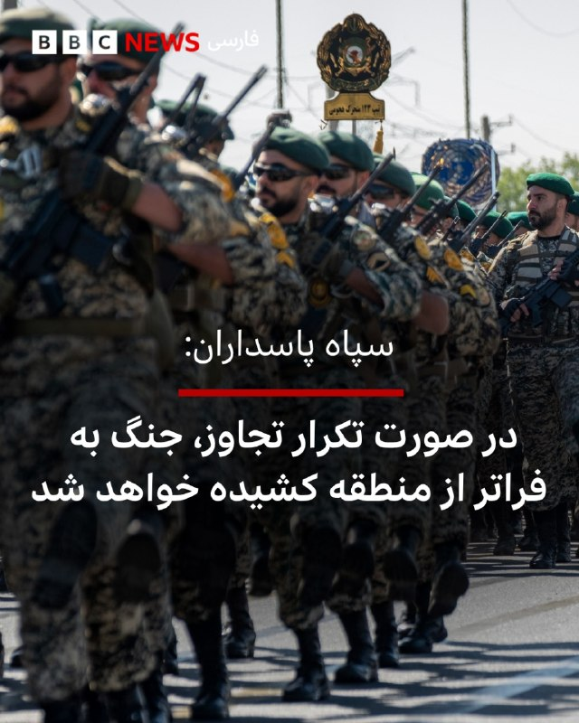

‌🔻سپاه پاسداران با انتشار بیانیه‌ای تهدید کرده که در صورت آغاز دوباره جنگ آمریکا و اسرائیل علیه ایران، جنگ «به فراتر از منطقه کشیده خواهد شد.»

در این بیانیه با اشاره به تهدیدهای دونالد ترامپ و مقام‌های اسرائیل برای حمله مجدد به ایران آمده: «اگر تجاوز به ایران تکرار شود جنگ منطقه‌ای که وعده داده شده بود، این بار به فراتر از منطقه کشیده خواهد شد و ضربات کوبنده ما در جاهایی که تصور آن را ندارید شما را به خاک سیاه خواهد نشاند.»

عباس عراقچی، وزیر خارجه ایران هم در واکنش به اظهارات تهدیدآمیز دونالد ترامپ، رئیس‌جمهور آمریکا، درباره احتمال از سرگیری حمله نظامی به ایران، در شبکه ایکس نوشته «با درس‌هایی که آموخته‌ایم و دانشی که به دست آورده‌ایم، مطمئن باشید بازگشت به میدان جنگ با شگفتی‌های بسیار بیشتری همراه خواهد بود.»

دونالد ترامپ، رئیس جمهور آمریکا، روز گذشته گفت که در آستانه حمله نظامی دوباره به ایران، او به درخواست رهبران منطقه، دستور لغو حمله را داده است.

📷NurPhoto via Getty Images
https://bbc.in/4uZ5Tzw

@BBCPersian

## BBCPersian — post 281590

🔻کاخ سفید شرکت ترامپ در اجلاس ماه آینده گروه هفت را تایید کرد

🔻کاخ سفید تایید کرده است که رئیس جمهور ترامپ علی‌رغم افزایش تنش با متحدانش، در اجلاس ماه آینده سران گروه هفت در فرانسه شرکت خواهد کرد.

پیش از این، تردیدهایی در مورد شرکت او در این رویداد در تفرجگاه اویان له بن در سواحل دریاچه ژنو وجود داشت.

گفته می‌شود آقای ترامپ مشتاق است که این نشست را بیش از آنچه که معمولاً گردهمایی‌های دیپلماتیک هستند، متمرکز بر تجارت کند.

میزبان او، رئیس جمهور امانوئل مکرون، پیش از این برنامه میزبانی شام پس از اجلاس در کاخ ورسای را به عنوان یک مشوق اضافی برای حضور آقای ترامپ پیشنهاد داد.

تاریخ‌های پیشنهادی این اجلاس قبلاً تغییر کرده بود تا با برنامه آقای ترامپ برای میزبانی یک مسابقه رزمی یو‌اف‌سی در کاخ سفید در هشتادمین سالگرد تولدش تداخل نداشته باشد.

https://bbc.in/3PsPDrq
@BBCPersian

## BBCPersian — post 281580

‌🖊آندره بیرناث
بی‌بی‌سی برزیل

🔻پایانی سرد، تاریک و تا حدی ملال‌آور. سرانجامی خشن و ویرانگر. یا شاید پایانی که آغازی دیگر در دل خود دارد؟

این موارد از برجسته‌ترین نظریه‌ها درباره این هستند که پایان جهان در آینده‌ای بسیار، بسیار دور ممکن است چه شکلی داشته باشد؛ البته اگر اصلا پایانی در کار باشد.

سرنوشت جهان یکی از اسرار‌آمیز‌ترین پرسش‌های علم است. حتی دانشمندان هم باور دارند که پرسش‌ها بیش از پاسخ‌هاست.

برای آنکه برخی از راه‌هایی که جهان ممکن است به پایان برسد را دریابیم ابتدا باید بفهمیم جهان چگونه آغاز شده است.

متن کامل خبر را از لینک زیر بخوانید:
https://bbc.in/4dSPuqm

📷Getty/ Fotograzia via Getty Images/ FlashMovie via GettyImages/ Arctic Images via Getty Images/ Fotograzia via Getty Images

@BBCPersian

## BBCPersian — post 281579

🔻نفتکش کره‌ جنوبی «با همکاری مقام‌های ایرانی» در حال عبور از تنگه هرمز است

🔻چو هیون، وزیر امور خارجه کره جنوبی، روز چهارشنبه گفت که یک نفتکش کره‌ای حامل نفت خام با همکاری مقام‌های ایرانی در حال عبور از تنگه هرمز است.

او در اظهارات خود در جلسه استماع پارلمان در سئول، جزئیات بیشتری در مورد این کشتی ارائه نکرد.

داده‌های کشتیرانی شرکت ال‌اس‌ای‌جی روز چهارشنبه نشان می‌دهد که ابرنفتکش یونیورسال وینر با پرچم کره جنوبی و حامل ۲ میلیون بشکه نفت خام کویت، در حال خروج از تنگه هرمز است.

عبور این نفتکش کره‌ای با همکاری مقام‌های ایران پس از آن صورت می‌گیرد که حدود دو هفته پیش (۱۴ اردیبهشت / ۴ مه) کشتی باری کره‌ای «اچ‌ام‌ام نامو» در نزدیکی تنگه هرمز هدف «دو پهپاد ناشناس» قرار گرفت.
https://bbc.in/3RwznWP
@BBCPersian

## BBCPersian — post 281571

‌🖊لوئیز آنتونیو آراخو
بی‌بی‌سی برزیل

🔻هم‌زمان با جنگ ایران، وب‌سایت «دیبریف» مصاحبه‌ای خیالی با کارل فون کلاوزویتس منتشر کرد؛ ژنرال و نظریه‌پرداز پروسی قرن نوزدهم که اندیشه‌هایش دوباره در تحلیل جنگ‌های مدرن مورد توجه قرار گرفته است.

بئاتریس هویزر، رئیس آکادمی ستاد کل نیروهای مسلح آلمان، می‌گوید کلاوزویتس نخستین متفکری بود که جنگ را نه از منظر اخلاق و الهیات، بلکه به عنوان پدیده‌ای سیاسی و اجتماعی برای فهم ماهیت آن بررسی کرد.

اندیشه‌های کلاوزویتس بر چهره‌هایی چون دوک ولینگتون و ولادیمیر لنین تاثیر گذاشت و ایده‌های او همچنان یکی از مهم‌ترین چارچوب‌های نظری برای تحلیل جنگ محسوب می‌شود.

ساندرو تیشیرا موئیتا، استاد علوم نظامی، می‌گوید ابهام درباره اهداف آمریکا در جنگ ایران نشان می‌دهد تحلیلگران همچنان از مفاهیم کلاوزویتس برای فهم استراتژی، قدرت و اهداف سیاسی در جنگ استفاده می‌کنند.

هیو استراون، استاد روابط بین‌الملل، می‌گوید مفهوم مشهور کلاوزویتس درباره «ادامه سیاست با ابزارهایی دیگر» همچنان برای فهم جنگ ایران کاربرد دارد؛

لینک خبر کامل:

https://bbc.in/49M0mUD
📷Getty Images/BBCImages

@BBCPersian

## Dirty_Kids — post 389793

  

لیلیوم خارج از مطب بو گوز میده؟

@Dirty_Kids 👻

## Dirty_Kids — post 389792

  <a href="telegram/content/Dirty_Kids_389792_1779269612.mp4" target="_blank">🎬 Download video</a>

در قطر، کشور دوست و مثلا برادر سیاسی‌مذهبی‌تون، جلو تعداد محدود ایرانی هم هیچ غلطی نتونستید بکنید؛ آمریکای شمالی که دیگه جای صدها هزار ایرانیِ ملی‌گراست. ✌️👑

@Dirty_Kids 👻

## Dirty_Kids — post 389791

  

‏به این میگن عقب‌نشینی استراتژیک.

@Dirty_Kids 👻

## Dirty_Kids — post 389790

خیلی دلم میخواد تو مترو با یه دختر دوست بشم، دیت اول با ماشینم برم دنبالش پشماش بریزه اون لحظه که تیبا ۲ رو میبینه و بفهمه هرکی سوار مترو میشه فقیر نیست.

@Dirty_Kids 👻

## Dirty_Kids — post 389789

  

فرزند ایران و کشته شده در راه وطن #امیرحسین_الوند

@Dirty_Kids 👻

## Dirty_Kids — post 389788

  

عارف‌ عزیز، آرسنال، تیم محبوبت قهرمان شد.

@Dirty_Kids 👻

## Dirty_Kids — post 389787

  

حاصل جفتگیری قالیباف و میرسلیم:

@Dirty_Kids 👻

## Hranews — post 113055

خودکشی یک جنگ‌زده در هتل لاله؛ وزارت بهداشت: شهرداری مانع استقرار تیم‌های روان‌ درمانی شد

❗️
❗️
❗️
❗️
❗️– یک مرد جوان جنگ‌زده اسکان‌یافته در هتل لاله تهران در جریان درگیری های نظامی #خودکشی کرده است. در این میان، مقام‌های شهرداری تهران و وزارت بهداشت روایت‌های متفاوتی درباره نحوه رسیدگی به وضعیت روانی آسیب‌دیدگان ارائه داده‌اند. مقام‌های وزارت بهداشت می‌گویند شهرداری از استقرار تیم‌های تخصصی روان‌درمانی در مراکز اسکان جلوگیری کرده، اما شهرداری این ادعا را رد کرده و اعلام کرده است که پیش از آن، خدمات مشاوره‌ای را در این مراکز ارائه داده بود.

ادامه مطلب

↘️
@hranews_bot تماس ✉️ - @Hranews کانال هرانا 🆑

## Hranews — post 113054

گزارشی از بازداشت امیر سبحانی در جوانرود

❗️
❗️
❗️
❗️
❗️– روز دوشنبه ۲۸ اردیبهشت ماه، امیر سبحانی، شهروند اهل جوانرود، توسط نیروهای امنیتی در این شهرستان بازداشت شد. وی سپس با صدور قرار بازداشت به زندان دیزل آباد کرمانشاه منتقل شد.

#امیر_سبحانی

ادامه مطلب

↘️
@hranews_bot تماس ✉️ - @Hranews کانال هرانا 🆑

## Hranews — post 113053

  

بر اساس آخرین داده‌های نت‌ بلاکس، قطع گسترده اینترنت در ایران وارد هشتاد و دومین روز خود شده و این کشور پس از بیش از ۱۹۴۴ ساعت، همچنان تا حد زیادی از دسترسی به اینترنت جهانی محروم است. این نهاد ناظر بر وضعیت دسترسی به #اینترنت در جهان اعلام کرد که در شرایطی که حتی اختلالات چند دقیقه‌ای در بسیاری از کشورها بحران تلقی می‌شود، تداوم این وضعیت در ایران رکوردهای بی‌سابقه‌ای را ثبت کرده است.

↘️
@hranews_bot تماس ✉️ - @Hranews کانال هرانا 🆑

## Hranews — post 113052

یک شهروند در شهرستان ری بازداشت شد؛ طرح ادعای ارتباط با اسرائیل

❗️
❗️
❗️
❗️
❗️– دادستان شهرستان ری از بازداشت یک شهروند در جنوب این شهرستان خبر داد. این مقام قضایی، مدعی همکاری اطلاعاتی فرد بازداشتی با سرویس جاسوسی اسرائیل شده است.

ادامه مطلب

↘️
@hranews_bot تماس ✉️ - @Hranews کانال هرانا 🆑

## Hranews — post 113051

پژمان جمشیدی به ۹۹ ضربه شلاق محکوم شد

❗️
❗️
❗️
❗️
❗️– وکیل مدافع پژمان جمشیدی، بازیگر سینما و تلویزیون، از صدور حکم ۹۹ ضربه #شلاق تعزیری توسط دادگاه کیفری تهران برای موکل خود خبر داد. به گفته وکیل، این رای از بابت اتهامی موسوم به «مادون زنا» صادر شده و اتهامات اصلی مطرح‌شده در این پرونده در دادگاه رد شده است.

#پژمان_جمشیدی

ادامه مطلب

↘️
@hranews_bot تماس ✉️ - @Hranews کانال هرانا 🆑

## Hranews — post 113050

  

متهم به قتل الهه حسین‌نژاد اعدام شد

❗️
❗️
❗️
❗️
❗️– مرکز رسانه قوه قضاییه از اجرای حکم #اعدام متهم به قتل الهه حسین‌نژاد، خبر داد.

#الهه_حسین‌نژاد

ادامه مطلب

↘️
@hranews_bot تماس ✉️ - @Hranews کانال هرانا 🆑

## manototv — post 105669

  

به گزارش خبرگزاری‌های داخلی، حکم اعدام بهمن فرزانه، قاتل الهه حسین‌نژاد، بامداد چهارشنبه اجرا شده است.
الهه حسین‌نژاد، زن ۲۴ ساله، خرداد سال گذشته هنگام بازگشت به خانه در تهران ناپدید شد و حدود ۱۰ روز بعد پیکر او با چندین ضربه چاقو در بیابان‌های اطراف تهران پیدا شد.
خبرگزاری میزان، وابسته به قوه قضاییه جمهوری اسلامی، اعلام کرده این حکم پس از طی مراحل قانونی و با درخواست اولیای دم اجرا شده است.

## manototv — post 105668

  

زمین‌لرزه‌ای به بزرگی ۴.۷ بامداد چهارشنبه ۳۰ اردیبهشت حوالی لافت در استان هرمزگان را لرزاند. مرکز لرزه‌نگاری کشوری عمق این زلزله را ۲۰ کیلومتر اعلام کرده است. این زمین‌لرزه در بخش‌هایی از قشم، هرمز و مناطق روستایی بندرعباس نیز احساس شد. مقام‌های محلی می‌گویند تاکنون گزارشی از خسارت دریافت نشده، اما بررسی‌ها در مناطق نزدیک به کانون زلزله ادامه دارد.

## manototv — post 105667

  <a href="telegram/content/manototv_105667_1779269617.mp4" target="_blank">🎬 Download video</a>

دونالد ترامپ، رئیس‌جمهور آمریکا، بار دیگر مدعی شد که ایالات متحده جنگ با جمهوری اسلامی را «خیلی سریع» پایان خواهد داد و تهران «به‌شدت» خواهان توافق است.
ترامپ در جریان مراسم سالانه پیک‌نیک کنگره در محوطه جنوبی کاخ سفید گفت توافق با تهران «اتفاق خواهد افتاد و سریع هم اتفاق می‌افتد».
او همچنین مدعی شد با پایان این بحران، قیمت نفت «به‌شدت کاهش خواهد یافت».
این اظهارات پس از آن مطرح می‌شود که ترامپ اوایل هفته گفته بود تهران برای رسیدن به توافق «التماس» می‌کند و او تنها یک ساعت با صدور دستور حملات تازه علیه جمهوری اسلامی فاصله داشته است.
ترامپ گفت به درخواست متحدان خلیج فارس آمریکا، حملات را متوقف کرده تا به گفته او، «مذاکرات جدی» ادامه پیدا کند. با این حال، او هشدار داد اگر جمهوری اسلامی به توافق نرسد، آمریکا برای یک «حمله کامل» آماده است.

## manototv — post 105666

  

شی جین‌پینگ، رئیس‌جمهوری چین، در دیدار با ولادیمیر پوتین در پکن خواستار توقف فوری درگیری‌ها در خاورمیانه شد و گفت پایان جنگ می‌تواند به کاهش اختلال در عرضه انرژی و زنجیره‌های تجارت جهانی کمک کند.

شی جین‌پینگ روز چهارشنبه، ۲۰ مه ۲۰۲۶، در دیدار با ولادیمیر پوتین در تالار بزرگ خلق پکن گفت وضعیت خاورمیانه در مرحله‌ای حساس میان جنگ و صلح قرار دارد و توقف درگیری‌ها «فوری‌ترین ضرورت» است. او تأکید کرد بازگشت به جنگ قابل قبول نیست و مسیر مذاکره باید در اولویت قرار گیرد. به گفته رئیس‌جمهور چین، پایان زودهنگام درگیری‌ها می‌تواند از اختلال بیشتر در عرضه انرژی و عملکرد زنجیره‌های صنعتی و تجاری جلوگیری کند.

پوتین نیز در آغاز این دیدار گفت روابط روسیه و چین به سطحی «بی‌سابقه» رسیده و از شی جین‌پینگ دعوت کرد سال آینده به روسیه سفر کند. رئیس‌جمهوری روسیه همچنین همکاری دو کشور را عاملی برای «بازدارندگی و ثبات» در روابط بین‌الملل توصیف کرد.

بر اساس گزارش‌ها، دو طرف در این دیدار درباره انرژی، امنیت و روابط کلی مسکو و پکن گفت‌وگو کردند و با تمدید پیمان دوستی چین و روسیه موافقت کردند؛ پیمانی که نخستین‌ب

## manototv — post 105665

  

جی‌دی ونس، معاون رئیس‌جمهور آمریکا، گفت واشینگتن در برابر جنگ با ایران دو مسیر پیش رو دارد: ادامه مذاکره یا ازسرگیری عملیات نظامی.

جی‌دی ونس در نشست خبری کاخ سفید گفت آمریکا در برابر ایران «دو مسیر» دارد.

به گفته ونس، مسیر اول مذاکره است. او گفت دونالد ترامپ از تیم خود خواسته با جمهوری اسلامی «تهاجمی» مذاکره کنند.

ونس گفت آمریکا در موضوع اصلی، یعنی جلوگیری از دستیابی ایران به سلاح هسته‌ای، پیشرفت زیادی داشته و واشینگتن فکر می‌کند تهران خواهان توافق است.

او مسیر دوم را ازسرگیری عملیات نظامی دانست و گفت: «گزینه دوم این است که کارزار نظامی را دوباره شروع کنیم تا اهداف آمریکا دنبال شود.»

ونس گفت این مسیر چیزی نیست که ترامپ بخواهد و فکر نمی‌کند جمهوری اسلامی هم خواهان آن باشد.

او در پایان گفت: «برای توافق، دو طرف لازم است.»

## manototv — post 105664

  <a href="telegram/content/manototv_105664_1779269619.mp4" target="_blank">🎬 Download video</a>

«سکوت ما همدستی با جمهوری اسلامی است»

## alonews — post 121255

  <a href="telegram/content/alonews_121255_1779269619.webm" target="_blank">🎬 Download video</a>

👈نفوذ پهپاد به حریم هوایی اردن

✅ @AloNews خبر جنگ

## alonews — post 121254

  <a href="telegram/content/alonews_121254_1779269620.mp4" target="_blank">🎬 Download video</a>

👈گزارش‌هایی از یک رویداد با تلفات انبوه در شهر دویر در جنوب لبنان پس از یک حمله هوایی اسرائیلی که حدود ۳۰ دقیقه پیش منطقه را هدف قرار داد.

✅ @AloNews خبر جنگ

## alonews — post 121253

  <a href="telegram/content/alonews_121253_1779269621.webm" target="_blank">🎬 Download video</a>

👈وزیر کشور پاکستان عازم تهران شد

✅ @AloNews خبر جنگ

## alonews — post 121252

  <a href="telegram/content/alonews_121252_1779269621.webm" target="_blank">🎬 Download video</a>

👈وزارت خارجه کره جنوبی اعلام کرد: کشتی تحت مدیریت این کشور پس از مشورت با مقامات ایرانی، با خیال راحت از تنگه هرمز عبور کرد.

✅ @AloNews خبر جنگ

## alonews — post 121251

  <a href="telegram/content/alonews_121251_1779269621.webm" target="_blank">🎬 Download video</a>

👈بحرین : نیروهای ما تو حالت آمادگی رزمی "کامل" قرار داره

✅ @AloNews خبر جنگ

## alonews — post 121250

  <a href="telegram/content/alonews_121250_1779269622.webm" target="_blank">🎬 Download video</a>

👈 «امارات متحده عربی به آرامی با پاکستان تماس گرفته و به دنبال درگیری مجدد است.

🔴این حرکت پس از یک درک آشکار میان تصمیم‌گیرندگان اماراتی رخ داده است که پاکستان کشوری بسیار مهم است که نباید در سمت اشتباه قرار گیرد.

🔴همچنین تغییری در سیاست امارات وجود دارد. برخلاف موضع قبلی خود، ابوظبی اکنون دیپلماسی را برای حل تعارض ایران-آمریکا ترجیح می‌دهد،» - کامران یوسف از شبکه جهانی تی‌آرتی و اکسپرس نیوز پاکستان.

✅ @AloNews خبر جنگ

## alonews — post 121249

  <a href="telegram/content/alonews_121249_1779269622.webm" target="_blank">🎬 Download video</a>

👈مقامات بحرین دو تبعه مصری را به اتهام ابراز همدردی با جمهوری اسلامی ایران به ۱۰ سال زندان محکوم کرده‌اند

✅ @AloNews خبر جنگ

## alonews — post 121248

  <a href="telegram/content/alonews_121248_1779269622.webm" target="_blank">🎬 Download video</a>

👈رشد ۴۲ هزار واحدی شاخص بورس در دومین روز بازگشایی بازار

🔴 شاخص کل بورس با رشد ۴۲ هزار واحدی در پایان معاملات امروز به ۳ میلیون و ۷۵۸ هزار واحد رسید.

✅ @AloNews خبر جنگ

## alonews — post 121247

  <a href="telegram/content/alonews_121247_1779269622.webm" target="_blank">🎬 Download video</a>

👈رسانه‌های اسرائیلی: ترامپ و نتانیاهو دیشب تماس تلفنی طولانی داشتند که به عنوان تماس محوری توصیف شده است

✅ @AloNews خبر جنگ

## alonews — post 121246

  <a href="telegram/content/alonews_121246_1779269622.webm" target="_blank">🎬 Download video</a>

👈طبق مصوبه جدید کارگروه تنظیم بازار، قیمت انواع چای به‌صورت دوره‌ای تعیین و اعلام می‌شود و دولت بانک مرکزی و چند وزارتخانه را مکلف به کنترل بازار چای کرد.

✅ @AloNews خبر جنگ

## alonews — post 121245

  <a href="telegram/content/alonews_121245_1779269622.webm" target="_blank">🎬 Download video</a>

👈الجزیره: اکثریت روس‌ها دیدار روسای جمهور روسیه و چین را تحول آفرین نمی‌دانند، بلکه آن را گامی مهم برای تقویت روابط اقتصادی می‌بینند

🔴 برای بسیاری از مردم روسیه ملاقات پوتین و زلنسکی، قطعاً حیاتی‌تر از این دیدار است

✅ @AloNews خبر جنگ

## alonews — post 121244

  <a href="telegram/content/alonews_121244_1779269622.mp4" target="_blank">🎬 Download video</a>

👈مراسم عروسی جان فداها: عروس رفته تنگه هرمز گل بچینه!

✅ @AloNews خبر جنگ

## alonews — post 121243

  <a href="telegram/content/alonews_121243_1779269623.webm" target="_blank">🎬 Download video</a>

👈حملات اسرائیل به جنوب لبنان

✅ @AloNews خبر جنگ

## alonews — post 121242

  <a href="telegram/content/alonews_121242_1779269623.webm" target="_blank">🎬 Download video</a>

👈فرمانده سنتکام دلیل خروج ناوگروه «جرالد فورد» از خاورمیانه را اعلام کرد

🔴«برد کوپر»، فرمانده ستاد فرماندهی مرکزی آمریکا (سنتکام)، علت خروج ناوگروه «جرالد فورد» از منطقه خاورمیانه را تشریح کرد.

🔴دریاسالار کوپر عنوان داشت که «نیازی به حضور همزمان سه ناوگروه حامل پرچم در خاورمیانه نبود.»

🔴وی افزود که ناوگروه‌های «جورج بوش» و «آبراهام لینکلن» همچنان در منطقه حضور دارند. کوپر گفت: «نیازی پایدار به وجود سه ناو هواپیمابر در منطقه احساس نمی‌شد.»

✅ @AloNews خبر جنگ

## alonews — post 121241

  <a href="telegram/content/alonews_121241_1779269623.webm" target="_blank">🎬 Download video</a>

👈ارتش سوریه با یک واحد اصلی در تمرین نظامی EFES-2026 ارتش ترکیه شرکت می‌کند.

🔴این اولین بار است که نیروهای سوریه از زمان تغییر حکومت در یک تمرین نظامی خارج از سوریه شرکت می‌کنند.

✅ @AloNews خبر جنگ

## alonews — post 121240

  <a href="telegram/content/alonews_121240_1779269623.mp4" target="_blank">🎬 Download video</a>

👈شی جین‌پینگ: رئیس‌جمهور پوتین قبلاً برای بیست و پنجمین بار به چین سفر کرده است

🔴این به خودی خود نشان‌دهنده سطح بالا و ماهیت خاص روابط چین و روسیه است.

✅ @AloNews خبر جنگ

## alonews — post 121239

👈تصاویری از لحظه وقوع انفجار روز گذشته در دمشق

✅ @AloNews خبر جنگ

## alonews — post 121238

  <a href="telegram/content/alonews_121238_1779269625.webm" target="_blank">🎬 Download video</a>

👈بیانیه مشترک چین و روسیه:
ما از طرف‌های درگیر در خاورمیانه می‌خواهیم که وارد مذاکره شوند.

🔴هیچ کشوری یا مردمی درجه یک نیست و سلطه به هر شکلی غیرقابل قبول است

✅ @AloNews خبر جنگ

## alonews — post 121237

  <a href="telegram/content/alonews_121237_1779269625.webm" target="_blank">🎬 Download video</a>

👈 دو نفتکش چینی پس از دو ماه معطلی در خلیج فارس، روز چهارشنبه از تنگه هرمز عبور کردند.

✅ @AloNews خبر جنگ

## alonews — post 121236

  <a href="telegram/content/alonews_121236_1779269625.webm" target="_blank">🎬 Download video</a>

👈کشت خشخاش ممنوع شد

✅ @AloNews خبر جنگ

---
📅 بروزرسانی: 1405/02/30 09:25
---

## VahidOOnLine — post 241086

  

علی خضریان، عضو کمیسیون امنیت ملی مجلس، گفت مطلع شده است عباس عراقچی، وزیر خارجه جمهوری اسلامی، قرار است سفری به نیویورک داشته باشد و با کشورهای حوزه خلیج فارس درباره تنگه هرمز مذاکره کند.

او گفت: «امیدوارم این خبر دروغ باشد، چون برگزاری جلسه‌ای در نیویورک، یعنی در خاک دشمن، و کشورهای خلیج فارس نیز باید مورد بازخواست قرار بگیرند. چنین اقدامی جمهوری اسلامی را در موضع ضعف قرار می‌دهد.»
‌🏁 🇬🇧 IranintlTV

🤖 @VahidOOnLine

## VahidOOnLine — post 241085

  

♦️سردار آزمون، مهاجم با سابقه تیم ملی فوتبال ایران روز سه‌‌شنبه ۲۹ اردیبهشت با انتشار یک روایتگر در اینستاگرام، برای نخستین بار به خط خوردن از فهرست کاروان ایران در جام جهانی آمریکا واکنش نشان داد.

مهاجم شباب الاهلی امارات در این پیام نوشت: ««درسته پیشتون نیستم ولی رفیقام که هستین دلیلی نمیشه بهتون آرزوی موفقیت نکنم... خیلی‌ها می‌خوان خرابم کنن ولی این حرفا اصلا درست نیست، موفق باشین بچه‌ها.»

سردار آزمون پس از کشتار هزاران نفر در جریان انقلاب ملی ایرانیان، عبارت معروف «از خون جوانان وطن لاله دمیده» عارف قزوینی را روی دستش خالکوبی کرد. این مهاجم باسابقه تیم ملی فوتبال ایران در دی ماه ۱۴۰۴ با انتشار ویدیویی از کشته شدگان اعتراضات نوشت: «این‌ها قصه نبودند، واقعی بودند. هیچ‌وقت شما را از یاد نمی‌بریم.»
قوه قضائیه جمهوری اسلامی اموال سردار آزمون را هم پس از این وقایع و «به‌اتهام همکاری با دشمن» توقیف کرد.

پس از حملات جمهوری اسلامی به امارات متحده عربی، انتشار عکسی از سردار آزمون با محمد بن رشید، آل مکتوم، امیر دبی خبرساز شد.
‌🇸🇦 Indypersian

🤖 @VahidOOnLine

## VahidOOnLine — post 241084

  

خبرگزاری میزان، رسانه قوه قضاییه جمهوری اسلامی، اعلام کرد حکم اعدام بهمن فرزانه، قاتل الهه حسین‌نژاد، بامداد چهارشنبه اجرا شده است. الهه حسین‌نژاد در خرداد ۱۴۰۴ برای بازگشت به منزل سوار یک خودرو شده بود، اما راننده او را ربود و پیکر او را در بیابان‌های اطراف تهران رها کرد.
‌🏁 🇬🇧 IranintlTV

🤖 @VahidOOnLine

## VahidOOnLine — post 241083

  

♦️شی جین‌پینگ، رئیس جمهوری چین روز چهارشنبه ۳۰ اردیبهشت به ولادیمیر پوتین گفت ادامه از سرگیری جنگ در خاورمیانه، کار درستی نیست و دو طرف باید به یک آتش‌بس پایدار و مورد قبول دست یابند.

به گزارش خبرگزاری دولتی چین، شی به همتای روس خود گفت: «وضعیت در منطقه خلیج فارس در لحظاتی حیاتی بین جنگ و صلح قرار دارد. باید فورا به پایان کامل جنگ رسید. از سرگیری جنگ کار غلطی است و از سرگیری مذاکرات، واجب‌تر از همیشه است.»

این سخنان در حالی عنوان می‌شود که دونالد ترامپ شامگاه سه‌شنبه بار دیگر جمهوری اسلامی را به از سرگیری حملات تهدید کرد.
‌🇸🇦 Indypersian

🤖 @VahidOOnLine

## VahidOOnLine — post 241082

  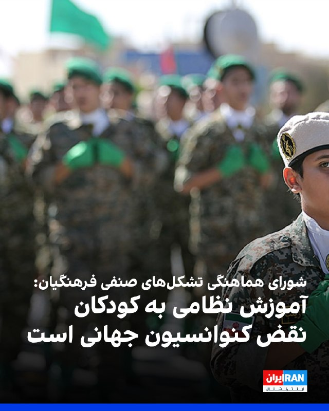

شورای هماهنگی تشکل‌های صنفی فرهنگیان ایران آموزش نظامی به کودکان در برخی مساجد و پایگاه‌های بسیج در ایران را نقض آشکار کنوانسیون حقوق کودک دانست و هشدار داد این روند نگرانی‌های جدی در حوزه حقوق کودک ایجاد کرده است.
این شورا افزود: بر اساس استانداردهای بین‌المللی، مشارکت یا آماده‌سازی افراد زیر ۱۸ سال برای فعالیت‌های نظامی می‌تواند در تعارض با اصل «منافع عالی کودک» تلقی شود.
شورای هماهنگی تشکل‌های صنفی فرهنگیان هشدار داد تداوم این نوع برنامه‌ها، می‌تواند مصداقی از نظامی‌سازی فضای کودکی و نقض تعهدات بین‌المللی در حوزه حقوق کودک باشد و نیازمند بررسی مستقل و شفاف از سوی نهادهای مسئول و بین‌المللی است.

‌🏁 🇬🇧 IranintlTV

🤖 @VahidOOnLine

## VahidOOnLine — post 241081

♦️شی جین‌پینگ، رئیس‌جمهوری چین روز چهارشنبه ۳۰ اردیبهشت و کمتر از یک هفته پس از دیدار با دونالد ترامپ، از ولادیمیر پوتین رئیس جمهوری روسیه استقبال کرد.
روسیه در قرن گذشته ابرقدرتی بود که برای مدت‌ها چین را در سایه خود قرار داده بود. روندی که به نظر می‌رسد هم‌اکنون با سرعت در حال تغییر است.
‌🇸🇦 Indypersian

🤖 @VahidOOnLine

## VahidOOnLine — post 241080

  

روسای جمهوری چین و روسیه در پکن دیدار کردند. شی جین‌پینگ در این دیدار با تاکید بر لزوم مذاکره برای رسیدگی به وضعیت خاورمیانه، خواستار توقف درگیری‌ها شد. او گفت پایان دادن به جنگ به کاهش اختلال در ثبات عرضه انرژی و نظم تجارت بین‌المللی کمک خواهد کرد.
دو طرف در این دیدار پیمان دوستی و همکاری چین و روسیه را تمدید کردند.
پوتین به شی گفت روابط میان روسیه و چین به سطحی بی‌سابقه رسیده است و از او دعوت کرد سال آینده به روسیه سفر کند.

‌🏁 🇬🇧 IranintlTV

🤖 @VahidOOnLine

## VahidOOnLine — post 241079

  

مایک والتز، سفیر آمریکا در سازمان ملل متحد در پستی در ایکس با اشاره به اینکه پول حکومت ایران رو به اتمام است و اقتصادش در حال فروپاشی است، گفت با این حال جمهوری اسلامی به جای تغییر رویه، مشغول اقدام‌های غیرقابل تحملی همچون حملات به زیرساخت‌های غیرنظامی است.
او گفت: «اما نیروهای نظامی جمهوری اسلامی به جای اتخاذ رویکردی جدید و مسالمت‌آمیز، درگیر حملات مکرر و بی‌ملاحظه، به زیرساخت‌های برق غیرنظامی، شده و به استراتژی سلاح‌های هسته‌ای پناه برده‌اند که خطر فرو بردن جهان در تاریکی را به همراه دارد.»
او افزود:«ما نمی‌توانیم این را تحمل کنیم و آن را تحمل نخواهیم کرد.»
والتز گفت: «رییس‌جمهوری ترامپ و ایالات متحده بارها و بارها در این درگیری مورد تردید قرار گرفته‌اند، اما به نظر من این بار دیگر روشن شده که رییس‌جمهوری در حال انجام اقداماتی است که برای تضمین آینده‌ای امن‌تر برای جهان ضروری است.»
سفیر آمریکا در سازمان ملل متحد افزود: «آنچه باید بر آن تمرکز کنیم، حکومتی است که به‌تازگی به یک نیروگاه هسته‌ای در یک کشور همسایه حمله کرده است.»

‌🏁 🇬🇧 IranintlTV

🤖 @VahidOOnLine

## VahidOOnLine — post 241078

  

♦️به گزارش فایننشال تایمز، ایران ناچار شده نفت خود را روی نفتکش‌های فرسوده‌ای که در خلیج فارس لنگر انداخته‌اند ذخیره کند، زیرا محاصره آمریکا به‌طور شدید توان صادرات نفت خام را محدود کرده است.
این نشریه با استناد به داده‌های سازمان «اتحاد علیه ایران هسته‌ای» گزارش داد که در حال حاضر حدود ۳۹ نفتکش حامل نفت و محصولات پتروشیمی ایران در خلیج فارس مستقر هستند؛ در حالی که پیش از اجرایی شدن این محاصره در ۱۳ آوریل، این رقم ۲۹ کشتی بود. تعداد زیادی از این کشتی‌ها در نزدیکی پایانه صادرات نفت ایران در جزیره خارگ تجمع کرده‌اند.
فایننشال تایمز همچنین ۱۳ نفتکش مشکوک دیگر را در نزدیکی بندر چابهار در خلیج عمان شناسایی کرده که در شرق تنگه هرمز قرار دارد و عملا در امتداد خط محاصره دریایی آمریکا واقع شده‌اند.
پیش از حملات آمریکا و اسرائیل، ایران ماهانه بین ۴۰ تا ۶۰ میلیون بشکه نفت صادر می‌کرد؛ حدود ۲ درصد از عرضه جهانی.
‌🇸🇦 Indypersian

🤖 @VahidOOnLine

## VahidOOnLine — post 241077

  <a href="telegram/content/VahidOOnLine_241077_1779256511.mp4" target="_blank">🎬 Download video</a>

♦️دو ماه و نیم پس از معرفی مجتبی خامنه‌ای به عنوان سومین رهبر نظام و در حالی که هنوز هیچ صدا و تصویر جدیدی از او منتشر نشده و رسانه‌های حکومتی با استفاده از هوش مصنوعی به تولید محتوا درباره او مشغولند، صداوسیما از «مشت گره کرده» منسوب به مجتبی خامنه‌ای رونمایی کرد. در دو ماه اخیر روایت‌های متعددی درباره وضعیت مجتبی خامنه‌ای که در روز نخست عملیات نظامی آمریکا و اسرائیل همراه با پدرش در مجموعه «بیت رهبری» هدف گرفته شده، منتشر شده است. در حالی که علی خامنه‌ای، رهبر سابق نیز هنوز دفن نشده، برخی منابع حکومتی ادعا کرده‌اند که پسرش زنده و سالم است اما برای اینکه مکان اختفای او شناسایی نشود، در انظار عمومی ظاهر نمی‌شود. به تدریج روایت‌هایی که بر سالم بودن او تاکید داشتند جای خود را به اینکه او مجروح شده تغییر پیدا کرد و بعد میزان و نوع جراحت موضوع روایت‌های متناقض شد. برآوردهای آمریکا و اسرائیل نیز در آغاز به احتمال مرگ یا در کما بودن او اشاره داشت و بعدا در بیشتر گزارش‌ها تاکید شد که مجتبی خامنه‌ای به شدت مجروح شده است. در این مدت، بیانیه‌‌هایی نوشتاری منسوب به او در صداوسیما قرائت شده است.
‌🇸🇦 Indypersian

🤖 @VahidOOnLine

## VahidOOnLine — post 241076

  

مریم طهماسبی، عروس معصومه ابتکار، گروگان‌گیر سفارت آمریکا در ایران و معاون پیشین رییس‌جمهور، در مصاحبه تلفنی با آسوشیتدپرس از یک بازداشتگاه مهاجرتی در تگزاس درباره علت اقامتشان در آمریکا گفت: «تنها چیزی که می‌خواستیم این بود که پسرمان زندگی عادی داشته باشد.»
او افزود: «من و همسرم، عیسی هاشمی، می‌خواهیم در حالی که پسرمان به دبیرستان بازمی‌گردد، تدریس را از سر بگیریم.»
طهماسبی گفت: «ما هرگز فکر نمی‌کردیم که دستگیر شویم. خانواده ما از طبقه متوسط است و هیچ ارتباطی با پول یا قدرت ندارد.»
عروس معصومه ابتکار خاطرنشان کرد: «فرض ما این بود که تا زمانی که از همه قوانین و مقررات پیروی کنیم، در امان خواهیم بود.»
به گزارش آسوشیتدپرس، این خانواده که یک دهه است در ایالات متحده زندگی می‌کنند، پس از دستگیری به دلیل ارتباط‌‌شان با معصومه ابتکار، خواستار آزادی خود از بازداشتگاه مهاجرتی شده‌اند.
یک قاضی فدرال پس از آن‌که این خانواده دادخواست‌هایی را علیه قانونی بودن بازداشت خود ارائه کرد، دولت را به طور موقت از اخراج آنها منع کرد. آنها از زمان دستگیری در اوایل آوریل در لس‌آنجلس، در مرکز مهاجرتی در ایالت تگزاس نگهداری می‌شوند.
‌🏁 🇬🇧 IranintlTV

🤖 @VahidOOnLine

## VahidOOnLine — post 241075

  <a href="telegram/content/VahidOOnLine_241075_1779256512.mp4" target="_blank">🎬 Download video</a>

♦️چارلز سوم، پادشاه بریتانیا، به همراه ملکه کامیلا در آغاز سفر سالانه خود به ایرلند شمالی، در رویدادی فرهنگی در «تامپسون داک» بلفاست شرکت کردند.
در این برنامه، آن‌ها در فضایی پرنشاط با موسیقی زنده و نمایش‌های فرهنگی ایرلندی همراه شدند؛ رویدادی که در آستانه برگزاری جشنواره موسیقی سنتی ایرلندی «Fleadh Cheoil» برگزار شد بزرگ‌ترین جشن سالانه موسیقی سنتی ایرلندی که امسال برای نخستین‌بار میزبانش شهر بلفاست خواهد بود.
پادشاه و ملکه همچنین از دستگاه‌های تقطیر تایتانیک «Titanic Distillers» بازدید کردند؛ جایی تاریخی که در ساختمان بازسازی‌شده‌ای قرار دارد که زمانی در ساخت کشتی تایتانیک نقش داشته و امروز به تولید ویسکی اختصاص یافته است.
‌🇸🇦 Indypersian

🤖 @VahidOOnLine

## VahidOOnLine — post 241074

  

سنای آمریکا با پیشبرد طرح محدود کردن اختیارات جنگی ترامپ در جنگ علیه جمهوری اسلامی موافقت کرد. اقدامات سنا در این زمینه تا کنون به تصویب نرسیده‌اند.

کوری بوکر، سناتور دموکرات، گفت: «باید همچنان به صحبت کردن ادامه دهیم تا سنا سرانجام برای پایان دادن به این جنگ اقدام کند.»
‌🏁 🇬🇧 IranintlTV

🤖 @VahidOOnLine

## VahidOOnLine — post 241073

  <a href="telegram/content/VahidOOnLine_241073_1779256513.mp4" target="_blank">🎬 Download video</a>

‌
خبرگزاری فرانسه گزارش داد شرکت هواپیماسازی ایرباس به دلیل پیامدهای جنگ آمریکا و اسرائیل با جمهوری اسلامی، از تیم‌های خود خواسته هزینه‌های «غیرضروری» را ۱۰ درصد کاهش دهند.

بر اساس سندی که خبرگزاری فرانسه مشاهده کرده، ایرباس اعلام کرده هدف این شرکت «توقف قابل توجه فعالیت‌ها و هزینه‌هایی است که برای عملیات و فعالیت‌های صنعتی کاملاً ضروری نیستند.»

در این یادداشت از کارکنان خواسته شده از ایجاد هزینه‌های جدید یا واگذاری فعالیت‌های غیرضروری به پیمانکاران خودداری کنند.

ایرباس همچنین بر کاهش هزینه‌هایی مانند رویدادهای داخلی، برنامه‌های تیمی، همایش‌ها و مشارکت در کنفرانس‌ها تاکید کرده است.
‌🏁 🇬🇧 ManotoTV

🤖 @VahidOOnLine

## WithYashar — post 11717

طبق گزارش نیویورک تایمز، آمریکا و اسرائیل پیش از جنگ با ایران درباره طرحی برای نصب محمود احمدی‌نژاد، رئیس‌جمهور سابق ایران، به عنوان رهبر جدید کشور گفتگو کردند.
گفته می‌شود احمدی‌نژاد در این طرح مشورت شده بود، اما پس از زخمی شدنش در حمله اسرائیل به منزلش در تهران در روز آغاز جنگ، این طرح از هم پاشید. مقامات آمریکایی گفتند این حمله با هدف آزاد کردن او از حصر خانگی انجام شده بود.
احمدی‌نژاد زنده ماند اما پس از آن از تلاش برای تغییر رژیم ناامید شد و از آن زمان تاکنون در انظار عمومی دیده نشده و محل اقامتش نامعلوم است.
@withyashar

## FoxNewsTwitter — post 341976

  <a href="telegram/content/FoxNewsTwitter_341976_1779256514.mp4" target="_blank">🎬 Download video</a>

Fox News (Twitter/X)

Newly released NTSB footage shows the terrifying moment a UPS cargo plane lost an engine seconds after takeoff in Louisville, Kentucky.

The surveillance video captures the aircraft’s left engine and pylon separating from the wing shortly after the plane lifted off the runway.

The November 4, 2025, crash killed 14 people and remains under intense federal investigation as officials work to determine what caused the catastrophic failure.

## FoxNewsTwitter — post 341975

  

Fox News (Twitter/X)

A major Trump ally is now one step away from Alabama’s governor’s mansion.

Sen. Tommy Tuberville rolled through the Republican primary after months of campaigning as a close ally of President Trump and a fighter against the Washington establishment.

The race drew national attention as another early test of Trump’s strength with Republican voters — and Alabama Republicans delivered Tuberville a commanding victory.

Now the longtime senator heads into the general election with the GOP favored to hold the seat.

## VahidOnline — post 75566

پوتین هم به خدمت شی رسید.
J74wabx

📡 @VahidOnline

## VahidOnline — post 75565

  

ترجمه ماشین
تیتر نیویورک‌تایمز: هدف اولیه جنگ، روی کار آوردن رئیس‌جمهور تندروی پیشین به عنوان رهبر ایران بود

بخش‌های خبری مطلب:
به گفته مقامات آمریکایی، حمله اسرائیل که با هدف آزادی محمود احمدی‌نژاد از حبس خانگی در تهران طراحی شده بود، بخشی از تلاش‌ها برای تغییر رژیم و به قدرت رساندن او بود.

چند روز پس از آنکه حملات اسرائیل در آغازین روزهای جنگ، رهبر ایران و سایر مقامات ارشد را به قتل رساند، پرزیدنت ترامپ علناً اظهار داشت که بهتر است «شخصی از درون» ایران کنترل کشور را به دست بگیرد.
اکنون مشخص شده است که ایالات متحده و اسرائیل با در نظر داشتن شخصیتی خاص و بسیار غافلگیرکننده وارد این درگیری شدند: محمود احمدی‌نژاد، رئیس‌جمهور پیشین ایران که به دلیل دیدگاه‌های تندرو، ضداسرائیلی و ضدآمریکایی‌اش شناخته می‌شود.

اما بر اساس گفته‌های مقامات آمریکاییِ مطلع از این موضوع، این طرح جسورانه که توسط اسرائیلی‌ها تدوین شده بود و با آقای احمدی‌نژاد نیز درباره آن مشورت شده بود، به سرعت با شکست مواجه شد.

مقامات آمریکایی و یکی از نزدیکان آقای احمدی‌نژاد اعلام کردند که او در روز اول جنگ بر اثر حمله اسرائیل به خانه‌اش در تهران - که برای رهایی او از حصر خانگی طراحی شده بود - مجروح شد. آن‌ها گفتند که او از این حمله جان سالم به در برد، اما پس از این خطر جانی، نسبت به طرح تغییر رژیم دلسرد و ناامید شد.

او از آن زمان تاکنون در انظار عمومی دیده نشده است و مکان و وضعیت فعلی او نامشخص است.
...
اینکه آقای احمدی‌نژاد چگونه برای مشارکت در این طرح به کار گرفته شد، هنوز در هاله‌ای از ابهام قرار دارد.
...
سخنگوی موساد، سازمان اطلاعات خارجی اسرائیل، از اظهارنظر در این باره خودداری کرد.
...
مقامات آمریکایی گفتند که این حمله - که توسط نیروی هوایی اسرائیل انجام شد - به منظور کشتن نگهبانان مراقب آقای احمدی‌نژاد و به عنوان بخشی از طرحی برای رهایی او از حبس خانگی صورت گرفت.
این حمله آسیب چندانی به خانه آقای احمدی‌نژاد که در انتهای یک کوچه بن‌بست قرار داشت، وارد نکرد. اما پاسگاه امنیتی در ورودی کوچه مورد اصابت قرار گرفت. تصاویر ماهواره‌ای نشان می‌دهد که آن ساختمان ویران شده است.

در روزهای پس از آن، خبرگزاری‌های رسمی روشن کردند که او جان سالم به در برده است، اما «محافظان» او - که در واقع اعضای سپاه پاسداران انقلاب اسلامی بودند و همزمان وظیفه محافظت و نگهداری او در حبس خانگی را بر عهده داشتند - کشته شده‌اند.

مقاله‌ای در نشریه آتلانتیک در ماه مارس، با استناد به منابع ناشناس نزدیک به آقای احمدی‌نژاد، نوشت که رئیس‌جمهور پیشین پس از حمله به خانه‌اش از حصر دولتی آزاد شده است؛ این مقاله آن رویداد را «در عمل یک عملیات فرار از زندان» توصیف کرد.

پس از انتشار آن مقاله، یکی از نزدیکان آقای احمدی‌نژاد در گفتگو با نیویورک تایمز تأیید کرد که آقای احمدی‌نژاد این حمله را به عنوان تلاشی برای آزادی خود تلقی کرده است. این فرد مطلع گفت که آمریکایی‌ها آقای احمدی‌نژاد را شخصی می‌دانستند که می‌تواند ایران را رهبری کند و توانایی مدیریت «وضعیت سیاسی، اجتماعی و نظامی ایران» را دارد.
این فرد مطلع اظهار داشت که آقای احمدی‌نژاد می‌توانست در آینده نزدیک «نقش بسیار مهمی» در ایران ایفا کند و اشاره کرد که ایالات متحده او را شبیه به دلسی رودریگز می‌دید؛ کسی که پس از دستگیری آقای مادورو توسط نیروهای آمریکایی در ونزوئلا قدرت را به دست گرفت و از آن زمان همکاری نزدیکی با دولت ترامپ داشته است.
...

در چند سال گذشته آقای احمدی‌نژاد سفرهایی به خارج از ایران داشته است که به گمانه‌زنی‌ها دامن زده است.
به گزارش مجله نیولاینز، او در سال ۲۰۲۳ به گواتمالا و در سال‌های ۲۰۲۴ و ۲۰۲۵ به مجارستان سفر کرد. هر دو کشور روابط نزدیکی با اسرائیل دارند.
ویکتور اوربان، نخست‌وزیر مجارستان در آن زمان، روابط نزدیکی با آقای نتانیاهو دارد. در طول این سفرها به مجارستان، آقای احمدی‌نژاد در دانشگاهی مرتبط با آقای اوربان سخنرانی کرد.

او تنها چند روز قبل از آغاز حملات اسرائیل به ایران در ژوئن گذشته از بوداپست بازگشت. زمانی که آن جنگ درگرفت، او حضور علنی کمرنگی داشت و تنها چند بیانیه در شبکه‌های اجتماعی منتشر کرد. سکوت نسبی او در مورد جنگ با کشوری که آقای احمدی‌نژاد مدت‌ها آن را دشمن اصلی ایران می‌دانست، مورد توجه بسیاری در شبکه‌های اجتماعی ایران قرار گرفت.
...
nytimes

📡 @VahidOnline

## IranIntlTV — post 338032

  <a href="telegram/content/IranIntlTV_338032_1779256516.mp4" target="_blank">🎬 Download video</a>

امید معماریان، تحلیل‌گر سیاسی در موسسه دان، گفت کاهش بخشی از نیروها و توان نظامی آمریکا در اروپا، هزینه‌های بیشتری بر سیاست‌های دفاعی و نظامی ناتو تحمیل خواهد کرد.
@iranintltv

## IranIntlTV — post 338031

  

علی خضریان، عضو کمیسیون امنیت ملی مجلس، گفت مطلع شده است عباس عراقچی، وزیر خارجه جمهوری اسلامی، قرار است سفری به نیویورک داشته باشد و با کشورهای حوزه خلیج فارس درباره تنگه هرمز مذاکره کند.

او گفت: «امیدوارم این خبر دروغ باشد، چون برگزاری جلسه‌ای در نیویورک، یعنی در خاک دشمن، و کشورهای خلیج فارس نیز باید مورد بازخواست قرار بگیرند. چنین اقدامی جمهوری اسلامی را در موضع ضعف قرار می‌دهد.»
https://iranintl.com/202605207168

## IranIntlTV — post 338030

  <a href="telegram/content/IranIntlTV_338030_1779256518.mp4" target="_blank">🎬 Download video</a>

بنابر گزارش وب‌سایت اتلتیک، فدراسیون جهانی فوتبال، فیفا، ممکن است به درخواست جمهوری اسلامی ورود پرچم شیر و خورشید به ورزشگاه‌های جام جهانی ۲۰۲۶ را ممنوع کند.

گفت‌وگو با عرفان قانعی‌فرد، تحلیل‌گر خاورمیانه
@iranintltv

## IranIntlTV — post 338029

  

خبرگزاری میزان، رسانه قوه قضاییه جمهوری اسلامی، اعلام کرد حکم اعدام بهمن فرزانه، قاتل الهه حسین‌نژاد، بامداد چهارشنبه اجرا شده است. الهه حسین‌نژاد در خرداد ۱۴۰۴ برای بازگشت به منزل سوار یک خودرو شده بود، اما راننده او را ربود و پیکر او را در بیابان‌های اطراف تهران رها کرد.
https://iranintl.com/202605200731

## IranIntlTV — post 338028

  <a href="telegram/content/IranIntlTV_338028_1779256519.mp4" target="_blank">🎬 Download video</a>

سرخط خبرهای چهارشنبه ۳۰ اردیبهشت
@iranintltv

## IranIntlTV — post 338027

  <a href="telegram/content/IranIntlTV_338027_1779256520.mp4" target="_blank">🎬 Download video</a>

سرخط خبرهای چهارشنبه ۳۰ اردیبهشت
@iranintltv

## IranIntlTV — post 338026

  

شورای هماهنگی تشکل‌های صنفی فرهنگیان ایران آموزش نظامی به کودکان در برخی مساجد و پایگاه‌های بسیج در ایران را نقض آشکار کنوانسیون حقوق کودک دانست و هشدار داد این روند نگرانی‌های جدی در حوزه حقوق کودک ایجاد کرده است.
این شورا افزود: بر اساس استانداردهای بین‌المللی، مشارکت یا آماده‌سازی افراد زیر ۱۸ سال برای فعالیت‌های نظامی می‌تواند در تعارض با اصل «منافع عالی کودک» تلقی شود.
شورای هماهنگی تشکل‌های صنفی فرهنگیان هشدار داد تداوم این نوع برنامه‌ها، می‌تواند مصداقی از نظامی‌سازی فضای کودکی و نقض تعهدات بین‌المللی در حوزه حقوق کودک باشد و نیازمند بررسی مستقل و شفاف از سوی نهادهای مسئول و بین‌المللی است.

https://iranintl.com/202605201370

## IranIntlTV — post 338025

  

روسای جمهوری چین و روسیه در پکن دیدار کردند. شی جین‌پینگ در این دیدار با تاکید بر لزوم مذاکره برای رسیدگی به وضعیت خاورمیانه، خواستار توقف درگیری‌ها شد. او گفت پایان دادن به جنگ به کاهش اختلال در ثبات عرضه انرژی و نظم تجارت بین‌المللی کمک خواهد کرد.
دو طرف در این دیدار پیمان دوستی و همکاری چین و روسیه را تمدید کردند.
پوتین به شی گفت روابط میان روسیه و چین به سطحی بی‌سابقه رسیده است و از او دعوت کرد سال آینده به روسیه سفر کند.

https://iranintl.com/202605201022

## IranIntlTV — post 338024

  

مایک والتز، سفیر آمریکا در سازمان ملل متحد در پستی در ایکس با اشاره به اینکه پول حکومت ایران رو به اتمام است و اقتصادش در حال فروپاشی است، گفت با این حال جمهوری اسلامی به جای تغییر رویه، مشغول اقدام‌های غیرقابل تحملی همچون حملات به زیرساخت‌های غیرنظامی است.
او گفت: «اما نیروهای نظامی جمهوری اسلامی به جای اتخاذ رویکردی جدید و مسالمت‌آمیز، درگیر حملات مکرر و بی‌ملاحظه، به زیرساخت‌های برق غیرنظامی، شده و به استراتژی سلاح‌های هسته‌ای پناه برده‌اند که خطر فرو بردن جهان در تاریکی را به همراه دارد.»
او افزود:«ما نمی‌توانیم این را تحمل کنیم و آن را تحمل نخواهیم کرد.»
والتز گفت: «رییس‌جمهوری ترامپ و ایالات متحده بارها و بارها در این درگیری مورد تردید قرار گرفته‌اند، اما به نظر من این بار دیگر روشن شده که رییس‌جمهوری در حال انجام اقداماتی است که برای تضمین آینده‌ای امن‌تر برای جهان ضروری است.»
سفیر آمریکا در سازمان ملل متحد افزود: «آنچه باید بر آن تمرکز کنیم، حکومتی است که به‌تازگی به یک نیروگاه هسته‌ای در یک کشور همسایه حمله کرده است.»

https://iranintl.com/202605208409

## IranIntlTV — post 338023

  

مریم طهماسبی، عروس معصومه ابتکار، گروگان‌گیر سفارت آمریکا در ایران و معاون پیشین رییس‌جمهور، در مصاحبه تلفنی با آسوشیتدپرس از یک بازداشتگاه مهاجرتی در تگزاس درباره علت اقامتشان در آمریکا گفت: «تنها چیزی که می‌خواستیم این بود که پسرمان زندگی عادی داشته باشد.»
او افزود: «من و همسرم، عیسی هاشمی، می‌خواهیم در حالی که پسرمان به دبیرستان بازمی‌گردد، تدریس را از سر بگیریم.»
طهماسبی گفت: «ما هرگز فکر نمی‌کردیم که دستگیر شویم. خانواده ما از طبقه متوسط است و هیچ ارتباطی با پول یا قدرت ندارد.»
عروس معصومه ابتکار خاطرنشان کرد: «فرض ما این بود که تا زمانی که از همه قوانین و مقررات پیروی کنیم، در امان خواهیم بود.»
به گزارش آسوشیتدپرس، این خانواده که یک دهه است در ایالات متحده زندگی می‌کنند، پس از دستگیری به دلیل ارتباط‌‌شان با معصومه ابتکار، خواستار آزادی خود از بازداشتگاه مهاجرتی شده‌اند.
یک قاضی فدرال پس از آن‌که این خانواده دادخواست‌هایی را علیه قانونی بودن بازداشت خود ارائه کرد، دولت را به طور موقت از اخراج آنها منع کرد. آنها از زمان دستگیری در اوایل آوریل در لس‌آنجلس، در مرکز مهاجرتی در ایالت تگزاس نگهداری می‌شوند.

## IranIntlTV — post 338022

  

سنای آمریکا با پیشبرد طرح محدود کردن اختیارات جنگی ترامپ در جنگ علیه جمهوری اسلامی موافقت کرد. اقدامات سنا در این زمینه تا کنون به تصویب نرسیده‌اند.

کوری بوکر، سناتور دموکرات، گفت: «باید همچنان به صحبت کردن ادامه دهیم تا سنا سرانجام برای پایان دادن به این جنگ اقدام کند.»
https://iranintl.com/202605201635

## FarsiVOA — post 218199

  

نیویورک‌تایمز گزارش داد اسرائیل در جریان طراحی یک طرح چندمرحله‌ای برای سرنگونی جمهوری اسلامی، محمود احمدی‌نژاد را به‌عنوان گزینه‌ای برای رهبری ایران پس از حذف علی خامنه‌ای و شماری از مقام‌های ارشد حکومت در نظر گرفته بود.

به نوشته این روزنامه، هنوز روشن نیست احمدی‌نژاد چگونه وارد این طرح شده یا چه میزان از جزئیات آن اطلاع داشته است. با این حال، بسیاری از مشاوران دونالد ترامپ این ایده را غیرواقع‌بینانه می‌دانستند و برخی مقام‌های آمریکایی به‌ویژه درباره امکان بازگرداندن احمدی‌نژاد به قدرت تردید داشتند.

نیویورک‌تایمز همچنین نوشت شماری از مقام‌های جمهوری اسلامی که در حمله به بیت رهبری کشته شدند، از نگاه کاخ سفید در میان چهره‌هایی قرار داشتند که آمادگی بیشتری برای گفت‌وگو درباره تغییر حکومت داشتند.

در همان دوره، رسانه‌های ایران ابتدا گزارش‌هایی درباره کشته‌شدن احمدی‌نژاد در حمله هوایی به خانه‌اش منتشر کردند؛ اما بعداً اعلام شد او زنده مانده است. تصاویر ماهواره‌ای نشان می‌داد خانه او آسیب جدی ندیده، اما پایگاه امنیتی ورودی کوچه کاملاً تخریب شده است.
@FarsiVOA

## FarsiVOA — post 218198

  

قوه قضائیه جمهوری اسلامی اعلام کرد حکم قصاص متهم به قتل الهه حسین‌نژاد، پس از تأیید در دیوان عالی کشور و با درخواست اولیای دم، اجرا شده است. رسانه‌های داخلی نام متهم این پرونده را بهمن فرزانه اعلام کرده‌اند.

الهه حسین‌نژاد خرداد ۱۴۰۴ پس از سوار شدن به یک خودروی مسافرکش برای بازگشت به خانه ناپدید شد. چند روز بعد، پیکر او در بیابان‌های اطراف تهران پیدا شد.

در گزارش‌های رسمی ادعا شده متهم پس از بازداشت به قتل اعتراف کرده و کیفرخواست پرونده با اتهام قتل عمد، مخفی کردن جسد و صدمه به اموال مقتول به دادگاه کیفری یک استان تهران ارسال شده است.

اجرای این حکم در حالی اعلام می‌شود که گزارش تازه عفو بین‌الملل از افزایش شدید اعدام‌ها در ایران در سال ۲۰۲۵ خبر داده است.

بر اساس این گزارش، جمهوری اسلامی در سال ۲۰۲۵ دست‌کم ۲۱۵۹ نفر را اعدام کرده؛ رقمی که بیش از دو برابر آمار سال ۲۰۲۴ است و ایران را عامل اصلی جهش جهانی اعدام‌ها در بالاترین سطح ثبت‌شده طی ۴۴ سال گذشته معرفی می‌کند.

عفو بین‌الملل می‌گوید آمار جهانی اعدام‌ها در سال ۲۰۲۵، بدون احتساب چین، کره شمالی و ویتنام، به ۲۷۰۷ مورد رسیده است.
@FarsiVOA

## FarsiVOA — post 218197

⚡️سنتکام اعلام کرد که از زمان اجرای محاصره دریایی جمهوری اسلامی نیروهای آمریکایی ۸۹ کشتی را وادار به تغییر مسیر کرده‌اند. سنتکام گفت مانع هرگونه جریان تجاری به داخل و خارج از بنادر ایران شده است تا محاصره دریایی علیه جمهوری اسلامی به طور کامل اجرا شود.
@FarsiVOA

## DW_Farsi — post 124908

🔶 نمایش کلاشینکف روی آنتن؛ "بازگشت پروپاگاندای جنگی دهه شصت"
 
🔻 گزارشی از الینا فرهادی
 
در هفته‌های اخیر، آنتن شبکه‌های مختلف صدا و سیمای جمهوری اسلامی ایران شاهد تحولی بی‌سابقه و تامل‌برانگیز بوده است؛ قاب‌هایی که پیش از این به پادگان‌ها و رژه‌های نظامی محدود می‌شد، اکنون به برنامه‌های زنده، استودیوهای روتین و حتی دستان مجریان تلویزیونی راه یافته است.
 
از آموزش گام‌به‌گام باز و بسته کردن اسلحه کلاشنیکف تا نمایش تیربارهای سنگین و موشک‌اندازهای آرپی‌جی، رسانه رسمی حکومت ایران آشکارا یک "جامعه مسلح" و آماده برای بدترین سناریوها را تصویر می‌کند. بازوهای مدیریتی صداوسیما این روند را بخشی طبیعی از "آرایش جنگی رسانه ملی" در بحبوحه تنش‌های فزاینده منطقه‌ای می‌دانند. محسن برمهانی، معاون سیما، با صراحتی کم‌سابقه معتقد است در شرایط فعلی، وظیفه تلویزیون نه صرفا اطلاع‌رسانی، بلکه "تهییج و آموزش" برای مفاهیم جهاد و مقاومت است. در همین راستا، حسن عابدینی، معاون سیاسی این سازمان، نمایش اسلحه در دست مجریان و مهمانان را اقدامی "نمادین" برای بازنمایی آمادگی نیروهای داوطلب در برابر تهدیدات خارجی ارزیابی می‌کند.
 
 اما ناظران و حتی برخی رسانه‌های داخلی، این ویترین جدید را نشانه‌ای از یک بازآرایی استراتژیک با اهداف چندگانه داخلی و خارجی ارزیابی می‌کنند.
 
تحلیل‌گران مسائل سیاسی معتقدند این حجم از نظامی‌گری عریان بر صفحه تلویزیون، پیام پیچیده‌ای را حمل می‌کند که لزوما مخاطب خارجی یا دشمنان منطقه‌ای را هدف نگرفته است. منتقدان می‌گویند فراتر از نمایش بازدارندگی در برابر تهدیدهای بیرونی، این تصاویر پالس‌های مشخصی از ارعاب روانی را به جامعه معترض و مستعد بحران در داخل مخابره می‌کند؛ جامعه‌ای که زیر بار فشارهای خردکننده اقتصادی و انسداد سیاسی قرار دارد. در واقع، ابهام بزرگ اینجاست که آیا حاکمیت در حال آماده‌سازی هواداران خود برای یک رویارویی بزرگ نظامی است، یا آگاهانه بذر اضطراب اجتماعی را می‌پاشد تا هرگونه صدای مخالفت داخلی را در فضای گرگ‌ومیش "وضعیت جنگی" خفه کند؟
@dw_farsi

## Persian_Trend_Official — post 14515

  

💢واردات مواد اولیه پتروشیمی و پلیمری مجاز شد

💢مدیرکل دفتر مقررات صادرات و واردات وزارت صنعت، معدن و تجارت، در مکاتبه‌ای با مدیرکل واردات گمرک ایران، امکان واردات برخی مواد اولیه مرتبط با حوزه پتروشیمی و پلیمری از طریق رویه‌های ملوانی و کولبری را ابلاغ کرد.

🫆:Tony

📌 @persian_trend_official
پرشین ترند | متفاوت‌ترین کانال نظامی

## Persian_Trend_Official — post 14514

  <a href="telegram/content/Persian_Trend_Official_14514_1779256525.mp4" target="_blank">🎬 Download video</a>

کپشن با شما ...

📌 @persian_trend_official
پرشین ترند | متفاوت‌ترین کانال نظامی

## Persian_Trend_Official — post 14513

  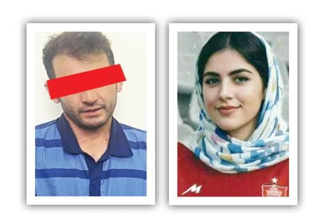

💢قاتل الهه حسین نژاد اعدام شد.

🫆:Tony
📌 @persian_trend_official
پرشین ترند | متفاوت‌ترین کانال نظامی

## Persian_Trend_Official — post 14512

حسین شریعتمداری : خاک بحرین متعلق به ایران است و مردم آن فارسی زبانند و خواستار الحاق این کشور به ایران هستند 💢دولت بحرین از جمهوری اسلامی ایران به سازمان ملل شکایت کرده و مدعی شده که ایران در امور داخلی بحرین دخالت می‌کند. 💢 اولا  بحرین متعلق به ایران است…

## Persian_Trend_Official — post 14511

حسین شریعتمداری : خاک بحرین متعلق به ایران است و مردم آن فارسی زبانند و خواستار الحاق این کشور به ایران هستند

💢دولت بحرین از جمهوری اسلامی ایران به سازمان ملل شکایت کرده و مدعی شده که ایران در امور داخلی بحرین دخالت می‌کند.

💢 اولا  بحرین متعلق به ایران است و مردم آن سامان خودشان را ایرانی می‌دانند. به زبان فارسی حرف می‌زنند و خواستار الحاق به وطن اصلی خود هستند.

💢ثانیاًً، حاکمان دست‌نشانده بحرین، خاک این جزیره ایرانی را برای حمله نظامی به ایران در اختیار آمریکا و رژیم صهیونیستی گذاشته‌اند. بنابراین، علاوه‌ بر خلع ید، باید محاکمه و مجازات هم بشوند.

🫆:Tony

📌 @persian_trend_official
پرشین ترند | متفاوت‌ترین کانال نظامی

## Persian_Trend_Official — post 14510

🔴 آزادی شهروند ایرانی دارای اقامت آمریکا پس از سال‌ها زندان

💢رسانه‌ها گزارش دادند «شهاب دلیلی» شهروند ایرانی دارای اقامت دائم آمریکا، پس از حدود ۱۰ سال از زندان ایران آزاد شده و به ایالات متحده بازگشته است.

▪️بر اساس گزارش‌ها:

▪️ دلیلی با اتهام «همکاری با دولت متخاصم» بازداشت شده بود
▪️ او پس از آزادی، از مسیر ارمنستان به آمریکا منتقل شده است
▪️ گفته می‌شود اکنون در کنار خانواده خود در واشینگتن حضور دارد
🫆:Tony

📌 @persian_trend_official
پرشین ترند | متفاوت‌ترین کانال نظامی

## Persian_Trend_Official — post 14509

  <a href="telegram/content/Persian_Trend_Official_14509_1779256527.mp4" target="_blank">🎬 Download video</a>

💢پوتین وارد تالار بزرگ خلق در پکن شد، جایی که قرار است با شی جین پینگ مذاکره کند

🫆:Tony

📌 @persian_trend_official
پرشین ترند | متفاوت‌ترین کانال نظامی

## Persian_Trend_Official — post 14508

  <a href="telegram/content/Persian_Trend_Official_14508_1779256528.webm" target="_blank">🎬 Download video</a>

💢نیویورک‌تایمز مدعی شد آمریکا و اسرائیل در روزهای ابتدایی عملیات مشترک نظامی علیه ایران، خانه محمود احمدی‌نژاد را هدف حمله هوایی قرار داده‌اند.

▪️بر اساس این گزارش:

▪️ هدف از این حمله، آزاد کردن احمدی‌نژاد از حصر خانگی و استفاده از او در پروژه تغییر نظام در ایران بوده است

▪️ احمدی‌نژاد به‌دلیل اختلاف با آیت‌الله خامنه‌ای تحت حصر قرار داشت

▪️ برنامه‌ریزان اسرائیلی پیش از آغاز جنگ با او ارتباط برقرار کرده بودند

در ادامه گزارش آمده:

▪️ حمله اسرائیل محافظان مستقر مقابل منزل احمدی‌نژاد در تهران را هدف قرار داده بود

▪️ احمدی‌نژادازحملهجانسالمبهدربردامازخمیشد

▪️ او پس از حمله نسبت به این طرح دچار تردید و ناامیدی شده است

💢طبق ادعای نیویورک‌تایمز:

▪️ طرح گسترده‌تر اسرائیل شامل حذف رهبران ارشد ایران، حمایت از ناآرامی‌های داخلی و ایجاد زمینه برای تشکیل دولت جایگزین بوده است

▪️ مقام‌های آمریکایی و اسرائیلی تصور می‌کردند برخی جریان‌های داخلی ایران پس از آغاز جنگ با واشینگتن همکاری خواهند کرد

🫆:Tony

📌 @persian_trend_official
پرشین ترند | متفاوت‌ترین کانال نظامی

## Persian_Trend_Official — post 14507

  <a href="telegram/content/Persian_Trend_Official_14507_1779256528.mp4" target="_blank">🎬 Download video</a>

صبحتون‌ بخیر ☕️🤍

📝 Nick
📌 @persian_trend_official
پرشین ترند | متفاوت‌ترین کانال نظامی

## RadioFarda — post 157369

سفیر آمریکا در سازمان ملل: اقتصاد ایران در حال فروپاشی است

🔸مایک والتز، سفیر آمریکا در سازمان ملل، می‌گوید منابع مالی حکومت ایران «در حال تمام شدن» و اقتصاد این کشور «در وضعیت فروپاشی» است.

🔸او افزوده که با این حال جمهوری اسلامی «به‌جای روی آوردن به رویکردی تازه و صلح‌آمیز، دست به حملات مکرر و گستاخانه‌ای علیه زیرساخت‌های غیرنظامی برق زده و همچنان به راهبرد دستیابی به سلاح هسته‌ای چنگ زده که می‌تواند جهان را در تاریکی فرو ببرد.»

🔸او تأکید کرده که «ما نمی‌توانیم این را تحمل کنیم و هرگز تحمل نخواهیم کرد.»

🔸اسکات بسنت، وزیر خزانه‌داری ایالات متحده، هم روز سه‌شنبه ۲۹ اردیبهشت در یک نشست مبارزه با تأمین مالی تروریسم در پاریس، گفت که این وزارتخانه، حکومت ایران را از درآمدهایی که برای «برنامه‌های تسلیحاتی، گروه‌های نیابتی تروریستی و جاه‌طلبی‌های هسته‌ای خود استفاده می‌کرد، محروم کرده است.»

🔸او افزود که واشینگتن «ده‌ها میلیارد دلار از درآمد پیش‌بینی‌شده نفتی» جمهوری اسلامی را مختل کرده است.

@RadioFarda

## RadioFarda — post 157368

  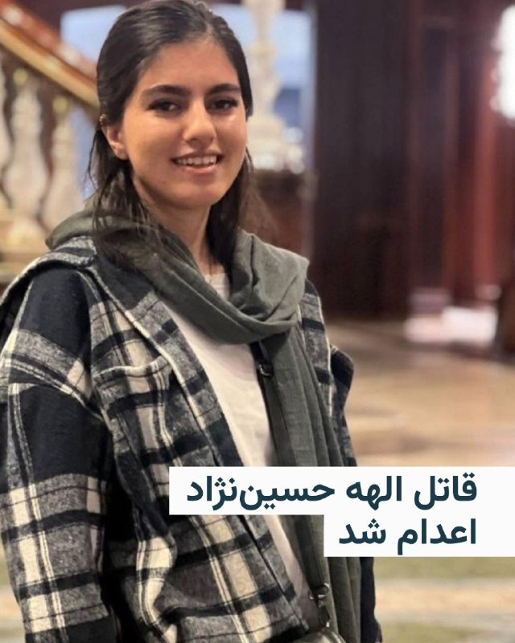

🔸رسانه‌ها در ایران از اجرای حکم اعدام قاتل الهه حسین‌نژاد، که جسد او اوایل خرداد سال گذشته در بیابان‌های اطراف تهران پیدا شد، خبر می‌دهند.

🔸ارگان رسمی قوه قضائیه ایران، میزان، با انتشار این خبر نوشته که این حکم با درخواست اولیای دم و پس از طی تمامی مراحل قانونی و قضایی اجرا شد.

🔸عصر چهارم خرداد ۱۴۰۴ الهه حسین‌نژاد ۲۴ ساله از سالن زیبایی که در آنجا مشغول به کار بود، بیرون آمد تا به خانه‌اش در اسلامشهر برود، اما ناپدید شد و وقتی خانواده‌اش اعلام شکایت کردند بررسی‌های تیم جنایی نشان می‌داد الهه از میدان آزادی سوار یک خودروی عبوری شده است.

🔸جست و جوها برای یافتن الهه سرانجام پس از ۱۱ روز نتیجه داد و با دستگیری راننده خودرو به نام بهمن ۳۷ ساله و اعتراف به قتل الهه، جسد او در بیابان‌های اطراف تهران پیدا شد. متهم نیز پس از محاکمه به اعدام محکوم شد.

🔸این قتل جنجال زیادی درباره امنیت زنان در ایران به پا کرد و تا مدت‌ها رسانه‌ها درباره آن مطالب مختلفی منتشر می‌کردند.

@RadioFarda

## RadioFarda — post 157367

  <a href="https://t.me/radiofarda/157367" target="_blank">📎 Download file</a>

📻بشنوید: خبرهای ۸ صبح با رادیوفردا، ۳۰ اردیبهشت ۱۴۰۵‌

@RadioFarda

## BBCPersian — post 281570

🔻عبور دو نفتکش چینی از تنگه هرمز بعد از دو ماه معطلی

🔻دو نفتکش چینی حامل چهار میلیون بشکه نفت روز چهارشنبه از تنگه هرمز عبور کرده‌اند.

داده‌های کشتیرانی شرکت‌های کپلر و ال‌اس‌جی‌ای نشان می‌دهد که این دو ابرنفتکش چینی حامل نفت خام خاورمیانه، روز چهارشنبه پس از بیش از دو ماه انتظار در خلیج فارس، از تنگه هرمز خارج شدند.

در روزهای اخیر تنها تعداد انگشت‌شماری کشتی از این آبراه عبور کرده‌اند، اما این عبور موفقیت‌آمیز، همراه با افزایش لحن ملایم کاخ سفید، باعث کاهش اندک قیمت نفت شده است.

روز سه‌شنبه، رئیس جمهور ترامپ اصرار داشت که توافق صلح با ایران نزدیک است، هرچند تأکید کرد که هر توافقی که حاصل شود، مانع از دستیابی ایران به سلاح‌های هسته‌ای خواهد شد.

https://bbc.in/4v4WOoV
@BBCPersian

## BBCPersian — post 281569

  

🔻به گزارش رسانه‌های دولتی چین، شی جین‌پینگ در دیدار با ولادیمیر پوتین گفت که وضعیت خاورمیانه در «مرحله حساسی» قرار دارد و در حال حاضر در حال گذار از جنگ به صلح است.

رهبر چین افزود که پایان دادن به خصومت‌ها «ضروری» است و از سرگیری درگیری «غیرقابل قبول» خواهد بود.

به گزارش شینهوا، شی گفت: «پیشنهاد چهار ماده‌ای من برای حفظ و ارتقای صلح و ثبات در خاورمیانه با هدف ایجاد اجماع بین‌المللی بیشتر و کمک به کاهش تنش‌ها، کاهش درگیری‌ها و ارتقای صلح ارائه شده است.»

پیشنهاد چهار ماده‌ای شی که ماه گذشته در دیدار با ولیعهد ابوظبی مطرح شد، همزیستی مسالمت‌آمیز، حاکمیت ملی، حاکمیت قانون بین‌المللی و رویکردی هماهنگ برای توسعه و امنیت را ترویج می‌دهد.

رهبران چین و روسیه صبح امروز در پکن دیدار کردند.

📸AFP via Getty Images
https://bbc.in/49vRNgP
@BBCPersian

## BBCPersian — post 281568

🔻زوج بریتانیایی زندانی در ایران «اعتصاب غذا کردند»

🔻خانواده یک زوج بریتانیایی که پس از متهم شدن به جاسوسی در ایران زندانی شده‌اند، می‌گویند که این دو نفر اعتصاب غذا کرده‌اند.

لیندسی و کریگ فورمن در ژانویه ۲۰۲۵هنگام عبور از ایران با موتورسیکلت دستگیر شدند. آنها در نهایت به ده سال زندان محکوم شدند.

در همین حال، یک تبعه ایرانی که اقامت دائم ایالات متحده را دارد، پس از ده سال زندان در ایران آزاد شده و به ایالات متحده بازگشته است.

شهاب دلیلی به همکاری با یک دولت متخاصم متهم شده بود.
https://bbc.in/4f2MgSt
@BBCPersian

## BBCPersian — post 281562

🖋جوی سلیم
بی‌بی‌سی عربی

چند سال پیش، بانک برادسکو، یکی از بزرگ‌ترین بانک‌های برزیل، اعلام کرد که «بیا»، دستیار مجازی بانک که صدای زنانه‌ای دارد، روزانه با موجی از توهین‌های جنسی و تهدیدهای خشونت‌آمیز مشتریان روبه‌رو می‌شود.

جملاتی مانند «به تو تجاوز می‌کنم»، «لخت شو» و دیگر توهین‌های خشن، نثار یک ربات گفتگو می‌شد، فقط به این دلیل که صدای زنانه داشت. «بیا» تنها در سال ۲۰۲۰ نزدیک به ۹۵ هزار پیام دریافت کرد که ماهیت آزار جنسی داشتند.

این اتفاق فقط یک مورد استثنایی نبود بلکه یکی از نمونه‌های فراوانی است که در آن ربات‌های گفتگو با صدای زنانه، از جمله «سیری» اپل و «الکسا» آمازون، هدف آزارهای لفظی قرار می‌گیرند؛ آزارهایی که در واقع ادامه مستقیم همان خشونت جنسیت‌محوری است که پیش‌تر هم در فضای دیجیتال رواج داشته است.
ادامه مطلب⬇️

📸GettyImages
https://bbc.in/3RQLeix
@BBCPersian

## BBCPersian — post 281561

  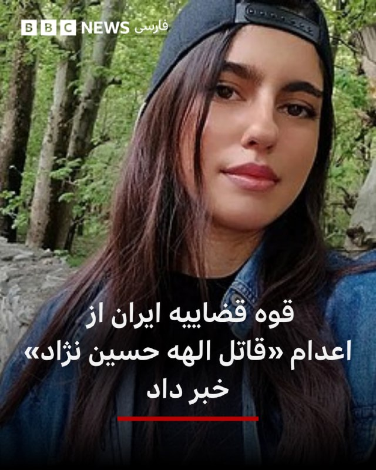

🔻خبرگزاری‌ها در ایران صبح چهارشنبه - ۳۰ اردیبهشت - از اعدام مردی که «قاتل الهه حسین‌نژاد» معرفی شده خبر دادند.

جسد الهه حسین‌نژاد اوایل خرداد سال گذشته در بیابان‌های اطراف تهران پیدا شد و قوه قضائیه ایران در همان روزها اعلام کرد که پرونده قتل این زن ۲۴ ساله ساکن اسلامشهر در حومه تهران بزرگ را به شعبه ویژه بازپرسی ارجاع کرده و دو نفر هم در این رابطه بازداشت شدند.

براساس گزارش‌ها متهم اصلی مسافرکشی می‌کرده و الهه حسین‌نژاد را برای رساندن به مقصد سوار می‌کند و او را برای «موبایل گرانقیمتش» با «چاقو» به قتل می‌رساند.

کشف جسد او ۱۲ روز پس از قتلش خشم افکار عمومی برانگیخت و گروهی از کاربران در شبکه‌های اجتماعی نوشته‌اند: «این پرونده یک کشته و ۹۰ میلیون زخمی داشت.»
📸elahe.hoseinnejad
https://bbc.in/4ukVA8J
@BBCPersian

## BBCPersian — post 281560

  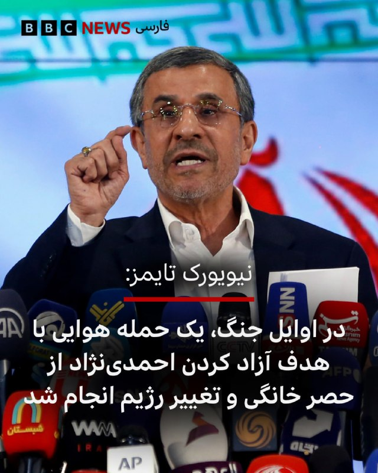

🔻روزنامه آمریکایی نیویورک تایمز در گزارشی اختصاصی نوشته تحقیقات این رسانه نشان داده که در اوایل جنگ آمریکا و اسرائیل با ایران، یک حمله هوایی به محل سکونت محمود احمدی‌نژاد، رئیس جمهور سابق ایران، صورت گرفت که هدف آن آزادی او از حصر خانگی و بخشی از تسهیل روند تغییر رژیم بوده است.

نیویورک تایمز روز سه‌شنبه در گزارشی اختصاصی نوشت: «چند روز پس از آنکه حملات اسرائیل در نخستین موج‌های جنگ، رهبر جمهوری اسلامی ایران و دیگر مقام‌های ارشد را کشت، دونالد ترامپ علنا مطرح کرد که شاید بهتر باشد «فردی از داخل» ایران اداره کشور را به دست بگیرد. اکنون مشخص شده است که آمریکا و اسرائیل با گزینه‌ای مشخص و بسیار غافلگیرکننده وارد این درگیری شده بودند: محمود احمدی‌نژاد، رئیس‌جمهور پیشین ایران که به مواضع تند ضداسرائیلی و ضدآمریکایی‌اش شناخته می‌شود.»
ادامه مطلب⬇️

📸EPA-EFE/REX/Shutterstock
https://bbc.in/3RmWpzo
@BBCPersian

## BBCPersian — post 281559

  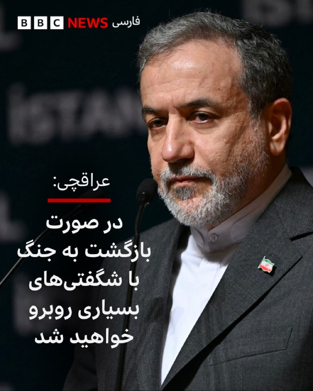

🔻عباس عراقچی، وزیر خارجه ایران در واکنش به اظهارات تهدیدآمیز دونالد ترامپ، رئیس جمهور آمریکا، درباره احتمال از سرگیری حمله نظامی به ایران گفته است: «مطمئن باشید بازگشت به میدان جنگ با شگفتی‌های بسیار بیشتری همراه خواهد بود

آقای عراقچی در پست جدیدی در شبکه ایکس نوشته است: «ماه‌ها پس از آغاز جنگ علیه ایران، کنگره آمریکا به نابودی ده‌ها فروند هواپیما به ارزش میلیاردها دلار اذعان کرد. اکنون به‌طور رسمی تأیید شده است که نیروهای مسلح قدرتمند ما نخستین نیرویی در جهان بودند که جنگنده پیشرفته و پرآوازه F-35 را سرنگون کردند.»

او در پایان این پست مدعی شده است که: «با درس‌هایی که آموخته‌ایم و دانشی که به دست آورده‌ایم، مطمئن باشید بازگشت به میدان جنگ با شگفتی‌های بسیار بیشتری همراه خواهد بود.»

دونالد ترامپ، رئیس جمهور آمریکا، روز گذشته مدعی شد که در آستانه حمله نظامی بزرگ به ایران، او به درخواست رهبران منطقه، دستور لغو حمله را داده است.

📸GettyImages
https://bbc.in/4dI4AxY
@BBCPersian

## BBCPersian — post 281558

  

🔻مقامات اسپانیایی اعلام کردند که سه پلیس کانادایی به دلیل اتهام حمله به یک کارگر جنسی در جریان تعطیلاتشان در شهر بارسلون دستگیر شده‌ بودند.
پلیس تورنتو اعلام کرد که یکی از این افسران پس از بازگشت به کانادا از کار تعلیق شد.

اداره پلیس اعلام کرده که دو افسر دیگر نیز به محض بازگشت از کار تعلیق خواهند شد.

اداره پلیس تورنتو در ایمیلی به بی‌بی‌سی تاکید کرده است: «این اتهامات جدی هستند.» در این بیانیه ضمن تایید هویت و شغل این افراد، اعلام کرده است که این سه نفر در سفر غیر رسمی و اداری بوده‌اند و تا زمان تکمیل پرونده، اظهار نظر بیشتری نخواهد کرد.

مقامات اسپانیایی در ایمیلی به بی‌بی‌سی گفتند که اولین بار در ساعات اولیه چهارشنبه ۱۳ مه/ ۲۳ اردیبهشت، پس از در خواست کمک زنی از داخل یک تاکسی، از این حادثه مطلع شدند. پلیس اسپانیا، دو نفر از سه مظنون شناسایی شده را دستگیر کرد. نفر سوم که فرار کرده بود، چند روز بعد دستگیر شد. این زن به پلیس گفت که او یک کارگر جنسی است که قبلا با یکی از افسران قرار ملاقات گذاشته بود.

ادامه مطلب⬇️
📸GettyImages
https://bbc.in/4dymLpr
@BBCPersian

## alonews — post 121204

  <a href="telegram/content/alonews_121204_1779256532.webm" target="_blank">🎬 Download video</a>

👈ترامپ موبایل از راه رسید / گزارش NBC از موبایل جدید ترامپ:

🔴شبکه خبری ان‌بی‌سی نیوز به یکی از اولین نمونه‌های بررسی گوشی «ترامپ موبایل» دست پیدا کرده است؛ محصولی که دیگر با شعار «ساخت آمریکا» بازاریابی نمی‌شود. ادعایی که هنگام رونمایی اولیه از این گوشی مطرح شده بود.

🔴مدل T1 با قیمت «تشویقی» ۴۹۹ دلار به فروش می‌رسد و به صفحه‌نمایش ۶.۷۸ اینچی، دوربین اصلی ۵۰ مگاپیکسلی و حافظه ۵۱۲ گیگابایتی مجهز است.

🔴گوشی ترامپ موبایل در چهار نقطه از بدنه و نرم‌افزار، لوگوی «ترامپ» حک شده، پرچمی آمریکایی با ۱۱ راه‌راه به جای ۱۳ راه‌راه روی آن حک شده و از پیش، شبکهٔ «تروث سوشال» روی آن نصب است.

✅ @AloNews خبر جنگ

## alonews — post 121203

  <a href="telegram/content/alonews_121203_1779256533.webm" target="_blank">🎬 Download video</a>

👈استریت ژورنال: میانجی‌ها می‌گویند مذاکرات ایران و آمریکا پیشرفت کمی داشته و دو طرف هنوز از هم فاصله زیادی دارند.

✅ @AloNews خبر جنگ

## alonews — post 121202

  <a href="telegram/content/alonews_121202_1779256533.webm" target="_blank">🎬 Download video</a>

👈حکم اعدام بهمن فرزانه، قاتل الهه حسین‌نژاد، اجرا شد.

✅ @AloNews خبر حنن

## alonews — post 121201

  <a href="telegram/content/alonews_121201_1779256533.mp4" target="_blank">🎬 Download video</a>

👈رئیس‌جمهور چین: جنگ در خاورمیانه باید فورا تمام شود

🔴از سرگیری درگیری غیر قابل قبول‌ است

🔴تعهد به مذاکرات به‌ویژه حیاتی است

🔴اوضاع در خاورمیانه در مرحله‌ای تعیین‌کننده و آماده گذار از جنگ به صلح است.

✅ @AloNews خبر جنگ

## alonews — post 121200

  <a href="telegram/content/alonews_121200_1779256535.webm" target="_blank">🎬 Download video</a>

👈بهمن فرزانه؛ قاتل الهه حسین نژاد صبح امروز اعـدام شد.

✅ @AloNews خبر جنگ

## alonews — post 121199

  <a href="telegram/content/alonews_121199_1779256535.mp4" target="_blank">🎬 Download video</a>

👈ترامپ درباره ایران: ما همه چیز را نابود می‌کنیم و این جنگ را خیلی سریع به پایان می‌رسانیم.
آن‌ها آنقدر خسته‌اند که می‌خواهند به شدت معامله کنند.

🔴این باید ۴۷ سال پیش اتفاق می‌افتاد. کسی باید کاری درباره‌اش انجام می‌داد. کسی باید کاری درباره‌اش انجام می‌داد.

🔴این اتفاق خواهد افتاد و خیلی سریع خواهد بود.

✅ @AloNews خبر جنگ

---
📅 بروزرسانی: 1405/02/30 05:10
---

## VahidOOnLine — post 241072

  

♦️زمین‌لرزه‌ای به بزرگی ۴.۷ حوالی ساعت ۳:۱۲ بامداد چهارشنبه ۳۰ اردیبهشت، بندر لافت در استان هرمزگان را لرزاند.
این زمین‌لرزه علاوه بر لافت، در جزایر قشم و هرمز و همچنین برخی مناطق روستایی بندرعباس نیز احساس شده است. تاکنون گزارشی از خسارات احتمالی این زمین‌لرزه منتشر نشده است.
‌🇸🇦 Indypersian

🤖 @VahidOOnLine

## VahidOOnLine — post 241070

  

♦️نیویورک‌تایمز در گزارشی به نقل از منابع ناشناس که آنها را مقامات آمریکایی عنوان کرده، مدعی شد که هدف اولیه جنگ، «تلاش برای به رهبری رساندن محمود احمدی‌نژاد»، رئیس‌جمهوری اسبق ایران بوده است. در این گزارش، ادعا شده که در زمینه این طرح «با محمود احمدی‌نژاد مشورت شده بود» اما در نهایت این طرح به مشکل خورد. نیویورک‌تایمز ادعا کرده که محمود احمدی‌نژاد در جریان حمله روز نخست اسرائیل به خانه‌اش در تهران که هدف آن آزاد کردن او از آنچه «حصر خانگی» خوانده شده، بود زخمی شد. این درحالی است که منابع ایندیپندنت فارسی در همان روز خبر دادند که احمدی‌نژاد اندکی قبل از حمله از محل خارج شده بود. این منابع همچنین «حصر خانگی» رئیس‌جمهوری اسبق را نیز تکذیب کرده‌اند. نیویورک‌تایمز در ادامه به اختلافات احمدی‌نژاد و حاکمیت در سال‌های اخیر،  رد صلاحیت‌های او در انتخابات و محدودیت‌هایی برای حضور عمومی و رفت‌و‌آمد‌ها اشاره می‌کند و می‌نویسد که احمدی‌نژاد پس از این حمله روز نخست جنگ دیگر دیده نشده است.
‌🇸🇦 Indypersian

🤖 @VahidOOnLine

## VahidOOnLine — post 241068

  

مستند «یک رفاقت از زندان وکیل‌آباد مشهد تا سن‌ دیگو» تهیه شده از سوی شبکه ایران‌اینترنشنال به کارگردانی اردوان روزبه، در بخش مستند و تحلیل سیاسی تلویزیونی برنده جایزه تلی سال ۲۰۲۶ شد.
جایزه تلی یک رقابت بین‌المللی در حوزه تولیدات ویدیویی، تلویزیونی، تبلیغات و محتوای دیجیتال است که از سال ۱۹۷۹ میلادی برگزار می‌شود و داورانی از شرکت‌هایی بزرگ مثل نتفلیکس و اچ.بی.او، هزاران اثر ارسالی را بررسی می‌کنند.
مستند «یک رفاقت: از زندان وکیل‌آباد مشهد تا سن‌ دیگو» امسال در رقابت با ۱۳ هزار اثر از از سراسر جهان برنده جایزه شد.
این مستند روایتگر داستان واقعی و غیرمنتظره دوستی میان مایکل وایت، کهنه‌سرباز آمریکایی، و مهدی وطن‌خواه، فعال سیاسی ایرانی است؛ دو زندانی که در بند عمومی زندان وکیل‌آباد مشهد با یکدیگر آشنا شدند.
مایکل وایت در سال ۲۰۱۸ پس از سفر به ایران بازداشت شد و در بازداشتگاه‌های امنیتی جمهوری اسلامی تحت بازجویی‌های سنگین، شکنجه روانی و فشار برای اعتراف اجباری قرار گرفت. او بعدها روایت کرد که بازجویان تلاش داشتند او را وادار کنند اعتراف کند برای آمریکا و اسرائیل جاسوسی می‌کرده است.

‌🏁 🇬🇧 IranintlTV

🤖 @VahidOOnLine

## VahidOOnLine — post 241067

  <a href="telegram/content/VahidOOnLine_241067_1779241246.mp4" target="_blank">🎬 Download video</a>

♦️دونالد ترامپ، رئیس‌جمهوری آمریکا روز سه‌شنبه در  سخنرانی برای قانونگذاران آمریکایی در کاخ سفید گفت: «ما به جنگ ایران خیلی سریع پایان می‌دهیم، آنها به شدت خواستار توافق هستند و خسته شده‌اند.» رئیس‌جمهوری آمریکا پیش‌بینی کرد که توافق با رزیم ایران سریع اتفاق می‌افتد و در نتیجه آن بهای نفت سقوط می‌کند.
‌🇸🇦 Indypersian

🤖 @VahidOOnLine

## VahidOOnLine — post 241066

  

زمین‌لرزه‌ای به بزرگی ۴.۷ حوالی ساعت ۳:۱۲ بامداد چهارشنبه لافت در استان هرمزگان را لرزاند. این زلزله در قشم و هرمز و مناطق روستایی بندرعباس نیز احساس شد.
‌🏁 🇬🇧 IranintlTV

🤖 @VahidOOnLine

## VahidOOnLine — post 241065

  

ترامپ در یک سخنرانی در کاخ سفید گفت: جمهوری اسلامی «قرار نیست به سلاح هسته‌ای دست پیدا کند. نمی‌توانند سلاح هسته‌ای داشته باشند. ما نمی‌توانیم چنین چیزی را تحمل کنیم و آن را تحمل نخواهیم کرد.»
او گفت: «ما نیروی دریایی جمهوری اسلامی را نابود کردیم. نیروی هوایی آنها از بین رفته است. سامانه‌های پدافند هوایی آنها از بین رفته است. تمام تجهیزاتی که برای جنگ استفاده می‌کردند از بین رفته است. تقریبا همه چیز از بین رفته است.»
ترامپ افزود: «نمی‌خواهم بگویم رهبران آنها از بین رفته‌اند، چون بیان آن چندان خوشایند نیست، اما واقعیت همین است.»
‌🏁 🇬🇧 IranintlTV

🤖 @VahidOOnLine

## VahidOOnLine — post 241064

  

ترامپ در یک سخنرانی در کاخ سفید گفت: «ما جنگ ایران را خیلی سریع پایان خواهیم داد. آنها به شدت می‌خواهند توافق کنند. از این وضعیت خسته شده‌اند. این موضوع باید ۴۷ سال پیش حل می‌شد. کسی باید درباره آن کاری انجام می‌داد، و این اتفاق خواهد افتاد و سریع هم رخ خواهد داد.»
او افزود: «خواهید دید که قیمت نفت سقوط خواهد کرد. قیمت‌ها پایین خواهد آمد. نفت بسیار زیادی در بازار وجود دارد. قیمت‌ها به شدت کاهش خواهد یافت.»

‌🏁 🇬🇧 IranintlTV

🤖 @VahidOOnLine

## FoxNewsTwitter — post 341974

  <a href="telegram/content/FoxNewsTwitter_341974_1779241250.mp4" target="_blank">🎬 Download video</a>

Fox News (Twitter/X)

“Bi means you like both.”

Rep. Thomas Massie cracks jokes after losing his primary race to Trump-endorsed former Navy SEAL Ed Gallrein, saying he may be “trans-partisan” because he doesn’t fully identify with either political side anymore.

The Kentucky congressman spent years carving out a reputation as one of the most independent Republicans in Washington — often frustrating both party leadership and President Trump.

But after a brutal Trump-backed challenge, Massie’s streak in Congress has now come to an end.

## FoxNewsTwitter — post 341973

  <a href="telegram/content/FoxNewsTwitter_341973_1779241252.mp4" target="_blank">🎬 Download video</a>

Fox News (Twitter/X)

"They tried to buy my vote. They couldn't buy it."

Rep. Thomas Massie delivers a fiery speech after losing his reelection bid, accusing powerful forces in Washington of trying for years to take him down.

Massie, who became a regular target of attacks from President Trump, said they "decided to buy the seat" after they couldn't buy his vote.

## FoxNewsTwitter — post 341972

  <a href="telegram/content/FoxNewsTwitter_341972_1779241255.mp4" target="_blank">🎬 Download video</a>

Fox News (Twitter/X)

"I would like to know how many more Americans we have to ask to die for this mistake."

That question from Rep. Seth Moulton sparked a fiery clash with CENTCOM Commander Admiral Brad Cooper during a tense hearing on Iran and U.S. military operations in the Middle East.

Cooper slammed Moulton's remark as "entirely inappropriate as the exchange escalated in front of lawmakers.

## FoxNewsTwitter — post 341971

  

Fox News (Twitter/X)

"We're going to end that war very quickly. They want to make a deal so badly. They're tired of this"

President Trump predicts a deal to end the war with Iran is going to happen "fast" — and that oil prices will plummet when the agreement is reached.

## FoxNewsTwitter — post 341970

  <a href="telegram/content/FoxNewsTwitter_341970_1779241259.mp4" target="_blank">🎬 Download video</a>

Fox News (Twitter/X)

FOX NEWS REPORT: President Trump warns Iran may face another "big hit" if negotiations collapse, revealing he was only an hour away from moving forward with another strike. @BillMelugin_ reports.

## pm_afshaa — post 91082

  <a href="telegram/content/pm_afshaa_91082_1779241262.webm" target="_blank">🎬 Download video</a>

🔴افشاگری عجیب نیویورک تایمز:
آمریکا و اسرائیل قبل از جنگ با ایران، طرحی رو برای نصب محمود احمدی‌نژاد به عنوان رهبر جدید کشور مورد بحث قرار دادن.

احمدی‌نژاد گزارشاً در مورد این طرح مشورت شده بود، اما پس از اینکه در حمله‌ای اسرائیل به خانه‌اش در تهران در روز آغازین جنگ مجروح شد، این طرح از هم پاشید. مقامات آمریکایی گفتن که این حمله با هدف آزاد کردن او از بازداشت خانگی انجام شده بود.

برنامه‌ریزان اسرائیلی ظاهراً پیش از درگیری با احمدی‌نژاد مشورت و توافق کرده و تلاش کردن اونو از حصر خانگی اجباری با حمله‌ای‌ اسرائیلی که نگهبانان خارج از اقامتگاهش در تهران رو هدف قرار داد، در روز اول جنگ آزاد کنن.

احمدی‌نژاد زنده موند اما به‌شدت زخمی شد و پس از آن ناامید از تلاش برای تغییر رژیم شد و از آن زمان به بعد به صورت عمومی دیده نشده و محل اقامت او نامشخصه.

💧 Rainbet.com the #1 Non-KYC Crypto Casino & Sportsbook @rainbetcom

😁 @Pm_Afshaa

## pm_afshaa — post 91080

  

مدیر ارتباطات کاخ سفید، استیون چونگ:
هرگز به رئیس‌جمهور ترامپ و قدرت سیاسی او شک نکنید.

آزمایش کن، نتیجه‌اش را ببین

💧 Rainbet.com the #1 Non-KYC Crypto Casino & Sportsbook @rainbetcom

😁 @Pm_Afshaa

## pm_afshaa — post 91079

  <a href="telegram/content/pm_afshaa_91079_1779241264.mp4" target="_blank">🎬 Download video</a>

ترامپ:ما در چند سال آینده روزهای بسیار سختی خواهیم داشت.

امیدواریم این چند سال به سال‌های درخشانی برای بسیاری، بسیاری از سال‌های آینده منجر شود

💧 Rainbet.com the #1 Non-KYC Crypto Casino & Sportsbook @rainbetcom

😁 @Pm_Afshaa

## pm_afshaa — post 91078

  <a href="telegram/content/pm_afshaa_91078_1779241266.mp4" target="_blank">🎬 Download video</a>

ترامپ:تمام تجهیزات آن‌ها که برای جنگ استفاده می‌کردند از بین رفته است. تقریباً همه چیز از بین رفته است.

نمی‌خواهم بگویم رهبرانشان از بین رفته‌اند، چون خیلی خوشایند نیست، اما این حقیقت دارد.

آن‌ها نمی‌توانند سلاح هسته‌ای داشته باشند. ما نمی‌توانیم این را تحمل کنیم و نخواهیم کرد

💧 Rainbet.com the #1 Non-KYC Crypto Casino & Sportsbook @rainbetcom

😁 @Pm_Afshaa

## pm_afshaa — post 91077

  <a href="telegram/content/pm_afshaa_91077_1779241269.mp4" target="_blank">🎬 Download video</a>

🔴ترامپ: ما همه چیز رو نابود می‌کنیم و این جنگ رو خیلی سریع به پایان میرسونیم؛ آنها انقدر خسته‌ان که میخوان معامله کنن.

این باید 47 سال پیش اتفاق می‌افتاد. کسی باید کاری درباره‌اش انجام می‌داد. این اتفاق خواهد افتاد و خیلی سریع خواهد بود.

💧 Rainbet.com the #1 Non-KYC Crypto Casino & Sportsbook @rainbetcom

😁 @Pm_Afshaa

## pm_afshaa — post 91076

  <a href="telegram/content/pm_afshaa_91076_1779241271.mp4" target="_blank">🎬 Download video</a>

🔴ترامپ: ما در ایران کار فوق‌العاده‌ای انجام دادیم؛ فکر میکنم خیلی زود این کار تمام بشه و آنها سلاح هسته‌ای نخواهند داشت؛ امیدوارم این کار رو به روشی بسیار خوب انجام بدیم.

💧 Rainbet.com the #1 Non-KYC Crypto Casino & Sportsbook @rainbetcom

😁 @Pm_Afshaa

## VahidOnline — post 75564

  

ترامپ در یک سخنرانی در کاخ سفید گفت ایران قرار نیست به سلاح هسته‌ای دست پیدا کند. نمی‌توانند سلاح هسته‌ای داشته باشند. ما نمی‌توانیم چنین چیزی را تحمل کنیم و آن را تحمل نخواهیم کرد.
او گفت ما نیروی دریایی آن‌ها را نابود کردیم. نیروی هوایی آنها از بین رفته است. سامانه‌های پدافند هوایی آنها از بین رفته است. تمام تجهیزاتی که برای جنگ استفاده می‌کردند از بین رفته است. تقریبا همه چیز از بین رفته است.
ترامپ افزود: نمی‌خواهم بگویم رهبران آنها از بین رفته‌اند، چون بیان آن چندان خوشایند نیست، اما واقعیت همین است.
@VahidOOnLine

📡 @VahidOnline

## VahidOnline — post 75563

  

زمین‌لرزه در قشم

آپدیت:‌
تصویر بالا: #زلزله به بزرگی ۴٫۷ در عمق ۲۰ کیلومتری بندر لافت در جزیره قشم هرمزگان

پیام‌های دریافتی:
سلام وحید دو زلزله شدید بندرعباس رو لرزاند

ساعت ۳:۱۱ دقیقه بندرعباس زلزله اومد

همین الان ساعت ۳:۱۲ دوبار به مدت ۱۵ ثانیه وحشتناک بندرعباس لرزید

من بندرعباس هستم دو بار لرزید

زلزله اومده خیلی بد بود

زمین لرزه نسبتا شدید ساعت ٣:١٠ بامداد بندرعباس

بندرعباس هستم فکر کردیم باز زدن دقیقا ۲۰ ثانیه همه جا میلرزید

چند دقیقه پیش زمین لرزه نسبتا شدید اومد دوبار تو فاصله خیلی کم بندرعباس

📡 @VahidOnline

## IranIntlTV — post 338021

  

مستند «یک رفاقت از زندان وکیل‌آباد مشهد تا سن‌ دیگو» تهیه شده از سوی شبکه ایران‌اینترنشنال به کارگردانی اردوان روزبه، در بخش مستند و تحلیل سیاسی تلویزیونی برنده جایزه تلی سال ۲۰۲۶ شد.
جایزه تلی یک رقابت بین‌المللی در حوزه تولیدات ویدیویی، تلویزیونی، تبلیغات و محتوای دیجیتال است که از سال ۱۹۷۹ میلادی برگزار می‌شود و داورانی از شرکت‌هایی بزرگ مثل نتفلیکس و اچ.بی.او، هزاران اثر ارسالی را بررسی می‌کنند.
مستند «یک رفاقت: از زندان وکیل‌آباد مشهد تا سن‌ دیگو» امسال در رقابت با ۱۳ هزار اثر از از سراسر جهان برنده جایزه شد.
این مستند روایتگر داستان واقعی و غیرمنتظره دوستی میان مایکل وایت، کهنه‌سرباز آمریکایی، و مهدی وطن‌خواه، فعال سیاسی ایرانی است؛ دو زندانی که در بند عمومی زندان وکیل‌آباد مشهد با یکدیگر آشنا شدند.
مایکل وایت در سال ۲۰۱۸ پس از سفر به ایران بازداشت شد و در بازداشتگاه‌های امنیتی جمهوری اسلامی تحت بازجویی‌های سنگین، شکنجه روانی و فشار برای اعتراف اجباری قرار گرفت. او بعدها روایت کرد که بازجویان تلاش داشتند او را وادار کنند اعتراف کند برای آمریکا و اسرائیل جاسوسی می‌کرده است.

https://iranintl.com/2026051

## IranIntlTV — post 338020

  

زمین‌لرزه‌ای به بزرگی ۴.۷ حوالی ساعت ۳:۱۲ بامداد چهارشنبه لافت در استان هرمزگان را لرزاند. این زلزله در قشم و هرمز و مناطق روستایی بندرعباس نیز احساس شد.
https://iranintl.com/202605203241

## IranIntlTV — post 338019

  <a href="telegram/content/IranIntlTV_338019_1779241276.mp4" target="_blank">🎬 Download video</a>

صداوسیما روز ۲۹ اردیبهشت‌ماه، در برنامه «سلام صبح بخیر»، از تندیس «مشت گره‌کرده» علی خامنه‌ای، رهبر کشته‌شده جمهوری اسلامی، به‌عنوان نماد جدید میدان انقلاب تهران رونمایی کرد.
@iranintltv

## IranIntlTV — post 338018

  

ترامپ در یک سخنرانی در کاخ سفید گفت: جمهوری اسلامی «قرار نیست به سلاح هسته‌ای دست پیدا کند. نمی‌توانند سلاح هسته‌ای داشته باشند. ما نمی‌توانیم چنین چیزی را تحمل کنیم و آن را تحمل نخواهیم کرد.»
او گفت: «ما نیروی دریایی جمهوری اسلامی را نابود کردیم. نیروی هوایی آنها از بین رفته است. سامانه‌های پدافند هوایی آنها از بین رفته است. تمام تجهیزاتی که برای جنگ استفاده می‌کردند از بین رفته است. تقریبا همه چیز از بین رفته است.»
ترامپ افزود: «نمی‌خواهم بگویم رهبران آنها از بین رفته‌اند، چون بیان آن چندان خوشایند نیست، اما واقعیت همین است.»
https://iranintl.com/202605197914

## IranIntlTV — post 338017

  

ترامپ در یک سخنرانی در کاخ سفید گفت: «ما جنگ ایران را خیلی سریع پایان خواهیم داد. آنها به شدت می‌خواهند توافق کنند. از این وضعیت خسته شده‌اند. این موضوع باید ۴۷ سال پیش حل می‌شد. کسی باید درباره آن کاری انجام می‌داد، و این اتفاق خواهد افتاد و سریع هم رخ خواهد داد.»
او افزود: «خواهید دید که قیمت نفت سقوط خواهد کرد. قیمت‌ها پایین خواهد آمد. نفت بسیار زیادی در بازار وجود دارد. قیمت‌ها به شدت کاهش خواهد یافت.»

https://iranintl.com/202605193673

## ManotoTV — post 105663

  <a href="telegram/content/ManotoTV_105663_1779241280.mp4" target="_blank">🎬 Download video</a>

‌
خبرگزاری فرانسه گزارش داد شرکت هواپیماسازی ایرباس به دلیل پیامدهای جنگ آمریکا و اسرائیل با جمهوری اسلامی، از تیم‌های خود خواسته هزینه‌های «غیرضروری» را ۱۰ درصد کاهش دهند.

بر اساس سندی که خبرگزاری فرانسه مشاهده کرده، ایرباس اعلام کرده هدف این شرکت «توقف قابل توجه فعالیت‌ها و هزینه‌هایی است که برای عملیات و فعالیت‌های صنعتی کاملاً ضروری نیستند.»

در این یادداشت از کارکنان خواسته شده از ایجاد هزینه‌های جدید یا واگذاری فعالیت‌های غیرضروری به پیمانکاران خودداری کنند.

ایرباس همچنین بر کاهش هزینه‌هایی مانند رویدادهای داخلی، برنامه‌های تیمی، همایش‌ها و مشارکت در کنفرانس‌ها تاکید کرده است.

## FarsiVOA — post 218196

🔺ترامپ: نمی‌خواهم بگویم که رهبران جمهوری اسلامی نیز نابود شده‌اند چون صحبت خیلی قشنگی نیست؛ آن‌ها به‌شدت مایل به توافقند

▪️دونالد ترامپ، رئیس‌جمهوری آمریکا، سه‌شنبه شب در سخنانی در مراسم «پیکنیک کنگره» در کاخ سفید گفت ایالات متحده «به‌سرعت» به «جنگ» با جمهوری اسلامی پایان خواهد داد و افزود رژیم ایران «به‌شدت مایل» به رسیدن به توافق است و از شرایط حاضر «خسته» شده است.

⬇️ بیشتر بخوانید:
https://ir.voanews.com/a/8151966.html
@FarsiVOA

## FarsiVOA — post 218195

🔺مایک والتز: جمهوری اسلامی ۴۷ سال است که صلح جهانی را تهدید می‌کند

▪️مایک والتز، سفیر آمریکا در سازمان ملل متحد، گفت جمهوری اسلامی به تاسیسات غیرنظامی در خاورمیانه حمله می‌کند.

⬇️ بیشتر بخوانید:
https://ir.voanews.com/a/8151759.html
@FarsiVOA

## FarsiVOA — post 218194

  

⚡️سایت خبری آکسیوس به نقل دو مقام آمریکایی گزارش داد دونالد ترامپ، رئیس جمهوری آمریکا، عصر دوشنبه جلسه‌ای با تیم ارشد امنیت ملی خود در مورد ایران تشکیل داد که شامل توضیحاتی در مورد گزینه‌های نظامی بود.
@FarsiVOA

## Persian_Trend_Official — post 14506

  

💢فیفا قصد دارد بار دیگر ورود پرچم «شیر و خورشید» پیش از انقلاب ایران و پوشاک مرتبط با آن را به استادیوم‌های جام جهانی در مسابقات ۲۰۲۶ ممنوع کند.

این پرچم همچنین در جام جهانی قطر ۲۰۲۲ محدود شده بود.

منبع: نیویورک تایمز

🫆:Tony

📌 @persian_trend_official
پرشین ترند | متفاوت‌ترین کانال نظامی

## Persian_Trend_Official — post 14505

  <a href="telegram/content/Persian_Trend_Official_14505_1779241282.webm" target="_blank">🎬 Download video</a>

🔴انتقاد تلویحی امارات از عربستان و قطر بر سر ارتباط با ایران

💢شبکه i24 گزارش داد «انور قرقاش» مشاور رئیس امارات، بدون نام بردن مستقیم از عربستان و قطر، به‌صورت تلویحی از ادامه ارتباط و تماس‌های این کشورها با ایران انتقاد کرده است.

بر اساس این گزارش:

▪️ ابوظبی نگران است فشار کشورهای عربی باعث توقف دوباره عملیات نظامی آمریکا علیه ایران شده باشد
▪️ برخی محافل اماراتی معتقدند عربستان و قطر در تلاش برای حفظ مسیر مذاکره با تهران هستند
▪️ این اختلاف می‌تواند نشانه شکاف در مواضع کشورهای خلیج فارس درباره نحوه برخورد با ایران باشد

🫆:Tony

📌 @persian_trend_official
پرشین ترند | متفاوت‌ترین کانال نظامی

## Persian_Trend_Official — post 14504

🔴 نیویورک‌تایمز: آمریکا و اسرائیل برای آزادسازی احمدی‌نژاد به خانه او حمله کردند

💢نیویورک‌تایمز مدعی شد آمریکا و اسرائیل در روزهای ابتدایی عملیات مشترک نظامی علیه ایران، خانه محمود احمدی‌نژاد را هدف حمله هوایی قرار داده‌اند.

▪️بر اساس این گزارش:

▪️ هدف از این حمله، آزاد کردن احمدی‌نژاد از حصر خانگی و استفاده از او در پروژه تغییر نظام در ایران بوده است
▪️ احمدی‌نژاد به‌دلیل اختلاف با آیت‌الله خامنه‌ای تحت حصر قرار داشت
▪️ برنامه‌ریزان اسرائیلی پیش از آغاز جنگ با او ارتباط برقرار کرده بودند

در ادامه گزارش آمده:

▪️ حمله اسرائیل محافظان مستقر مقابل منزل احمدی‌نژاد در تهران را هدف قرار داده بود
▪️ احمدی‌نژاد از حمله جان سالم به در برد اما زخمی شد
▪️ او پس از حمله نسبت به این طرح دچار تردید و ناامیدی شده است

💢طبق ادعای نیویورک‌تایمز:

▪️ طرح گسترده‌تر اسرائیل شامل حذف رهبران ارشد ایران، حمایت از ناآرامی‌های داخلی و ایجاد زمینه برای تشکیل دولت جایگزین بوده است
▪️ مقام‌های آمریکایی و اسرائیلی تصور می‌کردند برخی جریان‌های داخلی ایران پس از آغاز جنگ با واشینگتن همکاری خواهند کرد

این ادعاها تاکنون از سوی منابع رسمی ایران، آمریکا یا اسرائیل تأیید نشده‌اند.

🫆:Tony

📌 @persian_trend_official
پرشین ترند | متفاوت‌ترین کانال نظامی

## Persian_Trend_Official — post 14503

  <a href="telegram/content/Persian_Trend_Official_14503_1779241283.webm" target="_blank">🎬 Download video</a>

⭕️زلزله 4.7 ریشتری لافت هرمزگان را لرزاند

💢بنا بر اعلام مرکز لرزه نگاری زمین لرزه ای به قدرت 4.7 ریشتر ساعت 3:10 بامداد امروز - چهارشنبه- لافت هرمزگان را لرزاند

🫆:Tony

📌 @persian_trend_official
پرشین ترند | متفاوت‌ترین کانال نظامی

## Persian_Trend_Official — post 14502

  <a href="telegram/content/Persian_Trend_Official_14502_1779241284.mp4" target="_blank">🎬 Download video</a>

💢دونالد ترامپ :

💢ما همه چیز را نابود می‌کنیم و این جنگ را خیلی سریع به پایان می‌رسانیم.

💢آن‌ها آنقدر خسته‌اند که می‌خواهند به شدت معامله کنند.

💢این باید ۴۷ سال پیش اتفاق می‌افتاد. کسی باید کاری درباره‌اش انجام می‌داد. کسی باید کاری درباره‌اش انجام می‌داد.

💢این اتفاق خواهد افتاد و خیلی سریع خواهد بود.

🫆:Tony

📌 @persian_trend_official
پرشین ترند | متفاوت‌ترین کانال نظامی

## BBCPersian — post 281557

  

🔻ساعتی پس از حضور فرمانده سنتکام در کنگره امریکا و اظهارات جدیدش درباره روند «پیچیده» تحقیقات مرتبط با این حمله، وزارت خارجه ایران ادعای فرماندهی مرکزی ایالات متحده آمریکا مبنی براینکه مدرس ابتدایی شجره طیبه میناب در محدوده یک مرکز فعال موشکی بوده است را «کاملا بی‌اساس و انحرافی» خواند.

اسماعیل بقایی، سخنگوی وزارت خارجه ایران عصر سه‌شنبه گفت: «این تحریف آشکار، تلاشی واضح برای پنهان کردن ماهیت واقعی حملات موشکی ۲۸ فوریه است که موجب قتل عام بیش از ۱۷۰ دانش‌آموز و معلمان‌شان شد.»

آقای بقایی همچنین گفته است: «فرماندهان نظامی و مقامات آمریکایی که مسئول صدور دستور و اجرای این حمله فاجعه‌بار بوده‌اند، باید طبق قوانین بین‌المللی کاملا پاسخگو و محاکمه شوند.»

📸Anadolu via Getty Images
https://bbc.in/4uru8q4
@BBCPersian

## BBCPersian — post 281556

  

🔻سنای آمریکا با ۵۰ رای موافق در برابر ۴۷ رای مخالف به راه یافتن طرح محدود کردن اختیارات جنگی دونالد ترامپ، به صحن این مجلس رای مثبت داد.

این طرح که با محتوایی مشابه پیش‌تر در سنا رای نیاورده بود، روز سه‌شنبه با پیوستن به سناتور جمهوری‌خواه به اقلیت دموکرات‌ها، تصویب شد.

این طرح رئیس جمهور آمریکا را مکلف می‌کند برای هرگونه اقدام نظامی دیگر علیه ایران ابتدا از کنگره تاییدیه بگیرد.

راه یافتن این طرح به مرحله بعدی و اجازه مطرح شدن در صحن اصلی سنا و تصویب آن در این مجلس که اکثریت ان در دست جمهوری‌خواهان است، خیلی زود عصر سه شنبه در رسانه‌های آمریکا مورد توجه قرار گرفت.

در جریان رای‌گیری، جان فترمن، سناتور دموکرات ایالت پنسیلوانیا، به جمهوری‌خواهان پیوست و به آن رای منفی داد؛ در مقابل، رند پال، سوزان کالینز، لیزا مورکوفسکی و بیل کسیدی، چهار سناتور جمهوری‌خواه، همراه با دموکرات‌ها به طرح رای مثبت دادند.

این نخستین بار بود که آقای کسیدی در این موضوع با دموکرات‌ها هم‌سو رای می‌داد.

📸Anadolu via Getty Images
https://bbc.in/4dkphAX
@BBCPersian

## BBCPersian — post 281549

🔻ولادیمیر پوتین بلافاصله پس از سفر دونالد ترامپ به پکن، راهی دیدار با شی جین‌پینگ می‌شود؛ سفری که محور اصلی آن تلاش روسیه برای گسترش صادرات گاز به چین است.

پوتین و شی جین‌پینگ، دو رهبر اقتدارگرا، روابط نزدیکی دارند و بیش از ۴۰ بار دیدار کرده‌اند. هر دو خود را احیاکننده قدرت تاریخی کشورشان می‌دانند و مخالفان سیاسی را تحمل نمی‌کنند.
پس از حمله روسیه به اوکراین، مسکو جایگاه خود را به عنوان شریک برابر اروپا از دست داد و بیش از پیش به چین وابسته شد، تا جایی که اکنون عمدتا تامین‌کننده مواد خام برای چین محسوب می‌شود.

چین برخلاف اروپا پیش از جنگ اوکراین، تمایل چندانی به سرمایه‌گذاری گسترده یا انتقال فناوری به روسیه ندارد و ترجیح می‌دهد روابطش با مسکو عمدتا بر تامین انرژی و مواد خام متمرکز بماند.
کرملین امیدوار است جنگ ایران و اختلال در خلیج فارس، چین را به امضای قرارداد خط لوله «قدرت سیبری ۲» ترغیب کند؛ پروژه‌ای حیاتی برای جایگزینی بازار از دست‌رفته اروپا.

ادامه مطلب⬇️

📷Getty Images/BBCImages
https://bbc.in/3RjYEDE
@BBCPersian

## manototv — post 105663

  <a href="telegram/content/manototv_105663_1779241288.mp4" target="_blank">🎬 Download video</a>

‌
خبرگزاری فرانسه گزارش داد شرکت هواپیماسازی ایرباس به دلیل پیامدهای جنگ آمریکا و اسرائیل با جمهوری اسلامی، از تیم‌های خود خواسته هزینه‌های «غیرضروری» را ۱۰ درصد کاهش دهند.

بر اساس سندی که خبرگزاری فرانسه مشاهده کرده، ایرباس اعلام کرده هدف این شرکت «توقف قابل توجه فعالیت‌ها و هزینه‌هایی است که برای عملیات و فعالیت‌های صنعتی کاملاً ضروری نیستند.»

در این یادداشت از کارکنان خواسته شده از ایجاد هزینه‌های جدید یا واگذاری فعالیت‌های غیرضروری به پیمانکاران خودداری کنند.

ایرباس همچنین بر کاهش هزینه‌هایی مانند رویدادهای داخلی، برنامه‌های تیمی، همایش‌ها و مشارکت در کنفرانس‌ها تاکید کرده است.

---
📅 بروزرسانی: 1405/02/30 03:13
---

## VahidOOnLine — post 241063

  <a href="telegram/content/VahidOOnLine_241063_1779234235.mp4" target="_blank">🎬 Download video</a>

♦️احمد‌الشرع، رئیس‌جمهوری سوریه با انتشار پیامی در اکس از ارسال هدیه‌ از سوی دونالد ترامپ، رئیس‌جمهوری آمریکا تشکر کرد. در این پیام آمده است:
«بعضی دیدارها اثری ماندگار بر جا می‌گذارند؛ دیدار ما ظاهرا عطری از خود به جا گذاشت.
آقای دونالد ترامپ،بابت سخاوت شما و کامل‌تر کردن این هدیه ارزشمند سپاسگزارم. امیدوارم روح آن دیدار همچنان به شکل‌گیری رابطه‌ای قوی‌تر میان سوریه و ایالات متحده کمک کند.»

 در دیداری که در تاریخ ۲۱ آبان ۱۴۰۴ در سفر الشرع به آمریکا انجام شد دونالد ترامپ به او عطر هدیه داد و اکنون دوباره برای او عطر ارسال کرده است.
‌🇸🇦 Indypersian

🤖 @VahidOOnLine

## VahidOOnLine — post 241062

  

♦️اسماعیل بقایی، سخنگوی وزارت امور خارجه جمهوری اسلامی، در پیامی به مناسبت سالروز تولد محمد مصدق، نخست‌وزیر پیشین ایران، «کودتای ۲۸ مرداد ۱۳۳۲» را نقطه آغاز تقابل آمریکا با ایران دانست.
او با انتقاد از روایت مقامات آمریکایی درباره «۴۷ سال تقابل» تأکید کرد این نگاه، تحریف تاریخ است و ریشه اختلافات به سرنگونی دولت مصدق با نقش آمریکا و بریتانیا بازمی‌گردد. بقایی همچنین با اشاره به آنچه «دخالت‌ها، تحریم‌ها و تهدیدهای چند دهه‌ای» خواند، افزود تجربه کودتای ۲۸ مرداد نشان می‌دهد مسیر حفظ استقلال کشور، تکیه بر حاکمیت ملی و مقابله با نفوذ خارجی است.
این در حالی است که تا سال‌ها حتی خیابانی به نام محمد مصدق در تهران نام‌گذاری نشد. پس از انقلاب، خیابان پهلوی مدتی به نام او تغییر یافت اما در سال ۱۳۶۰ دوباره تغییر نام داد. در نهایت، در ۲۲ اسفند ۱۳۹۶ شورای شهر تهران خیابان نفت در بلوار میرداماد را به نام مصدق نام‌گذاری کرد.
‌🇸🇦 Indypersian

🤖 @VahidOOnLine

## VahidOOnLine — post 241061

  

♦️به دنبال چندین تلاش ناموفق دمکرات‌های سنای آمریکا برای تصویب قطعنامه محدود کردن اختیارات جنگی رئیس‌جمهوری آمریکا، آنها توانستند آیین‌نامه‌ای را در این زمینه به تصویب برسانند که به نوشته رویترز در پیشبرد قطعنامه مورد نظر موثر است. به گزارش این خبرگزاری بریتانیایی، این آیین‌نامه با ۵۰ رای موافق در برابر ۴۷ رای مخالف تصویب شد.به‌طوری که چهار جمهوری‌خواه هم‌حزبی ترامپ همراه با همه دموکرات‌ها به جز یک نفر، به آن رای مثبت دادند. سه سناتور جمهوری‌خواه نیز در رای‌گیری غایب بودند. باوجود تصویب این آیین‌نامه، حتی اگر قطعنامه‌ای در سنا با ۱۰۰ عضو هم به تایید برسد، کار دشواری در مجلس نمایندگان خواهد داشت که تحت کنترل جمهوری‌خواهان است و پس از آن نیز باید دو‌سوم رای کنگره و سنا را داشته باشد تا بتواند گزینه وتوی احتمالی رئیس‌جمهور را دور بزند. طبق قانون اختیارات جنگی آمریکا مصوب ۱۹۷۳ که در واکنش به جنگ ویتنام تصویب شد، رئیس‌جمهور آمریکا تنها ۶۰ روز می‌تواند بدون مجوز کنگره عملیات نظامی انجام دهد و پس از آن باید یا جنگ را متوقف کند، یا از کنگره مجوز بگیرد.
‌🇸🇦 Indypersian

🤖 @VahidOOnLine

## VahidOOnLine — post 241060

  

♦️خبرگزاری رویترز به نقل از منابع آگاه گزارش داد دولت ترامپ قصد دارد سطح نیروها و تجهیزات نظامی در دسترس برای حمایت از ناتو در زمان بحران یا جنگ را کاهش دهد.
بر اساس این گزارش، پنتاگون تصمیم گرفته سهم خود در چارچوب «مدل نیروی ناتو» را به‌طور قابل توجهی کاهش دهد؛ مدلی که کشورهای عضو در آن نیروهای قابل اعزام در شرایط اضطراری را مشخص می‌کنند. قرار است این تصمیم به‌صورت رسمی در نشست مقام‌های دفاعی ناتو در بروکسل اعلام شود.
این اقدام در راستای سیاست ترامپ برای واگذاری مسئولیت اصلی امنیت اروپا به کشورهای اروپایی ارزیابی شده است. با این حال، مقامات آمریکایی تأکید کرده‌اند که چتر هسته‌ای ایالات متحده همچنان برای حفاظت از متحدان ناتو حفظ خواهد شد.
رویترز همچنین گزارش داده این تصمیم نگرانی‌هایی در میان کشورهای اروپایی ایجاد کرده و می‌تواند فشارها بر ائتلاف ناتو را افزایش دهد، به‌ویژه در شرایطی که تنش‌ها میان آمریکا و برخی متحدان اروپایی بالا گرفته است.
‌🇸🇦 Indypersian

🤖 @VahidOOnLine

## WithYashar — post 11716

مرضیه حسینی، خبرنگار اینترنشنال:
منبع مطلع در کنگره به من گفت فردا شب یا پنجشنبه شب عملیات نظامی آمریکا علیه ایران آغاز میشه.

حملات برای یک عملیات دو سه روزه متمرکز است و به مراکزی با هدف بازگشایی تنگه هرمز انجام میشه.
@withyashar
یاشار : امیدوارم خبر زرد نباشه

## WithYashar — post 11715

## WithYashar — post 11714

## FoxNewsTwitter — post 341969

  

Fox News (Twitter/X)

President Trump's thumb on the scale proved to be the difference maker for Rep. Andy Barr.

Barr emerged from a packed Republican field to win Kentucky's Senate primary, setting him up for a November showdown to replace retiring Sen. Mitch McConnell.

The race quickly became one of the most closely watched GOP primaries in the country because of McConnell’s looming exit and the battle over the future direction of the Republican Party.

## FoxNewsTwitter — post 341968

  <a href="telegram/content/FoxNewsTwitter_341968_1779234239.mp4" target="_blank">🎬 Download video</a>

Fox News (Twitter/X)

"Either MAGA extremists are going to break the country, or we're going to break them."

House Minority Leader Hakeem Jeffries lays out what he says is the Democratic strategy against the MAGA movement — not just to defeat them in elections, but to "break their spirit” over what he described as "unacceptable" extremism.

## FoxNewsTwitter — post 341967

  

Fox News (Twitter/X)

WATCH LIVE: President Trump speaks at Congressional Picnic on White House South Lawn https://twitter.com/i/broadcasts/1pKkOylkjjEKj

## FoxNewsTwitter — post 341966

  

Fox News (Twitter/X)

BREAKING: The Trump administration is preparing a possible indictment against former Cuban president Raúl Castro, brother of Fidel Castro, sources tell Fox News Digital.

Sources pointed to a Department of Justice advisory Tuesday that announced a Miami press conference "in conjunction with a ceremony to honor the victims of the Brothers to the Rescue Murders of 1996."

## pm_afshaa — post 91075

  <a href="telegram/content/pm_afshaa_91075_1779234243.webm" target="_blank">🎬 Download video</a>

🔴مرضیه حسینی، خبرنگار اینترنشنال:
منبع مطلع در کنگره به من گفت فردا شب یا پنجشنبه شب عملیات نظامی آمریکا علیه ایران آغاز میشه.

حملات برای یک عملیات دو سه روزه متمرکز است و به مراکزی با هدف بازگشایی تنگه هرمز انجام میشه.

💧 Rainbet.com the #1 Non-KYC Crypto Casino & Sportsbook @rainbetcom

😁 @Pm_Afshaa

## pm_afshaa — post 91074

  <a href="telegram/content/pm_afshaa_91074_1779234244.webm" target="_blank">🎬 Download video</a>

🔴طرح «محدود کردن اختیارات جنگی ترامپ» بعد از 7 تلاش ناموفق، بالاخره با 47 مخالف و 50 موافق، تصویب شد! سنای آمریکا یه طرحی رو جلو برد که میگه ترامپ واسه ادامه درگیری نظامی با ایران، باید مجوز رسمی کنگره رو داشته باشه و نمیتونه خودسر وارد جنگ بشه. 
💧 Rainbet.com…

## pm_afshaa — post 91073

  <a href="telegram/content/pm_afshaa_91073_1779234245.webm" target="_blank">🎬 Download video</a>

🔴طرح «محدود کردن اختیارات جنگی ترامپ» بعد از 7 تلاش ناموفق، بالاخره با 47 مخالف و 50 موافق، تصویب شد! سنای آمریکا یه طرحی رو جلو برد که میگه ترامپ واسه ادامه درگیری نظامی با ایران، باید مجوز رسمی کنگره رو داشته باشه و نمیتونه خودسر وارد جنگ بشه. 
💧 Rainbet.com…

## pm_afshaa — post 91072

  <a href="telegram/content/pm_afshaa_91072_1779234246.webm" target="_blank">🎬 Download video</a>

🔴طرح «محدود کردن اختیارات جنگی ترامپ» بعد از 7 تلاش ناموفق، بالاخره با 47 مخالف و 50 موافق، تصویب شد!

سنای آمریکا یه طرحی رو جلو برد که میگه ترامپ واسه ادامه درگیری نظامی با ایران، باید مجوز رسمی کنگره رو داشته باشه و نمیتونه خودسر وارد جنگ بشه.

💧 Rainbet.com the #1 Non-KYC Crypto Casino & Sportsbook @rainbetcom

😁 @Pm_Afshaa

## VahidOnline — post 75562

  

سنای آمریکا روز سه‌شنبه قطعنامه‌ای را برای توقف اقدام نظامی در ایران پیش برد.

پیش بردن این قطعنامه پس از آن صورت گرفت که سناتور جمهوری‌خواه، بیل کسیدی از لوئیزیانا، به آن رای مثبت داد. کسیدی چند روز پیش، در رقابت‌های درون حزبی ایالتی برای ادامه حضورش در سنا، به نامزدی که از حمایت ترامپ برخوردار بود، باخت.

به گزارش سی‌ان‌بی‌سی، با وجود اینکه قطعنامه اختیارات جنگی با نتیجه ۵۰ به ۴۷ به تصویب رسید، اما هنوز احتمال کمی برای تبدیل شدن به قانون دارد. این قطعنامه باید ابتدا در سنا به تصویب نهایی برسد، سپس مجلس نمایندگان به رای بدهد و سپس نیز، دونالد ترامپ به احتمال قریب به یقین، آن را وتو خواهد کرد.
@VahidHeadline
چهار جمهوری‌خواه هم‌حزبی ترامپ همراه با همه دموکرات‌ها به جز یک نفر، به آن رای مثبت دادند. سه سناتور جمهوری‌خواه نیز در رای‌گیری غایب بودند.
باوجود تصویب این آیین‌نامه، حتی اگر قطعنامه‌ای در سنا با ۱۰۰ عضو هم به تایید برسد، کار دشواری در مجلس نمایندگان خواهد داشت که تحت کنترل جمهوری‌خواهان است و پس از آن نیز باید دو‌سوم رای کنگره و سنا را داشته باشد تا بتواند گزینه وتوی احتمالی رئیس‌جمهور را دور بزند.
طبق قانون اختیارات جنگی آمریکا مصوب ۱۹۷۳ که در واکنش به جنگ ویتنام تصویب شد، رئیس‌جمهور آمریکا تنها ۶۰ روز می‌تواند بدون مجوز کنگره عملیات نظامی انجام دهد و پس از آن باید یا جنگ را متوقف کند، یا از کنگره مجوز بگیرد.
@VahidOOnLine

📡 @VahidOnline

## IranIntlTV — post 338016

  <a href="telegram/content/IranIntlTV_338016_1779234247.mp4" target="_blank">🎬 Download video</a>

شورای امنیت سازمان ملل به درخواست بحرین نشست اضطراری برگزار کرد تا حمله به نیروگاه هسته‌ای براکه در امارات متحده عربی را بررسی کند.

مریم رحمتی، خبرنگار ایران‌اینترنشنال، گزارش می‌دهد
@iranintltv

## FarsiVOA — post 218193

⚡️امارات منشأ حملات پهپادی به نیروگاه اتمی «براکه» را خاک عراق اعلام کرد
@FarsiVOA

## FarsiVOA — post 218192

  

⚡️سنای آمریکا روز سه‌شنبه قطعنامه‌ای را برای توقف اقدام نظامی در ایران پیش برد. پیش بردن این قطعنامه پس از آن صورت گرفت که سناتور جمهوری‌خواه، بیل کسیدی از لوئیزیانا، به آن رای مثبت داد. کسیدی چند روز پیش، در رقابت‌های درون حزبی ایالتی برای ادامه حضورش در سنا، به نامزدی که از حمایت ترامپ برخوردار بود، باخت. به گزارش سی‌ان‌بی‌سی، با وجود اینکه قطعنامه اختیارات جنگی با نتیجه ۵۰ به ۴۷ به تصویب رسید، اما هنوز احتمال کمی برای تبدیل شدن به قانون دارد. این قطعنامه باید ابتدا در سنا به تصویب نهایی برسد، سپس مجلس نمایندگان به رای بدهد و سپس نیز، دونالد ترامپ به احتمال قریب به یقین، آن را وتو خواهد کرد.
@FarsiVOA

## IranianMinds — post 20417

🔴 برد کوپر، فرمانده سنتکام درباره مدرسه میناب:

ایالات متحده عمدا به غیرنظامیان حمله نمی‌کند. مردم ایران دشمن ما نیستند. سپاه پاسداران انقلاب اسلامی در این مورد دشمن است.
تحقیقات در حال انجام است. این یک تحقیق پیچیده است. چون این مدرسه داخل یک سایت فعال موشک‌های کروز جمهوری اسلامی قرار داشته
هر دو طرف باید اسناد مربوط به این مدرسه رو منتشر کنن و پرونده کشته‌شدن این تعداد دانش‌آموز نیاز به شفافیت کامل داره
انتظار شفاف‌سازی از طرف جمهوری اسلامی را نداریم
به محض اتمام تحقیقات، من کاملاً متعهد به شفافیت هستم.
به عنوان فرماندهان نظامی، ما از قوانین درگیری مسلحانه و مسئولیت‌های قانون اساسی خود پیروی می‌کنیم و همین کاری است که انجام داده‌ایم.

@IranianMinds

## IranianMinds — post 20416

  <a href="telegram/content/IranianMinds_20416_1779234250.webm" target="_blank">🎬 Download video</a>

💥 با هر ثبت نام 
🅰️
🅰️
🅰️  هزار تومن جایزه بگیرید

✔️ میتونید شرط‌بندی کنید و بونوس را به موجودی واقعی تبدیل کنید

⚽️  پوشش کامل مسابقات ورزشی 

💯  پیش‌بینی با بهترین ضرایب 

⭐️ تجربه سریع و حرفه‌ای

💰پرداخت مستقیم و سریع بدون واسطه، بدون دردسر، واریز و برداشت در سریع‌ترین زمان ممکن

☑️ کانال تلگرام: 

➡️ @winro_io  

🎁 هدیه خود را با ثبت نام در سایت دریافت کنید: 

➡️ Winro.io
A29
سایت اصلی در روزهای آینده بازگشایی خواهد شد A
💎

## IranianMinds — post 20415

  <a href="telegram/content/IranianMinds_20415_1779234250.mp4" target="_blank">🎬 Download video</a>

ما هم جام جهانی رو برای مزدوران جمهوری اسلامی تبدیل به جام جهنمی می‌کنیم.

@IranianMinds

## IranianMinds — post 20414

  

🔴 نیویورک تایمز :

فیفا قصد دارد دوباره ورود پرچم «شیر و خورشید» ایران پیش از انقلاب و لباس‌های مرتبط با آن را به ورزشگاه‌های جام جهانی ۲۰۲۶ ممنوع کند. این پرچم در جام جهانی ۲۰۲۲ قطر هم محدود شده بود.

@IranianMinds

## BBCPersian — post 281548

  

🔻دادگاه رسیدگی به شکایت از پژمان جمشیدی، بازیگر سرشناس و فوتبالیست سابق ایرانی، حکم خود را صادر کرده است هر چند وکیل آقای جمشیدی گفته در مهلت قانونی قصد درخواست تجدیدنظر دارد.

الهه محمدی، روزنامه‌نگار، در شبکه‌های اجتماعی محتوای حکم صادر شده را منتشر کرده که حکایت از تعیین «۹۹ ضربه شلاق تعزیری» دارد اما وکیل پژمان جمشیدی در گفتگو با رسانه‌ها مدعی شده تا زمان نهایی شدن حکم درباره تایید محتوای آن اظهار نظر نخواهد کرد.

روز سه‌شنبه - ۲۹ اردیبهشت - کامبیز برجاس، یکی از وکلای پژمان جمشیدی، ضمن تایید صدور و ابلاغ حکم دادگاه به خبرگزاری ایسنا گفت: «رای پرونده موکلم امروز صادر و ابلاغ شد. حکم بدوی است و ظرف ۲۰ روز قابل اعتراض است. تا زمانی که حکم قطعی نشده محتوای رای را اعلام نمی‌کنیم.»
ادامه مطلب⬇️

📸etemadonline
https://bbc.in/4v4ypQl
@BBCPersian

## alonews — post 121198

  <a href="telegram/content/alonews_121198_1779234254.webm" target="_blank">🎬 Download video</a>

👈کانال ۱۲ اسرائیل: رهبران عربستان، قطر و امارات طی ۲۴ ساعت گذشته با ترامپ تماس گرفته و گفته‌اند: «اگر حمله کنید، ایرانی‌ها به ما حمله خواهند کرد.» 
🔴آن‌ها از ترامپ خواسته‌اند که در تصمیم‌گیری خود آن‌ها را در نظر بگیرد و فرصت بیشتری برای مذاکره بدهد. ترامپ…

## alonews — post 121197

  <a href="telegram/content/alonews_121197_1779234254.webm" target="_blank">🎬 Download video</a>

👈کانال ۱۲ اسرائیل: رهبران عربستان، قطر و امارات طی ۲۴ ساعت گذشته با ترامپ تماس گرفته و گفته‌اند: «اگر حمله کنید، ایرانی‌ها به ما حمله خواهند کرد.»

🔴آن‌ها از ترامپ خواسته‌اند که در تصمیم‌گیری خود آن‌ها را در نظر بگیرد و فرصت بیشتری برای مذاکره بدهد. ترامپ نیز ظاهراً با این درخواست موافقت کرده و اعلام کرده حمله را به تعویق می‌اندازد.

🔴با این حال، برخی از این کشورها اکنون این ادعا را رد می‌کنند و می‌گویند چنین درخواستی نداده‌اند. در مقابل، مقامات آمریکایی می‌گویند هر سه کشور چنین درخواستی داشته‌اند.

✅ @AloNews خبر جنگ

## alonews — post 121196

  <a href="telegram/content/alonews_121196_1779234255.mp4" target="_blank">🎬 Download video</a>

👈وضعیت رئیس کانون هواداران پرسپولیس

احتمالا مدیرعامل آینده...

✅ @AloNews خبر جنگ

## alonews — post 121195

  <a href="telegram/content/alonews_121195_1779234257.webm" target="_blank">🎬 Download video</a>

👈خضریان:
ترکیه حد خودش ندونه باهاش برخورد میکنیم

✅ @AloNews خبر جنگ

---
📅 بروزرسانی: 1405/02/30 01:54
---

## VahidOOnLine — post 241059

  

♦️جورجیا ملونی، نخست‌وزیر ایتالیا،  سه‌شنبه شب ۲۹ اردیبهشت با انتشار تصویری در شبکه اجتماعی ایکس، از حضورنارندرا مودی، نخست‌وزیر هند در رم خبر داد و نوشت :«دوست من به رم خوشامدی».
 نخست‌وزیر هند برای شرکت در گفتگوهای دوجانبه و رایزنی درباره همکاری‌های اقتصادی، سیاسی و مسائل بین‌المللی به ایتالیا سفر کرده است. این دیدار همچنین در چارچوب تقویت روابط میان دهلی‌نو و رم و هماهنگی در موضوعات جهانی از جمله انرژی و امنیت منطقه‌ای ارزیابی می‌شود.
‌🇸🇦 Indypersian

🤖 @VahidOOnLine

## VahidOOnLine — post 241058

  

♦️اسماعیل بقایی، سخنگوی وزارت امور خارجه جمهوری اسلامی، بامداد چهارشنبه ۳۰ اردیبهشت با انتشار پیامی در شبکه اجتماعی ایکس بیانیه فرماندهی مرکزی آمریکا (سنتکام) درباره هدف قرار گرفتن یک «تأسیسات موشکی» در میناب را رد کرد و آن را «دروغی آشکار» خواند.
او افزود حمله موشکی ۲۸ فوریه به مدرسه ابتدایی «شجره طیبه» در میناب منجر به کشته شدن بیش از ۱۷۰ دانش‌آموز و معلم شده و تأکید کرد این مکان یک مرکز آموزشی فعال بوده است.
بقایی با اشاره به قوانین بین‌المللی گفت هدف قرار دادن مراکز آموزشی در زمان فعالیت، نقض جدی حقوق بشردوستانه و مصداق «جنایت جنگی» است و افزود مسئولان این حمله باید در برابر قانون پاسخگو باشند.
‌🇸🇦 Indypersian

🤖 @VahidOOnLine

## VahidOOnLine — post 241057

  

♦️عباس عراقچی، وزیر امور خارجه جمهوری اسلامی، سه‌شنبه شب در پیامی در شبکه‌های اجتماعی ایکس مدعی شد که کنگره آمریکا پس از ماه‌ها درگیری با ایران، از نابودی ده‌ها فروند هواپیمای نظامی به ارزش میلیاردها دلار خبر داده است.
او همچنین ادعا کرد نیروهای مسلح ایران نخستین طرفی بوده‌اند که موفق به سرنگونی جنگنده پیشرفته «اف-۳۵» شده‌اند و این موضوع را نشانه‌ای از توانمندی نظامی ایران دانست.
عراقچی در ادامه با اشاره به «تجربیات و دانش به‌دست‌آمده» از این درگیری‌ها، هشدار داد در صورت بازگشت به جنگ، ایران با «غافلگیری‌های بیشتری» وارد میدان خواهد شد.
‌🇸🇦 Indypersian

🤖 @VahidOOnLine

## VahidOOnLine — post 241056

  

اسماعیل بقایی، سخنگوی وزارت خارجه جمهوری اسلامی، سخنان فرمانده نیروهای مرکزی ایالات متحده، سنتکام، در مورد مدرسه ابتدایی شجره طیبه در میناب در جنوب ایران را «بی‌اساس و دروغی تکان‌دهنده» نامید.

برد کوپر، فرمانده سنتکام، سه‌شنبه در کنگره آمریکا گفت که تحقیقات نظامی ایالات متحده درباره انفجار در این مدرسه «پیچیده است، زیرا این مدرسه در یک سایت فعال موشک‌های کروز ایران قرار داشت.»

بقایی در ایکس نوشت: «این تحریف بی‌شرمانه، تلاشی آشکار برای پنهان کردن واقعیت تلخ حملات موشکی نهم اسفند است؛ حملاتی که به کشته شدن تراژیک بیش از ۱۷۰ دانش‌آموز و معلمان‌شان انجامید.»

او «هدف قرار دادن» این مرکز آموزشی را «نقض جدی حقوق بشردوستانه بین‌المللی و جنایت جنگی آشکار»‌ نامید است، و نوشت: «ماهیت غیرنظامی این محل را نمی‌توان با تحریف‌های فنی پنهان کرد. فرماندهان نظامی و مقام‌های آمریکایی مسئول صدور و اجرای این حمله فاجعه‌بار باید طبق حقوق بین‌الملل به‌طور کامل پاسخگو باشند.»
‌🏁 🇬🇧 IranintlTV

🤖 @VahidOOnLine

## VahidOOnLine — post 241055

  <a href="telegram/content/VahidOOnLine_241055_1779229462.mp4" target="_blank">🎬 Download video</a>

♦️علی خضریان، عضو کمیسیون امنیت ملی و سیاست خارجی مجلس شورای اسلامی، روز سه‌شنبه ۲۹ اردیبهشت درگفتگویی با اشاره به مواضع مقام‌های ترکیه تاکید کرد که جمهوری اسلامی اجازه نمی‌دهد هیچ کشوری برای آن «باید» تعیین کند.
او خطاب به هاکان فیدان، وزیر امور خارجه ترکیه، گفت که از این پس نباید خارج از مرزهای کشورش از واژه «باید» در قبال جمهوری اسلامی استفاده کند و افزود  ما سیاست‌های خود را به‌طور مستقل تعیین می‌کنیم.
خضریان همچنین با اشاره به ساختار تصمیم‌گیری در سیاست خارجی جمهوری اسلامی، گفت این سیاست‌ها تحت نظارت رهبر جمهوری اسلامی، در شورای عالی امنیت ملی تصویب و توسط نهادهای مرتبط از جمله مجلس شورای اسلامی مورد نظارت قرار می‌گیرد. او در پایان  گفت: «ترکیه حد و حدود کشور خودش رو نگه دارد تا احترام متقابل بین دو کشور همچنان باقی بماند.»
‌🇸🇦 Indypersian

🤖 @VahidOOnLine

## VahidOOnLine — post 241054

  

لیندزی گراهام، سناتور جمهوری‌خواه، با ابراز امیدواری مبنی بر اینکه دولت ترامپ پس از ماه‌ها مذاکره با تهران، هرگونه تلاش جمهوری اسلامی برای بار دیگر به تاخیر انداختن مذاکرات را رد کند، گفت حکومت ایران در حال وقت‌کشی و بازی کردن است.
گراهام گفت: «حکومت ایران ماه‌ها فرصت داشته است تا به توافق برسد، اما به نظر من روشن است که آنها در حال بازی کردن هستند. ترجیح من یک راه‌حل دیپلماتیک است، اما قدیمی‌ترین ترفند تهران در این زمینه تاخیر، تاخیر، تاخیر است. در مورد هر توافق احتمالی، مشتاقم آن را در سنا بررسی کنم.»

‌🏁 🇬🇧 IranintlTV

🤖 @VahidOOnLine

## VahidOOnLine — post 241053

  

♦️نیویورک‌پست روز سه‌شنبه در گزارشی نوشت فیفا تصمیم گرفته ورود پرچم‌ها و نمادهای پیش از انقلاب ملی ایران «شیر و خورشید»، به ورزشگاه‌های جام جهانی ۲۰۲۶ را ممنوع کند.
بر اساس این گزارش، فیفا این نمادها را مغایر با قوانین مربوط به اقلام «سیاسی، توهین‌آمیز یا تبعیض‌آمیز» دانسته است. در مقابل، پرچم فلسطین به‌دلیل آن‌که مربوط به یکی از اعضای رسمی فیفا عنوان شده، مجاز اعلام شده است.
پرچم شیر و خورشید که پیش از انقلاب ۱۳۵۷ پرچم رسمی ایران بود، در سال‌های اخیر به نمادی اعتراضی در میان بخشی از ایرانیان خارج از کشور تبدیل شده و در مسابقات بین‌المللی فوتبال نیز بارها دیده شده است.
نیویورک‌پست همچنین به واکنش برخی فعالان ایرانی-آمریکایی اشاره کرده که گفته‌اند اجرای چنین ممنوعیتی می‌تواند با اعتراض گسترده هواداران ایرانی در جریان مسابقات همراه شود. گزارش‌های مشابهی نیز پیش‌تر درباره محدودیت این نماد در جام جهانی ۲۰۲۲ قطر منتشر شده بود.
‌🇸🇦 Indypersian

🤖 @VahidOOnLine

## WithYashar — post 11713

  <a href="telegram/content/WithYashar_11713_1779229464.mp4" target="_blank">🎬 Download video</a>

@withyashar

## WithYashar — post 11712

## WithYashar — post 11711

چه طوفانی میاد تهران
پشمام ریخته

## WithYashar — post 11710

سی‌بی‌اس: این طرح که توسط «تیم کین»، سناتور دموکرات ویرجینیا، ارائه شده، ترامپ را موظف می‌کند که «نیروهای مسلح ایالات متحده را از هرگونه مخاصمه در داخل یا علیه ایران خارج کند، مگر اینکه به‌وضوح با اعلام جنگ یا مجوز مشخصی برای استفاده از نیروی نظامی مجاز شده باشد.»

این رأی فقط گامی اولیه در سنا محسوب می‌شود. و حتی اگر هر دو مجلس کنگره این قطعنامه را تصویب کنند، انتظار می‌رود که رئیس‌جمهور آن را وتو کند.

اما دموکرات‌ها می‌گویند این اقدام حائز اهمیت خواهدبود و می‌تواند طرز فکر رئیس‌جمهور را در جنگ تغییر دهد.
@withyashar

## WithYashar — post 11709

پس از ۷ تلاش ناموفق، سنای آمریکا طرحی را تصویب کرد که مصوبه کنگره را برای ادامه حملات نظامی به ایران الزامی می‌کند.

سنا با رأی ۵۰ به ۴۷، اکنون به طور رسمی «قطعنامه اختیارات جنگ در ایران» را پیش برد.
@withyashar
🚨🚨🚨🚨🚨

## WithYashar — post 11708

## WithYashar — post 11707

میانجی‌های منطقه‌ای و مقامات آمریکایی:
موضع ایران در مذاکرات با آمریکا عمدتاً بدون تغییر نسبت به پیشنهادات قبلی باقی مانده.
@withyashar

## WithYashar — post 11706

## WithYashar — post 11705

## WithYashar — post 11704

ترامپ در تروث : این یکی از فاجعه‌های بزرگ دوران ریاست‌جمهوری بایدن بود؛ دوره‌ای که پر از بحران و فاجعه بود، از اینکه اجازه داد بقیهٔ جهان زندان‌ها و تیمارستان‌های خود را خالی کنند و افرادشان را به کشور بزرگ ما سرازیر کنند، تا تسلیم شدن در افغانستان
@withyashar

## WithYashar — post 11703

## WithYashar — post 11702

سناتور لیندسی گراهام ؛«من امیدوارم و انتظار دارم که پس از ماه‌ها مذاکره با ایرانی‌ها، دولت ترامپ هرگونه تلاش ایران برای به‌تعویق انداختن دوباره مذاکرات را رد کند. این رژیم ماه‌ها فرصت داشته تا به یک توافق برسد، اما به نظر من روشن است که در حال بازی دادن طرف مقابل است.

ترجیح من دستیابی به یک راه‌حل دیپلماتیک است، اما قدیمی‌ترین ترفند ایران در این‌گونه مذاکرات، تعویق، تعویق و باز هم تعویق است.

در مورد هر توافق احتمالی نیز، منتظر هستم تا آن را در سنای آمریکا بررسی کنم.»
@withyashar

## mwarmonitor — post 9331

🔻در ادامه...

🔸این موضوع با وجود همه درخواست‌ها برای یافتن «راه خروج (از بحران)»، می‌تواند برای انتخابات میان‌دوره‌ای بسیار آسیب‌زا باشد. با این حال، مسئله اصلی خودِ رژیم است، این‌طور نیست؟ اگر این رژیم جان سالم به در ببرد، چگونه آن را مهار کنیم؟

🔸برای اینکه کاملاً شفاف باشم، من هیچ اطلاعات محرمانه‌ای ندارم. در واقع، تا جایی که من می‌دانم، در پایان این فرصت ۲ تا ۳ روزه مذاکرات، اقدام نظامی علیه رژیم از سر گرفته خواهد شد. اما بسیار مهم است که به این مسائل و فراتر از آن فکر کنیم.

@mwarmonitor

## mwarmonitor — post 9330

🔴مارک لوین ؛ معامله یا عدم معامله

🔸وقتی ناگهان ترمز را کشیدیم و عملیات نظامی برنامه‌ریزی‌شده علیه رژیم ایران را لغو کردیم، مشخص بود که اتفاقاتی در پشت پرده در جریان است. ما به این رژیم ۲ تا ۳ روز فرصت دادیم تا به توافقی برسد که ظاهراً شامل «عدم دستیابی به سلاح هسته‌ای» است. اما «بدون سلاح هسته‌ای» واقعاً یعنی چه؟ آیا دانشمندان آن‌ها آنچه را که تا به حال توسعه داده‌اند، فراموش خواهند کرد؟ چقدر می‌توانیم این دانش را در جعبه محبوس نگه داریم؟ تکلیف اورانیوم غنی‌شده چه می‌شود؟ به ما گفته شده است که: ۱. آن‌ها اورانیوم کافی برای ساخت ۱۰ بمب در عرض ۱۱ روز را دارند، و ۲. تبدیل اورانیوم غنی‌شده از ۶۰ درصد به ۹۰ درصد (درجه تسلیحاتی) تنها چند هفته زمان می‌برد. در این میان، تکلیف پلوتونیوم چه می‌شود که هیچ‌کس درباره‌اش حرفی نمی‌زند؟
🔸و تکلیف موشک‌های بالستیکی که اهدافی را در سراسر خاورمیانه نابود می‌کردند، چه می‌شود؟ و برد آن موشک‌ها که حالا می‌توانند اروپا را هدف قرار دهند؟ ما حتی نمی‌دانستیم این موشک‌ها تا کجا می‌توانند برسند. حدس می‌زنم قرار است همه این‌ها تغییر کند؟ یعنی رژیم ایران که بازرسان را اخراج کرد، فعالیت‌هایش را پنهان کرد و تک‌تک توافق‌نامه‌هایی را که تا به حال امضا کرده بود نقض کرد، حالا به خاطر اقدامات نظامی ما تغییر رفتار خواهد داد؟ صادقانه بگویم، آیا این رفتارها شبیه به رژیمی است که شکست خورده یا برای مرگ و نابودی اهمیتی قائل است؟ به دلایلی، غرب نمی‌تواند این واقعیتِ جمعی را درک کند که ذهنیت رژیم ایران، ذهنیتِ همزیستی مسالمت‌آمیز نیست. این رژیم یک فرقه مذهبی، افراطی و بنیادگرا است که اصرار دارد هر کسی را که در برابر ایدئولوژی‌اش سر فرود نمی‌آورد، فتح یا نابود کند. آن‌ها این را به ما گفته‌اند. این را نوشته‌اند. این را موعظه می‌کنند. این در کتاب‌ها، جزوه‌ها، خطبه‌ها و غیره آن‌ها آمده است. این یک انقلاب بدون مرز است، نه صرفاً ملتی در میان ملت‌های دیگر. آیا ما تا الان این را یاد نگرفته‌ایم؟ در طول ۴۷ سال گذشته، آمریکایی‌های بسیاری در نتیجه جاه‌طلبی‌های این رژیم کشته شده‌اند.
🔸بزرگ‌ترین نگرانی من همیشه مسئله «ضمانت اجرا» بوده است که حتی پس از این همه مدت، بحث زیادی درباره آن نشده است. اگر معامله‌ای صورت گیرد—هر معامله‌ای که باشد، حتی اگر بزرگ‌ترین معامله تاریخ باشد—باز هم این رژیم تقلب می‌کند، دروغ می‌گوید و کارهایش را پنهان می‌کند. اطلاعات و ماهواره‌های ما به سادگی نمی‌توانند مچ همه‌چیز را بگیرند. و اگر تخلفی پیدا کردیم، بعدش چه؟ «خب، مارک، دوباره به آن‌ها ضربه می‌زنیم.» آیا قبل از ترامپ این کار را کردیم؟ آیا کسی باور می‌کند که بعد از ترامپ چنین کاری انجام دهیم؟ اگر کسی مثل گاوین نیوسام، کاملا هریس یا بقیه دموکرات‌ها رئیس‌جمهور شود، آیا چنین کاری خواهد کرد؟ هک (حتی)، رؤسای جمهور جمهوری‌خواه هم اقدامی نکردند. محض رضای خدا، نگاهی به این همه سروصدا، باج‌دهندگان، صلح‌طلبان، انزواطلبان و غیره بیندازید. این‌ها جریان‌های پر سروصدایی در سیاست و دولت ما هستند. و نگاهی به واکنش‌ها به افزایش موقت قیمت یک گالن بنزین بیندازید. آیا ما حتی چند سال دیگر اراده‌ای برای این کار خواهیم داشت؟
🔸و تکلیف حزب‌الله که هنوز یک نیروی تروریستی قدرتمند است، چه می‌شود؟ و حماس چطور؟ رژیم ایران قول خواهد داد که از آن‌ها حمایت نکند؟ پاسخ من این است: «مگر گوش گوشواره است که به این سادگی باور کنیم؟» (اشاره به ضرب‌المثل انگلیسی "پل بروکلین برای فروش است" به معنای ساده‌لوحی). اگر رژیم باز هم به آن‌ها کمک مالی کند، چگونه جلویش را بگیریم؟ چه کار خواهیم کرد؟ و مردم ایران؟ تکلیف آن‌ها چه می‌شود؟ می‌گویند: «آن‌ها باید قیام کنند.» خب، آن‌ها قیام کردند؛ آن هم دست‌خالی. و بهای وحشتناکی پرداختند و هنوز هم می‌پردازند. فقط می‌توانم تصور کنم که چه بلاهای بیشتری ممکن است سر آن‌ها بیاید.
🔸البته اروپایی‌ها همان‌طور که الان بی‌مصرف هستند، باز هم بی‌مصرف خواهند بود. حتی با وجود تنش‌زدایی با چین و چیزی شبیه به آن با روسیه، آن‌ها همچنان به حمایت از رژیم ایران ادامه خواهند داد. کره شمالی نیز همین‌طور. ما هیچ کنترلی روی کارشکنی آن‌ها در هرگونه توافقی نداریم. همه این‌ها باید در نظر گرفته شود.
🔸و دموکرات‌ها که همیشه تشنه یک فرصت سیاسی هستند، به طعنه خواهند پرسید: «چرا به جنگ رفتیم؟»، «این اوباما ۲.۰ است»، «میلیاردها دلار را هدر دادیم»، «ترامپ یک تاکو (بزدل/بی‌عرضه) است» و غیره و غیره. از همین حالا می‌توانم این حرف‌ها را بشنوم. حقیقت اهمیتی نخواهد داشت؛ جوسازی و وارونه جلوه دادن حقایق دائمی خواهد بود. البته اگر دموکرات‌ها راه خود را می‌رفتند، رژیم ایران تا الان سلاح هسته‌ای داشت. اما هیچ‌کدام از این‌ها مهم نخواهد بود.

@mwarmonitor

## mwarmonitor — post 9327

  

📝 عباس ماله کش که کل کارنامه‌اش آب‌بندی کردنِ رآکتور با بتنِ مرغوب و جابه‌جا کردن مرزهای «تقصیرِ قبلی‌ها بود» است، حالا وسط میدان توهماتِ هالیوودی جفتک می‌اندازد و از شکار F-35 قصه می‌بافد؛ اما شاهکارِ اصلی مال آن دلالِ مو زردِ برج‌ساز است؛ ترامپ که ادعایش گوش فلک را کر کرده بود و می‌خواست با یک توییت دنیا را جابه‌جا کند، حالا جوری اسیرِ امروز و فردا کردن‌های خاله‌زنک‌بازیِ دیپلماتیک شده که این کوتوله‌های لاف‌زن را شیر کرده است.

🔸آقای کله‌زردِ املاکی، آن‌قدر در کاخ سفید شل‌کن‌سفت‌کن درآوردی و برای این ماله به دست‌ها وقت خریدی که حالا از جیبِ تو حماسه می‌تراشند؛ آقای ترامپ، تحویل بگیر که این مسخره‌بازی و انفعال تو، چنان این کوتوله‌های سیاسی را شیر کرده که از دلِ فلاکت و انزوا، برای ابرقدرتت فاکتورِ میلیارد دلاری صادر می‌کنند؛ وقت آن است که یا این بازیِ لفت‌دادنِ احمقانه را تمام کنی یا بپذیری که با این شل‌کن‌سفت‌کن‌ها، قافیه را به چند ماله به دستِ متوهم باخته‌ای و مارِ آستینِ خودت شدی!

@mwarmonitor

## mwarmonitor — post 9326

🔴سناتور لیندسی گراهام ؛«من امیدوارم و انتظار دارم که پس از ماه‌ها مذاکره با ایرانی‌ها، دولت ترامپ هرگونه تلاش ایران برای به‌تعویق انداختن دوباره مذاکرات را رد کند. این رژیم ماه‌ها فرصت داشته تا به یک توافق برسد، اما به نظر من روشن است که در حال بازی دادن طرف مقابل است.

🔸ترجیح من دستیابی به یک راه‌حل دیپلماتیک است، اما قدیمی‌ترین ترفند ایران در این‌گونه مذاکرات، تعویق، تعویق و باز هم تعویق است.

🔸در مورد هر توافق احتمالی نیز، منتظر هستم تا آن را در سنای آمریکا بررسی کنم.»

@mwarmonitor

## FoxNewsTwitter — post 341965

  

Fox News (Twitter/X)

BREAKING: Acting AG Todd Blanche signed an order Tuesday barring the IRS from examining President Trump’s prior tax returns and blocking the agency from pursuing pending claims against Trump, his family or his businesses.

## FoxNewsTwitter — post 341964

  

Fox News (Twitter/X)

WATCH LIVE: California Muslim leaders hold a press conference on San Diego mosque shooting (Courtesy: KSWB) https://twitter.com/i/broadcasts/1XGygmqmBBdxM

## pm_afshaa — post 91071

  <a href="telegram/content/pm_afshaa_91071_1779229466.webm" target="_blank">🎬 Download video</a>

🔴میانجی‌های منطقه‌ای و مقامات آمریکایی:
موضع ایران در مذاکرات با آمریکا عمدتاً بدون تغییر نسبت به پیشنهادات قبلی باقی مانده.

💧 Rainbet.com the #1 Non-KYC Crypto Casino & Sportsbook @rainbetcom

😁 @Pm_Afshaa

## pm_afshaa — post 91070

  <a href="telegram/content/pm_afshaa_91070_1779229466.webm" target="_blank">🎬 Download video</a>

🔴سناتور لیندسی گراهام:
من امیدوارم و انتظار دارم که پس از ماه‌ها مذاکره با ایرانی‌ها، دولت ترامپ هرگونه تلاش ایران برای به‌تعویق انداختن دوباره مذاکرات رو رد کنه؛ این رژیم ماه‌ها فرصت داشته تا به یک توافق برسه، اما به نظر من روشنه که در حال بازی دادن طرف مقابله.

ترجیح من دستیابی به یک راه‌حل دیپلماتیک است، اما قدیمی‌ترین ترفند ایران در این‌گونه مذاکرات، تعویق، تعویق و باز هم تعویق است. در مورد هر توافق احتمالی هم منتظر هستم تا در سنای آمریکا بررسی کنم.

💧 Rainbet.com the #1 Non-KYC Crypto Casino & Sportsbook @rainbetcom

😁 @Pm_Afshaa

## IranIntlTV — post 338015

  <a href="https://t.me/IranintlTV/338015" target="_blank">📎 Download file</a>

🎧نسخه صوتی سیاست با مراد ویسی: احتمال ابربحران بنزین و برق
@iranintlTV

## IranIntlTV — post 338014

  <a href="telegram/content/IranIntlTV_338014_1779229467.mp4" target="_blank">🎬 Download video</a>

ستاد فرماندهی مرکزی آمریکا، سنتکام، با انتشار ویدیویی در ایکس اعلام کرد تاکنون ۸۹ کشتی تجاری برای تضمین اجرای محاصره دریایی جمهوری اسلامی تغییر مسیر داده‌اند.

در این اطلاعیه آمده است نیروهای این فرماندهی همچنان به‌طور کامل محاصره دریایی را اجرا می‌کنند و مانع جریان تجارت به بنادر ایران و از آن‌ها می‌شوند.
@iranintltv

## IranIntlTV — post 338013

  

اسماعیل بقایی، سخنگوی وزارت خارجه جمهوری اسلامی، سخنان فرمانده نیروهای مرکزی ایالات متحده، سنتکام، در مورد مدرسه ابتدایی شجره طیبه در میناب در جنوب ایران را «بی‌اساس و دروغی تکان‌دهنده» نامید.

برد کوپر، فرمانده سنتکام، سه‌شنبه در کنگره آمریکا گفت که تحقیقات نظامی ایالات متحده درباره انفجار در این مدرسه «پیچیده است، زیرا این مدرسه در یک سایت فعال موشک‌های کروز ایران قرار داشت.»

بقایی در ایکس نوشت: «این تحریف بی‌شرمانه، تلاشی آشکار برای پنهان کردن واقعیت تلخ حملات موشکی نهم اسفند است؛ حملاتی که به کشته شدن تراژیک بیش از ۱۷۰ دانش‌آموز و معلمان‌شان انجامید.»

او «هدف قرار دادن» این مرکز آموزشی را «نقض جدی حقوق بشردوستانه بین‌المللی و جنایت جنگی آشکار»‌ نامید است، و نوشت: «ماهیت غیرنظامی این محل را نمی‌توان با تحریف‌های فنی پنهان کرد. فرماندهان نظامی و مقام‌های آمریکایی مسئول صدور و اجرای این حمله فاجعه‌بار باید طبق حقوق بین‌الملل به‌طور کامل پاسخگو باشند.»
https://iranintl.com/202605196354

## IranIntlTV — post 338012

  

🔻دریا صفایی، نماینده پارلمان بلژیک در یک پست اینستاگرامی در واکنش به احتمال ممنوع شدن ورود پرچم شیر و خورشید به استادیوم‌های جام جهانی نوشت: «پرچم واقعی و ملی ایران پرچم شیر‌و‌خورشید است که هزاران سال قدمت دارد نه پرچم ایدئولوژیک جمهوری اسلامی با کلمه الله در وسط پرچم.»

🔹او با اشاره به تلاش‌هایش در سال‌های گذشته برای ورود آزادانه زنان به استادیوم‌ها در داخل ایران در صفحه اینستاگرام خود نوشت: «از سال ۲۰۱۴ که برای کمپین آزادی ورود زنان به ورزشگاه‌های ایران دور جهان میرفتم، همه جا پرچم واقعی ایران را همراه می‌بردم.»

🔹نماینده ایرانی‌تبار پارلمان بلژیک که این پست را به دو زبان فارسی و انگلیسی و خطاب به «جهانیان» نوشته، اضافه کرده است: «برای اینکه بفهمید پرچم کنونی جمهوری اسلامی چیست میتوانید آن را با پرچم کمونیستی داس و چکش و دیگر نمادهای ایدئولوژیک مقایسه کنید که هر کشوری را اشغال میکرد و پرچم ایدئولوژیکش را جایگزین پرچم تاریخی آن کشور می‌کرد.»

🔹صفایی همچنین خطاب به فدراسیون جهانی فوتبال نوشت: «فیفا حق ندارد پرچم واقعی یک کشور را از مسابقات حذف کند.»

@iranintltvsport

## IranIntlTV — post 338011

  <a href="telegram/content/IranIntlTV_338011_1779229469.mp4" target="_blank">🎬 Download video</a>

وزارت خزانه‌داری ایالات متحده سه‌شنبه ۲۹ اردیبهشت در بیانیه‌ای از اعمال تحریم‌های جدید علیه «صرافی امین» مستقر در ایران با نام دیگر «ابراهیمی و شرکا» و شبکه‌ای از شرکت‌های پوششی در چند کشور خبر داد.

اردوان روزبه، خبرنگار ایران‌اینترنشنال، گزارش می‌دهد
@iranintltv

## IranIntlTV — post 338010

  <a href="telegram/content/IranIntlTV_338010_1779229471.mp4" target="_blank">🎬 Download video</a>

فرماندهان ارشد نظامی کشورهای عضو ناتو، در بروکسل درباره افزایش آمادگی دفاعی، ادامه حمایت نظامی از اوکراین و نگرانی‌های امنیتی اروپا گفت‌وگو کردند.

گزارش لی‌لی نیکفر، خبرنگار ایران‌اینترنشنال
@iranintltv

## IranIntlTV — post 338009

  <a href="telegram/content/IranIntlTV_338009_1779229473.mp4" target="_blank">🎬 Download video</a>

مراد ویسی، تحلیل‌گر ارشد ایران‌اینترنشنال، گفت: «همزمانی بحران‌هایی مانند بنزین، برق، گرانی، بیکاری، قطع اینترنت، کمبود آب، گاز و پیامدهای جنگ، جمهوری اسلامی را با مجموعه‌ای از فشارهای همزمان روبه‌رو کرده است. مهم‌ترین بحران برای حکومت خطر از سرگیری قیام مردم است که مجموع این مشکلات را به ابربحران بقا برای حکومت تبدیل کرده و تاب‌آوری آن را زیر سوال برده است.»
@iranintltv

## IranIntlTV — post 338008

  <a href="telegram/content/IranIntlTV_338008_1779229474.mp4" target="_blank">🎬 Download video</a>

مراد ویسی، تحلیل‌گر ارشد ایران‌اینترنشنال، گفت: «اگر جنگ از سر گرفته شود و آمریکا و اسرائیل به تلافی حملات جمهوری اسلامی به پالایشگاه‌ها حمله کنند بحران کمبود بنزین به ابربحران بنزین و فروپاشی شبکه تولید و تامین بنزین منجر ‌می‌شود.»
@iranintltv

## IranIntlTV — post 338007

  <a href="telegram/content/IranIntlTV_338007_1779229475.mp4" target="_blank">🎬 Download video</a>

مراد ویسی، تحلیل‌گر ارشد ایران‌اینترنشنال، گفت: «دولت همه واقعیت موجود درباره احتمال وقوع ابربحران‌های بنزین و برق را به مردم نمی‌گوید. مسئله فقط کمبود بنزین و برق نیست مسئله احتمال فروپاشی شبکه تامین بنزین و برق در جریان جنگ است.»
@iranintltv

## IranIntlTV — post 338006

  

لیندزی گراهام، سناتور جمهوری‌خواه، با ابراز امیدواری مبنی بر اینکه دولت ترامپ پس از ماه‌ها مذاکره با تهران، هرگونه تلاش جمهوری اسلامی برای بار دیگر به تاخیر انداختن مذاکرات را رد کند، گفت حکومت ایران در حال وقت‌کشی و بازی کردن است.
گراهام گفت: «حکومت ایران ماه‌ها فرصت داشته است تا به توافق برسد، اما به نظر من روشن است که آنها در حال بازی کردن هستند. ترجیح من یک راه‌حل دیپلماتیک است، اما قدیمی‌ترین ترفند تهران در این زمینه تاخیر، تاخیر، تاخیر است. در مورد هر توافق احتمالی، مشتاقم آن را در سنا بررسی کنم.»

https://iranintl.com/202605190605

## IranIntlTV — post 338005

  <a href="telegram/content/IranIntlTV_338005_1779229476.mp4" target="_blank">🎬 Download video</a>

محمدمهدی جارچی، جوان ۳۸ ساله و متاهل، در فردیس استان البرز، عاشق ایران و شیفته موسیقی بود.

صبح ۱۹ دی، او با دیدن پیکر چند جان‌باخته انقلاب ملی در نزدیکی خانه‌اش عمیقاً تحت تأثیر قرار گرفت. همان شب در فردیس البرز به معترضان پیوست و با شلیک گلوله نیروهای حکومتی کشته شد.

او رویای آزادی ایران را در سر داشت؛ نامش حالا در میان جاویدنامان انقلاب ملی ماندگار شده است.

@iranintltv

## ManotoTV — post 105662

  <a href="telegram/content/ManotoTV_105662_1779229478.mp4" target="_blank">🎬 Download video</a>

‌
لیلا بهمنی، عضو «کمیته مقررات عدالت انتقالی» که از سوی شاهزاده رضا پهلوی انتخاب شده، در گفت‌وگو با منوتو از شهروندانی که اموالشان توسط جمهوری اسلامی مصادره شده خواست همه اسناد و مدارک مرتبط را حفظ کنند.

او گفت افرادی که با مصادره اموال روبه‌رو شده‌اند باید از نخستین تماس‌ها، پیامک‌ها، احضاریه‌ها و روند مصادره، یک «جدول زمانی» دقیق تهیه کنند و مشخصات افرادی را که در این روند حضور داشته‌اند ثبت کنند.

بهمنی تاکید کرد اسناد باید در چند نسخه، از جمله نسخه دیجیتال، نگهداری شوند و حتی در صورت از بین رفتن مدارک رسمی، شهادت شاهدان، همسایه‌ها و آشنایان نیز می‌تواند در آینده برای اثبات مالکیت یا مصادره اموال مورد استفاده قرار گیرد.

او در عین حال تاکید کرد امنیت افراد باید در اولویت باشد و شهروندان نباید برای جمع‌آوری یا نگهداری اسناد، جان یا امنیت خود را به خطر بیندازند.

این عضو کمیته مقررات عدالت انتقالی گفت هرچه اسناد و مدارک بیشتری وجود داشته باشد، اثبات «جرم مصادره» در آینده آسان‌تر خواهد بود.

## FarsiVOA — post 218191

⚡️حضور زنانی با پوشش اختیاری در تجمعات حکومتی در ایران؛ گفت‌وگو با نعیمه دوستدار
@FarsiVOA

## FarsiVOA — post 218190

⚡️پوشش ویژه | گفت‌وگوی رئیس جمهوری آمریکا با خبرنگاران؛ ترامپ: بسیاری از رهبران رژیم از بین رفته‌اند
@FarsiVOA

## FarsiVOA — post 218189

🔺جی‌دی ونس: در مذاکرات با جمهوری اسلامی پیشرفت حاصل شده اما واشنگتن برای ادامه اقدام نظامی آماده است

▪️جی‌دی ونس، معاون رئیس‌جمهوری آمریکا، روز سه‌شنبه ۲۹ اردیبهشت در کاخ سفید در یک کنفرانس خبری درباره ایران صحبت کرد و گفت رئیس‌جمهوری آمریکا، دونالد ترامپ، همچنان پیگیر دیپلماسی با رژیم ایران است اما برای از سرگیری حملات نظامی در صورت شکست مذاکرات هسته‌ای آماده است.

⬇️ بیشتر بخوانید:
https://ir.voanews.com/a/8151754.html
@FarsiVOA

## FarsiVOA — post 218188

⚡️جی‌دی ونس: پیشرفت‌های بسیاری در گفت‌وگو با جمهوری‌ اسلامی داشته‌ایم
@FarsiVOA

## FarsiVOA — post 218187

⚡️ماجرای مهار دستوری یک سقوط حتمی در بورس تهران پس از ۸۰ روز تعطیلی؛ گفت‌وگو با معصومه طاهرخانی
@FarsiVOA

## FarsiVOA — post 218186

⚡️مخفی ماندن «مجتبی خامنه‌ای»؛ علل، ریشه‌ها و پی‌آمدهای آن برای جمهوری اسلامی در گفت‌وگو با سعید آگنجی
@FarsiVOA

## FarsiVOA — post 218185

⚡️گسترش مدارس دینی در حاکمیت طالبان و نگرانی از افراط‌گرایی در منطقه
@FarsiVOA

## FarsiVOA — post 218184

  <a href="telegram/content/FarsiVOA_218184_1779229480.mp4" target="_blank">🎬 Download video</a>

⚡️مهدی نوربخش در برنامه تفسیر خبر: ایران در یک فرصت تاریخی قرار گرفته
@FarsiVOA

## FarsiVOA — post 218183

⚡️تازه‌ترین مواضع دموکرات‌ها و جمهوری‌خواهان در مورد تحولات مربوط به ایران
@FarsiVOA

## FarsiVOA — post 218182

🔺اسکات بسنت از متحدان آمریکا خواست منابع مالی جمهوری اسلامی را هدف قرار دهند

▪️اسکات بسنت، وزیر خزانه‌داری ایالات متحده، روز سه‌شنبه ۲۹ اردیبهشت در یک نشست مبارزه با تأمین مالی تروریسم در پاریس، از متحدان اروپایی خواست که به منابع مالی جمهوری اسلامی حمله کنند.

⬇️ بیشتر بخوانید:
https://ir.voanews.com/a/8151743.html
@FarsiVOA

## Persian_Trend_Official — post 14501

🔴 سنای آمریکا طرح محدودسازی اختیارات جنگی ترامپ علیه ایران را تصویب کرد 💢سنای آمریکا پس از ۷ تلاش ناموفق، طرحی را تصویب کرد که بر اساس آن ادامه هرگونه اقدام نظامی علیه ایران نیازمند مجوز کنگره خواهد بود. ▪️ این طرح با رأی ۵۰ موافق در برابر ۴۷ مخالف تصویب…

## Persian_Trend_Official — post 14500

🔴 سنای آمریکا طرح محدودسازی اختیارات جنگی ترامپ علیه ایران را تصویب کرد

💢سنای آمریکا پس از ۷ تلاش ناموفق، طرحی را تصویب کرد که بر اساس آن ادامه هرگونه اقدام نظامی علیه ایران نیازمند مجوز کنگره خواهد بود.

▪️ این طرح با رأی ۵۰ موافق در برابر ۴۷ مخالف تصویب شد

▪️ «قطعنامه اختیارات جنگ در ایران» توسط سناتور دموکرات «تیم کین» ارائه شده است

بر اساس متن طرح:

▪️ ترامپ موظف خواهد شد نیروهای مسلح آمریکا را از هرگونه درگیری در داخل یا علیه ایران خارج کند

▪️ مگر آنکه کنگره رسماً اعلان جنگ کند یا مجوز مشخص استفاده از نیروی نظامی صادر شود

با این حال:

▪️ این رأی تنها یک مرحله اولیه در سنا محسوب می‌شود

▪️ حتی در صورت تصویب نهایی در کنگره، احتمال وتوی آن توسط ترامپ بسیار بالاست

▪️دموکرات‌ها می‌گویند این اقدام می‌تواند بر تصمیمات کاخ سفید درباره جنگ با ایران تأثیر بگذارد.

🫆:Tony

📌 @persian_trend_official
پرشین ترند | متفاوت‌ترین کانال نظامی

## Persian_Trend_Official — post 14499

  <a href="telegram/content/Persian_Trend_Official_14499_1779229481.mp4" target="_blank">🎬 Download video</a>

شبتون بخیر 🔥❤️

📝 Nick
📌 @persian_trend_official
پرشین ترند | متفاوت‌ترین کانال نظامی

## Persian_Trend_Official — post 14498

هم اکنون طوفان در تهران.

📝 Nick

📌 @persian_trend_official
پرشین ترند | متفاوت‌ترین کانال نظامی

## Persian_Trend_Official — post 14497

https://youtube.com/live/iLtj3w_ZmNU?feature=share

## IranianMinds — post 20413

🔴 مجلس سنای آمریکا بلاخره بعد از ۷ دور رای به محدود کردن اختیارات جنگی ترامپ داد.

برای اینکه کامل تصویب بشه باید در کنگره هم رای گیری بشه.

@IranianMinds

## BBCPersian — post 281547

  

🔻دریاسالار برد کوپر، فرمانده ستاد فرماندهی مرکزی آمریکا (سنتکام) در برابر کنگره این کشور شهادت داد که تحقیقات ارتش آمریکا درباره انفجار در یک مدرسه ای در میناب در جنوب در ایران «پیچیده» است.

او گفت که این محل در یک سایت فعال موشک‌های کروز ایران قرار داشته است.

خبرگزاری رویترز پیشتر گزارش داده بود که یک بررسی اولیه داخلی در ارتش آمریکا نشان داده است که احتمالاً نیروهای آمریکایی مسئول تخریب این مدرسه بوده‌اند.

پنتاگون از آن زمان سطح این تحقیقات را ارتقا داده است.

این حمله موشکی در نهم اسفند (۲۸ فوریه،) اولین روز جنگ، رخ داد و به گفته مقام‌های ایرانی، در نتیجه آن ۱۶۸ نفر از دانش آموزان، معلمان و چند نفر از والدین کشته شدند.

بنابر آمار رسمی ایران، ۱۲۰ نفر از جان باختگان این حمله موشکی دانش‌آموزان دبستانی بودند.

مقام‌های آمریکایی تاکنون نقش داشتن نیروهای این کشور در این حمله را تکذیب نکرده‌اند اما می‌گویند درباره چگونگی شکل‌گیری این حمله و دلایل بروز اشتباهات احتمالی، در حال تحقیقاتی هستند که اکنون فرمانده سنتکام آن را «پیچیده» خوانده است.

📸REUTERS
https://bbc.in/4fvV8Qw
@BBCPersian

## BBCPersian — post 281546

🔻در چند هفته گذشته، دونالد ترامپ رئیس جمهوری آمریکا بارها گفته که به کردها اسلحه داده تا به دست معترضان در ایران برسانند،
اما کردها این سلاح ها را نگه داشته اند. این در حالی است که احزاب کرد ایرانی و مقامهای اقلیم کردستان عراق می گویند سلاحی به این منطقه فرستاده نشده.

اما تحقیقات بی بی سی نشان می‌دهد که قرار بوده احزاب کرد ایرانی سه روز پس از آغازجنگ ۳۹ روزه، وارد ایران شوند و به آنها کمک مالی شده بود.
@BBCPersian

## Dirty_Kids — post 389786

  <a href="telegram/content/Dirty_Kids_389786_1779229482.webm" target="_blank">🎬 Download video</a>

☢️خفن ترین و‌ قدیمی ترین  انالیزور  ایران ینی دکتر بت 
👍 
🔴هیچ سایت بتی دوست نداره شما کانال دکتر بت رو پیدا کنین چون خیلی سود میکنید🤷‍♂ رایگان بهترین شرط هارو براتون میذاره حتی هزار تومن هم دریافت نمیکنه روزانه میتونی از پیش بینی فوتبال باهاش پول در بیاری…

## Dirty_Kids — post 389785

  <a href="telegram/content/Dirty_Kids_389785_1779229483.webm" target="_blank">🎬 Download video</a>

☢️خفن ترین و‌ قدیمی ترین  انالیزور  ایران ینی دکتر بت 
👍

🔴هیچ سایت بتی دوست نداره شما کانال دکتر بت رو پیدا کنین چون خیلی سود میکنید🤷‍♂

رایگان بهترین شرط هارو براتون میذاره
حتی هزار تومن هم دریافت نمیکنه
روزانه میتونی از پیش بینی فوتبال باهاش پول در بیاری 👌
A29
اگ اهل پیش بینی فوتبالی این کانال اصلا از دست ندین👇

✅https://t.me/+4_ADqwB9e-QwYjlk

✅https://t.me/+4_ADqwB9e-QwYjlk

## Dirty_Kids — post 389784

  

#بخوابیم

@Dirty_Kids 👻

## Dirty_Kids — post 389783

  

به فیفا بگید ایران فقط و فقط یه پرچم داره.
اونم پرچم شیروخورشید هست...

@Dirty_Kids 👻

## Dirty_Kids — post 389782

پژمان جمشیدی به «اتهام تجاوز» به ۹۹ ضربه شلاق تعزیری محکوم شد!

سؤال ساده: اگر بی‌گناه است، شلاق چه معنایی دارد؟ و اگر واقعاً تجاوز کرده، ۹۹ ضربه شلاق( آن هم تعزیری) تمام مجازات اوست؟!

این تناقض عجیب «عدالت» ما را به خوبی نشان می‌دهد.

@Dirty_Kids 👻

## Dirty_Kids — post 389781

  

بزرگوار رو مجله پلی بوی سجده میکرده

@Dirty_Kids 👻

## Dirty_Kids — post 389780

  <a href="telegram/content/Dirty_Kids_389780_1779229484.mp4" target="_blank">🎬 Download video</a>

اهدای عضو اهدای زندگی

این جوان ال‌جی‌بی‌تی عضوش را به مجتبی خامنه‌ای اهدا کرد

@Dirty_Kids 👻

## Dirty_Kids — post 389779

  <a href="telegram/content/Dirty_Kids_389779_1779229486.mp4" target="_blank">🎬 Download video</a>

هم شعار سیاسی میدیم
هم فحشتون میدیم
هم پرچم شیر و خورشید میاریم تو ورزشگاه
هم کون‌تون میزاریم
هم پرچم خرچنگ نشان نظام آفتابه‌ایی جرررر میدیم
تخم حروم فکر کردی آمریکا و کانادا طویله اعراب که زد بند کنید

@Dirty_Kids 👻

## Dirty_Kids — post 389778

  <a href="telegram/content/Dirty_Kids_389778_1779229488.mp4" target="_blank">🎬 Download video</a>

اینجا نه کربلاست، نه بغداد، نه لندن
متاسفانه مشهده و شاهد جولان عراقیا و نیروهای حشدالشعبی در سطح شهر هستیم

@Dirty_Kids 👻

## Dirty_Kids — post 389777

از پارتیم شانس نیاوردیم

@Dirty_Kids 👻

## Dirty_Kids — post 389776

  

یه تیر برق رندومی تو خیابونهای لندن

مجتبی جهانی شده…

@Dirty_Kids 👻

## manototv — post 105662

  <a href="telegram/content/manototv_105662_1779229490.mp4" target="_blank">🎬 Download video</a>

‌
لیلا بهمنی، عضو «کمیته مقررات عدالت انتقالی» که از سوی شاهزاده رضا پهلوی انتخاب شده، در گفت‌وگو با منوتو از شهروندانی که اموالشان توسط جمهوری اسلامی مصادره شده خواست همه اسناد و مدارک مرتبط را حفظ کنند.

او گفت افرادی که با مصادره اموال روبه‌رو شده‌اند باید از نخستین تماس‌ها، پیامک‌ها، احضاریه‌ها و روند مصادره، یک «جدول زمانی» دقیق تهیه کنند و مشخصات افرادی را که در این روند حضور داشته‌اند ثبت کنند.

بهمنی تاکید کرد اسناد باید در چند نسخه، از جمله نسخه دیجیتال، نگهداری شوند و حتی در صورت از بین رفتن مدارک رسمی، شهادت شاهدان، همسایه‌ها و آشنایان نیز می‌تواند در آینده برای اثبات مالکیت یا مصادره اموال مورد استفاده قرار گیرد.

او در عین حال تاکید کرد امنیت افراد باید در اولویت باشد و شهروندان نباید برای جمع‌آوری یا نگهداری اسناد، جان یا امنیت خود را به خطر بیندازند.

این عضو کمیته مقررات عدالت انتقالی گفت هرچه اسناد و مدارک بیشتری وجود داشته باشد، اثبات «جرم مصادره» در آینده آسان‌تر خواهد بود.

## alonews — post 121194

  <a href="telegram/content/alonews_121194_1779229492.webm" target="_blank">🎬 Download video</a>

👈نخست وزیرهای ایتالیا و هند این وقت شب دوتایی رفتن کلوسئوم رو ببینن

✅ @AloNews خبر جنگ

## alonews — post 121193

👈ترامپ: آمریکا ممکن است دوباره به ایران حمله کند، اما تهران خواهان توافق است

🔴ترامپ گفت ایالات متحده ممکن است بار دیگر ایران را هدف حمله قرار دهد و افزود تنها یک ساعت تا صدور دستور حمله فاصله داشته، اما تصمیم گرفته آن را به تعویق بیندازد.

🔴ترامپ همچنین گفت که که مقام‌های ایرانی خواهان دستیابی به توافق هستند، اما هشدار داد اگر توافقی حاصل نشود، حمله جدید آمریکا ممکن است ظرف چند روز آینده انجام شود

✅ @AloNews خبر جنگ

## alonews — post 121192

  

پائین‌ترین پینگ‌ها رو با ما تجربه کنید
✔️

🔄کانفیگ‌های استارلینگ با پشتیبانی 24ساعته و لینک ساب
🔄

💯مورد تایید مجموعه الونیوز
💯

📌تحویل زیر 1دقیقه

📌بدون هیچ گونه قطعی

💰خرید آسان و سریع
⬇️

💎@FastProxyMakerBot

💎@FastProxyMakerBot

## alonews — post 121191

  <a href="telegram/content/alonews_121191_1779229492.webm" target="_blank">🎬 Download video</a>

🔴خبر فووووووووووووری/پس از ۷ تلاش ناموفق، سنای آمریکا طرحی را تصویب کرد که مصوبه کنگره را برای ادامه حملات نظامی به ایران الزامی می‌کند. 
🔴سنا با رأی ۵۰ به ۴۷، اکنون به طور رسمی «قطعنامه اختیارات جنگ در ایران» را پیش برد. 
✅ @AloNews خبر جنگ

## alonews — post 121190

  <a href="telegram/content/alonews_121190_1779229493.webm" target="_blank">🎬 Download video</a>

🔴خبر فووووووووووووری/پس از ۷ تلاش ناموفق، سنای آمریکا طرحی را تصویب کرد که مصوبه کنگره را برای ادامه حملات نظامی به ایران الزامی می‌کند.

🔴سنا با رأی ۵۰ به ۴۷، اکنون به طور رسمی «قطعنامه اختیارات جنگ در ایران» را پیش برد.

✅ @AloNews خبر جنگ

## alonews — post 121188

  <a href="telegram/content/alonews_121188_1779229493.mp4" target="_blank">🎬 Download video</a>

👈تصاویر وایرال شده از مدرسه میناب

✅ @AloNews خبر جنگ

## alonews — post 121187

  <a href="telegram/content/alonews_121187_1779229494.webm" target="_blank">🎬 Download video</a>

👈جا داره قهرمانی آرسنال رو به جاویدنام عارف جعفرزاده تبریک بگیم

✅ @AloNews خبر جنگ

## alonews — post 121186

  <a href="telegram/content/alonews_121186_1779229494.webm" target="_blank">🎬 Download video</a>

👈لیندسی گراهام : امیدوارم و انتظار هم دارم بعد از این چند ماه مذاکره با ایرانی‌ها، دولت ترامپ هر تلاشی رو که برای دوباره کش دادن مذاکراته رد کنه
- این رژیم ماه‌ها وقت داشته به توافق برسه، ولی به نظرم واضحه دارن بازی درمیارن

-:من خودم ترجیحم راه‌حل دیپلماتیکه، ولی قدیمی‌ترین ترفند ایران همیشه این بوده : امروز و فردا کردن، کش دادن، کش دادن، کش دادن

- در مورد هر توافقی هم، منتظرم بره سنا و اونجا بررسیش کنیم

✅ @AloNews خبر جنگ

## alonews — post 121185

👈جهت رزرو تبلیغات vpn در کانال #الونیوز به کانال زیر مراجعه کنید👇

📃https://t.me/ads_alonews

📃https://t.me/ads_alonews

---
📅 بروزرسانی: 1405/02/30 00:33
---

## VahidOOnLine — post 241052

  

♦️نیویورک‌پست روز سه‌شنبه در گزارشی نوشت فیفا تصمیم گرفته ورود پرچم‌ها و نمادهای پیش از انقلاب ملی ایران «شیر و خورشید»، به ورزشگاه‌های جام جهانی ۲۰۲۶ را ممنوع کند.
بر اساس این گزارش، فیفا این نمادها را مغایر با قوانین مربوط به اقلام «سیاسی، توهین‌آمیز یا تبعیض‌آمیز» دانسته است. در مقابل، پرچم فلسطین به‌دلیل آن‌که مربوط به یکی از اعضای رسمی فیفا عنوان شده، مجاز اعلام شده است.
پرچم شیر و خورشید که پیش از انقلاب ۱۳۵۷ پرچم رسمی ایران بود، در سال‌های اخیر به نمادی اعتراضی در میان بخشی از ایرانیان خارج از کشور تبدیل شده و در مسابقات بین‌المللی فوتبال نیز بارها دیده شده است.
نیویورک‌پست همچنین به واکنش برخی فعالان ایرانی-آمریکایی اشاره کرده که گفته‌اند اجرای چنین ممنوعیتی می‌تواند با اعتراض گسترده هواداران ایرانی در جریان مسابقات همراه شود. گزارش‌های مشابهی نیز پیش‌تر درباره محدودیت این نماد در جام جهانی ۲۰۲۲ قطر منتشر شده بود.
‌🇸🇦 Indypersian

🤖 @VahidOOnLine

## VahidOOnLine — post 241051

  

حجت‌الله ناصحی‌پور، معاون گردشگری اداره میراث‌فرهنگی، گردشگری و صنایع‌دستی کاشان، گفت کافه مجموعه تاریخی عامری‌ها به دلیل گزارش وقوع دو مورد رعایت نکردن حجاب اجباری پلمب شد. او افزود مراجع ذی‌ربط پس از دریافت گزارش‌ها، دستور پلمب را صادر و اجرا کردند.
ناصحی‌پور گفت این کافه اقامتی و گردشگری که در یکی از بناهای شاخص تاریخی کاشان فعالیت می‌کرد، پس از طی روند قانونی و بررسی‌های انجام‌شده، مشمول برخورد و پلمب شد.
خانه عامری‌ها از شناخته‌شده‌ترین بناهای گردشگری دوره قاجار در کاشان است و همواره مورد توجه گردشگران داخلی و خارجی قرار دارد.
‌🏁 🇬🇧 IranintlTV

🤖 @VahidOOnLine

## VahidOOnLine — post 241050

  <a href="telegram/content/VahidOOnLine_241050_1779224603.mp4" target="_blank">🎬 Download video</a>

‌
مارک استون، خبرنگار اسکای‌نیوز، در مواجه با دریادار برد کوپر، فرمانده سنتکام، از او پرسید چرا ارتش آمریکا هنوز جزئیات حادثه مرگبار میناب را منتشر نکرده است.

استون با اشاره به ادعای فرمانده سنتکام گفت تیم اسکای‌نیوز در میناب حضور دارد و «هیچ نشانه‌ای از وجود پایگاه موشکی» در محل حادثه ندیده است.

او همچنین از کوپر پرسید تا چه زمانی ارتش آمریکا به ادامه تحقیقات استناد خواهد کرد و این تحقیقات چه زمانی به پایان می‌رسد.

دریادار کوپر در پاسخ تنها گفت: «تحقیقات ادامه دارد» و از پاسخ به دیگر سوال‌ها خودداری کرد.
‌🏁 🇬🇧 ManotoTV

🤖 @VahidOOnLine

## VahidOOnLine — post 241049

  

رافائل گروسی، مدیرکل آژانس بین‌المللی انرژی اتمی در نشست ویژه شورای امنیت سازمان ملل درباره حمله به نیروگاه هسته‌ای براکه در امارات متحده عربی هشدار داد که حمله مستقیم به این تاسیسات می‌تواند پیامدهای خطرناکی به همراه داشته باشد.

مدیرکل آژانس بین‌المللی انرژی اتمی افزود: «حمله به تاسیسات هسته‌ای که برای اهداف صلح‌آمیز استفاده می‌شوند، غیرقابل قبول است.»

نماینده بحرین در شورای امنیت سازمان ملل اعلام کرد که تهران مسیر تنش‌افزایی را در پیش گرفته و با هدف قرار دادن زیرساخت‌های منطقه، امنیت کشورهای منطقه را تهدید کرده است.

او گفت: «هدف قرار دادن نیروگاه هسته‌ای براکه در امارات متحده عربی تحول خطرناکی است که صلح و امنیت را تهدید می‌کند.»

همچنین نماینده یونان در شورای امنیت سازمان ملل حملات به نیروگاه هسته‌ای براکه در امارات متحده عربی را محکوم کرد و گفت نقض ایمنی هسته‌ای کاملا غیرقابل قبول است و منطقه توان تحمل موج گسترده‌تری از خشونت را ندارد.»
‌🏁 🇬🇧 IranintlTV

🤖 @VahidOOnLine

## VahidOOnLine — post 241048

  

♦️وکیل مدافع پژمان جمشیدی از صدور حکم پرونده موکلش در شعبه ۹ دادگاه کیفری یک استان تهران خبر داد و اعلام کرد این رای بدوی بوده و ظرف ۲۰ روز قابل اعتراض است.
او در گفتگو با ایسنا تاکید کرد تا زمان قطعی شدن حکم، جزئیات و محتوای رای اعلام نخواهد شد.
در همین حال، ساعاتی پیش سایت امتداد به نقل از شاکی پرونده گزارش داد که حکم به وی ابلاغ شده و به گفته او، پژمان جمشیدی به ۹۹ ضربه شلاق تعزیری محکوم شده است. شاکی همچنین تاکید کرد، مدارک موجود در پرونده به نفع او بوده است.
‌🇸🇦 Indypersian

🤖 @VahidOOnLine

## VahidOOnLine — post 241047

  <a href="telegram/content/VahidOOnLine_241047_1779224606.mp4" target="_blank">🎬 Download video</a>

تماسی بغض‌آلود از ایران:
«می‌گفت زیر فشار زندگی مونده…
با مادری بیمار، اجاره عقب‌افتاده و بیماری خودش
‌🏁 🇬🇧 ManotoTV

🤖 @VahidOOnLine

## VahidOOnLine — post 241046

  

♦️رافائل گروسی، مدیرکل آژانس بین‌المللی انرژی اتمی، روز سه‌شنبه ۲۹ اردیبهشت، در نشست ویژه شورای امنیت سازمان ملل متحد درباره حمله پهپادی اخیر به نیروگاه هسته‌ای «برکه» در امارات، نسبت به پیامدهای فاجعه‌بار اصابت مستقیم به این تاسیسات هشدار داد.

گروسی اگرچه بازگشت برق پشتیبان به این نیروگاه را گامی مهم برای امنیت هسته‌ای خواند، اما تاکید کرد: «می‌خواهم کاملا شفاف بگویم؛ در صورت حمله به نیروگاه برکه، هرگونه اصابت مستقیم می‌تواند به نشت شدید مواد رادیواکتیو در محیط زیست منجر شود.»

او افزود آسیب به خطوط تامین برق نیروگاه، احتمال ذوب شدن قلب راکتورها را به شدت افزایش می‌دهد که این امر در بدترین سناریوها، اتخاذ اقدامات حفاظتی فوری نظیر تخلیه گسترده مناطق اطراف را ناگزیر می‌کند. گروسی در پایان تصریح کرد که حملات نظامی به تاسیسات هسته‌ای با اهداف صلح‌آمیز، به هیچ عنوان قابل قبول نیست.
‌🇸🇦 Indypersian

🤖 @VahidOOnLine

## VahidOOnLine — post 241045

  

نماینده آمریکا در شورای امنیت سازمان ملل اعلام کرد نیروگاه براکه در امارات متحده عربی یک تاسیسات هسته‌ای صلح‌آمیز است و واشینگتن هیچ‌گونه اغماضی در قبال تخلفات تهران در حوزه ایمنی هسته‌ای نخواهد داشت.

نماینده آمریکا در شورای امنیت سازمان ملل گفت جمهوری اسلامی باید حملات نیروهای نیابتی خود به کشورهای همسایه را متوقف کند.
‌🏁 🇬🇧 IranintlTV

🤖 @VahidOOnLine

## VahidOOnLine — post 241044

  

نوشین (طاهره) عرب‌نژاد، متولد ۲۱ دی ۱۳۶۶، دانش‌آموخته مدیریت و فعال در حوزه فیلم‌سازی بود.
او شامگاه ۱۹ دی‌ماه، در پشت‌بام خانه و در حالی‌ که خانواده‌اش برای جشن تولدش آماده می‌شدند، هدف گلوله قرار گرفت. بر اساس گزارش‌ها، نیروهای مسلح مستقر در میدان معراج مشهد به سوی معترضان و خانه‌های اطراف تیراندازی کردند و چندین نفر را هدف قرار دادند. نوشین نیز در جریان این تیراندازی، با اصابت گلوله به قفسه سینه‌اش زخمی شد.
خانواده او با اورژانس تماس گرفتند، اما آمبولانسی اعزام نشد و خانواده با کمک همسایگان او را به بیمارستان رضوی منتقل کردند. با این حال، تلاش‌ها برای نجات جان او بی‌نتیجه ماند.
بر اساس این گزارش، پیکر نوشین پس از اعمال فشار، تهدید و گرفتن تعهد به خانواده تحویل داده شد و مراسم خاکسپاری او نیز با محدودیت برگزار شد. همچنین به خانواده گفته شده بود باید اعلام کنند که نوشین به دست «اغتشاش‌گران» کشته شده است.
‌🏁 🇬🇧 IranintlTV

🤖 @VahidOOnLine

## VahidOOnLine — post 241043

  

سنتکام اعلام کرد از زمان آغاز محاصره دریایی جنوب ایران، ۸۹ کشتی تجاری ناچار به تغییر مسیر شده‌اند.این نهاد افزود نیروهای سنتکام به اجرای کامل محاصره بنادر ایران ادامه می‌دهند و مانع ورود و خروج جریان تجارت از این کشور می‌شوند.
‌🏁 🇬🇧 IranintlTV

🤖 @VahidOOnLine

## VahidOOnLine — post 241042

  <a href="telegram/content/VahidOOnLine_241042_1779224611.mp4" target="_blank">🎬 Download video</a>

♦️همزمان با ادامه محاصره بنادر جنوبی ایران، فرماندهی مرکزی ایالات متحده (سنتکام) سه‌شنبه ۲۹ اردیبهشت‌ماه با انتشار ویدیویی از ادامه عملیات دریایی و هوایی آمریکا در منطقه خبر داد.

در این تصاویر، بالگردهای نظامی آمریکا از جمله بالگردهای تهاجمی تفنگداران دریایی در حال پرواز بر فراز آب‌ها و شلیک شراره‌های دفاعی دیده می‌شوند. همچنین کشتی‌های تجاری و نفتکش در منطقه حضور دارند و نیروهای آمریکایی از روی شناورهای نظامی در حال رصد رفت‌وآمد دریایی هستند.

سنتکام اعلام کرد نیروهای آمریکایی همچنان «محاصره کامل» علیه ایران را اجرا می‌کنند و مانع ورود و خروج تجارت از بنادر ایران می‌شوند. بر اساس این بیانیه، تاکنون ۸۹ کشتی تجاری برای اجرای این محاصره تغییر مسیر داده‌اند.
‌🇸🇦 Indypersian

🤖 @VahidOOnLine

## VahidOOnLine — post 241041

  

♦️ پایگاه خبری آکسیوس به نقل از دو مقام آمریکایی گزارش داد که دونالد ترامپ دوشنبه‌شب، چند ساعت پس از اعلام تعلیق حملات برنامه‌ریزی‌شده، جلسه‌ای با تیم امنیت ملی خود برگزار کرد که در آن طرح‌های نظامی حمله به ایران بررسی شد.

در این جلسه مقامات ارشدی چون جی‌دی ونس، مارکو روبیو، پیت هگست، ژنرال دن کین و جان رتکلیف حضور داشتند و محور گفتگوها روند جنگ، وضعیت تلاش‌های دیپلماتیک و نقشه‌های نظامی واشنگتن بود. این رایزنی‌ها نشان می‌دهد ترامپ علی‌رغم تهدیدهای مکرر، به‌طور جدی در حال بررسی ازسرگیری جنگ است.

ترامپ همچنان تاکید دارد که جمهوری اسلامی تنها چند روز (تا جمعه، شنبه یا اوایل هفته آینده) برای دستیابی به یک پیشرفت دیپلماتیک فرصت دارد. او روز سه‌شنبه نیز گفت: «شاید مجبور شویم ضربه بزرگ دیگری به ایران وارد کنیم؛ هنوز مطمئن نیستم، اما به‌زودی متوجه خواهید شد.»

هم‌زمان، یک منبع منطقه‌ای اعلام کرد میانجی‌ها در تلاشند تا تهران را به اتخاذ موضعی انعطاف‌پذیرتر در قبال خواسته‌های هسته‌ای آمریکا ترغیب کنند. کاخ سفید هنوز به درخواست‌ها برای اظهارنظر در این باره پاسخ نداده است.
‌🇸🇦 Indypersian

🤖 @VahidOOnLine

## VahidOOnLine — post 241040

  <a href="telegram/content/VahidOOnLine_241040_1779224613.mp4" target="_blank">🎬 Download video</a>

تماسی تلخ از دل ایران:
«می‌گفت در پتروشیمی تعدیل شده…
و برای تأمین هزینه‌های زندگی حتی به رحم اجاره‌ای فکر می‌کنه
‌🏁 🇬🇧 ManotoTV

🤖 @VahidOOnLine

## VahidOOnLine — post 241039

  

رجب طیب اردوغان، رییس‌جمهور ترکیه، در تماس تلفنی با اورسولا فون در لاین، رییس کمیسیون اروپا، تاکید کرد که تنگه هرمز باید هرچه سریع‌تر بازگشایی شود و آنکارا برای حفظ آتش‌بس و دستیابی به صلح در درگیری‌های جاری منطقه تلاش می‌کند.
‌🏁 🇬🇧 IranintlTV

🤖 @VahidOOnLine

## WithYashar — post 11701

اتاق جنگ با شما : عزیزم، ممکنه اون انفجار قارچی چند روز پیش در اسرائیل، تست یه بمب برای زدن اهداف عمیق و مخفی ایران بوده باشه؟

## WithYashar — post 11700

اتاق جنگ با شما : عزیزم، ممکنه اون انفجار قارچی چند روز پیش در اسرائیل، تست یه بمب برای زدن اهداف عمیق و مخفی ایران بوده باشه؟

## WithYashar — post 11699

## WithYashar — post 11698

جای یه b2 خشکل روی میزت خالیه ❤️

## WithYashar — post 11697

## WithYashar — post 11696

اینم پست جدید کارای اداریش رو انجام بدید 😍🔥💥🙌🏾 بمبه

https://www.instagram.com/reel/DYiHl04xutP/?igsh=MWZhNHllczYzNGtvaA==

⁨ اتاق جنگ با یاشار : طوفان ، رهگیری هواپیمای E-2D Advanced Hawkey ناو هواپیمابر آبی خاکی USS BOXER LHD4
و آب و هوای منطقه برای حمله

## WithYashar — post 11695

  

پوستر
@withyashar

## WithYashar — post 11694

برد کوپر: مردم ایران مخصوصا کودکان به هیچ عنوان دشمن و هدف ما نیستند، طبق هیچ پروتکلی هدف قرار دادن غیرنظامیان قابل توجیه نیست، سپاه پاسداران دشمن ماست
@withyashar

## WithYashar — post 11693

## mwarmonitor — post 9325

🔴دولت ترامپ قصد دارد این هفته به متحدان ناتو اعلام کند که در صورت بروز یک بحران بزرگ، دامنه توانمندی‌های نظامی آمریکا که برای کمک به کشورهای اروپایی در دسترس خواهد بود را کاهش می‌دهد. قرار است این تصمیم به‌طور رسمی روز جمعه در بروکسل ابلاغ شود. پنتاگون می‌گوید ایالات متحده همچنان به ارائه چتر هسته‌ای خود ادامه خواهد داد. (رویترز)

@mwarmonitor

## mwarmonitor — post 9324

  

«عبور از تنگه هرمز امشب:

🚢 نفتکش ATMOS (متعلق به روسیه 🇷🇺)
🚢 نفتکش OCEAN LILY (متعلق به چین 🇨🇳)
🚢 نفتکش YUAN GUI YANG (متعلق به چین 🇨🇳)
🚢 کشتی باری ZHANG GU NAN CHANG (متعلق به چین 🇨🇳)»

@mwarmonitor

## mwarmonitor — post 9323

  <a href="telegram/content/mwarmonitor_9323_1779224617.mp4" target="_blank">🎬 Download video</a>

🇺🇸«نیروهای سنتکام به اجرای کامل محاصره آمریکا علیه ایران ادامه می‌دهند و جریان تجارت به داخل و خارج از بنادر ایران را متوقف کرده‌اند. تاکنون ۸۹ کشتی تجاری برای اطمینان از رعایت این محاصره، تغییر مسیر داده‌اند.»

@mwarmonitor

## FoxNewsTwitter — post 341963

  <a href="telegram/content/FoxNewsTwitter_341963_1779224619.mp4" target="_blank">🎬 Download video</a>

Fox News (Twitter/X)

This veteran was expected to have almost no one at his funeral. Instead, an entire community showed up to honor him.

World War II veteran John Bernard Arnold III passed away with no known family and was expected to have only a small service in Massachusetts.

But after a local veterans official put out a call for support, dozens gathered outside Saint Joseph the Worker Church carrying flags, flowers, and wearing military uniforms to honor Arnold.

## FoxNewsTwitter — post 341962

  

Fox News (Twitter/X)

WATCH LIVE: Senate Appropriations panel reviews FY 2027 Department of Transportation budget https://twitter.com/i/broadcasts/1dGYljEqVYoKX

## FoxNewsTwitter — post 341961

  

Fox News (Twitter/X)

An Amazon driver saved a woman’s life after spotting a brutal attack unfolding in her house and calling police.

Authorities say 72-year-old James Alan Johnson is being charged with attempted murder and assault with a deadly weapon after allegedly attacking his wife with a hammer inside their home.

According to investigators, the victim told police Johnson struck her in the head twice before she managed to fight him off by kicking him in the crotch while he was on top of her.

Police say the assault was witnessed by an Amazon driver outside the home, who immediately called 911 for help.

## pm_afshaa — post 91069

  <a href="telegram/content/pm_afshaa_91069_1779224623.webm" target="_blank">🎬 Download video</a>

🔴اردوغان: تنگه هرمز باید هرچه سریع‌تر بازگشایی بشه.

💧 Rainbet.com the #1 Non-KYC Crypto Casino & Sportsbook @rainbetcom

😁 @Pm_Afshaa

## pm_afshaa — post 91068

  <a href="telegram/content/pm_afshaa_91068_1779224624.webm" target="_blank">🎬 Download video</a>

🔴استوری خواهر الهه حسینی نژاد:
امشب، قصاص مرهم داغ خواهرم نمی شود... اما شاید کمی از بی عدالتی این دنیا کم کند. الهه جانم...

+ طبق این استوری، بهمن فرزانه (قاتل الهه) امشب اعدام میشه.

💧 Rainbet.com the #1 Non-KYC Crypto Casino & Sportsbook @rainbetcom

😁 @Pm_Afshaa

## pm_afshaa — post 91067

  <a href="telegram/content/pm_afshaa_91067_1779224625.webm" target="_blank">🎬 Download video</a>

🔴مقام ارشد آمریکایی به فاکس نیوز:
نهاد نظامی اسرائیل و کاخ سفید امروز درباره حمله به ایران گفتگو کردن.

💧 Rainbet.com the #1 Non-KYC Crypto Casino & Sportsbook @rainbetcom

😁 @Pm_Afshaa

## mamlekate — post 103559

📝 ترامپ: رهبران ایران برای توافق «التماس» می‌کنند؛ توافق نکنند به‌زودی دوباره حمله می‌کنیم

رئیس جمهوری ایالات متحده روز سه‌شنبه ۲۹ اردیبهشت در جمع خبرنگاران حاضر در محوطه کاخ سفید گفت رهبران ایران برای توافق «التماس» می‌کنند. او هشدار داد که اگر توافقی حاصل نشود آمریکا در روزهای آینده به جمهوری اسلامی حمله خواهد کرد.

@mamlekate

## mamlekate — post 103558

📝 اتلتیک: فیفا قصد دارد ورود پرچم شیر و خورشید را به استادیوم‌های جام‌جهانی ممنوع کند

@mamlekate

## mamlekate — post 103557

📝 بازگشایی بورس تهران پس از ۸۰ روز؛ سهام شرکت‌های بزرگ همچنان بسته ماند

بورس اوراق بهادار تهران پس از ۸۰ روز توقف، فعالیت خود را از سر گرفت. این بازگشایی در شرایطی انجام شد که بخش مهمی از نمادهای بزرگ همچنان بسته ماندند و مجموعه‌ای از محدودیت‌های معاملاتی برای کنترل فشار فروش اعمال شد.

@mamlekate

## IranIntlTV — post 338003

  

🔻تیم فوتبال منچسترسیتی در هفته سی‌وهفتم لیگ برتر انگلستان با نتیجه یک بر یک برابر بورنموث متوقف شد. تیم پپ گواردیولا با این تساوی از رقابت برای قهرمانی جا ماند و آرسنال پس از ۲۲ سال قهرمان لیگ برتر شد. توپچی‌ها آخرین قهرمانی خود در لیگ برتر را در سال ۲۰۰۴ کسب کرده بودند.

🔹منچسترسیتی و آرسنال در هفته‌های گذشته رقابت نزدیکی برای صدرنشینی و قهرمانی داشتند، هرچند آرسنال در این رقابت دست بالاتر را داشت.

🔹با توجه به پیروزی شب گذشته آرسنال برابر برنلی، منچسترسیتی باید بازی امشب خود را با پیروزی پشت سر می‌گذاشت تا کورس قهرمانی به هفته پایانی کشیده شود، اما ناکامی سیتی برابر بورنموث به قهرمانی آرسنال و آرتتا، یک هفته پیش از پایان لیگ برتر، منجر شد.

@iranintltvsport

## IranIntlTV — post 338002

  

حجت‌الله ناصحی‌پور، معاون گردشگری اداره میراث‌فرهنگی، گردشگری و صنایع‌دستی کاشان، گفت کافه مجموعه تاریخی عامری‌ها به دلیل گزارش وقوع دو مورد رعایت نکردن حجاب اجباری پلمب شد. او افزود مراجع ذی‌ربط پس از دریافت گزارش‌ها، دستور پلمب را صادر و اجرا کردند.
ناصحی‌پور گفت این کافه اقامتی و گردشگری که در یکی از بناهای شاخص تاریخی کاشان فعالیت می‌کرد، پس از طی روند قانونی و بررسی‌های انجام‌شده، مشمول برخورد و پلمب شد.
خانه عامری‌ها از شناخته‌شده‌ترین بناهای گردشگری دوره قاجار در کاشان است و همواره مورد توجه گردشگران داخلی و خارجی قرار دارد.
https://iranintl.com/202605195284

## IranIntlTV — post 338001

  

رافائل گروسی، مدیرکل آژانس بین‌المللی انرژی اتمی در نشست ویژه شورای امنیت سازمان ملل درباره حمله به نیروگاه هسته‌ای براکه در امارات متحده عربی هشدار داد که حمله مستقیم به این تاسیسات می‌تواند پیامدهای خطرناکی به همراه داشته باشد.

مدیرکل آژانس بین‌المللی انرژی اتمی افزود: «حمله به تاسیسات هسته‌ای که برای اهداف صلح‌آمیز استفاده می‌شوند، غیرقابل قبول است.»

نماینده بحرین در شورای امنیت سازمان ملل اعلام کرد که تهران مسیر تنش‌افزایی را در پیش گرفته و با هدف قرار دادن زیرساخت‌های منطقه، امنیت کشورهای منطقه را تهدید کرده است.

او گفت: «هدف قرار دادن نیروگاه هسته‌ای براکه در امارات متحده عربی تحول خطرناکی است که صلح و امنیت را تهدید می‌کند.»

همچنین نماینده یونان در شورای امنیت سازمان ملل حملات به نیروگاه هسته‌ای براکه در امارات متحده عربی را محکوم کرد و گفت نقض ایمنی هسته‌ای کاملا غیرقابل قبول است و منطقه توان تحمل موج گسترده‌تری از خشونت را ندارد.»
https://iranintl.com/202605192527

## IranIntlTV — post 338000

  <a href="telegram/content/IranIntlTV_338000_1779224628.mp4" target="_blank">🎬 Download video</a>

نشست اضطراری شورای امنیت سازمان ملل به درخواست بحرین درباره بررسی حمله به نیروگاه هسته‌ای براکه در امارات متحده عربی برگزار شد.

گفت‌وگو با رضا گوهرزاد، روزنامه‌نگار و تحلیلگر سیاسی
@iranintltv

## IranIntlTV — post 337999

  <a href="telegram/content/IranIntlTV_337999_1779224630.mp4" target="_blank">🎬 Download video</a>

معاون رییس‌جمهور آمریکا، گفت واشینگتن در مذاکرات با جمهوری اسلامی به‌دنبال محدودیت‌های بلندمدت و پایدار بر برنامه هسته‌ای ایران است. جی‌دی ونس همچنین تاکید کرد آمریکا توافقی را که به ایران امکان دستیابی به سلاح هسته‌ای بدهد، نمی‌پذیرد.

گفت‌وگو با علیرضا نامورحقیقی، تحلیلگر سیاسی
@iranintltv

## IranIntlTV — post 337998

  <a href="telegram/content/IranIntlTV_337998_1779224632.mp4" target="_blank">🎬 Download video</a>

انور قرقاش، مشاور دیپلماتیک امارات، حملات ایران را تجاوز وحشیانه جمهوری اسلامی خواند و تاکید کرد سکوت و موضع خاکستری بعضی کشورها، خطرناک‌تر است و از آن‌ها به‌ خاطر حرکت به سمت میانجی‌گری انتقاد کرد.

ارزیابی علی صدرزاده، تحلیلگر مسائل خاورمیانه
@iranintltv

## IranIntlTV — post 337997

  <a href="telegram/content/IranIntlTV_337997_1779224634.mp4" target="_blank">🎬 Download video</a>

مستند «یک رفاقت؛ از زندان وکیل‌آباد مشهد تا سن‌دیگو» ساخته اردوان روزبه و تولید ایران‌اینترنشنال، برنده جایزه نقره‌ای تلی ۲۰۲۶ شد. این مستند روایت دوستی مایکل وایت، کهنه‌سرباز آمریکایی و مهدی وطن‌خواه، فعال سیاسی در زندان وکیل‌آباد مشهد است.

گفت‌وگو با اردوان روزبه، خبرنگار ایران‌اینترنشنال
@iranintltv

## IranIntlTV — post 337996

  <a href="telegram/content/IranIntlTV_337996_1779224636.mp4" target="_blank">🎬 Download video</a>

دونالد ترامپ گفت احتمال حمله دوباره آمریکا به ایران وجود دارد اما تصمیم نهایی هنوز گرفته نشده است. او افزود دستور حمله اخیر را در لحظات آخر متوقف کرده، چون مذاکرات با مشارکت چند کشور منطقه‌ای در حال پیشرفت است.

ارزیابی جمشید برزگر، روزنامه‌نگار و تحلیلگر سیاسی
@iranintltv

## IranIntlTV — post 337995

  <a href="telegram/content/IranIntlTV_337995_1779224638.mp4" target="_blank">🎬 Download video</a>

رییس‌جمهور آمریکا گفت شاید ایالات متحده دوباره مجبور شود به جمهوری اسلامی ضربه بزند، هرچند هنوز درباره انجام این اقدام تصمیم قطعی نگرفته است. او افزود فقط یک ساعت پیش از دستور حمله به ایران، آن را عقب انداخته است.

ارزیابی جمشید برزگر، روزنامه‌نگار و تحلیلگر سیاسی
@iranintltv

## IranIntlTV — post 337994

  

نماینده آمریکا در شورای امنیت سازمان ملل اعلام کرد نیروگاه براکه در امارات متحده عربی یک تاسیسات هسته‌ای صلح‌آمیز است و واشینگتن هیچ‌گونه اغماضی در قبال تخلفات تهران در حوزه ایمنی هسته‌ای نخواهد داشت.

نماینده آمریکا در شورای امنیت سازمان ملل گفت جمهوری اسلامی باید حملات نیروهای نیابتی خود به کشورهای همسایه را متوقف کند.
https://iranintl.com/202605191886

## IranIntlTV — post 337993

  

نوشین (طاهره) عرب‌نژاد، متولد ۲۱ دی ۱۳۶۶، دانش‌آموخته مدیریت و فعال در حوزه فیلم‌سازی بود.
او شامگاه ۱۹ دی‌ماه، در پشت‌بام خانه و در حالی‌ که خانواده‌اش برای جشن تولدش آماده می‌شدند، هدف گلوله قرار گرفت. بر اساس گزارش‌ها، نیروهای مسلح مستقر در میدان معراج مشهد به سوی معترضان و خانه‌های اطراف تیراندازی کردند و چندین نفر را هدف قرار دادند. نوشین نیز در جریان این تیراندازی، با اصابت گلوله به قفسه سینه‌اش زخمی شد.
خانواده او با اورژانس تماس گرفتند، اما آمبولانسی اعزام نشد و خانواده با کمک همسایگان او را به بیمارستان رضوی منتقل کردند. با این حال، تلاش‌ها برای نجات جان او بی‌نتیجه ماند.
بر اساس این گزارش، پیکر نوشین پس از اعمال فشار، تهدید و گرفتن تعهد به خانواده تحویل داده شد و مراسم خاکسپاری او نیز با محدودیت برگزار شد. همچنین به خانواده گفته شده بود باید اعلام کنند که نوشین به دست «اغتشاش‌گران» کشته شده است.
https://iranintl.com/202605191306

## IranIntlTV — post 337992

  

🔻وکیل مدافع پژمان جمشیدی با تایید صدور حکم پرونده موکلش از سوی شعبه ۹ دادگاه کیفری یک استان تهران به ایسنا گفت: «رای پرونده موکلم امروز صادر و ابلاغ شد. حکم بدوی است و ظرف ۲۰ روز قابل اعتراض است. تا زمانی که حکم قطعی نشده محتوای رای را اعلام نمی‌کنیم.»

🔹ساعتی پیش، سایت امتداد به نقل از شاکی پرونده پژمان جمشیدی خبر داد که حکم این پرونده صادر و به او ابلاغ شده است. به گفته او، پژمان جمشیدی به ۹۹ ضربه شلاق تعزیری محکوم شده است. شاکی پرونده گفته تمام مدارکی که به نفع او است در پرونده وجود دارد.

@iranintltvsport

## IranIntlTV — post 337991

  <a href="https://t.me/IranintlTV/337991" target="_blank">📎 Download file</a>

🎧نسخه صوتی ۲۴ با فرداد فرحزاد: ترامپ: شاید آمریکا دوباره به جمهوری اسلامی ضربه بزند
@iranintlTV

## IranIntlTV — post 337990

  

سنتکام اعلام کرد از زمان آغاز محاصره دریایی جنوب ایران، ۸۹ کشتی تجاری ناچار به تغییر مسیر شده‌اند.این نهاد افزود نیروهای سنتکام به اجرای کامل محاصره بنادر ایران ادامه می‌دهند و مانع ورود و خروج جریان تجارت از این کشور می‌شوند.
https://iranintl.com/202605198290

## IranIntlTV — post 337989

  <a href="telegram/content/IranIntlTV_337989_1779224643.mp4" target="_blank">🎬 Download video</a>

یک شهروند با ارسال پیامی به ایران اینترنشنال شرایط روانی و روحی جامعه را بد توصیف کرده و از بحران معیشتی روایت می‌کند. پیام او با هوش مصنوعی خوانده شده است.

## IranIntlTV — post 337988

  

رجب طیب اردوغان، رییس‌جمهور ترکیه، در تماس تلفنی با اورسولا فون در لاین، رییس کمیسیون اروپا، تاکید کرد که تنگه هرمز باید هرچه سریع‌تر بازگشایی شود و آنکارا برای حفظ آتش‌بس و دستیابی به صلح در درگیری‌های جاری منطقه تلاش می‌کند.
https://iranintl.com/202605192411

## ManotoTV — post 105661

  <a href="telegram/content/ManotoTV_105661_1779224646.mp4" target="_blank">🎬 Download video</a>

‌
مارک استون، خبرنگار اسکای‌نیوز، در مواجه با دریادار برد کوپر، فرمانده سنتکام، از او پرسید چرا ارتش آمریکا هنوز جزئیات حادثه مرگبار میناب را منتشر نکرده است.

استون با اشاره به ادعای فرمانده سنتکام گفت تیم اسکای‌نیوز در میناب حضور دارد و «هیچ نشانه‌ای از وجود پایگاه موشکی» در محل حادثه ندیده است.

او همچنین از کوپر پرسید تا چه زمانی ارتش آمریکا به ادامه تحقیقات استناد خواهد کرد و این تحقیقات چه زمانی به پایان می‌رسد.

دریادار کوپر در پاسخ تنها گفت: «تحقیقات ادامه دارد» و از پاسخ به دیگر سوال‌ها خودداری کرد.

## ManotoTV — post 105660

  <a href="telegram/content/ManotoTV_105660_1779224648.mp4" target="_blank">🎬 Download video</a>

تماسی بغض‌آلود از ایران:
«می‌گفت زیر فشار زندگی مونده…
با مادری بیمار، اجاره عقب‌افتاده و بیماری خودش

## ManotoTV — post 105659

  <a href="telegram/content/ManotoTV_105659_1779224650.mp4" target="_blank">🎬 Download video</a>

تماسی تلخ از دل ایران:
«می‌گفت در پتروشیمی تعدیل شده…
و برای تأمین هزینه‌های زندگی حتی به رحم اجاره‌ای فکر می‌کنه

## FarsiVOA — post 218181

⚡️چه کسی اینترنت در ایران را کنترل می‌کند؟
@FarsiVOA

## FarsiVOA — post 218180

  <a href="telegram/content/FarsiVOA_218180_1779224652.mp4" target="_blank">🎬 Download video</a>

⚡️فرزین کرباسی در برنامه تفسیر خبر: برای بخش تندروی نظام کمترین عقب‌نشینی پشت پا به تمام ارزش‌هاست
@FarsiVOA

## FarsiVOA — post 218179

⚡️ترامپ: وقفه در اقدام نظامی علیه جمهوری اسلامی کوتاه است؛ رژیم ایران نباید سلاح هسته‌ای داشته باشد
@FarsiVOA

## FarsiVOA — post 218178

  <a href="telegram/content/FarsiVOA_218178_1779224653.mp4" target="_blank">🎬 Download video</a>

⚡️کامبیز غفوری در برنامه تفسیر خبر: جمهوری اسلامی قمارباز بدی است

@FarsiVOA

## FarsiVOA — post 218177

⚡️جی دی ونس، معاون رئیس جمهوری آمریکا، روز سه‌شنبه ۲۹ اردیبهشت با حضور در سالن کنفرانس‌های مطبوعاتی کاخ سفید به پرسش‌های خبرنگاران، که بخش عمده‌ای از آن درباره وضعیت ایران و منطقه بود، پاسخ داد. صدای آمریکا این جلسه را به صورت مستفیم و با ترجمه همزمان پژواک کیومرثی پخش کرد.
@FarsiVOA

## FarsiVOA — post 218176

🔺پرزیدنت ترامپ: رهبران ایران برای توافق «التماس» می‌کنند؛ توافق نکنند به‌زودی دوباره حمله می‌کنیم

▪️رئیس جمهوری ایالات متحده روز سه‌شنبه ۲۹ اردیبهشت در جمع خبرنگاران حاضر در محوطه کاخ سفید گفت رهبران ایران برای توافق «التماس» می‌کنند. او هشدار داد که اگر توافقی حاصل نشود آمریکا در روزهای آینده به جمهوری اسلامی حمله خواهد کرد.

⬇️ بیشتر بخوانید:
https://ir.voanews.com/a/iran-trump-us-strike-epic-fury/8151680.html
@FarsiVOA

## FarsiVOA — post 218175

⚡️جی دی ونس، معاون رئیس جمهوری آمریکا، روز سه‌شنبه ۲۹ اردیبهشت با حضور در سالن کنفرانس‌های مطبوعاتی کاخ سفید به پرسش‌های خبرنگاران، که بخش عمده‌ای از آن درباره وضعیت ایران و منطقه بود، پاسخ داد. صدای آمریکا این جلسه را به صورت مستفیم و با ترجمه همزمان پژواک کیومرثی پخش کرد.
@FarsiVOA

## FarsiVOA — post 218174

⚡️جی دی ونس، معاون رئیس جمهوری آمریکا، روز سه‌شنبه ۲۹ اردیبهشت با حضور در سالن کنفرانس‌های مطبوعاتی کاخ سفید به پرسش‌های خبرنگاران، که بخش عمده‌ای از آن درباره وضعیت ایران و منطقه بود، پاسخ داد. صدای آمریکا این جلسه را به صورت مستفیم و با ترجمه همزمان پژواک کیومرثی پخش کرد.
@FarsiVOA

## FarsiVOA — post 218173

⚡️جی دی ونس، معاون رئیس جمهوری آمریکا، روز سه‌شنبه ۲۹ اردیبهشت با حضور در سالن کنفرانس‌های مطبوعاتی کاخ سفید به پرسش‌های خبرنگاران، که بخش عمده‌ای از آن درباره وضعیت ایران و منطقه بود، پاسخ داد. صدای آمریکا این جلسه را به صورت مستفیم و با ترجمه همزمان پژواک کیومرثی پخش کرد.
@FarsiVOA

## FarsiVOA — post 218172

🔺شهاب دلیلی که پس از سفر به ایران توسط جمهوری اسلامی دستگیر و زندانی شده بود پس از ده سال به آمریکا بازگشت

▪️سازمان «کمک به گروگان‌ها در سراسر جهان» اعلام کرد شهاب دلیلی، ایرانی مقیم آمریکا که از سال ۱۳۹۵ جمهوری اسلامی او را زندانی کرده بود، آزاد شد و به آمریکا بازگشت.

⬇️ بیشتر بخوانید:
https://ir.voanews.com/a/iran-us-hostage-shahab-dalili-captain-prison/8151618.html
@FarsiVOA

## FarsiVOA — post 218171

⚡️پرزیدنت ترامپ روز سه‌شنبه ۲۹ اردیبهشت در محل احداث تالار رقص کاخ سفید حاضر شد و به پرسش‌های متعدد خبرنگاران پاسخ داد. صدای آمریکا بخش‌هایی از این پرسش و پاسخ را با ترجمه همزمان پژواک کیومرثی پخش کرد.
@FarsiVOA

## FarsiVOA — post 218170

🔺رشید مظاهری در سلول انفرادی؛ همسر این فوتبالیست از مردم خواست تا صدای او باشند

◾️رشید مظاهری، دروازه‌بان پیشین تیم ملی فوتبال ایران که پس از انتقاد علنی از علی خامنه‌ای و کشتار دی ۱۴۰۴ بازداشت شده بود، به سلول انفرادی زندان مرکزی ارومیه منتقل شده است.

⬇️ بیشتر بخوانید:
https://ir.voanews.com/a/solitary-cell-urumiyah-central-prison-rashid-mazaheri/8151695.html
@FarsiVOA

## FarsiVOA — post 218169

⚡️پرزیدنت ترامپ روز سه‌شنبه ۲۹ اردیبهشت در محل احداث تالار رقص کاخ سفید حاضر شد و به پرسش‌های متعدد خبرنگاران پاسخ داد. صدای آمریکا بخش‌هایی از این پرسش و پاسخ را با ترجمه همزمان پژواک کیومرثی پخش کرد.
@FarsiVOA

## FarsiVOA — post 218168

⚡️پرزیدنت ترامپ روز سه‌شنبه ۲۹ اردیبهشت در محل احداث تالار رقص کاخ سفید حاضر شد و به پرسش‌های متعدد خبرنگاران پاسخ داد. صدای آمریکا بخش‌هایی از این پرسش و پاسخ را با ترجمه همزمان پژواک کیومرثی پخش کرد.
@FarsiVOA

## FarsiVOA — post 218167

⚡️کمیته نیروهای مسلح مجلس نمایندگان آمریکا روز سه‌شنبه ۲۹ اردیبهشت یک جلسه استماع را با حضور دریابد برد کوپر، فرمانده سنتکام، ژنرال داگوین اندرسون، فرمانده آفریکام، و دانیل زیمرمن، معاون وزیر جنگ در امور امنیت بین‌الملل، برگزار کرد. صدای آمریکا این جلسه را با ترجمه همزمان پژواک کیومرثی پخش کرد.
@FarsiVOA

## FarsiVOA — post 218166

⚡️کمیته نیروهای مسلح مجلس نمایندگان آمریکا روز سه‌شنبه ۲۹ اردیبهشت یک جلسه استماع را با حضور دریابد برد کوپر، فرمانده سنتکام، ژنرال داگوین اندرسون، فرمانده آفریکام، و دانیل زیمرمن، معاون وزیر جنگ در امور امنیت بین‌الملل، برگزار کرد. صدای آمریکا این جلسه را با ترجمه همزمان پژواک کیومرثی پخش کرد.
@FarsiVOA

## FarsiVOA — post 218165

🔺وال‌استریت ژورنال: آمریکا یک کشتی تحریم‌شده مرتبط با جمهوری اسلامی را توقیف کرد

◾️روزنامه آمریکایی وال‌استریت ژورنال روز سه‌شنبه ۲۹ اردیبهشت به نقل از سه مقام آمریکایی گزارش داد که ایالات متحده در طول شب یک نفتکش مرتبط با جمهوری اسلامی را در اقیانوس هند توقیف کرد.

⬇️ بیشتر بخوانید:
https://ir.voanews.com/a/8151734.html
@FarsiVOA

## FarsiVOA — post 218164

⚡️در برنامه تفسیر خبر امروز، مهدی آقازمانی با کارشناسان مهمان، درباره فرصت مجدد پرزیدنت ترامپ به جمهوری اسلامی برای دستابی یک توافق خوب بنا به درخواست کشورهای عربی منطقه گفتگو می‌کند
@FarsiVOA

## FarsiVOA — post 218163

⚡️کمیته نیروهای مسلح مجلس نمایندگان آمریکا روز سه‌شنبه ۲۹ اردیبهشت یک جلسه استماع را با حضور دریابد برد کوپر، فرمانده سنتکام، ژنرال داگوین اندرسون، فرمانده آفریکام، و دانیل زیمرمن، معاون وزیر جنگ در امور امنیت بین‌الملل، برگزار کرد. صدای آمریکا این جلسه را با ترجمه همزمان پژواک کیومرثی پخش کرد.

@FarsiVOA

## FarsiVOA — post 218162

⚡️روایت اقلیم کردستان عراق از اتهامات جدید جمهوری اسلامی؛ قاچاق سلاح یا توجیه بمباران؟
@FarsiVOA

## DW_Farsi — post 124907

🔶 ونس: ترجیح آمریکا دیپلماسی است اما برای ازسرگیری جنگ کاملا آماده‌ایم

جی‌دی ونس، معاون رئیس‌جمهور آمریکا با اعلام این که دولت دونالد ترامپ همچنان راهکار دیپلماتیک را برای حل مناقشه با ایران ترجیح می‌دهد افزود، اما کشور ما کاملا آماده است تا برای اطمینان از عدم دستیابی تهران به سلاح هسته‌ای، جنگ را ازسر بگیرد.

ونس سه‌شنبه ۱۹ مه در جریان یک نشست خبری در کاخ سفید گفت که ایالات متحده متعهد است از دسترسی ایران به تسلیحات هسته‌ای جلوگیری کند، زیرا در صورت وقوع چنین اتفاقی، یک رقابت تسلیحاتی منطقه‌ای شکل خواهد گرفت که امنیت جهان را کاهش می‌دهد.

او با بیان این که ایالات متحده در شش هفته اول جنگ، توانایی نظامی متعارف ایران را تضعیف کرده افزود: «این کار با موفقیت انجام شده است. همیشه می‌توان کارهای بیش‌تری انجام داد، اما در حال حاضر رئیس‌جمهور به ما دستور داده که با ایرانی‌ها به صورت تهاجمی مذاکره کنیم.»

ونس با اشاره به "پیشرفت‌های زیادی" که در مذاکره با مقام‌های ایرانی به دست آمده خاطرنشان ساخت: «اما یک گزینه دیگر [گزینه بی] نیز وجود دارد؛ و آن گزینه این است که می‌توانیم کارزار نظامی را برای دستیابی به اهداف آمریکا ازسر بگیریم... اما این چیزی نیست که رئیس‌جمهور بخواهد و فکر نمی‌کنم ایرانی‌ها هم چنین چیزی بخواهند.»

ونس همچنین تأکید کرد: «ما توافقی را نخواهیم پذیرفت که به ایرانی‌ها اجازه داشتن سلاح هسته‌ای را بدهد. بنابراین، همان‌طور که رئیس‌جمهور همین الان به من گفت، ما در وضعیت آماده‌باش کامل به‌سر می‌بریم.»

@dw_farsi

## DW_Farsi — post 124906

  

🔶 آمریکا از گفت‌وگو با دبیر کل سازمان ملل درباره تنگه هرمز خبر داد

وزارت خارجه آمریکا از گفت‌وگوی مارکو روبیو، وزیر خارجه این کشور با آنتونیو گوترش، دبیرکل سازمان ملل متحد در مورد محدودیت‌هایی که ایران برای کشتی‌رانی در تنگه هرمز ایجاد کرده خبر داد.

به گزارش خبرگزاری رویترز، در این گفت‌وگو درباره تلاش‌های آمریکا جهت جلوگیری از مین‌گذاری‌ و گرفتن عوارض از سوی ایران در این تنگه حیاتی، از جمله صدور قطعنامه شورای امنیت سازمان ملل تبادل نظر صورت گرفته است.

تامی پیگات، سخنگوی این وزارت‌خانه در بیانیه‌ای اعلام کرد که روبیو بر "حمایت قاطع طیف گسترده‌ای از اعضای سازمان ملل از این تلاش‌ها" تأکید کرده است.

بستن تنگه هرمز توسط ایران که در خلال جنگ اسرائيل و آمریکا علیه جمهوری اسلامی صورت گرفت از مباحث اساسی در گفت‌وگوهای صلح این کشور به شمار می‌‌آید.

آمریکا نیز در مقابل، بنادر ایران را تحت محاصره گرفته و تا کنون هیچ کدام از دو طرف از مواضع خود در این جنگ عقب ننشسته‌اند.

@dw_farsi

## Persian_Trend_Official — post 14496

  <a href="telegram/content/Persian_Trend_Official_14496_1779224655.mp4" target="_blank">🎬 Download video</a>

🔴خضریان،عضو کمیسیون امنیت ملی مجلس:

💢امیدوارم خبر سفر عراقچی به نیویورک برای مذاکره در خصوص تنگه هرمز دروغ باشد!

💢چرا ما در خصوص موضوع تنگه هرمز باید در خاک دشمن مذاکره کنیم؟

🫆:Tony

📌 @persian_trend_official
پرشین ترند | متفاوت‌ترین کانال نظامی

## Persian_Trend_Official — post 14495

  

نسخه صوتی لایو امشب در کست باکس:

https://castbox.fm/vi/946964459

نیاز به دانلود هیچ اپلیکیشنی ندارید، فقط کافیه لینک رو در مرورگر خودتون کپی کنید و فایل رو بشنوید

## Persian_Trend_Official — post 14494

نسخه صوتی لایو امشب در اسپاتیفای : https://open.spotify.com/episode/1E7uxKoNvLatPFATA5y8Jc?si=j4CwM-EiQDaOyw4ByYHJZw

## Persian_Trend_Official — post 14493

  

نسخه صوتی لایو امشب در اسپاتیفای :

https://open.spotify.com/episode/1E7uxKoNvLatPFATA5y8Jc?si=j4CwM-EiQDaOyw4ByYHJZw

## Persian_Trend_Official — post 14491

🔴 هواپیمای پیشرفته «E-2D» آمریکا بر روی آسمان خلیج فارس در حال گشت زنی است

💢گزارش‌ها حاکی از آن است که یک فروند هواپیمای هشدار زودهنگام و کنترل هوایی «E-2D Hawkeye» متعلق به نیروی دریایی آمریکا در حال گشت زنی در خلیج فارس است.

▪️ این هواپیما برای شناسایی اهداف هوایی و دریایی و مدیریت میدان نبرد استفاده می‌شود

🫆:Tony

📌 @persian_trend_official
پرشین ترند | متفاوت‌ترین کانال نظامی

## Persian_Trend_Official — post 14490

  

⭕️ قاتل الهه حسین زاده با اذان صبح فردا اعدام می‌شود.

استوری خواهر الهه: امشب، قصاص مرهم داغ خواهرم نمی شود... اما شاید کمی از بی عدالتی این دنیا کم کند. الهه جانم...

📝 Nick

📌 @persian_trend_official
پرشین ترند | متفاوت‌ترین کانال نظامی

## RadioFarda — post 157366

  <a href="https://t.me/radiofarda/157366" target="_blank">📎 Download file</a>

📻بشنوید: خبرهای ساعت ۲۱ با رادیوفردا، ۲۹ اردیبهشت ۱۴۰۵‌

@RadioFarda

## IranianMinds — post 20412

  

🔴 طبق گفته‌ی خواهر الهه حسین‌نژاد؛
بهمن فرزانه (قاتل) امشب اعدام میشه.

@IranianMinds

## IranianMinds — post 20411

  

ایران تنها کشوریه که وقتی به گذشته اش نگاه میکنی، انگار آینده اش را می بینی.

@IranianMinds

## IranianMinds — post 20410

🔴کارشناس صدا‌و‌سیما:

وقتی ترامپ میگه میخواهیم حمله کنیم، حمله نمی‌کنه.
ولی وقتی میگه داریم مذاکره می‌کنیم ، می‌خواد حمله کنه.

@IranianMinds

## BBCPersian — post 281545

  <a href="https://t.me/bbcpersian/281545" target="_blank">📎 Download file</a>

پادکست برنامه شصت دقیقه سه‌شنبه ۲۹ اردیبهشت ۱۴۰۵
این نسخه رادیویی برنامه شصت دقیقه تلویزیون فارسی بی‌بی‌سی است که هرشب بعد از پخش، با حجم کم از اپلیکیشن‌های پادگیر و صفحه تلگرام بی‌بی‌سی فارسی در دسترس است.
با هشتگ BBCPersianRadio با ما در ارتباط باشید.
@BBCPersian

## BBCPersian — post 281544

  <a href="https://t.me/bbcpersian/281544" target="_blank">📎 Download file</a>

پادکست برنامه جام جهان‌نما سه‌شنبه ۲۹ اردیبهشت ۱۴۰۵
این برنامه رادیویی را می‌توانید هر شب ساعت ۲۰ به وقت ایران، روی موج متوسط ۷۰۲ کیلوهرتز و موج کوتاه ۹۴۶۵ کیلوهرتز بشنوید.

تکرار برنامه را هم می‌توانید ساعت ۲۱:۳۰ روی موج متوسط ۷۰۲ کیلوهرتز و موج کوتاه ۵۳۹۵ کیلوهرتز گوش کنید.
@BBCPersian

## BBCPersian — post 281543

🔻وزیر خارجه آمریکا و دبیرکل سازمان ملل متحد درباره تنگه هرمز گفت‌وگو کردند

مارکو روبیو، وزیر خارجه آمریکا، و آنتونیو گوترش، دبیرکل سازمان ملل متحد، امروز درباره تلاش‌های آمریکا برای جلوگیری از مین‌گذاری ایران و اعمال عوارض در تنگه هرمز گفت‌وگو کردند.

این دو درباره پیش نویس قطعنامه‌ای در شورای امنیت سازمان ملل درباره وضعیت تنگه هرمز هم صحبت کردند.

سخنگوی وزارت خارجه آمریکا در بیانیه‌ای اعلام کرد: «وزیر خارجه بر حمایت گسترده شمار زیادی از اعضای سازمان ملل از این تلاش‌ها تأکید کرد.»

https://bbc.in/4ul18QJ
@BBCPersian

## BBCPersian — post 281542

🔻وال‌استریت جورنال: آمریکا یک نفتکش ایرانی را در اقیانوس هند توقیف کرد

روزنامه وال‌استریت جورنال به نقل از سه مقام آمریکایی گزارش داد که ایالات متحده طی شب گذشته یک نفتکش مرتبط با ایران را در اقیانوس هند توقیف کرده است.

بر اساس این گزارش، این نفتکش که اسکای‌ویو (Skywave) نام دارد، در ماه مارس از سوی آمریکا به دلیل نقش آن در انتقال نفت ایران تحریم شده بود.

وال‌استریت جورنال می گوید این نفتکش احتمالا در ماه فوریه بیش از یک میلیون بشکه نفت خام را در جزیره خارگ ایران بارگیری کرده بود.

مقام‌های ایرانی و آمریکا هنوز به این گزارش واکنشی نشان ندادند.
https://bbc.in/4wBY9ou
@BBCPersian

## BBCPersian — post 281541

🔻ایران از تشکیل ستادهای بازسازی صنایع فولادی و پتروشیمی‌اش خبر داد

وزیر صنعت، معدن، تجارت ایران از تشکیل دو ستاد تخصصی برای بازسازی صنایع فولاد و پتروشیمی که در جریان جنگ اخیر آسیب دیدند، خبر داده است.

محمد اتابک، وزیر صنعت ایران، گفته است که اصفهان از نظر میزان خسارات، دومین استان آسیب‌دیده کشور در جریان جنگ اخیر است و در این استان هم بخش عمده خسارات ها به گفته او مربوط به فولاد مبارکه است.

آقای اتابک گفته است که «اکنون کشور وارد مرحله بازسازی شده» و «بعضی زیرساخت‌ها و بخش‌های مهم صنعتی نیازمند بازسازی فوری هستند.»

با تشدید درگیری‌ها میان آمریکا و اسرائیل با جمهوری اسلامی ایران که نهم اسفند شروع شد و دامنه حملات به زیرساخت‌های کلیدی صنعتی کشیده شده است. مجتمع‌های فولادی، به‌ویژه فولاد مبارکه اصفهان و فولاد خوزستان، از جمله اینها بود.

جنگ اکنون در مرحله آتش‌بس قرار دارد و از سوی همه طرف‌ها شکننده توصیف می‌شود.
https://bbc.in/3PRbGrR
@BBCPersian

## BBCPersian — post 281540

  <a href="telegram/content/BBCPersian_281540_1779224662.mp4" target="_blank">🎬 Download video</a>

🔻آخرین خبرهای مهم روز سه‌شنبه ۲۹ اردیبهشت ۱۴۰۵

@BBCPersian

## Dirty_Kids — post 389775

  <a href="telegram/content/Dirty_Kids_389775_1779224664.mp4" target="_blank">🎬 Download video</a>

فیفا ورود پرچم شیرو خورشید به داخل ورزشگاه هارو ممنوع کرده ولی نمیدونه گل های تو غربت جام جهانی رو برای مزدوران جمهوری اسلامی تبدیل به جام جهنمی میکنن

@Dirty_Kids 👻

## Dirty_Kids — post 389774

  

🔴 طبق گفته‌ی خواهر الهه حسین‌نژاد؛
بهمن فرزانه (قاتل) امشب اعدام میشه.

@Dirty_Kids 👻

## Dirty_Kids — post 389773

‏صدا و سیما میخواد امشب طرز کار کردن با بمب اتم را آموزش بده

@Dirty_Kids 👻

## Dirty_Kids — post 389772

  

امروز سالگرد سقوط بالگرد آنگوزمان و درازعلی هست گویا. روز خرس مبارک. @Dirty_Kids 👻

## Dirty_Kids — post 389771

  

امروز سالگرد سقوط بالگرد آنگوزمان و درازعلی هست گویا. روز خرس مبارک. @Dirty_Kids 👻

## Dirty_Kids — post 389770

  <a href="telegram/content/Dirty_Kids_389770_1779224667.mp4" target="_blank">🎬 Download video</a>

امروز سالگرد سقوط بالگرد آنگوزمان و درازعلی هست گویا.
روز خرس مبارک.

@Dirty_Kids 👻

## Hranews — post 113049

  

بر اساس گزارش «میان موشک و سرکوب»؛ روند زمانی حملات نظامی اخیر نشان می‌دهد که در ۲۴ ساعت نخست مخاصمات، نیروهای ایالات متحده بیش از ۱٬۰۰۰ هدف و اسرائیل نیز ۷۵۰ هدف را در ایران مورد حمله قرار داده‌اند.

بر اساس این گزارش، در نخستین روز حملات (۹ اسفند ۱۴۰۴)، ۷۰۱ رویداد ثبت شده و بالاترین میزان در ۱۵ اسفند با ثبت ۷۳۴ رویداد در یک روز رخ داده است. در مجموع، تا پایان ۳۸ روز درگیری، حدود ۱۳٬۰۰۰ هدف مورد حمله قرار گرفته است.

📎 گزارش را به زبان فارسی مطالعه کنید

📎 دانلود مستقیم فایل پی دی اف فارسی از تلگرام

📎 Complete report in English

📎Direct download of the English PDF

↘️
@hranews_bot تماس ✉️ - @Hranews کانال هرانا 🆑

## manototv — post 105661

  <a href="telegram/content/manototv_105661_1779224669.mp4" target="_blank">🎬 Download video</a>

‌
مارک استون، خبرنگار اسکای‌نیوز، در مواجه با دریادار برد کوپر، فرمانده سنتکام، از او پرسید چرا ارتش آمریکا هنوز جزئیات حادثه مرگبار میناب را منتشر نکرده است.

استون با اشاره به ادعای فرمانده سنتکام گفت تیم اسکای‌نیوز در میناب حضور دارد و «هیچ نشانه‌ای از وجود پایگاه موشکی» در محل حادثه ندیده است.

او همچنین از کوپر پرسید تا چه زمانی ارتش آمریکا به ادامه تحقیقات استناد خواهد کرد و این تحقیقات چه زمانی به پایان می‌رسد.

دریادار کوپر در پاسخ تنها گفت: «تحقیقات ادامه دارد» و از پاسخ به دیگر سوال‌ها خودداری کرد.

## manototv — post 105660

  <a href="telegram/content/manototv_105660_1779224670.mp4" target="_blank">🎬 Download video</a>

تماسی بغض‌آلود از ایران:
«می‌گفت زیر فشار زندگی مونده…
با مادری بیمار، اجاره عقب‌افتاده و بیماری خودش

## manototv — post 105659

  <a href="telegram/content/manototv_105659_1779224672.mp4" target="_blank">🎬 Download video</a>

تماسی تلخ از دل ایران:
«می‌گفت در پتروشیمی تعدیل شده…
و برای تأمین هزینه‌های زندگی حتی به رحم اجاره‌ای فکر می‌کنه

## alonews — post 121184

  <a href="telegram/content/alonews_121184_1779224674.webm" target="_blank">🎬 Download video</a>

👈حسین طاهری مداح:
اینکه دخترها بی حجاب میان تجمعات یعنی پیروزی انقلاب

✅ @AloNews خبر جنگ

## alonews — post 121183

  <a href="telegram/content/alonews_121183_1779224674.webm" target="_blank">🎬 Download video</a>

👈امروز سالگرد فرود سخت بالگرد ابراهیم رئیسی هست 
✅ @AloNews خبر جنگ

## alonews — post 121182

  <a href="telegram/content/alonews_121182_1779224675.webm" target="_blank">🎬 Download video</a>

👈امروز سالگرد فرود سخت بالگرد ابراهیم رئیسی هست

✅ @AloNews خبر جنگ

## alonews — post 121181

  

توی رستورانای تهران، یدونه سالاد شده 2 میلیون تومن!!

[@AloTweet]

## alonews — post 121180

  <a href="telegram/content/alonews_121180_1779224675.mp4" target="_blank">🎬 Download video</a>

👈تندروهای خیابونی این شبا تو تجمعات دارن یه‌ جوری قر میدن و میرقصن که انگاری ما رهبر آمریکا رو ترور کردیم

✅ @AloNews خبر جنگ

## alonews — post 121179

  

🏴󠁧󠁢󠁥󠁮󠁧󠁿
🤩رسمی : آرسنال قهرمان فصل 2025/2026 پریمیرلیگ شد

❤️پروژه آرتتا بلاخره جواب داد

@AloSport

## alonews — post 121178

  <a href="telegram/content/alonews_121178_1779224678.mp4" target="_blank">🎬 Download video</a>

👈حمله‌‌های شدید اسرائیل به کرانه باختری

✅ @AloNews خبر جنگ

## alonews — post 121177

  <a href="telegram/content/alonews_121177_1779224679.webm" target="_blank">🎬 Download video</a>

👈آای هیمتی:
مردم جلوی گرونیا مقاومت کنن

✅ @AloNews خبر جنگ

## alonews — post 121176

  <a href="telegram/content/alonews_121176_1779224679.webm" target="_blank">🎬 Download video</a>

👈با اعلام خواهر الهه حسین نژاد، بهمن فرزانه قاتل امشب اعدام خواهد شد

✅ @AloNews خبر جنگ

## alonews — post 121175

  <a href="telegram/content/alonews_121175_1779224680.webm" target="_blank">🎬 Download video</a>

👈تصویری وایرال شده و پربازدید از رشت

✅ @AloNews خبر جنگ

<!-- MSG END -->

<!-- NAV START -->

<a href="https://github.com/hhdoust2/aio-downloader/blob/main/telegram/content/archive_1.md" style="display:inline-block; padding:6px 12px; margin:0 4px; background-color:#2ea44f; color:white; text-decoration:none; border-radius:4px; font-weight:bold;">صفحه بعد</a>

<!-- NAV END -->
