# خواننده تلگرام

<!-- TOP_NAV START -->

<a href="https://github.com/hhdoust2/aio-downloader/blob/main/telegram/content/archive_1.md" style="display:inline-block; padding:6px 12px; margin:0 4px; background-color:#2ea44f; color:white; text-decoration:none; border-radius:4px; font-weight:bold;">صفحه بعد</a>

<!-- TOP_NAV END -->

<!-- MSG START -->

---
📅 بروزرسانی: 1405/02/28 17:35
---

## VahidOOnLine — post 240803

  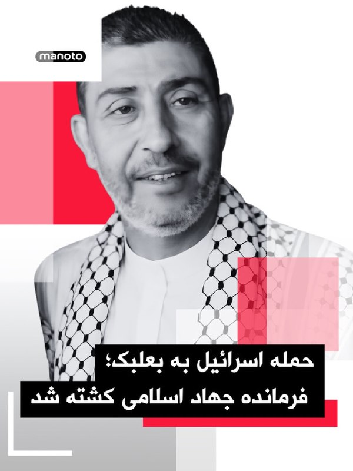

ارتش اسرائیل می‌گوید در حمله‌ای هوایی به منطقه بعلبک در شرق لبنان، وائل محمود عبدالحلیم، فرمانده جهاد اسلامی در منطقه بقاع، کشته شده است. به گفته ارتش اسرائیل، او در هماهنگی عملیات‌های جهاد اسلامی در کنار حزب‌الله لبنان نقش داشته است.
‌🏁 🇬🇧 ManotoTV

🤖 @VahidOOnLine

## VahidOOnLine — post 240802

  

رویترز به نقل از یک مقام ارشد جمهوری اسلامی گزارش داد تهران از آمریکا خواسته همه دارایی‌ها و منابع مالی ایران را آزاد کند.

این مقام گفت پیشنهاد اصلاح‌شده تهران شامل پایان دائمی جنگ، لغو تحریم‌ها و بازگشایی تنگه هرمز است و موضوع هسته‌ای در مراحل بعدی مذاکرات مطرح خواهد شد.

او افزود واشینگتن تاکنون تنها با آزادسازی ۲۵ درصد از دارایی‌های مسدودشده ایران، آن هم بر اساس جدول زمانی مرحله‌ای، موافقت کرده است.
‌🏁 🇬🇧 IranintlTV

🤖 @VahidOOnLine

## VahidOOnLine — post 240801

♦️پرابوو سوبیانتو، رئیس‌جمهوری اندونزی، روز دوشنبه در مراسم تحویل تجهیزات جدید نیروی هوایی این کشور، با اجرای آیینی سنتی و نمادین روی یکی از جنگنده‌های رافال مخلوطی از آب و گلبرگ‌های تازه پاشید. این مراسم هم‌زمان با تحویل شش جنگنده و تجهیزات تازه نظامی برگزار شد.
پاشیدن آب حاوی برگ گل بر اجسام، رسمی سنتی در اندونزی است که نماد برکت، خوش‌یمنی و استقبال از تجهیزات یا دارایی‌های تازه است.
اندونزی پیش‌تر سه فروند جنگنده رافال را در ژانویه دریافت کرده بود و سه فروند دیگر نیز روز دوشنبه در پایگاه هوایی حلیم پرداناکوسوما تحویل داده شد.
پرابوو در سخنرانی خود گفت تقویت تجهیزات نظامی با هدف افزایش توان بازدارندگی در شرایط ژئوپولیتیکی نامطمئن جهان انجام می‌شود و در عین حال رویکرد دفاعی اندونزی حفظ خواهد شد. او همچنین تجهیزات نظامی دیگری از جمله هواپیماهای داسو فالکون، سامانه‌های راداری و تسلیحات پیشرفته را نیز به نیروهای مسلح تحویل داد.
‌🇸🇦 Indypersian

🤖 @VahidOOnLine

## VahidOOnLine — post 240800

در پی کارزار ایران‌اینترنشنال برای پیدا کردن هویت پیکر جاویدنامان در بیمارستان الغدیر تهران، جزییات تازه‌ای از چگونگی کشته شدن امیرپارسا اشکبوس به دست ما رسیده است؛ جاویدنامی که پیکر او در حیاط پشتی این بیمارستان رها شده بود.
فرنوش فرجی، خبرنگار ایران‌اینترنشنال گزارش می‌دهد.
‌🏁 🇬🇧 IranintlTV

🤖 @VahidOOnLine

## VahidOOnLine — post 240799

  

ارتش اسرائیل اعلام کرد نیروهای تیپ ۷۶۹ با پشتیبانی نیروی هوایی یک انبار سلاح ضدتانک حزب‌الله را منهدم کرده‌اند.
ارتش اسرائیل افزود در عملیاتی دیگر در منطقه خیام نیز انبارهای تسلیحات و مراکز استقرار این گروه نابود و پرتابگرهای ضدتانک، مواد منفجره و سلاح‌های سبک کشف شده است.
‌🏁 🇬🇧 IranintlTV

🤖 @VahidOOnLine

## VahidOOnLine — post 240798

  

پایگاه خبری بلومبرگ گزارش داد هم‌زمان با ادامه تنش‌ها در خلیج فارس، شمار نفتکش‌های حاضر در اطراف جزیره خارک، مهم‌ترین پایانه صادرات نفت ایران، به بالاترین سطح از زمان آغاز محاصره دریایی آمریکا علیه بنادر ایران رسیده است.

بر اساس این گزارش که دوشنبه ۲۸ اردیبهشت منتشر شد، تصاویر ماهواره‌ای ثبت‌شده در ۲۶ اردیبهشت، حضور ۲۳ نفتکش را در اطراف جزیره خارک نشان می‌دهد.

این نفتکش‌ها یا در لنگرگاه‌های اطراف مستقر بوده‌اند یا در اسکله‌های بارگیری نفت خام و گاز مایع، پهلو گرفته‌اند.
‌🏁 🇬🇧 IranintlTV

🤖 @VahidOOnLine

## VahidOOnLine — post 240797

♦️همزمان با ۲۸ اردیبهشت‌ماه، روز بزرگداشت خیام نیشابوری، ویدیویی از یک مجلس «بزم» خیام‌خوانی در بوشهر بار دیگر در شبکه‌های اجتماعی پربازدید شده است.

در این ویدیو که نخستین بار چهار سال پیش در شبکه‌های اجتماعی منتشر شده بود، خانمی در بوشهر و قلیان به دست این رباعی مشهور خیام را می‌خواند و حاضران هم با دست زدن با او همنوایی می‌کنند:

«خیام اگر ز باده مستی خوش باش
با ماهرخی اگر نشستی خوش باش
چون عاقبت کار جهان نیستی است
انگار که نیستی چو هستی خوش باش»
‌🇸🇦 Indypersian

🤖 @VahidOOnLine

## VahidOOnLine — post 240796

  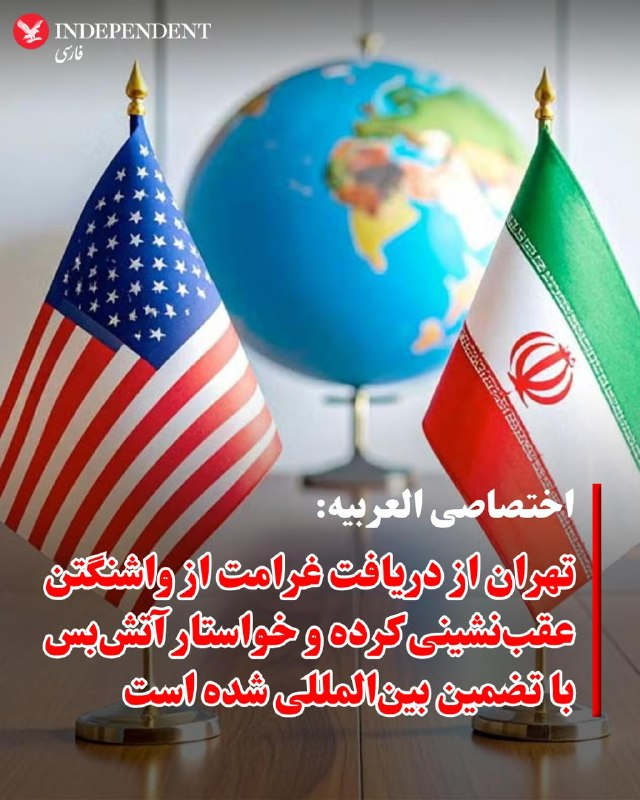

♦️خبرگزاری العربیه، روز دوشنبه ۲۸ اردیبهشت ماه، بر اساس «جزئیات درزکرده» از آخرین نسخه پیشنهادی ایران به آمریکا، از مجموعه‌ای از خواسته‌ها و پیشنهادهای تازه تهران که بر آتش‌بس، تنگه هرمز و پرونده هسته‌ای تمرکز دارد، خبر داد.
طبق این گزارش، ایران خواستار یک آتش‌بس طولانی‌مدت و چندمرحله‌ای شده و همچنین درخواست کرده بازگشایی تنگه هرمز به‌صورت تدریجی و با تضمین‌های امنیتی انجام شود.
بر پایه این اطلاعات، تهران به‌جای برچیدن کامل برنامه هسته‌ای، با یک توقف طولانی‌مدت فعالیت‌های هسته‌ای موافقت کرده است. همچنین پیشنهاد شده انتقال ذخایر اورانیوم غنی‌شده به‌جای آمریکا، به‌صورت مشروط به روسیه انجام شود.
العربیه همچنین گزارش داده ایران از مطالبه دریافت غرامت عقب‌نشینی کرده، اما به‌جای آن خواستار تسهیلات و امتیازات اقتصادی شده است.
بر اساس این گزارش، ایران همچنین خواهان دریافت چندین تضمین بین‌المللی برای هرگونه توافق احتمالی است و تلاش دارد پرونده دریایی و موضوع تنگه هرمز را از پیچیدگی‌های مربوط به مذاکرات هسته‌ای جدا کند.
در بخش دیگری از این گزارش آمده است تهران خواستار نقش‌آفرینی پاکستان و عمان در مدیریت هرگونه تنش یا اصطکاک احتمالی در تنگه هرمز شده و همچنین بر استفاده از ادبیات و چارچوب سیاسی‌ای تاکید دارد که امکان «حفظ وجهه سیاسی جمهوری اسلامی» را فراهم کند
‌🇸🇦 Indypersian

🤖 @VahidOOnLine

## VahidOOnLine — post 240795

  

عباس گلرو، عضو کمیسیون امنیت ملی مجلس، محتوای آخرین پیشنهاد جمهوری اسلامی به آمریکا را «خوب» ارزیابی کرد.

گلرو گفت این طرح نشان می‌دهد تهران «بر یک سری مبانی و اصول اساسی مرتبط با حقوق خود اصرار دارد و در عین حال تلاش کرده است راه‌حل‌هایی نیز برای برون‌رفت از وضعیت موجود ارائه دهد».

او افزود: «توپ در زمین آمریکایی‌هاست. باید دید آیا آنها پای میز مذاکره می‌آیند یا خیر.»

این نماینده مجلس ادامه داد: «روند مذاکرات در یک فرایند ساختارمند و با عقل جمعی و حضور مقامات اتخاذ می‌شود. لذا مورد تایید است و انشالله باید همیشه از فضای سیاسی موجود حمایت کنیم.»
‌🏁 🇬🇧 IranintlTV

🤖 @VahidOOnLine

## VahidOOnLine — post 240794

  <a href="telegram/content/VahidOOnLine_240794_1779113152.mp4" target="_blank">🎬 Download video</a>

رویترز در گزارشی اختصاصی نوشت پاکستان در جریان جنگ ایران، هشت هزار نیرو، یک اسکادران جنگنده و یک سامانه پدافند هوایی به عربستان سعودی اعزام کرده است.

بر اساس این گزارش، این اعزام در چارچوب پیمان دفاعی دوجانبه اسلام‌آباد و ریاض انجام شده و شامل حدود ۱۶ جنگنده، عمدتا از نوع جی‌اف‌ـ۱۷ ساخت مشترک پاکستان و چین، دو اسکادران پهپاد و سامانه پدافند هوایی چینی اچ‌کیو‌ـ۹ است. منابع رویترز گفتند عربستان هزینه این اعزام را تامین می‌کند و تجهیزات را نیروهای پاکستانی اداره می‌کنند.

پنج منبع امنیتی و دولتی به رویترز گفتند این نیروها با هدف حمایت از ارتش عربستان در صورت حملات بیشتر به این کشور مستقر شده‌اند.
‌🏁 🇬🇧 ManotoTV

🤖 @VahidOOnLine

## VahidOOnLine — post 240793

  <a href="telegram/content/VahidOOnLine_240793_1779113153.mp4" target="_blank">🎬 Download video</a>

رسانه‌های ترکیه گزارش دادند فرخنده قائم‌مقامی، زن ایرانی ساکن منطقه مال‌تپه استانبول، پس از قتل، جسدش در استان قرشهر پیدا شده است.

بر اساس گزارش خبرگزاری «دمیراورن»، خانم قائم‌مقامی از ۲۲ فروردین ناپدید شده بود و نزدیکان او پس از بی‌خبری، در ۲۳ اردیبهشت گزارش مفقودی ثبت کردند.

پلیس ترکیه در تحقیقات خود «ارکان ب»، ۴۹ ساله، را به‌عنوان آخرین فردی شناسایی کرد که با این زن ایرانی در تماس بوده است. بنا بر این گزارش، او ابتدا اتهام‌ها را رد کرد، اما بعدا به قتل اعتراف کرد.

دمیراورن نوشت مظنون در اعترافات خود گفته است پس از مشاجره در خودرو، قائم‌مقامی را با قلاده سگش خفه کرده، جسد او را تکه‌تکه کرده و در زمینی خالی در شهرستان موجور استان قرشهر رها کرده است.

در ادامه تحقیقات، دو مظنون دیگر نیز بازداشت شدند. سه مظنون این پرونده پس از پایان بازجویی در اداره پلیس، به دادگاه منتقل شدند.
‌🏁 🇬🇧 ManotoTV

🤖 @VahidOOnLine

## VahidOOnLine — post 240792

  <a href="telegram/content/VahidOOnLine_240792_1779113154.mp4" target="_blank">🎬 Download video</a>

بر اساس گزارش رسانه‌های حقوق بشری، نیروهای حکومتی روز ۱۵ اردیبهشت با یورش به خانه «افسانه جذابی (راسخی)»، شهروند بهائی ساکن شیراز، منزل او را تفتیش کردند و بخشی از اموال شخصی او را با خود بردند.

در این گزارش‌ها آمده است یک زن و سه مرد با ارائه حکمی با عنوان «همکاری با اسرائیل» وارد خانه این خانواده شدند و خانم جذابی و مادر ۸۵ ساله او را مورد تهدید و تحقیر قرار دادند. خانم جذابی به‌تازگی همسر خود را از دست داده و از مادر سالخورده و بیمار خود مراقبت می‌کند.

به گفته این رسانه‌ها، ماموران حکومتی به او گفتند فرزندش در خارج از کشور در فضای مجازی و کمپین‌های حقوق بشری فعالیت می‌کند و تهدید کردند در صورت ادامه این فعالیت‌ها، «هم برای شما و هم برای آنها گران تمام می‌شود.» آنها همچنین این خانواده را به مصادره خانه تهدید کردند.

بر اساس این گزارش‌ها، نیروهای امنیتی همچنین این خانواده را با عباراتی مانند «فرقه» و «همدست اسرائیل» خطاب کردند و چند بار خانم جذابی را به دستبند زدن و انتقال به مکانی نامعلوم تهدید کردند.

این یورش چند ساعت ادامه داشت و در پایان، خانم جذابی و مادر سالخورده‌اش که دچار افت فشار خون شده بود، مجبور شدند برگه‌ای را امضا کنند که در آن نوشته شده بود هیچ خسارتی به خانه و وسایل وارد نشده است. در این رویداد هیچ‌یک از اعضای خانواده بازداشت نشدند.
‌🏁 🇬🇧 ManotoTV

🤖 @VahidOOnLine

## VahidOOnLine — post 240791

  <a href="telegram/content/VahidOOnLine_240791_1779113155.mp4" target="_blank">🎬 Download video</a>

روزنامه ایران وابسته به دولت جمهوری اسلامی در گزارشی نوشت محدودیت دسترسی به اینترنت بین‌الملل، بازار خرید و فروش سیم‌کارت‌های عراقی را در برخی مناطق مرزی غرب ایران رونق داده است.

بر اساس این گزارش، بیشترین متقاضیان این سیم‌کارت‌ها تجار، بازرگانان، صاحبان بار، رانندگان ترانزیتی و فعالان اقتصادی مرزی هستند که برای ارتباط با طرف‌های عراقی، ارسال اسناد، حواله‌های مالی، رسیدها، عکس و فیلم کالاها از پیام‌رسان‌هایی مانند واتس‌اپ و تلگرام استفاده می‌کنند.

نعیم احمدی، مدیر روابط عمومی استانداری خوزستان، به این روزنامه گفت این سیم‌کارت‌ها در عمق یک تا دو کیلومتری خاک ایران قابل استفاده‌اند و در مناطقی مانند شلمچه، چذابه، خرمشهر، اروندکنار و جزیره مینو به گزینه‌ای در دسترس برای فعالان اقتصادی تبدیل شده‌اند. به گفته او، ارزانی این سیم‌کارت‌ها در مقایسه با هزینه فیلترشکن‌ها از عوامل گرایش به آنهاست.

در همین حال، محمد شفیعی، فرماندار قصرشیرین، استفاده از سیم‌کارت‌های عراقی در کرمانشاه را عمدتا محدود به تجار، صاحبان بار، رانندگان ترانزیتی و فعالان اقتصادی دانست و فراگیر شدن آن در میان عموم مردم را رد کرد.
‌🏁 🇬🇧 ManotoTV

🤖 @VahidOOnLine

## VahidOOnLine — post 240790

  

فریدریش مرتس، صدراعظم آلمان، حملات تازه جمهوری اسلامی علیه کشورهای منطقه را به‌شدت محکوم کرد و گفت حمله به تأسیسات هسته‌ای «تهدیدی برای امنیت مردم در سراسر منطقه» است.

او در پیامی در ایکس تأکید کرد که نباید خشونت‌ها بیش از این تشدید شود و از جمهوری اسلامی خواست وارد مذاکرات جدی با آمریکا شود، تهدید همسایگانش را متوقف کند و تنگه هرمز را بدون محدودیت باز کند.

این موضع‌گیری پس از آن مطرح شد که امارات از آتش‌سوزی در محدوده نیروگاه هسته‌ای براکه پس از حمله پهپادی خبر داد. مقام‌های اماراتی اعلام کردند این حادثه تلفات جانی و خطر تشعشعاتی نداشته است. عربستان سعودی نیز هم‌زمان از رهگیری حملات پهپادی تازه خبر داده است.

فریدریش مرتس، صدراعظم آلمان، حملات تازه منسوب به جمهوری اسلامی علیه کشورهای منطقه را محکوم کرد و گفت حمله به تأسیسات هسته‌ای امنیت مردم منطقه را تهدید می‌کند.

او از جمهوری اسلامی خواست وارد مذاکرات جدی با آمریکا شود، تهدید همسایگانش را متوقف کند و تنگه هرمز را بدون محدودیت باز کند. این موضع‌گیری پس از حمله پهپادی به محدوده نیروگاه هسته‌ای براکه در امارات و رهگیری حملات پهپادی تازه از سوی عربستان مطرح شده است.
‌🏁 🇬🇧 ManotoTV

🤖 @VahidOOnLine

## VahidOOnLine — post 240789

  

روزنامه نیویورک تایمز به نقل از دو مقام خاورمیانه‌ای گزارش داد که ایالات متحده و اسرائیل در حال انجام آماده‌سازی‌های «گسترده» برای احتمال ازسرگیری حملات علیه جمهوری اسلامی هستند.

این مقام‌ها احتمال دادند که حملات ممکن است در هفته جاری آغاز شود.

به نوشته این روزنامه، این سطح از آمادگی نظامی از زمان اجرای آتش‌بس بی‌سابقه بوده است.
‌🏁 🇬🇧 IranintlTV

🤖 @VahidOOnLine

## VahidOOnLine — post 240788

  

♦️خبرگزاری تسنیم وابسته به سپاه پاسداران، روز دوشنبه ۲۸ اردیبهشت، به نقل از یک منبع نزدیک به تیم مذاکره‌کننده گزارش داد آمریکا در متن جدید پیشنهادی خود، برخلاف متون پیشین، پذیرفته است تحریم‌های نفتی ایران را «در طول دوره مذاکرات» به‌طور موقت تعلیق کند.
به گفته این منبع، آمریکایی‌ها در متن جدید با «تعلیق موقت» (Waive) تحریم‌های نفتی ایران موافقت کرده‌اند. «ویو» به معنای معافیت یا چشم‌پوشی موقت از اجرای تحریم‌ها است و به معنای لغو کامل و دائمی آن‌ها محسوب نمی‌شود.
بر اساس این گزارش، تیم مذاکره‌کننده ایرانی همچنان بر این موضع تاکید دارد که لغو همه تحریم‌های ایران باید بخشی از تعهدات آمریکا باشد. در مقابل، واشنگتن پیشنهاد داده است معافیت‌های مرتبط با اوفک (دفتر کنترل دارایی‌های خارجی وزارت خزانه‌داری آمریکا) تنها تا زمان دستیابی به تفاهم نهایی اعمال شود.
به گزارش تسنیم، این تغییر در متن جدید آمریکا نسبت به پیشنهادهای قبلی، تحول تازه‌ای در روند مذاکرات به شمار می‌رود.
‌🇸🇦 Indypersian

🤖 @VahidOOnLine

## VahidOOnLine — post 240787

♦️بیست‌وهشتم اردیبهشت در تقویم ایران روز بزرگداشت حکیم عمر خیام نیشابوری، فیلسوف، ادیب، ریاضی‌دان و اخترشناس بزرگ ایرانی است.

آرامگاه خیام در شهر نیشابور، به همت استاد هوشنگ سیحون، یکی از پیشگامان معماری نوین ایران، در سال ۱۳۴۲ بنا شد.

این معمار صاحب‌نام ایرانی چند سال پیش در گفتگو با رسانه محلی عصر نیشابور گفته بود: «این بنا را بر اساس شعر خود خیام و غرق در گل و سبزه ساخته است.»
‌🇸🇦 Indypersian

🤖 @VahidOOnLine

## VahidOOnLine — post 240786

  

♦️خبرگزاری رویترز به نقل از منابع آگاه گزارش داد پاکستان در چارچوب پیمان دفاعی خود با عربستان سعودی، ۸ هزار نیروی نظامی به همراه یک اسکادران جنگنده و سامانه پدافند هوایی به این کشور اعزام کرده است.
بر اساس این گزارش، این نیروها از آمادگی عملیاتی برخوردارند و با هدف حمایت از عربستان در صورت ازسرگیری حملات علیه این کشور مستقر شده‌اند.

این تحرک نظامی در شرایطی انجام می‌شود که اسلام‌آباد هم‌زمان نقش مهمی در میانجی‌گری میان تهران و واشنگتن ایفا می‌کند.
‌🇸🇦 Indypersian

🤖 @VahidOOnLine

## VahidOOnLine — post 240785

  

خبرگزاری رویترز به نقل از منابع آگاه گزارش داد پاکستان در چارچوب پیمان دفاعی خود با عربستان سعودی، ۸ هزار نیروی نظامی به همراه یک اسکادران جنگنده و سامانه پدافند هوایی به این کشور اعزام کرده است.

به گزارش رویترز، این نیروها از توان عملیاتی برخوردارند و با هدف حمایت از عربستان سعودی در صورت ازسرگیری حملات علیه این کشور مستقر شده‌اند.

این تحرک نظامی در حالی صورت می‌گیرد که پاکستان نقش اصلی میانجی‌گری میان تهران و واشینگتن را بر عهده دارد.
‌🏁 🇬🇧 IranintlTV

🤖 @VahidOOnLine

## VahidOOnLine — post 240784

  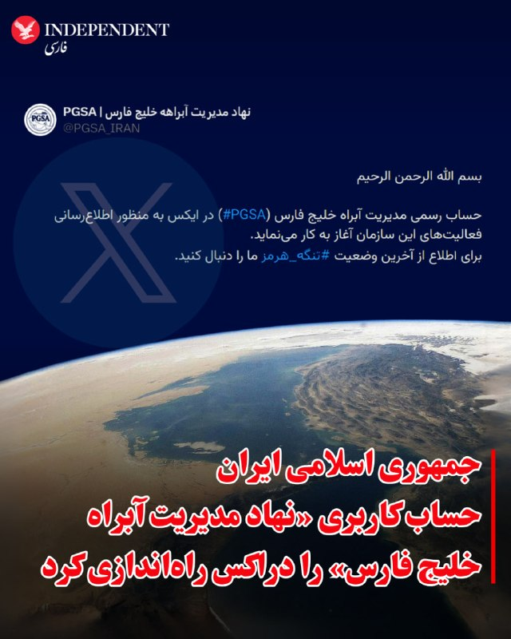

♦️جمهوری اسلامی ایران روز دوشنبه ۲۸ اردیبهشت‌ماه حساب کاربری «نهاد مدیریت آبراهه خلیج فارس» را در شبکه اجتماعی اکس فعال کرد.

این حساب در اولین پیام خود به دو زبان فارسی و انگلیسی نوشت: «حساب رسمی مدیریت آبراه خلیج فارس (#PGSA) در ایکس به منظور اطلاع‌رسانی فعالیت‌های این سازمان آغاز به کار می‌نماید.
برای اطلاع از آخرین وضعیت تنگه هرمز ما را دنبال کنید.»

خبرگزاری فرانسه گزارش کرد که شورای امنیت ملی ایران این حساب کاربری را به راه انداخته و حساب کاربری سپاه پاسداران هم اولین پیام آن را بازنشر کرده است.

ابراهیم عزیزی، رئیس کمیسیون امنیت ملی مجلس ایران، روز شنبه ۲۶ اردیبهشت با انتشار پیامی در شبکه اجتماعی اکس اعلام کرده بود که تهران سازوکاری «حرفه‌ای» برای مدیریت تردد در تنگه هرمز از طریق یک مسیر تعیین‌شده آماده کرده است که به‌زودی جزئیات آن را اعلام می‌کند.

عزیزی در این پیام نوشته بود: «فقط کشتی‌های تجاری و طرف‌های همکاری با ایران از آن بهره‌مند خواهند شد. حقوق لازم در ازای خدمات تخصصی ارائه شده، با این سازوکار برای ایران اخذ می‌شود. این مسیر کماکان برای عاملین پروژه به اصطلاح آزادی بسته خواهد ماند.»
‌🇸🇦 Indypersian

🤖 @VahidOOnLine

## WithYashar — post 11547

خبر بد برای گیمرها
رضا احمدی، معاون نظارت بنیاد ملی بازی‌های رایانه‌ای:

طرحی برای سایتهای دانلود بازیهای کامپیوتری به تصویب رسیده که طبق اون، یک گیم سنتر مرکزی تشکیل میشه تا سایتهای دانلود بازی قبل اینکه لینک دانلود رو آپلود کنن باید اون لینکا رو به اون گیم سنتر ارسال کنن تا یه کمیته محتواش رو بررسی کنه و اگه تایید شد، اون سایت تازه اجازه داره لینکای دانلود رو برای گیمرها آپلود کنه!
@withyashar

## WithYashar — post 11546

آمریکا در متن جدید خود اسقاط تحریم‌های نفتی ایران را پذیرفته است

تسنیم : یک منبع نزدیک به تیم مذاکره‌کننده گفت که آمریکایی‌ها برخلاف متون پیشین خود، در متن جدید پذیرفته‌اند که در طول دوره مذاکره، تحریم‌های نفتی ایران را Wave کنند.

ایران تاکید دارد که لغو همه‌ی تحریم‌های ایران باید جزو تعهدات آمریکا باشد. آمریکا اما اسقاطی(OFAC) را تا زمان تفاهم نهایی مطرح کرده است.

اسقاط تحریم‌ها WAVE یعنی تحریم‌ها موقتاً یا عملاً اجرا نشوند اما به معنی حذف دائمی نیست
او‌فک (OFAC)مخفف:
Office of Foreign Assets Control
این یک نهاد در وزارت خزانه‌داری آمریکا است. کارش اجرای تحریم‌ها علیه کشورها، شرکت‌ها و افراد هست، به عبارتی کنترل اینکه چه کسی می‌تواند با چه کسی تجارت کند
@withyashar

## WithYashar — post 11545

  <a href="telegram/content/WithYashar_11545_1779113159.mp4" target="_blank">🎬 Download video</a>

مجری: آیا ارزش از دست دادن انتخابات میان دوره‌ای را دارد اگر نتیجه یک ایران غیر هسته‌ای باشد؟

سناتور گراهام: ارزش از دست دادن شغلم رو هم داره؛ اگر مجبور بودم کارم رو رها کنم تا مطمئن شم ایران هرگز سلاح هسته‌ای نخواهد داشت، این کار رو می‌کردم.‌‌
@withyashar

## WithYashar — post 11544

اتاق جنگ با یاشار : تا آغاز جام جهانی ۲۰۲۶ در تاریخ ۲۱ خرداد ۱۴۰۵، حدود ۲۴ روز مانده است. و تا فینال جام جهانی در تاریخ ۲۸ تیر ۱۴۰۵، دقیق ۲ ماه مانده است
عید قربان امسال در بیشتر کشورهای منطقه، روز چهارشنبه ۶ خرداد ۱۴۰۵ (۲۷ مه ۲۰۲۶) اعلام شده است.
بازارهای مالی (بورس‌ها) در ایام عید قربان روز تعطیل می‌شوند (حدود ۵ روز)
حدود ۹ روز تا عید قربان مانده است ، حساب دستتون باشه
@withyashar

## WithYashar — post 11543

  

نفتکش هندی‌مکس PEGASUS (9276028) که با پرچم روسیه و تحت تحریم ایالات متحده حرکت می‌کند، صرفاً از روی لجاجت، مدام به محدوده محاصره ایالات متحده رفت و آمد می‌کند. ما چندین تصویر ماهواره‌ای داریم که تأیید می‌کند این یک جعل سیستم اطلاعات ناوبری (AIS) نیست.
فردا ولادمیر پوتین برای دیدار با شی جین پینگ در‌یک سفر از پیش برنامه ریزی نشده به چین سفر میکند…
@withyashar

## mwarmonitor — post 9249

🔴 منبع آمریکایی به الجزیره: صبر رئیس‌جمهور ترامپ به‌دلیل عدم پیشرفت در پرونده ایران رو به پایان است.

@mwarmonitor

## mwarmonitor — post 9248

🔴پیشنهاد اصلاح‌شده تهران به آمریکا شامل پایان دائمی جنگ، لغو تحریم‌ها، بازگشایی تنگه هرمز و آزادسازی دارایی‌های بلوکه‌شده ایران است. 🔸گزارش‌ها حاکی است که ایران درباره برنامه هسته‌ای خود در مراحل بعدی مذاکرات گفت‌وگو خواهد کرد - رویترز @mwarmonitor

## mwarmonitor — post 9247

🇺🇸🇵🇰🇮🇷پاکستان شامگاه یکشنبه یک پیشنهاد اصلاح‌شده از سوی ایران را با ایالات متحده به اشتراک گذاشت که هدف آن پایان دادن به جنگ است — رویترز @mwarmonitor

## mwarmonitor — post 9246

🇮🇷🇺🇸ایران بنا بر گزارش‌ها با یک «فریز بلندمدت برنامه هسته‌ای» به‌جای برچیدن کامل آن موافقت کرده و در مقابل، به‌دنبال امتیازات اقتصادی به‌جای غرامت است؛ این موضوع طبق جزئیات افشاشده از پیشنهاد اصلاح‌شده ایران که توسط شبکه سعودی «العربیه» به دست آمده، گزارش شده است.

@mwarmonitor

## mwarmonitor — post 9245

  <a href="telegram/content/mwarmonitor_9245_1779113161.mp4" target="_blank">🎬 Download video</a>

📝این فاحشه‌خانه‌ی فکری و لجن‌زارِ متعفنِ صداوسیما، غایتِ وقاحت و مسخ‌شدگیِ جماعتی است که مغزشان با خون، خشونت و باروت شستشو داده شده است. موجودی متوهم با لبخندی کریه، ابزارِ آدم‌کشی و پهپاد انتحاری را به عنوان مهریه به زنی ذوب‌شده در حماقت پیشکش می‌کند؛ و در کنارشان، آن آخوندِ دوزاری و مجریِ جیره‌خوار که شغلِ شریفشان سال‌هاست شرعی‌سازیِ کثافت‌کاری‌ها، صیغه‌بازی و دلالتِ مذهبی است، با رذالتی مشمئزکننده برای قیمتِ این آلتِ قتل چرتکه می‌اندازند. این نمایشِ مالامال از نجاست، ویترینِ سقوطِ مطلقِ شرف و انسانیتِ قشری است که از فلاکت و مرگ تغذیه می‌کنند و حتی پیوند ازدواج را هم به گندِ ایدئولوژیِ خون‌بار و وحشیانه‌ی خود می‌کشند.

@mwarmonitor

## mwarmonitor — post 9244

🔴سناتور لیندسی گراهام ؛

🔸من کاملاً اطمینان دارم که رئیس‌جمهور ترامپ به‌طور کامل وضعیت مربوط به ایران را درک می‌کند و دیگر ادامه نخواهد داد که عدم تمایل به مذاکره با حسن نیت، همراه با اقدامات تهاجمی و سرکشانه ایران در تنگه هرمز و سراسر منطقه را تحمل کند.

🔸برای من کاملاً روشن است که ایران از نظر نظامی و اقتصادی به‌شدت تضعیف شده است. اما در عین حال، جسورتر و تهاجمی‌تر نیز شده است.

🔸یک پاسخ کوتاه اما قاطع در این مقطع می‌تواند کل این درگیری را به شکل درستی بازتنظیم کند.

🔸در مورد ایران، ضروری است که از موضع قدرت و برتری وارد مذاکره شویم. باید کاری را که آغاز کرده‌ایم به پایان برسانیم. من نگرانم که ادامه مذاکرات بدون یک پاسخ قاطع، این درگیری را طولانی‌تر کند، باعث تردید در میان متحدان ما شود و رژیم تروریستی ایران را بیش از پیش جسورتر سازد.

@mwarmonitor

## mwarmonitor — post 9243

  

🔴یک عکس منتشرشده در DVIDS در تاریخ ۷ مه، یک پرتابگر سامانه THAAD ارتش آمریکا را در منطقه مسئولیت فرماندهی مرکزی آمریکا (CENTCOM) نشان می‌دهد.

🔸به نظر می‌رسد این تصویر در واقع در محل استقرار THAAD در بیابان نقب اسرائیل گرفته شده باشد (مختصات: 31°30'04.5"N 34°48'33.3"E)، با توجه به تطابق زمین اطراف و دیوارهای بتنی ضد انفجار مشابه.

@mwarmonitor

## mwarmonitor — post 9242

  

🔴سیستم راکت‌انداز M142 HIMARS ارتش آمریکا در تصاویری که در وب‌سایت DVIDS منتشر شده و مربوط به ۱۴ مه و ۶ مه است، در منطقه تحت مسئولیت فرماندهی مرکزی آمریکا (CENTCOM) مشاهده شده است.

🔸این سامانه‌ها احتمالاً در بحرین یا کویت مستقر هستند؛ جایی که پیش‌تر نیز در جریان عملیات «Epic Fury» حملاتی علیه ایران انجام داده بودند.

@mwarmonitor

## mwarmonitor — post 9240

🇸🇦🇵🇰پاکستان در چارچوب یک پیمان دفاعی مشترک، ۸۰۰۰ سرباز، یک اسکادران جنگنده و یک سامانه پدافند هوایی را به عربستان سعودی اعزام کرده است. این اقدام همکاری نظامی اسلام‌آباد با ریاض را تقویت می‌کند، در حالی که اسلام‌آباد همچنان به‌عنوان میانجی اصلی در جنگ ایران عمل می‌کند. رویترز

@mwarmonitor

## mwarmonitor — post 9239

🇮🇱🇺🇸ایالات متحده و اسرائیل در حال انجام آماده‌سازی‌های فشرده‌ای هستند — بزرگ‌ترین سطح آماده‌سازی از زمان برقراری آتش‌بس — برای احتمال ازسرگیری حملات علیه ایران، که ممکن است از همین هفته آغاز شود، به گفته دو مقام خاورمیانه‌ای — نیویورک تایمز

@mwarmonitor

## mwarmonitor — post 9238

  <a href="telegram/content/mwarmonitor_9238_1779113164.mp4" target="_blank">🎬 Download video</a>

🚢این نفتکش LPG که تحت تحریم‌های آمریکا قرار دارد، دو روز پیش (۱۶ مهٔ ۲۰۲۶) موفق شد در جزیره خارک ایران در مختصات 29.21431، 50.33619 گاز مایع بارگیری کند.

🚢این کشتی آخرین بار حدود دو هفته پیش در سامانه AIS در سواحل هند سیگنال ارسال کرده بود و سپس بدون شناسایی، از خط محاصره نیروی دریایی آمریکا عبور کرد. TANKER TRACKER

🔴بلومبرگ به نقل از تصاویر ماهواره‌ای: حدود ۲۳ نفتکش در نزدیکی جزیره خارک مشاهده شده‌اند که این بزرگ‌ترین تجمع از زمان آغاز محاصره آمریکا است.

@mwarmonitor

## mwarmonitor — post 9237

  

✈️یک فروند هواپیمای گلف‌استریم G-V «نخشون شاویت» نیروی هوایی اسرائیل، که برای شنود سیگنالی (SIGINT) و شناسایی به‌کار می‌رود، هم‌اکنون در حال انجام مأموریت ISR (اطلاعات، مراقبت و شناسایی) بر فراز شرق دریای مدیترانه و در سواحل مصر است.

@mwarmonitor

## mwarmonitor — post 9236

  

✈️🇸🇦یک فروند ایرباس سوخت رسان - ترابری A330 MRTT نیروی هوایی سلطنتی عربستان سعودی در حال حاضر بر فراز شرق عربستان سعودی فعال است؛ این هواپیما پیش‌تر نیز در نزدیکی حَفَرالباطن و نزدیک مرز عراق عملیات داشته است.

🔸آیا این تحرکات می‌تواند نشانه‌ای از حملات احتمالی علیه شبه‌نظامیان عراقی در پی حمله پهپادی روز گذشته باشد!!

@mwarmonitor

## FoxNewsTwitter — post 341871

  <a href="telegram/content/FoxNewsTwitter_341871_1779113166.mp4" target="_blank">🎬 Download video</a>

Fox News (Twitter/X)

“Your character will take you further than your resume. Continue to be kind. Continue to be humble.”

NBA legend Shaquille O'Neal shares an inspiring message with graduates during Louisiana State University’s commencement ceremony after receiving his own master’s degree from LSU.

The Hall of Famer laid out five key rules for the graduates to live by, emphasizing resilience, humility, and continuous learning.

O’Neal encouraged students to keep learning, embrace failure as motivation, and understand that persistence is essential to achieving success.

## FoxNewsTwitter — post 341870

  

Fox News (Twitter/X)

A 20-year-old Arkansas man was arrested after allegedly threatening to start a mass shooting at Walmart if the country shut down over hantavirus fears.

Authorities say the FBI tracked the threat through an online video game chat after another player recorded the conversation and sent it in.

Investigators say the gamer’s username and in-game recording helped lead agents directly to Aaron Bynum, who now faces terroristic threatening charges.

## FoxNewsTwitter — post 341869

  <a href="telegram/content/FoxNewsTwitter_341869_1779113169.mp4" target="_blank">🎬 Download video</a>

Fox News (Twitter/X)

“Thank you Jesus for letting me do this for a living.”

Ella Langley opened up during her Female Artist of the Year speech after sweeping all 7 of her ACM Award nominations, revealing Lainey Wilson prayed over her backstage before the show after emotions hit her hard.

“I walk right into Lainey’s room and I just got emotional... she hugged me, wrapped me up and started praying for me.”

“I would not be standing up here without just encouragement of so many women.”

## FoxNewsTwitter — post 341868

  

Fox News (Twitter/X)

RT @FoxNewsEnt: We settled some hot takes in the world of country music 🎤

Watch country stars go rapid fire with their answers at the 61st Academy of Country Music Awards.

## FoxNewsTwitter — post 341867

  <a href="telegram/content/FoxNewsTwitter_341867_1779113171.mp4" target="_blank">🎬 Download video</a>

Fox News (Twitter/X)

NEW: President Trump sends Iran a new warning: “The clock is ticking.”

This comes as reports say Tehran has submitted a revised proposal to Pakistani mediators amid ongoing nuclear negotiations and rising tensions in the Middle East.

As the U.S. blockade continues, Iran’s economy takes a major hit with pressure mounting on the regime to make a deal.

@TreyYingst reports the latest developments from the region.

## pm_afshaa — post 90951

  <a href="telegram/content/pm_afshaa_90951_1779113173.webm" target="_blank">🎬 Download video</a>

🔴نیویورک تایمز: پنتاگون برای از سرگیری جنگ با ایران در روزهای آینده آماده می‌شود 
💧 Rainbet.com the #1 Non-KYC Crypto Casino & Sportsbook @rainbetcom 
😁 @Pm_Afshaa

## pm_afshaa — post 90950

  <a href="telegram/content/pm_afshaa_90950_1779113174.webm" target="_blank">🎬 Download video</a>

🔴سناتور لیندسی گراهام: من کاملاً اطمینان دارم که رئیس‌جمهور ترامپ به‌طور کامل وضعیت مربوط به ایران رو درک میکنه و دیگه عدم تمایل به مذاکره با حسن نیت، همراه با اقدامات تهاجمی و سرکشانه ایران تو تنگه هرمز و سراسر منطقه رو تحمل نخواهد کرد.

💧 Rainbet.com the #1 Non-KYC Crypto Casino & Sportsbook @rainbetcom

😁 @Pm_Afshaa

## pm_afshaa — post 90949

  <a href="telegram/content/pm_afshaa_90949_1779113174.webm" target="_blank">🎬 Download video</a>

🔴تسنیم به نقل از یک منبع نزدیک به تیم مذاکره‌کننده:

آمریکا در متن جدید خودش پذیرفته که تحریم‌های نفتی ایران رو در طول دوره مذاکرات به‌صورت موقت تعلیق (Waive) کنه.

طبق این گزارش، جمهوری اسلامی همچنان بر لغو کامل همه تحریم‌ها تاکید داره، اما آمریکا فعلا فقط معافیت موقت تحریم‌ها تا زمان رسیدن به تفاهم نهایی رو مطرح کرده.

💧 Rainbet.com the #1 Non-KYC Crypto Casino & Sportsbook @rainbetcom

😁 @Pm_Afshaa

## pm_afshaa — post 90948

🔴نیویورک تایمز: پنتاگون برای از سرگیری جنگ با ایران در روزهای آینده آماده می‌شود

💧 Rainbet.com the #1 Non-KYC Crypto Casino & Sportsbook @rainbetcom

😁 @Pm_Afshaa

## pm_afshaa — post 90947

  <a href="telegram/content/pm_afshaa_90947_1779113175.webm" target="_blank">🎬 Download video</a>

🔴رویترز: پاکستان 8 هزار نیروی نظامی به همراه یک اسکادران جنگنده و سامانه پدافند هوایی به عربستان سعودی اعزام کرده.

طبق این گزارش، این نیروها برای حمایت از عربستان در صورت ازسرگیری حملات احتمالی مستقر شدن. این تحرک در حالی انجام میشه که پاکستان همزمان نقش میانجی میان تهران و واشینگتن رو هم بر عهده داره.

💧 Rainbet.com the #1 Non-KYC Crypto Casino & Sportsbook @rainbetcom

😁 @Pm_Afshaa

## pm_afshaa — post 90946

  <a href="telegram/content/pm_afshaa_90946_1779113175.webm" target="_blank">🎬 Download video</a>

🔴ترامپ: اونا یه برگه می‌فرستن که هیچ ربطی به چیزی که توافق کرده بودیم نداره، منم میگم، شماها دیوونه‌اید یا چی؟

💧 Rainbet.com the #1 Non-KYC Crypto Casino & Sportsbook @rainbetcom

😁 @Pm_Afshaa

## pm_afshaa — post 90945

🔴کانال 12 اسرائیل: در پیشنهاد جدید ایران هیچ اشاره‌ای به هرمز و اورانیوم غنی‌شده نشده

💧 Rainbet.com the #1 Non-KYC Crypto Casino & Sportsbook @rainbetcom

😁 @Pm_Afshaa

## pm_afshaa — post 90944

  <a href="telegram/content/pm_afshaa_90944_1779113176.webm" target="_blank">🎬 Download video</a>

🔴کانال 13 اسرائیل: طی 24 ساعت گذشته ده‌ها هواپیمای باری خالی از اسرائیل به پایگاه‌های آمریکایی در آلمان رفتن، مهمات بارگیری کردن و سپس به اسرائیل بازگشتن.

ارتش اسرائیل در روزهای اخیر در سطح بالایی از آماده‌باش قرار داشته، اما جزئیاتی درباره نوع مهمات یا هدف این انتقال‌ها منتشر نشده.

💧 Rainbet.com the #1 Non-KYC Crypto Casino & Sportsbook @rainbetcom

😁 @Pm_Afshaa

## pm_afshaa — post 90943

  <a href="telegram/content/pm_afshaa_90943_1779113176.webm" target="_blank">🎬 Download video</a>

🔴منابع پاکستانی:آخرین پیشنهاد ایران برای پایان جنگ، یکشنبه شب(دیشب) به طرف آمریکایی ارسال شد 
💧 Rainbet.com the #1 Non-KYC Crypto Casino & Sportsbook @rainbetcom 
😁 @Pm_Afshaa

## iaghapour — post 2618

  

⭕️ دیگه پول فیلترشکن نده! آموزش ساخت فیلترشکن شخصی و رایگان با سرعت بالا 😎

🔹در این آموزش قدم‌به‌قدم بهت یاد می‌دم که چطور بدون نیاز به دانش خاصی، یک فیلترشکن (VPN) شخصی، امن و کاملاً رایگان برای خودت بسازی. این روش روی تمام اینترنت‌ها جواب می‌ده و سرعت خوبی برای تماشای یوتیوب، وب‌گردی و … داره.

🔗 تماشا ویدیو در یوتیوب

🔗 دانلود ویدیو با لینک مستقیم (بزودی)

#آموزش #فیلترشکن #رایگان #novaproxy
برای دور زدن فیلترینگ و آموزش تکنولوژی و هوش مصنوعی ما رو دنبال کنید 💚
🆔@iaghapour

## DEJradio — post 4699

  <a href="telegram/content/DEJradio_4699_1779113177.mp4" target="_blank">🎬 Download video</a>

🤡
🔺 ترس حکومت از نارضایتی‌های عمومی؛ آموزش کاربرد سلاح در تجمعات شبانه!

#تجمعات_حکومتی #شیفت_شب
@DEJradio

## DEJradio — post 4698

  <a href="telegram/content/DEJradio_4698_1779113179.mp4" target="_blank">🎬 Download video</a>

🔺🎥 ‏ماه‌ها پیش از آنکه دو پایگاه مخفی اسرائیل در عراق شناسایی شوند، یک چوپان ویدیویی از پرواز دو هواپیمای ترابری در بیابان‌های میان عراق و اردن منتشر کرد. اکنون رسانه‌ها با استناد به این ویدیو فعالیت پایگاه‌های مخفی اسرائیل را تایید می‌کنند.

#اسرائیل #عراق
@DEJradio

## DEJradio — post 4695

  <a href="telegram/content/DEJradio_4695_1779113180.webm" target="_blank">🎬 Download video</a>

🚨📢 روزنامه «نیویورک‌تایمز» گزارش داد اسرائیل ماه‌ها دو پایگاه مخفی را در بیابان‌های عراق برای پشتیبانی از عملیات علیه رژیم ایران پنهان نگه داشته بود.

بر اساس این گزارش، اسرائیل بیش از یک سال برای آماده‌سازی یکی از این پایگاه‌ها برنامه‌ریزی و فعالیت کرده بود. نیویورک‌تایمز به نقل از مقام‌های منطقه‌ای نوشت این تأسیسات به‌صورت محرمانه برای پشتیبانی از عملیات اسرائیل علیه جمهوری اسلامی ایران مورد استفاده قرار می‌گرفت.

این روزنامه همچنین گزارش داد مقام‌های عراقی بعداً وجود دومین پایگاه مخفی را نیز تأیید کرده‌اند.

ادعا شده این پایگاه را نیز یک چوپان کشف کرده است. سرلشکر علی الحمدانی فرمانده نیروهای فرات غربی ارتش عراق، گفت ارتش یک ماه قبل از آنکه یک چوپان پایگاه را شناسایی کند، به حضور اسرائیل در بیابان مشکوک شده بود اما سپهبد سعد معن، سخنگوی نیروهای امنیتی عراق، به تایمز گفت: «عراق هیچ اطلاعاتی درباره مکان هیچ پایگاه نظامی اسرائیلی ندارد.»

به گفته ژنرال الحمدانی، برای هفته‌ها بادیه‌نشین‌ها در بیابان غربی عراق فعالیت‌های نظامی غیرعادی را به فرماندهی منطقه‌ای عراق گزارش می‌کردند.
او گفت ارتش تصمیم گرفت نزدیک نشود و در عوض از فاصله دور «نظارت اطلاعاتی» انجام دهد؛ زیرا فرماندهان مشکوک بودند نیروهای اسرائیلی در منطقه حضور دارند. آن‌ها از همتایان آمریکایی خود درخواست اطلاعات کردند، اما پاسخی دریافت نکردند.

پیش از این فیلمی که از سوی یک چوپان در مرزهای عراق منتشر شده بود، نشان می‌داد که دو هواپیمای سی۱۳۰ در ارتفاع پایین در غرب عراق در حال پرواز هستند و با انتشار این گزارش، این فیلم مورد توجه جدی قرار گرفته است.
اکنون مشخص نیست آیا عدم شناسایی پایگاه‌های اسراییل در عراق ناتوانی و بی‌عرضگی ارتش عراق است یا همکاری غیرمستقیم آنها با ارتش اسرائیل.

#اسرائیل #جنگ #عراق
@DEJradio

## VahidOnline — post 75529

  

«نت‌بلاکس» نهاد ناظر بر آزادی اینترنت اعلام کرد قطعی و محدودیت اینترنت در ایران وارد هشتادمین روز خود شده و مدت این خاموشی تاکنون از ۱۸۹۶ ساعت عبور کرده است.

نت‌بلاکس همچنین گزارش داده که هم‌زمان با ادامه محدودیت‌های اینترنتی، محتواهایی در حمایت از حکومت، شبکه‌های اجتماعی در ایران را پر کرده است.

بر اساس این گزارش، برخی شهروندان ایرانی که تلاش کرده‌اند به اینترنت موسوم به «سیم کارت سفید» یا اینترنت ویژه (اینترنت پرو) دسترسی پیدا کنند، گفته‌اند از آن‌ها خواسته شده سهمیه مشخصی از پست‌های تبلیغاتی روزانه در حمایت از حکومت را در صفحات اجتماعی خود منتشر کنند.
@VahidHeadline

📡 @VahidOnline

## VahidOnline — post 75528

  

سازمان عفو بین‌الملل روز دوشنبه ۲۸ اردیبهشت گزارش داد که ایران در سال ۲۰۲۵ تعداد «بی‌سابقه» دو هزار و ۱۵۹ نفر را اعدام کرده است؛ رقمی که باعث افزایش آمار جهانی تا بالاترین سطح از سال ۱۹۸۱ به این سو شده است.

این سازمان مستقر در لندن اعلام کرد که در سال ۲۰۲۵ دست‌کم دو هزار و ۷۰۷ نفر در سراسر جهان اعدام شده‌اند، هرچند اعدام‌های انجام‌شده در چین در این آمار لحاظ نشده است.
عفو بین‌الملل گفت «هزاران اعدام» در چین، که بیشترین استفاده را از مجازات اعدام در جهان دارد، انجام شده، اما جزئیات به‌دلیل «محرمانه بودن داده‌های دولتی» در این کشور کمونیستی نامشخص است.

این سازمان افزود که آمار جهانی سال ۲۰۲۵، شامل اعدام‌ها در عربستان سعودی، کویت، مصر، یمن، سنگاپور و ایالات متحده، نسبت به مجموع سال ۲۰۲۴ بیش از دو سوم افزایش داشته است.

در این گزارش آمده است: «این روند بیشترین شدت را در کشورهایی داشته که مقامات در آن‌ها با محدود کردن فضای مدنی، خاموش کردن صداهای مخالف و بی‌اعتنایی به حمایت‌های مقرر در قوانین و استانداردهای بین‌المللی حقوق بشر، کنترل خود بر قدرت را تشدید کرده‌اند».
به نوشته عفو بین‌الملل، «افزایش بی‌سابقه اعدام‌های ثبت‌شده در ایران» در حالی رخ داده که مقام‌های جمهوری اسلامی، به‌ویژه پس از جنگ ۱۲ روزه تابستان پارسال با اسرائیل، «استفاده از مجازات اعدام را به‌عنوان ابزاری برای سرکوب و کنترل سیاسی تشدید کرده‌اند».
عفو بین‌الملل و دیگر گروه‌های حقوق بشری گفته‌اند که پس از اعتراضات گسترده ضدحکومتی در دی‌ماه پارسال و همچنین پس از آغاز جنگ با اسرائیل و ایالات متحده در اسفندماه، استفاده از مجازات اعدام در ایران افزایش یافته است.
@VahidHeadline

📡 @VahidOnline

## kianmeli1 — post 87462

  <a href="telegram/content/kianmeli1_87462_1779113181.mp4" target="_blank">🎬 Download video</a>

🔴آموزش کار با اسلحه در مساجد توسط بسیج
https://t.me/kianmeli1

## kianmeli1 — post 87461

  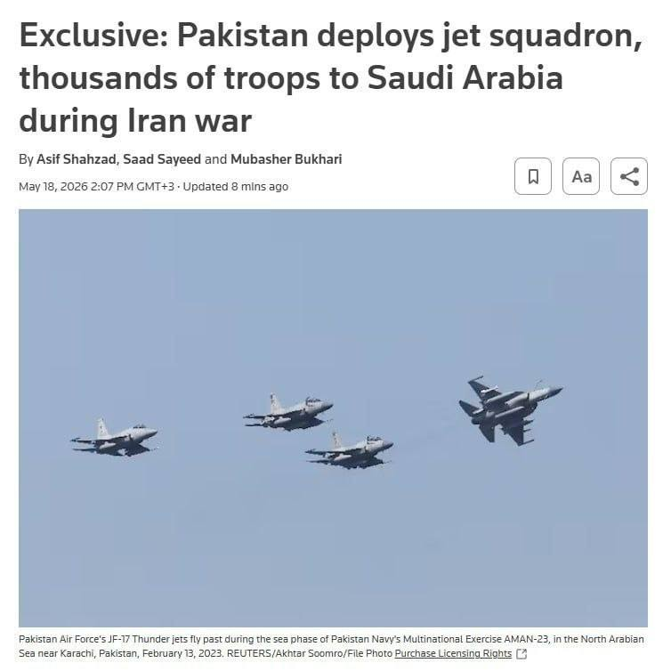

🔴خبرگزاری رویترز در گزارشی مدعی شد که پاکستان در طول جنگ ایران، ۸۰۰۰ نیرو، جت جنگنده، پهپاد و سامانه‌های پدافند هوایی را در عربستان سعودی مستقر کرده است. این نیرو شامل جت‌های JF-17، سامانه‌های HQ-9 چینی و تجهیزات تحت مدیریت پاکستان با تأمین مالی ریاض است. این ظرفیت اعزامی از پاکستان، آماده نبرد است و در صورت نیاز می‌تواند به ۸۰۰۰۰ نیرو افزایش یابد.

عربستان و پاکستان سال گذشته پیمان دفاعی مشترک امضا کردند. وزیر پاکستان بعد از آن اعلام کرد که «عربستان سعودی تحت چتر هسته‌ای پاکستان محافظت می‌شود.»
https://t.me/kianmeli1

## kianmeli1 — post 87459

🔴ارتش اسرائیل: IDF در طول شب (یکشنبه) به منطقه بعلبک حمله کرد و وائل محمود عبدالحلیم، که فرمانده جهاد اسلامی فلسطین در منطقه بقاع در لبنان بود را از بین برد.

تنها دو نفر از فرماندهان نظامی حماس که در 7 اکتبر شرکت داشتند زنده مانده‌اند، محمد عوده، رئیس ستاد اطلاعات، و عماد عاقل، رئیس ستاد جبهه داخلی.
https://t.me/kianmeli1

## IranIntlTV — post 337786

  <a href="telegram/content/IranIntlTV_337786_1779113183.mp4" target="_blank">🎬 Download video</a>

یک دانش‌آموز با ارسال پیامی به ایران‌اینترنشنال می‌گوید: «به ما می‌گویند از حواشی آموزشی فاصله بگیرید و تمرکزتان را روی درس بگذارید. چطور این کار را انجام دهیم وقتی کل کشور شده حاشیه.»

## IranIntlTV — post 337785

اتحادیه اروپا شبکه تبلیغاتی سپاه پاسداران را در یک عملیات گسترده آنلاین هدف قرار داد

یوروپل اعلام کرد در یک عملیات هماهنگ علیه «محتوای تروریستی در فضای آنلاین»، ۱۴ هزار و ۲۰۰ پست و لینک مرتبط با سپاه پاسداران انقلاب اسلامی را شناسایی کرده و هدف قرار داده است.

سپاه پاسداران در فهرست سازمان‌های تروریستی اتحادیه اروپا قرار گرفته است.

بر اساس گزارش یوروپل که دوشنبه ۲۸ اردیبهشت منتشر شد، این عملیات به رهبری «واحد ارجاع اینترنتی اتحادیه اروپا» (EU IRU) وابسته به یوروپل انجام شد و بر شناسایی و مختل کردن حضور آنلاین سپاه پاسداران تمرکز داشت. حضوری که برای انتشار تبلیغات، جذب نیرو و جمع‌آوری منابع مالی استفاده می‌شد.

یوروپل اعلام کرد ۱۹ کشور از جمله آلمان، اسپانیا، اوکراین، ایتالیا، سوئد، فرانسه، هلند و آمریکا، در این عملیات مشارکت داشتند.

مقام‌ها بین ۲۵ بهمن ۱۴۰۴ تا هشتم اردیبهشت ۱۴۰۵، در چند مرحله هماهنگ، به جمع‌آوری اطلاعات، تطبیق اهداف و ارسال درخواست‌های مشترک برای حذف محتوا از پلتفرم‌های آنلاین پرداختند.
متن کامل این گزارش را اینجا بخوانید
@iranintltv

## IranIntlTV — post 337784

بلومبرگ: شمار نفتکش‌ها در خارک به بالاترین سطح از زمان آغاز محاصره دریایی آمریکا رسید

پایگاه خبری بلومبرگ گزارش داد هم‌زمان با ادامه تنش‌ها در خلیج فارس، شمار نفتکش‌های حاضر در اطراف جزیره خارک، مهم‌ترین پایانه صادرات نفت ایران، به بالاترین سطح از زمان آغاز محاصره دریایی آمریکا علیه بنادر ایران رسیده است.

بر اساس این گزارش که دوشنبه ۲۸ اردیبهشت منتشر شد، تصاویر ماهواره‌ای ثبت‌شده در ۲۶ اردیبهشت، حضور ۲۳ نفتکش را در اطراف جزیره خارک نشان می‌دهد. این نفتکش‌ها یا در لنگرگاه‌های اطراف مستقر بوده‌اند یا در اسکله‌های بارگیری نفت خام و گاز مایع، پهلو گرفته‌اند.

بلومبرگ ۲۲ اردیبهشت نیز در گزارشی نوشت تصاویر ماهواره‌ای اروپایی نشان می‌دهد در روزهای ۱۸، ۱۹ و ۲۱ اردیبهشت هیچ نفتکش اقیانوس‌پیمایی در پایانه نفتی جزیره خارک دیده نشده است. موضوعی که به گفته این رسانه، نخستین توقف طولانی صادرات نفت ایران از آغاز جنگ محسوب می‌شود.
متن کامل این گزارش را اینجا بخوانید
@iranintltv

## IranIntlTV — post 337783

  

رویترز به نقل از یک مقام ارشد جمهوری اسلامی گزارش داد تهران از آمریکا خواسته همه دارایی‌ها و منابع مالی ایران را آزاد کند.

این مقام گفت پیشنهاد اصلاح‌شده تهران شامل پایان دائمی جنگ، لغو تحریم‌ها و بازگشایی تنگه هرمز است و موضوع هسته‌ای در مراحل بعدی مذاکرات مطرح خواهد شد.

او افزود واشینگتن تاکنون تنها با آزادسازی ۲۵ درصد از دارایی‌های مسدودشده ایران، آن هم بر اساس جدول زمانی مرحله‌ای، موافقت کرده است.
https://iranintl.com/202605183611

## IranIntlTV — post 337782

در پی کارزار ایران‌اینترنشنال برای پیدا کردن هویت پیکر جاویدنامان در بیمارستان الغدیر تهران، جزییات تازه‌ای از چگونگی کشته شدن امیرپارسا اشکبوس به دست ما رسیده است؛ جاویدنامی که پیکر او در حیاط پشتی این بیمارستان رها شده بود.
فرنوش فرجی، خبرنگار ایران‌اینترنشنال گزارش می‌دهد.

## IranIntlTV — post 337781

  

ارتش اسرائیل اعلام کرد نیروهای تیپ ۷۶۹ با پشتیبانی نیروی هوایی یک انبار سلاح ضدتانک حزب‌الله را منهدم کرده‌اند.
ارتش اسرائیل افزود در عملیاتی دیگر در منطقه خیام نیز انبارهای تسلیحات و مراکز استقرار این گروه نابود و پرتابگرهای ضدتانک، مواد منفجره و سلاح‌های سبک کشف شده است.
https://iranintl.com/202605186415

## IranIntlTV — post 337780

  

پایگاه خبری بلومبرگ گزارش داد هم‌زمان با ادامه تنش‌ها در خلیج فارس، شمار نفتکش‌های حاضر در اطراف جزیره خارک، مهم‌ترین پایانه صادرات نفت ایران، به بالاترین سطح از زمان آغاز محاصره دریایی آمریکا علیه بنادر ایران رسیده است.

بر اساس این گزارش که دوشنبه ۲۸ اردیبهشت منتشر شد، تصاویر ماهواره‌ای ثبت‌شده در ۲۶ اردیبهشت، حضور ۲۳ نفتکش را در اطراف جزیره خارک نشان می‌دهد.

این نفتکش‌ها یا در لنگرگاه‌های اطراف مستقر بوده‌اند یا در اسکله‌های بارگیری نفت خام و گاز مایع، پهلو گرفته‌اند.
https://iranintl.com/202605185927

## IranIntlTV — post 337779

  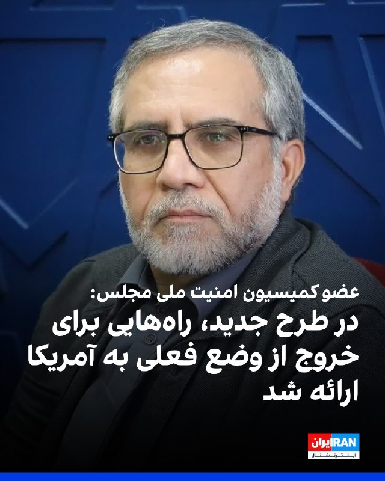

عباس گلرو، عضو کمیسیون امنیت ملی مجلس، محتوای آخرین پیشنهاد جمهوری اسلامی به آمریکا را «خوب» ارزیابی کرد.

گلرو گفت این طرح نشان می‌دهد تهران «بر یک سری مبانی و اصول اساسی مرتبط با حقوق خود اصرار دارد و در عین حال تلاش کرده است راه‌حل‌هایی نیز برای برون‌رفت از وضعیت موجود ارائه دهد».

او افزود: «توپ در زمین آمریکایی‌هاست. باید دید آیا آنها پای میز مذاکره می‌آیند یا خیر.»

این نماینده مجلس ادامه داد: «روند مذاکرات در یک فرایند ساختارمند و با عقل جمعی و حضور مقامات اتخاذ می‌شود. لذا مورد تایید است و انشالله باید همیشه از فضای سیاسی موجود حمایت کنیم.»
https://iranintl.com/202605189531

## IranIntlTV — post 337778

  <a href="telegram/content/IranIntlTV_337778_1779113187.mp4" target="_blank">🎬 Download video</a>

روزنامه دنیای اقتصاد نوشت برای تامین حداقل کالری مورد نیاز روزانه افراد، رقم کالابرگ باید بین ۵۰ تا ۱۰۰ درصد افزایش یابد. بر اساس این گزارش، در حالی‌ که قرار بود این طرح به‌عنوان سپر تورمی از معیشت اقشار کم‌درآمد محافظت کند، وضعیت افزایش اعتبار کالابرگ به‌دلیل نبود بودجه همچنان نامشخص است.

ارزیابی اشکان نظام آبادی، روزنامه‌نگار اقتصادی
@iranintltv

## IranIntlTV — post 337777

  <a href="telegram/content/IranIntlTV_337777_1779113188.mp4" target="_blank">🎬 Download video</a>

مجری و یک کارشناس نظامی در برنامه‌ای که از صداوسیمای جمهوری اسلامی پخش شد، با اسلحه به تصاویر دونالد ترامپ و بنیامین نتانیاهو شلیک کردند و ابراز امیدواری کردند که چنین اتفاقی در واقعیت رخ دهد.
@iranintltv

## IranIntlTV — post 337776

  <a href="telegram/content/IranIntlTV_337776_1779113189.mp4" target="_blank">🎬 Download video</a>

یکی از شهروندان با ارسال ویدیویی به ایران‌اینترنشنال، فضای امنیتی شهر تهران را نشان می‌دهد. در این ویدیو تجمع حامیان حکومت و نظامیان مسلح را در میدان انقلاب تهران می‌بینیم.

## IranIntlTV — post 337775

  <a href="telegram/content/IranIntlTV_337775_1779113191.mp4" target="_blank">🎬 Download video</a>

شرکت آلکاتل اعلام کرد، تعمیر کابل‌های زیردریایی در خلیج فارس را به دلیل ناامنی و تهدیدهای سپاه پاسداران متوقف کرده است.

احمد صمدی، خبرنگار ایران‌اینترنشنال، گزارش می‌دهد
@iranintltv

## IranIntlTV — post 337774

  

روزنامه نیویورک تایمز به نقل از دو مقام خاورمیانه‌ای گزارش داد که ایالات متحده و اسرائیل در حال انجام آماده‌سازی‌های «گسترده» برای احتمال ازسرگیری حملات علیه جمهوری اسلامی هستند.

این مقام‌ها احتمال دادند که حملات ممکن است در هفته جاری آغاز شود.

به نوشته این روزنامه، این سطح از آمادگی نظامی از زمان اجرای آتش‌بس بی‌سابقه بوده است.
https://iranintl.com/202605180651

## IranIntlTV — post 337773

  <a href="https://t.me/IranintlTV/337773" target="_blank">📎 Download file</a>

🎧نسخه صوتی اخبار نیمروزی | دوشنبه ۲۸ اردیبهشت
@iranintlTV

## IranIntlTV — post 337772

  <a href="telegram/content/IranIntlTV_337772_1779113193.mp4" target="_blank">🎬 Download video</a>

مستند کوتاه «هنر مقاومت» به تهیه‌کنندگی ایران‌اینترنشنال و کارگردانی مهران عباسیان، خبرنگار این شبکه، برنده جایزه بهترین مستند کوتاه و بهترین کارگردانی فستیوال فیلم خانه سینمای سوئد شد.
گزارش مهسا مرتضوی، خبرنگار ایران‌اینترنشنال
@iranintltv

## IranIntlTV — post 337771

  <a href="telegram/content/IranIntlTV_337771_1779113194.mp4" target="_blank">🎬 Download video</a>

یک شهروند با ارسال ویدیویی به ایران‌اینترنشنال می‌گوید: «برنج آنقدر گران شده که توان خریدش را نداریم. قیمت برنج از دو میلیون تومان شروع می‌شود.»

## IranIntlTV — post 337770

  <a href="telegram/content/IranIntlTV_337770_1779113196.mp4" target="_blank">🎬 Download video</a>

اطلاعات رسیده به ایران‌اینترنشنال، جزییات تازه‌ای از چگونگی کشته شدن جاویدنام امیرپارسا اشکبوس، دانشجوی ترم آخر رشته میکروبیولوژی، در جریان انقلاب ملی ایرانیان روایت می‌کند.

گفت‌وگو با فرنوش فرجی، عضو تحریریه ایران‌اینترنشنال

@iranintltv

## IranIntlTV — post 337769

  

خبرگزاری رویترز به نقل از منابع آگاه گزارش داد پاکستان در چارچوب پیمان دفاعی خود با عربستان سعودی، ۸ هزار نیروی نظامی به همراه یک اسکادران جنگنده و سامانه پدافند هوایی به این کشور اعزام کرده است.

به گزارش رویترز، این نیروها از توان عملیاتی برخوردارند و با هدف حمایت از عربستان سعودی در صورت ازسرگیری حملات علیه این کشور مستقر شده‌اند.

این تحرک نظامی در حالی صورت می‌گیرد که پاکستان نقش اصلی میانجی‌گری میان تهران و واشینگتن را بر عهده دارد.
https://iranintl.com/202605187837

## IranIntlTV — post 337768

  <a href="telegram/content/IranIntlTV_337768_1779113198.mp4" target="_blank">🎬 Download video</a>

مسعود پزشکیان با اشاره به وضعیت وخیم اقتصادی در پی محاصره دریایی بندرهای ایران، از کاهش درآمدهای کشور خبر داد و گفت: «دولت به‌دلیل مشکلات تجارت و بازار، امکان اخذ مالیات را ندارد.»

گفت‌وگو با آرش آزرمی، دبیر بخش اقتصادی ایران‌اینترنشنال
@iranintltv

## IranIntlTV — post 337767

  

🔻روزنامه سان گزارش داد که بازیکنان تیم ملی فوتبال انگلستان در جریان جام جهانی ۲۰۲۶ در آمریکا، رختخواب‌های شخصی خود را همراه خواهند داشت تا کیفیت خواب و روند ریکاوری آن‌ها حفظ شود.

🔹این تصمیم پس از شکایت‌های متعدد درباره تخت‌های خشک و سفت هتل محل اقامت آن‌ها گرفته شده است. اتحادیه فوتبال انگلیس (FA) برای تضمین خواب راحت و باکیفیت بازیکنان، تشک‌های اسفنجی سبک و بالش‌های ویژه‌ای تهیه کرده است. از بازیکنان خواسته شده پتوهای شخصی خود را هم بیاورند تا اتاق هتل حس خانه را داشته باشند.

🔹بر اساس این گزارش، کادر فنی تیم ملی انگلستان به رهبری توماس توخل قصد دارد برای جلوگیری از خستگی و مشکلات ناشی از سفرهای طولانی در آمریکا، شرایط اقامت بازیکنان را تا حد ممکن مشابه خانه فراهم کند.

🔹این تصمیم در حالی گرفته شده که فاصله زیاد شهرهای میزبان جام جهانی ۲۰۲۶، یکی از نگرانی‌های اصلی تیم‌های حاضر در این رقابت‌ها عنوان شده است.

@iranintltvsport

## Shin_Persian — post 6062

  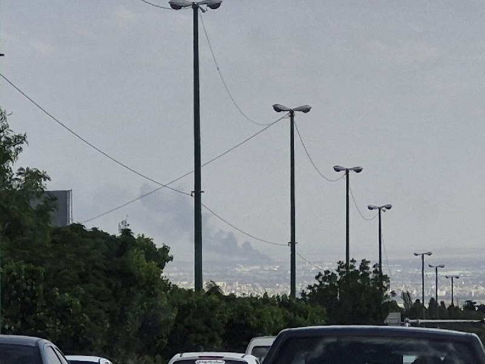

Shin ✓ @hey_itsmyturn
Mon, 18 May 2026 13:07:22 UTC

1246Z
Smoke rising from southern Tehran,
Camera POV: Yadegar Highway -&gt; South

#Tehran Province, #Iran

فارسی

۱۲۴۶ زولو (۱۶:۱۶ به وقت تهران)
برخاستن دود از جنوب تهران،
زاویه دوربین: بزرگراه یادگار امام -> جنوب

#Tehran Province, #Iran

𝕏 · @shin_persian

## Shin_Persian — post 6061

Bundeskanzler Friedrich Merz @bundeskanzler
Mon, 18 May 2026 10:13:01 UTC

Die erneuten iranischen Luftschläge gegen die Vereinigten Arabischen Emirate und weitere Partner verurteilen wir scharf. Angriffe auf Nuklearanlagen sind eine Bedrohung für die Sicherheit der Menschen in der gesamten Region. Es darf zu keiner weiteren Gewalteskalation kommen.

فارسی

ما حملات هوایی مجدد ایران علیه امارات متحده عربی و سایر شرکا را به شدت محکوم می‌کنیم. حمله به تأسیسات هسته‌ای تهدیدی برای امنیت مردم در تمام منطقه است. نباید اجازه داد تنش و خشونت بیشتری رخ دهد.

𝕏 · @shin_persian

## Shin_Persian — post 6058

DefenceGeek 🇬🇧 ✓ @DefenceGeek Mon, 18 May 2026 09:46:18 UTC UPDATE: Fairford Bomber Training Flights #FreeIran‌ --- Operation EPIC FURY / Project FREEDOM --- As of a short while ago, @MATA_osint team members have tracked/identified a total of 50 training…

## Shin_Persian — post 6057

DefenceGeek 🇬🇧 ✓ @DefenceGeek
Mon, 18 May 2026 09:46:18 UTC

UPDATE: Fairford Bomber Training Flights #FreeIran‌
--- Operation EPIC FURY / Project FREEDOM ---

As of a short while ago, @MATA_osint team members have tracked/identified a total of 50 training sorties by US Air Force B-1B "Lancer" and B-52H "Stratofortress" bombers from RAF Fairford (EGVA) since the ceasefire began.

These comprise:
- 19 missions by B-52s (30 launches by 8 aircraft)
- 31 missions by B-1s (54 launches by 13 aircraft)
- 2 of the B-1s have not flown a single training sortie (yet)

Huge thanks as always to our team members @jamjake01 @Saint1Mil @Andyyyyrrrr @ArmchairAdml @LHA2709 @havoc_aviation

(Photos used with permission @havoc_aviation )

فارسی

به‌روزرسانی: پروازهای آموزشی بمب‌افکن‌های فایرفورد #FreeIran‌
--- عملیات خشم حماسی (Operation EPIC FURY) / پروژه آزادی ---

تا لحظاتی پیش، اعضای تیم @MATA_osint در مجموع ۵۰ سورتی پرواز آموزشی توسط بمب‌افکن‌های نیروی هوایی ایالات متحده (USAF) از نوع B-1B "Lancer" و B-52H "Stratofortress" را از پایگاه هوایی سلطنتی فایرفورد (EGVA) از زمان آغاز آتش‌بس ردیابی و شناسایی کرده‌اند.

این موارد شامل:
- ۱۹ ماموریت توسط B-52ها (۳۰ پرواز توسط ۸ فروند هواپیما)
- ۳۱ ماموریت توسط B-1ها (۵۴ پرواز توسط ۱۳ فروند هواپیما)
- ۲ فروند از B-1ها (هنوز) حتی یک سورتی پرواز آموزشی انجام نداده‌اند.

سپاس فراوان طبق معمول از اعضای تیم ما:
@jamjake01 @Saint1Mil @Andyyyyrrrr @ArmchairAdml @LHA2709 @havoc_aviation

(عکس‌ها با کسب اجازه استفاده شده است @havoc_aviation )

𝕏 · @shin_persian

## ManotoTV — post 105597

  

ارتش اسرائیل می‌گوید در حمله‌ای هوایی به منطقه بعلبک در شرق لبنان، وائل محمود عبدالحلیم، فرمانده جهاد اسلامی در منطقه بقاع، کشته شده است. به گفته ارتش اسرائیل، او در هماهنگی عملیات‌های جهاد اسلامی در کنار حزب‌الله لبنان نقش داشته است.

## ManotoTV — post 105596

  <a href="telegram/content/ManotoTV_105596_1779113200.mp4" target="_blank">🎬 Download video</a>

رویترز در گزارشی اختصاصی نوشت پاکستان در جریان جنگ ایران، هشت هزار نیرو، یک اسکادران جنگنده و یک سامانه پدافند هوایی به عربستان سعودی اعزام کرده است.

بر اساس این گزارش، این اعزام در چارچوب پیمان دفاعی دوجانبه اسلام‌آباد و ریاض انجام شده و شامل حدود ۱۶ جنگنده، عمدتا از نوع جی‌اف‌ـ۱۷ ساخت مشترک پاکستان و چین، دو اسکادران پهپاد و سامانه پدافند هوایی چینی اچ‌کیو‌ـ۹ است. منابع رویترز گفتند عربستان هزینه این اعزام را تامین می‌کند و تجهیزات را نیروهای پاکستانی اداره می‌کنند.

پنج منبع امنیتی و دولتی به رویترز گفتند این نیروها با هدف حمایت از ارتش عربستان در صورت حملات بیشتر به این کشور مستقر شده‌اند.

## ManotoTV — post 105595

  <a href="telegram/content/ManotoTV_105595_1779113201.mp4" target="_blank">🎬 Download video</a>

رسانه‌های ترکیه گزارش دادند فرخنده قائم‌مقامی، زن ایرانی ساکن منطقه مال‌تپه استانبول، پس از قتل، جسدش در استان قرشهر پیدا شده است.

بر اساس گزارش خبرگزاری «دمیراورن»، خانم قائم‌مقامی از ۲۲ فروردین ناپدید شده بود و نزدیکان او پس از بی‌خبری، در ۲۳ اردیبهشت گزارش مفقودی ثبت کردند.

پلیس ترکیه در تحقیقات خود «ارکان ب»، ۴۹ ساله، را به‌عنوان آخرین فردی شناسایی کرد که با این زن ایرانی در تماس بوده است. بنا بر این گزارش، او ابتدا اتهام‌ها را رد کرد، اما بعدا به قتل اعتراف کرد.

دمیراورن نوشت مظنون در اعترافات خود گفته است پس از مشاجره در خودرو، قائم‌مقامی را با قلاده سگش خفه کرده، جسد او را تکه‌تکه کرده و در زمینی خالی در شهرستان موجور استان قرشهر رها کرده است.

در ادامه تحقیقات، دو مظنون دیگر نیز بازداشت شدند. سه مظنون این پرونده پس از پایان بازجویی در اداره پلیس، به دادگاه منتقل شدند.

## ManotoTV — post 105594

  <a href="telegram/content/ManotoTV_105594_1779113201.mp4" target="_blank">🎬 Download video</a>

بر اساس گزارش رسانه‌های حقوق بشری، نیروهای حکومتی روز ۱۵ اردیبهشت با یورش به خانه «افسانه جذابی (راسخی)»، شهروند بهائی ساکن شیراز، منزل او را تفتیش کردند و بخشی از اموال شخصی او را با خود بردند.

در این گزارش‌ها آمده است یک زن و سه مرد با ارائه حکمی با عنوان «همکاری با اسرائیل» وارد خانه این خانواده شدند و خانم جذابی و مادر ۸۵ ساله او را مورد تهدید و تحقیر قرار دادند. خانم جذابی به‌تازگی همسر خود را از دست داده و از مادر سالخورده و بیمار خود مراقبت می‌کند.

به گفته این رسانه‌ها، ماموران حکومتی به او گفتند فرزندش در خارج از کشور در فضای مجازی و کمپین‌های حقوق بشری فعالیت می‌کند و تهدید کردند در صورت ادامه این فعالیت‌ها، «هم برای شما و هم برای آنها گران تمام می‌شود.» آنها همچنین این خانواده را به مصادره خانه تهدید کردند.

بر اساس این گزارش‌ها، نیروهای امنیتی همچنین این خانواده را با عباراتی مانند «فرقه» و «همدست اسرائیل» خطاب کردند و چند بار خانم جذابی را به دستبند زدن و انتقال به مکانی نامعلوم تهدید کردند.

این یورش چند ساعت ادامه داشت و در پایان، خانم جذابی و مادر سالخورده‌اش که دچار افت فشار خون شده بود، مجبور شدند برگه‌ای را امضا کنند که در آن نوشته شده بود هیچ خسارتی به خانه و وسایل وارد نشده است. در این رویداد هیچ‌یک از اعضای خانواده بازداشت نشدند.

## ManotoTV — post 105593

  <a href="telegram/content/ManotoTV_105593_1779113202.mp4" target="_blank">🎬 Download video</a>

روزنامه ایران وابسته به دولت جمهوری اسلامی در گزارشی نوشت محدودیت دسترسی به اینترنت بین‌الملل، بازار خرید و فروش سیم‌کارت‌های عراقی را در برخی مناطق مرزی غرب ایران رونق داده است.

بر اساس این گزارش، بیشترین متقاضیان این سیم‌کارت‌ها تجار، بازرگانان، صاحبان بار، رانندگان ترانزیتی و فعالان اقتصادی مرزی هستند که برای ارتباط با طرف‌های عراقی، ارسال اسناد، حواله‌های مالی، رسیدها، عکس و فیلم کالاها از پیام‌رسان‌هایی مانند واتس‌اپ و تلگرام استفاده می‌کنند.

نعیم احمدی، مدیر روابط عمومی استانداری خوزستان، به این روزنامه گفت این سیم‌کارت‌ها در عمق یک تا دو کیلومتری خاک ایران قابل استفاده‌اند و در مناطقی مانند شلمچه، چذابه، خرمشهر، اروندکنار و جزیره مینو به گزینه‌ای در دسترس برای فعالان اقتصادی تبدیل شده‌اند. به گفته او، ارزانی این سیم‌کارت‌ها در مقایسه با هزینه فیلترشکن‌ها از عوامل گرایش به آنهاست.

در همین حال، محمد شفیعی، فرماندار قصرشیرین، استفاده از سیم‌کارت‌های عراقی در کرمانشاه را عمدتا محدود به تجار، صاحبان بار، رانندگان ترانزیتی و فعالان اقتصادی دانست و فراگیر شدن آن در میان عموم مردم را رد کرد.

## ManotoTV — post 105592

  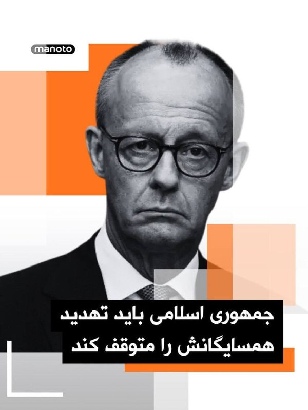

فریدریش مرتس، صدراعظم آلمان، حملات تازه جمهوری اسلامی علیه کشورهای منطقه را به‌شدت محکوم کرد و گفت حمله به تأسیسات هسته‌ای «تهدیدی برای امنیت مردم در سراسر منطقه» است.

او در پیامی در ایکس تأکید کرد که نباید خشونت‌ها بیش از این تشدید شود و از جمهوری اسلامی خواست وارد مذاکرات جدی با آمریکا شود، تهدید همسایگانش را متوقف کند و تنگه هرمز را بدون محدودیت باز کند.

این موضع‌گیری پس از آن مطرح شد که امارات از آتش‌سوزی در محدوده نیروگاه هسته‌ای براکه پس از حمله پهپادی خبر داد. مقام‌های اماراتی اعلام کردند این حادثه تلفات جانی و خطر تشعشعاتی نداشته است. عربستان سعودی نیز هم‌زمان از رهگیری حملات پهپادی تازه خبر داده است.

فریدریش مرتس، صدراعظم آلمان، حملات تازه منسوب به جمهوری اسلامی علیه کشورهای منطقه را محکوم کرد و گفت حمله به تأسیسات هسته‌ای امنیت مردم منطقه را تهدید می‌کند.

او از جمهوری اسلامی خواست وارد مذاکرات جدی با آمریکا شود، تهدید همسایگانش را متوقف کند و تنگه هرمز را بدون محدودیت باز کند. این موضع‌گیری پس از حمله پهپادی به محدوده نیروگاه هسته‌ای براکه در امارات و رهگیری حملات پهپادی تازه از سوی عربستان مطرح شده است.

## ManotoTV — post 105591

  

نِت‌بلاکس اعلام کرد خاموشی اینترنت در ایران وارد هشتادمین روز شده و مدت این اختلال از ۱۸۹۶ ساعت گذشته است.

نت‌بلاکس، نهاد ناظر بر اختلالات اینترنتی، در گزارشی اعلام کرد خاموشی اینترنت در ایران وارد هشتادمین روز شده و از ۱۸۹۶ ساعت عبور کرده است. این قطعی در حالی است‌ که دسترسی آزاد شهروندان به اینترنت همچنان محدود است، محتوای حامی جمهوری اسلامی در شبکه‌های اجتماعی به‌طور گسترده منتشر می‌شود.

بر اساس گزارش‌ها، برخی کاربران در ایران گفته‌اند برای دریافت دسترسی‌های ویژه یا «سفید»، از آن‌ها خواسته شده روزانه سهمیه‌ای از محتوای تبلیغاتی منتشر کنند؛ روندی که گفته می‌شود با ابزارهای هوش مصنوعی هم کنترل می‌شود.

## FarsiVOA — post 218058

  <a href="telegram/content/FarsiVOA_218058_1779113204.mp4" target="_blank">🎬 Download video</a>

ارتش اسرائیل ویدیویی از انهدام انبار تسلیحات ضدزره حزب‌الله و فعالیت نیروهای تیپ ۷۶۹ در جنوب لبنان منتشر و اعلام کرد این نیروها «با پشتیبانی نیروی هوایی، در یک واکنش عملیاتی سریع، یک انبار سلاح‌های ضدزره را که توسط سازمان تروریستی حزب‌الله علیه نیروهای فعال در منطقه مورد استفاده قرار می‌گرفت، منهدم کردند.»

ارتش اسرائیل همچنین در یک عملیات دیگر در منطقه روستای الخیام، انبارهای تسلیحاتی و مراکز استقرار سازمان تروریستی حزب‌الله را منهدم کرد و مقادیری سلاح از جمله پرتابگرهای ضدزره، مواد منفجره و سلاح‌های سبک را کشف کردند.

## FarsiVOA — post 218057

خاموشی اینترنت مستقیما روی کار روزنامه‌نگاران ایرانی اثر گذاشته است؛ آن هم درست در روزهایی که گزارش‌گری مستقل و راستی‌آزمایی از همیشه ضرورتی‌تر است. تیم میدان در این داده‌نما به وضعیت روزنامه‌نگاری در ایران پرداخته است

## FarsiVOA — post 218056

  

فرماندهی مرکزی ایالات متحده، سنتکام، با انتشار این تصویر اعلام کرد یک جنگنده رادارگریز اف-۳۵ در جریان گشت‌زنی معمول بر فراز آب‌های منطقه خاورمیانه سوخت‌گیری هوایی کرده است.

@FarsiVOA

## FarsiVOA — post 218055

  <a href="telegram/content/FarsiVOA_218055_1779113206.mp4" target="_blank">🎬 Download video</a>

جمهوری اسلامی به عنوان یکی از حکومت‌های دشمن روزنامه‌نگاری شناخته می‌شود. با این حال، روزنامه‌نگاران ایرانی در این سال‌ها هرگز گزارش‌های میدانی، خبررسانی‌، پرده‌برداری‌ از حقیقت و مستندسازی دردهای اجتماعی را متوقف نکرده‌اند

## FarsiVOA — post 218054

  <a href="telegram/content/FarsiVOA_218054_1779113207.mp4" target="_blank">🎬 Download video</a>

فرماندهی آمریکا در آفریقا، آفریکام، اعلام کرد در هماهنگی با دولت نیجریه، روز ۲۷ اردیبهشت مواضع گروه داعش در شمال شرقی این کشور را هدف حملات هوایی قرار داده است.

به گفته آفریکام، در این عملیات هیچ‌یک از نیروهای آمریکایی یا نیجریه‌ای آسیب ندیدند.

@FarsiVOA

## FarsiVOA — post 218053

  

فرماندهی مرکزی ایالات متحده، سنتکام، با انتشار این تصویر اعلام کرد ملوانان آمریکایی در ناو هواپیمابر آبراهام لینکلن در دریای عرب از عملیات پروازی پشتیبانی می‌کنند.

سنتکام نوشت: «هر موفقیت عملیاتی در حوزه مسئولیت این فرماندهی با زنان و مردان آمریکایی در یونیفرم آغاز و پایان می‌یابد.»

@FarsiVOA

## FarsiVOA — post 218052

🔺پاکستان یک اسکادران جنگنده و هزاران نیروی نظامی به عربستان سعودی اعزام کرد

▪️پاکستان تحت پیمان دفاعی دوجانبه، ۸ هزار نیروی نظامی، یک اسکادران جنگنده و یک سامانه پدافند هوایی به عربستان سعودی اعزام کرده است.

▪️این همکاری نظامی که هدف آن حمایت از ارتش عربستان در صورت مواجهه این کشور با حملات بیشتر است، در شرایطی است که اسلام‌آباد هم‌زمان نقش اصلی میانجی‌گری میان جمهوری اسلامی و آمریکا را بر عهده دارد.

▪️بر اساس اظهارات منابع آگاه، پاکستان یک اسکادران کامل شامل حدود ۱۶ هواپیما، عمدتاً جنگنده‌های جی‌اف-۱۷ که به‌طور مشترک با چین ساخته شده‌اند، به عربستان اعزام کرده است.

▪️این اقدام همچنین شامل اعزام حدود ۸ هزار نیروی نظامی است، همراه با تعهد برای اعزام نیروهای بیشتر در صورت نیاز.

⬇️ بیشتر بخوانید:
https://ir.voanews.com/a/8151190.html

## FarsiVOA — post 218051

🔺بلومبرگ: واردات ال‌ان‌جی اروپا برای دومین ماه متوالی کاهش می‌یابد

▪️بلومبرگ گزارش داد واردات گاز طبیعی مایع، ال‌ان‌جی، اروپا در ماه مه برای دومین ماه متوالی در مسیر کاهش قرار دارد؛ آن هم در شرایطی که جنگ اخلال جمهوری اسلامی در تنگه هرمز، جریان این سوخت را مختل کرده و محموله‌های بیشتری به سمت بازارهای آسیایی هدایت می‌شوند.

▪️حمله جمهوری اسلامی به تأسیسات رأس‌لفان قطر، ظرفیت تولید ال‌ان‌جی قطر را حدود ۱۷ درصد کاهش داد و قیمت‌های ال‌ان‌جی در آسیا را بیش از ۱۴۰ درصد بالا برد.

▪️اروپا پس از کاهش وابستگی به گاز روسیه، بیش از گذشته به واردات ال‌ان‌جی متکی شده است. اما افت واردات در ماه‌های آوریل و مه نشان می‌دهد این جایگزینی، اروپا را آسیب‌پذیر کرده است.

⬇️ بیشتر بخوانید:
https://ir.voanews.com/a/8151188.html

## FarsiVOA — post 218050

  

ارتش اسرائیل پیش از حملات هوایی که قرار است در روز دوشنبه علیه گروه تروریستی حزب‌الله تحت حمایت جمهوری اسلامی انجام شود، برای سه روستا در جنوب لبنان هشدار تخلیه صادر کرد.

بر اساس اعلام ارتش اسرائیل، به ساکنان این مناطق دستور داده شده دست‌کم یک کیلومتر از محل دور شوند.

سرهنگ آویخای ادرعی، سخنگوی ارتش اسرائیل، هشدار داد: «در پی نقض توافق آتش‌بس از سوی سازمان تروریستی حزب‌الله، ارتش اسرائیل ناچار است با قدرت علیه آن اقدام کند و قصد آسیب رساندن به شما را ندارد.»

پیشتر ارتش اسرائیل اعلام کرد که ده‌ها زیرساخت «سازمان تروریستی حزب‌الله» را در جنوب لبنان هدف قرار داده است؛ این اهداف شامل انبارهای تسلیحات، مواضع دیده‌بانی و زیرساخت‌هایی است که به گفته ارتش اسرائیل «برای پیشبرد طرح‌های تروریستی علیه نیروهای ما استفاده می‌شدند».
@FarsiVOA

## FarsiVOA — post 218049

  

رئیس آژانس بین‌المللی انرژی اعلام کرد که به‌دلیل بسته شدن تنگه هرمز به روی کشتیرانی، ذخایر تجاری نفت به‌سرعت در حال کاهش است و تنها چند هفته از این ذخایر باقی مانده است.

فاتح بیرول، روز دوشنبه ۲۸ اردیبهشت در حاشیه نشست رهبران مالی گروه هفت در پاریس، به خبرنگاران گفت که آزادسازی ذخایر راهبردی نفت، روزانه ۲.۵ میلیون بشکه نفت به بازار اضافه کرده اما این ذخایر «بی‌پایان نیستند».

او افزود آغاز فصل کشت بهاره و فصل سفرهای تابستانی در نیم‌کره شمالی باعث خواهد شد ذخایر سریع‌تر کاهش یابند، زیرا تقاضا برای گازوئیل، کود، سوخت جت و بنزین افزایش می‌یابد.

رئیس آژانس بین‌المللی انرژی در نشست وزیران دارایی و روسای بانک مرکزی کشورهای عضو گروه هفت درباره اختلاف میان بازار واقعی نفت و بازار مالی نفت صحبت کرد.

هفته گذشته، آژانس بین‌المللی انرژی اعلام کرد که عرضه جهانی نفت در سال جاری میلادی کمتر از مجموع تقاضا خواهد بود، زیرا جنگ علیه رژیم ایران تولید نفت خاورمیانه را به‌شدت مختل کرده و ذخایر با سرعتی بی‌سابقه در حال کاهش هستند.

این آژانس پیش‌تر برای امسال مازاد عرضه پیش‌بینی کرده بود.
@FarsiVOA

## FarsiVOA — post 218048

  

یک مقام وزارت نفت هند گفت دهلی‌نو خرید نفت از روسیه را صرف‌نظر از تمدید یا پایان معافیت‌های تحریمی آمریکا ادامه می‌دهد؛ موضعی که پس از پایان مهلت معافیت واشنگتن برای خرید نفت دریابرد روسیه اعلام شد.

رویترز گزارش داد سوجاتا شارما، از مقام‌های وزارت نفت هند، روز دوشنبه گفت هند «پیش از معافیت، در دوره معافیت و اکنون هم» از روسیه نفت خریده است. او افزود تصمیم دهلی‌نو بر پایه «منطق تجاری» است و معافیت یا نبود معافیت آمریکا، تأثیری بر خرید نفت روسیه نخواهد داشت.

با این حال، هند در برابر محموله‌های پرریسک‌تر محتاط‌تر عمل کرده است. رویترز پیش‌تر گزارش داده بود هند از خرید گاز طبیعی مایع روسیه که مشمول تحریم‌های آمریکا بود، خودداری کرده و یک محموله ال‌ان‌جی روسیه از تأسیسات پورتووایا، پس از رد شدن از سوی هند، نزدیک آب‌های سنگاپور بدون مقصد روشن مانده است. داده‌های مرین‌ترافیک نیز نشان می‌دهد کشتی «کونپنگ»، که تحت تحریم بریتانیا و اوکراین قرار دارد، پس از تغییر مسیر از هنگ‌کنگ به هند، دوباره سرگردان شده است.
@FarsiVOA

## FarsiVOA — post 218047

  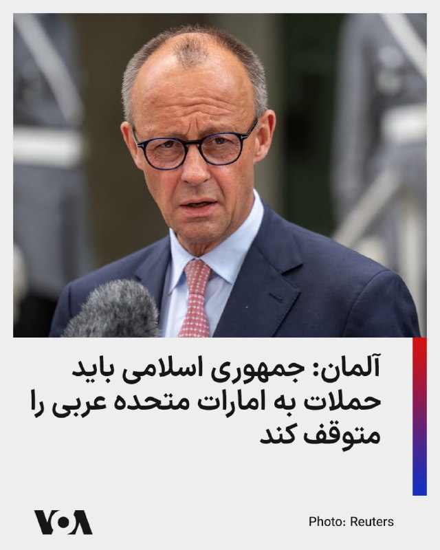

صدراعظم آلمان اعلام کرد که کشورش حملات جمهورس اسلامی به امارات متحده عربی و دیگر کشورها را محکوم می‌کند.

فریدریش مرتس روز دوشنبه در شبکه اجتماعی ایکس افزود که تهران باید تهدید همسایگان خود را متوقف کند و تنگه هرمز را بدون هیچ محدودیتی باز نگه دارد.

او در این پیام نوشت: «حملات به تأسیسات هسته‌ای، امنیت مردم در سراسر منطقه را تهدید می‌کند. نباید هیچ‌گونه تشدید بیشتر خشونت رخ دهد». او همچنین گفت که جمهوری اسلامی باید وارد مذاکراتی جدی با ایالات متحده شود.

مقام‌های ابوظبی اعلام کردند که یک حمله پهپادی روز یکشنبه باعث آتش‌سوزی در نزدیکی یک نیروگاه هسته‌ای در امارات متحده عربی شده است. کشورهای عربی منطقه این حمله را محکوم کردند.
@FarsiVOA

## FarsiVOA — post 218046

  <a href="telegram/content/FarsiVOA_218046_1779113209.mp4" target="_blank">🎬 Download video</a>

ارتش اسرائیل از کشتن یکی از اعضای حماس در غزه خبر داد؛

ارتش اسرائیل اعلام کرد که یکی از اعضای سازمان تروریستی حماس را که قصد اجرای طرح‌های تک‌تیراندازی علیه نیروهای این ارتش در آینده نزدیک داشت، کشته است.

ارتش اسرائیل با انتشار بیانیه‌ای نوشت: «یک هواگرد نیروی هوایی، با هدایت نیروهای لشکر غزه، روز یکشنبه یک تروریست از سازمان تروریستی حماس را که در حال پیشبرد طرح‌های تک‌تیراندازی در آینده نزدیک علیه نیروهای ارتش اسرائیل در جنوب نوار غزه بود، به هلاکت رساند.»

به نوشته ارتش اسرائیل، این عضو حماس «تهدیدی فوری برای نیروهای ارتش اسرائیل محسوب می‌شد و به‌صورت هدفمند برای رفع این تهدید» کشته شد.

بر اساس این گزارش، نیروهای ارتش اسرائیل تحت فرماندهی جبهه جنوب مطابق با توافق مستقر هستند و به فعالیت برای «رفع هرگونه تهدید فوری» ادامه خواهند داد.
@FarsiVOA

## FarsiVOA — post 218045

  <a href="telegram/content/FarsiVOA_218045_1779113211.mp4" target="_blank">🎬 Download video</a>

لحظه برخورد دو جنگنده نیروی دریایی آمریکا در نمایش هوایی؛

در دومین روز از نمایش هوایی «گانفایتر اسکایز» در پایگاه هوایی مانتین هوم در آبداهو، دو جت جنگنده ائی‌اِی-۱۸جی گرولر متعلق به نیروی دریایی ایالات متحده با یکدیگر برخورد کردند.

هر چهار سرنشین این دو جنگنده موفق به خروج اضطراری شدند و بر اساس تأیید نیروی دریایی، در حال حاضر تحت مراقبت‌های پزشکی هستند.

تحقیقات درباره علت دقیق این سانحه هوایی توسط مقامات نظامی آغاز شده است.
@FarsiVOA

## FarsiVOA — post 218044

  

رویترز به نقل از یک منبع پاکستانی گزارش داد اسلام‌آباد نسخه بازنگری‌شده پیشنهاد تهران برای پایان دادن به درگیری در خاورمیانه را به ایالات متحده منتقل کرده است؛ گزارشی که در ادامه تلاش‌های میانجی‌گرانه پاکستان و پس از رد پاسخ قبلی تهران از سوی دونالد ترامپ منتشر می‌شود.

این منبع پاکستانی به رویترز گفت «وقت زیادی نداریم» و افزود دو طرف همچنان مواضع و خواسته‌های خود را تغییر می‌دهند.

چند روز پیش، ترامپ پاسخ قبلی جمهوری اسلامی به طرح آمریکا را رد کرده و آن را «کاملاً غیرقابل قبول» خوانده بود.

انتشار خبر پیشنهاد بازنگری‌شده تهران هم‌زمان با سخنان تازه ترامپ درباره نیاز جمهوری اسلامی به توافق صورت می‌گیرد. رئیس جمهوری آمریکا در گفت‌وگویی با نشریه فورچون که روز دوشنبه منتشر شد، گفت مقام‌های جمهوری اسلامی با وجود اظهارات تند علنی، «به‌شدت» به امضای توافق با واشنگتن نیاز دارند. او همچنین گفت مقام‌های تهران «یک توافق می‌کنند و بعد کاغذی می‌فرستند که ربطی به توافق ندارد.»

ترامپ روز یکشنبه نیز هشدار داده بود تهران باید «سریع» اقدام کند، وگرنه با پیامدهای وخیم روبه‌رو خواهد شد.
@FarsiVOA

## FarsiVOA — post 218043

🔺خانوار ایرانی در وضعیت بقا؛ افت خرید زیر فشار تورم، جنگ و قطعی اینترنت

▪️آمار تازه شاپرک از فروردین ۱۴۰۵ نشان می‌دهد خانوارهای ایرانی زیر فشار تورم، جنگ، قطعی اینترنت و نااطمینانی اقتصادی، خریدهای خود را کاهش داده و بخشی از مصرف خود را به نیازهای فوری و حداقل‌های معیشتی محدود کرده‌اند.

▪️بر اساس این داده‌ها، حتی پس از حذف اثر تورم، هم ارزش حقیقی هر تراکنش و هم تعداد تراکنش‌ها در فروردین ۱۴۰۵ نسبت به فروردین سال قبل کاهش یافته است.

▪️در اسفند ۱۴۰۴، هم‌زمان با جنگ، رکود گسترده کسب‌وکارها و محدودیت اینترنت، ارزش حقیقی هر خرید بیش از ۲۰ درصد افت کرد؛ رقمی قابل توجه، چون اسفند به‌طور سنتی فصل افزایش خرید خانوارها پیش از نوروز است.

⬇️ بیشتر بخوانید:
https://ir.voanews.com/a/8151181.html

## FarsiVOA — post 218042

🔺عفو بین‌الملل: جمهوری اسلامی در سال ۲۰۲۵، دو هزار و ۱۵۹ نفر را اعدام کرده است

▪️عفو بین‌الملل می‌گوید در سال ۲۰۲۵، در مجموع دو هزار و ۷۰۷ اعدام در سراسر جهان به ثبت رسیده که نشان دهنده افزایش یک هزار و ۵۱۸ اعدام نسبت به سال ۲۰۲۴ است.

▪️افزایش چشمگیر تعداد اعدام‌ها در ایران، دلیل اصلی افزایش آمار جهانی اعدام‌ها اعلام شده است.

▪️جمهوری اسلامی در سال ۲۰۲۵، در مجموع دو هزار و ۱۵۹ مجازات اعدام به اجرا گذاشته است. این رقم در سال ۲۰۲۴، ۹۷۲ مورد ثبت شده است.

▪️عفو بین‌الملل یادآور شده که به دلیل عدم اطلاع‌رسانی و محرمانه بودن احکام اعدام در کشورهای چین، کره شمالی و ویتنام، به آمار این کشورها به صورت مستقل و دقیق دسترسی ندارد.

⬇️ بیشتر بخوانید:
https://ir.voanews.com/a/8151180.html

## DW_Farsi — post 124842

🔶 نارضایتی سعودی‌ها از آمریکا و سیاستی چندجانبه در قبال ایران

گزارش  روزنامه آلمانی دی ولت با توضیح شروع می‌شود که عربستان در در میانه جنگ آمریکا و اسرائیل علیه ایران، هم از نظر ژئوپولیتیکی و هم امنیتی در حال بازتعریف جایگاه خود است. محور اصلی گزارش این است که ریاض دیگر مانند گذشته به حمایت مطلق آمریکا اطمینان ندارد و به‌دنبال تنوع‌بخشیدن به ائتلاف‌هایش است.
عربستان برای دورزدن پیامدهای بسته‌شدن تنگه هرمز، سال‌ها پیش زیرساخت جایگزین ایجاد کرده بود؛ از جمله خط لوله شرق به غرب و بندر نفتی ینبع در ساحل دریای سرخ. اکنون این بندر به شریان حیاتی صادرات نفت سعودی تبدیل شده است. در گزارش آمده است: « در ینبع محله‌های مسکونی جدید، فرودگاه و تأسیسات آب‌شیرین‌کنِ مجهز به انرژی خورشیدی ساخته شد. حتی در زمان جنگ خلیج فارس در سال ۱۹۹۰ نیز نگرانی زیادی وجود داشت که صدام حسین، دیکتاتور عراق، تنگه هرمز را مسدود یا میدان‌های نفتی آن منطقه را هدف قرار دهد، اما آن زمان تنگه بسته نشد.»

امروز عربستان سعودی می‌تواند روزانه تا هفت میلیون بشکه نفت را از طریق خط لوله شرق به غرب به بندر ینبع منتقل کند و از آنجا به عنوان محصولات فرآوری شده پتروشیمی یا به صورت نفت خام صادر کند.

@dw_farsi

## DW_Farsi — post 124832

📸 کن ۲۰۲۶ در قاب تصویر؛ سینماگران ایرانی در کنار ستاره‌های جهان

هفتادونهمین جشنواره فیلم کن ۲۰۲۶ به رسم هر سال با حضور چهره‌های مطرح سینمای جهان، فرش قرمز و نشست‌های خبری همراه بود. در این دوره، پگاه آهنگرانی نیز با فیلم "تمرین‌هایی برای یک انقلاب" در جشنواره حضور داشت و اثر خود را به نمایش گذاشت. برخی از مشهورترین چهره‌هایی را که در جشنواره امسال حضور یافته‌اند، ببینید.
@dw_farsi

## DW_Farsi — post 124830

  

🔶 مرتس حمله ایران به تاسیسات اتمی امارات را محکوم کرد

فریدریش مرتس، صدراعظم آلمان، حمله به یک نیروگاه هسته‌ای در امارات متحده عربی را محکوم کرد. او روز دوشنبه در شبکه اجتماعی ایکس نوشت: «حملات هوایی دوباره ایران علیه امارات متحده عربی و دیگر شرکا را به‌شدت محکوم می‌کنیم. حمله به تأسیسات هسته‌ای تهدیدی برای امنیت مردم سراسر منطقه است.»

به گفته او، نباید هیچ تشدید خشونت دیگری رخ دهد.

روز یکشنبه، ۱۷ مه (۲۷ اردیبهشت) در پی حمله پهپادی به یک نیروگاه هسته‌ای در امارات، آتش‌سوزی رخ داد. مقام‌های اماراتی اعلام کردند که این حادثه هیچ مجروحی و هیچ افزایش غیرعادی در سطح تشعشعات نداشته است. وزارت خارجه امارات این حمله را "اقدامی تروریستی و بدون تحریک قبلی" توصیف و به‌شدت محکوم کرد، اما مستقیماً هیچ طرفی را مسئول ندانست.

جمهوری اسلامی نسبت به حمله به نیروگاه هسته‌ای امارات واکنش رسمی نشان نداده است.

مرتس در ادامه پیام خود در شبکه ایکس همچنین از رهبری ایران خواست وارد مذاکرات جدی برای پایان دادن به جنگ شود.

او همچنین خواستار آن شد که ایران "تهدید همسایگانش را متوقف کند و تنگه هرمز را بدون محدودیت بازگشایی کند".

در جنگی که با حملات هوایی آمریکا و اسرائیل علیه ایران آغاز شد، اکنون آتش‌بسی برقرار است، اما مذاکرات برای پایان دائمی درگیری‌ها تاکنون به نتیجه مشخصی نرسیده است.

@dw_farsi

## DW_Farsi — post 124829

🔶 سفر ترامپ به چین؛ آیا تهران در پی میانجی تازه است؟

اگر هدف سفر ترامپ به چین، رسیدن به یک تفاهم روشن و علنی با پکن بر سر ایران بود، دست‌کم در ظاهر چنین نتیجه‌ای حاصل نشد. نه بیانیه مشترکی منتشر شد و نه نشانه‌ای از یک توافق نهایی در موضوعات حساس دیده شد. با این حال، مجموعه پیام‌ها و واکنش‌ها نشان می‌دهد ایران یکی از محورهای مهم این سفر بوده است. در چنین فضایی، انتصاب فوری محمدباقر قالیباف به سمت نماینده ویژه ایران در امور چین، بیش از آنکه یک جابه‌جایی اداری ساده باشد، می‌تواند نشانه تلاش تهران برای بازتعریف کانال چین در میانه جنگ، فشار آمریکا و ابهام در آینده مذاکرات باشد.

به گزارش رویترز، جیمیسون گریر، نماینده تجاری ایالات متحده، گفت واشنگتن از چین نخواسته مستقیما برای بازگشایی تنگه هرمز وارد عمل شود، بلکه تمرکز اصلی بر این بوده که پکن از ارائه حمایت مادی به ایران خودداری کند. او همچنین گفت چین به دلیل وابستگی‌اش به مسیرهای انرژی و تجارت جهانی، به‌طور طبیعی از باز ماندن تنگه هرمز حمایت می‌کند. رویترز همچنین گزارش داده که موضع واشنگتن و پکن دست‌کم در مخالفت با محدودیت‌های تازه بر عبور و مرور در تنگه هرمز تا حدی به هم نزدیک شده است.

اما در سوی دیگر، موضع چین محتاط‌تر به نظر می‌رسد. همان گزارش‌ها نشان می‌دهد پکن بیش از آنکه به زبان فشار مستقیم علیه تهران سخن بگوید، بر کاهش تنش، باز ماندن مسیرهای انرژی و حل‌وفصل بحران از طریق دیپلماسی تاکید کرده است. این همان نقطه‌ای است که فاصله دیدگاه چین و آمریکا درباره ایران آشکار می‌شود: واشنگتن به‌دنبال مهار تهران از مسیر فشار و بازدارندگی است، اما چین ظاهرا هنوز می‌خواهد در چارچوب "مدیریت بحران" حرکت کند، نه در قالب همسویی آشکار با سیاست فشار آمریکا.

@dw_farsi

## DW_Farsi — post 124828

🔶 گفت‌وگوی تلفنی نتانیاهو و ترامپ درباره "حمله به ایران"

دفتر نخست‌وزیر اسرائیل در پاسخ به "تایمز اسرائیل" تأیید کرده است که بنیامین نتانیاهو، نخست‌وزیر این کشور، شامگاه یکشنبه ۱۷ مه (۲۷ اردیبهشت) در تماسی تلفنی با دونالد ترامپ، رئیس جمهور آمریکا، درباره جنگ با ایران گفت‌وگو کرده است.

بر اساس گزارش رسانه‌های عبری‌زبان، دو طرف درباره احتمال از سرگیری جنگ با ایران و همچنین سفر اخیر ترامپ به چین گفت‌وگو کرده‌اند.

به گزارش تایمز اسرائیل، نتانیاهو قرار بوده پس از این تماس، شماری از دستیاران ارشد و وزیران کابینه‌اش را برای یک نشست امنیتی در دفتر خود در اورشلیم گرد هم آورد.

چنین نشست‌هایی در دفتر نخست‌وزیری که اغلب "کابینه امنیتی کوچک" نامیده می‌شوند، معمولاً شامل گیدئون ساعر، وزیر خارجه، یسرائیل کاتس، وزیر دفاع، بتسالل اسموتریچ، وزیر دارایی، ایتامار بن‌گویر، وزیر امنیت ملی، و آریه درعی، رهبر حزب شاس، هستند.

هفته گذشته گزارش شده بود که اسرائیل و آمریکا در حال انجام آماده‌سازی‌های فشرده برای ازسرگیری حملات به ایران هستند و احتمال دارد این حملات حتی از همین هفته آغاز شوند. گفت‌وگوهای روز یکشنبه پس از آن انجام گرفته که حمله‌ای پهپادی نیروگاه هسته‌ای امارات متحده عربی را هدف قرار داد؛ کشوری که پس از اسرائیل، در جریان جنگ بیشترین ضربه‌ها را از ایران خورده است.

به گزارش اکسیوس به نقل از دو مقام آمریکایی، انتظار می‌رود ترامپ فردا سه‌شنبه نیز نشستی در "اتاق وضعیت" کاخ سفید با مشاوران ارشد امنیت ملی خود برای بررسی گزینه‌های نظامی علیه ایران برگزار کند.

@dw_farsi

## DW_Farsi — post 124827

  

🔶 ایران یک نهاد جدید برای مدیریت تنگه هرمز معرفی کرد

شورای عالی امنیت ملی ایران از تشکیل نهادی برای مدیریت تنگه هرمز خبر داد. این شورا روز دوشنبه با انتشار پستی در شبکه ایکس با اعلام راه‌اندازی حساب کاربری این نهاد تازه تأسیس با نام "مدیریت آبراه خلیج فارس" نوشت "به‌روز رسانی‌های لحظه‌ای در مورد عملیات تنگه هرمز و آخرین تحولات" در این رابطه از طریق این حساب منتشر خواهد شد.

با این حال تاکنون جزئیات بیشتری درباره ساختار، اختیارات یا مأموریت‌های دقیق این نهاد تازه ‌تأسیس منتشر نشده است.

این اقدام در حالی صورت می‌گیرد که تنگه هرمز در ماه‌های اخیر به یکی از کانون‌های اصلی تنش‌های منطقه‌ای تبدیل شده و نقش آن در امنیت انرژی و حمل‌ونقل جهانی اهمیت بیشتری یافته است.

@dw_farsi

## DW_Farsi — post 124826

  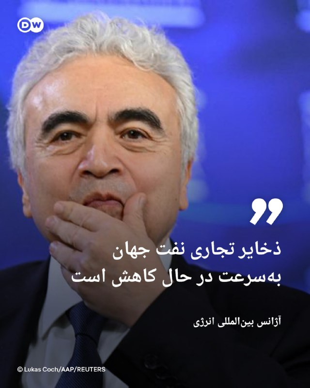

🔶 آژانس بین‌المللی انرژی: ذخایر تجاری نفت جهان به‌سرعت در حال کاهش است

آژانس بین‌المللی انرژی اعلام کرد که با ادامه اختلال در صادرات نفت خلیج فارس بر اثر جنگ خاورمیانه، ذخایر تجاری نفت جهان "بسیار سریع" در حال کاهش است؛ این روند حتی با وجود آزادسازی ذخایر راهبردی توسط دولت‌ها ادامه دارد.

فاتح بیرول، مدیر آژانس، روز دوشنبه، ۱۸ مه (۲۸ اردیبهشت) در حاشیه نشست وزیران دارایی گروه هفت در پاریس گفت: «ذخایر تجاری (انرژی) در حال کاهش‌اند… و به‌نظر من اکنون با سرعت زیادی تخلیه می‌شوند.»
او هشدار داد که اگرچه هنوز چند هفته زمان باقی مانده، اما این ذخایر "بی‌پایان نیستند".

نگرانی‌ها درباره کمبود انرژی هم‌زمان با نزدیک شدن فصل سفرهای تابستانی در نیمکره شمالی افزایش یافته است. شرکت‌های هواپیمایی هشدار داده‌اند که در صورت ادامه اختلالات، ممکن است طی چند هفته با کمبود سوخت جت روبه‌رو شوند.

پس از حملات آمریکا و اسرائیل به ایران در اواخر فوریه، ایران عملاً عبور نفتکش‌ها از تنگه هرمز را متوقف کرده؛ اقدامی که باعث اختلال شدید در انتقال نفت و گاز و جهش قیمت‌ها شده است.

@dw_farsi

## DW_Farsi — post 124825

  <a href="telegram/content/DW_Farsi_124825_1779113214.mp4" target="_blank">🎬 Download video</a>

🎥 خاویر باردم در کن؛ حمله به ترامپ، پوتین و نتانیاهو

خاویر باردم، بازیگر برنده اسکار، که در جشنواره فیلم کن جضور دارد، در سخنانی دونالد ترامپ، ولادیمیر پوتین و بنیامین نتانیاهو را به "رفتار مردانه سمی" متهم کرد. آسوشیتدپرس می‌نویسد باردم این رفتار را عامل جنگ‌های کنونی در ایران، غزه و اوکراین دانسته است.

باردم این سخنان را در نشست خبری فیلم "El Ser Quierdo" که نامزد دریافت نخل طلای جشنواره کن شده، بیان کرده است.

@dw_farsi

## DW_Farsi — post 124824

  

🔶 ترخیص نرگس محمدی از بیمارستان و تداوم نگرانی‌ها نسبت به وضعیت فاطمه سپهری

بنیاد نرگس محمدی روز دوشنبه ۲۸ اردیبهشت (۱۸ مه) اعلام کرد این فعال سیاسی پس از ۱۶ روز، از بیمارستان مرخص شد.

نرگس محمدی از ۱۱ تا ۲۰ اردیبهشت در بیمارستان زنجان و از ۲۰ تا ۲۷ اردیبهشت در بخش مراقبت‌های ویژه در بیمارستان پارس در تهران بستری بود و به گفته این بنیاد "تحت عمل آنژیوپلاستی و آزمایشات مربوط به اختلالات شدید فشار خون از جمله Tilt Test" قرار گرفت.

این فعال سیاسی برنده جایزه نوبل صلح آذرماه سال گذشته در جریان مراسم خاکسپاری خسرو علیکردی، وکیل دادگستری، در مشهد بازداشت و به زندان محکوم شد.

بنیاد نرگس محمدی گفته است که "طبق نظر پزشکان متخصص از جمله قلب و مغز، ضرورت بر تحت نظر و مراقبت‌های درمانی خاص برای او وجود دارد و تا یک ماه حداقل هر‌ روز در بیمارستان تحت فیزیوتراپی قرار خواهد داشت".

@dw_farsi

## DW_Farsi — post 124823

  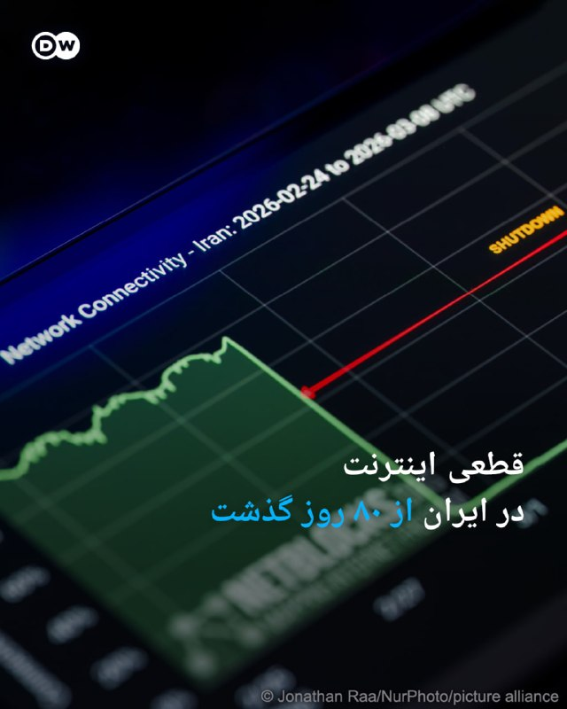

🔶 قطعی اینترنت در ایران از ۸۰ روز گذشت

نت‌بلاکس که در زمینه پایش، تحلیل و مستندسازی وضعیت اینترنت در جهان فعالیت می‌کند، روز دوشنبه ۲۸ اردیبهشت (۱۸ مه) با اشاره به تداوم قطعی سراسری اینترنت در ایران اعلام کرد این اختلال اکنون وارد هشتادمین روز خود شده و از ۱۸۹۶ ساعت فراتر رفته است.

نت بلاکس با اشاره به فعالیت قابل توجه کاربران و فعالان رسانه‌ای نزدیک به حکومت با استفاده از اینترنت موسوم به "سفید" در شبکه‌های اجتماعی، خاطرنشان ساخت محتوای تولید شده توسط این افراد در حمایت از جمهوری اسلامی شبکه‌های اجتماعی را "اشباع" کرده است.

در پیام نت بلاکس که در شبکه ایکس منتشر شده، آمده است: «ایرانیانی که به‌دنبال دریافت دسترسی ویژه یا دسترسی فهرست سفید هستند، می‌گویند از آن‌ها خواسته می‌شود سهمیه‌ای از پست‌های روزانه تبلیغاتی را منتشر کنند که این روند با استفاده از هوش مصنوعی پایش می‌شود.»

@dw_farsi

## DW_Farsi — post 124822

  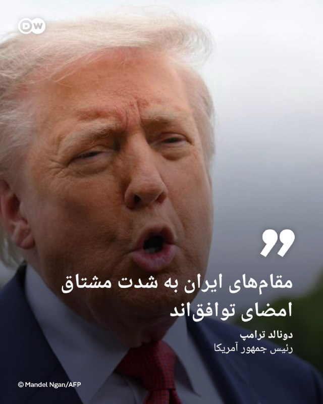

🔶 ترامپ: مقام‌های ایران به شدت مشتاق امضای توافق‌اند

دونالد ترامپ در گفت‌وگویی مفصل با مجله "فورچون" که روز دوشنبه ۲۸ اردیبهشت منتشر شد، گفت که مقام‌های جمهوری اسلامی به شدت به دنبال امضای یک توافق با آمریکا هستند، اما بعد از اینکه توافق می‌کنند، سندی را می‌فرستند که "هیچ ربطی با توافق ندارد".

رئیس جمهور آمریکا در این مصاحبه درباره ایرانی‌ها گفت: «آنها مدام فریاد می‌زنند.»

ترامپ افزود: «یک چیز را می‌توانم به شما بگویم، آن‌ها به‌شدت مشتاق امضای توافق هستند. اما یک توافق می‌کنند و بعد سندی برایتان می‌فرستند که هیچ ارتباطی با توافقی که کرده‌اید ندارد. من می‌گویم: شماها دیوانه‌اید؟»

ترامپ بارها در گفت‌وگو با رسانه‌ها و خبرنگاران در کاخ سفید اظهار داشته است که جمهوری اسلامی "مشتاق توافق" است. او تهدید کرده است چنانچه رهبران ایران با آمریکا به توافق نرسند، ایالات متحده حملات شدیدتری را علیه این کشور انجام خواهد داد.

او روز یکشنبه با انتشار پیامی در شبکه تروث سوشال هشدار داده بود که زمان برای ایران "در حال پایان است و آن‌ها بهتر است خیلی سریع اقدام کنند وگرنه چیزی ازشان باقی نخواهد ماند".

@dw_farsi

## Persian_Trend_Official — post 14414

  <a href="telegram/content/Persian_Trend_Official_14414_1779113217.webm" target="_blank">🎬 Download video</a>

⭕️بازسازی زیرساخت‌های آسیب‌دیده پارس جنوبی در ۲ سال

سخنگوی کمیسیون انرژی مجلس:
💢برای بازسازی و نوسازی زیرساخت‌های پالایشگاهی و پتروشیمی منطقه پارس جنوبی با تکیه بر دانش بومی برنامه‌ریزی شده است.

💢این مراکز با طراحی و فناوری‌های جدید و با ظرفیتی بیش از قبل، به مدار تولید بازخواهند گشت.

💢پیش‌بینی می‌شود حدود ۵۰ درصد از بازسازی‌ها تا پیش از آغاز فصل سرد سال به سرانجام برسد.

💢کل فرآیند آواربرداری، بازسازی و نوسازی زیرساخت‌ها در مدت حداکثر ۲ سال تکمیل شود.

🫆:Tony

📌 @persian_trend_official
پرشین ترند | متفاوت‌ترین کانال نظامی

## Persian_Trend_Official — post 14413

  <a href="telegram/content/Persian_Trend_Official_14413_1779113218.webm" target="_blank">🎬 Download video</a>

⭕️ وضعیت کم سابقه‌ی آسمان منطقه، از نظر خلوت بودن. (در عکس اول فقط پرواز های نظامی آمریکا و در عکس دوم تمام پرواز های نظامی) 📝 Nick 📌 @persian_trend_official پرشین ترند | متفاوت‌ترین کانال نظامی

## Persian_Trend_Official — post 14410

⭕️ وضعیت کم سابقه‌ی آسمان منطقه، از نظر خلوت بودن.

(در عکس اول فقط پرواز های نظامی آمریکا
و در عکس دوم تمام پرواز های نظامی)

📝 Nick

📌 @persian_trend_official
پرشین ترند | متفاوت‌ترین کانال نظامی

## Persian_Trend_Official — post 14409

  <a href="telegram/content/Persian_Trend_Official_14409_1779113218.webm" target="_blank">🎬 Download video</a>

📰
🇸🇦
🇵🇰طبق گزارش رویترز، پاکستان در چارچوب «توافق دفاع مشترک» با عربستان:

🔢حدود ۸ هزار نیروی نظامی،

🔢یک اسکادران جنگنده عمدتاً از نوع JF-17،

🔢دو اسکادران پهپادی

🔢 سامانه پدافند هوایی HQ-9 ساخت چین
را در خاک عربستان مستقر کرده است.

❎بر اساس این گزارش، این اقدام با هدف تقویت همکاری‌های دفاعی و امنیتی میان اسلام‌آباد و ریاض انجام شده است.
❎

☆Phantom☆

📌 @persian_trend_official
پرشین ترند | متفاوت‌ترین کانال نظامی

## Persian_Trend_Official — post 14408

  

ایران سامانه «هرمز سیف» را برای ثبت‌نام کشتی‌های عبوری از تنگه هرمز راه‌اندازی کرد

جمهوری اسلامی ایران سامانه‌ای تحت عنوان «هرمز سیف» را با هدف ارائه خدمات به کشتی‌های عبوری از تنگه هرمز راه‌اندازی کرده است. بر اساس این طرح، ناخدایان و شرکت‌های کشتیرانی می‌توانند از طریق این سامانه درخواست خدمات مختلف از جمله بیمه، کترینگ، خدمات اضطراری و همراهی اسکورت نظامی را ثبت کنند.جالبه که اسکورت نظامی رو هم جزو «خدمات» گذاشتن، کنارِ کترینگ! 😂

با این حال، این سامانه با یک چالش فنی قابل توجه مواجه است؛ وب‌سایت مذکور از خارج از ایران قابل دسترسی نیست و کاربران خارجی برای ثبت‌نام ملزم به استفاده از اینترنت ایرانی هستند.

آدرس سامانه: hormuzsafe.ir

☆Phantom☆

📌 @persian_trend_official
پرشین ترند | متفاوت‌ترین کانال نظامی

## Persian_Trend_Official — post 14407

  <a href="telegram/content/Persian_Trend_Official_14407_1779113219.webm" target="_blank">🎬 Download video</a>

⭕️ تسنیم: ایران متن جدید ۱۴ بندی به آمریکا ارائه کرد

💢خبرگزاری تسنیم به نقل از یک منبع نزدیک به تیم مذاکره‌کننده گزارش داد تهران از طریق میانجی پاکستانی، متن جدیدی شامل ۱۴ بند به طرف آمریکایی تحویل داده است.

▪️پیش تر اخباری از منابع پاکستانی نسبت به ارسال پیشنهاد جدید جمهوری اسلامی به آمریکا توسط این کشور منتشر شده بود.

🫆:Tony

📌 @persian_trend_official
پرشین ترند | متفاوت‌ترین کانال نظامی

## Persian_Trend_Official — post 14406

  

🕊
👨‍🦲 سفر پوتین به چین تنها ۴ روز پس از حضور ترامپ

🔹رئیس‌جمهور چین کمتر از یک هفته پس از سفر رئیس‌جمهور آمریکا به پکن، اکنون برای میزبانی همتای روس خود آماده می‌شود.

🔹دیدارهای روسای جمهور آمریکا و روسیه نشان می‌دهد که پکن «به سرعت در حال ظهور به عنوان نقطه کانونی دیپلماسی جهانی» است.

🔹تجارت دوجانبه چین و روسیه از سال ۲۰۲۲ بعد از جنگ اوکراین به بالاترین سطح خود رسیده است، به طوری که چین بیش از یک‌چهارم صادرات روسیه را خریداری می‌کند.

☆Phantom☆

📌 @persian_trend_official
پرشین ترند | متفاوت‌ترین کانال نظامی

## RadioFarda — post 157312

  

🔸 نت بلاکس، که وضعیت اینترنت را در جهان رصد می‌کند، روز دوشنبه ۲۸ اردیبهشت خبر داد که قطع اینترنت در ایران وارد هشتادمین روز خود شد و این خاموشی از ۱۸۹۶ ساعت گذشته است.

🔸 این شبکه در حساب کاربری خود در ایکس نوشت که در همین حال، شبکه‌های اجتماعی پر از محتواهای حامی حکومت است و ایرانیانی که به‌دنبال دریافت اینترنت پرو هستند می‌گویند از آن‌ها خواسته می‌شود سهمیه‌ای از پست‌های تبلیغاتی روزانه را منتشر کنند که توسط هوش مصنوعی نظارت می‌شود.

🔸 اینترنت در ایران، به‌رغم سانسور و اعمال فیلترینگ گسترده، از ۹ اسفند پارسال همزمان با شروع جنگ آمریکا و اسرائیل با ایران و به بهانهٔ آن، به‌طور کامل قطع شده است.

🔸 در این مدت، شمار قابل‌توجهی از فعالان رسانه‌ای نزدیک به حکومت با استفاده از اینترنت موسوم به «سفید» در شبکه‌های اجتماعی از عملکرد جمهوری اسلامی حمایت کرده‌اند.

🔸 همزمان، در هفته‌های اخیر برخی اپراتورها اقدام به تبلیغ و فروش اینترنت موسوم به «طبقاتی» یا «پرو» کرده‌اند؛ اینترنتی که با عنوان ویژهٔ «کسب‌وکارها» و با هزینه‌ای بسیار بالا عرضه می‌شود.

@RadioFarda

## RadioFarda — post 157311

  <a href="https://t.me/radiofarda/157311" target="_blank">📎 Download file</a>

📻بشنوید: ساعت ۱۴ با رادیوفردا، ۲۸ اردیبهشت ۱۴۰۵‌

@Radiofarda

## RadioFarda — post 157310

  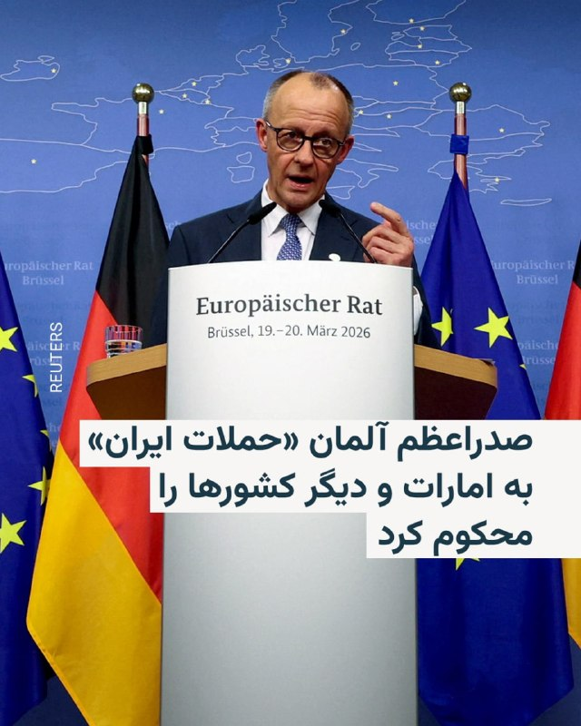

🔸صدراعظم آلمان آنچه که «از سرگیری حملات ایران» به امارات متحده عربی و دیگر شرکا خواند، را «قویاً» محکوم کرد و گفت تهران باید تهدید همسایگان خود را متوقف کرده و تنگه هرمز را بدون محدودیت باز نگه دارد.

🔸فردریش مرتس روز دوشنبه ۲۸ اردیبهشت در پیامی در شبکه ایکس نوشت: «حملات به تأسیسات هسته‌ای تهدیدی برای امنیت مردم در سراسر منطقه است. نباید هیچ‌گونه تشدید بیشتری در خشونت رخ دهد».

🔸او همچنین گفت که ایران باید وارد مذاکرات جدی با ایالات متحده شود.

🔸مقام‌های امارات روز یکشنبه اعلام کردند که یک حمله پهپادی باعث آتش‌سوزی در یک نیروگاه هسته‌ای این کشور شده است.

@RadioFarda

## RadioFarda — post 157309

  

🔸رئیس کل دادگستری آذربایجان غربی روز دوشنبه ۲۸ اردیبهشت از توقیف اموال ۱۲۹ نفر در این استان با اتهامات امنیتی خبر داد.

🔸ناصر عتباتی از این افراد با عنوان «گروهک‌های ضدانقلاب و تجزیه‌طلب» نام برد و آن‌ها را به «اقدامات ضدامنیتی و همکاری با کشورهای متخاصم» متهم و اعلام کرد که اموال آن‌ها به «نفع ملت» مصادره شده است.

🔸دادگستری آذربایجان غربی اسامی این افراد را اعلام نکرده و برای اتهامات علیه این افراد شواهد و مدارکی ارائه نداده است.

🔸پیش از این نیز گزارش‌های متعددی از توقیف اموال شماری از روزنامه‌نگاران، فعالان سیاسی و مدنی، هنرمندان، ورزشکاران و چهره‌های شناخته‌شده با اتهامات مشابه منتشر شده بود.

@RadioFarda

## RadioFarda — post 157308

پاراگراف اول؛ آیا کارزارهای تحریمی، تیم ملی فوتبال را به سمت حکومت هل داد؟

🔸«اجازه دادن به تیم رژیم ایران برای شرکت در جام جهانی یک فاجعه اخلاقی است»؛ این را یک ایرانی طرفدارِ دوآتشه فوتبال در یادداشتی برای هفته‌نامه بریتانیایی «اسپکتیتور» نوشته است.

🔸نام او آتبین معیدی است و در متن خود تأکید می‌کند که از طرفداران دو آتشه سردار آزمون و مهدی طارمی است؛ زوجی در خط حمله تیم ملی ایران که این هوادار فوتبال برای توصیف عملکردشان از تعبیر تله‌پاتیک (دورآگاهانه) استفاده می‌کند.

🔸با این حال، او اصرار دارد که مخالفتش با حضور تیم ملی فوتبال ایران در جام جهانی صرفاً سلیقه شخصی‌اش نیست و آن را «خواستی عمومی» معرفی می‌کند؛ به‌گونه‌ای که می‌نویسد، مسئله برای «ایرانیان» نه یک بحث سیاسی، بلکه مسئله‌ای درباره حقوق بشر و عدالت است.

🔸در ذهنیت او، سردار آزمون یک ترکمن ایرانیِ خونسرد، بی‌تکلف و دوست‌داشتنی است که در سال‌های اخیر علیه رژیم صحبت کرده است؛ و در مقابل، مهدی طارمی چهره‌ای آرام و کم‌حرف که در نگاه او حامی رژیم و ایدئولوژی آن بوده است. هرچند این هوادار فوتبال در ادامه می‌نویسد نشانه‌هایی وجود دارد که ستاره پیشین اینترمیلان موضع خود را تغییر داده است.

🔸این هوادار فوتبال، تابستان امسال به دیدار خانواده‌اش در لس‌آنجلس می‌رود؛ شهری که میزبان دو بازی ایران در جام جهانی است.

🔸نسخه کامل این گزارش را در وب‌سایت رادیوفردا بخوانید.

@RadioFarda

## IranianMinds — post 20339

🔴سناتور لیندسی گراهام:

من کاملأ اطمینان دارم که رئیس جمهور ترامپ به طور کامل، وضعیت مربوط به ایران را درک می‌کنه و دیگه عدم تمایل به مذاکره با حسن‌نیت، همراه با اقدامات تهاجمی و سرکشانه ایران در تنگه هرمز و سراسر منطقه را تحمل نخواهد کرد.

@IranianMinds

## IranianMinds — post 20336

  <a href="telegram/content/IranianMinds_20336_1779113222.mp4" target="_blank">🎬 Download video</a>

🔴 اسرائیل‌ همچنان داره لبنان رو‌ شخم میزنه

@IranianMinds

## IranianMinds — post 20335

  

🔴 نیویورک تایمز:

آمریکا و اسرائیل در حال انجام شدیدترین آمادگی‌های خود از زمان آغاز آتش‌بس هستند، چرا که احتمال حملات مجدد به ایران حتی از همین هفته وجود دارد.

پنتاگون نیز خود را برای از سرگیری احتمالی «عملیات خشم‌ حماسی» آماده میکند.

@IranianMinds

## IranianMinds — post 20334

  <a href="telegram/content/IranianMinds_20334_1779113224.mp4" target="_blank">🎬 Download video</a>

🔴ناو‌شکن با صلابت و سرافراز به صورت عمودی غرق شد.
یادآوری😂😂😂

@IranianMinds

## IranianMinds — post 20333

  

🔴 ارتش اسرائیل :

امروز‌ فرمانده جهاد اسلامی فلسطین رو از بین بردیم.

@IranianMinds

## IranianMinds — post 20332

  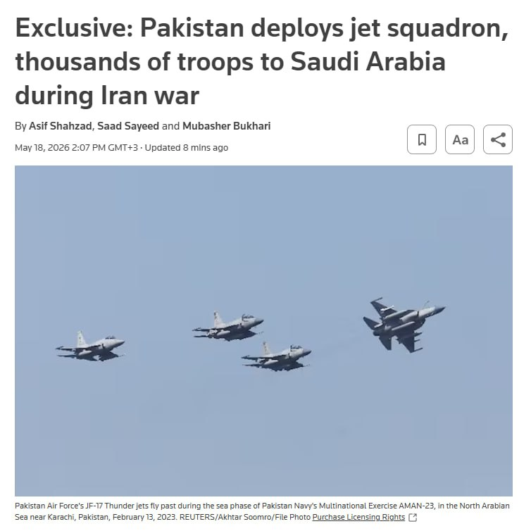

🔴 رویترز :

پاکستان در جریان جنگ ایران، طبق یک توافق پنهان دفاعی، ۸۰۰۰ نیرو، جنگنده، پهپاد و سیستم‌های دفاع هوایی به عربستان فرستاده است.

این نیروها شامل جنگنده‌های JF-17، سیستم‌های چینی HQ-9 و تجهیزات تحت عملیات پاکستان است که توسط ریاض تأمین مالی شده‌اند.

این استقرار آماده عملیات رزمی است و در صورت نیاز می‌تواند تا ۸۰,۰۰۰ نیرو گسترش یابد.

@IranianMinds

## IranianMinds — post 20331

🔴 خبرگزاری فوق معتبر تسنیم:

گفته میشه تو پیش‌نویس تازه مذاکرات، آمریکا موافقت کرده موقتا تحریم‌های نفتی ایران رو در طول مذاکرات برداره.

ایران می‌خواد همه تحریم‌ها کامل برداشته بشه، اما آمریکا فعلا فقط پیشنهاد معافیت موقت از تحریم‌های OFAC رو تا رسیدن به توافق نهایی داده

@IranianMinds

## IranianMinds — post 20330

  

🔴 بعضی جوونا و‌ نوجوونا تو‌ این کشور یه خوشی داشتن اونم میخوان ازشون بگیرن

معاون نظارت بنیاد ملی بازی های رایانه جمهوری اسلامی اعلام کرد که قراره یه «گیم سنتر مرکزی» بسازن که همه سایت‌های دانلود بازی، لینک‌هاشون رو از اون رد کنن تا قبل از انتشار بازی‌ها رو چک کنن که با قوانین اسلامی سازگار باشه و روی نوجوونا تاثیری نداشته باشه !

@IranianMinds

## IranianMinds — post 20329

  

🔴نت‌بلاکس دوشنبه ۲۸ اردیبهشت اعلام کرد هشتادمین روز از قطع اینترنت در ایران است و مدتش به ۱۸۹۶ ساعت رسیده است.

بر اساس گزارش این نهاد ناظر بر اینترنت جهانی، همزمان با تداوم این وضعیت، محتوای حامی حکومت، شبکه‌های اجتماعی را پر کرده است.
این نهاد همچنین اعلام کرد برخی از ایرانیانی که برای دریافت اینترنت«پرو» یا دسترسی سیم‌کارت سفید اقدام کرده‌اند می‌گویند از آن‌ها خواسته می‌شود سهمیه‌ایی از پست‌های تبلیغاتی روزانه منتشر کنند.
نت‌بلاکس افزود: این فعالیت‌ها با استفاده از هوش مصنوعی نظارت می‌شود.

@IranianMinds

## IranianMinds — post 20328

در حالی که‌ مردم دنیا هیجان دارن واسه جام جهانی و‌ منتظرن شروع شه

ما ایرانیا دغدغمون اینه که کی بزنن و‌ دوباره جنگ شه که شاید از دست این آخوندا زودتر نجات پیدا کردیم :)

یعنی خورشید یه روزی تو‌این سرزمین هم طلوع میکنه دوباره؟

@IranianMinds

## IranianMinds — post 20327

  <a href="telegram/content/IranianMinds_20327_1779113227.mp4" target="_blank">🎬 Download video</a>

🔴 اکانت اسرائیل به فارسی:

هرچه بیشتر به سقوط نزدیک می‌شوند، اسلحه‌ها بزرگ‌تر می‌شوند.

@IranianMinds

## BBCPersian — post 281380

  <a href="telegram/content/BBCPersian_281380_1779113229.mp4" target="_blank">🎬 Download video</a>

🔻سرخط خبرهای دوشنبه ۲۸ اردیبهشت ۱۴۰۵
@BBCPersian

## BBCPersian — post 281379

🔻آژانس بین‌المللی انرژی در مورد کاهش سریع ذخایر تجاری نفت در جهان هشدار داد. فاتح بیرول، رئیس آژانس بین‌المللی انرژی، گفت که علی‌رغم آزاد شدن بخشی از ذخایر نفت استراتژیک دولت‌ها در سراسر جهان، ذخایر تجاری به‌دلیل اختلال در عرضه نفت در خلیج فارس، «بسیار سریع»…

## BBCPersian — post 281378

  

🔻آژانس بین‌المللی انرژی در مورد کاهش سریع ذخایر تجاری نفت در جهان هشدار داد.

فاتح بیرول، رئیس آژانس بین‌المللی انرژی، گفت که علی‌رغم آزاد شدن بخشی از ذخایر نفت استراتژیک دولت‌ها در سراسر جهان، ذخایر تجاری به‌دلیل اختلال در عرضه نفت در خلیج فارس، «بسیار سریع» در حال کاهش است.

با نزدیک شدن به فصل سفرهای تابستانی در نیمکره شمالی، نگرانی‌ درباره کمبود سوخت افزایش یافته است.

خطوط هوایی هشدار داده‌اند که در صورت تداوم اختلالات عرضه، در هفته‌های آینده با کمبود سوخت جت مواجه خواهند شد.

آقای بیرول هنگام ورود به نشست وزرای دارایی گروه هفت (جی-۷) در پاریس به خبرنگاران گفت: «موجودی‌های تجاری در حال کاهش است... فکر می‌کنم اکنون خیلی سریع در حال اتمام است.»

او گفت: «ما هنوز چند هفته فرصت داریم، اما باید از این واقعیت آگاه باشیم که ذخایر به‌سرعت در حال کاهش است.»

📷 AFP via Getty Images
https://bbc.in/4tJk5LV
@BBCPersian

## BBCPersian — post 281377

🔻فلج شدن حمل‌و‌نقل در کنیا، در پی اعتصاب به دلیل گرانی سوخت
اعتصاب کارکنان شبکه حمل‌و‌نقل کنیا در اعتراض به افزایش اخیر قیمت سوخت، باعث سرگردانی هزاران مسافر در این کشور شده است.

با ادامه بحران تنگه هرمز و گران شدن نفت، قیمت بنزین اخیرا در کنیا بیش از ۲۰ درصد افزایش یافته است.

اعتصاب امروز باعث خالی شدن خیابان‌های منتهی به نایروبی، پایتخت، شده و بسیاری از مردم ناچار شده‌‌اند با پای پیاده سر کار بروند؛ برخی از مغازه‌ها و کسبه هم کار خود را تعطیل کرده‌اند و مدارس از دانش‌آموزان خواسته‌اند که در خانه بمانند.

کنیا هم مانند بسیاری از کشورهای آفریقایی دیگر برای تامین سوخت خود به شدت به واردات از خلیج فارس وابسته است. اما جنگ آمریکا و اسرائیل با ایران و محدود شدن رفت‌و‌آمد در تنگه هرمز، این کشورها را با چالش مواجه کرده است.

https://bbc.in/4dOLHua
@BBCPersian

## BBCPersian — post 281376

🔻گزارش سالانه عفو بین‌الملل نشان می‌دهد که اعدام در سال ۲۰۲۵ به رقم بی‌سابقه‌ای رسیده است. بنابر این گزارش، این سازمان در سال گذشته میلادی ۲۷۷۰ مورد اعدام در ۱۷ کشور را ثبت کرده است که بالاترین رقم از سال ۱۹۸۱ است که عفو بین‌الملل ثبت آمار اعدام را آغاز کرد.…

## BBCPersian — post 281375

  

🔻گزارش سالانه عفو بین‌الملل نشان می‌دهد که اعدام در سال ۲۰۲۵ به رقم بی‌سابقه‌ای رسیده است.

بنابر این گزارش، این سازمان در سال گذشته میلادی ۲۷۷۰ مورد اعدام در ۱۷ کشور را ثبت کرده است که بالاترین رقم از سال ۱۹۸۱ است که عفو بین‌الملل ثبت آمار اعدام را آغاز کرد.

بنا بر آخرین گزارش عفو بین‌الملل، این افزایش چشمگیر به‌دلیل چند دولتی بوده است که می‌خواهند «از طریق ارعاب» حکومت کنند: «مقام‌های ایران عامل اصلی این جهش بودند که دست‌کم ۲۱۵۹ نفر را اعدام کردند، بیش از دو برابر آمار سال ۲۰۲۴.»

گزارش عفو بین‌الملل به چند کشور دیگر هم می‌پردازد: «عربستان سعودی شمار اعدام‌ را به دست‌کم ۳۵۶ مورد رساند، از مجازات اعدام برای جرایم مرتبط با مواد مخدر استفاده فراوانی کرد. تعداد اعدام‌ها در کویت تقریبا سه برابر شد (از ۶ به ۱۷)، و تقریبا دو برابر در مصر (از ۱۳ به ۲۳)، سنگاپور (از ۹ به ۱۷) و ایالات متحده آمریکا (از ۲۵ به ۴۷).

ادامه خبر را از لینک زیر در وبسایت بی‌بی‌سی فارسی بخوانید.

📷 NurPhoto via Getty Images
https://bbc.in/4ulEtDY
@BBCPersian

## BBCPersian — post 281374

  

🔻دیوان عالی اسپانیا حکم کرد که سازمان‌های مالیاتی حدود ۷۰ میلیون دلار به شکیرا، ستاره موسیقی پاپ، غرامت بپردازند. پرونده‌ شکایت این خواننده از هشت سال پیش در جریان بود.

شکیرا از این رای استقبال کرد و گفت که دادگاه به «سال‌ها تلاش هماهنگ برای نابودی شهرتش» پایان داد.

شکیرا این پیروزی را به «شهروندان عادی» تقدیم کرد که از «موارد مشابه» رنج دیده‌اند.

دیوان عالی نتیجه گرفت این هنرمند اهل کلمبیا در سال مالی ۲۰۱۱ ساکن اسپانیا نبوده، بنابراین به اشتباه به پرداخت میلیون‌ها دلار مالیات بر درآمد در آن سال ملزم شده بود.

دستور دادگاه اسپانیا شامل پرداخت کامل مبلغ به‌علاوه سود به شکیرا است.

📷 Getty Images
@BBCPersian

## BBCPersian — post 281373

  

🔻فردریش مرتس گفت که «ما حملات هوایی تازه ایران به امارات و دیگر شرکا را به‌شدت محکوم می‌کنیم.»

صدر‌اعظم آلمان در شبکه اجتماعی ایکس، حمله به «تاسیسات هسته‌ای» را تهدیدی برای ایمنی مردم سراسر منطقه خواند.

امارات متحده دیروز گفت که در حمله پهپادی، ژانراتور برق بیرون محوطه نیروگاه هسته‌ای براکه در نزدیکی ابوظبی آتش گرفته است. امارات در بیانیه‌هایش نامی از کشوری نبرد و فقط گفت پهپاد از «مرز غربی» وارد شده بود.

آقای مرتس در این پست نوشت که «ایران باید وارد مذاکره جدی با آمریکا شود، از تهدید همسایگان خود دست بردارد و تنگه هرمز را بدون هیچ محدودیتی مجددا باز کند.»

اظهارات آقای مرتس درباره مذاکرات ایران و آمریکا اخیرا به تنش لفظی او با دونالد ترامپ منجر شد. او گفته بود مذاکره‌کنندگان ایران آمریکا را «تحقیر» کرده‌اند.

📷Getty Images
https://bbc.in/42ChAjs
@BBCPersian

## BBCPersian — post 281372

🔻سازمان غذا و داروی ایران: تأمین مواد اولیه و واردات دارو دچار اختلال شده است
سخنگوی سازمان غذا و داروی ایران می‌گوید که تأمین مواد اولیه و واردات دارو در ایران دچار اختلال شده است.

محمد هاشمی به خبرگزاری کار ایران، ایلنا، گفت که برای شناسایی و مدیریت به‌موقع هرگونه کمبود در بازار، سامانه‌ای فعال شده است که موجودی انبارها و خطوط تولید را به‌طور لحظه‌ای زیر نظر دارد.

آقای هاشمی افزود: «اولویت‌بندی واردات بر اساس ضرورت درمانی داروها در دستور کار قرار گرفته و نهاده‌های مربوط به داروهای حیاتی، مزمن و خاص در صدر فهرست تخصیص ارز و ترخیص قرار دارند.»

هدف قرار گرفتن برخی موسسات مرتبط با تولید دارو در حملات آمریکا و اسرائیل و همچنین محدود شدن واردات به دلیل اختلال در تنگه هرمز و مسیرهای هوایی، به کمبود دارو در ایران دامن زده است.

علاوه بر اینها، تخصیص ارز به واردات دارو هم کاهش یافته است.

پیشتر سخنگو و عضو هیات‌مدیره انجمن داروسازان ایران گفته بود: «محدود شدن منابع ارزی دولت به معنی کاهش امکان اختصاص یارانه به تولید و عرضه دارو است که منجر به افزایش قیمت بین ۳۰ تا ۳۰۰ درصدی قیمت دارو شده است.»

روزنامه اعتماد هفته پیش در گزارشی گفت که مصرف‌کنندگان داروهای خاص‌، با چالش بزرگی روبرو شده‌اند.

روایت‌های بیماران از نبود کیت آزمایش، کمیابی انسولین، افزایش چندبرابری قیمت داروهای حیاتی و توقف واردات برخی داروهای سرطان، از بحرانی حکایت دارد که مستقیما با جان انسان‌ها گره خورده است.

https://bbc.in/4uUCoPk
@BBCPersian

## idfinfarsi — post 11595

  <a href="telegram/content/idfinfarsi_11595_1779113232.mp4" target="_blank">🎬 Download video</a>

‼️مستند از انهدام انبار سلاح‌های ضدزره سازمان تروریستی حزب‌الله: نیروهای تیپ ۷۶۹ زیرساخت‌های تروریستی را منهدم کرده و تسلیحات را کشف کردند

⭕️نیروهای تیپ ۷۶۹ تحت فرماندهی لشکر ۹۱، به عملیات خود در جنوب خط دفاعی مقدم با هدف رفع تهدیدها علیه شهروندان کشور اسرائیل ادامه می‌دهند.

⭕️این نیروها با پشتیبانی نیروی هوایی، در یک واکنش عملیاتی سریع، یک انبار سلاح‌های ضدزره را که توسط سازمان تروریستی حزب‌الله علیه نیروهای فعال در منطقه مورد استفاده قرار می‌گرفت، منهدم کردند.

⭕️در یک عملیات دیگر در منطقه روستای الخیام، نیروها انبارهای تسلیحاتی و مراکز استقرار سازمان تروریستی حزب‌الله را منهدم کرده و مقادیری سلاح از جمله پرتابگرهای ضدزره، مواد منفجره و سلاح‌های سبک را کشف کردند.

## idfinfarsi — post 11594

  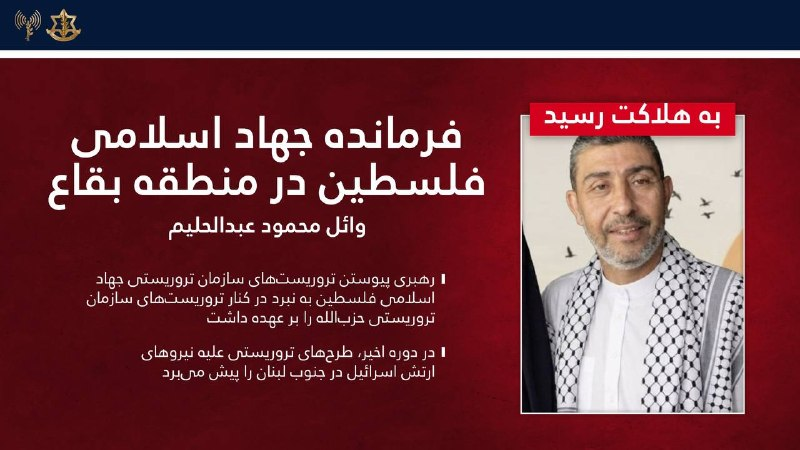

❌در یک حمله دقیق در بعلبک: ارتش اسرائیل فرمانده جهاد اسلامی فلسطین در منطقه بقاع لبنان را به هلاکت رساند

‼️ارتش اسرائیل در‌طول شب (یکشنبه) در منطقه بعلبک حمله کرده و وائل محمود عبدالحلیم، فرمانده جهاد اسلامی فلسطین در منطقه بقاع لبنان را به هلاکت رساند.

⭕️عبدالحلیم رهبری پیوستن تروریست‌های سازمان تروریستی جهاد اسلامی فلسطین به نبرد در کنار تروریست‌های سازمان تروریستی حزب‌الله در لبنان را بر عهده داشت و در دوره اخیر برای پیشبرد طرح‌های تروریستی علیه نیروهای ارتش اسرائیل فعالیت می‌کرد.

## Dirty_Kids — post 389679

  <a href="telegram/content/Dirty_Kids_389679_1779113234.mp4" target="_blank">🎬 Download video</a>

توقعی که از ایرانیای امریکا دارم

این تیم بی‌غیرتان سپاه رو اینجوری ادب نکنید و براشون جهنم نسازید، خیلی ازتون ناامید میشم

@Dirty_Kids 👻

## Dirty_Kids — post 389678

  <a href="telegram/content/Dirty_Kids_389678_1779113236.mp4" target="_blank">🎬 Download video</a>

یه فمبویِ مشهدی رفته حرم؛

اونجا هرکی از راه می‌رسه میگه شما چرا چادر نداری؟ اینم میگه بابا بخدا من پسرم...

@Dirty_Kids 👻

## Dirty_Kids — post 389677

  <a href="telegram/content/Dirty_Kids_389677_1779113237.mp4" target="_blank">🎬 Download video</a>

این خبرو این وسط خوندم خیلی خندیدم گفتم شماهم ببینید روحیه‌تون عوض شه:
تو ترکیه یه دستگاه گذاشتن به گربه ها غذا میده اتوماتیک با صدای میو کردن گربه؛ بعد این مرغ دریاییای پدرسوخته یادگرفتن میرن جلوش میو میو میکنن غذا بگیرن :)))

@Dirty_Kids 👻

## Dirty_Kids — post 389675

جورجینا (زن رونالدو) بلوند کرده

@Dirty_Kids 👻

## Dirty_Kids — post 389674

  <a href="telegram/content/Dirty_Kids_389674_1779113238.mp4" target="_blank">🎬 Download video</a>

نه داداش ببین...

@Dirty_Kids 👻

## Dirty_Kids — post 389673

  

از راست به چپ به ترتیب:
گلشیفته، نرگس محمدی، مصی علینژاد و لیلی بازرگان اگه رضاشاهِ اول نبود.

@Dirty_Kids 👻

## Dirty_Kids — post 389672

  

نشریه چپولیستی گاردین رسما اعلام کرده:
"اگه از بوی شاش و عرق حال‌تون به هم می‌خوره، شما راست افراطیِ ترامپ‌یستید" 😭😂
یعنی اینا برای حموم نرفتن و بوی تعفن هم دارن مشروعیت سیاسی صادر می‌کنن!!!!

@Dirty_Kids 👻

## Dirty_Kids — post 389670

  

اینا نه تنها باخت ندارن 😂
حتی یه مورد مساوی هم ندارن
فقط بردددد

@Dirty_Kids 👻

## Dirty_Kids — post 389669

  <a href="https://t.me/Dirty_Kids/389669" target="_blank">📎 Download file</a>

✅ اپلیکیشن اندروید سایت جهانی دربی بت

💰اولین سایت جهانی با امکان شارژ و برداشت ریالی(کارت به کارت)

🔗 برای ورود فیلترشکن روی کشور مناسب قرار دهید مانند فنلاند و المان و....

😀Telegram Channel
👇
https://t.me/+bcynkEgSW2dlYTc0

## Dirty_Kids — post 389668

  

😤دنبال یه سایت شرط بندی بین المللی بودی که به ایرانیا خدمات بده؟!
⛔

👍دربی بت همون انتخاب  100%

💎ویژگی های سایت جهانی Derby Bet:

⬅️امکان شارژ امن با کارت بانکی

⬅️واریز اول دوبل شارژ می شوید(بونوس۱۰۰٪)

⬅️پر اپشن ترین سایت فعال در ایران

⬅️تسویه حساب کمتر از 5 دقیقه

⬅️برگشت بخشی از باخت به صورت هفتگی

🚨کد هدیه ثبت نام:GG007

⚠️برای دانلود اپلکیشن کلیک کنید
👉

🔔کانال دربی بت :

🪙https://t.me/+bcynkEgSW2dlYTc0

## Dirty_Kids — post 389667

نگاهی عمیق‌تر به بیضه‌های بهزاد فراهانی

@Dirty_Kids 👻

## Hranews — post 113015

خبرگزاری هرانا pinned a photo

## Hranews — post 113014

  

میان موشک و سرکوب؛ گزارش مجموعه فعالان حقوق بشر درباره مخاصمه نظامی ایالات متحده-اسرائیل و ایران منتشر شد

💥
💥
💥
💥
💥 – امروز، مجموعه فعالان حقوق بشر در ایران گزارش جدیدی را در ۲۴۰ صفحه و دو زبان منتشر کرد که به بررسی کارزار نظامی ایالات متحده و اسرائیل در ایران در فاصله ۹ اسفند ۱۴۰۴ تا ۱۹ فروردین ۱۴۰۵ (۲۸ فوریه تا ۸ آوریل ۲۰۲۶) می‌پردازد.

این گزارش بر پایه ۱۷۷ منبع تأییدشده ــ شامل گزارش‌های منابع آزاد و شبکه میدانی مجموعه فعالان حقوق بشر در داخل کشور ــ ۶٬۳۲۴ رویداد منحصربه‌فرد شامل ۱۲٬۷۹۸ حمله مجزا را مستندسازی کرده است.
مجموعه فعالان تاکید کرد این گزارش با هدف ارائه روایت جامع از کل درگیری تهیه نشده است. یافته‌های آن صرفاً به رویدادهایی محدود می‌شود که در داده‌های این نهاد مستندسازی و راستی‌آزمایی شده‌اند.

📊 یافته‌های کلیدی گزارش
◾️ ثبت ۶٬۳۲۴ رویداد منحصربه‌فرد و ۱۲٬۷۹۸ حمله مجزا
◾️ ۷۷ درصد رویدادها شامل آسیب به غیرنظامیان یا اماکن غیرنظامی
◾️ ثبت دست‌کم ۳٬۶۳۶ مورد مرگ، از جمله ۱٬۷۰۱ غیرنظامی
◾️ کشته شدن ۳۰۷ کودک و زخمی شدن ۲٬۲۱۳ کودک
◾️ تمرکز ۴۴٫۸۵ درصدی رویدادها در استان تهران
◾️ هدف قرار گرفتن یا آسیب دیدن مدارس، مراکز درمانی، مراکز فرهنگی و زیرساخت‌های حیاتی

⚠️ الگوهای نگران‌کننده
این گزارش چندین الگوی نگران‌کننده را برجسته می‌کند، از جمله:
◾️ ضعف در راستی‌آزمایی اهداف
◾️ استفاده محدود از نظارت انسانی در برخی فناوری‌های هدف‌گیری
◾️ هشدارهای ناکافی پیش از حملات
◾️ استفاده از تسلیحات انفجاری سنگین در مناطق پرجمعیت
◾️ حملات تکراری به برخی مناطق غیرنظامی
◾️ آسیب گسترده به زیرساخت‌های غیرنظامی

🚨 این گزارش همچنین به بازداشت گسترده شهروندان در ایران اشاره دارد؛ دست‌کم ۴٬۰۲۳ نفر با اتهامات مرتبط با امنیت ملی یا جنگ بازداشت شده‌اند.

از سوی دیگر تشدید محدودیت‌های امنیتی، گسترش ایست‌های بازرسی و محدودیت‌های گسترده اینترنت از دیگر پیامدهای مستندسازی‌شده عنوان شده است.

در همین بازه زمانی، ۵۰ مورد اعدام ثبت شده که ۳۲ مورد آن با اتهامات سیاسی و امنیتی مرتبط بوده است.

📎 ادامه گزارش به زبان فارسی

📎 دانلود مستقیم فایل پی دی اف گزارش از تلگرام

📎 Complete report in English

📎Direct download of the English PDF

↘️
@hranews_bot تماس ✉️ - @Hranews کانال هرانا 🆑

## Hranews — post 113013

دستکم ۳۲ نفر با اتهامات امنیتی در چند استان بازداشت شدند

❗️
❗️
❗️
❗️
❗️– سازمان اطلاعات سپاه از #بازداشت دستکم ۳۲ تن در استان‌های قزوین، کرمان و چهارمحال و بختیاری خبر داد. این نهاد، اتهامات مطرح‌ شده علیه این افراد را «جاسوسی، ارتباط با گروه‌های مخالف نظام، اقدامات تروریستی و خرابکارانه» عنوان کرده است.

ادامه مطلب

↘️
@hranews_bot تماس ✉️ -  @Hranews  کانال هرانا 🆑

## Hranews — post 113012

  

مهدی ابطحی، معاون پژوهشی وزیر علوم با اشاره به #قطع_اینترنت در کشور و محدودیت‌های موجود، به ویژه برای دانشجویان مقطع تحصیلات تکمیلی، اعلام کرد که تداوم این وضعیت باعث تنزل جایگاه ایران از جمع ۲۰ کشور برتر در حوزه تولید علم خواهد شد.

↘️
@hranews_bot تماس ✉️ -  @Hranews  کانال هرانا 🆑

## manototv — post 105597

  

ارتش اسرائیل می‌گوید در حمله‌ای هوایی به منطقه بعلبک در شرق لبنان، وائل محمود عبدالحلیم، فرمانده جهاد اسلامی در منطقه بقاع، کشته شده است. به گفته ارتش اسرائیل، او در هماهنگی عملیات‌های جهاد اسلامی در کنار حزب‌الله لبنان نقش داشته است.

## manototv — post 105596

  <a href="telegram/content/manototv_105596_1779113242.mp4" target="_blank">🎬 Download video</a>

رویترز در گزارشی اختصاصی نوشت پاکستان در جریان جنگ ایران، هشت هزار نیرو، یک اسکادران جنگنده و یک سامانه پدافند هوایی به عربستان سعودی اعزام کرده است.

بر اساس این گزارش، این اعزام در چارچوب پیمان دفاعی دوجانبه اسلام‌آباد و ریاض انجام شده و شامل حدود ۱۶ جنگنده، عمدتا از نوع جی‌اف‌ـ۱۷ ساخت مشترک پاکستان و چین، دو اسکادران پهپاد و سامانه پدافند هوایی چینی اچ‌کیو‌ـ۹ است. منابع رویترز گفتند عربستان هزینه این اعزام را تامین می‌کند و تجهیزات را نیروهای پاکستانی اداره می‌کنند.

پنج منبع امنیتی و دولتی به رویترز گفتند این نیروها با هدف حمایت از ارتش عربستان در صورت حملات بیشتر به این کشور مستقر شده‌اند.

## manototv — post 105595

  <a href="telegram/content/manototv_105595_1779113242.mp4" target="_blank">🎬 Download video</a>

رسانه‌های ترکیه گزارش دادند فرخنده قائم‌مقامی، زن ایرانی ساکن منطقه مال‌تپه استانبول، پس از قتل، جسدش در استان قرشهر پیدا شده است.

بر اساس گزارش خبرگزاری «دمیراورن»، خانم قائم‌مقامی از ۲۲ فروردین ناپدید شده بود و نزدیکان او پس از بی‌خبری، در ۲۳ اردیبهشت گزارش مفقودی ثبت کردند.

پلیس ترکیه در تحقیقات خود «ارکان ب»، ۴۹ ساله، را به‌عنوان آخرین فردی شناسایی کرد که با این زن ایرانی در تماس بوده است. بنا بر این گزارش، او ابتدا اتهام‌ها را رد کرد، اما بعدا به قتل اعتراف کرد.

دمیراورن نوشت مظنون در اعترافات خود گفته است پس از مشاجره در خودرو، قائم‌مقامی را با قلاده سگش خفه کرده، جسد او را تکه‌تکه کرده و در زمینی خالی در شهرستان موجور استان قرشهر رها کرده است.

در ادامه تحقیقات، دو مظنون دیگر نیز بازداشت شدند. سه مظنون این پرونده پس از پایان بازجویی در اداره پلیس، به دادگاه منتقل شدند.

## manototv — post 105594

  <a href="telegram/content/manototv_105594_1779113243.mp4" target="_blank">🎬 Download video</a>

بر اساس گزارش رسانه‌های حقوق بشری، نیروهای حکومتی روز ۱۵ اردیبهشت با یورش به خانه «افسانه جذابی (راسخی)»، شهروند بهائی ساکن شیراز، منزل او را تفتیش کردند و بخشی از اموال شخصی او را با خود بردند.

در این گزارش‌ها آمده است یک زن و سه مرد با ارائه حکمی با عنوان «همکاری با اسرائیل» وارد خانه این خانواده شدند و خانم جذابی و مادر ۸۵ ساله او را مورد تهدید و تحقیر قرار دادند. خانم جذابی به‌تازگی همسر خود را از دست داده و از مادر سالخورده و بیمار خود مراقبت می‌کند.

به گفته این رسانه‌ها، ماموران حکومتی به او گفتند فرزندش در خارج از کشور در فضای مجازی و کمپین‌های حقوق بشری فعالیت می‌کند و تهدید کردند در صورت ادامه این فعالیت‌ها، «هم برای شما و هم برای آنها گران تمام می‌شود.» آنها همچنین این خانواده را به مصادره خانه تهدید کردند.

بر اساس این گزارش‌ها، نیروهای امنیتی همچنین این خانواده را با عباراتی مانند «فرقه» و «همدست اسرائیل» خطاب کردند و چند بار خانم جذابی را به دستبند زدن و انتقال به مکانی نامعلوم تهدید کردند.

این یورش چند ساعت ادامه داشت و در پایان، خانم جذابی و مادر سالخورده‌اش که دچار افت فشار خون شده بود، مجبور شدند برگه‌ای را امضا کنند که در آن نوشته شده بود هیچ خسارتی به خانه و وسایل وارد نشده است. در این رویداد هیچ‌یک از اعضای خانواده بازداشت نشدند.

## manototv — post 105593

  <a href="telegram/content/manototv_105593_1779113244.mp4" target="_blank">🎬 Download video</a>

روزنامه ایران وابسته به دولت جمهوری اسلامی در گزارشی نوشت محدودیت دسترسی به اینترنت بین‌الملل، بازار خرید و فروش سیم‌کارت‌های عراقی را در برخی مناطق مرزی غرب ایران رونق داده است.

بر اساس این گزارش، بیشترین متقاضیان این سیم‌کارت‌ها تجار، بازرگانان، صاحبان بار، رانندگان ترانزیتی و فعالان اقتصادی مرزی هستند که برای ارتباط با طرف‌های عراقی، ارسال اسناد، حواله‌های مالی، رسیدها، عکس و فیلم کالاها از پیام‌رسان‌هایی مانند واتس‌اپ و تلگرام استفاده می‌کنند.

نعیم احمدی، مدیر روابط عمومی استانداری خوزستان، به این روزنامه گفت این سیم‌کارت‌ها در عمق یک تا دو کیلومتری خاک ایران قابل استفاده‌اند و در مناطقی مانند شلمچه، چذابه، خرمشهر، اروندکنار و جزیره مینو به گزینه‌ای در دسترس برای فعالان اقتصادی تبدیل شده‌اند. به گفته او، ارزانی این سیم‌کارت‌ها در مقایسه با هزینه فیلترشکن‌ها از عوامل گرایش به آنهاست.

در همین حال، محمد شفیعی، فرماندار قصرشیرین، استفاده از سیم‌کارت‌های عراقی در کرمانشاه را عمدتا محدود به تجار، صاحبان بار، رانندگان ترانزیتی و فعالان اقتصادی دانست و فراگیر شدن آن در میان عموم مردم را رد کرد.

## manototv — post 105592

  

فریدریش مرتس، صدراعظم آلمان، حملات تازه جمهوری اسلامی علیه کشورهای منطقه را به‌شدت محکوم کرد و گفت حمله به تأسیسات هسته‌ای «تهدیدی برای امنیت مردم در سراسر منطقه» است.

او در پیامی در ایکس تأکید کرد که نباید خشونت‌ها بیش از این تشدید شود و از جمهوری اسلامی خواست وارد مذاکرات جدی با آمریکا شود، تهدید همسایگانش را متوقف کند و تنگه هرمز را بدون محدودیت باز کند.

این موضع‌گیری پس از آن مطرح شد که امارات از آتش‌سوزی در محدوده نیروگاه هسته‌ای براکه پس از حمله پهپادی خبر داد. مقام‌های اماراتی اعلام کردند این حادثه تلفات جانی و خطر تشعشعاتی نداشته است. عربستان سعودی نیز هم‌زمان از رهگیری حملات پهپادی تازه خبر داده است.

فریدریش مرتس، صدراعظم آلمان، حملات تازه منسوب به جمهوری اسلامی علیه کشورهای منطقه را محکوم کرد و گفت حمله به تأسیسات هسته‌ای امنیت مردم منطقه را تهدید می‌کند.

او از جمهوری اسلامی خواست وارد مذاکرات جدی با آمریکا شود، تهدید همسایگانش را متوقف کند و تنگه هرمز را بدون محدودیت باز کند. این موضع‌گیری پس از حمله پهپادی به محدوده نیروگاه هسته‌ای براکه در امارات و رهگیری حملات پهپادی تازه از سوی عربستان مطرح شده است.

## manototv — post 105591

  

نِت‌بلاکس اعلام کرد خاموشی اینترنت در ایران وارد هشتادمین روز شده و مدت این اختلال از ۱۸۹۶ ساعت گذشته است.

نت‌بلاکس، نهاد ناظر بر اختلالات اینترنتی، در گزارشی اعلام کرد خاموشی اینترنت در ایران وارد هشتادمین روز شده و از ۱۸۹۶ ساعت عبور کرده است. این قطعی در حالی است‌ که دسترسی آزاد شهروندان به اینترنت همچنان محدود است، محتوای حامی جمهوری اسلامی در شبکه‌های اجتماعی به‌طور گسترده منتشر می‌شود.

بر اساس گزارش‌ها، برخی کاربران در ایران گفته‌اند برای دریافت دسترسی‌های ویژه یا «سفید»، از آن‌ها خواسته شده روزانه سهمیه‌ای از محتوای تبلیغاتی منتشر کنند؛ روندی که گفته می‌شود با ابزارهای هوش مصنوعی هم کنترل می‌شود.

## alonews — post 120876

  <a href="telegram/content/alonews_120876_1779113246.webm" target="_blank">🎬 Download video</a>

👈نفتکش هَندی‌مَکس با پرچم روسیه که تحت تحریم آمریکا قرار داره، فقط از روی لجبازی مدام وارد محدوده محاصره دریایی آمریکا میشه و دوباره برمیگرده تا محاصره ی دریایی آمریکارو مسخره کنه!

✅ @AloNews خبر جنگ

## alonews — post 120875

  <a href="telegram/content/alonews_120875_1779113246.webm" target="_blank">🎬 Download video</a>

👈رویترز به نقل از یک منبع ایرانی: پیشنهاد اصلاح‌شده تهران خواستار پایان دائمی جنگ، لغو تحریم‌ها و [لغو محاصره] است

🔴تهران پرونده هسته‌ای خود را در مراحل بعدی مورد بحث قرار خواهد داد

🔴تهران از واشنگتن خواستار آزادسازی تمام دارایی‌های مسدودشده است

🔴واشنگتن تاکنون با آزادسازی تنها ۲۵٪ از دارایی‌های تهران طبق یک جدول زمانی مرحله‌ای موافقت کرده است

✅ @AloNews خبر جنگ

## alonews — post 120874

  <a href="telegram/content/alonews_120874_1779113246.webm" target="_blank">🎬 Download video</a>

👈 کاخ سفید: امنیت تیم ملی ایران در جام جهانی را تأمین می‌کنیم

✅ @AloNews خبر جنگ

## alonews — post 120873

  <a href="telegram/content/alonews_120873_1779113246.webm" target="_blank">🎬 Download video</a>

👈منبع ایرانی به رویترز: ایالات متحده در مذاکرات جاری، از جمله در مورد بحث هسته‌ای، انعطاف‌پذیری نشان داده است

✅ @AloNews خبر جنگ

## alonews — post 120872

  <a href="telegram/content/alonews_120872_1779113246.webm" target="_blank">🎬 Download video</a>

👈یک نفتکش ایرانی تحت تحریم‌های آمریکا که ۲ هفتهٔ پیش در سواحل هند بود حالا در جزیرهٔ خارگ پهلو گرفته است.

🔴این نفتکش حامل ال‌پی‌جی بدون اینکه شناسایی شود از خط محاصرهٔ آمریکا گذشته و وارد آب‌های ایران شده است

✅ @AloNews خبر جنگ

## alonews — post 120871

  <a href="telegram/content/alonews_120871_1779113246.webm" target="_blank">🎬 Download video</a>

👈رئیس‌جمهور کوبا: هر حمله نظامی به کوبا به حمام خون و عواقب غیرقابل پیش‌بینی منجر می‌شود

✅ @AloNews خبر جنگ

## alonews — post 120870

  <a href="telegram/content/alonews_120870_1779113246.webm" target="_blank">🎬 Download video</a>

👈سپاه قم: تا ساعت ۱۷:۳۰ امروز عملیات انهدام مهمات جنگ رمضان اجرا می‌شود؛ مردم نگران صدای ناشی از این انفجارها نباشند

✅ @AloNews خبر جنگ

## alonews — post 120869

  <a href="telegram/content/alonews_120869_1779113247.webm" target="_blank">🎬 Download video</a>

👈قائم پناه:هفتاد درصد مردم مخالف محدودیت اینترنت هستند

✅ @AloNews خبر جنگ

## alonews — post 120868

  <a href="telegram/content/alonews_120868_1779113247.webm" target="_blank">🎬 Download video</a>

👈مدیرعامل آبفای تهران: تابستان امسال جیره‌بندی و قطعی آب نخواهیم داشت

✅ @AloNews خبر جنگ

## alonews — post 120867

  <a href="telegram/content/alonews_120867_1779113247.webm" target="_blank">🎬 Download video</a>

👈معاون سازمان بورس: شرکت‌هایی که در جنگ آسیب دیده‌اند فردا نمادشان بسته خواهد بود.

🔴 در مجموع، حدود ۴۲ نماد اصلی بازار فردا بسته خواهند ماند که چیزی حدود ۳۵ تا ۳۶ درصد ارزش بازار را شامل می‌شود

✅ @AloNews خبر جنگ

## alonews — post 120866

  <a href="telegram/content/alonews_120866_1779113247.webm" target="_blank">🎬 Download video</a>

👈وزیر صمت: نباید اجازه دهیم کالاهای تولید قدیم را به قیمت جدید بفروشند

✅ @AloNews خبر جنگ

## alonews — post 120865

  <a href="telegram/content/alonews_120865_1779113247.webm" target="_blank">🎬 Download video</a>

👈ترامپ می‌گوید که «باید بیشتر از ۱۰٪ سهم دولت آمریکا در اینتل را درخواست می‌کرد»، و به مجله Fortune گفته است که ارزش این سرمایه‌گذاری از زمان توافق سال گذشته به شدت افزایش یافته است.

🔴ترامپ همچنین استدلال کرد که اینتل «باید بزرگ‌ترین شرکت جهان در حال حاضر باشد»، و سیاست‌های تجاری گذشته آمریکا را مقصر دانست که به رقبایی مانند شرکت تولید نیمه‌هادی تایوان اجازه داده‌اند در تولید تراشه تسلط پیدا کنند.

🔴او افزود که اگر زودتر رئیس‌جمهور شده بود، تعرفه‌هایی برای حمایت از اینتل وضع می‌کرد

✅ @AloNews خبر جنگ

## alonews — post 120862

  <a href="telegram/content/alonews_120862_1779113247.mp4" target="_blank">🎬 Download video</a>

👈جنگنده‌های اسرائیلی حملات هوایی به حروف، شوکین و کفر رمان در جنوب لبنان انجام دادند

✅ @AloNews خبر جنگ

## alonews — post 120861

  <a href="telegram/content/alonews_120861_1779113248.webm" target="_blank">🎬 Download video</a>

👈گفتگوی تلفنی وزرای امور خارجه جمهوری اسلامی ایران و عربستان

✅ @AloNews خبر جنگ

## alonews — post 120860

  <a href="telegram/content/alonews_120860_1779113248.webm" target="_blank">🎬 Download video</a>

‌

👈معاون سازمان بورس: بازار بورس فردا و پس‌فردا تا ساعت ۱۳:۳۰ فعال خواهد بود.

✅ @AloNews خبر جنگ

## alonews — post 120859

  <a href="telegram/content/alonews_120859_1779113249.webm" target="_blank">🎬 Download video</a>

👈نخست‌وزیر پاکستان: به مذاکرات ایران و آمریکا خوشبین هستم

✅ @AloNews خبر جنگ

## alonews — post 120858

  <a href="telegram/content/alonews_120858_1779113249.webm" target="_blank">🎬 Download video</a>

👈کرملین : روسیه و چین قصد دارن حدود ۴۰ سند امضا کنن

✅ @AloNews خبر جنگ

## alonews — post 120857

  <a href="telegram/content/alonews_120857_1779113249.webm" target="_blank">🎬 Download video</a>

👈غریب‌آبادی: هرگونه توافق احتمالی، باید جنگ در همه جبهه‌ها از جمله لبنان خاتمه یابد، نیروهای آمریکایی از منطقه پیرامونی ایران خارج شوند، محاصره دریایی برداشته شده و تحریم‌ها لغو و دارایی‌های ایران آزاد شود

✅ @AloNews خبر جنگ

<!-- MSG END -->

<!-- NAV START -->

<a href="https://github.com/hhdoust2/aio-downloader/blob/main/telegram/content/archive_1.md" style="display:inline-block; padding:6px 12px; margin:0 4px; background-color:#2ea44f; color:white; text-decoration:none; border-radius:4px; font-weight:bold;">صفحه بعد</a>

<!-- NAV END -->
