# خواننده تلگرام

<!-- TOP_NAV START -->

<a href="https://github.com/hhdoust2/aio-downloader/blob/main/telegram/content/archive_1.md" style="display:inline-block; padding:6px 12px; margin:0 4px; background-color:#2ea44f; color:white; text-decoration:none; border-radius:4px; font-weight:bold;">صفحه بعد</a>

<!-- TOP_NAV END -->

<!-- MSG START -->

---
📅 بروزرسانی: 1405/03/07 13:44
---

## VahidOOnLine — post 242560

  <a href="telegram/content/VahidOOnLine_242560_1779963297.mp4" target="_blank">🎬 Download video</a>

ویدیوی رسیده به ایران اینترنشنال نشان می‌دهد که در آبادن، نیروهای سرکوب حامل مسلسل سنگین سوار بر خودروی نظامی از میان جمعیت گذشتند.
‌🏁 🇬🇧 IranintlTV

🤖 @VahidOOnLine

## VahidOOnLine — post 242559

  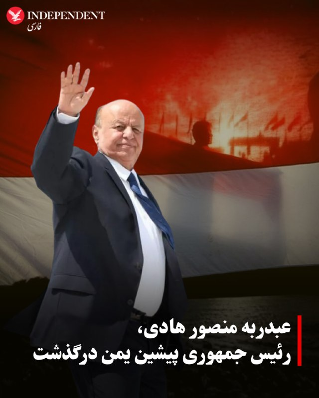

♦️عبدربه منصور هادی، رئیس جمهوری پیشین یمن بامداد پنجشنبه هفتم خرداد در ۸۱ سالگی درگذشت.

شبکه‌های تلویزیونی العربیه و الحدث این خبر را به نقل از منابع آگاه گزارش کردند.

به گزارش العربیه، عبدربه منصور هادی، دومین رئیس جمهوری یمن پس از یکپارچه شدن این کشور در سال ۱۹۹۱ بود. منصور هادی در سال ۲۰۱۲ و پس از شورش‌های گسترده در دوران موسوم به «بهار عربی» به‌عنوان رئیس دولت انتقالی قدرت را به دست گرفت و تا سال ۲۰۲۲ و استعفا رئیس جمهوری دولت قانونی این کشور به شمار می‌رفت.
‌🇸🇦 Indypersian

🤖 @VahidOOnLine

## VahidOOnLine — post 242558

  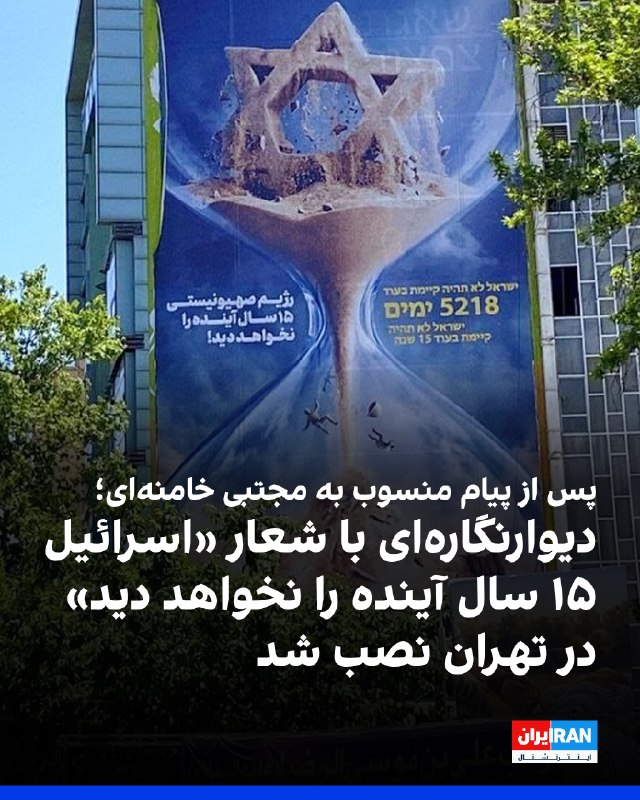

پس از انتشار پیامی منسوب به مجتبی خامنه‌ای درباره «نابودی اسرائیل تا ۱۵ سال آینده»، رسانه‌های ایران تصویری از دیوارنگاره جدید در میدان فلسطین تهران منتشر کردند که بر آن جمله «اسرائیل ۱۵ سال آینده را نخواهد دید» نوشته شده است.

در پیام منتسب به مجتبی خامنه‌ای که رسانه‌های ایران آن را منتشر کرده بودند، آمده است اسرائیل «به مراحل پایانی عمر منحوس خود نزدیک شده است.» در این پیام به سخنان علی خامنه‌ای در سال ۱۳۹۴ اشاره شده و تاکید شده است که اسرائیل «۲۵ سال بعد از آن تاریخ را نخواهد دید.»
‌🏁 🇬🇧 IranintlTV

🤖 @VahidOOnLine

## VahidOOnLine — post 242557

  

نت‌بلاکس، نهاد ناظر بر اختلال‌های اینترنتی در جهان، صبح پنج‌شنبه هفت خرداد در شبکه ایکس اعلام کرد ۹۰ روز پس از قطع دسترسی کاربران در ایران به اینترنت جهانی، اگرچه اتصال تا حد زیادی بازگشته، داده‌ها نشان می‌دهد کاربران همچنان با فیلترینگ سنگین روبه‌رو هستند.

این نهاد ناظر اینترنت افزود وضعیت کنونی مشابه دوره‌ای است که میان اعتراضات دی‌ماه و آغاز جنگ برقرار بود.
‌🏁 🇬🇧 IranintlTV

🤖 @VahidOOnLine

## VahidOOnLine — post 242556

  <a href="telegram/content/VahidOOnLine_242556_1779963302.mp4" target="_blank">🎬 Download video</a>

♦️جنگنده‌های نیروی هوایی ارتش قزاقستان روز عصر چهارشنبه ششم خردادماه و همزمان با ورود ولادیمیر پوتین، رئیس جمهوری روسیه به آستانه، پایتخت این کشور، سه رنگ آبی، سفید و سرخ پرچم روسیه را در آسمان این کشور ترسیم کردند.

پوتین برای یک سفر رسمی و دیدار با قاسم جومارت توکایف، رئیس جمهوری قزاقستان، به آستانه سفر کرده است. جت‌های جنگنده میزبان پیش از این نمایش هوایی، هواپیمای حامل رئیس جمهوری روسیه را در آسمان این کشور مشایعت کرده بودند.
‌🇸🇦 Indypersian

🤖 @VahidOOnLine

## VahidOOnLine — post 242555

  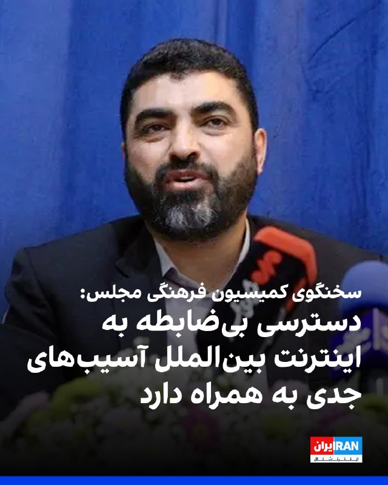

احمد راستینه، سخنگوی کمیسیون فرهنگی مجلس، اعلام کرد تصمیم‌گیری درباره اینترنت بین‌الملل باید در چارچوب مصوبات شورای عالی فضای مجازی و شورای عالی امنیت ملی جمهوری اسلامی انجام شود.

او گفت تشکیل ستاد ساماندهی و مدیریت فضای مجازی از سوی مسعود پزشکیان «به علت تداخل شرح وظایف و ماموریت با شورای عالی فضای مجازی، فاقد صلاحیت است».

راستیه برقراری مجدد اینترنت را «خلاف قانون» خواند و افزود: «دسترسی بی‌ضابطه به اینترنت بین‌الملل، به‌ویژه برای نوجوانان، آسیب‌های جدی برای کشور به همراه دارد.»

او تاکید کرد: «جمهوری اسلامی باید همه ظرفیت‌های خود را برای تکمیل شبکه ملی اطلاعات به کار گیرد.»
‌🏁 🇬🇧 IranintlTV

🤖 @VahidOOnLine

## VahidOOnLine — post 242554

  

پلیس لندن اعلام کرد یک مرد ۲۹ ساله با تابعیت عراقی پس از زیر گرفتن یک مرد ۴۱ ساله ایرانی با خودرو در چهارشنبه ششم خرداد، در منطقه گولدرز گرین بازداشت شد. به گفته پلیس، مرد ایرانی با جراحات تهدیدکننده جان به بیمارستان منتقل شده است.

پلیس لندن اعلام کرد مرد عراقی به ظن «وارد کردن صدمه شدید بدنی، ایجاد جراحت جدی از طریق رانندگی خطرناک و خودداری از ارائه نمونه آزمایش مواد مخدر» بازداشت شده است. به گفته پلیس، او همچنان در بازداشت به سر می‌برد و تحقیقات ادامه دارد.

در بیانیه پلیس آمده است که افسران واحد بررسی تصادف‌های جدی پلیس متروپولیتن هدایت تحقیقات را بر عهده دارند و این حادثه تروریستی تلقی نمی‌شود.
‌🏁 🇬🇧 IranintlTV

🤖 @VahidOOnLine

## VahidOOnLine — post 242553

  

نت‌بلاکس، نهاد ناظر بر اختلال‌های اینترنتی در جهان، صبح پنج‌شنبه هفت خرداد در شبکه ایکس اعلام کرد ۹۰ روز پس از قطع دسترسی کاربران در ایران به اینترنت جهانی، اگرچه اتصال تا حد زیادی بازگشته، داده‌ها نشان می‌دهد کاربران همچنان با فیلترینگ سنگین روبه‌رو هستند.

این نهاد ناظر اینترنت افزود وضعیت کنونی مشابه دوره‌ای است که میان اعتراضات دی‌ماه و آغاز جنگ برقرار بود.
‌🏁 🇬🇧 IranintlTV

🤖 @VahidOOnLine

## VahidOOnLine — post 242552

  

خبرگزاری فارس، وابسته به سپاه پاسداران، در گزارشی با اشاره به هزینه‌های بالای دندانپزشکی و تحت پوشش نبودن بسیاری از خدمات آن از سوی بیمه‌ها، نوشت شماری از بیماران به دلیل ناتوانی مالی، دندان‌درد را تحمل می‌کنند.

بر اساس این گزارش، هزینه عکس OPG در برخی مراکز دندانپزشکی به دو و نیم میلیون تومان رسیده و عصب‌کشی هر دندان نیز بین حدود شش میلیون و ۸۰۰ هزار تا ۱۰ میلیون تومان هزینه دارد.

فارس همچنین نوشت هزینه ایمپلنت هر دندان در برخی کلینیک‌ها تا ۵۰ میلیون تومان می‌رسد.

فارس نوشت هزینه درمان هر دندان به‌طور میانگین بین ۱۵ تا ۴۰ میلیون تومان است، در حالی که بیمه‌های پایه هزینه‌ای بابت آن پرداخت نمی‌کنند.

رسانه وابسته به سپاه به نقل از بیماران گزارش داد بسیاری از مردم به دلیل نداشتن بیمه تکمیلی یا هزینه‌های بالا، درمان دندان‌های خود را به تعویق می‌اندازند تا زمانی که درد شدید آن‌ها را ناچار به مراجعه به دندانپزشکی کند.
‌🏁 🇬🇧 IranintlTV

🤖 @VahidOOnLine

## VahidOOnLine — post 242551

🗣روایت شما از دغدغه‌ معیشت در آتش‌بس- پنجشنبه ۷ خرداد

🔹من سوپرمارکت‌دارم. هفته گذشته قیمت خرید تخمه آفتاب‌گردان کیلویی ۷۵۰ هزار تومان بود و من کیلویی ۹۰۰ هزار تومان می‌فروختم. امروز طبق بار جدید، قیمت خرید شده کیلویی ۹۰۰ هزار تومان.

🔹همه‌چیز خیلی وحشتناک گرون شده؛ بستنی ۱۰۰ هزار تومان، چیپس ۶۰ هزار تومان. حتی چیپس دل‌مز شده ۵۰۰ هزار تومان.

🔹گرونی بیداد می‌کنه؛ یک آب‌معدنی کوچک ساده شده ۲۰ هزار تومان. یک پاکت سیگار شده ۱۵۰ هزار تومان.

🔹دیگه به‌جز نان خالی و پنیر و گاهی ماست نمی‌شه چیز دیگه‌ای خرید. هر چیزی برای خوردن به‌جز نان دیگه زیر یک میلیون تومان نیست؛ کره کیلویی ۱۳۰۰، مرغ ۵۰۰، ماهی کیلویی ۱ میلیون. مردم به درماندگی برای زنده موندن رسیدن.

🔹قبلا به نظامیان ماهانه گوشت، مرغ، برنج، روغن و حبوبات می‌دادن اما الان چند ماهه که خبری نیست. فقط شارژ کارت حکمت هست که مجبوری از اتکا خرید کنی و چند برابر جاهای دیگه‌ست. نه شارژ کارت حکمت افزایش داشته نه حقوق. واقعا نظامیا به چی دل خوش کردن؟

🔹اکثر ایرلاین‌ها تعدیل نیرو داشتن، چندین ماهه که حقوق ندادن، بیمه‌ها رد نشده و هیچ امنیت شغلی وجود نداره.

🔹قبلا می‌گفتم عیب نداره یه غذایی هست بخوریم و یه لباسی هست که بپوشیم اما حالا چی؟ یک کتاب و قهوه شده ۶۰۰ هزار تومان. علی‌کافه شده دونه‌ای ۵۰ هزار تومان و قهوه ساده شده کیلویی ۲ میلیون.
‌🏁 🇬🇧 IranintlTV

🤖 @VahidOOnLine

## VahidOOnLine — post 242550

  

♦️سرگئی ناریشکین، رئیس سازمان اطلاعات خارجی روسیه (SVR)، روز پنج‌شنبه ناتو را متهم کرد در حال فراهم کردن «مقدمات عملی» برای یک «درگیری گسترده در شرق» است.
به‌گزارش ریانووستی، این مقام ارشد جاسوسی و اطلاعات روسیه افزود: «به جز ناتو، اتحادیه اروپا هم به‌سرعت در حال تسلیح مجدد است و به ائتلاف نظامی «علیه روسیه» تبدیل می‌شود.»
‌🇸🇦 Indypersian

🤖 @VahidOOnLine

## VahidOOnLine — post 242549

  

شهاب خورشید، ۲۲ ساله و دانشجوی رشته معماری، شامگاه ۱۹ دی‌ماه حوالی ساعت ۲۲ در جریان اعتراضات میدان کاج سعادت‌آباد تهران هدف شلیک گلوله ماموران امنیتی قرار گرفت و در همان محل جان باخت.

بر اساس گزارش‌های رسیده به ایران‌اینترنشنال، گلوله از پشت کتف به او اصابت کرد و دو گلوله جنگی قلب و ریه‌هایش را هدف قرار داد.

شهاب در محل حادثه جان باخت و پیکرش روز بعد در کهریزک به خانواده تحویل داده شد.

به گفته دوستانش، این جوان پیش از پیوستن به تجمعات گفته بود: «مگر خون من از دیگران رنگین‌تر است که در خانه بمانم؟ یا همه‌چیز تغییر می‌کند، یا من هم می‌میرم.»

شهاب خورشید فرزند دوم خانواده و اصالتا اهل اهواز بود. او از بدو تولد با بیماری دیابت درگیر بود و انسولین مصرف می‌کرد.

بستگانش از او به‌عنوان جوانی شجاع، شاد، خوش‌خنده، مهربان و پرانرژی یاد می‌کنند.

پیکر شهاب در قطعه ۲۱۱، ردیف ۲۳، شماره ۱۱ بهشت زهرا به خاک سپرده شده است.

بنا بر گزارش‌های رسیده به ایران‌اینترنشنال، به خانواده او اجازه داده نشد مزاری جداگانه برایش در نظر بگیرند و شهاب در قبر سه‌طبقه خانوادگی و در طبقه بالایی متعلق به پدربزرگش دفن شد.
https://iranintl.
‌🏁 🇬🇧 IranintlTV

🤖 @VahidOOnLine

## VahidOOnLine — post 242548

  <a href="telegram/content/VahidOOnLine_242548_1779963311.mp4" target="_blank">🎬 Download video</a>

♦️سپاه پاسداران روز پنجشنبه هفتم خرداد ویدیویی را از شلیک موشک به سوی «اهداف آمریکایی» در منطقه تنگه هرمز و خلیج فارس منتشر کرد.

به نظر می‌رسد این ویدیوها مربوط به حمله به «کویت» باشد؛ سپاه پیش ازاین اعلام کرده بود «مبدا حمله به نزدیکی فرودگاه بندرعباس در منطقه را هدف قرار داده است.» همزمان با این حمله، وزارت دفاع کویت اعلام کرد سامانه‌های پدافندی این کشور مشغول مقابله با موشک‌ها و پهپادهای متخاصم هستند.
‌🇸🇦 Indypersian

🤖 @VahidOOnLine

## VahidOOnLine — post 242547

  <a href="telegram/content/VahidOOnLine_242547_1779963315.mp4" target="_blank">🎬 Download video</a>

ویدیوی رسیده به ایران اینترنشنال نشان‌دهنده فعالیت پدافند بندرعباس در بامداد پنجشنبه ۷ خردادماه است.
‌🏁 🇬🇧 IranintlTV

🤖 @VahidOOnLine

## VahidOOnLine — post 242546

  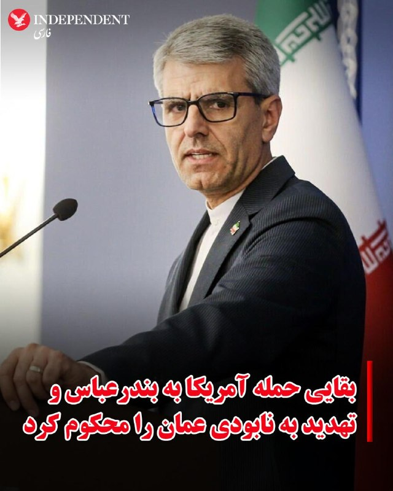

♦️اسماعیل بقایی، سخنگوی وزارت امور خارجه جمهوری اسلامی روز پنجشنبه هفتم خرداد حمله آمریکا به بندرعباس و تهدید دونالد ترامپ به نابودی عمان، در صورت همکاری با تهران در تنگه هرمز را محکوم کرد.

به گزارش رسانه‌های داخلی ایران بقایی گفت: «این اقدامات تجاوزکارانه علیه تمامیت سرزمینی و حاکمیت ملی ایران، نقض فاحش حقوق بین‌الملل و منشور ملل متحد به شمار می‌آید و شورای امنیت سازمان ملل موظف به ایفای مسئولیت قانونی خود برای پاسخگو کردن متجاوزان آمریکایی است.»

این سخنان در حالی عنوان می‌شود که سنتکام صبح پنجشنبه اعلام کرد چهار پهپاد مهاجم ایرانی را رهگیری و منهدم کرده و محل پرتاب پهپاد پنجم را پیش از شلیک، هدف قرار داده است.

رسانه‌های ایران گزارش دادند که بقایی در همین روز و در واکنش به سخنان دیروز دونالد ترامپ رئیس جمهوری آمریکا درباره عمان گفت:‌ «تهدید به «انهدام» کشور دوست و برادر یعنی عمان که همواره نقشی سازنده، موثر و مسئولانه در قبال صلح و امنیت منطقه داشته و طی سال‌های متمادی در مقام میانجی روندهای دیپلماتیک، مساعی جمیله خود را در خدمت صلح و ثبات منطقه به‌کار گرفته، نه تنها نقض اصل بنیادین منع تهدید به استفاده از زور است، بلکه نشانۀ خطرناک دیگری از عادی‌سازی قانون‌شکنی و قلدرمآبی در روابط بین‌الملل است.»

دونالد ترامپ یک روز پیش از این و در جریان دوازدهمین جلسه کابینه آمریکا در کاخ سفید با هشدار درباره گزارش‌ها از هماهنگی میان تهران و مسقط برای کنترل تنگه هرمز گفته بود: «عمان نیز همانند هر کشور دیگری رفتار خواهد کرد و در غیر این‌صورت مجبور خواهیم شد آن را منفجر کنیم.»
‌🇸🇦 Indypersian

🤖 @VahidOOnLine

## VahidOOnLine — post 242545

  

یعقوب مجاهد، وزیر دفاع طالبان، در دیدار با علی باقری کنی، معاون دبیر شورای عالی امنیت ملی جمهوری اسلامی، در مسکو گفت خاک و فضای افغانستان هیچ‌گاه منبع تهدید علیه ایران نبوده و طالبان این موضوع را در جنگ اخیر آمریکا و جمهوری اسلامی ثابت کرده است.

دو طرف روز چهارشنبه در حاشیه چهاردهمین نشست مقام‌های ارشد امنیتی جهان در مسکو دیدار کردند.

ایرنا، خبرگزاری دولت جمهوری اسلامی، نوشت باقری کنی به مجاهد گفت آمریکا و اسرائیل «دشمنان مشترک» کشورهای منطقه هستند.
‌🏁 🇬🇧 IranintlTV

🤖 @VahidOOnLine

## VahidOOnLine — post 242544

  <a href="telegram/content/VahidOOnLine_242544_1779963319.mp4" target="_blank">🎬 Download video</a>

ویدیوی ارسالی به ایران اینترنشنال نشان می‌دهد که ششم خردادماه تعدادی از ایرانیان ساکن ایالت تگزاس آمریکا برای نشان دادن خواست تغییر رژیم و اعتراض به اعدام‌ها در ایران، تجمعی در شهر هیوستون برگزار کردند.
‌🏁 🇬🇧 IranintlTV

🤖 @VahidOOnLine

## VahidOOnLine — post 242543

  

محمدباقر قالیباف، رییس مجلس، در پیامی به غلامحسین محسنی اژه‌ای، رییس قوه قضاییه جمهوری اسلامی، نوشت: «قوه قضاییه زیر بمباران و تهدید دشمنان دست از صیانت از حقوق مردم و برخورد با قاتلان داخلی و خائنین به ملت نکشید و خوش درخشید.»

پیام قالیباف در حالی منتشر شده که قوه قضاییه طی ۷۰ روز گذشته، حدود ۴۰ زندانی سیاسی را اعدام کرده است.
‌🏁 🇬🇧 IranintlTV

🤖 @VahidOOnLine

## VahidOOnLine — post 242542

  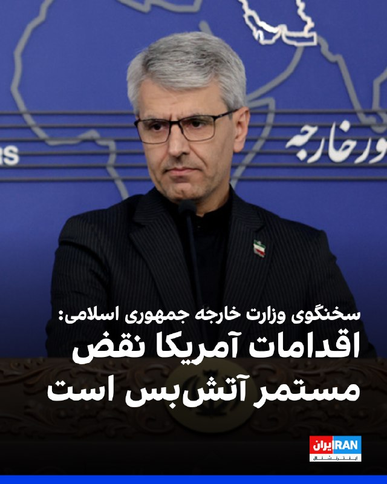

اسماعیل بقائی، سخنگوی وزارت خارجه جمهوری اسلامی، در واکنش به حملات آمریکا به اهدافی در بندرعباس در بامداد پنج‌شنبه، گفت که این اقدام «تجاوزکارانه» علیه تمامیت سرزمینی و حاکمیت ملی، نقض فاحش حقوق بین‌الملل و منشور ملل متحد به شمار می‌آید.

بقائی افزود: «لفاظی‌های تهدیدآمیز مقامات آمریکایی علیه جمهوری اسلامی و کشور دوست و برادر ما عمان، محکوم است.»

سخنگوی وزارت خارجه جمهوری اسلامی، اقدامات آمریکا را «نقض‌ مستمر آتش‌بس» خواند.
‌🏁 🇬🇧 IranintlTV

🤖 @VahidOOnLine

## VahidOOnLine — post 242541

  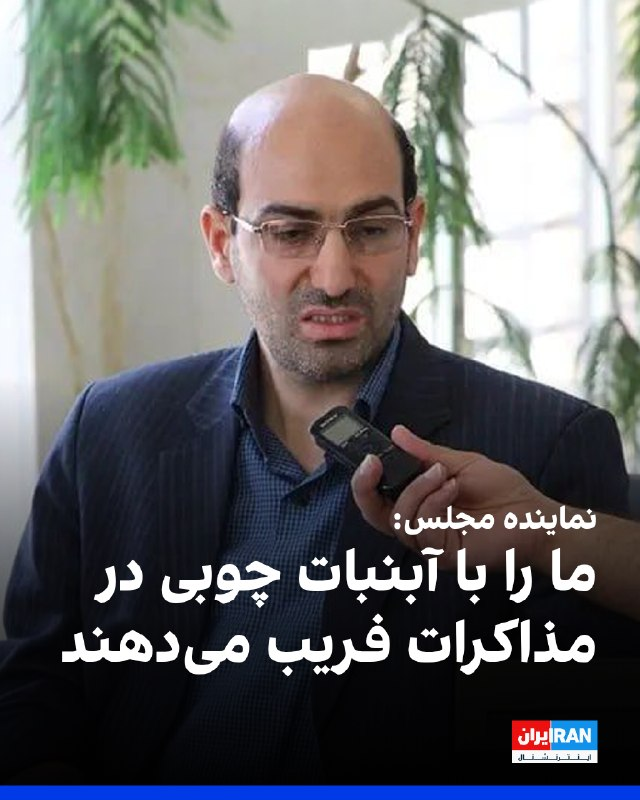

ابوالفضل ابوترابی، نماینده نجف‌آباد در مجلس، به سایت دیده‌بان ایران، گفت: «تمام خطوط قرمز رهبری از تنگه هرمز، مسئله هسته‌ای و گرفتن غرامت، در مذاکرات نقض شده است.»

ابوترابی، گفت: «دارند با آبنبات چوبی صندوق ۳۰۰ میلیاردی و بدون ضمانت اجرایی، ما را فریب می‌دهند.»

او افزود: «تنگه هرمز بدهیم تا ۱۲ میلیارد دلار پول خودمان را با خفت و خواری بگیریم؟ اگر ما تنگه هرمز را باز کردیم، چه تضمینی وجود دارد که آنها دوباره محاصره را شروع نکنند؟ هیچ تضمینی.»

این نماینده مجلس در پایان گفت: «آمریکا بعد از جام جهانی و انتخابات کنگره، دوباره به ما حمله می‌کند.»
‌🏁 🇬🇧 IranintlTV

🤖 @VahidOOnLine

## WithYashar — post 12783

  

«روزنامه وال‌استریت ژورنال دیروز گزارش داد که ایران برای دور زدن تحریم‌ها و محاصره آمریکا، از سازوکاری موسوم به انتقال کشتی‌به‌کشتی(Ship-to-Ship) استفاده می‌کند؛ به این صورت که کشتی‌های تحریم‌شده حامل نفت ایران، پیش از ارسال محموله به چین، بار خود را در دریا به کشتی دیگری منتقل می‌کنند.»
@withyashar

## WithYashar — post 12782

  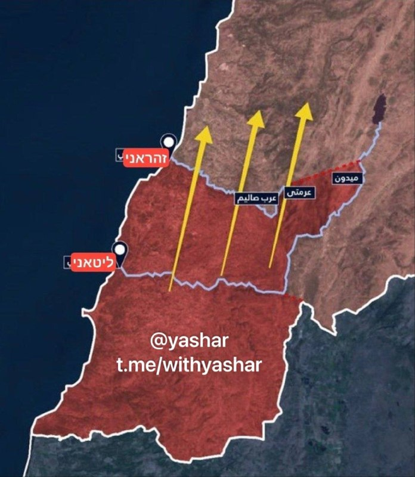

ارتش اسرائیل دقایقی پیش مجدداً دستور تخلیه فوری کل جنوب لبنان را صادر کرد!
@withyashar

## WithYashar — post 12781

مقام‌های آمریکایی گفتند جمهوری اسلامی چهار پهپاد انتحاری را به سمت کشتی‌های آمریکایی و تجاری شلیک کرد، اما جنگنده‌های آمریکا آن‌ها را سرنگون کردند. به گفته این مقام‌ها، جنگنده‌های اف-۱۸ آمریکا همچنین پیش از پرواز پنجمین پهپاد، واحد کنترل زمینی جمهوری اسلامی را در بندرعباس منهدم کردند.
@withyashar

## WithYashar — post 12780

## WithYashar — post 12779

  

حجم ترافیک اینترنت بین‌الملل، تا ساعت ۷ و نیم صبح امروز به ۵۳ درصد حجم پیش از دی‌ماه ۱۴۰۴ رسیده است
@withyashar
حرفم که گفتم اینترنت فقط با رفتن اینا به حالت قبل بر‌میگرده هنوز پا برجاست !

## WithYashar — post 12778

## WithYashar — post 12777

  

👏👏👏

## WithYashar — post 12776

  

بامداد امروز بعد از شلیک موشک از امیدیه خوزستان به سمت کویت ، صدای انفجار شنیده شده و ستون دود دیده شده که ظاهراً لانچری که موشک ازش شلیک شده بلافاصله توسط ارتش آمریکا مورد هدف قرار گرفته
@withyashar

## WithYashar — post 12775

  

اسرائیل، عزالدین البیک، فرمانده تیپ شمال غزه را به هااکت رساند
@withyashar

## WithYashar — post 12774

  

رویترز: یک گاومیش آلبینو نادر در بنگلادش که به خاطر دسته موی بلوندش «دونالد ترامپ» لقب گرفته بود، پس از اینکه در فضای مجازی دیده شد، از قربانی شدن در عید قربان نجات یافت.
این گاومیش ۷۰۰ کیلوگرمی قبلاً فروخته شده بود، اما دولت به دلیل نگرانی‌های امنیتی و تجمع جمعیت برای دیدن آن، وارد عمل شد.

مقامات پول خریدار را بازگرداندند و حیوان را به باغ‌وحش داکا منتقل کردند.
@withyashar

## WithYashar — post 12773

آمریکا «نهاد مدیریت آبراه خلیج فارس» را تحریم کرد

وزارت خزانه‌داری آمریکا اعلام کرد سازمان تازه تأسیس ایرانی «نهاد مدیریت آبراه خلیج فارس» را به فهرست تحریم‌های خود اضافه کرده است.
@withyashar

## WithYashar — post 12772

  <a href="telegram/content/WithYashar_12772_1779963330.mp4" target="_blank">🎬 Download video</a>

◀️رد موشک های ۳پا در امیدیه خوزستان که به سمت کویت میرفت
@withyashar

## WithYashar — post 12771

اکسیوس: ایران چهارتا پهپاد انتحاری به سمت یک ناو نیروی دریایی آمریکا و یک کشتی تجاری پرتاب کرد نیروهای آمریکایی پهپادها رو رهگیری کردن و همچنین یک واحد پرتاب پهپاد ایرانی دیگه رو روی زمین قبل از اینکه بتوانه شلیک کنه، هدف قرار دادن
@withyashar

## WithYashar — post 12770

فاکس نیوز: آمریکا یه ایستگاه کنترل زمینی ایران رو تو بندرعباس زده؛ همون جایی که قرار بوده یه پهپاد تهاجمی ازش بلند شه.

به گفتهٔ مقام‌های آمریکایی، چهار تا پهپاد انتحاری دیگه هم که تو تنگه هرمز تهدید محسوب می‌شدن، زده شدن.
@withyashar

## WithYashar — post 12769

۳پا یک پایگاه هوایی آمریکایی را هدف قرار داد

روابط عمومی ۳پا طی اطلاعیه‌ای اعلام کرد:
به دنبال تعرض سحرگاه امروز آمریکا به نقطه‌ای در حاشیه فرودگاه بندر عباس با پرتابه‌های هوایی، پایگاه هوایی آمریکایی به عنوان مبدا تجاوز، در ساعت ۴/۵۰ دقیقه هدف قرار گرفت.
این پاسخ یک اخطار جدی است تا دشمن بداند، تجاوز بدون پاسخ نخواهد ماند و در صورت تکرار، پاسخ ما قاطع تر خواهد بود.
مسئولیت عواقب آن با متجاوز است.
@withyashar

## mwarmonitor — post 9851

📰 رویترز: گزارش‌هایی از پنتاگون فاش کرده‌اند که نیروهای آمریکایی در طول جنگ از طریق داده‌های موقعیت‌یابی ماهواره ای هدف قرار گرفته‌اند.

@mwarmonitor

## mwarmonitor — post 9850

...طرف اوکراینی‌ها که دارن در برابر متجاوز از خودشون دفاع می‌کنن. و حالا اون خودش مسئول فعال شدن اون ماشه (شروع درگیری) است. بنابراین فکر می‌کنم این فاکتوری هست که در ذهن او وجود داره، هرچند در اینجا به زبان آورده نشده. این فرصت وجود داره که شاید بتونیم به…

## mwarmonitor — post 9849

🔴مجری فاکس نیوز ؛ می‌خواهیم به سراغ ژنرال بازنشسته چهار ستاره ارتش، "جک کین" (Jack Keane) برویم. او رئیس انستیتوی مطالعات جنگ، قائم‌مقام سابق ستاد مشترک ارتش و تحلیلگر ارشد استراتژیک فاکس نیوز است. ژنرال کین، بسیار خوشحالیم که امروز شما را همراه خود داریم.»…

## mwarmonitor — post 9848

🔴مجری فاکس نیوز ؛ می‌خواهیم به سراغ ژنرال بازنشسته چهار ستاره ارتش، "جک کین" (Jack Keane) برویم. او رئیس انستیتوی مطالعات جنگ، قائم‌مقام سابق ستاد مشترک ارتش و تحلیلگر ارشد استراتژیک فاکس نیوز است. ژنرال کین، بسیار خوشحالیم که امروز شما را همراه خود داریم.»
«می‌دانید، من در واقع می‌خواهم برنامه را با نشان دادن این نقل قول به همه کسانی که از خانه ما را تماشا می‌کنند شروع کنم؛ زیرا ما شاهد مطرح شدن هر دو جنبه این استدلال هستیم و تلاش می‌کنیم بفهمیم که آیا اصلاً جای انعطاف و تعدیلی در اینجا وجود دارد یا خیر. اما فکر می‌کنم این نقل قول از سوی رهبری ایران، تا حدودی کمک‌کننده باشد. آن‌ها همیشه به نوعی یک ساز را می‌زنند (یک حرف را تکرار می‌کنند)، اما فقط می‌خواهم این نکته را روشن کنم که این رهبر جدید اساساً همان چیزی را می‌گوید که آن‌ها در تمام این مدت می‌گفتند.»
مجری در حال خواندن متن روی تصویر:
«بنابراین، این بیانیه‌ای از سوی آیت‌الله مجتبی خامنه‌ای است که در طول ایام حج—یکی از بالاترین مراسم‌های مذهبی آن‌ها—بیان شده است. او می‌گوید: "عقربه‌های زمان به عقب برنخواهند گشت و ملت‌ها و سرزمین‌های منطقه دیگر به عنوان سپری برای پایگاه‌های ایالات متحده عمل نخواهند کرد. ایالات متحده نه تنها دیگر پناهگاه امنی برای شرارت‌های خود نخواهد داشت..."»
مجری در حال خواندن ادامه متن:
«"...و همچنین برای ایجاد پایگاه‌های نظامی در منطقه؛ بلکه روز به روز از موقعیت پیشین خود دورتر و دورتر می‌شود." و او در ادامه به نوعی به تخریب اسرائیل نیز می‌پردازد که البته غافلگیری بزرگی هم نیست.»
«برداشت شما از موقعیتی که آن‌ها اکنون در آن قرار دارند چیست؟ آیا این واقعاً یک رژیم جدید است؟ و آیا همان‌طور که امروز از رئیس‌جمهور شنیدیم، ما در اینجا با افراد منطقی‌تری طرف هستیم، ژنرال؟»

🔵ژنرال جک کین:
«بله، منظورم این است که... تلاش برای گمانه‌زنی در مورد اینکه در چه موقعیتی هستیم تقریباً بی‌ثمر است؛ زیرا می‌دانید که این جناح‌ها در داخل ایران وجود دارند. تندروها یک چیز می‌گویند و مذاکره‌کنندگان چیز دیگری می‌گویند.»
«و هر کسی هر از گاهی میکروفون را به دست می‌گیرد و آن را در بوق و کرنا می‌کند و شما چیزی شبیه به آنچه او (رهبر ایران) همین الان گفت یا برخی تندروهای دیگر می‌گویند را می‌شنوید که: "هیچ راهی وجود ندارد که ما در اینجا به توافق برسیم." اما این‌ها کسانی نیستند که با مذاکره‌کنندگان ما گفتگو می‌کنند.»
«فکر می‌کنم مهم است که بدانیم اصلاً چگونه به اینجا رسیده‌ایم؟ منظورم این است که واقعیت این است که زمان زیادی از آن گذشته است—یک هفته پیش—که ما در آستانه بازگشت به عملیات‌های نظامی بودیم؛ و من صادقانه معتقدم که رئیس‌جمهور همین را می‌خواست. من می‌دانم که موضع من و برخی دیگر نیز همین بود؛ و ما معتقد بودیم که این بهترین گزینه در دسترس ما در آن زمان بود.»
«اما اتفاقی که در اینجا افتاد این است که نخست‌وزیرِ... رهبریِ پاکستان و قطر و برخی دیگر نزد رئیس‌جمهور آمدند و معتقد بودند پس از گفتگو با ایرانی‌ها و فشاری که ایرانی‌ها حس می‌کردند، فرصتی برای دستیابی به یک توافق در اینجا وجود دارد.»
«بنابراین رئیس‌جمهور چه کار کرد؟ او به آن حرف‌ها گوش داد و به غریزه خود اعتماد کرد. می‌دانید، یکی از چیزهایی که در این رئیس‌جمهور ثابت است—اگر به آنچه می‌گوید توجه کنید—وقتی صحبت می‌کند، او می‌خواهد درباره توقف جنگ صحبت کند. او در واقع فراتر از این می‌رود و می‌گوید: "من می‌خواهم کشتار را متوقف کنم."»
«و حالا او خودش مسئول فعال کردن آن کشتار است. وقتی شنیدید که او در مورد اوکراین بارها و بارها می‌گفت: "من می‌خواهم کشتار را متوقف کنم"، او داشت درباره هر دو طرف صحبت می‌کرد؛ نه فقط یک طرف...

@mwarmonitor

## mwarmonitor — post 9847

## mwarmonitor — post 9846

  <a href="telegram/content/mwarmonitor_9846_1779963332.mp4" target="_blank">🎬 Download video</a>

🔴فرماندهی جنوبی ایالات متحده یک شناور را در شرق اقیانوس آرام هدف قرار داد.
بر اساس اطلاعات نهادهای اطلاعاتی آمریکا، این شناور در مسیرهای شناخته‌شده قاچاق مواد مخدر فعالیت می‌کرد و توسط یک سازمان تروریستی مورد استفاده قرار گرفته بود.

@mwarmonitor

## mwarmonitor — post 9845

🔴«یک آژانس کشتیرانی اعلام کرد: پهپادها به سه نفتکش در دریای سیاه، در نزدیکی سواحل ترکیه، حمله کردند.»

@mwarmonitor

## mwarmonitor — post 9844

📰 بلومبرگ:
دونالد ترامپ نسخه جدیدی از شکایت قضایی ۱۰ میلیارد دلاری خود را به اتهام افترا علیه روزنامه وال استریت ژورنال و شرکت مادر آن نیوز کورپ ثبت کرده است. این شکایت به دلیل انتشار مقاله‌ای درباره روابط نزدیک ادعایی او با جفری اپستین مطرح شده است.

@mwarmonitor

## mwarmonitor — post 9843

📰 پولیتیکو:
به گزارش پولیتیکو، نیروها و تسلیحات نظامی آمریکا برای حمله به کوبا آماده هستند و تنها چیزی که باقی مانده، دستور نهایی از سوی دونالد ترامپ است.

@mwarmonitor

## mwarmonitor — post 9842

📊 داده‌های معاملاتی:
قیمت‌های جهانی نفت صبح روز پنج‌شنبه حدود ۴ درصد افزایش یافت؛ این رشد در حالی رخ داده که انتظار می‌رود اختلالاتی در عبور نفتکش‌ها از تنگه هرمز ایجاد شود.

@mwarmonitor

## mwarmonitor — post 9841

صبح امروز به کویت حمله موشکی شد ، مثل دیشب این نقض آتش بس نبوده و فقط یک احوال پرسی دیپلماتیک بود

## pm_afshaa — post 91724

https://t.me/proxy?server=tg.capycore.ru&port=443&secret=27ebe852539fb8ec5f327c73262bb721

💧 Rainbet.com the #1 Non-KYC Crypto Casino & Sportsbook @rainbetcom

😁 @Pm_Afshaa

## pm_afshaa — post 91723

https://t.me/proxy?server=tg.capycore.ru&port=443&secret=27ebe852539fb8ec5f327c73262bb721

پروکسی متصل سرعت بالا

💧 Rainbet.com the #1 Non-KYC Crypto Casino & Sportsbook @rainbetcom

😁 @Pm_Afshaa

## pm_afshaa — post 91722

https://t.me/proxy?server=arezoni9.ir&port=15&secret=ee1603010200010001fc030386e24c3add63646e2e79656b74616e65742e636f6d

پروکسی سرعت بالا متصل

💧 Rainbet.com the #1 Non-KYC Crypto Casino & Sportsbook @rainbetcom

😁 @Pm_Afshaa

## pm_afshaa — post 91721

https://t.me/proxy?server=195.254.165.4&port=8443&secret=EERighJJvXrFGRMCIMJdCQ%3D%3D

پروکسی پر سرعت مخصوص دانلود

💧 Rainbet.com the #1 Non-KYC Crypto Casino & Sportsbook @rainbetcom

😁 @Pm_Afshaa

## pm_afshaa — post 91720

🔴ارتش اسرائیل دقایقی پیش مجدداً دستور تخلیه فوری کل جنوب لبنان را صادر کرد

💧 Rainbet.com the #1 Non-KYC Crypto Casino & Sportsbook @rainbetcom

😁 @Pm_Afshaa

## pm_afshaa — post 91719

  

طبق اخبار حسن شاهوار پور فرمانده سپاه ولی‌عصر خوزستان در حمله دیشب آمریکا به درک واصل شده

💧 Rainbet.com the #1 Non-KYC Crypto Casino & Sportsbook @rainbetcom

😁 @Pm_Afshaa

## pm_afshaa — post 91718

🔴ان‌بی‌سی نیوز: پنتاگون فهرست جدیدی از اهداف نظامی ایران تهیه کرده

💧 Rainbet.com the #1 Non-KYC Crypto Casino & Sportsbook @rainbetcom

😁 @Pm_Afshaa

## pm_afshaa — post 91717

vless://478cc26d-16b3-4fdd-be64-60d5a58c1622@162.159.36.5:80?path=%2F&security=none&encryption=none&host=tt.andishehparenting.com&type=ws#PMTV%20NEWS%F0%9F%A6%81%E2%98%80%EF%B8%8F

💧 Rainbet.com the #1 Non-KYC Crypto Casino & Sportsbook @rainbetcom

😁 @Pm_Afshaa

## pm_afshaa — post 91716

vless://06b65903-406d-4a41-8463-6fd5c0ee7798@43.169.18.179:443?path=%2F&security=tls&encryption=none&insecure=0&host=sni.skylee4.cloudns.ch&fp=chrome&type=ws&allowInsecure=0&sni=sni.skylee4.cloudns.ch#PMTV%20NEWS%F0%9F%A6%81%E2%98%80%EF%B8%8F

سرعت بالا مخصوص اینستا و دانلود

💧 Rainbet.com the #1 Non-KYC Crypto Casino & Sportsbook @rainbetcom

😁 @Pm_Afshaa

## pm_afshaa — post 91715

https://t.me/proxy?server=87.248.129.13&port=15&secret=ee1603010200010001fc030386e24c3add63646e2e79656b74616e65742e636f6d

پروکسی متصل سرعت بالا

💧 Rainbet.com the #1 Non-KYC Crypto Casino & Sportsbook @rainbetcom

😁 @Pm_Afshaa

## pm_afshaa — post 91714

  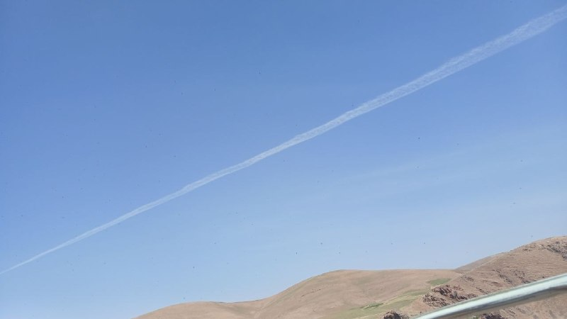

از کرمانشاه موشک بلند شد

💧 Rainbet.com the #1 Non-KYC Crypto Casino & Sportsbook @rainbetcom

😁 @Pm_Afshaa

## pm_afshaa — post 91713

🔴اسرائیل، عزالدین البیک، فرمانده تیپ شمال غزه را ترور کرد

💧 Rainbet.com the #1 Non-KYC Crypto Casino & Sportsbook @rainbetcom

😁 @Pm_Afshaa

## pm_afshaa — post 91712

  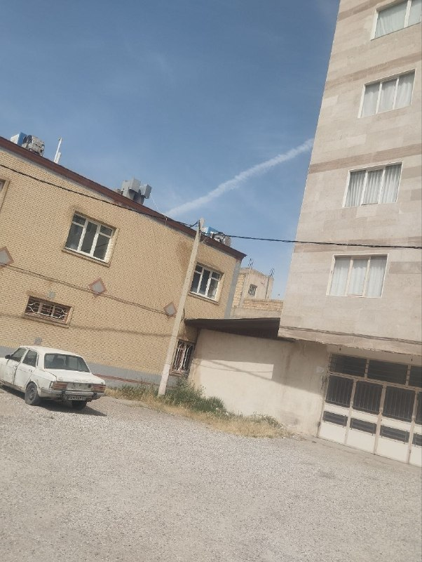

از نهاوند موشک بلند شد

💧 Rainbet.com the #1 Non-KYC Crypto Casino & Sportsbook @rainbetcom

😁 @Pm_Afshaa

## pm_afshaa — post 91711

vless://06b65903-406d-4a41-8463-6fd5c0ee7798@43.169.18.179:443?path=%2F&security=tls&encryption=none&insecure=0&host=sni.skylee4.cloudns.ch&fp=chrome&type=ws&allowInsecure=0&sni=sni.skylee4.cloudns.ch#PMTV%20NEWS%F0%9F%A6%81%E2%98%80%EF%B8%8F

💧 Rainbet.com the #1 Non-KYC Crypto Casino & Sportsbook @rainbetcom

😁 @Pm_Afshaa

## pm_afshaa — post 91710

trojan://humanity@45.130.125.69:443?path=%2Fassignment&security=tls&alpn=http%2F1.1&insecure=1&host=www.calmloud.com&fp=chrome&type=ws&allowInsecure=1&sni=www.calmloud.com#PMTV%20NEWS%F0%9F%A6%81%E2%98%80%EF%B8%8F

سرعت بالا مخصوص اینستا و دانلود

💧 Rainbet.com the #1 Non-KYC Crypto Casino & Sportsbook @rainbetcom

😁 @Pm_Afshaa

## DEJradio — post 5063

  <a href="telegram/content/DEJradio_5063_1779963336.mp4" target="_blank">🎬 Download video</a>

🔺🎥 آتش‌سوزی در برج‌ پامچال؛ بنیاد تعاون آجا بساز بنداز است

برج پامچال ارتش واقع در منطقه ۲۲ تهران (چیتگر) روز چهارشنبه ششم خرداد دچار آتش‌سوزی شد. تحت تاثیر آتش‌سوزی‌های مداوم انفجارها و آتش‌سوزی‌های زنجیره‌ای در مناطق و شهرک‌های نظامی، برخی مدعی شدند که این حادثه نیز یک حذف هدفمند بود. با این همه بررسی‌های اولیه نشان می‌دهد آتش‌سوزی ناشی از شعله‎ور شدن نمای کامپوزیتی ساختمان بوده است. یک منبع داخلی به دژ می‌گوید، «هنوز مشخص نیست پشت ماجرا چه بوده، اما در اینکه بنیاد تعاون آجا بساز بنداز است شک نکنید.»

#آتشسوزی #چیتگر
@DEJradio

## DEJradio — post 5062

⭕️ ترامپ: نه تحریم را لغو می‌کنیم نه به تهران پول می‌دهیم؛ کار را یکسره می‌کنیم

دونالد ترامپ، رئیس جمهوری آمریکا گفت در مذاکرات جاری با تهران، صحبتی درباره کاهش تحریم‌ها یا انتقال پول به جمهوری اسلامی مطرح نیست.
او تأکید کرد آمریکا کنترل دارایی‌های مسدودشده ایران را حفظ می‌کند. به گفتۀ ترامپ، هر زمان اداره کنندگان ایران رفتار درستی در پیش بگیرند، اجازه داده می‌شود که به پول‌ها دسترسی پیدا کنند.
دونالد ترامپ همچنین گفت آمریکا هنوز از وضعیت توافق احتمالی خشنود نیست، اما جمهوری اسلامی بسیار مایل است به توافق برسد.
رئیس جمهوری آمریکا هشدار داد اگر توافقی به‌دست نیاید، واشینگتن کار را یکسره می‌کند.

#دژ #خبر #ترامپ #مذاکرات #تحریم
@DEJradio

## DEJradio — post 5061

⭕️ روبیو: در مذاکراه با تهران مقداری پیشرفت رخ داد

مارکو روبیو، وزیر امور خارجۀ آمریکا در بامداد پنج‌شنبه گفت در مذاکره با جمهوری اسلامی برای رسیدن به توافق «مقداری پیشرفت» رخ داده است.
او افزود طی ساعت‌ها چند روز آینده مشخص می‌شود امکان پیشروی بیش‌تر وجود دارد یا نه.
مارکو روبیو تأکید کرد جمهوری اسلامی هرگز به سلاح هسته‌ای دست پیدا نمی‌کند.
وزیر خارجه آمریکا گفت اولویت دولت ترامپ همچنان دیپلماسی است.

#خبر #دژ #مارکو_روبیو #مذاکرات
@DEJradio

## DEJradio — post 5060

⭕️ اسرائیل از جنوب لبنان تا رود زهرانی را منطقۀ جنگی اعلام کرد

ارتش اسرائیل اعلام کردهمۀ مناطق جنوب رود زهرانی در لبنان، در فاصلۀ حدودا ۴۰ کیلومتری مرز اسرائیل، منطقۀ جنگی به شمار می‌رود.
اویخای ادرعی، سخنگوی عرب‌زبان ارتش اسرائیل از ساکنان این مناطق خواست تا به شمال رود زهرانی بروند.
ارتش اسرائیل دلیل این تصمیم را نقض مکرر آتش‌بس از سوی حزب‌الله عنوان کرد.
شبه‌نظامیان حزب‌الله که از سوی جمهوری اسلامی پشتیبانی می‌شوند، در سیاهۀ تروریستی آمریکا و اتحادیۀ اروپا قرار دارند.
ایال زمیر، رئیس ستاد ارتش اسرائیل گفت این کشور شدت عملیات علیه حزب‌الله را افزایش می‌دهد و ضرباتی سهمگین‌تر به آنها وارد می‌کند.

#خبر #دژ #اسرائیل
@DEJradio

## DEJradio — post 5059

⭕️ روسیه بازگشت کارکنان خود به نیروگاه بوشهر را به تعویق انداخت

روس‌اتم، سازمان دولتی انرژی هسته‌ای روسیه اعلام کرد بازگشت کارکنانش به نیروگاه هسته‌ای بوشهر را به تعویق می‌اندازد.
الکسی لیخاچف، مدیرعامل روس‌اتم گفت اخبار ضدونقیض دربارۀ مذاکرات جمهوری اسلامی و آمریکا و حملاتی که به نقاطی از ایران انجام شد، دلیل این تصمیم بوده است.
او افزود ولادیمیر پوتین، رئیس جمهوری روسیه در جریان این تصمیم قرار گرفته و آن را تأیید کرده است.
روس‌اتم در دوران جنگ چهل روزه ۸۱۳ نفر از کارکنان خود را از نیروگاه بوشهر خارج کرد و تنها ۲۰ تن را برای حفظ ایمنی و ادامۀ فعالیت نیروگاه، در محل نگه داشت.

#خبر #دژ #روسیه #ایران
@DEJradio

## DEJradio — post 5058

🔺 جنگ خاورمیانه مسیر سرمایه‌گذاری جهانی در انرژی را تغییر داد

آژانس جهانی انرژی اعلام کرد بحران خاورمیانه کشورها را به سمت تنوع‌بخشی به منابع و مسیرهای انرژی سوق داده است.
فاتح بیرول، مدیر اجرایی آژانس، وضعیت کنونی را بزرگ‌ترین بحران امنیت انرژی در جهان، عنوان کرد.
آژانس جهانی انرژی پیش‌بینی کرد بخش عمدۀ سرمایه‌گذاری جهانی انرژی در سال ۲۰۲۶ در برق و همچنین در انرژی هسته‌ای و تجدیدپذیر، انجام شود.
این نهاد جهانی پیش‌بینی کرد سرمایه‌گذاری در انرژی جهانی در سال جاری به ۳.۴ تریلیون دلار برسد.
بنا بر این گزارش، سرمایه‌گذاری در نفت برای سومین سال پیاپی کاهش پیدا می‌کند، اما سرمایه‌گذاری در گاز طبیعی امسال به بالاترین سطح در یک دهۀ اخیر می‌رسد.

#خبر #دژ #خاورمیانه #انرژی
@DEJradio

## DEJradio — post 5057

⭕️ سنتکام چهار پهپاد انتحاری جمهوری اسلامی را در نزدیکی تنگۀ هرمز سرنگون کرد

سنتکام، ستاد فرماندهی مرکزی ارتش آمریکا اعلام کرد در بامداد پنج‌شنبه چهار پهپاد انتحاری جمهوری اسلامی را که در اطراف تنگۀ هرمز «تهدید ایجاد کرده بودند» سرنگون کرده است.
سنتکام همچنین گفت یک ایستگاه کنترل پهپادی در بندرعباس را پیش از پرتاب پهپاد پنجم هدف قرار داده است.
سپاه پاسداران ادعا کرد یک پایگاه هوایی آمریکا را در پاسخ به آنچه «تعرض» خواند، هدف قرار داده است.
روایت سپاه از هدف گرفتن پایگاه آمریکایی هنوز توسط منابع محلی تأیید نشده است.

#خبر #دژ #سنتکام #تنگه_هرمز
@DEJradio

## DEJradio — post 5056

⭕️ افزایش دوبارۀ بهای نفت در پی حملات شبانه در تنگۀ هرمز

بهای نفت در معاملات پنج‌شنبه، در پی حملات تازه میان آمریکا و جمهوری اسلامی، بار دیگر افزایش یافت.
بهای نفت برنت با رشد ۱.۸ درصدی به حدود ۹۶ دلار رسید. همچنین هر بشکه نفت خام آمریکا روز پنج‌شنبه بیش از ۹۰ دلار معامله شد.
از سویی اکثر بورس‌های آسیایی از جمله هنگ‌کنگ، سئول و شانگهای با کاهش شاخص قیمت روبه‌رو شد.

#خبر #دژ #نفت #تنگه_هرمز
@DEJradio

## DEJradio — post 5055

⭕️ هشدار ترامپ به عمان: اگر بخواهید تنگۀ هرمز را کنترل کنید، نابودتان می‌کنیم

دونالد ترامپ، رئیس جمهوری آمریکا گفت در چارچوب توافق احتمالی با جمهوری اسلامی، تنگۀ هرمز باید بی‌درنگ باز شود و در کنترل هیچ کشوری نباشد.
ترامپ گفت آمریکا بر آبراه هرمز نظارت می‌کند، اما اجازه نمی‌دهد هیچ کشوری کنترل آن را در دست بگیرد.
ترامپ با اشاره به عمان گفت:آنها هم باید مانند بقیه رفتار کنند، وگرنه مجبور می‌شویم نابودشان کنیم.

#خبر #دژ #ترامپ #تنگه_هرمز
@DEJradio

## DEJradio — post 5054

  <a href="telegram/content/DEJradio_5054_1779963339.webm" target="_blank">🎬 Download video</a>

🔺📢 سنگ بنای فعالیت علیه جمهوری اسلامی؛

فریبرز کرمی‌زند، افسر پیشین پلیس

#اپوزیسیون #جمهوری_اسلامی
@DEJradio

## DEJradio — post 5053

  <a href="telegram/content/DEJradio_5053_1779963340.webm" target="_blank">🎬 Download video</a>

🔺🎥 هنرنمایی دختران برزیلی با توپ فوتبال.

#فوتبال #دختران_برزیلی
@DEJradio

## DEJradio — post 5052

  <a href="telegram/content/DEJradio_5052_1779963341.webm" target="_blank">🎬 Download video</a>

🔺📢 "از رشت پیام می‌دم، شب‌ها تقریبا حکومت نظامی شده، سرکوبگر کم آوردن رفتن سراغ کارگرای بیچاره با زور و تهدید و تطمیع می‌ذارنشون تو ایست بازرسی

پیام دریافتی

#سرکوبگران #ایست_بازرسی
@DEJradio

## DEJradio — post 5051

  <a href="telegram/content/DEJradio_5051_1779963341.webm" target="_blank">🎬 Download video</a>

🔺📢 “از دی تا الان نزدیک پنج ماهه دنبال برادرم میگردیم نیست، هرجایی بگید سر زدیم، تو بیمارستان‌ها، سردخونه‌ها، فقط بگم خیای‌ها مثل ما از عزیزاشون خبر ندارن...

پیام دریافتی

#دی۱۴۰۴ #انقلاب_ملی
@DEJradio

## DEJradio — post 5050

  <a href="telegram/content/DEJradio_5050_1779963342.mp4" target="_blank">🎬 Download video</a>

🔺📢 پیام یک شهروند: "ساکن اهواز هستم واقع در استان خوزستان من و همسرم همیشه آرزو داشتیم که پدر و مادر بشیم ولی به دلیل مشکلات اقتصادی اقدام به سقط جنین کردیم.
شوهرم راننده کامیون بود ولی بعد از جنگ اخیر به دلیل تعدیل نیرو اخراج شد و الان هیچ منبع درآمدی نداریم. جمهوری اسلامی مدت‌هاست که حرف از جنگ یا مذاکره میزنه درحالیکه مردم توانایی برآورده کردن اساسی ترین نیازهاشون رو هم ندارن. همه این موارد نشانگر این واقعیت که چه جنگ یا مذاکره باشه یا نباشه مردم دیگه این حکومت فاسد و ناکارآمد رو نمیخوان!"

#خوزستان #جنگ
@DEJradio

## DEJradio — post 5049

  <a href="telegram/content/DEJradio_5049_1779963345.webm" target="_blank">🎬 Download video</a>

🔺📌 انجمن مرکزی شیر و خورشید با انتشار اطلاعیه‌ای نسبت به فعالیت افراد و گروه‌هایی که در اروپا و آمریکا با استفاده از نام این انجمن یا عناوینی نظیر «انجمن دانشجویی اروپا» فعالیت می‌کنند، هشدار داد و تأکید کرد که هیچ‌یک از این مجموعه‌ها مورد تأیید یا دارای ارتباط سازمانی با واحد مرکزی این انجمن نیستند.

این انجمن که مجموعه‌ای شامل تمام انجمن‌‌های شیر و خورشید دانشجویان داخل ایران است، در اطلاعیه خود تاکید کرده است که در حال حاضر هیچ شعبه، دفتر یا واحد رسمی در کشورهای اروپایی و آمریکایی ندارد و تمامی فعالیت‌های رسمی این مجموعه صرفاً از طریق کانال‌ها و مسیرهای ارتباطی معرفی‌شده توسط واحد مرکزی انجام می‌شود.

در این اطلاعیه آمده است که برخی افراد و گروه‌ها با بهره‌گیری از نام، نشان و سابقه انجمن شیر و خورشید اقدام به فعالیت کرده و از این عنوان برای کسب اعتبار و گسترش نفوذ خود استفاده کرده‌اند. انجمن شیر و خورشید ضمن رد هرگونه ارتباط با این افراد، تأکید کرده است که فعالیت این مجموعه‌ها به هیچ عنوان مورد تأیید واحد مرکزی نیست.

این انجمن همچنین گزارش‌های منتشرشده درباره گفت‌وگو یا همکاری با رسانه‌ها و شبکه‌های خبری را تکذیب کرده و اعلام کرده است که تاکنون هیچ مصاحبه یا گفت‌وگوی رسمی با هیچ شبکه خبری انجام نداده است.

در بخش دیگری از این اطلاعیه، انجمن شیر و خورشید از مخاطبان و حامیان خود خواسته است از هرگونه همکاری یا ارتباط با انجمن‌ها و گروه‌های فعال در اروپا که با نام این مجموعه فعالیت می‌کنند خودداری کنند و اخبار و اطلاعیه‌های رسمی را تنها از مجاری اعلام‌شده توسط واحد مرکزی دنبال کنند.

همچنین در این بیانیه تأکید شده است که انجمن شیر و خورشید هیچ صندوق مالی، طرح جمع‌آوری کمک‌های مردمی یا سازوکار حمایت مالی در اختیار ندارد و هرگونه ادعا در این زمینه فاقد ارتباط با این مجموعه است.

واحد مرکزی انجمن شیر و خورشید برای برقراری ارتباط امن، تنها کانال ارتباطی مورد تأیید خود را شناسه «@shir_khorshid_anjm» اعلام کرده و افزوده است که فهرست تمامی کانال‌ها و صفحات رسمی این انجمن از طریق کانال مرکزی قابل مشاهده است.

*به نقل از خبرنامه امیرکبیر

#انجمن_شیروخورشید #خبرنامه_امیرکبیر
@DEJradio

## DEJradio — post 5048

  <a href="telegram/content/DEJradio_5048_1779963346.webm" target="_blank">🎬 Download video</a>

🚨📢 در پی حملات سـ.ـپاه پاسداران به کشتی‌های تجاری در تنگه هرمز، آمریکا یک سایت نظامی در جنوب ایران را هدف حمله قرار داد. ارتش آمریکا همچنین چندین پهپاد ایرانی را رهگیری و منهدم کرد.
منابع محلی می‌گویند بامداد پنجشنبه ۱۷ خرداد، صدای سه انفجار در شرق بندرعباس شنیده شد. در پی این حملات پدافند بندرعباس فعال شد.

خبرگزاری تسنیم گزارش داد نیروی دریایی سـ.ـپاه به سمت یک نفتکش شلیک کرده است. ادعا شد نفتکش آمریکایی سیستم راداری خود را خاموش کرده بود و قصد عبور از تنگه هرمز را داشت. برخی منابع از جمله آکسیوس گزارش دادند که سه الی چهار پهپاد به سمت این کشتی پرتاب شد. همچنین سـ.ـپاه ادعا کرد یک پایگاه آمریکایی در منطقه هدف قرار گرفته است.

ارتش کویت اعلام کرد چند پهپاد و موشک را در آسمان رهگیری کرده است. بعضی از آنها به زمین اصابت کردند.
طی یک هفته گذشته این سومین بار است که درگیری‌ها در خلیج فارس بالا می‌گیرد.

#تنگه_هرمز #جنگ
@DEJradio

## DEJradio — post 5047

  <a href="telegram/content/DEJradio_5047_1779963347.webm" target="_blank">🎬 Download video</a>

🔺📢 شهرام سبزواری کارشناس نظامی توضیح می‌دهد که برخلاف ادعای مقامات در مورد عقب‌نشینی آمریکا و اسرائیل و نمایش پیروزی، نیروهای مسلح و ساختار نظامی- امنیتی جمهوری اسلامی ضربات سنگینی در جنگ ۴۰ روزه دریافت کرده است و وضعیت نیروی انسانی و پرسنل بحرانی است.

#جنگ۴۰روزه
@DEJradio

## DEJradio — post 5046

  <a href="telegram/content/DEJradio_5046_1779963348.mp4" target="_blank">🎬 Download video</a>

🚨
⭕️ حامیان حکومت در لندن، یک ایرانی به نام امیرحسین ترکان را روبه‌روی دیوار یادبود در "گولدرز گرین" با ماشین زیر گرفتند.

گفته می‌شود یک آخوند راننده ماشین بود. تحقیقات پلیس ادامه دارد.

#لندن
@DEJradio

## DEJradio — post 5045

  <a href="telegram/content/DEJradio_5045_1779963351.mp4" target="_blank">🎬 Download video</a>

🚨🎥 مخاطبان دژ روز پنجشنبه ۲۶ خرداد ویدیویی از آتش‌سوزی در پارک بانوان سه‌راه افسریه تهران ارسال کردند. علت آتش‌سوزی مشخص نیست. گزارش شد گشتی‌های امنیتی به سمت آن محل در حرکت بودند.

*محل استقرار نیروهای سرکوب بوده که اول فروردین ۱۴۰۵ هدف قرار گرفت.

#نیروهای_سرکوب #آتشسوزی
@DEJradio

## mamlekate — post 103595

یه دلقک دوزاری رو، یه مشت دوزاری‌تر از خودش بهش تریبون میدن گنده می‌کنن تا بیاد سفیدشویی هلاک شدن کسی رو بکنه که عضو یگان امام رضا بود (یگانی که نیروهاش به نیکا شاکرمی تجاوز کردند) و دقیقا هم تو کار سرکوب و کشتن و دستگیری بچه‌های اکباتان تو خیزش مهسا فعال بود. این مدت هم تو مجازی همه جا رو سرش اکلیل ریدن که گنده شه گنده شه این گند رو بزنه مرتیکه گه. کاری نداریم اصلا یه بخشی از همون سیستم قضایی جمهوری اسلامی با سند و مدرک هم حکم‌های اعدام بچه‌های اکباتان رو رد کرده و اینا بی‌دلیل و مدرک برا طنابشون دنبال گردن می‌گردن...

t.me/mamlekate/87072

## mamlekate — post 103594

📞 تهران جنوب شرق صدای انفجار اومد
۳ تا صدای انفجار
پنج شنبه ۱۱:۰۵

@mamlekate

## IranIntlTV — post 339380

  <a href="telegram/content/IranIntlTV_339380_1779963353.mp4" target="_blank">🎬 Download video</a>

ویدیوی رسیده به ایران اینترنشنال نشان می‌دهد که در آبادن، نیروهای سرکوب حامل مسلسل سنگین سوار بر خودروی نظامی از میان جمعیت گذشتند.

## IranIntlTV — post 339379

  

پس از انتشار پیامی منسوب به مجتبی خامنه‌ای درباره «نابودی اسرائیل تا ۱۵ سال آینده»، رسانه‌های ایران تصویری از دیوارنگاره جدید در میدان فلسطین تهران منتشر کردند که بر آن جمله «اسرائیل ۱۵ سال آینده را نخواهد دید» نوشته شده است.

در پیام منتسب به مجتبی خامنه‌ای که رسانه‌های ایران آن را منتشر کرده بودند، آمده است اسرائیل «به مراحل پایانی عمر منحوس خود نزدیک شده است.» در این پیام به سخنان علی خامنه‌ای در سال ۱۳۹۴ اشاره شده و تاکید شده است که اسرائیل «۲۵ سال بعد از آن تاریخ را نخواهد دید.»
https://iranintl.com/202605288535

## IranIntlTV — post 339378

جمهوری اسلامی و آمریکا پس از رد گزارش توافق هرمز از سوی ترامپ، حملات متقابل انجام دادند

سپاه پاسداران انقلاب اسلامی پنج‌شنبه هفتم خرداد یک پایگاه هوایی آمریکا را هدف قرار داد. اقدامی که پس از حملات ارتش آمریکا به آن‌چه یک مقام واشینگتن «عملیات پهپادی ایران» در نزدیکی تنگه هرمز خواند، انجام شد.

این درگیری تنها چند ساعت پس از آن رخ داد که دونالد ترامپ، رییس‌جمهوری آمریکا، گزارش‌ها را درباره نزدیک بودن توافقی با تهران رد کرد.

تشدید دوباره درگیری‌ها، نگرانی‌ها را درباره آتش‌بس شکننده میان تهران و واشینگتن - که از ۱۹ فروردین برقرار شده - افزایش داده و امیدها به توافق صلح را تضعیف کرده است.

حمله آمریکا به پهپادهای ایرانی
یک مقام آمریکایی که نخواست نامش فاش شود، به خبرگزاری رویترز گفت ارتش آمریکا چهار پهپاد تهاجمی ایران را سرنگون کرده و یک ایستگاه کنترل زمینی در بندرعباس را هدف قرار داده است. مرکزی که به گفته او در آستانه پرتاب پنجمین پهپاد قرار داشت.

این مقام گفت: «این اقدام‌ها حساب‌شده، کاملا دفاعی و با هدف حفظ آتش‌بس انجام شدند.»

خبرگزاری تسنیم به نقل از سپاه پاسداران گزارش داد جمهوری اسلامی در پاسخ به آن‌چه «حمله بامداد آمریکا در نزدیکی فرودگاه بندرعباس» توصیف شد، یک پایگاه آمریکایی را هدف قرار داده است.

هشدار در کویت و شمال اسرائیل
کویت که میزبان یکی از پایگاه‌های بزرگ آمریکا در منطقه است، اعلام کرد در حال مقابله با حملات موشکی و پهپادی است، اما توضیح نداد این حملات از کجا انجام شده‌اند.

اسرائیل نیز از فعال شدن آژیرهای هشدار در شمال این کشور در پی «فعالیت هوایی دشمن» خبر داد.

در واکنش به تشدید تنش‌ها، قیمت نفت که چهارشنبه حدود پنج درصد کاهش یافته بود، دوباره افزایش یافت.

بهای نفت خام آمریکا بیش از سه درصد رشد کرد، بازار سهام افت کرد و ارزش دلار بالا رفت.

ترامپ: هیچ کشوری کنترل تنگه هرمز را در دست نمی‌گیرد
جنگی که از ۹ اسفند ۱۴۰۴ با حملات آمریکا و اسرائیل به جمهوری اسلامی آغاز شد، تاکنون باعث جهش شدید قیمت جهانی انرژی شده است.

او همچنین گزارش صداوسیمای جمهوری اسلامی را رد کرد. گزارشی که در آن گفته شده است تهران به پیش‌نویس غیررسمی توافقی دست یافته که بر اساس آن، کشتیرانی تجاری در تنگه هرمز ظرف یک ماه به سطح پیش از جنگ بازمی‌گردد و ایران و عمان به‌طور مشترک مدیریت تردد را بر عهده می‌گیرند.

ترامپ گفت هیچ کشوری کنترل این آبراه را در اختیار نخواهد داشت و در اظهاراتی تهدیدآمیز علیه مسقط تاکید کرد: «هیچ‌کس قرار نیست کنترل تنگه را در دست بگیرد. این آب‌های بین‌المللی است و عمان هم مثل بقیه رفتار خواهد کرد، وگرنه مجبور می‌شویم آن‌ها را نابود کنیم.»

اختلاف‌ها بر سر تحریم‌ها، برنامه هسته‌ای و تنگه هرمز
علی باقری کنی، معاون دبیر شورای عالی امنیت ملی، گفت تهران خواهان آزادسازی همه دارایی‌های بلوکه‌شده ایران از سوی آمریکاست.

او به تسنیم گفت: «آزادسازی کامل و بدون قید و شرط دارایی‌های ایران، حق قانونی ملت ایران است.»

تحریم‌ها، برچیدن برنامه هسته‌ای جمهوری اسلامی و وضعیت تنگه هرمز - که پیش از جنگ حدود یک‌پنجم تجارت جهانی نفت و گاز طبیعی مایع از آن عبور می‌کرد - همچنان مهم‌ترین نقاط اختلاف در مذاکرات برای پایان جنگ هستند.

رویترز نوشت این آبراه بر اساس قوانین بین‌المللی، مشمول حق عبور آزاد کشتی‌های خارجی است.

وزارت خزانه‌داری آمریکا نیز «سازمان مدیریت تنگه هرمز» - نهادی ایرانی که برای مدیریت عبور و مرور در این تنگه ایجاد شده - را به فهرست تحریم‌های مرتبط با تهدید امنیت ملی آمریکا اضافه کرد.

اختلاف بر سر پرونده هسته‌ای
صداوسیمای جمهوری اسلامی گزارش داد پیش‌نویس توافق با واشینگتن شامل خروج نیروهای آمریکایی از مناطق نزدیک به ایران است؛ هرچند مساله حضور نظامی آمریکا در منطقه همچنان نیازمند مذاکره بیشتر توصیف شد.

کاخ سفید این گزارش را «کاملا ساختگی» خواند و تهران نیز به آن واکنش رسمی نشان نداد.

گزارش تلویزیون جمهوری اسلامی درباره پیش‌نویس توافق، اشاره‌ای به برنامه هسته‌ای تهران نداشت. برنامه‌ای که آمریکا خواهان برچیدن آن است.

منابع ایرانی به رویترز گفته‌اند مذاکرات درباره پرونده هسته‌ای قرار است در مرحله دوم گفت‌وگوها انجام شود. موضوعی که ممکن است برای برخی از نزدیک‌ترین حامیان ترامپ، قابل قبول نباشد.

مارکو روبیو، وزیر خارجه آمریکا، در نشست کابینه دولت ترامپ گفت: «اصل ماجرا این است که ایران هرگز نباید به سلاح هسته‌ای دست پیدا کند.»
 
🔗متن کامل گزارش را اینجا بخوانید
@iranintltv

## IranIntlTV — post 339377

  

نت‌بلاکس، نهاد ناظر بر اختلال‌های اینترنتی در جهان، صبح پنج‌شنبه هفت خرداد در شبکه ایکس اعلام کرد ۹۰ روز پس از قطع دسترسی کاربران در ایران به اینترنت جهانی، اگرچه اتصال تا حد زیادی بازگشته، داده‌ها نشان می‌دهد کاربران همچنان با فیلترینگ سنگین روبه‌رو هستند.

این نهاد ناظر اینترنت افزود وضعیت کنونی مشابه دوره‌ای است که میان اعتراضات دی‌ماه و آغاز جنگ برقرار بود.
https://iranintl.com/202605286264

## IranIntlTV — post 339376

  

احمد راستینه، سخنگوی کمیسیون فرهنگی مجلس، اعلام کرد تصمیم‌گیری درباره اینترنت بین‌الملل باید در چارچوب مصوبات شورای عالی فضای مجازی و شورای عالی امنیت ملی جمهوری اسلامی انجام شود.

او گفت تشکیل ستاد ساماندهی و مدیریت فضای مجازی از سوی مسعود پزشکیان «به علت تداخل شرح وظایف و ماموریت با شورای عالی فضای مجازی، فاقد صلاحیت است».

راستیه برقراری مجدد اینترنت را «خلاف قانون» خواند و افزود: «دسترسی بی‌ضابطه به اینترنت بین‌الملل، به‌ویژه برای نوجوانان، آسیب‌های جدی برای کشور به همراه دارد.»

او تاکید کرد: «جمهوری اسلامی باید همه ظرفیت‌های خود را برای تکمیل شبکه ملی اطلاعات به کار گیرد.»
https://iranintl.com/202605289714

## IranIntlTV — post 339375

  <a href="telegram/content/IranIntlTV_339375_1779963358.mp4" target="_blank">🎬 Download video</a>

مرتضی کاظمیان، عضو تحریریه ایران‌اینترنشنال، گفت: «توافق احتمالی تهران و واشینگتن باید نگرانی متحدان آمریکا در منطقه، به‌ویژه کشورهای حاشیه خلیج فارس و اسرائیل را برطرف کند.» او افزود: «آنچه در جنگ ۴۰ روزه رخ داد، تهدیدهای تازه‌ای برای این کشورها ایجاد کرده است.»
@iranintltv

## IranIntlTV — post 339374

  

پلیس لندن اعلام کرد یک مرد ۲۹ ساله با تابعیت عراقی پس از زیر گرفتن یک مرد ۴۱ ساله ایرانی با خودرو در چهارشنبه ششم خرداد، در منطقه گولدرز گرین بازداشت شد. به گفته پلیس، مرد ایرانی با جراحات تهدیدکننده جان به بیمارستان منتقل شده است.

پلیس لندن اعلام کرد مرد عراقی به ظن «وارد کردن صدمه شدید بدنی، ایجاد جراحت جدی از طریق رانندگی خطرناک و خودداری از ارائه نمونه آزمایش مواد مخدر» بازداشت شده است. به گفته پلیس، او همچنان در بازداشت به سر می‌برد و تحقیقات ادامه دارد.

در بیانیه پلیس آمده است که افسران واحد بررسی تصادف‌های جدی پلیس متروپولیتن هدایت تحقیقات را بر عهده دارند و این حادثه تروریستی تلقی نمی‌شود.
https://iranintl.com/202605288502

## IranIntlTV — post 339373

  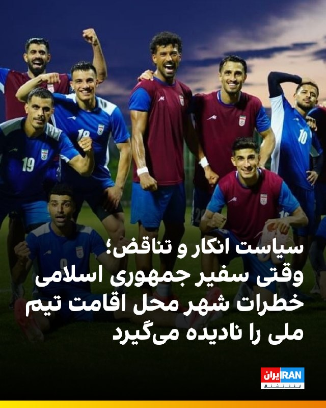

🔻ابوالفضل پسندیده، سفیر جمهوری اسلامی در مکزیک مدعی است که: «تیخوانا فراتر از روایت‌های رسانه‌ای، شهری مدرن و امن برای میزبانی تیم ملی است و مکزیکی‌ها با احترام و محبت منتظر تیم ملی ایران هستند.» آقای پسندیده با رد واقعیت‌های میدانی، موضوع کارتل‌های مواد مخدر را هم کم‌اهمیت و «هیجانی» می‌داند و می‌گوید امنیت تیم تحت نظارت مستقیم دولت فدرال و فیفا قرار دارد.

🔹واقعیت‌های میدانی اما تصویر کاملاً متفاوتی را از این شهر مرزی نشان می‌دهند. تیخوانا بر اساس داده‌های آژانس‌های امنیتی بین‌المللی، یکی از خطرناک‌ترین، ناامن‌ترین و پرحادثه‌ترین شهرهای جهان به شمار می‌رود. وزارت امور خارجه آمریکا به طور مستمر در هشدارهای مسافرتی خود بر نرخ بالای قتل و جنایت در این منطقه تأکید می‌کند. کارتل‌های بزرگ مواد مخدر نظیر سینالوآ و نسل جدید خالیسکو برای کنترل خطوط قاچاق به خاک آمریکا، جنگ‌های خونین و بی‌رحمانه‌ای را در این شهر راه انداخته‌اند که ریسک گرفتار شدن افراد بی‌گناه در تبادل آتش آن‌ها همیشه وجود دارد.

🔹جزییات بیشتر را اینجا بخوانید

@iranintltvsport

## IranIntlTV — post 339372

کارزار مردمی ایران‌اینترنشنال؛ آنچه در شب‌های جنایت رشت اتفاق افتاد

🖋 فرنوش فرجی

بر اساس اطلاعات و روایت‌های شاهدان عینی، ماموران برای سرکوب اعتراض‌ها در رشت، با شلیک مستقیم به مردم، گیر انداختنشان در بازار این شهر حین آتش‌سوزی و ممانعت از امداد‌رسانی، جان صد‌ها نفر را گرفتند.

ایران‌اینترنشنال در کارزاری مردمی، به دنبال ثبت و مستندسازی حقیقت درباره کشتار دی‌ماه در رشت است. اگر شاهد عینی آن شب‌ها بوده‌اید، یا از خانواده و نزدیکان کشته‌شدگان این شهر هستید، روایت و اطلاعات خود را با ما از طریق چت‌بات اینتل‌مدیا در میان بگذارید و در برملا کردن ابعاد این کشتار مشارکت کنید.

در جریان اعتراضات، بخش‌هایی از بازار قدیم رشت از جمله بازار کتابفروشان، بازار طاقی و بازار مسگران دچار آتش‌سوزی شد. یک شاهد عینی به ایران‌اینترنشنال گفت نیروهای سرکوب، معترضان را به مناطقی هدایت کردند که ورودی و خروجی‌های محدود و مشخص داشت و پس از محاصره، آتش‌سوزی در همان محدوده‌ها رخ داد.

محاصره در میان آتش
به گفته این شاهد، بوی آتش، دود و سوختگی آن‌قدر شدید بود که تا نزدیک صبح، هوای رشت از دود مه‌آلود شده بود و بوی سوختگی در بخش‌هایی از شهر به‌شدت احساس می‌شد.

بر اساس روایت‌ها، اعتراضات رشت از چهارشنبه ۱۷ دی‌ماه و با تجمع مردم در بازار آغاز شد. معترضان ابتدا در بازار جمع شدند و از مغازه‌داران خواستند مغازه‌های خود را ببندند. سپس جمعیت به سمت میدان شهرداری حرکت کرد. پس از ورود نیروهای بسیج، جمعیت برای مدتی متفرق شد اما از غروب همان روز، تجمع‌ها بار دیگر در سبزه‌میدان و اطراف خیابان بیستون شکل گرفت.

جمعیتی که از هر جای شهر می‌جوشید
اعتراض‌های ۱۸ دی‌ماه به صورت هم‌زمان در نقاط مختلف شهر شکل گرفت و در خیابان‌های مرکزی به هم پیوند خورد.

روایت‌ها نشان می‌دهند پس از ساعت ۱۰:۳۰ شب، با ورود نیروهای سپاه پاسداران، شدت سرکوب افزایش یافت و شلیک مستقیم با سلاح جنگی آغاز شد.

انگار آمده بودند شکار
یکی از حاضران در تجمع ۱۸ دی‌ماه رشت، وضعیت را این گونه توصیف کرد: «در ساعت‌های اولیه، سرکوب بیشتر دست بسیج بود؛ اما از حدود ۱۰:۳۰ شب، سپاه وارد شد. با کلاشنیکف آمدند. نفر اول موتور را می‌راند و نفر پشتی نشانه می‌گرفت و شلیک می‌کرد. انگار آمده باشند شکار. عمده کشته‌های رشت از همان ساعت شروع شد.»

هنگامی که آتش به بازار رسید
آتش‌سوزی در محدوده بازار رشت زمانی آغاز شد که ماموران در نقاط مختلف شهر درگیر سرکوب مردم بودند.

طبق روایت‌های رسیده به ایران‌اینترنشنال، معترضان و مردم گرفتار در بازار، در برابر دو انتخاب مرگ‌بار قرار گرفته بودند: ماندن در میان دود و آتش، یا تلاش برای خروج از بازار و قرار گرفتن در معرض شلیک نیروهای مسلح.

بخشی از کشته‌شدگان در محدوده بازار، مغازه‌دارانی بودند که برای تخلیه اجناس و نجات اموال خود وارد بازار شده بودند اما در میان آتش و بسته بودن مسیرها گرفتار شدند.

دستور به آتش‌نشان‌ها برای خاموش نکردن آتش
بر اساس اطلاعات رسیده، در ساعات اولیه آتش‌سوزی، خودروهای آتش‌نشانی امکان ورود کامل به محدوده بازار را پیدا نکردند و نخستین خودروها با تاخیر چندساعته به محل رسیدند.

روایت‌هایی نیز به ایران‌اینترنشنال رسیده که بر اساس آن، نهادهای امنیتی از جمله اداره اطلاعات و اطلاعات سپاه پاسداران، به آتش‌نشان‌ها دستور داده بودند فعلا برای مهار آتش وارد عمل نشوند.

شاهدان گفتند برخی معترضان هنگام فرار از محدوده بازار هدف گلوله قرار گرفتند و شماری نیز در میان دود و آتش گرفتار شدند.

شلیک کور به معترضان
شامگاه جمعه ۱۹ دی‌ماه، خشونت نیروهای سرکوب ابعاد گسترده‌تری پیدا کرد. جمعیت کمتری در خیابان‌ها حضور داشت و نیروها بدون هشدار قبلی، به هر تجمع چندنفره شلیک می‌کردند.

خیابان مطهری، خیابان معلم و کوچه‌های اطراف از جمله مناطقی بودند که شاهدان از وجود خون روی آسفالت و شلیک مستقیم در آن‌ها خبر داده‌اند.

فشار مضاعف حکومت به خانواده‌های داغدار
بر اساس گفته خانواده‌ها، پیکر برخی کشته‌شدگان تنها پس از گرفتن تعهد و امضا تحویل داده شده است. تعهدهایی که در آن، خانواده‌ها تحت فشار قرار گرفته‌اند تا بپذیرند عزیزانشان به دست «عوامل اسرائیل و آمریکا» کشته شده‌اند.

ایران‌اینترنشنال در ادامه کارزار مردمی خود برای ثبت حقیقت درباره کشتار دی‌ماه در رشت، از شاهدان عینی، خانواده‌ها و نزدیکان کشته‌شدگان می‌خواهد روایت‌ها، تصاویر، ویدیوها و اطلاعات خود را ارسال کنند تا نام و سرگذشت کشته‌شدگان رشت در سکوت و بی‌خبری دفن نشود.

🔗متن کامل گزارش را اینجا بخوانید
@iranintltv

## IranIntlTV — post 339370

یکی از متهمان پرونده توطئه ترور مسیح علی‌نژاد در نیویورک به ۱۰ سال زندان محکوم شد

وزارت دادگستری آمریکا در بیانیه‌ای اعلام کرد جاناتان لودهولت، شهروند ۳۷ ساله اهل استاتن آیلند نیویورک، به اتهام مشارکت در توطئه جمهوری اسلامی برای ترور مسیح علی‌نژاد، روزنامه‌نگار و فعال سیاسی ایرانی-آمریکایی، به ۱۰ سال زندان محکوم شده است.

بر اساس این بیانیه، لودهولت پیش‌تر به «تبانی برای تعقیب و آزار» و همچنین «تبانی برای پول‌شویی» اعتراف کرده بود.

جان ای. آیزنبرگ، دستیار دادستان کل آمریکا در امور امنیت ملی، اعلام کرد جمهوری اسلامی قصد داشته این روزنامه‌نگار را در خاک آمریکا ترور کند، صرفا به این دلیل که او «شماری از موارد فراوان نقض [حقوق بشر] رژیم را افشا کرده بود».

جی کلیتون، دادستان ناحیه جنوبی نیویورک، نیز گفت جمهوری اسلامی «بارها تلاش کرده علی‌نژاد را درست همین‌جا در شهر نیویورک پیدا کند و به قتل برساند».

به گفته او، جمهوری اسلامی کوشیده علی‌نژاد را «به‌دلیل فعالیت‌هایش در مقابله با رژیم ایران و افشای رفتار تبعیض‌آمیز آن در قبال زنان، فساد، و نقض حقوق بشر ساکت کند».

کلیتون ادامه داد: «اگرچه این توطئه از ایران هدایت می‌شد، اما عاملان احتمالی ترور، شهروندان آمریکایی بودند که از روی طمع و در ازای پول پذیرفتند علی‌نژاد را به قتل برسانند. حکم امروز باید هشداری جدی برای کسانی باشد که بخواهند با اجرای خواسته‌های یک رژیم متخاصم خارجی در خاک ایالات متحده، سودجویی کنند.»

علی‌نژاد از صدور حکم ۱۰ سال زندان برای یکی از متهمان پرونده استقبال کرد و در صفحه اینستاگرامش نوشت: «این پرونده تمام نشده. تا وقتی رژیم ایران در قدرت است، هیچ یک از ما، چه در داخل و چه در خارج، امنیت نخواهیم داشت.»

جزییات پرونده
بر اساس بیانیه وزارت دادگستری آمریکا، کارلایل ریورا، دوست لودهولت و متهم دیگر پرونده، در سال ۲۰۲۴ از سوی فردی به نام فرهاد شاکری ماموریت یافت تا به دستور اعضای بلندپایه سپاه پاسداران، علی‌نژاد را به قتل برساند.

این وزارتخانه افزود سپاه پاسداران و نهادهای اطلاعاتی جمهوری اسلامی در سال‌های گذشته بارها در پی ربودن یا ترور این روزنامه‌نگار بوده‌اند.

در سال‌های ۲۰۲۰ و ۲۰۲۱، مقام‌ها و عوامل اطلاعاتی حکومت ایران توطئه‌هایی را برای ربودن علی‌نژاد از خاک آمریکا و انتقال اجباری او به ایران تدارک دیده بودند.

همچنین در سال ۲۰۲۲، سپاه پاسداران کوشید از اعضای مافیای روس برای اجرای نقشه ترور علی‌نژاد استفاده کند.

پس از ناکامی تمام این طرح‌ها، سپاه پاسداران به شاکری روی آورد. شاکری نیز ریورا را به کار گرفت و ریورا هم لودهولت را برای کمک به خود در تلاش برای قتل علی‌نژاد جذب کرد.

طبق اطلاعات پرونده، شاکری در ازای شناسایی و قتل علی‌نژاد، به ریورا پیشنهاد پرداخت ۱۰۰ هزار دلار داده بود تا او به همراه لودهولت این عملیات را انجام دهند.

به گفته وزارت دادگستری آمریکا، لود‌هولت و ریورا طی چند ماه در تلاش بودند محل حضور علی‌نژاد را شناسایی کنند و او را به قتل برسانند.

این دو نفر با استفاده از خودروی لود‌هولت و پلاک‌های جعلی، او را در چندین موقعیت تعقیب کردند؛ از جمله در جریان یک سخنرانی عمومی در دانشگاه فرفیلد.

همچنین آن‌ها بارها خانه‌ای در بروکلین را که شاکری و سپاه پاسداران تصور می‌کردند محل اقامت این فعال سیاسی است، تحت نظر گرفتند.
پیش‌تر در بهمن ۱۴۰۴، دادگاه، ریورا را به اتهام مشارکت در این توطئه به ۱۵ سال زندان محکوم کرده بود.

واکنش مقام‌های اف‌بی‌آی به صدور حکم زندان برای متهم پرونده
جیمز سی. بارنکل، معاون مسئول اف‌بی‌آی در نیویورک، اعلام کرد لودهولت به‌عنوان «عامل اجیرشده» سپاه پاسداران ماموریت داشت علی‌نژاد را تحت نظر بگیرد، او را تعقیب کند و در نهایت به قتل برساند.

به گفته او، نیروهای مبارزه با تروریسم اف‌بی‌آی پیش از اجرای این طرح وارد عمل شدند و با خنثی‌سازی توطئه، متهم را بازداشت کردند.

بارنکل تاکید کرد اف‌بی‌آی «هرگونه تلاش برای ساکت کردن منتقدان رژیم‌های سرکوبگر در خاک آمریکا را در هم خواهد شکست».

دونالد هولستد، معاون مدیر اف‌بی‌آی، نیز اعلام کرد این نهاد از همه ظرفیت‌ها و منابع خود برای شناسایی و جلوگیری از فعالیت افرادی که در راستای منافع قدرت‌های خارجی اقدام و امنیت افراد در داخل ایالات متحده را تهدید می‌کنند، استفاده خواهد کرد.

🔗وب‌سایت ایران‌اینترنشنال
@iranintltv

## IranIntlTV — post 339369

  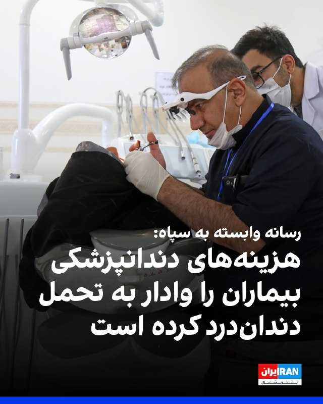

خبرگزاری فارس، وابسته به سپاه پاسداران، در گزارشی با اشاره به هزینه‌های بالای دندانپزشکی و تحت پوشش نبودن بسیاری از خدمات آن از سوی بیمه‌ها، نوشت شماری از بیماران به دلیل ناتوانی مالی، دندان‌درد را تحمل می‌کنند.

بر اساس این گزارش، هزینه عکس OPG در برخی مراکز دندانپزشکی به دو و نیم میلیون تومان رسیده و عصب‌کشی هر دندان نیز بین حدود شش میلیون و ۸۰۰ هزار تا ۱۰ میلیون تومان هزینه دارد.

فارس همچنین نوشت هزینه ایمپلنت هر دندان در برخی کلینیک‌ها تا ۵۰ میلیون تومان می‌رسد.

فارس نوشت هزینه درمان هر دندان به‌طور میانگین بین ۱۵ تا ۴۰ میلیون تومان است، در حالی که بیمه‌های پایه هزینه‌ای بابت آن پرداخت نمی‌کنند.

رسانه وابسته به سپاه به نقل از بیماران گزارش داد بسیاری از مردم به دلیل نداشتن بیمه تکمیلی یا هزینه‌های بالا، درمان دندان‌های خود را به تعویق می‌اندازند تا زمانی که درد شدید آن‌ها را ناچار به مراجعه به دندانپزشکی کند.
https://iranintl.com/202605287521

## IranIntlTV — post 339368

🗣روایت شما از دغدغه‌ معیشت در آتش‌بس- پنجشنبه ۷ خرداد

🔹من سوپرمارکت‌دارم. هفته گذشته قیمت خرید تخمه آفتاب‌گردان کیلویی ۷۵۰ هزار تومان بود و من کیلویی ۹۰۰ هزار تومان می‌فروختم. امروز طبق بار جدید، قیمت خرید شده کیلویی ۹۰۰ هزار تومان.

🔹همه‌چیز خیلی وحشتناک گرون شده؛ بستنی ۱۰۰ هزار تومان، چیپس ۶۰ هزار تومان. حتی چیپس دل‌مز شده ۵۰۰ هزار تومان.

🔹گرونی بیداد می‌کنه؛ یک آب‌معدنی کوچک ساده شده ۲۰ هزار تومان. یک پاکت سیگار شده ۱۵۰ هزار تومان.

🔹دیگه به‌جز نان خالی و پنیر و گاهی ماست نمی‌شه چیز دیگه‌ای خرید. هر چیزی برای خوردن به‌جز نان دیگه زیر یک میلیون تومان نیست؛ کره کیلویی ۱۳۰۰، مرغ ۵۰۰، ماهی کیلویی ۱ میلیون. مردم به درماندگی برای زنده موندن رسیدن.

🔹قبلا به نظامیان ماهانه گوشت، مرغ، برنج، روغن و حبوبات می‌دادن اما الان چند ماهه که خبری نیست. فقط شارژ کارت حکمت هست که مجبوری از اتکا خرید کنی و چند برابر جاهای دیگه‌ست. نه شارژ کارت حکمت افزایش داشته نه حقوق. واقعا نظامیا به چی دل خوش کردن؟

🔹اکثر ایرلاین‌ها تعدیل نیرو داشتن، چندین ماهه که حقوق ندادن، بیمه‌ها رد نشده و هیچ امنیت شغلی وجود نداره.

🔹قبلا می‌گفتم عیب نداره یه غذایی هست بخوریم و یه لباسی هست که بپوشیم اما حالا چی؟ یک کتاب و قهوه شده ۶۰۰ هزار تومان. علی‌کافه شده دونه‌ای ۵۰ هزار تومان و قهوه ساده شده کیلویی ۲ میلیون.

## IranIntlTV — post 339367

  <a href="telegram/content/IranIntlTV_339367_1779963364.mp4" target="_blank">🎬 Download video</a>

یک شهروند با ارسال ویدیویی به ایران اینترنشنال نشان داد که در محله نارمک تهران، شعارهای «جاوید شاه» و «رضا شاه روحت شاد» را دیوارنویسی کرده است.

## IranIntlTV — post 339366

  <a href="telegram/content/IranIntlTV_339366_1779963366.mp4" target="_blank">🎬 Download video</a>

مقام‌های آمریکایی گفتند جمهوری اسلامی چهار پهپاد انتحاری را به سمت کشتی‌های آمریکایی و تجاری شلیک کرد، اما جنگنده‌های آمریکا آن‌ها را سرنگون کردند. به گفته این مقام‌ها، جنگنده‌های اف-۱۸ آمریکا همچنین پیش از پرواز پنجمین پهپاد، واحد کنترل زمینی جمهوری اسلامی را در بندرعباس منهدم کردند.
ارزیابی بیشتر با حسین آقایی، عضو تحریریه ایران‌اینترنشنال
@iranintltv

## IranIntlTV — post 339365

  

شهاب خورشید، ۲۲ ساله و دانشجوی رشته معماری، شامگاه ۱۹ دی‌ماه حوالی ساعت ۲۲ در جریان اعتراضات میدان کاج سعادت‌آباد تهران هدف شلیک گلوله ماموران امنیتی قرار گرفت و در همان محل جان باخت.

بر اساس گزارش‌های رسیده به ایران‌اینترنشنال، گلوله از پشت کتف به او اصابت کرد و دو گلوله جنگی قلب و ریه‌هایش را هدف قرار داد.

شهاب در محل حادثه جان باخت و پیکرش روز بعد در کهریزک به خانواده تحویل داده شد.

به گفته دوستانش، این جوان پیش از پیوستن به تجمعات گفته بود: «مگر خون من از دیگران رنگین‌تر است که در خانه بمانم؟ یا همه‌چیز تغییر می‌کند، یا من هم می‌میرم.»

شهاب خورشید فرزند دوم خانواده و اصالتا اهل اهواز بود. او از بدو تولد با بیماری دیابت درگیر بود و انسولین مصرف می‌کرد.

بستگانش از او به‌عنوان جوانی شجاع، شاد، خوش‌خنده، مهربان و پرانرژی یاد می‌کنند.

پیکر شهاب در قطعه ۲۱۱، ردیف ۲۳، شماره ۱۱ بهشت زهرا به خاک سپرده شده است.

بنا بر گزارش‌های رسیده به ایران‌اینترنشنال، به خانواده او اجازه داده نشد مزاری جداگانه برایش در نظر بگیرند و شهاب در قبر سه‌طبقه خانوادگی و در طبقه بالایی متعلق به پدربزرگش دفن شد.
https://iranintl.

## IranIntlTV — post 339364

  <a href="telegram/content/IranIntlTV_339364_1779963369.mp4" target="_blank">🎬 Download video</a>

ارتش اسرائیل اعلام کرد چهارشنبه تعدادی از ساختمان‌های نظامی، مقرهای فرماندهی و سایت‌های پرتاب مورد استفاده حزب‌الله لبنان را در منطقه البقاع و چندین منطقه دیگر در جنوب لبنان هدف قرار داده است. ارتش این کشور همچنین اعلام کرد ساختمانی در شمال نوار غزه هدف حمله قرار گرفته و در این عملیات، دو فرمانده اصلی حماس کشته شدند.

گفت‌وگو با مئیر جاودانفر، تحلیل‌گر مسائل اسرائیل
@iranintltv

## IranIntlTV — post 339363

  <a href="telegram/content/IranIntlTV_339363_1779963372.mp4" target="_blank">🎬 Download video</a>

ویدیوی رسیده به ایران اینترنشنال نشان‌دهنده فعالیت پدافند بندرعباس در بامداد پنجشنبه ۷ خردادماه است.

## IranIntlTV — post 339362

  

یعقوب مجاهد، وزیر دفاع طالبان، در دیدار با علی باقری کنی، معاون دبیر شورای عالی امنیت ملی جمهوری اسلامی، در مسکو گفت خاک و فضای افغانستان هیچ‌گاه منبع تهدید علیه ایران نبوده و طالبان این موضوع را در جنگ اخیر آمریکا و جمهوری اسلامی ثابت کرده است.

دو طرف روز چهارشنبه در حاشیه چهاردهمین نشست مقام‌های ارشد امنیتی جهان در مسکو دیدار کردند.

ایرنا، خبرگزاری دولت جمهوری اسلامی، نوشت باقری کنی به مجاهد گفت آمریکا و اسرائیل «دشمنان مشترک» کشورهای منطقه هستند.
https://iranintl.com/202605288001

## IranIntlTV — post 339361

  <a href="telegram/content/IranIntlTV_339361_1779963376.mp4" target="_blank">🎬 Download video</a>

ویدیوی ارسالی به ایران اینترنشنال نشان می‌دهد که ششم خردادماه تعدادی از ایرانیان ساکن ایالت تگزاس آمریکا برای نشان دادن خواست تغییر رژیم و اعتراض به اعدام‌ها در ایران، تجمعی در شهر هیوستون برگزار کردند.

## IranIntlTV — post 339360

  

محمدباقر قالیباف، رییس مجلس، در پیامی به غلامحسین محسنی اژه‌ای، رییس قوه قضاییه جمهوری اسلامی، نوشت: «قوه قضاییه زیر بمباران و تهدید دشمنان دست از صیانت از حقوق مردم و برخورد با قاتلان داخلی و خائنین به ملت نکشید و خوش درخشید.»

پیام قالیباف در حالی منتشر شده که قوه قضاییه طی ۷۰ روز گذشته، حدود ۴۰ زندانی سیاسی را اعدام کرده است.
https://iranintl.com/202605285024

## Shin_Persian — post 6270

🔁 Quoting above tweet:
Shin ✓ @hey_itsmyturn
Thu, 28 May 2026 09:55:51 UTC

ICYMI

فارسی

جهت اطلاع کسانی که مطلع نشده‌اند (ICYMI)

𝕏 · @shin_persian

## Shin_Persian — post 6269

  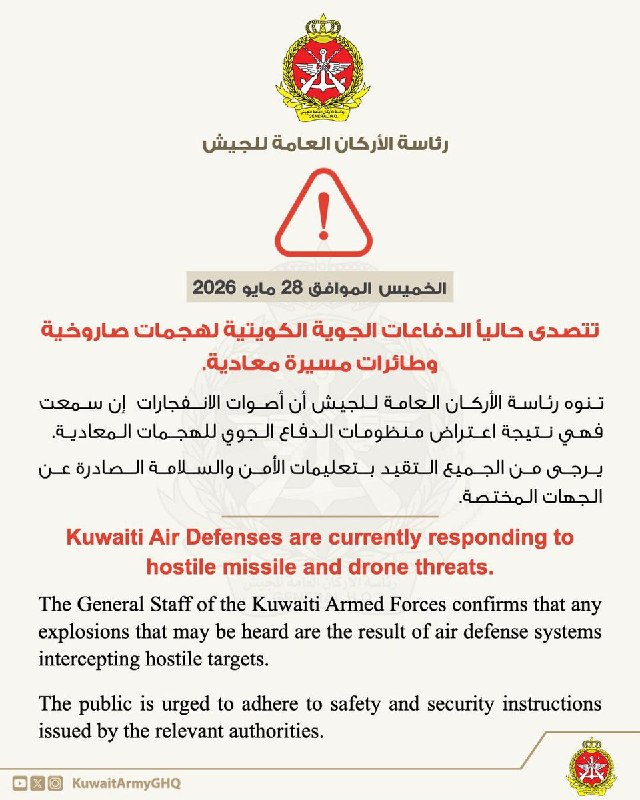

↩️ Quoted tweet: KUWAIT ARMY - الجيش الكويتي ✓ @KuwaitArmyGHQ Thu, 28 May 2026 02:40:14 UTC تتصدى حالياً الدفاعات الجوية الكويتية لهجمات صاروخية وطائرات مسيرة معادية. تنوه رئاسة الأركان العامة للجيش أن أصوات الانفجارات إن سمعت فهي نتيجة اعتراض منظومات الدفاع…

## Shin_Persian — post 6268

↩️ Quoted tweet:
KUWAIT ARMY - الجيش الكويتي ✓ @KuwaitArmyGHQ
Thu, 28 May 2026 02:40:14 UTC

تتصدى حالياً الدفاعات الجوية الكويتية لهجمات صاروخية وطائرات مسيرة معادية.

تنوه رئاسة الأركان العامة للجيش أن أصوات الانفجارات إن سمعت فهي نتيجة اعتراض منظومات الدفاع الجوي للهجمات المعادية.

يرجى من الجميع التقيد بتعليمات الأمن والسلامة الصادرة عن الجهات المختصة.

↩️ Quoted tweet — see the post below for the reply.

English

Kuwaiti air defenses are currently intercepting hostile missile and drone attacks.

The General Staff of the Army notes that any sounds of explosions heard are the result of air defense systems intercepting these hostile attacks.

Everyone is requested to adhere to the security and safety instructions issued by the competent authorities.

𝕏 · @shin_persian

## FarsiVOA — post 218874

🔺ایالات متحده اعلام کرد سفارتش در کی‌یف همچنان باز است

▪️سفارت ایالات متحده در کی‌یف روز پنج‌شنبه اعلام کرد که همچنان باز است و گزارش‌ها درباره تغییر در عملیات خود را در پی هشدارهای روسیه مبنی بر اینکه دیپلمات‌ها و خارجی‌ها باید پیش از تشدید حملات، پایتخت اوکراین را ترک کنند، رد کرد.

▪️برخی رسانه‌های اوکراینی روز پنج‌شنبه به نقل کایا کالاس، مسئول سیاست خارجی اتحادیه اروپا، گزارش دادند که سفارت آمریکا در کی‌یف تعطیل شده است.

▪️اما سفارت آمریکا در کی‌یف در شبکه اجتماعی ایکس، نوشت: «سفارت آمریکا باز است. هیچ تغییری در فعالیت ما وجود ندارد و گزارش‌های خلاف آن، نادرست است.»

⬇️ بیشتر بخوانید:
https://ir.voanews.com/a/us-says-its-embassy-in-kyiv-remains-open/8154812.html

## FarsiVOA — post 218873

  <a href="telegram/content/FarsiVOA_218873_1779963380.mp4" target="_blank">🎬 Download video</a>

ارتش اسرائیل اعلام کرد که پنجشنبه موجی از حملات هوایی را علیه زیرساخت‌های حزب‌الله در شهر ساحلی صور در لبنان آغاز کرد.

آویخای ادرعی، سخنگوی ارتش اسرائیل، روز چهارشنبه درباره حمله به چندین نقطه در صور هشدار داده بود.

خبرگزاری رسمی لبنان گزارش داد که صبح پنج‌شنبه دو رشته حمله اسرائیل به شهر صور و منطقه‌ای در شرق آن انجام شد که یک ساختمان را هدف قرار داد و باعث آتش‌سوزی شد.

رویترز نیز ویدئوی منتشر شده توسط شاهدان عینی در روز پنج‌شنبه را که لحظه حمله اسرائیل به ساختمان‌هایی در شهر صور را نشان می‌دهد، تایید کرد.

ارتش اسرائیل روز چهارشنبه بخش جدیدی از جنوب لبنان را منطقه جنگی اعلام کرد و از ساکنان آن خواست به سمت شمال حرکت کنند. این ارتش هشدار داد که علیه گروه مسلح حزب‌الله در این منطقه «با قدرت بسیار زیاد» اقدام خواهد کرد.

تنش‌ها در روزهای اخیر میان اسرائیل و حزب‌الله افزایش یافته و روز سه‌شنبه نیز ارتش اسرائیل حملاتی به جنوب و شرق لبنان انجام داد.
@FarsiVOA

## FarsiVOA — post 218872

  

مهلت ثبت‌نام داوطلبان آزمون سراسری سال ۱۴۰۵ دانشگاه‌ها و موسسات آموزش عالی و همچنین آزمون پذیرش دانشجو معلم، روز جمعه هشتم خرداد پایان می‌یابد.

این در حالی است که تا این لحظه زمان دقیق برگزاری امتحانات نهایی پایه‌ دوازدهم مدارس و همچنین کنکور اعلام نشده و دانش‌آموزان نمی‌دانند چه زمانی باید در جلسه امتحان حضور یابند.

سازمان سنجش آموزش کشور روز ۳۰ اردیبهشت اعلام کرد «زمان دقیق برگزاری کنکور و پذیرش دانشجو معلمان»، یک هفته قبل از آزمون اعلام می‌شود.

از سوی دیگر، علی فرهادی، سخنگوی وزارت آموزش‌وپرورش، نیز اعلام کرده که تکلیف نحوه برگزاری امتحانات نهایی دانش‌آموزان پایه یازدهم و دوازدهم، تا نیمه مرداد ماه مشخص می‌‌شود.

امتحانات نهایی پایه دوازدهم از این جهت قابل اهمیت است که نتایج آن به صورت مستقیم در نتایج کنکور تاثیر می‌گذارد.

پیشتر حمیدرضا حاجی‌بابایی، نایب رئیس مجلس اعلام کرده بود که امتحانات نهایی، ۱۵ روز و کنکور سراسری ۴۵ روز پس از پایان جنگ برگزار خواهد شد.
@FarsiVOA

## FarsiVOA — post 218871

  <a href="telegram/content/FarsiVOA_218871_1779963384.mp4" target="_blank">🎬 Download video</a>

ارتش اسرائیل اعلام کرد در جریان یک حمله هوایی خود به جنوب نوار غزه در روز سه‌شنبه گذشته یک «مقام ارشد مالی» حماس کشته شده است.

ارتش اسرائیل روز پنجشنبه اعلام کرد که این حمله در خان‌یونس انجام شد و ایهاب کریزم، مسئول یک شبکه مرکزی برای انتقال پول به حماس در جریان این حمله کشته شد.

به گفته ارتش اسرائیل، کریزم مسئول «مدیریت انتقال میلیون‌ها دلار به شاخه نظامی حماس» بوده و اخیراً نیز «به نقض توافق آتش‌بس ادامه داده است»؛ اقداماتی که به گفته ارتش اسرائیل، باعث شد حماس بتواند حملات علیه نیروها و غیرنظامیان اسرائیلی را پیش ببرد.

طبق اعلام ارتش اسرائیل، در این حمله همچنین محمد الهباش، یک فرمانده مقر تولید تسلیحات حماس، نیز کشته شد.

همزمان ارتش اسرائیل پنجشنبه گزارش داد که نیروهای واحد کماندویی این ارتش، تحت هدایت شاباک، طی دو روز گذشته در چند عملیات در کرانه باختری هفت فلسطینی مظنون به تروریسم را بازداشت کردند؛

بر اساس این گزارش، برخی متهم به برنامه‌ریزی حملات قریب‌الوقوع علیه اسرائیل بودند.

ارتش اسرائیل اعلام کرد همه بازداشت‌شدگان برای بازجویی بیشتر به نیروهای امنیتی تحویل داده شدند.
@FarsiVOA

## FarsiVOA — post 218870

🔺افزایش ۵ تا ۴۵ برابری تعرفه برق «پرمصرف‌ها»

▪️مدیرکل دفتر مدیریت انرژی و مشتریان توانیر از افزایش ۵ تا ۴۵ برابری تعرفه برق خانوارهای «پرمصرف» خبر داد.

▪️او مدعی شد مصرف برق یک چهارم مشترکین خانگی بالاتر از الگوی مصرف است و نیم درصد مشترکین هم «بسیار بدمصرف» هستند.

▪️طبق گزارش‌های توانیر، بخش خانگی تنها حدود یک سوم برق کشور را مصرف می‌کند و سرانه مصرف برق بخش خانگی ایران حدود ۱۱۰۰ کیلووات ساعت در سال است؛ رقمی که ۶۰ درصد کمتر از اتحادیه اروپا و چندین برابر کمتر از آمریکا و کشورهای عرب حوزه خلیج فارس است.

▪️جمهوری اسلامی طی یک دهه گذشته حتی نیمی از اهداف رشد تولید برق را نتوانسته محقق کند و اکنون در فصول گرم سال با ۲۰ تا ۲۵ درصد کسری برق مواجه است.

⬇️ بیشتر بخوانید:
https://ir.voanews.com/a/iran-5-to-45-times-increase-in-electricity-tariffs-for-high-consumption-consumers/8154811.html

## FarsiVOA — post 218869

  

رئیس اتحادیه صنف چاپخانه‌داران و صحاف تهران، اعلام کرد که بخش قابل توجهی افزایش قیمت کالاها و اجناس، ناشی از هزینه بسته‌بندی و افزایش ۲۰۰ تا ۴۰۰ درصدی قیمت مواد اولیه صنعت چاپ است.

بابک عابدین به خبرگزاری ایلنا گفته است که هزینه‌ بسته‌بندی و چاپ، تأثیر مستقیم بر تورم قیمت کالاهای اساسی داشته است.

او یادآور شد که بخش قابل توجهی از این افزایش قیمت، ناشی از هزینه بسته‌بندی است، زیرا برای تهیه مواد اولیه مانند پلیمرها، آلومینیوم و کاغذ مجبور به پرداخت هزینه‌های چندبرابری هستیم.

به گفته رئیس اتحادیه صنف چاپخانه‌داران، این هزینه‌ها مستقیماً به صنایع مصرفی منتقل و در نهایت به صورت تورم شدید به مصرف‌کننده تحمیل می‌شود.

عابدین یادآور شد که پس از جنگ، قیمت موادی مانند آلومینیوم و ورق‌های چاپ‌پذیری که در بسته‌بندی استفاده می‌شوند به سطح بی‌سابقه‌ای رسیده است.
@FarsiVOA

## FarsiVOA — post 218868

  

دنی دانون، سفیر اسرائیل در سازمان ملل، اعلام کرد که این سازمان اسرائیل را فهرست ناقضان مرتبط با «خشونت جنسی در مناطق درگیری» و در کنار «بی‌رحم‌ترین سازمان‌های تروریستی جهان مثل حماس و داعش» قرار داده است.

آقای دانون در سخنانی ویدیویی که روز پنجشنبه در شبکه اجتماعی ایکس منتشر شد، گفت: «این یک تصمیم سیاسی است! جدا از واقعیت‌ها و حقیقت!»

او افزود: «اسرائیل برای هر ادعا، شواهد، اسناد و پاسخ‌های مفصل ارائه کرده است. ما از نمایندگان سازمان ملل دعوت کردیم به منطقه بیایند و از نزدیک موضوع را بررسی کنند، و آن‌ها البته ترجیح دادند این کار را نکنند. وقتی واقعیت‌ها با روایت مورد نظرشان همخوانی ندارد، در سازمان ملل به‌سادگی روایت را تغییر می‌دهند.»

رسانه‌های اسرائیلی گزارش دادند که اسرائیل قصد دارد همکاری خود با دفتر آنتونیو گوترش، دبیرکل سازمان ملل، را در پی این تصمیم متوقف کند.

در گزارش پیشین که ژوئیه ۲۰۲۵ از سوی دفتر گوترش منتشر شد، حماس در فهرست «طرف‌هایی که به‌طور جدی مظنون به ارتکاب یا مسئول رفتار تجاوز یا دیگر اشکال خشونت جنسی در موقعیت‌های درگیری مسلحانه هستند» قرار گرفته بود.
@FarsiVOA

## FarsiVOA — post 218867

  

قیمت‌های جهانی نفت در پی واکنش ایالات متحده به حملات پهپادی جمهوری اسلامی به یک کشتی آمریکایی و هدف قرار دادن مواضع جمهوری اسلامی افزایش یافت.

قیمت نفت شاخص برنت روز پنج‌شنبه با رشدی بالای ۳.۵ درصدی به نزدیک ۹۸ دلار رسید.

ارزش سهام در بازارهای بورس جهانی، خصوصا آمریکا، نیز در پی افزایش تنش‌های خاورمیانه مقداری افت کرد.

سایت تسنیم، نزدیک به سپاه پاسداران، به نقل از فردی که او را یک «منبع آگاه نظامی» خواند، اوایل روز پنج‌شنبه به وقت محلی گزارش داد که نیروهای سپاه به یک «نفتکش آمریکایی» که قصد داشت از تنگه هرمز عبور کند، حمله کردند.

آمریکا می‌گوید در اقدامی تدافعی، چهار پهپاد انفجاری جمهوری اسلامی را رهگیری و منهدم کرد و یک مرکز پهپاد در ایران را پیش از پرتاب پنجمین پهپاد، هدف حمله قرار داد.
@FarsiVOA

## DW_Farsi — post 125221

  

🔶 یک مقام روس: ایران از شروع یک جنگ جدید جلوگیری کند

شرکت دولتی انرژی هسته‌ای روسیه تصمیم گرفته است بازگشت کارکنان خود به نیروگاه هسته‌ای بوشهر در ایران را به تعویق بیندازد. این خبر را الکسی لیخاچف، رئیس روس‌اتم، روز چهارشنبه اعلام کرد. روس‌اتم پیش‌تر ۸۱۳ نفر از کارکنان خود را از این سایت تخلیه کرده بود و تنها ۲۰ نفر را در محل باقی گذاشته بود.

همزمان یک مقام امنیتی روسیه در دیدار با علی باقری‌کنی، معاون دبیر شورای عالی امنیت ملی جمهوری اسلامی از حکومت ایران خواست تا از شروع مجدد جنگجلوگیری کند.

به گزارش پرس‌نیوز، خبرگزاری انگلیسی‌زبان صداوسیمای جمهوری اسلامی، الکساندر وندیکتوف، معاون دبیر شورای امنیت روسیه، حکومت ایران را به دنبال کردن "یک معماری امنیتی جهانی جدید" تشویق کرده است.

ندیکتوف در دیدار با باقری‌کنی گفته است: «آنچه از اهمیت فوق‌العاده برخوردار است، جلوگیری از شعله‌ور شدن دوباره یک رویارویی نظامی و هموار کردن مسیر برای ایجاد یک نظم امنیتی جدید در منطقه است. ما آماده‌ایم این روند را از طریق همه ابزارهای موجود تسهیل کنیم.»

@dw_farsi

## DW_Farsi — post 125220

🔶 نروژ به چتر بازدارندگی هسته‌ای فرانسه پیوست

امانوئل مکرون، رئیس‌جمهوری فرانسه، و یوناس گار استوره، نخست‌وزیر نروژ، اعلام کرده‌اند اسلو به طرح بازدارندگی هسته‌ای تحت رهبری پاریس پیوسته است. بر پایه این طرح، فرانسه که تنها قدرت هسته‌ای اتحادیه اروپاست، می‌خواهد از ظرفیت هسته‌ای خود برای تقویت امنیت شرکای اروپایی استفاده کند.

به نوشته فرانس ۲۴ یوناس گار استوره گفت اروپا با جدی‌ترین وضعیت امنیتی از زمان جنگ جهانی دوم روبه‌روست و توافق دفاعی تازه با فرانسه در همین چارچوب امضا شده است. او افزود نروژ در ماه‌های گذشته با آلمان و بریتانیا نیز توافق‌های دفاعی امضا کرده و اکنون با فرانسه هم به یک چارچوب جامع همکاری رسیده است.

مکرون هم گفت نروژ، به‌عنوان یک شریک مهم جغرافیایی و راهبردی، می‌تواند ارزش افزوده‌ای جدی برای این بازدارندگی تقویت‌شده ایجاد کند.

مکرون این برنامه را در ماه مارس معرفی کرده بود. بر اساس این طرح، کشورهای عضو می‌توانند به‌طور موقت میزبان «نیروهای راهبردی هوایی» فرانسه شوند؛ حضوری که از نگاه پاریس، محاسبات دشمنان بالقوه را پیچیده‌تر می‌کند و بازدارندگی اروپا را بالا می‌برد.

پیش از نروژ، هشت کشور دیگر به این چارچوب پیوسته بودند: بلژیک، دانمارک، آلمان، یونان، هلند، لهستان، سوئد و بریتانیا.

@dw_farsi

## DW_Farsi — post 125219

  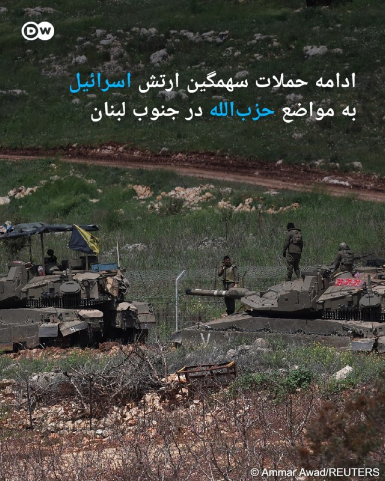

🔶 ادامه حملات سهمگین ارتش اسرائیل به مواضع حزب‌الله در جنوب لبنان

ارتش اسرائیل از موج حملات تازه به زیرساخت‌های گروه حزب‌الله در شهر صور لبنان خبر داد. بر اساس گزارش رسانه‌های لبنانی، ارتش اسرائیل شهرک حاروف در جنوب لبنان را هدف حمله‌ هوایی هدف قرار داد.

همچنین خبرها حاکی از کشته شدن یک سرباز اسرائیلی در پی حمله پهپادی حزب‌الله به شمال اسرائیل است. در همین راستا ارتش اسرائیل تایید کرد که یک سرباز اسرائیلی در حمله پهپادی حزب‌الله به شمال این کشور در نزدیکی مرز لبنان کشته شد. حمله پهپادی حزب‌الله لبنان همچنین به مجروح شدن دو نظامی اسرائیلی منجر شد. جراحت یکی از این مجروحان جدی گزارش شده است.

درگیری میان اسرائیل و حزب‌الله روز چهارشنبه تشدید شد. بر اساس اعلام منابع اسرائیلی، ارتش این کشور بیش از ۱۵۰ هدف را در صور، نبطیه، دره بقاع و سراسر جنوب لبنان هدف قرار داد و حزب‌الله نیز پهپادهایی را به سمت روش هانیکرا و شلومی پرتاب کرد. همچنین گزارش شده که آژیرهای اعلام خطر در کریات شمونا به صدا درآمدند.

آویخای ادرعی، سخنگوی عربی‌زبان ارتش اسرائیل، در روز چهارشنبه با ارائه فهرستی طولانی‌ از شهرها و روستاها به شهروندان لبنانی ساکن این مناطق هشدار داد که از شمال رودخانه زهرانی یا دست‌کم از مناطق وابسته به حزب‌الله فاصله بگیرند.

او گفت: «با توجه به نقض توافق آتش‌بس از سوی سازمان تروریستی حزب‌الله، ارتش اسرائیل مجبور است با قدرت علیه آن اقدام کند و قصد آسیب رساندن به شما را ندارد.»

@dw_farsi

## DW_Farsi — post 125218

  

🔶 رئیس کمیسیون امنیت ملی مجلس: از "خطوط قرمز" عقب‌نشینی نخواهیم کرد

ابراهیم عزیزی، رئیس کمیسیون امنیت ملی و سیاست خارجی مجلس شورای اسلامی گفت که جمهوری اسلامی "از خطوط قرمز خود مانند حق غنی‌سازی، اورانیوم غنی‌شده، مدیریت تنگه هرمز و لغو تحریم‌ها عقب‌نشینی نخواهد کرد".

به گزارش خبرگزاری مهر، رئیس کمیسیون امنیت ملی مجلس شورای اسلامی همچنین در ادامه اظهارات خود، تهدیدات دونالد ترامپ، رئیس جمهور آمریکا را "لفاظی" خواند و مدعی شد: «دیگر همه می‌دانند ترامپ برای نجات خود از این بن‌بست راهبردی یک روز از ابزار تهدید استفاده می‌کند و روز دیگر برای توافق التماس‌ می‌کند!»

@dw_farsi

## DW_Farsi — post 125217

  

📸 کاریکاتور هفته

چند ماه از قتل‌عام دی‌ماه در ایران گذشته است؛ جنگی میان جمهوری اسلامی، آمریکا و اسرائیل درگرفت. اینترنتی که نزدیک به سه ماه قطع بود، حالا کم‌کم دارد وصل می‌شود و زمزمه‌های توافقی میان رژیم و آمریکا به گوش می‌رسد؛ توافقی که هنوز امکان تحقق و ابعادش در هاله‌ای از ابهام قرار دارد. هم‌زمان، گروه‌های مختلف اپوزیسیون سرگرم جدال، حذف معنوی و مقصر دانستن یکدیگرند. اما شاید در میان همه این آشوب‌ها، یک چیز بیش از هر چیز دیگر قطعی به نظر برسد: عادی شدن گرفتن جان شهروندان ایرانی به جرم مخالفت و خواستنِ تغییر.

این موضوع دستمایه مانا نیستانی در طراحی کاریکاتور هفته برای دویچه وله فارسی بوده است.

@dw_farsi

## DW_Farsi — post 125215

  <a href="telegram/content/DW_Farsi_125215_1779963393.mp4" target="_blank">🎬 Download video</a>

🎥 یک کانگوروی بازیگوش تحت تعقیب پلیس تگزاس

یک کانگورو به اسم بینگوس از یک مرکز حفاظت از حیات وحش در منطقه ویکو در ایالت تگزاس فرار کرد. بینگوس پس از تعقیب و گریزی کوتاه توسط مأموران پلیس، در سلامت کامل به مرکز حفاظت حیات وحش بازگردانده شد.

@dw_farsi

## DW_Farsi — post 125214

  

🔶 وزارت خزانه‌داری آمریکا نهاد مسئول اخذ عوارض از تنگه هرمز را تحریم کرد

ایالات متحده آمریکا نهاد موسوم به "نهاد مدیریت آبراه خلیج فارس" که جمهوری اسلامی برای کنترل تنگه هرمز تاسیس کرده بود را تحریم کرد. در همین راستا وزارت خزانه‌داری آمریکا اعلام کرد که این نهاد را در فهرست تحریم‌های خود قرار داده است.

این نهاد که حکومت ایران اخیرا از تاسیس آن خبر داده بود، مسئول "هماهنگی، صدور مجوز عبور و تعیین مقررات تردد کشتی‌ها در تنگه هرمز" اعلام شده است. جمهوری اسلامی با اعلام این خبر تلاش کرده بود، از اهرم کنترل بر عبور و مرور دریایی بر تنگه هرمز استفاده کند.

پیش از این، دفتر کنترل دارایی‌های خارجی وزارت خزانه‌داری آمریکا هشدار داده بود که هرگونه پرداخت مبلغ عوارض به حکومت ایران برای دریافت مجوز عبور از تنگه هرمز می‌تواند به تحریم افراد و شرکت‌های دخیل در آن منجر شود.

این اقدام تحریمی که نخستین بار خبرگزاری آسوشیتدپرس آن را گزارش داد، تازه‌ترین تلاش ایالات متحده آمریکا برای استفاده از اهرم اقتصادی در کنار اقدام نظامی به‌منظور وادار کردن رهبری حکومت ایران به توافق است.

به گفته برخی از ناظران سیاسی، عوارضی که این نهاد تحریم‌شده می‌تواند دریافت کند ممکن است تا ۲ میلیون دلار برای هر کشتی برسد.

فشار جمهوری اسلامی بر تنگه هرمز باعث شوک‌های انرژی در سراسر جهان شده است. قیمت نفت، گاز و محصولات مرتبط افزایش یافته و کارشناسان می‌گویند حتی پس از بازگشایی این آبراه، بازگشت وضعیت حمل‌ونقل دریایی و قیمت‌ها به شرایط عادی ممکن است چند هفته یا حتی چند ماه طول بکشد.

در مقابل، ایالات متحده آمریکا بیش از یک ماه است که بنادر ایران را محاصرهدریایی کرده و ترامپ گفته است این محاصره "تا زمانی که توافقی حاصل، تایید و امضا شود، به طور کامل برقرار خواهد ماند".

@dw_farsi

## Persian_Trend_Official — post 15175

  <a href="telegram/content/Persian_Trend_Official_15175_1779963397.mp4" target="_blank">🎬 Download video</a>

ارتش روسیه در حال استقرار سامانه‌های پدافند هوایی Pantsir-S1 بر روی پشت‌بام‌برجی ۴۲ طبقه در مسکو با استفاده از هلیکوپترهای Mil Mi-26 است

👩‍💻@PhantomDirective

🆔@persian_trend_official
پرشین ترند | متفاوت‌ترین کانال نظامی

## Persian_Trend_Official — post 15174

  <a href="telegram/content/Persian_Trend_Official_15174_1779963400.webm" target="_blank">🎬 Download video</a>

🌲 - 🇱🇧🇮🇱 مردی که در جاده شبریه-صور رانندگی می‌کرد، تماس تلفنی دریافت کرد(از سمت اسرائیلی ها)که هشدار می‌داد وسیله نقلیه‌اش هدف قرار خواهد گرفت. او وسط جاده از ماشین بیرون پرید و فرار کرد.

نیروهای دفاع مدنی شاخه ای از جنبش عمل (مثل هلال احمر خودمون )به عنوان اقدام احتیاطی جاده را پیش از حمله بستند.

👩‍💻@PhantomDirective

🆔@persian_trend_official
پرشین ترند | متفاوت‌ترین کانال نظامی

## Persian_Trend_Official — post 15173

  

👑
➖
🤴
➖
🇮🇱
پست ساعاتی قبل کانال اسرائیل به فارسی

👩‍💻@PhantomDirective

🆔@persian_trend_official
پرشین ترند | متفاوت‌ترین کانال نظامی

## Persian_Trend_Official — post 15172

  <a href="telegram/content/Persian_Trend_Official_15172_1779963401.mp4" target="_blank">🎬 Download video</a>

©️تصاویری از حمله نیروی هوایی به مقر حزب‌الله در محله الاثار در شهر صور در جنوب لبنان
©️

👩‍💻@PhantomDirective

🆔@persian_trend_official
پرشین ترند | متفاوت‌ترین کانال نظامی

## Persian_Trend_Official — post 15171

  

🇮🇱
🇱🇧 اسرائیل دستور تخلیه کل جنوب لبنان را صادر کرده ، که شامل تمام مناطق جنوب رودخانه لیتانی می‌شود.

👩‍💻@PhantomDirective

🆔@persian_trend_official
پرشین ترند | متفاوت‌ترین کانال نظامی

## Persian_Trend_Official — post 15170

  

البيت سیستمز قراردادی به ارزش ۳۵۰ میلیون دلار برای ارتقاء تانک‌ها از یک مشتری بین‌المللی دریافت کرد.

، حیفا، اسرائیل، ۲۸ مه ۲۰۲۶ // — شرکت البیت سیستمز امروز اعلام کرد که قراردادی به ارزش تقریبی ۳۵۰ میلیون دلار از یک مشتری بین‌المللی برای ارتقاء تانک‌های اصلی میدان نبرد (MBT) دریافت کرده است. این برنامه شامل یکپارچه‌سازی سامانه‌های پیشرفته کنترل آتش، سامانه‌های الکتریکی هدایت توپ و برجک، راهکارهای ارتباطی و آگاهی محیطی، و همچنین بسته ارتقاء میان‌عمر (Mid Life Upgrade) است. اجرای این قرارداد طی چهار سال انجام خواهد شد.
بر اساس این قرارداد، البیت سیستمز سامانه‌های تانک‌ها را برای افزایش عمر عملیاتی و ارتقاء آمادگی رزمی آن‌ها نوسازی خواهد کرد. این برنامه ارتقاء شامل جایگزینی و بهبود سامانه‌های کلیدی روی تانک است و از جمله تجهیزاتی مانند سامانه‌های دید الکترواپتیکی سبک‌وزن و با کارایی بالا با قابلیت‌های هوش مصنوعی (AI) را در بر می‌گیرد که امکان مشاهده در روز و شب، و همچنین شناسایی و رهگیری پیشرفته اهداف را فراهم می‌کنند.
این قرارداد همچنین شامل تأمین قطعات یدکی و ارائه خدمات نگهداری و پشتیبانی فنی برای تضمین آمادگی عملیاتی بلندمدت است. افزون بر این، یک سامانه ارتباط صوتی امن و با ظرفیت بالا نیز در این پروژه یکپارچه خواهد شد.

👩‍💻@PhantomDirective

🆔@persian_trend_official
پرشین ترند | متفاوت‌ترین کانال نظامی

## Persian_Trend_Official — post 15169

  

بیانیه ارتش دفاعی اسرائیل (IDF):

در واکنشی سریع ارتش دفاعی اسرائیل سر شبکه مرکزی انتقال وجوه حماس را از بین برد.

روز سه‌شنبه، ارتش دفاعی اسرائیل در منطقه خان یونس ضربه‌ای وارد کرد و ایهاب خریزم، سر شبکه مرکزی انتقال وجوه حماس را از بین برد.

ایهاب خریزم مسئول مدیریت انتقال میلیون‌ها دلار به شاخه نظامی حماس بود. در ماه‌های اخیر، خریزم به نقض توافق آتش‌بس ادامه داد و فعالیت‌های او به سازمان تروریستی امکان داد حملات فوری علیه نیروهای ارتش دفاعی اسرائیل و غیرنظامیان اسرائیلی انجام دهد.

از بین بردن خریزم ضربه قابل توجهی به تلاش‌های بازسازی و تقویت نیروهای حماس وارد می‌کند.

علاوه بر خریزم، در جریان این حمله، ارتش دفاعی اسرائیل محمد الحباش، فرمانده واحد در ستاد تولید حماس را نیز از بین برد. در طول جنگ، الحباش در ساخت سلاح برای حماس مشارکت داشت.

قبل از حمله، اقداماتی برای کاهش آسیب به غیرنظامیان انجام شد، از جمله استفاده از مهمات دقیق و نظارت هوایی.

نیروهای ارتش دفاعی اسرائیل تحت فرماندهی جنوبی مطابق با توافق آتش‌بس مستقر باقی مانده و به عملیات برای رفع هر تهدید فوری ادامه خواهند داد.

👩‍💻@PhantomDirective

🆔@persian_trend_official
پرشین ترند | متفاوت‌ترین کانال نظامی

## Persian_Trend_Official — post 15168

  <a href="telegram/content/Persian_Trend_Official_15168_1779963405.mp4" target="_blank">🎬 Download video</a>

سپاه پاسداران تصاویری از حملات موشکی بامداد امروز خود به کویت را منتشر کرد.

طبق ویدیو منتشر شده توسط رسانه های سپاه پاسداران در این حمله از موشک‌ های بالستیک سوخت جامد کوتاه برد و میان برد خانواده فاتح استفاده شده است.

📝 Amir

📌 @persian_trend_official
پرشین ترند | متفاوت‌ترین کانال نظامی

## Persian_Trend_Official — post 15167

  <a href="telegram/content/Persian_Trend_Official_15167_1779963407.webm" target="_blank">🎬 Download video</a>

سناتور جمهوری‌خواه لیندسی گراهام: اگر ترامپ به عادی‌سازی روابط بین اسرائیل و عربستان سعودی دست یابد، باید اسم جایزه نوبل را به جایزه ترامپ تغییر دهند.

📝 Amir

📌 @persian_trend_official
پرشین ترند | متفاوت‌ترین کانال نظامی

## Persian_Trend_Official — post 15166

  <a href="telegram/content/Persian_Trend_Official_15166_1779963408.mp4" target="_blank">🎬 Download video</a>

🎥 ویدیویی از ترافیک تنگه هرمز

👩‍💻@PhantomDirective

🆔@persian_trend_official
پرشین ترند | متفاوت‌ترین کانال نظامی

## Persian_Trend_Official — post 15164

  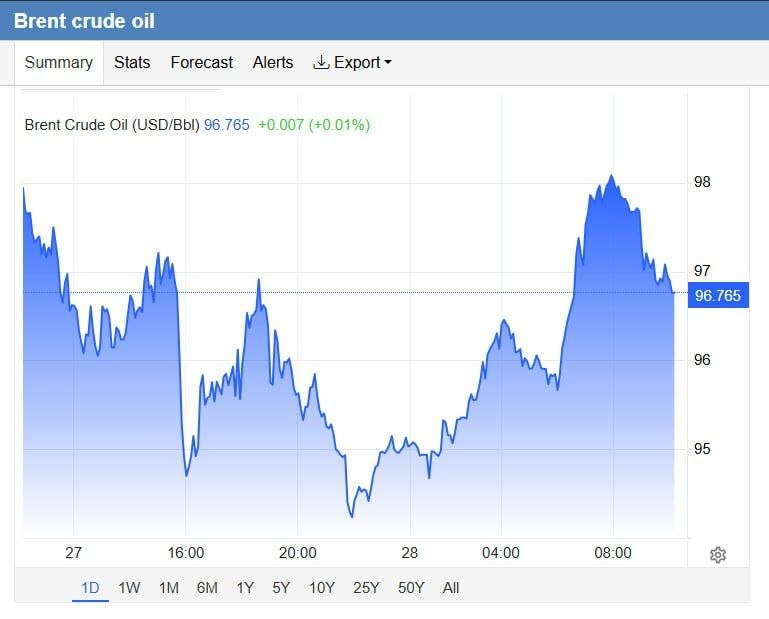

online:
Brent=96.71 | WTI=90.97

👩‍💻@PhantomDirective

🆔@persian_trend_official
پرشین ترند | متفاوت‌ترین کانال نظامی

## Persian_Trend_Official — post 15163

  

هاآرتص: سازمان ملل متحد اسرائیل را به فهرست سیاه مرتکبان خشونت جنسی در مناطق جنگی اضافه کرد!

به گزارش هاآرتص، دنی دانون سفیر اسرائیل در سازمان ملل، روز پنجشنبه اعلام کرد که سازمان ملل متحد، اسرائیل را به فهرست سیاه عاملان خشونت جنسی در مناطق جنگی اضافه کرده و آن را در کنار حماس و داعش قرار داده است.

دانون گفت که اسرائیل پیش از قرار گرفتن در فهرست سیاه، شواهدی را برای رد این ادعاها به سازمان ملل متحد منتقل کرده بود.

این اقدام پس از گزارش‌های اخیر فعالان ناوگان آزاد شده غزه مبنی بر سوءاستفاده جنسی و تجاوز در بازداشتگاه‌های اسرائیل صورت گرفته است.

📝 Amir

📌 @persian_trend_official
پرشین ترند | متفاوت‌ترین کانال نظامی

## Persian_Trend_Official — post 15162

  <a href="telegram/content/Persian_Trend_Official_15162_1779963411.webm" target="_blank">🎬 Download video</a>

به گزارش کانال 13 تلویزیون اسرائیل، فردا در ساختمان پنتاگون دور جدیدی از مذاکرات بین سفرای اسرائیل و لبنان برگزار خواهد شد.

📝 Amir

📌 @persian_trend_official
پرشین ترند | متفاوت‌ترین کانال نظامی

## Persian_Trend_Official — post 15161

  

دیدار علی باقری با معاون وزیر خارجه روسیه

علی باقری معاون دبیر شورای عالی امنیت ملی جمهوری اسلامی با گئورگی بوریسنکو معاون وزارت خارجه روسیه دیدار و گفتگو کرد.

در این دیدار که کاظم جلالی سفیر ایران در مسکو نیز حضور داشت، درباره آخرین تحولات جاری، حمله نظامی آمریکا و اسرائیل، ایجاد معادله جدید امنیتی در منطقه، پیشبرد همکاری‌ها در راستای تقویت صلح، ثبات و امنیت پیرامونی و دیگر رویدادهای مرتبط با ایران و روسیه در حوزه منطقه ای و بین المللی تبادل نظر صورت گرفت.

📝 Amir

📌 @persian_trend_official
پرشین ترند | متفاوت‌ترین کانال نظامی

## Persian_Trend_Official — post 15159

  <a href="telegram/content/Persian_Trend_Official_15159_1779963413.mp4" target="_blank">🎬 Download video</a>

تصاویر ادعایی از حمله موشکی پهپادی امروز صبح سپاه پاسداران به کویت

برخی منابع خبری ادعا کردند سپاه پاسداران در این حمله پایگاه هوایی علی السالم را هدف قرار داده است.

📝 Amir

📌 @persian_trend_official
پرشین ترند | متفاوت‌ترین کانال نظامی

## Persian_Trend_Official — post 15158

  <a href="telegram/content/Persian_Trend_Official_15158_1779963415.webm" target="_blank">🎬 Download video</a>

سپاه پاسداران: مبدأ تجاوز شب گذشته ارتش امریکا به بندر عباس را مورد حمله خود قرار دادیم.

روابط عمومی سپاه پاسداران انقلاب اسلامی اعلام کرد: به دنبال تعرض سحرگاه امروز ارتش متجاوز آمریکا به نقطه ای در حاشیه فرودگاه بندر عباس با پرتابه های هوایی، پایگاه هوایی آمریکایی مبدا تجاوز ، در ساعت 4:50 دقیقه هدف قرار گرفت.

این پاسخ یک اخطار جدی است تا دشمن بداند، تجاوز بدون پاسخ نخواهد ماند و در صورت تکرار، پاسخ ما قاطع تر خواهد بود. مسئولیت عواقب آن با متجاوز است.

📝 Amir

📌 @persian_trend_official
پرشین ترند | متفاوت‌ترین کانال نظامی

## Persian_Trend_Official — post 15157

  <a href="telegram/content/Persian_Trend_Official_15157_1779963415.webm" target="_blank">🎬 Download video</a>

ارتش کویت ساعاتی پیش اعلامیه مبنی بر مقابله پدافند هوایی این کشور با حملات موشکی و پهپادی منتشر کرد.

مشخصا این حملات توسط سپاه پاسداران در جواب به حمله بامداد امروز امریکا انجام شده است.

📝 Amir

📌 @persian_trend_official
پرشین ترند | متفاوت‌ترین کانال نظامی

## RadioFarda — post 157649

🔸روزنامه وال‌استریت جورنال در گزارشی نوشت جمهوری اسلامی ایران در پی جنگ و محاصرهٔ دریایی آمریکا، با بحرانی عمیق‌تر از گذشته در اقتصاد خود مواجه شده و مقامات تهران در حال سنجیدن این موضوع هستند که آیا می‌توانند فشارها را برای گرفتن امتیازهای بیشتر در مذاکرات…

## RadioFarda — post 157648

  

🔸روزنامه وال‌استریت جورنال در گزارشی نوشت جمهوری اسلامی ایران در پی جنگ و محاصرهٔ دریایی آمریکا، با بحرانی عمیق‌تر از گذشته در اقتصاد خود مواجه شده و مقامات تهران در حال سنجیدن این موضوع هستند که آیا می‌توانند فشارها را برای گرفتن امتیازهای بیشتر در مذاکرات تحمل کنند یا نه.

🔸بر اساس این گزارش که روز پنجشنبه هفتم خرداد منتشر شد، محاصرهٔ دریایی آمریکا باعث کاهش درآمدهای نفتی ایران شده و خطر تعطیلی برخی چاه‌های نفت را هم به‌دلیل کمبود ظرفیت ذخیره‌سازی نفت خام افزایش داده است.

@RadioFarda

## RadioFarda — post 157647

🔸اسماعیل بقائی سخنگوی وزارت خارجه ایران، حمله بامداد پنج‌شنبه آمریکا به مناطقی در بندرعباس، را «تجاوز» نامید و آن را محکوم کرد. 🔸آقای بقائی این حمله را «نقض فاحش حقوق بین‌الملل و منشور ملل متحد» دانست و افزود: «شورای امنیت سازمان ملل موظف به ایفای مسئولیت…

## RadioFarda — post 157646

  

🔸اسماعیل بقائی سخنگوی وزارت خارجه ایران، حمله بامداد پنج‌شنبه آمریکا به مناطقی در بندرعباس، را «تجاوز» نامید و آن را محکوم کرد.

🔸آقای بقائی این حمله را «نقض فاحش حقوق بین‌الملل و منشور ملل متحد» دانست و افزود: «شورای امنیت سازمان ملل موظف به ایفای مسئولیت قانونی خود برای پاسخگو کردن متجاوزان آمریکایی است.»

🔸سخنگوی وزارت خارجه ایران می‌گوید آمریکا «به‌طور مستمر»، آتش‌بس میان دو کشور را که از ۱۹ فروردین اجرایی شده، «نقض» می‌کند.

🔸او افزود که «تعرض به کشتیرانی تجاری در منطقه‌ خلیج فارس و آب‌های آزاد و نیز تعرض هوایی به مناطق جنوبی ایران ظرف چند روز گذشته»، منجر به «عزم جمهوری اسلامی ایران برای اتخاذ همه تدابیر لازم جهت دفاع از حاکمیت ملی و تمامیت سرزمینی» است.

🔸بامداد پنجشنبه هفتم خرداد خبرگزاری‌های بین‌المللی به‌نقل از فرماندهی مرکزی ارتش آمریکا، سنتکام، خبر دادند که نيروهای آمریکایی «چهار پهپاد انتحاری ايرانی» را که در اطراف تنگه هرمز «تهديد ايجاد کرده بودند»، ساقط کردند و «يک ايستگاه کنترل زمينی ايران در بندرعباس را که در آستانهٔ پرتاب پنجمين پهپاد بود، هدف قرار دادند.»

@RadioFarda

## RadioFarda — post 157645

اطلاعات بریتانیا: در جنگ اوکراین، تاکنون نزدیک به ۵۰۰ هزار سرباز روسیه کشته شده‌اند

🔸یک مقام ارشد اطلاعاتی بریتانیا اعلام کرد که از زمان آغاز تهاجم گستردهٔ روسیه به اوکراین در سال ۲۰۲۲ تاکنون، نزدیک به ۵۰۰ هزار سرباز روسیه در جنگی که به وضعیتی نزدیک به بن‌بست هم رسیده، کشته شده‌اند.

🔸این عدد که رئیس سازمان ارتباطات دولتی بریتانیا روز چهارشنبه ششم خرداد اعلام کرد، با برآوردهایی که در ماه‌های اخیر از سوی دیگر دولت‌های غربی و همچنین رسانه‌های مستقل منتشر شده، همخوانی دارد.

🔸خانم کیست-باتلر همچنین هشدارهای پیشین دولت بریتانیا را تکرار کرد و گفت روسیه «بی‌وقفه زیرساخت‌های حیاتی، روندهای دموکراتیک، زنجیره‌های تأمین و اعتماد عمومی» را در بریتانیا و سراسر اروپا هدف قرار می‌دهد.

🔸سازمان ارتباطات دولتی بریتانیا نهاد اصلی اطلاعات شنود این کشور و معادل آژانس امنیت ملی آمریکا است.

🔸او گفت این سازمان بر حفاظت از کابل‌ها و خطوط لولهٔ زیردریایی متصل‌کنندهٔ بریتانیا و مقابله با «اقدامات خرابکارانه و تلاش‌ها برای ترور» تمرکز کرده است.

🔸 گزارش کامل را در وب‌سایت رادیوفردا بخوانید.

@RadioFarda

## RadioFarda — post 157643

🔸وزارت دادگستری آمریکا یک شهروند آمریکایی را به‌دلیل مشارکت در طرح «تعقیب و قتل» مسیح علی‌نژاد، فعال سیاسی ایرانی-آمریکایی، به ۱۰ سال زندان زندان محکوم کرد. 🔸در بیانیه‌ای این نهاد که روز چهارشنبه ششم خرداد منتشر کرده، آمده جاناتان لودهولت، ساکن استاتن آیلند،…

## RadioFarda — post 157642

  

🔸وزارت دادگستری آمریکا یک شهروند آمریکایی را به‌دلیل مشارکت در طرح «تعقیب و قتل» مسیح علی‌نژاد، فعال سیاسی ایرانی-آمریکایی، به ۱۰ سال زندان زندان محکوم کرد.

🔸در بیانیه‌ای این نهاد که روز چهارشنبه ششم خرداد منتشر کرده، آمده جاناتان لودهولت، ساکن استاتن آیلند، «به‌دلیل نقش خود در توطئه تعقیب و قتل یک روزنامه‌نگار و منتقد برجسته حکومت ایران، به زندان محکوم شد.»

🔸بر اساس اعلام وزارت دادگستری آمریکا، لودهولت در یک طرح «قتل سفارشی» که به‌گفته مقامات آمریکایی از سوی حکومت ایران هدایت می‌شد، علیه مسیح علی‌نژاد فعال سیاسی ایرانی-آمریکایی که به‌طور علنی با حکومت ایران مخالفت کرده است، مشارکت داشت.

🔸این متهم علاوه بر حکم زندان، به سه سال آزادی تحت نظارت نیز محکوم شد.

🔸جی کلیتون، دادستان ایالات متحده درباره این پرونده گفته که «حکومت ایران بارها تلاش کرده است تا مسیح علی‌نژاد را همین‌جا در شهر نیویورک ردیابی و به قتل برساند.»

@RadioFarda

## RadioFarda — post 157641

پاراگراف اول؛ آیا «سینمای یواشکی» توانسته سینمای مجوزدار را عقب براند؟

🔸مثل بسیاری از دوگانه‌هایی که جنگ اسرائیل و آمریکا با ایران به آن دامن زده، سینمای ایران نیز دوپاره شده است.

🔸 از یک‌سو سینمای رسمی قرار دارد؛ سینمایی کم‌رمق و پرهزینه که حتی پیش از جنگ نیز به‌تدریج از سبد فرهنگی بسیاری از خانواده‌های ایرانی کنار گذاشته شده بود و امروز با اقتصاد فرسوده و جامعه‌ای تحت فشار بحران معیشت و ناامنی، چشم‌انداز روشنی برای آن تصور نمی‌شود.

🔸 در سوی دیگر، سینمایی شکل گرفته که ریشه‌های آن به‌طور خاص اعتراض‌های ۱۴۰۱ و جنبش «زن زندگی آزادی» بازمی‌گردد؛ سینمایی که سینماگرانش آشکارا در برابر سیاست‌های رسمی وزارت فرهنگ و ارشاد اسلامی و سازوکار سانسور ایستادند و اعلام کردند بدون مجوز هم می‌توان فیلم ساخت.

🔸 این جریان که در فضای عمومی با عنوان «سینمای زیرزمینی» شناخته می‌شود، به‌نوعی بازگشت تصویرهایی است که پس از انقلاب از پردهٔ سینما حذف شده بود. برای اولین‌بار پس از دهه‌ها، تماشاگر ایرانی می‌تواند زنان هنرپیشه را بی‌حجاب بر پردهٔ سینما ببیند.

🔸 اما تفاوت این سینما تنها در ظاهر نیست. به‌تدریج زبان و دستور سیاسی مستقل خود را نیز شکل داده است؛ زبانی صریح، انتقادی و گاه تند که می‌کوشد مرز روشنی میان خود و سینمای مجوزدار ترسیم کند.

🔸 با این حال پرسش اصلی همچنان باقی است: آیا این «سینمای زیرزمینی» توانسته همان تأثیری را بر سینما بگذارد که موسیقی زیرزمینی پیش‌تر بر موسیقی رسمی گذاشت؟ آیا توانسته ذائقهٔ مخاطب را تغییر دهد، سانسور را به عقب براند و به یک جریان اثرگذار تبدیل شود، یا هنوز بیشتر در حد یک کنش اعتراضی باقی مانده است تا یک بدیل واقعی؟

🔸 در برنامهٔ رادیویی «پاراگراف اول»، کاوه فرنام، تهیه‌کنندهٔ سینمای مستقل از پراگ، به همراه عبدالرضا کاهانی، فیلمساز از تورنتو، دربارهٔ شکاف‌های سیاسی و اجتماعی، بازتاب آن بر سینمای رسمی و غیررسمی به بحث پرداختند.

🔸 گزارش کامل را در وب‌سایت رادیوفردا بخوانید.

@RadioFarda

## RadioFarda — post 157638

🔸علی باقری کنی معاون دبیر شورای عالی امنیت ملی ایران می‌گوید جمهوری اسلامی به‌دنبال «آزادسازی تمام دارایی‌‎های مسدودشده ایران» توسط آمریکا است. 🔸او این موضوع را «حق قانونی ملت ایران» عنوان کرده و گفته دارایی‌های ایران «باید تماماً و بدون قید و شرط بازگردانده…

## RadioFarda — post 157637

  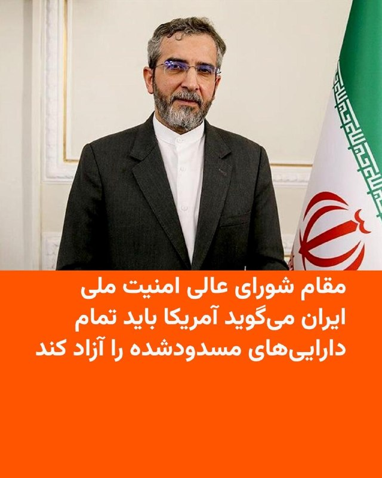

🔸علی باقری کنی معاون دبیر شورای عالی امنیت ملی ایران می‌گوید جمهوری اسلامی به‌دنبال «آزادسازی تمام دارایی‌‎های مسدودشده ایران» توسط آمریکا است.

🔸او این موضوع را «حق قانونی ملت ایران» عنوان کرده و گفته دارایی‌های ایران «باید تماماً و بدون قید و شرط بازگردانده شود».

🔸این اظهارات در شرایطی بیان می‌شود که دونالد ترامپ، رئیس‌جمهور آمریکا، روز چهارشنبه در نشست کابینه خود تأکید کرد که در مذاکرات برای رسیدن به توافق پایان دادن به جنگ، درباره کاهش تحریم‌ها یا انتقال پول به تهران گفت‌وگو نمی‌شود.

🔸او در پاسخ به پرسش یکی از خبرنگاران درباره احتمال کاهش تحریم‌های آمریکا علیه ایران گفت: «ما اصلاً درباره کاهش تحریم‌ها یا دادن پول صحبت نمی‌کنیم. ما کنترل پول‌هایی را در اختیار داریم که آن‌ها ادعا می‌کنند متعلق به خودشان است. ما کنترل آن پول را حفظ خواهیم کرد.»

🔸ترامپ افزود: «هر وقت آن‌ها (ایران) رفتار درستی داشته باشند و کار درست را انجام دهند، اجازه خواهیم داد به پول‌شان دسترسی پیدا کنند.»

@RadioFarda

## RadioFarda — post 157636

گفت‌وگو با دیپلمات آمریکایی؛ بازشدن اینترنت نشانه چرخش از میدان جنگ به میز مذاکره است

🔸پس از ۸۸ روز خاموشی دیجتیال، که نت‌بلاکس آن را «طولانی‌ترین قطع سراسری اینترنت در تاریخ معاصر» خوانده است، و در حالی که گفت‌وگوها با واشینگتن زیر سایۀ فشارهای نظامیِ تازه در خلیج فارس ادامه دارد، ایران دسترسی مردم به اینترنت را هرچند به‌طور محدود برقرار کرده است.

🔸رادیو اروپای آزاد/رادیو آزادی برای موشکافی این موضوع که گشایش محدود دیجیتال از سوی تهران چه معنایی دارد و آیا گفت‌وگوهای کنونی می‌تواند به یک آتش‌بس پایدار بینجامد، با چارلز دان گفت‌وگو کرده است.

🔸او دیپلمات ارشد پیشین آمریکا و مقام امنیت ملی است که بیش از ۲۴ سال پیشینۀ کار دولتی دارد و در دوران ریاست‌جمهوریِ جرج دبلیو بوش، مدیر بخش عراق در شورای امنیت ملی بوده است.

🔸 گزارش کامل را در وب‌سایت رادیوفردا بخوانید.

@RadioFarda

## RadioFarda — post 157635

آوارگان افغان، نگران آغاز مجدد درگیری‌ها با پاکستان، از بازگشت به خانه می‌ترسند

🔸اسدالله، همسرش و شش فرزندشان در چادری در حاشیۀ اسدآباد، مرکز ولایت کُنّر در شرق افغانستان زندگی می‌کنند.
این مرد ۴۲ ساله و خانواده‌اش از جمله ده‌ها هزار شهروند افغانستان هستند که در اثر درگیری‌های مرگبار مرزی پاکستان و کشورشان در ماه‌های اخیر، آواره شده‌اند.

🔸پاکستان حکومت طالبان را به پناه‌دادن به اعضای گروه «تحریک طالبان پاکستان، یا TTP» متهم کرده و حملات هوایی مرگباری را علیه اهدافی در افغانستان، که می‌گوید به این گروه افراطی مربوط بوده‌اند، انجام داده است.

🔸این حملات، پاسخ تلافی‌جویانۀ طالبان افغانستان را به‌دنبال داشت و دو کشور همسایه را به مرز جنگ تمام‌عیار کشاند.

🔸این خشونت‌ها و درگیری‌ها، غیر نظامیان هر دو سوی مرز ۲۶۰۰ کیلومتری دو کشور را هم تحت تأثیر قرار داده است. به گفتۀ سازمان ملل متحد، در افغانستان نزدیک به یکصد هزار تن آواره شده‌اند. بخشی از این گروه به خانه‌های خود بازگشته‌اند؛ اما عده‌ای همچنان بی‌خانمان هستند.

🔸اسدالله در شهر اسدآباد خانه و یک مغازه داشت. درگیری‌های مرزی منجر به ویرانی هر دو شد و حالا او برای گذران زندگی، به کمک‌های بشردوستانه و اعانه‌های مردم محلی وابسته است.

🔸او به رادیو اروپای آزاد/ رادیو آزادی می‌گوید فرزندانش نه می‌توانند به مدرسه بروند و نه به خدمات بهداشتی و درمانی دسترسی دارند. می‌گوید «فعلاً آتش‌بس شده، اما هیچ‌کس نمی‌داند بعد چه اتفاقی خواهد افتاد».

🔸 گزارش کامل را در وب‌سایت رادیوفردا بخوانید.

@RadioFarda

## RadioFarda — post 157634

🔸ارتش کویت بامداد پنجشنبه هفتم خرداد اعلام کرد سامانه‌های پدافند هوایی این کشور در حال رهگیری تهدیدهای موشکی و پهپادی «خصمانه» هستند، اما مشخص نکرد این تهدیدها از کجا منشأ گرفته‌اند. 🔸ارتش این کشور اعلام کرد صداهای انفجاری که در کشور شنیده شده، ناشی از رهگیری…

## RadioFarda — post 157633

  

🔸ارتش کویت بامداد پنجشنبه هفتم خرداد اعلام کرد سامانه‌های پدافند هوایی این کشور در حال رهگیری تهدیدهای موشکی و پهپادی «خصمانه» هستند، اما مشخص نکرد این تهدیدها از کجا منشأ گرفته‌اند.

🔸ارتش این کشور اعلام کرد صداهای انفجاری که در کشور شنیده شده، ناشی از رهگیری این تهدیدها توسط سامانه‌های پدافندی بوده است و از مردم خواست دستورالعمل‌های امنیتی و ایمنی صادرشده از سوی مقامات را رعایت کنند.

🔸این بیانیه پس از حملات آمریکا در اوایل روز پنج‌شنبه منتشر شد؛ حملاتی که واشینگتن می‌گوید علیه یک عملیات پهپادی جمهوری اسلامی انجام شده که نیروهای آمریکایی و کشتیرانی تجاری در تنگه هرمز را «تهدید» می‌کردند.

🔸ایران حمله آمریکا را تأیید و اعلام کرد به‌دلیل حمله آمریکا به منطقه‌ای در نزدیکی فرودگاه بندرعباس، یک پایگاه هوایی آمریکا را در ساعت ۴:۵۰ بامداد هدف قرار داده است، اما به محل این پایگاه را اعلام نکرد.

@RadioFarda

## IranianMinds — post 20931

  

اکانت اسرائیل به فارسی:

۲۵۰۰ سال پیش، کوروش بزرگ یهودیان را از اسارت آزاد کرد. این فقط تاریخ نیست… این ریشه دوستی عمیق بین مردم ایران و یهودیان است.
ما ‌و شما ثابت کردیم که این پیوند، عمیق و پایدار است و در آینده نزدیک این دوستی مانند دوران کوروش بزرگ شکوفا خواهد شد.

@IranianMinds

## IranianMinds — post 20930

  

حالا چرا انقد خایه کردی از پشت هم محو کردی سرتو

@IranianMinds

## IranianMinds — post 20929

  

🔴 دیوار نگاره جدید میدان فلسطین تهران :

اسرائیل ۱۵ سال آینده را نخواهد دید!

@IranianMinds

## IranianMinds — post 20928

  

🔴 اسرائیل دستور تخلیه کل جنوب لبنان و تمام مناطقی که در‌ جنوب این کشور هستن رو داد !

@IranianMinds

## IranianMinds — post 20927

  

فک کن حدود ۹۰ روز کوچیک ترین حق انسانیتو‌ ازت بگیرن بعد با هزار منت و دردسر اونم نه درست وصلش کنن بعد یه عده شل مغز بیان برا اینکار از یارو بت بسازن.

@IranianMinds

## IranianMinds — post 20926

  <a href="telegram/content/IranianMinds_20926_1779963425.mp4" target="_blank">🎬 Download video</a>

🔴 جمهوری اسلامی یک پایگاه هوایی آمریکا در کویت را هدف قرار داد که رسانه‌ها ادعا می‌کنند از آن برای حمله به بندرعباس در جنوب ایران استفاده شده است.

@IranianMinds

## IranianMinds — post 20925

  

🔴 یک مقام وزارت بهداشت :

بمولا رهبرمون هیچیش نشد ی چن تا خراش بود فقط اخبارای کذبو‌ اصلا باور نکنید ، آقا موشتبی حتی روزه هم میگرفت تو ماه رمضان.

@IranianMinds

## IranianMinds — post 20924

  

🔴 سازمان ملل اسرائیل را به فهرست سیاه مربوط به خشونت جنسی مرتبط با درگیری‌ ها اضافه کرد.

@IranianMinds

## BBCPersian — post 282256

  

🔻نت‌بلاکس، نهاد ناظر بر دسترسی اینترنت در جهان می‌گوید که اینترنت ایران به‌رغم اتصال با فیلترینگ شدید روبروست.

نت‌بلاکس در شبکه ایکس اعلام کرد که سه ماه پیش در چنین روزی، ایران دسترسی به اینترنت جهانی را قطع کرد.

«در حالی که اکنون اتصال تا حد زیادی برقرار شده است، معیارها نشان می‌دهند که کاربران هنوز با فیلترینگ شدید مواجه هستند، مشابه دوره موقت بین اعتراضات ژانویه و شروع جنگ.»اشاره این نهاد به بعد از اعتراضات دی ماه است که برای مدت کوتاهی دسترسی به اینترنت برقرار شده بود.

در پی بازگشت تدریجی دسترسی به اینترنت جهانی در ایران، داده‌های شرکت کنتیک نشان می‌دهد که حجم ترافیک اینترنت بین‌الملل پس از هفته‌ها محدودیت شدید، تا ساعت ۷ و نیم صبح امروز به ۵۳ درصد حجم پیش از اعتراضات دی‌ماه ۱۴۰۴ رسیده است.

به‌گفته کنتیک، این روند تا حدی شبیه به وضعیت وصل شدن نسبی اینترنت بعد از اعتراضات دی ماه است.

@BBCPersian
📷 REUTERS

## BBCPersian — post 282254

با بازگشت تدریجی اتصال ایران به اینترنت جهانی، کاربران ایرانی در حال بازگشت به شبکه‌های اجتماعی هستند، و صاحبان کسب و کارهای اینترنتی در ایران امیدوارند بار دیگر رونق به کسب و کارشان بازگردد.

اما شاید شروع دوباره با چالش‌هایی هم همراه باشد.
اگر کسب‌وکار اینترنتی مانند فروشگاه اینستاگرام داشته‌اید و در چند ماه گذشته به دلیل قطع بودن اینترنت نتوانستید کار کنید، حالا که برگشته‌اید، چه تغییراتی می‌ببینید؟ آیا الگوریتم‌ها و قطعی بلندمدت بر کسب‌وکار و بازدید صفحه‌تان تاثیر گذاشته؟

آیا فکر می‌کنید رفتار مشتریان تغییر کرده باشد؟ چطور کسب‌وکارتان را بازسازی می‌کنید؟

طی این مدت پلتفرم‌ها و شبکه‌های اجتماعی داخلی ایران تا چه حد توانسته بود به ادامه کسب و کارتان کمک کند؟

نظرات و تجربیات خود را با هشتگ #اینترنت برای ما ارسال کنید:
آی‌مسج و واتس‌اپ: ۰۰۴۴۷۳۴۲۰۳۲۱۱۳
پیامگیر تلگرام t.me/bbcshoma
@BBCPersian
https://bbc.in/431n47v

## BBCPersian — post 282253

🔻نماینده مجلس ایران: بازگشایی اینترنت خلاف قانون است

احمد راستینه،‌ سخنگوی کمیسیون فرهنگی مجلس ایران در واکنش به تصمیمات مسعود پزشکیان، رئیس جمهور آن کشور برای بررسی وضعیت اینترنت، گفت که برخی از ماموریت‌ها و شرح وظایف این ستاد با ماموریت‌ها و شرح وظایف شورای عالی فضای مجازی «تداخل» دارد.

او می‌گوید که رای دیوان عدالت اداری در توقف فعالیت این ستاد از نظر حقوقی «درست و دقیق» است.

به گفته این نماینده مجلس بازگشایی اینترنت «خلاف قانون»‌ است.

در پی قطع اینترنت از زمان شروع جنگ در ایران در اسفندماه سال گذشته، مسعود پزشکیان «ستاد ساماندهی و راهبردی فضای مجازی» را برای بررسی بازگشت اینترنت بین‌الملل تشکیل داد.

تصمیم این ستاد در مورد بازگشایی مجدد اینترنت با واکنش تند مخالفان روبرو شده است.

پس از آن دیوان عدالت اداری اعلام کرد که «در پی شکایت‌هایی با درخواست ابطال سند ایجاد این ستاد، هیات تخصصی صنایع و بازرگانی با احراز فوریت موضوع، دستور توقف اجرای مصوبه را تا زمان رسیدگی نهایی صادر کرده است.»

به‌رغم این اقدام، اینترنت بین‌المللی از دو روز پیش، پس از بیش از ۸۰ روز برای کابران فعال شده است.

@BBCPersian

## BBCPersian — post 282252

🔻افزایش قیمت نفت در پی حملات تازه ایران و آمریکا

قیمت نفت در معاملات روز پنج‌شنبه بار دیگر صعود کرد، در حالی که اغلب بورس‌های آسیایی با افت مواجه شدند. این تحولات در پی حملات تازه آمریکا به ایران و افزایش نگرانی‌ها درباره شکننده بودن آتش‌بس رخ داده است.

افزایش قیمت نفت بخش زیادی از کاهش روز چهارشنبه را جبران کرد، کاهشی که به امید دستیابی قریب‌الوقوع به توافقی برای پایان دادن به درگیری‌ها شاهد آن بودیم.

نفت برنت دریای شمال، شاخص اصلی بین‌المللی، در معاملات صبح پنج‌شنبه ۱/۸ درصد افزایش یافت و به ۹۵/۹۵ دلار در هر بشکه رسید. همچنین نفت خام وست تگزاس اینترمدیت آمریکا هم با رشد ۱/۷درصدی به ۹۰/۱۷ دلار رسید.

بازارهای سهام آسیا عمدتاً نزولی بودند؛ شاخص هنگ‌کنگ بیش از ۱/۵ درصد افت کرد.

بورس سئول هم نزدیک به یک درصد کاهش یافت و شاخص شانگهای نیز ۰/۳ درصد پایین آمد.

این کاهش‌ها پس از عملکرد قابل توجه بازارهای جهانی سهام در روز چهارشنبه رخ داد.

اقتصاددانان هشدار داده‌اند اگر تورم در نتیجه جنگ تشدید شود، بانک‌های مرکزی ممکن است ناچار به افزایش نرخ بهره شوند؛ اقدامی که هزینه استقراض را بالا می‌برد و می‌تواند رشد اقتصادی را تحت فشار قرار دهد.

@BBCPersian

## BBCPersian — post 282251

  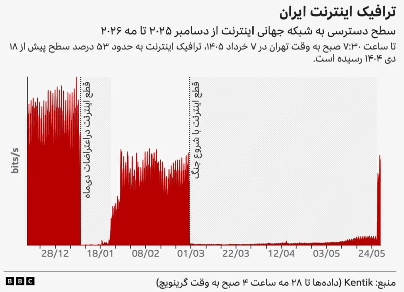

🔻ترافیک اینترنت ایران به ۵۳ درصد سطح پیش از اعتراضات دی‌ماه رسید

در پی بازگشت تدریجی دسترسی به اینترنت جهانی در ایران، داده‌های شرکت کنتیک نشان می‌دهد که حجم ترافیک اینترنت بین‌الملل پس از هفته‌ها محدودیت شدید، تا ساعت ۷ و نیم صبح امروز به ۵۳ درصد حجم پیش از اعتراضات دی‌ماه ۱۴۰۴ رسیده است.

این روند تا حدی شبیه به وضعیت وصل شدن نسبی اینترنت بعد از اعتراضات است. در آن زمان به‌رغم اتصال برخی خدمات به اینترنت جهانی، این اتصال بسیار ناپایدار و با اختلالات متناوب همراه بود.

مشخص نیست آیا دسترسی به حالت قبل بر‌خواهد گشت یا به همان شکل ناپایدار باقی خواهد ماند.

گزارش‌های رسیده و تجربیات کاربران حاکی است که دسترسی به برخی خدمات امکان‌پذیر شده است هرچند ارتباط با ثبات نیست و از جمله، تماس‌های صوتی- تصویری، کیفیت بالایی ندارند.

@BBCPersian

## BBCPersian — post 282250

🔻رئیس انجمن صنفی دفاتر مسافرتی ایران: خسارت وارده به صنعت گردشگری در جنگ از ۲۰ هزار میلیارد تومان فراتر رفته است

رئیس انجمن صنفی دفاتر خدمات مسافرتی ایران گفته است که در جریان جنگ اخیر، «حدود پنج همت (۵ هزار میلیارد تومان) خسارت به دفاتر خدمات مسافرتی وارد شده و مجموع خسارت صنعت گردشگری می‌تواند از ۲۰ همت (۲۰ هزار میلیارد تومان) فراتر برود.»

حرمت‌الله رفیعی با انتقاد از فشارهای مالیاتی و بیمه‌ای بر فعالان این صنف، گفت که دفاتر مسافرتی در شرایط دشوار ناشی از محدودیت‌های ناوگان هوایی و کاهش قدرت خرید مردم با مشکلات جدی مواجه هستند و حمایت موثری از سوی دستگاه‌های اجرایی دریافت نکرده‌اند.

او با اشاره به اینکه تاکنون ایرلاین‌ها و برخی مراکز اقامتی اقدامی برای بازگرداندن هزینه‌های پروازها و هتل‌های لغوشده به مردم انجام نداده‌اند، گفت: «به دلیل نبود مرجع واحد برای رسیدگی به شکایات، آمار دقیقی از مطالبات وجود ندارد، اما در خوش‌بینانه‌ترین حالت دست‌کم ۵۰۰ میلیارد تومان از پول مردم بابت خدمات لغوشده نزد ایرلاین‌ها، مراکز اقامتی و صاحبان قدرت باقی مانده و باید هرچه سریع‌تر بازگردانده شود.»

@BBCPersian

## BBCPersian — post 282245

🔻فیلیپه فان دورسن، بی‌بی‌سی برزیل

اسرائیل به دنبال مرگ حییم وایزمن به رئیس‌جمهور جدیدی نیاز داشت. بنابراین وزارت خارجه نام یهودیان سرشناس را مطرح کرد که می‌توانستند این نقش را ایفا کنند و مهاجرت به کشور تازه‌ تاسیس را تشویق کنند.

به این ترتیب، دولت داوید بن‌ گوریون نخست‌وزیر تصمیم گرفت بار دیگر یک دانشمند را برای این مقام دعوت کند و اصلی‌ترین گزینه، مشهورترین دانشمند جهان بود.

آبا ابن به نمایندگی از بن‌گوریون نامه‌ای به اینشتین نوشت.

او نوشت: «اسرائیل کشوری کوچک از نظر ابعاد فیزیکی است، اما می‌تواند به بزرگی دست یابد، زیرا عالی‌ترین سنت‌های معنوی و فکری مردم یهود را چه در دوران باستان و دوران مدرن به نمایش می‌گذارد.»

@BBCPersian
📷 Getty Images

## BBCPersian — post 282244

🔻مقام ارشد اتحادیه اروپا: ادامه جنگ آمریکا با ایران به نفع هیچ کس نیست

کایا کالاس، مسئول سیاست خارجی اتحادیه اروپا، هشدار داد که ادامه جنگ آمریکا با ایران به نفع هیچ‌کس نیست. این در حالی که دو طرف برغم آتش‌بس همچنان به تبادل آتش ادامه می‌دهند.

خانم کالاس در نشست وزرای خارجه اتحادیه اروپا در قبرس به خبرنگاران گفت: «آن‌ها اکنون در منطقه‌ای بسیار خطرناک میان جنگ و صلح قرار دارند و ادامه این جنگ به نفع هیچ‌کس نیست.»

@BBCPersian

## BBCPersian — post 282243

🔻آژانس بین‌المللی انرژی روز پنج‌شنبه اعلام کرد جنگ خاورمیانه کشورها را وادار کرده است برای عبور از بزرگ‌ترین بحران انرژی جهان، به مسیرهای جدید تامین و همچنین منابع داخلی روی بیاورند.

فاتح بیرول، مدیر اجرایی آژانس بین‌المللی انرژی گفت: «ما در بحبوحه بزرگ‌ترین بحران امنیت انرژی هستیم که جهان تاکنون تجربه کرده است.
معتقدم شرایط فعلی استراتژی‌های سرمایه‌گذاری‌ را در سطح جهانی تغییر خواهد داد، مشابه تغییرات بزرگی که پس از شوک‌های نفتی دهه ۱۹۷۰ در جهان انرژی اتفاق افتاد.»

آقای بیرول در گزارش «سرمایه‌گذاری جهانی انرژی» که توسط آژانس بین المللی انرژی منتشر شده، ‌گفته است که در حال حاضر هم کشورهای تولیدکننده انرژی و هم کشورهای مصرف‌کننده، تلاش‌های خود را برای متنوع کردن مسیرهای تجارت و منابع انرژی بیشتر کرده‌اند.

بر اساس برآورد این سازمان ، سرمایه‌گذاری جهانی انرژی در سال ۲۰۲۶ به ۳/۴ تریلیون دلار خواهد رسید که کمی بالاتر از سال قبل است.

از این میزان، حدود ۲/۲ تریلیون دلار به شبکه‌های برق، ذخیره‌سازی، سوخت‌های کم‌انتشار، انرژی هسته‌ای، انرژی‌های تجدیدپذیر، بهره‌وری انرژی و برق‌رسانی اختصاص خواهد یافت.

در کنار آن، حدود ۱/۲ تریلیون دلار نیز در نفت، گاز طبیعی و زغال‌سنگ سرمایه‌گذاری می‌شود.

با این حال، پیش‌بینی می‌شود سرمایه‌گذاری در بخش نفت برای سومین سال پیاپی در سال ۲۰۲۶ کاهش یابد و با وجود افزایش قیمت نفت خام، به زیر ۵۰۰ میلیارد دلار برسد.

@BBCPersian

## BBCPersian — post 282242

🔻ارتش اسرائیل پس از هشدار تخلیه، حملات به زیرساخت‌های حزب‌الله در شهر صور را آغاز کرد

ارتش اسرائیل روز پنج‌شنبه اعلام کرد پس از صدور هشدار تخلیه برای ساکنان شهر صور در جنوب لبنان، حملات به زیرساخت‌های حزب‌الله در اطراف این شهر را آغاز کرده است.

ارتش اسرائیل در بیانیه‌ای گفته است که ناچار به انجام اقدامات قاطع علیه حزب‌الله هستیم.

ارتش اسرائیل همچنین گفت که ساکنان محدوده اطراف برخی ساختمان‌ها باید این منطقه را ترک کرده و به شمال رودخانه زهرانی بروند و هشدار داد که ماندن در این منطقه «جان آن‌ها را در معرض خطر قرار می‌دهد.»

خبرگزاری دولتی لبنان هم گزارش داد صبح پنج‌شنبه دو موج حمله هوایی اسرائیل شهر صور و منطقه‌ای در شرق آن را هدف قرار داده که به اصابت به یک ساختمان و وقوع آتش‌سوزی در این شهر منجر شده است.

@BBCPersian

## BBCPersian — post 282234

🔻روزبه حمیدیان، روزنامه‌نگار

با افزایش تعطیلی و غیرحضوری شدن مدارس ایران، این نگرانی بین خانواده‌ها و معلمان ایجاد شده که دانش‌آموزان با افت تحصیلی جدی رو‌به‌رو شوند. مرکز پژوهش‌های مجلس هم هشدار داده که اگر سیاست‌های متناسب با این شرایط جنگی و آتش‌بس مهیا نشود، «آثار جبران ناپذیری برای نظام آموزشی کشور به دنبال خواهد داشت.»

بنابر قانون بازگشایی مدارس مصوب سال ۱۳۷۶، سال تحصیلی از مهر شروع و در اردیبهشت تمام می‌شود و خرداد، ماه زمان برگزاری امتحان است اما امسال دانش‌آموزان ایرانی حدود نصف زمان تحصیل را دور از مدرسه سپری کرده‌اند.

بر اساس سند برنامه درسی ملی که در سال ۱۳۹۱ از سوی شورای عالی آموزش و پرورش تصویب شده، دانش‌آموزان ابتدایی در هر سال باید ۹۲۵ ساعت در سال تحصیلی در کلاس حاضر باشند. دانش‌آموزان برای گذراندن هر سال تحصیلی متوسطه اول ۱۱۱۰ ساعت و متوسطه دوم ۱۲۹۵ ساعت باید در مدرسه باشند.

این در حالی است که امسال تقریبا تا پیش از نهم اسفند که جنگ شروع شد، اکثر دانش‌آموزان به‌خصوص در شهر تهران بیشتر از یک ماه از مدرسه دور بوده‌اند.

@BBCPersian
📷Getty Images / Eghtesadonline/ IRNA

## Dirty_Kids — post 390383

  <a href="telegram/content/Dirty_Kids_390383_1779963431.mp4" target="_blank">🎬 Download video</a>

آرایشگر ایرانی که بخاطر پست کردن ویدیوی کارهاش در اینستاگرام توسط رژیم تهدید شده بود با انتشار این ویدیو به تهدیدها اعتراض کرد.
ویدیوش در شبکه اجتماعی انگلیسی زبان وایرال شده که کمک میکنه مردم دنیا ببینن که مردم ایران از چه حقوق ابتدایی محروم هستند.

@Dirty_Kids 👻

## Dirty_Kids — post 390382

  

امریکا هر شب اینا رو میزنه بعدش بیانیه میده ما هنوز تو آتش بس هستیم :)))))))

دیشب امریکا یه سایت نظامی که تهدیدی برای ناوها و نیروهاشون بود رو در جنوب ایران زدن و سپاه هم جوابشونو داد و مبدا حمله رو که یه پایگاه در کویت بود رو زد

+ سایت پهبادی سپاه در بندرعباس دیگر وجود ندارد.
اما آتش بس هنوز وحود دارد😂
از توجه شما سپاس گذارم

@Dirty_Kids 👻

## Dirty_Kids — post 390381

  <a href="https://t.me/Dirty_Kids/390381" target="_blank">📎 Download file</a>

📱 اپلیکیشن اندروید بدون فیلتر ریتزوبت

➖➖➖➖➖

🔹 ثبت نام آسان 
✅
🔹 رابط کاربری بسیار راحت و سریع 
✅
🔹 درگاه پرداخت کارت به کارت 
✅
🔹 درگاه پرداخت دلاری سریع 
✅
🔹 بونوس ۱۰۰ درصدی اولین واریز 
✅
🔹 بونوس ۱۰۰ درصدی واریز یکشنبه ها 
✅

➖➖➖➖➖
🌐 https://RitzoBet.com

⚡️ @RitzoBet_ir

## Dirty_Kids — post 390380

  

⚠️ برای #شرطبندی های فوتبال از سایت معتبر و بین المللی استفاده کنید ✅

سایت #ریتزوبت ، چهار سال هستش داخل ایران فعالیت میکنه 
✅

لایسنس بین المللی داره ، روش های شارژ و برداشت متنوع داره و بونوس 100% ورزشی و کش بک های جذاب
💎

⏪ اپلیکیشن بدون فیلتر ریتزوبت 
📱
⏩
R7

✅ لینک بدون‌ فیلتر ریتزوبت
🤣

🆔 @RitzoBet_ir 
🇮🇷

## Dirty_Kids — post 390379

  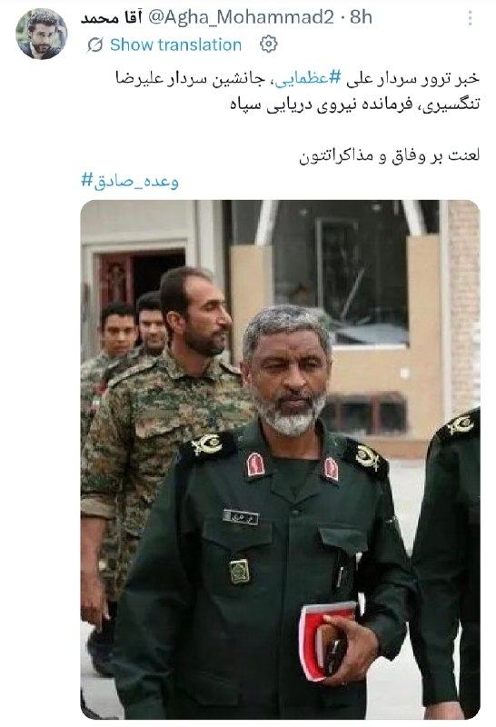

این عرزشیه میگه علی عظمایی کتلت شده

@Dirty_Kids 👻

## Dirty_Kids — post 390378

  

بعضی جاها قیمت یه املت به ۵۰۰ هزار تومن رسیده!😐😐

@Dirty_Kids 👻

## Dirty_Kids — post 390377

  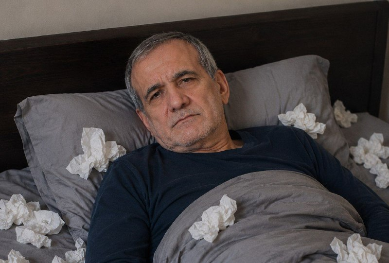

به صورت کاملا اتفاقی:
_ پزشکیان ۳۰ ساله سینگله
_ اینترنت با دستور پزشکیان متصل شد
_ دقیقا فردای اتصال اینترنت روز جهانی خودارضاییه

@Dirty_Kids 👻

## Dirty_Kids — post 390376

  

🔴 فرصت از این بهتر؟؟
امروز روز جهانیه خودارضاییه تو این روز دختر پسرا به دوستاشون زنگ میزنن که دور هم جمع بشن و باهم بشینن خودارضایی کنن

@Dirty_Kids 👻

## Dirty_Kids — post 390375

  

بادبان از 100,000 عضو گذشت!
🎉

با بازگشت اینترنت درحال آماده سازی زیرساخت بادبان برای سرویس دهی برای شرایط نرمال و خروج از سرویس دهی اضطراری هستیم با نرمال شدن شرایط قیمت های کاهشی خواهد بود تا اتمام این فرایند کاربران عزیز میتونن از سرویس های اضطراری استفاده کنن
🚀

🛒به زودی در ربات سرویس های نرمال با قیمت هر گیگ 10 هزار تومان برای فروش فعال خواهند شد
🏷️

🎁 کد تخفیف خرید اول دوباره ریست شد و همه میتونن ازش استفاده کنن:
BadBanOFF

💸 با این کد، 50 هزار تومان تخفیف روی اولین خریدت بگیر!

🔥و مهم‌تر از همه...
سیستم معرفی بادبان فعال‌تر از همیشه‌ست!
از تمام خریدهای کاربرانی که معرفی میکنی، 10% خریدشون رو پورسانت دائمی دریافت کن و موجودی کیف پولت رو افزایش بده 
💼

وقتی بادبان داری،
هیچ بادی مانع نیست… حتی وقتی اینترنت ملیه
⛵️

R7

🛡@BadBan_VPN | کانال 

🤖@BadBan_VPNBot | ربات 

📞@BadBan_VPNSupport | پشتیبانی

## Dirty_Kids — post 390374

  

بچه‌های نیرو مسلح‌شون انقد بی‌خایه هستن که حتی میترسن از پشت شناسایی بشن، محو میکنن پس‌کله‌رو 😂

@Dirty_Kids 👻

## Dirty_Kids — post 390373

  <a href="telegram/content/Dirty_Kids_390373_1779963438.mp4" target="_blank">🎬 Download video</a>

مردم تو لندن هم از دست اینا آرامش ندارن

یکی از مزدورای جمهوری اسلامی رفته یکی از معترضا روبا ماشین زیر گرفته :/

@Dirty_Kids 👻

## Dirty_Kids — post 390372

  

اگه توی جنگ با اسراییل کار با سلاح به دردتون میخورد، حاجی‌زاده اون پشت تبدیل به مقوا نمیشد.

@Dirty_Kids 👻

## Dirty_Kids — post 390371

  <a href="telegram/content/Dirty_Kids_390371_1779963440.mp4" target="_blank">🎬 Download video</a>

پزشکیان وقتی بهش میگن با دستور تو اینترنت آزاد شد:

@Dirty_Kids 👻

## Dirty_Kids — post 390370

‏واقعا جالبه که عرزشیا برامون مینویسن "بسوزید چون ما پیروزیم".
حقیقتا موجوداتی به دنده‌پهنی و بی‌رگی اینها ندیدم. رهبرشون رو یجوری نفله کردن که حتی قبر هم نداره و اینها مجبورند با قاتلش مذاکره هم بکنن. بعد اینها به دیگران میگن بسوز!
لامصبا جرواجر شدید. چطور روتون میشه کری بخونید؟!

@Dirty_Kids 👻

## Dirty_Kids — post 390369

  

بچه‌ها شما که نبودید، ینفر به اسم همایون راه افتاده بود تو سطح شهر از کون ملت عکس میگرفت پخش میکرد و میگفت؛ اگه جنگ نشده بود الان خیلی حال میداد با این کون‌ها زندگی کردن

@Dirty_Kids 👻

## Dirty_Kids — post 390368

  <a href="telegram/content/Dirty_Kids_390368_1779963443.mp4" target="_blank">🎬 Download video</a>

از ریش سفیدت خجالت بکش
عرزشی رو سگ بگیره، جو نگیره

@Dirty_Kids 👻

## Hranews — post 113206

یک مرد توسط برادرش در تهران مورد اسیدپاشی قرار گرفت و جان‌باخت

❗️
❗️
❗️
❗️
❗️– مردی حدودا ۳۵ ساله در تهران توسط برادرش هدف #اسیدپاشی قرار گرفت و جان خود را از دست داد. متهم این پرونده همچنان متواری است و تحت تعقیب قضایی قرار دارد.

ادامه مطلب

↘️
@hranews_bot تماس ✉️ - @Hranews کانال هرانا 🆑

## Hranews — post 113205

  

از فیلتر تلگرام تا «اینترنت پرو»/ امیر آقایی

📡
📡
📡
📡
📡– جمهوری اسلامی در حال جابه‌جا کردن بسیاری از رکوردهای منفی در زمینه‌ی سرکوب دیجیتال است. ایرانیان در طول شاید یکی از پرالتهاب‌ترین مقاطع تاریخی خود یعنی از زمان شروع جنگ ۱۲روزه تا اعتراضات دی‌ماه و بعد از آن جنگ ۴۰روزه –که هنوز هم مشخص نیست کاملاً تمام شده یا نه– در مجموع بیش‌تر از صد روز را بدون اینترنت سپری کرده‌اند. تفاوت اساسی آخرین مقطع #قطع_اینترنت، حضور پررنگ اینترنت طبقاتی در لباس طرح جدیدی به نام «اینترنت پرو» است. این پروژه اما محصول امروز و دیروز اتاق‌های تصمیم‌گیری نظام نیست، بلکه نقطه‌ی پایانی مسیر پرپیچ‌وتابی است که نظام طی کرد تا به آن برسد. هرکدام از بزنگاه‌های اعتراضات دی‌ماه ۹۶، اعتراضات گرانی بنزین در آبان ۹۸، اعتراضات ۱۴۰۱ و در نهایت اعتراضات دی‌ماه ۱۴۰۴ برای دستگاه‌های امنیتی نظام درس‌آموخته‌هایی به دنبال داشت که در نهایت، نسخه‌ی اینترنت پرو خروجی نهایی آن بود. در ادامه بررسی خواهیم کرد که چه شد تا «اینترنت پرو» از جعبه‌ی جادویی نظام درآمد.

ادامه مطلب

ادامه مطلب در وبسایت خط صلح

#امیر_آقایی

↘️
@hranews_bot تماس ✉️ - @Hranews کانال هرانا 🆑

## Hranews — post 113204

عمر عزیزی با تودیع وثیقه از زندان زاهدان آزاد شد

❗️
❗️
❗️
❗️
❗️– عمر عزیزی، شهروند اهل شهرستان قصرقند، روز دوشنبه با تودیع وثیقه از زندان زاهدان آزاد شد. وی در آبان ماه سال گذشته بازداشت شده بود.

ادامه مطلب

#عمر_عزیزی

↘️
@hranews_bot تماس ✉️ - @Hranews کانال هرانا 🆑

## Hranews — post 113203

  

مدیر کمپین معلولان در گفتگو با ایرنا نسبت به پیامدهای کمبود بودجه در تأمین لوازم بهداشتی افراد دارای معلولیت هشدار داد و گفت: به دلیل ناکافی بودن کمک‌هزینه‌ها، بسیاری از افراد ناچارند اقلام یک‌بارمصرفی مانند پوشک، سوند و نلاتون را چندبار استفاده کنند؛ اقدامی که می‌تواند به بروز عفونت‌های شدید و حتی مرگ منجر شود. او تأکید کرد که در شرایط تورمی فعلی، عدم افزایش حق پرستاری و کمک‌هزینه‌های بهداشتی فشار مضاعفی بر زندگی افراد دارای معلولیت وارد کرده است.

در ادامه این گزارش، مادر دو فرزند دارای معلولیت "شدید"، از وضعیت معیشتی و درمانی خانواده‌اش گفت و توضیح داد که با وجود افزایش شدید قیمت پوشینه و سایر اقلام بهداشتی، مستمری و حمایت‌های بهزیستی پاسخگوی نیازهای اولیه نیست. به گفته او، تأخیر در پرداخت کمک‌هزینه‌ها و ناکافی بودن درآمد خانوار، در کنار مشکلات مسکن و نبود حمایت‌های پایدار، شرایط زندگی این خانواده را به وضعیت بحرانی رسانده است.
#افراد_دارای_معلولیت #معلولان

↘️
@hranews_bot تماس ✉️ - @Hranews کانال هرانا 🆑

## Hranews — post 113202

  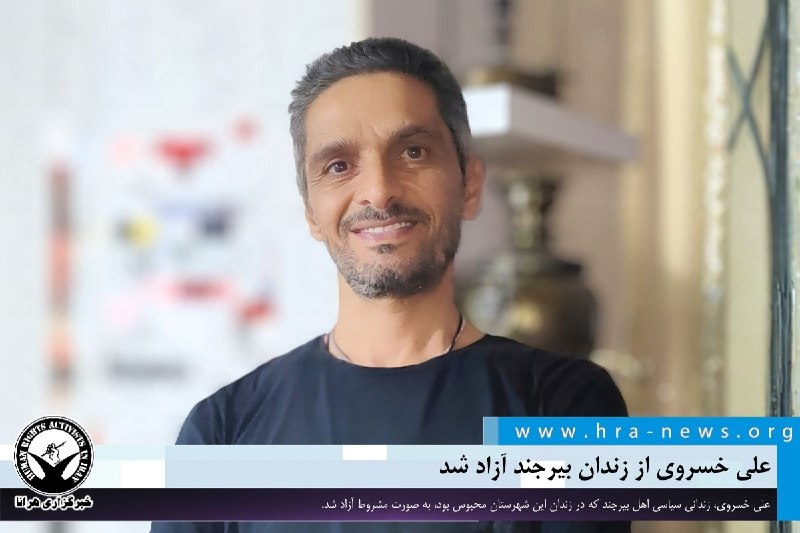

علی خسروی، زندانی سیاسی از زندان بیرجند آزاد شد

❗️
❗️
❗️
❗️
❗️– علی خسروی، زندانی سیاسی اهل بیرجند که در زندان این شهرستان محبوس بود، به صورت مشروط آزاد شد.

به گزارش خبرگزاری هرانا، ارگان خبری مجموعه فعالان حقوق بشر در ایران، علی خسروی آزاد شد.

بر اساس اطلاعات دریافتی هرانا، آزادی آقای خسروی به صورت مشروط از زندان بیرجند صورت گرفته است.

ادامه مطلب

#علی_خسروی

↘️
@hranews_bot تماس ✉️ - @Hranews کانال هرانا 🆑

## alonews — post 123252

  <a href="telegram/content/alonews_123252_1779963447.mp4" target="_blank">🎬 Download video</a>

👈پوتین : حجم تجارت بین روسیه و قزاقستان به‌زودی از ۳۰ میلیارد دلار عبور می‌کنه

✅ @AloNews خبر جنگ

## alonews — post 123251

  <a href="telegram/content/alonews_123251_1779963449.webm" target="_blank">🎬 Download video</a>

👈امواج مدیا: قطع روابط سومالی و امارات؛ افشای شکاف استراتژیک عمیق میان ابوظبی و ریاض

🔴قطع روابط دیپلماتیک میان سومالی و امارات متحده عربی، نشان‌دهنده یک شکاف استراتژیک و گسترده‌تر میان ابوظبی و ریاض است.

🔴 عامل اصلی شکل‌گیری این بحران، سوءظن شدید موگادیشو به دولت امارات است؛ چرا که سومالی معتقد است ابوظبی توافق به رسمیت شناختن متقابل میان اسرائیل و سومالی‌لند را تسهیل و هدایت کرده است.

✅ @AloNews خبر جنگ

## alonews — post 123250

  <a href="telegram/content/alonews_123250_1779963450.webm" target="_blank">🎬 Download video</a>

👈آخرین قیمت نفت ۹۶.۰۴ دلار

✅ @AloNews خبر جنگ

## alonews — post 123249

  <a href="telegram/content/alonews_123249_1779963450.webm" target="_blank">🎬 Download video</a>

👈نمودار جدید نت بلاکس نشان می دهد همچنان بخشی از محدودیت های اینترنت باقی مانده است

✅ @AloNews خبر جنگ

## alonews — post 123248

  <a href="telegram/content/alonews_123248_1779963450.webm" target="_blank">🎬 Download video</a>

👈وزیر علوم، تحقیقات و فناوری درباره زمان برگزاری کنکور سراسری ۱۴۰۵، اعلام کرد که پیش‌بینی ما این است که کنکور در دهه سوم مرداد برگزار شود و رئیس سازمان سنجش به‌زودی جزئیات آن را اعلام خواهد کرد

✅ @AloNews خبر جنگ

## alonews — post 123247

  <a href="telegram/content/alonews_123247_1779963451.webm" target="_blank">🎬 Download video</a>

👈دیوارنگاره جدید میدان فلسطین تهران: اسرائیل ۱۵ سال آینده را نخواهد دید

✅ @AloNews خبر جنگ

## alonews — post 123246

  <a href="telegram/content/alonews_123246_1779963451.webm" target="_blank">🎬 Download video</a>

👈 «روزنامه وال‌استریت ژورنال دیروز گزارش داد که ایران برای دور زدن تحریم‌ها و محاصره آمریکا، از سازوکاری موسوم به انتقال کشتی‌به‌کشتی استفاده می‌کند؛ به این صورت که کشتی‌های تحریم‌شده حامل نفت ایران، پیش از ارسال محموله به چین، بار خود را در دریا به کشتی دیگری منتقل می‌کنند.»

✅ @AloNews خبر جنگ

## alonews — post 123245

  <a href="telegram/content/alonews_123245_1779963451.mp4" target="_blank">🎬 Download video</a>

👈سپاه ویدیو حمله دیشب رو منتشر کرد

✅ @AloNews خبر جنگ

## alonews — post 123244

  <a href="telegram/content/alonews_123244_1779963453.webm" target="_blank">🎬 Download video</a>

👈تعداد مبتلایان به هانتاویروس مرتبط با یک کشتی کروز به ۱۳ نفر افزایش یافت که از این میان سه نفر جان باخته‌اند

✅ @AloNews خبر جنگ

## alonews — post 123243

  <a href="telegram/content/alonews_123243_1779963453.webm" target="_blank">🎬 Download video</a>

👈مراد ویسی: یا توافق میشه یا جنگ

✅ @AloNews خبر جنگ

## alonews — post 123242

  <a href="telegram/content/alonews_123242_1779963454.webm" target="_blank">🎬 Download video</a>

👈کرملین: روسیه به کارکنان سفارت‌‌خانه‌ها هشدار داده است که باید کی‌یف را ترک کنند و پس از آن، هر کس تصمیم خود را خواهد گرفت.

✅ @AloNews خبر جنگ

## alonews — post 123241

  <a href="telegram/content/alonews_123241_1779963454.webm" target="_blank">🎬 Download video</a>

👈ترامپ در یک پست در Truth Social از نخست‌وزیر ارمنستان، پاشینیان، برای انتخاب مجدد حمایت می‌کند

✅ @AloNews خبر جنگ

## alonews — post 123240

  <a href="telegram/content/alonews_123240_1779963454.webm" target="_blank">🎬 Download video</a>

👈ایر ایندیا، پروازها به اسرائیل رو تا ۳۱ ژوئیه لغو کرد

✅ @AloNews خبر جنگ

## alonews — post 123239

  <a href="telegram/content/alonews_123239_1779963455.webm" target="_blank">🎬 Download video</a>

👈ان‌بی‌سی: پنتاگون فهرست جدیدی از اهداف نظامی ایران تهیه کرده است

✅ @AloNews خبر جنگ

## alonews — post 123238

  <a href="telegram/content/alonews_123238_1779963455.mp4" target="_blank">🎬 Download video</a>

👈 تصاویری از شدت خسارات وارده بر تاسیسات فولاد در اصفهان

✅ @AloNews خبر جنگ

## alonews — post 123237

  <a href="telegram/content/alonews_123237_1779963457.webm" target="_blank">🎬 Download video</a>

👈کره شمالی درخواست آمریکا برای خلع سلاح‌ هسته‌ای را رد کرد

✅ @AloNews خبر جنگ

## alonews — post 123236

  <a href="telegram/content/alonews_123236_1779963457.webm" target="_blank">🎬 Download video</a>

👈وزیر دفاع طالبان : ما ثابت کردیم که خاک ما تهدیدی برای ایران نیست

✅ @AloNews خبر جنگ

## alonews — post 123235

  <a href="telegram/content/alonews_123235_1779963458.webm" target="_blank">🎬 Download video</a>

👈اسرائیل بار دیگر دستور تخلیه کل جنوب لبنان، شامل تمام مناطق جنوب رودخانه زهرانی، را صادر کرده است.

🔴(نقشه پیوست توسط ارتش اسرائیل طی دستور قبلی در گذشته ارائه شده است)

✅ @AloNews خبر جنگ

## alonews — post 123234

  <a href="telegram/content/alonews_123234_1779963458.mp4" target="_blank">🎬 Download video</a>

👈فیلمی از شهر صور پس از حملات هوایی اسرائیل در طول شب

✅ @AloNews خبر جنگ

## alonews — post 123233

  <a href="telegram/content/alonews_123233_1779963461.webm" target="_blank">🎬 Download video</a>

👈ابوترابی، نماینده مجلس: دارند با آبنبات چوبی صندوق ۳۰۰ میلیارد دلاری فریبمان می‌دهند، آمریکا بعد از جام جهانی و انتخابات میان‌دوره‌ای به ما حمله می‌کند
‌

🔴 باز کردن تنگه هرمز با ۱۲ میلیارد دلار پول خفت و خواری است.

✅ @AloNews خبر جنگ

<!-- MSG END -->

<!-- NAV START -->

<a href="https://github.com/hhdoust2/aio-downloader/blob/main/telegram/content/archive_1.md" style="display:inline-block; padding:6px 12px; margin:0 4px; background-color:#2ea44f; color:white; text-decoration:none; border-radius:4px; font-weight:bold;">صفحه بعد</a>

<!-- NAV END -->
