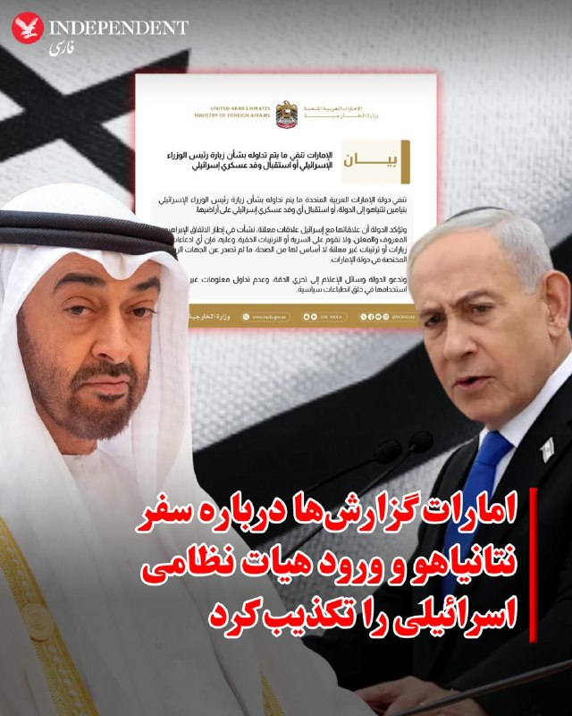
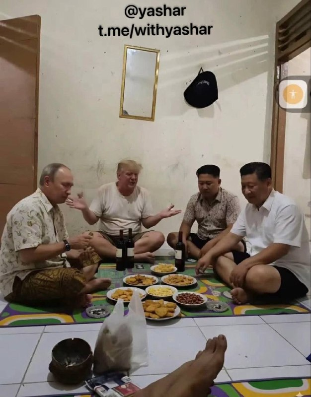

# خواننده تلگرام

<!-- TOP_NAV START -->

<!-- TOP_NAV END -->

<!-- MSG START -->

---
📅 بروزرسانی: 1405/02/24 01:23
---

## VahidOOnLine — post 239987

  

♦️عباس عراقچی، وزیر امور خارجه جمهوری اسلامی، چهارشنبه ۲۳ اردیبهشت با انتشار پیامی در اکس نوشت بنیامین نتانیاهو «آنچه را که نهادهای امنیتی ایران پیش‌تر به رهبری ما منتقل کرده بودند» به‌صورت علنی بیان کرده است.
عراقچی در ادامه نوشت «دشمنی با مردم ایران یک قمار احمقانه است» و همکاری با اسرائیل برای ایجاد تفرقه را «بخشودنی نیست» توصیف کرد. او همچنین هشدار داد افرادی که با اسرائیل برای ایجاد اختلاف همکاری کنند، «پاسخگو خواهند شد».
پیش‌تر حساب رسمی وزارت خارجه اسرائیل روز چهارشنبه ۲۳ اردیبهشت‌ماه به نقل از دفتر نخست‌وزیری این کشور، سفر محرمانه بنیامین نتانیاهو به امارات متحده عربی هم‌زمان با حملات به جمهوری اسلامی را تایید کرده بود. دفتر نتانیاهو اعلام کرد او در این سفر با شیخ محمد بن زاید، رئیس امارات متحده عربی، دیدار کرده و این دیدار به «پیشرفتی تاریخی» در روابط دو کشور منجر شده است.
در مقابل، وزارت خارجه امارات اعلام کرد هرگونه گزارش درباره سفرها یا توافق‌های اعلام‌نشده، تا زمانی که از سوی نهادهای رسمی منتشر نشود، فاقد اعتبار است.
‌🇸🇦 Indypersian

🤖 @VahidOOnLine

## VahidOOnLine — post 239986

  <a href="telegram/content/VahidOOnLine_239986_1778709208.mp4" target="_blank">🎬 Download video</a>

وزارت خارجه امارات متحده عربی گزارش‌ها درباره سفر بنیامین نتانیاهو، نخست‌وزیر اسرائیل، یا استقبال از یک هیات نظامی اسرائیلی را رد کرد.

سخنگوی وزارت خارجه امارات گفت روابط این کشور با اسرائیل، روابطی علنی است که در چارچوب توافق ابراهیم و به‌صورت رسمی و عمومی شکل گرفته و مبتنی بر روابط پنهانی یا توافق‌های مخفی نیست.

او تاکید کرد هرگونه ادعا درباره سفرها یا توافق‌های اعلام‌نشده، تا زمانی که از سوی نهادهای رسمی امارات تایید نشود، بی‌اساس است.

سخنگوی وزارت خارجه امارات همچنین از رسانه‌ها خواست در انتشار اخبار دقت کنند و از بازنشر اطلاعات تاییدنشده خودداری کنند.
‌🏁 🇬🇧 ManotoTV

🤖 @VahidOOnLine

## VahidOOnLine — post 239984

  

وزارت خارجه امارات متحده عربی اعلام کرد گزارش‌های منتشرشده درباره سفر بنیامین نتانیاهو، نخست‌وزیر اسرائیل، به این کشور صحت ندارد.
پیش‌تر دفتر نخست‌وزیری اسرائیل اعلام کرد بنیامین نتانیاهو در جریان جنگ آمریکا و اسرائیل با جمهوری اسلامی، به‌طور مخفیانه به امارات متحده عربی سفر کرده و در این سفر با محمد بن زاید آل نهیان، رییس امارات متحده عربی، دیدار کرد.
وزارت خارجه امارات متحده عربی اعلام کرد روابط این کشور با اسرائیل علنی است و در چارچوب توافق‌نامه‌های ابراهیم که به‌طور عمومی اعلام شده‌اند، برقرار شده است.
وزارت خارجه امارات متحده عربی افزود این روابط مبتنی بر محرمانگی نیست و هرگونه ادعا درباره سفرها یا ترتیبات اعلام‌نشده «بی‌اساس» است، مگر آن‌که به‌صورت رسمی از سوی امارات متحده عربی اعلام شود.
عباس عراقچی در واکنش به سفر نتانیاهو به امارات متحده عربی در زمان جنگ، نوشت: همکاری با اسرائیل در این مسیر غیرقابل بخشش است. افرادی که برای ایجاد اختلاف با اسرائیل همکاری می‌کنند، پاسخگو خواهند شد.
‌🏁 🇬🇧 IranintlTV

🤖 @VahidOOnLine

## VahidOOnLine — post 239983

  

♦️وزارت خارجه امارات متحده عربی با انتشار بیانیه‌ای، گزارش‌ها درباره سفر بنیامین نتانیاهو، نخست‌وزیر اسرائیل، به این کشور و همچنین پذیرش هرگونه هیات نظامی اسرائیلی در خاک امارات را تکذیب کرد.

در این بیانیه آمده است روابط امارات و اسرائیل در چارچوب توافق ابراهیم، علنی و رسمی است و بر پایه دیدارها یا ترتیبات محرمانه شکل نگرفته است.

وزارت خارجه امارات همچنین اعلام کرد هرگونه گزارش درباره سفرها یا توافق‌های اعلام‌نشده، تا زمانی که از سوی نهادهای رسمی منتشر نشود، فاقد اعتبار است.

امارات در پایان از رسانه‌ها خواست از انتشار اطلاعات تاییدنشده و ایجاد برداشت‌های سیاسی خودداری کنند.

حساب رسمی وزارت خارجه اسرائیل چهارشنبه ۲۳ اردیبهشت‌ماه در شبکه اجتماعی اکس، به نقل از دفتر نخست‌وزیری اسرائیل، سفر محرمانه بنیامین نتانیاهو به امارات متحده عربی هم‌زمان با حملات به جمهوری اسلامی را تایید کرده بود. دفتر نتانیاهو اعلام کرده بود او در این سفر با شیخ محمد بن زاید، رئیس امارات متحده عربی، دیدار کرده و این دیدار به «پیشرفتی تاریخی» در روابط دو کشور منجر شده است.

پیش‌تر نیز گزارش‌هایی درباره انتقال سامانه دفاعی «گنبد آهنین» اسرائیل به امارات منتشر شده بود که مایک هاکبی، سفیر آمریکا در اسرائیل، آن را تایید کرده بود. همچنین گزارش‌هایی درباره مشارکت امارات در حملات علیه جمهوری اسلامی منتشر شده است.
‌🇸🇦 Indypersian

🤖 @VahidOOnLine

## VahidOOnLine — post 239982

  

♦️محمد عباسی، از بازداشت‌شدگان اعتراضات سراسری دی‌ماه ۱۴۰۴، چهارشنبه ۲۳ اردیبهشت در زندان قزل‌حصار اعدام شد. خبرگزاری میزان، وابسته به قوه قضاییه جمهوری اسلامی، خبر اجرای حکم اعدام او را منتشر کرد.
بر اساس گزارش‌ها، مسئولان زندان قزل‌حصار خانواده محمد عباسی را برای ملاقات دعوت کرده بودند، اما پس از حضور در زندان، اجازه ملاقات آخر به آن‌ها داده نشد و خانواده پس از ترک زندان، تلفنی از اجرای حکم مطلع شدند.
محمد عباسی در جریان انقلاب ملی ایران در ملارد بازداشت و سپس از سوی شعبه ۱۵ دادگاه انقلاب تهران به ریاست ابوالقاسم صلواتی، با اتهام «محاربه» به اعدام محکوم شده بود. در همین پرونده، حکم ۲۵ سال زندان فاطمه عباسی، دختر او، نیز تایید شده و او اکنون در زندان اوین نگهداری می‌شود.
‌🇸🇦 Indypersian

🤖 @VahidOOnLine

## WithYashar — post 11172

کانال N12: ترامپ داره به صدور دستور برای از سرگیری درگیری با ایران فکر می‌کنه
@withyashar

## WithYashar — post 11171

ائتلاف حاکم در اسرائیل پیشنهاد انحلال کنست در تدارک برای برگزاری انتخابات زودهنگام را ارائه کرد.
@withyashar

## WithYashar — post 11170

  

دارن تحلیل میکنن چیکار کنن 😂😅
@withyashar

## WithYashar — post 11169

خوش‌چشم: ترامپ رفته چین التماس کنه تا میانجی بشه که ایران جنگ رو تموم کنه
@withyashar

## mwarmonitor — post 9059

  

🔴 فوری: بنیامین نتانیاهو به‌طور محرمانه به امارات متحده عربی سفر کرده و در جریان عملیات «شیر غران» علیه ایران با محمد بن زاید دیدار کرده است. i24 news @mwarmonitor

## mwarmonitor — post 9058

✈️بمب‌افکن B-2 با شناسه «WENCH11» در یک پرواز رفت‌وبرگشت از پایگاه هوایی وایتمن (Whiteman AFB) به‌عنوان بخشی از یک تمرین فرماندهی راهبردی آمریکا (STRATCOM) در حال انجام عملیات است و از فرکانس HF سانتا ماریا 11309 استفاده می‌کند. @mwarmonitor

## FoxNewsTwitter — post 341682

  <a href="telegram/content/FoxNewsTwitter_341682_1778709211.mp4" target="_blank">🎬 Download video</a>

Fox News (Twitter/X)

EXCLUSIVE: Secretary of State Marco Rubio outlines the high-stakes push for China to confront Iran over its actions in the Persian Gulf in an exclusive sit-down with @seanhannity aboard Air Force One:

“The Chinese have ships stuck in the Persian Gulf... A Chinese cargo got hit over the weekend. I'm sure Iran didn't do it deliberately but they did it, it happened. And so that's why these Chinese ships are stuck in there.”

“It's a huge source of instability. It threatens to destabilize Asia more than any other part of the world because it's heavily reliant on the straits for energy.”

“It’s in [China’s] interest to resolve this. We hope to convince them to play a more active role in getting Iran to walk away from what they're doing now and trying to do now in the Persian Gulf."

## FoxNewsTwitter — post 341681

  <a href="telegram/content/FoxNewsTwitter_341681_1778709213.mp4" target="_blank">🎬 Download video</a>

Fox News (Twitter/X)

BREAKING: Secretary of State Marco Rubio outlines the high-stakes push for China to confront Iran over its actions in the Persian Gulf in an exclusive sit-down with @seanhannity aboard Air Force One:

“The Chinese have ships stuck in the Persian Gulf... A Chinese cargo got hit over the weekend. I'm sure Iran didn't do it deliberately but they did it, it happened. And so that's why these Chinese ships are stuck in there.”

“It's a huge source of instability. It threatens to destabilize Asia more than any other part of the world because it's heavily reliant on the straits for energy.”

“It’s in [China’s] interest to resolve this. We hope to convince them to play a more active role in getting Iran to walk away from what they're doing now and trying to do now in the Persian Gulf."

## FoxNewsTwitter — post 341680

  <a href="telegram/content/FoxNewsTwitter_341680_1778709215.mp4" target="_blank">🎬 Download video</a>

Fox News (Twitter/X)

BREAKING: Secretary of State Marco Rubio stresses the critical need for America to strategically navigate its complex relationship with China:

@seanhannity : “You view China as our top geopolitical foe.”

RUBIO: “Yeah, it’s both our top political challenge geopolitically and it’s also the most important relationship for us to manage.”

“We're going to have interests of ours that are going to be in conflict with interests of theirs; to avoid wars and maintain peace and stability in the world, we're gonna have to manage those.”

## pm_afshaa — post 90709

  <a href="telegram/content/pm_afshaa_90709_1778709216.webm" target="_blank">🎬 Download video</a>

🔴عباس عراقچی:
نتانیاهو اکنون به‌صورت علنی آنچه را که نهادهای امنیتی ایران مدت‌ها قبل به رهبری ما منتقل کرده بودند، افشا کرده. دشمنی با ملت بزرگ ایران، قماری احمقانه‌ است؛ و همکاری و همدستی با اسرائیل در این مسیر، غیرقابل بخشش است. کسانی که در همدستی با اسرائیل برای ایجاد تفرقه نقش دارند، باید پاسخگو باشند.

💧 Rainbet.com the #1 Non-KYC Crypto Casino & Sportsbook @rainbetcom

😁 @Pm_Afshaa

## VahidOnline — post 75454

  

وزارت خارجه امارات متحده عربی اعلام کرد گزارش‌های منتشرشده درباره سفر بنیامین نتانیاهو، نخست‌وزیر اسرائیل، به این کشور صحت ندارد.
پیش‌تر دفتر نخست‌وزیری اسرائیل اعلام کرد بنیامین نتانیاهو در جریان جنگ آمریکا و اسرائیل با جمهوری اسلامی، به‌طور مخفیانه به امارات متحده عربی سفر کرده و در این سفر با محمد بن زاید آل نهیان، رییس امارات متحده عربی، دیدار کرد.
وزارت خارجه امارات متحده عربی اعلام کرد روابط این کشور با اسرائیل علنی است و در چارچوب توافق‌نامه‌های ابراهیم که به‌طور عمومی اعلام شده‌اند، برقرار شده است.
وزارت خارجه امارات متحده عربی افزود این روابط مبتنی بر محرمانگی نیست و هرگونه ادعا درباره سفرها یا ترتیبات اعلام‌نشده «بی‌اساس» است، مگر آن‌که به‌صورت رسمی از سوی امارات متحده عربی اعلام شود.
عباس عراقچی در واکنش به سفر نتانیاهو به امارات متحده عربی در زمان جنگ، نوشت: همکاری با اسرائیل در این مسیر غیرقابل بخشش است. افرادی که برای ایجاد اختلاف با اسرائیل همکاری می‌کنند، پاسخگو خواهند شد.
@VahidOOnLine

📡 @VahidOnline

## IranIntlTV — post 337067

  <a href="telegram/content/IranIntlTV_337067_1778709217.mp4" target="_blank">🎬 Download video</a>

مراد ویسی، تحلیل‌گر ارشد ایران‌اینترنشنال، گفت: «مجموع تحولات اخیر نشان می‌دهد جمهوری اسلامی به رغم برخی تحرکات تاکتیکی در خلیج فارس با یک شکست راهبردی و امنیتی روبه‌رو شده؛ چون حملاتش باعث شده بسیاری از همسایگان جنوبی به دشمنان فعالش تبدیل شوند. نتیجه این سیاست‌ها، نزدیک‌تر شدن کشورهایی مثل امارات به اسرائیل و باز شدن پای اسرائیل و ناتو به معادلات امنیتی منطقه بوده است.»
@iranintltv

## IranIntlTV — post 337066

  <a href="https://t.me/IranintlTV/337066" target="_blank">📎 Download file</a>

🎧نسخه صوتی برنامه با کامبیز حسینی؛ خشم انباشتهٔ مردم کی فوران خواهد کرد؟
@iranintlTV

## IranIntlTV — post 337065

  <a href="telegram/content/IranIntlTV_337065_1778709219.mp4" target="_blank">🎬 Download video</a>

گمان می‌رود پرونده جنگ با ایران، یکی از محوری‌ترین موضوعات گفتگو میان دونالد ترامپ و شی جین‌پینگ باشد. بنا بر بعضی گزارش‌ها، احتمال می‌رود واشینگتن و پکن، تلاش تازه و مشترکی برای وادار کردن تهران به عقب‌نشینی و پذیرش شروط جدید کنند.
@iranintltv

## IranIntlTV — post 337064

  <a href="telegram/content/IranIntlTV_337064_1778709220.mp4" target="_blank">🎬 Download video</a>

مراد ویسی، تحلیل‌گر ارشد ایران‌اینترنشنال، گفت: « جمهوری اسلامی، ایران را به کارت بازی دیگران تبدیل کرده است. خیلی از تحلیل‌گران در انتظار تعیین سرنوشت ایران در دیدار ترامپ و رهبر چین هستند. سرنوشت ایران به غزه و لبنان و به جنگ اوکراین و به روابط روسیه و آمریکا و حالا روابط آمریکا و چین گره خورده است. این بلایی است که جمهوری اسلامی بر سر ایران آورده است.»
@iranintltv

## IranIntlTV — post 337063

  <a href="telegram/content/IranIntlTV_337063_1778709222.mp4" target="_blank">🎬 Download video</a>

کی‌یر استارمر، نخست‌وزیر بریتانیا، در مراسم بازگشایی رسمی پارلمان گفت سخنرانی پادشاه رویکردی امیدوارکننده‌تر به تحولات ایران و جنگ در دو جبهه ارائه می‌دهد و آن را فرصتی برای تغییر وضع موجود و ساختن بریتانیایی قوی‌تر و عادلانه‌تر دانست؛ مسیری که به گفته او باید مبنای آینده کشور قرار گیرد.

چارلز سوم، پادشاه بریتانیا، روز چهارشنبه ۲۳ اردیبهشت در این مراسم سخنرانی کرد. این مراسم به‌منزله آغاز رسمی فعالیت‌های دوره جدید پارلمان بریتانیا است.
@iranintltv

## IranIntlTV — post 337062

  <a href="telegram/content/IranIntlTV_337062_1778709222.mp4" target="_blank">🎬 Download video</a>

بلومبرگ گزارش داد بارگیری نفت از پایانه اصلی صادرات نفت ایران در جزیره خارک متوقف شده است.

بر اساس این گزارش، ظرفیت مخازن ذخیره نفت نیز در حال پر شدن است و در صورت تکمیل ظرفیت، ایران ممکن است ناچار به کاهش تولید نفت شود.

گفت‌وگو با ایمان ناصری، مشاور بازار نفت
@iranintltv

## IranIntlTV — post 337061

  <a href="telegram/content/IranIntlTV_337061_1778709224.mp4" target="_blank">🎬 Download video</a>

تجمعات حکومتی شبانه، بلای جان نظام و مجتبی

چشم‌انداز با مهدی مهدوی‌آزاد

نسخه کامل این برنامه در یوتیوب:
https://youtu.be/SepDBES4ITI
@iranintltv

## IranIntlTV — post 337060

  <a href="telegram/content/IranIntlTV_337060_1778709226.mp4" target="_blank">🎬 Download video</a>

تجمعات حکومتی شبانه، بلای جان نظام و مجتبی

چشم‌انداز با مهدی مهدوی‌آزاد

نسخه کامل این برنامه در یوتیوب:
https://youtu.be/SepDBES4ITI
@iranintltv

## IranIntlTV — post 337059

  <a href="https://t.me/IranintlTV/337059" target="_blank">📎 Download file</a>

🎧نسخه صوتی چشم‌انداز: تجمعات حکومتی شبانه، بلای جان نظام و مجتبی
@iranintlTV

## IranIntlTV — post 337058

  

وزارت خارجه امارات متحده عربی اعلام کرد گزارش‌های منتشرشده درباره سفر بنیامین نتانیاهو، نخست‌وزیر اسرائیل، به این کشور صحت ندارد.
پیش‌تر دفتر نخست‌وزیری اسرائیل اعلام کرد بنیامین نتانیاهو در جریان جنگ آمریکا و اسرائیل با جمهوری اسلامی، به‌طور مخفیانه به امارات متحده عربی سفر کرده و در این سفر با محمد بن زاید آل نهیان، رییس امارات متحده عربی، دیدار کرد.
وزارت خارجه امارات متحده عربی اعلام کرد روابط این کشور با اسرائیل علنی است و در چارچوب توافق‌نامه‌های ابراهیم که به‌طور عمومی اعلام شده‌اند، برقرار شده است.
وزارت خارجه امارات متحده عربی افزود این روابط مبتنی بر محرمانگی نیست و هرگونه ادعا درباره سفرها یا ترتیبات اعلام‌نشده «بی‌اساس» است، مگر آن‌که به‌صورت رسمی از سوی امارات متحده عربی اعلام شود.
عباس عراقچی در واکنش به سفر نتانیاهو به امارات متحده عربی در زمان جنگ، نوشت: همکاری با اسرائیل در این مسیر غیرقابل بخشش است. افرادی که برای ایجاد اختلاف با اسرائیل همکاری می‌کنند، پاسخگو خواهند شد.
https://iranintl.com/202605138383

## IranIntlTV — post 337057

🔻فدراسیون فوتبال ایران در بحران مالی؛ گوگل جمینای حامی تیم‌های ملی فوتبال عراق و مراکش شد

همزمان با تحریم‌های بانکی و مشکلات مالی فدراسیون فوتبال ایران، جمینای (هوش مصنوعی شرکت گوگل) اعلام کرد حامی مالی و فناوری تیم‌های ملی عراق و مراکش در جام جهانی ٢٠٢۶ شده است. گوگل گفته قصد دارد با این قرارداد اسپانسری، «فاصله میان تیم‌ها و هواداران جهانی آنها را کاهش دهد.»

در این بیانیه آمده است: «ما با هیجان اعلام می‌کنیم که گوگل جمینای به عنوان حامی رسمی فناوری تیم‌های ملی فوتبال عراق و مراکش انتخاب شده است. این حمایت با بهره‌گیری از فناوری پیشرفته هوش مصنوعی ما، فرهنگ غنی ورزشی منطقه را گرامی می‌دارد و تجربه هواداران را متحول خواهد کرد.»
این همکاری بر استفاده از هوش مصنوعی برای تولید محتوای فراگیر و فراهم کردن شیوه‌های نوآورانه تعامل هواداران با بازیکنان و تیم‌های محبوبشان متمرکز است.

گوگل جمینای گفته در همکاری با فدراسیون‌های فوتبال، طی سه ماه آینده مجموعه‌ای از برنامه‌های هوادارمحور اجرا خواهد شد: «هواداران می‌توانند با استفاده از مدل تبدیل متن به تصویر جمینی موسوم به «نانو بنانا» تصاویر تشویقی اختصاصی خلق کنند یا با مدل تبدیل متن به موسیقی «لایریا» سرودهای تیمی بسازند و حمایت خود را به شکلی زنده تجربه کنند؛ گویی در زمین حضور دارند.»

همچنین هواداران می‌توانند از گوگل جمینی برای توضیح قوانین پیچیده فوتبال، تحلیل عملکرد مسابقات و پیش‌بینی تیم‌های پیروز استفاده کنند.
همکاری مالی و فناوری جمینای با فدراسیون‌های فوتبال عراق و مراکش درحالی است که روز گذشته فارس، رسانه وابسته به سپاه پاسداران، گزارش داد تیم ملی فوتبال برای اجرای برنامه آماده‌سازی خود در ترکیه، به تزریق فوری منابع مالی نیاز دارد؛ منابعی که پیش‌تر وعده پرداخت آن داده شده بود.
🔗وب‌سایت ایران‌اینترنشنال
@iranintltv

## Shin_Persian — post 5995

  

↩️ Quoted tweet: DefenceGeek 🇬🇧 ✓ @DefenceGeek Wed, 13 May 2026 19:49:28 UTC B-2 Spirit on a training flight from CONUS as part of a suspected STRATCOM exercise involving the E-6B flying out of Stuttgart ↩️ توییت نقل‌قول شده — برای پاسخ، پست زیر را ببینید.…

## Shin_Persian — post 5994

↩️ Quoted tweet:
DefenceGeek 🇬🇧 ✓ @DefenceGeek
Wed, 13 May 2026 19:49:28 UTC

B-2 Spirit on a training flight from CONUS as part of a suspected STRATCOM exercise involving the E-6B flying out of Stuttgart

↩️ توییت نقل‌قول شده — برای پاسخ، پست زیر را ببینید.

فارسی

بمب‌افکن بی‌-۲ اسپیریت (B-2 Spirit) در یک پرواز آموزشی از خاک اصلی ایالات متحده (CONUS) به عنوان بخشی از یک رزمایش احتمالی فرماندهی راهبردی ایالات متحده (STRATCOM) که شامل هواپیمای ای-۶بی (E-6B) در حال پرواز از اشتوتگارت است.

𝕏 · @shin_persian

## Shin_Persian — post 5993

📦 mhrv-rs v1.9.25 released

• Install MITM CA into LibreWolf NSS stores (#1145, PR #1159)
• **Fix Full mode "Google + most websites broken while Telegram works"

Files (Android APKs, Windows, macOS, Linux, OpenWRT) on the files channel:

👉 v1.9.25 — all files with SHA-256

Channel:
https://t.me/mhrv_rs
or: https://t.me/+R1OyoHX2boA1ZDgx

#v1925

## ManotoTV — post 105420

  <a href="telegram/content/ManotoTV_105420_1778709229.mp4" target="_blank">🎬 Download video</a>

وزارت خارجه امارات متحده عربی گزارش‌ها درباره سفر بنیامین نتانیاهو، نخست‌وزیر اسرائیل، یا استقبال از یک هیات نظامی اسرائیلی را رد کرد.

سخنگوی وزارت خارجه امارات گفت روابط این کشور با اسرائیل، روابطی علنی است که در چارچوب توافق ابراهیم و به‌صورت رسمی و عمومی شکل گرفته و مبتنی بر روابط پنهانی یا توافق‌های مخفی نیست.

او تاکید کرد هرگونه ادعا درباره سفرها یا توافق‌های اعلام‌نشده، تا زمانی که از سوی نهادهای رسمی امارات تایید نشود، بی‌اساس است.

سخنگوی وزارت خارجه امارات همچنین از رسانه‌ها خواست در انتشار اخبار دقت کنند و از بازنشر اطلاعات تاییدنشده خودداری کنند.

## ManotoTV — post 105419

  <a href="telegram/content/ManotoTV_105419_1778709229.mp4" target="_blank">🎬 Download video</a>

تماسی از ایران:
«می‌گفت وضعیت آموزش فاجعه شده…
بچه‌هایی که حتی پایه‌ترین چیزها رو بلد نیستن.»

## FarsiVOA — post 217671

🔺نگاهی به دیدار‌های گذشته دونالد ترامپ با شی جین‌پینگ

▪️سفر دونالد ترامپ، رئیس‌جمهوری آمریکا، به پکن و دیدارهای پیش‌روی او با شی جین‌پینگ، رئیس‌جمهوری چین، یکی از تیترهای مهم خبری روزهای اخیر در رسانه‌ها و جراید معتبر جهان در چند روز اخیر بوده است.

⬇️ بیشتر بخوانید:
https://ir.voanews.com/a/8149652.html
@FarsiVOA

## FarsiVOA — post 217670

⚡️بررسی پوشش اخبار درگیری نظامی با جمهوری اسلامی در رسانه‌های غربی
@FarsiVOA

## FarsiVOA — post 217669

⚡️حملە امارات و عربستان بە جمهوری اسلامی و سفر مخفیانە نخست وزیر اسرائیل بە امارات
@FarsiVOA

## FarsiVOA — post 217668

🔺رویترز: عربستان و کویت در جریان عملیات «خشم حماسی» نیابتی‌های جمهوری اسلامی در عراق را هدف قرار دادند

▪️خبرگزاری رویترز به نقل از منابع امنیتی و نظامی گزارش داده است که عربستان سعودی در جریان عملیات «خشم حماسی» مواضع شبه‌نظامیان شیعه مورد حمایت رژیم ایران در عراق را هدف حملات هوایی قرار داد. علاوه بر این، حملات تلافی‌جویانه‌ای نیز از خاک کویت علیه اهدافی در عراق انجام شده است.

⬇️ بیشتر بخوانید:
https://ir.voanews.com/a/reuters-saudi-arabia-kuwait-attacked-iraq-iranian-militias/8149641.html
@FarsiVOA

## Persian_Trend_Official — post 14080

  

به این وضعیت اقتصادی می‌گویید امنیت؟ امنیت کجاست وقتی یک پدر شرمنده زن و بچه‌اش است چون سفره‌اش خالی مانده و حقوقش حتی کفاف اجاره خانه را نمی‌دهد؟

امنیت کجاست وقتی جوانی نمی‌تواند یک متر زمین بخرد و رؤیاهایش زیر بار تورم و فساد دفن شده است؟ امنیت کجاست وقتی جوانی عمر و آرزوهایش را در صف مهاجرت یا بیکاری از دست می‌دهد؟

امنیت اجتماعی بدون رفاه پایدار وجود ندارد. جامعه‌ای که نرخ بیکاری جوانانش بالاست تورم افسارگسیخته دارد و سرمایه انسانی‌اش مهاجرت می‌کند در واقع در وضعیت ناامنی ساختاری است. شما نام این فروپاشی را امنیت گذاشته‌اید. این تحریف واژه‌هاست واژه‌ها را از معنا تهی کرده‌اید تا واقعیت تلخ را بپوشانید.

امنیت واقعی همان چیزی است که مردم در همه‌پرسی انتخاب خواهند کرد آزادی، اینترنت، اقتصاد سالم، و زندگی انسانی. امنیت یعنی امید به آینده نه ترس از فردا.

امنیتی که شما از آن دم می‌زنید، در واقع پوششی است برای فقر، سرکوب، و بی‌عدالتی. امنیت یعنی آرامش روانی، یعنی آینده‌ای قابل پیش‌بینی یعنی فرصت رشد و شکوفایی. اما آنچه امروز مردم ایران تجربه می‌کنند چیزی جز اضطراب فروپاشی اقتصادی و نابودی امید نیست.

📝 Nick

📌 @persian_trend_official
پرشین ترند | متفاوت‌ترین کانال نظامی

## Persian_Trend_Official — post 14079

⭕️ بنیامین نتانیاهو: من می‌خواهم دانش‌آموزان اسرائیلی در استفاده از ChatGPT، Claude و پیشرفته‌ترین ابزارهای هوش مصنوعی جهان - و حتی قبل از فارغ‌التحصیلی از دبیرستان - بهترین باشند. 📝 Nick 📌 @persian_trend_official پرشین ترند | متفاوت‌ترین کانال نظامی

## Persian_Trend_Official — post 14078

  <a href="telegram/content/Persian_Trend_Official_14078_1778709231.mp4" target="_blank">🎬 Download video</a>

⭕️ بنیامین نتانیاهو:

من می‌خواهم دانش‌آموزان اسرائیلی در استفاده از ChatGPT، Claude و پیشرفته‌ترین ابزارهای هوش مصنوعی جهان - و حتی قبل از فارغ‌التحصیلی از دبیرستان - بهترین باشند.

📝 Nick

📌 @persian_trend_official
پرشین ترند | متفاوت‌ترین کانال نظامی

## Persian_Trend_Official — post 14077

  <a href="telegram/content/Persian_Trend_Official_14077_1778709233.webm" target="_blank">🎬 Download video</a>

💢امارات متحده عربی دیدار مخفیانه نتانیاهو از ابوظبی در طول جنگ با ایران را تکذیب کرد

🫆:Tony

📌 @persian_trend_official
پرشین ترند | متفاوت‌ترین کانال نظامی

## Persian_Trend_Official — post 14076

  <a href="telegram/content/Persian_Trend_Official_14076_1778709234.mp4" target="_blank">🎬 Download video</a>

🔴 انهدام پهپاد انتحاری روسی توسط سرباز اوکراینی در لحظات آخر

ویدئویی منتشر شده که نشان می‌دهد یک سرباز اوکراینی با استفاده از سلاح «آکا-۷۴» موفق می‌شود یک پهپاد انتحاری کواد را تنها لحظاتی پیش از برخورد منهدم کند.

🫆:Tony

📌 @persian_trend_official
پرشین ترند | متفاوت‌ترین کانال نظامی

## IranianMinds — post 20093

🔴 وزیر خارجه سوریه :

میخوایم روابطمون با داداشیمون اسرائیل رو قوی تر کنیم و به حاکمیت هم احترام بزاریم

@IranianMinds

## IranianMinds — post 20092

🔴 گوگل رسما اعلام کرد در جام جهانی اسپانسری تیم های ملی عراق و مراکش رو گرفته و تمامی هزینه های این تیم هارو‌ میده.

@IranianMinds

## IranianMinds — post 20091

🔴 عراقچی :

هرکسی بخواد با ما دشمنی کنه و با اسرائیل تبانی کنه بد پشیمون میشه

@IranianMinds

## IranianMinds — post 20090

  

املت هم‌ تو‌ این مملکت قسطی شد

@IranianMinds

## BBCPersian — post 280968

  

🔻وزارت خارجه امارات متحده عربی با انتشار بیانیه‌ای سفر بنیامین نتانیاهو به این کشور در خلال جنگ آمریکا و اسرائیل با ایران را تکذیب کرده است.

در بیانیه وزارت خارجه امارات آماده است: «امارات متحده عربی گزارش‌های منتشرشده درباره سفر نخست‌وزير اسرائيل يا استقبال از يک هيات نظامی اسرائيلی را تکذيب می‌کند.»

اين تکذيب در حالی مطرح می‌شود که رسانه‌های بين‌المللی از جمله رويترز و سی‌بی‌اس نيوز روز چهارشنبه به نقل از دفتر نخست‌وزير اسرائيل گزارش داده بودند که بنیامین نتانياهو در جريان جنگ ايران، سفری محرمانه به امارات داشته و با محمد بن زايد آل نهيان ديدار کرده است.

📸GettyImages
https://bbc.in/4tEOL0N
@BBCPersian

## BBCPersian — post 280967

  

🔻عباس عراقچی، وزیر امورخارجه ایران، به علنی شدن خبر سفر بنیامین نتانیاهو به امارات متحده عربی واکنش نشان داده و گفته است: «نتانیاهو اکنون به‌صورت علنی آنچه را که نهادهای امنیتی ایران مدت‌ها قبل به رهبری ما منتقل کرده بودند، افشا کرده است.»

آقای عراقچی همچنین در اظهاراتی تند که می‌تواند مخاطب آن امارات و کشورهای حاشیه خلیج فارس باشد گفته است: «دشمنی با ملت بزرگ ایران، قماری احمقانه‌ است؛ و همکاری و همدستی با اسرائیل در این مسیر، غیرقابل بخشش است. کسانی که در همدستی با اسرائیل برای ایجاد تفرقه نقش دارند، باید پاسخگو باشند.»

علاوه بر علنی شدن خبر سفر نخست وزیر اسرائیل به امارات در خلال جنگ، در چند روز گذشته اخبار رسانه‌های امریکایی درباره حملات نظامی مخفیانه امارات و عربستان به ایران هم بسیار بازتاب داشته است.

📸AFP via Getty Images
https://bbc.in/3R9GXqf
@BBCPersian

## BBCPersian — post 280965

🔻بعد از خبر حملات امارات به ایران، رویترز می‌گوید عربستان هم در خلال جنگ حملات متعددی علیه ایران انجام داده است

گزیده‌هایی از مصاحبه موسی شریفی، تحلیلگر جهان عرب از ریاض عربستان را با پریزاد نوبخت ببیند که می‌گوید که عربستان برخلاف امارات به‌دنبال شکست ایران نیست و نمی‌‌خواهد توازن قدرت در منطقه دچار خلاء شود.

@BBCPersian

## Dirty_Kids — post 389407

🔴دوست دختر جدید پوبون (رپر) از روی یه پُل تو مکزیک افتاده پایین و گویا کمر و گردنش شکسته؛

پوبون هم استوریش کرده و از مردم خواسته که پول دونیت کنن تا هزینه عملش دربیاد...

@Dirty_Kids 👻

## Dirty_Kids — post 389406

من دیگه اگه بگن قراره یه ابر بزرگ بیاد رو آسمون ایران ازش کیر بباره تعجب نمیکنم.

@Dirty_Kids 👻

## manototv — post 105420

  <a href="telegram/content/manototv_105420_1778709236.mp4" target="_blank">🎬 Download video</a>

وزارت خارجه امارات متحده عربی گزارش‌ها درباره سفر بنیامین نتانیاهو، نخست‌وزیر اسرائیل، یا استقبال از یک هیات نظامی اسرائیلی را رد کرد.

سخنگوی وزارت خارجه امارات گفت روابط این کشور با اسرائیل، روابطی علنی است که در چارچوب توافق ابراهیم و به‌صورت رسمی و عمومی شکل گرفته و مبتنی بر روابط پنهانی یا توافق‌های مخفی نیست.

او تاکید کرد هرگونه ادعا درباره سفرها یا توافق‌های اعلام‌نشده، تا زمانی که از سوی نهادهای رسمی امارات تایید نشود، بی‌اساس است.

سخنگوی وزارت خارجه امارات همچنین از رسانه‌ها خواست در انتشار اخبار دقت کنند و از بازنشر اطلاعات تاییدنشده خودداری کنند.

## manototv — post 105419

  <a href="telegram/content/manototv_105419_1778709237.mp4" target="_blank">🎬 Download video</a>

تماسی از ایران:
«می‌گفت وضعیت آموزش فاجعه شده…
بچه‌هایی که حتی پایه‌ترین چیزها رو بلد نیستن.»

## alonews — post 119833

  <a href="telegram/content/alonews_119833_1778709238.mp4" target="_blank">🎬 Download video</a>

تاج: احتمالا معین موزیک رسمی تیم‌ملی رو بخونه!

@AloSport

## alonews — post 119832

  <a href="telegram/content/alonews_119832_1778709240.webm" target="_blank">🎬 Download video</a>

👈گویا "نصرالله معین" قراره واسه تیم ملی فوتبال به مناسبت حضور تو جام جهانی 2026، آهنگ بخونه!

✅ @AloNews خبر جنگ

## alonews — post 119831

  <a href="telegram/content/alonews_119831_1778709240.mp4" target="_blank">🎬 Download video</a>

👈مارکو روبیو : کشتی‌های چین توی خلیج فارس گیر افتادن یه کشتی باری چینی هم آخر هفته آسیب دیده
- مطمئنم ایران عمداً این کار رو نکرده، ولی به هر حال اتفاق افتاده،واسه همین این کشتی‌های چینی اونجا گیر کردن
- این وضعیت خیلی بی‌ثبات‌کننده‌ست،حتی بیشتر از هر جای دیگه دنیا می‌تونه آسیا رو به هم بریزه، چون انرژی‌شون خیلی به این تنگه‌ها وابسته‌ست
- این به نفع خود چینه که این مسئله رو حل کنه
- ما امیدواریم بتونیم قانع‌شون کنیم نقش فعال‌تری بازی کنن تا ایران رو وادار کنن از کاری که الان تو خلیج فارس داره انجام می‌ده عقب‌نشینی کنه

✅ @AloNews خبر جنگ

## alonews — post 119830

  <a href="telegram/content/alonews_119830_1778709241.webm" target="_blank">🎬 Download video</a>

👈کانال N12: ترامپ داره به صدور دستور برای از سرگیری درگیری با ایران فکر می‌کنه

✅ @AloNews خبر جنگ

## alonews — post 119829

  <a href="telegram/content/alonews_119829_1778709242.webm" target="_blank">🎬 Download video</a>

👈خیلی شیک و‌ مجلسی روی شیشه دفاتر پیشخوان آگهی فروش اینترنت پرو میزنن که تلگرام هم روش بدون فیلتره.

✅ @AloNews خبر جنگ

## alonews — post 119828

  <a href="telegram/content/alonews_119828_1778709242.webm" target="_blank">🎬 Download video</a>

👈مدیرعامل شهر فرودگاهی امام : روزانه بین ۳۵ تا ۴۰ پرواز از فرودگاه انجام می‌شود.

✅ @AloNews خبر جنگ

## alonews — post 119827

  <a href="telegram/content/alonews_119827_1778709242.webm" target="_blank">🎬 Download video</a>

👈خوش‌چشم: ترامپ رفته چین التماس کنه تا میانجی بشه که ایران جنگ رو تموم کنه

✅ @AloNews خبر جنگ

## alonews — post 119826

  <a href="telegram/content/alonews_119826_1778709242.mp4" target="_blank">🎬 Download video</a>

👈تمرینه بمب‌افکنِ " B-52 " و فرود به پایگاه فِرفورد بریتانیا

✅ @AloNews خبر جنگ

## alonews — post 119825

  <a href="telegram/content/alonews_119825_1778709243.webm" target="_blank">🎬 Download video</a>

👈بابک زنجانی: در تاریخ ۲۸ خرداد، شبکه اجتماعی مای دات به‌صورت فراگیر برای عموم بازگشایی و طی مراسمی در برج میلاد رونمایی خواهد شد.

✅ @AloNews خبر جنگ

## alonews — post 119824

  <a href="telegram/content/alonews_119824_1778709244.webm" target="_blank">🎬 Download video</a>

👈روزنامه South China Morning Post: شرکت تصاویر ماهواره‌ای چینی MizarVision که با تحلیل‌های خود از استقرارهای نظامی آمریکا در جنگ آمریکا و اسرائیل علیه ایران به شهرت رسید، افزوده شدن خود به فهرست تحریم‌های آمریکا را به عنوان نشان افتخاری در کمپین استخدامی خود به کار می‌برد.

🔴این استارت‌آپ اطلاعاتی با منابع باز (OSINT) که با نام رسمی Meentropy Technology Hangzhou Co Ltd شناخته می‌شود، در تحلیل داده‌های ماهواره‌های تجاری تخصص دارد و در ماه‌های اخیر چندین بار تحرکات نظامی آمریکا را رصد کرده است.

🔴این شرکت روز جمعه به فهرست تحریم وزارت خزانه‌داری آمریکا اضافه شد که در  پی انتشار «تصاویر با منبع باز که جزئیات فعالیت نظامی آمریکا را در جریان عملیات خشم حماسی (Epic Fury) نشان می‌داد»، صورت گرفته است



✅ @AloNews خبر جنگ

## alonews — post 119822

  <a href="telegram/content/alonews_119822_1778709244.webm" target="_blank">🎬 Download video</a>

👈هزینه نجومی رجیستری گوشی آیفون ۱۷ و گلکسی سامسونگ!

🔴رجیستری پایین ترین گیگ آیفون ۱۷ پرومکس: ۶۰۰ دلار!

✅ @AloNews خبر جنگ

<!-- MSG END -->

<!-- NAV START -->

<!-- NAV END -->
