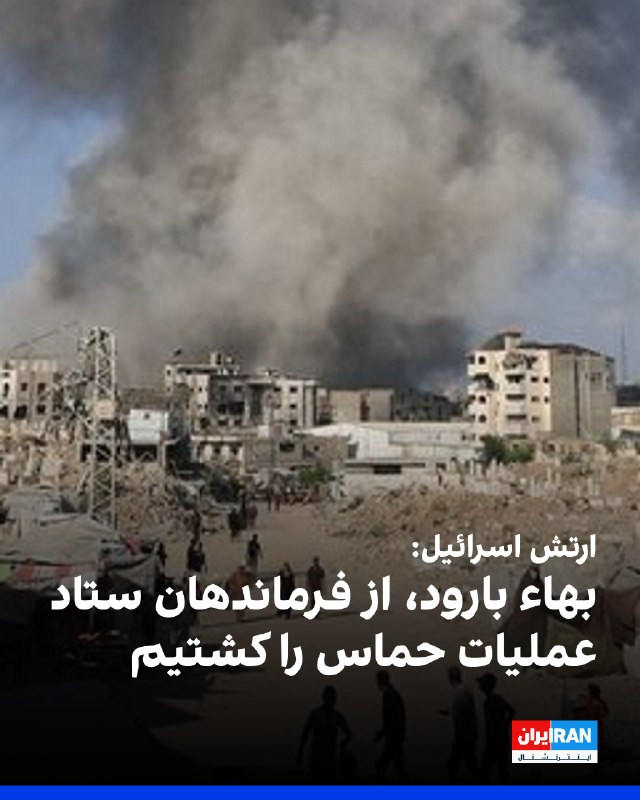
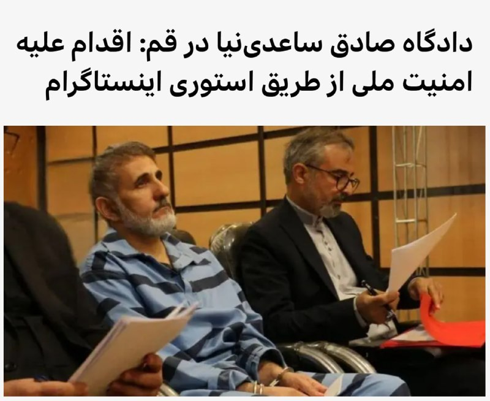

# خواننده تلگرام

<!-- TOP_NAV START -->

<a href="https://github.com/hhdoust2/aio-downloader/blob/main/telegram/content/archive_1.md" style="display:inline-block; padding:6px 12px; margin:0 4px; background-color:#2ea44f; color:white; text-decoration:none; border-radius:4px; font-weight:bold;">صفحه بعد</a>

<!-- TOP_NAV END -->

<!-- MSG START -->

---
📅 بروزرسانی: 1405/02/27 18:27
---

## VahidOOnLine — post 240636

  

♦️روزنامه نیویورک‌تایمز روز یکشنبه ۲۷ اردیبهشت منتشر در گزارشی فاش کرد ارتش اسرائیل در جریان تقابل نظامی اخیر با جمهوری اسلامی ایران، دو پایگاه نظامی مخفی در عمق خاک عراق ایجاد و از آنها برای پشتیبانی عملیات خود استفاده کرده است.
پیش‌تر وال‌استریت ژورنال گزارش داده بود اسرائیل یک پایگاه مخفی را در بیابان‌های غرب عراق برای استفاده در جنگی که از فوریه آغاز شده بود، ایجاد کرده است. اما اکنون مقام‌های عراقی در گفت‌وگو با نیویورک‌تایمز جزئیات تازه‌ای ارائه کرده و از وجود پایگاه مخفی دومی نیز خبر داده‌اند.
نیویورک‌تایمز به نقل از یک مقام منطقه‌ای گزارش داد ساخت پایگاه نخست در اواخر سال ۲۰۲۴ آغاز شد و این مرکز مشخصا برای پشتیبانی از حمله ژوئن ۲۰۲۵ اسرائیل به ایران مورد استفاده قرار گرفت. به نوشته این روزنامه، این پایگاه اکنون غیرفعال است. با این حال، پایگاه دوم برای مدیریت عملیات‌های مرتبط با جنگ اخیر ایجاد شده، اما موقعیت دقیق و وضعیت کنونی آن همچنان مشخص نیست.
بر اساس این گزارش، اسرائیل این پایگاه‌ها را با دو هدف اصلی ایجاد کرده است: کاهش زمان پرواز جنگنده‌ها برای انجام حملات در عمق خاک ایران و ایجاد یک مرکز عملیاتی پیشرفته برای پشتیبانی از نیروی هوایی. نیویورک‌تایمز نوشت این پایگاه‌ها همچنین محل استقرار نیروهای ویژه و تیم‌های امداد و نجات اسرائیلی بوده‌اند تا در صورت سقوط احتمالی جنگنده‌ها، عملیات نجات خلبانان را اجرا کنند.
این روزنامه همچنین گزارش داد واشنگتن دست‌کم از وجود یکی از این پایگاه‌های مخفی در خاک عراق اطلاع داشته است.
به نوشته نیویورک‌تایمز، حضور این پایگاه‌ها پس از آن مورد توجه قرار گرفت که برخی ساکنان محلی متوجه تحرکات مشکوک شدند. در همین ارتباط، چوپانی محلی به نام «عوض الشمری» پس از برخورد تصادفی با یکی از این مراکز، هدف هلیکوپترها قرار گرفت و کشته شد.
این گزارش می‌افزاید اطلاعات ارائه‌شده از الشمری پیش از مرگ، ارتش عراق را به اعزام یک تیم شناسایی به منطقه واداشت. با این حال، این گروه با آتش نیروهای اسرائیلی روبه‌رو شد؛ درگیری‌ای که به کشته و زخمی شدن سه سرباز عراقی و عقب‌نشینی آنها انجامید.
‌🇸🇦 Indypersian

🤖 @VahidOOnLine

## VahidOOnLine — post 240635

  

فرماندهی مرکزی ایالات متحده، سنتکام، اعلام کرد از زمان آغاز محاصره دریایی بنادر و سواحل جنوبی ایران، ۸۱ کشتی تجاری مجبور به تغییر مسیر شده‌اند و چهار شناور دیگر نیز پس از هدف قرار گرفتن، از کار افتاده‌اند تا اجرای این محاصره تضمین شود.
‌🏁 🇬🇧 IranintlTV

🤖 @VahidOOnLine

## VahidOOnLine — post 240634

  

ارتش اسرائیل اعلام کرد بها برود، از فرماندهان ستاد عملیات حماس، در حمله هوایی کشته شده است.
به گفته ارتش، او در هفته‌های اخیر در برنامه‌ریزی حملات علیه نیروهای اسرائیلی و غیرنظامیان نقش داشته و تهدیدی فوری محسوب می‌شده است.
ارتش اسرائیل تأکید کرد این حمله با مهمات دقیق انجام شده و نیروهای فرماندهی جنوبی مطابق آتش‌بس مستقر هستند.
‌🏁 🇬🇧 IranintlTV

🤖 @VahidOOnLine

## VahidOOnLine — post 240633

  

♦️روزنامه نیویورک‌تایمز روز یکشنبه ۲۷ اردیبهشت منتشر در گزارشی فاش کرد ارتش اسرائیل در جریان تقابل نظامی اخیر با جمهوری اسلامی ایران، دو پایگاه نظامی مخفی در عمق خاک عراق ایجاد و از آنها برای پشتیبانی عملیات خود استفاده کرده است.
پیش‌تر وال‌استریت ژورنال گزارش داده بود اسرائیل یک پایگاه مخفی را در بیابان‌های غرب عراق برای استفاده در جنگی که از فوریه آغاز شده بود، ایجاد کرده است. اما اکنون مقام‌های عراقی در گفت‌وگو با نیویورک‌تایمز جزئیات تازه‌ای ارائه کرده و از وجود پایگاه مخفی دومی نیز خبر داده‌اند.
نیویورک‌تایمز به نقل از یک مقام منطقه‌ای گزارش داد ساخت پایگاه نخست در اواخر سال ۲۰۲۴ آغاز شد و این مرکز مشخصا برای پشتیبانی از حمله ژوئن ۲۰۲۵ اسرائیل به ایران مورد استفاده قرار گرفت. به نوشته این روزنامه، این پایگاه اکنون غیرفعال است. با این حال، پایگاه دوم برای مدیریت عملیات‌های مرتبط با جنگ اخیر ایجاد شده، اما موقعیت دقیق و وضعیت کنونی آن همچنان مشخص نیست.
بر اساس این گزارش، اسرائیل این پایگاه‌ها را با دو هدف اصلی ایجاد کرده است: کاهش زمان پرواز جنگنده‌ها برای انجام حملات در عمق خاک ایران و ایجاد یک مرکز عملیاتی پیشرفته برای پشتیبانی از نیروی هوایی. نیویورک‌تایمز نوشت این پایگاه‌ها همچنین محل استقرار نیروهای ویژه و تیم‌های امداد و نجات اسرائیلی بوده‌اند تا در صورت سقوط احتمالی جنگنده‌ها، عملیات نجات خلبانان را اجرا کنند.
این روزنامه همچنین گزارش داد واشنگتن دست‌کم از وجود یکی از این پایگاه‌های مخفی در خاک عراق اطلاع داشته است.
به نوشته نیویورک‌تایمز، حضور این پایگاه‌ها پس از آن مورد توجه قرار گرفت که برخی ساکنان محلی متوجه تحرکات مشکوک شدند. در همین ارتباط، چوپانی محلی به نام «عوض الشمری» پس از برخورد تصادفی با یکی از این مراکز، هدف هلیکوپترها قرار گرفت و کشته شد.
این گزارش می‌افزاید اطلاعات ارائه‌شده از الشمری پیش از مرگ، ارتش عراق را به اعزام یک تیم شناسایی به منطقه واداشت. با این حال، این گروه با آتش نیروهای اسرائیلی روبه‌رو شد؛ درگیری‌ای که به کشته و زخمی شدن سه سرباز عراقی و عقب‌نشینی آنها انجامید.
‌🇸🇦 Indypersian

🤖 @VahidOOnLine

## VahidOOnLine — post 240632

  

♦️وزارت امور خارجه کره جنوبی اعلام کرد چو هیون، وزیر امور خارجه این کشور، روز یکشنبه در تماس تلفنی با عباس عراقچی، وزیر امور خارجه جمهوری اسلامی ایران، درباره آخرین تحولات منطقه‌ای، امنیت کشتی‌های کره‌ای و آزادی دریانوردی در تنگه هرمز گفتگو کرده است.
بر اساس اعلام وزارت خارجه کره جنوبی، وزیر خارجه این کشور در این تماس خواستار رفع ابهام و توضیح تهران درباره هدف قرار گرفتن یک کشتی کره‌ای در تنگه هرمز شده است.
 وزارت امور خارجه جمهوری اسلامی ایران نیز اعلام کرد چو هیون و عراقچی در این گفتگوی تلفنی درباره آخرین تحولات منطقه رایزنی کرده‌اند.
وزارت خارجه کره‌جنوبی روز یکشنبه اعلام کرده بود که کشتی باری متعلق به این کشور که روز ۱۴ اردیبهشت در تنگه هرمز دچار حادثه شده بود، هدف حمله «هواگردهای ناشناس» قرار گرفته است. مقام‌های امنیتی این کشور می‌گویند بررسی‌های سئول نشان می‌دهد که به احتمال بسیار زیاد جمهوری اسلامی ایران مسئول حمله به کشتی باری این کشور در تنگه هرمز بوده است.
‌🇸🇦 Indypersian

🤖 @VahidOOnLine

## VahidOOnLine — post 240631

  

♦️شبکه خبری فاکس نیوز، روز یکشنبه ۲۷ اردیبهشت ماه در گزارشی اعلام کرد، دونالد ترامپ، رئیس جمهور آمریکا که به تازگی از سفر چین بازگشته است، در حال بررسی از سرگیری اقدام نظامی علیه ایران است و روز یکشنبه با بنیامین نتانیاهو، نخست وزیر اسرائیل گفتگو خواهد کرد.
نتانیاهو صبح یکشنبه با اعلام آنکه «مانند هر چند روز یکبار» با ترامپ تماس خواهد گرفت، گفت: «مطمئنا بخش‌هایی از سفر او به چین و شاید موارد دیگر را خواهم شنید. احتمالات زیادی وجود دارد و ما برای هر سناریویی آماده‌ایم.»
تماس تلفنی با نتانیاهو در حالی صورت می‌گیرد که فاکس نیوز با استناد به ارزیابی‌های اطلاعاتی منطقه‌ای درباره ایران گزارش داد که ممکن است به دلیل ناامیدی ترامپ از تهران و «رد درخواست او برای دست کشیدن از آرمان‌های تسلیحات هسته‌ای»، حملات نظامی از سر گرفته شود.
دو مقام اطلاعاتی منطقه‌ای به فاکس نیوز گفتند: «ارزیابی غالب در داخل ایران این است که رئیس جمهوری ترامپ ممکن است به شروع مجدد اقدام نظامی متوسل شود و تهران اکنون عمدا راهبرد «فریب و تأخیر» را دنبال می‌کند، با این امید که خرید زمان، هرگونه بازگشت احتمالی به جنگ را پیچیده کند.»
‌🇸🇦 Indypersian

🤖 @VahidOOnLine

## VahidOOnLine — post 240630

  

اردن حمله پهپادی به ابوظبی را که به وقوع آتش‌سوزی در خارج از محدوده داخلی نیروگاه هسته‌ای براکه منجر شد، به‌شدت محکوم کرد و آن را نقض آشکار حاکمیت امارات متحده عربی، تهدیدی علیه امنیت و ثبات این کشور و نیز نقض صریح قوانین بین‌المللی و منشور سازمان ملل متحد دانست.

وزارت خارجه اردن در بیانیه‌ای با اعلام همبستگی کامل با امارات متحده عربی تاکید کرد که اَمان در کنار ابوظبی و تمامی اقداماتی که برای حفظ امنیت، حاکمیت و سلامت شهروندان و ساکنان خود انجام دهد، خواهد ایستاد.
‌🏁 🇬🇧 IranintlTV

🤖 @VahidOOnLine

## WithYashar — post 11481

  <a href="telegram/content/WithYashar_11481_1779029832.mp4" target="_blank">🎬 Download video</a>

🎬 Video

## WithYashar — post 11480

نمیدونم چطوری اطلاعات بدردبخور رو‌انتقال بدم نمیدونم اجازه میدی به وقتش واسه خودت بفرستم و تو یه کاری بکنی؟

## WithYashar — post 11479

نمیدونم چطوری اطلاعات بدردبخور رو‌انتقال بدم
نمیدونم اجازه میدی به وقتش واسه خودت بفرستم و تو یه کاری بکنی؟

## mwarmonitor — post 9211

مجری (کریستن ولکر):
سناتور، شما من رو به سوال بعدی‌ام هدایت کردید؛ چون بر اساس یک نظرسنجی جدید، ۷۰ درصد از آمریکایی‌ها می‌گن پرزیدنت ترامپ عملکرد بدی در زمینه اقتصاد داشته؛ موضوعی که همون‌طور که می‌دونید، اولویت شماره یک رای‌دهنده‌هاست. لپ کلام، آیا ارزشش رو داره که میان‌دوره‌ای‌ها رو از دست بدید، در صورتی که نتیجه‌اش یک ایرانِ بدون سلاح هسته‌ای باشه؟
سناتور لیندسی گراهام:
این ارزشش رو داره که من شغلم رو از دست بدم. اگر مجبور بودم شغلم رو فدا کنم تا مطمئن بشم ایران هرگز به سلاح هسته‌ای دست پیدا نمی‌کنه، این کار رو می‌کردم.
مجری:
و آیا حاضر بودید مجلس نمایندگان و سنا رو هم فدا کنید؟
سناتور لیندسی گراهام:
من از نظر سیاسی [حاضر بودم فداکاری کنم]. مهم‌ترین کاری که می‌تونم در شغلی که به من سپرده شده انجام بدم، محافظت از مردم آمریکاست. حالا شما مجبور نیستید با من موافق باشید، اما من ۲۰ ساله که همین رویکرد رو دارم. من معتقدم نازی‌های مذهبی در ایران، اگر سلاح هسته‌ای داشتند ازش استفاده می‌کردند. اون‌ها تلاش کردند که بهش برسن، اون‌ها تقلب کردند. اوباما و بایدن وقتی نوبت به مهار ایران رسید، مثل یک شوخی بودند.
ترامپ کاری رو انجام می‌ده که مردم باید مدت‌ها پیش انجام می‌دادند. اما خبر خوب اینه: وقتی ایران رو سر جایش بنشونید، قیمت بنزین پایین میاد. وقتی ایران رو سر جایش بنشونید، صلح بین عربستان و اسرائیل ممکن می‌شه. مزایای برخورد با ایران فوق‌العاده زیاده، اما باید باهاش مقابله کرد...

@mwarmonitor

## mwarmonitor — post 9210

  <a href="telegram/content/mwarmonitor_9210_1779029834.mp4" target="_blank">🎬 Download video</a>

🎬 Video

## mwarmonitor — post 9209

مجری:
«ببینید.»
دونالد ترامپ:
«من به وضعیت مالی آمریکایی‌ها فکر نمی‌کنم، به هیچ‌کس دیگه‌ای هم فکر نمی‌کنم. من فقط به یک چیز فکر می‌کنم: ما نباید اجازه بدیم ایران به سلاح هسته‌ای دست پیدا کنه. همین و بس.»
مجری:
«آیا شما با رئیس‌جمهور موافقید که نباید وضعیت مالی آمریکایی‌ها رو هنگام برخورد با ایران در نظر بگیره؟»
سناتور لیندسی گراهام:
«این لحظهٔ "چرچیل" اوست. وقتی چرچیل به قدرت رسید، وعدهٔ خون، عرق، رنج و سختی داد تا زمانی که با نازی‌ها مقابله کنیم؛ نازی‌هایی که یک تهدید وجودی برای سبک زندگی بریتانیا بودن. و اگه هیتلر کنترل سیاره رو به دست می‌گرفت، این تاریک‌ترین دوران بشریت می‌شد.»
«من باور دارم که ایران سلاح هسته‌ای می‌خواد و ازش استفاده هم خواهد کرد. پرزیدنت ترامپ هم همین باور رو داره. اون‌ها از این سلاح به عنوان بخشی از دستور کار مذهبی خودشون استفاده می‌کنن؛ حکومت یهود (اسرائیل) رو نابود می‌کنن و در نهایت ما رو هم به گروگان می‌گیرن. بنابراین مخاطب او، رژیم ایرانه.»
«آیا من نگران قیمت بنزین هستم؟ بله. اما حق با پرزیدنت ترامپه؛ بزرگ‌ترین تهدید برای ثبات جهان، یک ایران مجهز به سلاح هسته‌ای هست و هر هزینه‌ای که مجبور باشیم بپردازیم، پرداخت خواهیم کرد. چرچیل چی گفت؟ گفت: "هر هزینه‌ای که برای شکست دادن هیتلر مجبور باشیم بپردازیم، پرداخت خواهیم کرد." در مورد ایران هم همین‌طوره.»
«خبر خوب اینه که ما الان در محدودهٔ ۱۰ یاردی (مراحل پایانی) هستیم. فکر می‌کنم اگه به فعالیت‌های نظامی برگردیم و اون‌ها رو بیشتر تضعیف کنیم، می‌تونیم این قضیه رو خیلی زود تموم کنیم.»

@mwarmonitor

## mwarmonitor — post 9208

  <a href="telegram/content/mwarmonitor_9208_1779029835.mp4" target="_blank">🎬 Download video</a>

🎬 Video

## mwarmonitor — post 9207

🔸سناتور لیندسی گراهام: من فکر می‌کنم... فکر می‌کنم که حفظ «وضعیت موجود» داره به همه‌مون آسیب می‌زنه. هر چقدر این تنگه طولانی‌تر بسته بمونه، هر چقدر بیشتر تلاش کنیم تا به توافقی برسیم که هیچ‌وقت اتفاق نمی‌افته، ایران قوی‌تر می‌شه. بنابراین... بر اساس تحلیل من، هیچ نشانه‌ای وجود نداره که ثابت کنه افرادی که الان در راس کار هستن، از نظر اهداف رژیم—یعنی ترور کردن جهان، نابودی اسرائیل و اقدام علیه ما—کوچک‌ترین تفاوتی با بقیه داشته باشن. پس قدم بعدی چیه؟ شما اون‌ها رو بیشتر تضعیف می‌کنید. کاری که رئیس‌جمهور ترامپ انجام داده، از نظر نظامی فوق‌العاده بوده، اما هنوز هم اهداف بیشتری برای هدف قرار دادن وجود داره و کارهایی هست که می‌تونیم برای ضربه زدن به ساختار... زیرساخت‌های انرژی اون‌ها انجام بدیم، چون این بخش، نقطه ضعف بزرگ اون‌هاست. اگر قرار باشه دوباره به این تقابل برگردید، من بخش انرژی رو در صدر لیست قرار می‌دم.
🔹​مجری: پس شما خواستار حمله به زیرساخت‌های انرژی (آن‌ها) هستید؟
🔸​سناتور لیندسی گراهام: من... بله، من خواستار ضربه زدن به این رژیم هستم. اگر همون کارهای همیشگی رو انجام بدید، همون نتایج همیشگی رو هم می‌گیرید. بیشتر بهشون ضربه بزنید؛ شاید اگر به اندازه کافی بهشون ضربه بزنید، تن به توافق بدن. اما در حال حاضر، فکر می‌کنم اون‌ها دارن تلاش می‌کنن زمان بخرن تا ما خسته بشیم، فکر می‌کنم دارن بازی درمیارن و به قول رئیس‌جمهور، من فکر می‌کنم اون‌ها دیوانه‌اند.

@mwarmonitor

## mwarmonitor — post 9206

  <a href="telegram/content/mwarmonitor_9206_1779029837.mp4" target="_blank">🎬 Download video</a>

🎬 Video

## mwarmonitor — post 9205

  

🇺🇸«یک ملوان نیروی دریایی آمریکا هنگام عبور از دریای عرب، بر روی پل فرماندهی ناو USS Tripoli (LHA-7) در حال نگهبانی است. گروه آماده‌به‌رزمی آبی‌–خاکی تریپولی در حال اجرای محاصره دریایی آمریکا علیه ایران است. تا تاریخ ۱۷ مه، نیروهای آمریکایی مسیر ۸۱ کشتی تجاری را تغییر داده و برای اطمینان از رعایت این محاصره، ۴ کشتی را از کار انداخته‌اند.»

@mwarmonitor

## mwarmonitor — post 9204

🔴اختصاصی اکسیوس: آمریکا تهدید پهپادهای تهاجمی کوبا را زیر نظر دارد 📝نویسنده: مارک کاپوتو 🔰بر اساس اطلاعات طبقه‌بندی‌شده‌ای که با اکسیوس به اشتراک گذاشته شده است، کوبا بیش از ۳۰۰ پهپاد نظامی خریداری کرده و اخیراً گفتگوهایی را درباره برنامه‌ریزی برای استفاده…

## mwarmonitor — post 9203

🇦🇪پدافند هوایی امارات متحده عربی با ۳ پهپاد برخورد کرده است.

🔴وزارت دفاع اعلام کرد که در تاریخ ۱۷ مه ۲۰۲۶، پدافند هوایی امارات با ۳ پهپاد که از سمت مرزهای غربی وارد کشور شده بودند مقابله کرده است. طبق این گزارش، دو فروند از آن‌ها با موفقیت رهگیری و منهدم شدند و سومی به یک مولد برق در خارج از محدوده داخلی نیروگاه هسته‌ای براکه در منطقه ظفره اصابت کرده است.

🔸این وزارتخانه افزود که تحقیقات برای شناسایی منبع این حملات ادامه دارد و پس از تکمیل بررسی‌ها، جزئیات بیشتری منتشر خواهد شد.

🔸همچنین تأکید شد که وزارت دفاع در بالاترین سطح آمادگی قرار دارد و با هرگونه تهدید با قاطعیت برخورد خواهد کرد تا امنیت، حاکمیت و ثبات کشور حفظ شود و از منافع و زیرساخت‌های ملی محافظت شود.

@mwarmonitor

## mwarmonitor — post 9202

  <a href="telegram/content/mwarmonitor_9202_1779029839.mp4" target="_blank">🎬 Download video</a>

✈️🚨پل هوایی عظیم نیروی هوایی آمریکا به خاورمیانه امروز هیچ نشانه‌ای از کاهش یا توقف ندارد.

@mwarmonitor

## mwarmonitor — post 9201

کوبا از نظر ایالات متحده به عنوان «دولت حامی تروریسم» طبقه‌بندی می‌شود و به عنوان «سر مار» برای صادرات مارکسیسم انقلابی در سراسر آمریکای لاتین در نظر گرفته می‌شود.
یکی از متحدان سابق کوبا، یعنی نیکلاس مادورو در ونزوئلا، در جریان حمله ۳ ژانویه توسط ایالات متحده از قدرت برکنار شد. از زمان برکناری مادورو، ایالات متحده روند عادی‌سازی روابط با ونزوئلا را آغاز کرده و اطلاعات بیشتری درباره برنامه پهپادی کوبا به دست آورده است.
واقعیت‌سنجی (ارزیابی واقعیت)
با این حال، مقامات آمریکایی بر این باور نیستند که کوبا یک تهدید قریب‌الوقوع است یا به طور فعال برای حمله به منافع آمریکا برنامه‌ریزی می‌کند. اما اطلاعات ایالات متحده نشان می‌دهد که مقامات نظامی این جزیره در حال بحث درباره برنامه‌های جنگ پهپادی بوده‌اند تا در صورت بروز درگیری هم‌زمان با وخیم‌تر شدن روابط با آمریکا، از آن‌ها استفاده کنند.
کوبا توانایی بستن تنگه فلوریدا را به همان شیوه‌ای که ایران کشتیرانی در تنگه هرمز را به بن‌بست کشانده است، ندارد. مقامات آمریکایی همچنین معتقدند کوبا به اندازه بحران موشکی کوبا در سال ۱۹۶۲ یک تهدید نظامی بزرگ به شمار نمی‌رود.
این مقام ارشد آمریکایی در پایان گفت:
«هیچ‌کس نگران جت‌های جنگنده کوبا نیست؛ حتی مشخص نیست که آن‌ها یک جنگنده آماده به پرواز داشته باشند. اما شایان ذکر است که آن‌ها چقدر نزدیک هستند — فقط ۹۰ مایل. این واقعیتی نیست که ما با آن راحت باشیم.»

🔸یادداشت سردبیر: این گزارش اصلاح شده است تا مشخص شود کوبا در سال ۱۹۹۶ دو هواپیما (و نه یک هواپیما) را سرنگون کرده است.

@mwarmonitor

## mwarmonitor — post 9200

🔴اختصاصی اکسیوس: آمریکا تهدید پهپادهای تهاجمی کوبا را زیر نظر دارد

📝نویسنده: مارک کاپوتو

🔰بر اساس اطلاعات طبقه‌بندی‌شده‌ای که با اکسیوس به اشتراک گذاشته شده است، کوبا بیش از ۳۰۰ پهپاد نظامی خریداری کرده و اخیراً گفتگوهایی را درباره برنامه‌ریزی برای استفاده از آن‌ها جهت حمله به پایگاه آمریکا در خلیج گوانتانامو، کشتی‌های نظامی ایالات متحده و احتمالاً «کی‌ وست» در ایالت فلوریدا (در فاصله ۹۰ مایلی شمال هاوانا) آغاز کرده است.

چرا این موضوع اهمیت دارد؟
یک مقام ارشد آمریکایی اعلام کرد این اطلاعات مأموریتی — که می‌تواند به بهانه‌ای برای اقدام نظامی ایالات متحده تبدیل شود — نشان می‌دهد که دولت ترامپ تا چه حد کوبا را به دلیل پیشرفت‌ها در جنگ پهپادی و حضور مستشاران نظامی ایران در هاوانا، یک تهدید تلقی می‌کند.
این مقام مسئول گفت:
«وقتی به وجود این نوع فناوری‌ها در چنین فاصله نزدیکی فکر می‌کنیم، و حضور طیفی از بازیگران بد از گروه‌های تروریستی گرفته تا کارتل‌های مواد مخدر، ایرانی‌ها و روس‌ها را در نظر می‌گیریم، نگران‌کننده است. این یک تهدید در حال رشد است.»
محور اخبار
به گفته یک مقام سیا به اکسیوس، جان راتکلیف، رئیس سازمان اطلاعات مرکزی آمریکا (CIA)، روز پنجشنبه به کوبا سفر کرد و به طور صریح به مقامات این کشور درباره هرگونه اقدام خصمانه هشدار داد. او همچنین از آن‌ها خواست تا به حکومت توتالیتر خود پایان دهند تا تحریم‌های فلج‌کننده آمریکا برچیده شود.
این مقام سیا گفت: «مدیر راتکلیف به وضوح روشن کرد که کوبا دیگر نمی‌تواند به عنوان سکویی برای دشمنان جهت پیشبرد برنامه‌های خصمانه در نیم‌کره ما عمل کند. نیم‌کره غربی نمی‌تواند حیاط خلوت و زمین بازی دشمنان ما باشد.»
علاوه بر این، وزارت دادگستری آمریکا قصد دارد روز چهارشنبه کیفرخواستی را علیه رهبر دوفاکتو (عملی) کوبا، رائول کاسترو، علنی کند. او متهم است که در سال ۱۹۹۶ دستور سرنگونی دو هواپیمای متعلق به یک گروه امدادی مستقر در میامی به نام «برادران برای نجات» (Brothers to the Rescue) را صادر کرده است.
انتظار می‌رود تحریم‌های بیشتری علیه این کشور جزیره‌ای در هفته جاری اعلام شود. سخنگوی کوبا روز شنبه برای اظهار نظر در این باره در دسترس نبود.
نگاه نزدیک‌تر (بررسی جزئیات)
به گفته مقامات آمریکایی، کوبا از سال ۲۰۲۳ در حال تهیه پهپادهای تهاجمی با «قابلیت‌های متنوع» از روسیه و ایران بوده و آن‌ها را در مکان‌های استراتژیک در سراسر این جزیره پنهان کرده است.
این مقام ارشد آمریکایی با استناد به شنودهای اطلاعاتی افزود که مقامات کوبا ظرف یک ماه گذشته به دنبال دریافت پهپادها و تجهیزات نظامی بیشتری از روسیه بوده‌اند. این اطلاعات همچنین نشان می‌دهد که مقامات اطلاعاتی کوبا در تلاش هستند تا یاد بگیرند «ایران چگونه در برابر ما مقاومت کرده است.»
روسیه و چین دارای تأسیسات جاسوسی پیشرفته برای جمع‌آوری «اطلاعات سیگنالی» (شنود الکترونیک یا SIGINT) در کوبا هستند.
پیت هگست، وزیر دفاع آمریکا، روز سه‌شنبه در جریان یک جلسه استماع در کنگره به ماریو دیاز-بالارت، نماینده جمهوری‌خواه میامی گفت: «ما مدت‌هاست نگران این بوده‌ایم که استفاده یک دشمن خارجی از موقعیتی در این فاصله نزدیک به سواحل ما، بسیار چالش‌برانگیز و مشکل‌ساز است.»
هگست در پاسخ به دیاز-بالارت، نقش و همدستی کاسترو در صدور دستور سرنگونی هواپیماهای گروه «برادران برای نجات» را تأیید کرد.
تصویر کلی
نگرانی‌ها درباره حملات پهپادی به نیروهای آمریکایی به دلیل استفاده ایران از هواپیماهای بدون سرنشین در پاسخ به حملات آمریکا (که از ۲۸ فوریه آغاز شد) شدت یافته است.
پهپادهای ایران به پایگاه‌های آمریکایی در خاورمیانه آسیب رسانده، به بستن تنگه هرمز کمک کرده و در کنار حملات موشکی، کشورهای همسایه در خلیج فارس را تهدید کرده‌اند.
مقامات آمریکایی تخمین می‌زنند که تا ۵,۰۰۰ سرباز کوبایی برای روسیه در تهاجم به اوکراین جنگیده‌اند و برخی از آن‌ها رهبران نظامی این جزیره را از میزان اثربخشی جنگ پهپادی مطلع کرده‌اند. به برآورد مقامات آمریکایی، روسیه به ازای هر سرباز اعزام‌شده به اوکراین، حدود ۲۵,۰۰۰ دلار به دولت کوبا پرداخت کرده است.
این مقام ارشد گفت: «آن‌ها بخشی از چرخ‌گوشت پوتین هستند. آن‌ها در حال یادگیری تاکتیک‌های ایرانی هستند. این چیزی است که ما باید برای آن برنامه‌ریزی کنیم.»
نگاه کلان
رژیم کاسترو به دلیل تحریم‌های ایالات متحده و سوءمدیریت مالی رژیم مارکسیستی، اکنون بیش از هر زمان دیگری پس از به قدرت رسیدن در انقلاب ۱۹۵۹ (که آن را وارد درگیری با آمریکا کرد)، به سقوط نزدیک شده است.

## FoxNewsTwitter — post 341842

  

Fox News (Twitter/X)

WATCH LIVE: Thousands gather on National Mall for 'Rededicate 250' https://twitter.com/i/broadcasts/1AxRnavembZxl

## FoxNewsTwitter — post 341841

  

Fox News (Twitter/X)

NEW: President Trump turns up the heat against Rep. Thomas Massie, calling the Kentucky lawmaker "the Worst Republican Congressman in History."

The president's latest call to action comes ahead of the state's primary elections on Tuesday.

## FoxNewsTwitter — post 341837

Fox News (Twitter/X)

END OF AN ERA: Ronda Rousey's rousing return to the ring ended quickly, after the legendary fighter took down opponent Gina Carano in just 17 seconds in front of a packed, stunned crowd — wrapping up her historic MMA career.

Rousey claims she's done fighting for good and is embracing being a mom to her two kids, and that she's ready to expand her family again.

## pm_afshaa — post 90906

🔴کیهان: آماده باشید که احتمالا آمریکا و اسرائیل به زودی حمله می‌کنن

💧 Rainbet.com the #1 Non-KYC Crypto Casino & Sportsbook @rainbetcom

😁 @Pm_Afshaa

## pm_afshaa — post 90905

  <a href="telegram/content/pm_afshaa_90905_1779029841.mp4" target="_blank">🎬 Download video</a>

🔴امروز جلسه دادگاه ساعدی نیا، مدیر کافه زنجیره‌ای معروف ساعدی نیا به دلیل حمایت از اعتراضات دی برگزار شد.

ساعدی نیا: من بلاتکلیف بودم تا اینکه استوری گذاشتم و مغازه رو تعطیل کردم، بعدش از ترس استوری رو پاک کردم و موبایلمو خاموش کردم، من هیچکسو به حضور در اعتراضات ترغیب نکردم. منظور من از فروپاشی، فروپاشی اقتصادی بود و نه خیزش علیه نظام. من هیچکدوم از کارکنانم رو برای حضور در اعتراضات مجبور نکردم، از کاری که کردم پشیمونم و از دادگاه می‌خوام فرصت جبران بهم بده.
قاضی: شما با فراخوانی که دادی کلی جوون رو به اعتراضات کشوندین و ضربه زیادی به این نظام زدی، چطوری میخوای جبران کنی؟

💧Rainbet.com the #1 Non-KYC Crypto Casino & Sportsbook @rainbetcom

😁 @Pm_Afshaa

## pm_afshaa — post 90904

  <a href="telegram/content/pm_afshaa_90904_1779029842.webm" target="_blank">🎬 Download video</a>

🔴خبرگزاری فارس: جزئیاتی از درخواست‌های آمریکا از ایران در مذاکرات؛ 5 شرط اصلی واشنگتن به این شرح اعلام شده : عدم پرداخت هرگونه غرامت و خسارت از سوی آمریکا خروج و تحویل ۴۰۰ کیلوگرم اورانیوم از ایران به آمریکا فعال ماندن تنها یک مجموعه از تأسیسات هسته‌ای…

## VahidOnline — post 75514

محسن نقوی، وزیر کشور پاکستان، عصر امروز با محمدباقر قالیباف، رئیس مجلس ایران در تهران دیدار و گفت‌وگو کرد.

رسانه‌های ایرانی و پاکستانی گزارش داده‌‌اند که آقای نقوی برای از سرگیری مذاکرات به ایران سفر کرده است.

گفته شده او حامل پیام‌ آمریکاست و پاسخ ایران را هم دریافت خواهد کرد.

به گفته سفارت پاکستان در تهران، آقای نقوی دیروز پس از ورود به تهران «نزدیک به سه ساعت در نهاد ریاست جمهوری حضور داشت» و اسکندر مومنی، وزیر کشور، و عباس عراقچی، وزیر امور خارجه نیز «در جریان این دیدار در نهاد ریاست جمهوری حضور داشتند.»
علاوه بر این، محسن نقوی «دیداری خصوصی» با مسعود پزشکیان داشت که «حدود ۹۰ دقیقه به طول انجامید و با حضور وزیر کشور ایران همراه بود.»
@VahidHeadline

📡 @VahidOnline

## VahidOnline — post 75513

  

خبرگزاری فارس با انتشار متنی مدعی شد جزئیاتی از پاسخ آمریکا به پیشنهادهای ایران در جریان مذاکرات به دست آورده است؛ گزارشی که در آن از پنج شرط اصلی واشنگتن برای توافق با تهران سخن گفته شده است.

براساس شنیده‌های فارس، شروط اعلام‌شده از سوی آمریکا شامل موارد زیر است:

۱- عدم پرداخت هرگونه غرامت و خسارت از سوی آمریکا
۲- خروج و تحویل ۴۰۰ کیلوگرم اورانیوم از ایران به آمریکا
۳- فعال ماندن تنها یک مجموعه از تاسیسات هسته‌ای ایران
۴- عدم پرداخت حتی ۲۵ درصد از دارایی‌های بلوکه‌شده ایران
۵- منوط‌شدن توقف جنگ در همه ساحتها به انجام مذاکره

به گفته فارس، در مقابل، ایران انجام هرگونه مذاکره را منوط به تحقق پنج پیش‌شرط اعتمادساز دانسته است: «پایان جنگ در همه جبهه‌ها به‌ویژه لبنان»، «رفع تحریم‌های ضدایرانی»، «آزادسازی پول‌های بلوکه‌شده ایران»، «جبران خسارات ناشی از جنگ» و «پذیرش حق حاکمیت ایران بر تنگه هرمز».
@VahidOOnLine

📡 @VahidOnline

## VahidOnline — post 75512

  

عباس عراقچی، وزیر امور خارجه جمهوری اسلامی، در کانال تلگرامی خود اعلام کرد که کتاب «قدرت مذاکره» او به چاپ پنجم رسیده و در چاپ جدید این کتاب، بخش جدیدی با عنوان «دیپلماسی زیر آتش» درباره روند «مذاکرات غیرمستقیم با آمریکا در جنگ ۱۲ روزه» به آن افزوده شده است.
@VahidOOnLine

📡 @VahidOnline

## VahidOnline — post 75511

  

اداره رسانه‌ای ابوظبی روز یک‌شنبه ۲۷ اردیبهشت در شبکه‌های اجتماعی از وقوع آتش‌سوزی در نیروگاه اتمی براکه در امارات متحده عربی خبر داد.

این آتش‌سوزی پس از حمله پهپادی به نیروگاه اتمی برکه در منطقه الظَفرَه آغاز شده، اما کشته و مجروح بر جا نگذاشته است.

بر اساس توضیح اداره رسانه‌ای ابوظبی، این حریق در ژنراتور برق خارج از محدوده پیرامون نیروگاه به راه افتاده و بر ایمنی سایت اثر منفی نداشته است.

در پی آغاز حمله مشترک آمریکا و اسرائیل به خاک ایران، امارات متحده عربی به بزرگ‌ترین هدف حملات تلافی‌جویانه سپاه پاسداران تبدیل شد.
@VahidHeadline

📡 @VahidOnline

## VahidOnline — post 75510

  

خبرگزاری فارس، نزدیک به سپاه پاسداران، روز یک‌شنبه ۲۷ اردیبهشت نوشت که محمدباقر قالیباف، رئیس مجلس شورای اسلامی و عضو سابق سپاه، به عنوان نماینده ویژه ایران در امور چین تعیین شده است.

این خبرگزاری امنیتی بدون هیچ توضیح دیگری تنها نوشته است:‌ «پیشتر علی لاریجانی و عبدالرضا رحمانی‌ فضلی چنین مسئولیتی را برعهده داشتند.»

🔸در این خبر نه توضیح داده شده که چه کسی یا چه نهادی قالیباف را به این سمت منصوب کرده است و نه برهه کنونی چه اهمیتی دارد که حکومت تصور کرده است به این نماینده ویژه نیاز دارد.

اعلام تعیین قالیباف به عنوان نماینده ویژه در امور چین دو روز پس از دیدار رسمی رئیس جمهور آمریکا از کشور چین رخ می‌دهد که در آن یکی از موضوعات گفت‌وگو ایران و تنگه هرمز بود.
کاخ سفید روز پنجشنبه ۲۴ اردیبهشت اعلام کرد دونالد ترامپ، رئیس‌جمهور آمریکا، و شی جین‌پینگ، رئیس‌جمهور چین، در دیدار خود درباره گسترش همکاری‌های اقتصادی، باز ماندن تنگه هرمز و جلوگیری از دستیابی ایران به سلاح هسته‌ای گفت‌وگو و توافق کردند.
@VahidHeadline

📡 @VahidOnline

## VahidOnline — post 75509

  

جلسه دادگاه صادق ساعدی‌نیا، مدیر کافه‌های زنجیره‌ای ساعدی‌نیا که در اعتراضات سراسری دی ماه گذشته به همراه پدرش، محمدعلی ساعدی‌نیا، بازداشت شده بود در دادگاه انقلاب قم برگزار شد.

کافه‌های ساعدی‌نیا از جمله کسب‌وکارهایی بود که در اعتراضات دی ماه پارسال که با اعتراض بازار به نابسامانی اقتصادی آغاز شد، مغازه‌هایشان را تعطیل کردند.

نماینده دادستان قم در این جلسه آقای ساعدی‌نیا را به «فعالیت تبلیغی یا رسانه‌ای برخلاف امنیت کشور»، «اقدام عملیاتی برای گروه‌های معاند نظام از طریق انتشار استوری و فعالیت مجازی و حضور در تجمعات غیرقانونی و تعطیل کردن کافه‌ها و مغازه‌های خود در کل کشور و تشویق تعدادی از کارکنانش در ارتکاب جرایم علیه امنیت کشور» متهم کرد.

به گفته نماینده دادستان و قاضی، موارد اتهامی بر مبنای اطلاعاتی است که از محتوای لوازم الکترونیکی ضبط شده از آقای ساعدی‌نیا و از جمله تصاویر و چت‌های او در واتساپ استخراج شده است.
نماینده دادستان گفت که آقای ساعدی‌نیا در واتساپ خود «برنامه‌ریزی برای تعطیلی کافه‌ها را همزمان با صدور فراخوان دشمن به مشورت گذاشته بود.»
قاضی به او گفت: «شما با فراخوانی که داده‌اید با اقداماتی که انجام داده‌اید، این تعداد جوان را به این مهلکه وارد کرده‌اید و نظام متحمل صدمات زیادی شده است. چطور می‌توانید جبران کنید؟»
@VahidHeadline
نماینده دادستان، مواردی از جمله فعالیت‌های ساعدی‌نیا در فضای مجازی، تهیه کلیپی از یکی از کارکنانش با نوشته «جاوید شاه» روی دست، ایجاد و مدیریت گروه واتساپی کارکنان کافه‌ها، انتشار پیام صوتی درباره خاموش کردن گوشی برای جلوگیری از ردیابی، حضور برخی کارکنان در اعتراضات و برنامه‌ریزی برای تعطیلی کافه‌ها و کارخانه‌ها همزمان با فراخوان‌های اعتراضی را از مصادیق اتهامات مطرح‌شده علیه او عنوان کرد.
@VahidOOnLine

📡 @VahidOnline

## kianmeli1 — post 87451

  

🔴اکسیوس-کوبا بیش از ۳۰۰ پهپاد از روسیه و ایران خریداری کرده و بنا به گزارش‌ها، در حال بررسی هدف قرار دادن خلیج گوانتانامو، کشتی‌های نیروی دریایی ایالات متحده و کی وست است
https://t.me/kianmeli1

## kianmeli1 — post 87450

  <a href="telegram/content/kianmeli1_87450_1779029845.mp4" target="_blank">🎬 Download video</a>

🔴آتش سوزی وسیع در مسکو پس از حملات پهپادی اوکراین
https://t.me/kianmeli1

## IranIntlTV — post 337638

  <a href="telegram/content/IranIntlTV_337638_1779029846.mp4" target="_blank">🎬 Download video</a>

رکود تورمی سنگین در اقتصاد ایران، موجب تشدید بحران در صنایع مختلف شده است. روزنامه جهان صنعت در گزارشی از انباشت ۸۰ تا ۱۲۰ هزار خودروی ناقص و بدهی سنگین شرکت سایپا به قطعه‌سازان خبر داد.

گفت‌وگو با مهتاب قلی‌زاده، روزنامه‌نگار اقتصادی
@iranintltv

## IranIntlTV — post 337637

  

فرماندهی مرکزی ایالات متحده، سنتکام، اعلام کرد از زمان آغاز محاصره دریایی بنادر و سواحل جنوبی ایران، ۸۱ کشتی تجاری مجبور به تغییر مسیر شده‌اند و چهار شناور دیگر نیز پس از هدف قرار گرفتن، از کار افتاده‌اند تا اجرای این محاصره تضمین شود.
https://iranintl.com/202605177479

## IranIntlTV — post 337636

  <a href="telegram/content/IranIntlTV_337636_1779029848.mp4" target="_blank">🎬 Download video</a>

سرخط خبرهای یکشنبه ۲۷ اردیبهشت
@iranintltv

## IranIntlTV — post 337634

  

ارتش اسرائیل اعلام کرد بها برود، از فرماندهان ستاد عملیات حماس، در حمله هوایی کشته شده است.
به گفته ارتش، او در هفته‌های اخیر در برنامه‌ریزی حملات علیه نیروهای اسرائیلی و غیرنظامیان نقش داشته و تهدیدی فوری محسوب می‌شده است.
ارتش اسرائیل تأکید کرد این حمله با مهمات دقیق انجام شده و نیروهای فرماندهی جنوبی مطابق آتش‌بس مستقر هستند.
https://iranintl.com/202605178370

## IranIntlTV — post 337633

  <a href="telegram/content/IranIntlTV_337633_1779029850.mp4" target="_blank">🎬 Download video</a>

مهدی تاج، رییس فدراسیون فوتبال، وعده داد تیم فوتبال ایران با پرواز مستقیم ایران‌ایر برای جام جهانی راهی آمریکا خواهد شد. رسانه فوتبال ۳۶۰ در واکنش به این اظهارات، با اشاره به قرار داشتن ایران‌ایر در فهرست تحریم‌های آمریکا و اروپا، امکان تحقق چنین وعده‌ای را زیر سوال برد.

گفت‌وگو با محمد تقوی، عضو تحریریه ایران‌اینترنشنال
@iranintltv

## IranIntlTV — post 337632

  <a href="telegram/content/IranIntlTV_337632_1779029851.mp4" target="_blank">🎬 Download video</a>

دونالد ترامپ، رییس‌جمهوری ایالات متحده، گفت اگر جمهوری اسلامی توافق نکند، روزگار بسیار بدی خواهد داشت. همزمان رسانه‌های ایران اعلام کردند جمهوری اسلامی پاسخ خود به آمریکا را به میانجی پاکستانی ارائه داده است.

گفت‌وگو با شایان سمیعی، کارشناس امنیت ملی
@iranintltv

## IranIntlTV — post 337631

  <a href="telegram/content/IranIntlTV_337631_1779029853.mp4" target="_blank">🎬 Download video</a>

گروهی از فعالان و حامیان مردم ایران، تجمعی اعتراضی روی پل پر تردد فرانسیس اسکات‌کی در واشینگتن برگزار کردند. هدف این برنامه، جلب توجه افکار عمومی به وضعیت زندانیان سیاسی، مخالفت با اعدام‌ها و حمایت از آزادی اینترنت در ایران است.

گزارش اردوان روزبه، خبرنگار ایران‌اینترنشنال
@iranintltv

## IranIntlTV — post 337630

  <a href="telegram/content/IranIntlTV_337630_1779029854.mp4" target="_blank">🎬 Download video</a>

یک شهروند با ارسال پیامی به ایران‌اینترنشنال می‌گوید: «در بلوچستان هر ۲۰ لیتر بنزینِ آزاد، بین یک میلیون و ۳۰۰ هزار تومان تا یک میلیون و ۵۰۰ هزار تومان شده؛ یعنی حدودا لیتری ۶۰ تا ۷۰ هزار تومان.»

## IranIntlTV — post 337629

  

🔻در حالی که تیم فوتبال ایران در اردوهای پیشین مشغول بازی با خودش بود و قرار است در اردوی ترکیه به مصاف گامبیا برود، تیم ملی عراق، دیگر نماینده آسیا در جام جهانی، در آخرین اردوی آماده‌سازی خود مقابل تیم‌های ملی آندورا و اسپانیا بازی دوستانه برگزار خواهد کرد.

🔹نکته قابل توجه این است که فدراسیون فوتبال ایران پس از قرعه‌کشی جام جهانی مدعی شده بود برای برگزاری دیدارهای تدارکاتی با اسپانیا و پرتغال به توافق رسیده است، اما این بازی‌ها نهایی نشد و اکنون عراق به‌جای ایران با تیم ملی اسپانیا بازی خواهد کرد.

🔹تیم ملی ایران علاوه بر این‌که هیچ حریف درجه یک یا درجه دویی برای بازی تدارکاتی ندارد، هنوز برای هیچ‌یک از بازیکنان و اعضای تیم نیز ویزای آمریکا صادر نشده است.

🔹مهدی تاج، رئیس فدراسیون فوتبال ایران، روز گذشته پس از دیدار با رئیس فدراسیون فوتبال ترکیه، از برگزاری بازی تدارکاتی با تیم ملی ترکیه پس از جام جهانی خبر داد.

🔹جزییات بیشتر را در سایت بخوانید.

@iranintltvsport

## IranIntlTV — post 337626

  

اردن حمله پهپادی به ابوظبی را که به وقوع آتش‌سوزی در خارج از محدوده داخلی نیروگاه هسته‌ای براکه منجر شد، به‌شدت محکوم کرد و آن را نقض آشکار حاکمیت امارات متحده عربی، تهدیدی علیه امنیت و ثبات این کشور و نیز نقض صریح قوانین بین‌المللی و منشور سازمان ملل متحد دانست.

وزارت خارجه اردن در بیانیه‌ای با اعلام همبستگی کامل با امارات متحده عربی تاکید کرد که اَمان در کنار ابوظبی و تمامی اقداماتی که برای حفظ امنیت، حاکمیت و سلامت شهروندان و ساکنان خود انجام دهد، خواهد ایستاد.
https://iranintl.com/202605171312

## FarsiVOA — post 217977

ستاد فرماندهی مرکزی ایالات متحده، سنتکام با انتشار تصاویری از آماده‌سازی هواپیمای سوخت‌رسان کی‌سی-۱۳۵ اعلام کرد که این هواپیماها با سوخت‌رسانی هوایی، برد عملیاتی جنگنده‌ها و دیگر تجهیزات نظامی آمریکا را در سراسر خاورمیانه افزایش می‌دهند.

سنتکام جزئیات بیشتری درباره محل استقرار یا ماموریت این هواپیماها منتشر نکرده است. این اقدام همزمان با بالا بودن تنش‌ها در منطقه انجام می‌شود.

@FarsiVOA

## FarsiVOA — post 217976

  

فرماندهی مرکزی ایالات متحده، سنتکام، تصویری از یک ملوان آمریکایی بر روی ناو آبی‌خاکی «یو‌اس‌اس تریپولی» در دریای عرب منتشر کرد.

به گفته سنتکام، تا ۲۷ اردیبهشت، نیروهای آمریکایی مسیر ۸۱ کشتی تجاری را تغییر داده و چهار شناور را برای اطمینان از اجرای این اقدامات از کار انداخته‌اند.

@FarsiVOA

## FarsiVOA — post 217975

نت‌بلاکس، نهاد ناظر بر اختلالات اینترنت، اعلام کرد داده‌های شبکه نشان می‌دهد خاموشی اینترنت در ایران همچنان ادامه دارد و وارد روز هفتادونهم، در هفته دوازدهم، شده است.

به این ترتیب، شهروندان عادی در ایران بیش از ۱۸۷۰ ساعت است که از دسترسی عادی به اینترنت جهانی محروم مانده‌اند؛ وضعیتی که منتقدان آن را نوعی حصر دیجیتال می‌دانند.

به گفته نت‌بلاکس، این اقدام گسترده سانسور دیجیتال، ماهیت مشارکت مدنی در ایران را تغییر داده است. این نهاد می‌گوید کنترل اطلاعات باعث شده افکار عمومی، به جای مشارکت فعال در تحولات کشور، به «ناظرانی» محدود در سرنوشت خود تبدیل شوند.

این هشدار فقط درباره قطع اتصال نیست؛ درباره تغییر جایگاه شهروند در فضای عمومی است. وقتی دسترسی به اینترنت جهانی محدود می‌شود، مردم کمتر می‌توانند خبر بگیرند، مستند کنند، روایت بسازند، اعتراض کنند، کسب‌وکار کنند یا در تصمیم‌های عمومی اثر بگذارند.

گزارش کامل را در وب‌سایت صدای آمریکا بخوانید.

@FarsiVOA

## FarsiVOA — post 217974

  <a href="telegram/content/FarsiVOA_217974_1779029857.mp4" target="_blank">🎬 Download video</a>

عبدالله مهتدی، دبیر کل حزب کومله کردستان ایران در گفت‌وگو با عمق میدان: «کردها خود را یک ملت می‌دانند و اگر شرایط زندگی مشترک در ایران برای آنها غیرممکن شود حق دارند به این نتیجه برسند که در چارچوب این مملکت نمی‌شود سعادت خود را حفظ کرد»

## FarsiVOA — post 217973

  <a href="telegram/content/FarsiVOA_217973_1779029857.mp4" target="_blank">🎬 Download video</a>

گروهی از بازنشستگان تامین اجتماعی در شوش روز یکشنبه، ۲۷ اردیبهشت ۱۴۰۵، با شعار «عدالت، معیشت، منزلت، حق مسلم ماست» در اعتراض به شرایط دشوار معیشتی، مقابل این سازمان تجمع کردند.

## DW_Farsi — post 124800

🔶 از سانسور تا چوبه‌دار؛ حکومت ایران با نویسندگان چه می‌کند؟

🔻گزارشی از آتفه چهارمحالیان

میدان سرکوب حکومت‌های تمامیت‌خواه فقط خیابان نیست؛ آن‌ها کلمات، هنر و فرهنگ مستقل را تهدیدی علیه مشروعیت و بقای خود می‌دانند. جمهوری اسلامی، دهه‌هاست مشغول ساختن زندان برای آثار و پدیدآورندگان است. از تصفیه دانشگاه‌ها در انقلاب فرهنگی و تأسیس وزارت فرهنگ و ارشاد اسلامی و شورای عالی انقلاب فرهنگی تا قتل‌های زنجیره‌ای نویسندگان، توقیف روزنامه‌ها، کتاب‌ها، آوازها و فیلم‌ها، ممنوع‌الکاری، ممنوع‌الخروجی و تحمیل مرگ در زندان؛ تلاشی مداوم برای انقیاد بیان و کنترل ذهن جمعی جامعه ایران.

در روزهای اخیر تأیید دوباره حکم اعدام پیمان فرح‌آور، شاعر و ترانه‌سرا، در شعبه ۳۹ دیوان عالی کشور، این روند را وارد مرحله‌ای عریان‌تر کرده است؛ نبردی که در آن متن تا پای چوبه‌دار تحت تعقیب است. به گفته نزدیکان فرح‌آور، اتهام‌های "بغی" و "محاربه" در این پرونده به ترانه‌ها و فعالیت‌های اجتماعی و کنشگرانه او گره خورده است.

پرونده‌های یوسف انصاری و علی اسدالهی، دو عضو کانون نویسندگان ایران، همچنان در جریان است. انصاری، داستان‌نویس، در مراسم سالگرد بکتاش آبتین (شاعر و فیلم‌ساز جان سپرده در اثر محرومیت درمانی در زندان) بازداشت شد و ماه‌هاست زیر فشار امنیتی و قضایی قرار دارد. اسدالهی، شاعر نیز پس از یورش مأموران امنیتی به خانه‌اش و بازداشت همراه با ضرب‌وشتم، با قرار وثیقه آزاد شده و در انتظار حکم دادگاه است. این در حالی است که به دلیل بیش از دو ماه قطعی اینترنت، از وضعیت بسیاری از نویسندگان و هنرمندانی که در جریان وقایع دی‌ماه و پس از آن بازداشت یا احضار شده‌اند، خبری در دست نیست.
@dw_farsi

## DW_Farsi — post 124799

🔶 مدیر کافه‌های زنجیره‌ای "ساعدی‌نیا" در قم دادگاهی شد

جلسه رسیدگی به اتهامات صادق ساعدی‌نیا، مدیرعامل "شرکت صنعت غذایی" و مدیر "کافه‌های زنجیره‌ای ساعدی‌نیا" روز یکشنبه ۲۷ اردیبهشت (۱۷ مه) در دادگاه انقلاب قم برگزار شد.

رسانه‌های وابسته به سپاه پاسداران با انتشار تصاویری از جریان دادگاه نوشتند که او یکی از متهمان پرونده موسوم به "کودتای آمریکایی-صهیونیستی دی‌ماه ۱۴۰۴" است.

درباره جزئیات این پرونده توضیح بیشتری ارائه نشده است.

دی‌ماه ۱۴۰۴ یکی از خونبارترین ماه‌ها در تاریخ ۴۷ ساله جمهوری اسلامی به شمار می‌رود. در جریان اعتراضات سراسری و گسترده تنها در روزهای ۱۷ د ۱۸ این ماه، به گفته نهادهای حقوق بشری، هزاران معترض توسط نیروهای امنیتی کشته شدند.

به گزارش ایسنا، ساعدی‌نیا در جلسه دادگاه در دفاع از خود گفت: «در آن زمان ما را تهدید می‌کردند که چرا تعطیل نمی‌کنید؟ در دایرکت هجمه و فشار روی ما بود.»

او همچنین اظهار کرد که در آن مقطع "بلاتکلیف" بوده و پس از انتشار استوری درباره تعطیلی، سه ساعت بعد آن را حذف کرده و "از ترس" تلفن همراهش را خاموش کرده است.

ساعدی‌نیا همچنین گفته هیچ‌یک از کارکنان خود را برای شرکت در اعتراضات ترغیب نکرده است. او افزود از کرده خود "پشیمان" است و از دادگاه می‌خواهد فرصتی برای جبران به او داده شود.

محمد ساعدی‌نیا، مدیر و مالک مجموعه کافه‌های "ساعدی نیا" است که به تولید و فروش سوهان قم مشهور است. او در اولین روزهای اعتراضات دی ماه گفت که برای حمایت، به اعتصاب بازاریان می‌پیوندد.

در شرایط کنونی، جمهوری اسلامی از ابزارهای اداری، قضایی و رسانه‌ای برای خاموش کردن صدای منتقدان استفاده می‌کند.

به گفته بسیاری از نهادها و منابع مستقل حقوق بشری، بازداشت‌شدگان در ایران اغلب از دسترسی به وکیل مستقل و روند دادرسی شفاف و عادلانه محروم هستند و برخی از آنان تحت فشارهای روحی و جسمی وادار به اعتراف می‌شوند.
@dw_farsi

## Persian_Trend_Official — post 14335

  <a href="telegram/content/Persian_Trend_Official_14335_1779029859.mp4" target="_blank">🎬 Download video</a>

🔴تصادف‌ زنجیره‌ای در جاده انار - یزد ۲ کشته و ۱۰ مصدوم برجا گذاشت

💢اورژانس شهرستان انار استان کرمان اعلام کرد که یک تصادف زنجیره‌ای امروز(یکشنبه) در جاده انار کرمان یزد پس از شرایط نامساعد جوی و توفان شن، ۲ کشته و ۱۰ مصدوم برجای گذاشت و یک تریلر هم در آتش سوخت.

🫆:Tony

📌 @persian_trend_official
پرشین ترند | متفاوت‌ترین کانال نظامی

## Persian_Trend_Official — post 14334

  

🔴ولی الله بیاتی نماینده مجلس:

💢در صورت اشغال شدن یکی از جزایر خود، کشور امارات را اشغال خواهیم کرد

🫆:Tony

📌 @persian_trend_official
پرشین ترند | متفاوت‌ترین کانال نظامی

## Persian_Trend_Official — post 14333

💢 آکسیوس: ایالات متحده نسبت به تهدید پهپادهای نظامی از سوی کوبا هشدار داده است

🔹طبق گزارش‌ آکسیوس، کوبا بیش از ۳۰۰ پهپاد نظامی به‌دست آورده و بحث‌هایی را درباره برنامه‌هایی برای حمله به پایگاه نظامی آمریکا در خلیج گوانتانامو و ناوهای نظامی این کشور آغاز کرده است.

🫆:Tony

📌 @persian_trend_official
پرشین ترند | متفاوت‌ترین کانال نظامی

## Persian_Trend_Official — post 14332

https://youtu.be/8YQ1YcLyw6E

## Persian_Trend_Official — post 14331

کانال رسمی پرشین ترند pinned «https://youtu.be/8YQ1YcLyw6E»

## Persian_Trend_Official — post 14330

💢گویا بیانیه وزارت دفاع امارات در مورد حمله پهپادی مربوط به انفجار در نیروگاه هسته ای براکه هستش و منابع عربی به اشتباه حمله دیگری را گزارش داده اند

## Persian_Trend_Official — post 14329

https://youtu.be/8YQ1YcLyw6E

## Persian_Trend_Official — post 14327

🔴 وزارت دفاع امارات: هدف حمله ۳ پهپاد قرار گرفتیم وزارت دفاع امارات اعلام کرد این کشور هدف حمله سه پهپاد قرار گرفته است. ▪️ به گفته منابع عربی پهپادها از سمت مرزهای غربی وارد حریم امارات شده‌اند 🫆:Tony 📌 @persian_trend_official پرشین ترند | متفاوت‌ترین…

## Persian_Trend_Official — post 14325

🔴 وزارت دفاع امارات: هدف حمله ۳ پهپاد قرار گرفتیم

وزارت دفاع امارات اعلام کرد این کشور هدف حمله سه پهپاد قرار گرفته است.

▪️ به گفته منابع عربی پهپادها از سمت مرزهای غربی وارد حریم امارات شده‌اند

🫆:Tony

📌 @persian_trend_official
پرشین ترند | متفاوت‌ترین کانال نظامی

## Persian_Trend_Official — post 14324

  

🔴اسرائیل یکی از فرماندهان حماس را ترور کرد

💢ارتش رژیم اسرائیل مدعی شد «بهاء بارود»، فرمانده اداره عملیات جنبش حماس را دیروز (شنبه) هدف قرار داده است.

🫆:Tony

📌 @persian_trend_official
پرشین ترند | متفاوت‌ترین کانال نظامی

## RadioFarda — post 157290

وزیر کشور پاکستان با پزشکیان و قالیباف دیدار کرد

🔸رسانه‌های ایران خبر دادند که وزیر کشور پاکستان که برای دیداری اعلام‌نشده وارد تهران شده بود، روز یکشنبه با رئیس‌جمهور و رئیس مجلس ایران دیدار کرده است.

🔸پیش‌تر اعلام شده بود که محسن نقوی روز شنبه وارد تهران شده و با همتای ایرانی خود درباره «ازسرگیری مذاکرات» میان ایران و آمریکا گفت‌وگو کرده است.

🔸به گزارش رسانه‌های نزدیک به حکومت ایران، وزیر کشور پاکستان به مدت «۹۰ دقیقه» با مسعود پزشکیان، رئیس‌جمهور ایران دیدار و گفت‌‌وگو کرد.

🔸پزشکیان در این دیدار مدعی شد آمریکا و اسرائیل قصد داشتند «عناصر تروریستی مسلح از مناطق شمال‌غرب و جنوب‌شرق» را وارد ایران کنند، اما کشورهای همسایه ایران اجازه استفاده از «قلمرو» خود را ندادند.

🔸او گفت که از دولت‌های پاکستان، افغانستان و عراق به این دلیل که «اجازه ندادند از خاک آنان علیه جمهوری اسلامی ایران اقدامی صورت گیرد» تشکر می‌کند.

🔸محسن نقوی، وزیر کشور پاکستان، همچنین با محمدباقر قالیباف، رئیس مجلس شورای اسلامی، دیدار کرد.

🔸قالیباف در مذاکرات حضوری با ایالات متحده که بعد از برقراری آتش‌بس در اسلام‌آباد، پایتخت پاکستان، برگزار شد، رئیس هیئت نمایندگی ایران بود.

🔸از جزئیات دیدار وزیر پاکستانی با مذاکره‌کننده ارشد ایران در مذاکرات با آمریکا جزئیاتی منتشر نشده است.

@RadioFarda

## BBCPersian — post 281304

🔻امارات: تحقیقات برای یافتن منبع حمله پهپادی به نزدیکی نیروگاه هسته‌ای در جریان است

🔻وزارت دفاع امارات متحده عربی گفت که در حال تحقیق برای تعیین منبع حمله پهپادی امروز به نزدیکی نیروگاه هسته‌ای براکه است.

وزارت دفاع امارات گفت که با دو پهپاد «با موفقیت» مقابله کرده است اما پهپاد سوم به یک ژنراتور در نزدیکی نیروگاه برخورد کرده است.

این وزارتخانه بدون ارائه جزئیات بیشتر گفت این پهپادها از «مرز غربی» شلیک شده‌اند.

این حمله به آتش‌ گرفتن ژنراتور انجامید اما دفتر رسانه‌ای دولت ابوظبی گفت که آتش‌ کنترل شده و آسیبی به نیروگاه وارد نشده است.

آژانس بین‌المللی انرژی اتمی هم تایید کرد که سطح تشعشعات در اطراف این نیروگاه عادی است.

در جریان جنگ اخیر آمریکا و اسرائیل علیه ایران ، اصابت حداقل چهار پرتابه به نزدیکی نیروگاه هسته‌ای بوشهر به آژانس گزارش شد.

https://bbc.in/4dPpAnq
@BBCPersian

## BBCPersian — post 281303

  <a href="telegram/content/BBCPersian_281303_1779029861.mp4" target="_blank">🎬 Download video</a>

🔻یکی از مخاطبان بی‌بی‌سی در ویدیویی از افزایش دو برابری قیمت داروهایش نسبت به سال ۱۴۰۴ گلایه می‌‌کند. به گفته او، در حالی که حقوقش ۹ میلیون تومان است، مجبور است سه میلیون تومان دارو بخرد.

ایرنا در گزارشی درباره وضعیت داروها، کمبودهای حاضر را حاصل «کمبود نقدینگی و فقدان تامین ارز» در سال گذشته عنوان کرده است.

بنابر گزارش خبرگزاری دولت ایران، ناهماهنگی بین وزارت بهداشت و بیمه‌ها برای اعلام افزایش قیمت داروها به بیمه‌های پایه، یکی از دلایل فشار اقتصادی به بیماران است که موجب شده سهم بیمه از قیمت قبلی پرداخت شود و مابه‌التفاوت قیمت جدید و قدیم به عهده بیمار باشد.

اگر تجربه و مشاهده‌ای از جهش قیمت دارو و یا کمبود آن دارید، با هشتگ #دارو برای ما بفرستیدبه:
آی‌مسج و واتس‌اپ: ۰۰۴۴۷۳۴۲۰۳۲۱۱۳
پیامگیر تلگرام:t.me/bbcshoma
پیامگیر تلفنی: ۰۰۴۴۳۳۰۱۲۳۰۲۱۰

@BBCPersian
https://bbc.in/4fqq1FV

## BBCPersian — post 281302

  

🔻با هجوم مردم برای خرید یک ساعت جدید و تولید محدود، شرکت سواچ ناچار شد فروشگاه‌هایش را در سراسر بریتانیا تعطیل کند.

صدها نفر مشتاق خرید یک ساعت جدید با تولید محدود، بیرون شعب فروشگاه سواچ صف کشیده بودند.

این شرکت سوئیسی اعلام کرد که «به دلیل ملاحظات ایمنی برای مشتریان و کارکنان خود» فروشگاه‌های خود را در لندن باز نخواهد کرد.

شعب این فروشگاه‌ در شهرهای بیرمنگام، کاردیف، گلاسکو، لیورپول، منچستر و شفیلد نیز همچنان بسته خواهند ماند.

این شرکت قرار بود ساعت جیبی جدید «رویال پاپ» خود را با همکاری شرکت اودمر پیگه در هشت مدل با قیمت تقریبی ۴۵۰ دلار عرضه کند.

اودمر پیگه، شرکتی است که به ساخت ساعت و جواهرات قیمتی شهرت دارد.

با بسته شدن فروشگاه‌ها، سواچ در حال حاضر این ساعت را به صورت آنلاین می‌فروشد.

در بازارهای آنلاین دیگر این ساعت تا قیمت بیش از ۲۱ هزار دلار برای فروش گذاشته است.

📷Swatch
https://bbc.in/3PM4VaH

@BBCPersian

## BBCPersian — post 281301

  

🔻محسن نقوی، وزیر کشور پاکستان، عصر امروز با محمدباقر قالیباف، رئیس مجلس ایران در تهران دیدار و گفت‌وگو کرد.

آقای قالیباف ریاست هیئت مذاکره کننده ایران در مذاکرات با آمریکا در پاکستان را بر عهده داشت.

پاکستان میانجی‌ کنونی ایران و آمریکاست.

رسانه‌های ایرانی و پاکستانی گزارش داده‌‌اند که آقای نقوی برای از سرگیری مذاکرات به ایران سفر کرده است.

گفته شده او حامل پیام‌ آمریکاست و پاسخ ایران را هم دریافت خواهد کرد.

به گفته سفارت پاکستان در تهران، آقای نقوی دیروز پس از ورود به تهران «نزدیک به سه ساعت در نهاد ریاست جمهوری حضور داشت» و اسکندر مومنی، وزیر کشور، و عباس عراقچی، وزیر امور خارجه نیز «در جریان این دیدار در نهاد ریاست جمهوری حضور داشتند.»

علاوه بر این، محسن نقوی «دیداری خصوصی» با مسعود پزشکیان داشت که «حدود ۹۰ دقیقه به طول انجامید و با حضور وزیر کشور ایران همراه بود.»

📷Mehr News
https://bbc.in/4uMNMMW

@BBCPersian

## Hranews — post 112994

  

حبیب مهری توسط دادگاه انقلاب تبریز به حبس محکوم شد

❗️
❗️
❗️
❗️
❗️ – حبیب مهری، شهروند ساکن تبریز توسط شعبه اول دادگاه انقلاب این شهرستان به شش ماه #حبس محکوم شده است.

به گزارش خبرگزاری هرانا، ارگان خبری مجموعه فعالان حقوق بشر در ایران، حبیب مهری به حبس محکوم شد.

شعبه اول دادگاه انقلاب تبریز، آقای مهری را از بابت اتهام تبلیغ علیه نظام به شش ماه حبس تعزیری محکوم کرده است.

ادامه مطلب

#حبیب_مهری

↘️
@hranews_bot تماس ✉️ -  @Hranews  کانال هرانا 🆑

## Hranews — post 112993

املاک مهدی نصیری و چند تن دیگر در قم توقیف شد

❗️
❗️
❗️
❗️
❗️ – رئیس کل دادگستری استان قم از #توقیف_املاک مهدی نصیری، شهروند ساکن خارج از کشور و چند تن دیگر خبر داد. وی این افراد را متهم به «همکاری با دشمن» دانسته است.

ادامه مطلب

#مهدی_نصیری

↘️
@hranews_bot تماس ✉️ -  @Hranews  کانال هرانا 🆑

## alonews — post 120624

  <a href="telegram/content/alonews_120624_1779029864.mp4" target="_blank">🎬 Download video</a>

👈جلسه دادگاه ساعدی نیا، مدیر کافه زنجیره ای معروف ساعدی نیا به دلیل حمایت از اعتراضات دی برگزار شد.

ساعدی نیا: من بلاتکلیف بودم تا اینکه استوری گذاشتم و مغازه رو تعطیل کردم، بعدش از ترس استوری رو پاک کردم و موبایلمو خاموش کردم، من هیچکسو به حضور در اعتراضات ترغیب نکردم.
منظور من از فروپاشی، فروپاشی اقتصادی بود و نه خیزش علیه نظام. من هیچکدوم از کارکنانم رو برای حضور در اعتراضات مجبور نکردم، از کاری که کردم پشیمونم و از دادگاه می‌خوام فرصت جبران بهم بده.
قاضی: شما با فراخوانی که دادی کلی جوون رو به اعتراضات کشوندین و ضربه زیادی به این نظام زدی، چطوری میخوای جبران کنی؟

✅ @AloNews خبر جنگ

## alonews — post 120623

  <a href="telegram/content/alonews_120623_1779029864.webm" target="_blank">🎬 Download video</a>

👈رئیس مجلس نمایندگان آمریکا:
عملیات «خشم حماسی» به پایان رسیده است و آمریکا در صدد اجرای پروژه‌ای برای بازگشایی مجدد تنگه هرمز است.

✅ @AloNews خبر جنگ

## alonews — post 120622

  

🏆
🇮🇷شانس قهرمانی ایران در جام‌جهانی چقدر است؟

سایت گل با انتشار پوستری درصد شانس قهرمانی کشورهای حاضر در جام‌جهانی را مشخص کرد.

@AloSport

## alonews — post 120621

  <a href="telegram/content/alonews_120621_1779029865.webm" target="_blank">🎬 Download video</a>

🔴فووووووووووووووووووری

## alonews — post 120620

🔴فووووووووووووووووووری

## alonews — post 120619

  <a href="telegram/content/alonews_120619_1779029865.webm" target="_blank">🎬 Download video</a>

👈سنتکام: تا امروز ۸۱کشتی تجاری را برگرداندیم و ۴کشتی را توقیف کردیم

✅ @AloNews خبر جنگ

## alonews — post 120618

  <a href="telegram/content/alonews_120618_1779029866.webm" target="_blank">🎬 Download video</a>

👈یک هواپیمای ویژه C-40 Clipper نیروی دریایی ایالات متحده که از یونان حرکت کرده بود

🔴دقایقی پیش در پایگاه هوایی شاهزاده سلطان در عربستان سعودی فرود آمده است

🔴هواپیما حامل چندین ژنرال ارشد ارتش آمریکا می‌باشد.

✅ @AloNews خبر جنگ

## alonews — post 120617

  <a href="telegram/content/alonews_120617_1779029866.mp4" target="_blank">🎬 Download video</a>

👈حملات هوایی گسترده اسرائیل به شوکین در جنوب لبنان

✅ @AloNews خبر جنگ

## alonews — post 120616

  <a href="telegram/content/alonews_120616_1779029867.webm" target="_blank">🎬 Download video</a>

👈وزارت دفاع امارات: یکی از پهپادها به یک ژنراتور در خارج از محدوده داخلی نیروگاه هسته ای باراکه در الدفرا برخورد کرد‌‌

🔴تحقیقات برای اطلاع از منبع حملات در حال انجام است و پس از پایان تحقیقات اطلاع رسانی خواهد شد‌‌

✅ @AloNews خبر جنگ

## alonews — post 120615

  <a href="telegram/content/alonews_120615_1779029867.webm" target="_blank">🎬 Download video</a>

👈صدای انفجار در امارات 
✅ @AloNews خبر جنگ

## alonews — post 120614

  <a href="telegram/content/alonews_120614_1779029867.webm" target="_blank">🎬 Download video</a>

👈صدای انفجار در امارات

✅ @AloNews خبر جنگ

<!-- MSG END -->

<!-- NAV START -->

<a href="https://github.com/hhdoust2/aio-downloader/blob/main/telegram/content/archive_1.md" style="display:inline-block; padding:6px 12px; margin:0 4px; background-color:#2ea44f; color:white; text-decoration:none; border-radius:4px; font-weight:bold;">صفحه بعد</a>

<!-- NAV END -->
