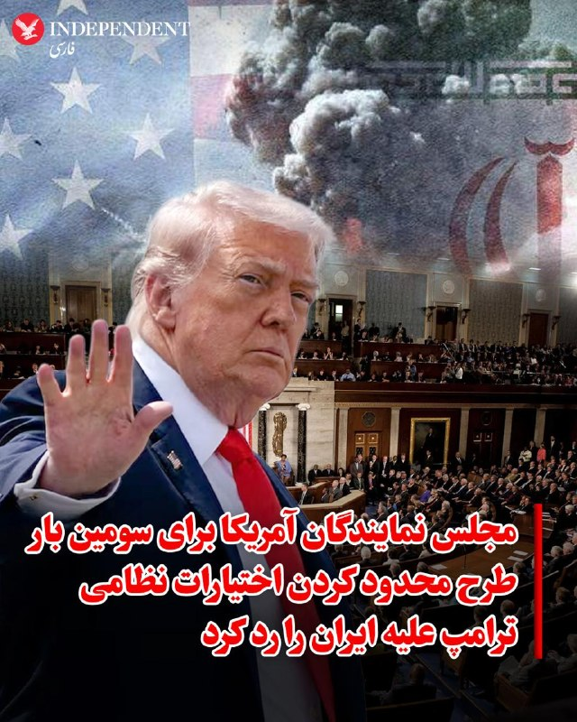
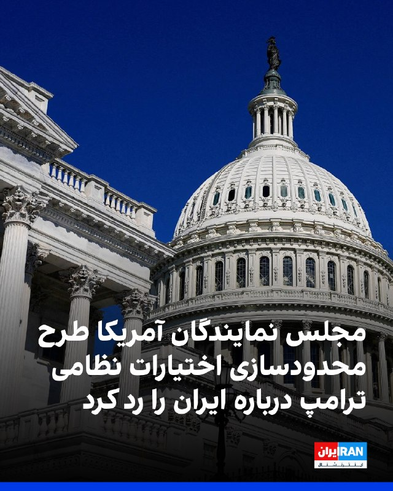
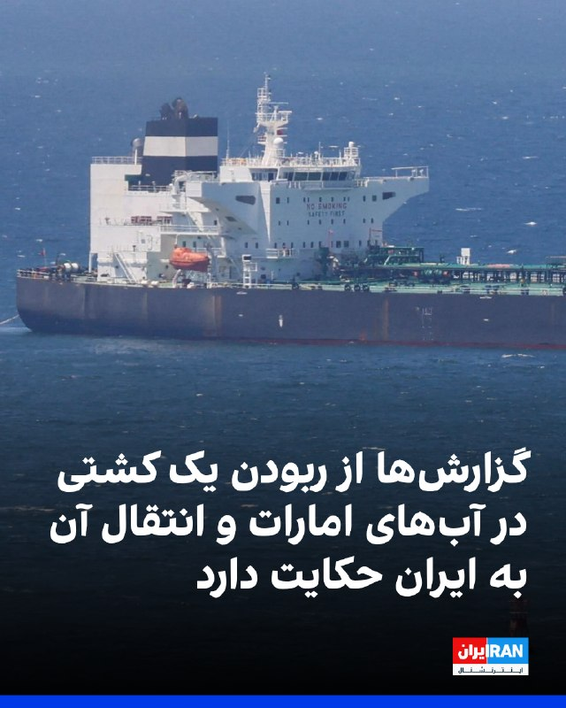
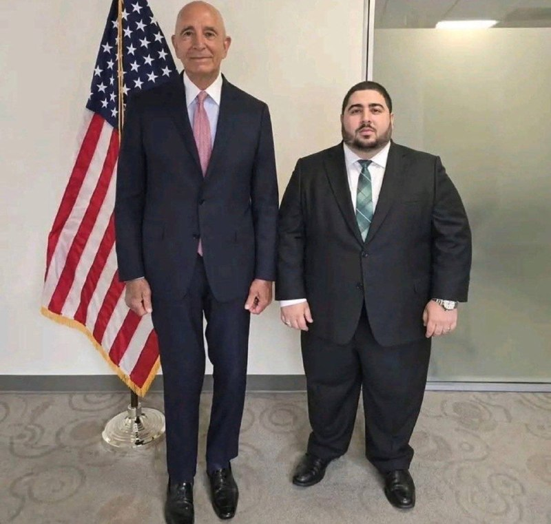
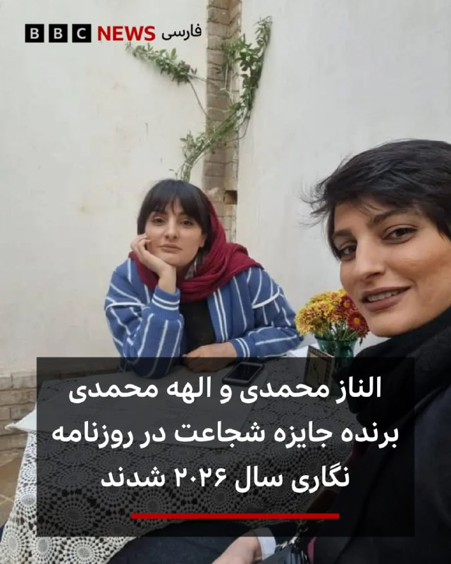
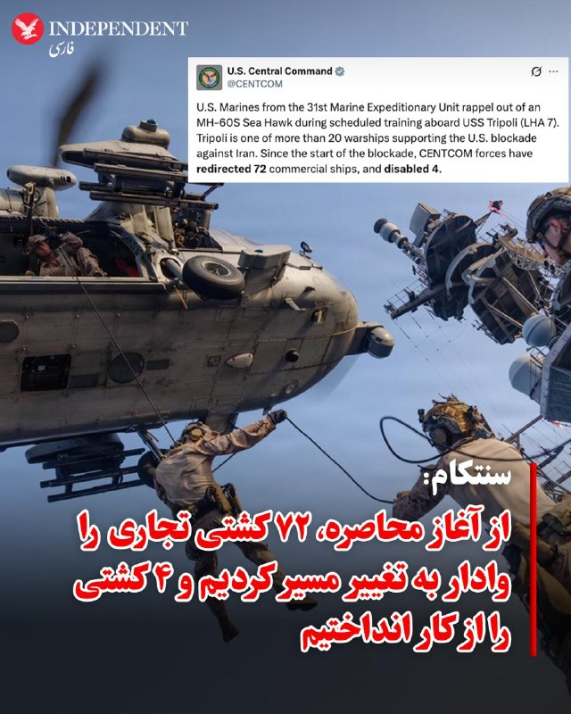
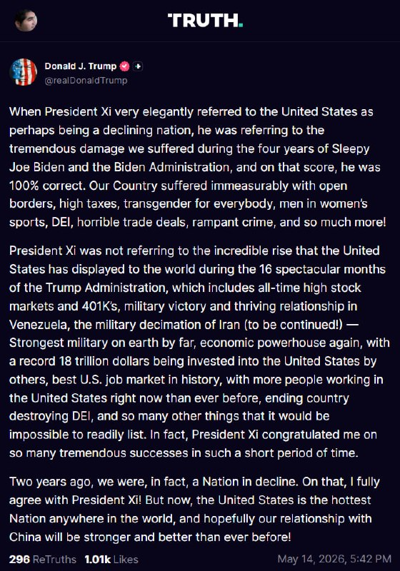
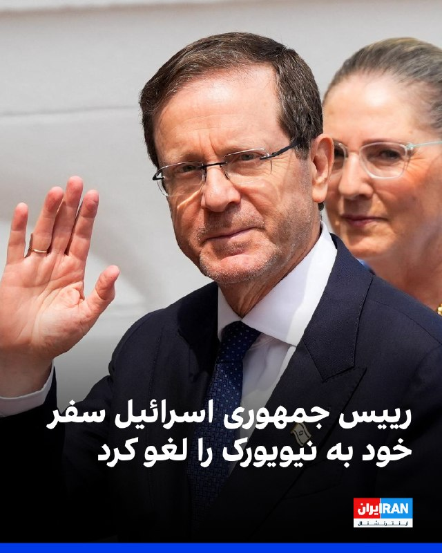
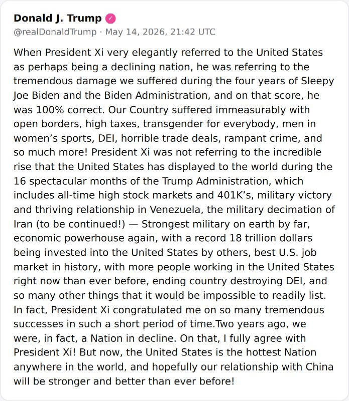
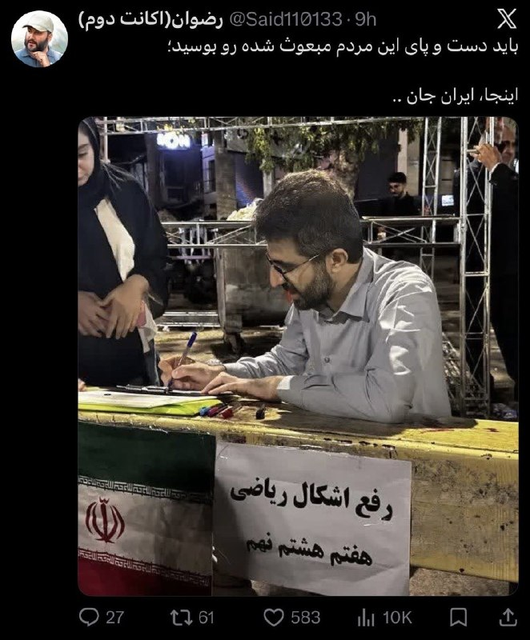

# خواننده تلگرام

<!-- TOP_NAV START -->

<a href="https://github.com/hhdoust2/aio-downloader/blob/main/telegram/content/archive_1.md" style="display:inline-block; padding:6px 12px; margin:0 4px; background-color:#2ea44f; color:white; text-decoration:none; border-radius:4px; font-weight:bold;">صفحه بعد</a>

<!-- TOP_NAV END -->

<!-- MSG START -->

---
📅 بروزرسانی: 1405/02/25 02:45
---

## VahidOOnLine — post 240207

  

گزارش‌ها حاکی است یک کشتی لنگر انداخته در نزدیکی بندر فجیره امارات متحده عربی توسط افراد ناشناس سوار شده و به سمت آب‌های ایران هدایت شده است.
به گزارش رویترز، شرکت امنیت دریایی وندگارد گفته است این اقدام احتمالا از سوی نیروهای ایرانی انجام شده و پیش از آن نیز نهاد دریایی «یو‌کی‌ام‌تی‌او»از ورود افراد غیرمجاز به این کشتی خبر داده بود.
هم‌زمان منابع دریایی از افزایش تحرکات در تنگه هرمز خبر داده‌اند. بر اساس گزارش‌ها، چندین کشتی از جمله نفتکش‌ها و کشتی‌های تجاری در روزهای اخیر با هماهنگی‌های محدود از این مسیر عبور کرده‌اند، در حالی که پیش‌تر تعداد عبور روزانه به شکل محسوسی کاهش یافته بود.
همچنین گزارش شده است نیروهای سپاه پاسداران اعلام کرده‌اند شمار بیشتری از شناورها در روزهای اخیر از تنگه هرمز عبور کرده‌اند؛ موضوعی که نشان‌دهنده تغییر تدریجی در وضعیت عبور و مرور دریایی در این آبراه راهبردی است.

‌🏁 🇬🇧 IranintlTV

🤖 @VahidOOnLine

## VahidOOnLine — post 240206

  

♦️دونالد ترامپ، رئیس‌جمهوری آمریکا، پنجشنبه شب با انتشار پیامی در شبکه اجتماعی «تروث سوشال» اعلام کرد روند «تضعیف نظامی جمهوری اسلامی» که به گفته او در دوره ریاست‌جمهوری‌اش آغاز شده، ادامه خواهد یافت.
ترامپ در این پیام، در کنار اشاره به آنچه دستاوردهای اقتصادی و نظامی دولت خود خواند، از «نابودی نظامی جمهوری اسلامی» نام برد و نوشت این روند «ادامه خواهد داشت».
او همچنین نوشت دولتش آمریکا را دوباره به یک قدرت اقتصادی و نظامی تبدیل کرده است
‌🇸🇦 Indypersian

🤖 @VahidOOnLine

## VahidOOnLine — post 240205

  

♦️اسکات بسنت، وزیر خزانه‌داری ایالات متحده، در گفتگو با شبکه سی‌ان‌بی‌سی گفت جمهوری اسلامی به‌دلیل فشارهای اقتصادی و محدودیت صادرات نفت، در «آخرین مراحل ضعف و فروپاشی» قرار دارد.

او با اشاره به محاصره بنادر جنوبی ایران از سوی آمریکا و تاسیسات نفتی جزیره خارک گفت: «در سه روز گذشته هیچ بارگیری‌ای انجام نشده است. ما معتقدیم مخازن ذخیره‌سازی آنها پر شده و دیگر نمی‌توانند نفت را روی آب ذخیره کنند. هیچ کشتی‌ای خارج یا وارد نمی‌شود و به‌زودی مجبور خواهند شد تولید نفت را کاهش دهند.»

بسنت افزود تصاویر ماهواره‌ای نشان می‌دهد این روند در حال وقوع است و تاکید کرد: «این یک حکومت شیطانی است. تا اینجای سال، بین ۳۰ تا ۴۰ هزار نفر را کشته‌اند که بسیاری از آنها معترضان مسالمت‌آمیز بوده‌اند.»

وزیر خزانه‌داری آمریکا گفت: «چگونه با چنین حکومتی برخورد می‌کنید؟ از نظر اقتصادی آن را تحت فشار قرار می‌دهید و ما معتقدیم به نقطه‌ای رسیده‌اند که سربازانشان حقوق دریافت نمی‌کنند و قادر نیستند ذخایر تسلیحاتی خود را از خارج تامین کنند.»

او در پایان گفت محاصره‌ای که دونالد ترامپ علیه جمهوری اسلامی اعمال کرده «موفقیتی بزرگ و قاطع» بوده است.
‌🇸🇦 Indypersian

🤖 @VahidOOnLine

## VahidOOnLine — post 240204

  

♦️مجلس نمایندگان آمریکا برای سومین بار به طرحی رای منفی داد که هدف آن محدود کردن اختیارات نظامی دونالد ترامپ در قبال ایران بود. این طرح که از سوی دموکرات‌ها ارائه شده بود، با نتیجه  ۲۱۲ رای موافق در برابر ۲۱۲ رای مخالف و به دلیل به حد نصاب نرسیدن آرا شکست خورد.
به گزارش سی‌بی‌اس، بر اساس این طرح، رئیس‌جمهوری آمریکا موظف می‌شد حداکثر ظرف ۳۰ روز پس از آغاز درگیری‌ها، نیروهای آمریکایی را از جنگ خارج کند؛ مگر اینکه کنگره مجوز ادامه عملیات را صادر کند.
جاش گاتهیمر، نماینده دموکرات نیوجرسی، در جریان جلسه بررسی این طرح گفت از اقدام دولت ترامپ علیه جمهوری اسلامی حمایت می‌کند، اما از اینکه دولت بدون ارائه توضیحات رسمی به کنگره عمل کرده، انتقاد کرد.
این رای‌گیری در شرایطی انجام شد که دولت ترامپ اعلام کرده آتش‌بس میان آمریکا و جمهوری اسلامی، مهلت قانونی ۶۰ روزه تعیین‌شده در قانون اختیارات جنگی را متوقف کرده است.
‌🇸🇦 Indypersian

🤖 @VahidOOnLine

## VahidOOnLine — post 240203

  

دونالد ترامپ، رییس‌جمهوری آمریکا، در پستی در شبکه اجتماعی تروث سوشال تاکید کرد «تضعیف نظامی حکومت ایران» در دوره دولت او است که انجام شده است.
ترامپ این موفقیت را در کنار مجموعه‌ای از دستاوردهای دولت خود ذکر و تاکید کرد این روند درباره جمهوری اسلامی همچنان «ادامه خواهد داشت».

‌🏁 🇬🇧 IranintlTV

🤖 @VahidOOnLine

## VahidOOnLine — post 240202

  

تام کاتن، سناتور جمهوری‌خواه آمریکا، در حساب کاربری ایکس خود نوشت «توافق‌های فاجعه‌بار» دوران باراک اوباما مسیر جاه‌طلبی‌های هسته‌ای جمهوری اسلامی را هموار کرد، اما ترامپ به این جاه‌طلبی‌ها پایان داد.
این سناتور نزدیک به دونالد ترامپ همچنین گفت: جمهوری اسلامی اکنون نسبت به ۱۰ ماه پیش «به‌مراتب ضعیف‌تر» شده است.

‌🏁 🇬🇧 IranintlTV

🤖 @VahidOOnLine

## VahidOOnLine — post 240201

  

مجلس نمایندگان آمریکا برای سومین بار به طرحی رای منفی داد که هدف آن محدود کردن اختیارات نظامی دونالد ترامپ در قبال حکومت ایران بود. این طرح در قالب قطعنامه‌ای از سوی دموکرات‌ها ارائه شده بود.
رای‌گیری روز پنجشنبه با نتیجه ۲۱۲ در برابر ۲۱۲ به تساوی رسید و در نهایت با اختلاف یک رای نتوانست به اکثریت لازم برسد و رد شد.
این سومین بار است که چنین ابتکاری برای مهار اختیارات نظامی رییس‌جمهوری در مجلس نمایندگان آمریکا شکست می‌خورد.
در جریان بررسی این طرح، جو گاتهایمر، نماینده دموکرات ایالت نیوجرسی، گفت از فشار بر حکومت ایران حمایت می‌کند اما دولت را به نگه داشتن کنگره «در تاریکی» بدون جلسات توجیهی رسمی، متهم کرد.

‌🏁 🇬🇧 IranintlTV

🤖 @VahidOOnLine

## VahidOOnLine — post 240200

  <a href="telegram/content/VahidOOnLine_240200_1778800515.mp4" target="_blank">🎬 Download video</a>

♦️یسرائیل کاتز، وزیر دفاع اسرائیل، پنجشنبه ۲۴ اردیبهشت‌ماه گفت کشورش برای احتمال انجام دوباره اقدام نظامی در ایران آمادگی دارد و «ماموریت اسرائیل هنوز تمام نشده است.»

او گفت: «ما باید اهداف این نبرد را به شکلی تکمیل کنیم که تضمین کند ایران دیگر هرگز تهدیدی برای موجودیت دولت اسرائیل، نیروهای ایالات متحده و کل دنیای آزاد در نسل‌های آینده نخواهد بود.»

وزیر دفاع اسرائیل افزود: «همان‌طور که پیش‌تر نیز گفته‌ام، ما آماده‌ایم و این احتمال وجود دارد که حتی در آینده‌ای نزدیک، بار دیگر برای تضمین تحقق این اهداف، دست به اقدام نظامی بزنیم.»

کاتز همچنین گفت جمهوری اسلامی در یک سال گذشته «ضربات بسیار سنگینی» متحمل شده است، اما اسرائیل همچنان به دنبال تکمیل اهداف عملیات خود است.
‌🇸🇦 Indypersian

🤖 @VahidOOnLine

## VahidOOnLine — post 240199

  <a href="telegram/content/VahidOOnLine_240199_1778800516.mp4" target="_blank">🎬 Download video</a>

مجلس نمایندگان آمریکا برای سومین بار قطعنامه‌ای را که هدف آن محدود کردن اختیارات جنگی دونالد ترامپ در جنگ با جمهوری اسلامی بود، رد کرد.

این قطعنامه دموکرات‌ها با نتیجه ۲۱۲ رأی موافق در برابر ۲۱۲ رأی مخالف، نتوانست اکثریت لازم را به دست آورد.

طرح مورد نظر که در ماه مارس ارائه شده بود، دولت ترامپ را ملزم می‌کرد حداکثر ظرف ۳۰ روز پس از آغاز جنگ، نیروهای آمریکایی را از درگیری خارج کند. جنگ میان آمریکا و جمهوری اسلامی از ۲۸ فوریه آغاز شده بود.

جاش گاتهیمر، نماینده دموکرات، گفت از «در هم کوبیدن رژیم ایران» حمایت می‌کند، اما دولت ترامپ را به پنهان نگه داشتن اطلاعات از کنگره متهم کرد.

بر اساس قانون اختیارات جنگی آمریکا مصوب ۱۹۷۳، رئیس‌جمهوری باید ظرف ۶۰ روز پس از آغاز درگیری، در صورت نداشتن مجوز کنگره، نیروهای نظامی را خارج کند.

دولت ترامپ اما اعلام کرده آتش‌بس ۷ آوریل باعث توقف شمارش این مهلت شده، زیرا از آن زمان «تبادل آتش» میان دو طرف رخ نداده است.

با این حال، تنش‌ها بر سر تنگه هرمز باعث شده آتش‌بس شکننده توصیف شود.

سه نماینده جمهوری‌خواه این بار به قطعنامه رأی مثبت دادند و در سنا نیز شماری از جمهوری‌خواهان به حمایت از طرح‌های محدودکننده اختیارات جنگی ترامپ نزدیک‌تر شده‌اند.

دموکرات‌ها گفته‌اند به طرح دوباره این قطعنامه‌ها ادامه خواهند داد. تیم کین، سناتور دموکرات، گفت: «روزی خواهد رسید که سنا به رئیس‌جمهوری خواهد گفت این جنگ را متوقف کن.»
‌🏁 🇬🇧 ManotoTV

🤖 @VahidOOnLine

## VahidOOnLine — post 240198

  

♦️به گزارش کانال ۱۴ تلویزیون اسرائیل، با وجود فروپاشی مذاکرات و اظهارات علنی دونالد ترامپ؛ عباس عراقچی، وزیر امور خارجه جمهوری اسلامی، همچنان در تماس مستقیم با مقام‌های آمریکایی است.
بر اساس اطلاعات کانال ۱۴، تهران اکنون خواستار برداشته‌شدن محاصره آمریکا به‌عنوان نخستین گام شده است.
در مقابل، جمهوری اسلامی دو گزینه را پیشنهاد داده است:
کاهش محدودیت‌های خود در تنگه هرمز، در حالی که همچنان هزینه عبور کشتی‌ها را دریافت کند
یا، آزادگذاشتن کامل عبور و مرور در تنگه هرمز در ازای دریافت صدها میلیارد دلار غرامت از آمریکا.
کانال ۱۴ می گوید، جمهوری اسلامی به‌شدت به پول نیاز دارد، اما تا این لحظه آمریکایی‌ها حاضر به پذیرش این پیشنهاد نشده‌اند.
‌🇸🇦 Indypersian

🤖 @VahidOOnLine

## VahidOOnLine — post 240197

  <a href="telegram/content/VahidOOnLine_240197_1778800519.mp4" target="_blank">🎬 Download video</a>

‌
مارکو روبیو، وزیر خارجه آمریکا، در گفت‌وگو با ان‌بی‌سی نیوز گفت دولت دونالد ترامپ اجازه نخواهد داد جمهوری اسلامی از فشارهای داخلی آمریکا برای تحمیل یک «توافق بد» استفاده کند.

روبیو گفت: «آنچه رئیس‌جمهوری روشن می‌کند این است که اگر ایرانی‌ها فکر می‌کنند می‌توانند از سیاست داخلی ما برای تحت فشار قرار دادن او جهت پذیرش یک توافق بد استفاده کنند، چنین اتفاقی نخواهد افتاد.»

او با اشاره به افزایش قیمت انرژی در آمریکا افزود واشنگتن اجازه نخواهد داد جمهوری اسلامی از موضوع تنگه هرمز و بازار نفت به‌عنوان اهرم فشار استفاده کند.

وزیر خارجه آمریکا همچنین گفت در صورت باز ماندن تنگه هرمز و ورود دوباره نفت ایران به بازار، قیمت نفت و بنزین کاهش خواهد یافت.

روبیو در ادامه هشدار داد دستیابی جمهوری اسلامی به سلاح هسته‌ای می‌تواند به کنترل دائمی تنگه هرمز از سوی تهران منجر شود.

او گفت: «اگر ایران به سلاح هسته‌ای دست پیدا کند، دیگر مسئله یک بحران سه‌ماهه یا شش‌ماهه نخواهد بود؛ ممکن است به یک مشکل دائمی تبدیل شود.»
‌🏁 🇬🇧 ManotoTV

🤖 @VahidOOnLine

## VahidOOnLine — post 240196

  <a href="telegram/content/VahidOOnLine_240196_1778800521.mp4" target="_blank">🎬 Download video</a>

صندوق بین‌المللی پول هشدار داد ادامه اختلال‌ها ناشی از جنگ ایران، اقتصاد جهانی را به سمت «سناریوی نامطلوب» سوق می‌دهد؛ سناریویی که با کاهش رشد اقتصادی و افزایش خطر تورم همراه خواهد بود.

این نهاد بین‌المللی اعلام کرد در صورت ادامه‌دار شدن جنگ و تداوم افزایش قیمت نفت، چشم‌انداز اقتصاد جهان می‌تواند به‌مراتب بدتر شود.

صندوق بین‌المللی پول پیش‌تر در گزارش «چشم‌انداز اقتصاد جهانی» پیش‌بینی کرده بود رشد اقتصاد جهان در سال ۲۰۲۶ در سناریوی پایه به ۳.۱ درصد برسد.

اما بر اساس اعلام این نهاد، در سناریوی «نامطلوب» —شامل بالا ماندن طولانی‌مدت قیمت نفت، بی‌ثبات شدن انتظارات تورمی و سخت‌تر شدن شرایط مالی — رشد جهانی ممکن است تا ۲.۵ درصد کاهش پیدا کند.
‌🏁 🇬🇧 ManotoTV

🤖 @VahidOOnLine

## VahidOOnLine — post 240195

  

♦️دونالد ترامپ، رئیس‌جمهوری ایالات متحده، با انتشار پیامی در شبکه اجتماعی «تروث سوشال» نوشت وقتی شی جین‌پینگ «بسیار مودبانه» از آمریکا به‌عنوان کشوری که «شاید در حال افول باشد» یاد کرد، منظور او آسیبی بود که ایالات متحده در چهار سال دولت جو بایدن متحمل شد.

ترامپ نوشت: «کشور ما به‌دلیل مرزهای باز، مالیات‌های بالا، ترویج تغییر جنسیت، حضور مردان در ورزش زنان، سیاست‌های تنوع و برابری و شمول، توافق‌های تجاری فاجعه‌بار، افزایش گسترده جرم‌وجنایت و خیلی چیزهای دیگر، آسیب عظیمی دید.»

او افزود شی جین‌پینگ درباره «رشد فوق‌العاده» آمریکا در ۱۶ ماه دولت ترامپ صحبت نمی‌کرد؛ دوره‌ای که به گفته او شامل «رکوردشکنی بازار سهام و حساب‌های پس‌انداز بازنشستگی، پیروزی نظامی و روابط رو‌به‌رشد در ونزوئلا، درهم‌کوبیدن نظامی ایران (ادامه دارد!)، قدرتمندترین ارتش جهان، بازگشت آمریکا به جایگاه قدرت اقتصادی، سرمایه‌گذاری ۱۸ تریلیون دلاری در آمریکا، بهترین بازار کار تاریخ ایالات متحده با بیشترین تعداد شاغلان و پایان دادن به سیاست‌های تنوع و شمول» بوده است.

ترامپ همچنین نوشت: «در واقع، رئیس‌جمهوری شی بابت این همه موفقیت بزرگ در چنین مدت کوتاهی به من تبریک گفت.»

او در پایان تاکید کرد: «دو سال پیش، ما واقعا کشوری در حال افول بودیم. در این مورد کاملا با رئیس‌جمهوری شی موافقم. اما حالا ایالات متحده داغ‌ترین و پررونق‌ترین کشور جهان است و امیدوارم روابط ما با چین قوی‌تر و بهتر از هر زمان دیگری شود.»
‌🇸🇦 Indypersian

🤖 @VahidOOnLine

## VahidOOnLine — post 240194

  

♦️عبدالحلیم خان، امام جماعت ۵۴ ساله ساکن شرق لندن، به دلیل سال‌ها آزار جنسی و تجاوز به هفت زن و دختر، از جمله کودکان ۱۳ ساله، به حبس ابد محکوم شد. این امام جماعت که بین سال‌های ۲۰۰۵ تا ۲۰۱۴ از جایگاه مذهبی خود سوءاستفاده می‌کرد، با ادعای تسخیر شدن توسط «جن» و داشتن قدرت‌های ماورایی، قربانیان را به مکان‌های خلوت می‌کشاند و آن‌ها را مورد تعرض قرار می‌داد. دادستانی بریتانیا فاش کرد که او با ارعاب قربانیان و تهدید به استفاده از «جادوی سیاه» علیه خانواده‌هایشان، آن‌ها را سال‌ها به سکوت واداشته بود. قاضی دادگاه «اسنرز‌بروک» با «هیولاوار» خواندن اقدامات این مرد، تاکید کرد که او پشت نقاب دینداری، از اعتماد زنان برای ارضای جنسی خود سوءاستفاده کرده است. این پرونده زمانی فاش شد که کوچک‌ترین قربانی در سال ۲۰۱۸ موضوع را به معلم مدرسه‌اش گزارش داد. عبدالحلیم خان که به ۲۱ فقره جرم از جمله تجاوز به کودکان زیر ۱۳ سال محکوم شده، باید حداقل ۲۰ سال از دوران حبس خود را پیش از امکان درخواست تخفیف، در زندان سپری کند.
‌🇸🇦 Indypersian

🤖 @VahidOOnLine

## FoxNewsTwitter — post 341756

  

Fox News (Twitter/X)

NEW: President Trump says China’s leader was right about America’s decline under President Biden — but argues the U.S. has completely rebounded under his administration.

In a lengthy post, Trump touted booming markets, record investment, the "ending" of DEI, and what he called the “strongest military on earth by far,” while predicting a stronger relationship with China moving forward.

## FoxNewsTwitter — post 341755

  <a href="telegram/content/FoxNewsTwitter_341755_1778800524.mp4" target="_blank">🎬 Download video</a>

Fox News (Twitter/X)

“People can’t feed themselves.”

AOC ripped the Trump administration over spending on the National Mall reflecting pool and the planned White House ballroom, arguing that Americans are struggling to afford groceries, rent, and mortgages.

She called the priorities “deeply out of touch” and “insulting” to everyday people.

## DEJradio — post 4637

  <a href="telegram/content/DEJradio_4637_1778800527.mp4" target="_blank">🎬 Download video</a>

🚨
🔸 خبر ۲۱
پنجشنبه ۲۴ اردیبهشت ۱۴۰۵

#خبر۲۱
@DEJradio

## IranIntlTV — post 337233

  

گزارش‌ها حاکی است یک کشتی لنگر انداخته در نزدیکی بندر فجیره امارات متحده عربی توسط افراد ناشناس سوار شده و به سمت آب‌های ایران هدایت شده است.
به گزارش رویترز، شرکت امنیت دریایی وندگارد گفته است این اقدام احتمالا از سوی نیروهای ایرانی انجام شده و پیش از آن نیز نهاد دریایی «یو‌کی‌ام‌تی‌او»از ورود افراد غیرمجاز به این کشتی خبر داده بود.
هم‌زمان منابع دریایی از افزایش تحرکات در تنگه هرمز خبر داده‌اند. بر اساس گزارش‌ها، چندین کشتی از جمله نفتکش‌ها و کشتی‌های تجاری در روزهای اخیر با هماهنگی‌های محدود از این مسیر عبور کرده‌اند، در حالی که پیش‌تر تعداد عبور روزانه به شکل محسوسی کاهش یافته بود.
همچنین گزارش شده است نیروهای سپاه پاسداران اعلام کرده‌اند شمار بیشتری از شناورها در روزهای اخیر از تنگه هرمز عبور کرده‌اند؛ موضوعی که نشان‌دهنده تغییر تدریجی در وضعیت عبور و مرور دریایی در این آبراه راهبردی است.

https://iranintl.com/202605147292

## IranIntlTV — post 337232

  <a href="telegram/content/IranIntlTV_337232_1778800531.mp4" target="_blank">🎬 Download video</a>

پنج هفته پس از نصب دیوارنگاره‌ای با نشان جمهوری اسلامی و در حمایت از سپاه پاسداران در محله وست‌وود لس‌آنجلس، واکنش‌ها در میان ایرانیان ساکن این منطقه ادامه دارد.

گزارش نیلوفر منصوری، خبرنگار ایران‌اینترنشنال
@iranintltv

## IranIntlTV — post 337231

  

دونالد ترامپ، رییس‌جمهوری آمریکا، در پستی در شبکه اجتماعی تروث سوشال تاکید کرد «تضعیف نظامی حکومت ایران» در دوره دولت او است که انجام شده است.
ترامپ این موفقیت را در کنار مجموعه‌ای از دستاوردهای دولت خود ذکر و تاکید کرد این روند درباره جمهوری اسلامی همچنان «ادامه خواهد داشت».

https://iranintl.com/202605148199

## IranIntlTV — post 337230

  

تام کاتن، سناتور جمهوری‌خواه آمریکا، در حساب کاربری ایکس خود نوشت «توافق‌های فاجعه‌بار» دوران باراک اوباما مسیر جاه‌طلبی‌های هسته‌ای جمهوری اسلامی را هموار کرد، اما ترامپ به این جاه‌طلبی‌ها پایان داد.
این سناتور نزدیک به دونالد ترامپ همچنین گفت: جمهوری اسلامی اکنون نسبت به ۱۰ ماه پیش «به‌مراتب ضعیف‌تر» شده است.

https://iranintl.com/202605140230

## IranIntlTV — post 337229

  <a href="telegram/content/IranIntlTV_337229_1778800535.mp4" target="_blank">🎬 Download video</a>

همزمان با آغاز دور جدید مذاکرات مستقیم اسرائیل و لبنان، مقام‌های لبنانی بر آتش‌بس فوری و توقف حملات اسرائیل به جنوب لبنان به‌عنوان اولویت اصلی تاکید کردند.

این مذاکرات در شرایطی برگزار می‌شود که آتش‌بس پیشین همچنان شکننده است و تنش‌ها در جنوب لبنان ادامه دارد.

گفت‌وگو با منشه امیر، کارشناس امور خاورمیانه
@iranintltv

## IranIntlTV — post 337228

  <a href="telegram/content/IranIntlTV_337228_1778800537.mp4" target="_blank">🎬 Download video</a>

دونالد ترامپ پس از دیدار با شی جین‌پینگ پیشنهاد داد چین برای بازگشایی تنگه هرمز کمک کند.

ترامپ همچنین گفت شی به او اطمینان داده چین تجهیزات نظامی در اختیار تهران قرار نخواهد داد.

گزارش امیر گیتی، عضو تحریریه ایران‌اینترنشنال
@iranintltv

## IranIntlTV — post 337227

  

مجلس نمایندگان آمریکا برای سومین بار به طرحی رای منفی داد که هدف آن محدود کردن اختیارات نظامی دونالد ترامپ در قبال حکومت ایران بود. این طرح در قالب قطعنامه‌ای از سوی دموکرات‌ها ارائه شده بود.
رای‌گیری روز پنجشنبه با نتیجه ۲۱۲ در برابر ۲۱۲ به تساوی رسید و در نهایت با اختلاف یک رای نتوانست به اکثریت لازم برسد و رد شد.
این سومین بار است که چنین ابتکاری برای مهار اختیارات نظامی رییس‌جمهوری در مجلس نمایندگان آمریکا شکست می‌خورد.
در جریان بررسی این طرح، جو گاتهایمر، نماینده دموکرات ایالت نیوجرسی، گفت از فشار بر حکومت ایران حمایت می‌کند اما دولت را به نگه داشتن کنگره «در تاریکی» بدون جلسات توجیهی رسمی، متهم کرد.

https://iranintl.com/202605146155

## ManotoTV — post 105467

  <a href="telegram/content/ManotoTV_105467_1778800541.mp4" target="_blank">🎬 Download video</a>

مجلس نمایندگان آمریکا برای سومین بار قطعنامه‌ای را که هدف آن محدود کردن اختیارات جنگی دونالد ترامپ در جنگ با جمهوری اسلامی بود، رد کرد.

این قطعنامه دموکرات‌ها با نتیجه ۲۱۲ رأی موافق در برابر ۲۱۲ رأی مخالف، نتوانست اکثریت لازم را به دست آورد.

طرح مورد نظر که در ماه مارس ارائه شده بود، دولت ترامپ را ملزم می‌کرد حداکثر ظرف ۳۰ روز پس از آغاز جنگ، نیروهای آمریکایی را از درگیری خارج کند. جنگ میان آمریکا و جمهوری اسلامی از ۲۸ فوریه آغاز شده بود.

جاش گاتهیمر، نماینده دموکرات، گفت از «در هم کوبیدن رژیم ایران» حمایت می‌کند، اما دولت ترامپ را به پنهان نگه داشتن اطلاعات از کنگره متهم کرد.

بر اساس قانون اختیارات جنگی آمریکا مصوب ۱۹۷۳، رئیس‌جمهوری باید ظرف ۶۰ روز پس از آغاز درگیری، در صورت نداشتن مجوز کنگره، نیروهای نظامی را خارج کند.

دولت ترامپ اما اعلام کرده آتش‌بس ۷ آوریل باعث توقف شمارش این مهلت شده، زیرا از آن زمان «تبادل آتش» میان دو طرف رخ نداده است.

با این حال، تنش‌ها بر سر تنگه هرمز باعث شده آتش‌بس شکننده توصیف شود.

سه نماینده جمهوری‌خواه این بار به قطعنامه رأی مثبت دادند و در سنا نیز شماری از جمهوری‌خواهان به حمایت از طرح‌های محدودکننده اختیارات جنگی ترامپ نزدیک‌تر شده‌اند.

دموکرات‌ها گفته‌اند به طرح دوباره این قطعنامه‌ها ادامه خواهند داد. تیم کین، سناتور دموکرات، گفت: «روزی خواهد رسید که سنا به رئیس‌جمهوری خواهد گفت این جنگ را متوقف کن.»

## ManotoTV — post 105466

  <a href="telegram/content/ManotoTV_105466_1778800542.mp4" target="_blank">🎬 Download video</a>

‌
مارکو روبیو، وزیر خارجه آمریکا، در گفت‌وگو با ان‌بی‌سی نیوز گفت دولت دونالد ترامپ اجازه نخواهد داد جمهوری اسلامی از فشارهای داخلی آمریکا برای تحمیل یک «توافق بد» استفاده کند.

روبیو گفت: «آنچه رئیس‌جمهوری روشن می‌کند این است که اگر ایرانی‌ها فکر می‌کنند می‌توانند از سیاست داخلی ما برای تحت فشار قرار دادن او جهت پذیرش یک توافق بد استفاده کنند، چنین اتفاقی نخواهد افتاد.»

او با اشاره به افزایش قیمت انرژی در آمریکا افزود واشنگتن اجازه نخواهد داد جمهوری اسلامی از موضوع تنگه هرمز و بازار نفت به‌عنوان اهرم فشار استفاده کند.

وزیر خارجه آمریکا همچنین گفت در صورت باز ماندن تنگه هرمز و ورود دوباره نفت ایران به بازار، قیمت نفت و بنزین کاهش خواهد یافت.

روبیو در ادامه هشدار داد دستیابی جمهوری اسلامی به سلاح هسته‌ای می‌تواند به کنترل دائمی تنگه هرمز از سوی تهران منجر شود.

او گفت: «اگر ایران به سلاح هسته‌ای دست پیدا کند، دیگر مسئله یک بحران سه‌ماهه یا شش‌ماهه نخواهد بود؛ ممکن است به یک مشکل دائمی تبدیل شود.»

## ManotoTV — post 105465

  <a href="telegram/content/ManotoTV_105465_1778800544.mp4" target="_blank">🎬 Download video</a>

صندوق بین‌المللی پول هشدار داد ادامه اختلال‌ها ناشی از جنگ ایران، اقتصاد جهانی را به سمت «سناریوی نامطلوب» سوق می‌دهد؛ سناریویی که با کاهش رشد اقتصادی و افزایش خطر تورم همراه خواهد بود.

این نهاد بین‌المللی اعلام کرد در صورت ادامه‌دار شدن جنگ و تداوم افزایش قیمت نفت، چشم‌انداز اقتصاد جهان می‌تواند به‌مراتب بدتر شود.

صندوق بین‌المللی پول پیش‌تر در گزارش «چشم‌انداز اقتصاد جهانی» پیش‌بینی کرده بود رشد اقتصاد جهان در سال ۲۰۲۶ در سناریوی پایه به ۳.۱ درصد برسد.

اما بر اساس اعلام این نهاد، در سناریوی «نامطلوب» —شامل بالا ماندن طولانی‌مدت قیمت نفت، بی‌ثبات شدن انتظارات تورمی و سخت‌تر شدن شرایط مالی — رشد جهانی ممکن است تا ۲.۵ درصد کاهش پیدا کند.

## FarsiVOA — post 217779

⚡️شک مقام‌های جمهوری اسلامی به یکدیگر شکاف در حکومت را عمیق‌تر کرد؛ جنگ تهدیدها و تهمت‌ها

@FarsiVOA

## FarsiVOA — post 217778

⚡️نگرانی مسکو از گسترش تروریسم در افغانستان و پیامدهای آن برای ایران و دیگر کشورها
@FarsiVOA

## IranianMinds — post 20160

  

🔴محمد قنطری، سرپرست جدید امور سوریه در واشنگتن دی‌سی.

@IranianMinds

## IranianMinds — post 20159

  

🔴پست جدید ترامپ:

ایالت 243ام.

@IranianMinds

## BBCPersian — post 281061

  

‌ ‌ ‌ ‌
الناز و الهه محمدی، خبرنگاران ایرانی از سوی بنیاد بین‌المللی زنان رسانه که در واشنگتن آمریکاست، به عنوان برندگان جایزه سال ۲۰۲۶ در زمینه «شجاعت در روزنامه‌نگاری» شدند.

این بنیاد روز پنجشنبه - ۱۴ مه / ۲۴ اردیبهشت - در بیانیه اعلام برندگان جوایز امسال گفت: «ما با افتخار فراوان اعلام می‌کنیم که برندگان جوایز «شجاعت در روزنامه‌نگاری» سال ۲۰۲۶ عبارتند از الهه محمدی و الناز محمدی از ایران.»

الهه محمدی، خبرنگار روزنامه هم‌میهن در سال ۱۴۰۱ به محل خاکسپاری مهسا امینی رفت و گزارشی از آن منتشر نمود و با شروع اعتراضات سراسری آن سال در ایران به همراه نیلوفر حامدی بازداشت و محاکمه شدند و بیش از یکسال در زندان بودند. خواهر او، الناز محمدی هم دبیر گروه جامعه روزنامه هم میهن است.

https://bbc.in/4eMEfRt
📷@parsaee_d
@BBCPersian

## BBCPersian — post 281060

🔻 راستی‌آزمایی بی‌بی‌سی؛ ادعاهای گمراه‌کننده درباره تشریفات لحظه رسیدن ترامپ و اوباما به پکن

ادعاهای گمراه‌کننده درباره مقایسه استقبال فرش قرمز از رئیس‌جمهور آمریکا، دونالد ترامپ، در سفر رسمی این هفته به پکن با استقبال کم‌تشریفات‌تر از باراک اوباما در سفرش به چین، میلیون‌ها بار در اینترنت دیده شده است.

بنی جانسون، مفسر محافظه‌کار آمریکایی، در شبکه ایکس نوشت: «وقتی اوباما به چین رفت، حتی برایش پله هم پای هواپیما نیاوردند»، و افزود: «ترامپ با استقبال قهرمانانه و فرش قرمز روبه‌رو شد.» این پست بیش از پنج میلیون بازدید داشته است.

بنی جانسون ویدیویی را نیز منتشر کرد که اوباما را هنگام پیاده شدن از پله‌های داخلی هواپیمای ایر فورس وان در زمان ورود به پکن در سال ۲۰۱۶ نشان می‌دهد.

اما آن سفر مربوط به نشست گروه ۲۰ بود که چین در همان سال میزبانی آن را بر عهده داشت؛ نه یک سفر رسمی دولتی مانند سفر کنونی دونالد ترامپ، که معمولا با تشریفات و مراسم بیشتری برای رهبران آمریکا همراه است.

مقایسه مناسب‌تر، سفر رسمی اوباما به چین در سال ۲۰۰۹ است. در آن سفر نیز مراسم استقبالی مشابه سفر آقای ترامپ برگزار شد؛ جایی که رئیس‌جمهور وقت آمریکا از پله‌های اصلی هوایپمای خصوصی روسای جمهوری آمریکا - ایر فورس وان - پایین آمد و توسط گارد احترام نظامی مورد استقبال قرار گرفت.

https://bbc.in/4ds1ttM
@BBCPersian

## Dirty_Kids — post 389479

  <a href="telegram/content/Dirty_Kids_389479_1778800548.webm" target="_blank">🎬 Download video</a>

☢️خفن ترین و‌ قدیمی ترین  انالیزور  ایران ینی دکتر بت 
👍 
🔴هیچ سایت بتی دوست نداره شما کانال دکتر بت رو پیدا کنین چون خیلی سود میکنید🤷‍♂ رایگان بهترین شرط هارو براتون میذاره حتی هزار تومن هم دریافت نمیکنه روزانه میتونی از پیش بینی فوتبال باهاش پول در بیاری…

## Dirty_Kids — post 389478

  <a href="telegram/content/Dirty_Kids_389478_1778800548.webm" target="_blank">🎬 Download video</a>

☢️خفن ترین و‌ قدیمی ترین  انالیزور  ایران ینی دکتر بت 
👍

🔴هیچ سایت بتی دوست نداره شما کانال دکتر بت رو پیدا کنین چون خیلی سود میکنید🤷‍♂

رایگان بهترین شرط هارو براتون میذاره
حتی هزار تومن هم دریافت نمیکنه
روزانه میتونی از پیش بینی فوتبال باهاش پول در بیاری 👌
A24
اگ اهل پیش بینی فوتبالی این کانال اصلا از دست ندین👇

✅https://t.me/+4_ADqwB9e-QwYjlk

✅https://t.me/+4_ADqwB9e-QwYjlk

## Dirty_Kids — post 389477

  

#بخوابیم

@Dirty_Kids 👻

## Dirty_Kids — post 389476

قضیه السیسی اگه نمیدونی این ویدیو کمکت میکنه

@Dirty_Kids 👻

## Dirty_Kids — post 389475

  

آیفونیا با کانفیگ پولی در حال خوندن پستای اندرویدیا که با وپن شیر 🌞 وصل شدن:

@Dirty_Kids 👻

## Dirty_Kids — post 389474

  <a href="telegram/content/Dirty_Kids_389474_1778800550.mp4" target="_blank">🎬 Download video</a>

🎙️خبرنگار : امیرعلی چرا اومدی تجمع؟
🧑امیرعلی : به عشق رهبر

🎙️خبرنگار : امیرعلی، مامان و بابات مجبورت کردن که بیای تجمعات؟

🧑امیرعلی : آره

@Dirty_Kids 👻

## Dirty_Kids — post 389473

  

کصمادرتون…
نسلتون رو ✌🏽 بار گائیدم…

@Dirty_Kids 👻

## manototv — post 105467

  <a href="telegram/content/manototv_105467_1778800553.mp4" target="_blank">🎬 Download video</a>

مجلس نمایندگان آمریکا برای سومین بار قطعنامه‌ای را که هدف آن محدود کردن اختیارات جنگی دونالد ترامپ در جنگ با جمهوری اسلامی بود، رد کرد.

این قطعنامه دموکرات‌ها با نتیجه ۲۱۲ رأی موافق در برابر ۲۱۲ رأی مخالف، نتوانست اکثریت لازم را به دست آورد.

طرح مورد نظر که در ماه مارس ارائه شده بود، دولت ترامپ را ملزم می‌کرد حداکثر ظرف ۳۰ روز پس از آغاز جنگ، نیروهای آمریکایی را از درگیری خارج کند. جنگ میان آمریکا و جمهوری اسلامی از ۲۸ فوریه آغاز شده بود.

جاش گاتهیمر، نماینده دموکرات، گفت از «در هم کوبیدن رژیم ایران» حمایت می‌کند، اما دولت ترامپ را به پنهان نگه داشتن اطلاعات از کنگره متهم کرد.

بر اساس قانون اختیارات جنگی آمریکا مصوب ۱۹۷۳، رئیس‌جمهوری باید ظرف ۶۰ روز پس از آغاز درگیری، در صورت نداشتن مجوز کنگره، نیروهای نظامی را خارج کند.

دولت ترامپ اما اعلام کرده آتش‌بس ۷ آوریل باعث توقف شمارش این مهلت شده، زیرا از آن زمان «تبادل آتش» میان دو طرف رخ نداده است.

با این حال، تنش‌ها بر سر تنگه هرمز باعث شده آتش‌بس شکننده توصیف شود.

سه نماینده جمهوری‌خواه این بار به قطعنامه رأی مثبت دادند و در سنا نیز شماری از جمهوری‌خواهان به حمایت از طرح‌های محدودکننده اختیارات جنگی ترامپ نزدیک‌تر شده‌اند.

دموکرات‌ها گفته‌اند به طرح دوباره این قطعنامه‌ها ادامه خواهند داد. تیم کین، سناتور دموکرات، گفت: «روزی خواهد رسید که سنا به رئیس‌جمهوری خواهد گفت این جنگ را متوقف کن.»

## manototv — post 105466

  <a href="telegram/content/manototv_105466_1778800555.mp4" target="_blank">🎬 Download video</a>

‌
مارکو روبیو، وزیر خارجه آمریکا، در گفت‌وگو با ان‌بی‌سی نیوز گفت دولت دونالد ترامپ اجازه نخواهد داد جمهوری اسلامی از فشارهای داخلی آمریکا برای تحمیل یک «توافق بد» استفاده کند.

روبیو گفت: «آنچه رئیس‌جمهوری روشن می‌کند این است که اگر ایرانی‌ها فکر می‌کنند می‌توانند از سیاست داخلی ما برای تحت فشار قرار دادن او جهت پذیرش یک توافق بد استفاده کنند، چنین اتفاقی نخواهد افتاد.»

او با اشاره به افزایش قیمت انرژی در آمریکا افزود واشنگتن اجازه نخواهد داد جمهوری اسلامی از موضوع تنگه هرمز و بازار نفت به‌عنوان اهرم فشار استفاده کند.

وزیر خارجه آمریکا همچنین گفت در صورت باز ماندن تنگه هرمز و ورود دوباره نفت ایران به بازار، قیمت نفت و بنزین کاهش خواهد یافت.

روبیو در ادامه هشدار داد دستیابی جمهوری اسلامی به سلاح هسته‌ای می‌تواند به کنترل دائمی تنگه هرمز از سوی تهران منجر شود.

او گفت: «اگر ایران به سلاح هسته‌ای دست پیدا کند، دیگر مسئله یک بحران سه‌ماهه یا شش‌ماهه نخواهد بود؛ ممکن است به یک مشکل دائمی تبدیل شود.»

## manototv — post 105465

  <a href="telegram/content/manototv_105465_1778800557.mp4" target="_blank">🎬 Download video</a>

صندوق بین‌المللی پول هشدار داد ادامه اختلال‌ها ناشی از جنگ ایران، اقتصاد جهانی را به سمت «سناریوی نامطلوب» سوق می‌دهد؛ سناریویی که با کاهش رشد اقتصادی و افزایش خطر تورم همراه خواهد بود.

این نهاد بین‌المللی اعلام کرد در صورت ادامه‌دار شدن جنگ و تداوم افزایش قیمت نفت، چشم‌انداز اقتصاد جهان می‌تواند به‌مراتب بدتر شود.

صندوق بین‌المللی پول پیش‌تر در گزارش «چشم‌انداز اقتصاد جهانی» پیش‌بینی کرده بود رشد اقتصاد جهان در سال ۲۰۲۶ در سناریوی پایه به ۳.۱ درصد برسد.

اما بر اساس اعلام این نهاد، در سناریوی «نامطلوب» —شامل بالا ماندن طولانی‌مدت قیمت نفت، بی‌ثبات شدن انتظارات تورمی و سخت‌تر شدن شرایط مالی — رشد جهانی ممکن است تا ۲.۵ درصد کاهش پیدا کند.

## alonews — post 120055

  

🌐 اینترنت رایگان و آزاد برای همه مردم

⚡ VPN رایگان
⚡ کانفیگ تست‌شده و پرسرعت
⚡ آپدیت روزانه
⚡ بدون قطعی و دردسر

@NetaazaadVPN
@NetaazaadVPN

اینجا فقط وصل میشی و راحت استفاده میکنی 🫡

👇
@NetaazaadVPN
@NetaazaadVPN
@NetaazaadVPN

## alonews — post 120054

  

🔴احتمالا ویزا مهدی طارمی به علت خدمت در سپاه صادر نشود
‼️

@AloSport

## alonews — post 120053

  <a href="telegram/content/alonews_120053_1778800558.webm" target="_blank">🎬 Download video</a>

🔴فوری/ترامپ:
نابودی نظامی ایران ادامه خواهد یافت‌‌

✅ @AloNews خبر جنگ

---
📅 بروزرسانی: 1405/02/25 01:41
---

## VahidOOnLine — post 240193

  

بنیامین نتانیاهو در مراسم روز اورشلیم در «تپه مهمات» اعلام کرد جمهوری اسلامی «ضعیف‌تر از همیشه» شده است و اسرائیل به مقابله قاطع با «تهدیدهای اسلام افراطی» ادامه خواهد داد.
نخست‌وزیر اسرائیل همچنین گفت اگر اسرائیل در سال ۲۰۲۵ و اوایل امسال به برنامه‌های هسته‌ای و موشکی ایران حمله نکرده بود، حکومت ایران اکنون به سلاح هسته‌ای دست یافته بود.
نتانیاهو با اشاره به درگیری‌های اخیر با جمهوری اسلامی، حماس و حزب‌الله گفت اقدامات نظامی اسرائیل و همکاری نزدیک‌تر با دولت ترامپ «چهره خاورمیانه را تغییر داده است.»
او همچنین تاکید کرد اورشلیم «برای همیشه» تحت کنترل اسرائیل باقی خواهد ماند.

‌🏁 🇬🇧 IranintlTV

🤖 @VahidOOnLine

## VahidOOnLine — post 240192

  

♦️ستاد فرماندهی مرکزی ارتش آمریکا، سنتکام، پنجشنبه ۲۴ اردیبهشت در اکس با انتشار تصویری اعلام کرد نیروهای تفنگدار دریایی آمریکا در جریان تمرین‌های نظامی از بالگرد «سی هاوک» بر عرشه ناو «یو‌اس‌اس تریپولی» عملیات فرود انجام داده‌اند.
سنتکام اعلام کرد ناو «تریپولی» یکی از بیش از ۲۰ ناو جنگی آمریکایی است که در محاصره دریایی جمهوری اسلامی مشارکت دارند. این نهاد همچنین اعلام کرد از زمان آغاز این محاصره، نیروهای آمریکایی مسیر ۷۲ کشتی تجاری را تغییر داده و چهار شناور را از کار انداخته‌اند.
‌🇸🇦 Indypersian

🤖 @VahidOOnLine

## VahidOOnLine — post 240191

  

وای‌نت گزارش داد اسحاق هرتزوگ، رییس جمهوری اسرائیل سفر خود به نیویورک برای سخنرانی در مراسم دانش‌آموختگی مدرسه الهیات یهودی وابسته به دانشگاه کلمبیا را لغو کرده و قرار است به‌صورت مجازی در این مراسم شرکت کند.
به نوشته وای‌نت، این تصمیم پس از انتقادها و اعتراض‌های دانشجویان حامی فلسطین به حضور هرتزوگ گرفته شد، هرچند دفتر ریاست‌جمهوری اسرائیل تاکید کرده لغو سفر ارتباطی با این اعتراض‌ها نداشته است.
وای‌نت همچنین گزارش داد هم‌زمان اسرائیل خود را برای احتمال ازسرگیری اقدام نظامی آمریکا علیه جمهوری اسلامی آماده می‌کند و رهبران سیاسی به ارتش دستور داده‌اند آمادگی‌های لازم را در نظر بگیرد.

‌🏁 🇬🇧 IranintlTV

🤖 @VahidOOnLine

## VahidOOnLine — post 240190

♦️بنیامین نتانیاهو، نخست‌وزیر اسرائیل، پنجشنبه ۲۴ اردیبهشت‌ماه، در مراسم روز اورشلیم گفت جمهوری اسلامی «ضعیف‌تر از همیشه» شده و دولت اسرائیل «قوی‌تر از همیشه» است.

او با اشاره به عملیات نظامی اسرائیل در منطقه و حمایت دولت دونالد ترامپ، رئیس‌جمهوری آمریکا، گفت: «قدرتی که ما در جبهه‌های نبرد به کار گرفتیم، اتحاد نزدیک با دولت ترامپ در آمریکا، قاطعیت برای ضربه زدن به دشمنانمان در عمق خاکشان و دور از مرزهایمان، و مناطق حایلی که پیرامون خود در غزه، لبنان و سوریه ایجاد کردیم؛ همه این‌ها چهره خاورمیانه را تغییر داده است.»
‌🇸🇦 Indypersian

🤖 @VahidOOnLine

## VahidOOnLine — post 240189

♦️کاظم غریب‌آبادی، معاون حقوقی و بین‌المللی وزارت خارجه جمهوری اسلامی، در اجلاس وزرای خارجه کشورهای عضو بریکس در دهلی‌نو، با اشاره به حمله نظامی مشترک آمریکا و اسرائیل علیه اهداف نظامی جمهوری اسلامی گفت: «ما خواهان موضعی یکپارچه در گروه بریکس بر پایه مخالفت با هدف قرار دادن نظامی کشورهای عضو و تقویت اصول امنیت و ثبات میان کشورهای این گروه هستیم.»

او تاکید کرد کشورهای عضو بریکس باید در برابر اقدام‌های نظامی علیه اعضای این گروه، موضعی هماهنگ و مشترک اتخاذ کنند.
‌🇸🇦 Indypersian

🤖 @VahidOOnLine

## VahidOOnLine — post 240188

  

وزارت خارجه قطر به العربیه اعلام کرد چند پهپاد ایرانی را در نزدیکی حریم هوایی خود سرنگون کرده است. این وزارتخانه افزود در تماس‌های خود با جمهوری اسلامی بر ضرورت بازگشایی تنگه هرمز تأکید کرده و ابراز امیدواری کرده است توافقی برای تضمین امنیت منطقه‌ای حاصل شود.

وزارت خارجه قطر همچنین گفت کشورهای خلیج فارس خواهان بازگشایی تنگه هرمز و توقف حملات جمهوری اسلامی هستند و از تلاش‌های دیپلماتیک حمایت کرده و بر پرهیز از جنگ تأکید دارند.
‌🏁 🇬🇧 IranintlTV

🤖 @VahidOOnLine

## WithYashar — post 11253

https://t.me/boost/withyashar

## WithYashar — post 11252

آقا ما استیکر حامله میخوایم

## WithYashar — post 11251

ترامپ در تروث : «وقتی رئیس‌جمهور شی با بیانی بسیار سنجیده از ایالات متحده به‌عنوان کشوری که شاید در حال افول باشد یاد کرد، منظور او آسیب عظیمی بود که ما در چهار سال دوران جو بایدنِ خواب‌آلود و دولت بایدن متحمل شدیم؛ و در این مورد، او صددرصد درست می‌گفت.

کشور ما با مرزهای باز، مالیات‌های سنگین، ترویج تغییر جنسیت برای همه، حضور مردان در ورزش زنان، سیاست‌های موسوم به تنوع و شمول، توافق‌های تجاری وحشتناک، جرم و جنایت گسترده و بسیاری مسائل دیگر، آسیب غیرقابل‌تصوری دید!
@withyashar
رئیس‌جمهور شی به هیچ‌وجه به رشد شگفت‌انگیزی اشاره نمی‌کرد که ایالات متحده در طول شانزده ماه فوق‌العاده دولت ترامپ به جهان نشان داده است؛ دورانی که شامل رکورد تاریخی بازار بورس و صندوق‌های بازنشستگی، پیروزی نظامی و روابط شکوفا با ونزوئلا، درهم‌کوبیدن نظامی ایران (ادامه دارد!)، قدرتمندترین ارتش جهان با اختلاف بسیار زیاد، تبدیل دوباره آمریکا به یک قدرت اقتصادی عظیم، جذب رکورد هجده تریلیون دلار سرمایه‌گذاری خارجی در آمریکا، بهترین بازار کار تاریخ ایالات متحده با بیشترین تعداد شاغلان تاریخ کشور، پایان دادن به سیاست‌های ویرانگر موسوم به تنوع و شمول و بسیاری موفقیت‌های دیگر بوده که فهرست کردن همه آنها ممکن نیست.

در حقیقت، رئیس‌جمهور شی بابت این همه موفقیت بزرگ در چنین مدت کوتاهی به من تبریک گفت.

دو سال پیش، ما واقعاً کشوری در حال افول بودیم. در این مورد کاملاً با رئیس‌جمهور شی موافقم! اما حالا ایالات متحده داغ‌ترین و پررونق‌ترین کشور جهان است و امیدوارم رابطه ما با چین از همیشه قوی‌تر و بهتر باشد!»
@withyashar

## WithYashar — post 11250

فاکس نیوز : تو سفر ترامپ، بین مأموران سرویس مخفی آمریکا و پلیس چین، تنش ایجاد شده و درگیری لفظی و حتی فیزیکی هم پیش اومده.
@withyashar

## WithYashar — post 11249

  

کت کش ها در مراسم اربعین کتلت سرلشکر سیدعبدالرحیم موسوی در قم
@withyashar

## WithYashar — post 11248

  <a href="telegram/content/WithYashar_11248_1778796676.mp4" target="_blank">🎬 Download video</a>

‏ترامپ به دلیل مرگ برادر بزرگترش که بر اثر نوشیدن الکل جانش را از دست داد ،مشروب نمیخوره ،ولی اینجا جرعه‌ای از آن را مینوشه و به نشانه احترام به رئیس جمهور شی جین پینگ
‏ولی داشت بالا می‌آورد
@withyashar

## mwarmonitor — post 9104

🇨🇳شی جین پینگ: رئیس‌جمهور ترامپ، از ملاقات با شما در پکن بسیار خوشحالم. پس از نه سال، به چین خوش آمدید. تمام دنیا نظاره‌گر ملاقات ما هستند. در حال حاضر، دگرگونی‌هایی که در یک قرن اخیر دیده نشده، در سراسر جهان در حال شتاب گرفتن است و وضعیت بین‌المللی متغیر…

## mwarmonitor — post 9103

🇨🇳شی جین پینگ: رئیس‌جمهور ترامپ، از ملاقات با شما در پکن بسیار خوشحالم. پس از نه سال، به چین خوش آمدید.
تمام دنیا نظاره‌گر ملاقات ما هستند. در حال حاضر، دگرگونی‌هایی که در یک قرن اخیر دیده نشده، در سراسر جهان در حال شتاب گرفتن است و وضعیت بین‌المللی متغیر و پر از تلاطم است. جهان به یک دوراهی جدید رسیده است.
آیا چین و ایالات متحده می‌توانند بر **«تله توسیدید» غلبه کنند؟
آیا می‌توانیم الگوی جدیدی از روابط میان کشورهای بزرگ ایجاد کنیم؟
آیا می‌توانیم با هم با چالش‌های جهانی مقابله کرده و ثبات بیشتری برای جهان فراهم کنیم؟
آیا می‌توانیم در راستای رفاه دو ملت و آینده بشریت، آینده‌ای روشن‌تر برای روابط دوجانبه‌مان بسازیم؟ این‌ها سوالات حیاتی برای تاریخ، جهان و مردم هستند. این‌ها سوالات زمانه ما هستند که من و شما به عنوان رهبران کشورهای بزرگ باید به آن‌ها پاسخ دهیم.
امسال دویست و پنجاهمین سالگرد استقلال آمریکا است. این مناسبت را به شما و مردم آمریکا تبریک می‌گویم. من همیشه معتقدم که منافع مشترک دو کشور ما بیشتر از اختلافاتمان است.
موفقیت در یکی، فرصتی برای دیگری است و یک رابطه دوجانبه پایدار به نفع جهان است.
چین و ایالات متحده هر دو از همکاری سود می‌برند و از تقابل آسیب می‌بینند. ما باید شریک باشیم، نه رقیب. باید به موفقیت یکدیگر کمک کنیم و با هم شکوفا شویم و راه صحیح تعامل کشورهای بزرگ با یکدیگر را در عصر جدید بیابیم.
آقای رئیس‌جمهور، من مشتاقانه منتظر گفتگوهایمان درباره مسائل مهم برای دو کشور و جهان هستم. همچنین مشتاق همکاری با شما برای تعیین مسیر و هدایت کشتی عظیم روابط چین و آمریکا هستم تا سال ۲۰۲۶ را به یک سال تاریخی و ماندگار تبدیل کنیم که فصل جدیدی در روابط دو کشور باز می‌کند.
در اینجا مکث می‌کنم و سخن را به شما می‌سپارم، آقای رئیس‌جمهور. متشکرم.

**«تله توسیدید» (Thucydides Trap) یک اصطلاح در علوم سیاسی و روابط بین‌الملل است که به وضعیتی خطرناک اشاره دارد: وقتی یک قدرت نوظهور (مثل چین) تهدیدی برای جایگزینی یک قدرت حاکم (مثل آمریکا) ایجاد می‌کند، احتمال وقوع جنگ بین آن‌ها بسیار بالا می‌رود.

@mwarmonitor

## mwarmonitor — post 9102

  <a href="telegram/content/mwarmonitor_9102_1778796679.mp4" target="_blank">🎬 Download video</a>

🎬 Video

## mwarmonitor — post 9101

🔴ترامپ در سوشال تروث

زمانی که پرزیدنت شی (رئیس‌جمهور چین) خیلی باظرافت به ایالات متحده به عنوان کشوری اشاره کرد که شاید در حال زوال باشد، منظورش آسیب‌های عظیمی بود که ما طی چهار سالِ «جوی بایدن خواب‌آلود» و دولت بایدن متحمل شدیم؛ و در این مورد، او ۱۰۰ درصد درست می‌گفت. کشور ما با مرزهای باز، مالیات‌های بالا، [ترویج] تراجنسیتی برای همه، حضور مردان در ورزش‌های زنان، DEI (برنامه‌های تنوع، برابری و فراگیری)، قراردادهای تجاری وحشتناک، جرم و جنایت افسارگسیخته و موارد بسیار دیگر، آسیب‌های بی‌شماری دید!
پرزیدنت شی به رشد فوق‌العاده‌ای که ایالات متحده طی ۱۶ ماه درخشانِ دولت ترامپ به جهان نشان داده است، اشاره نمی‌کرد؛ دوره‌ای که شامل اوج‌گیری همیشگی بازار سهام و حساب‌های بازنشستگی (401K)، پیروزی نظامی و رابطه شکوفا در ونزوئلا، و درهم‌کوبیدن نظامی ایران (ادامه دارد!) بود — قوی‌ترین ارتش روی زمین با فاصله زیاد، تبدیل شدن دوباره به یک قدرت اقتصادی با رکورد ۱۸ تریلیون دلار سرمایه‌گذاری دیگران در ایالات متحده، بهترین بازار کار در تاریخ ایالات متحده با بیشترین تعداد افراد شاغل در کشور نسبت به هر زمان دیگری، پایان دادن به طرح‌های مخرب کشور (DEI) و بسیاری چیزهای دیگر که فهرست کردن سریع آن‌ها غیرممکن است. در واقع، پرزیدنت شی بابت موفقیت‌های عظیمِ بسیار در چنین مدت کوتاهی به من تبریک گفت.
دو سال پیش، ما در واقع ملتی در حال زوال بودیم. در این مورد، من کاملاً با پرزیدنت شی موافقم! اما اکنون، ایالات متحده جذاب‌ترین (داغ‌ترین) کشور در هر کجای جهان است و امیدوارم رابطه ما با چین قوی‌تر و بهتر از همیشه باشد!

@mwarmonitor

## FoxNewsTwitter — post 341754

  <a href="telegram/content/FoxNewsTwitter_341754_1778796682.mp4" target="_blank">🎬 Download video</a>

Fox News (Twitter/X)

NEW: President Trump tells @seanhannity that Chinese President Xi Jinping offered to assist the U.S. in negotiating with Iran to reopen the Strait of Hormuz.

Trump notes that China’s significant oil interests play a major role in its desire to keep the critical waterway open and stable.

“President Xi would like to see a deal made. He would like to see a deal made. And he did offer, he said, ‘If I can be of any help at all, I would like to be of help.’”

"He said 'If I could be of any help whatsoever, I would like to help.'"

The full interview airs tonight at 9 p.m. ET on 'Hannity.'

## VahidOnline — post 75470

  

پست ترامپ درباره سخنان رئیس‌جمهور چین: آمریکا دیگر در حال افول نیست

ترجمه ماشین: وقتی رئیس‌جمهور شی با ظرافت بسیار از ایالات متحده به‌عنوان کشوری که شاید در حال افول باشد یاد کرد، منظور او خسارت عظیمی بود که ما در چهار سال دوران جو بایدن خواب‌آلود و دولت بایدن متحمل شدیم؛ و از این نظر، او ۱۰۰ درصد درست می‌گفت. کشور ما با مرزهای باز، مالیات‌های بالا، تراجنسیتی‌سازی برای همه، حضور مردان در ورزش زنان، DEI، توافق‌های تجاری وحشتناک، جرم و جنایت گسترده و بسیاری چیزهای دیگر، به‌شدت آسیب دید!

رئیس‌جمهور شی به خیزش شگفت‌انگیزی اشاره نمی‌کرد که ایالات متحده در ۱۶ ماه تماشایی دولت ترامپ به جهان نشان داده است؛ از جمله رکوردهای تاریخی در بازار سهام و حساب‌های بازنشستگی 401K، پیروزی نظامی و روابط شکوفا در ونزوئلا، نابودی نظامی ایران — که ادامه خواهد داشت! — قدرتمندترین ارتش روی زمین با فاصله‌ای بسیار زیاد، تبدیل دوباره آمریکا به یک ابرقدرت اقتصادی، با سرمایه‌گذاری بی‌سابقه ۱۸ تریلیون دلاری دیگران در ایالات متحده، بهترین بازار کار تاریخ آمریکا، با شمار افرادی که اکنون در ایالات متحده کار می‌کنند بیش از هر زمان دیگری، پایان دادن به DEI ویرانگر کشور، و آن‌قدر دستاوردهای دیگر که فهرست کردن فوری آن‌ها ناممکن است. در واقع، رئیس‌جمهور شی به‌خاطر موفقیت‌های عظیم بسیار در چنین مدت کوتاهی به من تبریک گفت.

دو سال پیش، ما در واقع ملتی در حال افول بودیم. در این مورد، من کاملاً با رئیس‌جمهور شی موافقم! اما اکنون، ایالات متحده داغ‌ترین کشور در هر جای جهان است، و امیدوارم رابطه ما با چین از همیشه قوی‌تر و بهتر شود!
realDonaldTrump

📡 @VahidOnline

## VahidOnline — post 75469

  

همزمان با سفر «دونالد ترامپ» رییس‌جمهور آمریکا به چین، رهبران ۲۶کشور دیگر نیز روز پنجشنبه ۲۴اردیبهشت۱۴۰۵ در بیانیه‌ای مشترک خواهان بازگشت وضعیت عادی دریانوردی در تنگه هرمز شدند.

این بیانیه که توسط کشورهایی مانند بریتانیا، فرانسه، بحرین، کانادا، آلمان، ژاپن، قطر و کره جنوبی امضا شده است بر «تعهد خود به استفاده از ظرفیت‌های جمعی دیپلماتیک، اقتصادی و نظامی برای حمایت از آزادی ناوبری در تنگه هرمز» تأکید کردند.

در این بیانیه آمده است: «کشتیرانی باید آزاد باشد، مطابق با مفاد کنوانسیون سازمان ملل متحد درباره حقوق دریاهاو حقوق بین‌الملل.»
@VahidHeadline

📡 @VahidOnline

## IranIntlTV — post 337226

  <a href="https://t.me/IranintlTV/337226" target="_blank">📎 Download file</a>

🎧نسخه صوتی برنامه با کامبیز حسینی؛ اگر یک جمله فرصت داشتید با ایران حرف بزنید، چه می‌گفتید؟
@iranintlTV

## IranIntlTV — post 337225

  

بنیامین نتانیاهو در مراسم روز اورشلیم در «تپه مهمات» اعلام کرد جمهوری اسلامی «ضعیف‌تر از همیشه» شده است و اسرائیل به مقابله قاطع با «تهدیدهای اسلام افراطی» ادامه خواهد داد.
نخست‌وزیر اسرائیل همچنین گفت اگر اسرائیل در سال ۲۰۲۵ و اوایل امسال به برنامه‌های هسته‌ای و موشکی ایران حمله نکرده بود، حکومت ایران اکنون به سلاح هسته‌ای دست یافته بود.
نتانیاهو با اشاره به درگیری‌های اخیر با جمهوری اسلامی، حماس و حزب‌الله گفت اقدامات نظامی اسرائیل و همکاری نزدیک‌تر با دولت ترامپ «چهره خاورمیانه را تغییر داده است.»
او همچنین تاکید کرد اورشلیم «برای همیشه» تحت کنترل اسرائیل باقی خواهد ماند.

https://iranintl.com/202605146830

## IranIntlTV — post 337224

  

وای‌نت گزارش داد اسحاق هرتزوگ، رییس جمهوری اسرائیل سفر خود به نیویورک برای سخنرانی در مراسم دانش‌آموختگی مدرسه الهیات یهودی وابسته به دانشگاه کلمبیا را لغو کرده و قرار است به‌صورت مجازی در این مراسم شرکت کند.
به نوشته وای‌نت، این تصمیم پس از انتقادها و اعتراض‌های دانشجویان حامی فلسطین به حضور هرتزوگ گرفته شد، هرچند دفتر ریاست‌جمهوری اسرائیل تاکید کرده لغو سفر ارتباطی با این اعتراض‌ها نداشته است.
وای‌نت همچنین گزارش داد هم‌زمان اسرائیل خود را برای احتمال ازسرگیری اقدام نظامی آمریکا علیه جمهوری اسلامی آماده می‌کند و رهبران سیاسی به ارتش دستور داده‌اند آمادگی‌های لازم را در نظر بگیرد.

https://iranintl.com/202605142377

## IranIntlTV — post 337223

  <a href="telegram/content/IranIntlTV_337223_1778796687.mp4" target="_blank">🎬 Download video</a>

همزمان با آغاز دور جدید مذاکرات مستقیم اسرائیل و لبنان در واشینگتن، مقام‌های اسرائیلی گفتند هدف این گفت‌وگوها خلع سلاح حزب‌الله و رسیدن به توافق صلح است.

گفت‌وگو با ابراهیم روشندل، دیپلمات سابق و کارشناس امنیت ملی
@iranintltv

## IranIntlTV — post 337222

  <a href="telegram/content/IranIntlTV_337222_1778796689.mp4" target="_blank">🎬 Download video</a>

استیو دینز، سناتور جمهوری‌خواه، به مرضیه حسینی، خبرنگار ایران‌اینترنشنال، گفت: «او تلاش می‌کند به جنگ ۴۷ ساله‌ای که این رژیم از طریق فعالیت‌های تروریستی خود علیه ایالات متحده و جهان آزاد به راه انداخته پایان دهد.»
@iranintltv

## IranIntlTV — post 337221

  <a href="telegram/content/IranIntlTV_337221_1778796692.mp4" target="_blank">🎬 Download video</a>

چند کشور منطقه شامل بحرین، کویت، عربستان سعودی، امارات متحده عربی، قطر و اردن در نامه‌ای فوری به سازمان ملل متحد، جمهوری اسلامی را مسئول خسارت‌های واردشده به برخی تأسیسات و یک کشتی در منطقه دانسته و خواستار پرداخت غرامت شده‌اند.
@iranintltv

## IranIntlTV — post 337220

  <a href="telegram/content/IranIntlTV_337220_1778796694.mp4" target="_blank">🎬 Download video</a>

اف‌بی‌آی اعلام کرد برای دریافت اطلاعات درباره مونیکا ویت، مامور سابق ضدجاسوسی آمریکا که به ایران پناهنده شده، ۲۰۰ هزار دلار جایزه تعیین کرده است.

او متهم است اطلاعات محرمانه را در اختیار تهران قرار داده و از ۱۳ سال پیش در ایران زندگی می‌کند.

گزارش اردوان روزبه، خبرنگار ایران‌اینترنشنال
@iranintltv

## IranIntlTV — post 337219

  

وزارت خارجه قطر به العربیه اعلام کرد چند پهپاد ایرانی را در نزدیکی حریم هوایی خود سرنگون کرده است. این وزارتخانه افزود در تماس‌های خود با جمهوری اسلامی بر ضرورت بازگشایی تنگه هرمز تأکید کرده و ابراز امیدواری کرده است توافقی برای تضمین امنیت منطقه‌ای حاصل شود.

وزارت خارجه قطر همچنین گفت کشورهای خلیج فارس خواهان بازگشایی تنگه هرمز و توقف حملات جمهوری اسلامی هستند و از تلاش‌های دیپلماتیک حمایت کرده و بر پرهیز از جنگ تأکید دارند.
https://iranintl.com/202605149165

## Shin_Persian — post 6002

  

Shin ✓ @hey_itsmyturn Thu, 14 May 2026 21:45:19 UTC President Trump @POTUS: "When President Xi very elegantly referred to the United States as perhaps being a declining nation, he was referring to the tremendous damage we suffered during the four years of…

## Shin_Persian — post 6001

Shin ✓ @hey_itsmyturn
Thu, 14 May 2026 21:45:19 UTC

President Trump @POTUS:
"When President Xi very elegantly referred to the United States as perhaps being a declining nation, he was referring to the tremendous damage we suffered during the four years of Sleepy Joe Biden and the Biden Administration, and on that score, he was 100% correct. Our Country suffered immeasurably with open borders, high taxes, transgender for everybody, men in women’s sports, DEI, horrible trade deals, rampant crime, and so much more! President Xi was not referring to the incredible rise that the United States has displayed to the world during the 16 spectacular months of the Trump Administration, which includes all-time high stock markets and 401K’s, military victory and thriving relationship in Venezuela, the military decimation of Iran (to be continued!) — Strongest military on earth by far, economic powerhouse again, with a record 18 trillion dollars being invested into the United States by others, best U.S. job market in history, with more people working in the United States right now than ever before, ending country destroying DEI, and so many other things that it would be impossible to readily list. In fact, President Xi congratulated me on so many tremendous successes in such a short period of time.Two years ago, we were, in fact, a Nation in decline. On that, I fully agree with President Xi! But now, the United States is the hottest Nation anywhere in the world, and hopefully our relationship with China will be stronger and better than ever before!"

ترجمه فارسی در بخش نظرات

𝕏 · @shin_persian

## FarsiVOA — post 217777

🔺دونالد ترامپ: نابودی نظامی جمهوری اسلامی ادامه خواهد یافت

◾️دونالد ترامپ، رئیس جمهوری آمریکا در پستی که در شکبه اجتماعی تروت‌سوشال منتشر کرد گفت نابودی نظامی جمهوری اسلامی ایران «ادامه» خواهد یافت.

⬇️ بیشتر بخوانید:
https://ir.voanews.com/a/8150091.html
@FarsiVOA

## FarsiVOA — post 217776

🔺وزارت امور خارجه آمریکا: ماموریت امحا اورانیوم غنی‌شده ونزوئلا به‌طور کامل اجرا شد

◾️وزارت امور خارجه آمریکا روز پنجشنبه ۲۴ اردیبهشت در بیانیه‌ای اعلام کرد، اورانیوم‌های غنی شده ونزوئلا با درجه خلوص بالا که اوایل ماه جاری میلادی از ونزوئلا به آمریکا منتقل شده بود، در تاسیسات «ساوانا ریور سایت» متعلق به وزارت انرژی آمریکا در کارولینای جنوبی، امحا شد.

⬇️ بیشتر بخوانید:
https://ir.voanews.com/a/8150089.html
@FarsiVOA

## FarsiVOA — post 217775

🔺مارکو روبیو: واشنگتن از پکن برای حل بحران جمهوری اسلامی درخواست کمک نکرده است

◾️مارکو روبیو، وزیر خارجه ایالات متحده، روز پنجشنبه ۲۴ اردیبهشت گفت دونالد ترامپ، رئیس جمهوری آمریکا، و شی جین‌پینگ، رئیس جمهوری چین، در دیدار خود در پکن درباره عملیات نظامی علیه جمهوری اسلامی، تنگه هرمز، و مسائل امنیتی خاورمیانه گفت‌وگو کرده‌اند، و هر دو طرف بر مخالفت با «نظامی‌سازی» تنگه هرمز تأکید کرده‌اند.

⬇️ بیشتر بخوانید:
https://ir.voanews.com/a/marco-rubio-nbc-interview-china-iran-hormuz-strait/8150078.html
@FarsiVOA

## FarsiVOA — post 217774

🔺پاداش ۲۰۰هزار دلاری اف‌بی‌آی برای اطلاعات منجر به دستگیری مامور سابق آمریکایی؛ مونیکا ویت به جاسوسی برای رژیم ایران متهم است

◾️پلیس فدرال آمریکا، اف‌بی‌آی اعلام کرد که برای دریافت اطلاعاتی که منجر به دستگیری و محاکمه مونیکا ویت شود، ۲۰۰ هزار دلار پاداش گذاشته است.

⬇️ بیشتر بخوانید:
https://ir.voanews.com/a/8150083.html
@FarsiVOA

## IranianMinds — post 20158

92.122.123.128 65.109.34.234 94.130.70.160 63.141.252.203 94.130.50.12 50.7.5.83 142.54.178.211 94.130.33.41 144.76.1.88 138.201.54.122 95.216.69.37 94.130.13.19 این ایپی هارو‌ هم تست کنید @IranianMinds

## IranianMinds — post 20157

  

🔴 ترامپ :

وقتی رئیس‌جمهور شی به‌ طور محترمانه آمریکا را کشور در حال افول نامید، منظورش آسیب‌های عظیمی بود که طی چهار سال حکومت «جو خواب‌آلود» و دولت بایدن متحمل شدیم: مرزهای باز، مالیات‌های بالا، ورود ترنس‌ها به همه‌جا، مردان در ورزش‌های زنان، DEI، توافق‌های تجاری وحشتناک، جرم و جنایت گسترده و خیلی چیزهای دیگر!.

دو سال پیش، ما واقعاً در حال افول بودیم، در این مورد با رئیس‌جمهور شی کاملاً موافقم! اما حالا آمریکا داغ‌ترین کشور جهان است و امیدوارم روابط ما با چین قوی‌تر و بهتر از همیشه باشد!

@IranianMinds

## IranianMinds — post 20155

ارسالی شما : اگر شیر و خورشید وصل نمیشه براتون، طبق راهنمای زیر عمل کنید. وارد بخش Options اپلیکیشن بشید، گزینه‌ی More Options رو انتخاب کنید و در قسمت CDN Edge IPs، آی‌پی زیر و در قسمت CDN SNI Hostname، نام دامنه زیر رو وارد کنید بعد OK رو بزنید. CDN…

## IranianMinds — post 20154

ارسالی شما :

اگر شیر و خورشید وصل نمیشه براتون، طبق راهنمای زیر عمل کنید.

وارد بخش Options اپلیکیشن بشید، گزینه‌ی More Options رو انتخاب کنید و در قسمت CDN Edge IPs، آی‌پی زیر و در قسمت CDN SNI Hostname، نام دامنه زیر رو وارد کنید بعد OK رو بزنید.

CDN Edge IPs: 151.101.192.223
CDN SNI Hostname: python.org

سپس به صفحه ی اصلی برگردید و START رو بزنید

@IranianMinds

## IranianMinds — post 20152

امشب ویو ها بهتر شده
بعضیاتون برگشتید

امیدوارم بزودی همه برگردن

## IranianMinds — post 20151

  

پست خواهر جاویدنام سپهر ابراهیمی .

@IranianMinds

## IranianMinds — post 20150

  <a href="telegram/content/IranianMinds_20150_1778796700.mp4" target="_blank">🎬 Download video</a>

تو کوبا هم‌ مردم ریختن بیرون دارن اعتراض میکنن

مردم کوبا روزانه حدود ۲۳ تا ۲۲ ساعت برق ندارن تو‌ بعضی مناطق

@IranianMinds

## BBCPersian — post 281059

  

‌ ‌ ‌ ‌
دادگاه وابسته به سازمان ملل متحد درخواست آزادی راتکو ملادیچ، جنایتکار جنگی صرب بوسنیایی، را به دلیل نزدیک بودن به پایان عمرش رد کرد.

قاضی گراسیلا گاتی سانتانا ضمن پذیرش اینکه او «در مراحل پایانی زندگی خود» است، گفت که شرایط زندان سازمان ملل و بیمارستان آن در لاهه «از چنان کیفیت بالایی برخوردار است که می‌توان آسایش ملادیچ را به حداکثر برساند.»

او گفت: «هیچ درمان اضافی دیگری که در هلند در دسترس نباشد، در جای دیگری در دسترس نیست.»

ملادیچ، ۸۴ ساله، در سال ۲۰۱۷ به جرم نسل‌کشی، جنایات جنگی و جنایات علیه بشریت در طول جنگ‌های یوگسلاوی سابق در سال‌های ۱۹۹۲ تا ۱۹۹۵ به حبس ابد محکوم شد.

حکم او که به «قصاب بوسنی» معروف است، در سال ۲۰۲۱ در دادگاه تجدیدنظر تایید شد.

قاضی گاتی سانتانا روز پنجشنبه در حکمی کتبی اذعان کرد که «وضعیت فعلی ملادیچ وخیم است.»

اما او افزود که آقای ملادیچ «همچنان از سوی پزشکان، پرستاران و کارکنان زندان واجد شرایط، تحت درمان جامع و دلسوزانه قرار دارد.»

https://bbc.in/49BVSQn
📷Reuters
@BBCPersian

## Dirty_Kids — post 389472

  

تو خیابون حل اشکال ریاضی میزارن بعد رتبه یک کنکور رو اعدام میکنن.
اینجا، ایران جان..

@Dirty_Kids 👻

## Dirty_Kids — post 389471

‏تو آسانسور از دختره پرسیدم کدوم طبقه میری ؟
گفت : فرقی نمیکنه.

@Dirty_Kids 👻

## Dirty_Kids — post 389470

  

ملانیا واقعا خوشتیپه

@Dirty_Kids 👻

## alonews — post 120052

  <a href="telegram/content/alonews_120052_1778796703.webm" target="_blank">🎬 Download video</a>

👈توئیت جدید ترامپ:

🔴وقتی رئیس‌جمهور شی به‌طرز بسیار ظریفی ایالات متحده را کشوری در حال افول نامید، احتمالاً منظورش آسیب عظیمی بود که ما در چهار سال دولت جو خواب‌آلود بایدن و دولت بایدن متحمل شدیم، و در این مورد او صد در صد درست می‌گفت. کشور ما به‌طور غیرقابل اندازه‌گیری از مرزهای باز، مالیات‌های بالا، تراجنسی بودن برای همه، مردان در ورزش زنان، DEI، توافقات تجاری وحشتناک، افزایش جرم و جنایت و خیلی چیزهای دیگر آسیب دیده است!

🔴رئیس‌جمهور شی منظورش صعود شگفت‌انگیزی نبود که ایالات متحده در 16 ماه چشمگیر دولت ترامپ به جهان نشان داد، از جمله بازارهای سهام رکوردشکن و 401K، پیروزی نظامی و روابط شکوفا در ونزوئلا، شکست نظامی ایران (ادامه دارد!) — قوی‌ترین ارتش روی زمین، دوباره ابرقدرت اقتصادی با رکورد ۱۸ تریلیون دلار سرمایه‌گذاری شده در آمریکا توسط کشورهای دیگر، بهترین بازار کار در تاریخ آمریکا، با تعداد بیشتری از افراد شاغل نسبت به همیشه، پایان دادن به DEI که کشور را تخریب می‌کرد و بسیاری چیزهای دیگر که به‌راحتی نمی‌توان فهرست کرد. در واقع، رئیس‌جمهور شی مرا به خاطر این همه موفقیت بزرگ در مدت زمان کوتاه تبریک گفت.

🔴دو سال پیش ما واقعاً کشوری در حال افول بودیم. در این مورد کاملاً با رئیس‌جمهور شی موافقم! اما اکنون ایالات متحده داغ‌ترین کشور جهان است و امیدوارم روابط ما با چین قوی‌تر و بهتر از همیشه شود!



✅ @AloNews خبر جنگ

## alonews — post 120051

  <a href="telegram/content/alonews_120051_1778796703.mp4" target="_blank">🎬 Download video</a>

👈فاکس نیوز :تو سفر ترامپ، بین مأموران سرویس مخفی آمریکا و پلیس چین، تنش ایجاد شده و درگیری لفظی و حتی فیزیکی هم پیش اومده

✅ @AloNews خبر جنگ

## alonews — post 120050

  <a href="telegram/content/alonews_120050_1778796705.webm" target="_blank">🎬 Download video</a>

👈عوستاد رائفی پور:
آمریکایی‌ها متحد نیستن و بزودی تجزیه میشن

✅ @AloNews خبر جنگ

## alonews — post 120049

  <a href="telegram/content/alonews_120049_1778796706.webm" target="_blank">🎬 Download video</a>

👈تصویری وایرال شده از گلشیفته فراهانی و امانوئیل مکرون

✅ @AloNews خبر جنگ

---
📅 بروزرسانی: 1405/02/25 00:25
---

## VahidOOnLine — post 240187

  

♦️خبرگزاری رویترز گزارش داد نارندرا مودی، نخست وزیر هند، در چارچوب یک سفر منطقه‌ای و با هدف مقابله با پیامدهای بحران انرژی، روز جمعه راهی ابوظبی می‌شود تا با محمد بن زاید آل نهیان، رئیس امارات متحده عربی، دیدار و گفتگو کند. این سفر در حالی انجام می‌شود که افزایش جهانی قیمت نفت بر اثر تنش‌های خاورمیانه، فشار شدیدی بر ذخایر ارزی دهلی نو وارد کرده و مودی را به اتخاذ سیاست‌های ریاضتی و کاهش واردات واداشته است.

در این دیدار، طرفین درباره همکاری‌های راهبردی در حوزه انرژی و ثبات بازار سوخت رایزنی خواهند کرد. هند به عنوان یکی از بزرگترین واردکنندگان انرژی جهان، به دنبال تضمین امنیت تامین سوخت و کاهش تاثیر نوسانات قیمتی بر اقتصاد داخلی خود است. مودی پس از پایان گفتگوها در امارات، برای گسترش پیوندهای تجاری و پیگیری توافقات اقتصادی با اتحادیه اروپا، عازم کشورهای هلند، سوئد، نروژ و ایتالیا خواهد شد.
‌🇸🇦 Indypersian

🤖 @VahidOOnLine

## VahidOOnLine — post 240186

  

ابراهیم عزیزی، رییس کمیسیون امنیت ملی مجلس، از تدوین طرحی با عنوان «اقدام متقابل نیروهای نظامی و امنیتی جمهوری اسلامی» خبر داد که در آن پرداخت پاداش ۵۰ میلیون یورویی برای کشتن دونالد ترامپ، رییس‌جمهوری آمریکا، پیش‌بینی شده است.
 
عزیزی گفت همان‌طور که ترامپ دستور داد علی خامنه‌ای را بکشند، او باید «به دست هر مسلمان و آزاده‌ای مورد برخورد قرار بگیرد.»

او افزود در این طرح پیش‌بینی شده اگر افراد حقیقی یا حقوقی «این رسالت دینی و اعتقادی» را انجام دهند، دولت موظف است ۵۰ میلیون یورو پاداش بپردازد.

رییس کمیسیون امنیت ملی مجلس گفت جمهوری اسلامی معتقد است دونالد ترامپ، بنیامین نتانیاهو، نخست‌وزیر اسرائیل و برد کوپر، فرمانده سنتکام، باید به دلیل اقدامی که به کشته شدن علی خامنه‌ای منجر شد، «مورد برخورد و اقدام متقابل» قرار بگیرند؛ زیرا این را حق خود می‌داند.
‌🏁 🇬🇧 IranintlTV

🤖 @VahidOOnLine

## VahidOOnLine — post 240185

  

♦️شبکه خبری آی۲۴ نیوز گزارش داد امارات متحده عربی پس از انتشار خبر سفر محرمانه بنیامین نتانیاهو به ابوظبی، اعتراض شدید دیپلماتیک خود را به اسرائیل منتقل کرده است.
بر اساس این گزارش، این پیام اعتراضی از سوی محمد آل خاجه، سفیر امارات متحده عربی در اسرائیل، به مقام‌های شورای امنیت ملی اسرائیل در دفتر نخست‌وزیری این کشور منتقل شده است.
یک منبع آگاه به آی۲۴ نیوز گفت: «اماراتی‌ها بسیار خشمگین بودند. این نخستین بار نیست که اطلاعات حساس از دفتر نخست‌وزیری اسرائیل درز می‌کند. به همین دلیل است که نتانیاهو سال‌ها به امارات متحده عربی سفر نکرده بود.»
آی۲۴ نیوز همچنین نوشت امارات متحده عربی با وجود گسترش همکاری‌های امنیتی با اسرائیل، از جمله استقرار سامانه «گنبد آهنین» و سفر مقام‌های ارشد امنیتی اسرائیل به ابوظبی، همچنان تلاش می‌کند روابط خود با اسرائیل را کم‌حاشیه نگه دارد.
‌🇸🇦 Indypersian

🤖 @VahidOOnLine

## VahidOOnLine — post 240184

  

نشست کمیته نیروهای مسلح سنا با حضور ارشدترین مقام‌ نظامی آمریکا در خاورمیانه با تمرکز بر چالش خلع سلاح حزب‌الله، گروه مسلح لبنانی مورد حمایت جمهوری اسلامی، به پایان رسید.

راجر ویکر، سناتور جمهوری‌خواه ایالت میسیسیپی و رییس این کمیته، در این نشست از دریاسالار برد کوپر، که فرماندهی سنتکام را بر عهده دارد، ‌پرسید آیا تهاجم اسرائیل به خاک لبنان ضروری بوده است یا نه.

کوپر پاسخ داد: «این یکی از گزینه‌ها در میان گزینه‌هاست، از میان گزینه‌های اندکی که برای حل مشکل حزب‌الله وجود دارد.»

ویکر در ادامه گفت: «اگر حزب‌الله بتواند از بین برده شود، برای اسرائیل، لبنان و ایالات متحده یک دستاورد عظیم خواهد بود.»

در هفته‌های اخیر حزب‌الله به‌طور مداوم موشک‌هایی به سمت اسرائیل شلیک کرده و اسرائیل نیز یک تهاجم زمینی به جنوب لبنان انجام داده که بر حزب‌الله متمرکز بوده اما به گزارش رسانه‌ها، باعث آواره شدن ساکنان این منطقه شده است.
‌🏁 🇬🇧 IranintlTV

🤖 @VahidOOnLine

## VahidOOnLine — post 240183

  

♦️ابراهیم عزیزی، رئیس کمیسیون امنیت ملی و سیاست خارجی مجلس روز پنجشنبه ۲۴ اردیبهشت از اختصاص پاداش ۵۰ میلیون یورویی برای کشتن دونالد ترامپ رئیس جمهوری آمریکا خبر داد.
عزیزی با اشاره به طرحی با عنوان اقدام متقابل توسط نیروهای نظامی و امنیتی گفت: «پیش بینی کرده‌ایم که دولت به هر فرد حقیقی و حقوقی که این رسالت دینی (کشتن ترامپ) را انجام دهد به عنوان پاداش ۵۰ میلیون یورو بپردازد.»
رئیس کمیسیون امنیت ملی و سیاست خارجی مجلس در برنامه دایره قانون گفت: چند طرح را از زمان شروع جنگ سوم، آماده کردیم که طرح اقدام متقابل توسط نیروهای نظامی و امنیتی از جمله آنها است.
او با پلید خواندن دونالد ترامپ افزود: «ما معتقد هستیم که رئیس‌جمهور پلید آمریکا و نخست‌وزیر نحس و ننگین اسرائیل و فرمانده سنتکام باید مورد برخورد و اقدام متقابل قرار بگیرند. همان اقدامی که منتهی به شهادت امام شهید ما شد زیرا این حق ما است.»
‌🇸🇦 Indypersian

🤖 @VahidOOnLine

## VahidOOnLine — post 240182

  

♦️دریادار برد کوپر، فرمانده ستاد مرکزی نیروهای مسلح آمریکا (سنتکام)، روز پنجشنبه ۲۴ اردیبهشت در کمیته نیروهای مسلح سنا اعلام کرد که نیروهای آمریکایی استفاده از مهمات پیشرفته و گران‌قیمت برای سرنگونی پهپادهای جمهوری اسلامی را متوقف کرده‌اند.

ذخایر محدود سامانه‌های تسلیحاتی گران‌قیمت این کشور، از جمله موشک‌های رهگیر پیشرفته، در طول جنگ با جمهوری اسلامی به موضوعی بحث‌برانگیز تبدیل شده بود. پیش از این، نیروهای آمریکایی از این تسلیحات برای مقابله با پهپادهای ایرانی استفاده می‌کردند، اما کوپر می‌گوید ارتش آمریکا اکنون به استفاده از مهمات ارزان‌تر روی آورده است.

این دریادار ارشد خاطرنشان کرد که تنها ۱۰ درصد از پهپادهای ایران باقی مانده است.
‌🇸🇦 Indypersian

🤖 @VahidOOnLine

## VahidOOnLine — post 240181

  <a href="telegram/content/VahidOOnLine_240181_1778792108.mp4" target="_blank">🎬 Download video</a>

تماسی از ایران:
«می‌گفت بیمه عملاً داروها، مخصوصاً انسولین رو پوشش نمی‌ده…
و هزینه‌ها چند برابر شده.
می‌گفت دارو هست، اما برای خیلی‌ها دیگه قابل تهیه نیست.»
‌🏁 🇬🇧 ManotoTV

🤖 @VahidOOnLine

## VahidOOnLine — post 240180

  

ابراهیم عزیزی، رییس کمیسیون امنیت ملی مجلس، گفت: «به دشمنان هشدار می‌دهیم اگر دچار خطای محاسباتی شده و به امنیت ما خدشه‌ای وارد کنند، امنیت آن‌ها را در هر کجای جهان که باشد، سلب خواهیم کرد. آماده‌ایم در تنگه هرمز و سایر میادین، بار دیگر دشمن را شکست بدهیم.»

او افزود: «امروز دشمن در تنگه هرمز در حال غرق‌شدن و تجربه شکست دیگری است و پیام ما به دشمن این است که هر اقدام محاسبه‌نشده، پاسخی دردناک به همراه خواهد داشت.»
‌🏁 🇬🇧 IranintlTV

🤖 @VahidOOnLine

## VahidOOnLine — post 240179

  

♦️اداره تحقیقات فدرال آمریکا، اف‌بی‌آی روز پنجشنبه ۲۴ اردیبهشت اعلام کرد برای اطلاعاتی که منجر به دستگیری و پیگرد قانونی مونیکا ویت، عضو سابق سرویس اطلاعاتی ایالات متحده و مأمور ضداطلاعات این کشور که در فوریه ۲۰۱۹ به اتهام جاسوسی، از جمله انتقال اطلاعات دفاع ملی به دولت ایران، متهم شده بود، ۲۰۰ هزار دلار پاداش تعیین کرده است.
به گفته اف‌بی‌آی، مونیکا ویت که در سال ۲۰۱۳ به ایران پناهنده شده اطلاعات مرتبط با دفاع ملی ایالات متحده را در اختیار جمهوری اسلامی قرار داده است.
این افسر پیشین اطلاعاتی و مامور ویژه دفتر تحقیقات ویژه نیروی هوایی آمریکا، بین سال‌های ۱۹۹۷ تا ۲۰۰۸ در ارتش آمریکا خدمت کرد و سپس تا سال ۲۰۱۰ به‌عنوان پیمانکار دولت آمریکا فعالیت داشت.
بنا بر اعلام اف‌بی‌آی سوابق نظامی و فعالیت قراردادی ویت،‌ دسترسی او به اطلاعات محرمانه و فوق محرمانه مربوط به اطلاعات و ضداطلاعات خارجی، از جمله هویت واقعی نیروهای مخفی آمریکا را فراهم کرد.
 این گزارش تاکید می‌کند ویت عمدا اطلاعاتی را به ایران ارائه داده که پرسنل آمریکایی و خانواده‌هایشان را که در خارج از کشور مستقر هستند، به خطر می‌اندازد.
‌🇸🇦 Indypersian

🤖 @VahidOOnLine

## VahidOOnLine — post 240178

  

♦️به گزارش خبرگزاری دولتی عراق (INA)، علی الزیدی، نخست‌وزیر جدید عراق که دولت او روز پنجشنبه ۲۴ اردیبهشت موفق به کسب رای اعتماد شد، متعهد شد که انحصار سلاح در اختیار دولت را تضمین کند.

خبرگزاری INA به نقل از دفتر رسانه‌ای پارلمان گزارش داد که برنامه دولتی الزیدی شامل «اصلاح ساختار امنیتی از طریق محدود کردن مالکیت سلاح به کنترل دولت و تقویت توانمندی‌های نیروهای امنیتی» است.

ایالات متحده به عنوان یکی از بازیگران کلیدی در عرصه سیاسی عراق، اخیرا فشارهای خود را بر بغداد افزایش داده است تا گروه‌های مورد حمایت جمهوری اسلامی را که واشنگتن آن‌ها را به عنوان سازمان‌های تروریستی می‌شناسد، خلع سلاح کند.
‌🇸🇦 Indypersian

🤖 @VahidOOnLine

## VahidOOnLine — post 240177

  <a href="telegram/content/VahidOOnLine_240177_1778792113.mp4" target="_blank">🎬 Download video</a>

تماسی از ایران:
«می‌گفت برای زنده نگه داشتن پدرش حتی کپسول اکسیژن هم پیدا نمی‌شد…
و بیمارستان، با اون حال وخیم، مرخصش کرد چون تخت لازم داشت.
‌🏁 🇬🇧 ManotoTV

🤖 @VahidOOnLine

## WithYashar — post 11247

سفر هفته آینده ناتانیاهو به آمریکا به طور ناگهانی لغو شد.
@withyashar

## WithYashar — post 11246

طبق گزارش فاکس نیوز : رئیس‌جمهور ترامپ و هیئت همراهش در طول سفر به چین از تلفن‌ها و لپ‌تاپ‌های جایگزین استفاده کردند به دلیل نگرانی‌هایی که داشتند مبنی بر اینکه مقامات چینی ممکن است از آن‌ها برای نصب نرم‌افزار جاسوسی استفاده کنند
@withyashar

## WithYashar — post 11245

همینجور این پیغام میاد دم همتون گرم مخصوصا عزیزی که یاد کرد از من🥹🙌🏾❤️‍🩹 میامممم میاممم

## WithYashar — post 11244

یکی اومد رو خط برنامه کامبیز تو اینترنشنال گفتش از همه مجریای اینترنشنال تشکر میکنم ، حتی یاشار وار روم توی تلگرام ک خیلیا اخبارا رو ازونجا دنبال میکنن دمتون گرم

## WithYashar — post 11242

دیده شده پهپاد شناسایی و صدای پدافند غرب تهران
@withyashar

## WithYashar — post 11241

اعتراضات کوبا شروع شد کشور در حال فروپاشی

طبق گزارش‌ها، شبکه برق کوبا در بامداد امروز دچار فروپاشی شد و مناطق شرقی از جمله شهر مهم سانتیاگو دِ کوبا بدون برق ماندند. مردم به خیابان آمدند، قابلمه‌ها را به هم کوبیدند، زباله آتش زدند و شعار «برق را وصل کنید» سر دادند.
دولت کوبا علت اصلی را تحریم‌ها و فشار آمریکا بر صادرات سوخت به کوبا می‌داند. رسانه‌هایی مانند رویترز و گاردین نوشته‌اند که پس از تهدیدهای جدید دولت ترامپ علیه کشورهایی که به کوبا سوخت می‌فرستند، ارسال نفت از ونزوئلا و مکزیک کاهش یافته و کوبا عملاً ذخیره سوختش را از دست داده است. وزیر انرژی کوبا گفته:
«ما مطلقاً هیچ گازوئیل و هیچ نفت کوره‌ای نداریم.»
در بعضی مناطق مردم تا ۲۰ یا حتی ۲۲ ساعت در روز برق ندارند. این وضعیت باعث خراب شدن مواد غذایی، اختلال در بیمارستان‌ها، حمل‌ونقل و حتی تعطیلی برخی خدمات عمومی شده است.
@withyashar

## WithYashar — post 11240

  <a href="telegram/content/WithYashar_11240_1778792115.mp4" target="_blank">🎬 Download video</a>

پیروزی بزرگ برای‌ ترامپ ، فاکس نیوز تایید کرد رئیس جمهور چین، شی جین پینگ دستور داد در مورد ایران، «هر چیزی که ترامپ نیاز دارد» را به آمریکا بدهید.

از ‌آمریکا سویای بیشتری بخرید.

نفت بیشتری از آمریکا بخرید.

از آمریکا گاز مایع طبیعی بیشتری بخرید.

۲۰۰ جت بوئینگ ۷۳۷ مکس بخرید.
@withyashar

## WithYashar — post 11239

خبر خوب 😍

## mwarmonitor — post 9100

  <a href="telegram/content/mwarmonitor_9100_1778792117.mp4" target="_blank">🎬 Download video</a>

📝 گویا «بیت» در یک دگردیسی انتحاری، از مداح به دلقک تغییر کاربری داده و «خاله محمود» را به عنوان آخرین سلاح کشتار جمعیِ آبرو، راهیِ میدان کرده است. این استندآپ‌کمدیِ تهوع‌آور، مرثیه‌ای است بر نظامی که برای بقا، ماله را کنار گذاشته و با میکروفون به جانِ شعور ملت افتاده است.

🔸وقتی وقاحت به سقف می‌چسبد، اصلا دور از انتظار نیست که در پرده‌ی بعدی، این سوپرمنِ ماله‌کشی را با ریش سه تیغ و استایل لش ببینیم که در حالِ رپ کردنِ قطعه‌ی حماسیِ «آقام تو فریزه» است؛ اجرایی که لابد قرار است انجمادِ مغزی و تحجرِ سیستم را به عنوان «ثباتِ انقلابی» به خوردِ مخاطب بدهد. خاله محمود با این لودگی‌های سفارشی، ثابت کرد که در سیرکِ قدرت، هرچه دلقک‌تر باشی و با ریتمِ «شش‌وهشت» روی ویرانه‌ها برقصی، به سفره‌ی چربِ نظام نزدیک‌تری. این نه هنر است و نه کمدی؛ این رقصِ بی‌شرمانه‌ی لاشخورهایی است که می‌خواهند با شوخی‌هایِ تاریخ‌مصرف‌گذشته، بوی تعفنِ سیاست را پنهان کنند.

@mwarmonitor

## mwarmonitor — post 9099

  

📝 اف‌بی‌آی برای سرِ این ضعیفه، ۲۰۰ هزار دلار مژدگانی گذاشته؛ زنی که سال ۲۰۱۳ از ناف آمریکا فرار کرد تا خودش را به آغوشِ گرمِ آخوندها بیندازد. این خائنِ وطن‌فروش که اطلاعات امنیت ملی آمریکا را مثل تحفه‌ای بی‌مقدار زیر پای دولت ایران ریخت، قطعاً حالا با نامی مستعار مثل «پارمیدا» در حوالی اندرزگو در حال دور دور می‌باشد. شک نکنید با پولی که از فروختنِ رفقای سابقش به جیب زده، آن چهره‌ی سنگیِ توی عکس را زیر تیغ جراحان زیبایی کوبیده و ساخته تا ردّ خیانتش را پشت دماغِ عمل‌کرده و ژلِ لب پنهان کند. پیدا کردنِ کسی که برای یک «صور به آخوند زدن» کل زندگی‌اش را به لجن کشیده، در تهرانِ امروز که پر از چهره‌های فیک و هویت‌های فروشی است، پاداش کلانی می‌طلبد.

@mwarmonitor

## FoxNewsTwitter — post 341753

  <a href="telegram/content/FoxNewsTwitter_341753_1778792120.mp4" target="_blank">🎬 Download video</a>

Fox News (Twitter/X)

Bulldozers flatten hundreds of illegal mopeds in NYC.

The NYPD took a dramatic step in its sweeping crackdown on vehicles increasingly linked to violent crime.

Police Commissioner Jessica Tisch says many of the bikes are uninsured, carry fake or altered plates, and have become a growing public safety threat because criminals use their speed and anonymity to flee police.

The stark warning comes after investigators linked illegal mopeds and scooters to multiple robberies and even the shooting death of a 7-month-old girl last month.

Officials say the more than 200 crushed bikes represent only a small portion of the more than 5,700 illegal mopeds and scooters the NYPD seizes so far this year, nearly 10% more than at the same time last year.

## FoxNewsTwitter — post 341752

  <a href="telegram/content/FoxNewsTwitter_341752_1778792121.mp4" target="_blank">🎬 Download video</a>

Fox News (Twitter/X)

A wild police chase in Georgia ends when police perform a PIT maneuver, sending the fleeing U-Haul truck flying onto its side.

Sheriff's deputies were forced to chase the U-Haul in and out of traffic.

Authorities identified the driver as Damian Jones, who was reportedly wanted in other counties and accused of driving recklessly, hitting a truck, and nearly striking several vehicles during the pursuit.

Investigators say drugs were found inside the vehicle, and Jones was taken into custody following the crash.

No major injuries were reported.

## pm_afshaa — post 90758

🔴آغاز اعتراضات مردمی در کوبا

💧 Rainbet.com the #1 Non-KYC Crypto Casino & Sportsbook @rainbetcom

😁 @Pm_Afshaa

## pm_afshaa — post 90757

🔴کانال 12 اسراییل: اسرائیل سطح هشدار را به اوج می‌رساند تا برای احتمال از سرگیری جنگ با ایران پس از بازگشت ترامپ از چین آماده شود

💧 Rainbet.com the #1 Non-KYC Crypto Casino & Sportsbook @rainbetcom

😁 @Pm_Afshaa

## pm_afshaa — post 90756

ایسنا : با قیمت قطعی خودرو باید خداحافظی کنید،چون تو جدیدترین طرح فروش ایران‌خودرو و سایپا،خریداران باید نیمی از مبلغ خودرو رو امروز بپردازن بدون اینکه بدونن در زمان تحویل چه قیمتی در انتظارشونه

💧 Rainbet.com the #1 Non-KYC Crypto Casino & Sportsbook @rainbetcom

😁 @Pm_Afshaa

## kianmeli1 — post 87410

  

🔴روزنامه اعتماد مدعی شد: اینترنت بین الملل خرداد ماه وصل می‌ شود
https://t.me/kianmeli1

## kianmeli1 — post 87409

  

🔴رئیس کمیسیون امنیت ملی مجلس، از پیشنهاد تعیین جایزه ۵۰ میلیون یورویی برای کشتن دونالد ترامپ، بنیامین نتانیاهو و فرمانده سنتکام خبر داده است.
https://t.me/kianmeli1

## IranIntlTV — post 337218

  

ابراهیم عزیزی، رییس کمیسیون امنیت ملی مجلس، از تدوین طرحی با عنوان «اقدام متقابل نیروهای نظامی و امنیتی جمهوری اسلامی» خبر داد که در آن پرداخت پاداش ۵۰ میلیون یورویی برای کشتن دونالد ترامپ، رییس‌جمهوری آمریکا، پیش‌بینی شده است.
 
عزیزی گفت همان‌طور که ترامپ دستور داد علی خامنه‌ای را بکشند، او باید «به دست هر مسلمان و آزاده‌ای مورد برخورد قرار بگیرد.»

او افزود در این طرح پیش‌بینی شده اگر افراد حقیقی یا حقوقی «این رسالت دینی و اعتقادی» را انجام دهند، دولت موظف است ۵۰ میلیون یورو پاداش بپردازد.

رییس کمیسیون امنیت ملی مجلس گفت جمهوری اسلامی معتقد است دونالد ترامپ، بنیامین نتانیاهو، نخست‌وزیر اسرائیل و برد کوپر، فرمانده سنتکام، باید به دلیل اقدامی که به کشته شدن علی خامنه‌ای منجر شد، «مورد برخورد و اقدام متقابل» قرار بگیرند؛ زیرا این را حق خود می‌داند.
https://iranintl.com/202605147997

## IranIntlTV — post 337217

  

نشست کمیته نیروهای مسلح سنا با حضور ارشدترین مقام‌ نظامی آمریکا در خاورمیانه با تمرکز بر چالش خلع سلاح حزب‌الله، گروه مسلح لبنانی مورد حمایت جمهوری اسلامی، به پایان رسید.

راجر ویکر، سناتور جمهوری‌خواه ایالت میسیسیپی و رییس این کمیته، در این نشست از دریاسالار برد کوپر، که فرماندهی سنتکام را بر عهده دارد، ‌پرسید آیا تهاجم اسرائیل به خاک لبنان ضروری بوده است یا نه.

کوپر پاسخ داد: «این یکی از گزینه‌ها در میان گزینه‌هاست، از میان گزینه‌های اندکی که برای حل مشکل حزب‌الله وجود دارد.»

ویکر در ادامه گفت: «اگر حزب‌الله بتواند از بین برده شود، برای اسرائیل، لبنان و ایالات متحده یک دستاورد عظیم خواهد بود.»

در هفته‌های اخیر حزب‌الله به‌طور مداوم موشک‌هایی به سمت اسرائیل شلیک کرده و اسرائیل نیز یک تهاجم زمینی به جنوب لبنان انجام داده که بر حزب‌الله متمرکز بوده اما به گزارش رسانه‌ها، باعث آواره شدن ساکنان این منطقه شده است.
https://iranintl.com/202605140569

## IranIntlTV — post 337216

  <a href="telegram/content/IranIntlTV_337216_1778792127.mp4" target="_blank">🎬 Download video</a>

با شروع دور جدید مذاکرات مستقیم اسرائیل و لبنان در واشینگتن، مقام‌های لبنانی خواستار آتش‌بس فوری و توقف حملات اسرائیل به جنوب لبنان شدند. اسرائیل می‌گوید هدف مذاکرات، خلع سلاح حزب‌الله و رسیدن به توافق صلح است؛ در حالی‌ که تنش‌ها همچنان ادامه دارد.
@iranintltv

## IranIntlTV — post 337215

  <a href="https://t.me/IranintlTV/337215" target="_blank">📎 Download file</a>

🎧نسخه صوتی ۲۴ با فرداد فرحزاد: همکاری چین و آمریکا برای بازگشایی تنگه هرمز
@iranintlTV

## IranIntlTV — post 337214

  

ابراهیم عزیزی، رییس کمیسیون امنیت ملی مجلس، گفت: «به دشمنان هشدار می‌دهیم اگر دچار خطای محاسباتی شده و به امنیت ما خدشه‌ای وارد کنند، امنیت آن‌ها را در هر کجای جهان که باشد، سلب خواهیم کرد. آماده‌ایم در تنگه هرمز و سایر میادین، بار دیگر دشمن را شکست بدهیم.»

او افزود: «امروز دشمن در تنگه هرمز در حال غرق‌شدن و تجربه شکست دیگری است و پیام ما به دشمن این است که هر اقدام محاسبه‌نشده، پاسخی دردناک به همراه خواهد داشت.»
https://iranintl.com/202605142365

## IranIntlTV — post 337213

  

🔻فدراسیون فوتبال برزیل قرارداد کارلو آنچلوتی، سرمربی تیم ملی این کشور، را تا پایان جام جهانی ۲۰۳۰ تمدید کرد.

🔹آنچلوتی ۶۶ ساله که اردیبهشت ۱۴۰۴ پس از جدایی از رئال مادرید هدایت برزیل را بر عهده گرفت، تمدید قراردادش را در ویدیویی که فدراسیون فوتبال برزیل منتشر کرد، تایید کرد.

🔹او گفت: «یک سال پیش به برزیل آمدم و از همان لحظه اول فهمیدم فوتبال برای این کشور چه معنایی دارد. ما می‌خواهیم تیم ملی برزیل را دوباره به بالاترین سطح فوتبال جهان برگردانیم.»

🔹قرار است آنچلوتی دوشنبه فهرست نهایی تیم ملی برزیل برای جام جهانی را اعلام کند.

🔹سمیر شعود، رییس فدراسیون فوتبال برزیل، تمدید قرارداد آنچلوتی را «روزی تاریخی» برای فوتبال این کشور توصیف کرد و گفت این تصمیم بخشی از برنامه برزیل برای ساخت تیمی «مدرن و رقابتی» است.

🔹برزیل با هدایت آنچلوتی در ۱۰ مسابقه به پنج پیروزی، سه شکست و دو تساوی رسیده است. این تیم در جام جهانی ۲۰۲۶ با اسکاتلند، مراکش و هائیتی هم‌گروه خواهد بود.

@iranintltvsport

## IranIntlTV — post 337212

  <a href="https://t.me/IranintlTV/337212" target="_blank">📎 Download file</a>

🎧نسخه صوتی دومینو: شمارش معکوس برای آغاز جنگی دیگر
@iranintlTV

## ManotoTV — post 105464

  <a href="telegram/content/ManotoTV_105464_1778792131.mp4" target="_blank">🎬 Download video</a>

تماسی از ایران:
«می‌گفت بیمه عملاً داروها، مخصوصاً انسولین رو پوشش نمی‌ده…
و هزینه‌ها چند برابر شده.
می‌گفت دارو هست، اما برای خیلی‌ها دیگه قابل تهیه نیست.»

## ManotoTV — post 105463

  <a href="telegram/content/ManotoTV_105463_1778792133.mp4" target="_blank">🎬 Download video</a>

تماسی از ایران:
«می‌گفت برای زنده نگه داشتن پدرش حتی کپسول اکسیژن هم پیدا نمی‌شد…
و بیمارستان، با اون حال وخیم، مرخصش کرد چون تخت لازم داشت.

## FarsiVOA — post 217773

🔺حمله «حزب‌الله» به اسرائيل هم‌‌زمان با آغاز سومین دور مذاکرات صلح با لبنان در واشنگتن

◾️ارتش اسرائيل روز پنج‌شنبه گفت که حزب‌الله به نقض آتش‌بس ادامه می‌دهد. ارتش اسرائيل در بیانیه‌ای در این روز منتشر کرد گفت که هشدارهایی در چندین منطقه در شمال اسرائيل فعال شد.

⬇️ بیشتر بخوانید:
https://ir.voanews.com/a/8150080.html
@FarsiVOA

## FarsiVOA — post 217772

  

⚡️ستاد فرماندهی مرکزی آمریکا، سنتکام، عصر پنج‌شنبه با انتشار تصویری از تمرین‌های نظامی نیروهای آمریکایی گفت این نیروها در راستای اجرای محاصره دریایی جمهوری اسلامی تاکنون مسیر ۷۲ کشتی تجاری را تغییر داد‌ه‌اند‌ و ۴ کشتی را نیز از کار انداختند.
@FarsiVOA

## FarsiVOA — post 217771

🔺اعتصاب غذای یک بریتانیایی در زندان اوین؛ رژیم ایران کرگ فورمن را «ملاقات ممنوع» کرده است

◾️کرگ فورمن، شهروند بریتانیایی زندانی در اوین، در اعتراض به محرومیت از ملاقات و محدودیت‌های اعمال‌شده علیه خود و همسرش، اعتصاب غذا کرده است.

⬇️ بیشتر بخوانید:
https://ir.voanews.com/a/iran-prison-british-tourists-visit-evin/8150052.html
@FarsiVOA

## FarsiVOA — post 217770

⚡️از سفره‌های خالی تا حواشی بی‌پایان تیم فوتبال جمهوری اسلامی؛ واکنش کاربران در شبکه‌های اجتماعی
@FarsiVOA

## FarsiVOA — post 217769

⚡️نهادهای حقوق بشری گزارش دادند عرفان عربی، دانشجوی ۲۰ ساله، به ۸ سال حبس محکوم شده. مهدی شفاخواه،⁩ مربی داوطلب کودکان کار هم بازداشت شده است

@FarsiVOA

## FarsiVOA — post 217768

⚡️حمله گسترده روسیه به اوکراین و زنگ خطر ناتو در رزمایش سوئد
@FarsiVOA

## Persian_Trend_Official — post 14169

  <a href="telegram/content/Persian_Trend_Official_14169_1778792136.mp4" target="_blank">🎬 Download video</a>

شبتون بخیر ❤️🥱

📝 Nick

📌 @persian_trend_official
پرشین ترند | متفاوت‌ترین کانال نظامی

## Persian_Trend_Official — post 14168

  <a href="telegram/content/Persian_Trend_Official_14168_1778792138.webm" target="_blank">🎬 Download video</a>

🔴 جایزه جمهوری اسلامی برای کشتن ترامپ

🔹عزیزی، رئیس کمیسیون امنیت ملی مجلس: پیش بینی کرده‌ایم دولت به هر کسی که این رسالت دینی (کشتن ترامپ) را انجام دهد، به عنوان پاداش ۵۰ میلیون یورو بپردازد

🫆:Tony

📌 @persian_trend_official
پرشین ترند | متفاوت‌ترین کانال نظامی

## Persian_Trend_Official — post 14167

  

⭕️سریعترین اینترنت های جهان در یک نگاه...

📌خاموشی اینترنت هم در ایران به بیش از 1800 ساعت رسیده و وارد روز ۷۷ ام شده

🫆:Tony

📌 @persian_trend_official
پرشین ترند | متفاوت‌ترین کانال نظامی

## Persian_Trend_Official — post 14166

⭕️بولتن خبری و شبانه پرشین ترند

🔻🔻🔻🔻🔻🔻🔻🔻🔻

💢 دیدار ترامپ و شی جین‌پینگ در پکن با محوریت ایران، تایوان و تنگه هرمز
────────── ──
💢 شی جین‌پینگ: تایوان خط قرمز چین است
────────── ──
💢 ترامپ: برای پایان جنگ با ایران به کمک چین نیاز نداریم
────────── ──
💢 چین: روابط با آمریکا مهم‌ترین رابطه جهان است
────────── ──
💢 روبیو: چین باید ایران را به عقب‌نشینی وادار کند
────────── ──
💢 واشینگتن‌پست: چین از جنگ ایران سود راهبردی می‌برد
────────── ──
💢 آتش‌بس ایران و آمریکا در آستانه فروپاشی
────────── ──
💢 عراقچی: تنگه هرمز را آمریکا بسته است، نه ایران
────────── ──
💢 ابراهیم رضایی: غنی‌سازی ۹۰ درصدی یکی از گزینه‌های ایران است
────────── ──
💢 ادعای توقیف یک شناور نزدیک فجیره توسط ایران
────────── ──
💢 امارات اطراف مخازن نفتی دبی موانع ضدپهپادی نصب کرد
────────── ──
💢 تنش تازه میان ایران و کویت بر سر بازداشت ۴ ایرانی
────────── ──
💢 رویترز: جنگنده‌های سعودی مواضع گروه‌های عراقی را هدف قرار دادند
────────── ──
💢 روسیه یکی از بزرگ‌ترین حملات جنگ را علیه اوکراین انجام داد
────────── ──
💢 شلیک بیش از ۱۴۰۰ پهپاد و ۵۰ موشک روسی به اوکراین
────────── ──
💢 روسیه زیردریایی‌های هسته‌ای بوری را با تور ضدپهپاد پوشاند
────────── ──
💢 انتشار تصاویر آزمایش موشک سارمات روسیه
────────── ──
💢 مشاهده سامانه پدافندی چینی در دست سرباز اوکراینی
────────── ──
💢 چین تولید جنگنده پنهانکار جی-۲۰ را با کارخانه تمام‌خودکار افزایش داد
────────── ──
💢 طوفان مرگبار در هند ده‌ها کشته برجای گذاشت
────────── ──
💢 وزیر بهداشت دولت بریتانیا علیه استارمر استعفا داد

🫆:Tony

📌 @persian_trend_official
پرشین ترند | متفاوت‌ترین کانال نظامی

## Persian_Trend_Official — post 14164

  

🔴وزیر بهداشت انگلیس استعفا کرد؛ شورش در کابینه استارمر

🔹وس استریتینگ، وزیر بهداشت انگلیس روز پنجشنبه با صدور نامه‌ای به کی‌یر استارمر نخست‌وزیر این کشور از سمت خود استعفا داد.

🔹او با بیان اینکه «اعتماد خود را به رهبری» نخست‌وزیر از دست داده تصریح کرد که به باور او ماندن در دولت اقدامی «ناپسند» خواهد بود.

🔹استارمر از زمانی که حزب کارگر در انتخابات محلی انگلستان و پارلمان اسکاتلند و ولز شکست سنگینی خورد، با شورش در حزب خود مواجه شده است.

🔹نزدیک به ۹۰ نماینده کارگر به طور علنی خواستار استعفای او شده‌اند. استریتینگ اولین عضو کابینه استارمر است که از زمان شروع این شورش استعفا می‌دهد.

🔹در روزهای گذشته دفتر نخست‌وزیری انگلیس که در داونینگ استریت مستقر است بارها تأکید کرده که استارمر قصد استعفا ندارد.

🔹او روز دوشنبه در سخنرانی خود قول داد که در پست خود بماند و گفت تغییر رهبری، بریتانیا را دوباره به «هرج‌ومرجی» فرو خواهد برد که در دوران حزب محافظه‌کار حاکم بود.

🫆:Tony

📌 @persian_trend_official
پرشین ترند | متفاوت‌ترین کانال نظامی

## Persian_Trend_Official — post 14163

  

🔴 ابراهیم عزیزی، رییس کمیسیون امنیت ملی مجلس،

💢اماده‌ایم در تنگه هرمز و سایر میادین، بار دیگر دشمن را شکست بدهیم.»

💢به دشمنان هشدار می‌دهیم اگر دچار خطای محاسباتی شده و به امنیت ما خدشه‌ای وارد کنند، امنیت آن‌ها را در هر کجای جهان که باشد، سلب خواهیم کرد

💢او افزود: «امروز دشمن در تنگه هرمز در حال غرق‌شدن و تجربه شکست دیگری است و پیام ما به دشمن این است که هر اقدام محاسبه‌نشده، پاسخی دردناک به همراه خواهد داشت.»

🫆:Tony

📌 @persian_trend_official
پرشین ترند | متفاوت‌ترین کانال نظامی

## RadioFarda — post 157193

🔸همزمان با دیدار روسای جمهور آمریکا و چین در پکن، رهبران ۲۶ کشور روز پنجشنبه با انتشار بیانیه‌ای بار دیگر خواستار بازگشت وضعیت عادی دریانوردی در تنگه هرمز شدند. 🔸این بیانیه توسط کشورهایی مانند بریتانیا، فرانسه، بحرین، کانادا، آلمان، ژاپن، قطر و کره جنوبی…

## RadioFarda — post 157192

  

🔸همزمان با دیدار روسای جمهور آمریکا و چین در پکن، رهبران ۲۶ کشور روز پنجشنبه با انتشار بیانیه‌ای بار دیگر خواستار بازگشت وضعیت عادی دریانوردی در تنگه هرمز شدند.

🔸این بیانیه توسط کشورهایی مانند بریتانیا، فرانسه، بحرین، کانادا، آلمان، ژاپن، قطر و کره جنوبی صادر شده است.

🔸رهبران این کشورها در بیانیه خود بر «تعهد خود به استفاده از ظرفیت‌های جمعی دیپلماتیک، اقتصادی و نظامی برای حمایت از آزادی ناوبری در تنگه هرمز» تأکید کردند.

🔸در این بیانیه آمده است: «ناوبری باید مطابق با مفاد کنوانسیون حقوق دریاهای سازمان ملل متحد (UNCLOS) و قوانین بین‌المللی آزاد باشد.»

@RadioFarda

## IranianMinds — post 20149

  

🔴کان‌نیوز:

اسرائیل معتقد است که ترامپ وقتی از چین برگرده، درباره حمله مجدد به ایران تصمیم‌گیری میکنه.

@IranianMinds

## BBCPersian — post 281058

‌ ‌ ‌ ‌ ‌ حساب محمدباقر قالیباف، رئیس مجلس شورای اسلامی ایران، در پستی تازه به گزارش روز گذشته درباره تورم و افزایش نرخ بهره در آمریکا به عنوان یکی از پیامدهای جنگ با ایران واکنش نشان داده و خطاب به دونالد ترامپ، رئیس جمهور آمریکا نوشته است: «پس شما در حال…

## BBCPersian — post 281057

  

‌ ‌ ‌ ‌ ‌
حساب محمدباقر قالیباف، رئیس مجلس شورای اسلامی ایران، در پستی تازه به گزارش روز گذشته درباره تورم و افزایش نرخ بهره در آمریکا به عنوان یکی از پیامدهای جنگ با ایران واکنش نشان داده و خطاب به دونالد ترامپ، رئیس جمهور آمریکا نوشته است:

«پس شما در حال تأمین مالی (پیت) هگست، مجری تلویزیونی شکست‌خورده، با نرخ‌هایی هستید که از سال ۲۰۰۷ بی‌سابقه بوده، تا او بتواند در حیاط خلوت ما در تنگه هرمز، نقش «وزیر جنگ» را بازی کند؟»

حساب کاربری آقای قالیباف که از زمان آغاز جنگ آمریکا و اسرائیل علیه ایران، بارها واکنش‌های اغلب همراه با طعنه خطاب به دونالد ترامپ مورد توجه قرار گرفته است، در ادامه پست روز پنجشنبه - ۲۴ اردیبهشت - نوشته است:

«می‌دانید چه چیزی دیوانه‌کننده‌تر از بدهی ۳۹ تریلیون دلاری است؟ این که برای تامین مالی این جنگ‌، نرخ بهره‌ای به اندازه دوران پیش از بحران مالی جهانی در سال ۲۰۰۸ بپردازید و در نهایت فقط یک بحران مالی جهانی جدید نصیب‌تان شود.»

https://bbc.in/4f6noJB
📷shahraranews
@BBCPersian

## BBCPersian — post 281056

  

‌🔻ایتامار بن گوویر، وزیر امنیت ملی اسرائیل، که گرایشات راست افراطی دارد، قوانین دیرینه اماکن مذهبی این کشور را زیر پا گذاشته و یک پرچم اسرائیل را در کنار مسجدالاقصی به حرکت درآورده است. یهودیان به این مکان، کوه معبد می‌گویند.

در فیلمی که از این وزیر اسرائیلی بعد از برافراشتن پرچم اسرائیل گرفته شده، دیده می‌شود که او رقص‌کنان، آواز «کوه معبد در دستان ماست» را سرمی‌دهد. پس از آن، ده‌ها هزار اسرائیلی در یک مراسم سالیانه مذهبی و ملی در بخش قدیمی بیت‌المقدس راهپیمایی کردند.

«راهپیمایی پرچم» به مناسبت سالگرد تصرف بیت‌المقدس شرقی ا‌ز سوی اسرائیل در جنگ سال ۱۹۶۷ برگزار می‌شود.

خبرنگار بی‌بی‌سی در بیت‌المقدس می‌گوید این مراسم معمولا با خشونت و شعارهای نژادپرستانه علیه ساکنان فلسطینی این منطقه از بیت‌المقدس همراه است.

امسال، ده‌ها فعال صلح‌طلب اسرائیل تلاش کردند با این آزار و اذیت‌ها مقابله کنند.

📷Reuters
https://bbc.in/490B5pq

@BBCPersian

## BBCPersian — post 281055

  <a href="telegram/content/BBCPersian_281055_1778792144.mp4" target="_blank">🎬 Download video</a>

🔻آخرین خبرهای مهم روز پنجشنبه ۲۴ اردیبهشت ۱۴۰۵
@BBCPersian

## Dirty_Kids — post 389469

  <a href="telegram/content/Dirty_Kids_389469_1778792146.mp4" target="_blank">🎬 Download video</a>

چون دل‌تون برای سخنگوی اسکل الانبیا تنگ شده میدونم

@Dirty_Kids 👻

## Dirty_Kids — post 389468

  

اره داداش، امریکا تایوان رو میده به چین و ایران رو ازش میگیره.

@Dirty_Kids 👻

## manototv — post 105464

  <a href="telegram/content/manototv_105464_1778792147.mp4" target="_blank">🎬 Download video</a>

تماسی از ایران:
«می‌گفت بیمه عملاً داروها، مخصوصاً انسولین رو پوشش نمی‌ده…
و هزینه‌ها چند برابر شده.
می‌گفت دارو هست، اما برای خیلی‌ها دیگه قابل تهیه نیست.»

## manototv — post 105463

  <a href="telegram/content/manototv_105463_1778792150.mp4" target="_blank">🎬 Download video</a>

تماسی از ایران:
«می‌گفت برای زنده نگه داشتن پدرش حتی کپسول اکسیژن هم پیدا نمی‌شد…
و بیمارستان، با اون حال وخیم، مرخصش کرد چون تخت لازم داشت.

## alonews — post 120048

  <a href="telegram/content/alonews_120048_1778792152.webm" target="_blank">🎬 Download video</a>

👈یدیعوت آحارونوت: اسرائیل می‌خواد اگه درگیری با ایران دوباره شروع بشه،تمرکزش روی زدن زیرساخت‌ها و اهداف انرژی باشه

✅ @AloNews خبر جنگ

## alonews — post 120047

  <a href="telegram/content/alonews_120047_1778792152.webm" target="_blank">🎬 Download video</a>

🔴فوری/سفر هفته آینده رئیس جمهور اسرائیل به آمریکا به طور ناگهانی لغو شد.

✅ @AloNews خبر جنگ

## alonews — post 120046

  

عجیب ترین توافق نامه ازدواج که توی دوران جنگ رقم خورد:

[@AloTweet]

## alonews — post 120045

تعرفه سرویس های Vip 
⭕️ 
✅ 1 گیگابایت 
⬅️ 235/000 تومان 
✅ 3 گیگابایت 
⬅️ 735/000 تومان استارلینک Vip 
💫 
🌟 
⭐️ 5 گیگابایت 
⬅️ 1/150/000 تومان 
⭐️ 10 گیگابایت 
⬅️ 2/350/000 تومان ویژگی های سرویس های Vip : 
❤️‍🔥 
✅    متصل در تمامی دستگاه و اپراتور ها 
✅    مناسب استفاده…

## alonews — post 120044

  <a href="telegram/content/alonews_120044_1778792153.webm" target="_blank">🎬 Download video</a>

👈سنتکام: از آغاز محاصره دریایی بنادر ایران، 72 کشتی تجاری را منحرف و 4 کشتی را از کار انداختیم

✅ @AloNews خبر جنگ

## alonews — post 120043

  <a href="telegram/content/alonews_120043_1778792153.webm" target="_blank">🎬 Download video</a>

👈وزارت خارجه قطر: ما به طور کامل از تلاش‌های پاکستان برای میانجیگری بین آمریکا و ایران حمایت می‌کنیم

✅ @AloNews خبر جنگ

## alonews — post 120042

  <a href="telegram/content/alonews_120042_1778792153.webm" target="_blank">🎬 Download video</a>

👈سوپر اپ روبیکا بیش از یک ساعته قطع شده

✅ @AloNews خبر جنگ

## alonews — post 120041

  <a href="telegram/content/alonews_120041_1778792153.webm" target="_blank">🎬 Download video</a>

👈محمدباقر قالیباف: پس شما به هگست، مجری تلویزیونی شکست‌خورده، بودجه‌ای می‌دهید که از سال ۲۰۰۷ بی‌سابقه است، تا بتواند در حیاط خلوت ما در هرمز نقش وزیر جنگ را بازی کند؟

🔴می‌دانی چه چیزی دیوانه‌کننده‌تر از ۳۹ تریلیون دلار بدهی است؟ پرداخت حق بیمه پیش از بحران مالی جهانی برای حمایت از یک بازی نقش‌آفرینی زنده (LARP) و تنها چیزی که به دست می‌آوری یک بحران مالی جهانی جدید است.

✅ @AloNews خبر جنگ

## alonews — post 120040

  <a href="telegram/content/alonews_120040_1778792154.webm" target="_blank">🎬 Download video</a>

👈رئیس‌جمهور ترامپ و هیئت همراهش در طول سفر به چین از تلفن‌ها و لپ‌تاپ‌های جایگزین استفاده کردند به دلیل نگرانی‌هایی که داشتند مبنی بر اینکه مقامات چینی ممکن است از آن‌ها برای نصب نرم‌افزار جاسوسی استفاده کنند، طبق گزارش فاکس نیوز.

✅ @AloNews خبر جنگ

## alonews — post 120039

  <a href="telegram/content/alonews_120039_1778792154.webm" target="_blank">🎬 Download video</a>

👈العربی الجدید: حمله انتحاری، پایگاه نظامی ارتش در منطقه باجور در شمال غربی پاکستان را هدف قرار داد.

✅ @AloNews خبر جنگ

## alonews — post 120038

👈میدل ایست : ارتش دفاعی اسرائیل از فردا که ترامپ چین رو ترک می‌کنه، به بالاترین حالت آماده‌باش وارد میشه

✅ @AloNews خبر جنگ

## alonews — post 120037

👈طبق گزارش بی‌بی‌سی، شناوری که ایران امروز توقیف کرد، «هوی چوان» نام دارد.
هوی چوان یکی از چندین کشتی شبح نظامی چین است که پکن از آن‌ها برای پشتیبانی از ارتش‌ها و شبه‌نظامیان در سراسر جهان استفاده می‌کند.

🔴این شناور توسط پیمانکاران نظامی خصوصی چین برای کمک به اسکورت کشتی‌های تجاری در دریای عرب و دور زدن دزدی دریایی، حوثی‌ها و سومالی به کار گرفته می‌شد

✅ @AloNews خبر جنگ

## alonews — post 120036

  <a href="telegram/content/alonews_120036_1778792155.webm" target="_blank">🎬 Download video</a>

👈بدل شاه فقید در تهران رویت شد

✅ @AloNews خبر جنگ

## alonews — post 120035

  <a href="telegram/content/alonews_120035_1778792155.webm" target="_blank">🎬 Download video</a>

👈اعتراضات در کوبا آغاز شده
این اعتراضات در حالی آغاز شد که دولت کوبا برق مناطق شرقی این کشور را به طور نامحدود قطع کرد.

🔴دولت اعلام کرد که "مطلقاً سوختی باقی نمانده است" و وضعیت اکنون "بحرانی" است.

✅ @AloNews خبر جنگ

## alonews — post 120034

  <a href="telegram/content/alonews_120034_1778792155.mp4" target="_blank">🎬 Download video</a>

👈لیندسی گراهام، سناتور مطرح آمریکایی با آشغال نامیدن متحدان چین از جمله ایران و روسیه، از این کشور برای باز کردن تنگه هرمز درخواست کمک کرد!

✅ @AloNews خبر جنگ

## alonews — post 120033

  <a href="telegram/content/alonews_120033_1778792157.webm" target="_blank">🎬 Download video</a>

👈رسایی:
قالیباف بدون هیچ دلیلی مجلس رو بسته

✅ @AloNews خبر جنگ

## alonews — post 120031

اسرائیل کاتز، وزیر دفاع اسرائیل:
لامین یامال تصمیم گرفت با این حرکتش علیه اسرائیل یه جو بزرگ درست کنه و به تنش‌ها دامن بزنه.
کسایی که از این مدل رفتارها حمایت می‌کنن باید از خودشون بپرسن آیا این کار انسانی و اخلاقیه یا نه!؟
من به عنوان وزیر دفاع اسرائیل مقابل توهین به اسرائیل و مردم یهودی سکوت نمی‌کنم.
از باشگاه بارسلونا میخوام از این حواشی فاصله بگیره و اجازه هیچ‌گونه حمایتی از تروریسم رو نده
@AloSport

## alonews — post 120030

اخبار جنگ الونیوز AloNews pinned «تعرفه سرویس های Vip 
⭕️ 
✅ 1 گیگابایت 
⬅️ 235/000 تومان 
✅ 3 گیگابایت 
⬅️ 735/000 تومان استارلینک Vip 
💫 
🌟 
⭐️ 5 گیگابایت 
⬅️ 1/150/000 تومان 
⭐️ 10 گیگابایت 
⬅️ 2/350/000 تومان ویژگی های سرویس های Vip : 
❤️‍🔥 
✅    متصل در تمامی دستگاه و اپراتور ها 
✅    مناسب استفاده…»

## alonews — post 120029

  <a href="telegram/content/alonews_120029_1778792158.webm" target="_blank">🎬 Download video</a>

👈زمین‌لرزه‌ای به بزرگی ۳.۵ ریشتر ساعت ۲۲:۲۹:۴۸ شامگاه پنجشنبه ۲۴ اردیبهشت حوالی قلعه قاضی در استان هرمزگان به وقوع پیوست

✅ @AloNews خبر جنگ

<!-- MSG END -->

<!-- NAV START -->

<a href="https://github.com/hhdoust2/aio-downloader/blob/main/telegram/content/archive_1.md" style="display:inline-block; padding:6px 12px; margin:0 4px; background-color:#2ea44f; color:white; text-decoration:none; border-radius:4px; font-weight:bold;">صفحه بعد</a>

<!-- NAV END -->
