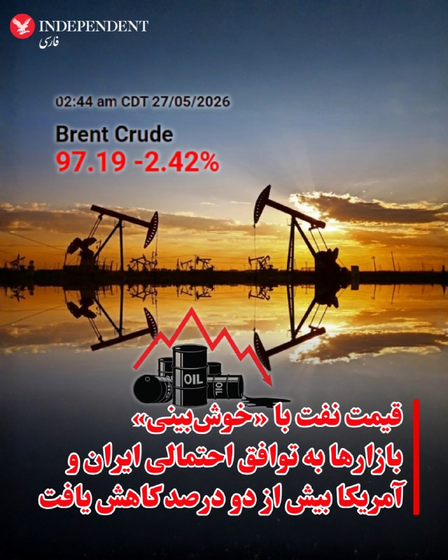
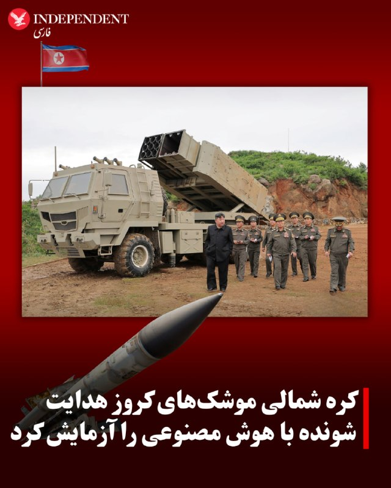
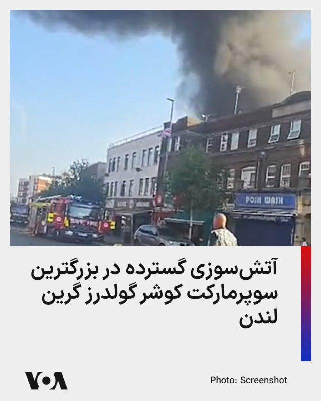
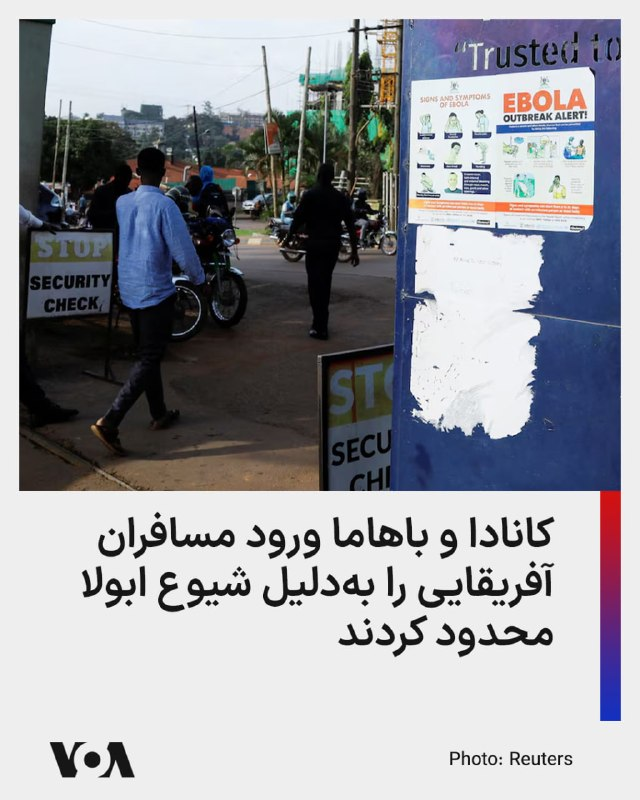
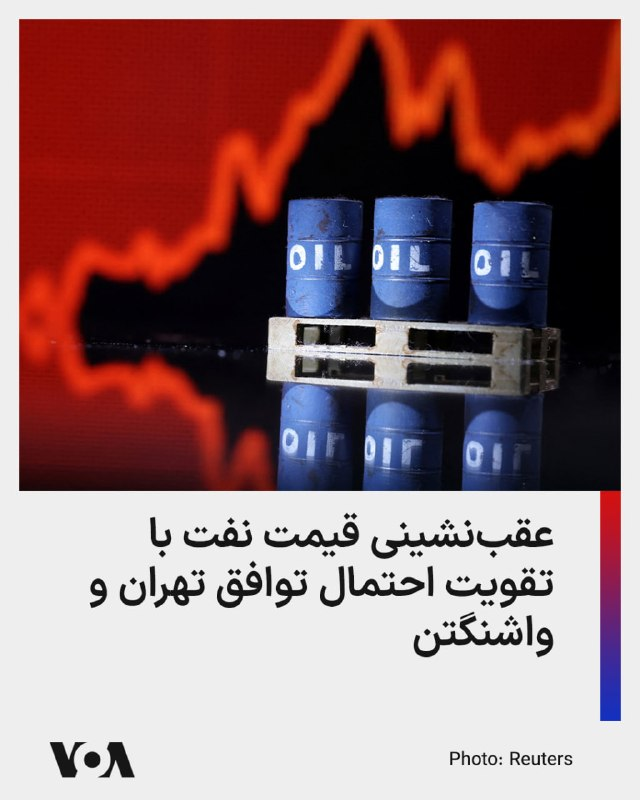
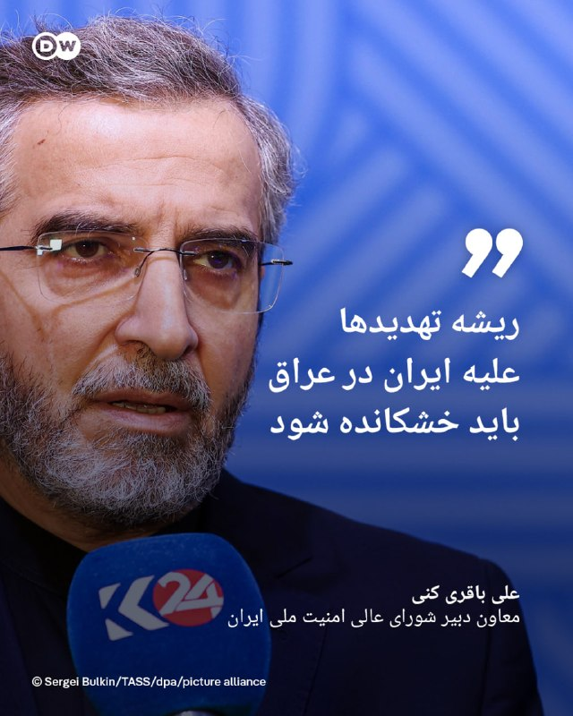
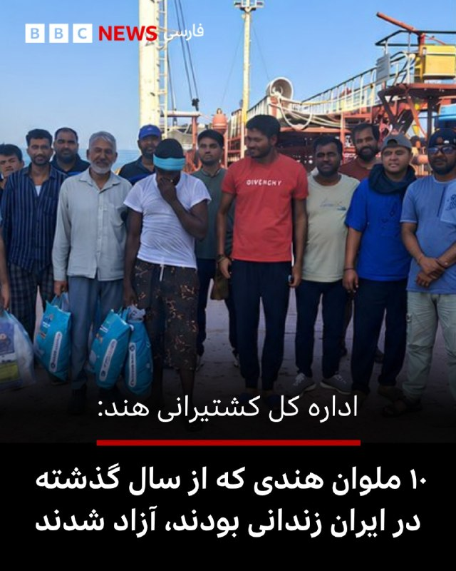
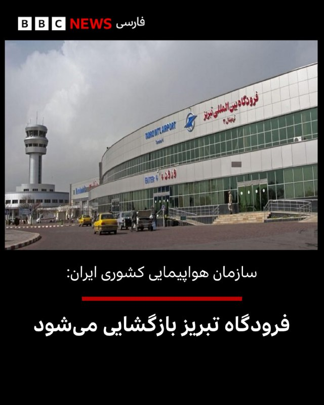

# خواننده تلگرام

<!-- TOP_NAV START -->

<a href="https://github.com/hhdoust2/aio-downloader/blob/main/telegram/content/archive_1.md" style="display:inline-block; padding:6px 12px; margin:0 4px; background-color:#2ea44f; color:white; text-decoration:none; border-radius:4px; font-weight:bold;">صفحه بعد</a>

<!-- TOP_NAV END -->

<!-- MSG START -->

---
📅 بروزرسانی: 1405/03/06 11:25
---

## VahidOOnLine — post 242388

  

♦️قیمت نفت در بازارهای جهانی روز چهارشنبه ششم خرداد پس از چند ساعت افزایش و با «خوش‌بینی محتاطانه» به توافق احتمالی میان جمهوری اسلامی ایران و ایالات متحده، بیش از دو درصد کاهش یافت.

بهای نفت خام برنت دریای شمال، قیمت معیار نفت، صبح چهارشنبه و همزمان با آغاز کار بازارهای اروپایی با ۲و۴۲ درصد کاهش به ۹۷ دلار و ۱۹ سنت رسید. این در حالی است که بامداد چهارشنبه و همزمان با آغاز به کار بورس‌های آسیایی، قیمت نفت از مرز ۹۹ دلار عبور کرده بود.
‌🇸🇦 Indypersian

🤖 @VahidOOnLine

## VahidOOnLine — post 242387

  

♦️مقام‌های سازمان دریانوردی هند شامگاه سه‌شنبه پنجم خرداد از آزادی ۱۰ ملوان این کشور که تابستان سال گذشته در آب‌های جنوب ایران بازداشت شده بودند، خبر دادند.

به گزارش خبرگزاری فرانسه  اداره ناوبری دریایی هند در بیانیه‌ای اعلام کرد که این ملوانان که سوار بر کشتی »ام‌وی هاربر فینیکس» بودند، پس از توقیف این کشتی در نزدیکی بندر جاسک در ژوئیه ۲۰۲۵ در ایران بازداشت و زندانی شدند.

به گفته این نهاد نیمه‌دولتی هند، «اکنون همه آن‌ها آزاد شده و در سلامت هستند و تمهیدات لازم برای بازگشت آن‌ها به کشورشان در حال فراهم شدن است.»

به گزارش خبرگزاری فرانسه، دولت هند برای جلوگیری از ایجاد حساسیت، مذاکرات راجع به آزادی این ملوانان را در سکوت رسانه‌ای برگزار کرد.

هند روابط با جمهوری اسلامی ایران را با وجود تنش‌های منطقه و مناسبات بسیار نزدیک با آمریکا و اسرائیل، همچنان حفظ کرده است.
‌🇸🇦 Indypersian

🤖 @VahidOOnLine

## VahidOOnLine — post 242386

🗣روایت شما از زندگی در آتش‌بس- چهارشنبه ۶ خرداد

🔹بعد از سه ماه قطعی وصل شدم ولی اینترنت هیچ سرعتی نداره.

🔹 الان اینترنت وصل شده. باید تبریک بگیم؟ باید تسلیت بگیم. بهتر که نشده، حتی بدتر هم شده.

🔹اینترنت وصل شده ولی سرعتش همچنان خیلی پایینه. حوصله‌مون سر میره تا بتونیم اینستاگرام رو باز کنیم.

🔹اینترنت‌ها رو وصل کردن ولی اون ۴۰ هزار نفر و پدر و مادرهای داغدار چی میشن؟

🔹به عنوان یک جوان که در قرن ۲۱ زندگی می‌کنه، ۹۰ روز نداشتن دسترسی به اینترنت از اسارت هم بدتر بود. به امید روزی که دیگه چنین چیزهایی رو تجربه نکنیم.

🔹 من یک دانش‌آموز ۱۲ ساله‌ هستم. اینکه اینترنت رو وصل کردن برای ما دانش‌آموزان خوبه، ولی برای مردم چه فایده وقتی که قیمت‌ها هر روز بالاتر میره، تورم بالاست و مردم رو بدبخت کردن.

🔹خیلی خوشحالم که اینترنت‌ها وصل شده چون می‌تونم راحت‌تر درس بخونم.
🔹از دیشب که اینترنت وصل شده، اکثرا نگران هستن که نکنه این به معنای تموم شدن جنگ باشه.

🔹این‌قدر نگویید اینترنت بین‌الملل وصل شده، اپ‌استور و خیلی از اپلیکیشن‌ها فیلتر هستن. شدیم مثل کشور چین.

🔹اینترنت عادی‌ترین حق ماست که اون رو از ما می‌گیرن، ولی ما شکست نمی‌خوریم.

🔹اینترنت‌ها وصل شد ولی به چه قیمتی؟ همه‌چی رو از دست دادیم.
‌🏁 🇬🇧 IranintlTV

🤖 @VahidOOnLine

## VahidOOnLine — post 242385

  

احمد خاتمی، امام جمعه موقت تهران در خطبه‌های نماز «عید قربان» در تهران با تاکید بر ضرورت صرفه‌جویی، گفت صرفه‌جویی در آب، برق و دیگر عرصه‌ها در راستای «مقاومت ملی» است.

او با استناد به روایتی از جعفر صادق، امام ششم شیعیان، گفت: «خداوند صرفه‌جویی را دوست دارد و اسراف را نمی‌پسندد. لذا ضرورتی به روشن نگه داشتن چراغ‌های اضافی نیست.»

خاتمی افزود که می‌توان با کمترین میزان آب وضو و غسل انجام داد و بر پرهیز از اسراف در مصرف منابع تاکید کرد.
‌🏁 🇬🇧 IranintlTV

🤖 @VahidOOnLine

## VahidOOnLine — post 242384

  

محمد اکبرزاده، معاون سیاسی نیروی دریایی سپاه پاسداران، احتمال وقوع جنگ دوباره را به دلیل «ضعف دشمن» پایین دانست، اما با تکرار لفاظی‌های تهدیدآمیز مقام‌های حکومت گفت: «شک نکنید که از چابهار تا ماهشهر را برای متجاوزان به قبرستان تبدیل خواهیم کرد. رزمندگان ما امروز بغض نبردی تن‌به‌تن با دشمن را در سینه دارند.»

او با اشاره به محاصره دریایی آمریکا در جنوب ایران گفت: «آمریکایی‌ها در بازگشایی تنگه هرمز شکست راهبردی خوردند.»

او ادامه داد: «آن‌ها مدعی بودند که می‌توانند تنگه هرمز را باز کنند، اما پس از انسداد این شاهراه، با تمام توانشان هم نتوانستند کاری از پیش ببرند.»
‌🏁 🇬🇧 IranintlTV

🤖 @VahidOOnLine

## VahidOOnLine — post 242383

  

احمد خاتمی در خطبه‌های نماز «عید قربان»، دونالد ترامپ را «دشمن دیوانه کاخ سیاه‌نشین» خواند و خطاب به مردم ایران گفت: «دشمنان شما و این دشمن دیوانه کاخ سیاه‌نشین که به غلط از آن به عنوان کاخ سفید یاد می‌شود، خواهان ذلت شما هستند، اما این آرزو را این دیوانه به گور خواهند برد.»

خاتمی با اشاره به اظهارات ترامپ درباره توافق با جمهوری اسلامی گفت: «او مدام از مذاکره با ایران سخن می‌گوید، اما حقیقت آن است که مقصودشان مذاکره نیست، بلکه تسلیم است.»
‌🏁 🇬🇧 IranintlTV

🤖 @VahidOOnLine

## VahidOOnLine — post 242382

  <a href="telegram/content/VahidOOnLine_242382_1779868554.mp4" target="_blank">🎬 Download video</a>

♦️تیم ملی فوتبال ایران که برای برگزاری اردوی تدارکاتی به آنتالیا در ترکیه سفر کرده است، روز سه‌شنبه و پس از تمرین‌های اولیه بار دیگر به دو گروه تقسیم شد و بازی «درون‌تیمی» برگزار کرد.

تیم ملی، از زمان جنگ ۱۲ روزه و پس از آن اعتراضات دی‌ماه و جنگ اخیر با اسرائیل و آمریکا، با چالش جدی «رقیب تدارکاتی» مواجه است و قرار است در آستانه سفر به مکزیک روز ۱۴ خرداد در آنتالیا با تیم ملی «مالی» دیدار تدارکاتی برگزار کند.

شاگردان امیر قلعه‌نویی پیش از این هم با خودشان رقابت تدارکاتی برگزار کرده بودند.
‌🇸🇦 Indypersian

🤖 @VahidOOnLine

## VahidOOnLine — post 242381

♦️مهدی خراتیان، کارشناس استراتژیک نزدیک به جمهوری اسلامی در گفتگو با پادکست «ایران‌تاک» به رهبران حکومت ایران توصیه کرد با توجه به بقای تهدیدها حتی در صورت توافق با آمریکا، سیاست «انعطاف هسته‌ای» را در پیش بگیرند.

خراتیان در بخشی از این برنامه گفت اگر بعد از انتخابات میان‌دوره‌ای مجلس آمریکا در ماه نوامبر، شاهد کوچکترین تحرکی در منطقه علیه ایران باشیم، مثلا تعداد سوخت‌رسان‌ها در پایگاه‌های قطر و عربستان از حدی فراتر رود، باید از ان‌پی‌تی خارج شویم و به سراغ ساخت سلاح هسته‌ای برویم.
‌🇸🇦 Indypersian

🤖 @VahidOOnLine

## VahidOOnLine — post 242380

  

♦️کره شمالی روز چهارشنبه ششم خردادماه از شلیک موشک‌های کروز با سامانه هدایتگر مجهز به هوش مصنوعی در جریان یک رزمایش خبر داد.

به گزارش رویترز به نقل از خبرگزاری دولتی کره شمالی در این رزمایش،  «ترکیبی از موشک‌های بالستیک تاکتیکی، راکت‌های توپخانه و موشک‌های کروز دقیق هدایت‌شونده با هوش مصنوعی، که برای جنگ‌های مدرن طراحی شده‌اند، تحت نظارت کیم جونگ اون، رهبر جمهوری دموکراتیک خلق کره، آزمایش شده‌اند.

به گزارش خبرگزاری دولتی کره شمالی،‌ کیم جونگ اون به فرماندهان ارتش گفت: «این آزمایش‌ها به‌ویژه آمادگی رزمی موشک‌های کروز را که در واحدهای توپخانه‌ای نزدیک مرز با کره جنوبی مستقر خواهند شد، تایید کرد.»

براساس همین گزارش، پیونگ یانگ می‌گوید «این موشک‌ها مجهز به ناوبری دقیق و کنترل هدایت‌شده با هوش مصنوعی هستند که می‌توانند به اهدافی در فاصله ۱۰۰ کیلومتری حمله کنند.»
‌🇸🇦 Indypersian

🤖 @VahidOOnLine

## VahidOOnLine — post 242379

  

تامی پیگوت، سخنگوی وزارت خارجه آمریکا، در ایکس نوشت: «ترامپ از نخستین روز حضورش به‌روشنی اعلام کرده است که حکومت ایران نباید به سلاح هسته‌ای دست یابد. ترامپ برای اطمینان از اینکه جمهوری اسلامی هرگز به این هدف نرسد، اقدام‌های قاطعی انجام داده است.»
‌🏁 🇬🇧 IranintlTV

🤖 @VahidOOnLine

## VahidOOnLine — post 242378

  

ان‌بی‌سی نیوز به نقل از مقام‌های آمریکایی و کارشناسان امنیت ملی گزارش داد در حالی که ترامپ تاکید می‌کند توافق با حکومت ایران نزدیک است و آمریکا توان نظامی جمهوری اسلامی را نابود کرده، پنتاگون فهرستی از اهداف را برای جنگ احتمالی تهیه کرده است که یافتن و زدن آنها می‌تواند بسیار دشوار باشد.
‌🏁 🇬🇧 IranintlTV

🤖 @VahidOOnLine

## VahidOOnLine — post 242377

  <a href="telegram/content/VahidOOnLine_242377_1779868558.mp4" target="_blank">🎬 Download video</a>

♦️تیم ملی فوتبال عربستان سعودی، در چارچوب مرحله پایانی برنامه آماده‌سازی برای جام جهانی ۲۰۲۶، وارد شهر نیویورک آمریکا شد.
اعضای تیم ملی عربستان سعودی در فرودگاه جان اف کندی از سوی مقام‌های کنسولگری در نیویورک مورد استقبال قرار گرفتند. یاسر المسحل، رییس فدراسیون فوتبال عربستان سعودی، از همکاری و استقبال کنسولگری این کشور قدردانی کرد.
بر اساس برنامه اعلام‌شده، ۱۰ خرداد در نیویورک ادامه خواهد داشت و ملی‌پوشان عربستان سعودی در جریان آن، روز شنبه ۹ خرداد در یک بازی دوستانه به مصاف تیم ملی اکوادور می‌روند.
‌🇸🇦 Indypersian

🤖 @VahidOOnLine

## WithYashar — post 12631

اسرائیل هیوم: پالس‌هایی از احتمال حمله آمریکا به گوش میرسد
@withyashar

## WithYashar — post 12630

جلسه کمپ دیوید که قرار بود امروز برگزار شود ترامپ اعلام کرد: جلسه کابینه به دلیل شرایط آب و هوایی در کاخ سفید برگزار خواهد شد، نه در کمپ دیوید!
حالا صحبت‌هایی هست که کمپ دیوید یک تله برای شناسایی فردی بود که اطلاعات را نشت می‌داد ! فرد مورد نظر گیر افتاد !

یاشار : دقیقا مشخص نیست چه کسی بوده است. صحبت ها درمورد تولسی گابارد و ونس هست ، ونس و تولسی از نظر فکری به هم نزدیک دیده می‌شوند؛ هر دو در جناحی قرار می‌گیرند که نسبت به جنگ مستقیم با ایران محتاط‌ترند.
بعد از استعفای جنجالی تولسی، چند روز پیش موجی از تحلیل‌ها راه افتاد که می‌گفت «ونس در حال منزوی شدن در دولت است».
اگه ونس باشه اوضاع خیلی پیچیده میشه
از اونجایی که تنها عضو کابینه هست که رئیس جمهور قدرت عزلش رو نداره و با رأی بالا اومده
تحلیلگران معتقدند درون دولت ترامپ اکنون دو بلوک شکل گرفته:
بلوک hawkish (تندتر علیه ایران)
بلوک restraint/non-intervention (محتاط‌تر)
و چون ونس چهره مهم جناح دوم محسوب می‌شود، هر اتفاق امنیتی فوراً او را وارد شایعات می‌کند.
@withyashar

## WithYashar — post 12629

روزنامه «فایننشال تایمز» گزارش داد صندوق مالی شورای صلح در غزه از زمان تاسیس خود تاکنون هیچ بودجه‌ای دریافت نکرده است.
@withyashar
این همون شورایی است که ترامپ تمام سران رو جمع کرد که پول بزارن

## WithYashar — post 12628

مجلس سوئد ازدواج فامیلی رو ممنوع کرد؛
طبق این مصوبه، از اول ژوئیه 2026 دیگه ازدواج بین بچه‌های "عمو، دایی، عمه و خاله" تو سوئد ممنوعه.
@withyashar

## WithYashar — post 12627

  <a href="telegram/content/WithYashar_12627_1779868561.mp4" target="_blank">🎬 Download video</a>

اردوغان:ان‌شاءالله این ظالم به نام نتانیاهو، درسی که شایسته‌اش است را از مسلمانان جهان خواهد گرفت
@withyashar
یاشار : به قول تحلیلگر ترک، ترکیه هیچوقت مثل ایران نمیشه، بلکه بدتر از ایران میشه.

## WithYashar — post 12626

ارسالی : اینکه شب عید قربان نت وصل کردن، حس گوسفندی رو دارم که قبل ذبح بهش آب میدن.😂🤣
@withyashar

## WithYashar — post 12625

زنگنه، نماینده مجلس : آمریکا حق غنی‌سازی، حاکمیت ایران بر تنگه هرمز و رفع تحریم‌ها را پذیرفت
@withyashar 🤣

## mwarmonitor — post 9787

  

🔸به‌نظر می‌رسد روسیه قصد ندارد شانس خود را برای تأمین سوختِ موردنیاز کوبا در بحبوحهٔ محاصرهٔ سوختی به رهبری آمریکا امتحان کند.
پس از پنج هفته سرگردانی در دریای سارگاسو، نفتکش «هندی‌مکس» با پرچم روسیه و تحت تحریم آمریکا به نام UNIVERSAL (9384306) اکنون مسیر خود را ۱۲۰۰ مایل دریایی به سمت جنوب‌شرق تغییر داده است. TANKER TRACKER

@mwarmonitor

## mwarmonitor — post 9786

📌یک حرکت جدید – Coronet East 024 ✈️هواپیماهای سوخت رسان KC-46A با نام «BOBBY81» به شماره 19-46061 AE5FA8 و KC-46A با نام «BOBBY82» به شماره 19-46007 AE574D ✈️با کد مأموریت Coronet East 024 از خاک‌ آمریکا به پرواز درآمده‌اند. مشخص نیست که آیا از قبل هواپیمایی…

## pm_afshaa — post 91606

🔴فاکس نیوز:جمهوری اسلامی درخواست 24 میلیارد دلار برای هر توافقی با آمریکا کرده

💧 Rainbet.com the #1 Non-KYC Crypto Casino & Sportsbook @rainbetcom

😁 @Pm_Afshaa

## pm_afshaa — post 91605

فرودگاه بین المللی تبریز فعالیت هاشو بعد 90 روز از سر گرفت

💧 Rainbet.com the #1 Non-KYC Crypto Casino & Sportsbook @rainbetcom

😁 @Pm_Afshaa

## IranIntlTV — post 339198

  <a href="telegram/content/IranIntlTV_339198_1779868563.mp4" target="_blank">🎬 Download video</a>

نت‌بلاکس اعلام کرد با اتصال دوباره شبکه‌های موبایل و بخشی از اینترنت خانگی به اینترنت جهانی، سطح دسترسی به اینترنت در ایران به ۸۶ درصد رسیده است. همزمان، کاربران از دسترسی محدود به اینترنت بین‌المللی خبر می‌دهند و معاون وزیر ارتباطات گفته روند اتصال ادامه دارد و تا ۲۴ ساعت آینده، دسترسی مردم فراهم می‌شود.

گفت‌وگو با محمدجواد اکبرین، عضو تحریریه ایران‌اینترنشنال
@iranintltv

## IranIntlTV — post 339197

  <a href="telegram/content/IranIntlTV_339197_1779868565.mp4" target="_blank">🎬 Download video</a>

جاویدنامان انقلاب ملی ایرانیان
«بهار شاه‌مهری» شامگاه پنج‌شنبه ۱۸ دی‌ماه در نیشابور با گلوله جنگی نیروهای سرکوبگر خامنه‌ای کشته شد. نامش در حافظه‌ این سرزمین می‌ماند و یادش چراغ راه آزادی‌خواهان است.
@iranintltv

## IranIntlTV — post 339196

  <a href="telegram/content/IranIntlTV_339196_1779868568.mp4" target="_blank">🎬 Download video</a>

ان‌بی‌سی نیوز در گزارشی اعلام کرد وزارت جنگ آمریکا فهرستی از اهداف احتمالی باقی‌مانده در ایران را تهیه کرده است. با این حال، مقام‌های آمریکایی می‌گویند این اهداف به دلیل پنهان بودن و جابه‌جایی مداوم، به‌سختی قابل شناسایی هستند.

گزارش نیلوفر منصوری، خبرنگار ایران‌اینترنشنال
@iranintltv

## IranIntlTV — post 339195

  <a href="telegram/content/IranIntlTV_339195_1779868569.mp4" target="_blank">🎬 Download video</a>

شورای امنیت سازمان ملل متحد سه‌شنبه نشستی سطح بالا با محوریت حفظ منشور ملل متحد و تقویت نظام بین‌المللی برگزار کرد. یکی از محورهای مورد توجه در این نشست، تحولات ایران و تنش‌ها در خلیج فارس بود.

مریم رحمتی، خبرنگار ایران‌اینترنشنال، گزارش می‌دهد
@iranintltv

## IranIntlTV — post 339194

  <a href="telegram/content/IranIntlTV_339194_1779868571.mp4" target="_blank">🎬 Download video</a>

تضمین عبور و مرور امن کشتیرانی از تنگه هرمز یکی از مهم‌ترین خواسته‌های ایالات متحده در هر توافق احتمالی با جمهوری اسلامی است. بررسی آبراه‌های مهم جهان و میزان تردد از آن‌ها نشان می‌دهد اختلال در هر یک از این مسیرها می‌تواند پیامدهای گسترده‌ای برای اقتصاد جهانی داشته باشد.
@iranintltv

## IranIntlTV — post 339193

🗣روایت شما از زندگی در آتش‌بس- چهارشنبه ۶ خرداد

🔹بعد از سه ماه قطعی وصل شدم ولی اینترنت هیچ سرعتی نداره.

🔹 الان اینترنت وصل شده. باید تبریک بگیم؟ باید تسلیت بگیم. بهتر که نشده، حتی بدتر هم شده.

🔹اینترنت وصل شده ولی سرعتش همچنان خیلی پایینه. حوصله‌مون سر میره تا بتونیم اینستاگرام رو باز کنیم.

🔹اینترنت‌ها رو وصل کردن ولی اون ۴۰ هزار نفر و پدر و مادرهای داغدار چی میشن؟

🔹به عنوان یک جوان که در قرن ۲۱ زندگی می‌کنه، ۹۰ روز نداشتن دسترسی به اینترنت از اسارت هم بدتر بود. به امید روزی که دیگه چنین چیزهایی رو تجربه نکنیم.

🔹 من یک دانش‌آموز ۱۲ ساله‌ هستم. اینکه اینترنت رو وصل کردن برای ما دانش‌آموزان خوبه، ولی برای مردم چه فایده وقتی که قیمت‌ها هر روز بالاتر میره، تورم بالاست و مردم رو بدبخت کردن.

🔹خیلی خوشحالم که اینترنت‌ها وصل شده چون می‌تونم راحت‌تر درس بخونم.
🔹از دیشب که اینترنت وصل شده، اکثرا نگران هستن که نکنه این به معنای تموم شدن جنگ باشه.

🔹این‌قدر نگویید اینترنت بین‌الملل وصل شده، اپ‌استور و خیلی از اپلیکیشن‌ها فیلتر هستن. شدیم مثل کشور چین.

🔹اینترنت عادی‌ترین حق ماست که اون رو از ما می‌گیرن، ولی ما شکست نمی‌خوریم.

🔹اینترنت‌ها وصل شد ولی به چه قیمتی؟ همه‌چی رو از دست دادیم.

## IranIntlTV — post 339192

  

احمد خاتمی، امام جمعه موقت تهران در خطبه‌های نماز «عید قربان» در تهران با تاکید بر ضرورت صرفه‌جویی، گفت صرفه‌جویی در آب، برق و دیگر عرصه‌ها در راستای «مقاومت ملی» است.

او با استناد به روایتی از جعفر صادق، امام ششم شیعیان، گفت: «خداوند صرفه‌جویی را دوست دارد و اسراف را نمی‌پسندد. لذا ضرورتی به روشن نگه داشتن چراغ‌های اضافی نیست.»

خاتمی افزود که می‌توان با کمترین میزان آب وضو و غسل انجام داد و بر پرهیز از اسراف در مصرف منابع تاکید کرد.
https://iranintl.com/202605271684

## IranIntlTV — post 339191

  <a href="telegram/content/IranIntlTV_339191_1779868573.mp4" target="_blank">🎬 Download video</a>

امیر حمیدی، متخصص امنیت ملی، گفت فشار حداکثری آمریکا تا زمان دستیابی به یک توافق قابل قبول با تهران ادامه خواهد داشت. او افزود جمهوری اسلامی که پیش‌تر شعار مقاومت می‌داد، اکنون با بحران مالی جدی روبه‌رو است و در پی آزادسازی پول‌های بلوکه‌شده خود است.
@iranintltv

## IranIntlTV — post 339190

  <a href="telegram/content/IranIntlTV_339190_1779868575.mp4" target="_blank">🎬 Download video</a>

لیندسی گراهام، سناتور جمهوری‌خواه آمریکا، در واکنش به مخالفت پاکستان با درخواست دونالد ترامپ برای پیوستن به پیمان ابراهیم، در شبکه اجتماعی ایکس نوشت: «مدت‌هاست برای من روشن شده که پاکستان به‌عنوان میانجی گزینه‌ای بسیار مسئله‌دار است.» او افزود «دشمنی اسلام‌آباد با اسرائیل سابقه‌ای طولانی دارد.»

گفت‌وگو با مهدی بیگی، عضو تحریریه ایران‌اینترنشنال
@iranintltv

## IranIntlTV — post 339189

  

🔻خبرآنلاین در گزارشی به بررسی خطرات انتقال کمپ تیم ملی از آریزونای آمریکا به شهر مرزی تیخوانا در مکزیک پرداخته است.

🔹به نوشته خبرآنلاین، این انتخاب ملی‌پوشان را در معرض خطرات امنیتی جدی قرار می‌دهد؛ چرا که تیخوانا به دلیل فعالیت گسترده کارتل‌های مواد مخدر، قاچاق و خشونت‌های خونین باندهای تبهکار، همواره یکی از بالاترین نرخ‌های قتل و جرم و جنایت را در جهان داشته است. مناطقی مانند «زونا نورته» در این شهر، کانون اصلی فعالیت کارتل‌ها هستند و خطر سرقت و کلاهبرداری در مناطق مرزی آن بسیار بالاست.

🔹علاوه بر خطر حضور در چنین محیط ناامنی، فرایند فرسایشی عبور مکرر از کنترل مرزی مکزیک و آمریکا و خستگی ناشی از سفرهای مداوم، چالش‌های روانی و امنیتی بزرگی را پیش روی کادر فنی و بازیکنان قرار خواهد داد.
@iranintltvsport

## IranIntlTV — post 339188

  <a href="telegram/content/IranIntlTV_339188_1779868577.mp4" target="_blank">🎬 Download video</a>

وانگ یی، وزیر خارجه چین، گفت تهران و واشینگتن باید رویکردی مبتنی بر امتیازدهی متقابل در پیش گیرند.او افزود از منظر پکن، توافق نهایی میان جمهوری اسلامی و آمریکا باید به شورای امنیت برود تا از مشروعیت و اعتبار برخوردار شود.

توماج طاهباز و علیرضا محبی، خبرنگاران ایران‌اینترنشنال، گزارش می‌دهند
@iranintltv

## IranIntlTV — post 339187

  

محمد اکبرزاده، معاون سیاسی نیروی دریایی سپاه پاسداران، احتمال وقوع جنگ دوباره را به دلیل «ضعف دشمن» پایین دانست، اما با تکرار لفاظی‌های تهدیدآمیز مقام‌های حکومت گفت: «شک نکنید که از چابهار تا ماهشهر را برای متجاوزان به قبرستان تبدیل خواهیم کرد. رزمندگان ما امروز بغض نبردی تن‌به‌تن با دشمن را در سینه دارند.»

او با اشاره به محاصره دریایی آمریکا در جنوب ایران گفت: «آمریکایی‌ها در بازگشایی تنگه هرمز شکست راهبردی خوردند.»

او ادامه داد: «آن‌ها مدعی بودند که می‌توانند تنگه هرمز را باز کنند، اما پس از انسداد این شاهراه، با تمام توانشان هم نتوانستند کاری از پیش ببرند.»
https://iranintl.com/202605273594

## IranIntlTV — post 339186

  <a href="telegram/content/IranIntlTV_339186_1779868580.mp4" target="_blank">🎬 Download video</a>

سرخط خبرهای چهارشنبه ۶ خرداد
@iranintltv

## IranIntlTV — post 339185

وال‌استریت ژورنال: تهران می‌خواهد در حدی امتیاز دهد که ترامپ نتواند اعلام پیروزی کند

در پی درگیرهای محدود میان جمهوری اسلامی و آمریکا، مقامات ایرانی و میانجی‌های عرب گفتند تهران در مذاکرات با واشینگتن دو هدف اصلی را دنبال می‌کند: کاهش فشار اقتصادی و دسترسی دوباره به منابع مالی و بازار نفت، بدون آن‌که امتیازهایی بدهد که ترامپ بتواند آن را «پیروزی» سیاسی معرفی کند.

وال‌استریت‌ ژورنال سه‌شنبه پنجم خرداد در گزارشی نوشت تهران امیدوار است با دستیابی به توافق، بخشی از حدود ۱۰۰ میلیارد دلار دارایی مسدودشده خود را آزاد کند و دوباره به بازار جهانی نفت دسترسی پیدا کند.

بر اساس این گزارش، تهران خبر کشته شدن چند عضو سپاه پاسداران در حمله نیروهای آمریکایی را با تاخیر منتشر کرد تا گفت‌وگوها آسیب نبیند.

یکی از اصلی‌ترین اختلاف‌ها در مذاکرات، آینده برنامه هسته‌ای جمهوری اسلامی و ذخایر اورانیوم غنی‌شده در ایران است.

این در حالی است که محور این مذاکرات، آزادسازی ۲۴ میلیارد دلار از دارایی‌های بلوکه‌شده ایران است.

بر اساس این گزارش مقام‌های ایرانی و میانجی‌ها گفته‌اند تهران به توافقی نزدیک شده که در مرحله نخست نیمی از این مبلغ آزاد شود.

وال‌استریت ژورنال با اشاره به این که حملات به زیرساخت‌های انرژی در ایران به سهمیه‌بندی سوخت منجر شده و تورم و پایین آمدن شدید سطح رفاه، اعتراض‌های سراسری دی‌ماه را رقم زد، تاکید کرد مقام‌های عملگراتر در حکومت نگرانند ادامه بحران اقتصادی به موج تازه‌ای از نارضایتی عمومی منجر شود.

بر اساس این گزارش با توجه به دیده نشدن مجتبی خامنه‌ای، رهبر سوم جمهوری اسلامی، از زمان جانشینی پدرش، میانجی‌ها در تلاش‌اند اطمینان پیدا کنند پیشنهادهای فعلی تهران مورد تایید جریان‌های تندرو و نهادهای امنیتی نیز قرار دارد.

فشارها بر ترامپ
به گفته وال‌استریت ژورنال، در آمریکا نیز نشانه‌هایی دیده می‌شود که دونالد ترامپ، رییس‌جمهوری این کشور، پس از انتقاد سناتورهای جمهوری‌خواه، به‌دنبال تغییر برخی مفاد توافق احتمالی با ایران است.

سناتورهایی از جمله تد کروز، چارچوب توافق را «اشتباه» توصیف کرده و گفته‌اند این توافق بیش از حد به برجام شبیه است و می‌تواند جمهوری اسلامی را تقویت کند.

ترامپ در شبکه اجتماعی تروث سوشال تلاش کرد منتقدان را آرام کند و گفت توافق جدید «کاملا برعکس» برجام خواهد بود.

او سپس اعلام کرد می‌خواهد عربستان سعودی، قطر، پاکستان، ترکیه، مصر و اردن به توافق‌های ابراهیم بپیوندند و روابط خود را با اسرائیل، عادی‌سازی کنند یا گسترش دهند.

ترامپ همچنین گفت تهران نیز پس از امضای توافق صلح می‌تواند به این روند ملحق شود.

غافلگیری رهبران خاورمیانه
بر اساس این گزارش، پیشنهاد گسترش توافق‌های ابراهیم، مقام‌های خاورمیانه را غافلگیر کرد، زیرا پیش از تماس ترامپ در جریان این طرح قرار نگرفته بودند.

کاخ سفید اعلام کرد این ایده مستقیما از سوی ترامپ مطرح شده است.

وال‌استریت ژورنال نوشت طرح تازه ترامپ علاوه بر تاثیر بر مذاکرات حکومت ایران و آمریکا، می‌تواند روابط واشینگتن با کشورهای خاورمیانه را نیز تغییر دهد. منطقه‌ای که پس از سال‌ها جنگ، همچنان نسبت به عادی‌سازی روابط با اسرائیل تردیدهای جدی در آن وجود دارد.

وال‌استریت ژورنال در ادامه نوشت ترامپ از درخواست قبلی خود برای تحویل مستقیم ذخایر اورانیوم غنی‌شده در ایران به آمریکا عقب‌نشینی کرده و گفته است این مواد می‌توانند زیر نظر آژانس بین‌المللی انرژی اتمی در داخل ایران یا در مکانی دیگر نابود شوند.
 
🔗وب‌سایت ایران‌اینترنشنال
@iranintltv

## IranIntlTV — post 339184

  

احمد خاتمی در خطبه‌های نماز «عید قربان»، دونالد ترامپ را «دشمن دیوانه کاخ سیاه‌نشین» خواند و خطاب به مردم ایران گفت: «دشمنان شما و این دشمن دیوانه کاخ سیاه‌نشین که به غلط از آن به عنوان کاخ سفید یاد می‌شود، خواهان ذلت شما هستند، اما این آرزو را این دیوانه به گور خواهند برد.»

خاتمی با اشاره به اظهارات ترامپ درباره توافق با جمهوری اسلامی گفت: «او مدام از مذاکره با ایران سخن می‌گوید، اما حقیقت آن است که مقصودشان مذاکره نیست، بلکه تسلیم است.»
https://iranintl.com/202605274248

## IranIntlTV — post 339183

  

تامی پیگوت، سخنگوی وزارت خارجه آمریکا، در ایکس نوشت: «ترامپ از نخستین روز حضورش به‌روشنی اعلام کرده است که حکومت ایران نباید به سلاح هسته‌ای دست یابد. ترامپ برای اطمینان از اینکه جمهوری اسلامی هرگز به این هدف نرسد، اقدام‌های قاطعی انجام داده است.»
https://iranintl.com/202605272526

## IranIntlTV — post 339182

  

ان‌بی‌سی نیوز به نقل از مقام‌های آمریکایی و کارشناسان امنیت ملی گزارش داد در حالی که ترامپ تاکید می‌کند توافق با حکومت ایران نزدیک است و آمریکا توان نظامی جمهوری اسلامی را نابود کرده، پنتاگون فهرستی از اهداف را برای جنگ احتمالی تهیه کرده است که یافتن و زدن آنها می‌تواند بسیار دشوار باشد.
https://iranintl.com/202605271846

## FarsiVOA — post 218780

  

آتش‌سوزی بزرگی در سوپرمارکت «کوشر کینگدام» در محله گولدرز گرین لندن، یکی از مناطق پرجمعیت یهودیان در پایتخت بریتانیا، رخ داده است.

بر اساس گزارش تایمز اسرائیل، ویدئوهای منتشرشده در شبکه‌های اجتماعی دود غلیظ و شعله‌هایی را نشان می‌دهد که از بخش پشتی این فروشگاه بالا می‌رود. این فروشگاه بزرگترین سوپرمارکت کوشر در گولدرز گرین معرفی شده است.

سازمان آتش‌نشانی لندن اعلام کرده علت آتش‌سوزی هنوز مشخص نشده است.
@FarsiVOA

## FarsiVOA — post 218779

  

کانادا و باهاما اعلام کردند در پی شیوع ابولا، ورود افراد مقیم جمهوری دموکراتیک کنگو، اوگاندا و سودان جنوبی را به‌طور موقت محدود می‌کنند.

به گزارش رویترز، محدودیت کانادا از چهارشنبه و به مدت ۹۰ روز اجرا می‌شود و هدف آن کاهش خطر ورود و گسترش ابولا در این کشور اعلام شده است. باهاما نیز گفته محدودیت ورود را فوراً و برای ۳۰ روز، با امکان بازنگری وزارت بهداشت، اعمال می‌کند.

بر اساس این گزارش، شهروندان و دارندگان اقامت دائم کانادا که در هفته‌های اخیر در مناطق درگیر بوده‌اند و علائم ندارند، از ۳۰ مه باید ۲۱ روز قرنطینه شوند.

آمریکا نیز هفته گذشته ورود غیرشهروندانی را که اخیراً به کنگو، اوگاندا یا سودان جنوبی سفر کرده‌اند، ممنوع کرده بود.

سازمان جهانی بهداشت خطر گسترش سویه «بوندیبوگیو» ابولا در کنگو را «بسیار بالا» ارزیابی کرده و شیوع آن در کنگو و اوگاندا را وضعیت اضطراری بین‌المللی دانسته است.

تاکنون موردی از ابولا در آمریکا، کانادا یا باهاما گزارش نشده است.
@FarsiVOA

## FarsiVOA — post 218778

  

شرکت اطلاعات کالا، کپلر، می‌گوید در پی انسداد تنگه هرمز، واردات روزانه نفت چین در ماه جاری میلادی به ۶.۶ میلیون بشکه سقوط کرده که کمترین میزان از سال ۲۰۱۶ است.

واردات روزانه نفت چین در سال گذشته ۱۱ میلیون و ۵۵۰ هزار بشکه بود که حدود ۴۵ درصد آن از کشورهای حوزه خلیج فارس تأمین شده بود؛ موضوعی که با انسداد تنگه هرمز توسط جمهوری اسلامی به شدت مختل شده است.

چین در ماه‌های مارس و آوریل نیز واردات نفت را ۲۰ درصد کاهش داده بود.

کپلر می‌گوید سقوط خرید نفت چین در ماه جاری باعث شده نفت بیشتری برای پالایشگاه‌های دیگر کشورهای آسیایی در دسترس باشد.
@FarsiVOA

## FarsiVOA — post 218777

🔺بازداشت هشتمین نفر در پرونده حمله مرگبار به کنیسه‌ای در منچستر

▪️پلیس بریتانیا اعلام کرد مردی ۴۹ ساله را در ارتباط با حمله تروریستی مرگبار به کنیسه‌ای در منچستر بازداشت کرده است.

▪️پلیس تأکید کرده است که این بازداشت مستقیماً با حمله دوم اکتبر ۲۰۲۵ به کنیسه هیتون پارک مرتبط است. با این بازداشت، شمار کل افراد بازداشت‌شده در این پرونده به هشت نفر رسید.

▪️این حمله روز «یوم کیپور»، مقدس‌ترین روز تقویم یهودی، دو کشته و سه زخمی جدی برجا گذاشت.

▪️در حمله به کنیسه هیتون پارک، جهاد الشامی، شهروند بریتانیایی متولد سوریه، ابتدا با خودرو به عابران کوبید، سپس با چاقو به افراد حمله کرد و تلاش کرد وارد ساختمان کنیسه شود. او در نهایت با شلیک پلیس کشته شد.

⬇️ بیشتر بخوانید:
https://ir.voanews.com/a/8154427.html

## FarsiVOA — post 218776

  

تامی پیگوت، سخنگوی وزارت خارجه آمریکا، در پیامی در ایکس نوشت دونالد ترامپ «از روز نخست» به‌روشنی اعلام کرده است که جمهوری اسلامی نباید به سلاح هسته‌ای دست یابد.

او افزود ترامپ برای اطمینان از اینکه جمهوری اسلامی هرگز به چنین هدفی نرسد، «اقدام‌های قاطع» انجام داده است.

این پیام در ادامه موضع‌گیری‌های دولت ترامپ درباره برنامه هسته‌ای جمهوری اسلامی منتشر شده است؛ موضعی که بر جلوگیری از دستیابی تهران به سلاح هسته‌ای و حفظ فشار سیاسی و امنیتی بر حکومت ایران تأکید دارد.

پیام پیگوت نشان می‌دهد واشنگتن همچنان پرونده هسته‌ای جمهوری اسلامی را یکی از محورهای اصلی سیاست خود در قبال تهران می‌داند.
@FarsiVOA

## FarsiVOA — post 218775

  

تایلند، مشتری سنتی گاز مایع قطر، در پی انسداد تنگه هرمز و آسیب حملات جمهوری اسلامی به تاسیسات گاز مایع قطر، مذاکرات برای توافق خرید بلندمدت گاز مایع (ال‌ان‌جی) آمریکا را تسریع کرده است.

خبرگزاری رویترز از قول منابع آگاه گزارش داده که مذاکرات با شرکت ونچر گلوبال آمریکا برای صادرات گاز مایع به تایلند برای ۱۵ سال یا بیشتر انجام می‌شود.

این کشور پیشتر نیز در تلاش برای تنوع بخشیدن به منابع واردات انرژی بود. اکتبر پارسال دولت آمریکا و تایلند اعلام کردند که شرکتهای تایلندی سالانه ۴.۵ میلیارد دلار انرژی، از جمله گاز مایع، از ایالات متحده خریداری خواهند کرد.

تایلند سالانه بیش از ۱۱ میلیون تن واردات ال‌ان‌جی دارد.
@FarsiVOA

## FarsiVOA — post 218774

🔺تهران ۱۰ ملوان هندی بازداشت‌شده در پرونده نفتکش «هاربر فینیکس» را آزاد کرد

▪️مقام‌های کشتیرانی هند اعلام کردند ۱۰ ملوان هندی که از ژوئیه ۲۰۲۵ پس از توقیف یک نفتکش در ایران بازداشت شده بودند، پس از «رایزنی‌های دیپلماتیک مستمر» آزاد شده‌اند.

▪️جزئیات بیشتری درباره علت بازداشت، روند قضایی یا شرایط آزادی این ملوانان اعلام نشده است.

▪️این ملوانان عضو خدمه کشتی «هاربر فینیکس» بودند؛ نفتکشی که در ژوئیه ۲۰۲۵ در نزدیکی بندر جاسک توقیف شد و خدمه کشتی پس از توقیف، در ایران «بازداشت، دستگیر و زندانی» شدند.

▪️خانواده برخی از این ملوانان پیش‌تر گفته بودند تماس محدودی با آنها داشته‌اند و درباره اتهام‌ها، روند حقوقی و زمان احتمالی آزادی‌شان اطلاعات روشنی دریافت نکرده‌اند.

⬇️ بیشتر بخوانید:
https://ir.voanews.com/a/8154426.html

## FarsiVOA — post 218773

🔺شورای امنیت حمله به نیروگاه هسته‌ای براکه امارات را محکوم کرد

▪️شورای امنیت سازمان ملل متحد در بیانیه‌ای مطبوعاتی، حمله پهپادی به نیروگاه هسته‌ای براکه در امارات متحده عربی را «به شدیدترین لحن» محکوم کرد و آن را نقض حقوق بین‌الملل دانست.

▪️اعضای شورای امنیت در این بیانیه، بدون نسبت دادن مسئولیت حمله به طرفی مشخص، تأکید کردند که این حمله خطری جدی برای جان غیرنظامیان، زیرساخت‌ها و محیط زیست ایجاد کرده است.

▪️این بیانیه پس از آن صادر شد که در هفته‌های اخیر مقام‌های امارات اعلام کردند چند پهپاد از خاک عراق به سوی این کشور پرتاب شده‌اند و یکی از آنها به یک ژنراتور برق در خارج از محدوده داخلی نیروگاه براکه برخورد کرده و باعث آتش‌سوزی شده است.

⬇️ بیشتر بخوانید:
https://ir.voanews.com/a/8154425.html

## FarsiVOA — post 218772

  

قیمت نفت روز چهارشنبه پس از جهش تند روز قبل عقب نشست؛ بازاری که هنوز میان ریسک ژئوپلیتیک و امید به پیشرفت مذاکرات آمریکا و ایران در نوسان است.

بهای نفت برنت با ۱.۴۳ درصد کاهش به ۹۸ دلار و ۱۶ سنت رسید و نفت وست تگزاس اینترمدیت هم با ۱.۷۷ درصد افت، ۹۲ دلار و ۲۳ سنت معامله شد.

این عقب‌نشینی پس از آن رخ داد که سه‌شنبه برنت، در واکنش به حملات تازه آمریکا به قایق‌های سپاه و کمرنگ شدن امید به بازگشایی کامل تنگه هرمز، حدود ۴ درصد بالا رفت و در ۹۹ دلار و ۵۸ سنت بسته شد.

در همان بازار، نفت آمریکا به‌دلیل تعدیل اثر تعطیلی دوشنبه، ۲.۸ درصد افت کرد. حالا نگاه معامله‌گران به دو متغیر اصلی است، سرنوشت مذاکرات و نشانه‌های عبور دوباره نفتکش‌ها و کشتی‌های گاز مایع از هرمز.

پیش از آغاز جنگ در ۲۸ فوریه، تصویر بازار کاملاً متفاوت بود. در نظرسنجی فوریه رویترز، میانگین قیمت برنت برای سال ۲۰۲۶ حدود ۶۳ دلار و نفت آمریکا ۶۰ دلار پیش‌بینی شده بود.
@FarsiVOA

## DW_Farsi — post 125180

  

🔶 وریشه مرادی در زندان اوین "از تماس تلفنی محروم شد"

براساس گزارش خبرگزاری هرانا، ارگان خبری مجموعه فعالان حقوق بشر در ایران، وریشه مرادی، زندانی سیاسی محبوس در زندان اوین، "به صورت تنبیهی از دسترسی به تلفن زندان محروم شده است".

هرانا به نقل از یک منبع مطلع نوشته، این محدودیت پس از آن اعمال شد که او در محوطه هواخوری زندان، در اعتراض به اجرای احکام اعدام شعار اعتراضی سر داده بود.

بر اساس این گزارش، وریشه مرادی پیش از این نیز از ملاقات با خانواده و وکلای خود محروم شده بود و این محدودیت همچنان ادامه دارد.

این زندانی سیاسی که در بند زنان زندان اوین نگهداری می‌شود، پیش‌تر توسط شعبه ۱۵ دادگاه انقلاب تهران به ریاست قاضی ابوالقاسم صلواتی، با اتهام "بغی" به اعدام محکوم شده بود. این حکم بعداً از سوی دیوان عالی کشور نقض و پرونده برای رسیدگی دوباره به شعبه هم‌عرض ارجاع شد.

او همچنین در پرونده‌های دیگر، از جمله به اتهام "تبلیغ علیه نظام" و "تمرد و درگیری با ماموران"، به احکام جداگانه حبس محکوم شده است.

@dw_farsi

## DW_Farsi — post 125179

  

🔶باقری در مسکو: ریشه تهدیدها علیه ایران در عراق باید خشکانده شود

علی باقری کنی، معاون دبیر شورای عالی امنیت ملی ایران، در دیدار با قاسم الاعرجی، مشاور امنیت ملی عراق، خواستار اقدام "قاطع" بغداد برای جلوگیری از تبدیل خاک عراق به "منشا تهدید" علیه جمهوری اسلامی شد.

به گزارش رسانه‌های دولتی در ایران، این دیدار در حاشیه چهاردهمین کنفرانس بین‌المللی امنیتی مسکو برگزار شده است.

باقری در این دیدار تاکید کرده است که "ریشه این تهدیدها باید خشکانده شود" و جمهوری اسلامی برای همکاری با عراق در این زمینه آمادگی دارد.

رسانه‌های نزدیک به دولت ایران جزئیات بیشتری درباره ماهیت این تهدیدها منتشر نکرده‌اند، اما تهران در سال‌های گذشته بارها گروه‌های مسلح مخالف جمهوری اسلامی در اقلیم کردستان عراق را به فعالیت علیه ایران متهم کرده است.

قاسم الاعرجی، مشاور امنیت ملی عراق، تا کنون جزئیاتی از این گفت‌وگو منتشر نکرده است.

علی باقری برای شرکت در کنفرانس امنیتی مسکو به روسیه سفر کرده؛ نشستی که هر سال با حضور مقامات امنیتی و سیاسی کشورهای مختلف برگزار می‌شود.

@dw_farsi

## DW_Farsi — post 125178

  

🔶 لیندسی گراهام: نقش پاکستان در مذاکرات بیش از حد مسئله‌ساز است

لیندسی گراهام، سناتور جمهوری‌خواه آمریکا، با انتقاد از نقش پاکستان در تحولات اخیر خاورمیانه، گفته است که ایفای نقش میانجی از سوی اسلام‌آباد [در مذاکرات میان تهران و واشنگتن] "بیش از حد مسئله‌ساز" به نظر می‌رسد و خصومت این کشور با اسرائیل، سابقه‌ای طولانی دارد.

او در پیامی در شبکه اجتماعی ایکس (توییتر سابق) نوشت: «غیرقابل انکار است که هواپیماهای نظامی ایران در پایگاه‌های هوایی پاکستان نگهداری می‌شوند.»

او همچنین به اظهارات گذشته مقامات پاکستانی علیه اسرائیل اشاره کرد و آن‌ها را "نگران‌کننده" خواند.

این سناتور جمهوری‌خواه در ادامه به سخنان پیشین وزیر دفاع پاکستان درباره توافق‌ ابراهیم اشاره کرد؛ توافقی که در سال‌های اخیر به عادی‌سازی روابط برخی کشورهای عربی با اسرائیل منجر شده است.

گراهام نوشت اگرچه ویدیوی مربوط به اظهارات وزیر دفاع، پاکستان مربوط به حدود یک سال پیش است، اما به گفته او، "احتمالا این نگاه همچنان پابرجاست".

@dw_farsi

## DW_Farsi — post 125177

  

🔶 مارادونا، نابغه جنجال‌برانگیز

تکنیک، سرعت، شوت‌هاى دقیق و سرکش و هم‌چنین نبوغ و خلاقیت مارادونا در بازی‌گردانى، او را به ستاره‌اى درخشان تبدیل کرد

دیگو آرماندو مارادونا در روز ۳۰ اکتبر سال ۱۹۶۰ در منطقه‌ی فقیرنشین "ویلا فیوریتو" در حوالی بوئنوس آیرس، پایتخت آرژانتین به دنیا آمد. خانواده‌ پرجمعیت (۸ فرزند) او اصلیتی ایتالیایی داشت.

دیگو که از همان کودکى شیفته‌ توپ و فوتبال بود، در اواسط دهه ۱۹۷۰ میلادى به باشگاه Argentinos Juniors پیوست؛ باشگاهی که نقطه‌ آغاز راه و فعالیت بسیاری از بزرگان فوتبال آرژانتین است.

مارادونا در روز بیستم اکتبر سال ۱۹۷۶، زمانی ‌که تنها ۱۶ سال داشت، اولین بازی خود را براى این تیم در لیگ دسته اول آرژانتین انجام داد. این بازى سرآغاز پروازی فراموش‌نشدنى بود که پس از حدود ۲۱ سال، در ۲۹ اکتبر ۱۹۹۷، با پیروزى ۲ بر یک بوکا جونیورز مقابل ریور پلاته به پایان رسید.

@dw_farsi

## DW_Farsi — post 125176

  

🔶 شورای امنیت حمله به نیروگاه هسته‌ای امارات را محکوم کرد

شورای امنیت سازمان ملل حمله به نیروگاه هسته‌ای براکه در امارات متحده عربی را محکوم کرده و آن را نقض قوانین بین‌المللی دانست.

در بیانیه‌ای که روز سه‌شنبه ۵ خرداد ۱۴۰۵ (۲۶ مه) منتشر شد، شورای امنیت بدون اشاره مستقیم به عامل حمله اعلام کرد، هدف قرار دادن تاسیسات هسته‌ای غیرنظامی، "مغایر با حقوق بین‌الملل است".

امارات متحده عربی هفته گذشته اعلام کرده بود شش پهپاد از خاک عراق به سوی این کشور پرتاب شده‌اند که یکی از آن‌ها نیروگاه هسته‌ای براکه در خلیج فارس را هدف قرار داده است.

عراق محل فعالیت گروه‌های مسلح مورد حمایت جمهوری اسلامی است؛ گروه‌هایی که در جریان جنگ آمریکا و اسرائیل با ایران، مسئولیت حمله به آنچه "پایگاه‌های دشمن در عراق و منطقه" خوانده‌اند را برعهده گرفته بودند.

نیروگاه براکه نخستین نیروگاه هسته‌ای جهان عرب به شمار می‌رود و حمله به آن نگرانی‌هایی درباره امنیت تاسیسات هسته‌ای در بحبوحه تنش‌های منطقه‌ای را افزایش داده است.

@dw_farsi

## DW_Farsi — post 125175

  

🔶نت‌بلاکس: اتصال اینترنت در ایران در حال بازگشت است، اما محدودیت‌ها ادامه دارد

نت‌بلاکس، نهاد ناظر بر اینترنت اعلام کرده است که دسترسی به اینترنت جهانی در ایران، پس از هفته‌ها محدودیت و اختلال گسترده، دوباره در حال افزایش است؛ هرچند همچنان بخشی از کاربران با محدودیت یا قطع ارتباط روبه‌رو هستند.

نت‌بلاکس در پیامی در شبکه اجتماعی ایکس (توییتر سابق) نوشت، شاخص‌های فنی نشان می‌دهد اتصال شبکه‌های موبایل و برخی بخش‌های دیگر اینترنت ایران به شبکه جهانی، بار دیگر در حال برقراری است.

با این حال، این نهاد تاکید کرده که فیلترینگ همچنان برقرار است و کاربران برای دسترسی به برخی وب‌سایت‌ها و شبکه‌های اجتماعی، ناچار به استفاده از ابزارهای دور زدن محدودیت‌ها هستند.

بر اساس این گزارش، دسترسی به واتس‌اپ نیز اکنون با محدودیت روبه‌رو شده و استفاده از این پیام‌رسان بدون ابزارهای عبور از فیلترینگ، برای بسیاری از کاربران ممکن نیست.

@dw_farsi

## DW_Farsi — post 125174

  

🔶بازگشایی فرودگاه تبریز همزمان با ۲۴ ساعته شدن ۱۰ فرودگاه در ایران

سازمان هواپیمایی کشوری ایران اعلام کرده فرودگاه بین‌المللی تبریز، پس از آسیب‌دیدگی در جریان جنگ ۱۲ روزه، دوباره بازگشایی شده و از چهارشنبه ۶ خرداد فعالیت خود را از سر می‌گیرد.

مجید اخوان، سخنگوی این سازمان، اعلام کرده است که بخش‌هایی از فرودگاه، از جمله باند پروازی و برج مراقبت، در جریان جنگ آسیب دیده بودند، اما عملیات بازسازی انجام شده و فرودگاه اکنون آماده پذیرش پروازهای داخلی و خارجی است.

هم‌زمان، سازمان هواپیمایی کشوری از ۲۴ ساعته شدن فعالیت ۱۰ فرودگاه کشور، از جمله "مهرآباد، امام خمینی و مشهد" خبر داده است.

فرودگاه بین‌المللی تبریز یکی از مهم‌ترین مراکز هوانوردی شمال‌غرب ایران و از فرودگاه‌های پرتردد کشور به شمار می‌رود. پیش از جنگ، این فرودگاه پروازهایی به چند مقصد داخلی و خارجی، از جمله استانبول، نجف، باکو و دبی داشت.

@dw_farsi

## DW_Farsi — post 125173

🔶 ازدواج "جان‌فداها"؛ نقاب رمانتیک حکومت بر بحران عمیق مشروعیت

🔻 گزارشی از الینا فرهادی

صدای بوق‌های ممتد و هیاهوی ساختگی، سکوت سنگین غروب میادین اصلی شهر تهران را می‌شکند. چند ده خودروی جیپ و تاکتیکی نظامی که بدنه زمخت و سبزرنگشان با تورها و روبان‌های سفید و صورتی تزیین شده، به ردیف ایستاده‌اند.

داخل خودروها زوج‌هایی که رسانه‌های رسمی آن‌ها را "جان‌فدا" می‌نامند، نشسته‌اند.

خیابان، یعنی همان فضایی که تا دیروز صحنه تقابل سنگین بر سر سبک زندگی، پوشش و اعتراض بود، حالا به یک "کلوپ بزرگ عروسی ایدئولوژیک" تبدیل شده است.

حاکمیت سفره‌های عقد را از سالن‌های خصوصی به آسفالت سرد میادین اصلی شهر آورده تا پیوند دو انسان را به یک بیانیه سیاسی تمام‌عیار بدل کند.

اما در پس این کارناوال‌های سازمان‌یافته، در کشوری که هنوز سایه جنگ و آتش‌بس شکننده بر آن سنگینی می‌کند، میانگین سن ازدواج به بالاترین حد خود در ده‌ها سال اخیر رسیده و تورم، تشکیل خانواده را برای میلیون‌ها جوان به یک رویای دست‌نیافتنی تبدیل کرده، این تئاترهای خیابانی چه پیام رسانه‌ای دارند؟

آیا جمهوری اسلامی در حال بازتعریف خانواده به‌عنوان نهادی ایدئولوژیک است؟ آیا "زوج‌های جان‌فدا" نسخه‌ای تازه از همان روایت بسیج اجتماعی دهه شصت‌اند؟

@dw_farsi

## Persian_Trend_Official — post 15111

https://t.me/persian_trend_official/15109?comment=591948

## Persian_Trend_Official — post 15110

## Persian_Trend_Official — post 15109

## Persian_Trend_Official — post 15108

سازمان هواپیمایی کشوری اعلام کرد ۱۰ فرودگاه ایران از این پس به‌صورت ۲۴ ساعته فعال‌ هستند.

با تصمیم این سازمان، فرودگاه‌های مهرآباد و خمینی تهران، ساری، بیرجند، گرگان، بجنورد، کرمان، زاهدان، سبزوار و مشهد از این پس به‌صورت شبانه‌روزی فعالیت خواهند کرد

پ.ن: گویا نظام تصمیمش رو گرفته بده بره ...

📌 @persian_trend_official
پرشین ترند | متفاوت‌ترین کانال نظامی

## Persian_Trend_Official — post 15107

  

منابع دیپلماتیک روز چهارشنبه به «العربیه» اطلاع دادند سفر محمدباقر قالیباف، رئیس مجلس و مذاکره‌کننده ارشد ایران، به قطر شامل بررسی سازوکار آزادسازی دارایی‌های بلوکه‌شده ایران بوده است.

این منابع افزودند ایران خواستار آزادسازی حدود 24 میلیارد دلار از دارایی‌های بلوکه‌شده خود شده و اصرار دارد هم‌زمان با اعلام تفاهم‌نامه مورد انتظار با واشینگتن، نیمی از این مبلغ را دریافت کند.

📌 @persian_trend_official
پرشین ترند | متفاوت‌ترین کانال نظامی

## Persian_Trend_Official — post 15106

کانال رسمی پرشین ترند pinned «کسانی که اینترنتشون تازه وصل شده یا قبلا سرعت اینترنت یاری نمیکرده اگر این ویدیو رو ندیدید توضیه میکنم ببینید تا بدونید احتمالا یک سال اینده قراره جمهوری اسلامی چه چالش هایی داشته باشه https://youtu.be/8YQ1YcLyw6E»

## Persian_Trend_Official — post 15105

کسانی که اینترنتشون تازه وصل شده یا قبلا سرعت اینترنت یاری نمیکرده
اگر این ویدیو رو ندیدید توضیه میکنم ببینید تا بدونید احتمالا یک سال اینده قراره جمهوری اسلامی چه چالش هایی داشته باشه

https://youtu.be/8YQ1YcLyw6E

## Persian_Trend_Official — post 15101

عکس‌های منتشرشده از سوی فرماندهی مرکزی آمریکا، سنتکام، نشان می‌دهد یک فروند جنگنده پنهانکار اف-۲۲ رپتور متعلق به بال یکم جنگنده نیروی هوایی آمریکا مستقر در پایگاه لانگلی ویرجینیا، در حال سوخت‌گیری هوایی بر فراز نقطه‌ای اعلام‌نشده در خاورمیانه است.

در این تصاویر، اف-۲۲ در کنار یک فروند هواپیمای سوخت‌رسان KC-135T Stratotanker دیده می‌شود؛ هواپیمایی که به بال ۱۷۱ سوخت‌رسانی هوایی گارد ملی هوایی پنسیلوانیا اختصاص دارد.

انتشار این تصاویر از سوی سنتکام در شرایطی انجام می‌شود که حضور جنگنده‌های نسل پنجم آمریکا در منطقه، معمولاً به‌عنوان بخشی از پیام بازدارندگی، نمایش آمادگی عملیاتی و پشتیبانی از مأموریت‌های هوایی بلندبرد تفسیر می‌شود. اف-۲۲ رپتور عمدتاً برای برتری هوایی، نفوذ در محیط‌های پرخطر و مقابله با تهدیدهای پیشرفته طراحی شده و سوخت‌گیری هوایی، امکان ماندگاری و عملیات طولانی‌تر آن در منطقه را فراهم می‌کند.

📌 @persian_trend_official
پرشین ترند | متفاوت‌ترین کانال نظامی

## Persian_Trend_Official — post 15100

  <a href="telegram/content/Persian_Trend_Official_15100_1779868592.mp4" target="_blank">🎬 Download video</a>

برنده های جنگ بلد خجالتی 😄
خب با این بنده خداها حرف بزنید
بگید چند ماه بیخودی سرکارشون گذاشتید و مثل همیشه لاف پیروزی زدید

اخرش که چی ؟
متن رو که همه میخونن ...

📌 @persian_trend_official
پرشین ترند | متفاوت‌ترین کانال نظامی

## Persian_Trend_Official — post 15099

  

حق ++

📌 @persian_trend_official
پرشین ترند | متفاوت‌ترین کانال نظامی

## Persian_Trend_Official — post 15098

  

💢رویترز گزارش می‌دهد که استارلینک،هزینه استفاده استارلینک در پهپادهای تهاجمی یک‌بارمصرف LUCAS را ۵ برابر افزایش داده است.

💢پنتاگون در حال حاضر برای هر پهپاد ۵۰۰۰ دلار بابت اتصال استارلینک پرداخت می‌کرد، اما اکنون با این افزایش قیمت، با پرداخت ۲۵۰۰۰ دلار برای هر پهپاد موافقت کرده است.

💢پهپاد LUCAS به‌طور تقریبی حدود ۳۰۰۰۰ دلار برای هر واحد هزینه دارد، اما حالا که ترمینال‌های استارلینک ۲۰۰۰۰ دلار دیگر به هزینه اضافه کرده‌اند، صرفه‌اقتصادی این پهپاد به‌شدت کاهش پیدا می‌کند و ممکن است باعث شود پنتاگون طراحی یا پلتفرم آن را مورد بازنگری قرار دهد.

🫆:Tony

📌 @persian_trend_official
پرشین ترند | متفاوت‌ترین کانال نظامی

## RadioFarda — post 157598

فرمانده جدید شاخه نظامی حماس در «حمله هدفمند» اسرائیل کشته شد

🔸اسرائیل روز چهارشنبه ششم خرداد اعلام کرد محمد عوده، فرمانده جدید شاخه نظامی گروه افراطی حماس در غزه را در حمله‌ای در روز سه‌شنبه کشته است؛ رخدادی که پس از کشته شدن سلف او در حمله‌ای مشابه در ماه جاری روی داد.

🔸اسرائیل کاتز، وزیر دفاع اسرائیل، گفت «فرمانده شاخه نظامی سازمان تروریستی حماس در غزه دیروز حذف شد و به دیدار همدستانش در اعماق جهنم فرستاده شد».

🔸گروه حماس که در فهرست تروریستی آمریکا و اتحادیه اروپا هم قرار دارد، مرگ محمد عوده در آپارتمانی در شهر غزه را تأیید کرد.

🔸ارتش اسرائیل خبر داد که این اقدام «پس از ماه‌ها رصد اطلاعاتی برای شناسایی الگوهای رفت‌وآمد او و همکارانش انجام شد.»

🔸آقای کاتز در پیامی در شبکه اجتماعی ایکس نوشت: «ما خود را متعهد کرده‌ایم همه کسانی را که کشتار هفتم اکتبر را رهبری کردند از میان برداریم، و همین کار را خواهیم کرد: همه آن‌ها، هر جا که باشند، نشان شده‌اند.»

🔸اسرائیل کاتز و بنیامین نتانیاهو، نخست‌وزیر اسرائیل، پس از اعلام حمله در روز سه‌شنبه در بیانیه‌ای مشترک گفتند محمد عوده «در جریان کشتار هفتم اکتبر رئیس اطلاعات حماس بود و حدود یک هفته پیش به‌عنوان جانشین عزالدین حداد منصوب شد».

🔸عزالدین حداد روز ۲۵ اردیبهشت در حمله اسرائیل کشته شد.

🔸کاتز و نتانیاهو گفتند محمد عوده «مسئول قتل، ربودن و زخمی کردن شمار زیادی از غیرنظامیان اسرائیلی و سربازان ارتش اسرائیل» بوده است.

🔸منابع عربی می‌گویند در حمله هوایی روز سه‌شنبه که منجر به مرگ محمد عوده شده، ۳ نفر کشته و ۲۰ نفر هم زخمی شده‌اند.

🔸پس از حمله حماس به اسرائیل در هفتم اکتبر ۲۰۲۳ (۱۵ مهر ۱۴۰۲)، بنیامین نتانیاهو وعده داد رهبران پشت این حمله را هدف قرار داده و از میان بردارد.

🔸 گزارش کامل را در وب‌سایت رادیوفردا بخوانید.

@RadioFarda

## RadioFarda — post 157596

  

🔸 گزارش‌ها از ایران حاکی است که پس از برقراری اینترنت بین‌الملل روی برخی سرویس‌های ثابت، دسترسی کاربران تلفن همراه نیز به اینترنت جهانی به‌تدریج در حال بازگشت است.

🔸 منابع خبری داخلی روز سه‌شنبه گزارش دادند که کاربران از برقراری اینترنت بین‌الملل روی تلفن‌های همراه خود خبر داده‌اند. همزمان گزارش‌هایی نیز از دسترسی دوباره به چت‌جی‌پی‌تی روی خطوط همراه اول و ایرانسل منتشر شده است.

🔸 بعد از وصل‌شدن نسبی اینترنت در ایران، به چه پلتفرم‌ها و سرویس‌هایی دسترسی دارید و کیفیت اتصال چطور است؟

🔸پیام‌های صوتی و تصویری خود را به نشانی‌های زیر می‌توانید برای ما ارسال کنید:

🔸Telegram: @Fardagram
🔸WhatsApp: +420 725 970 000

@RadioFarda

## RadioFarda — post 157595

🔸روزنامه نیویورک تایمز، در گزارشی از جزئیات زمینهٔ حمله اخیر آمریکا به اهدافی در جنوب ایران، به نقل از دو مقام آمریکایی نوشت این حمله به‌دنبال مشاهده و شناسایی «مجموعه‌ای از تهدیدها» از سوی حکومت ایران انجام شد. 🔸این دو مقام آمریکایی که به شرط ناشناس ماندن…

## RadioFarda — post 157594

  

🔸روزنامه نیویورک تایمز، در گزارشی از جزئیات زمینهٔ حمله اخیر آمریکا به اهدافی در جنوب ایران، به نقل از دو مقام آمریکایی نوشت این حمله به‌دنبال مشاهده و شناسایی «مجموعه‌ای از تهدیدها» از سوی حکومت ایران انجام شد.

🔸این دو مقام آمریکایی که به شرط ناشناس ماندن با این روزنامه صحبت کردند، گفتند حملات روز دوشنبه آمریکا پس از آن انجام شد که نیروهای آمریکایی از جمله «پرواز پهپادها و فعالیت در سایت‌های پرتاب موشک» در جنوب ایران را مشاهده کردند.

🔸به گفته این دو، پیش از حمله آمریکا، نیروهای نظامی ایران «قایق‌های مین‌گذار را در تنگه هرمز مستقر کرده و پهپادهای تهاجمی را در نزدیکی کشتی‌های آمریکایی به پرواز درآورده بودند».

🔸ستاد فرماندهی مرکزی آمریکا، سنتکام، پیش‌تر اعلام کرده بود که ارتش ایالات متحده روز دوشنبه در جنوب ایران حملاتی را علیه اهدافی «از جمله قایق‌هایی که در تلاش برای کارگذاری مین بودند و همچنین سایت‌های پرتاب موشک» انجام داده است.

@RadioFarda

## RadioFarda — post 157593

🔸مارکو روبیو، وزیر خارجه آمریکا، کمتر از دو هفته مانده به انتخابات پارلمانی ارمنستان، در جریان توقفی کوتاه در فرودگاه ایروان، از نیکول پاشینیان، نخست‌وزیر ارمنستان، حمایت کرد. 🔸روبیو، روز سه‌شنبه پنجم خرداد، هنگام بازگشت از گفت‌وگوهای چندجانبه در هند، در…

## RadioFarda — post 157592

  

🔸مارکو روبیو، وزیر خارجه آمریکا، کمتر از دو هفته مانده به انتخابات پارلمانی ارمنستان، در جریان توقفی کوتاه در فرودگاه ایروان، از نیکول پاشینیان، نخست‌وزیر ارمنستان، حمایت کرد.

🔸روبیو، روز سه‌شنبه پنجم خرداد، هنگام بازگشت از گفت‌وگوهای چندجانبه در هند، در توقفی کوتاه برای سوخت‌گیری با آرارات میرزویان، وزیر خارجه ارمنستان، دیدار کرد.

🔸او در کنار آقای میرزویان گفت: «شما، نخست‌وزیر و کل تیم‌تان در ارمنستان، در حال گشودن راه به‌سوی آینده‌ای روشن‌تر و مستقل‌تر برای ارمنستان هستید.»

🔸مارکو روبیو افزود: «بسیار خوشحالم که این‌جا هستم تا حمایت خود را از شجاعت، چشم‌انداز، تعهد و آمادگی آن‌ها برای نگاه به آیندهٔ کشورشان و اقداماتی که برای رسیدن به آن لازم است، نشان دهم.»

@RadioFarda

## RadioFarda — post 157591

🔸روزنامه وال‌استریت جورنال در گزارشی به نقل از مقام‌های ایرانی و میانجی‌های عرب، نوشته جمهوری اسلامی در مذاکرات با آمریکا به‌دنبال کسب «گشایش مالی» و همزمان، جلوگیری از «اعلام پیروزی» دونالد ترامپ است. 🔸این مقام‌ها «دو هدف به‌هم‌پیوسته» ایران در جریان مذاکرات…

## RadioFarda — post 157590

  

🔸روزنامه وال‌استریت جورنال در گزارشی به نقل از مقام‌های ایرانی و میانجی‌های عرب، نوشته جمهوری اسلامی در مذاکرات با آمریکا به‌دنبال کسب «گشایش مالی» و همزمان، جلوگیری از «اعلام پیروزی» دونالد ترامپ است.

🔸این مقام‌ها «دو هدف به‌هم‌پیوسته» ایران در جریان مذاکرات را به این صورت تشریح کرده‌اند: «به‌دست آوردن گشایش مالی برای اقتصادی که تحت فشار شدید قرار دارد، بدون آنکه در برنامه هسته‌ای خود آن‌قدر عقب‌نشینی کند که ترامپ بتواند ادعای پیروزی کند.»

🔸اواخر دوشنبه، فرماندهی مرکزی آمریکا، سنتکام، به قایق‌های تندروی ایرانی که به گفته واشینگتن در حال مین‌گذاری در تنگه هرمز بودند، حمله کرد. ایران نیز با شلیک به هواپیماهای آمریکایی پاسخ داد و آمریکا در واکنش، سایت‌های پرتاب موشک در ایران را هدف قرار داد.

🔸این تبادل آتش پس از پیام‌های متناقض ترامپ در آخر هفته رخ داد. او پس از آنکه شنبه گفت توافق با تهران تا حد زیادی نهایی شده، در پی انتقاد برخی جمهوری‌خواهان سنا از چارچوب توافق، ظاهراً موضع خود را تغییر داد.

@RadioFarda

## RadioFarda — post 157589

مقام پیشین پنتاگون: آمریکا در درگیری با ایران «کم‌ضررترین» گزینه را انتخاب می‌کند  

🔸ایالات متحده و ایران ظاهراً به دستیابی به توافقی برای پایان دادن به جنگ نزدیک شده‌اند، هرچند توافق نهایی هنوز قریب‌الوقوع به نظر نمی‌رسد و برخی جزئیات کلیدی هنوز حل‌وفصل نشده‌اند.

🔸بر اساس گزارش‌ها، توافق در حال شکل‌گیری منجر به بازگشایی تنگه هرمز به‌عنوان یکی از مسیرهای حیاتی انتقال نفت جهان خواهد شد، اما مذاکرات پیرامون برنامهٔ هسته‌ای ایران را به مرحله‌ٔ بعد موکول می‌کند.

🔸جیسون اچ. کمپبل، پژوهشگر ارشد مؤسسهٔ خاورمیانه و مقام پیشین پنتاگون در دورهٔ نخست ریاست‌جمهوری دونالد ترامپ، در گفت‌وگو با رادیو اروپای آزاد/رادیو آزادی می‌گوید توافقِ گزارش‌شده «احتمالاً کم‌ضررترین گزینه‌ای است که در حال حاضر در اختیار دولت آمریکا قرار دارد.»

🔸 گزارش کامل را در وب‌سایت رادیوفردا بخوانید.

@RadioFarda

## IranianMinds — post 20852

  <a href="telegram/content/IranianMinds_20852_1779868597.mp4" target="_blank">🎬 Download video</a>

با وصل شدن اینترنت
داره ویدیو های جالبی از اتفاقای روزای جنگ داره میاد بیرون

@IranianMinds

## BBCPersian — post 282161

  

🔻اسرائیل اعلام کرد که در حمله اخیر به غزه، محمد عوده، فرمانده جدید شاخه نظامی حماس را کشته است.

محمد عوده پس از کشته شدن فرمانده قبلی حماس در حمله‌ای مشابه در اوایل ماه جاری میلادی به این سمت منصوب شده بود.

اسرائیل همچنین گفته است که حملات خود به اهداف مرتبط با حزب‌الله در لبنان را نیز ادامه داده است.

این در حالی است که به طور رسمی در هر دو منطقه آتش‌بس برقرار شده است.

پیشتر مقام‌های لبنانی اعلام کرده بودند که در حملات روز سه‌شنبه اسرائیل در لبنان دست‌کم ۳۱ نفر کشته شده‌اند. یکی از مراکز آسیب‌دیده، بیمارستانی در شهر نبطیه در جنوب لبنان بوده است.

بر اساس گزارش‌ها، آمریکا به اسرائیل هشدار داده که به بیروت حمله نکند، زیرا چنین اقدامی می‌تواند آتش‌بس با ایران را با خطر مواجه کند.

📷Reuters

https://bbc.in/42UY7e3
@BBCPersian

## BBCPersian — post 282160

  

‌🔻مقام‌های دریانوردی هند اعلام کردند که ۱۰ ملوان هندی که از ژوئیه ۲۰۲۵در ایران زندانی بودند، پس از «رایزنی‌های دیپلماتیک مستمر» آزاد شده‌اند.

اداره کل کشتیرانی هند اعلام کرد که خدمه کشتی «ام‌وی هاربور فینیکس» پس از توقیف این نفتکش در نزدیکی بندر جاسک در سال گذشته، توسط نیروی دریایی ایران بازداشت و زندانی شده بودند.

این نهاد در بیانیه‌ای گفته است: «ملوانان اکنون آزاد شده و در امنیت کامل در کنار یکدیگر هستند...و هماهنگی‌های لازم برای بازگشت هرچه سریع‌تر آن‌ها به هند در حال انجام است.» و همچنین عکسی از افراد آزادشده را نیز منتشر کرده است.

اداره کل کشتیرانی هند جزئیات بیشتری درباره علت بازداشت خدمه یا توقیف کشتی ارائه نکرد.

سایت‌های رهگیری کشتی‌ها، این شناور را یک نفتکش حامل فرآورده‌های نفتی با پرچم پالائو معرفی کرده‌اند.

📷 X Directorate General of Shipping, Govt. of India
https://bbc.in/4e7EKVe

@BBCPersian

## BBCPersian — post 282159

🔻به دلیل جنگ ایران، قیمت انرژی برای خانوارها در بریتانیا افزایش خواهد یافت

🔻قیمت انرژی برای خانوارها در بریتانیا از ماه ژوئیه با افزایش قابل‌توجهی روبه‌رو خواهد شد. این نخستین تأثیر مستقیم جهش قیمت‌ها به دلیل جنگ ایران برای مصرف‌کنندگان برق و گاز در بریتانیا خواهد بود.

نهاد تنظیم‌گر بازار انرژی بریتانیا، روز چهارشنبه جزئیات سقف جدید قیمت انرژی را منتشر کرد که میلیون‌ها خانوار دارای تعرفه‌های متغیر در انگلستان، اسکاتلند و ولز را تحت تأثیر قرار خواهد داد.

سقف جدید حدود ۱۳ درصد بالاتر از نرخ فعلی است. بنابراین، خانوارهایی با مصرف متوسط گاز و برق سالانه حدود ۲۰۹ پوند بیشتر پرداخت خواهند کرد و هزینه سالانه انرژی آنها به حدود هزار و ۸۵۰ پوند خواهد رسید.

اعلام این افزایش هم‌زمان با موج گرمای بی‌سابقه در بخش‌های وسیعی از بریتانیاست، اما کارشناسان می‌گویند خانوارها می‌توانند از هم‌اکنون برای کاهش هزینه‌های ماه‌های آینده اقدام کنند.

سقف قیمت انرژی هر سه ماه یک‌بار تعیین می‌شود. قبوض انرژی خانوارها بین آوریل تا ژوئیه، پس از اصلاح ساختار هزینه‌ها از سوی دولت، حدود ۷ درصد کاهش یافته بود. این تغییر اندکی پیش از آغاز درگیری‌ها در ایران اعلام شد. با این حال، سقف قیمت برای دوره ژوئیه تا سپتامبر، بازتاب‌دهنده افزایش ۲۵ درصدی بهای جهانی گاز در پی جنگ خواهد بود. افزایشی که به‌ویژه ناشی از اختلال جدی در تردد کشتی‌ها از تنگه هرمز است.

دولت بریتانیا اعلام کرده در حال بررسی برنامه‌هایی برای حمایت هدفمند از اقشار آسیب‌پذیر است.

https://bbc.in/4tWBPn2
@BBCPersian

## BBCPersian — post 282158

  

🔻به گفته سخنگوی سازمان هواپیمایی کشوری ایران، فرودگاه بین‌المللی تبریز که در جریان جنگ اخیر آسیب دیده بود، از امروز (چهارشنبه، ششم خرداد) فعالیت خود را از سر می‌گیرد.

مجید اخوان در گفت‌وگو با رسانه‌های داخلی ایران گفته است که نخستین پرواز این فرودگاه پس از پایان عملیات بازسازی انجام خواهد شد.

به گفته او، فرودگاه تبریز بیست‌ویکمین فرودگاهی است که پس از پایان درگیری‌ها دوباره وارد چرخه عملیاتی می‌شود.

رسانه‌های داخلی ایران در هفته‌های گذشته گزارش داده بودند که در حملات به تبریز، باند و برج مراقبت این فرودگاه آسیب دیده است.

فرودگاه تبریز در کنار فرودگاه‌های مهرآباد، مشهد و امام از مهم‌ترین فرودگاه‌های ایران محسوب می‌شود و به حدود ۹ مقصد خارجی از جمله استانبول، بغداد، دوبی، باکو و هامبورگ پرواز دارد.

📷MEHR
@bbcpersian

## BBCPersian — post 282157

  

🔻در پی موج جدید حملات اسرائيل به جنوب و شرق لبنان ده‌ها نفر کشته شدند.

این حملات گسترده در نقاط مختلف لبنان پس از آن انجام شد که بنيامين نتانياهو، نخست وزير اسرائيل، دستور تشديد اقدام نظامی عليه حزب‌الله را داد.

وزارت بهداشت لبنان روز سه‌شنبه اعلام کرد که در تازه‌ترين موج حملات دست کم ۳۱ نفر، از جمله چند کودک، جان باخته‌اند.

ارتش اسرائيل گفته است بيش از ۱۰۰ زيرساخت و محل استقرار حزب‌ الله را هدف قرار داده است. حملات تازه از زمان آغاز آتش‌بس با ميانجيگری آمريکا در اواسط آوريل، از سنگين‌ترين شب‌های بمباران به شمار می‌رود.

آقای نتانیاهو روز سه‌شنبه در نشست کابينه امنيتی گفت اسرائيل «در حال گسترش عمليات خود در لبنان» است.

او افزود: «ارتش اسرائیل با نيروهای گسترده در ميدان عمل می‌کند و مناطق راهبردی را در اختيار می‌گيرند.»او همچنين گفت اسرائيل در حال «تقويت منطقه امنيتی» برای حفاظت از شهرک‌های شمالی اسرائيل در برابر حملات حزب الله است.

لینک خبر:

📷Reuters
https://bbc.in/3PMVmbE

@BBCPersian

## idfinfarsi — post 11654

  <a href="telegram/content/idfinfarsi_11654_1779868602.mp4" target="_blank">🎬 Download video</a>

مستند ویژه: تکمیل چرخه شناسایی و هدف قرار دادن یک تروریست که هواگرد بدون سرنشین را در جنوب لبنان هدایت می‌کرد

در چارچوب فعالیت نیروهای ارتش اسرائیل در جنوب لبنان، یک هواگرد از نیروی هوایی، یک هواگرد بدون سرنشین را در آسمان شناسایی کرد که تهدیدی برای نیروهای ما در منطقه محسوب می‌شد.

این هواگرد بدون سرنشین فرود آمد و یک تروریست از سازمان تروریستی حزب‌الله برای جمع‌آوری آن به محل رسید. در یک واکنش سریع، هواگرد نیروی هوایی به محل حمله کرده و این تروریست را به هلاکت رساند.

نیروی هوایی به فعالیت خود برای دفاع و پشتیبانی از نیروهای ما در جنوب لبنان ادامه خواهد داد.

## idfinfarsi — post 11650

  <a href="telegram/content/idfinfarsi_11650_1779868604.mp4" target="_blank">🎬 Download video</a>

ارتش اسرائیل و شاباک محمد عوده، رئیس شاخه نظامی سازمان تروریستی حماس که پس از به هلاکت رسیدن عزالدین حداد منصوب شده بود و همچنین رئیس ستاد اطلاعات سازمان تروریستی حماس بود را به هلاکت رساندند

⭕️ سخنگوی ارتش اسرائیل و شاباک اعلام کردند که در حمله‌ای در شمال نوار غزه، تروریست محمد عوده که به‌عنوان رئیس شاخه نظامی سازمان تروریستی حماس پس از به هلاکت رسیدن عزالدین حداد منصوب شده بود و همچنین ریاست ستاد اطلاعات این سازمان را بر عهده داشت، به هلاکت رسید.

🔻 در چارچوب عملیات مشترک ارتش اسرائیل و شاباک برای حذف این تروریست، چندین ساختمان در قلب شهر غزه که به‌عنوان محل اختفای او مورد استفاده قرار می‌گرفت، هدف قرار گرفت. این اقدام پس از ماه‌ها رصد اطلاعاتی برای شناسایی الگوهای رفت‌وآمد او و همکارانش انجام شد. همزمان، یک آپارتمان متعلق به یک تروریست حماس که در ۷ اکتبر در حمله مشارکت داشت و بخشی از حلقه پشتیبانی عوده بود، نیز هدف قرار گرفت.

⭕️ عوده در دو هفته گذشته رئیس شاخه نظامی سازمان تروریستی حماس بود و در سال‌های اخیر نیز ریاست ستاد اطلاعات این سازمان را بر عهده داشت. وی در این چارچوب مسئول برنامه‌ریزی و هماهنگی ا

## Dirty_Kids — post 390292

اگه تازه وصل شدید
بدونید صدف بیوتی یک مادر جنده حکومتیه

تازه بابای گلشیفته هم بیضه‌هاشو حوالمون داد ☹️

@Dirty_Kids 👻

## Dirty_Kids — post 390291

  <a href="telegram/content/Dirty_Kids_390291_1779868605.mp4" target="_blank">🎬 Download video</a>

عزیزانی که نت نداشتن در جریان نیستن
این ویدیوی این خانم عزیز بعد از مردن خامنه‌ای ترکوند، در حدی که خارجی پشمامشون ریخته بود میگفتن واقعا ایرانیه!؟ گفتم درجریان باشید

@Dirty_Kids 👻

## Dirty_Kids — post 390290

  <a href="telegram/content/Dirty_Kids_390290_1779868607.mp4" target="_blank">🎬 Download video</a>

این دختره باحال حرف میرنه

@Dirty_Kids 👻

## Dirty_Kids — post 390289

  

اسراییل هیوم: رستم قاسمی با افشا تصویر خصوصی او توسط موساد اخراج شد و مدتی بعد مرد. او وزیر نفت دولت احمدی نژاد بود‌. وی از فرماندهان سپاه محسوب می شد که پولشویی می‌کرد‌. موساد بدون ترور او را به این روش حذف کرد

@Dirty_Kids 👻

## Hranews — post 113188

بیش از یک میلیون دانش آموز در کشور از تحصیل بازمانده‌اند

❗️
❗️
❗️
❗️
❗️– رئیس سازمان بهزیستی از وجود بیش از یک میلیون دانش آموز بازمانده از تحصیل در کشور خبر داد.

ادامه مطلب

↘️
@hranews_bot تماس ✉️ - @Hranews کانال هرانا 🆑

## alonews — post 122989

  <a href="telegram/content/alonews_122989_1779868609.mp4" target="_blank">🎬 Download video</a>

👈لحظه‌ای که محمد عوده و فرماندهان شاخه نظامی حماس ترور شد

✅ @AloNews خبر جنگ

## alonews — post 122988

  <a href="telegram/content/alonews_122988_1779868611.webm" target="_blank">🎬 Download video</a>

👈در حالی که به‌روزرسانی فوری نرم‌افزارها پس از بازگشت اینترنت بین‌الملل به‌عنوان یک ضرورت امنیتی اعلام شده، شماری از کاربران از عدم امکان اتصال به گوگل‌پلی و مشکل در دریافت آپدیت اپلیکیشن‌ها خبر داده‌اند.

✅ @AloNews خبر جنگ

## alonews — post 122987

  <a href="telegram/content/alonews_122987_1779868611.webm" target="_blank">🎬 Download video</a>

👈یک مقام سپاه می‌گوید احتمال جنگ مجدد با ایالات متحده کم است

✅ @AloNews خبر جنگ

## alonews — post 122986

  <a href="telegram/content/alonews_122986_1779868611.webm" target="_blank">🎬 Download video</a>

👈پس از موافقت سپاه ، نفتکش متعلق به شرکت کاسکو، هوا لین وان، اکنون از تنگه هرمز عبور می‌کند.

✅ @AloNews خبر جنگ

## alonews — post 122985

  <a href="telegram/content/alonews_122985_1779868611.webm" target="_blank">🎬 Download video</a>

👈آخرین قیمت نفت ۹۷.۱۷ دلار

✅ @AloNews خبر جنگ

## alonews — post 122984

  <a href="telegram/content/alonews_122984_1779868611.webm" target="_blank">🎬 Download video</a>

👈رئیس اتحادیه صنف خواربارفروشان تهران: پاک کردن قیمت روی کالا تخلف است

✅ @AloNews خبر جنگ

## alonews — post 122982

  <a href="telegram/content/alonews_122982_1779868612.webm" target="_blank">🎬 Download video</a>

👈رویترز: پاکستان از میانجیگری عقب‌نشینی می‌کند در حالی که قطر به مرکز اصلی بین تهران و واشنگتن تبدیل می‌شود و تمرکز بر دارایی‌های مسدود شده ایران در دوحه است

✅ @AloNews خبر جنگ

## alonews — post 122981

  <a href="telegram/content/alonews_122981_1779868612.webm" target="_blank">🎬 Download video</a>

👈رضا الفت‌نسب، رییس اتحادیه کسب‌وکارهای اینترنتی ایران: اینترنت فقط چند اپلیکیشن نیست؛ زیرساخت کار، زندگی و امید میلیون‌ها نفر است.

🔴ایستادگی در برابر فشارها برای
باز نگه داشتن ‎اینترنت، دفاع از اقتصاد مردم است.

✅ @AloNews خبر جنگ

## alonews — post 122980

  <a href="telegram/content/alonews_122980_1779868612.webm" target="_blank">🎬 Download video</a>

👈سی ان بی سی نیوز: بازارهای اروپایی با بازگشایی مختلط مواجه می‌شوند، در حالی که معامله‌گران آتش‌بسِ شکننده میان ایالات متحده و ایران را ارزیابی می‌کنند.

✅ @AloNews خبر جنگ

## alonews — post 122979

  <a href="telegram/content/alonews_122979_1779868612.webm" target="_blank">🎬 Download video</a>

👈 رسانه‌های لبنانی گزارش می‌دهند که صدای انفجارهایی که چندی پیش شنیده شد، بوم صوتی بود!

🔴برخی گزارش‌های رسانه‌ها همچنین ادعا می‌کنند که در زمان انفجارها هیچ پروازی بر فراز پایتخت وجود نداشته است.

✅ @AloNews خبر جنگ

## alonews — post 122978

  <a href="telegram/content/alonews_122978_1779868612.webm" target="_blank">🎬 Download video</a>

👈شماری از کاربران پس از بازگشت اینترنت بین‌الملل، از عدم امکان اتصال به گوگل‌پلی و مشکل در به‌روزرسانی اپلیکیشن‌ها خبر داده‌اند

✅ @AloNews خبر جنگ

## alonews — post 122977

  <a href="telegram/content/alonews_122977_1779868613.mp4" target="_blank">🎬 Download video</a>

👈فاکس نیوز:جمهوری اسلامی درخواست ۲۴ میلیارد دلار برای هر توافقی با آمریکا کرده است.

✅ @AloNews خبر جنگ

## alonews — post 122976

  <a href="telegram/content/alonews_122976_1779868615.webm" target="_blank">🎬 Download video</a>

👈مجلس سوئد ازدواج فامیلی رو ممنوع کرد؛

🔴طبق این مصوبه، از اول ژوئیه 2026 دیگه ازدواج بین بچه‌های "عمو، دایی، عمه و خاله" تو سوئد ممنوعه.

🔴دلیلشم جلوگیری از خشونت‌های ناموسی، فشار خانوادگی و ازدواج‌های اجباری اعلام شده.

✅ @AloNews خبر جنگ

## alonews — post 122975

  <a href="telegram/content/alonews_122975_1779868615.webm" target="_blank">🎬 Download video</a>

👈بلومبرگ: خانوارهای بریتانیایی شاهد بیشترین افزایش هزینه‌های انرژی از سال ۲۰۲۳ خواهند بود، زیرا جنگ در ایران هزینه‌های عمده‌فروشی گاز و برق را افزایش می‌دهد.

✅ @AloNews خبر جنگ

## alonews — post 122974

  <a href="telegram/content/alonews_122974_1779868615.webm" target="_blank">🎬 Download video</a>

👈الجزیره: ایران ۱۰ ملوان هندی را پس از رایزنیهای دیپلماتیک آزاد کرد!

🔴مقامات کشتیرانی هند اعلام کرده اند که ۱۰ ملوان هندی ساکن در یک نفتکش که از ژوئیه ۲۰۲۵ در ایران بازداشت شده بود، پس از «رایزنی دیپلماتیک مستمر» آزاد شده اند.

✅ @AloNews خبر جنگ

## alonews — post 122973

  <a href="telegram/content/alonews_122973_1779868615.webm" target="_blank">🎬 Download video</a>

👈تهدید بمب‌گذاران انتحاری خطرناک‌تر از آن است که اسرائیل تصور می‌کند و راه‌حل‌های فعلی مانع فاجعه بعدی نخواهند شد، طبق گزارش کانال ۱۲ عبری

✅ @AloNews خبر جنگ

## alonews — post 122972

  <a href="telegram/content/alonews_122972_1779868615.mp4" target="_blank">🎬 Download video</a>

👈 وزیر خارجه کوبا: روبیو دروغ می‌گوید؛ او طراح اصلی محاصره کوباست

🔴 وزیر خارجه کوبا در پاسخ به ادعای مارکو روبیو، وزیر امور خارجه آمریکا، مبنی بر اینکه علت رنج مردم کوبا، غارت منابع این کشور توسط «رژیم کوبا» است، گفت: روبیو یکی از طراحان اصلی تشدید محاصره علیه کوبا در همه زمینه‌هاست.

🔴 وزیر خارجه کوبا تأکید کرد: او مدام دروغ می‌گوید و قصد دارد افکار عمومی آمریکا و جهان را فریب دهد. من بارها از او شنیده‌ام که می‌گوید محاصره وجود ندارد، در حالی که خودش طراح اصلی آن است.

🔴 وی افزود: روبیو در کوبا به دنیا نیامده، کوبا را نمی‌شناسد و هیچ چیز از کوبا نمی‌داند. این اظهارات به عنوان اقدامی تأسف‌بار به درک مردم کوبا از وزیر خارجه آمریکا اضافه شده است.

✅ @AloNews خبر جنگ

## alonews — post 122971

  <a href="telegram/content/alonews_122971_1779868617.webm" target="_blank">🎬 Download video</a>

👈فایننشیال تایمز: صندوق رسمی «هیئت صلح» ترامپ، علی‌رغم وعده‌های کلان برای بازسازی غزه، یک ریال هم پول ندارد و هیچ پروژه بازسازی‌ای آغاز نشد.

✅ @AloNews خبر جنگ

## alonews — post 122970

  <a href="telegram/content/alonews_122970_1779868618.webm" target="_blank">🎬 Download video</a>

👈نخست‌وزیر قطر در تماس‌های جداگانه با مقامات عربستان، اردن، مصر و امارات، راه‌های هماهنگی منطقه‌ای برای پشتیبانی از میانجی‌گری پاکستان میان تهران و واشنگتن را بررسی کرد.

✅ @AloNews خبر جنگ

## alonews — post 122969

  <a href="telegram/content/alonews_122969_1779868618.webm" target="_blank">🎬 Download video</a>

👈احتمال شنیدن صدای انفجار کنترل‌شده در اصفهان

✅ @AloNews خبر جنگ

<!-- MSG END -->

<!-- NAV START -->

<a href="https://github.com/hhdoust2/aio-downloader/blob/main/telegram/content/archive_1.md" style="display:inline-block; padding:6px 12px; margin:0 4px; background-color:#2ea44f; color:white; text-decoration:none; border-radius:4px; font-weight:bold;">صفحه بعد</a>

<!-- NAV END -->
