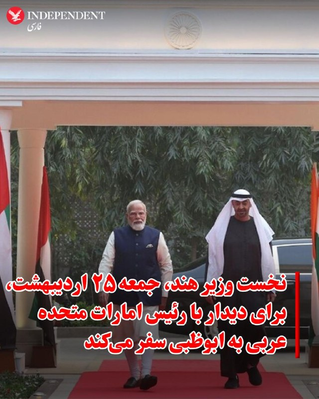
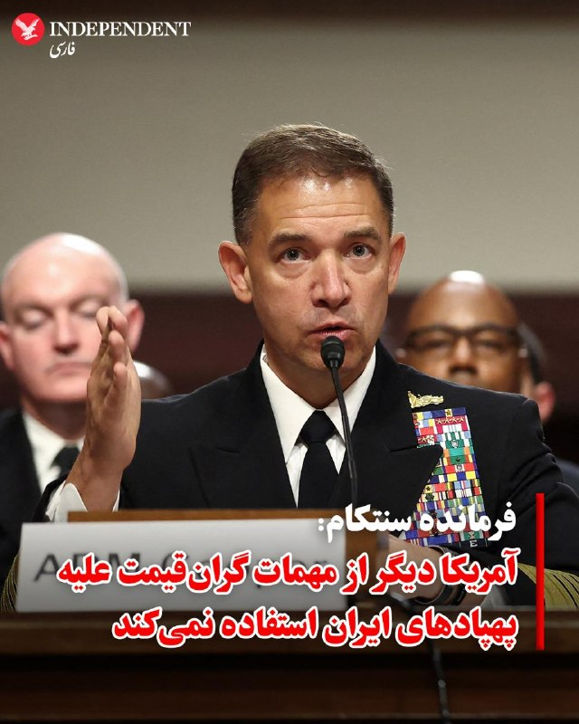
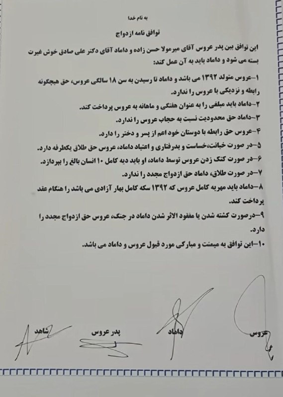

# خواننده تلگرام

<!-- TOP_NAV START -->

<a href="https://github.com/hhdoust2/aio-downloader/blob/main/telegram/content/archive_1.md" style="display:inline-block; padding:6px 12px; margin:0 4px; background-color:#2ea44f; color:white; text-decoration:none; border-radius:4px; font-weight:bold;">صفحه بعد</a>

<!-- TOP_NAV END -->

<!-- MSG START -->

---
📅 بروزرسانی: 1405/02/25 00:25
---

## VahidOOnLine — post 240187

  

♦️خبرگزاری رویترز گزارش داد نارندرا مودی، نخست وزیر هند، در چارچوب یک سفر منطقه‌ای و با هدف مقابله با پیامدهای بحران انرژی، روز جمعه راهی ابوظبی می‌شود تا با محمد بن زاید آل نهیان، رئیس امارات متحده عربی، دیدار و گفتگو کند. این سفر در حالی انجام می‌شود که افزایش جهانی قیمت نفت بر اثر تنش‌های خاورمیانه، فشار شدیدی بر ذخایر ارزی دهلی نو وارد کرده و مودی را به اتخاذ سیاست‌های ریاضتی و کاهش واردات واداشته است.

در این دیدار، طرفین درباره همکاری‌های راهبردی در حوزه انرژی و ثبات بازار سوخت رایزنی خواهند کرد. هند به عنوان یکی از بزرگترین واردکنندگان انرژی جهان، به دنبال تضمین امنیت تامین سوخت و کاهش تاثیر نوسانات قیمتی بر اقتصاد داخلی خود است. مودی پس از پایان گفتگوها در امارات، برای گسترش پیوندهای تجاری و پیگیری توافقات اقتصادی با اتحادیه اروپا، عازم کشورهای هلند، سوئد، نروژ و ایتالیا خواهد شد.
‌🇸🇦 Indypersian

🤖 @VahidOOnLine

## VahidOOnLine — post 240186

  

ابراهیم عزیزی، رییس کمیسیون امنیت ملی مجلس، از تدوین طرحی با عنوان «اقدام متقابل نیروهای نظامی و امنیتی جمهوری اسلامی» خبر داد که در آن پرداخت پاداش ۵۰ میلیون یورویی برای کشتن دونالد ترامپ، رییس‌جمهوری آمریکا، پیش‌بینی شده است.
 
عزیزی گفت همان‌طور که ترامپ دستور داد علی خامنه‌ای را بکشند، او باید «به دست هر مسلمان و آزاده‌ای مورد برخورد قرار بگیرد.»

او افزود در این طرح پیش‌بینی شده اگر افراد حقیقی یا حقوقی «این رسالت دینی و اعتقادی» را انجام دهند، دولت موظف است ۵۰ میلیون یورو پاداش بپردازد.

رییس کمیسیون امنیت ملی مجلس گفت جمهوری اسلامی معتقد است دونالد ترامپ، بنیامین نتانیاهو، نخست‌وزیر اسرائیل و برد کوپر، فرمانده سنتکام، باید به دلیل اقدامی که به کشته شدن علی خامنه‌ای منجر شد، «مورد برخورد و اقدام متقابل» قرار بگیرند؛ زیرا این را حق خود می‌داند.
‌🏁 🇬🇧 IranintlTV

🤖 @VahidOOnLine

## VahidOOnLine — post 240185

  

♦️شبکه خبری آی۲۴ نیوز گزارش داد امارات متحده عربی پس از انتشار خبر سفر محرمانه بنیامین نتانیاهو به ابوظبی، اعتراض شدید دیپلماتیک خود را به اسرائیل منتقل کرده است.
بر اساس این گزارش، این پیام اعتراضی از سوی محمد آل خاجه، سفیر امارات متحده عربی در اسرائیل، به مقام‌های شورای امنیت ملی اسرائیل در دفتر نخست‌وزیری این کشور منتقل شده است.
یک منبع آگاه به آی۲۴ نیوز گفت: «اماراتی‌ها بسیار خشمگین بودند. این نخستین بار نیست که اطلاعات حساس از دفتر نخست‌وزیری اسرائیل درز می‌کند. به همین دلیل است که نتانیاهو سال‌ها به امارات متحده عربی سفر نکرده بود.»
آی۲۴ نیوز همچنین نوشت امارات متحده عربی با وجود گسترش همکاری‌های امنیتی با اسرائیل، از جمله استقرار سامانه «گنبد آهنین» و سفر مقام‌های ارشد امنیتی اسرائیل به ابوظبی، همچنان تلاش می‌کند روابط خود با اسرائیل را کم‌حاشیه نگه دارد.
‌🇸🇦 Indypersian

🤖 @VahidOOnLine

## VahidOOnLine — post 240184

  

نشست کمیته نیروهای مسلح سنا با حضور ارشدترین مقام‌ نظامی آمریکا در خاورمیانه با تمرکز بر چالش خلع سلاح حزب‌الله، گروه مسلح لبنانی مورد حمایت جمهوری اسلامی، به پایان رسید.

راجر ویکر، سناتور جمهوری‌خواه ایالت میسیسیپی و رییس این کمیته، در این نشست از دریاسالار برد کوپر، که فرماندهی سنتکام را بر عهده دارد، ‌پرسید آیا تهاجم اسرائیل به خاک لبنان ضروری بوده است یا نه.

کوپر پاسخ داد: «این یکی از گزینه‌ها در میان گزینه‌هاست، از میان گزینه‌های اندکی که برای حل مشکل حزب‌الله وجود دارد.»

ویکر در ادامه گفت: «اگر حزب‌الله بتواند از بین برده شود، برای اسرائیل، لبنان و ایالات متحده یک دستاورد عظیم خواهد بود.»

در هفته‌های اخیر حزب‌الله به‌طور مداوم موشک‌هایی به سمت اسرائیل شلیک کرده و اسرائیل نیز یک تهاجم زمینی به جنوب لبنان انجام داده که بر حزب‌الله متمرکز بوده اما به گزارش رسانه‌ها، باعث آواره شدن ساکنان این منطقه شده است.
‌🏁 🇬🇧 IranintlTV

🤖 @VahidOOnLine

## VahidOOnLine — post 240183

  

♦️ابراهیم عزیزی، رئیس کمیسیون امنیت ملی و سیاست خارجی مجلس روز پنجشنبه ۲۴ اردیبهشت از اختصاص پاداش ۵۰ میلیون یورویی برای کشتن دونالد ترامپ رئیس جمهوری آمریکا خبر داد.
عزیزی با اشاره به طرحی با عنوان اقدام متقابل توسط نیروهای نظامی و امنیتی گفت: «پیش بینی کرده‌ایم که دولت به هر فرد حقیقی و حقوقی که این رسالت دینی (کشتن ترامپ) را انجام دهد به عنوان پاداش ۵۰ میلیون یورو بپردازد.»
رئیس کمیسیون امنیت ملی و سیاست خارجی مجلس در برنامه دایره قانون گفت: چند طرح را از زمان شروع جنگ سوم، آماده کردیم که طرح اقدام متقابل توسط نیروهای نظامی و امنیتی از جمله آنها است.
او با پلید خواندن دونالد ترامپ افزود: «ما معتقد هستیم که رئیس‌جمهور پلید آمریکا و نخست‌وزیر نحس و ننگین اسرائیل و فرمانده سنتکام باید مورد برخورد و اقدام متقابل قرار بگیرند. همان اقدامی که منتهی به شهادت امام شهید ما شد زیرا این حق ما است.»
‌🇸🇦 Indypersian

🤖 @VahidOOnLine

## VahidOOnLine — post 240182

  

♦️دریادار برد کوپر، فرمانده ستاد مرکزی نیروهای مسلح آمریکا (سنتکام)، روز پنجشنبه ۲۴ اردیبهشت در کمیته نیروهای مسلح سنا اعلام کرد که نیروهای آمریکایی استفاده از مهمات پیشرفته و گران‌قیمت برای سرنگونی پهپادهای جمهوری اسلامی را متوقف کرده‌اند.

ذخایر محدود سامانه‌های تسلیحاتی گران‌قیمت این کشور، از جمله موشک‌های رهگیر پیشرفته، در طول جنگ با جمهوری اسلامی به موضوعی بحث‌برانگیز تبدیل شده بود. پیش از این، نیروهای آمریکایی از این تسلیحات برای مقابله با پهپادهای ایرانی استفاده می‌کردند، اما کوپر می‌گوید ارتش آمریکا اکنون به استفاده از مهمات ارزان‌تر روی آورده است.

این دریادار ارشد خاطرنشان کرد که تنها ۱۰ درصد از پهپادهای ایران باقی مانده است.
‌🇸🇦 Indypersian

🤖 @VahidOOnLine

## VahidOOnLine — post 240181

  <a href="telegram/content/VahidOOnLine_240181_1778792108.mp4" target="_blank">🎬 Download video</a>

تماسی از ایران:
«می‌گفت بیمه عملاً داروها، مخصوصاً انسولین رو پوشش نمی‌ده…
و هزینه‌ها چند برابر شده.
می‌گفت دارو هست، اما برای خیلی‌ها دیگه قابل تهیه نیست.»
‌🏁 🇬🇧 ManotoTV

🤖 @VahidOOnLine

## VahidOOnLine — post 240180

  

ابراهیم عزیزی، رییس کمیسیون امنیت ملی مجلس، گفت: «به دشمنان هشدار می‌دهیم اگر دچار خطای محاسباتی شده و به امنیت ما خدشه‌ای وارد کنند، امنیت آن‌ها را در هر کجای جهان که باشد، سلب خواهیم کرد. آماده‌ایم در تنگه هرمز و سایر میادین، بار دیگر دشمن را شکست بدهیم.»

او افزود: «امروز دشمن در تنگه هرمز در حال غرق‌شدن و تجربه شکست دیگری است و پیام ما به دشمن این است که هر اقدام محاسبه‌نشده، پاسخی دردناک به همراه خواهد داشت.»
‌🏁 🇬🇧 IranintlTV

🤖 @VahidOOnLine

## VahidOOnLine — post 240179

  

♦️اداره تحقیقات فدرال آمریکا، اف‌بی‌آی روز پنجشنبه ۲۴ اردیبهشت اعلام کرد برای اطلاعاتی که منجر به دستگیری و پیگرد قانونی مونیکا ویت، عضو سابق سرویس اطلاعاتی ایالات متحده و مأمور ضداطلاعات این کشور که در فوریه ۲۰۱۹ به اتهام جاسوسی، از جمله انتقال اطلاعات دفاع ملی به دولت ایران، متهم شده بود، ۲۰۰ هزار دلار پاداش تعیین کرده است.
به گفته اف‌بی‌آی، مونیکا ویت که در سال ۲۰۱۳ به ایران پناهنده شده اطلاعات مرتبط با دفاع ملی ایالات متحده را در اختیار جمهوری اسلامی قرار داده است.
این افسر پیشین اطلاعاتی و مامور ویژه دفتر تحقیقات ویژه نیروی هوایی آمریکا، بین سال‌های ۱۹۹۷ تا ۲۰۰۸ در ارتش آمریکا خدمت کرد و سپس تا سال ۲۰۱۰ به‌عنوان پیمانکار دولت آمریکا فعالیت داشت.
بنا بر اعلام اف‌بی‌آی سوابق نظامی و فعالیت قراردادی ویت،‌ دسترسی او به اطلاعات محرمانه و فوق محرمانه مربوط به اطلاعات و ضداطلاعات خارجی، از جمله هویت واقعی نیروهای مخفی آمریکا را فراهم کرد.
 این گزارش تاکید می‌کند ویت عمدا اطلاعاتی را به ایران ارائه داده که پرسنل آمریکایی و خانواده‌هایشان را که در خارج از کشور مستقر هستند، به خطر می‌اندازد.
‌🇸🇦 Indypersian

🤖 @VahidOOnLine

## VahidOOnLine — post 240178

  

♦️به گزارش خبرگزاری دولتی عراق (INA)، علی الزیدی، نخست‌وزیر جدید عراق که دولت او روز پنجشنبه ۲۴ اردیبهشت موفق به کسب رای اعتماد شد، متعهد شد که انحصار سلاح در اختیار دولت را تضمین کند.

خبرگزاری INA به نقل از دفتر رسانه‌ای پارلمان گزارش داد که برنامه دولتی الزیدی شامل «اصلاح ساختار امنیتی از طریق محدود کردن مالکیت سلاح به کنترل دولت و تقویت توانمندی‌های نیروهای امنیتی» است.

ایالات متحده به عنوان یکی از بازیگران کلیدی در عرصه سیاسی عراق، اخیرا فشارهای خود را بر بغداد افزایش داده است تا گروه‌های مورد حمایت جمهوری اسلامی را که واشنگتن آن‌ها را به عنوان سازمان‌های تروریستی می‌شناسد، خلع سلاح کند.
‌🇸🇦 Indypersian

🤖 @VahidOOnLine

## VahidOOnLine — post 240177

  <a href="telegram/content/VahidOOnLine_240177_1778792113.mp4" target="_blank">🎬 Download video</a>

تماسی از ایران:
«می‌گفت برای زنده نگه داشتن پدرش حتی کپسول اکسیژن هم پیدا نمی‌شد…
و بیمارستان، با اون حال وخیم، مرخصش کرد چون تخت لازم داشت.
‌🏁 🇬🇧 ManotoTV

🤖 @VahidOOnLine

## WithYashar — post 11247

سفر هفته آینده ناتانیاهو به آمریکا به طور ناگهانی لغو شد.
@withyashar

## WithYashar — post 11246

طبق گزارش فاکس نیوز : رئیس‌جمهور ترامپ و هیئت همراهش در طول سفر به چین از تلفن‌ها و لپ‌تاپ‌های جایگزین استفاده کردند به دلیل نگرانی‌هایی که داشتند مبنی بر اینکه مقامات چینی ممکن است از آن‌ها برای نصب نرم‌افزار جاسوسی استفاده کنند
@withyashar

## WithYashar — post 11245

همینجور این پیغام میاد دم همتون گرم مخصوصا عزیزی که یاد کرد از من🥹🙌🏾❤️‍🩹 میامممم میاممم

## WithYashar — post 11244

یکی اومد رو خط برنامه کامبیز تو اینترنشنال گفتش از همه مجریای اینترنشنال تشکر میکنم ، حتی یاشار وار روم توی تلگرام ک خیلیا اخبارا رو ازونجا دنبال میکنن دمتون گرم

## WithYashar — post 11242

دیده شده پهپاد شناسایی و صدای پدافند غرب تهران
@withyashar

## WithYashar — post 11241

اعتراضات کوبا شروع شد کشور در حال فروپاشی

طبق گزارش‌ها، شبکه برق کوبا در بامداد امروز دچار فروپاشی شد و مناطق شرقی از جمله شهر مهم سانتیاگو دِ کوبا بدون برق ماندند. مردم به خیابان آمدند، قابلمه‌ها را به هم کوبیدند، زباله آتش زدند و شعار «برق را وصل کنید» سر دادند.
دولت کوبا علت اصلی را تحریم‌ها و فشار آمریکا بر صادرات سوخت به کوبا می‌داند. رسانه‌هایی مانند رویترز و گاردین نوشته‌اند که پس از تهدیدهای جدید دولت ترامپ علیه کشورهایی که به کوبا سوخت می‌فرستند، ارسال نفت از ونزوئلا و مکزیک کاهش یافته و کوبا عملاً ذخیره سوختش را از دست داده است. وزیر انرژی کوبا گفته:
«ما مطلقاً هیچ گازوئیل و هیچ نفت کوره‌ای نداریم.»
در بعضی مناطق مردم تا ۲۰ یا حتی ۲۲ ساعت در روز برق ندارند. این وضعیت باعث خراب شدن مواد غذایی، اختلال در بیمارستان‌ها، حمل‌ونقل و حتی تعطیلی برخی خدمات عمومی شده است.
@withyashar

## WithYashar — post 11240

  <a href="telegram/content/WithYashar_11240_1778792115.mp4" target="_blank">🎬 Download video</a>

پیروزی بزرگ برای‌ ترامپ ، فاکس نیوز تایید کرد رئیس جمهور چین، شی جین پینگ دستور داد در مورد ایران، «هر چیزی که ترامپ نیاز دارد» را به آمریکا بدهید.

از ‌آمریکا سویای بیشتری بخرید.

نفت بیشتری از آمریکا بخرید.

از آمریکا گاز مایع طبیعی بیشتری بخرید.

۲۰۰ جت بوئینگ ۷۳۷ مکس بخرید.
@withyashar

## WithYashar — post 11239

خبر خوب 😍

## mwarmonitor — post 9100

  <a href="telegram/content/mwarmonitor_9100_1778792117.mp4" target="_blank">🎬 Download video</a>

📝 گویا «بیت» در یک دگردیسی انتحاری، از مداح به دلقک تغییر کاربری داده و «خاله محمود» را به عنوان آخرین سلاح کشتار جمعیِ آبرو، راهیِ میدان کرده است. این استندآپ‌کمدیِ تهوع‌آور، مرثیه‌ای است بر نظامی که برای بقا، ماله را کنار گذاشته و با میکروفون به جانِ شعور ملت افتاده است.

🔸وقتی وقاحت به سقف می‌چسبد، اصلا دور از انتظار نیست که در پرده‌ی بعدی، این سوپرمنِ ماله‌کشی را با ریش سه تیغ و استایل لش ببینیم که در حالِ رپ کردنِ قطعه‌ی حماسیِ «آقام تو فریزه» است؛ اجرایی که لابد قرار است انجمادِ مغزی و تحجرِ سیستم را به عنوان «ثباتِ انقلابی» به خوردِ مخاطب بدهد. خاله محمود با این لودگی‌های سفارشی، ثابت کرد که در سیرکِ قدرت، هرچه دلقک‌تر باشی و با ریتمِ «شش‌وهشت» روی ویرانه‌ها برقصی، به سفره‌ی چربِ نظام نزدیک‌تری. این نه هنر است و نه کمدی؛ این رقصِ بی‌شرمانه‌ی لاشخورهایی است که می‌خواهند با شوخی‌هایِ تاریخ‌مصرف‌گذشته، بوی تعفنِ سیاست را پنهان کنند.

@mwarmonitor

## mwarmonitor — post 9099

  

📝 اف‌بی‌آی برای سرِ این ضعیفه، ۲۰۰ هزار دلار مژدگانی گذاشته؛ زنی که سال ۲۰۱۳ از ناف آمریکا فرار کرد تا خودش را به آغوشِ گرمِ آخوندها بیندازد. این خائنِ وطن‌فروش که اطلاعات امنیت ملی آمریکا را مثل تحفه‌ای بی‌مقدار زیر پای دولت ایران ریخت، قطعاً حالا با نامی مستعار مثل «پارمیدا» در حوالی اندرزگو در حال دور دور می‌باشد. شک نکنید با پولی که از فروختنِ رفقای سابقش به جیب زده، آن چهره‌ی سنگیِ توی عکس را زیر تیغ جراحان زیبایی کوبیده و ساخته تا ردّ خیانتش را پشت دماغِ عمل‌کرده و ژلِ لب پنهان کند. پیدا کردنِ کسی که برای یک «صور به آخوند زدن» کل زندگی‌اش را به لجن کشیده، در تهرانِ امروز که پر از چهره‌های فیک و هویت‌های فروشی است، پاداش کلانی می‌طلبد.

@mwarmonitor

## FoxNewsTwitter — post 341753

  <a href="telegram/content/FoxNewsTwitter_341753_1778792120.mp4" target="_blank">🎬 Download video</a>

Fox News (Twitter/X)

Bulldozers flatten hundreds of illegal mopeds in NYC.

The NYPD took a dramatic step in its sweeping crackdown on vehicles increasingly linked to violent crime.

Police Commissioner Jessica Tisch says many of the bikes are uninsured, carry fake or altered plates, and have become a growing public safety threat because criminals use their speed and anonymity to flee police.

The stark warning comes after investigators linked illegal mopeds and scooters to multiple robberies and even the shooting death of a 7-month-old girl last month.

Officials say the more than 200 crushed bikes represent only a small portion of the more than 5,700 illegal mopeds and scooters the NYPD seizes so far this year, nearly 10% more than at the same time last year.

## FoxNewsTwitter — post 341752

  <a href="telegram/content/FoxNewsTwitter_341752_1778792121.mp4" target="_blank">🎬 Download video</a>

Fox News (Twitter/X)

A wild police chase in Georgia ends when police perform a PIT maneuver, sending the fleeing U-Haul truck flying onto its side.

Sheriff's deputies were forced to chase the U-Haul in and out of traffic.

Authorities identified the driver as Damian Jones, who was reportedly wanted in other counties and accused of driving recklessly, hitting a truck, and nearly striking several vehicles during the pursuit.

Investigators say drugs were found inside the vehicle, and Jones was taken into custody following the crash.

No major injuries were reported.

## pm_afshaa — post 90758

🔴آغاز اعتراضات مردمی در کوبا

💧 Rainbet.com the #1 Non-KYC Crypto Casino & Sportsbook @rainbetcom

😁 @Pm_Afshaa

## pm_afshaa — post 90757

🔴کانال 12 اسراییل: اسرائیل سطح هشدار را به اوج می‌رساند تا برای احتمال از سرگیری جنگ با ایران پس از بازگشت ترامپ از چین آماده شود

💧 Rainbet.com the #1 Non-KYC Crypto Casino & Sportsbook @rainbetcom

😁 @Pm_Afshaa

## pm_afshaa — post 90756

ایسنا : با قیمت قطعی خودرو باید خداحافظی کنید،چون تو جدیدترین طرح فروش ایران‌خودرو و سایپا،خریداران باید نیمی از مبلغ خودرو رو امروز بپردازن بدون اینکه بدونن در زمان تحویل چه قیمتی در انتظارشونه

💧 Rainbet.com the #1 Non-KYC Crypto Casino & Sportsbook @rainbetcom

😁 @Pm_Afshaa

## kianmeli1 — post 87410

  

🔴روزنامه اعتماد مدعی شد: اینترنت بین الملل خرداد ماه وصل می‌ شود
https://t.me/kianmeli1

## kianmeli1 — post 87409

  

🔴رئیس کمیسیون امنیت ملی مجلس، از پیشنهاد تعیین جایزه ۵۰ میلیون یورویی برای کشتن دونالد ترامپ، بنیامین نتانیاهو و فرمانده سنتکام خبر داده است.
https://t.me/kianmeli1

## IranIntlTV — post 337218

  

ابراهیم عزیزی، رییس کمیسیون امنیت ملی مجلس، از تدوین طرحی با عنوان «اقدام متقابل نیروهای نظامی و امنیتی جمهوری اسلامی» خبر داد که در آن پرداخت پاداش ۵۰ میلیون یورویی برای کشتن دونالد ترامپ، رییس‌جمهوری آمریکا، پیش‌بینی شده است.
 
عزیزی گفت همان‌طور که ترامپ دستور داد علی خامنه‌ای را بکشند، او باید «به دست هر مسلمان و آزاده‌ای مورد برخورد قرار بگیرد.»

او افزود در این طرح پیش‌بینی شده اگر افراد حقیقی یا حقوقی «این رسالت دینی و اعتقادی» را انجام دهند، دولت موظف است ۵۰ میلیون یورو پاداش بپردازد.

رییس کمیسیون امنیت ملی مجلس گفت جمهوری اسلامی معتقد است دونالد ترامپ، بنیامین نتانیاهو، نخست‌وزیر اسرائیل و برد کوپر، فرمانده سنتکام، باید به دلیل اقدامی که به کشته شدن علی خامنه‌ای منجر شد، «مورد برخورد و اقدام متقابل» قرار بگیرند؛ زیرا این را حق خود می‌داند.
https://iranintl.com/202605147997

## IranIntlTV — post 337217

  

نشست کمیته نیروهای مسلح سنا با حضور ارشدترین مقام‌ نظامی آمریکا در خاورمیانه با تمرکز بر چالش خلع سلاح حزب‌الله، گروه مسلح لبنانی مورد حمایت جمهوری اسلامی، به پایان رسید.

راجر ویکر، سناتور جمهوری‌خواه ایالت میسیسیپی و رییس این کمیته، در این نشست از دریاسالار برد کوپر، که فرماندهی سنتکام را بر عهده دارد، ‌پرسید آیا تهاجم اسرائیل به خاک لبنان ضروری بوده است یا نه.

کوپر پاسخ داد: «این یکی از گزینه‌ها در میان گزینه‌هاست، از میان گزینه‌های اندکی که برای حل مشکل حزب‌الله وجود دارد.»

ویکر در ادامه گفت: «اگر حزب‌الله بتواند از بین برده شود، برای اسرائیل، لبنان و ایالات متحده یک دستاورد عظیم خواهد بود.»

در هفته‌های اخیر حزب‌الله به‌طور مداوم موشک‌هایی به سمت اسرائیل شلیک کرده و اسرائیل نیز یک تهاجم زمینی به جنوب لبنان انجام داده که بر حزب‌الله متمرکز بوده اما به گزارش رسانه‌ها، باعث آواره شدن ساکنان این منطقه شده است.
https://iranintl.com/202605140569

## IranIntlTV — post 337216

  <a href="telegram/content/IranIntlTV_337216_1778792127.mp4" target="_blank">🎬 Download video</a>

با شروع دور جدید مذاکرات مستقیم اسرائیل و لبنان در واشینگتن، مقام‌های لبنانی خواستار آتش‌بس فوری و توقف حملات اسرائیل به جنوب لبنان شدند. اسرائیل می‌گوید هدف مذاکرات، خلع سلاح حزب‌الله و رسیدن به توافق صلح است؛ در حالی‌ که تنش‌ها همچنان ادامه دارد.
@iranintltv

## IranIntlTV — post 337215

  <a href="https://t.me/IranintlTV/337215" target="_blank">📎 Download file</a>

🎧نسخه صوتی ۲۴ با فرداد فرحزاد: همکاری چین و آمریکا برای بازگشایی تنگه هرمز
@iranintlTV

## IranIntlTV — post 337214

  

ابراهیم عزیزی، رییس کمیسیون امنیت ملی مجلس، گفت: «به دشمنان هشدار می‌دهیم اگر دچار خطای محاسباتی شده و به امنیت ما خدشه‌ای وارد کنند، امنیت آن‌ها را در هر کجای جهان که باشد، سلب خواهیم کرد. آماده‌ایم در تنگه هرمز و سایر میادین، بار دیگر دشمن را شکست بدهیم.»

او افزود: «امروز دشمن در تنگه هرمز در حال غرق‌شدن و تجربه شکست دیگری است و پیام ما به دشمن این است که هر اقدام محاسبه‌نشده، پاسخی دردناک به همراه خواهد داشت.»
https://iranintl.com/202605142365

## IranIntlTV — post 337213

  

🔻فدراسیون فوتبال برزیل قرارداد کارلو آنچلوتی، سرمربی تیم ملی این کشور، را تا پایان جام جهانی ۲۰۳۰ تمدید کرد.

🔹آنچلوتی ۶۶ ساله که اردیبهشت ۱۴۰۴ پس از جدایی از رئال مادرید هدایت برزیل را بر عهده گرفت، تمدید قراردادش را در ویدیویی که فدراسیون فوتبال برزیل منتشر کرد، تایید کرد.

🔹او گفت: «یک سال پیش به برزیل آمدم و از همان لحظه اول فهمیدم فوتبال برای این کشور چه معنایی دارد. ما می‌خواهیم تیم ملی برزیل را دوباره به بالاترین سطح فوتبال جهان برگردانیم.»

🔹قرار است آنچلوتی دوشنبه فهرست نهایی تیم ملی برزیل برای جام جهانی را اعلام کند.

🔹سمیر شعود، رییس فدراسیون فوتبال برزیل، تمدید قرارداد آنچلوتی را «روزی تاریخی» برای فوتبال این کشور توصیف کرد و گفت این تصمیم بخشی از برنامه برزیل برای ساخت تیمی «مدرن و رقابتی» است.

🔹برزیل با هدایت آنچلوتی در ۱۰ مسابقه به پنج پیروزی، سه شکست و دو تساوی رسیده است. این تیم در جام جهانی ۲۰۲۶ با اسکاتلند، مراکش و هائیتی هم‌گروه خواهد بود.

@iranintltvsport

## IranIntlTV — post 337212

  <a href="https://t.me/IranintlTV/337212" target="_blank">📎 Download file</a>

🎧نسخه صوتی دومینو: شمارش معکوس برای آغاز جنگی دیگر
@iranintlTV

## ManotoTV — post 105464

  <a href="telegram/content/ManotoTV_105464_1778792131.mp4" target="_blank">🎬 Download video</a>

تماسی از ایران:
«می‌گفت بیمه عملاً داروها، مخصوصاً انسولین رو پوشش نمی‌ده…
و هزینه‌ها چند برابر شده.
می‌گفت دارو هست، اما برای خیلی‌ها دیگه قابل تهیه نیست.»

## ManotoTV — post 105463

  <a href="telegram/content/ManotoTV_105463_1778792133.mp4" target="_blank">🎬 Download video</a>

تماسی از ایران:
«می‌گفت برای زنده نگه داشتن پدرش حتی کپسول اکسیژن هم پیدا نمی‌شد…
و بیمارستان، با اون حال وخیم، مرخصش کرد چون تخت لازم داشت.

## FarsiVOA — post 217773

🔺حمله «حزب‌الله» به اسرائيل هم‌‌زمان با آغاز سومین دور مذاکرات صلح با لبنان در واشنگتن

◾️ارتش اسرائيل روز پنج‌شنبه گفت که حزب‌الله به نقض آتش‌بس ادامه می‌دهد. ارتش اسرائيل در بیانیه‌ای در این روز منتشر کرد گفت که هشدارهایی در چندین منطقه در شمال اسرائيل فعال شد.

⬇️ بیشتر بخوانید:
https://ir.voanews.com/a/8150080.html
@FarsiVOA

## FarsiVOA — post 217772

  

⚡️ستاد فرماندهی مرکزی آمریکا، سنتکام، عصر پنج‌شنبه با انتشار تصویری از تمرین‌های نظامی نیروهای آمریکایی گفت این نیروها در راستای اجرای محاصره دریایی جمهوری اسلامی تاکنون مسیر ۷۲ کشتی تجاری را تغییر داد‌ه‌اند‌ و ۴ کشتی را نیز از کار انداختند.
@FarsiVOA

## FarsiVOA — post 217771

🔺اعتصاب غذای یک بریتانیایی در زندان اوین؛ رژیم ایران کرگ فورمن را «ملاقات ممنوع» کرده است

◾️کرگ فورمن، شهروند بریتانیایی زندانی در اوین، در اعتراض به محرومیت از ملاقات و محدودیت‌های اعمال‌شده علیه خود و همسرش، اعتصاب غذا کرده است.

⬇️ بیشتر بخوانید:
https://ir.voanews.com/a/iran-prison-british-tourists-visit-evin/8150052.html
@FarsiVOA

## FarsiVOA — post 217770

⚡️از سفره‌های خالی تا حواشی بی‌پایان تیم فوتبال جمهوری اسلامی؛ واکنش کاربران در شبکه‌های اجتماعی
@FarsiVOA

## FarsiVOA — post 217769

⚡️نهادهای حقوق بشری گزارش دادند عرفان عربی، دانشجوی ۲۰ ساله، به ۸ سال حبس محکوم شده. مهدی شفاخواه،⁩ مربی داوطلب کودکان کار هم بازداشت شده است

@FarsiVOA

## FarsiVOA — post 217768

⚡️حمله گسترده روسیه به اوکراین و زنگ خطر ناتو در رزمایش سوئد
@FarsiVOA

## Persian_Trend_Official — post 14169

  <a href="telegram/content/Persian_Trend_Official_14169_1778792136.mp4" target="_blank">🎬 Download video</a>

شبتون بخیر ❤️🥱

📝 Nick

📌 @persian_trend_official
پرشین ترند | متفاوت‌ترین کانال نظامی

## Persian_Trend_Official — post 14168

  <a href="telegram/content/Persian_Trend_Official_14168_1778792138.webm" target="_blank">🎬 Download video</a>

🔴 جایزه جمهوری اسلامی برای کشتن ترامپ

🔹عزیزی، رئیس کمیسیون امنیت ملی مجلس: پیش بینی کرده‌ایم دولت به هر کسی که این رسالت دینی (کشتن ترامپ) را انجام دهد، به عنوان پاداش ۵۰ میلیون یورو بپردازد

🫆:Tony

📌 @persian_trend_official
پرشین ترند | متفاوت‌ترین کانال نظامی

## Persian_Trend_Official — post 14167

  

⭕️سریعترین اینترنت های جهان در یک نگاه...

📌خاموشی اینترنت هم در ایران به بیش از 1800 ساعت رسیده و وارد روز ۷۷ ام شده

🫆:Tony

📌 @persian_trend_official
پرشین ترند | متفاوت‌ترین کانال نظامی

## Persian_Trend_Official — post 14166

⭕️بولتن خبری و شبانه پرشین ترند

🔻🔻🔻🔻🔻🔻🔻🔻🔻

💢 دیدار ترامپ و شی جین‌پینگ در پکن با محوریت ایران، تایوان و تنگه هرمز
────────── ──
💢 شی جین‌پینگ: تایوان خط قرمز چین است
────────── ──
💢 ترامپ: برای پایان جنگ با ایران به کمک چین نیاز نداریم
────────── ──
💢 چین: روابط با آمریکا مهم‌ترین رابطه جهان است
────────── ──
💢 روبیو: چین باید ایران را به عقب‌نشینی وادار کند
────────── ──
💢 واشینگتن‌پست: چین از جنگ ایران سود راهبردی می‌برد
────────── ──
💢 آتش‌بس ایران و آمریکا در آستانه فروپاشی
────────── ──
💢 عراقچی: تنگه هرمز را آمریکا بسته است، نه ایران
────────── ──
💢 ابراهیم رضایی: غنی‌سازی ۹۰ درصدی یکی از گزینه‌های ایران است
────────── ──
💢 ادعای توقیف یک شناور نزدیک فجیره توسط ایران
────────── ──
💢 امارات اطراف مخازن نفتی دبی موانع ضدپهپادی نصب کرد
────────── ──
💢 تنش تازه میان ایران و کویت بر سر بازداشت ۴ ایرانی
────────── ──
💢 رویترز: جنگنده‌های سعودی مواضع گروه‌های عراقی را هدف قرار دادند
────────── ──
💢 روسیه یکی از بزرگ‌ترین حملات جنگ را علیه اوکراین انجام داد
────────── ──
💢 شلیک بیش از ۱۴۰۰ پهپاد و ۵۰ موشک روسی به اوکراین
────────── ──
💢 روسیه زیردریایی‌های هسته‌ای بوری را با تور ضدپهپاد پوشاند
────────── ──
💢 انتشار تصاویر آزمایش موشک سارمات روسیه
────────── ──
💢 مشاهده سامانه پدافندی چینی در دست سرباز اوکراینی
────────── ──
💢 چین تولید جنگنده پنهانکار جی-۲۰ را با کارخانه تمام‌خودکار افزایش داد
────────── ──
💢 طوفان مرگبار در هند ده‌ها کشته برجای گذاشت
────────── ──
💢 وزیر بهداشت دولت بریتانیا علیه استارمر استعفا داد

🫆:Tony

📌 @persian_trend_official
پرشین ترند | متفاوت‌ترین کانال نظامی

## Persian_Trend_Official — post 14164

  

🔴وزیر بهداشت انگلیس استعفا کرد؛ شورش در کابینه استارمر

🔹وس استریتینگ، وزیر بهداشت انگلیس روز پنجشنبه با صدور نامه‌ای به کی‌یر استارمر نخست‌وزیر این کشور از سمت خود استعفا داد.

🔹او با بیان اینکه «اعتماد خود را به رهبری» نخست‌وزیر از دست داده تصریح کرد که به باور او ماندن در دولت اقدامی «ناپسند» خواهد بود.

🔹استارمر از زمانی که حزب کارگر در انتخابات محلی انگلستان و پارلمان اسکاتلند و ولز شکست سنگینی خورد، با شورش در حزب خود مواجه شده است.

🔹نزدیک به ۹۰ نماینده کارگر به طور علنی خواستار استعفای او شده‌اند. استریتینگ اولین عضو کابینه استارمر است که از زمان شروع این شورش استعفا می‌دهد.

🔹در روزهای گذشته دفتر نخست‌وزیری انگلیس که در داونینگ استریت مستقر است بارها تأکید کرده که استارمر قصد استعفا ندارد.

🔹او روز دوشنبه در سخنرانی خود قول داد که در پست خود بماند و گفت تغییر رهبری، بریتانیا را دوباره به «هرج‌ومرجی» فرو خواهد برد که در دوران حزب محافظه‌کار حاکم بود.

🫆:Tony

📌 @persian_trend_official
پرشین ترند | متفاوت‌ترین کانال نظامی

## Persian_Trend_Official — post 14163

  

🔴 ابراهیم عزیزی، رییس کمیسیون امنیت ملی مجلس،

💢اماده‌ایم در تنگه هرمز و سایر میادین، بار دیگر دشمن را شکست بدهیم.»

💢به دشمنان هشدار می‌دهیم اگر دچار خطای محاسباتی شده و به امنیت ما خدشه‌ای وارد کنند، امنیت آن‌ها را در هر کجای جهان که باشد، سلب خواهیم کرد

💢او افزود: «امروز دشمن در تنگه هرمز در حال غرق‌شدن و تجربه شکست دیگری است و پیام ما به دشمن این است که هر اقدام محاسبه‌نشده، پاسخی دردناک به همراه خواهد داشت.»

🫆:Tony

📌 @persian_trend_official
پرشین ترند | متفاوت‌ترین کانال نظامی

## RadioFarda — post 157193

🔸همزمان با دیدار روسای جمهور آمریکا و چین در پکن، رهبران ۲۶ کشور روز پنجشنبه با انتشار بیانیه‌ای بار دیگر خواستار بازگشت وضعیت عادی دریانوردی در تنگه هرمز شدند. 🔸این بیانیه توسط کشورهایی مانند بریتانیا، فرانسه، بحرین، کانادا، آلمان، ژاپن، قطر و کره جنوبی…

## RadioFarda — post 157192

  

🔸همزمان با دیدار روسای جمهور آمریکا و چین در پکن، رهبران ۲۶ کشور روز پنجشنبه با انتشار بیانیه‌ای بار دیگر خواستار بازگشت وضعیت عادی دریانوردی در تنگه هرمز شدند.

🔸این بیانیه توسط کشورهایی مانند بریتانیا، فرانسه، بحرین، کانادا، آلمان، ژاپن، قطر و کره جنوبی صادر شده است.

🔸رهبران این کشورها در بیانیه خود بر «تعهد خود به استفاده از ظرفیت‌های جمعی دیپلماتیک، اقتصادی و نظامی برای حمایت از آزادی ناوبری در تنگه هرمز» تأکید کردند.

🔸در این بیانیه آمده است: «ناوبری باید مطابق با مفاد کنوانسیون حقوق دریاهای سازمان ملل متحد (UNCLOS) و قوانین بین‌المللی آزاد باشد.»

@RadioFarda

## IranianMinds — post 20149

  

🔴کان‌نیوز:

اسرائیل معتقد است که ترامپ وقتی از چین برگرده، درباره حمله مجدد به ایران تصمیم‌گیری میکنه.

@IranianMinds

## BBCPersian — post 281058

‌ ‌ ‌ ‌ ‌ حساب محمدباقر قالیباف، رئیس مجلس شورای اسلامی ایران، در پستی تازه به گزارش روز گذشته درباره تورم و افزایش نرخ بهره در آمریکا به عنوان یکی از پیامدهای جنگ با ایران واکنش نشان داده و خطاب به دونالد ترامپ، رئیس جمهور آمریکا نوشته است: «پس شما در حال…

## BBCPersian — post 281057

  

‌ ‌ ‌ ‌ ‌
حساب محمدباقر قالیباف، رئیس مجلس شورای اسلامی ایران، در پستی تازه به گزارش روز گذشته درباره تورم و افزایش نرخ بهره در آمریکا به عنوان یکی از پیامدهای جنگ با ایران واکنش نشان داده و خطاب به دونالد ترامپ، رئیس جمهور آمریکا نوشته است:

«پس شما در حال تأمین مالی (پیت) هگست، مجری تلویزیونی شکست‌خورده، با نرخ‌هایی هستید که از سال ۲۰۰۷ بی‌سابقه بوده، تا او بتواند در حیاط خلوت ما در تنگه هرمز، نقش «وزیر جنگ» را بازی کند؟»

حساب کاربری آقای قالیباف که از زمان آغاز جنگ آمریکا و اسرائیل علیه ایران، بارها واکنش‌های اغلب همراه با طعنه خطاب به دونالد ترامپ مورد توجه قرار گرفته است، در ادامه پست روز پنجشنبه - ۲۴ اردیبهشت - نوشته است:

«می‌دانید چه چیزی دیوانه‌کننده‌تر از بدهی ۳۹ تریلیون دلاری است؟ این که برای تامین مالی این جنگ‌، نرخ بهره‌ای به اندازه دوران پیش از بحران مالی جهانی در سال ۲۰۰۸ بپردازید و در نهایت فقط یک بحران مالی جهانی جدید نصیب‌تان شود.»

https://bbc.in/4f6noJB
📷shahraranews
@BBCPersian

## BBCPersian — post 281056

  

‌🔻ایتامار بن گوویر، وزیر امنیت ملی اسرائیل، که گرایشات راست افراطی دارد، قوانین دیرینه اماکن مذهبی این کشور را زیر پا گذاشته و یک پرچم اسرائیل را در کنار مسجدالاقصی به حرکت درآورده است. یهودیان به این مکان، کوه معبد می‌گویند.

در فیلمی که از این وزیر اسرائیلی بعد از برافراشتن پرچم اسرائیل گرفته شده، دیده می‌شود که او رقص‌کنان، آواز «کوه معبد در دستان ماست» را سرمی‌دهد. پس از آن، ده‌ها هزار اسرائیلی در یک مراسم سالیانه مذهبی و ملی در بخش قدیمی بیت‌المقدس راهپیمایی کردند.

«راهپیمایی پرچم» به مناسبت سالگرد تصرف بیت‌المقدس شرقی ا‌ز سوی اسرائیل در جنگ سال ۱۹۶۷ برگزار می‌شود.

خبرنگار بی‌بی‌سی در بیت‌المقدس می‌گوید این مراسم معمولا با خشونت و شعارهای نژادپرستانه علیه ساکنان فلسطینی این منطقه از بیت‌المقدس همراه است.

امسال، ده‌ها فعال صلح‌طلب اسرائیل تلاش کردند با این آزار و اذیت‌ها مقابله کنند.

📷Reuters
https://bbc.in/490B5pq

@BBCPersian

## BBCPersian — post 281055

  <a href="telegram/content/BBCPersian_281055_1778792144.mp4" target="_blank">🎬 Download video</a>

🔻آخرین خبرهای مهم روز پنجشنبه ۲۴ اردیبهشت ۱۴۰۵
@BBCPersian

## Dirty_Kids — post 389469

  <a href="telegram/content/Dirty_Kids_389469_1778792146.mp4" target="_blank">🎬 Download video</a>

چون دل‌تون برای سخنگوی اسکل الانبیا تنگ شده میدونم

@Dirty_Kids 👻

## Dirty_Kids — post 389468

  

اره داداش، امریکا تایوان رو میده به چین و ایران رو ازش میگیره.

@Dirty_Kids 👻

## manototv — post 105464

  <a href="telegram/content/manototv_105464_1778792147.mp4" target="_blank">🎬 Download video</a>

تماسی از ایران:
«می‌گفت بیمه عملاً داروها، مخصوصاً انسولین رو پوشش نمی‌ده…
و هزینه‌ها چند برابر شده.
می‌گفت دارو هست، اما برای خیلی‌ها دیگه قابل تهیه نیست.»

## manototv — post 105463

  <a href="telegram/content/manototv_105463_1778792150.mp4" target="_blank">🎬 Download video</a>

تماسی از ایران:
«می‌گفت برای زنده نگه داشتن پدرش حتی کپسول اکسیژن هم پیدا نمی‌شد…
و بیمارستان، با اون حال وخیم، مرخصش کرد چون تخت لازم داشت.

## alonews — post 120048

  <a href="telegram/content/alonews_120048_1778792152.webm" target="_blank">🎬 Download video</a>

👈یدیعوت آحارونوت: اسرائیل می‌خواد اگه درگیری با ایران دوباره شروع بشه،تمرکزش روی زدن زیرساخت‌ها و اهداف انرژی باشه

✅ @AloNews خبر جنگ

## alonews — post 120047

  <a href="telegram/content/alonews_120047_1778792152.webm" target="_blank">🎬 Download video</a>

🔴فوری/سفر هفته آینده رئیس جمهور اسرائیل به آمریکا به طور ناگهانی لغو شد.

✅ @AloNews خبر جنگ

## alonews — post 120046

  

عجیب ترین توافق نامه ازدواج که توی دوران جنگ رقم خورد:

[@AloTweet]

## alonews — post 120045

تعرفه سرویس های Vip 
⭕️ 
✅ 1 گیگابایت 
⬅️ 235/000 تومان 
✅ 3 گیگابایت 
⬅️ 735/000 تومان استارلینک Vip 
💫 
🌟 
⭐️ 5 گیگابایت 
⬅️ 1/150/000 تومان 
⭐️ 10 گیگابایت 
⬅️ 2/350/000 تومان ویژگی های سرویس های Vip : 
❤️‍🔥 
✅    متصل در تمامی دستگاه و اپراتور ها 
✅    مناسب استفاده…

## alonews — post 120044

  <a href="telegram/content/alonews_120044_1778792153.webm" target="_blank">🎬 Download video</a>

👈سنتکام: از آغاز محاصره دریایی بنادر ایران، 72 کشتی تجاری را منحرف و 4 کشتی را از کار انداختیم

✅ @AloNews خبر جنگ

## alonews — post 120043

  <a href="telegram/content/alonews_120043_1778792153.webm" target="_blank">🎬 Download video</a>

👈وزارت خارجه قطر: ما به طور کامل از تلاش‌های پاکستان برای میانجیگری بین آمریکا و ایران حمایت می‌کنیم

✅ @AloNews خبر جنگ

## alonews — post 120042

  <a href="telegram/content/alonews_120042_1778792153.webm" target="_blank">🎬 Download video</a>

👈سوپر اپ روبیکا بیش از یک ساعته قطع شده

✅ @AloNews خبر جنگ

## alonews — post 120041

  <a href="telegram/content/alonews_120041_1778792153.webm" target="_blank">🎬 Download video</a>

👈محمدباقر قالیباف: پس شما به هگست، مجری تلویزیونی شکست‌خورده، بودجه‌ای می‌دهید که از سال ۲۰۰۷ بی‌سابقه است، تا بتواند در حیاط خلوت ما در هرمز نقش وزیر جنگ را بازی کند؟

🔴می‌دانی چه چیزی دیوانه‌کننده‌تر از ۳۹ تریلیون دلار بدهی است؟ پرداخت حق بیمه پیش از بحران مالی جهانی برای حمایت از یک بازی نقش‌آفرینی زنده (LARP) و تنها چیزی که به دست می‌آوری یک بحران مالی جهانی جدید است.

✅ @AloNews خبر جنگ

## alonews — post 120040

  <a href="telegram/content/alonews_120040_1778792154.webm" target="_blank">🎬 Download video</a>

👈رئیس‌جمهور ترامپ و هیئت همراهش در طول سفر به چین از تلفن‌ها و لپ‌تاپ‌های جایگزین استفاده کردند به دلیل نگرانی‌هایی که داشتند مبنی بر اینکه مقامات چینی ممکن است از آن‌ها برای نصب نرم‌افزار جاسوسی استفاده کنند، طبق گزارش فاکس نیوز.

✅ @AloNews خبر جنگ

## alonews — post 120039

  <a href="telegram/content/alonews_120039_1778792154.webm" target="_blank">🎬 Download video</a>

👈العربی الجدید: حمله انتحاری، پایگاه نظامی ارتش در منطقه باجور در شمال غربی پاکستان را هدف قرار داد.

✅ @AloNews خبر جنگ

## alonews — post 120038

👈میدل ایست : ارتش دفاعی اسرائیل از فردا که ترامپ چین رو ترک می‌کنه، به بالاترین حالت آماده‌باش وارد میشه

✅ @AloNews خبر جنگ

## alonews — post 120037

👈طبق گزارش بی‌بی‌سی، شناوری که ایران امروز توقیف کرد، «هوی چوان» نام دارد.
هوی چوان یکی از چندین کشتی شبح نظامی چین است که پکن از آن‌ها برای پشتیبانی از ارتش‌ها و شبه‌نظامیان در سراسر جهان استفاده می‌کند.

🔴این شناور توسط پیمانکاران نظامی خصوصی چین برای کمک به اسکورت کشتی‌های تجاری در دریای عرب و دور زدن دزدی دریایی، حوثی‌ها و سومالی به کار گرفته می‌شد

✅ @AloNews خبر جنگ

## alonews — post 120036

  <a href="telegram/content/alonews_120036_1778792155.webm" target="_blank">🎬 Download video</a>

👈بدل شاه فقید در تهران رویت شد

✅ @AloNews خبر جنگ

## alonews — post 120035

  <a href="telegram/content/alonews_120035_1778792155.webm" target="_blank">🎬 Download video</a>

👈اعتراضات در کوبا آغاز شده
این اعتراضات در حالی آغاز شد که دولت کوبا برق مناطق شرقی این کشور را به طور نامحدود قطع کرد.

🔴دولت اعلام کرد که "مطلقاً سوختی باقی نمانده است" و وضعیت اکنون "بحرانی" است.

✅ @AloNews خبر جنگ

## alonews — post 120034

  <a href="telegram/content/alonews_120034_1778792155.mp4" target="_blank">🎬 Download video</a>

👈لیندسی گراهام، سناتور مطرح آمریکایی با آشغال نامیدن متحدان چین از جمله ایران و روسیه، از این کشور برای باز کردن تنگه هرمز درخواست کمک کرد!

✅ @AloNews خبر جنگ

## alonews — post 120033

  <a href="telegram/content/alonews_120033_1778792157.webm" target="_blank">🎬 Download video</a>

👈رسایی:
قالیباف بدون هیچ دلیلی مجلس رو بسته

✅ @AloNews خبر جنگ

## alonews — post 120031

اسرائیل کاتز، وزیر دفاع اسرائیل:
لامین یامال تصمیم گرفت با این حرکتش علیه اسرائیل یه جو بزرگ درست کنه و به تنش‌ها دامن بزنه.
کسایی که از این مدل رفتارها حمایت می‌کنن باید از خودشون بپرسن آیا این کار انسانی و اخلاقیه یا نه!؟
من به عنوان وزیر دفاع اسرائیل مقابل توهین به اسرائیل و مردم یهودی سکوت نمی‌کنم.
از باشگاه بارسلونا میخوام از این حواشی فاصله بگیره و اجازه هیچ‌گونه حمایتی از تروریسم رو نده
@AloSport

## alonews — post 120030

اخبار جنگ الونیوز AloNews pinned «تعرفه سرویس های Vip 
⭕️ 
✅ 1 گیگابایت 
⬅️ 235/000 تومان 
✅ 3 گیگابایت 
⬅️ 735/000 تومان استارلینک Vip 
💫 
🌟 
⭐️ 5 گیگابایت 
⬅️ 1/150/000 تومان 
⭐️ 10 گیگابایت 
⬅️ 2/350/000 تومان ویژگی های سرویس های Vip : 
❤️‍🔥 
✅    متصل در تمامی دستگاه و اپراتور ها 
✅    مناسب استفاده…»

## alonews — post 120029

  <a href="telegram/content/alonews_120029_1778792158.webm" target="_blank">🎬 Download video</a>

👈زمین‌لرزه‌ای به بزرگی ۳.۵ ریشتر ساعت ۲۲:۲۹:۴۸ شامگاه پنجشنبه ۲۴ اردیبهشت حوالی قلعه قاضی در استان هرمزگان به وقوع پیوست

✅ @AloNews خبر جنگ

<!-- MSG END -->

<!-- NAV START -->

<a href="https://github.com/hhdoust2/aio-downloader/blob/main/telegram/content/archive_1.md" style="display:inline-block; padding:6px 12px; margin:0 4px; background-color:#2ea44f; color:white; text-decoration:none; border-radius:4px; font-weight:bold;">صفحه بعد</a>

<!-- NAV END -->
