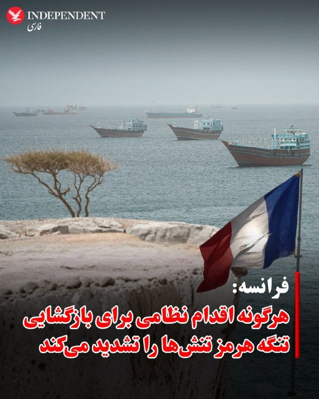
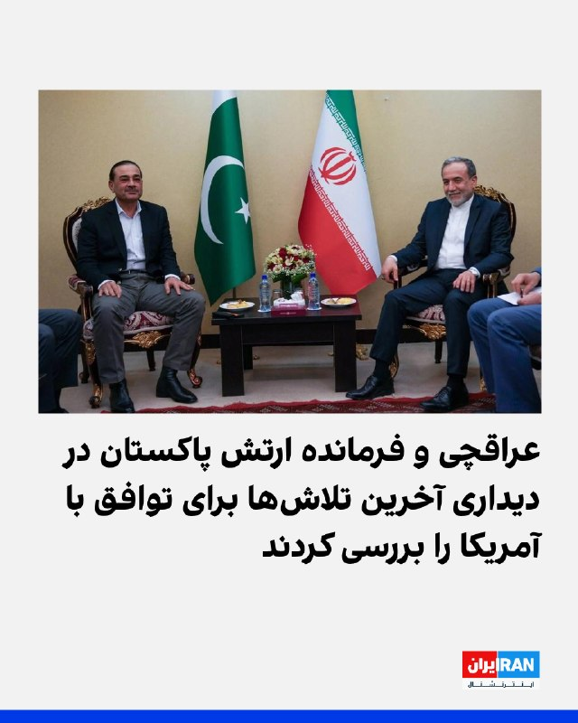
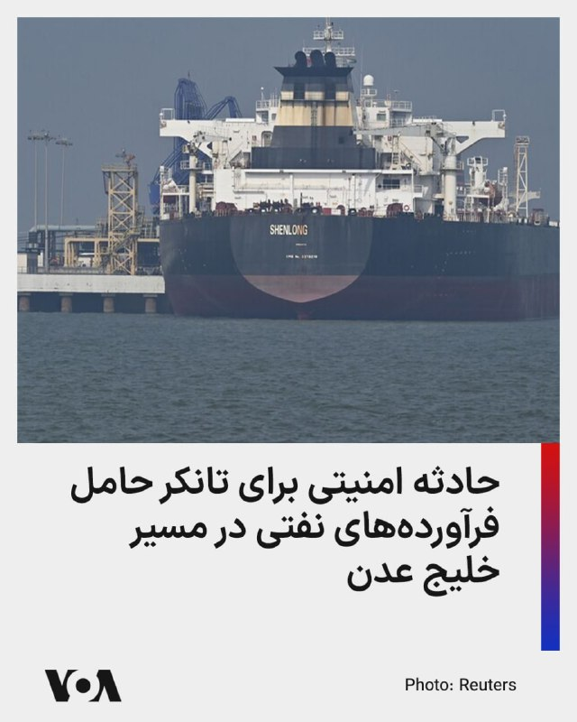
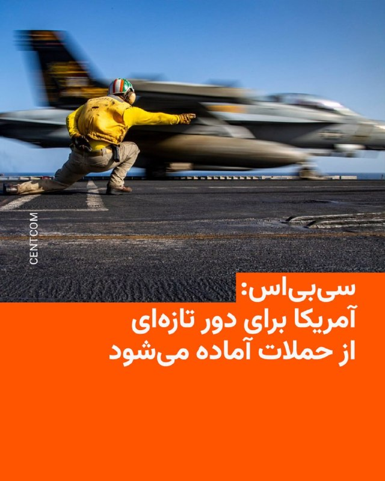
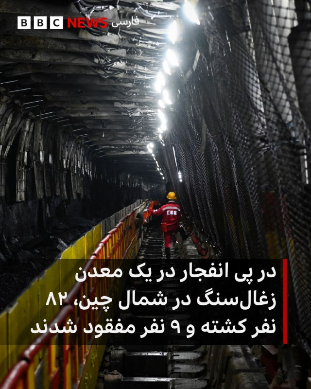
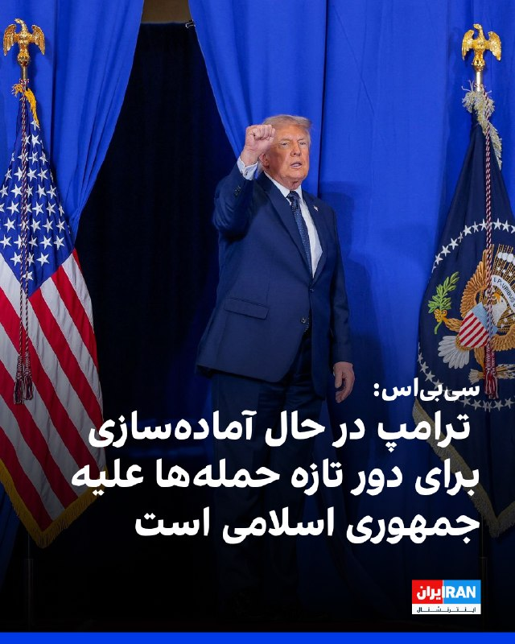
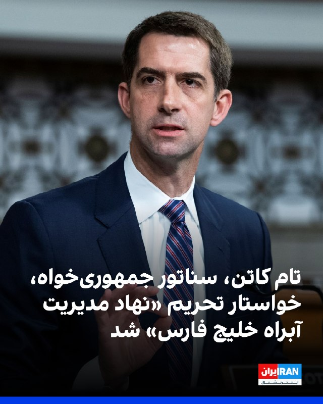
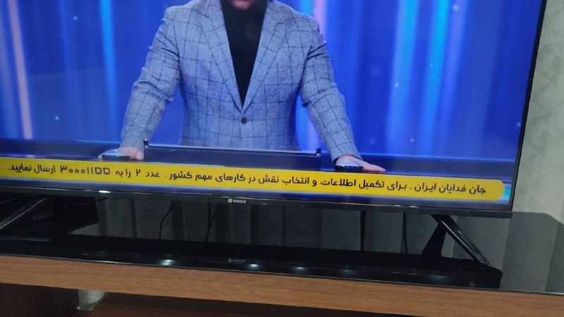
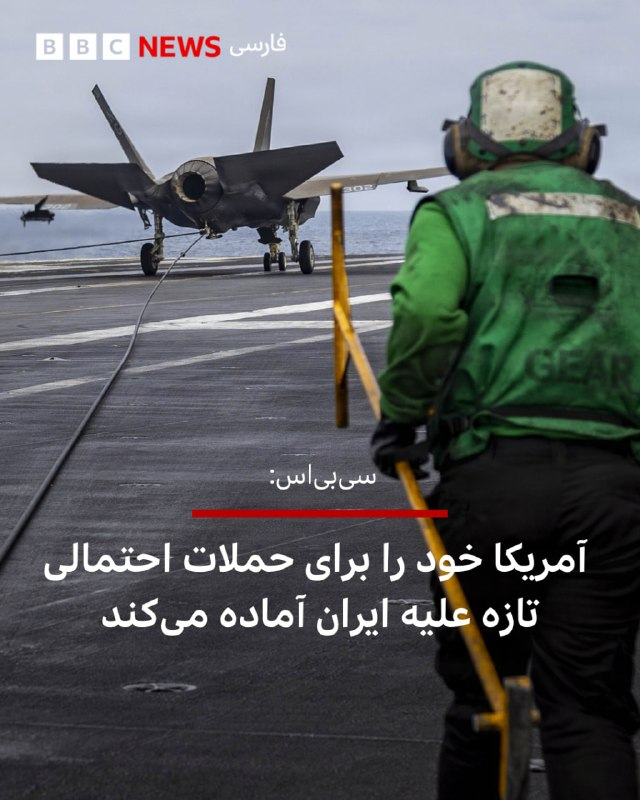
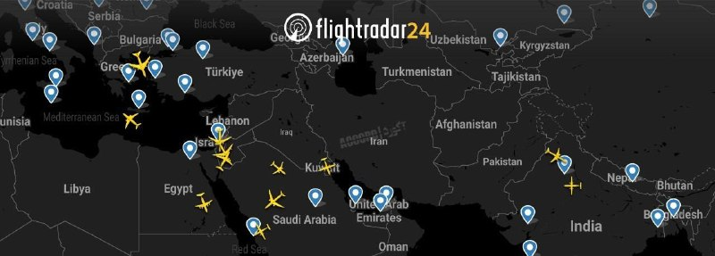

# خواننده تلگرام

<!-- TOP_NAV START -->

<a href="https://github.com/hhdoust2/aio-downloader/blob/main/telegram/content/archive_1.md" style="display:inline-block; padding:6px 12px; margin:0 4px; background-color:#2ea44f; color:white; text-decoration:none; border-radius:4px; font-weight:bold;">صفحه بعد</a>

<!-- TOP_NAV END -->

<!-- MSG START -->

---
📅 بروزرسانی: 1405/03/02 09:29
---

## VahidOOnLine — post 241649

  

⭕️ فرانسه: هرگونه اقدام نظامی برای بازگشایی تنگه هرمز تنش‌ها را تشدید می‌کند

♦️فرانسه با هشدار نسبت به هرگونه اقدام نظامی برای بازگشایی تنگه هرمز اعلام کرد استفاده از زور تنها به تشدید تنش‌ها در منطقه منجر خواهد شد. وزارت خارجه فرانسه در گفتگو با «العربیه» بستن تنگه هرمز را «سابقه‌ای خطرناک» توصیف کرد، اقدامی که می‌تواند امنیت آبراه‌های راهبردی جهان، تجارت بین‌المللی و بازار انرژی را با تهدیدی جدی روبه‌رو کند.
پاریس همزمان از آماده‌سازی یک ابتکار دیپلماتیک در شورای امنیت سازمان ملل خبر داده، طرحی که هدف آن تشکیل چارچوبی بین‌المللی برای تضمین آزادی دریانوردی و بازگشایی مسالمت‌آمیز تنگه هرمز است.
در همین حال، عبور ناو هواپیمابر فرانسوی «شارل دوگل» از کانال سوئز، از سوی وزارت خارجه فرانسه «پیامی سیاسی بسیار قوی» توصیف شده است، اقدامی که در اوج تنش‌های منطقه‌ای، حامل هشدار و نمایش آمادگی نظامی پاریس و متحدان غربی ارزیابی می‌شود. این ناو قرار است در دریای سرخ و خلیج عدن مستقر شود تا در چارچوب ابتکار مشترک فرانسه و بریتانیا برای حفاظت از آزادی کشتیرانی در منطقه ایفای نقش کند.
‌🇸🇦 Indypersian

🤖 @VahidOOnLine

## VahidOOnLine — post 241648

  

♦️سازمان عملیات تجارت دریایی بریتانیا (UKMTO) اعلام کرد یک قایق کوچک حامل پنج سرنشین به یک نفتکش حامل فرآورده‌های نفتی در غرب جزیره سقطری یمن نزدیک شده است.
بر اساس اعلام این نهاد، این نفتکش در فاصله حدود ۳۷۰ کیلومتری در غرب جزیره سقطری در حال حرکت بود که قایق مذکور به آن نزدیک شد.
سازمان عملیات تجارت دریایی بریتانیا افزود تیم امنیتی مسلح مستقر روی نفتکش وارد عمل شد و در پی آن، قایق مسیر خود را تغییر داد و از نفتکش دور شد.
جزئیات بیشتری درباره هویت افراد حاضر در قایق یا انگیزه نزدیک شدن آن‌ها منتشر نشده است.
‌🇸🇦 Indypersian

🤖 @VahidOOnLine

## VahidOOnLine — post 241647

  

♦️فیلد مارشال عاصم منیر، فرمانده ارتش پاکستان که برای رایزنی با مقام‌های جمهوری اسلامی ایران به تهران سفر کرده است، روز جمعه یکم خرداد ماه با عباس عراقچی دیدار کرد.

به گزارش کانال اطلاع‌رسانی وزارت امور خارجه در تلگرام، در این دیدار که «تا پاسی از شب ادامه داشت، طرفین درباره آخرین تلاشها و ابتکارات دیپلماتیک برای جلوگیری از تشدید تنش و خاتمه جنگ و همچنین راهکارهای تقویت صلح، ثبات و امنیت در منطقه غرب آسیا تبادل نظر کردند.»
فرمانده ارتش پاکستان، روز جمعه در جریان تلاش‌های اسلام‌آباد برای جلوگیری از جنگ و برقراری توافق میان تهران و واشگتن، وارد ایران شده است.
‌🇸🇦 Indypersian

🤖 @VahidOOnLine

## VahidOOnLine — post 241646

  

عراقچی و عاصم منیر، فرمانده ارتش پاکستان، در دیداری در تهران درباره آخرین تلاش‌های دیپلماتیک برای پایان جنگ ایران و مسائل امنیتی غرب آسیا گفت‌وگو کردند. منیر جمعه در چارچوب تلاش‌ها برای دستیابی به توافقی میان جمهوری اسلامی و آمریکا وارد تهران شد.
‌🏁 🇬🇧 IranintlTV

🤖 @VahidOOnLine

## VahidOOnLine — post 241645

  

شاهزاده رضا پهلوی در پیامی در ایکس با اشاره به دیدارش با دریک ون اوردن، عضو جمهوری‌خواه مجلس نمایندگان آمریکا، در کنگره، بر عزم خود برای ادامه رایزنی‌هایش در کنگره آمریکا درباره «طرح ایران آزاد» تاکید کرد.
شاهزاده پهلوی تاکید کرد «طرح ایران آزاد» می‌تواند پیامدهای مثبتی برای آمریکا و جهان داشته باشد.
او با انتشار تصاویری از دیدار خود با دریک ون اوردن گفت این قانون‌گذار آمریکایی از نزدیک با «رفتارهای جمهوری اسلامی علیه ایرانیان و آمریکایی‌ها» آشناست.

‌🏁 🇬🇧 IranintlTV

🤖 @VahidOOnLine

## VahidOOnLine — post 241644

♦️به گزارش رویترز، جمعه‌شب، اول خردادماه، بیست‌وسومین دوره جشنواره سالانه «ویوید سیدنی» آغاز شد و به‌رغم بارش شدید باران، سالن اپرای سیدنی و دیگر بناهای نمادین این شهر را غرق در رنگ و نور کرد. در شب افتتاحیه این رویداد، بادبان‌های اپرای سیدنی میزبان اثر گرافیکی هنرمند فرانسوی با الهام از حیات وحش بودند و هم‌زمان، نمای موزه هنرهای معاصر و ساختمان گمرک نیز با طرح‌های هندسی و الگوهای برگرفته از طبیعت سراسر جهان نورباران شدند. این جشنواره بزرگ هنر و فناوری که پایتخت ساحلی استرالیا را دگرگون کرده است، به مدت ۲۳ روز ادامه دارد و در ۲۳ خرداد (۱۳ ژوئن) به کار خود پایان می‌دهد.
‌🇸🇦 Indypersian

🤖 @VahidOOnLine

## VahidOOnLine — post 241643

  

♦️فیلم «تمرین‌هایی برای یک انقلاب» به کارگردانی پگاه آهنگرانی، بازیگر و فیلم‌ساز ایرانی، جایزه معتبر «چشم طلایی» (L'Oeil d'or) را به عنوان بهترین مستند هفتادونهمین دوره جشنواره فیلم کن از آن خود کرد. این مستند که به بررسی چندین دهه سرکوب سیاسی در ایران در قالب شش فصل از زندگی کارگردان می‌پردازد، توسط هیئت داورانی به ریاست مستیسلاف چرنوف، کارگردان برنده اسکار، از میان ۲۱ اثر انتخاب شد؛ هیئت داوران در بیانیه خود ساختار شاعرانه، فیلم‌نامه استادانه و روایت زنده و فوری فیلم از امواج خروشان تاریخ را ستودند. پگاه آهنگرانی هنگام دریافت این جایزه پنج هزار یورویی در حضور تیری فرمو، دبیر جشنواره، جایزه خود را به مردم ایران تقدیم کرد و در گفتگو با رسانه‌ها ابراز امیدواری کرد که این دستاورد بزرگ بتواند به دیده شدن هرچه بیشتر مبارزات مردم ایران برای آزادی و دموکراسی کمک کند.
‌🇸🇦 Indypersian

🤖 @VahidOOnLine

## VahidOOnLine — post 241642

♦️وزیر امور خارجه ایالات متحده روز شنبه، دوم خردادماه، در آغاز سفری رسمی وارد هند شد. مارکو روبیو که به همراه همسرش، جنت دوسدبس روبیو، مستقیم از سوئد و پس از شرکت در نشست وزرای ناتو در هلسینگبوری عازم هند شد، در فرودگاه مورد استقبال سرجیو گور، سفیر ایالات متحده در دهلی‌نو، قرار گرفت. به گزارش رویترز، بر اساس برنامه اعلام‌شده از سوی وزارت امور خارجه آمریکا، روبیو در ادامه این سفر چهار روزه عازم دهلی‌نو خواهد شد تا با نارندرا مودی، نخست‌وزیر هند، دیدار و گفتگو کند؛ ماموریتی کلیدی که هدف اصلی آن ترمیم روابط دوجانبه‌ای است که به دلیل سیاست‌های تعرفه‌ای دولت ترامپ و نزدیکی مجدد واشنگتن به رقبای دهلی‌نو یعنی پاکستان و چین، با چالشی جدی روبه‌رو شده است.
‌🇸🇦 Indypersian

🤖 @VahidOOnLine

## VahidOOnLine — post 241641

  

♦️سازمان هواپیمایی کشوری روز جمعه، با صدور اطلاعیه هوانوردی برای حریم هوایی ایران، اعلام کرد تمامی مجوزهای قبلی پروازهای مسافری در فرودگاه‌های بخش غربی منطقه اطلاعات پروازی تهران، از اول خرداد تا دوشنبه، چهارم خرداد‌، لغو شده و تنها هشت فرودگاه از جمله مهرآباد، خمینی، اصفهان و یزد مجاز به فعالیت هستند. براساس این تصمیم، این فرودگاه‌ها فقط از طلوع تا غروب آفتاب پذیرای پروازهای تجاری هستند و شرکت‌های هواپیمایی برای هرگونه پرواز باید مجوز جدید دریافت کنند.
‌🇸🇦 Indypersian

🤖 @VahidOOnLine

## mwarmonitor — post 9512

🔴اسرائیل برآورد می‌کند که در نهایت هیچ توافقی با ایران حاصل نخواهد شد و بر همین اساس، ارتش دفاعی اسرائیل (IDF) اکنون خود را طوری آماده می‌کند که گویی حمله‌ای قرار است در روزهای آینده انجام شود.— کانال ۱۲ اسرائیل

@mwarmonitor

## FoxNewsTwitter — post 342153

  <a href="telegram/content/FoxNewsTwitter_342153_1779516002.mp4" target="_blank">🎬 Download video</a>

Fox News (Twitter/X)

NEW VIDEO: Surveillance footage shows the moment a school bus carrying children crashes into a car at a busy Massachusetts intersection.

Officials say 11 children were on board the bus when the collision happened.

Nine children were taken to nearby hospitals for observation, but authorities say none of the injuries were serious.

The cause of the crash is under investigation.

## VahidOnline — post 75633

  

رسانه‌ها در ایران از دیدار فیلد مارشال عاصم منیر، فرمانده ارتش پاکستان با عباس عراقچی، وزیر امور خارجه ایران در شامگاه جمعه یکم خرداد خبر دادند.

بر اساس این خبر، دیدار این دو مقام تا پاسی از شب ادامه یافته و محور گفت‌وگوها «تلاش‌ها برای جلوگیری از تشدید تنش و خاتمه جنگ» و «راهکارهای تقویت صلح، ثبات و امنیت در منطقه غرب آسیا» بوده است.

جزئیات بیشتری از این دیدار منتشر نشده است.
@VahidHeadline

📡 @VahidOnline

## VahidOnline — post 75632

  

دولت دونالد ترامپ اعلام کرد که سیاست‌های مهاجرت به آمریکا تغییر می‌کند.

در یک تغییر اساسی در سیاست‌های مهاجرتی آمریکا، دولت این کشور اعلام کرد خارجی‌هایی که قصد دریافت اقامت دائم یا همان گرین کارت را دارند، باید خاک ایالات متحده را ترک و از طریق کنسولگری یا سفارت آمریکا اقدام نمایند.

زک کالر، سخنگوی دفتر مهاجرت دولت آمریکا، گفت که این سیاست «نیاز به یافتن و اخراج» کسانی را کاهش می‌دهد که درخواست اقامتشان رد شده است.

از سوی دیگر وکلای مهاجرت و گروه‌های امدادی می‌گویند که این تغییر احتمالا به «جدایی بیش‌ازپیش خانواده‌ها» منجر خواهد شد و قربانیان قاچاق انسان هم مجبور خواهند شد «به کشورهای خطرناکی بازگردند که از آن گریخته‌اند.»

این تغییر سیاست تازه‌ترین اقدام آقای ترامپ در محدود کرد مهاجرت به آمریکا است.
@VahidHeadline

📡 @VahidOnline

## IranIntlTV — post 338524

  <a href="telegram/content/IranIntlTV_338524_1779516005.mp4" target="_blank">🎬 Download video</a>

یک دریاچه نمکی در عربستان سعودی پس از بارش‌های بهاری بار دیگر پرآب شده و اکنون به یکی از پربازدیدترین مناظر طبیعی این کشور تبدیل شده است.

گزارش فرزیا ثابتی، خبرنگار ایران‌اینترنشنال
@iranintltv

## IranIntlTV — post 338523

  <a href="telegram/content/IranIntlTV_338523_1779516007.mp4" target="_blank">🎬 Download video</a>

دیوان بین‌المللی دادگستری در یک رای مشورتی تایید کرد حق اعتصاب کارگران تحت پوشش و حمایت مقاوله‌نامه شماره ۸۷ سازمان بین‌المللی کار درباره آزادی انجمن و حمایت از حق تشکل‌یابی قرار دارد.
روزبه بوالهری، عضو تحریریه ایران‌اینترنشنال، گفت این رای می‌تواند شرایطی فراهم کند تا تشکل‌های کارگری حامی کارگران ایران، از طریق نهادهای بین‌المللی، جمهوری اسلامی را درباره حق تشکل‌یابی کارگران تحت فشار قرار دهند و علیه آن شکایت کنند.
@iranintltv

## IranIntlTV — post 338522

  <a href="telegram/content/IranIntlTV_338522_1779516009.mp4" target="_blank">🎬 Download video</a>

محمد قائدی، مدرس روابط بین‌الملل، گفت در صورت ازسرگیری حملات آمریکا، این بار بسیار گسترده‌تر و جدی‌تر خواهد بود و نقاطی در تنگه هرمز نیز هدف قرار خواهند گرفت. او درباره اهداف احتمالی اسرائیل در ایران نیز گفت زیرساخت‌هایی مانند صنایع پتروشیمی و چاه‌های نفتی می‌توانند در فهرست اهداف این کشور باشند.
@iranintltv

## IranIntlTV — post 338521

  <a href="telegram/content/IranIntlTV_338521_1779516011.mp4" target="_blank">🎬 Download video</a>

حکم دادگاه تجدیدنظر، کنگره سال ۲۰۲۳ حزب جمهوری‌خواه خلق، بزرگ‌ترین حزب مخالف دولت در ترکیه را باطل و اوزگور اوزل، رهبر این حزب را از سمتش برکنار کرد.
@iranintltv

## IranIntlTV — post 338520

  <a href="telegram/content/IranIntlTV_338520_1779516013.mp4" target="_blank">🎬 Download video</a>

سرخط خبرهای شنبه ۲ خرداد
@iranintltv

## IranIntlTV — post 338519

  

عراقچی و عاصم منیر، فرمانده ارتش پاکستان، در دیداری در تهران درباره آخرین تلاش‌های دیپلماتیک برای پایان جنگ ایران و مسائل امنیتی غرب آسیا گفت‌وگو کردند. منیر جمعه در چارچوب تلاش‌ها برای دستیابی به توافقی میان جمهوری اسلامی و آمریکا وارد تهران شد.
https://iranintl.com/202605235118

## IranIntlTV — post 338518

  

شاهزاده رضا پهلوی در پیامی در ایکس با اشاره به دیدارش با دریک ون اوردن، عضو جمهوری‌خواه مجلس نمایندگان آمریکا، در کنگره، بر عزم خود برای ادامه رایزنی‌هایش در کنگره آمریکا درباره «طرح ایران آزاد» تاکید کرد.
شاهزاده پهلوی تاکید کرد «طرح ایران آزاد» می‌تواند پیامدهای مثبتی برای آمریکا و جهان داشته باشد.
او با انتشار تصاویری از دیدار خود با دریک ون اوردن گفت این قانون‌گذار آمریکایی از نزدیک با «رفتارهای جمهوری اسلامی علیه ایرانیان و آمریکایی‌ها» آشناست.

https://iranintl.com/202605235387

## FarsiVOA — post 218409

🔺درخواست ۲۷ کشور برای دسترسی به منابع مالی اضطراری بانک جهانی

◾️یک سند بانک جهانی که به رویت رویترز رسیده، نشان می‌دهد ۲۷ کشور در حال اقدام برای دسترسی سریع به منابع مالی اضطراری این نهاد بین‌المللی هستند تا تبعات بحران انرژی ناشی از اخلال جمهوری اسلامی در تنگه هرمز را کاهش دهند.

◾️رویترز از قول منابعی گزارش داده که کنیا و عراق در میان درخواست‌کنندگان هستند؛ اولی به خاطر جهش قیمت سوخت و دیگری به خاطر افت چشمگیر صادرات نفت.

◾️آمارهای اوپک نشان می‌دهد تولید روزانه نفت عراق از بالای ۴.۱ میلیون بشکه در ماه قبل از انسداد تنگه هرمز به زیر ۱.۵ میلیون بشکه در ماه گذشته رسیده است.

◾️کنیا نیز طی روزهای گذشته به خاطر افزایش ۲۴ درصدی قیمت سوخت شاهد اعتراضات گسترده مردمی بود.

⬇️ بیشتر بخوانید:
https://ir.voanews.com/a/world-bank-document-shows-27-countries-seeking-to-ensure-access-to-crisis-funds/8153015.html

## FarsiVOA — post 218407

  

سازمان عملیات تجارت دریایی بریتانیا اعلام کرد گزارشی تازه درباره «فعالیت مشکوک» علیه یک تانکر حامل فرآورده‌های نفتی در کریدور بین‌المللی کشتیرانی در مسیر خلیج عدن دریافت کرده است.

بر اساس این گزارش کاپیتان کشتی اعلام کرده یک قایق کوچک با پنج سرنشین به این تانکر نزدیک شده و فاصله آن در نزدیک‌ترین نقطه به حدود ۱۰۰ متر رسیده است.

به گفته این نهاد، تیم امنیتی مسلح کشتی مستقر شد و قایق پس از آن مسیر خود را تغییر داد و از شناور فاصله گرفت.

این دومین گزارش مشابه در دو روز اخیر در آب‌های نزدیک یمن است و در شرایطی منتشر می‌شود که ناامنی مسیرهای کشتیرانی اطراف خلیج عدن و دریای سرخ همچنان نگرانی شرکت‌های حمل‌ونقل را افزایش داده است.
@FarsiVOA

## FarsiVOA — post 218406

  

مارکو روبیو، وزیر خارجه آمریکا، روز شنبه در آغاز سفری چهارروزه وارد هند شد؛ سفری که به گزارش رویترز، نشانه تلاش واشنگتن برای ترمیم روابط با دهلی‌نو پس از ماه‌ها تنش تجاری و دیپلماتیک است.

بر اساس این گزارش، تعرفه‌های دولت دونالد ترامپ، نبود توافق تجاری جامع و هم‌زمانی تلاش آمریکا برای نزدیکی به پاکستان و چین، روابط واشنگتن و دهلی‌نو را تحت فشار قرار داده است.

روبیو قرار است در جریان این سفر به کلکته، آگرا، جیپور و دهلی‌نو برود و درباره تجارت، انرژی و همکاری‌های دفاعی گفت‌وگو کند.

رویترز می‌نویسد آمریکا سال‌هاست هند را وزنه‌ای مهم در برابر نفوذ چین و روسیه در منطقه هند-اقیانوس آرام می‌داند، اما اختلاف‌های اخیر این مسیر را پیچیده‌تر کرده است.

دهلی نو خواستار سفر ترامپ به هند همزمان با اجلاس گروه چهار شامل ایالات متحده، هند، ژاپن و استرالیا شده است، اما تحلیلگران می‌گویند این سفر به دلیل تنش‌های تجاری و عوامل دیگر از جمله جنگ ایالات متحده و اسرائیل با جمهوری اسلامی، به تعویق افتاده است.
@FarsiVOA

## Persian_Trend_Official — post 14717

  <a href="telegram/content/Persian_Trend_Official_14717_1779516017.mp4" target="_blank">🎬 Download video</a>

دن اسکاوینو معاون رئیس دفتر کاخ سفید و دستیار ترامپ،ویدیویی از بمب‌افکن‌های مخفی‌کار B-2 را بدون هیچ زمینه‌ای منتشر کرد، فکت مهم: آخرین باری که او این پست را منتشر کرد، چند ساعت بعد آمریکا و اسرائیل به ایران حمله کردند. 
👩‍💻@PhantomDirective 
🆔@persian_trend_official…

## Persian_Trend_Official — post 14716

  <a href="telegram/content/Persian_Trend_Official_14716_1779516017.mp4" target="_blank">🎬 Download video</a>

دن اسکاوینو معاون رئیس دفتر کاخ سفید و دستیار ترامپ،ویدیویی از بمب‌افکن‌های مخفی‌کار B-2 را بدون هیچ زمینه‌ای منتشر کرد،

فکت مهم:
آخرین باری که او این پست را منتشر کرد،
چند ساعت بعد آمریکا و اسرائیل به ایران حمله کردند.

👩‍💻@PhantomDirective

🆔@persian_trend_official
پرشین ترند | متفاوت‌ترین کانال نظامی

## Persian_Trend_Official — post 14715

  <a href="telegram/content/Persian_Trend_Official_14715_1779516019.webm" target="_blank">🎬 Download video</a>

بولتن خبری۲۴ ساعت گذشته
آرشیو تحریریه پرشین ترند.

۲ خرداد ۱۴۰۵

🇮🇷ایران

◾️ فرمانده ارتش پاکستان، ژنرال عاصم منیر، وارد تهران شد و با عراقچی وزیر خارجه ایران تا پاسی از شب دیدار و گفتگو کرد

◾️ وزیر کشور پاکستان نیز برای سومین روز متوالی در تهران حضور داشت و پیش از ورود فرمانده ارتش، پایتخت را ترک کرد

◾️ سخنگوی وزارت خارجه: تمرکز مذاکرات بر خاتمه جنگ در همه جبهه‌هاست؛ مباحث هسته‌ای در این مرحله مورد بحث نیست

◾️ سخنگوی وزارت خارجه: اختلاف‌نظرها بین ایران و آمریکا آن‌قدر عمیق است که نمی‌توان گفت ظرف چند هفته باید به نتیجه رسید

◾️ سخنگوی هیئت مذاکره‌کننده: میانجی اصلی مذاکرات پاکستان است؛ هیئت قطری نیز برای رایزنی به تهران آمد و سپس پایتخت را ترک کرد

◾️ منبع نزدیک به تیم مذاکره‌کننده: پیشرفت‌هایی در برخی موضوعات حاصل شده اما تا جمع‌بندی همه موضوعات توافقی رخ نخواهد داد

◾️ ایران پیشنهاد جدید آمریکا را دریافت کرده و در حال بررسی آن است؛ ایران تأکید کرد چندین دور ارتباط بر اساس چارچوب ۱۴ ماده‌ای ایران انجام شده

◾️ ایران بخشی از حریم هوایی غرب کشور را برای پروازهای شبانه تا روز دوشنبه بست

◾️ نیروی دریایی سپاه: ۳۵ فروند کشتی تجاری در شبانه‌روز گذشته با هماهنگی و مجوز سپاه از تنگه هرمز عبور کردند

◾️ اختلالات گسترده GPS در تنگه هرمز، سواحل جنوبی ایران، امارات، قطر و کویت گزارش شده است

◾️ نیروهای مسلح جمهوری اسلامی در بالاترین سطح آماده‌باش قرار گرفته‌اند؛ فعالیت بالای جنگنده‌ها بر فراز کردستان عراق و غرب ایران ثبت شده

◾️ حمید رسایی مدعی شد مجلس توسط دبیر شورای امنیت ملی عملاً پلمب شده و جلسات صحن علنی برگزار نمی‌شود

🇮🇱 اسرائیل و خاورمیانه

◾️ العربیه: توافق احتمالی ایران و آمریکا «بیانیه اسلام‌آباد» نامگذاری خواهد شد و شامل آغاز مذاکرات درباره مسائل حل‌نشده ظرف ۷ روز و لغو تدریجی تحریم‌ها خواهد بود

◾️ بلومبرگ: امارات، عربستان و قطر از ترامپ خواسته‌اند به جای اقدام نظامی، به دیپلماسی با ایران فرصت دهد

◾️ امارات ظرفیت خط لوله انتقال نفت به بندر فجیره برای دور زدن تنگه هرمز را تا ۲۰۲۷ دو برابر می‌کند

◾️ مدیر اجرایی آژانس بین‌المللی انرژی هشدار داد بازار نفت تا تابستان با کاهش ذخایر وارد «منطقه قرمز» می‌شود؛ قیمت نفت برنت در حال حاضر حدود ۱۰۷ دلار در هر بشکه معامله می‌شود

◾️ FBI رهبر حزب‌الله عراق، محمدباقر السعدی، را به اتهام هماهنگی حداقل ۲۰ حمله تروریستی در اروپا و کانادا بازداشت کرد

◾️ اسرائیل از تلاش‌های ترامپ برای امضای توافق با ایران خشمگین است؛ تماس تلفنی «دراماتیک» میان ترامپ و نتانیاهو گزارش شده

◾️ تحلیلگران از احتمال بستن تنگه باب‌المندب توسط انصارالله و حملات به زیرساخت‌های انرژی عربستان در صورت بازگشت جنگ هشدار دادند

◾️ گزارش‌هایی از وقوع انفجار در ابوظبی منتشر شد؛ جزئیات تأیید نشده است

🇺🇸
🗺آمریکا و جهان

◾️ ترامپ: مذاکرات در «مراحل نهایی» است اما اگر توافق نشود «اوضاع می‌تواند کمی ناخوشایند شود»؛ آمریکا حاضر است چند روز بیشتر منتظر «پاسخ‌های درست» از تهران بماند

◾️ روبیو: پیشرفت‌هایی در مذاکرات با ایران حاصل شده؛ موضوع غنی‌سازی اورانیوم و تنگه هرمز همچنان محل اختلاف است

◾️ آکسیوس: ترامپ با مشاوران ارشد امنیت ملی برای بررسی احتمال حملات نظامی جدید علیه ایران دیدار کرده؛ تصمیم نهایی اتخاذ نشده؛ ترامپ اواخر هفته گذشته یک حمله برنامه‌ریزی‌شده را پس از درخواست قطر، عربستان و امارات متوقف کرد

◾️ سی بی اس: چندین عضو ارتش و جامعه اطلاعاتی آمریکا تعطیلات Memorial Da. را لغو کرده‌اند

◾️ وال‌استریت ژورنال: واسطه‌ها در تلاش برای یک توافق موقت هستند؛ هدف تمدید آتش‌بس و ادامه مذاکرات گسترده‌تر است؛ در صورت شکست مذاکرات آمریکا و اسرائیل احتمالاً زیرساخت‌های انرژی ایران را هدف قرار می‌دهند

◾️ سی‌ان‌ان: آمریکا پیشنهاد اقتصادی بزرگی شامل لغو تمام تحریم‌ها و طرح بازسازی اقتصادی به ایران ارائه داده؛ مسائل دشوار به مذاکرات بعدی موکول می‌شود

◾️ گاردین: پاکستان در تلاش است چین را به عنوان ضامن هرگونه توافق وارد کند؛ نخست‌وزیر شریف راهی پکن می‌شود

◾️ تولسی گابارد، مدیر اطلاعات ملی آمریکا که از مخالفان جنگ با ایران بود، استعفای خود را از ۳۰ ژوئن اعلام کرد

◾️ بلومبرگ: ایران بیش از ۲۴ پهپاد MQ-9 آمریکا به ارزش نزدیک به یک میلیارد دلار را از ابتدای جنگ منهدم کرده؛ این رقم حدود ۲۰ درصد از موجودی پیش از جنگ پنتاگون است

◾️ ناتو: دبیرکل مارک روته اعلام کرد ناتو می‌تواند به آمریکا در بازگشایی تنگه هرمز کمک کند.

👩‍💻@PhantomDirective

🆔 @persian_trend_official
پرشین ترند | متفاوت‌ترین کانال نظامی

## Persian_Trend_Official — post 14714

🔴مدیرکل فرودگاه‌های خوزستان: پروازهای فرودگاه‌های اهواز و ماهشهر از سر گرفته شد

🔹اولین پرواز مسیر تهران به اهواز، امروز در فرودگاه اهواز به زمین نشست. برنامۀ پروازی به‌تدریج افزایش خواهد یافت.

🫆:Tony

📌 @persian_trend_official
پرشین ترند | متفاوت‌ترین کانال نظامی

## Persian_Trend_Official — post 14713

  

🔴دیدار و گفتگوی فرمانده ارتش پاکستان با عراقچی در تهران

💢فیلد مارشال عاصم منیر که به‌منظور رایزنی و تبادل نظر با مقام‌های جمهوری اسلامی به تهران سفر کرده است، روز گذشته با عراقچی دیدار و گفتگو کرد.

💢در این دیدار که تا پاسی از شب ادامه داشت، طرفین درباره آخرین تلاش‌ها و ابتکارات دیپلماتیک برای جلوگیری از تشدید تنش و خاتمه جنگ آمریکا و اسرائیل علیه جمهوری اسلامی و همچنین راهکارهای تقویت صلح، ثبات و امنیت در منطقه غرب آسیا تبادل نظر کردند.
🫆:Tony

📌 @persian_trend_official
پرشین ترند | متفاوت‌ترین کانال نظامی

## Persian_Trend_Official — post 14712

  

💢وقوع حادثه برای یک نفتکش نزدیک یمن

💢سازمان عملیات دریایی انگلیس امروز از دریافت گزارش‌هایی درباره حادثه امنیتی برای یک فروند نفتکش در آب‌های نزدیک جزیره «سقطری» خبر داد.

💢ناخدا یک نفتکش گزارش داده که کشتی توسط یک قایق کوچک حامل ۵ نفر در فاصله ۲۰۰ مایل دریایی غرب سوکوترا مورد قرار گرفته است. نزدیک‌ترین فاصله ۱۰۰ متر بوده.

💢تیم امنیت مسلح کشتی مستقر شد و قایق کوچک مسیر خود را تغییر داد و دور شد.

🫆:Tony

📌 @persian_trend_official
پرشین ترند | متفاوت‌ترین کانال نظامی

## Persian_Trend_Official — post 14711

  <a href="telegram/content/Persian_Trend_Official_14711_1779516021.webm" target="_blank">🎬 Download video</a>

تولسی گابارد رئیس اطلاعات ملی ايالات متحده آمریکا که دیروز استعفا داد. 📌 @persian_trend_official پرشین ترند | متفاوت‌ترین کانال نظامی

## Persian_Trend_Official — post 14710

  

تولسی گابارد رئیس اطلاعات ملی ايالات متحده آمریکا که دیروز استعفا داد.

📌 @persian_trend_official
پرشین ترند | متفاوت‌ترین کانال نظامی

## Persian_Trend_Official — post 14709

  

نسخه اسپاتیفای لایو دیشب :
https://open.spotify.com/episode/70QUNKnopM1uSLbBaXBi39?si=HwP7TUp5R22jaAYdynjUtw

## Persian_Trend_Official — post 14707

  <a href="telegram/content/Persian_Trend_Official_14707_1779516023.mp4" target="_blank">🎬 Download video</a>

🤑
🚀 انفجار مگاروکت اسپیس‌ایکس هنگام فرود
❌

دلیل اینکه این انفجارها زیاد دیده می‌شوند این است که اسپیس‌ایکس برخلاف روش سنتی ناسا، موشک‌ها را سریع آزمایش می‌کند، حتی اگر احتمال شکست بالا باشد؛ چون هدفش این است که با هر انفجار، داده جمع کند و طراحی را بهتر کند.

👩‍💻:@PhantomDirective

🆔:@persian_trend_official
پرشین ترند | متفاوت‌ترین کانال نظامی

## Persian_Trend_Official — post 14706

  

🔴نیویورک پست

♦️تبعه عراقی آموزش‌دیده سپاه می‌خواست ایوانکا ترامپ را به تلافی کشته‌شدن قاسم سلیمانی ترور کند

💢روزنامه «نیویورک‌پست» به نقل از منابع آگاه افشا کرد که ایوانکا ترامپ، دختر ۴۴ ساله دونالد ترامپ، هدف یک طرح ترور پیچیده از سوی یک تروریست تحت آموزش سپاه پاسداران انقلاب اسلامی قرار گرفته که با انگیزه انتقام‌جویی از کشته شدن قاسم سلیمانی طراحی شده بود.

💢بر اساس این گزارش، متهم که یک تبعه عراقی ۳۲ ساله به نام «محمد باقر سعد داوود الساعدی» است و به تازگی دستگیر شده، عهد کرده بود برای «به آتش کشیدن خانه ترامپ»، دختر رئیس‌جمهوری آمریکا را به قتل برساند.

🫆:Tony

📌 @persian_trend_official
پرشین ترند | متفاوت‌ترین کانال نظامی

## RadioFarda — post 157468

🔸ویدئویی در رسانه‌های اجتماعی به اشتراک گذاشته شده که لحظه‌ حمله هوایی اسرائیل به امدادگران و یک آمبولانس را در دیر قانون‌ النهر در جنوب لبنان در روز جمعه یکم خرداد نشان می‌دهد.

🔸این حمله زمانی واقع شده که این امدادگران در حال بررسی اجساد قربانیان حمله هوایی قبل اسرائیل در منطقه بودند.

🔸خبرگزاری ملی لبنان اعلام کرد که شش نفر ازجمله دو امدادگر که در حال انتقال مجروحان بودند، در حمله هوایی اسرائیل به دیر قانون کشته شده‌اند.

@RadioFarda

## RadioFarda — post 157467

  

🔸شبکه سی‌بی‌اس در آمریکا بامداد شنبه دوم خرداد خبر داد که دولت دونالد ترامپ برای انجام دور تازه‌ای از حملات علیه ایران آماده می‌شود.

🔸این شبکه خبری به نقل از منابعی که به نام‌شان اشاره نکرد نوشت که تدارکات و آمادگی برای انجام حملات تازه روز جمعه انجام شده است.

🔸با این حال در این خبر آمده است که تا بعدازظهر روز جمعه به وقت آمریکا برای انجام قطعی حمله دوباره به خاک ایران تصمیمی گرفته نشده است.

🔸همزمان یک خبرنگار روزنامه آمریکایی وال استریت جورنال در گزارشی نوشت که رئیس جمهور آمریکا به همراه مشاورانش در زمینه امنیت ملی در ساعات پایانی روز جمعه جلسه‌ای داشته، اما تصمیمی قطعی در این جلسه گرفته نشده است.

🔸به نوشته این خبرنگار از کاخ سفید، ترامپ در جلسه موافق بوده است که دیپلماسی نیاز به زمان بیشتری دارد، و در عین حال مسئله بازگشت به جنگ نیز هم‌چنان روی میز است.

🔸پیشتر اسماعیل بقایی همین نکته را گفته بود: «اختلاف‌نظرها بین ایران و آمریکا آن‌قدر عمیق و زیاد است که نمی‌شود گفت با چندبار رفت‌وآمد یا مذاکرات ظرف چند هفته ما باید حتماً به نتیجه برسیم.»

@RadioFarda

## RadioFarda — post 157466

  

🔸رسانه‌ها در ایران از دیدار فیلد مارشال عاصم منیر، فرمانده ارتش پاکستان با عباس عراقچی، وزیر امور خارجه ایران در شامگاه شنبه یکم خرداد خبر دادند.

🔸بر اساس این خبر، دیدار این دو مقام تا پاسی از شب ادامه یافته و محور گفت‌وگوها «تلاش‌ها برای جلوگیری از تشدید تنش و خاتمه جنگ» و «راهکارهای تقویت صلح، ثبات و امنیت در منطقه غرب آسیا» بوده است.

🔸جزئیات بیشتری از این دیدار منتشر نشده است.

🔸برخی رسانه‌ها پیش از این، سفر عاصم منیر به تهران را نشانه «پیشرفت» مذاکرات دانسته بودند. در همین حال وزیر خارجه آمریکا نیز از برخی پیشرفت‌ها در گفت‌وگوهای آمریکا و ایران خبر داده و در عین حال افزوده بود که هنوز توافق نهایی نشده است.

🔸پاکستان از زمان برقراری آتش‌بس بعد از ۴۰ روز جنگ آمریکا و اسرائیل با ایران، در نقش میانجی ظاهر شده است.

@RadioFarda

## RadioFarda — post 157465

  <a href="https://t.me/radiofarda/157465" target="_blank">📎 Download file</a>

📻بشنوید: سرخط خبرها با رادیوفردا، دوم خرداد ۱۴۰۵‌

@RadioFarda

## IranianMinds — post 20582

  

وضعیت رسانه ها :

@IranianMinds

## BBCPersian — post 281845

  

🔻به گزارش رسانه ‌دولتی چین، در پی انفجار در یک معدن زغال‌سنگ در شمال آن کشور دست‌کم ۸۲ نفر جان خود را از دست داده‌اند.

خبرگزاری دولتی شینهوا گفته است: «خبرنگاران از محل انفجار گاز در معدن زغال‌سنگ لیوشنیو متعلق به گروه تونگژو در استان شانشی مطلع شدند که این حادثه تاکنون ۸۲ کشته برجای گذاشته است.»

۹ معدنچی هنوز مفقود هستند. گفته می شود که احتمالا آن‌ها در شرایط وخیمی قرار دارند.

این انفجار دیروز در این معدن رخ داد.

گزارش‌ها حاکی است در زمان وقوع حادثه ۲۴۷ کارگر در محل مشغول به کار بودند.
عملیات امداد و نجات در محل همچنان ادامه دارد.

مقامات هماهنگ‌کننده عملیات می‌گویند که مدیران معدن توسط پلیس بازداشت شده‌اند.

شی جین‌پینگ، رئیس جمهور چین، خواستار تحقیقات کامل برای تعیین علت حادثه شد.

📸AFP via Getty Images عکس تزیینی
@BBCPersian

## BBCPersian — post 281844

🔻سازمان هواپیمایی ایران: فرودگاه‌های اهواز و ماهشهر از امروز بازگشایی می‌شود

سازمان هواپیمایی ایران اعلام‌کرد که فرودگاه‌های اهواز و ماهشهر از امروز شنبه، ۲ خرداد بازگشایی می‌شوند.

روابط عمومی این سازمان می‌گوید که با «تکمیل موفقیت‌آمیز فرآیند ارزیابی‌ها، این دو فرودگاه به چرخه عملیاتی کشور بازخواهند گشت و تمامی شرکت‌های هواپیمایی می‌توانند پروازهای عادی خود را در این مسیرها از سر بگیرند.»

دو روز پیش حمدرضا موالی‌زاده استاندار خوزستان گفته بود که مجوز نهایی برای عملیاتی شدن مجدد فرودگاه بین‌المللی اهواز، صادر شده است.

آقای موالی‌زاده همچنین گفت که با تلاش مدیریت فرودگاه‌های استان و تیم‌های فنی، تمامی آسیب‌های ناشی از حملات هوایی آمریکا و اسرائیل «به سرعت بازسازی، تعمیر و ایمن‌سازی شده است.»

این سازمان ابراز امیدواری کرده است که «پس از ارزیابی امنیتی و ایمنی به تدریج سایر فرودگاه‌های ایران نیز به چرخه عملیاتی» اضافه شوند.

https://bbc.in/4tP59vG
@BBCPersian

## BBCPersian — post 281843

  

🔻فیلد مارشال عاصم منیر، فرمانده ارتش پاکستان که به تهران سفر کرده با عباس عراقچی، وزیر خارجه ایران دیدار و گفتگو کرده است.

به گزارش منابع خبری در ایران در این گفت‌‌گوها که تا پاسی از شب گذشته ادامه داشت، دو طرف درباره آخرین تلاش‌های دیپلماتیک برای خاتمه جنگ و همچنین درباره راه‌های تقویت صلح و امنیت در منطقه غرب آسیا گفت‌و‌گو کردند.

این دومین سفر آقای منیر در چند هفته گذشته به ایران است.

وزیر کشور پاکستان هم برای دومین بار در چند روز گذشته به تهران رفته و در حال گفت‌وگو با مقامات ایرانی است.

📸TASNIM
https://bbc.in/4fCcg7e
@BBCPersian

## BBCPersian — post 281842

🔻بر اساس سندی داخلی که رویترز مشاهده کرده، از زمان آغاز جنگ ایران، ۲۷ کشور اقدام‌هایی را برای دسترسی سریع به منابع مالی موجود در برنامه‌های بانک جهانی آغاز کرده‌اند تا بتوانند با پیامدهای بحران مقابله کنند.

این سند نام کشورها یا میزان دقیق منابع مالی درخواستی را ذکر نکرده و بانک جهانی نیز از اظهارنظر در این باره خودداری کرده است.

بر اساس این گزارش، سه کشور از زمان آغاز درگیری‌ها در ۲۸ فوریه ابزارهای جدید مالی را تصویب کرده‌اند و بقیه کشورها همچنان در حال تکمیل روند اداری هستند.

جنگ و اختلال ناشی از آن در بازار جهانی انرژی، زنجیره‌های تامین را تحت فشار قرار داده و مانع ارسال محموله‌های حیاتی کود شیمیایی به کشورهای در حال توسعه شده است.

مقام‌های کنیا و عراق تایید کرده‌اند که برای مقابله با پیامدهای جنگ، از جمله افزایش شدید قیمت سوخت در کنیا و کاهش گسترده درآمدهای نفتی عراق، به دنبال دریافت حمایت مالی فوری از بانک جهانی هستند.

این ۲۷ کشور بخشی از ۱۰۱ کشوری هستند که به نوعی از سازوکارهای تامین مالی اضطراری بانک جهانی دسترسی دارند؛ از جمله ۵۴ کشوری که به برنامه «واکنش سریع» پیوسته‌اند و می‌توانند تا ۱۰ درصد منابع مالی تخصیص‌نیافته خود را در شرایط بحران استفاده کنند.

آجی بانگا، رئیس بانک جهانی، ماه گذشته گفته بود ابزارهای بحران این نهاد امکان دسترسی کشورها به حدود ۲۰ تا ۲۵ میلیارد دلار منابع مالی را فراهم می‌کند.

او افزود که بانک جهانی می‌تواند با تغییر اولویت بخشی از پروژه‌های خود، این رقم را طی شش ماه به ۶۰ میلیارد دلار و در بلندمدت به حدود ۱۰۰ میلیارد دلار برساند.

در همان زمان، کریستالینا جورجیوا، رئیس صندوق بین‌المللی پول، گفته بود که انتظار دارد تا حدود ۱۲ کشور برای دریافت ۲۰ تا ۵۰ میلیارد دلار کمک فوری درخواست بدهند، اما به گفته سه منبع آگاه، تاکنون درخواست‌های اندکی ثبت شده است.

https://bbc.in/4dAln5O
@BBCPersian

## BBCPersian — post 281841

🔻مارکو روبیو، وزیر خارجه آمریکا، امروز برای سفری چهارروزه وارد هند می‌شود؛ سفری که در بحبوحه بحران جهانی انرژی ناشی از جنگ ایران انجام می‌شود.

انتقال انرژی از طریق تنگه هرمز تقریبا متوقف شده است، آبراه باریکی که پس از حملات اسرائیل و آمریکا به ایران به کانون تنش تبدیل شده است.

ایران از بسته شدن این تنگه به‌عنوان اهرم فشار در مذاکرات شکننده صلح با آمریکا استفاده کرده است.

هند که بیش از ۸۰ درصد نیاز انرژی خود را وارد می‌کند، از جمله کشورهایی است که بیشترین آسیب را دیده‌اند؛ زیرا زندگی روزمره جمعیت بیش از یک میلیارد و ۴۰۰ میلیون نفری آن به واردات سوخت، از جمله گاز مایع و فرآورده‌های نفتی، وابسته است.

پیشتر آقای روبیو به چالش‌های پیش‌روی سومین اقتصاد بزرگ آسیا اشاره کرد و گفت: «ما می‌خواهیم هر میزان انرژی که هند مایل به خرید آن باشد، به آن کشور بفروشیم. همان‌طور که می‌بینید، تولید و صادرات انرژی آمریکا در سطوح تاریخی قرار دارد.»

در دهلی‌نو نیز تمایل برای افزایش واردات انرژی از آمریکا وجود دارد چراکه این موضوع می‌تواند به کاهش مازاد تجاری هند با آمریکا کمک کند، مسئله‌ای که همواره موجب نارضایتی دونالد ترامپ بوده است.

کسری تجاری آمریکا با هند در سال ۲۰۲۵ به ۵۸ میلیارد و ۲۰۰ میلیون دلار رسید که نسبت به سال قبل ۲۷/۱ درصد افزایش نشان می‌دهد.

با این حال، کارشناسان می‌گویند که جایگزینی کمبود فعلی انرژی هند با واردات از آمریکا راه‌حل ساده‌ای نیست چون که انتقال انرژی از آمریکا به هند طولانی‌تر و پرهزینه‌تر است و از نظر اقتصادی نیز چندان منطقی به نظر نمی‌رسد.

https://bbc.in/4dAln5O
@BBCPersian

## BBCPersian — post 281839

  

🔻دولت دونالد ترامپ اعلام کرد که سیاست‌های مهاجرت به آمریکا تغییر می‌کند.

در یک تغییر اساسی در سیاست‌های مهاجرتی آمریکا، دولت این کشور اعلام کرد خارجی‌هایی که قصد دریافت اقامت دائم یا همان گرین کارت را دارند، باید خاک ایالات متحده را ترک و از طریق کنسولگری یا سفارت آمریکا اقدام نمایند.

زک کالر، سخنگوی دفتر مهاجرت دولت آمریکا، گفت که این سیاست «نیاز به یافتن و اخراج» کسانی را کاهش می‌دهد که درخواست اقامتشان رد شده است.

از سوی دیگر وکلای مهاجرت و گروه‌های امدادی می‌گویند که این تغییر احتمالا به «جدایی بیش‌ازپیش خانواده‌ها» منجر خواهد شد و قربانیان قاچاق انسان هم مجبور خواهند شد «به کشورهای خطرناکی بازگردند که از آن گریخته‌اند.»

این تغییر سیاست تازه‌ترین اقدام آقای ترامپ در محدود کرد مهاجرت به آمریکا است.

📷Getty Images
@BBCPersian

## BBCPersian — post 281838

  

🔻جامعه جهانی بهائی در اطلاعیه‌ای از وضعیت سلامت بشری مصطفوی، زن باردار بهائی از شهر رفسنجان که «از زمان آغاز اعتراضات دی‌‎ماه» دستگیر و زندانی شد، ابراز نگرانی کرده است.

گفته می‌شود که مقام‌های قضایی ایران با درخواست‌های او برای دسترسی به مراقبت‌های پزشکی ضروری، از جمله آزمایش‌های حیاتی دوران بارداری، مخالفت کرده‌اند.

در اطلاعیه جامعه جهانی بهائی از جمله آمده است که خانم مصطفوی «یکی از حدود ۸۰ بهائی است که طی ماه‌های اخیر، همزمان با تشدید کارزار بی‌رحمانه جمهوری اسلامی برای آزار و سرکوب این اقلیت دینی، بازداشت و زندانی شده‌اند.»

جامعه جهانی بهائی می‌گوید که تاکنون بیش از ۴۰۰ مورد نقض حقوق بشر با حمایت حکومت ایران علیه بهائیان در سراسر آن کشور را گزارش کرده است؛ «مواردی از قبیل دستگیری‌ها و بازداشت‌ها، یورش‌های خشونت‌آمیز به منازل، مصادره غیرقانونی اموال و ممانعت از اجرای عدالت از سوی مقامات قضائی ایران.»

📷 BahaiDE
https://bbc.in/4dsL61e
@BBCPersian

## Dirty_Kids — post 389992

  

المیرا کصو

@Dirty_Kids 👻

## Dirty_Kids — post 389988

  <a href="telegram/content/Dirty_Kids_389988_1779516033.mp4" target="_blank">🎬 Download video</a>

یه چالش دیگه‌ای که جدیدا مد شده ولی در راستای همون چالش قبلی روسی یعنی «Booty transition» قرار داره؛

اینطوریه که مردم با آهنگ «Set me free» میان از خودشون فیلم میگیرن و یهو دوربین رو میبرن سمت باسن🍑 مبارکشون و ادامه ماجرا…

@Dirty_Kids 👻

## alonews — post 121923

  <a href="telegram/content/alonews_121923_1779516035.webm" target="_blank">🎬 Download video</a>

👈فعال شدن آژیرها در کریات شمونا

✅ @AloNews خبر جنگ

## alonews — post 121922

  <a href="telegram/content/alonews_121922_1779516036.webm" target="_blank">🎬 Download video</a>

👈روبیو وارد هند شد

✅ @AloNews خبر جنگ

## alonews — post 121920

  <a href="telegram/content/alonews_121920_1779516036.webm" target="_blank">🎬 Download video</a>

👈محمدباقر السعدی، فرمانده ارشد گردان‌های حزب‌الله عراق، قصد داشت به ایوانکا ترامپ، دختر رئیس‌جمهور آمریکا برای انتقام ترور قاسم سلیمانی حمله کند. او نقشه خانه ایوانکا در فلوریدا را در اختیار داشت. السعدی اخیراً در ترکیه بازداشت شده و در آمریکا علیه او کیفرخواست صادر شده است

✅ @AloNews خبر جنگ

## alonews — post 121919

  <a href="telegram/content/alonews_121919_1779516036.webm" target="_blank">🎬 Download video</a>

👈ایران با صدور اطلاعیه‌ای، پرواز در بخش غربی حریم هوایی خود را تا صبح دوشنبه ممنوع اعلام کرد

✅ @AloNews خبر جنگ

## alonews — post 121918

  <a href="telegram/content/alonews_121918_1779516036.webm" target="_blank">🎬 Download video</a>

👈گفت وگوی تلفنی عراقچی با وزیران خارجه ترکیه، قطر و عراق

✅ @AloNews خبر جنگ

## alonews — post 121917

  <a href="telegram/content/alonews_121917_1779516037.webm" target="_blank">🎬 Download video</a>

👈سازمان ملل خواستار پاسخگویی درباره رفتار تحقیرآمیز با فعالان کاروان غزه شد

✅ @AloNews خبر جنگ

## alonews — post 121916

  <a href="telegram/content/alonews_121916_1779516037.webm" target="_blank">🎬 Download video</a>

👈عراقچی و فرمانده ارتش پاکستان با هم تو تهران دیدار کردن

✅ @AloNews خبر جنگ

## alonews — post 121915

  <a href="telegram/content/alonews_121915_1779516037.webm" target="_blank">🎬 Download video</a>

👈سازمان تجارت دریایی بریتانیا: گزارشی از یک حادثه در فاصله ۲۰۰ مایل دریایی (۳۷۰ کیلومتر) غرب جزیره سقطری یمن دریافت کردیم

🔴یک تانکر حامل فرآورده‌های نفتی گفته است یک شناور کوچک با پنج سرنشین به آن نزدیک شده است.

🔴این شناور تا فاصله ۱۰۰ متری (۳۲۸ فوت) تانکر نزدیک شده بوده، اما پس از استقرار تیم امنیتی مسلح تانکر، مسیر خود را تغییر داده است.

✅ @AloNews خبر جنگ

## alonews — post 121914

  <a href="telegram/content/alonews_121914_1779516037.webm" target="_blank">🎬 Download video</a>

👈وال‌استریت ژورنال: ترامپ در جلسه روز جمعه به دستیارانش گفته که می‌خواهد به دیپلماسی زمان بیشتری بدهد

✅ @AloNews خبر جنگ

## alonews — post 121913

  <a href="telegram/content/alonews_121913_1779516037.webm" target="_blank">🎬 Download video</a>

👈پیرس مورگان: جای تعجب نیست که اعتبار اسرائیل در سراسر جهان در حال سقوط است

🔴 پیرس مورگان، مجری انگلیسی خطاب به بن‌گویر نوشت: تو یک بیمار روانی هستی. با وجود افرادی مثل تو در دولت اسرائیل، جای تعجب نیست که اعتبار آن‌ها در سراسر جهان در حال سقوط است.

✅ @AloNews خبر جنگ

## alonews — post 121912

  <a href="telegram/content/alonews_121912_1779516038.webm" target="_blank">🎬 Download video</a>

👈یک منبع عالی‌رتبه به العربیه گفت: فضای مذاکرات مثبت است و پیش‌نویس توافق آماده، ولی توافق نهایی حاصل نشده؛ تهران خواستار تضمین روشن برای آزادی دارایی‌های مسدودشده و رفع تحریم‌های نفتی است.

✅ @AloNews خبر جنگ

---
📅 بروزرسانی: 1405/03/02 06:21
---

## VahidOOnLine — post 241640

♦️یک گاومیش «آلبینو» در بنگلادش به دلیل فرم خاص موهای طلایی، مورد توجه عمومی قرار گرفته و تصاویر آن در شبکه‌های اجتماعی بازتاب گسترده‌ای داشته است. به گزارش خبرگزاری فرانسه، مردم برای مشاهده این حیوان ۴ ساله به مزرعه‌ای در شهر «نارایان‌گانج» مراجعه می‌کنند. ضیاءالدین مریدا، مالک این گاومیش ۷۰۰ کیلویی، می‌گوید به دلیل شباهت مدل موی این گاومیش با رئیس‌جمهوری آمریکا، نام «دونالد ترامپ» برایش انتخاب شده است.
بر اساس این گزارش مالک این گاومیش اعلام کرد که هجوم بازدیدکنندگان و ازدحام جمعیت باعث شده است این حیوان دچار استرس شده و وزن کم کند؛ از این رو محدودیت‌هایی برای بازدید عمومی اعمال شده است. این گاومیش در روزهای آتی و همزمان با عید قربان ذبح خواهد شد.
‌🇸🇦 Indypersian

🤖 @VahidOOnLine

## VahidOOnLine — post 241639

  

حسن حسن‌زاده، فرمانده سپاه «محمد رسول‌الله» تهران بزرگ، از نهادهای اصلی مسئول سرکوب اعتراضات در پایتخت، در یک مصاحبه تلویزیونی گفت: «اگر احیانا دشمن اشتباه کند، نیروهای مسلح سخت‌تر از گذشته، دردناک‌تر از گذشته و سهمگین‌تر از گذشته پاسخ سخت و پشیمان‌کننده و تمام‌کننده می‌دهند.»
‌🏁 🇬🇧 IranintlTV

🤖 @VahidOOnLine

## VahidOOnLine — post 241638

  

♦️به گزارش نیویورک پست، دونالد ترامپ جوان و بتینا اندرسون پیش از برگزاری مراسم عروسی در باهاما، ازدواج رسمی خود را ثبت کردند.
این زوج ۴۸ و ۳۹ ساله با ثبت سند رسمی ازدواج خود در «پالم بیچ» فلوریدا، پیوندشان را قانونی کردند. طبق گزارش‌ها، آن‌ها قصد دارند در تعطیلات آخر هفته، مراسمی خصوصی را در جزیره‌ای اختصاصی در باهاما برگزار کنند.
دونالد ترامپ، رئیس‌جمهور آمریکا، درباره احتمال حضورش در این مراسم کوچک گفته است که به دلیل جنگ در ایران، زمان مناسبی نیست، اما تلاش می‌کند در آن شرکت کند. او به شوخی گفته است: «اگر شرکت کنم کشته می‌شوم، اگر شرکت نکنم هم کشته می‌شوم.»
‌🇸🇦 Indypersian

🤖 @VahidOOnLine

## VahidOOnLine — post 241637

♦️اول خردادماه، مصادف با زادروز استاد بی‌بدیل و نوازنده بی‌تکرار تار، جلیل شهناز است؛ نابغه‌ای که در سال ۱۳۰۰ در خانواده‌ای هنردوست در اصفهان چشم به جهان گشود و تحت آموزش‌های برادرش، علی شهناز، قدم در راه موسیقی گذاشت. او با خلاقیت منحصر‌به‌فرد، جمله‌بندی‌های بدیع و جواب‌آوازهای جادویی‌اش، به یکی از برجسته‌ترین و تاثیرگذارترین چهره‌های موسیقی سنتی ایران تبدیل شد و در طول چندین دهه فعالیت درخشان، در برنامه‌های ماندگاری چون «گل‌ها» به نواختن پرداخت و در کنار بزرگانی چون محمدرضا شجریان، حسن کسایی و فرامرز پایور، آثاری جاودانه را در تاریخ فرهنگ ایران ثبت کرد؛ به طوری که استاد شجریان به پاس تکنوازی‌های کم‌نظیرش، لقب «خداوندگار تار» را به او اعطا کرد. سرانجام این شهسوار موسیقی ایران، پس از یک عمر بی‌انتهای هنری و تربیت شاگردان پرشمار، در ۲۷ خرداد ۱۳۹۲ در سن ۹۲ سالگی در تهران دار فانی را وداع گفت و در قطعه هنرمندان بهشت زهرا به خاک سپرده شد، اما طنین مضراب‌های جادویی‌اش برای همیشه در حافظه جمعی ایران زنده خواهد ماند.
‌🇸🇦 Indypersian

🤖 @VahidOOnLine

## VahidOOnLine — post 241636

  

سی‌بی‌اس‌نیوز به نقل از منابع آگاه گزارش داد دولت ترامپ روز جمعه در حال آماده‌سازی برای دور تازه‌ای از حملات نظامی علیه ایران بوده است، اما هم‌زمان دیپلماسی ادامه دارد و تا عصر جمعه تصمیم نهایی درباره انجام حملات اتخاذ نشده بود.
به گفته منابع مطلع، برخی اعضای ارتش و جامعه اطلاعاتی آمریکا برنامه‌های تعطیلات خود را لغو کرده‌اند و مقام‌های دفاعی و اطلاعاتی در حال به‌روزرسانی فهرست‌های فراخوان نیروها در پایگاه‌های آمریکا در خارج از کشور هستند.
هم‌زمان ترامپ اعلام کرد به دلیل «شرایط مربوط به امور دولت» در مراسم ازدواج پسرش شرکت نخواهد کرد و به‌جای گذراندن تعطیلات روز یادبود در نیوجرسی، به کاخ سفید بازمی‌گردد.
این تحرکات در حالی صورت می‌گیرد که بخشی از نیروهای آمریکایی در خاورمیانه در حال گشت‌زنی هستند و نگرانی از احتمال تلافی از سوی جمهوری اسلامی وجود دارد.

‌🏁 🇬🇧 IranintlTV

🤖 @VahidOOnLine

## VahidOOnLine — post 241635

  

تام کاتن، سناتور جمهوری‌خواه، از اسکات بسنت، وزیر خزانه‌داری آمریکا، خواست نهادهای مسئول دریافت هزینه عبور از تنگه هرمز برای جمهوری اسلامی، از جمله «نهاد مدیریت آبراه خلیج فارس» مرتبط با سپاه پاسداران را تحریم کند.
کاتن همچنین خواستار تحریم هر شرکت خارجی شد که این هزینه‌ها را به جمهوری اسلامی پرداخت می‌کند یا در پردازش و تسهیل آن نقش دارد. او تاکید کرد آمریکا باید همه بازیگرانی را که جمهوری اسلامی را توانمند می‌کنند، پاسخگو کند.
او گفت در حال آماده‌سازی طرحی قانونی برای حمایت از این اقدامات است و از استفاده از اختیارات فعلی برای اعمال تحریم علیه این نهاد، مدیران آن و هر طرف خارجی دخیل در پرداخت عوارض عبور از تنگه هرمز حمایت می‌کند.

‌🏁 🇬🇧 IranintlTV

🤖 @VahidOOnLine

## VahidOOnLine — post 241634

  

♦️روزنامه «نیویورک‌پست» به نقل از منابع آگاه افشا کرد که ایوانکا ترامپ، دختر ۴۴ ساله دونالد ترامپ، هدف یک طرح ترور پیچیده از سوی یک تروریست تحت آموزش سپاه پاسداران انقلاب اسلامی قرار گرفته که با انگیزه انتقام‌جویی از کشته شدن قاسم سلیمانی طراحی شده بود. بر اساس این گزارش، متهم که یک تبعه عراقی ۳۲ ساله به نام «محمد باقر سعد داوود الساعدی» است و به تازگی دستگیر شده، عهد کرده بود برای «به آتش کشیدن خانه ترامپ»، دختر رئیس‌جمهوری آمریکا را به قتل برساند. منابع اطلاعاتی اعلام کرده‌اند که الساعدی حتی نقشه و جزئیات معماری عمارت ۲۴ میلیون دلاری ایوانکا ترامپ و همسرش جارد کوشنر در فلوریدا را در اختیار داشته و پیش از این با انتشار تصویری از موقعیت این خانه در شبکه اجتماعی اکس (توییتر سابق)، به زبان عربی تهدید کرده بود که «نه کاخ‌ها و نه سرویس مخفی آمریکا» نمی‌توانند از آن‌ها محافظت کنند و انتقام تنها مسئله زمان است.
وزارت دادگستری ایالات متحده اعلام کرده است که الساعدی از مهره‌های بلندپایه در حلقه‌های تروریستی وابسته به ایران و کتائب حزب‌الله عراق به شمار می‌رود که در تاریخ ۱۵ مه در ترکیه بازداشت و به آمریکا مسترد شد. او در ایالات متحده با اتهاماتی سنگین پیرامون هدایت و اجرای ۱۸ حمله و تلاش برای ترور در سراسر اروپا و آمریکا مواجه است؛ پرونده‌ای که شامل بمب‌گذاری در یک بانک در آمستردام، حمله با چاقو به دو شهروند یهودی در لندن، تیراندازی به ساختمان کنسولگری آمریکا در تورنتو و آتش‌سوزی عمدی در معابد یهودیان در بلژیک و هلند می‌شود. این متهم که به دلیل وابستگی به قاسم سلیمانی او را مانند پدر خود می‌دانست، پس از کشته شدن سلیمانی در حمله پهپادی شش سال پیش آمریکا در بغداد، تحت آموزش‌های نظامی و اطلاعاتی ویژه سپاه پاسداران در تهران قرار گرفت و ارتباط نزدیکی نیز با جانشین او، سردار اسماعیل قاآنی، برای تامین مالی شبکه‌های تروریستی خود داشته است.
اطلاعات فاش‌شده نشان می‌دهد الساعدی با وجود نقش برجسته‌اش در شبکه‌های تروریستی، حضور بسیار فعالی در شبکه‌های اجتماعی نظیر «اسنپ‌چت» و «اکس» داشته و تصاویری از رایزنی‌های نظامی خود با قاسم سلیمانی را نیز به اشتراک گذاشته بود. او با تاسیس یک آژانس مسافرتی مذهبی و با سوءاستفاده از یک «گذرنامه خدمت عراقی» که سفر بدون تشریفات امنیتی و اخذ آسان ویزا را برای او ممکن می‌ساخت، به راحتی به کشورهای مختلف سفر کرده و با گروه‌های تروریستی ارتباط می‌گرفت. الیزابت تسورکوف، پژوهشگر انستیتو «نیولینز» که خود ۹۰۳ روز در اسارت کتائب حزب‌الله بود، تایید کرده که روابط الساعدی با سلیمانی و قاآنی فرصت بزرگی برای گروه‌های شبه‌نظامی عراقی ایجاد کرده بود. الساعدی که در زمان دستگیری در ترکیه در حال سفر به روسیه بود، هم‌اکنون در سلول انفرادی بازداشتگاه متروپولیتن بروکلین، در کنار دیگر زندانیان سرشناس نگهداری می‌شود.
‌🇸🇦 Indypersian

🤖 @VahidOOnLine

## VahidOOnLine — post 241633

♦️به گزارش خبرگزاری فرانسه، فضاپیمای غول‌پیکر «استارشیپ» متعلق به شرکت «اسپیس‌اکس»، روز جمعه پس از انجام یک پرواز آزمایشی با جدیدترین نسخه این راکت پهن‌پیکر، طبق برنامه بر سطح آب‌های اقیانوس هند فرود آمد (Splashdown) و لحظاتی بعد منفجر شد. از آنجا که این فضاپیما سامانه بازیابی برای فرود سالم روی آب ندارد، وقوع این انفجار پس از برخورد با سطح دریا کاملا پیش‌بینی‌شده و بخشی از ماهیت این آزمایش مهندسی بود؛ به همین دلیل، موفقیت استارشیپ در عبور از لایه‌های جو و فرود در نقطه تعیین‌شده، تشویق و شادی گسترده کارکنان اسپیس‌اکس را در پخش زنده اینترنتی به همراه داشت. این آزمایش موفق در مقطع زمانی بسیار حساسی برای شرکت ایلان ماسک رقم خورد؛ چرا که این کمپانی خود را برای یک عرضه اولیه سهام (IPO) تاریخی و احتمالا رکوردشکن در بازار بورس آماده می‌کند و دستاورد امروز استارشیپ، برگ برنده بزرگی برای جلب اعتماد سرمایه‌گذاران خواهد بود.
‌🇸🇦 Indypersian

🤖 @VahidOOnLine

## VahidOOnLine — post 241632

  

♦️روزنامه «نیویورک‌پست» به نقل از منابع آگاه افشا کرد که ایوانکا ترامپ، دختر ۴۴ ساله دونالد ترامپ، هدف یک طرح ترور پیچیده از سوی یک تروریست تحت آموزش سپاه پاسداران انقلاب اسلامی قرار گرفته که با انگیزه انتقام‌جویی از کشته شدن قاسم سلیمانی طراحی شده بود. بر اساس این گزارش، متهم که یک تبعه عراقی ۳۲ ساله به نام «محمد باقر سعد داوود الساعدی» است و به تازگی دستگیر شده، عهد کرده بود برای «به آتش کشیدن خانه ترامپ»، دختر رئیس‌جمهوری آمریکا را به قتل برساند. منابع اطلاعاتی اعلام کرده‌اند که الساعدی حتی نقشه و جزئیات معماری عمارت ۲۴ میلیون دلاری ایوانکا ترامپ و همسرش جارد کوشنر در فلوریدا را در اختیار داشته و پیش از این با انتشار تصویری از موقعیت این خانه در شبکه اجتماعی اکس (توییتر سابق)، به زبان عربی تهدید کرده بود که «نه کاخ‌ها و نه سرویس مخفی آمریکا» نمی‌توانند از آن‌ها محافظت کنند و انتقام تنها مسئله زمان است.
وزارت دادگستری ایالات متحده اعلام کرده است که الساعدی از مهره‌های بلندپایه در حلقه‌های تروریستی وابسته به ایران و کتائب حزب‌الله عراق به شمار می‌رود که در تاریخ ۱۵ مه در ترکیه بازداشت و به آمریکا مسترد شد. او در ایالات متحده با اتهاماتی سنگین پیرامون هدایت و اجرای ۱۸ حمله و تلاش برای ترور در سراسر اروپا و آمریکا مواجه است؛ پرونده‌ای که شامل بمب‌گذاری در یک بانک در آمستردام، حمله با چاقو به دو شهروند یهودی در لندن، تیراندازی به ساختمان کنسولگری آمریکا در تورنتو و آتش‌سوزی عمدی در معابد یهودیان در بلژیک و هلند می‌شود. این متهم که به دلیل وابستگی به قاسم سلیمانی او را مانند پدر خود می‌دانست، پس از کشته شدن سلیمانی در حمله پهپادی شش سال پیش آمریکا در بغداد، تحت آموزش‌های نظامی و اطلاعاتی ویژه سپاه پاسداران در تهران قرار گرفت و ارتباط نزدیکی نیز با جانشین او، سردار اسماعیل قاانی، برای تامین مالی شبکه‌های تروریستی خود داشته است.
اطلاعات فاش‌شده نشان می‌دهد الساعدی با وجود نقش برجسته‌اش در شبکه‌های تروریستی، حضور بسیار فعالی در شبکه‌های اجتماعی نظیر «اسنپ‌چت» و «اکس» داشته و تصاویری از رایزنی‌های نظامی خود با قاسم سلیمانی را نیز به اشتراک گذاشته بود. او با تاسیس یک آژانس مسافرتی مذهبی و با سوءاستفاده از یک «گذرنامه خدمت عراقی» که سفر بدون تشریفات امنیتی و اخذ آسان ویزا را برای او ممکن می‌ساخت، به راحتی به کشورهای مختلف سفر کرده و با گروه‌های تروریستی ارتباط می‌گرفت. الیزابت تسورکوف، پژوهشگر انستیتو «نیولینز» که خود ۹۰۳ روز در اسارت کتائب حزب‌الله بود، تایید کرده که روابط الساعدی با سلیمانی و قاانی فرصت بزرگی برای گروه‌های شبه‌نظامی عراقی ایجاد کرده بود. الساعدی که در زمان دستگیری در ترکیه در حال سفر به روسیه بود، هم‌اکنون در سلول انفرادی بازداشتگاه متروپولیتن بروکلین، در کنار دیگر زندانیان سرشناس نگهداری می‌شود.
‌🇸🇦 Indypersian

🤖 @VahidOOnLine

## VahidOOnLine — post 241631

  

روزنامه نیویورک‌پست به نقل از منابع آگاه گزارش داد یک فرد عراقی عضو سپاه و کتائب حزب‌الله که به تازگی بازداشت شده است، قصد داشت به انتقام قاسم سلیمانی برای کشتن ایوانکا ترامپ، دختر بزرگ ترامپ، اقدام کند و حتی نقشه خانه ایوانکا و همسرش جرد کوشنر در فلوریدا را در اختیار داشت.
این تبعه عراقی ۳۲ ساله که محمد باقر سعد داوود الساعدی نام دارد، ۲۵ اردیبهشت در ترکیه بازداشت و به آمریکا مسترد شد و بنابر اعلام وزارت دادگستری آمریکا، به انجام ۱۸ حمله در سراسر اروپا و آمریکا متهم شده است.
انتیفاض قنبر، معاون پیشین وابسته نظامی سفارت عراق در واشینگتن، به نیویورک‌پست گفت: «پس از کشته شدن قاسم سلیمانی، الساعدی به دیگران می‌گفت باید ایوانکا را بکشیم تا خانه ترامپ را همان‌گونه که او خانه ما را سوزاند، بسوزانیم.»
بر اساس اعلام وزارت دادگستری آمریکا، او در حمله به اهداف آمریکایی و یهودی، از جمله پرتاب بمب آتش‌زا به ساختمان بانک نیویورک ملون در آمستردام در ماه مارس، حمله با چاقو به دو قربانی یهودی در لندن در آوریل و تیراندازی به ساختمان کنسولگری آمریکا در تورنتو در ماه مارس دست داشته است.
‌🏁 🇬🇧 IranintlTV

🤖 @VahidOOnLine

## VahidOOnLine — post 241630

♦️به‌دنبال تشدید تنش‌ها در خاورمیانه و مهلت چندروزه واشنگتن به تهران برای پذیرش «پیشنهاد نهایی»، دونالد ترامپ با لغو برنامه‌های آخر هفته خود در نیوجرسی، به کاخ سفید بازگشت. هم‌زمان، «سی‌بی‌اس نیوز» گزارش داد که مقامات ارشد اطلاعاتی و نظامی ایالات متحده نیز مرخصی‌های روز یادبود (Memorial Day) خود را لغو کرده و در وضعیت آماده‌باش کامل قرار گرفته‌اند. تحرکات منطقه‌ای و نیز امنیتی در واشنگتن، در کنار گزارش‌های اخیر مبنی بر آماده‌سازی پنتاگون برای دور جدیدی از حملات به اهداف نظامی ایران و هشدار متقابل سپاه پاسداران درباره گسترش جنگ به خارج از منطقه، گمانه‌زنی‌ها درباره قریب‌الوقوع بودن یک رویارویی نظامی یا تحول بزرگ دیپلماتیک را به اوج خود رسانده است.
‌🇸🇦 Indypersian

🤖 @VahidOOnLine

## VahidOOnLine — post 241621

جاویدنامان انقلاب ملی ایرانیان؛ هشت جوان دیگر، هشت زندگی ناتمامی که هرکدام می‌توانستند بخشی از آینده این سرزمین باشند، اما جمهوری سرکوب و خشونت، زندگی را از آنان گرفت.
حیدر کریمی، عباس برزوخانی، مجتبی رضوانی میشامندی، محمدابراهیم داداشی، عرفان خضریان، محمد شاکرمی چگنی، امیرحسین حیدر دوست و فرهاد امین؛ هشت نام از میان ده‌ها هزار زندگی ناتمام.
این روایت‌های کوتاه‌ برای ثبت حقیقت و برای زنده نگه داشتن نام‌هایی که با گلوله، شکنجه و سرکوب از مردم ایران گرفته شدند، اما از حافظه جمعی پاک نخواهند شد.
#جاویدنامان_انقلاب_ملی_ایرانیان
‌🏁 🇬🇧 IranintlTV

🤖 @VahidOOnLine

## WithYashar — post 12104

بزرگترین نمایشگاه هوایی نظامی بریتانیا لغو شد، زیرا گزارش شده است که از این فرودگاه برای ماموریت‌های مرتبط(احتمالا حمله) با ایران استفاده می‌شود.
@withyashar

## WithYashar — post 12103

از دیشب تا الان نخوابیدم سربازم الانم دارم میرم سر شیفتم جنگ قبلی ام توی شیفتم شروع شد اموزشیمم جنگ 12 روزه بود دعا کنین زنده برگردم 🥲💔😂

## WithYashar — post 12102

از دیشب تا الان نخوابیدم سربازم الانم دارم میرم سر شیفتم جنگ قبلی ام توی شیفتم شروع شد اموزشیمم جنگ 12 روزه بود دعا کنین زنده برگردم 🥲💔😂

## WithYashar — post 12101

ویدیو مربوطه … 😬
@withyashar

## WithYashar — post 12100

لارا لومر از معتمد ترین افراد نزد ترامپ ، خبر آماده شدن آمریکا برای حملات دوباره رو ریتوییت کرده.
@withyashar

## WithYashar — post 12099

پست دن اسکاوینو از مشاوران ترامپ در شبکه اجتماعی X @withyashar

## WithYashar — post 12098

  

پست دن اسکاوینو از مشاوران ترامپ در شبکه اجتماعی X
@withyashar

## WithYashar — post 12097

تمام کنفرانس های خبری کاخ سفید لغو شد
@withyashar

## WithYashar — post 12096

خوب تا ۵ ایران نزد میریم برای ۹ صبح به بعد ، حالا خوابمم نمیبره 🥴🤣

## WithYashar — post 12095

## WithYashar — post 12094

## WithYashar — post 12093

## WithYashar — post 12092

## WithYashar — post 12091

  

📷 Photo

## WithYashar — post 12090

## WithYashar — post 12089

## WithYashar — post 12088

درود داداش شما میدونی چه اتفاقی افتاده این همه تفرقه تو پادشاهی خواها افتاده؟
چمونه اینا الان ۹۰روزه اتحاد دارن هر شب میان راه پیمایی پس ماهایی که هدفمون نابودی ایناست چرا اینقدر اختلاف داریم...

## WithYashar — post 12087

## WithYashar — post 12086

شبکه الحدث به نقل از منابع مطلع گزارش داد فضای مذاکرات میان تهران و واشینگتن «مثبت» ارزیابی می‌شود، اما دو طرف هنوز به توافق نهایی نرسیده‌اند.
@withyashar

## WithYashar — post 12085

نیروی دریایی اسرائیل در حال ارسال پیام های رادیویی است.
@withyashar

## FoxNewsTwitter — post 342152

  <a href="telegram/content/FoxNewsTwitter_342152_1779504670.mp4" target="_blank">🎬 Download video</a>

Fox News (Twitter/X)

A fire and explosion injured more than 30 people and killed one person at a Staten Island shipyard, officials said Friday.

The explosion happened after first responders arrived to battle a fire in the basement of a 150-by-150-foot metal building near the shipping docks.

The injured include civilians and first responders. One fire marshal is in critical condition, Mayor Mamdani said.

## FoxNewsTwitter — post 342151

  <a href="telegram/content/FoxNewsTwitter_342151_1779504672.mp4" target="_blank">🎬 Download video</a>

Fox News (Twitter/X)

FOX NEWS REPORT: Tulsi Gabbard announced Friday she’s stepping down as Director of National Intelligence after her husband was diagnosed with an extremely rare form of bone cancer. Her last day is expected to be June 30.

@BillMelugin_ has the latest.

## FoxNewsTwitter — post 342150

  

Fox News (Twitter/X)

WATCH LIVE: Press conference after massive explosion injures 16, including firefighters https://twitter.com/i/broadcasts/1jxXggegoRLJZ

## VahidOnline — post 75631

  

روزنامه «نیویورک‌پست» به نقل از منابع آگاه افشا کرد که ایوانکا ترامپ، دختر ۴۴ ساله دونالد ترامپ، هدف یک طرح ترور پیچیده از سوی یک تروریست تحت آموزش سپاه پاسداران انقلاب اسلامی قرار گرفته که با انگیزه انتقام‌جویی از کشته شدن قاسم سلیمانی طراحی شده بود.

بر اساس این گزارش، متهم که یک تبعه عراقی ۳۲ ساله به نام «محمد باقر سعد داوود الساعدی» است و به تازگی دستگیر شده، عهد کرده بود برای «به آتش کشیدن خانه ترامپ»، دختر رئیس‌جمهوری آمریکا را به قتل برساند.

منابع اطلاعاتی اعلام کرده‌اند که الساعدی حتی نقشه و جزئیات معماری عمارت ۲۴ میلیون دلاری ایوانکا ترامپ و همسرش جارد کوشنر در فلوریدا را در اختیار داشته و پیش از این با انتشار تصویری از موقعیت این خانه در شبکه اجتماعی اکس (توییتر سابق)، به زبان عربی تهدید کرده بود که «نه کاخ‌ها و نه سرویس مخفی آمریکا» نمی‌توانند از آن‌ها محافظت کنند و انتقام تنها مسئله زمان است.

وزارت دادگستری ایالات متحده اعلام کرده است که الساعدی از مهره‌های بلندپایه در حلقه‌های تروریستی وابسته به ایران و کتائب حزب‌الله عراق به شمار می‌رود که در تاریخ ۱۵ مه در ترکیه بازداشت و به آمریکا مسترد شد. او در ایالات متحده با اتهاماتی سنگین پیرامون هدایت و اجرای ۱۸ حمله و تلاش برای ترور در سراسر اروپا و آمریکا مواجه است؛ پرونده‌ای که شامل بمب‌گذاری در یک بانک در آمستردام، حمله با چاقو به دو شهروند یهودی در لندن، تیراندازی به ساختمان کنسولگری آمریکا در تورنتو و آتش‌سوزی عمدی در معابد یهودیان در بلژیک و هلند می‌شود.

این متهم که به دلیل وابستگی به قاسم سلیمانی او را مانند پدر خود می‌دانست، پس از کشته شدن سلیمانی در حمله پهپادی شش سال پیش آمریکا در بغداد، تحت آموزش‌های نظامی و اطلاعاتی ویژه سپاه پاسداران در تهران قرار گرفت و ارتباط نزدیکی نیز با جانشین او، سردار اسماعیل قاانی، برای تامین مالی شبکه‌های تروریستی خود داشته است.

اطلاعات فاش‌شده نشان می‌دهد الساعدی با وجود نقش برجسته‌اش در شبکه‌های تروریستی، حضور بسیار فعالی در شبکه‌های اجتماعی نظیر «اسنپ‌چت» و «اکس» داشته و تصاویری از رایزنی‌های نظامی خود با قاسم سلیمانی را نیز به اشتراک گذاشته بود.

او با تاسیس یک آژانس مسافرتی مذهبی و با سوءاستفاده از یک «گذرنامه خدمت عراقی» که سفر بدون تشریفات امنیتی و اخذ آسان ویزا را برای او ممکن می‌ساخت، به راحتی به کشورهای مختلف سفر کرده و با گروه‌های تروریستی ارتباط می‌گرفت.

الیزابت تسورکوف، پژوهشگر انستیتو «نیولینز» که خود ۹۰۳ روز در اسارت کتائب حزب‌الله بود، تایید کرده که روابط الساعدی با سلیمانی و قاانی فرصت بزرگی برای گروه‌های شبه‌نظامی عراقی ایجاد کرده بود. الساعدی که در زمان دستگیری در ترکیه در حال سفر به روسیه بود، هم‌اکنون در سلول انفرادی بازداشتگاه متروپولیتن بروکلین، در کنار دیگر زندانیان سرشناس نگهداری می‌شود.

@VahidOOnLine

📡 @VahidOnline

## VahidOnline — post 75630

  

سی‌بی‌اس گزارش داد که آمریکا در حالی خود را برای دور تازه‌ای از حملات نظامی علیه ایران آماده می‌کند که تلاش‌های دیپلماتیک همچنان ادامه دارد.

به گزارش سی‌بی‌اس نیوز، منابعی که مستقیم در جریان برنامه‌ریزی‌ها قرار دارند می‌گویند که دولت ترامپ روز جمعه در حال آماده‌سازی برای حملات تازه بود هرچند تا عصر جمعه تصمیم نهایی گرفته نشد.

آقای ترامپ در پیامی در شبکه‌های اجتماعی اعلام کرد که «مسائل مربوط به دولت» مانع از حضور او در مراسم ازدواج پسرش، دونالد ترامپ جونیور در روز شنبه خواهد شد.
او قرار بود تعطیلات آخر هفته را در مجموعه گلف خود در ایالت نیوجرسی بگذراند، اما اکنون به کاخ سفید بازمی‌گردد.

چند منبع نیز گفته‌اند که برخی اعضای ارتش و جامعه اطلاعاتی آمریکا برنامه‌های تعطیلات خود را لغو کرده‌اند؛ اقدامی که در انتظار احتمال حملات تازه انجام شده است.

به گفته این منابع، مقام‌های دفاعی و اطلاعاتی آمریکا در حال به‌روزرسانی فهرست نیروهای آماده‌باش در پایگاه‌های خارج از کشور هستند؛ همزمان با خروج بخشی از نیروهای مستقر در خاورمیانه، در چارچوب تلاش برای کاهش حضور نظامی آمریکا در منطقه و نگرانی از واکنش احتمالی ایران.
@VahidHeadline

📡 @VahidOnline

## IranIntlTV — post 338517

  

حسن حسن‌زاده، فرمانده سپاه «محمد رسول‌الله» تهران بزرگ، از نهادهای اصلی مسئول سرکوب اعتراضات در پایتخت، در یک مصاحبه تلویزیونی گفت: «اگر احیانا دشمن اشتباه کند، نیروهای مسلح سخت‌تر از گذشته، دردناک‌تر از گذشته و سهمگین‌تر از گذشته پاسخ سخت و پشیمان‌کننده و تمام‌کننده می‌دهند.»
https://iranintl.com/202605235001

## IranIntlTV — post 338516

  

سی‌بی‌اس‌نیوز به نقل از منابع آگاه گزارش داد دولت ترامپ روز جمعه در حال آماده‌سازی برای دور تازه‌ای از حملات نظامی علیه ایران بوده است، اما هم‌زمان دیپلماسی ادامه دارد و تا عصر جمعه تصمیم نهایی درباره انجام حملات اتخاذ نشده بود.
به گفته منابع مطلع، برخی اعضای ارتش و جامعه اطلاعاتی آمریکا برنامه‌های تعطیلات خود را لغو کرده‌اند و مقام‌های دفاعی و اطلاعاتی در حال به‌روزرسانی فهرست‌های فراخوان نیروها در پایگاه‌های آمریکا در خارج از کشور هستند.
هم‌زمان ترامپ اعلام کرد به دلیل «شرایط مربوط به امور دولت» در مراسم ازدواج پسرش شرکت نخواهد کرد و به‌جای گذراندن تعطیلات روز یادبود در نیوجرسی، به کاخ سفید بازمی‌گردد.
این تحرکات در حالی صورت می‌گیرد که بخشی از نیروهای آمریکایی در خاورمیانه در حال گشت‌زنی هستند و نگرانی از احتمال تلافی از سوی جمهوری اسلامی وجود دارد.

https://iranintl.com/202605236613

## IranIntlTV — post 338515

  

تام کاتن، سناتور جمهوری‌خواه، از اسکات بسنت، وزیر خزانه‌داری آمریکا، خواست نهادهای مسئول دریافت هزینه عبور از تنگه هرمز برای جمهوری اسلامی، از جمله «نهاد مدیریت آبراه خلیج فارس» مرتبط با سپاه پاسداران را تحریم کند.
کاتن همچنین خواستار تحریم هر شرکت خارجی شد که این هزینه‌ها را به جمهوری اسلامی پرداخت می‌کند یا در پردازش و تسهیل آن نقش دارد. او تاکید کرد آمریکا باید همه بازیگرانی را که جمهوری اسلامی را توانمند می‌کنند، پاسخگو کند.
او گفت در حال آماده‌سازی طرحی قانونی برای حمایت از این اقدامات است و از استفاده از اختیارات فعلی برای اعمال تحریم علیه این نهاد، مدیران آن و هر طرف خارجی دخیل در پرداخت عوارض عبور از تنگه هرمز حمایت می‌کند.

https://iranintl.com/202605233320

## IranIntlTV — post 338514

  

روزنامه نیویورک‌پست به نقل از منابع آگاه گزارش داد یک فرد عراقی عضو سپاه و کتائب حزب‌الله که به تازگی بازداشت شده است، قصد داشت به انتقام قاسم سلیمانی برای کشتن ایوانکا ترامپ، دختر بزرگ ترامپ، اقدام کند و حتی نقشه خانه ایوانکا و همسرش جرد کوشنر در فلوریدا را در اختیار داشت.
این تبعه عراقی ۳۲ ساله که محمد باقر سعد داوود الساعدی نام دارد، ۲۵ اردیبهشت در ترکیه بازداشت و به آمریکا مسترد شد و بنابر اعلام وزارت دادگستری آمریکا، به انجام ۱۸ حمله در سراسر اروپا و آمریکا متهم شده است.
انتیفاض قنبر، معاون پیشین وابسته نظامی سفارت عراق در واشینگتن، به نیویورک‌پست گفت: «پس از کشته شدن قاسم سلیمانی، الساعدی به دیگران می‌گفت باید ایوانکا را بکشیم تا خانه ترامپ را همان‌گونه که او خانه ما را سوزاند، بسوزانیم.»
بر اساس اعلام وزارت دادگستری آمریکا، او در حمله به اهداف آمریکایی و یهودی، از جمله پرتاب بمب آتش‌زا به ساختمان بانک نیویورک ملون در آمستردام در ماه مارس، حمله با چاقو به دو قربانی یهودی در لندن در آوریل و تیراندازی به ساختمان کنسولگری آمریکا در تورنتو در ماه مارس دست داشته است.
https://iranintl.com/202605236458

## IranIntlTV — post 338505

جاویدنامان انقلاب ملی ایرانیان؛ هشت جوان دیگر، هشت زندگی ناتمامی که هرکدام می‌توانستند بخشی از آینده این سرزمین باشند، اما جمهوری سرکوب و خشونت، زندگی را از آنان گرفت.
حیدر کریمی، عباس برزوخانی، مجتبی رضوانی میشامندی، محمدابراهیم داداشی، عرفان خضریان، محمد شاکرمی چگنی، امیرحسین حیدر دوست و فرهاد امین؛ هشت نام از میان ده‌ها هزار زندگی ناتمام.
این روایت‌های کوتاه‌ برای ثبت حقیقت و برای زنده نگه داشتن نام‌هایی که با گلوله، شکنجه و سرکوب از مردم ایران گرفته شدند، اما از حافظه جمعی پاک نخواهند شد.
#جاویدنامان_انقلاب_ملی_ایرانیان

## FarsiVOA — post 218405

🔺گزارش نیویورک تایمز از اهداف احتمالی در صورت آغاز دوباره کارزار نظامی آمریکا علیه جمهوری اسلامی

◾️نیویورک تایمز جمعه شب در گزارشی نوشت که دونالد ترامپ، رئیس‌جمهوری آمریکا، صبح این روز (۱ خرداد) به همراه وزیر جنگ خود، پیت هگست، در دفتر بیضی کاخ سفید حضور داشت.

⬇️ بیشتر بخوانید:
https://ir.voanews.com/a/8153014.html
@FarsiVOA

## FarsiVOA — post 218404

🔺نیویورک پست به نقل از چند منبع: تبعه عراقی آموزش‌دیده سپاه می‌خواست ایوانکا ترامپ را به تلافی کشته‌شدن قاسم سلیمانی ترور کند

◾️روزنامه نیویورک پست روز جمعه ۱ خرداد گزارش داد که ایوانکا ترامپ، دختر دونالد ترامپ رئیس جمهوری آمریکا، هدف طرح ترور فردی قرار گرفته بود که گفته می‌شود سپاه پاسداران او را آموزش داده بود.

⬇️ بیشتر بخوانید:
https://ir.voanews.com/a/8153013.html
@FarsiVOA

## Persian_Trend_Official — post 14705

  <a href="telegram/content/Persian_Trend_Official_14705_1779504681.mp4" target="_blank">🎬 Download video</a>

صبحتون‌ بخیر ☕️🔥

📝 Nick
📌 @persian_trend_official
پرشین ترند | متفاوت‌ترین کانال نظامی

## Persian_Trend_Official — post 14704

  

🔴ترامپ تصویری از خود با گرینلند منتشر کرد

💢 رئیس جمهوری آمریکا در اقدامی جنجالی دیگر تصویری از خود را در فضای مجازی منتشر کرده که  دست وی را روی گرینلند نشان می دهد.

🫆:Tony

📌 @persian_trend_official
پرشین ترند | متفاوت‌ترین کانال نظامی

## Persian_Trend_Official — post 14703

💢نیروهای مسلح جمهوری اسلامی در بالاترین سطح آماده‌باش قرار گرفته‌اند.

▪️همزمان، فعالیت بالای جنگنده‌ها بر فراز کردستان عراق و همچنین فعالیت جنگنده‌های ایرانی در غرب ایران ثبت شده است. همچنین سطح بالایی از اختلال در سیستم GPS در امارات، قطر، کویت و ایران گزارش شده است.

🫆:Tony

📌 @persian_trend_official
پرشین ترند | متفاوت‌ترین کانال نظامی

## IranianMinds — post 20580

🔴 اکسیوس: ترامپ بیش از پیش به اقدام نظامی علیه ایران متمایل شده است

اکسیوس به نقل از منابع آگاه گزارش داد دونالد ترامپ طی شش هفته گذشته چند بار تا آستانه ازسرگیری اقدام نظامی علیه ایران پیش رفته، اما در نهایت عقب‌نشینی کرده است.

طبق این گزارش، افرادی که از روند تصمیم‌گیری ترامپ اطلاع دارند میگویند او اکنون بیش از قبل به اجرای حمله نظامی متمایل شده؛ مگر اینکه مذاکرات به شکل غیرمنتظره‌ای به پیشرفت جدی برسد.

منابع آمریکایی همچنین گفته‌اند فضای مذاکرات همچنان پیچیده و فرسایشی است و متن‌های پیشنهادی به طور مداوم میان دو طرف رد و بدل میشود، اما پیشرفت ملموسی حاصل نشده است.

این گزارش در حالی منتشر میشود که همزمان تلاش‌های دیپلماتیک قطر، پاکستان و برخی کشورهای منطقه برای جلوگیری از تشدید درگیری ادامه دارد.

@IranianMinds

## IranianMinds — post 20579

💯 اگر هنوز ۵۰۰ هزارتومان رو نگرفتی همین الان عضو شو‌ و جایزتو بگیر
نیازی هم به واریز نیست

👍 تنها سایت مورد #تایید ما با بونوس های واقعی

🌐 Winro.io

## IranianMinds — post 20578

  <a href="telegram/content/IranianMinds_20578_1779504682.webm" target="_blank">🎬 Download video</a>

💩 
⚠️ دیگه #فریب بونوس های الکی سایت های سودجو رو نخورید
❌

💲بیا توی سایت مورد تایید ما یعنی #وینرو و با عضویت 500 هزار تومان اعتبار بی قیدو شرط بگیر
👏

🤩با عضویت 
🤩 
🤩 
🤩 هزار تومان اعتبار رایگان بگیر!

⌛ پشتیبانی 24 ساعته

🌐 Winro.io

🌐 Winro.io
کانال بونوس های رایگان a1

📱 @winro_io

## IranianMinds — post 20577

  

🔴وضعیت پروازهای نظامی در منطقه.

@IranianMinds

## BBCPersian — post 281828

🖋برند دبوسمن جونیور
خبرنگار کاخ سفید

آمریکا، رائول کاسترو، رئیس‌جمهور سابق ۹۴ ساله کوبا را به قتل متهم کرده است؛ اقدامی که گمانه‌زنی‌ها را درباره این ‌که آیا هاوانا مقصد بعدی فهرست تغییر رژیم واشنگتن خواهد بود یا نه، افزایش داده است.

در بحبوحه کارزار «فشار حداکثری» که شدیدترین کمبودهای سوخت و انرژی کوبا در چند دهه اخیر را رقم زده است، شماری از مقام‌های آمریکایی به شکل مداوم خواستار پایان دادن به حکومت کمونیستی ۶۶ ساله این جزیره شده‌اند.

در حالی که دونالد ترامپ، رئیس‌جمهور آمریکا، گفته است معتقد است نیازی به «تشدید تنش» نخواهد بود، کاخ سفید نیز تاکید کرده که وجود یک «دولت سرکش» در نزدیکی سواحل آمریکا را تحمل نخواهد کرد.

این ‌که در ادامه چه رخ خواهد داد، برای هیچ ‌کس روشن نیست؛ فروپاشی اقتصادی، آشوب داخلی یا مداخله نظامی آمریکا. در ادامه سه سناریوی احتمالی بررسی می‌شود.

آلبوم را ورق بزنید و ادامه مطلب را از لینک زیر در وبسایت بی‌بی‌سی فارسی بخوانید.

📸GettyImages/ Reuters/ Anadolu via Getty Images/ EPA/Shutterstock/ AFP via Getty Images/ Bloomberg via Getty Images
https://bbc.in/43oAVVv
@BBCPersian

## BBCPersian — post 281827

🔻ولادیمیر پوتین، رئیس‌جمهور روسیه، از ارتش خواست تا برای «گزینه‌های تلافی‌جویانه» علیه اوکراین آماده شود. او این دستور را پس از حمله پهپادی کی‌یف به یک خوابگاه دانشجویی در منطقه شرقی تحت اشغال روسیه در اوکراین، صادر کرد. روسیه می‌گوید که در این حمله شش…

## BBCPersian — post 281826

  

🔻ولادیمیر پوتین، رئیس‌جمهور روسیه، از ارتش خواست تا برای «گزینه‌های تلافی‌جویانه» علیه اوکراین آماده شود.

او این دستور را پس از حمله پهپادی کی‌یف به یک خوابگاه دانشجویی در منطقه شرقی تحت اشغال روسیه در اوکراین، صادر کرد.

روسیه می‌گوید که در این حمله شش دانشجو کشته شدند.

رئیس‌جمهور روسیه ضمن متهم کردن اوکراین به «تروریسم» گفت که بیانیه وزارت خارجه مسکو کافی نبوده و به ارتش دستور داده تا «طرح‌ حملات» متقابل را ارائه کنند.

از سوی دیگر اوکراین می‌گوید که ساختمان هدف حمله، «مقر فرماندهی پهپادی ارتش روسیه» بود.

خبرگزاری رویترز هم از قول مقام‌های محلی تحت امر روسیه نوشت که این ساختمان، «دانشکده تربیت معلم دانشگاه لوهانسک» بود.

با وجود انتشار تصاویر عملیات امداد گروه‌های نجات روسی از رسانه‌ دولتی روسیه، هنوز مشخص نیست چه کسانی در این حمله کشته شده‌اند.

📷 Reuters
@BBCPersian

## BBCPersian — post 281825

🔻سی‌بی‌اس شریک خبری بی‌بی‌سی گزارش داد که آمریکا در حالی خود را برای دور تازه‌ای از حملات نظامی علیه ایران آماده می‌کند که تلاش‌های دیپلماتیک همچنان ادامه دارد. به گزارش سی‌بی‌اس نیوز، منابعی که مستقیم در جریان برنامه‌ریزی‌ها قرار دارند می‌گویند که دولت ترامپ…

## BBCPersian — post 281824

  

🔻سی‌بی‌اس شریک خبری بی‌بی‌سی گزارش داد که آمریکا در حالی خود را برای دور تازه‌ای از حملات نظامی علیه ایران آماده می‌کند که تلاش‌های دیپلماتیک همچنان ادامه دارد.

به گزارش سی‌بی‌اس نیوز، منابعی که مستقیم در جریان برنامه‌ریزی‌ها قرار دارند می‌گویند که دولت ترامپ روز جمعه در حال آماده‌سازی برای حملات تازه بود هرچند تا عصر جمعه تصمیم نهایی گرفته نشد.

آقای ترامپ در پیامی در شبکه‌های اجتماعی اعلام کرد که «مسائل مربوط به دولت» مانع از حضور او در مراسم ازدواج پسرش، دونالد ترامپ جونیور در روز شنبه خواهد شد.

او قرار بود تعطیلات آخر هفته را در مجموعه گلف خود در ایالت نیوجرسی بگذراند، اما اکنون به کاخ سفید بازمی‌گردد.

چند منبع نیز گفته‌اند که برخی اعضای ارتش و جامعه اطلاعاتی آمریکا برنامه‌های تعطیلات خود را لغو کرده‌اند؛ اقدامی که در انتظار احتمال حملات تازه انجام شده است.

📷EPA
https://bbc.in/4tNcI6h
@BBCPersian

## BBCPersian — post 281823

🔻دو مقام آمریکایی به شبکه خبری اکسیوس گفتند که دونالد ترامپ، نشستی را با اعضای ارشد تیم امنیت ملی خود درباره جنگ با ایران برگزار کرده است. این گزارش حاکیست که رئیس جمهور آمریکا در صورت شکست مذاکرات در آخرین لحظات، به‌طور جدی در حال بررسی انجام حملات تازه…

## BBCPersian — post 281822

  

🔻دو مقام آمریکایی به شبکه خبری اکسیوس گفتند که دونالد ترامپ، نشستی را با اعضای ارشد تیم امنیت ملی خود درباره جنگ با ایران برگزار کرده است.

این گزارش حاکیست که رئیس جمهور آمریکا در صورت شکست مذاکرات در آخرین لحظات، به‌طور جدی در حال بررسی انجام حملات تازه علیه ایران است.

گفته می‌شود که این نشست همزمان با سفر عاصم منیر، فرمانده ارتش پاکستان، به تهران برگزار شده است، سفری که ظاهرا آخرین تلاش‌ها برای کاهش اختلاف‌ها و جلوگیری از شروع دوباره جنگ به شمار می‌رود.

همزمان یک هیئت از قطر هم با «هماهنگی آمریکا» در تهران به‌سر می‌برد.

برپایه گزارش آکسیوس همچنین در این جلسه، جی‌دی ونس، معاون رئیس‌جمهور، پیت هگست، وزیر دفاع، جان رتکلیف، رئیس سازمان سیا، سوزی وایلز، رئیس دفتر کاخ سفید، و شماری دیگر از مقام‌ها در کنار دونالد ترامپ حضور داشتند.

گفته شده که مارکو روبیو، وزیر خارجه آمریکا، و ژنرال دن کین، رئیس ستاد مشترک ارتش، در جلسه حضور نداشتند؛ زیرا اولی در اروپا بود و دومی در مراسم فارغ‌التحصیلی آکادمی نیروی دریایی شرکت داشت.

📷 Bloomberg via Getty Image
https://bbc.in/4f2mcqz
@BBCPersian

<!-- MSG END -->

<!-- NAV START -->

<a href="https://github.com/hhdoust2/aio-downloader/blob/main/telegram/content/archive_1.md" style="display:inline-block; padding:6px 12px; margin:0 4px; background-color:#2ea44f; color:white; text-decoration:none; border-radius:4px; font-weight:bold;">صفحه بعد</a>

<!-- NAV END -->
