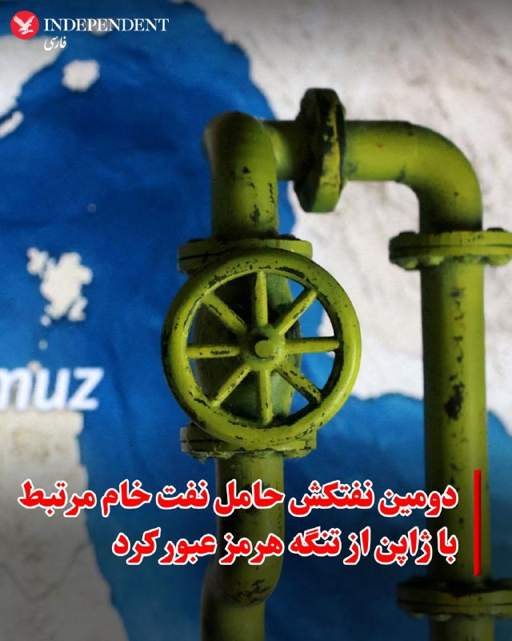
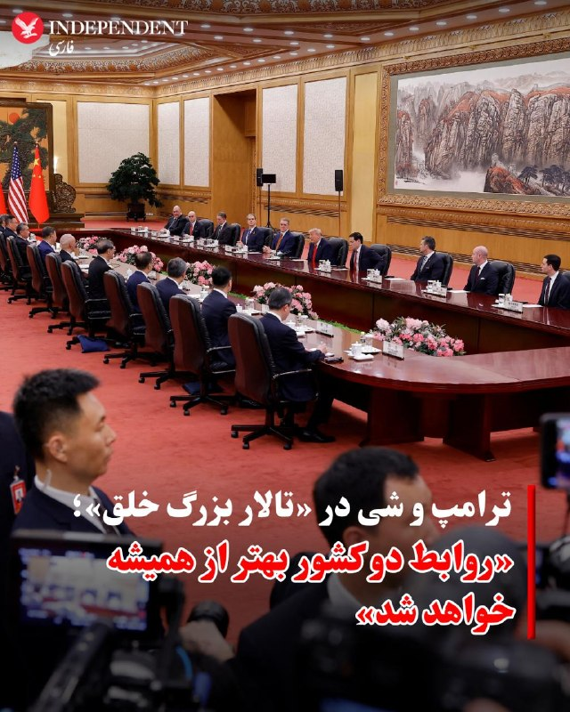
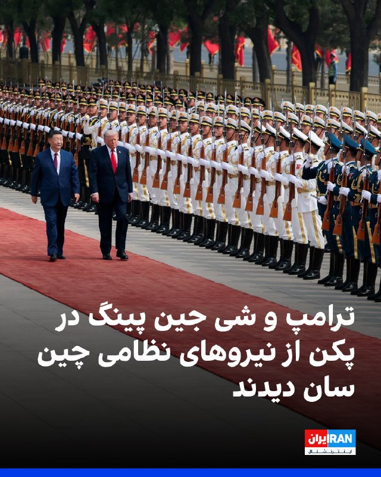
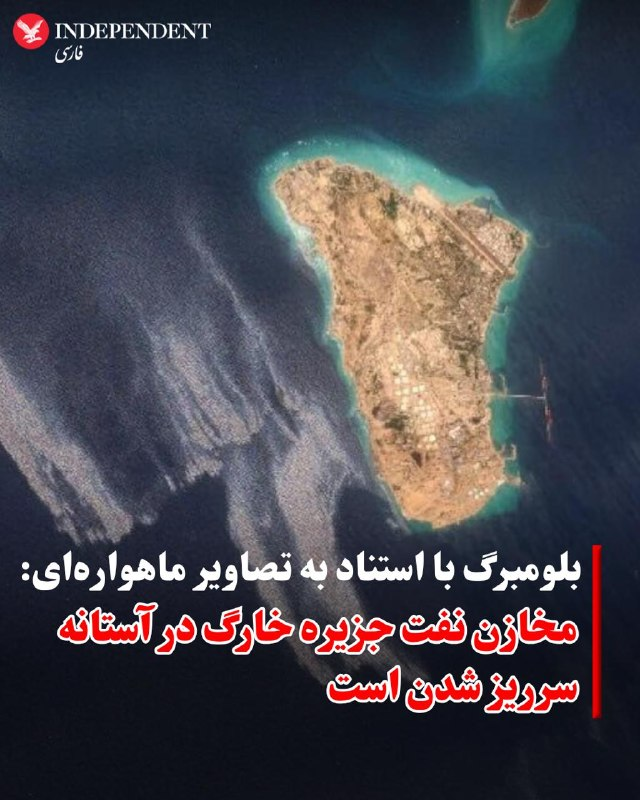
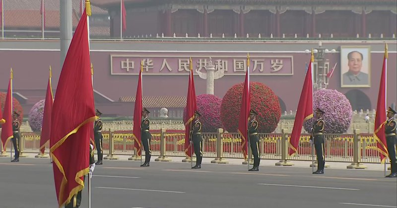
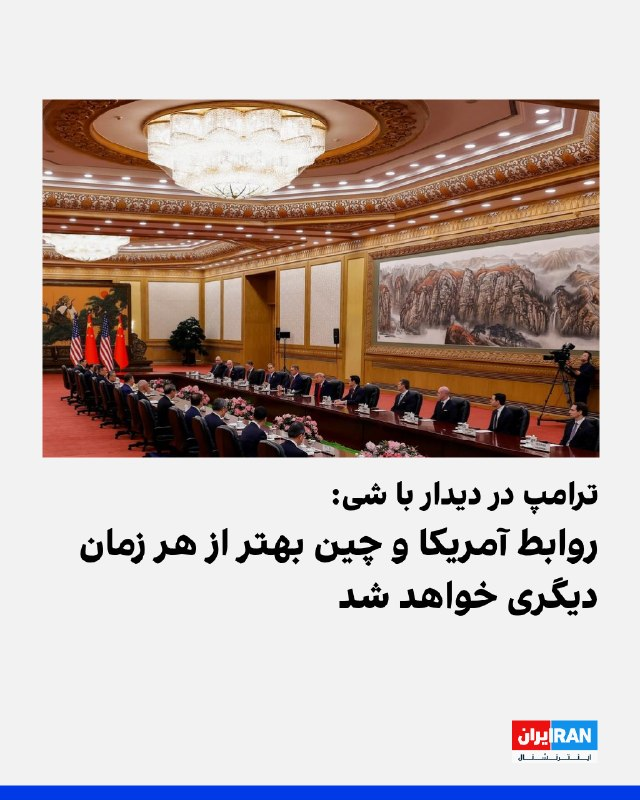

# خواننده تلگرام

<!-- TOP_NAV START -->

<!-- TOP_NAV END -->

<!-- MSG START -->

---
📅 بروزرسانی: 1405/02/24 07:47
---

## VahidOOnLine — post 240036

  

ترامپ در دیدار با شی‌جین پینگ در پکن این رویداد را «یکی بزرگ‌ترین نشست‌های تاریخ» خواند و گفت در این سفر هیئتی ۳۰ نفره از بزرگ‌ترین و بهترین بازرگانان جهان را به همراه خود آورده است.
او گفت: «ما از ۳۰ نفر برتر جهان دعوت کردیم. تک‌تک آنها پاسخ مثبت دادند. من نفر دوم یا سوم هیچ شرکتی را نمی‌خواستم؛ فقط برترین‌ها را می‌خواستم. آنها امروز اینجا هستند تا به شما و به چین ادای احترام کنند و مشتاق تجارت و انجام کسب‌وکار هستند و این روند از طرف ما کاملا متقابل خواهد بود.»
ترامپ گفت: «بسیار مشتاق گفت‌وگوی خود هستم. این گفت‌وگویی بزرگ است. برخی می‌گویند شاید این بزرگ‌ترین نشست تاریخ باشد. آنها هرگز چیزی شبیه به آن را به یاد نمی‌آورند.»

‌🏁 🇬🇧 IranintlTV

🤖 @VahidOOnLine

## VahidOOnLine — post 240035

  

♦️برخی از مشهورترین مدیران ارشد آمریکایی که همراه دونالد ترامپ سفر کرده‌اند، هنگام خروج از ورودی اصلی تالار بزرگ خلق و هم‌زمان با آغاز نشست دو رهبر، فضای صبح را مثبت و سازنده توصیف کردند.
وقتی خبرنگاران از ایلان ماسک ــ میلیاردر و بنیان‌گذار تسلا و اسپیس‌ایکس ــ پرسیدند دیدارها چگونه بوده، او پاسخ داد: «فوق‌العاده.»
او در پاسخ به این سوال که چه دستاوردی حاصل شده است، گفت: «اتفاقات خوب زیادی.»
تیم کوک، مدیرعامل اپل که قرار است اواخر امسال از سمت خود کناره‌گیری کند، ابتدا علامت صلح نشان داد و سپس انگشت شست خود را بالا برد.
جنسن هوانگ، مدیر شرکت فناوری انویدیا، نیز هنگام پایین آمدن مدیران از پله‌ها به سمت اتوبوس منتظرشان گفت: «دیدارها خوب پیش رفت. شی و رئیس‌جمهور ترامپ فوق‌العاده بودند.»
اوایل روز پنج‌شنبه، این مدیران در کنار مقام‌های دولت ترامپ روی پله‌های تالار بزرگ خلق در انتظار ورود ترامپ دیده شدند و هیات چینی نیز در نزدیکی آن‌ها حضور داشت؛ اما هنگام آغاز گفت‌وگوهای ترامپ و شی، آن‌ها داخل اتاق مذاکرات دیده نشدند.
پیش از این سفر، سخنگوی کاخ سفید گفته بود انتظار می‌رود گفت‌وگوها شامل ادامه کار روی «شورای تجارت آمریکا و چین» و «شورای سرمایه‌گذاری آمریکا و چین» باشد.
‌🇸🇦 Indypersian

🤖 @VahidOOnLine

## VahidOOnLine — post 240034

♦️دونالد ترامپ، رئیس‌جمهوری آمریکا، صبح پنجشنبه در آغاز گفتگوهای دوجانبه با شی جین‌پینگ در تالار بزرگ خلق پکن گفت روابط شخصی خوبی با رئیس‌جمهوری چین داشته و دو طرف در زمان بروز اختلاف‌ها، مشکلات را «خیلی سریع» حل کرده‌اند.
ترامپ خطاب به شی جین‌پینگ گفت: «رابطه فوق‌العاده‌ای داشتیم. هر وقت مشکلی پیش می‌آمد، من با شما تماس می‌گرفتم و شما هم با من تماس می‌گرفتید. مردم این را نمی‌دانند، اما هر وقت مشکلی داشتیم، خیلی سریع آن را حل می‌کردیم.»
او همچنین تاکید کرد آمریکا و چین «آینده فوق‌العاده‌ای» در روابط دوجانبه خواهند داشت.
‌🇸🇦 Indypersian

🤖 @VahidOOnLine

## VahidOOnLine — post 240033

  <a href="telegram/content/VahidOOnLine_240033_1778732231.mp4" target="_blank">🎬 Download video</a>

♦️رسانه‌های بین‌المللی با اشاره به استقبال گرم چین از ترامپ گزارش داده‌اند که این خوشامدگویی پرشور با صحنه‌هایی که کودکان چینی پرچم آمریکا را دار دست دارند و سرود ملی آمریکا پخش می‌شود، برای رئیس‌جمهوری آمریکا خوشایند بوده است. گاردین می‌نویسد: رئیس‌جمهور آمریکا احتمالا از تشریفات سرد و حساب‌شده‌ای که در تالار بزرگ خلق در پکن از او استقبال کرد، لذت برده است: فرش قرمز، شلیک توپ، موسیقی نظامی و نیروهایی با یونیفورم‌های تشریفاتی که با تفنگ‌های سرنیزه‌دار در صفوف منظم رژه می‌رفتند.
ترامپ برای تشویق کودکانی که با شور و حال، پرچم‌ها و گل‌ها را با نوعی ستایش نمایشی تکان می‌دادند، توقف کرد. او همچنین مشاهده کرد که شی جین‌پینگ با صمیمیت با پسرش اریک و نیز با نظریه‌پرداز راست‌گرای مورد علاقه‌اش، استیون میلر، دست داد. به گزارش این روزنامه بریتانیایی، زمانی که دو طرف در یک اتاق بزرگ و رسمی برای مذاکرات نشستند، ترامپ گفت: «این افتخاری بود که کمتر کسی در تاریخ دیده است»
‌🇸🇦 Indypersian

🤖 @VahidOOnLine

## VahidOOnLine — post 240032

  

♦️ داده‌های رهگیری کشتی ال‌اس‌ای‌جی LSEG نشان می‌دهد یک نفتکش حامل نفت خام با پرچم پاناما که توسط گروه پالایشی ژاپنی «انیوس» (Eneos) مدیریت می‌شود، از تنگه هرمز عبور کرده است؛ این دومین مورد از عبور یک کشتی مرتبط با ژاپن از این مسیر است. پیش از آنکه جنگ آمریکا و اسرائیل علیه ایران تا حد زیادی عرضه نفت از طریق تنگه هرمز را مختل کند، ژاپن حدود ۹۵ درصد واردات نفت خود را از خلیج فارس تامین می‌کرد. این نفتکش که توسط انیوس مدیریت می‌شود، حامل ۱.۲ میلیون بشکه نفت خام کویت و ۷۰۰ هزار بشکه نفت «داس بلِند» امارات است که در اواخر فوریه بارگیری شده بود. طبق داده‌های کپلر، این کشتی قرار است در ۳ ژوئن به ژاپن برسد. هنوز مشخص نیست این عبور تحت چه ترتیباتی انجام شده است. شرکت انیوس، بزرگ‌ترین گروه پالایشی ژاپن، از اظهارنظر خودداری کرده است. این عبور جدید از تنگه هرمز پس از عبور نفتکش «ایدمیتسو مارو» در اواخر آوریل رخ داده است؛ نفتکشی که نفت عربستان سعودی را حمل می‌کرد و توسط یکی از زیرمجموعه‌های شرکت ایدمیتسو کوسان Idemitsu Kosan مدیریت می‌شد. ایدمیتسو، دومین گروه بزرگ پالایش نفت ژاپن، این هفته اعلام کرد انتظار دارد تنگه هرمز بین ژوئیه تا سپتامبر دوباره بازگشایی شود و قیمت نفت شاخص دبی تا پایان سال مالی مارس ۲۰۲۷ به سطح پیش از جنگ بازگردد. به گزارش رویترز، در حالی که پالایشگاه‌های ژاپن از ذخایر استراتژیک استفاده می‌کنند و تامین جایگزین از مناطقی مانند ایالات متحده و منطقه خزر را افزایش داده‌اند، فعالیت پالایشگاه‌ها در این ماه دوباره به حالت عادی نزدیک شده و برای نخستین بار از اواخر مارس از ۷۰ درصد فراتر رفته است. یک نفتکش بسیار بزرگ چین که نفت عراق را حمل می‌کرد نیز روز چهارشنبه از تنگه عبور کرد و پیش از نشست پکن میان رهبران آمریکا و چین از خلیج فارس خارج شد.
‌🇸🇦 Indypersian

🤖 @VahidOOnLine

## VahidOOnLine — post 240031

♦️مارکو روبیو، وزیر خارجه آمریکا هنگام ورود به «تالار بزرگ خلق» در پکن به همراه ترامپ و دیگر مقامات دولت، به سقف این سالن نگاه می‌کند و سعی می‌کند توجه پیت هگست، وزیر جنگ را نیز جلب کند. این تالار در سال ۱۹۵۹ میلادی در ضلع غربی میدان تیان‌آن‌من افتتاح شد و محل برگزاری جلسات کنگره ملی خلق چین و نشست‌های رسمی دیپلماتیک (مثل دیدارهای سران کشورها) است.این ساختمان یکی از پروژه‌های بزرگ «ده ساختمان مهم» در دوره مائو تسه‌تونگ بود که با هدف نمایش قدرت و مدرن‌سازی سریع چین ساخته شد. طراحی آن ترکیبی از معماری رسمی سوسیالیستی و عناصر سنتی چینی است و روی سقف آن نقوش سنتی کلاسیک چین دیده می‌شود.
‌🇸🇦 Indypersian

🤖 @VahidOOnLine

## VahidOOnLine — post 240030

  

شی جین‌پینگ در دیدار با ترامپ در پکن ابراز امیدواری کرد سال ۲۰۲۶ سالی تاریخی و نقطه‌عطفی برای روابط چین و آمریکا باشد «تا گذشته را ادامه دهد و درها را به روی آینده بگشاید.»
شی گفت همواره معتقد بوده است منافع مشترک میان چین و آمریکا بر اختلافات دو کشور ارجحیت دارد و موفقیت پکن و واشینگتن فرصتی برای یکدیگر است.
شی ثبات روابط چین و آمریکا را برای جهان امر مثبتی دانست و گفت مشتاق است درباره مسائل مهم با ترامپ تبادل نظر کند.

‌🏁 🇬🇧 IranintlTV

🤖 @VahidOOnLine

## VahidOOnLine — post 240029

  

♦️دونالد ترامپ در دیدار با رهبر چین گفت گروهی از مدیران ارشد کسب‌وکار که همراه او به چین آمده‌اند ــ از جمله ایلان ماسک (مدیرعامل تسلا)، جنسن هوانگ (مدیرعامل انویدیا) و تیم کوک (مدیرعامل اپل)  برای «ادای احترام» و گسترش تجارت در این کشور حضور دارند.
ترامپ در سخنان آغازین خود گفت: «ما افراد فوق‌العاده‌ای داریم و همه‌شان همراه من هستند.»
او افزود: «ما از ۳۰ نفر برتر جهان دعوت کردیم. تک‌تک‌شان گفتند بله، و من نفر دوم یا سوم شرکت را نمی‌خواستم؛ فقط نفر اول را می‌خواستم. و امروز اینجا هستند تا به شما و چین ادای احترام کنند و مشتاق تجارت و انجام کسب‌وکار هستند، و این از طرف ما کاملا متقابل خواهد بود.»
ترامپ با ابراز خوش‌بینی در آغاز نشست به شی گفت: «افتخار بزرگی است که با شما هستم. افتخار بزرگی است که دوست شما باشم، و رابطه میان چین و آمریکا از همیشه بهتر خواهد شد.»
پس از مراسم استقبال رسمی، ترامپ گفت از کودکانی که در بیرون با شور و انرژی از او استقبال کردند «به‌طور ویژه تحت تاثیر قرار گرفته است».
او گفت: «آن‌ها خوشحال بودند. زیبا بودند. آن کودکان فوق‌العاده بودند و نماینده چیزهای زیادی هستند.»
‌🇸🇦 Indypersian

🤖 @VahidOOnLine

## VahidOOnLine — post 240028

  

♦️مارکو روبیو، وزیر خارجه آمریکا در گفتگو با مجری فاکس‌نیوز که در «ایرفورس وان» هنگام عزیمت او به چین انجام شد، درباره اظهارات پاپ درمورد ایران که بر دیپلماسی تاکید کرده است گفت: «چه راه‌حل دیپلماتیکی درباره آدولف هیتلر وجود داشت؟ هیچ.» او افزود و متاسفانه به جنگ منجر شد. روبیو گفت که کلیسا بر صلح و دوستی و پرهیز از جنگ تاکید دارد و من هم موافق هستم و ما خواستار جنگ نیستیم اما نسبت به امنیت ملی کشورمان وظیفه داریم و این باید در نظر گرفته شود. روبیو تاکید کرد، این وظیفه ما است که آمریکایی‌ها را در امنیت نگهداریم و به همین دلیل است که در ایران درگیر هستیم، به همین دلیل در هر کاری که در سراسر جهان انجام می‌دهیم درگیر هستیم.
‌🇸🇦 Indypersian

🤖 @VahidOOnLine

## VahidOOnLine — post 240027

  

دونالد ترامپ در دیدار با رییس‌جمهوری چین گفت روابط او و شی جین‌پینگ طولانی‌ترین رابطه میان روسای جمهور دو کشور بوده است و این موضوع را «مایه افتخار» دانست. او تاکید کرد روابط دو کشور «بهتر از هر زمان دیگری خواهد شد.»
ترامپ گفت هر زمان مشکلی پیش آمده، دو طرف مستقیما آن را حل کرده‌اند و آینده روابط واشینگتن و پکن «فوق‌العاده» خواهد بود.
ترامپ با تمجید از شی جین‌پینگ او را «رهبر بزرگی» خواند و گفت برای چین و دستاوردهایش احترام زیادی قائل است.
ترامپ این دیدار را «نشستی بزرگ» توصیف کرد و گفت در آمریکا همه درباره آن صحبت می‌کنند.

‌🏁 🇬🇧 IranintlTV

🤖 @VahidOOnLine

## VahidOOnLine — post 240026

♦️دونالد ترامپ، رئیس‌جمهوری آمریکا، در جریان سفر رسمی به پکن، مورد استقبال پرشور کودکان قرار گرفت.
در مراسم رسمی که پنجشنبه ۲۵ اردیبهشت در تالار بزرگ خلق برگزار شد، کودکان با تکان دادن پرچم‌های دو کشور و اجرای برنامه‌های ویژه از رئیس‌جمهوری آمریکا استقبال کردند.
این استقبال گرم در حالی صورت می‌گیرد که سران دو قدرت بزرگ اقتصادی جهان گفتگوهای فشرده‌ای را درباره مسائل راهبردی، از جمله امنیت آبراه‌های بین‌المللی و توازن تجاری، در دستور کار دارند.
‌🇸🇦 Indypersian

🤖 @VahidOOnLine

## VahidOOnLine — post 240025

  

♦️دونالد ترامپ و شی جین‌پینگ صبح پنجشنبه گفت‌وگوهای دوجانبه خود را در تالار بزرگ خلق، ساختمان مجلس ملی چین، آغاز کردند.
شی در سخنان آغازین خود گفت سال ۲۰۲۶ مصادف با دویست‌وپنجاهمین سال استقلال آمریکا است و افزود ثبات در روابط آمریکا و چین برای ثبات جهانی ضروری است.
ترامپ نیز گفت او و شی «مدت‌هاست یکدیگر را می‌شناسند» و شی را «رهبر بزرگی» توصیف کرد.
ترامپ خطاب به شی گفت: «من به همه می‌گویم شما رهبر بزرگی هستید. گاهی مردم دوست ندارند من این را بگویم، اما باز هم می‌گویم، چون حقیقت دارد.»ترامپ به شی گفت روابط دو کشور «بهتر از همیشه خواهد شد»
شی جین‌پینگ در سخنان افتتاحیه خود گفت همواره معتقد بوده که منافع مشترک چین و آمریکا بر اختلافات میان دو کشور غلبه دارد.
او همچنین گفت موفقیت چین و آمریکا برای یکدیگر یک فرصت است.
ترامپ نیز در پاسخ به او گفت روابط دو کشور «بهتر از همیشه خواهد شد.»شی جین‌پینگ در آغاز سخنان خود با توصیف وضعیت پرتنش جهانی گفت جهان «به یک نقطه عطف جدید رسیده است».
او گفت اکنون این پرسش مطرح است که «آیا چین و ایالات متحده می‌توانند از به‌اصطلاح «دام توسیدید»عبور کنند و الگوی جدیدی از روابط میان قدرت‌های بزرگ را پایه‌گذاری کنند»؛ اصطلاحی که به گرایش به درگیری زمانی اشاره دارد که یک قدرت نوظهور، قدرتی مسلط را به چالش می‌کشد.
شی افزود: «ما باید به‌جای رقیب بودن، شریک باشیم؛ برای موفقیت یکدیگر تلاش کنیم، با هم شکوفا شویم و شیوه‌ای درست برای همزیستی قدرت‌های بزرگ در عصر جدید ایجاد کنیم.»
ترامپ نیز از «روابط فوق‌العاده» خود با شی تمجید کرد.
او افزود هیات آمریکایی مشتاق گفت‌وگو درباره تجارت متقابل است و حضور در این نشست را «افتخار» دانست.
‌🇸🇦 Indypersian

🤖 @VahidOOnLine

## VahidOOnLine — post 240024

شی جین‌پینگ، رئیس‌جمهوری چین، پنجشنبه ۲۵ اردیبهشت در تالار بزرگ خلق در پکن از دونالد ترامپ، رئیس‌جمهوری آمریکا، و هیات همراه او استقبال کرد.

همزمان با ورود ترامپ به این مجموعه حکومتی، سرود ملی آمریکا نواخته شد و گارد احترام ارتش چین مراسم رژه برگزار کرد. گروه موزیک نظامی نیز مارش رسمی اجرا کرد.
ترامپ و شی جین‌پینگ در ادامه در کنار یکدیگر روی فرش قرمز قدم زدند و از نیروهای نظامی بازدید کردند.

در بخش دیگری از مراسم، گروهی از کودکان و دانش‌آموزان با در دست داشتن گل و پرچم‌های کوچک چین و آمریکا از دو رهبر استقبال کردند.

انتظار می‌رود دو طرف درباره روابط دوجانبه، تحولات خاورمیانه، جنگ و مسائل اقتصادی گفتگو کنند.
‌🇸🇦 Indypersian

🤖 @VahidOOnLine

## VahidOOnLine — post 240023

  

ترامپ و شی‌جین‌ پینگ صبح پنج‌شنبه به وقت محلی در مراسم استقبال و رژه نظامیان چین در مقابل «تالار بزرگ خلق» در پکن حضور یافتند. در این مراسم روسای جمهوری آمریکا و چین از نیروهای نظامی سان دیدند.
‌🏁 🇬🇧 IranintlTV

🤖 @VahidOOnLine

## VahidOOnLine — post 240022

  

مارکو روبیو، وزیر خارجه آمریکا، به فاکس‌نیوز گفت تهدید جمهوری اسلامی قابل مصالحه نیست، زیرا حکومت روحانیون در پی دستیابی به سلاح هسته‌ای است. روبیو تاکید کرد جهان به رهبری ترامپ اجازه نخواهد داد جمهوری اسلامی به چنین سلاحی دست پیدا کند.
او افزود تهران قصد داشت با انباشت گسترده پهپاد و موشک، نوعی «مصونیت» برای خود ایجاد کند تا هیچ کشوری نتواند به آن حمله کند و سپس به سمت ساخت سلاح هسته‌ای حرکت کند.
روبیو تاکید کرد رئیس‌جمهور ترامپ اجازه نخواهد داد چنین سناریویی محقق شود.

‌🏁 🇬🇧 IranintlTV

🤖 @VahidOOnLine

## VahidOOnLine — post 240021

دونالد ترامپ، رئیس‌جمهوری آمریکا، پنجشنبه ۲۵ اردیبهشت در تالار بزرگ خلق در پکن، در مراسمی رسمی مورد استقبال شی جین‌پینگ، رئیس‌جمهوری چین، قرار گرفت.
رسانه‌های دولتی چین اعلام کردند دیدار رهبران دو کشور در پکن آغاز شده است. انتظار می‌رود دو طرف درباره روابط دوجانبه، تحولات خاورمیانه، جنگ و مسائل اقتصادی گفتگو کنند.
‌🇸🇦 Indypersian

🤖 @VahidOOnLine

## VahidOOnLine — post 240020

  

مایک والتز، سفیر آمریکا در سازمان ملل، با اشاره به حمایت ۱۱۳ کشور از پیش‌نویس قطعنامه شورای امنیت در محکومیت اقدامات جمهوری اسلامی، گفت تهران به دلیل اقدامات غیرقانونی خود، از جمله مین‌گذاری و اعمال عوارض بر کشتیرانی در تنگه هرمز، «منزوی» شده است.
والتز در ایکس نوشت کشورهایی از جمله هند، ژاپن و کره جنوبی از این ابتکار حمایت کرده‌اند.

‌🏁 🇬🇧 IranintlTV

🤖 @VahidOOnLine

## VahidOOnLine — post 240018

  

♦️شی جین‌پینگ، رئیس‌جمهوری چین، بامداد پنجشنبه ۲۵ اردیبهشت در مراسمی رسمی در تالار بزرگ خلق در پکن از دونالد ترامپ، رئیس‌جمهوری آمریکا، استقبال کرد.
‌🇸🇦 Indypersian

🤖 @VahidOOnLine

## VahidOOnLine — post 240017

  

♦️همزمان با ادامه محاصره بنادر ایران از سوی آمریکا، خبرگزاری بلومبرگ با استناد به تصاویر ماهواره‌ای گزارش داد مخازن نفت در جزیره خارگ به حداکثر ظرفیت ذخیره‌سازی نزدیک شده است.

بر اساس این تصاویر، طی روزهای ۱۸، ۱۹ و ۲۱ اردیبهشت‌ماه هیچ نفتکش فعالی در نزدیکی جزیره خارگ برای صادرات نفت شناسایی نشده و تمام اسکله‌های این جزیره خالی از کشتی بوده است.
ایران پیش از این برای دور زدن محدودیت‌های ایجادشده از سوی نیروی دریایی آمریکا، بارگیری نفتکش‌ها در خارگ را ادامه داده و از آنها به‌عنوان مخازن شناور استفاده می‌کرد.

تصاویر ماهواره‌ای همچنین نشان می‌دهد سطح نفت در مخازن ذخیره‌سازی جزیره به‌شدت افزایش یافته و ظرفیت باقی‌مانده ذخیره‌سازی تقریبا به صفر نزدیک شده است. به گزارش بلومبرگ، در صورت پر شدن کامل مخازن، ایران ممکن است ناچار شود تولید نفت در برخی میدان‌ها را کاهش دهد.

همزمان شمار نفتکش‌های مستقر در شرق جزیره خارگ نیز افزایش یافته و تعداد آنها از سه نفتکش در شنبه ۲۲ فروردین‌ماه، به دست‌کم ۱۸ نفتکش با اندازه‌های مختلف تا دوشنبه ۲۱ اردیبهشت‌ماه رسیده است.
‌🇸🇦 Indypersian

🤖 @VahidOOnLine

## VahidOOnLine — post 240016

  

♦️به گزارش وال‌استریت ژورنال، پنتاگون به‌طور ناگهانی اعزام یک تیپ زرهی ارتش آمریکا به لهستان را لغو کرد؛ تصمیمی که بخشی از برنامه دولت دونالد ترامپ برای کاهش حضور نظامی آمریکا در اروپا توصیف شده است. این اقدام در حالی انجام شد که بخشی از تجهیزات و نیروهای این تیپ زرهی موسوم به «بلک جک» پیش‌تر در مسیر استقرار قرار داشتند.
بر اساس این گزارش، وزارت دفاع آمریکا پیش‌تر نیز از کاهش ۵ هزار نیروی آمریکایی در آلمان خبر داده بود؛ تصمیمی که پس از انتقادهای تند فریدریش مرتس، صدراعظم آلمان، از کاخ سفید علنی شد.
وال‌استریت ژورنال نوشت برخی فرماندهان ارتش آمریکا انتظار داشتند روند کاهش نیروها به‌صورت تدریجی و برنامه‌ریزی‌شده انجام شود، اما پیت هگست، وزیر دفاع آمریکا، روند این کاهش را تسریع کرده و تصمیم به توقف اعزام تیپ زرهی را در میانه مسیر گرفته است؛ اقدامی که شماری از مقام‌های نظامی را غافلگیر کرد.
این گزارش می‌افزاید دولت ترامپ قصد دارد سطح نیروهای آمریکایی در اروپا را به میزان پیش از حمله روسیه به اوکراین در سال ۲۰۲۲ بازگرداند. همزمان، پنتاگون تاکید کرده کشورهای اروپایی باید مسئولیت بیشتری در دفاع متعارف از قاره اروپا برعهده بگیرند و آمریکا تمرکز خود را بر دفاع داخلی و منطقه هند و اقیانوس آرام معطوف خواهد کرد.
‌🇸🇦 Indypersian

🤖 @VahidOOnLine

## FoxNewsTwitter — post 341698

  <a href="telegram/content/FoxNewsTwitter_341698_1778732238.mp4" target="_blank">🎬 Download video</a>

Fox News (Twitter/X)

NOW: President Trump calls Chinese President Xi Jinping a "great leader."

"Sometimes people don't like me saying it, but I say it anyway, because it's true — I always say the truth."

## FoxNewsTwitter — post 341697

  

Fox News (Twitter/X)

NOW: President Trump expressed high hopes for U.S.-China relations at the Great Hall of the People, telling President Xi Jinping it is an honor to be his friend and predicting the partnership will be stronger than ever before.

## FoxNewsTwitter — post 341696

  <a href="telegram/content/FoxNewsTwitter_341696_1778732240.mp4" target="_blank">🎬 Download video</a>

Fox News (Twitter/X)

NOW: President Trump says "it's an honor" after meeting Chinese President Xi Jinping.

"It's an honor to be with you, it's an honor to be your friend, and the relationship between China and the USA is going to be better than ever before."

## FoxNewsTwitter — post 341695

  <a href="telegram/content/FoxNewsTwitter_341695_1778732241.mp4" target="_blank">🎬 Download video</a>

Fox News (Twitter/X)

NOW: President Trump thanks Chinese President Xi Jinping for welcoming him to Beijing, saying he was particularly impressed with the crowd of cheering children during the welcome ceremony.

## FoxNewsTwitter — post 341694

  <a href="telegram/content/FoxNewsTwitter_341694_1778732243.mp4" target="_blank">🎬 Download video</a>

Fox News (Twitter/X)

NOW: President Trump watches a ceremony with Chinese President Xi Jinping after arriving at the Great Hall of People in Beijing.

## FoxNewsTwitter — post 341693

  <a href="telegram/content/FoxNewsTwitter_341693_1778732245.mp4" target="_blank">🎬 Download video</a>

Fox News (Twitter/X)

BREAKING: President Trump receives a warm welcome at the Great Hall of People in Beijing for his meeting with President Xi Jinping.

## FoxNewsTwitter — post 341692

  <a href="telegram/content/FoxNewsTwitter_341692_1778732247.mp4" target="_blank">🎬 Download video</a>

Fox News (Twitter/X)

BREAKING: Chinese President Xi Jinping shakes hands with Secretary Rubio, Secretary Bessent and more in China as he walks with President Trump.

## FoxNewsTwitter — post 341691

  <a href="telegram/content/FoxNewsTwitter_341691_1778732249.mp4" target="_blank">🎬 Download video</a>

Fox News (Twitter/X)

BREAKING: President Trump meets Chinese President Xi Jinping at the Great Hall of People in Beijing.

## FoxNewsTwitter — post 341690

  <a href="telegram/content/FoxNewsTwitter_341690_1778732251.mp4" target="_blank">🎬 Download video</a>

Fox News (Twitter/X)

BREAKING: Chinese President Xi Jinping walks out for his meeting with President Trump.

## FoxNewsTwitter — post 341689

  <a href="telegram/content/FoxNewsTwitter_341689_1778732253.mp4" target="_blank">🎬 Download video</a>

Fox News (Twitter/X)

"There is no economy in Cuba."

Secretary Rubio says he doesn't believe the economic trajectory of Cuba can change under the current government.

## FoxNewsTwitter — post 341688

  <a href="telegram/content/FoxNewsTwitter_341688_1778732255.mp4" target="_blank">🎬 Download video</a>

Fox News (Twitter/X)

NEW: Secretary Rubio says stepping behind the White House press secretary podium wasn't "too bad," but he's not sure if he'd have fun if he had to do it every week.

"Karoline is irreplaceable....We can't wait until Karoline gets back." |@seanhannity

## FoxNewsTwitter — post 341687

  

Fox News (Twitter/X)

WATCH LIVE: President Trump and President Xi Jinping meet for bilateral talks https://twitter.com/i/broadcasts/1nJOLEBAamlxR

## FoxNewsTwitter — post 341686

  <a href="telegram/content/FoxNewsTwitter_341686_1778732257.mp4" target="_blank">🎬 Download video</a>

Fox News (Twitter/X)

.@seanhannity: "What is your read on President Xi?"

SECRETARY RUBIO: "China has a plan...they believe they will be the world's most powerful country."

"We're not trying to constrain China, but their rise cannot come at our expense."

## FoxNewsTwitter — post 341685

  <a href="telegram/content/FoxNewsTwitter_341685_1778732259.mp4" target="_blank">🎬 Download video</a>

Fox News (Twitter/X)

SENATOR MURRAY: "Do you seriously believe there's abortion in the water, like some of the far-right activists are suggesting?"

EPA ADMIN ZELDIN: "You just said abortion in the water?"

MURRAY: "That's what some far-right activists are saying. That they have an audience, in the EPA, on that absurd issue."

ZELDIN: "I have not had a conversation with anyone at the agency as far as abortions in water."

"I don't even know what you're talking about."

## pm_afshaa — post 90711

🔴روبیو: واشنگتن به پکن روشن کرد که هرگونه حمایت از ایران به روابط دوجانبه آسیب می رساند

💧 Rainbet.com the #1 Non-KYC Crypto Casino & Sportsbook @rainbetcom

😁 @Pm_Afshaa

## DEJradio — post 4622

  <a href="telegram/content/DEJradio_4622_1778732261.mp4" target="_blank">🎬 Download video</a>

🚨
🔸 خبر ۲۱
چهارشنبه ۲۳ اردیبهشت ۱۴۰۵

#خبر۲۱
@DEJradio

## mamlekate — post 103524

📝 جی‌دی‌ ونس در مورد در مذاکرات با جمهوری اسلامی: فکر می‌کنم پیشرفت‌هایی حاصل شده است

جی‌دی ونس، معاون رئیس‌جمهوری آمریکا، روز چهارشنبه در گفت‌وگو با خبرنگاران گفت که در مذاکرات با جمهوری اسلامی پیشرفت‌هایی حاصل شده است.

@mamlekate

## mamlekate — post 103523

📝 دولت اسرائیل: نتانیاهو در جریان عملیات «غرش شیران» در سفری محرمانه با رئیس امارات دیدار کرد

دفتر نخست‌وزیر اسرائیل روز چهارشنبه ۲۳ اردیبهشت با انتشار پیامی در ایکس اعلام کرد: «بنیامین نتانیاهو، نخست‌وزیر اسرائیل، در بحبوحه عملیات شیر غران، مخفیانه از امارات متحده عربی بازدید کرد و در آن‌جا با شیخ محمد بن زاید، رئیس امارات، دیدار کرد.»

📝 امارات «گزارش‌ها درباره سفر نخست‌وزیر اسرائیل» را تکذیب کرد

وزارت امور خارجه امارات در بیانیه‌ای «گزارش‌های منتشرشده درباره سفر ادعایی بنیامین نتانیاهو، نخست‌وزیر اسرائیل، به امارات یا پذیرش هرگونه هیئت نظامی اسرائیلی در این کشور را» تکذیب کرد.

📝 نماینده آمریکا استقرار «گنبد آهنین» در امارات را تأیید کرد

@mamlekate

## VahidOnline — post 75455

  <a href="telegram/content/VahidOnline_75455_1778732263.mp4" target="_blank">🎬 Download video</a>

خبرگزاری مهر پرچم حزب‌الله را در ویدیوی مربوط به بدرقه فوتبالیست‌ها سانسور کرد.
FattahiFarzad
اعضای تیم فوتبال چهارشنبه‌شب ۲۳ اردیبهشت‌ماه در میدان انقلاب تهران برای حضور در جام جهانی ۲۰۲۶ بدرقه شدند؛ رقابت‌هایی که خرداد و تیر ۱۴۰۵ به میزبانی مشترک آمریکا، مکزیک و کانادا برگزار خواهد شد.
@VahidOOnLine

📡 @VahidOnline

## IranIntlTV — post 337099

  

ترامپ در دیدار با شی‌جین پینگ در پکن این رویداد را «یکی بزرگ‌ترین نشست‌های تاریخ» خواند و گفت در این سفر هیئتی ۳۰ نفره از بزرگ‌ترین و بهترین بازرگانان جهان را به همراه خود آورده است.
او گفت: «ما از ۳۰ نفر برتر جهان دعوت کردیم. تک‌تک آنها پاسخ مثبت دادند. من نفر دوم یا سوم هیچ شرکتی را نمی‌خواستم؛ فقط برترین‌ها را می‌خواستم. آنها امروز اینجا هستند تا به شما و به چین ادای احترام کنند و مشتاق تجارت و انجام کسب‌وکار هستند و این روند از طرف ما کاملا متقابل خواهد بود.»
ترامپ گفت: «بسیار مشتاق گفت‌وگوی خود هستم. این گفت‌وگویی بزرگ است. برخی می‌گویند شاید این بزرگ‌ترین نشست تاریخ باشد. آنها هرگز چیزی شبیه به آن را به یاد نمی‌آورند.»

https://iranintl.com/202605149590

## IranIntlTV — post 337098

  

شی جین‌پینگ در دیدار با ترامپ در پکن ابراز امیدواری کرد سال ۲۰۲۶ سالی تاریخی و نقطه‌عطفی برای روابط چین و آمریکا باشد «تا گذشته را ادامه دهد و درها را به روی آینده بگشاید.»
شی گفت همواره معتقد بوده است منافع مشترک میان چین و آمریکا بر اختلافات دو کشور ارجحیت دارد و موفقیت پکن و واشینگتن فرصتی برای یکدیگر است.
شی ثبات روابط چین و آمریکا را برای جهان امر مثبتی دانست و گفت مشتاق است درباره مسائل مهم با ترامپ تبادل نظر کند.

https://iranintl.com/202605141916

## IranIntlTV — post 337097

  

دونالد ترامپ در دیدار با رییس‌جمهوری چین گفت روابط او و شی جین‌پینگ طولانی‌ترین رابطه میان روسای جمهور دو کشور بوده است و این موضوع را «مایه افتخار» دانست. او تاکید کرد روابط دو کشور «بهتر از هر زمان دیگری خواهد شد.»
ترامپ گفت هر زمان مشکلی پیش آمده، دو طرف مستقیما آن را حل کرده‌اند و آینده روابط واشینگتن و پکن «فوق‌العاده» خواهد بود.
ترامپ با تمجید از شی جین‌پینگ او را «رهبر بزرگی» خواند و گفت برای چین و دستاوردهایش احترام زیادی قائل است.
ترامپ این دیدار را «نشستی بزرگ» توصیف کرد و گفت در آمریکا همه درباره آن صحبت می‌کنند.

https://iranintl.com/202605147699

## IranIntlTV — post 337096

  

ترامپ و شی‌جین‌ پینگ صبح پنج‌شنبه به وقت محلی در مراسم استقبال و رژه نظامیان چین در مقابل «تالار بزرگ خلق» در پکن حضور یافتند. در این مراسم روسای جمهوری آمریکا و چین از نیروهای نظامی سان دیدند.
https://iranintl.com/202605146912

## IranIntlTV — post 337095

  

مارکو روبیو، وزیر خارجه آمریکا، به فاکس‌نیوز گفت تهدید جمهوری اسلامی قابل مصالحه نیست، زیرا حکومت روحانیون در پی دستیابی به سلاح هسته‌ای است. روبیو تاکید کرد جهان به رهبری ترامپ اجازه نخواهد داد جمهوری اسلامی به چنین سلاحی دست پیدا کند.
او افزود تهران قصد داشت با انباشت گسترده پهپاد و موشک، نوعی «مصونیت» برای خود ایجاد کند تا هیچ کشوری نتواند به آن حمله کند و سپس به سمت ساخت سلاح هسته‌ای حرکت کند.
روبیو تاکید کرد رئیس‌جمهور ترامپ اجازه نخواهد داد چنین سناریویی محقق شود.

https://iranintl.com/202605146709

## IranIntlTV — post 337094

  

مایک والتز، سفیر آمریکا در سازمان ملل، با اشاره به حمایت ۱۱۳ کشور از پیش‌نویس قطعنامه شورای امنیت در محکومیت اقدامات جمهوری اسلامی، گفت تهران به دلیل اقدامات غیرقانونی خود، از جمله مین‌گذاری و اعمال عوارض بر کشتیرانی در تنگه هرمز، «منزوی» شده است.
والتز در ایکس نوشت کشورهایی از جمله هند، ژاپن و کره جنوبی از این ابتکار حمایت کرده‌اند.

https://iranintl.com/202605145787

## IranIntlTV — post 337093

  

مایک والتز، سفیر آمریکا در سازمان ملل، با اشاره به حمایت ۱۱۳ کشور از پیش‌نویس قطعنامه شورای امنیت در محکومیت اقدامات جمهوری اسلامی، گفت تهران به دلیل اقدامات غیرقانونی خود، از جمله مین‌گذاری و اعمال عوارض بر کشتیرانی در تنگه هرمز، «منزوی» شده است.
والتز در ایکس نوشت کشورهایی از جمله هند، ژاپن و کره جنوبی از این ابتکار حمایت کرده‌اند.

https://iranintl.com/202605145787

## IranIntlTV — post 337092

  

نمایندگی جمهوری اسلامی در سازمان ملل در بیانیه‌ای گفت حمایت بسیاری از کشورها از پیش‌نویس قطعنامه مورد حمایت واشینگتن علیه جمهوری اسلامی تحت «فشار سیاسی، اجبار و حتی تهدید» بوده است و این قطعنامه را «پوشش سیاسی برای اقدامات غیرقانونی» دانست.
این بیانیه افزود: «هیچ میزان از همراهی‌های مشترک تحمیلی، از جمله محاصره دریایی، حمله به کشتی‌های تجاری ایران و توقیف غیرقانونی آنها، و گروگان‌گیری خدمه این کشتی‌ها به شیوه‌ای شبیه به دزدی دریایی، نمی‌تواند اقدامات مداوم و ناقض حقوق بین‌الملل واشینگتن علیه جمهوری اسلامی را مشروعیت ببخشد.»

https://iranintl.com/202605145471

## IranIntlTV — post 337091

  <a href="telegram/content/IranIntlTV_337091_1778732268.mp4" target="_blank">🎬 Download video</a>

ویدیوهای منتشرشده در رسانه‌های حکومتی نشان می‌دهد ماموران جمهوری اسلامی، شامگاه چهارشنبه ۲۳ اردیبهشت، پهپاد شاهد ۱۳۶ را در دو مدل رنگی صورتی و آبی به شهر پیشوا برده‌اند تا مردم برای دیدن پهپادهای رنگی جمع شوند.

## FarsiVOA — post 217696

  <a href="telegram/content/FarsiVOA_217696_1778732270.mp4" target="_blank">🎬 Download video</a>

⚡️گزارش فرهاد فلاحی از چین؛ واشنگتن از پکن در ارتباط با جمهوری اسلامی چه می‌خواهد؟
@FarsiVOA

## FarsiVOA — post 217695

⚡️مردم درباره سفر پرزيدنت ترامپ به چین چه می‌گویند؟
@FarsiVOA

## FarsiVOA — post 217694

⚡️گفت‌وگو با مسعود کاظم‌زاده و ابراهیم روشندل درباره انتظارات از سفر رئيس جمهوری آمریکا به چین
@FarsiVOA

## FarsiVOA — post 217693

⚡️راهبرد چین در خلیج فارس؛ انرژی حرف اول را می‌زند
@FarsiVOA

## FarsiVOA — post 217692

  <a href="telegram/content/FarsiVOA_217692_1778732271.mp4" target="_blank">🎬 Download video</a>

⚡️چه توقعات اقتصادی می‌توان از سفر دونالد ترامپ به چین داشت؟ گفت‌وگو با نادر حبیبی
@FarsiVOA

## FarsiVOA — post 217691

  <a href="telegram/content/FarsiVOA_217691_1778732272.mp4" target="_blank">🎬 Download video</a>

⚡️گزارش خبرنگار اعزامی صدای آمریکا از سفر رئیس جمهوری آمریکا به چین
@FarsiVOA

## FarsiVOA — post 217690

  <a href="telegram/content/FarsiVOA_217690_1778732273.mp4" target="_blank">🎬 Download video</a>

⚡️سخنان آغازین دونالد ترامپ، رئیس جمهوری آمریکا در دیدار با رئیس جمهوری چین پس از مراسم استقبال رسمی
@FarsiVOA

## FarsiVOA — post 217689

⚡️آیا چین اراده و قدرت این را دارد که جمهوری اسلامی را وادار کند از ناامن‌سازی تنگه هرمز دست بر دارد؟
@FarsiVOA

## FarsiVOA — post 217688

⚡️چه انتظاری از سفر پرزیدنت ترامپ به چین می‌‌توان داشت؟ گفت‌وگو با شهیر شهیدثالث و شکریا برادوست
@FarsiVOA

## FarsiVOA — post 217687

  <a href="telegram/content/FarsiVOA_217687_1778732273.mp4" target="_blank">🎬 Download video</a>

⚡️ادامه خاموشی اینترنت و اعدام‌ها درایران؛ واکنش کاربران
@FarsiVOA

## FarsiVOA — post 217686

⚡️مراسم استقبال رسمی از دونالد ترامپ رئیس جمهوری آمریکا، در چین
@FarsiVOA

## FarsiVOA — post 217685

  

⚡️دونالد ترامپ، رئیس جمهوری آمریکا روز پنج‌شنبه به وقت پکن مورد استقبال رسمی شی جین‌پینگ، رئیس جمهوری چین قرار گرفت. آقای ترامپ در راس یک هئیت عالی‌رتبه سیاسی و اقتصادی وارد چین شده است. انتظار می‌رود که مسئله تنگه هرمز یکی از مسائل مورد گفت‌وگو در این سفر باشد.
@FarsiVOA

## FarsiVOA — post 217684

⚡️تحریم‌های مرتبط با جمهوری اسلامی علیه نهادهای چینی چه اثری دارد؟
@FarsiVOA

## FarsiVOA — post 217683

⚡️نویسندگان زندانی، تصویر ترسناک جهان امروز
@FarsiVOA

## FarsiVOA — post 217682

  <a href="telegram/content/FarsiVOA_217682_1778732275.mp4" target="_blank">🎬 Download video</a>

⚡️ايران، كشورى كه آفلاين است
@FarsiVOA

## FarsiVOA — post 217681

⚡️نشست «عراق در خاورمیانه جدید» در اندیشکده آتلانتیک
@FarsiVOA

## FarsiVOA — post 217680

⚡️جی دی ونس، معاون رئیس جمهوری آمریکا: در مذاکرات با جمهوری اسلامی پیشرفت‌هایی حاصل شده است
@FarsiVOA

## FarsiVOA — post 217679

⚡️شروط آمریکا برای عادی‌سازی روابط با طالبان
@FarsiVOA

## FarsiVOA — post 217678

⚡️تازه‌ترین مواضع قانون‌گذاران آمریکایی در کنگره
@FarsiVOA

## FarsiVOA — post 217677

⚡️آنچه دولت علی الزیدی برای عراق به ارمغان نمی‌آورد؟
@FarsiVOA

## Persian_Trend_Official — post 14086

  <a href="telegram/content/Persian_Trend_Official_14086_1778732275.mp4" target="_blank">🎬 Download video</a>

صبحتون بخیر ☕️

📝 Nick
📌 @persian_trend_official
پرشین ترند | متفاوت‌ترین کانال نظامی

## Persian_Trend_Official — post 14085

🔴 روبیو: امیدواریم چین ایران را به عقب‌نشینی از رفتارهایش متقاعد کند

💢مارکو روبیو، وزیر خارجه آمریکا، اعلام کرد واشینگتن امیدوار است چین نقش فعال‌تری برای متقاعد کردن ایران به عقب‌نشینی از رفتارهایش در منطقه ایفا کند.

▪️روبیو همچنین گفت:

▪️ آمریکا به‌دنبال مدیریت راهبردی روابط پیچیده خود با چین است
▪️ چین بزرگ‌ترین چالش ژئوپلیتیکی و سیاسی پیش‌روی آمریکا محسوب می‌شود
▪️ واشینگتن خواهان جلوگیری از تشدید تنش‌ها در منطقه است

🫆:Tony

📌 @persian_trend_official
پرشین ترند | متفاوت‌ترین کانال نظامی

## Persian_Trend_Official — post 14084

🔴 واشینگتن‌پست: چین از جنگ ایران سود راهبردی می‌برد

💢روزنامه «واشینگتن‌پست» به‌نقل از یک گزارش محرمانه اطلاعاتی آمریکا مدعی شد چین در حال کسب مزایای راهبردی از جنگ ایران است؛ در حالی که آمریکا منابع نظامی و اقتصادی خود را در این درگیری مصرف می‌کند.

▪️بر اساس این ارزیابی:

▪️ چین در جریان حملات ایران، به کشورهای خلیج فارس تسلیحات فروخته است
▪️ پکن به برخی کشورها برای مدیریت بحران انرژی پس از بسته‌شدن تنگه هرمز کمک کرده است
▪️ جنگ باعث کاهش ذخایر موشکی و سامانه‌های دفاعی آمریکا شده و نگرانی‌هایی درباره آمادگی واشینگتن برای درگیری احتمالی بر سر تایوان ایجاد کرده است
▪️ چین عملیات‌های نظامی آمریکا را زیر نظر دارد و از پیام‌های ضدجنگ برای نمایش آمریکا به‌عنوان عامل بی‌ثباتی استفاده می‌کند

💢تحلیلگران معتقدند ادامه این درگیری می‌تواند نفوذ جهانی چین را افزایش داده و جایگاه آمریکا نزد متحدانش را تضعیف کند.

🫆:Tony

📌 @persian_trend_official
پرشین ترند | متفاوت‌ترین کانال نظامی

## Persian_Trend_Official — post 14083

  

🔴 ترامپ: آمریکا برای پایان جنگ با ایران به کمک چین نیاز ندارد

💢دونالد ترامپ اعلام کرد آمریکا برای پایان دادن به جنگ با ایران و کاهش تنش‌ها در تنگه هرمز، نیازی به کمک چین ندارد.

▪️ «فکر نمی‌کنم برای موضوع ایران به کمکی نیاز داشته باشیم»
▪️ «به هر شکلی پیروز خواهیم شد؛ چه از راه صلح و چه غیر از آن»

💢گزارش‌ها حاکی است موضوع جنگ ایران در دیدار ترامپ و شی جین‌پینگ طی دو روز آینده مطرح خواهد شد، اما ترامپ نقش پکن در پایان درگیری را کم‌اهمیت توصیف کرده است.

در همین حال، رسانه‌ها گزارش می‌دهند در ایران نیز دیدار ترامپ و رئیس‌جمهور چین تهدیدی برای روابط تهران و پکن تلقی نمی‌شود.

بر اساس این گزارش:

▪️ مقام‌ها و تحلیلگران ایرانی روابط دو کشور را «راهبردی و مستقل» توصیف می‌کنند
▪️ به توافق ۲۵ ساله ایران و چین که در سال ۲۰۲۰ امضا شد اشاره شده است
▪️ این توافق حوزه‌های سیاسی، اقتصادی و فرهنگی را شامل می‌شود

🫆:Tony

📌 @persian_trend_official
پرشین ترند | متفاوت‌ترین کانال نظامی

## Persian_Trend_Official — post 14082

  <a href="telegram/content/Persian_Trend_Official_14082_1778732277.webm" target="_blank">🎬 Download video</a>

🔴دیوار نوشته‌ای در تهران؛

💢ورود سگ‌ها و آمریکایی‌ها به تنگهٔ هرمز ممنوع...🚫

🫆:Tony

📌 @persian_trend_official
پرشین ترند | متفاوت‌ترین کانال نظامی

## IranianMinds — post 20097

🔴 مارکو روبیو:

واشنگتن به پکن روشن کرد که هرگونه حمایت از ایران به روابط دوجانبه آسیب می رساند

@IranianMinds

## IranianMinds — post 20096

  <a href="telegram/content/IranianMinds_20096_1778732277.mp4" target="_blank">🎬 Download video</a>

🔴 لحظه ی دیدار ترامپ و رئیس جمهور‌ چین

@IranianMinds

## BBCPersian — post 280991

🔻ترامپ به شی: از دوستی با شما افتخار می‌کنم

دونالد ترامپ، در سخنان آغازين خود گفت که ديدار امروز با شی جين پينگ «باعث افتخار» او است.

آقای ترامپ گفت: «ما روابط خوبی داشته‌ايم و هر زمان مشکلی پيش آمده، آن را حل کرده‌ايم. من به شما زنگ می‌زدم و شما هم به من زنگ می‌زديد.»

او افزود: «مردم نمی‌دانند، اما هر وقت مشکلی داشتيم، خيلی سريع آن را حل می‌کرديم.»

رئیس جمهور آمریکا همچنين خطاب به همتای چینی خود گفت: «هميشه به همه می‌گويم که شما يک رهبر بزرگ هستيد.»

وی گفت که در اين سفر «بهترين [رهبران تجاری] جهان» را همراه خود آورده است. او افزود: «امروز فقط برترين افراد اينجا حضور دارند تا به شما ادای احترام کنند.»

آقای ترامپ ادامه داد که برخی اين نشست را «بزرگ‌ترين اجلاس تاريخ» توصيف کرده‌اند و گفت که «بسيار مشتاق» گفت‌وگوهای پيش رو است.

او در پايان گفت: «بودن در کنار شما افتخار است و افتخار می‌کنم که دوست شما هستم»، و افزود روابط ايالات متحده امريکا و چين «بهتر از هر زمان ديگری خواهد شد.»

مارکو روبیو، وزیر خارجه؛ پیت هگست، وزیر دفاع (جنگ)؛ اسکات بسنت، وزیر دارایی آمریکا به همراه مدیران اقتصادی چون ایلان ماسک، تیم کوک و کلی اورتبرگ (بوئینگ) همراه آقای ترامپ در سفر هستند.

https://bbc.in/4tvc7Wr
@BBCPersian

## BBCPersian — post 280990

🔻شی جین پینگ: جهان دیدار ما را زیر نظر دارد

در سخنان آغازين دیدار با دونالد ترامپ، شی جين پينگ گفت: «تمام جهان نشست ما را زير نظر دارد. در حال حاضر، تحولاتی که در يک قرن گذشته بی‌سابقه بوده‌اند، با شتاب در سراسر جهان در حال وقوع است و وضعيت بين‌المللی سيال و پرتلاطم شده است.»

او افزود: «جهان به يک دوراهی تازه رسيده است. آيا چين و امريکا می‌توانند از «دام توسيديد» عبور کنند و الگويی جديد برای روابط دوجانبه ايجاد کنند؟ آيا می‌توانيم با چالش‌های جهانی مشترکا مقابله کرده و ثبات بيشتری برای جهان فراهم آوريم؟ آيا می‌توانيم به خاطر جهان، مردم دو کشور و آينده بشريت، آينده‌ای روشن‌تر برای روابط دوجانبه خود بسازيم؟»

(اصطلاح «دام توسیدید» که رئیس جمهور چین به کار برده، اشاره به مثال تاریخی یونان باستان و جنگ میان اسپارت و آتن دارد که اشاره‌ای به تنش میان یک قدرت نوظهور با قدرت فعلی است که اوضاع را به سوی جنگ و رویارویی می‌کشاند.)

آقای شی ادامه داد: «اينها پرسش‌هايی حياتی برای تاريخ، جهان و مردم هستند. اينها پرسش‌های زمانه ما هستند که من و شما به عنوان رهبران قدرت‌های بزرگ بايد به آنها پاسخ دهيم.»

او همچنين دويست و پنجاهمين سالگرد استقلال ايالات متحده امريکا را به دونالد ترامپ و مردم امريکا تبريک گفت.

آقای شی گفت: «من همواره باور داشته‌ام که دو کشور ما منافع مشترک بيشتری نسبت به اختلافات دارند. موفقيت يک طرف، فرصتی برای طرف ديگر است و روابط باثبات دوجانبه به سود جهان خواهد بود.»

او افزود: «چين و امريکا هر دو از همکاری سود می‌برند و از تقابل زيان خواهند ديد.»

رييس‌جمهور چين همچنين تاکيد کرد: «ما بايد شريک باشيم، نه رقيب. بايد به يکديگر برای موفقيت و شکوفايی کمک کنيم و راه درست تعامل قدرت‌های بزرگ در عصر جديد را پيدا کنيم.»

او در پايان گفت که مشتاق گفت‌وگو با ترامپ و «همکاری با شما برای تعيين مسير و هدايت کشتی عظيم روابط چين و امريکا» است تا «سال ۲۰۲۶ به سالی تاريخی تبديل شود که فصل تازه‌ای را می‌گشايد.»

https://bbc.in/4ffpG96
@BBCPersian

## BBCPersian — post 280989

🔻ترامپ و شی طی مراسمی پر زرق و برق دیدار کردند

دونالد ترامپ و شی جین پینگ، روسای جمهور دو اقتصاد بزرگ جهان در پکن دیدار کردند.

این دیدار که با مراسم‌های متعدد و پر زرق و برق همراه بود، صبح پنجشنبه در پکن و در حالی که هر دو رهبر را هیات‌های بلندپایه‌ای همراهی می‌کردند روی داد.

تصویر دست دادن این دو خیلی زود به صدر اخبار جهان راه یافت و احتمالا خیلی زود بر بازارهای جهانی که صبح پنجشنبه از شرق آسیا گشوده شدند، تاثیر خواهد گذاشت.

https://bbc.in/4npvAq6
@BBCPersian

## BBCPersian — post 280988

💢ترامپ در پکن به دنبال چه اهدافی است؟
🖌سورانجانا تیواری - بی‌بی‌سی آسیا - گزارشگر اقتصادی

در صدر دستور کار چين، آتش‌بس تجاری ميان دو کشور قرار خواهد داشت؛ توافقی که اکتبر گذشته حاصل شد. اين توافق از تشديد بيشتر تعرفه‌ها ميان دو طرف جلوگيری کرد، اما قرار است در ماه نوامبر منقضی شود.

همچنين انتظار می‌رود پکن افزايش خريد کالاهای آمريکايی را مطرح کند؛ موضوعی که برخی تحليلگران آن را «پنج ب» نامیده‌اند: هواپيماهای بوئينگ، گوشت گاو، دانه‌های سويا، و همچنين پيشنهاد تشکيل شورای تجارت و شورای سرمايه‌گذاری برای افزايش مبادلات آينده.

در مقابل، پکن مذاکرات را حول «سه ت» تنظيم کرده است: تعرفه‌ها، فناوری و تايوان؛ منطقه‌ای که چين همچنان آن را بخشی از قلمرو خود می‌داند.

فناوری و زنجيره‌های تامين همچنان يکی از اصلی‌ترين نقاط اختلاف باقی مانده‌اند. چين خواهان کاهش محدوديت‌های امريکا بر تراشه‌های پيشرفته و تجهيزات ساخت تراشه است، در حالی که واشنگتن به دنبال جريان باثبات مواد معدنی کمياب مورد نياز صنايع خودرو و هوافضا است.

دونالد ترامپ در اين مذاکرات همراه با رهبران تجاری از جمله ايلان ماسک (تسلا)* تيم کوک (اپل) و کلی اورتبرگ (بوئینگ) حضور خواهد داشت؛ موضوعی که نشان می‌دهد زنجيره‌های تامين شرکت‌ها تا چه اندازه به روابط دو کشور وابسته‌اند.

انتظار می‌رود مذاکرات همچنين جنگ ايران و امنيت دريايی، از جمله تنگه هرمز - مسيری حياتی برای انتقال نفت و گاز طبيعی مايع به آسيا - را دربر بگيرد.

حتی تغييرات جزئی در لحن يا واژگان به‌کاررفته در اين گفت‌وگوها می‌تواند پيامدهای گسترده‌ای برای بازارها و امنيت منطقه‌ای داشته باشد.
https://bbc.in/4dipXFK
@BBCPersian

## BBCPersian — post 280978

🖋دانیل رازنی

چند لحظه پس از آن ‌که اتریش در ماه مه گذشته از اسرائیل پیشی گرفت و برنده مسابقه آواز یوروویژن شد و در نتیجه حق میزبانی مسابقه امسال را به دست آورد، بینندگان بریتانیایی شنیدند که گراهام نورتون، گزارشگر برنامه، گفت برگزارکنندگان «احتمالا بزرگ‌ترین نفس راحت عمرشان را کشیده‌اند که مجبور نیستند سال آینده با فینالی در تل‌آویو روبه‌رو شوند».

پیش از برگزاری مسابقه، اعتراض‌های ضداسرائیلی شدت گرفته بود. در تجمعی با حضور چند صد نفر در شهر بازل سوئیس، جایی که فینال سال گذشته برگزار شد، معترضان پرچم فلسطین در دست داشتند و بدن خود را با خون مصنوعی پوشانده بودند تا نمادی از کشتارها در غزه باشد.

در جریان فینال، اجرای یووال رافائل خواننده اسرائیلی نیز با اعتراض همراه شد و دو نفر تلاش کردند وارد صحنه شوند. این معترضان به سوی اجراکنندگان رنگ پرتاب کردند که به یکی از اعضای گروه اجرایی یوروویژن برخورد کرد.
ادامه مطلب⬇️

📸GettyImages/ Reuters/ Anadolu via Getty Images/ WireImage/ AFP via Getty Images/ Gamma-Rapho via Getty Images
https://bbc.in/4npdrZz
@BBCPersian

## BBCPersian — post 280973

🔹دیوید کاماچو خودش شاید عنوان این مطلب را دوست نداشته باشد.

اول به این دلیل که او خود را مصداق عنوان «کودک نابغه» نمی‌داند. هر چند ضریب هوشی (آی‌کیو) ۱۶۲ او بالاتر از ضریب هوشی ۱۳۰ است که سازمان بهداشت جهانی برای حداقل میزان توانایی‌های بیشتر و موهبت هوش برتر در افراد تعیین کرده است.

او فروتنانه به بی‌بی‌سی موندو می‌گوید: «نابغه‌ها دیگر در میان ما نیستند و اگر نابغه هستند به دلیل آن است که کارهای بزرگی انجام داده‌اند».

دومین دلیل هم این است که او دلش نمی‌خواهد با ذهن‌های درخشان فیزیکدانانی مانند استیون هاوکینگ و آلبرت اینشتین که ضریب هوشی ۱۶۰ داشته‌اند هم‌تراز شود.

او با لبخندی بر لب اصرار دارد: «من ده سالم است و تازه شروع کرده‌ام. شاید وقتی هفتاد ساله شدم نابغه شدم اما فقط در صورتی که کارهای بزرگی در طول زندگی‌ام انجام دهم».

ادامه مطلب⬇️

📸Marcos González Díaz/ Courtesy/ POT
https://bbc.in/3PdBOgl
@BBCPersian

## BBCPersian — post 280972

🔸مهدی تاج، رئیس فدراسیون فوتبال ایران، که روز چهارشنبه به همراه بازیکنان تیم ملی در میدان انقلاب تهران حضور داشت، به خبرنگاران گفت از تهیه سرودی برای تیم ملی ایران توسط معین،‌ خواننده برجسته ایرانی مقیم خارج از این کشور، مطلع است و از آن استقبال می‌کند.

روز چهارشنبه بازیکنان تیم ملی فوتبال ایران در میان جمع بزرگی که در میدان انقلاب تهران حضور داشتند، با خواندن میثاق نامه خود و رد شدن از زیر قرآن - کتاب مقدس مسلمانان - رسما برای حضور در مسابقات جام جهانی ۲۰۲۶ بدرقه شدند.

در این مراسم سرود رسمی تیم ملی ایران که پرواز همای، خواننده ایرانی، تهیه کرده بود با حضور خود او خوانده شد.

پرواز همای گفته است برای تهیه این سرود از سه ماه پیش به سفارش فدراسیون فوتبال ایران مشغول به کار شده است اما امیدوار است که تولید سرود توسط معین هم به واقعیت تبدیل شود.

تیم ملی به زودی راهی اردوی تدارکاتی در ترکیه خواهد شد و کمتر از یک ماه دیگر در کرانه غربی آمریکا به میدان خواهد رفت.
🎥IRNA/ BORNA
@BBCPersian

---
📅 بروزرسانی: 1405/02/24 03:46
---

## VahidOOnLine — post 240009

  

♦️پایگاه خبری «فرارو» چهارشنبه ۲۴ اردیبهشت‌ماه گزارش داد قیمت برخی مدل‌های تلفن همراه در بازار ایران به بیش از دو برابر نرخ جهانی رسیده و هم‌زمان توقف ورود گوشی به کشور از ابتدای سال، باعث جهش تازه قیمت‌ها شده است.

براساس این گزارش، گلکسی اس۲۵ اولترا نسخه ۲۵۶ گیگابایت با رم ۱۲ گیگ در بازار جهانی هزار و ۲۹۹ دلار قیمت دارد، اما همین مدل در بازار ایران تا ۴۸۷ میلیون تومان، معادل حدود دو هزار و ۷۰۰ دلار، فروخته می‌شود.

فرارو همچنین نوشت آیفون ۱۷ پرو مکس نسخه ۵۱۲ گیگ با قیمت جهانی هزار و ۳۹۹ دلار، در بازار موبایل ایران حدود ۵۱۴ میلیون تومان، معادل نزدیک دو هزار و ۸۵۰ دلار، قیمت‌گذاری شده است. آیفون ۱۷ نسخه معمولی نیز که حدود ۸۰۰ دلار ارزش دارد، در ایران تا حدود هزار و ۸۰۰ دلار فروخته می‌شود.

فعالان بازار موبایل به فرارو گفته‌اند روند ورود گوشی به کشور از ابتدای سال متوقف شده و کاهش عرضه، عامل اصلی افزایش قیمت‌ها بوده است. براساس این گزارش، گلکسی ای۰۷ که پیش از نوروز بین ۱۳ تا ۱۴ میلیون تومان فروخته می‌شد، اکنون به حدود ۲۲ میلیون تومان رسیده است. همچنین قیمت گلکسی ای۳۶ بین ۶۸ تا ۷۲ میلیون تومان و گلکسی ای۵۶ بین ۸۵ تا ۹۸ میلیون تومان اعلام شده است.
‌🇸🇦 Indypersian

🤖 @VahidOOnLine

## VahidOOnLine — post 240000

این‌ها فقط چند روایت کوتاه از دی‌ماه‌اند؛
از روزهایی که خیابان‌های ایران، شاهد خاموش شدن زندگی جوان‌هایی شد که هر کدام در حال ساختن آینده خود بودند.<
یکی ورزشکار بود،
یکی تازه زندگی مشترکش را شروع کرده بود،
یکی کار می‌کرد تا روی پای خودش بایستد،
و یکی پدر کودکی بود که حالا باید بدون او بزرگ شود.<
مهدی جعفری، سروش (حسین) دانشمندی، جواد زارعی، حامد بیابانی، حسین رضایی، امیرحسین میرزایی، محمدمهدی سیف‌الله‌پور و فاطمه اعزازی کله‌سر
جاویدنامان انقلاب ملی ایرانیان؛
نام‌هایی که در حافظه این سرزمین مانده‌اند، چون زندگی‌شان پیش از آن‌که فرصت کامل شدن پیدا کند، با گلوله متوقف شد.<
#جاویدنامان_انقلاب_ملی_ایرانیان
‌🏁 🇬🇧 IranintlTV

🤖 @VahidOOnLine

## VahidOOnLine — post 239999

  

♦️درحالی که مایک والتز، سفیر آمریکا در سازمان ملل با انتشار فهرستی از ۱۱۲ کشور حامی پیش‌نویس قطعنامه سازمان ملل در محکومیت اقدامات تهران در تنگه هرمز، این فهرست طولانی شامل هند، کره جنوبی و ژاپن را نشانه انزوای رژیم ایران توصیف کرده است، نمایندگی جمهوری اسلامی در سازمان ملل مدعی شد که آمریکا به کشورها برای حمایت از این قطعنامه فشار آورده است. والتز در پیامی در اکس نوشت: «ایران در اقدامات غیرقانونی خود برای مین‌گذاری در آب‌های بین‌المللی و دریافت عوارض، منزوی شده است. فهرست ۱۱۳ کشور هم‌حامی قطعنامه شورای امنیت سازمان ملل از جمله هند، ژاپن و کره جنوبی را ببینید که از ایران می‌خواهند به رفتار غیرقانونی و غیرقابل قبول خود پایان دهد.» در واکنش نمایندگی جمهوری اسلامی در سازمان ملل نیز آمده که نمایش تعداد کشورهای حمایت کننده از این قطعنامه «فریبکارانه و مضحک» است. نمایندگی جمهوری اسلامی مدعی شده که آمریکا به کشورها برای پیوستن به این قطعنامه فشار آورده است.
‌🇸🇦 Indypersian

🤖 @VahidOOnLine

## VahidOOnLine — post 239998

  

♦️طی روزهای اخیر ده‌ها اصله درخت تنومند و قدیمی در منطقه گردشگری سراب اسکان شازند که برخی از آن‌ها بین ۳۰ تا ۵۰ سال قدمت داشتند، بدون اعلام دلیل مشخصی قطع شده‌اند؛ اقدامی که واکنش شهروندان و فعالان محیط زیست را در پی داشته و نگرانی‌ها درباره آینده طبیعت این منطقه را افزایش داده است.

خبرگزاری ایسنا یکشنبه ۲۰ اردیبهشت‌ماه گزارش داد در روستای گردشگری اسکان در شهرستان شازند استان مرکزی، بیش از ۵۰ اصله درخت زنده قطع شده و بخش‌هایی از سیمای طبیعی منطقه دستخوش تغییر شده است.

این خبرگزاری نوشت پیگیری‌ها نشان می‌دهد این اقدام احتمالا بدون اطلاع‌رسانی شفاف و اخذ مجوزهای لازم انجام شده است.

گردشگران و اهالی منطقه با ابراز نگرانی از قطع درختان و نبود اطلاع‌رسانی، خواستار پیگیری موضوع و اعلام دلایل قطع ناگهانی درختان شده‌اند.

روستای اسکان در مسیر اراک ـ بروجرد و در مجاورت رودخانه قره‌چای قرار دارد و به‌دلیل طبیعت سرسبز و درختان کهنسال خود شناخته می‌شود.

به گزارش ایسنا، قطع این درختان علاوه بر تغییر سیمای طبیعی منطقه، نگرانی‌هایی درباره افزایش فرسایش خاک، تهدید منابع آبی و پیامدهای محیط زیستی ایجاد کرده است.
‌🇸🇦 Indypersian

🤖 @VahidOOnLine

## VahidOOnLine — post 239997

  

♦️کریس رایت، وزیر انرژی آمریکا، روز چهارشنبه هشدار داد که رژیم ایران «به‌طرز نگران‌کننده‌ای» به تولید اورانیوم غنی‌شده در سطح مورد نیاز برای ساخت سلاح هسته‌ای نزدیک شده است.
رایت گفت اورانیوم غنی‌شده ایران ـ که دونالد ترامپ، رئیس‌جمهوری آمریکا، مصرانه به‌دنبال توقیف آن است ـ رژیم جمهوری اسلامی را تنها چند هفته با رسیدن به آستانه لازم برای دستیابی به بمب هسته‌ای فاصله داده است.
او در جلسه کمیته نیروهای مسلح سنای آمریکا گفت: «آن‌ها فقط چند هفته با غنی‌سازی این مواد تا سطح تسلیحاتی فاصله دارند. البته پس از آن هنوز فرایند ساخت و تسلیحاتی‌کردن بمب باقی می‌ماند، اما آن‌ها بسیار نزدیک شده‌اند.»
استیو ویتکاف، فرستاده ویژه آمریکا، پیش‌تر به‌طور علنی گفته بود ایران مدعی است آن‌قدر اورانیوم با غنای ۶۰ درصد در اختیار دارد که در صورت غنی‌سازی بیشتر تا سطح ۹۰ درصد، برای ساخت ۱۱ بمب هسته‌ای کافی خواهد بود.
به گفته کارشناسان هسته‌ای، رسیدن به سطح غنی‌سازی ۶۰ درصد، از نظر فنی جهشی بسیار دشوارتر از حرکت از ۶۰ درصد به ۹۰ درصد است؛ سطحی که غنی‌سازی در حد تسلیحاتی محسوب می‌شود.
گفته می‌شود ایران حدود ۴۰۰ کیلوگرم اورانیوم با غنای ۶۰ درصد در اختیار دارد.
به گزارش نیویورک پست، رایت و سناتور ریچارد بلومنتال، دموکرات ایالت کنتیکت، در این جلسه توافق داشتند که جمهوری اسلامی «تنها چند هفته» با تبدیل این مواد به اورانیوم در سطح تسلیحاتی فاصله دارد.
ایران همچنین ۱۱ تن اورانیوم دیگر با سطح پایین‌تر غنی‌سازی در اختیار دارد.
رایت افزود: «آن‌ها مقداری اورانیوم ۲۰ درصدی هم دارند و [رسیدن آن] به سطح ۶۰ درصد، چند هفته بیشتر زمان می‌برد.»
او ادامه داد: «[در مورد] اورانیوم غنی‌نشده، رساندن آن به سطح تسلیحاتی فرایندی طولانی است. اما وقتی به ۶۰ درصد می‌رسید، هرچند اعداد شاید این را نشان ندهند، در واقع بیش از ۹۰ درصد مسیر لازم برای غنی‌سازی در سطح تسلیحاتی را طی کرده‌اید.»
او تاکید کرد: «این موضوع بسیار نگران‌کننده است.»
بلومنتال گفت اگر ترامپ بخواهد این تهدید را به‌طور کامل از بین ببرد، احتمالا باید علاوه بر حدود یک تن اورانیوم ۶۰ درصدی، ۱۱ تن اورانیوم ۲۰ درصدی ایران را نیز در اختیار بگیرد.
رایت در پاسخ گفت: «فکر می‌کنم این راهبرد عاقلانه‌ای است. در نهایت، هدف این است که از غنی‌سازی اورانیوم در آینده نیز جلوگیری شود. بله، برای داشتن جهانی امن، باید به برنامه هسته‌ای آن‌ها پایان دهیم.
‌🇸🇦 Indypersian

🤖 @VahidOOnLine

## WithYashar — post 11178

مارکو روبیو تایید کرد چین و آمریکا به توافق رسیدن که ایران نباید تو تنگه عوارض بگیره از کشوری

این «توافق» فعلاً در حد موضع مشترک سیاسی و دیپلماتیک گزارش شده، نه یک پیمان رسمی یا قطعنامه بین‌المللی.
چین هنوز در بسیاری از موضوعات از ایران فاصله نگرفته و حتی در شورای امنیت بعضی قطعنامه‌های ضد ایران را وتو کرده است.
دلیل حساسیت موضوع این است که حدود یک‌پنجم نفت جهان از تنگه هرمز عبور می‌کند و هرگونه عوارض یا محدودیت می‌تواند قیمت جهانی انرژی را به شدت تحت تأثیر قرار دهد
@withyashar

## WithYashar — post 11177

@withyashar سفر قاهره

## FoxNewsTwitter — post 341684

  

Fox News (Twitter/X)

WATCH LIVE: 38th annual candlelight vigil for fallen officers in Washington, DC https://twitter.com/i/broadcasts/1NGaraWVDYVJj

## pm_afshaa — post 90710

  <a href="telegram/content/pm_afshaa_90710_1778717801.webm" target="_blank">🎬 Download video</a>

🔴روبیو، وزیر خارجه آمریکا:

چین کلی کشتی تو خلیج فارس داره که گیر افتادن و آخر هفته هم یه کشتی باری چینی آسیب دید، فکر نمیکنم ایران عمدی زده باشه، ولی خب به هر حال اتفاق افتاده و الان همین باعث شده کشتی‌های چینی نتونن راحت رفت‌وآمد کنن؛ این وضعیت داره حسابی منطقه رو بی‌ثبات میکنه، مخصوصاً آسیا که بخش زیادی از انرژی‌شون از همین مسیر رد میشه. به نفع خود چینه که این قضیه جمع بشه.

ما هم امیدواریم پکن بیشتر وارد ماجرا بشه و ایران رو قانع کنه از کارهایی که الان داره تو خلیج فارس انجام میده عقب‌نشینی کنه.

💧 Rainbet.com the #1 Non-KYC Crypto Casino & Sportsbook @rainbetcom

😁 @Pm_Afshaa

## IranIntlTV — post 337082

این‌ها فقط چند روایت کوتاه از دی‌ماه‌اند؛
از روزهایی که خیابان‌های ایران، شاهد خاموش شدن زندگی جوان‌هایی شد که هر کدام در حال ساختن آینده خود بودند.
یکی ورزشکار بود،
یکی تازه زندگی مشترکش را شروع کرده بود،
یکی کار می‌کرد تا روی پای خودش بایستد،
و یکی پدر کودکی بود که حالا باید بدون او بزرگ شود.
مهدی جعفری، سروش (حسین) دانشمندی، جواد زارعی، حامد بیابانی، حسین رضایی، امیرحسین میرزایی، محمدمهدی سیف‌الله‌پور و فاطمه اعزازی کله‌سر
جاویدنامان انقلاب ملی ایرانیان؛
نام‌هایی که در حافظه این سرزمین مانده‌اند، چون زندگی‌شان پیش از آن‌که فرصت کامل شدن پیدا کند، با گلوله متوقف شد.
#جاویدنامان_انقلاب_ملی_ایرانیان

## IranIntlTV — post 337081

  <a href="telegram/content/IranIntlTV_337081_1778717802.mp4" target="_blank">🎬 Download video</a>

رسانه‌های جمهوری اسلامی از برگزاری رزمایش پنج‌روزه سپاه تهران بزرگ با محوریت مقابله با عملیات «هلی‌برن» نیروهای متخاصم خبر دادند.
در تصاویر منتشرشده، نیروهای پیاده با سلاح‌های سبک، نیمه‌سنگین و پهپاد به اهداف فرضی، همچون تصویر پارچه‌ای یک بالگرد، شلیک می‌کنند.
این رزمایش پس از ورود بالگردهای بلک‌هاوک و هواپیمای سوخت‌رسان آمریکا به خاک ایران، در جریان عملیات جست‌وجوی خلبان اف-۱۵، برگزار شده است.
@iranintltv

## IranIntlTV — post 337080

  <a href="telegram/content/IranIntlTV_337080_1778717803.mp4" target="_blank">🎬 Download video</a>

موج تازهٔ اعدام جوانان نخبه؛
احسان افرشته با اتهام «جاسوسی» اعدام شد

جمهوری اسلامی بامداد چهارشنبه حکم اعدام احسان افرشته، زندانی سیاسی متهم به «جاسوسی برای اسرائیل»، را اجرا کرد؛ پرونده‌ای که مانند بسیاری از پرونده‌های امنیتی مشابه، بدون انتشار سند و مدرک مستقل به پایان رسید.

نهادهای حقوق بشری پیش‌تر هشدار داده بودند که اتهامات مطرح‌شده علیه او بر پایهٔ اعترافات اجباری و تحت فشار مطرح شده است.

کامبیز حسینی در «برنامه» به این موضوع می‌پردازد.

«یک ایران صدای شما را می‌شنود»
دوشنبه تا پنجشنبه ۱۱ شب تهران
از تلویزیون ایران اینترنشنال

تماشای نسخه کامل این قسمت از «برنامه» در یوتیوب:
https://youtu.be/HsShW7razys
@iranintltv

## IranIntlTV — post 337079

  <a href="telegram/content/IranIntlTV_337079_1778717804.mp4" target="_blank">🎬 Download video</a>

محمد از آلمان: کسی که پول دارو ندارد، آب ندارد، برق ندارد، او هم اعدامی جمهوری اسلامی است

«یک ایران صدای شما را می‌شنود»
دوشنبه تا پنجشنبه ۱۱ شب تهران
از تلویزیون ایران اینترنشنال

تماشای نسخه کامل این قسمت از «برنامه» در یوتیوب:
https://youtu.be/HsShW7razys
@iranintltv

## IranIntlTV — post 337078

  <a href="telegram/content/IranIntlTV_337078_1778717806.mp4" target="_blank">🎬 Download video</a>

حمید از بندرعباس: می‌روم خرید، ولی فقط می‌توانم به اندازهٔ جیبم خرید کنم، نه نیازم

«یک ایران صدای شما را می‌شنود»
دوشنبه تا پنجشنبه ۱۱ شب تهران
از تلویزیون ایران اینترنشنال

تماشای نسخه کامل این قسمت از «برنامه» در یوتیوب:
https://youtu.be/HsShW7razys
@iranintltv

## IranIntlTV — post 337077

  <a href="telegram/content/IranIntlTV_337077_1778717807.mp4" target="_blank">🎬 Download video</a>

فریبرز از خوزستان: مردمی که اینترنت ندارند، چه کار کنند؟ ایرانی‌های خارج از کشور کمک کنند

«یک ایران صدای شما را می‌شنود»
دوشنبه تا پنجشنبه ۱۱ شب تهران
از تلویزیون ایران اینترنشنال

تماشای نسخه کامل این قسمت از «برنامه» در یوتیوب:
https://youtu.be/HsShW7razys
@iranintltv

## IranIntlTV — post 337076

  <a href="https://t.me/IranintlTV/337076" target="_blank">📎 Download file</a>

🎧نسخه صوتی سیاست با مراد ویسی: ایران کارت بازی دیگران
@iranintlTV

## IranIntlTV — post 337075

  <a href="telegram/content/IranIntlTV_337075_1778717810.mp4" target="_blank">🎬 Download video</a>

فرامرز از استکهلم: به ترامپ توجه نکنید؛ او در حال جنگ سرد است؛ما باید مسیر خودمان را برویم

«یک ایران صدای شما را می‌شنود»
دوشنبه تا پنجشنبه ۱۱ شب تهران
از تلویزیون ایران اینترنشنال

تماشای نسخه کامل این قسمت از «برنامه» در یوتیوب:
https://youtu.be/HsShW7razys
@iranintltv

## IranIntlTV — post 337074

  <a href="telegram/content/IranIntlTV_337074_1778717811.mp4" target="_blank">🎬 Download video</a>

احمد از انگلستان: مردم ایران صبرشان استراتژیک و تاریخی است و می‌دانند کی باید به آب بزنند

«یک ایران صدای شما را می‌شنود»
دوشنبه تا پنجشنبه ۱۱ شب تهران
از تلویزیون ایران اینترنشنال

تماشای نسخه کامل این قسمت از «برنامه» در یوتیوب:
https://youtu.be/HsShW7razys
@iranintltv

## FarsiVOA — post 217676

🔺مارکو روبیو: امیدواریم چین در واداشتن جمهوری اسلامی به اتمام بی‌ثبات‌سازی خلیج فارس نقش فعال‌تری ایفا کند

▪️مارکو روبیو، وزیر امور خارجه آمریکا، در یک گفت‌وگوی اختصاصی با شان هنیتی از شبکه فاکس‌نیوز درباره تلاش‌ها برای وادار کردن چین به برخورد با جمهوری اسلامی ایران در ارتباط با اقداماتش در خلیج فارس توضیح داد.

⬇️ بیشتر بخوانید:
https://ir.voanews.com/a/8149668.html
@FarsiVOA

## BBCPersian — post 280971

🔻در اوج دور جدید جنگ میان حزب‌الله و ارتش اسرائیل ساختمانی مسکونی در بیروت در مقابل دوربینها و پخش زنده تلویزیونی توسط جنگنده‌ های اسرائیلی بمباران و ویران شد. صحنه‌ای که از زوایای مختلف به تصویر کشیده شد و ذهنها ماند.

اسرائیل گفت یکی از زیرساختهای مالی مربوط به حزب‌الله را هدف گرفته. در این حمله که بعد از هشدار تخلیه بود، کسی کشته نشد اما دهها خانواده بی‌خانمان شدند. ساکنان محله و صاحبخانه‌ها در گفتگو با بی‌بی‌سی ادعای اسرائیل را رد کردند. پیگیریهای بی‌بی‌سی از این ارتش درباره جزییات این منابع مالی ادعایی بی‌جواب ماند.

این درحالیست که گروه‌های حقوق بشری می‌گویند این نوع حملات خلاف قوانین بین‌المللی هستند و می‌توانند جنایت جنگی محسوب شوند.

گزارش تحقیقی نفیسه کوهنورد از بیروت را ببینیم

@BBCPersian

## alonews — post 119836

  <a href="telegram/content/alonews_119836_1778717813.webm" target="_blank">🎬 Download video</a>

👈معین: مهدی تاج الکی میگه، من قرار نیست هیچ آهنگی واسه تیم فوتبال تو جام جهانی بخونم.

✅ @AloNews خبر جنگ

---
📅 بروزرسانی: 1405/02/24 02:35
---

## VahidOOnLine — post 239996

  

نیویورک‌تایمز به نقل از مقام‌های آمریکایی گزارش داد شرکت‌های چینی با جمهوری اسلامی درباره فروش سلاح در حال گفت‌وگو بوده‌اند و قصد داشته‌اند این تسلیحات را از طریق کشورهای دیگر ارسال کنند تا منشا کمک نظامی پنهان بماند.
مقام‌های آمریکایی گفتند دست‌کم یکی از کشورهای ثالث در آفریقا قرار دارد، اما مشخص نیست آیا محموله‌ای به آن کشور رسیده است یا نه.
مقام‌هایی که در جریان این اطلاعات قرار گرفته‌اند، درباره اینکه آیا سلاح‌ها پیش‌تر به کشورهای ثالث ارسال شده‌اند یا نه، به جمع‌بندی‌های متفاوتی رسیده‌اند. با این حال، از زمان آغاز جنگ کنونی علیه جمهوری اسلامی، به نظر نمی‌رسد هیچ سلاح چینی در میدان نبرد علیه نیروهای آمریکایی یا اسرائیلی استفاده شده باشد.
هنوز مشخص نیست چه تعداد سلاح منتقل شده یا مقام‌های چینی تا چه اندازه این فروش‌ها را تایید کرده‌اند.

‌🏁 🇬🇧 IranintlTV

🤖 @VahidOOnLine

## VahidOOnLine — post 239995

  

♦️ایمان خلیف، بوکسور الجزایری و قهرمان جنجالی المپیک، در نخستین حضور خود در جشنواره فیلم کن، با کت‌وشلوار رسمی مشکی مردانه روی فرش قرمز ظاهر شد.
حضور خلیف در شرایطی خبرساز شده که جنجال‌ها درباره نتایج آزمایش‌های پزشکی او همچنان ادامه دارد. نشریه تلگراف پیش‌تر گزارش داده بود اسناد آزمایش تعیین جنسیت این ورزشکار نشان می‌دهد او دارای ساختار کروموزومی XY (مردانه) است. فدراسیون جهانی بوکس نیز اعلام کرده ایمان خلیف بدون انجام آزمایش‌های جدید و تایید صلاحیت، نمی‌تواند در رقابت‌های آینده زنان شرکت کند.
دونالد ترامپ، رئیس‌جمهوری آمریکا، نیز پیش‌تر گفته بود ورزشکارانی که از نظر بیولوژیکی مرد هستند، نباید در رقابت‌های زنان المپیک شرکت کنند. با ادامه این جنجال‌ها، هنوز مشخص نیست ایمان خلیف امکان حضور در المپیک آینده را خواهد داشت یا خیر.
‌🇸🇦 Indypersian

🤖 @VahidOOnLine

## VahidOOnLine — post 239994

  

♦️مارکو روبیو، وزیر خارجه آمریکا، در گفتگو با فاکس‌نیوز گفت واشینگتن امیدوار است چین نقش فعال‌تری برای ترغیب جمهوری اسلامی به کنار گذاشتن اقداماتش در خلیج فارس ایفا کند.

روبیو در گفتگویی با شان هنیتی در هواپیمای ریاست‌جمهوری آمریکا گفت: «کشتی‌های چینی در خلیج فارس گیر افتاده‌اند.» او افزود یک کشتی حامل بار چینی آخر هفته هدف قرار گرفته است.

وزیر خارجه آمریکا همچنین گفت واشینگتن این موضوع را با مقام‌های چینی مطرح کرده و امیدوار است پکن از قطعنامه شورای امنیت سازمان ملل درباره محکومیت اقدامات جمهوری اسلامی در تنگه‌ها حمایت کند.

او تاکید کرد بحران در تنگه هرمز منبع بزرگی از بی‌ثباتی است و بیش از هر منطقه دیگری، آسیا را تهدید می‌کند، زیرا کشورهای آسیایی به‌شدت به مسیرهای انرژی در این منطقه وابسته‌اند.

روبیو افزود اقتصاد چین بر پایه صادرات بنا شده و ادامه بحران در تنگه هرمز می‌تواند باعث کاهش خرید کالاهای چینی و افت شدید صادرات این کشور شود.

وزیر خارجه آمریکا در پایان گفت: «حل این بحران به نفع چین است و امیدواریم آن‌ها نقش فعال‌تری برای وادار کردن ایران به عقب‌نشینی از اقداماتی که اکنون در خلیج فارس انجام می‌دهد، ایفا کنند.»
‌🇸🇦 Indypersian

🤖 @VahidOOnLine

## VahidOOnLine — post 239993

  

♦️به گزارش رویترز، وزارت امور خارجه ایالات متحده اعلام کرد که واشنگتن و پکن برای جلوگیری از دریافت هرگونه «عوارض کشتیرانی» در تنگه هرمز به توافق رسیده‌اند.
این توافق در جریان رایزنی‌های مارکو رابیو، وزیر امور خارجه آمریکا و وانگ یی، وزیر امور خارجه چین، پیش از دیدار سران دو کشور در پکن حاصل شده است. طبق بیانیه وزارت خارجه آمریکا، دو طرف تاکید کرده‌اند که به هیچ کشوری اجازه داده نخواهد شد برای تردد در آبراه‌های بین‌المللی مانند تنگه هرمز عوارض وضع کند.
این موضع مشترک در آستانه سفر دونالد ترامپ به چین و دیدار با شی جین‌پینگ منتشر می‌شود؛ نشستی که انتظار می‌رود فشار بر تهران برای پایان دادن به انسداد این آبراه حیاتی در صدر دستور کار آن باشد. در حالی که ایران دریافت عوارض را پیش‌شرطی برای بازگشایی مسیر اعلام کرده، این هماهنگی میان واشنگتن و پکن نشان‌دهنده تلاش برای تضمین «تردد آزاد و امن» در منطقه‌ای است که نقش کلیدی در تأمین انرژی جهان دارد.
‌🇸🇦 Indypersian

🤖 @VahidOOnLine

## VahidOOnLine — post 239992

  

مارکو روبیو، وزیر خارجه آمریکا، در گفت‌وگو با فاکس‌نیوز با تاکید بر اینکه حل بحران خاورمیانه به نفع چین است، ابراز امیدواری کرد واشینگتن بتواند پکن را متقاعد کند نقش فعال‌تری در ترغیب جمهوری اسلامی برای کنار گذاشتن اقداماتش در خلیج فارس ایفا کند.
او گفت: «چینی‌ها کشتی‌هایی دارند که در خلیج فارس گیر افتاده‌اند. یک محموله باری چینی آخر هفته هدف قرار گرفت. مطمئنم جمهوری اسلامی عمدا این کار را نکرد، اما این اتفاق افتاد. به همین دلیل این کشتی‌های چینی آنجا گیر افتاده‌اند.»
روبیو افزود: «این وضعیت منبع بزرگی از بی‌ثباتی است. بیش از هر نقطه دیگر جهان، آسیا را تهدید به بی‌ثباتی می‌کند، زیرا به شدت به این تنگه‌ها برای انرژی وابسته است.»

‌🏁 🇬🇧 IranintlTV

🤖 @VahidOOnLine

## VahidOOnLine — post 239991

  <a href="telegram/content/VahidOOnLine_239991_1778713541.mp4" target="_blank">🎬 Download video</a>

‌
مهدی تاج، رئیس فدراسیون فوتبال ایران، درباره انتشار آهنگی از سوی معین، برای تیم فوتبال در جام‌جهانی گفت فدراسیون فوتبال در تولید این کار دخیل نبوده، اما «در جریان» این موضوع است.
تاج افزود: «هر کسی از ایران حمایت کند، مورد تایید ماست.»
‌🏁 🇬🇧 ManotoTV

🤖 @VahidOOnLine

## VahidOOnLine — post 239990

  <a href="telegram/content/VahidOOnLine_239990_1778713542.mp4" target="_blank">🎬 Download video</a>

تماسی از ایران:
«می‌گفت تفاوت سیستم آموزش مدارس ایران با خارج از کشور زمین تا آسمونه…
می‌گفت به‌جای رشد و یادگیری،
بچه‌ها درگیر ظواهر و حاشیه‌ها شدن
و انگیزه برای پیشرفت کم‌رنگ شده.»
‌🏁 🇬🇧 ManotoTV

🤖 @VahidOOnLine

## VahidOOnLine — post 239989

  <a href="telegram/content/VahidOOnLine_239989_1778713544.mp4" target="_blank">🎬 Download video</a>

مارکو روبیو، وزیر خارجه آمریکا، در گفت‌وگویی اختصاصی با شان هنیتی، خبرنگار و مجری فاکس‌نیوز در هواپیمای ریاست جمهوری آمریکا، از تلاش‌های فشرده واشینگتن برای وادار کردن چین به مقابله با اقدامات جمهوری اسلامی در خلیج فارس سخن گفت.

روبیو گفت: «کشتی‌های چینی در خلیج فارس گیر افتاده‌اند... آخر هفته یک محموله باری چین هدف قرار گرفت. مطمئنم ایران عمداً این کار را نکرده، اما این اتفاق افتاده و به همین دلیل کشتی‌های چینی آنجا گرفتار شده‌اند.»

او افزود: «این وضعیت منبع بزرگی از بی‌ثباتی است. بیش از هر نقطه دیگری در جهان، آسیا را تهدید به بی‌ثباتی می‌کند، چون به‌شدت به این تنگه برای تامین انرژی وابسته است.»

وزیر خارجه آمریکا همچنین گفت: «حل این مسئله به نفع چین است. امیدواریم بتوانیم آن‌ها را قانع کنیم نقش فعال‌تری برای وادار کردن ایران به عقب‌نشینی از اقداماتی که اکنون در خلیج فارس انجام می‌دهد و در پی انجام آن است، ایفا کنند.»
‌🏁 🇬🇧 ManotoTV

🤖 @VahidOOnLine

## VahidOOnLine — post 239988

  <a href="telegram/content/VahidOOnLine_239988_1778713545.mp4" target="_blank">🎬 Download video</a>

‌
خبرگزاری رویترز به نقل از منابع آگاه گزارش داد جنگنده‌های عربستان سعودی در جریان جنگ میان آمریکا، اسرائیل و جمهوری اسلامی، مواضع شبه‌نظامیان شیعه مورد حمایت تهران در عراق را هدف قرار داده‌اند.

بر اساس این گزارش، حملات تلافی‌جویانه‌ای نیز از خاک کویت به داخل عراق انجام شده است. منابع مطلع گفته‌اند این عملیات‌ها بخشی از پاسخ‌های نظامی گسترده‌تر کشورهای خلیج فارس به درگیری‌های منطقه‌ای بوده که تاکنون به‌طور علنی فاش نشده بود.

رویترز به نقل از مقام‌های امنیتی و نظامی عراق، یک مقام غربی و منابع آگاه گزارش داده حملات عربستان توسط جنگنده‌های نیروی هوایی این کشور علیه مواضع گروه‌های نزدیک به جمهوری اسلامی در نزدیکی مرز شمالی عربستان با عراق انجام شده است.

به گفته منابع، این حملات مواضعی را هدف قرار داده که از آن‌ها پهپادها و موشک‌هایی به سمت عربستان و دیگر کشورهای خلیج فارس شلیک می‌شد.

منابع عراقی همچنین گفتند حملاتی نیز از خاک کویت علیه مواضع شبه‌نظامیان در جنوب عراق انجام شده که در جریان آن چندین عضو گروه کتائب حزب‌الله کشته و یک مرکز ارتباطات و عملیات پهپادی این گروه نابود شده است.
‌🏁 🇬🇧 ManotoTV

🤖 @VahidOOnLine

## WithYashar — post 11176

قصه بگم ؟ شایدم بهترین شرحی ‌باشه که لازم دارید بشنوید …

## WithYashar — post 11175

## WithYashar — post 11174

  <a href="telegram/content/WithYashar_11174_1778713545.mp4" target="_blank">🎬 Download video</a>

🎬 Video

## WithYashar — post 11173

درودی دوباره یاشار جان
میشه سوال منو ج بدین چرا ترامپ وقتی وارد چین شد نیومد ریس جمهور استقبالش در صورتی که باید بیاد ؟

## FoxNewsTwitter — post 341683

  <a href="telegram/content/FoxNewsTwitter_341683_1778713546.mp4" target="_blank">🎬 Download video</a>

Fox News (Twitter/X)

FOX NEWS REPORT: President Trump is in China and expected to talk trade and the Iran war with Chinese President Xi Jinping. @BillMelugin_ has the latest.

## IranIntlTV — post 337073

  

نیویورک‌تایمز به نقل از مقام‌های آمریکایی گزارش داد شرکت‌های چینی با جمهوری اسلامی درباره فروش سلاح در حال گفت‌وگو بوده‌اند و قصد داشته‌اند این تسلیحات را از طریق کشورهای دیگر ارسال کنند تا منشا کمک نظامی پنهان بماند.
مقام‌های آمریکایی گفتند دست‌کم یکی از کشورهای ثالث در آفریقا قرار دارد، اما مشخص نیست آیا محموله‌ای به آن کشور رسیده است یا نه.
مقام‌هایی که در جریان این اطلاعات قرار گرفته‌اند، درباره اینکه آیا سلاح‌ها پیش‌تر به کشورهای ثالث ارسال شده‌اند یا نه، به جمع‌بندی‌های متفاوتی رسیده‌اند. با این حال، از زمان آغاز جنگ کنونی علیه جمهوری اسلامی، به نظر نمی‌رسد هیچ سلاح چینی در میدان نبرد علیه نیروهای آمریکایی یا اسرائیلی استفاده شده باشد.
هنوز مشخص نیست چه تعداد سلاح منتقل شده یا مقام‌های چینی تا چه اندازه این فروش‌ها را تایید کرده‌اند.

https://iranintl.com/202605134264

## IranIntlTV — post 337072

  <a href="telegram/content/IranIntlTV_337072_1778713549.mp4" target="_blank">🎬 Download video</a>

دفتر نخست‌وزیری اسرائیل اعلام کرد بنیامین نتانیاهو در جریان جنگ علیه جمهوری اسلامی به‌صورت محرمانه به امارات سفر و با محمد بن زاید دیدار کرده است. رادیو ملی اسرائیل نیز گزارش داد این نخستین بار نیست که نتانیاهو به امارات رفته، اما برای نخستین‌بار است که این موضوع به‌صورت رسمی تایید می‌شود.

گفت‌وگو با بن سبطی، پژوهشگر ایران و اسرائیل
@iranintltv

## IranIntlTV — post 337071

  <a href="telegram/content/IranIntlTV_337071_1778713550.mp4" target="_blank">🎬 Download video</a>

در پی موج جدید بیکاری در ایران در سایه جنگ، سرکوب و قطعی اینترنت، آمار رسمی از بیش از ۲۰۰ هزار متقاضی دریافت بیمه بیکاری خبر می‌دهد. مسعود پزشکیان پیش‌تر در واکنش به تورم و گرانی گفته بود کشور به‌شدت به صرفه‌جویی نیاز دارد.

گفت‌وگو با جمشید اسدی، اقتصاددان
@iranintltv

## IranIntlTV — post 337070

  <a href="telegram/content/IranIntlTV_337070_1778713552.mp4" target="_blank">🎬 Download video</a>

گزارش‌ها حاکی است در کمتر از یک ماه، دست‌کم ۱۲ هسته مرتبط با تهران در کویت، بحرین، امارات و قطر شناسایی و متلاشی شده‌اند.
مقام‌های امنیتی این کشورها می‌گویند ده‌ها نفر به اتهام جاسوسی، پول‌شویی، طراحی ترور و همکاری با سپاه و حزب‌الله بازداشت شده‌اند.

گزارش نیلوفر منصوری، خبرنگار ایران‌اینترنشنال
@iranintltv

## IranIntlTV — post 337069

  

مارکو روبیو، وزیر خارجه آمریکا، در گفت‌وگو با فاکس‌نیوز با تاکید بر اینکه حل بحران خاورمیانه به نفع چین است، ابراز امیدواری کرد واشینگتن بتواند پکن را متقاعد کند نقش فعال‌تری در ترغیب جمهوری اسلامی برای کنار گذاشتن اقداماتش در خلیج فارس ایفا کند.
او گفت: «چینی‌ها کشتی‌هایی دارند که در خلیج فارس گیر افتاده‌اند. یک محموله باری چینی آخر هفته هدف قرار گرفت. مطمئنم جمهوری اسلامی عمدا این کار را نکرد، اما این اتفاق افتاد. به همین دلیل این کشتی‌های چینی آنجا گیر افتاده‌اند.»
روبیو افزود: «این وضعیت منبع بزرگی از بی‌ثباتی است. بیش از هر نقطه دیگر جهان، آسیا را تهدید به بی‌ثباتی می‌کند، زیرا به شدت به این تنگه‌ها برای انرژی وابسته است.»

https://iranintl.com/202605139871

## IranIntlTV — post 337068

  <a href="telegram/content/IranIntlTV_337068_1778713554.mp4" target="_blank">🎬 Download video</a>

مراد ویسی، تحلیل‌گر ارشد ایران‌اینترنشنال، گفت: «تشکیل ستاد ساماندهی فضای مجازی در عمل یعنی برنامه‌ریزی برای قطع سازمان یافته اینترنت و محدود کردن دسترسی ۹۰ میلیون ایرانی، در حالی که اینترنت ویژه فقط در اختیار حامیان حکومت قرار می‌گیرد. اصطلاحاتی مثل اینترنت پرو، اینترنت طبقاتی، سیم‌کارت سفید یا ناپایداری ارتباط، همگی نام‌های متفاوتی برای همان قطع و کنترل اینترنت هستند.»
@iranintltv

## ManotoTV — post 105424

  <a href="telegram/content/ManotoTV_105424_1778713555.mp4" target="_blank">🎬 Download video</a>

‌
مهدی تاج، رئیس فدراسیون فوتبال ایران، درباره انتشار آهنگی از سوی معین، برای تیم فوتبال در جام‌جهانی گفت فدراسیون فوتبال در تولید این کار دخیل نبوده، اما «در جریان» این موضوع است.
تاج افزود: «هر کسی از ایران حمایت کند، مورد تایید ماست.»

## ManotoTV — post 105423

  <a href="telegram/content/ManotoTV_105423_1778713557.mp4" target="_blank">🎬 Download video</a>

تماسی از ایران:
«می‌گفت تفاوت سیستم آموزش مدارس ایران با خارج از کشور زمین تا آسمونه…
می‌گفت به‌جای رشد و یادگیری،
بچه‌ها درگیر ظواهر و حاشیه‌ها شدن
و انگیزه برای پیشرفت کم‌رنگ شده.»

## ManotoTV — post 105422

  <a href="telegram/content/ManotoTV_105422_1778713558.mp4" target="_blank">🎬 Download video</a>

مارکو روبیو، وزیر خارجه آمریکا، در گفت‌وگویی اختصاصی با شان هنیتی، خبرنگار و مجری فاکس‌نیوز در هواپیمای ریاست جمهوری آمریکا، از تلاش‌های فشرده واشینگتن برای وادار کردن چین به مقابله با اقدامات جمهوری اسلامی در خلیج فارس سخن گفت.

روبیو گفت: «کشتی‌های چینی در خلیج فارس گیر افتاده‌اند... آخر هفته یک محموله باری چین هدف قرار گرفت. مطمئنم ایران عمداً این کار را نکرده، اما این اتفاق افتاده و به همین دلیل کشتی‌های چینی آنجا گرفتار شده‌اند.»

او افزود: «این وضعیت منبع بزرگی از بی‌ثباتی است. بیش از هر نقطه دیگری در جهان، آسیا را تهدید به بی‌ثباتی می‌کند، چون به‌شدت به این تنگه برای تامین انرژی وابسته است.»

وزیر خارجه آمریکا همچنین گفت: «حل این مسئله به نفع چین است. امیدواریم بتوانیم آن‌ها را قانع کنیم نقش فعال‌تری برای وادار کردن ایران به عقب‌نشینی از اقداماتی که اکنون در خلیج فارس انجام می‌دهد و در پی انجام آن است، ایفا کنند.»

## ManotoTV — post 105421

  <a href="telegram/content/ManotoTV_105421_1778713559.mp4" target="_blank">🎬 Download video</a>

‌
خبرگزاری رویترز به نقل از منابع آگاه گزارش داد جنگنده‌های عربستان سعودی در جریان جنگ میان آمریکا، اسرائیل و جمهوری اسلامی، مواضع شبه‌نظامیان شیعه مورد حمایت تهران در عراق را هدف قرار داده‌اند.

بر اساس این گزارش، حملات تلافی‌جویانه‌ای نیز از خاک کویت به داخل عراق انجام شده است. منابع مطلع گفته‌اند این عملیات‌ها بخشی از پاسخ‌های نظامی گسترده‌تر کشورهای خلیج فارس به درگیری‌های منطقه‌ای بوده که تاکنون به‌طور علنی فاش نشده بود.

رویترز به نقل از مقام‌های امنیتی و نظامی عراق، یک مقام غربی و منابع آگاه گزارش داده حملات عربستان توسط جنگنده‌های نیروی هوایی این کشور علیه مواضع گروه‌های نزدیک به جمهوری اسلامی در نزدیکی مرز شمالی عربستان با عراق انجام شده است.

به گفته منابع، این حملات مواضعی را هدف قرار داده که از آن‌ها پهپادها و موشک‌هایی به سمت عربستان و دیگر کشورهای خلیج فارس شلیک می‌شد.

منابع عراقی همچنین گفتند حملاتی نیز از خاک کویت علیه مواضع شبه‌نظامیان در جنوب عراق انجام شده که در جریان آن چندین عضو گروه کتائب حزب‌الله کشته و یک مرکز ارتباطات و عملیات پهپادی این گروه نابود شده است.

## FarsiVOA — post 217675

🔺آمریکا سپرده ضمانت ویزا برای اعضای واجد شرایط تیم‌های شرکت‌کننده در «جام جهانی» و برخی هواداران را لغو کرد

▪️ایالات متحده می‌گوید سپرده ضمانت ویزا برای اعضای واجد شرایط تیم‌ها و برخی هواداران تیم‌ها لغو کرده است.

⬇️ بیشتر بخوانید:
https://ir.voanews.com/a/8149664.html
@FarsiVOA

## FarsiVOA — post 217674

🔺مایک والتز: جمهوری اسلامی در انجام اقدامات غیرقانونی خود منزوی است

▪️مایک والتز، سفیر آمریکا در سازمان ملل متحد، فهرستی از ۱۱۳ کشور را بازنشر کرد که پیش‌نویس قطعنامه شورای امنیت سازمان ملل که جمهوری اسلامی را به دلیل بستن تنگه هرمز محکوم می‌کند،‌ امضا کرده‌اند.

⬇️ بیشتر بخوانید:
https://ir.voanews.com/a/8149663.html
@FarsiVOA

## FarsiVOA — post 217673

🔺امارات «گزارش‌ها درباره سفر نخست‌وزیر اسرائیل» را تکذیب کرد

▪️وزارت امور خارجه امارات در بیانیه‌ای «گزارش‌های منتشرشده درباره سفر ادعایی بنیامین نتانیاهو، نخست‌وزیر اسرائیل، به امارات یا پذیرش هرگونه هیئت نظامی اسرائیلی در این کشور را» تکذیب کرد.

⬇️ بیشتر بخوانید:
https://ir.voanews.com/a/8149657.html
@FarsiVOA

## FarsiVOA — post 217672

🔺وزارت خارجه آمریکا: واشنگتن آماده «کمک مستقیم» ۱۰۰میلیون دلاری به مردم کوبا است

▪️وزارت خارجه آمریکا روز چهارشنبه در بیانیه‌ای گفت که واشنگتن آماده است ۱۰۰ میلیون دلار به‌طور مستقیم به مردم کوبا کمک کند.

⬇️ بیشتر بخوانید:
https://ir.voanews.com/a/8149655.html
@FarsiVOA

## Persian_Trend_Official — post 14081

  <a href="telegram/content/Persian_Trend_Official_14081_1778713560.mp4" target="_blank">🎬 Download video</a>

شبتون بخیر ❤️🔥

📝 Nick
📌 @persian_trend_official
پرشین ترند | متفاوت‌ترین کانال نظامی

## IranianMinds — post 20095

  

🔴 رویترز :

طبق گزارش وزارت خارجه، آمریکا و چین توافق کردند که هیچ کشوری نباید در تنگه هرمز عوارض حمل و نقل دریایی دریافت کند.

این موضوع پیش از نشست ترامپ و شی در پکن، توسط مارکو روبیو، وزیر خارجه آمریکا، و وانگ یی، وزیر خارجه چین، مورد بحث قرار گرفت!

@IranianMinds

## IranianMinds — post 20094

  <a href="telegram/content/IranianMinds_20094_1778713562.mp4" target="_blank">🎬 Download video</a>

بچه ها اسم این بازی عبور مرغ از خیابون  هست ویدئو نگاه کنید خیلی راحت 8 میلیون ازش سود گرفتیم😍

😤اگ توم دوس داری خیلی راحت از بازی های انلاین پول در بیاری حتما عضو کازینو شبانه شو
✅

توی کازینو شبانه بهت اموزش میدیم از بازی های انلاین پول دربیاری👌

کازینو شبانه راهی برای چند برابر کردن سرمایت 🤷‍♂

کسب درامد انلاین با یه ادم حرفه ای یاد بگیر و‌ پول دربیار 
💵
ae23
🎯همین حالا عضو شو و شروع کن👇
https://t.me/+OS-QBvyDO4M2ZGY0
https://t.me/+OS-QBvyDO4M2ZGY0

## BBCPersian — post 280970

  

🔻فرماندهی مرکزی ارتش آمریکا، سنتکام، در منطقه در اطلاعیه‌ای گفته است از زمان آغاز محاصره بنادر ایران به ۱۵ کشتی حامل کمک‌های بشردوستانه اجازه عبور داده است.

این نهاد در اطلاعیه‌ای اعلام کرده است: «چهار هفته پیش، سنتکام اجرای محاصره کشتی‌هایی را که به بنادر ایران وارد و از آنها خارج می‌شدند، آغاز کرد. تا امروز، نیروهای آمریکایی ۶۷ کشتی تجاری را مجبور به تغییر مسیر کردند، به ۱۵ کشتی حامل کمک‌های بشردوستانه اجازه عبور دادند و ۴ کشتی را برای اطمینان از رعایت محاصره، غیرفعال کردند.»

در ادامه این اطلاعیه آمده است: «اوایل این هفته، نیروهای سنتکام پس از برقراری ارتباط رادیویی و شلیک گلوله‌های هشدار دهنده با سلاح‌های سبک، از بازگشت دو کشتی تجاری برای رعایت محاصره مطمئن شدند و به وضوح نشان دادند که اجرای قوانین ایالات متحده همچنان به طور کامل ادامه دارد.»

📸U.S. Navy via Getty Images
https://bbc.in/3RDx18x
@BBCPersian

## BBCPersian — post 280969

  <a href="https://t.me/bbcpersian/280969" target="_blank">📎 Download file</a>

🔻پادکست برنامه شصت دقیقه 
چهارشنبه ۲۳ اردیبهشت ۱۴۰۵ 

این نسخه رادیویی برنامه شصت دقیقه تلویزیون فارسی بی‌بی‌سی است که هرشب بعد از پخش، با حجم کم از اپلیکیشن‌های پادگیر و صفحه تلگرام بی‌بی‌سی فارسی در دسترس است. 
با هشتگ BBCPersianRadio# با ما در ارتباط باشید.
@BBCPersian

## Dirty_Kids — post 389415

  <a href="telegram/content/Dirty_Kids_389415_1778713564.webm" target="_blank">🎬 Download video</a>

☢️خفن ترین و‌ قدیمی ترین  انالیزور  ایران ینی دکتر بت 
👍 
🔴هیچ سایت بتی دوست نداره شما کانال دکتر بت رو پیدا کنین چون خیلی سود میکنید🤷‍♂ رایگان بهترین شرط هارو براتون میذاره حتی هزار تومن هم دریافت نمیکنه روزانه میتونی از پیش بینی فوتبال باهاش پول در بیاری…

## Dirty_Kids — post 389414

  <a href="telegram/content/Dirty_Kids_389414_1778713565.webm" target="_blank">🎬 Download video</a>

☢️خفن ترین و‌ قدیمی ترین  انالیزور  ایران ینی دکتر بت 
👍

🔴هیچ سایت بتی دوست نداره شما کانال دکتر بت رو پیدا کنین چون خیلی سود میکنید🤷‍♂

رایگان بهترین شرط هارو براتون میذاره
حتی هزار تومن هم دریافت نمیکنه
روزانه میتونی از پیش بینی فوتبال باهاش پول در بیاری 👌
A23
اگ اهل پیش بینی فوتبالی این کانال اصلا از دست ندین👇

✅https://t.me/+4_ADqwB9e-QwYjlk

✅https://t.me/+4_ADqwB9e-QwYjlk

## Dirty_Kids — post 389413

  

#بخوابیم

@Dirty_Kids 👻

## Dirty_Kids — post 389412

  <a href="telegram/content/Dirty_Kids_389412_1778713565.mp4" target="_blank">🎬 Download video</a>

زینب موشک دوست🤣🤣🤣

@Dirty_Kids 👻

## Dirty_Kids — post 389411

  <a href="telegram/content/Dirty_Kids_389411_1778713566.mp4" target="_blank">🎬 Download video</a>

جنگ انیمیشن‌های لگویی وارد فاز جدیدی شد!

لگوی شاه عالیه فقط! 👏🤩

@Dirty_Kids 👻

## Dirty_Kids — post 389410

  

درسته مکرون جلوی چشم دنیا چک خورد،
ولی مدال طلای واکنش به لو رفتن چت عاشقانه،
میرسه به زن ایرانی‌ای که وسط پرواز از خوابِ شوهرش استفاده کرد، با انگشتش گوشی رو باز کرد،
با دیدن پیامای عاشقانه،
چنان قشقرقی بپاکرد که هواپیما فرود اضطراری کرد تو هند 😭✈️
بدون چمدون پیاده‌شون کردن🤣

@Dirty_Kids 👻

## Dirty_Kids — post 389409

  

ایرانی بودن یعنی traumatized شدن با هر چیز ساده.

@Dirty_Kids 👻

## manototv — post 105424

  <a href="telegram/content/manototv_105424_1778713568.mp4" target="_blank">🎬 Download video</a>

‌
مهدی تاج، رئیس فدراسیون فوتبال ایران، درباره انتشار آهنگی از سوی معین، برای تیم فوتبال در جام‌جهانی گفت فدراسیون فوتبال در تولید این کار دخیل نبوده، اما «در جریان» این موضوع است.
تاج افزود: «هر کسی از ایران حمایت کند، مورد تایید ماست.»

## manototv — post 105423

  <a href="telegram/content/manototv_105423_1778713569.mp4" target="_blank">🎬 Download video</a>

تماسی از ایران:
«می‌گفت تفاوت سیستم آموزش مدارس ایران با خارج از کشور زمین تا آسمونه…
می‌گفت به‌جای رشد و یادگیری،
بچه‌ها درگیر ظواهر و حاشیه‌ها شدن
و انگیزه برای پیشرفت کم‌رنگ شده.»

## manototv — post 105422

  <a href="telegram/content/manototv_105422_1778713571.mp4" target="_blank">🎬 Download video</a>

مارکو روبیو، وزیر خارجه آمریکا، در گفت‌وگویی اختصاصی با شان هنیتی، خبرنگار و مجری فاکس‌نیوز در هواپیمای ریاست جمهوری آمریکا، از تلاش‌های فشرده واشینگتن برای وادار کردن چین به مقابله با اقدامات جمهوری اسلامی در خلیج فارس سخن گفت.

روبیو گفت: «کشتی‌های چینی در خلیج فارس گیر افتاده‌اند... آخر هفته یک محموله باری چین هدف قرار گرفت. مطمئنم ایران عمداً این کار را نکرده، اما این اتفاق افتاده و به همین دلیل کشتی‌های چینی آنجا گرفتار شده‌اند.»

او افزود: «این وضعیت منبع بزرگی از بی‌ثباتی است. بیش از هر نقطه دیگری در جهان، آسیا را تهدید به بی‌ثباتی می‌کند، چون به‌شدت به این تنگه برای تامین انرژی وابسته است.»

وزیر خارجه آمریکا همچنین گفت: «حل این مسئله به نفع چین است. امیدواریم بتوانیم آن‌ها را قانع کنیم نقش فعال‌تری برای وادار کردن ایران به عقب‌نشینی از اقداماتی که اکنون در خلیج فارس انجام می‌دهد و در پی انجام آن است، ایفا کنند.»

## manototv — post 105421

  <a href="telegram/content/manototv_105421_1778713572.mp4" target="_blank">🎬 Download video</a>

‌
خبرگزاری رویترز به نقل از منابع آگاه گزارش داد جنگنده‌های عربستان سعودی در جریان جنگ میان آمریکا، اسرائیل و جمهوری اسلامی، مواضع شبه‌نظامیان شیعه مورد حمایت تهران در عراق را هدف قرار داده‌اند.

بر اساس این گزارش، حملات تلافی‌جویانه‌ای نیز از خاک کویت به داخل عراق انجام شده است. منابع مطلع گفته‌اند این عملیات‌ها بخشی از پاسخ‌های نظامی گسترده‌تر کشورهای خلیج فارس به درگیری‌های منطقه‌ای بوده که تاکنون به‌طور علنی فاش نشده بود.

رویترز به نقل از مقام‌های امنیتی و نظامی عراق، یک مقام غربی و منابع آگاه گزارش داده حملات عربستان توسط جنگنده‌های نیروی هوایی این کشور علیه مواضع گروه‌های نزدیک به جمهوری اسلامی در نزدیکی مرز شمالی عربستان با عراق انجام شده است.

به گفته منابع، این حملات مواضعی را هدف قرار داده که از آن‌ها پهپادها و موشک‌هایی به سمت عربستان و دیگر کشورهای خلیج فارس شلیک می‌شد.

منابع عراقی همچنین گفتند حملاتی نیز از خاک کویت علیه مواضع شبه‌نظامیان در جنوب عراق انجام شده که در جریان آن چندین عضو گروه کتائب حزب‌الله کشته و یک مرکز ارتباطات و عملیات پهپادی این گروه نابود شده است.

## alonews — post 119835

  <a href="telegram/content/alonews_119835_1778713573.webm" target="_blank">🎬 Download video</a>

👈طبق گزارش رویترز، ایالات متحده و چین توافق کردند که هیچ کشوری نباید اجازه داشته باشد عوارض حمل و نقل در تنگه هرمز را دریافت کند.

🔴وزیر امور خارجه چین، وانگ یی، و وزیر امور خارجه ایالات متحده، مارکو روبیو، این موضوع را در تماس تلفنی آوریل مورد بحث قرار دادند.

✅ @AloNews خبر جنگ

## alonews — post 119834

  <a href="telegram/content/alonews_119834_1778713573.webm" target="_blank">🎬 Download video</a>

👈ارتش اسرائیل: مدتی پیش حزب‌الله لبنان از جنوب این کشور با پهپاد و چندین موشک ضدتانک بهمون حمله کرد که هیچکس آسیبی ندید.

✅ @AloNews خبر جنگ

---
📅 بروزرسانی: 1405/02/24 01:23
---

## VahidOOnLine — post 239987

  

♦️عباس عراقچی، وزیر امور خارجه جمهوری اسلامی، چهارشنبه ۲۳ اردیبهشت با انتشار پیامی در اکس نوشت بنیامین نتانیاهو «آنچه را که نهادهای امنیتی ایران پیش‌تر به رهبری ما منتقل کرده بودند» به‌صورت علنی بیان کرده است.
عراقچی در ادامه نوشت «دشمنی با مردم ایران یک قمار احمقانه است» و همکاری با اسرائیل برای ایجاد تفرقه را «بخشودنی نیست» توصیف کرد. او همچنین هشدار داد افرادی که با اسرائیل برای ایجاد اختلاف همکاری کنند، «پاسخگو خواهند شد».
پیش‌تر حساب رسمی وزارت خارجه اسرائیل روز چهارشنبه ۲۳ اردیبهشت‌ماه به نقل از دفتر نخست‌وزیری این کشور، سفر محرمانه بنیامین نتانیاهو به امارات متحده عربی هم‌زمان با حملات به جمهوری اسلامی را تایید کرده بود. دفتر نتانیاهو اعلام کرد او در این سفر با شیخ محمد بن زاید، رئیس امارات متحده عربی، دیدار کرده و این دیدار به «پیشرفتی تاریخی» در روابط دو کشور منجر شده است.
در مقابل، وزارت خارجه امارات اعلام کرد هرگونه گزارش درباره سفرها یا توافق‌های اعلام‌نشده، تا زمانی که از سوی نهادهای رسمی منتشر نشود، فاقد اعتبار است.
‌🇸🇦 Indypersian

🤖 @VahidOOnLine

## VahidOOnLine — post 239986

  <a href="telegram/content/VahidOOnLine_239986_1778709208.mp4" target="_blank">🎬 Download video</a>

وزارت خارجه امارات متحده عربی گزارش‌ها درباره سفر بنیامین نتانیاهو، نخست‌وزیر اسرائیل، یا استقبال از یک هیات نظامی اسرائیلی را رد کرد.

سخنگوی وزارت خارجه امارات گفت روابط این کشور با اسرائیل، روابطی علنی است که در چارچوب توافق ابراهیم و به‌صورت رسمی و عمومی شکل گرفته و مبتنی بر روابط پنهانی یا توافق‌های مخفی نیست.

او تاکید کرد هرگونه ادعا درباره سفرها یا توافق‌های اعلام‌نشده، تا زمانی که از سوی نهادهای رسمی امارات تایید نشود، بی‌اساس است.

سخنگوی وزارت خارجه امارات همچنین از رسانه‌ها خواست در انتشار اخبار دقت کنند و از بازنشر اطلاعات تاییدنشده خودداری کنند.
‌🏁 🇬🇧 ManotoTV

🤖 @VahidOOnLine

## VahidOOnLine — post 239984

  

وزارت خارجه امارات متحده عربی اعلام کرد گزارش‌های منتشرشده درباره سفر بنیامین نتانیاهو، نخست‌وزیر اسرائیل، به این کشور صحت ندارد.
پیش‌تر دفتر نخست‌وزیری اسرائیل اعلام کرد بنیامین نتانیاهو در جریان جنگ آمریکا و اسرائیل با جمهوری اسلامی، به‌طور مخفیانه به امارات متحده عربی سفر کرده و در این سفر با محمد بن زاید آل نهیان، رییس امارات متحده عربی، دیدار کرد.
وزارت خارجه امارات متحده عربی اعلام کرد روابط این کشور با اسرائیل علنی است و در چارچوب توافق‌نامه‌های ابراهیم که به‌طور عمومی اعلام شده‌اند، برقرار شده است.
وزارت خارجه امارات متحده عربی افزود این روابط مبتنی بر محرمانگی نیست و هرگونه ادعا درباره سفرها یا ترتیبات اعلام‌نشده «بی‌اساس» است، مگر آن‌که به‌صورت رسمی از سوی امارات متحده عربی اعلام شود.
عباس عراقچی در واکنش به سفر نتانیاهو به امارات متحده عربی در زمان جنگ، نوشت: همکاری با اسرائیل در این مسیر غیرقابل بخشش است. افرادی که برای ایجاد اختلاف با اسرائیل همکاری می‌کنند، پاسخگو خواهند شد.
‌🏁 🇬🇧 IranintlTV

🤖 @VahidOOnLine

## VahidOOnLine — post 239983

  

♦️وزارت خارجه امارات متحده عربی با انتشار بیانیه‌ای، گزارش‌ها درباره سفر بنیامین نتانیاهو، نخست‌وزیر اسرائیل، به این کشور و همچنین پذیرش هرگونه هیات نظامی اسرائیلی در خاک امارات را تکذیب کرد.

در این بیانیه آمده است روابط امارات و اسرائیل در چارچوب توافق ابراهیم، علنی و رسمی است و بر پایه دیدارها یا ترتیبات محرمانه شکل نگرفته است.

وزارت خارجه امارات همچنین اعلام کرد هرگونه گزارش درباره سفرها یا توافق‌های اعلام‌نشده، تا زمانی که از سوی نهادهای رسمی منتشر نشود، فاقد اعتبار است.

امارات در پایان از رسانه‌ها خواست از انتشار اطلاعات تاییدنشده و ایجاد برداشت‌های سیاسی خودداری کنند.

حساب رسمی وزارت خارجه اسرائیل چهارشنبه ۲۳ اردیبهشت‌ماه در شبکه اجتماعی اکس، به نقل از دفتر نخست‌وزیری اسرائیل، سفر محرمانه بنیامین نتانیاهو به امارات متحده عربی هم‌زمان با حملات به جمهوری اسلامی را تایید کرده بود. دفتر نتانیاهو اعلام کرده بود او در این سفر با شیخ محمد بن زاید، رئیس امارات متحده عربی، دیدار کرده و این دیدار به «پیشرفتی تاریخی» در روابط دو کشور منجر شده است.

پیش‌تر نیز گزارش‌هایی درباره انتقال سامانه دفاعی «گنبد آهنین» اسرائیل به امارات منتشر شده بود که مایک هاکبی، سفیر آمریکا در اسرائیل، آن را تایید کرده بود. همچنین گزارش‌هایی درباره مشارکت امارات در حملات علیه جمهوری اسلامی منتشر شده است.
‌🇸🇦 Indypersian

🤖 @VahidOOnLine

## VahidOOnLine — post 239982

  

♦️محمد عباسی، از بازداشت‌شدگان اعتراضات سراسری دی‌ماه ۱۴۰۴، چهارشنبه ۲۳ اردیبهشت در زندان قزل‌حصار اعدام شد. خبرگزاری میزان، وابسته به قوه قضاییه جمهوری اسلامی، خبر اجرای حکم اعدام او را منتشر کرد.
بر اساس گزارش‌ها، مسئولان زندان قزل‌حصار خانواده محمد عباسی را برای ملاقات دعوت کرده بودند، اما پس از حضور در زندان، اجازه ملاقات آخر به آن‌ها داده نشد و خانواده پس از ترک زندان، تلفنی از اجرای حکم مطلع شدند.
محمد عباسی در جریان انقلاب ملی ایران در ملارد بازداشت و سپس از سوی شعبه ۱۵ دادگاه انقلاب تهران به ریاست ابوالقاسم صلواتی، با اتهام «محاربه» به اعدام محکوم شده بود. در همین پرونده، حکم ۲۵ سال زندان فاطمه عباسی، دختر او، نیز تایید شده و او اکنون در زندان اوین نگهداری می‌شود.
‌🇸🇦 Indypersian

🤖 @VahidOOnLine

## WithYashar — post 11172

کانال N12: ترامپ داره به صدور دستور برای از سرگیری درگیری با ایران فکر می‌کنه
@withyashar

## WithYashar — post 11171

ائتلاف حاکم در اسرائیل پیشنهاد انحلال کنست در تدارک برای برگزاری انتخابات زودهنگام را ارائه کرد.
@withyashar

## WithYashar — post 11170

  

دارن تحلیل میکنن چیکار کنن 😂😅
@withyashar

## WithYashar — post 11169

خوش‌چشم: ترامپ رفته چین التماس کنه تا میانجی بشه که ایران جنگ رو تموم کنه
@withyashar

## mwarmonitor — post 9059

  

🔴 فوری: بنیامین نتانیاهو به‌طور محرمانه به امارات متحده عربی سفر کرده و در جریان عملیات «شیر غران» علیه ایران با محمد بن زاید دیدار کرده است. i24 news @mwarmonitor

## mwarmonitor — post 9058

✈️بمب‌افکن B-2 با شناسه «WENCH11» در یک پرواز رفت‌وبرگشت از پایگاه هوایی وایتمن (Whiteman AFB) به‌عنوان بخشی از یک تمرین فرماندهی راهبردی آمریکا (STRATCOM) در حال انجام عملیات است و از فرکانس HF سانتا ماریا 11309 استفاده می‌کند. @mwarmonitor

## FoxNewsTwitter — post 341682

  <a href="telegram/content/FoxNewsTwitter_341682_1778709211.mp4" target="_blank">🎬 Download video</a>

Fox News (Twitter/X)

EXCLUSIVE: Secretary of State Marco Rubio outlines the high-stakes push for China to confront Iran over its actions in the Persian Gulf in an exclusive sit-down with @seanhannity aboard Air Force One:

“The Chinese have ships stuck in the Persian Gulf... A Chinese cargo got hit over the weekend. I'm sure Iran didn't do it deliberately but they did it, it happened. And so that's why these Chinese ships are stuck in there.”

“It's a huge source of instability. It threatens to destabilize Asia more than any other part of the world because it's heavily reliant on the straits for energy.”

“It’s in [China’s] interest to resolve this. We hope to convince them to play a more active role in getting Iran to walk away from what they're doing now and trying to do now in the Persian Gulf."

## FoxNewsTwitter — post 341681

  <a href="telegram/content/FoxNewsTwitter_341681_1778709213.mp4" target="_blank">🎬 Download video</a>

Fox News (Twitter/X)

BREAKING: Secretary of State Marco Rubio outlines the high-stakes push for China to confront Iran over its actions in the Persian Gulf in an exclusive sit-down with @seanhannity aboard Air Force One:

“The Chinese have ships stuck in the Persian Gulf... A Chinese cargo got hit over the weekend. I'm sure Iran didn't do it deliberately but they did it, it happened. And so that's why these Chinese ships are stuck in there.”

“It's a huge source of instability. It threatens to destabilize Asia more than any other part of the world because it's heavily reliant on the straits for energy.”

“It’s in [China’s] interest to resolve this. We hope to convince them to play a more active role in getting Iran to walk away from what they're doing now and trying to do now in the Persian Gulf."

## FoxNewsTwitter — post 341680

  <a href="telegram/content/FoxNewsTwitter_341680_1778709215.mp4" target="_blank">🎬 Download video</a>

Fox News (Twitter/X)

BREAKING: Secretary of State Marco Rubio stresses the critical need for America to strategically navigate its complex relationship with China:

@seanhannity : “You view China as our top geopolitical foe.”

RUBIO: “Yeah, it’s both our top political challenge geopolitically and it’s also the most important relationship for us to manage.”

“We're going to have interests of ours that are going to be in conflict with interests of theirs; to avoid wars and maintain peace and stability in the world, we're gonna have to manage those.”

## pm_afshaa — post 90709

  <a href="telegram/content/pm_afshaa_90709_1778709216.webm" target="_blank">🎬 Download video</a>

🔴عباس عراقچی:
نتانیاهو اکنون به‌صورت علنی آنچه را که نهادهای امنیتی ایران مدت‌ها قبل به رهبری ما منتقل کرده بودند، افشا کرده. دشمنی با ملت بزرگ ایران، قماری احمقانه‌ است؛ و همکاری و همدستی با اسرائیل در این مسیر، غیرقابل بخشش است. کسانی که در همدستی با اسرائیل برای ایجاد تفرقه نقش دارند، باید پاسخگو باشند.

💧 Rainbet.com the #1 Non-KYC Crypto Casino & Sportsbook @rainbetcom

😁 @Pm_Afshaa

## VahidOnline — post 75454

  

وزارت خارجه امارات متحده عربی اعلام کرد گزارش‌های منتشرشده درباره سفر بنیامین نتانیاهو، نخست‌وزیر اسرائیل، به این کشور صحت ندارد.
پیش‌تر دفتر نخست‌وزیری اسرائیل اعلام کرد بنیامین نتانیاهو در جریان جنگ آمریکا و اسرائیل با جمهوری اسلامی، به‌طور مخفیانه به امارات متحده عربی سفر کرده و در این سفر با محمد بن زاید آل نهیان، رییس امارات متحده عربی، دیدار کرد.
وزارت خارجه امارات متحده عربی اعلام کرد روابط این کشور با اسرائیل علنی است و در چارچوب توافق‌نامه‌های ابراهیم که به‌طور عمومی اعلام شده‌اند، برقرار شده است.
وزارت خارجه امارات متحده عربی افزود این روابط مبتنی بر محرمانگی نیست و هرگونه ادعا درباره سفرها یا ترتیبات اعلام‌نشده «بی‌اساس» است، مگر آن‌که به‌صورت رسمی از سوی امارات متحده عربی اعلام شود.
عباس عراقچی در واکنش به سفر نتانیاهو به امارات متحده عربی در زمان جنگ، نوشت: همکاری با اسرائیل در این مسیر غیرقابل بخشش است. افرادی که برای ایجاد اختلاف با اسرائیل همکاری می‌کنند، پاسخگو خواهند شد.
@VahidOOnLine

📡 @VahidOnline

## IranIntlTV — post 337067

  <a href="telegram/content/IranIntlTV_337067_1778709217.mp4" target="_blank">🎬 Download video</a>

مراد ویسی، تحلیل‌گر ارشد ایران‌اینترنشنال، گفت: «مجموع تحولات اخیر نشان می‌دهد جمهوری اسلامی به رغم برخی تحرکات تاکتیکی در خلیج فارس با یک شکست راهبردی و امنیتی روبه‌رو شده؛ چون حملاتش باعث شده بسیاری از همسایگان جنوبی به دشمنان فعالش تبدیل شوند. نتیجه این سیاست‌ها، نزدیک‌تر شدن کشورهایی مثل امارات به اسرائیل و باز شدن پای اسرائیل و ناتو به معادلات امنیتی منطقه بوده است.»
@iranintltv

## IranIntlTV — post 337066

  <a href="https://t.me/IranintlTV/337066" target="_blank">📎 Download file</a>

🎧نسخه صوتی برنامه با کامبیز حسینی؛ خشم انباشتهٔ مردم کی فوران خواهد کرد؟
@iranintlTV

## IranIntlTV — post 337065

  <a href="telegram/content/IranIntlTV_337065_1778709219.mp4" target="_blank">🎬 Download video</a>

گمان می‌رود پرونده جنگ با ایران، یکی از محوری‌ترین موضوعات گفتگو میان دونالد ترامپ و شی جین‌پینگ باشد. بنا بر بعضی گزارش‌ها، احتمال می‌رود واشینگتن و پکن، تلاش تازه و مشترکی برای وادار کردن تهران به عقب‌نشینی و پذیرش شروط جدید کنند.
@iranintltv

## IranIntlTV — post 337064

  <a href="telegram/content/IranIntlTV_337064_1778709220.mp4" target="_blank">🎬 Download video</a>

مراد ویسی، تحلیل‌گر ارشد ایران‌اینترنشنال، گفت: « جمهوری اسلامی، ایران را به کارت بازی دیگران تبدیل کرده است. خیلی از تحلیل‌گران در انتظار تعیین سرنوشت ایران در دیدار ترامپ و رهبر چین هستند. سرنوشت ایران به غزه و لبنان و به جنگ اوکراین و به روابط روسیه و آمریکا و حالا روابط آمریکا و چین گره خورده است. این بلایی است که جمهوری اسلامی بر سر ایران آورده است.»
@iranintltv

## IranIntlTV — post 337063

  <a href="telegram/content/IranIntlTV_337063_1778709222.mp4" target="_blank">🎬 Download video</a>

کی‌یر استارمر، نخست‌وزیر بریتانیا، در مراسم بازگشایی رسمی پارلمان گفت سخنرانی پادشاه رویکردی امیدوارکننده‌تر به تحولات ایران و جنگ در دو جبهه ارائه می‌دهد و آن را فرصتی برای تغییر وضع موجود و ساختن بریتانیایی قوی‌تر و عادلانه‌تر دانست؛ مسیری که به گفته او باید مبنای آینده کشور قرار گیرد.

چارلز سوم، پادشاه بریتانیا، روز چهارشنبه ۲۳ اردیبهشت در این مراسم سخنرانی کرد. این مراسم به‌منزله آغاز رسمی فعالیت‌های دوره جدید پارلمان بریتانیا است.
@iranintltv

## IranIntlTV — post 337062

  <a href="telegram/content/IranIntlTV_337062_1778709222.mp4" target="_blank">🎬 Download video</a>

بلومبرگ گزارش داد بارگیری نفت از پایانه اصلی صادرات نفت ایران در جزیره خارک متوقف شده است.

بر اساس این گزارش، ظرفیت مخازن ذخیره نفت نیز در حال پر شدن است و در صورت تکمیل ظرفیت، ایران ممکن است ناچار به کاهش تولید نفت شود.

گفت‌وگو با ایمان ناصری، مشاور بازار نفت
@iranintltv

## IranIntlTV — post 337061

  <a href="telegram/content/IranIntlTV_337061_1778709224.mp4" target="_blank">🎬 Download video</a>

تجمعات حکومتی شبانه، بلای جان نظام و مجتبی

چشم‌انداز با مهدی مهدوی‌آزاد

نسخه کامل این برنامه در یوتیوب:
https://youtu.be/SepDBES4ITI
@iranintltv

## IranIntlTV — post 337060

  <a href="telegram/content/IranIntlTV_337060_1778709226.mp4" target="_blank">🎬 Download video</a>

تجمعات حکومتی شبانه، بلای جان نظام و مجتبی

چشم‌انداز با مهدی مهدوی‌آزاد

نسخه کامل این برنامه در یوتیوب:
https://youtu.be/SepDBES4ITI
@iranintltv

## IranIntlTV — post 337059

  <a href="https://t.me/IranintlTV/337059" target="_blank">📎 Download file</a>

🎧نسخه صوتی چشم‌انداز: تجمعات حکومتی شبانه، بلای جان نظام و مجتبی
@iranintlTV

## IranIntlTV — post 337058

  

وزارت خارجه امارات متحده عربی اعلام کرد گزارش‌های منتشرشده درباره سفر بنیامین نتانیاهو، نخست‌وزیر اسرائیل، به این کشور صحت ندارد.
پیش‌تر دفتر نخست‌وزیری اسرائیل اعلام کرد بنیامین نتانیاهو در جریان جنگ آمریکا و اسرائیل با جمهوری اسلامی، به‌طور مخفیانه به امارات متحده عربی سفر کرده و در این سفر با محمد بن زاید آل نهیان، رییس امارات متحده عربی، دیدار کرد.
وزارت خارجه امارات متحده عربی اعلام کرد روابط این کشور با اسرائیل علنی است و در چارچوب توافق‌نامه‌های ابراهیم که به‌طور عمومی اعلام شده‌اند، برقرار شده است.
وزارت خارجه امارات متحده عربی افزود این روابط مبتنی بر محرمانگی نیست و هرگونه ادعا درباره سفرها یا ترتیبات اعلام‌نشده «بی‌اساس» است، مگر آن‌که به‌صورت رسمی از سوی امارات متحده عربی اعلام شود.
عباس عراقچی در واکنش به سفر نتانیاهو به امارات متحده عربی در زمان جنگ، نوشت: همکاری با اسرائیل در این مسیر غیرقابل بخشش است. افرادی که برای ایجاد اختلاف با اسرائیل همکاری می‌کنند، پاسخگو خواهند شد.
https://iranintl.com/202605138383

## IranIntlTV — post 337057

🔻فدراسیون فوتبال ایران در بحران مالی؛ گوگل جمینای حامی تیم‌های ملی فوتبال عراق و مراکش شد

همزمان با تحریم‌های بانکی و مشکلات مالی فدراسیون فوتبال ایران، جمینای (هوش مصنوعی شرکت گوگل) اعلام کرد حامی مالی و فناوری تیم‌های ملی عراق و مراکش در جام جهانی ٢٠٢۶ شده است. گوگل گفته قصد دارد با این قرارداد اسپانسری، «فاصله میان تیم‌ها و هواداران جهانی آنها را کاهش دهد.»

در این بیانیه آمده است: «ما با هیجان اعلام می‌کنیم که گوگل جمینای به عنوان حامی رسمی فناوری تیم‌های ملی فوتبال عراق و مراکش انتخاب شده است. این حمایت با بهره‌گیری از فناوری پیشرفته هوش مصنوعی ما، فرهنگ غنی ورزشی منطقه را گرامی می‌دارد و تجربه هواداران را متحول خواهد کرد.»
این همکاری بر استفاده از هوش مصنوعی برای تولید محتوای فراگیر و فراهم کردن شیوه‌های نوآورانه تعامل هواداران با بازیکنان و تیم‌های محبوبشان متمرکز است.

گوگل جمینای گفته در همکاری با فدراسیون‌های فوتبال، طی سه ماه آینده مجموعه‌ای از برنامه‌های هوادارمحور اجرا خواهد شد: «هواداران می‌توانند با استفاده از مدل تبدیل متن به تصویر جمینی موسوم به «نانو بنانا» تصاویر تشویقی اختصاصی خلق کنند یا با مدل تبدیل متن به موسیقی «لایریا» سرودهای تیمی بسازند و حمایت خود را به شکلی زنده تجربه کنند؛ گویی در زمین حضور دارند.»

همچنین هواداران می‌توانند از گوگل جمینی برای توضیح قوانین پیچیده فوتبال، تحلیل عملکرد مسابقات و پیش‌بینی تیم‌های پیروز استفاده کنند.
همکاری مالی و فناوری جمینای با فدراسیون‌های فوتبال عراق و مراکش درحالی است که روز گذشته فارس، رسانه وابسته به سپاه پاسداران، گزارش داد تیم ملی فوتبال برای اجرای برنامه آماده‌سازی خود در ترکیه، به تزریق فوری منابع مالی نیاز دارد؛ منابعی که پیش‌تر وعده پرداخت آن داده شده بود.
🔗وب‌سایت ایران‌اینترنشنال
@iranintltv

## Shin_Persian — post 5995

  

↩️ Quoted tweet: DefenceGeek 🇬🇧 ✓ @DefenceGeek Wed, 13 May 2026 19:49:28 UTC B-2 Spirit on a training flight from CONUS as part of a suspected STRATCOM exercise involving the E-6B flying out of Stuttgart ↩️ توییت نقل‌قول شده — برای پاسخ، پست زیر را ببینید.…

## Shin_Persian — post 5994

↩️ Quoted tweet:
DefenceGeek 🇬🇧 ✓ @DefenceGeek
Wed, 13 May 2026 19:49:28 UTC

B-2 Spirit on a training flight from CONUS as part of a suspected STRATCOM exercise involving the E-6B flying out of Stuttgart

↩️ توییت نقل‌قول شده — برای پاسخ، پست زیر را ببینید.

فارسی

بمب‌افکن بی‌-۲ اسپیریت (B-2 Spirit) در یک پرواز آموزشی از خاک اصلی ایالات متحده (CONUS) به عنوان بخشی از یک رزمایش احتمالی فرماندهی راهبردی ایالات متحده (STRATCOM) که شامل هواپیمای ای-۶بی (E-6B) در حال پرواز از اشتوتگارت است.

𝕏 · @shin_persian

## Shin_Persian — post 5993

📦 mhrv-rs v1.9.25 released

• Install MITM CA into LibreWolf NSS stores (#1145, PR #1159)
• **Fix Full mode "Google + most websites broken while Telegram works"

Files (Android APKs, Windows, macOS, Linux, OpenWRT) on the files channel:

👉 v1.9.25 — all files with SHA-256

Channel:
https://t.me/mhrv_rs
or: https://t.me/+R1OyoHX2boA1ZDgx

#v1925

## ManotoTV — post 105420

  <a href="telegram/content/ManotoTV_105420_1778709229.mp4" target="_blank">🎬 Download video</a>

وزارت خارجه امارات متحده عربی گزارش‌ها درباره سفر بنیامین نتانیاهو، نخست‌وزیر اسرائیل، یا استقبال از یک هیات نظامی اسرائیلی را رد کرد.

سخنگوی وزارت خارجه امارات گفت روابط این کشور با اسرائیل، روابطی علنی است که در چارچوب توافق ابراهیم و به‌صورت رسمی و عمومی شکل گرفته و مبتنی بر روابط پنهانی یا توافق‌های مخفی نیست.

او تاکید کرد هرگونه ادعا درباره سفرها یا توافق‌های اعلام‌نشده، تا زمانی که از سوی نهادهای رسمی امارات تایید نشود، بی‌اساس است.

سخنگوی وزارت خارجه امارات همچنین از رسانه‌ها خواست در انتشار اخبار دقت کنند و از بازنشر اطلاعات تاییدنشده خودداری کنند.

## ManotoTV — post 105419

  <a href="telegram/content/ManotoTV_105419_1778709229.mp4" target="_blank">🎬 Download video</a>

تماسی از ایران:
«می‌گفت وضعیت آموزش فاجعه شده…
بچه‌هایی که حتی پایه‌ترین چیزها رو بلد نیستن.»

## FarsiVOA — post 217671

🔺نگاهی به دیدار‌های گذشته دونالد ترامپ با شی جین‌پینگ

▪️سفر دونالد ترامپ، رئیس‌جمهوری آمریکا، به پکن و دیدارهای پیش‌روی او با شی جین‌پینگ، رئیس‌جمهوری چین، یکی از تیترهای مهم خبری روزهای اخیر در رسانه‌ها و جراید معتبر جهان در چند روز اخیر بوده است.

⬇️ بیشتر بخوانید:
https://ir.voanews.com/a/8149652.html
@FarsiVOA

## FarsiVOA — post 217670

⚡️بررسی پوشش اخبار درگیری نظامی با جمهوری اسلامی در رسانه‌های غربی
@FarsiVOA

## FarsiVOA — post 217669

⚡️حملە امارات و عربستان بە جمهوری اسلامی و سفر مخفیانە نخست وزیر اسرائیل بە امارات
@FarsiVOA

## FarsiVOA — post 217668

🔺رویترز: عربستان و کویت در جریان عملیات «خشم حماسی» نیابتی‌های جمهوری اسلامی در عراق را هدف قرار دادند

▪️خبرگزاری رویترز به نقل از منابع امنیتی و نظامی گزارش داده است که عربستان سعودی در جریان عملیات «خشم حماسی» مواضع شبه‌نظامیان شیعه مورد حمایت رژیم ایران در عراق را هدف حملات هوایی قرار داد. علاوه بر این، حملات تلافی‌جویانه‌ای نیز از خاک کویت علیه اهدافی در عراق انجام شده است.

⬇️ بیشتر بخوانید:
https://ir.voanews.com/a/reuters-saudi-arabia-kuwait-attacked-iraq-iranian-militias/8149641.html
@FarsiVOA

## Persian_Trend_Official — post 14080

  

به این وضعیت اقتصادی می‌گویید امنیت؟ امنیت کجاست وقتی یک پدر شرمنده زن و بچه‌اش است چون سفره‌اش خالی مانده و حقوقش حتی کفاف اجاره خانه را نمی‌دهد؟

امنیت کجاست وقتی جوانی نمی‌تواند یک متر زمین بخرد و رؤیاهایش زیر بار تورم و فساد دفن شده است؟ امنیت کجاست وقتی جوانی عمر و آرزوهایش را در صف مهاجرت یا بیکاری از دست می‌دهد؟

امنیت اجتماعی بدون رفاه پایدار وجود ندارد. جامعه‌ای که نرخ بیکاری جوانانش بالاست تورم افسارگسیخته دارد و سرمایه انسانی‌اش مهاجرت می‌کند در واقع در وضعیت ناامنی ساختاری است. شما نام این فروپاشی را امنیت گذاشته‌اید. این تحریف واژه‌هاست واژه‌ها را از معنا تهی کرده‌اید تا واقعیت تلخ را بپوشانید.

امنیت واقعی همان چیزی است که مردم در همه‌پرسی انتخاب خواهند کرد آزادی، اینترنت، اقتصاد سالم، و زندگی انسانی. امنیت یعنی امید به آینده نه ترس از فردا.

امنیتی که شما از آن دم می‌زنید، در واقع پوششی است برای فقر، سرکوب، و بی‌عدالتی. امنیت یعنی آرامش روانی، یعنی آینده‌ای قابل پیش‌بینی یعنی فرصت رشد و شکوفایی. اما آنچه امروز مردم ایران تجربه می‌کنند چیزی جز اضطراب فروپاشی اقتصادی و نابودی امید نیست.

📝 Nick

📌 @persian_trend_official
پرشین ترند | متفاوت‌ترین کانال نظامی

## Persian_Trend_Official — post 14079

⭕️ بنیامین نتانیاهو: من می‌خواهم دانش‌آموزان اسرائیلی در استفاده از ChatGPT، Claude و پیشرفته‌ترین ابزارهای هوش مصنوعی جهان - و حتی قبل از فارغ‌التحصیلی از دبیرستان - بهترین باشند. 📝 Nick 📌 @persian_trend_official پرشین ترند | متفاوت‌ترین کانال نظامی

## Persian_Trend_Official — post 14078

  <a href="telegram/content/Persian_Trend_Official_14078_1778709231.mp4" target="_blank">🎬 Download video</a>

⭕️ بنیامین نتانیاهو:

من می‌خواهم دانش‌آموزان اسرائیلی در استفاده از ChatGPT، Claude و پیشرفته‌ترین ابزارهای هوش مصنوعی جهان - و حتی قبل از فارغ‌التحصیلی از دبیرستان - بهترین باشند.

📝 Nick

📌 @persian_trend_official
پرشین ترند | متفاوت‌ترین کانال نظامی

## Persian_Trend_Official — post 14077

  <a href="telegram/content/Persian_Trend_Official_14077_1778709233.webm" target="_blank">🎬 Download video</a>

💢امارات متحده عربی دیدار مخفیانه نتانیاهو از ابوظبی در طول جنگ با ایران را تکذیب کرد

🫆:Tony

📌 @persian_trend_official
پرشین ترند | متفاوت‌ترین کانال نظامی

## Persian_Trend_Official — post 14076

  <a href="telegram/content/Persian_Trend_Official_14076_1778709234.mp4" target="_blank">🎬 Download video</a>

🔴 انهدام پهپاد انتحاری روسی توسط سرباز اوکراینی در لحظات آخر

ویدئویی منتشر شده که نشان می‌دهد یک سرباز اوکراینی با استفاده از سلاح «آکا-۷۴» موفق می‌شود یک پهپاد انتحاری کواد را تنها لحظاتی پیش از برخورد منهدم کند.

🫆:Tony

📌 @persian_trend_official
پرشین ترند | متفاوت‌ترین کانال نظامی

## IranianMinds — post 20093

🔴 وزیر خارجه سوریه :

میخوایم روابطمون با داداشیمون اسرائیل رو قوی تر کنیم و به حاکمیت هم احترام بزاریم

@IranianMinds

## IranianMinds — post 20092

🔴 گوگل رسما اعلام کرد در جام جهانی اسپانسری تیم های ملی عراق و مراکش رو گرفته و تمامی هزینه های این تیم هارو‌ میده.

@IranianMinds

## IranianMinds — post 20091

🔴 عراقچی :

هرکسی بخواد با ما دشمنی کنه و با اسرائیل تبانی کنه بد پشیمون میشه

@IranianMinds

## IranianMinds — post 20090

  

املت هم‌ تو‌ این مملکت قسطی شد

@IranianMinds

## BBCPersian — post 280968

  

🔻وزارت خارجه امارات متحده عربی با انتشار بیانیه‌ای سفر بنیامین نتانیاهو به این کشور در خلال جنگ آمریکا و اسرائیل با ایران را تکذیب کرده است.

در بیانیه وزارت خارجه امارات آماده است: «امارات متحده عربی گزارش‌های منتشرشده درباره سفر نخست‌وزير اسرائيل يا استقبال از يک هيات نظامی اسرائيلی را تکذيب می‌کند.»

اين تکذيب در حالی مطرح می‌شود که رسانه‌های بين‌المللی از جمله رويترز و سی‌بی‌اس نيوز روز چهارشنبه به نقل از دفتر نخست‌وزير اسرائيل گزارش داده بودند که بنیامین نتانياهو در جريان جنگ ايران، سفری محرمانه به امارات داشته و با محمد بن زايد آل نهيان ديدار کرده است.

📸GettyImages
https://bbc.in/4tEOL0N
@BBCPersian

## BBCPersian — post 280967

  

🔻عباس عراقچی، وزیر امورخارجه ایران، به علنی شدن خبر سفر بنیامین نتانیاهو به امارات متحده عربی واکنش نشان داده و گفته است: «نتانیاهو اکنون به‌صورت علنی آنچه را که نهادهای امنیتی ایران مدت‌ها قبل به رهبری ما منتقل کرده بودند، افشا کرده است.»

آقای عراقچی همچنین در اظهاراتی تند که می‌تواند مخاطب آن امارات و کشورهای حاشیه خلیج فارس باشد گفته است: «دشمنی با ملت بزرگ ایران، قماری احمقانه‌ است؛ و همکاری و همدستی با اسرائیل در این مسیر، غیرقابل بخشش است. کسانی که در همدستی با اسرائیل برای ایجاد تفرقه نقش دارند، باید پاسخگو باشند.»

علاوه بر علنی شدن خبر سفر نخست وزیر اسرائیل به امارات در خلال جنگ، در چند روز گذشته اخبار رسانه‌های امریکایی درباره حملات نظامی مخفیانه امارات و عربستان به ایران هم بسیار بازتاب داشته است.

📸AFP via Getty Images
https://bbc.in/3R9GXqf
@BBCPersian

## BBCPersian — post 280965

🔻بعد از خبر حملات امارات به ایران، رویترز می‌گوید عربستان هم در خلال جنگ حملات متعددی علیه ایران انجام داده است

گزیده‌هایی از مصاحبه موسی شریفی، تحلیلگر جهان عرب از ریاض عربستان را با پریزاد نوبخت ببیند که می‌گوید که عربستان برخلاف امارات به‌دنبال شکست ایران نیست و نمی‌‌خواهد توازن قدرت در منطقه دچار خلاء شود.

@BBCPersian

## Dirty_Kids — post 389407

🔴دوست دختر جدید پوبون (رپر) از روی یه پُل تو مکزیک افتاده پایین و گویا کمر و گردنش شکسته؛

پوبون هم استوریش کرده و از مردم خواسته که پول دونیت کنن تا هزینه عملش دربیاد...

@Dirty_Kids 👻

## Dirty_Kids — post 389406

من دیگه اگه بگن قراره یه ابر بزرگ بیاد رو آسمون ایران ازش کیر بباره تعجب نمیکنم.

@Dirty_Kids 👻

## manototv — post 105420

  <a href="telegram/content/manototv_105420_1778709236.mp4" target="_blank">🎬 Download video</a>

وزارت خارجه امارات متحده عربی گزارش‌ها درباره سفر بنیامین نتانیاهو، نخست‌وزیر اسرائیل، یا استقبال از یک هیات نظامی اسرائیلی را رد کرد.

سخنگوی وزارت خارجه امارات گفت روابط این کشور با اسرائیل، روابطی علنی است که در چارچوب توافق ابراهیم و به‌صورت رسمی و عمومی شکل گرفته و مبتنی بر روابط پنهانی یا توافق‌های مخفی نیست.

او تاکید کرد هرگونه ادعا درباره سفرها یا توافق‌های اعلام‌نشده، تا زمانی که از سوی نهادهای رسمی امارات تایید نشود، بی‌اساس است.

سخنگوی وزارت خارجه امارات همچنین از رسانه‌ها خواست در انتشار اخبار دقت کنند و از بازنشر اطلاعات تاییدنشده خودداری کنند.

## manototv — post 105419

  <a href="telegram/content/manototv_105419_1778709237.mp4" target="_blank">🎬 Download video</a>

تماسی از ایران:
«می‌گفت وضعیت آموزش فاجعه شده…
بچه‌هایی که حتی پایه‌ترین چیزها رو بلد نیستن.»

## alonews — post 119833

  <a href="telegram/content/alonews_119833_1778709238.mp4" target="_blank">🎬 Download video</a>

تاج: احتمالا معین موزیک رسمی تیم‌ملی رو بخونه!

@AloSport

## alonews — post 119832

  <a href="telegram/content/alonews_119832_1778709240.webm" target="_blank">🎬 Download video</a>

👈گویا "نصرالله معین" قراره واسه تیم ملی فوتبال به مناسبت حضور تو جام جهانی 2026، آهنگ بخونه!

✅ @AloNews خبر جنگ

## alonews — post 119831

  <a href="telegram/content/alonews_119831_1778709240.mp4" target="_blank">🎬 Download video</a>

👈مارکو روبیو : کشتی‌های چین توی خلیج فارس گیر افتادن یه کشتی باری چینی هم آخر هفته آسیب دیده
- مطمئنم ایران عمداً این کار رو نکرده، ولی به هر حال اتفاق افتاده،واسه همین این کشتی‌های چینی اونجا گیر کردن
- این وضعیت خیلی بی‌ثبات‌کننده‌ست،حتی بیشتر از هر جای دیگه دنیا می‌تونه آسیا رو به هم بریزه، چون انرژی‌شون خیلی به این تنگه‌ها وابسته‌ست
- این به نفع خود چینه که این مسئله رو حل کنه
- ما امیدواریم بتونیم قانع‌شون کنیم نقش فعال‌تری بازی کنن تا ایران رو وادار کنن از کاری که الان تو خلیج فارس داره انجام می‌ده عقب‌نشینی کنه

✅ @AloNews خبر جنگ

## alonews — post 119830

  <a href="telegram/content/alonews_119830_1778709241.webm" target="_blank">🎬 Download video</a>

👈کانال N12: ترامپ داره به صدور دستور برای از سرگیری درگیری با ایران فکر می‌کنه

✅ @AloNews خبر جنگ

## alonews — post 119829

  <a href="telegram/content/alonews_119829_1778709242.webm" target="_blank">🎬 Download video</a>

👈خیلی شیک و‌ مجلسی روی شیشه دفاتر پیشخوان آگهی فروش اینترنت پرو میزنن که تلگرام هم روش بدون فیلتره.

✅ @AloNews خبر جنگ

## alonews — post 119828

  <a href="telegram/content/alonews_119828_1778709242.webm" target="_blank">🎬 Download video</a>

👈مدیرعامل شهر فرودگاهی امام : روزانه بین ۳۵ تا ۴۰ پرواز از فرودگاه انجام می‌شود.

✅ @AloNews خبر جنگ

## alonews — post 119827

  <a href="telegram/content/alonews_119827_1778709242.webm" target="_blank">🎬 Download video</a>

👈خوش‌چشم: ترامپ رفته چین التماس کنه تا میانجی بشه که ایران جنگ رو تموم کنه

✅ @AloNews خبر جنگ

## alonews — post 119826

  <a href="telegram/content/alonews_119826_1778709242.mp4" target="_blank">🎬 Download video</a>

👈تمرینه بمب‌افکنِ " B-52 " و فرود به پایگاه فِرفورد بریتانیا

✅ @AloNews خبر جنگ

## alonews — post 119825

  <a href="telegram/content/alonews_119825_1778709243.webm" target="_blank">🎬 Download video</a>

👈بابک زنجانی: در تاریخ ۲۸ خرداد، شبکه اجتماعی مای دات به‌صورت فراگیر برای عموم بازگشایی و طی مراسمی در برج میلاد رونمایی خواهد شد.

✅ @AloNews خبر جنگ

## alonews — post 119824

  <a href="telegram/content/alonews_119824_1778709244.webm" target="_blank">🎬 Download video</a>

👈روزنامه South China Morning Post: شرکت تصاویر ماهواره‌ای چینی MizarVision که با تحلیل‌های خود از استقرارهای نظامی آمریکا در جنگ آمریکا و اسرائیل علیه ایران به شهرت رسید، افزوده شدن خود به فهرست تحریم‌های آمریکا را به عنوان نشان افتخاری در کمپین استخدامی خود به کار می‌برد.

🔴این استارت‌آپ اطلاعاتی با منابع باز (OSINT) که با نام رسمی Meentropy Technology Hangzhou Co Ltd شناخته می‌شود، در تحلیل داده‌های ماهواره‌های تجاری تخصص دارد و در ماه‌های اخیر چندین بار تحرکات نظامی آمریکا را رصد کرده است.

🔴این شرکت روز جمعه به فهرست تحریم وزارت خزانه‌داری آمریکا اضافه شد که در  پی انتشار «تصاویر با منبع باز که جزئیات فعالیت نظامی آمریکا را در جریان عملیات خشم حماسی (Epic Fury) نشان می‌داد»، صورت گرفته است



✅ @AloNews خبر جنگ

## alonews — post 119822

  <a href="telegram/content/alonews_119822_1778709244.webm" target="_blank">🎬 Download video</a>

👈هزینه نجومی رجیستری گوشی آیفون ۱۷ و گلکسی سامسونگ!

🔴رجیستری پایین ترین گیگ آیفون ۱۷ پرومکس: ۶۰۰ دلار!

✅ @AloNews خبر جنگ

<!-- MSG END -->

<!-- NAV START -->

<!-- NAV END -->
