# خواننده تلگرام

<!-- TOP_NAV START -->

<a href="https://github.com/hhdoust2/aio-downloader/blob/main/telegram/content/archive_1.md" style="display:inline-block; padding:6px 12px; margin:0 4px; background-color:#2ea44f; color:white; text-decoration:none; border-radius:4px; font-weight:bold;">صفحه بعد</a>

<!-- TOP_NAV END -->

<!-- MSG START -->

---
📅 بروزرسانی: 1405/03/11 10:13
---

## VahidOOnLine — post 243166

  

بر اساس اطلاعات رسیده به ایران‌اینترنشنال، پیکر میثم نوری ۲۵ ساله، از جان‌باختگان اعتراضات ۱۹ دی‌ماه در اصفهان، پس از تحویل به بیمارستان عسگریه برای حدود سه هفته ناپدید شد و در نهایت پس از پیگیری‌ها و فشارهای فراوان به خانواده تحویل داده شد.

میثم شامگاه ۱۹ دی‌ماه، حدود ساعت ۱۰ شب، در جریان تظاهرات روبروی پایگاه بسیج شیخ‌طوسی در اصفهان هدف شلیک ماموران حکومت از پشت سر قرار گرفت و کشته شد. 

به گفته یک منبع مطلع، پیکر میثم تا حدود ساعت چهار بامداد در خانه باقی ماند و سپس به بیمارستان عسگریه منتقل شد. پس از آن، پیکر او ناپدید شد و خانواده حدود سه هفته برای تحویل گرفتن آن پیگیری کردند.

ماموران امنیتی به خانواده اجازه ندادند میثم را در باغ رضوان اصفهان به خاک بسپارند. پیکر او در نهایت، با تدابیر امنیتی، در روستای هفتشویه اصفهان به خاک سپرده شد.

میثم تحصیل‌کرده رشته ریاضی و از خانواده‌ای کم‌برخوردار بود.
‌🏁 🇬🇧 IranintlTV

🤖 @VahidOOnLine

## VahidOOnLine — post 243165

  

عباس گودرزی، سخنگوی هیات رییسه مجلس گفت که هیات رییسه، تصمیم موافق خود را برای برگزاری جلسات صحن به‌صورت رسمی و «فعال‌سازی چرخه قانون‌گذاری» اتخاذ کرده است.

او افزود: «مسیر هماهنگی‌ها و مقدمات لازم در حال انجام است و به‌زودی جلسات رسمی صحن همچون گذشته، برگزار خواهد شد.»
‌🏁 🇬🇧 IranintlTV

🤖 @VahidOOnLine

## VahidOOnLine — post 243164

  

عباس گودرزی، سخنگوی هیات رییسه مجلس گفت که هیات رییسه، تصمیم موافق خود را برای برگزاری جلسات صحن به‌صورت رسمی و «فعال‌سازی چرخه قانون‌گذاری» اتخاذ کرده است.

او افزود: «مسیر هماهنگی‌ها و مقدمات لازم در حال انجام است و به‌زودی جلسات رسمی صحن همچون گذشته، برگزار خواهد شد.»
‌🏁 🇬🇧 IranintlTV

🤖 @VahidOOnLine

## VahidOOnLine — post 243163

  <a href="telegram/content/VahidOOnLine_243163_1780296191.mp4" target="_blank">🎬 Download video</a>

♦️تصاویری که روز یکشنبه دهم خرداد در شبکه‌های اجتماعی منتشر شده نشان می‌دهد، جمعی از ایرانیان در شهر ملبورن استرالیا در اعتراض به صدور احکام اعدام برای معترضان تظاهرات برگزار کردند.

شرکت‌کنندگان در این تجمع ضمن همراه داشتن پرچم ملی شیروخورشید نشان ایران، شعارهای «جاویدشاه» و «قسم به خون یاران، ایستاده‌ایم تا پایان» سر دادند.
‌🇸🇦 Indypersian

🤖 @VahidOOnLine

## VahidOOnLine — post 243162

🗣روایت شما از صدای انفجار و عبور جنگنده- دوشنبه ۱۱ خرداد:

🔹حدود ساعت ۶:۳۰ دقیقه صبح از شهرستان امیدیه خوزستان موشک شلیک شد.

🔹بین ساعت ۹ تا ۹:۱۵ صبح در مناطق مختلف تهران مانند جردن، سعادت‌آباد، باغ فیض پونک و اتوبان ارتش صدای عبور جنگنده در ارتفاع پایین شنیده شد.

🔹ساعت حدود ۹:۱۰ صبح صدای سه انفجار پیاپی در بندرعباس شنیده شد.

🔹حدود ساعت ۹:۱۵ صبح در اصفهان صدای چند انفجار شنیده شد.
‌🏁 🇬🇧 IranintlTV

🤖 @VahidOOnLine

## VahidOOnLine — post 243161

  <a href="telegram/content/VahidOOnLine_243161_1780296195.mp4" target="_blank">🎬 Download video</a>

ویدیوی رسیده به ایران‌اینترنشنال، دود ناشی از انفجار را در ارتفاعات اصفهان در دوشنبه ۱۱ خرداد نشان می‌دهد. بر اساس گزارش‌ها، هم‌زمان صدای پرواز جنگنده در تهران و صداهای انفجار در بندرعباس شنیده شده است.
‌🏁 🇬🇧 IranintlTV

🤖 @VahidOOnLine

## VahidOOnLine — post 243160

  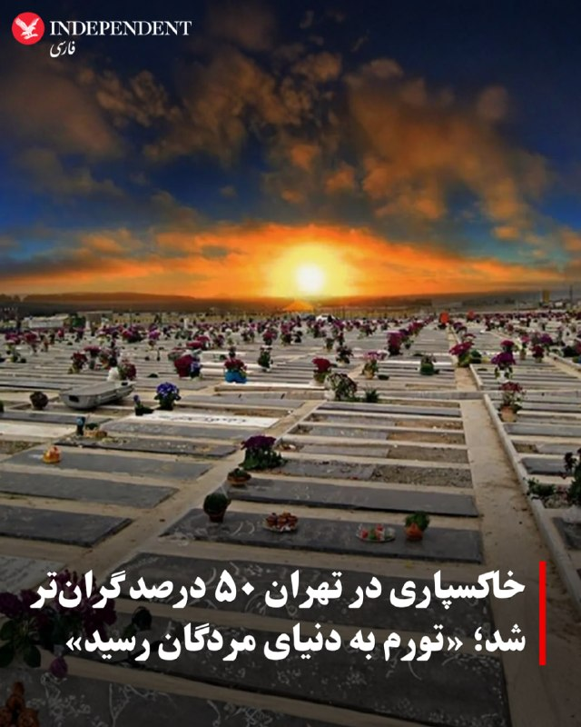

♦️رسانه‌های داخلی ایران روز یکشنبه دهم خردادماه از افزایش ۴۰ تا ۵۰ درصدی هزینه‌های خاکسپاری در تهران با مصوبه شورای شهر پایتخت خبر دادند.

پایگاه خبری دیده‌بان ایران این خبر را با عنوان «وداع میلیونی با مردگان» و «مرده‌ها هم از گرانی و تورم در امان نماندند» منتشر کرد.<
براساس این گزارش‌ها، طبق مصوبه جدید شورای شهر تهران «تعرفه خدمات مختلف از حمل متوفی و غسل تا کفن کردن، تدفین و برگزاری مراسم، به‌طور میانگین حدود ۴۰ درصد افزایش یافته و در برخی موارد حتی افزایش قیمت‌ها ۵۰ درصد است.»

به گزارش فرارو، با تصمیم شورای شهر تهران «هزینه انتقال هر متوفی از سطح شهر تهران تا شعاع ۱۰ کیلومتری به ۹ میلیون و ۷۵۰ هزار ریال رسیده و افزایشی ۵۰ درصدی داشته است. نرخ حمل به پزشکی قانونی کهریزک هم از قاعده افزایش مستثنی نشده و به ازای هر کیلومتر اضافه افزایش یافته و خدمات آمبولانس خصوصی بیشترین رشد تعرفه را داشته است.»
‌🇸🇦 Indypersian

🤖 @VahidOOnLine

## VahidOOnLine — post 243159

  

غلامحسین محسنی اژه‌ای، رییس قوه قضاییه، گفت که بعد از جنگ «جایگاه جمهوری اسلامی رفیع‌تر از گذشته شده است» و افزود: «سناتورها و اندیشمندان دشمن می‌گویند جمهوری اسلامی قدرت چهارم دنیا شده است.»

او اضافه کرد: «دشمن با همه ساز و برگش در برابر ما زانو زد.»

محسنی اژه‌ای ادامه داد: «امروز وحدت و انسجام ملی ما در دنیا زبان‌زد است.»
‌🏁 🇬🇧 IranintlTV

🤖 @VahidOOnLine

## VahidOOnLine — post 243158

  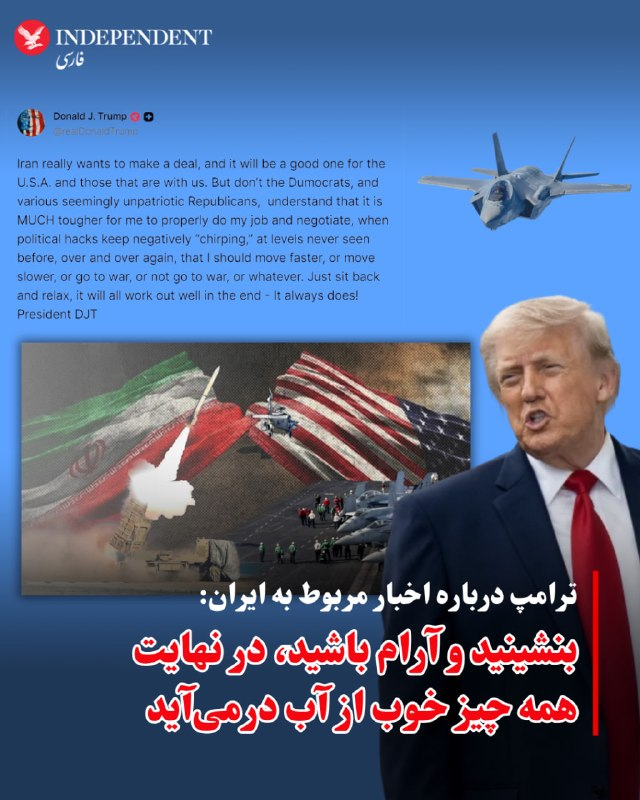

♦️دونالد ترامپ، رئیس جمهوری آمریکا روز دوشنبه ۱۱ خردادماه مخالفان و منتقدان روند مذاکرات با جمهوری اسلامی را به «آرامش» فراخواند و گفت: «همه‌چیز مثل همیشه خوب از آب درمی‌آید.»

ترامپ در این پیام نوشت: «ایران واقعا می‌خواهد به توافقی برسد و این توافق برای ایالات متحده و کسانی که با ما هستند، توافق خوبی خواهد بود. اما آیا دموکرات‌ها و جمهوری‌خواهان مختلف که ظاهرا میهن‌پرست نیستند، نمی‌فهمند که برای من انجام درست کارم و مذاکره بسیار دشوارتر است.»

ترامپ منتقدان و مخالفان را به «منفی‌بافی» متهم کرد و افزود «وقتی که سیاستمداران متقلب بارها و بارها در سطوحی بی‌سابقه «پچ‌پچ (غرغر)» منفی‌بافانه می‌کنند که من باید سریع‌تر حرکت کنم، یا آهسته‌تر حرکت کنم، یا به جنگ بروم، یا به جنگ نروم، یا هر چیز دیگری. فقط بنشینید و آرام باشید! در نهایت همه چیز خوب پیش خواهد رفت. همیشه همینطور است.»
‌🇸🇦 Indypersian

🤖 @VahidOOnLine

## VahidOOnLine — post 243157

  

♦️هادی نوبخت، رئیس اداره صنعت، معدن و تجارت تربت‌حیدریه، روز یکشنبه، ۱۰ خردادماه از ثبت نشان جغرافیایی ملی فرش دست‌بافت عشایری این منطقه با نام «فرش بلوچی خراسان» خبر داد و این اقدام را گامی ارزشمند در مسیر حفظ، صیانت و معرفی این هنر اصیل دانست که ریشه در فرهنگ و سبک زندگی عشایر بلوچ ساکن شرق خراسان دارد. او با اشاره به تولید سالانه نزدیک به هفت هزار مترمربع فرش در این منطقه، اعلام کرد که در حال حاضر «۹۰ درصد تولید فرش دست‌بافت تربت‌حیدریه به کشورهای اروپایی صادر می‌شود»؛ نوبخت همچنین تاکید کرد که در صورت لغو تحریم‌ها، جایگاه این فرش حایز اهمیت بیشتری خواهد شد و می‌توان با کمک فضای مجازی، این صنایع دستی منحصر‌به‌فرد را بدون واسطه به بازارهای جهانی عرضه کرد.
‌🇸🇦 Indypersian

🤖 @VahidOOnLine

## VahidOOnLine — post 243156

  <a href="telegram/content/VahidOOnLine_243156_1780296201.mp4" target="_blank">🎬 Download video</a>

♦️سپاه پاسداران صبح دوشنبه ۱۱ خرداد با انتشار بیانیه و تصاویری  اعلام کرد مبدا حمله به جزیره سیریک در خلیج فارس را هدف قرار داده است.

این بیانیه دقایقی پس از آن اعلام شد که وزارت دفاع کویت از مقابله سامانه پدافند هوایی این کشور با حملات موشکی و پهپادی خبر داده بود.

سپاه در این بیانیه بدون اشاره به نام کشور کویت اعلام کرد «رزمندگان نیروی هوافضای سپاه پایگاه هوایی مبدأ تجاوز را مورد هدف قرار دادند و اهداف پیش‌بینی شده منهدم گردید.»

مرکز فرماندهی ارتش آمریکا (سنتکام) بامداد دوشنبه اعلام کرده بود  که «در دو روز گذشته علیه سایت‌های راداری و مراکز فرماندهی و کنترل پهپادهای ایران در گروگ (واقع در بخش غربی شهرستان سیریک) و جزیره قشم، حملاتی در «دفاع از خود» انجام داده است.»
‌🇸🇦 Indypersian

🤖 @VahidOOnLine

## VahidOOnLine — post 243155

  

دونالد ترامپ، رییس‌جمهور ایالات متحده، در شبکه اجتماعی تروث سوشال نوشت که ایران «واقعا می‌خواهد به توافق برسد» و این توافق «برای آمریکا و متحدانش توافق خوبی خواهد بود.»

او خطاب به منتقدانش نوشت: «فقط بنشینید و آرام باشید؛ در پایان همه‌چیز خوب پیش خواهد رفت، همیشه همین‌طور است.»

ترامپ افزود که اما آیا «دموکرات‌های کودن و برخی جمهوری‌خواهان ظاهرا غیرمیهن‌دوست» نمی‌فهمند که وقتی بازیگران سیاسی مدام، بارها و بارها و در سطحی بی‌سابقه، با نیش و کنایه منفی می‌گویند باید سریع‌تر حرکت کنم، یا کندتر حرکت کنم، یا وارد جنگ شوم، یا وارد جنگ نشوم، یا هر چیز دیگری، انجام درست کارم و مذاکره کردن برای من بسیار سخت‌تر می‌شود؟
‌🏁 🇬🇧 IranintlTV

🤖 @VahidOOnLine

## VahidOOnLine — post 243154

  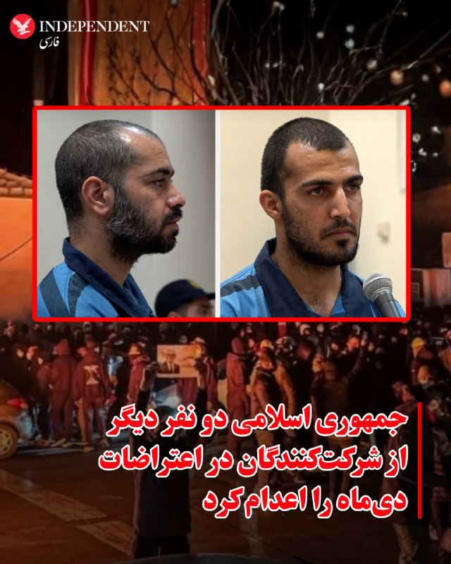

⭕️جمهوری اسلامی دو نفر دیگر از شرکت‌کنندگان در اعتراضات دی‌ماه را اعدام کرد

♦️خبرگزاری قوه قضائیه جمهوری اسلامی (میزان) روز دوشنبه ۱۱ خردادماه از اعدام مهرداد محمدی‌نیا و اشکان مالکی، دو نفر از شرکت‌کنندگان در اعتراضات سراسری دی‌ماه ۱۴۰۴ خبر داد.

در گزارش میزان، ادعا شده است که این دو نفر «از عوامل اصلی آتش‌زدن مسجد جعفری در محله کوی نصر (گیشا) درتهران» بوده‌اند.

خبرگزاری قوه قضائیه اتهام‌های این دو نفر را «اقدام به تخریب و آتش‌زدن مسجد، تخریب اموال عمومی، درگیری با ماموران حافظان امنیت، انسداد خیابان‌ها و ممانعت از عبور و مرور مردم» عنوان کرده است.

به گفته قوه قضائیه، حکم اعدام این دو نفر پس از تائید در دیوان عالی کشور اجرا شد.
‌🇸🇦 Indypersian

🤖 @VahidOOnLine

## VahidOOnLine — post 243153

  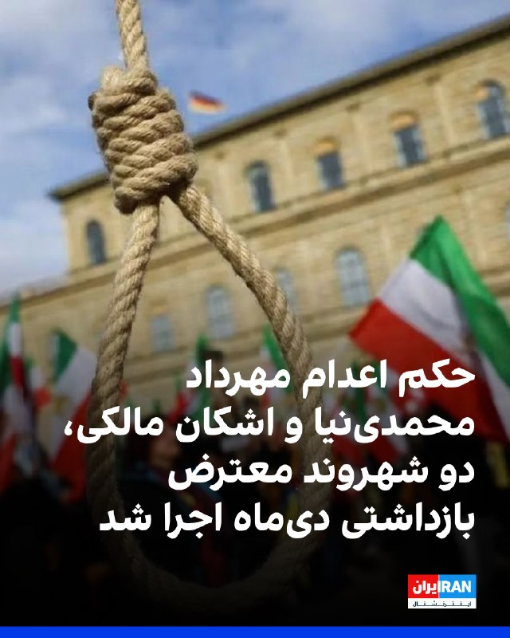

خبرگزاری میزان، وابسته به قوه قضاییه، اعلام کرد حکم اعدام مهرداد محمدی‌نیا و اشکان مالکی، دو شهروند متهم در پرونده آتش‌زدن مسجد جعفری در محله کوی نصر تهران، پس از تایید در دیوان عالی کشور اجرا شد.

بر اساس این گزارش، محمدی‌نیا و مالکی در ارتباط با حوادث اعتراضات دی‌ماه ۱۴۰۴ بازداشت شده بودند و مقام‌های قضایی آنان را از «عوامل اصلی» آتش‌زدن مسجد جعفری در محله گیشا معرفی کرده‌اند.

در گزارش میزان، اتهام‌های مطرح‌شده علیه این دو نفر شامل تخریب و آتش‌زدن مسجد، تخریب اموال عمومی، درگیری با ماموران، مسدود کردن خیابان‌ها و ممانعت از عبور و مرور مردم عنوان شده است.

میزان همچنین به اعترافات منتسب به اشکان مالکی اشاره کرده و نوشته است او گفته پس از ورود به حیاط مسجد، بنزین ریخته‌شده روی زمین را با فندکی که مهرداد محمدی‌نیا به او داده بود آتش زده است.

در این گزارش ادعا شده تصاویر دوربین‌های مداربسته، اقدامات منتسب به متهمان را نشان داده است.

‌🏁 🇬🇧 IranintlTV

🤖 @VahidOOnLine

## VahidOOnLine — post 243152

  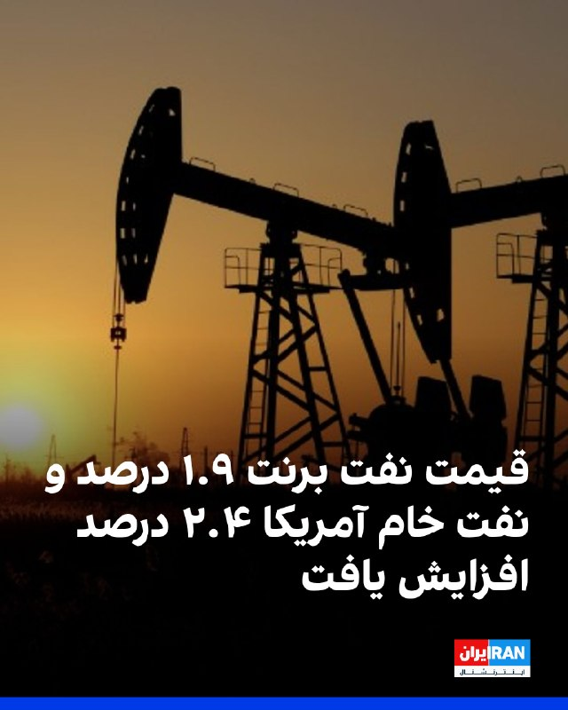

بازارهای آسیایی صبح دوشنبه با افزایش ارزش سهام مرتبط با هوش مصنوعی، نگرانی‌ها در مورد عدم پیشرفت در مذاکرات ایران و آمریکا را جبران کردند.

بر اساس گزارش‌ها، قیمت نفت برنت ۱.۹ درصد و نفت خام آمریکا ۲.۴ درصد افزایش یافت. دلیل این افزایش قیمت هم عدم قطعیت در مورد توافق بین آمریکا و جمهوری اسلامی است که هنوز امضا نشده است.
‌🏁 🇬🇧 IranintlTV

🤖 @VahidOOnLine

## VahidOOnLine — post 243151

  

یک مقام آمریکایی گفت مارکو روبیو، وزیر خارجه ایالات متحده، با جوزف عون، رییس‌جمهوری لبنان، و بنیامین نتانیاهو، نخست‌وزیر اسرائیل، در مورد مذاکرات دیپلماتیک بین این دو کشور کفت‌وگو کرد و طرحی را برای «کاهش تدریجی تنش» پیشنهاد داد.

به گزارش رویترز، این مقام آمریکایی گفت که ایالات متحده پیشنهاد داده است که به عنوان گام اول، حزب‌الله، تمام حملات به اسرائیل را متوقف کند و در عوض اسرائیل از تشدید تنش در بیروت خودداری کند.

به گفته او، «این موضوع، فضایی را برای کاهش تدریجی تنش و توقف مؤثر خصومت‌ها ایجاد می‌کند.»

بر اساس این گزارش، عون تلاش کرد این پیشنهاد را پیش ببرد و دست‌یابی به یک توافق را تضمین کند. با این حال، نبیه بری، رییس پارلمان لبنان، که ادعا می‌کرد تعهد حزب‌الله به آتش‌بس را تضمین می‌کند، خواستار آن شد که اسرائیل ابتدا پیش‌قدم شود.

نتانیاهو یک‌شنبه گفته بود که با وجود آتش‌بس اعلام شده بیش از شش هفته پیش، به ارتش دستور داده است که در نبرد علیه حزب‌الله، بیشتر به داخل لبنان پیشروی کنند.

به نوشته رویترز، مقام آمریکایی گفت که ایالات متحده انتظار ندارد اسرائیل حملات حزب‌الله به غیرنظامیان خود را تحمل کند.
‌🏁 🇬🇧 IranintlTV

🤖 @VahidOOnLine

## VahidOOnLine — post 243150

  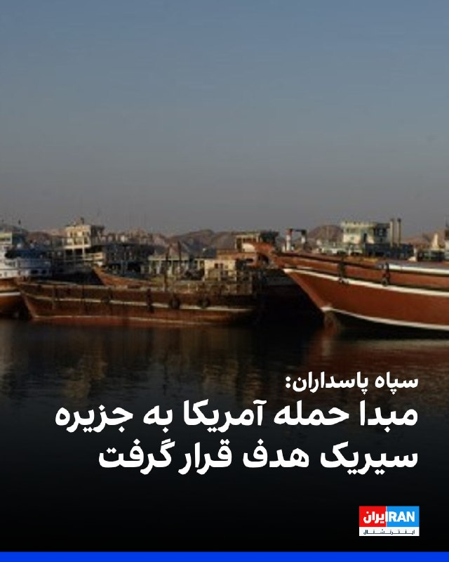

سپاه پاسداران در اطلاعیه‌ای از «هدف قرار گرفتن مبدا» ‌حمله ارتش آمریکا به «یک دکل مخابراتی در جزیره سیریک در استان هرمزگان» خبر داد.

سپاه پاسداران گفت نیروی هوافضای سپاه اخطار داد در صورت تکرار حمله، «پاسخ کاملاً متفاوت خواهد بود» و مسئولیت آن به عهده آمریکا است.

سپاه پاسداران در اطلاعیه خود به خسارات جانی و مالی وارد آمده در پی حمله آمریکا اشاره نکرده است.

در این حال، دقایقی پیش کویت اعلام کرد که سامانه‌های پدافند هوایی این کشور در حال مقابله با حملات موشکی و پهپادی دشمن هستند اما اشاره‌ای به ایران نکرد.
‌🏁 🇬🇧 IranintlTV

🤖 @VahidOOnLine

## VahidOOnLine — post 243149

  

فرماندهی مرکزی ایالات متحده، سنتکام، در شبکه اجتماعی ایکس تاکید کرد: «در پاسخ به تجاوز بی‌اساس ایران در طول آتش‌بس جاری، به حفاظت از دارایی‌ها و منافع ایالات متحده ادامه خواهد داد.»

سنتکام نوشت که این فرماندهی در روزهای اخیر حملات دفاع از خود را علیه سایت‌های راداری و فرماندهی و کنترل پهپادهای حکومت ایران در منطقه روستایی گورک، و جزیره قشم انجام داد.

فرماندهی مرکزی ایالات متحده افزود: «این حملات سنجیده و حساب‌شده روزهای شنبه و یکشنبه در پاسخ به اقدامات تهاجمی ایران از جمله سرنگونی یک پهپاد ام‌کیو یک آمریکایی که بر فراز آب‌های بین‌المللی در حال پرواز بود، انجام شدند.»

سنتکام نوشت: «جنگنده‌های آمریکایی به سرعت با از بین بردن پدافند هوایی ایران، یک ایستگاه کنترل زمینی و دو پهپاد انتحاری که تهدید آشکاری برای کشتی‌های عبوری از آب‌های منطقه‌ای ایجاد می‌کردند، واکنش نشان دادند» و «هیچ یک از نیروهای نظامی آمریکایی آسیب ندیدند.»
‌🏁 🇬🇧 IranintlTV

🤖 @VahidOOnLine

## VahidOOnLine — post 243148

  

♦️فرماندهی مرکزی ایالات متحده (سنتکام) صبح دوشنبه اعلام کرد که در در دو روز گذشته حملات «دفاع از خود» علیه سایت‌های راداری و مراکز فرماندهی و کنترل پهپادهای ایران در گروگ (شهر گروگ در میانه غربی شهرستان سیریک واقع شده) و جزیره قشم انجام داده است.
به گفته این فرماندهی، این حملات «حساب‌شده و هدفمند» روزهای شنبه و یکشنبه در پاسخ به اقدامات تهاجمی رژیم ایران انجام شد؛ اقداماتی که شامل سرنگونی یک پهپاد آمریکایی ام‌کیو-۱ MQ-1 بود که در حال فعالیت بر فراز آب‌های بین‌المللی بود. جنگنده‌های آمریکایی به‌سرعت واکنش نشان داده و پدافند هوایی ایران، یک ایستگاه کنترل زمینی و دو پهپاد تهاجمی یک‌طرفه را که تهدیدی آشکار برای کشتی‌های عبوری در آب‌های منطقه‌ای بودند، از بین بردند.
در این بیانیه آمده است که هیچ‌یک از نظامیان آمریکایی آسیب ندیده‌اند. سنتکام تأکید کرده است که در واکنش به اقدامات «غیرموجه» ایران در جریان آتش‌بس جاری، به حفاظت از نیروها و منافع آمریکا ادامه خواهد داد.
‌🇸🇦 Indypersian

🤖 @VahidOOnLine

## VahidOOnLine — post 243147

  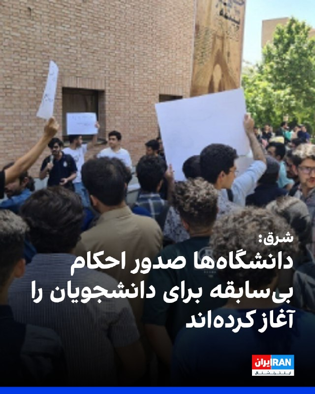

روزنامه شرق گزارش داد پس از اعتراضات دی‌ماه و در ادامه روند تشکیل پرونده‌های انضباطی برای دانشجویان، دانشگاه‌های ایران بار دیگر پیگیری پرونده‌ها و صدور احکام جدید را آغاز کرده‌اند؛ احکامی که این روزنامه آن‌ها را «کم‌سابقه» توصیف کرده است.

شرق دوشنبه ۱۱ خرداد نوشت در دانشگاه شریف، پنج تا هفت دانشجو حکم اخراج گرفته‌اند و بیش از ۲۰ دانشجو نیز یک تا سه ترم از تحصیل تعلیق شده‌اند.

بر اساس این گزارش، سامانه‌های آموزشی ۲۰ تا ۲۵ دانشجوی دانشگاه شهید بهشتی از دسترس خارج شده، برای بیش از ۱۰۰ دانشجوی دانشگاه علم و صنعت پرونده انضباطی تشکیل شده و ۱۵۰ تا ۲۰۰ دانشجوی دانشگاه تهران در حال نوشتن دفاعیه‌های خود هستند.

شرق همچنین نوشت رسیدگی به این پرونده‌ها با «نقض گسترده» اصول شیوه‌نامه انضباطی همراه بوده است.

این برخوردها در حالی ادامه دارد که حسین سیمایی‌صراف، وزیر علوم دولت مسعود پزشکیان، پیش‌تر گفته بود مانعی برای تحصیل هیچ دانشجویی وجود ندارد و همه دانشجویان محروم‌شده به دانشگاه بازگشته‌اند.
متن کامل را اینجا بخوانید
‌🏁 🇬🇧 IranintlTV

🤖 @VahidOOnLine

## WithYashar — post 13124

گروه تروریستس ۳پا امروز در بیانیه‌ای اعلام کرد در واکنش به حمله ارتش آمریکا به یک دکل مخابراتی در جزیره سیریک، «مبدأ حمله» رو هدف قرار داده و هشدار داد در صورت تکرار این اقدامات، پاسخ متفاوتی خواهد داد.

کویت حوالی ۶ صبح از فعال شدن سامانه‌های پدافندی خود برای مقابله با حملات موشکی و پهپادی خبر داد ولی مبدأ حمله را اعلام نکرد
@withyashar

## WithYashar — post 13123

اتاق جنگ با شما : یاشار تتر داره کندل سبز میخوره همینجوری
این صداهای امروز مثل اینکه جدی تره
@withyashar
اتاق جنگ با شما :نهم اسفند هم همین ساعت ها بود داشتن حمله میکردند خدا به خیر کنه😂😂💔

## WithYashar — post 13122

## WithYashar — post 13121

صدای انفجار در اصفهان
@withyashar

## WithYashar — post 13120

دوباره صدای انفجار‌ در بندر
@withyashar

## WithYashar — post 13119

## WithYashar — post 13118

## WithYashar — post 13117

یعنی جنگ رو پنهان میکنن ؟؟

## WithYashar — post 13116

اتاق جنگ با شما : صداش دقیقا مثل جنگنده آمریکایی یا اسرائیلی بود
@withyashar

## WithYashar — post 13115

گزارش های زیاد از صدای جنگنده در تهران
@withyashar

## WithYashar — post 13114

سنتکام : ما حملات دفاعی به رادار پهپاد و سایت‌های فرماندهی و کنترل در گوروک و قشم ایران انجام دادیم. @withyashar

## WithYashar — post 13113

گزارش چندین انفجار بندر عباس 🚨
@withyashar

## WithYashar — post 13112

  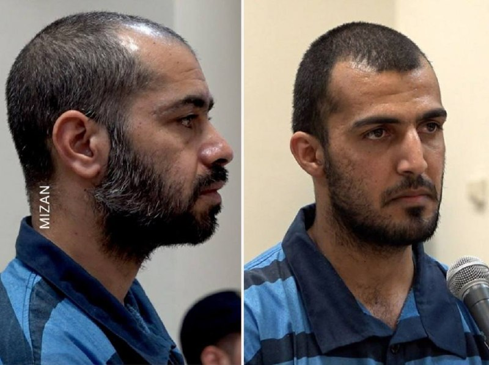

خبرگزاری رسمی قوه قضائیه ایران(میزان) اعلام کرد که دو نفر دیگر از معترضان دی‌ماه ۱۴۰۴ را به اتهام «آتش‌زدن مسجد»، «لیدری کودتا»، «تخریب اموال عمومی» و «مسدودسازی خیابان‌ها» مجازات کرده است.

نام این دو عزیز که ساعاتی پیش جاودانه شدند، مهرداد محمدی‌نیا و اشکان مالکی اعلام شده است.
@withyashar

## WithYashar — post 13111

سنتکام : ما حملات دفاعی به رادار پهپاد و سایت‌های فرماندهی و کنترل در گوروک و قشم ایران انجام دادیم.
@withyashar

## WithYashar — post 13110

گزارش شلیک موشک از امیدیه در استان خوزستان به سمت کویت۶:۳۰ دقیقه و ۸:۳۳ دقیقه
@withyashar

## WithYashar — post 13109

  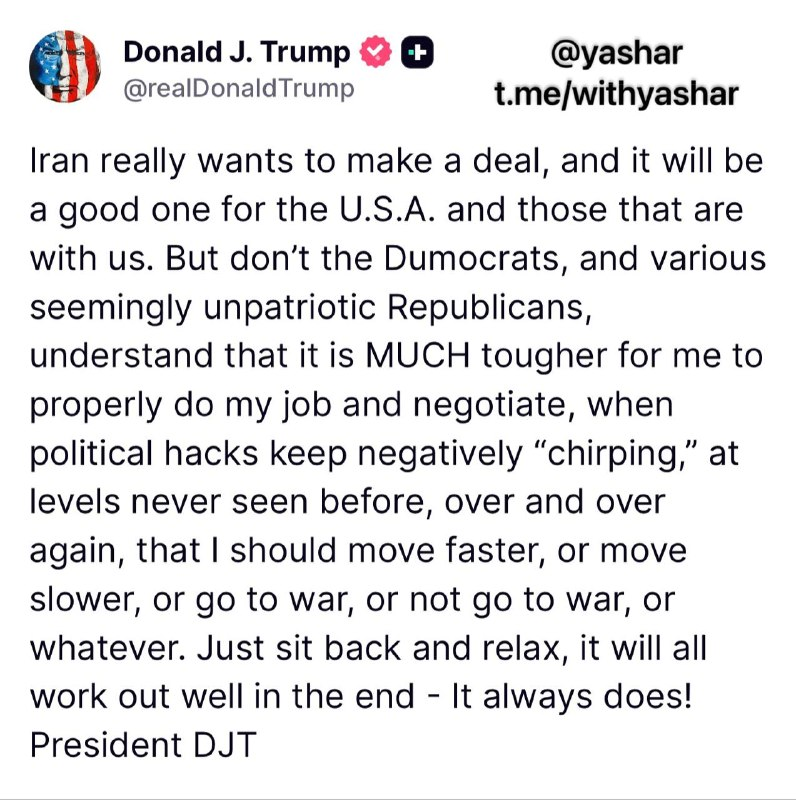

ترامپ در تروث:
ایران واقعاً می‌خواهد به توافق برسد، و این توافق برای ایالات متحده آمریکا و کسانی که با ما هستند، توافق خوبی خواهد بود. اما آیا دموکرات‌های کودن و برخی جمهوری‌خواهانِ ظاهراً غیرمیهن‌دوست نمی‌فهمند که وقتی بازیگران سیاسی مدام، بارها و بارها و در سطحی بی‌سابقه، با نیش و کنایه منفی می‌گویند باید سریع‌تر حرکت کنم، یا کندتر حرکت کنم، یا وارد جنگ شوم، یا وارد جنگ نشوم، یا هر چیز دیگری، انجام درست کارم و مذاکره کردن برای من بسیار سخت‌تر می‌شود؟

فقط بنشینید و آرام باشید؛ در پایان همه‌چیز خوب پیش خواهد رفت همیشه همین‌طور است!
@withyashar

## mwarmonitor — post 9968

🔴«ایران واقعاً می‌خواهد توافق کند، و این توافق خوبی برای ایالات متحده و کسانی که با ما هستند خواهد بود. اما آیا دموکرات‌های نادان (دموکرات‌نماها)* و برخی جمهوری‌خواهانِ به‌ظاهر غیروطن‌پرست درک نمی‌کنند که وقتی شبه‌سیاسیونِ جیره‌خوار (بوقچی‌های سیاسی) مدام در سطوحی بی‌سابقه و بارها و بارها با لحنی منفی "جیک‌جیک" می‌کنند [نق می‌زنند] که من باید سریع‌تر حرکت کنم، یا کندتر حرکت کنم، یا به جنگ بروم، یا به جنگ نروم، یا هر چیز دیگری، انجام درست وظیفه‌ام و مذاکره کردن برای من بسیار سخت‌تر می‌شود؟ فقط بنشینید و آرام باشید، در نهایت همه چیز به خوبی پیش خواهد رفت؛ همیشه همین‌طور می‌شود!

رئیس‌جمهور دونالد جی ترامپ»

@mwarmonitor

## mwarmonitor — post 9967

🔴دفاع آمریکا و خنثی‌سازی تهدیدات در پاسخ به تجاوزات ایران

🔸فرماندهی مرکزی ایالات متحده (سنتکام)

🔰تامپا، فلوریدا — فرماندهی مرکزی ایالات متحده (سنتکام) در پایان این هفته، حملات دفاع مشروعی را علیه رادارهای ایرانی و سایت‌های فرماندهی و کنترل پهپادها در گورک ایران و جزیره قشم انجام داد.

🔹این حملات سنجیده و حساب‌شده در روزهای شنبه و یکشنبه در پاسخ به اقدامات تهاجمی ایران، از جمله سرنگونی یک پهپاد MQ-1 آمریکایی که در حریم هوایی بین‌المللی در حال فعالیت بود، صورت گرفت.

🔹 جنگنده‌های آمریکایی با سرعت پاسخ دادند و پدافند هوایی ایران، یک ایستگاه کنترل زمینی و دو پهپاد تهاجمی انتحاری (یک‌طرفه) را که تهدیدی آشکار برای کشتی‌های در حال عبور از آب‌های منطقه بودند، منهدم کردند.

🔸به هیچ‌یک از اعضای خدمت‌گذار ارتش آمریکا آسیبی نرسید. سنتکام به محافظت از دارایی‌ها و منافع ایالات متحده در پاسخ به تجاوزات بی‌دلیل ایران در طول آتش‌بس جاری ادامه خواهد داد.

@mwarmonitor

## mwarmonitor — post 9966

  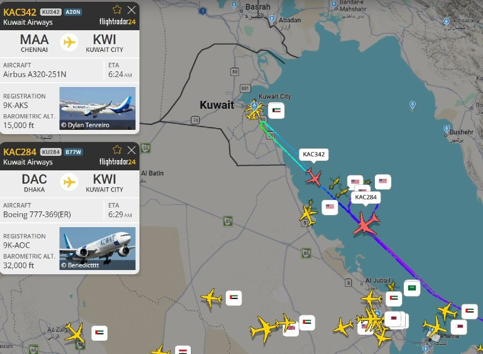

🔸ستاد کل ارتش کویت دوشنبه، ۱ ژوئن ۲۰۲۶ پدافند هوایی کویت در حال حاضر در حال مقابله با تهدیدات موشکی و پهپادی متخاصم است. ستاد کل نیروهای مسلح کویت تایید می‌کند که هرگونه صدای انفجاری که ممکن است شنیده شود، ناشی از رهگیری اهداف متخاصم توسط سامانه‌های پدافند…

## mwarmonitor — post 9965

  

🚨فوری | خبرنگار الجزیره: آژیرهای هشدار در کویت به صدا درآمد. @mwarmonitor

## mwarmonitor — post 9964

🚨فوری | خبرنگار الجزیره: آژیرهای هشدار در کویت به صدا درآمد.

@mwarmonitor

## mwarmonitor — post 9963

🔴باراک راوید: یک مقام آمریکایی به من گفت که وزیر خارجه ایالات متحده، مارکو روبیو، طی ۴۸ ساعت گذشته با جوزف عون رئیس‌جمهور لبنان و بنیامین نتانیاهو نخست‌وزیر اسرائیل گفت‌وگو کرده تا ابتکار جدیدی برای آتش‌بس را پیش ببرد.

🔴 این مقام آمریکایی گفت ابتکار جدید در چارچوب مذاکرات جاری میان اسرائیل و لبنان پیشنهاد شده است.

🔴 به گفته این مقام، آمریکا برای پیشبرد این گفت‌وگوها پیشنهاد داده که در گام نخست، حزب‌الله تمامی حملات خود علیه اسرائیل را متوقف کند و در مقابل، اسرائیل از تشدید تنش در بیروت خودداری کند.

🔴 این مقام افزود که چنین اقدامی «فضایی برای کاهش تدریجی تنش و توقف مؤثر درگیری‌ها» ایجاد خواهد کرد.

🔴 به گفته مقام آمریکایی، رئیس‌جمهور عون تلاش کرد این پیشنهاد را پیش ببرد و به توافقی دست یابد، اما پاسخ نبیه بری، رئیس پارلمان لبنان، مبهم و ناامیدکننده بود.

🔴 این مقام ادعا کرد که بری مدعی شد می‌تواند پایبندی حزب‌الله به آتش‌بس را تضمین کند، اما مسئولیت آغاز توقف تیراندازی را بر عهده اسرائیل گذاشت؛ آن هم در حالی که به گفته او، حزب‌الله آغازگر این دور از درگیری‌ها بوده است.

🔴 این مقام آمریکایی تأکید کرد: «حزب‌الله از خط‌مشی تهران پیروی می‌کند و آشکارا هیچ علاقه‌ای به رفاه مردم لبنان ندارد.»

🔴به ادعای این مقام، ایران می‌خواهد درگیری در لبنان را طولانی کند تا بتواند بعداً مدعی شود که «اوضاع را نجات داده است».

🔴 این مقام گفت: «ایالات متحده انتظار ندارد اسرائیل حملات مداوم به غیرنظامیان خود از سوی یک سازمان تروریستی را تحمل کند. سریع‌ترین راه برای کاهش تنش و حفاظت از غیرنظامیان در همه طرف‌ها این است که حزب‌الله فوراً شلیک را متوقف کند.»

@mwarmonitor

## mwarmonitor — post 9962

🔴شبکه خبری جعلی سی‌ان‌ان (CNN) امروز طبق معمول ادعا کرد که توافق هسته‌ای ایرانِ من اصلاً درباره مسائل هسته‌ای صحبت نمی‌کند؛ در حالی که در واقع این توافق با وضوح کامل بیان می‌کند که ایران سلاح هسته‌ای نخواهد داشت. این توافق در ادامه، با جزئیاتی بسیار محکم و طولانی، به بحث درباره ابعاد مختلف دیگرِ موضوع هسته‌ای می‌پردازد. در حقیقت، بخش عمده‌ای از این توافق درباره همین موضوع است. سی‌ان‌ان و بسیاری دیگر از رسانه‌های خبری جعلی، یک فاجعه با میزان بیننده (رِیتینگ) پایین هستند. حتی با مدیریت و مالکیت جدید هم بعید است که وضعیت آن‌ها هرگز بهتر شود!!!

رئیس‌جمهور دونالد جی ترامپ

@mwarmonitor

## pm_afshaa — post 91983

پرتاب موشک از خوزستان به سمت کویت

💧 Rainbet.com the #1 Non-KYC Crypto Casino & Sportsbook @rainbetcom

😁 @Pm_Afshaa

## pm_afshaa — post 91982

🔴انفجار های شنیده شده در بندر عباس ناشی از مهمات باقی مانده زمان جنگه

💧 Rainbet.com the #1 Non-KYC Crypto Casino & Sportsbook @rainbetcom

😁 @Pm_Afshaa

## pm_afshaa — post 91981

توییت اکانت جمهوری اسلامی:مردم جرعت دارن بیان خیابون، یه جوری قتل عام میکنیم که مراد ویسی تا چند سال طول بکشه اسم همه جاوید نام هارو بخونه 
💧 Rainbet.com the #1 Non-KYC Crypto Casino & Sportsbook @rainbetcom 
😁 @Pm_Afshaa

## pm_afshaa — post 91980

  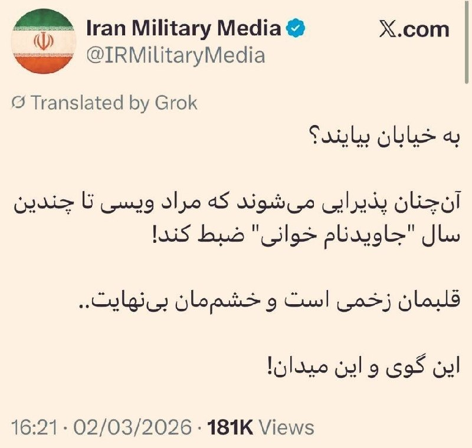

توییت اکانت جمهوری اسلامی:مردم جرعت دارن بیان خیابون، یه جوری قتل عام میکنیم که مراد ویسی تا چند سال طول بکشه اسم همه جاوید نام هارو بخونه

💧 Rainbet.com the #1 Non-KYC Crypto Casino & Sportsbook @rainbetcom

😁 @Pm_Afshaa

## pm_afshaa — post 91979

  <a href="telegram/content/pm_afshaa_91979_1780296217.mp4" target="_blank">🎬 Download video</a>

موزیک جدید حامدفرد به اسم «بزن که خوب میزنی» منتشر شد و توی چند ساعت اول بازدید میلیونی گرفت

💧 Rainbet.com the #1 Non-KYC Crypto Casino & Sportsbook @rainbetcom

😁 @Pm_Afshaa

## pm_afshaa — post 91978

  <a href="telegram/content/pm_afshaa_91978_1780296218.mp4" target="_blank">🎬 Download video</a>

مداح حکومتی حسین طاهری:اگه دارین مذاکره می‌کنید به ماهم بگین که حداقل تکلیف خودمونو تو این دورهم جمع شدنایِ شبانه بدونیم.

💧 Rainbet.com the #1 Non-KYC Crypto Casino & Sportsbook @rainbetcom

😁 @Pm_Afshaa

## VahidOnline — post 75841

پیام‌های دریافتی از تهران درباره صدای پرواز یک جنگنده یا هواپیمایی دیگر مربوط به جمهوری اسلامی:

سلام تهران صدای جنگنده اومد همین الان

غرب تهران وحشتناک صدا جنگنده میاد ۹:۱۵

صدای جنگنده داره میاد غرب تهرانم ساعت ۹.۱۴

سلام وحید همین الان تهران صدای جنگنده میومد نزدیک ۲ دقیقه

شمال شرق تهران صدای جنگنده

سلام تهران صدا جنگنده شدید

الان از بالا سر ما صدای جنگنده اومد
رد شد رفت

همین الان منطقه گیشا صدای جنگنده میاد

همین الان ساعت ۹:۱۵ دقیقه صدای جنگنده سمت غرب تهران اومد(فکر میکنم جنگنده ارتش بوده باشه)

سلام وحید از سمت لویزان تهران موشک بلند شد

وحید الان ساعت ۹:۱۵ صدا جت منطقه ۲ تهران

تهران-فرمانيه
ساعت 9;16 صداي جنگنده مياد

وحید تهران ساعت ۹:۱۷ صدا جت میاد زیاد
هروی

الو سلام تهران سمت شهرک غرب صدای نمیدونم هواپیما بود جنگنده بود چی بود خیلی نزدیک بود

الان ساعت ۹:۱۷ دقیقه در قیطریه صدای جنگنده اومد

شرق تهران صدای جنگنده شنیده شد الان

سلام تهران صدا جنگنده شدید
احتمالا جنگنده های خودشونه
ساعت۹:۱۷

سلام دوشنبه تهران ساعت ۹:۱۵ صدا جنگنده من شنیدم سمت هروی

صدای جنگنده تهران ۹:۱۷

صدای جنگنده منطقه ۳
خیلی پایین بود

تهران صدای جنگنده اومد

سلام ساعت ۹:۱۵ سمت دروس تهران صدای جنگنده اومد

صدای جنگنده شمال تهران ساعت ۹:۱۵ رقیقه

سلام ساعت ۰۹۱۵ دوشنبه صدای پرواز چند جنگنده شمال تهران

منطقه ۳ صدای جنگنده انقدر زیاد و وحشتناک بود که از خواب بیدار شدم

سلام پاسدارانیم صدای جنگنده اومد چند دقیقه پیش

صدای جنگده نارمک

سلام وحید. صدایی که ۹:۱۵ اومد شبیه جنگنده بود ولی از پنجره نگاه کردم شبیه هواپیمای مسافربری بود فقط نمیدونم چرا از ارتفاع کم حرکت میکرد

سلام آقا وحید من خونم گیشاسصدای جنگنده نبود هواپیما بود من بالای خونه رفتم دیدم ولی هواپیما بزرگ بود ی مقدار دیگه باری بود یا سواری نمیدونم ولی از بالای گیشا رد شد

من از روستای اطراف شهریارهستم یه هواپیمای مسافربری بزرگ تو ارتفاع پایین از بالا سرمون رد شد به وضوح دیدمش صداش زیاد بود

سلام وقت بخیر نیاورانم صدای جنگنده اومد وحشتناک بود

وحید من شهرک محلاتیم
بین ۹:۱۵ تا ۹:۲۰ صدای جنگنده میومد
(با ارتفاع پایین)

سلام وحید جان صدای وحشتناک جنگنده ۳ ۴ دقیقه پیش خونرو لرزوند

-هواپیمای کارگو سپاه از تهران بلند شد.
-صدای جنگنده برای این بود؟
-ممکنه برای اسکورتش بوده باشه
J74wabx

پیام‌های دریافتی از اصفهان درباره شنیده شدن دو صدای انفجار از دور:

پیام ساعت ۹:۱۷: اصفهان صدای انفجار میاد، دو بار پشت سر هم

اصفهان همین الان صدای انفجار اومد سمت ناحیه ۶

الان اصفهان یه صدایی مثل صدای انفجار اومد

سلام وحید، اصفهان ساعت ۹:۱۸ ۲تا صدا مثل انفجار و کمی لرزش حس کردم فاصلش خیلی دور بود، بین ساعت ۸ تا ۹ هم یک صدای مشابه اومد فکر کردم توهم زدم

اصفهان صدا انفجار نزدیکای جی شیر(مطمئن نیستم)

سلام. اصفهان حدود ساعت ۹:۱۵ صدای ۲ تا انفجار به فاصله چند ثانیه.
نمی دونم چیزی زدن یا دارند مهمات خنثی می کنند. البته تقریبا هر روز صبح یه صدا میاد که به خنثی سازی میخوره.
امروز ۲ تا پشت سر هم بود.

📡 @VahidOnline

## VahidOnline — post 75840

#بندرعباس

پیام‌های دریافتی درباره شنیده شدن صدای سه انفجار:

بندرعباس ساعت ۹:۰۷ سه تا انفجار

الان بندرعباس ساعت 9:7 دقیقه 3انفجار قوی

یک صداهایی شبیه برخورد جسم سنگین (بمب یا هرچی) به زمین داره میاد از دوردست.
بندرعباس ساعت ۹:۰۹ صبح دوشنبه

سه تا صدای انفجار اومد بندرعباس
ساعت ۹ و هشت دقیقه

دوشنبه، ۱۱ خرداد ۹:۰۷ صبح. بندرعباس.
صدای ۳ تا انفجار از نزدیکی پایگاه هوایی شنیده شد.

آپدیت:
خبرگزاری تسنیم وابسته به سپاه مدعی شده که مربوط به مهمات خنثی نشده بوده. البته دو روز پیش‌تر از این هم اعلام کرده بودند که طی ۷۲ ساعت آینده قراره از این صداها شنیده بشه در بندرعباس.
📡 @VahidOnline

## VahidOnline — post 75839

  

پست ترامپ، ترجمه ماشین:
ایران واقعاً می‌خواهد به توافق برسد، و این توافق برای ایالات متحده آمریکا و کسانی که با ما هستند، توافق خوبی خواهد بود.
اما آیا دموکرات‌های کودن و بعضی جمهوری‌خواهانِ ظاهراً غیرمیهن‌دوست نمی‌فهمند وقتی سیاسی‌کارها مدام و با شدتی بی‌سابقه غر می‌زنند که باید سریع‌تر حرکت کنم، یا کندتر، یا جنگ کنم، یا جنگ نکنم، یا هر چیز دیگری، کار درست و مذاکره برای من خیلی سخت‌تر می‌شود؟

فقط بنشینید و آرام باشید؛ در پایان همه‌چیز خوب پیش خواهد رفت — همیشه همین‌طور است!

رئیس‌جمهور، دی‌جی‌تی
realDonaldTrump

📡 @VahidOnline

## VahidOnline — post 75838

پیام‌های دریافتی:
امیدیه خوزستان صدای انفجار شنیده میشه

از امیدیه خوزستان پیام میدم
طرفای ساعت ۸:۱۳ دقیقه صدای ترکیدن اومد
ساعت ۸:۳۱ دوباره زدن

همین چند دقیقه پیش صدای انفجار واضح ای اومد

امیدیه هستم و صدای دوتا انفجار شدید ساعت 8:33 اومدش.

📡 @VahidOnline

## VahidOnline — post 75836

قوه قضائیه جمهوری اسلامی اعلام کرد که دو نفر دیگر از معترضان دی‌ماه ۱۴۰۴ را به اتهام «آتش‌زدن مسجد [گیشا]»، «لیدری کودتا»، «تخریب اموال عمومی» و «مسدودسازی خیابان‌ها» اعدام کرده است.

نام این دو معترض که بامداد دوشنبه یازدهم خرداد اعدام شدند، مهرداد محمدی‌نیا و اشکان مالکی اعلام شده است.

میزان نوشته این دو «از عوامل اصلی آتش‌زدن مسجد جعفری در محله کوی نصر تهران [بودند] که اقدام به تخریب و آتش‌زدن مسجد، تخریب اموال عمومی، درگیری با مأموران حافظان امنیت، انسداد خیابان‌ها و ممانعت از عبور و مرور مردم کرده بودند.»

دستگاه قضایی جمهوری اسلامی در ماه‌های اخیر به شکل تقریباً روزانه اقدام به اجرای احکام اعدام معترضان و یا افرادی می‌کند که آن‌ها را به همکاری با آمریکا و اسرائیل متهم می‌کند. برخی نهادهای حقوق‌بشری می‌گویند جمهوری اسلامی از اعدام برای ایجاد فضای ترس و به‌عنوان عامل سرکوب استفاده می‌کند.
@VahidHeadline

📡 @VahidOnline

## VahidOnline — post 75834

بیانیه سپاه: ساعتی پیش آمریکا به دکل مخابراتی سیریک حمله کرده بود پاسخ دادیم

من اون موقع فقط از یک نفر دو پیام داشتم:
ساعت 4:00 چهار انفجار در شهرستان سیریک
پایگاه سپاه سرخور زدن

ساعت 4:26 دوباره یکی زد
هرمزگان شهرستان سیریک

و الان کسی تصویر دوم بالا رو فرستاد و نوشت:
"حدود ساعت چهار صبح، آمریکا با چند موشک به اینجا حمله کرد.
پایگاه نیروی دریایی سپاه شهرستان سیریک ، حوالی روستای گروک"

📡 @VahidOnline

## VahidOnline — post 75833

  <a href="telegram/content/VahidOnline_75833_1780296221.mp4" target="_blank">🎬 Download video</a>

'شلیک موشک از #امیدیه در خوزستان'
ویدیوی دریافتی دیگر از همان موشک،
دوشنبه ۱۱ خرداد ساعت ۶:۳۰
Vahid
ستاد کل ارتش کویت دقایقی پیش اعلام کرد سامانه‌های پدافند هوایی این کشور در حال مقابله با حملات موشکی و پهپادی دشمن هستند.

به گزارش خبرگزاری رویترز، جزییات بیشتری درباره این حمله پهپادی منتشر نشده است.

ارتش کویت در بیانیه خود تاکید کرد که صداهای احتمالی انفجار ناشی از رهگیری اهداف مهاجم از سوی سامانه‌های پدافندی است و از شهروندان خواست دستورالعمل‌های ایمنی را رعایت کنند.
@VahidOOnLine

📡 @VahidOnline

## VahidOnline — post 75832

  

بیانیه سنتکام درباره حملات شنبه و یکشنبه
(از جمله حمله ساعاتی پیش به سیریک هرمزگان که با توجه به پستی پایین‌تر گویا حدود ساعت ۴ صبح دوشنبه به وقت ایران انجام شده. در آمریکا هنوز یکشنبه است.)

ترجمه ماشین:
"آمریکا در واکنش به تجاوز ایران، از خود دفاع کرد و تهدیدها را از کار انداخت

تامپا، فلوریدا — فرماندهی مرکزی ایالات متحده آمریکا، سنتکام، این آخر هفته حملات دفاعی علیه سایت‌های راداری ایران و مراکز فرماندهی و کنترل پهپادها در گروک ایران و جزیره قشم انجام داد.

این حملات حساب‌شده و عامدانه، روزهای شنبه و یکشنبه و در پاسخ به اقدامات تهاجمی ایران انجام شد؛ اقداماتی که شامل سرنگونی یک پهپاد MQ-1 آمریکا بود که بر فراز آب‌های بین‌المللی فعالیت می‌کرد. جنگنده‌های آمریکایی به‌سرعت واکنش نشان دادند و پدافند هوایی ایران، یک ایستگاه کنترل زمینی، و دو پهپاد تهاجمی یک‌طرفه را که تهدیدی آشکار برای کشتی‌های در حال عبور از آب‌های منطقه‌ای محسوب می‌شدند، منهدم کردند.

هیچ‌یک از نیروهای نظامی آمریکا آسیب ندیدند. سنتکام در جریان آتش‌بس جاری، در واکنش به تجاوز بی‌دلیل ایران، به حفاظت از دارایی‌ها و منافع ایالات متحده ادامه خواهد داد."
CENTCOM

📡 @VahidOnline

## VahidOnline — post 75828

  <a href="telegram/content/VahidOnline_75828_1780296222.mp4" target="_blank">🎬 Download video</a>

'شلیک موشک از #امیدیه در خوزستان'
تصاویر دریافتی، دوشنبه ۱۱ خرداد ساعت ۶:۳۰ به وقت #ایران
Vahid

📡 @VahidOnline

## VahidOnline — post 75827

  

شلیک موشک به کویت

دوباره همز‌مان پیام‌هایی درباره شلیک موشک از امیدیه خوزستان و اعلام هشدار در کویت دریافت کردم.
دوشنبه ۱۱ خرداد
ساعت ۶ به وقت کویت که میشه ساعت ۶:۳۰ به وقت ایران
Vahid

📡 @VahidOnline

## IranIntlTV — post 339986

  <a href="telegram/content/IranIntlTV_339986_1780296223.mp4" target="_blank">🎬 Download video</a>

در پی راه‌اندازی کارزار مردمی رشت از سوی ایران‌اینترنشنال، یکی از شهروندان ویدیویی برای ما ارسال کرده که رد خون جاویدنامان ۱۸ و ۱۹ دی ۱۴۰۴ را در خیابان‌های رشت نشان می‌دهد.
این ویدیو در مسیر بازار تا میدان صیقلان رشت ضبط شده است.

## IranIntlTV — post 339985

  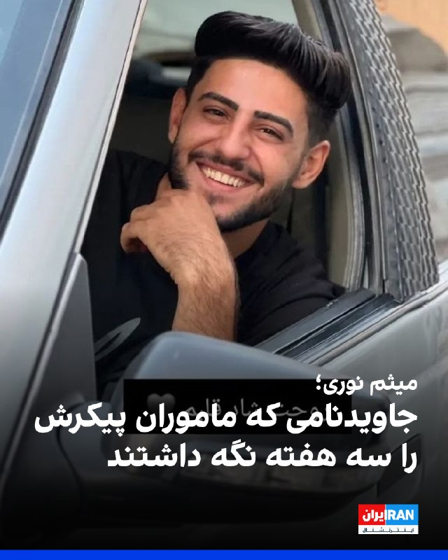

بر اساس اطلاعات رسیده به ایران‌اینترنشنال، پیکر میثم نوری ۲۵ ساله، از جان‌باختگان اعتراضات ۱۹ دی‌ماه در اصفهان، پس از تحویل به بیمارستان عسگریه برای حدود سه هفته ناپدید شد و در نهایت پس از پیگیری‌ها و فشارهای فراوان به خانواده تحویل داده شد.

میثم شامگاه ۱۹ دی‌ماه، حدود ساعت ۱۰ شب، در جریان تظاهرات روبروی پایگاه بسیج شیخ‌طوسی در اصفهان هدف شلیک ماموران حکومت از پشت سر قرار گرفت و کشته شد. 

به گفته یک منبع مطلع، پیکر میثم تا حدود ساعت چهار بامداد در خانه باقی ماند و سپس به بیمارستان عسگریه منتقل شد. پس از آن، پیکر او ناپدید شد و خانواده حدود سه هفته برای تحویل گرفتن آن پیگیری کردند.

ماموران امنیتی به خانواده اجازه ندادند میثم را در باغ رضوان اصفهان به خاک بسپارند. پیکر او در نهایت، با تدابیر امنیتی، در روستای هفتشویه اصفهان به خاک سپرده شد.

میثم تحصیل‌کرده رشته ریاضی و از خانواده‌ای کم‌برخوردار بود.
https://iranintl.com/202606015970

## IranIntlTV — post 339983

  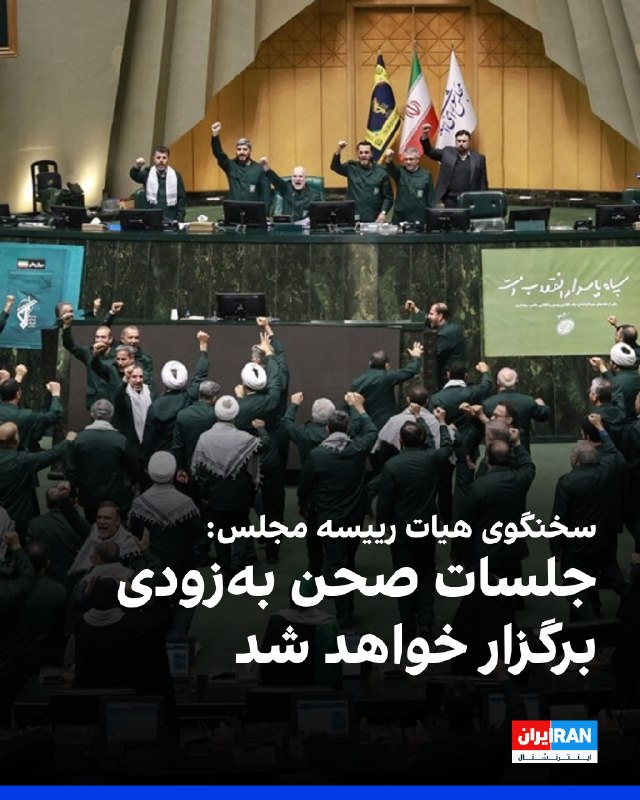

عباس گودرزی، سخنگوی هیات رییسه مجلس گفت که هیات رییسه، تصمیم موافق خود را برای برگزاری جلسات صحن به‌صورت رسمی و «فعال‌سازی چرخه قانون‌گذاری» اتخاذ کرده است.

او افزود: «مسیر هماهنگی‌ها و مقدمات لازم در حال انجام است و به‌زودی جلسات رسمی صحن همچون گذشته، برگزار خواهد شد.»
https://iranintl.com/202606017218

## IranIntlTV — post 339982

  <a href="telegram/content/IranIntlTV_339982_1780296227.mp4" target="_blank">🎬 Download video</a>

یک شهروند با ارسال ویدیویی به ایران‌اینترنشنال در دوشنبه ۱۱ خرداد، رد عبور یک موشک را در آسمان امیدیه در خوزستان نشان می‌دهد.

## IranIntlTV — post 339981

🗣روایت شما از صدای انفجار و عبور جنگنده- دوشنبه ۱۱ خرداد:

🔹حدود ساعت ۶:۳۰ دقیقه صبح از شهرستان امیدیه خوزستان موشک شلیک شد.

🔹بین ساعت ۹ تا ۹:۱۵ صبح در مناطق مختلف تهران مانند جردن، سعادت‌آباد، باغ فیض پونک و اتوبان ارتش صدای عبور جنگنده در ارتفاع پایین شنیده شد.

🔹ساعت حدود ۹:۱۰ صبح صدای سه انفجار پیاپی در بندرعباس شنیده شد.

🔹حدود ساعت ۹:۱۵ صبح در اصفهان صدای چند انفجار شنیده شد.

## IranIntlTV — post 339980

  <a href="telegram/content/IranIntlTV_339980_1780296230.mp4" target="_blank">🎬 Download video</a>

ویدیوی رسیده به ایران‌اینترنشنال، دود ناشی از انفجار را در ارتفاعات اصفهان در دوشنبه ۱۱ خرداد نشان می‌دهد. بر اساس گزارش‌ها، هم‌زمان صدای پرواز جنگنده در تهران و صداهای انفجار در بندرعباس شنیده شده است.

## IranIntlTV — post 339979

  <a href="telegram/content/IranIntlTV_339979_1780296232.mp4" target="_blank">🎬 Download video</a>

ناشران مستقل خارج از کشور در دهمین نمایشگاه کتاب «تهران، بدون سانسور» آثار خود را در شهرهای تورنتو و اتاوا به نمایش گذاشتند.

گزارش مهسا مرتضوی، خبرنگار ایران‌اینترنشنال
@iranintltv

## IranIntlTV — post 339978

  <a href="telegram/content/IranIntlTV_339978_1780296234.mp4" target="_blank">🎬 Download video</a>

ایرانیان مقیم کلگری کانادا در حمایت از انقلاب ملی و در اعتراض به تداوم اعدام‌ها در ایران، مقابل ساختمان شهرداری این شهر تجمع کردند.

گزارش سپیدار ولیان، خبرنگار ایران‌اینترنشنال
@iranintltv

## IranIntlTV — post 339977

  <a href="telegram/content/IranIntlTV_339977_1780296236.mp4" target="_blank">🎬 Download video</a>

گزارش تازه شبکه ان‌بی‌سی نشان می‌دهد فناوری و تجهیزات نظامی چین ممکن است در حمایت از جمهوری اسلامی در جریان جنگ اخیر با آمریکا نقش داشته باشد.

جزییات بیشتر با علیرضا محبی، خبرنگار ایران‌اینترنشنال
@iranintltv

## IranIntlTV — post 339976

  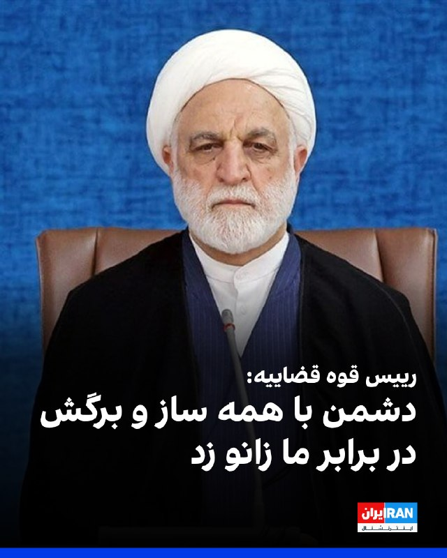

غلامحسین محسنی اژه‌ای، رییس قوه قضاییه، گفت که بعد از جنگ «جایگاه جمهوری اسلامی رفیع‌تر از گذشته شده است» و افزود: «سناتورها و اندیشمندان دشمن می‌گویند جمهوری اسلامی قدرت چهارم دنیا شده است.»

او اضافه کرد: «دشمن با همه ساز و برگش در برابر ما زانو زد.»

محسنی اژه‌ای ادامه داد: «امروز وحدت و انسجام ملی ما در دنیا زبان‌زد است.»
https://iranintl.com/202606010480

## IranIntlTV — post 339975

  <a href="https://t.me/IranintlTV/339975" target="_blank">📎 Download file</a>

🎧نسخه صوتی اخبار بامدادی | دوشنبه ۱۱ خرداد
@iranintlTV

## IranIntlTV — post 339974

  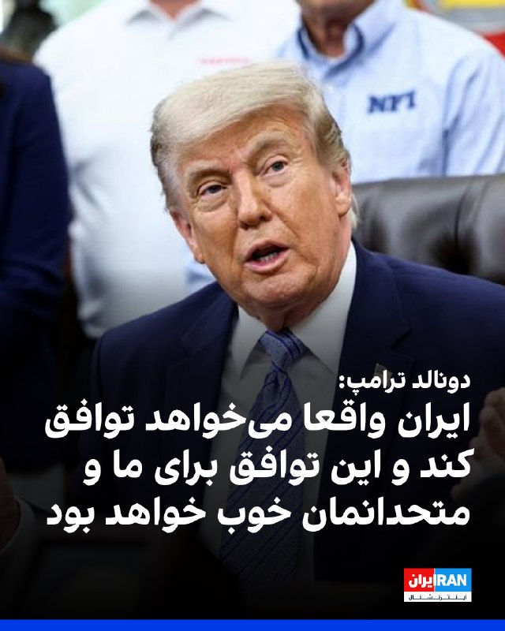

دونالد ترامپ، رییس‌جمهور ایالات متحده، در شبکه اجتماعی تروث سوشال نوشت که ایران «واقعا می‌خواهد به توافق برسد» و این توافق «برای آمریکا و متحدانش توافق خوبی خواهد بود.»

او خطاب به منتقدانش نوشت: «فقط بنشینید و آرام باشید؛ در پایان همه‌چیز خوب پیش خواهد رفت، همیشه همین‌طور است.»

ترامپ افزود که اما آیا «دموکرات‌های کودن و برخی جمهوری‌خواهان ظاهرا غیرمیهن‌دوست» نمی‌فهمند که وقتی بازیگران سیاسی مدام، بارها و بارها و در سطحی بی‌سابقه، با نیش و کنایه منفی می‌گویند باید سریع‌تر حرکت کنم، یا کندتر حرکت کنم، یا وارد جنگ شوم، یا وارد جنگ نشوم، یا هر چیز دیگری، انجام درست کارم و مذاکره کردن برای من بسیار سخت‌تر می‌شود؟
https://iranintl.com/202606011537

## IranIntlTV — post 339973

  <a href="telegram/content/IranIntlTV_339973_1780296241.mp4" target="_blank">🎬 Download video</a>

حکم اعدام مهرداد محمدی‌نیا و اشکان مالکی، دو معترض بازداشتی دی‌ماه، پس از تایید در دیوان عالی کشور اجرا شد.
گفت‌وگو با نازلی صدقی، حقوقدان و عضو شبکه وکلای «یک‌کلمه»
@iranintltv

## IranIntlTV — post 339972

  <a href="telegram/content/IranIntlTV_339972_1780296243.mp4" target="_blank">🎬 Download video</a>

مهدی تاج، رییس فدراسیون فوتبال، درباره صادر نشدن ویزای آمریکا برای اعضای تیم ملی پیش از جام جهانی گفت: «فیفا مسئول برگزاری مسابقات و روند صدور ویزا برای تیم‌های شرکت‌کننده است، نه دولت آمریکا.»

گفت‌وگو با کوشا دلشاد، مربی فوتبال
@iranintltv

## IranIntlTV — post 339971

  

خبرگزاری میزان، وابسته به قوه قضاییه، اعلام کرد حکم اعدام مهرداد محمدی‌نیا و اشکان مالکی، دو شهروند متهم در پرونده آتش‌زدن مسجد جعفری در محله کوی نصر تهران، پس از تایید در دیوان عالی کشور اجرا شد.

بر اساس این گزارش، محمدی‌نیا و مالکی در ارتباط با حوادث اعتراضات دی‌ماه ۱۴۰۴ بازداشت شده بودند و مقام‌های قضایی آنان را از «عوامل اصلی» آتش‌زدن مسجد جعفری در محله گیشا معرفی کرده‌اند.

در گزارش میزان، اتهام‌های مطرح‌شده علیه این دو نفر شامل تخریب و آتش‌زدن مسجد، تخریب اموال عمومی، درگیری با ماموران، مسدود کردن خیابان‌ها و ممانعت از عبور و مرور مردم عنوان شده است.

میزان همچنین به اعترافات منتسب به اشکان مالکی اشاره کرده و نوشته است او گفته پس از ورود به حیاط مسجد، بنزین ریخته‌شده روی زمین را با فندکی که مهرداد محمدی‌نیا به او داده بود آتش زده است.

در این گزارش ادعا شده تصاویر دوربین‌های مداربسته، اقدامات منتسب به متهمان را نشان داده است.

https://iranintl.com/202606018263

## IranIntlTV — post 339970

  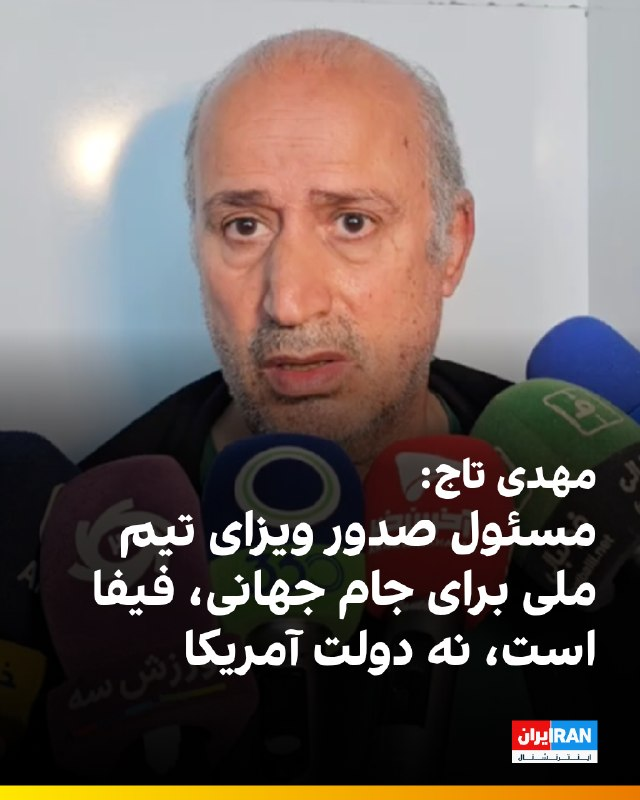

🔻مهدی تاج، رییس فدراسیون فوتبال، درباره صادر نشدن ویزای آمریکا برای تیم ملی پیش از حضور در جام جهانی، در جمع خبرنگاران گفت: «تکرار می‌کنم، فیفا مسئول برگزاری مسابقات است و از نظر ما مسئول صدور ویزا نیز فیفا است، نه دولت آمریکا؛ چون فیفا این مسابقات را در آنجا برگزار می‌کند.»

🔹مهدی تاج ادامه داد: «من خودم عضو کمیته مسابقات فیفا بودم؛ زمانی که به کشورها رای می‌دادیم، آن‌ها متعهد می‌شدند الزامات میزبانی را رعایت کنند. فکر می‌کنم تعداد زیادی از نهادهای مرتبط تعهد داده‌اند که هنگام پذیرش میزبانی، برخی وظایف را انجام دهند که یکی از آن‌ها صدور ویزاست. این موضوع انجام خواهد شد و من امیدوارم فیفا به مسئولیتی که پذیرفته عمل کند. بر اساس گفت‌وگوهایی که به‌صورت مستقیم با مسئولان فیفا داشته‌ایم، این مسئله حل خواهد شد و مشکلی در این زمینه وجود ندارد.»

🔹رییس فدراسیون فوتبال گفت: «تیم ملی شرایط خوبی دارد. معمولا درباره تنگناهای مالی صحبت نمی‌کنم، اما واقعیت این است که فدراسیون به شدت تحت فشار مالی قرار دارد. دلیل آن نیز هزینه‌های سرسام‌آور دلاری است.»

@iranintltvsport

## IranIntlTV — post 339969

  <a href="telegram/content/IranIntlTV_339969_1780296247.mp4" target="_blank">🎬 Download video</a>

شماری از ایرانیان یکشنبه در لس‌آنجلس با تاکید بر جایگاه پرچم شیر و خورشید به‌عنوان نماد هویت و وحدت ملی تجمع کردند.

گزارش نیلوفر منصوری، خبرنگار ایران‌اینترنشنال
@iranintltv

## IranIntlTV — post 339968

  

بازارهای آسیایی صبح دوشنبه با افزایش ارزش سهام مرتبط با هوش مصنوعی، نگرانی‌ها در مورد عدم پیشرفت در مذاکرات ایران و آمریکا را جبران کردند.

بر اساس گزارش‌ها، قیمت نفت برنت ۱.۹ درصد و نفت خام آمریکا ۲.۴ درصد افزایش یافت. دلیل این افزایش قیمت هم عدم قطعیت در مورد توافق بین آمریکا و جمهوری اسلامی است که هنوز امضا نشده است.
https://iranintl.com/202606010095

## IranIntlTV — post 339967

  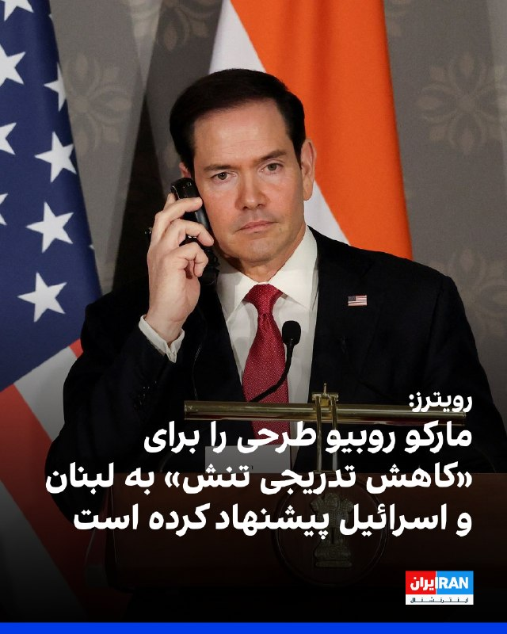

یک مقام آمریکایی گفت مارکو روبیو، وزیر خارجه ایالات متحده، با جوزف عون، رییس‌جمهوری لبنان، و بنیامین نتانیاهو، نخست‌وزیر اسرائیل، در مورد مذاکرات دیپلماتیک بین این دو کشور کفت‌وگو کرد و طرحی را برای «کاهش تدریجی تنش» پیشنهاد داد.

به گزارش رویترز، این مقام آمریکایی گفت که ایالات متحده پیشنهاد داده است که به عنوان گام اول، حزب‌الله، تمام حملات به اسرائیل را متوقف کند و در عوض اسرائیل از تشدید تنش در بیروت خودداری کند.

به گفته او، «این موضوع، فضایی را برای کاهش تدریجی تنش و توقف مؤثر خصومت‌ها ایجاد می‌کند.»

بر اساس این گزارش، عون تلاش کرد این پیشنهاد را پیش ببرد و دست‌یابی به یک توافق را تضمین کند. با این حال، نبیه بری، رییس پارلمان لبنان، که ادعا می‌کرد تعهد حزب‌الله به آتش‌بس را تضمین می‌کند، خواستار آن شد که اسرائیل ابتدا پیش‌قدم شود.

نتانیاهو یک‌شنبه گفته بود که با وجود آتش‌بس اعلام شده بیش از شش هفته پیش، به ارتش دستور داده است که در نبرد علیه حزب‌الله، بیشتر به داخل لبنان پیشروی کنند.

به نوشته رویترز، مقام آمریکایی گفت که ایالات متحده انتظار ندارد اسرائیل حملات حزب‌الله به غیرنظامیان خود را تحمل کند.

## IranIntlTV — post 339966

  <a href="telegram/content/IranIntlTV_339966_1780296251.mp4" target="_blank">🎬 Download video</a>

جاویدنامان انقلاب ملی ایرانیان
«آیدا عقیلی» شامگاه ۱۸ دی‌ماه در شرق تهران با شلیک مستقیم دو گلوله به سر، جان خود را از دست داد. نامش در حافظه‌ی این سرزمین می‌ماند و یادش چراغ راه آزادی‌خواهان است.
@iranintltv

## Shin_Persian — post 6348

  <a href="telegram/content/Shin_Persian_6348_1780296253.mp4" target="_blank">🎬 Download video</a>

Vahid Online ✓ @Vahid
Mon, 01 Jun 2026 03:14:16 UTC

'شلیک موشک از #امیدیه در خوزستان'
ویدیوی دریافتی، دوشنبه ۱۱ خرداد ساعت ۶:۳۰ به وقت #ایران
#Iran

English

'Missile launch from #Omidiyeh in Khuzestan'
Received video, Monday, June 1, at 6:30 AM #Iran time
#Iran

𝕏 · @shin_persian

## Shin_Persian — post 6347

  

Shin ✓ @hey_itsmyturn Mon, 01 Jun 2026 05:05:45 UTC President Trump @POTUS: "Iran really wants to make a deal, and it will be a good one for the U.S.A. and those that are with us. But don’t the Dumocrats, and various seemingly unpatriotic Republicans, understand…

## Shin_Persian — post 6346

Shin ✓ @hey_itsmyturn
Mon, 01 Jun 2026 05:05:45 UTC

President Trump @POTUS:
"Iran really wants to make a deal, and it will be a good one for the U.S.A. and those that are with us. But don’t the Dumocrats, and various seemingly unpatriotic Republicans, understand that it is MUCH tougher for me to properly do my job and negotiate, when political hacks keep negatively “chirping,” at levels never seen before, over and over again, that I should move faster, or move slower, or go to war, or not go to war, or whatever. Just sit back and relax, it will all work out well in the end - It always does! President DJT"

فارسی

رئیس‌جمهور ترامپ @POTUS:
"ایران واقعاً خواهان توافق است و این توافقی خوب برای ایالات متحده و کسانی که با ما هستند خواهد بود. اما آیا دمکرات‌های احمق (Dumocrats) و جمهوری‌خواهان مختلف که ظاهراً غیروطن‌پرست هستند، درک نمی کنند که برای من بسیار سخت‌تر است که کارم را به درستی انجام دهم و مذاکره کنم، وقتی که مزدوران سیاسی مدام با سطحی بی‌سابقه به شکلی منفی «ووزووز» می‌کنند و بارها و بارها می‌گویند که باید سریع‌تر حرکت کنم، یا کندتر حرکت کنم، یا وارد جنگ شوم، یا وارد جنگ نشوم، یا هر چیز دیگر. فقط بنشینید و آرام باشید، در نهایت همه چیز به خوبی پیش خواهد رفت - همیشه همین‌طور می‌شود! رئیس‌جمهور دی‌جی‌تی"

𝕏 · @shin_persian

## Shin_Persian — post 6345

  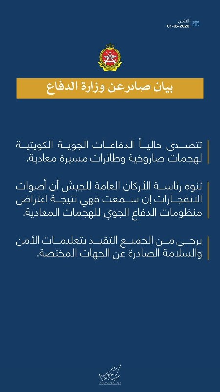

Shin ✓ @hey_itsmyturn
Mon, 01 Jun 2026 03:09:11 UTC

Kuwait Ministry of Defense:
Air defenses are currently engaging hostile missile and drone attacks.

General Staff notes that explosion sounds are the result of air defense interceptions.

Follow safety instructions …

Source: https://x.com/i/web/status/2061283849951166777

فارسی

وزارت دفاع کویت:
پدافند هوایی در حال حاضر در حال درگیری با حملات موشکی و پهپادی متخاصم است.

ستاد کل نیروهای مسلح خاطرنشان می‌کند که صدای انفجارها ناشی از رهگیری‌های پدافند هوایی است.

دستورالعمل‌های ایمنی را رعایت کنید ...

منبع: https://x.com/i/web/status/2061283849951166777

𝕏 · @shin_persian

## Shin_Persian — post 6344

  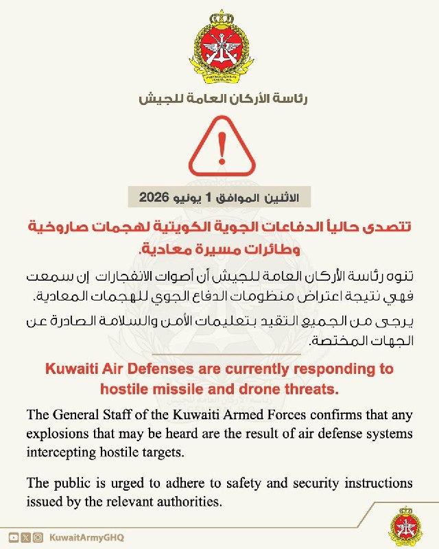

Shin ✓ @hey_itsmyturn
Mon, 01 Jun 2026 03:07:57 UTC

Kuwaiti Air Defenses are currently responding to hostile missile and drone attacks.

General Staff of the Army: Explosions heard are the result of interceptions.

Follow all safety instructions from authorities.

#Kuwa…

Source: https://x.com/i/web/status/2061283538721206351

فارسی

پدافند هوایی کویت در حال حاضر در حال مقابله با حملات موشکی و پهپادی متخاصم است.

ستاد کل ارتش: انفجارهای شنیده شده نتیجه رهگیری‌ها است.

تمامی دستورالعمل‌های ایمنی مقامات را رعایت کنید.

#Kuwa…

منبع: https://x.com/i/web/status/2061283538721206351

𝕏 · @shin_persian

## FarsiVOA — post 219231

🔺ترامپ توافق احتمالی با رژیم ایران را «توافقی خوب» برای آمریکا توصیف کرد

▪️دونالد ترامپ، رئیس‌جمهوری آمریکا، اعلام کرد که جمهوری اسلامی «واقعاً می‌خواهد به یک توافق برسد و این توافق برای آمریکا و کسانی که با ما هستند، توافق خوبی خواهد بود.»

▪️پیشتر اکسیوس و نیویورک‌تایمز گزارش دادند پرزیدنت ترامپ خواستار سخت‌گیرانه‌تر شدن شروط چارچوب توافق احتمالی با جمهوری اسلامی شده و نسخه اصلاح‌شده را برای بررسی به تهران فرستاده است.

▪️اکسیوس نوشت ترامپ از تیم خود خواسته چند بند، به‌ویژه بندهای مربوط به برنامه هسته‌ای و مواد هسته‌ای را اصلاح کنند.

▪️نیویورک‌تایمز نیز گزارش داد ترامپ از کندی پاسخ جمهوری اسلامی به پیشنهادهای آمریکا ناراضی است.

⬇️ بیشتر بخوانید:
https://ir.voanews.com/a/trump-described-possible-agreement-with-iran-as-a-good-deal-for-us/8156044.html

## FarsiVOA — post 219230

  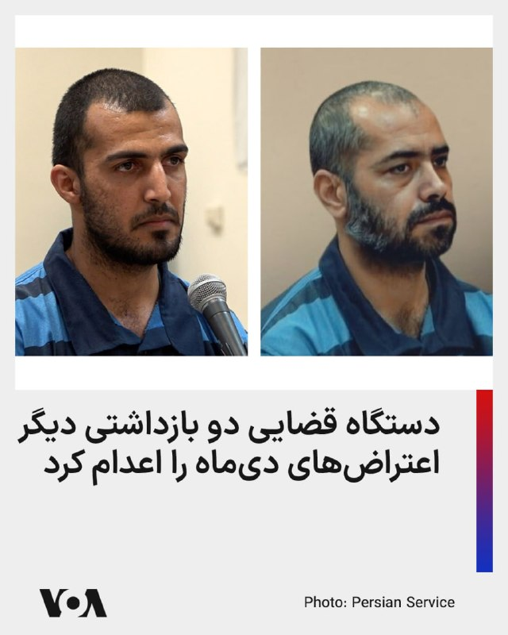

خبرگزاری میزان وابسته به دستگاه قضایی جمهوری اسلامی، از اجرای حکم اعدام مهرداد محمدی‌نیا و اشکان مالکی، دو نفر از معترضان دی ماه ۱۴۰۴ خبر داد.

این دو معترض صبح روز ۱۱ خرداد و کمتر از پنج ماه پس از دستگیری اعدام شدند و از روند برگزاری دادگاه و نحوه دفاعیات گزارشی منتشر نشده است.

مهرداد محمدی‌نیا و اشکان مالکی در پرونده موسوم به «مسجد جعفری»، متهم به مسدودسازی خیابان و آتش‌زدن مسجد شده بودند. این پرونده یک متهم دیگر به نام «آرمان معرفتی» نیز دارد و منابع حقوق بشری نگران اعدام این معترض نیز هستند.

«اقدام به تخریب و آتش‌زدن عمدی مسجد»، «تخریب اموال عمومی»، «درگیری با مأموران انتظامی»، و «انسداد خیابان‌ها و ممانعت از عبور و مرور مردم»، از جمله اتهام‌های منتسب به این دو معترض بوده است.

در خبر اولیه، جزئیاتی در مورد زمان و شرایط بازداشت، و روند دادرسی این دو اعلام نشده و تنها آمده است که حکم اعدام آنها پس از تأیید حکم در دیوان عالی کشور اجرا شده است.
@FarsiVOA

## FarsiVOA — post 219229

🔺قیمت نفت با پیشروی اسرائیل در لبنان بیش از دو درصد افزایش یافت

▪️قیمت نفت در معاملات اولیه روز دوشنبه، پس از پیشروی تازه ارتش اسرائیل در جنوب لبنان و افزایش نگرانی‌ها درباره امنیت تنگه هرمز، بیش از دو درصد بالا رفت. روندی که از نگاه بازار می‌تواند بر بازگشایی تنگه هرمز و بازگشت عرضه نفت اثر بگذارد.

▪️نفت خام آمریکا با دو دلار و ۳۷ سنت افزایش، به ۸۹ دلار و ۷۳ سنت در هر بشکه رسید. نفت برنت نیز با دو دلار و ۱۶ سنت افزایش، ۹۳ دلار و ۲۸ سنت معامله شد.

▪️این جهش پس از آن رخ داد که قیمت‌ها در معاملات جمعه، به امید توافق تهران و واشنگتن، کاهش یافته بود.

▪️افزایش بهای نفت نشان می‌دهد ریسک ژئوپلیتیک در خاورمیانه بار دیگر بر نگرانی‌های مربوط به تقاضای جهانی غلبه کرده است.

⬇️ بیشتر بخوانید:
https://ir.voanews.com/a/oil-prices-rise-more-than-2-percent-as-israel-advances-in-lebanon/8156043.html

## FarsiVOA — post 219228

Farsi VOA pinned an audio file

## FarsiVOA — post 219227

  <a href="https://t.me/farsivoa/219227" target="_blank">📎 Download file</a>

🔴📢‌ پادکست خبری یکشنبه ۱۰ خرداد ۱۴۰۵

🛜در صورتی که با مشکل اینترنت مواجه هستید میتوانید اخبار صدای آمریکا را از نسخه‌های پادکست خبری ما روزانه دنبال کنید و یا اخبار را از نسخه سبک وب‌سایت ما پیگیر باشید:
https://ir.voanews.com/lite

📡بروزترین فرکانسهای ماهواره‌ای را نیز میتوانید از صفحه زیر پیگیری کنید:
https://ir.voanews.com/satellite

🔔دیگر شبکه‌های اجتماعی ما هم دنبال کنید:
https://linktr.ee/voafarsi

ما را به اشتراک بگذارید
@farsivoa

## FarsiVOA — post 219226

🔺آمریکا طرح تازه‌ای برای کاهش تنش میان لبنان و اسرائیل پیشنهاد کرد

▪️یک مقام آمریکایی به رویترز گفت مارکو روبیو، وزیر خارجه آمریکا، در گفت‌وگو با رئیس جمهور لبنان، و نخست‌وزیر اسرائیل، طرح تازه‌ای را برای کاهش تنش میان اسرائیل و لبنان مطرح کرده است.

▪️هدف از این طرح ایجاد زمینه برای «کاهش تدریجی تنش» و رسیدن به توقف مؤثر درگیری‌ها عنوان شده است.

▪️بر اساس این طرح، در گام نخست حزب‌الله لبنان، گروه مورد حمایت ایران، باید همه حملات خود به اسرائیل را متوقف کند و در مقابل، اسرائیل از تشدید عملیات در بیروت خودداری کند.

▪️این پیشنهاد در حالی است که آتش‌بسی که بیش از شش هفته پیش با میانجی‌گری آمریکا اعلام شد، در عمل بارها با حملات متقابل حزب‌الله و اسرائیل تضعیف شده است.

⬇️ بیشتر بخوانید:
https://ir.voanews.com/a/rubio-spoke-to-israeli-lebanese-leaders-about-new-ceasefire-plan/8156041.html

## FarsiVOA — post 219225

🔺آژیرهای هشدار در کویت؛ سپاه پاسداران از حمله به یک پایگاه هوایی منطقه خبر داد

▪️سپاه پاسداران از حمله به یک پایگاه هوایی در منطقه خبر داد و ادعا کرد که این پایگاه مبدأ حمله به یک دکل مخابراتی در جزیره سیریک واقع در استان هرمزگان بوده است.

▪️روابط عمومی سپاه پاسداران دوشنبه از اعلام جزئیات بیشتر خودداری کرد و مشخص نکرد که این پایگاه در کدام کشور قرار داشت.

▪️در این زمینه خبرگزاری رسمی کویت گزارش داد که پدافند هوایی این کشور، جایی که یک پایگاه آمریکا در آن قرار دارد، روز دوشنبه در حال رهگیری حملات موشکی و پهپادی بوده است.
آژیرهای هشدار نیز در سراسر کویت به صدا درآمده‌اند، اما جزئیات بیشتری ارائه نشده است.

⬇️ بیشتر بخوانید:
https://ir.voanews.com/a/8156042.html

## DW_Farsi — post 125360

  

🔶 ارتش کویت از مقابله با حملات موشکی و پهپادی خبر داد
 
ارتش کویت صبح دوشنبه اول ژوئن (۱۱ خرداد) از وقوع "حملات موشکی و پهپادی خصمانه" به خاک این کشور خبر داد. ستاد کل ارتش کویت با انتشار پیامی در شبکه ایکس اعلام کرد که پدافند هوایی این کشور در حال حاضر در حال مقابله با این حملات است و "هرگونه صدای انفجار، ناشی از عملکرد سامانه‌های پدافند هوایی در رهگیری این حملات خصمانه است".
 
ارتش کویت از شهروندان خواسته است تا به دستور‌العمل‌های ایمنی و امنیتی صادرشده توسط مقامات توجه کنند.
 
در همین حال خبرگزاری دولتی کویت نیز گزارش داد آژیرهای هشدار حمله هوایی در سراسر این کشور به صدا درآمده‌‌اند.
 
برخی رسانه‌های داخلی ایران ویدئوهایی را با عنوان "شلیک موشک‌های سپاه از خوزستان به پایگاه نظامی آمریکا در کویت" منتشر کرده‌اند.
 
همزمان سپاه پاسداران با انتشار بیانیه‌ای اعلام کرده است که یک پایگاه هوایی را که آمریکا از آن برای حمله به یک "دکل مخابراتی در شهرستان سیریک استان هرمزگان" استفاده کرده بود، هدف قرار داده است.
 
@dw_farsi

## DW_Farsi — post 125359

🔶 جام ۲۰۰۶؛ فابیو کاناوارو، دیوار مستحکم لاجوردی‌پوشان ایتالیا

🔻 گزارشی از شهرام احدی
 
"فابیو کاناوارو" با ۱۷۶ سانتی‌متر قد، از آن قامت بلند و گاه تنومندی که بسیاری از مدافعان میانی برجسته جهان دارند، برخوردار نبود. او اما به یکی از بهترین مدافعان میانی عالم فوتبال بدل شد و افتخارات گوناگونی به همراه‌ باشگاه‌های خود و نیز تیم ملی فوتبال ایتالیا کسب کرد.
 
کاناوارو که زاده‌ شهر ناپل است، فعالیت حرفه‌ای خود را در باشگاه ناپولی آغاز کرد. او پنج سال در تیم جوانان این باشگاه بازی می‌کرد و در بین سال‌های ۱۹۹۲ تا ۱۹۹۵ نیز در خدمت تیم بزرگسالان این باشگاه در لیگ دسته اول ایتالیا، سری آ بود.
 
این مدافع پرتوان تا سال ۲۰۰۶ در سه باشگاه دیگر لیگ ایتالیا (پارما، اینترمیلان و یوونتوس تورین) توپ زد.
 
او سپس به باشگاه پرآوازه رئال مادرید پیوست و به همراه این تیم دو بار قهرمان لیگ اسپانیا شد.
 
کاناوارو سرانجام در سال ۲۰۱۱ در باشگاه "الاهلی" به فعالیت حرفه‌ای خود پایان داد.
 
اوج موفقیت‌های کاناوارو در سال ۲۰۰۶ بود. او در آن سال نه تنها به همراه لاجوردی‌پوشان ایتالیا به قهرمانی فوتبال جهان دست یافت، بلکه خود نیز به عنوان بهترین فوتبالیست اروپا و جهان برگزیده شد.
 
این نخستین بار بود که یک مدافع، عنوان بهترین بازیکن فوتبال جهان را از آن خود می‌کرد.
 
ایتالیایی‌ها در فینال جام جهانی ۲۰۰۶ آلمان در پیکار با تیم ملی فرانسه موفق شدند "زیدان" و یارانش را در ضربات پنالتی شکست دهند و برای چهارمین بار قهرمان جهان شوند.
@dw_farsi

## DW_Farsi — post 125358

  

🔶 سپاه پاسداران: یک پایگاه هوایی آمریکا هدف قرار گرفت
 
سپاه پاسداران دوشنبه ۱۱ خرداد (اول ژوئن) در اطلاعیه‌ای اعلام کرد که یک "پایگاه هوایی مبدأ تجاوز" را که به گفته سپاه، آمریکا از آن در حمله به یک "دکل مخابراتی در شهرستان سیریک استان هرمزگان" استفاده کرده بود، هدف قرار داده است.
 
به گزارش سپاه نیوز نیروهای هوافضای سپاه این پایگاه را "مورد هدف قرار دادند و اهداف پیش‌بینی شده منهدم گردید".
 
در اطلاعیه سپاه به کشوری که این پایگاه هوایی در آن مستقر بوده، اشاره‌ای نشده است، با این حال به گزارش خبرگزاری فرانسه همزمان کویت در همین روز از حملات موشکی و پهپادی به خاک خود خبر داد.
 
سپاه در بیانیه‌ خود هشدار داده است که "در صورت تکرار تجاوز، پاسخ کاملاً متفاوت خواهد بود" و مسئولیت بر عهده آمریکاست.
 
همزمان فرماندهی ایالات متحده آمریکا نیز اعلام کرد که "حملات دفاعی را در روزهای شنبه و یکشنبه علیه مراکز راداری و مراکز فرماندهی و کنترل پهپادهای ایران در شهر گروک و جزیره قشم" انجام داده است. در اطلاعیه سنتکام گفته شده که این حملات در واکنش به اقدامات تهاجمی ایران در زمان آتش‌بس صورت گرفت.
@dw_farsi

## DW_Farsi — post 125357

  

🔶 ترامپ: بخش عمده توافق با ایران درباره فعالیت‌های هسته‌ای است
 
دونالد ترامپ، رئیس جمهور آمریکا، تأکید کرد بخش عمده‌ای از توافق مدنظر این کشور با ایران، درباره فعالیت‌ هسته‌ای جمهوری اسلامی است.
 
او روز دوشنبه اول ژوئن با انتشار پستی در شبکه اجتماعی متعلق به خودش، تروث سوشال، با رد گزارش شبکه خبری "سی‌ان‌ان"‌ درباره جزئیات توافق احتمالی آمریکا با ایران نوشت: «در این توافق به‌روشنی و کاملاً صریح آمده است که ایران نباید به سلاح هسته‌ای دست پیدا کند. سپس در ادامه، با جزئیات فراوان و بسیار قاطع، به جنبه‌های مختلف دیگر موضوع هسته‌ای پرداخته می‌شود. در واقع بخش عمده این توافق دقیقا درباره همین موضوع است.»
 
این گفته ترامپ در حالی است که پیش‌تر شبکه خبری "سی‌بی‌اس" گزارش داده بود که رئیس جمهور آمریکا اصلاحاتی را در متن تفاهم‌نامه میان تهران و واشنگتن اعمال کرده و نسخه جدید از طریق میانجی‌ها برای تأیید به تهران ارسال شده است.
 
در این گزارش گفته شده بود که این سومین باری است که ترامپ در پیشنهاد آمریکا تغییر وارد کرده است.
@dw_farsi

## DW_Farsi — post 125356

  

🔶 سنتکام از حملات جدید نیروهای آمریکایی به گورک و قشم خبر داد
 
فرماندهی مرکزی ایالات متحده آمریکا، سنتکام، دوشنبه اول ژوئن (۱۱ خرداد) با انتشار بیانیه‌ای در شبکه ایکس اعلام کرد، ارتش آمریکا در دو روز گذشته "حملاتی را در دفاع از خود" علیه سایت‌های راداری و مراکز فرماندهی و کنترل پهپاد ایران در منطقه روستایی گورک و جزیره قشم انجام داده است.
 
در بیانیه گفته شده این "حملات سنجیده و حساب‌شده در روزهای شنبه و یکشنبه (۳۰ و ۳۱ مه) در پاسخ به اقدامات تهاجمی ایران از جمله سرنگون کردن یک پهپاد MQ-1 صورت گرفت که بر فراز آب‌های بین‌المللی در حال مأموریت بود".
 
سنتکام افزود: «جنگنده‌های آمریکایی به سرعت واکنش نشان دادند و سامانه‌های پدافند هوایی ایران، یک ایستگاه کنترل زمینی و دو پهپاد تهاجمی انتحاری را که تهدیدی آشکار برای کشتی‌های در حال عبور از منطقه محسوب می‌شدند، منهدم کردند.»
 
در بیانیه سنتکام گفته شده است که هیچ‌یک از نیروهای نظامی آمریکا در این عملیات آسیب ندیدند.
 
سنتکام تأکید کرده است که "در برابر اقدامات خصمانه و غیرموجه ایران به حفاظت از تجهیزات، نیروها و منافع ایالات متحده ادامه خواهد داد".
@dw_farsi

## Persian_Trend_Official — post 15421

  

https://castbox.fm/vi/951612861

نسخه صوتی لایو در کست باکس

## Persian_Trend_Official — post 15420

  

https://open.spotify.com/episode/0CF20BnA3gtwwgJR9EIr5S?si=3mfbbnZZT1GX37e_rQmdwA

نسخه صوتی لایو در اسپاتیفای

## Persian_Trend_Official — post 15419

  <a href="telegram/content/Persian_Trend_Official_15419_1780296264.mp4" target="_blank">🎬 Download video</a>

صبحتون بخیر ☕️🤍

📝 Nick

📌 @persian_trend_official
پرشین ترند | متفاوت‌ترین کانال نظامی

## RadioFarda — post 157759

  

🔸ایالات متحده اعلام کرد طی دو روز اخیر به مواضع نظامی ایران حمله کرده و سپاه پاسداران نیز روز دوشنبه ۱۱ خرداد گفت «در پاسخ»، یکی از پایگاه‌های مورد استفاده آمریکا را هدف قرار داده است.

🔸سنتکام، فرماندهی مرکزی آمریکا، در پیامی در شبکه اجتماعی ایکس اعلام کرد حملات به سواحل ایران در خلیج فارس در پاسخ به «اقدامات تهاجمی ایران، از جمله سرنگونی یک پهپاد ام‌کیو-۱ آمریکا که بر فراز آب‌های بین‌المللی فعالیت می‌کرد» انجام شد.

🔸سنتکام افزود: «جنگنده‌های آمریکایی به‌سرعت واکنش نشان دادند و پدافند هوایی ایران، یک ایستگاه کنترل زمینی و دو پهپاد تهاجمی یک‌طرفه را که تهدیدی آشکار برای کشتی‌های عبوری از آب‌های منطقه بودند، از میان بردند.»

🔸این فرماندهی محل این حملات را منطقه گُروک در سیریک هرمزگان و جزیره قشم اعلام کرده و همچنین افزوده است که به حفاظت از دارایی‌ها و منافع آمریکا در جریان آتش‌بس جاری ادامه خواهد داد.

🔸سپاه پاسداران انقلاب اسلامی روز دوشنبه اعلام کرد یک پایگاه هوایی مورد استفاده آمریکا برای حمله به جنوب ایران را هدف قرار داده است، اما نام این پایگاه را مشخص نکرد.

@RadioFarda

## RadioFarda — post 157758

  

🔸دونالد ترامپ، رئیس‌جمهور آمریکا، می‌گوید بخش عمده توافق هسته‌ای مدنظر واشینگتن با تهران، درباره فعالیت‌های هسته‌ای جمهوری اسلامی است.

🔸او در پستی که در شبکه اجتماعی خود تروث‌سوشال منتشر کرده، گزارش شبکه خبری سی‌ان‌ان مبنی بر اینکه توافق احتمالی ترامپ با ایران، شامل پرونده هسته‌ای این کشور نمی‌شود را رد کرد.

🔸ترامپ نوشت که این توافق «خیلی روشن بیان می‌کند که ایران به سلاح هسته‌ای دست نخواهد یافت. سپس با جزئیات فراوان و بسیار قاطع، به جنبه‌های مختلف دیگر موضوع هسته‌ای می‌پردازد. در حقیقت، بیشتر این توافق دقیقاً درباره همین موضوع است.»

🔸به جز سی‌ان‌ان، شماری از خبرگزاری‌های نزدیک به سپاه پاسداران، از جمله تسنیم و فارس، به‌طور مکرر به نقل از منابع آگاه می‌نویسند که این توافق پیشنهادی آمریکا، دست‌کم در مرحله اول شامل فعالیت هسته‌ای جمهوری اسلامی نیست.

@RadioFarda

## RadioFarda — post 157757

  

🔸ارتش کویت روز دوشنبه ۱۱ خرداد اعلام کرد پدافند هوایی این کشور «حملات خصمانه موشکی و پهپادی» را رهگیری کرده است.

🔸ستاد کل ارتش کویت در پیامی در حساب رسمی خود در شبکه اجتماعی ایکس نوشت: «هرگونه صدای انفجار شنیده‌شده، ناشی از رهگیری این حملات خصمانه توسط سامانه‌های پدافند هوایی است.»

🔸خبرگزاری دولتی کویت، کونا، نیز گزارش داد که آژیرهای هشدار در سراسر این کشور به صدا درآمده است.

🔸کویت میزبان یکی از پایگاه‌های مهم نظامی آمریکا در منطقه است. جزئیات بیشتری درباره منشأ حملات، محل اصابت احتمالی یا خسارات ناشی از آن‌ها منتشر نشده است.

🔸این رخداد در حالی گزارش شده که آتش‌بس میان آمریکا و ایران برقرار است، اما دو طرف از زمان آغاز این آتش‌بس در اوایل آوریل، به‌طور پراکنده دست به تبادل حملات زده‌اند.

@RadioFarda

## RadioFarda — post 157756

  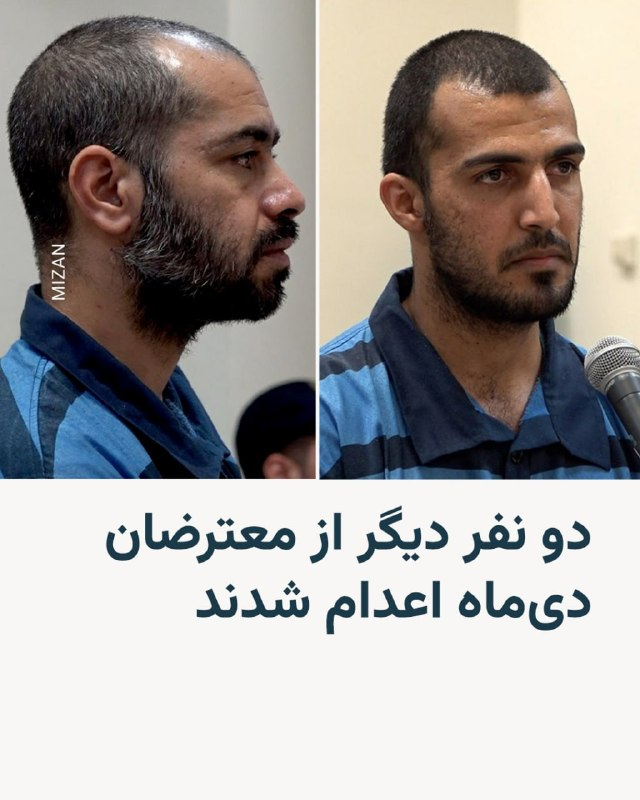

🔸قوه قضائیه ایران اعلام کرد که دو نفر دیگر از معترضان دی‌ماه ۱۴۰۴ را به اتهام «آتش‌زدن مسجد»، «لیدری کودتا»، «تخریب اموال عمومی» و «مسدودسازی خیابان‌ها» اعدام کرده است.

🔸نام این دو معترض که بامداد دوشنبه یازدهم خرداد اعدام شدند، مهرداد محمدی‌نیا و اشکان مالکی اعلام شده است.

🔸ارگان رسمی دستگاه قضایی ایران، میزان، نوشته این دو «از عوامل اصلی آتش‌زدن مسجد جعفری در محله کوی نصر تهران [بودند] که اقدام به تخریب و آتش‌زدن مسجد، تخریب اموال عمومی، درگیری با مأموران حافظان امنیت، انسداد خیابان‌ها و ممانعت از عبور و مرور مردم کرده بودند.»

🔸دستگاه قضایی جمهوری اسلامی در ماه‌های اخیر به شکل تقریباً روزانه اقدام به اجرای احکام اعدام معترضان و یا افرادی می‌کند که آن‌ها را به همکاری با آمریکا و اسرائیل متهم می‌کند. برخی نهادهای حقوق‌بشری می‌گویند جمهوری اسلامی از اعدام برای ایجاد فضای ترس و به‌عنوان عامل سرکوب استفاده می‌کند.

@RadioFarda

## RadioFarda — post 157755

  <a href="telegram/content/RadioFarda_157755_1780296270.mp4" target="_blank">🎬 Download video</a>

🔸سپاه پاسداران روز دوشنبه ۱۱ خرداد از هدف قرار دادن یک پایگاه هوایی ارتش آمریکا به دلیل آنچه «تجاوز به یک دکل مخابراتی در جزیره سیریک» خوانده،‌ خبر داد.

🔸همزمان حساب کاربری وحید آنلاین ساعت ۶:۳۰ صبح دوشنبه به وقت ایران ویدئویی از 'شلیک یک موشک از امیدیه در خوزستان را منتشر کرد.

🔸در اطلاعیه سپاه آمده: «به دنبال تجاوز ساعتی پیش ارتش متجاوز آمریکا به یک دکل مخابراتی در جزیره سیریک واقع در استان هرمزگان، رزمندگان نیروی هوافضای سپاه پایگاه هوایی مبدأ تجاوز را مورد هدف قرار دادند و اهداف پیش‌بینی شده منهدم گردید.»

🔸نیروی هوافضای سپاه همچنین هشدار داده است که در صورت تکرار حملات، پاسخ «کاملا متفاوت» خواهد بود و مسئولیت آن به عهده «رژیم متجاوز و کودک‌کش آمریکا» است.

🔸از سوی دیگر ارتش کویت صبح دوشنبه اعلام کرد که پدافند هوایی این کشور در حال مقابله با حملات موشکی و پهپادی «خصمانه» است.

🔸ستاد کل ارتش کویت در بیانیه‌ای که در شبکه اجتماعی ایکس منتشر شده اعلام کرد که اگر صداهای انفجاری شنیده شود، «ناشی از رهگیری حملات خصمانه توسط سیستم‌های پدافند هوایی است.»

@RadioFarda

## RadioFarda — post 157754

  <a href="https://t.me/radiofarda/157754" target="_blank">📎 Download file</a>

📻بشنوید: سرخط خبرها با رادیوفردا، ۱۱ خرداد ۱۴۰۵‌

@RadioFarda

## IranianMinds — post 21171

  

🔴 ترامپ کراش زده رو رئیس جمهور چین

ترامپ این عکس از خودش و رئیس‌جمهور چین رو منتشر کرده.

@IranianMinds

## IranianMinds — post 21170

🔴 سپاه:
به پایگاه مبدأ حملات، حمله کردیم.

+ نقض آتش بس چی هست اصن؟

@IranianMinds

## IranianMinds — post 21169

🔴 سنتکام:

در پایان این هفته، در عملیاتی کاملاً دفاعی، به چندین مواضع جمهوری‌اسلامی تو قشم حمله کردیم.

@IranianMinds

## IranianMinds — post 21168

  

🔴 صفحه یوتیوب امیر تتلو اعلام کرده تتلو بیش از 20 روزه داره تمرینای سخت و فشرده انجام تا به تیم ملی فوتبال دعوت بشه و روی عملکرد تیم ملی تاثیر مثبت داشته باشه هم چنین از مسولین خواسته تتلو رو آزاد کنن و به جام جهانی ببرنش.

@IranianMinds

## IranianMinds — post 21167

🔴فرمانده کل ایران محسن رضایی : یا محاصره را تمام می‌کنید یا محاصره را تمام می‌کنیم @IranianMinds

## IranianMinds — post 21166

  

🔴فرمانده کل ایران محسن رضایی :

یا محاصره را تمام می‌کنید
یا محاصره را تمام می‌کنیم

@IranianMinds

## BBCPersian — post 282543

🔻ترامپ: ایران می‌خواهد به توافق برسد، همه چیز به خوبی پایان خواهد یافت

دونالد ترامپ، رئیس‌جمهور آمریکا در تازه‌ترین پیامی که در تروث سوشال، شبکه اجتماعی خود، منتشر کرده از تمایل ایران برای رسیدن به توافق خبر داده است.

او نوشته است: «ایران واقعا می‌خواهد به توافق برسد، و این توافق، برای ایالات متحده و کسانی که با ما هستند، خوب خواهد بود.»

او در ادامه این پیام آورده است: «اما آیا دموکرات‌ها، و جمهوری‌خواهان مختلف به ظاهر غیرمیهن‌پرست، نمی‌فهمند که وقتی مهره‌های سیاسی مدام و به شکلی بی‌سابقه در حال اظهار نظرهای منفی هستند و بارها و بارها می‌گویند که باید سریع‌تر عمل کنم، یا کندتر عمل کنم، یا به جنگ بروم، یا به جنگ نروم، یا هر چیز دیگری، انجام درست وظایفم و مذاکره کردن برای من بسیار دشوارتر می‌شود؟ »

او نوشته است: «فقط بشینید و استراحت کنید، آخرش همه چیز به خوبی پایان خواهد یافت.»

@BBCPersian

## BBCPersian — post 282542

🔻هواپیمای نیروی هوایی سلطنتی بریتانیا که هفته گذشته جان هیلی، وزیر دفاع بریتانیا، را حمل می‌کرد، در حال پرواز بر فراز استونی و در نزدیکی مرز روسیه بود که اتفاق عجیبی رخ داد.

بر اساس داده‌های پروازی که سرویس جهانی بی‌بی‌سی بررسی کرده، فرستنده خودکار هواپیما ناگهان موقعیت پرواز آن را در عمق خاک روسیه و حدود ۳۰۰ کیلومتر دورتر از جایی که تنها چند ثانیه پیش قرار داشت نشان داد.

بر اساس این داده‌ها، هواپیما با سرعتی حدود ۱۱ کیلومتر بر ساعت بر فراز دریاچه‌ای در نزدیکی سن‌پترزبورگ در حال حرکت بود.

اما هیچ‌یک از این اطلاعات واقعی نبود. سامانه ناوبری هواپیما بر اثر «جعل سیگنال جی‌پی‌اس» دچار اختلال شده بود.

این پدیده زمانی رخ می‌دهد که یک منطقه با سیگنال‌های کاذب اشباع می‌شود؛ سیگنال‌هایی که دقیقا مشابه فرکانس ماهواره‌های جی‌پی‌اس طراحی شده‌اند تا سیستم‌های پروازی را گمراه کنند.
https://bbc.in/4nZO00U

@BBCPersian

## BBCPersian — post 282541

🔻رئیس جمهور لبنان «تجاوزی وحشیانه و غیرقابل‌قبول از سوی اسرائیل» را محکوم کرد

رئیس‌جمهور لبنان گفت که کشورش با «تجاوزی وحشیانه و غیرقابل‌قبول از سوی اسرائیل» روبه‌روست.

جوزف عون در پیامی در ایکس این عملیات اسرائیل را محکوم کرد و متعهد شد که «برای پایان دادن به رنج مردم لبنان، به‌ویژه ساکنان جنوب، تلاش خواهد کرد.»

شورای امنیت سازمان ملل متحد قرار است امروز در نیویورک نشستی اضطراری درباره لبنان برگزار کند.

این نشست پس از آن برنامه‌ریزی شده که بنیامین نتانیاهو، نخست‌وزیر اسرائیل، اعلام کرد تصرف این قلعه نشان‌دهنده «تغییری مهم و اساسی» در روند درگیری‌هاست.

@BBCPersian

## BBCPersian — post 282540

🔻قوه قضائیه ایران از اعدام دو نفر از معترضان دی خبر داد

خبرگزاری میزان، وابسته به قوه قضائیه ایران گزارش داده است که دو نفر از معترضان دی ماه که به گفته این خبرگزاری به دلیل نقششان در ناآرامی‌های تهران در دادگاه محکوم شده بودند، اعدام شدند.

خبرگزاری میزان این دو نفر را مهرداد محمدی‌نیا و اشکان مالکی معرفی کرده است.

بر اساس این گزارش، این دو نفر در دادگاه به اتهام «آتش زدن یک مسجد، تخریب اموال عمومی و درگیری با نیروهای امنیتی» محاکمه و به اعدام محکوم شده بودند.

قوه قضائیه ایران گفته است که احکام اعدام این دو نفر پیش از اجرا، در دیوان عالی کشور تأیید شده بود.

نهادهای حقوق بشری از جمله گزارشگر ویژه شورای حقوق بشر سازمان ملل متحد در امور ایران از افزایش موارد اعدام در ایران ابراز نگرانی می کنند.

مای ساتو، گزارشگر ویژه سازمان ملل متحد گفته است که ایران از مجازات اعدام «به‌عنوان ابزاری برای سرکوب اعتراضات، ایجاد رعب و وحشت در جامعه و خاموش کردن صدای مخالفان» استفاده می‌کند.

@BBCPersian

## BBCPersian — post 282539

  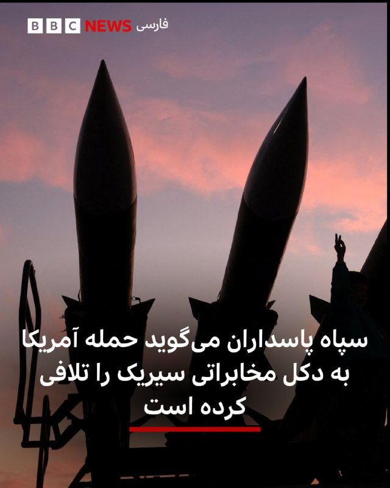

🔻سپاه پاسداران اعلام کرده است که نیروی هوافضای آن یک پایگاه هوایی را که به گفته آن در حمله آمریکا به یک دکل مخابراتی در جزیره سیریک مورد استفاده قرار گرفته بود، هدف قرار داده است.

همزمان فرماندهی مرکزی ایالات متحده (سنتکام) اعلام کرد که «حملات دفاعی علیه مراکز راداری و مراکز فرماندهی و کنترل پهپادهای ایران در شهر گروگ و جزیره قشم» انجام داده است.

آمریکا گفته است که این حملات «روزهای شنبه و یکشنبه و در واکنش به اقدامات تهاجمی ایران صورت گرفت که شامل سرنگونی یک پهپاد ام‌کیو۱ آمریکا بود که بر فراز آب‌های بین‌المللی در حال فعالیت بود.»

همزمان اطلاعیه سپاه پاسداران می‌گوید حمله امروز «به دنبال تجاوز ساعتی پیش ارتش متجاوز آمریکا» صورت گرفت اما محل پایگاهی را که هدف حمله سپاه قرار گرفته، مشخص نکرده است.

خبرگزاری فرانسه پیشتر به نقل از ارتش کویت گزارش داده بود که سامانه‌های پدافند هوایی این کشور در حال مقابله با حمله‌ای پهپادی و موشکی هستند.

@BBCPersian
📷REUTERS

## BBCPersian — post 282538

  

‌ ‌ ‌ ‌
خط اتوبوس‌ معروف لهستانی به شماره ۶۶۶ به مقصد شهر هِل - جهنم - که سه سال پیش و به دنبال اعتراضات گروه‌های مذهبی تعطیل شده بود، مجددا فعال خواهد شد.

مسیحیان محافظه‌کار ادعا کرده بودند که شماره این خط اتوبوس که پیوندهایی با شیطان در کتاب مقدس دارد، همراه با نام مقصد، شیطان‌پرستی را ترویج می‌دهد.

مسیر این تفریحگاه ساحلی دریای بالتیک به یک شوخی در بین گردشگران انگلیسی‌زبان تبدیل شده بود.

این سرویس توسط فلیکس‌باس، که مزایای بازاریابی ارائه سرویس شش-شش-شش به هل که فقط با یک حرف ال نوشته می‌شود، احیا می‌شود.

📷PKS GDYNIA/Reuters
@BBCPersian

## BBCPersian — post 282537

  

‌ ‌ ‌ ‌
مطالعه‌ای که توسط دانشمندان آمریکایی انجام شده است، نشان داده است که مصرف روزانه یک قرص می‌تواند طول عمر بیماران مبتلا به سرطان پیشرفته پانکراس را تقریبا دو برابر کند.

کارشناسان این دارو که داراکسونراسیب نام دارد، را به عنوان یک عامل تغییر دهنده در خصوص این سرطان توصیف کرده‌اند.

این آزمایش شامل ۵۰۰ نفر بود که سرطان آنها به سایر اندام‌هایشان گسترش یافته بود.

این مطالعه نشان داد که میانگین زمان بقا برای کسانی که قرص را مصرف کرده‌اند کمی بیش از یک سال بود، در حالی که این زمان برای کسانی که شیمی درمانی دریافت کرده بودند، حدود شش ماه و نیم بود.

این داروی جدید همچنین عوارض جانبی کمتری ایجاد می‌کند.

سرطان پانکراس به دلیل اینکه اغلب دیر تشخیص داده می‌شود و درمان آن دشوار است، میزان مرگ و میر بالایی دارد.

📷Reuters
@BBCPersian

## BBCPersian — post 282529

‌ ‌ ‌
دانشمندان در حال بررسی این هستند که اگر بدن انسان به‌طور مداوم در معرض چنین گرمایی قرار بگیرد، چه اتفاقی در درون آن رخ می‌دهد.

یک پژوهش در دانشگاه کالیفرنیای جنوبی بررسی کرده است که زمانی که دمای روزانه به بیش از ۳۲ درجه سانتی‌گراد رسید، چه اتفاقی برای چند هزار آمریکایی ساکن در ایالت‌ها و اقلیم‌های مختلف رخ داد.

با استفاده از آزمایش‌های خون، این تیم سن زیستی ۳۶۰۰ شرکت‌کننده را با سن واقعی آن‌ها اندازه‌گیری کرد و آن را با شاخص گرما مقایسه کرد. یون‌یانگ چوی، پژوهشگر فوق‌دکتری و نویسنده این مطالعه، می‌گوید تاثیر این وضعیت بر بدن افراد شگفت‌آور بود، افرادی که بیشتر در معرض دماهای بالاتر قرار داشتند، سریع‌تر پیر می‌شدند.

📷📸GettyImages/ AFP via Getty Images
@BBCPersian

## BBCPersian — post 282524

‌ ‌ ‌
دولت ایتالیا به‌دلیل ارائه مشوق‌ها و معافیت‌های مالیاتی مورد انتقاد قرار گرفته است. این کشور با این کار ثروتمندان فرانسوی و ساکنان خارجی فرانسه را به ترک این کشور ترغیب کرده و هدف انتقاد دولت فرانسه قرار گرفته است.

همچنین در پی آسیب‌هایی که جنگ در خاورمیانه به کشورهای حوزه خلیج فارس وارد کرده، ایتالیا بیش از پیش به مقصدی جذاب برای ثروتمندان تبدیل شده است.

https://trib.al/eoPjpM1
📷Getty/ John Laurenson
@BBCPersian

## Dirty_Kids — post 390710

مملکت نه رهبر داره، نه رئیس جمهور نه مجلس، بعد سر کوچه دارن آمریکا رو تهدید میکنن به نابودی!!!

@Dirty_Kids 👻

## Dirty_Kids — post 390707

چی بگم والا اینم با چادر رفت کافه
هممونم بعدشو یادمونه

@Dirty_Kids 👻

## Dirty_Kids — post 390706

  

خایه رو‌ ویدا موحد داشت که تو روزایی که هیشکی جرات نداشت شال از سرش بیفته خیابون انقلاب رو به آتیش کشید نه شما حجاب استایلای کوله به کون

@Dirty_Kids 👻

## alonews — post 124094

  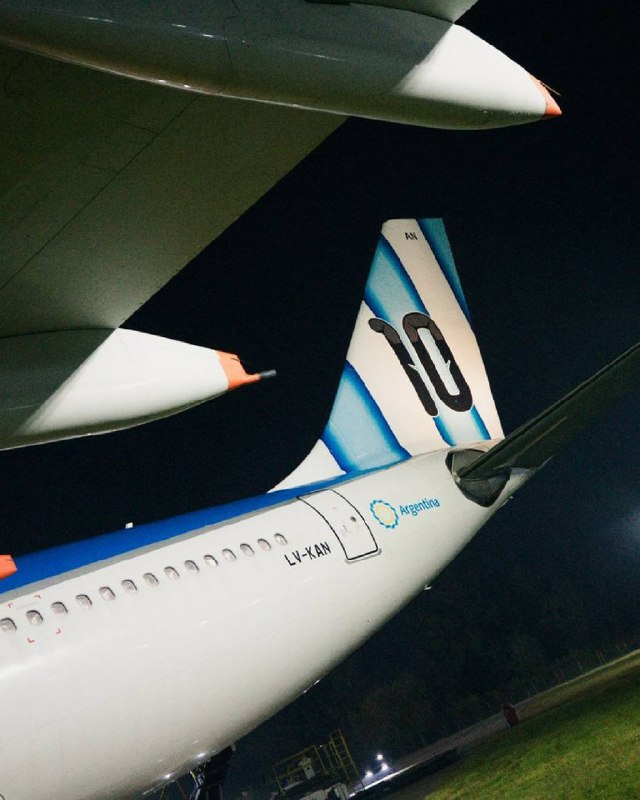

‏🇦🇷👤تصویری از هواپیمای تیم ملی آرژانتین با شماره کاپیتان لیونل مسی
@AloSport

## alonews — post 124093

  <a href="telegram/content/alonews_124093_1780296279.webm" target="_blank">🎬 Download video</a>

👈سخنگوی هیأت رئیسه مجلس: هیأت رئیسه مجلس، تصمیم مثبت و موافق خود را برای برگزاری جلسات به‌صورت رسمی و فعال‌سازی چرخۀ قانون‌گذاری اتخاذ کرده است.

🔴 مسیر هماهنگی‌ها و مقدمات لازم در حال انجام است و به‌زودی جلسات رسمی صحن همچون گذشته، با دستور کار مشخص برای قانون‌گذاری برگزار خواهد شد

✅ @AloNews خبر جنگ

## alonews — post 124092

  <a href="telegram/content/alonews_124092_1780296279.webm" target="_blank">🎬 Download video</a>

👈حاج علی دبیر:
یه مشت آش و لاش مخالف حکومت هستن

✅ @AloNews خبر جنگ

## alonews — post 124091

  <a href="telegram/content/alonews_124091_1780296280.webm" target="_blank">🎬 Download video</a>

👈بازدهی بازارهای ایران در یک سال گذشته: طلا اول شد، پژو ۲۰۷ دوم، دلار سوم

✅ @AloNews خبر جنگ

## alonews — post 124090

  <a href="telegram/content/alonews_124090_1780296280.webm" target="_blank">🎬 Download video</a>

👈کانال ۱۴ عبری: امروز رأی‌گیری برای انحلال کنست انجام خواهد شد

✅ @AloNews خبر جنگ

## alonews — post 124089

  <a href="telegram/content/alonews_124089_1780296280.webm" target="_blank">🎬 Download video</a>

👈سی‌ان‌ان‌: دور دوم انتخابات ریاست‌جمهوری در کلمبیا، دو بینش سیاسی کاملاً متضاد را به مصاف یکدیگر خواهد فرستاد

🔴 «اسپریلا» که در دور اول بیشترین آرا را کسب کرد، به طور مثبت از ترامپ صحبت کرده؛ این انتخابات نیز مهم است، زیرا می‌تواند روابط کلمبیا با واشنگتن را شکل دهد

🔴 با توجه به نقش کلمبیا در مبارزه با قاچاق مواد مخدر، نتیجه این انتخابات در آمریکا تحت نظارت دقیق قرار خواهد گرفت

✅ @AloNews خبر جنگ

## alonews — post 124088

  <a href="telegram/content/alonews_124088_1780296280.webm" target="_blank">🎬 Download video</a>

👈 اقتصاد چین در سه دهه اخیر پیچیده‌تر شده و رتبه آن در شاخص پیچیدگی اقتصادی افزایش پیدا کرده است

✅ @AloNews خبر جنگ

## alonews — post 124086

  <a href="telegram/content/alonews_124086_1780296281.webm" target="_blank">🎬 Download video</a>

👈تصاویر ماهواره ای دو روز پیش ، نشان میدهد که یک نفتکش 252 متری توسط 4 قایق تندرو مورد حمله قرار گرفته است.به نظر این نفتکش به صورت مسکوت توسط نیروی دریایی آمریکا اسکورت شده بود.

✅ @AloNews خبر جنگ

## alonews — post 124085

  <a href="telegram/content/alonews_124085_1780296281.webm" target="_blank">🎬 Download video</a>

👈 تسلط چین بر مواد معدنی کم‌یاب در سال‌های آتی به کندی کاهش پیدا می‌کند

✅ @AloNews خبر جنگ

## alonews — post 124084

  <a href="telegram/content/alonews_124084_1780296281.webm" target="_blank">🎬 Download video</a>

🔴فوری / گزارش انفجار از بندرعباس

✅ @AloNews خبر جنگ

## alonews — post 124083

  <a href="telegram/content/alonews_124083_1780296282.webm" target="_blank">🎬 Download video</a>

👈رئیس جمهور لبنان: ما با گام‌های استوار به سمت احیای کشور و بازسازی نهادهای آن حرکت می‌کنیم

✅ @AloNews خبر جنگ

## alonews — post 124082

  <a href="telegram/content/alonews_124082_1780296282.webm" target="_blank">🎬 Download video</a>

👈عضو کمیسیون انرژی مجلس : افزایش قیمت بنزین در مجلس مطرح نشده/ نیروهای تعدیل شده پتروشیمی‌ها به‌زودی به کار برمی‌گردند

✅ @AloNews خبر جنگ

## alonews — post 124081

  <a href="telegram/content/alonews_124081_1780296282.webm" target="_blank">🎬 Download video</a>

👈ارتش اسرائیل: به ساکنان شهرهای ملیخ و کفرهونه در شهرستان جزین در جنوب لبنان هشدار تخلیه داده شد

✅ @AloNews خبر جنگ

## alonews — post 124080

  <a href="telegram/content/alonews_124080_1780296282.webm" target="_blank">🎬 Download video</a>

👈جوزف عون: لبنان با تجاوز وحشیانه و محکوم‌شده‌ی اسرائیل مواجه است و ما با گام‌هایی سنگین به سمت بازسازی دولت پیش می‌رویم.

🔴 ما در مسیر کار برای پایان دادن به رنج لبنانی‌ها به‌طور کلی و جنوبی‌ها به‌طور خاص، و نیز پایان دادن به عذاب‌های آن‌ها ادامه می‌دهیم.

✅ @AloNews خبر جنگ

## alonews — post 124079

  <a href="telegram/content/alonews_124079_1780296283.mp4" target="_blank">🎬 Download video</a>

👈فیلمی که نشان می‌دهد نگهبانان مرزی اوکراین یک پهپاد روسی Geran-2 را در نزدیکی چرنهئف با سلاح‌های سبک در فاصله‌ای نزدیک سرنگون می‌کنند

✅ @AloNews خبر جنگ

## alonews — post 124078

  <a href="telegram/content/alonews_124078_1780296285.webm" target="_blank">🎬 Download video</a>

👈سنتکام: فرماندهی مرکزی ایالات متحده حملات دفاعی را علیه سامانه‌های رادار و سایت‌های فرماندهی و کنترل پهپادهای ایران در گوروک و جزیره قشم در این آخر هفته انجام داد.

🔴این حملات در پاسخ به اقدامات ایران از جمله سرنگونی یک فروند پهپاد ام‌کیو-۱ آمریکایی که بر فراز آبهای بین‌المللی عملیات می‌کرد، صورت گرفت

✅ @AloNews خبر جنگ

## alonews — post 124077

  <a href="telegram/content/alonews_124077_1780296286.webm" target="_blank">🎬 Download video</a>

👈ترامپ: «ایران واقعاً می‌خواهد به یک توافق برسد، و این توافق برای ایالات متحده آمریکا و کسانی که با ما هستند، توافق خوبی خواهد بود.

🔴اما آیا دموکرات‌ها و جمهوری‌خواهانِ به‌ظاهر میهن‌پرست نمی‌فهمند که وقتی افراد سیاسیِ فرصت‌طلب، به شکلی بی‌سابقه و بارها و بارها به‌طور منفی اظهار نظر می‌کنند و می‌گویند که باید سریع‌تر عمل کنم، یا آهسته‌تر عمل کنم، یا وارد جنگ شوم، یا وارد جنگ نشوم، یا هر چیز دیگری، انجام درست وظیفه‌ام و مذاکره کردن برای من بسیار دشوارتر می‌شود؟

🔴فقط آرام بنشینید و آسوده باشید؛ در نهایت همه‌چیز به‌خوبی پیش خواهد رفت، همیشه همین‌طور می‌شود!

✅ @AloNews خبر جنگ

## alonews — post 124076

  <a href="telegram/content/alonews_124076_1780296286.webm" target="_blank">🎬 Download video</a>

👈ثبت نام مصاحبه آزمون دکتری تخصصی دانشگاه آزاد اسلامی تا شنبه ۱۶خرداد تمدید شد

✅ @AloNews خبر جنگ

## alonews — post 124075

  <a href="telegram/content/alonews_124075_1780296286.webm" target="_blank">🎬 Download video</a>

👈نیویورک تایمز: آمریکا در هفته های گذشته موفق شده ۷۰ کشتی را از تنگه هرمز عبور دهد.

🔴عبور کشتی ها با پشتیبانی نیروی دریایی آمریکا و خاموش کردن جی پی اس در نزدیکی حریم دریایی عمان انجام شده است

✅ @AloNews خبر جنگ

<!-- MSG END -->

<!-- NAV START -->

<a href="https://github.com/hhdoust2/aio-downloader/blob/main/telegram/content/archive_1.md" style="display:inline-block; padding:6px 12px; margin:0 4px; background-color:#2ea44f; color:white; text-decoration:none; border-radius:4px; font-weight:bold;">صفحه بعد</a>

<!-- NAV END -->
