# خواننده تلگرام

<!-- TOP_NAV START -->

<a href="https://github.com/hhdoust2/aio-downloader/blob/main/telegram/content/archive_1.md" style="display:inline-block; padding:6px 12px; margin:0 4px; background-color:#2ea44f; color:white; text-decoration:none; border-radius:4px; font-weight:bold;">صفحه بعد</a>

<!-- TOP_NAV END -->

<!-- MSG START -->

---
📅 بروزرسانی: 1405/02/30 05:10
---

## VahidOOnLine — post 241072

  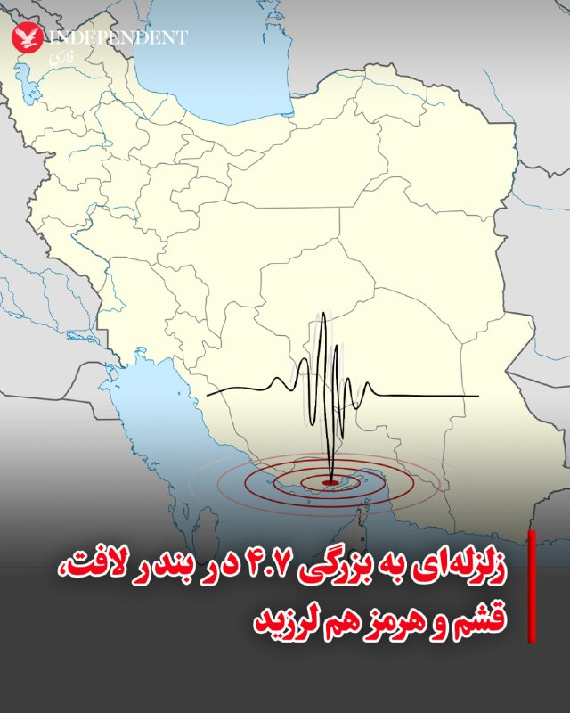

♦️زمین‌لرزه‌ای به بزرگی ۴.۷ حوالی ساعت ۳:۱۲ بامداد چهارشنبه ۳۰ اردیبهشت، بندر لافت در استان هرمزگان را لرزاند.
این زمین‌لرزه علاوه بر لافت، در جزایر قشم و هرمز و همچنین برخی مناطق روستایی بندرعباس نیز احساس شده است. تاکنون گزارشی از خسارات احتمالی این زمین‌لرزه منتشر نشده است.
‌🇸🇦 Indypersian

🤖 @VahidOOnLine

## VahidOOnLine — post 241070

  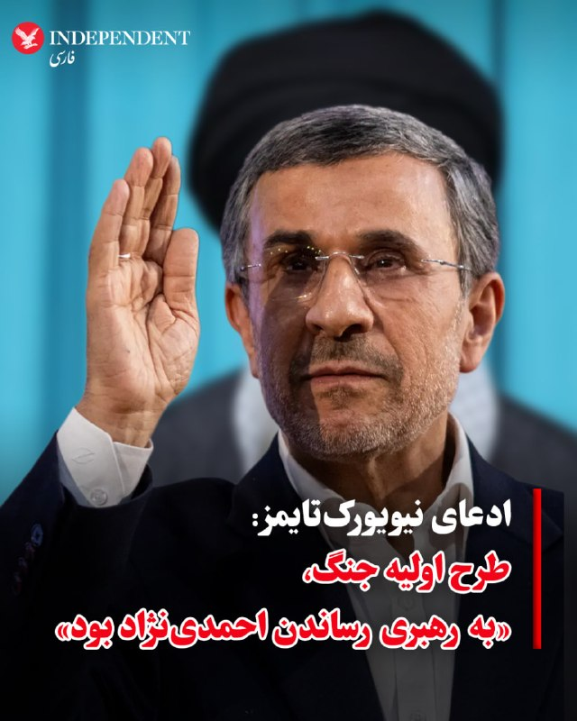

♦️نیویورک‌تایمز در گزارشی به نقل از منابع ناشناس که آنها را مقامات آمریکایی عنوان کرده، مدعی شد که هدف اولیه جنگ، «تلاش برای به رهبری رساندن محمود احمدی‌نژاد»، رئیس‌جمهوری اسبق ایران بوده است. در این گزارش، ادعا شده که در زمینه این طرح «با محمود احمدی‌نژاد مشورت شده بود» اما در نهایت این طرح به مشکل خورد. نیویورک‌تایمز ادعا کرده که محمود احمدی‌نژاد در جریان حمله روز نخست اسرائیل به خانه‌اش در تهران که هدف آن آزاد کردن او از آنچه «حصر خانگی» خوانده شده، بود زخمی شد. این درحالی است که منابع ایندیپندنت فارسی در همان روز خبر دادند که احمدی‌نژاد اندکی قبل از حمله از محل خارج شده بود. این منابع همچنین «حصر خانگی» رئیس‌جمهوری اسبق را نیز تکذیب کرده‌اند. نیویورک‌تایمز در ادامه به اختلافات احمدی‌نژاد و حاکمیت در سال‌های اخیر،  رد صلاحیت‌های او در انتخابات و محدودیت‌هایی برای حضور عمومی و رفت‌و‌آمد‌ها اشاره می‌کند و می‌نویسد که احمدی‌نژاد پس از این حمله روز نخست جنگ دیگر دیده نشده است.
‌🇸🇦 Indypersian

🤖 @VahidOOnLine

## VahidOOnLine — post 241068

  

مستند «یک رفاقت از زندان وکیل‌آباد مشهد تا سن‌ دیگو» تهیه شده از سوی شبکه ایران‌اینترنشنال به کارگردانی اردوان روزبه، در بخش مستند و تحلیل سیاسی تلویزیونی برنده جایزه تلی سال ۲۰۲۶ شد.
جایزه تلی یک رقابت بین‌المللی در حوزه تولیدات ویدیویی، تلویزیونی، تبلیغات و محتوای دیجیتال است که از سال ۱۹۷۹ میلادی برگزار می‌شود و داورانی از شرکت‌هایی بزرگ مثل نتفلیکس و اچ.بی.او، هزاران اثر ارسالی را بررسی می‌کنند.
مستند «یک رفاقت: از زندان وکیل‌آباد مشهد تا سن‌ دیگو» امسال در رقابت با ۱۳ هزار اثر از از سراسر جهان برنده جایزه شد.
این مستند روایتگر داستان واقعی و غیرمنتظره دوستی میان مایکل وایت، کهنه‌سرباز آمریکایی، و مهدی وطن‌خواه، فعال سیاسی ایرانی است؛ دو زندانی که در بند عمومی زندان وکیل‌آباد مشهد با یکدیگر آشنا شدند.
مایکل وایت در سال ۲۰۱۸ پس از سفر به ایران بازداشت شد و در بازداشتگاه‌های امنیتی جمهوری اسلامی تحت بازجویی‌های سنگین، شکنجه روانی و فشار برای اعتراف اجباری قرار گرفت. او بعدها روایت کرد که بازجویان تلاش داشتند او را وادار کنند اعتراف کند برای آمریکا و اسرائیل جاسوسی می‌کرده است.

‌🏁 🇬🇧 IranintlTV

🤖 @VahidOOnLine

## VahidOOnLine — post 241067

  <a href="telegram/content/VahidOOnLine_241067_1779241246.mp4" target="_blank">🎬 Download video</a>

♦️دونالد ترامپ، رئیس‌جمهوری آمریکا روز سه‌شنبه در  سخنرانی برای قانونگذاران آمریکایی در کاخ سفید گفت: «ما به جنگ ایران خیلی سریع پایان می‌دهیم، آنها به شدت خواستار توافق هستند و خسته شده‌اند.» رئیس‌جمهوری آمریکا پیش‌بینی کرد که توافق با رزیم ایران سریع اتفاق می‌افتد و در نتیجه آن بهای نفت سقوط می‌کند.
‌🇸🇦 Indypersian

🤖 @VahidOOnLine

## VahidOOnLine — post 241066

  

زمین‌لرزه‌ای به بزرگی ۴.۷ حوالی ساعت ۳:۱۲ بامداد چهارشنبه لافت در استان هرمزگان را لرزاند. این زلزله در قشم و هرمز و مناطق روستایی بندرعباس نیز احساس شد.
‌🏁 🇬🇧 IranintlTV

🤖 @VahidOOnLine

## VahidOOnLine — post 241065

  

ترامپ در یک سخنرانی در کاخ سفید گفت: جمهوری اسلامی «قرار نیست به سلاح هسته‌ای دست پیدا کند. نمی‌توانند سلاح هسته‌ای داشته باشند. ما نمی‌توانیم چنین چیزی را تحمل کنیم و آن را تحمل نخواهیم کرد.»
او گفت: «ما نیروی دریایی جمهوری اسلامی را نابود کردیم. نیروی هوایی آنها از بین رفته است. سامانه‌های پدافند هوایی آنها از بین رفته است. تمام تجهیزاتی که برای جنگ استفاده می‌کردند از بین رفته است. تقریبا همه چیز از بین رفته است.»
ترامپ افزود: «نمی‌خواهم بگویم رهبران آنها از بین رفته‌اند، چون بیان آن چندان خوشایند نیست، اما واقعیت همین است.»
‌🏁 🇬🇧 IranintlTV

🤖 @VahidOOnLine

## VahidOOnLine — post 241064

  

ترامپ در یک سخنرانی در کاخ سفید گفت: «ما جنگ ایران را خیلی سریع پایان خواهیم داد. آنها به شدت می‌خواهند توافق کنند. از این وضعیت خسته شده‌اند. این موضوع باید ۴۷ سال پیش حل می‌شد. کسی باید درباره آن کاری انجام می‌داد، و این اتفاق خواهد افتاد و سریع هم رخ خواهد داد.»
او افزود: «خواهید دید که قیمت نفت سقوط خواهد کرد. قیمت‌ها پایین خواهد آمد. نفت بسیار زیادی در بازار وجود دارد. قیمت‌ها به شدت کاهش خواهد یافت.»

‌🏁 🇬🇧 IranintlTV

🤖 @VahidOOnLine

## FoxNewsTwitter — post 341974

  <a href="telegram/content/FoxNewsTwitter_341974_1779241250.mp4" target="_blank">🎬 Download video</a>

Fox News (Twitter/X)

“Bi means you like both.”

Rep. Thomas Massie cracks jokes after losing his primary race to Trump-endorsed former Navy SEAL Ed Gallrein, saying he may be “trans-partisan” because he doesn’t fully identify with either political side anymore.

The Kentucky congressman spent years carving out a reputation as one of the most independent Republicans in Washington — often frustrating both party leadership and President Trump.

But after a brutal Trump-backed challenge, Massie’s streak in Congress has now come to an end.

## FoxNewsTwitter — post 341973

  <a href="telegram/content/FoxNewsTwitter_341973_1779241252.mp4" target="_blank">🎬 Download video</a>

Fox News (Twitter/X)

"They tried to buy my vote. They couldn't buy it."

Rep. Thomas Massie delivers a fiery speech after losing his reelection bid, accusing powerful forces in Washington of trying for years to take him down.

Massie, who became a regular target of attacks from President Trump, said they "decided to buy the seat" after they couldn't buy his vote.

## FoxNewsTwitter — post 341972

  <a href="telegram/content/FoxNewsTwitter_341972_1779241255.mp4" target="_blank">🎬 Download video</a>

Fox News (Twitter/X)

"I would like to know how many more Americans we have to ask to die for this mistake."

That question from Rep. Seth Moulton sparked a fiery clash with CENTCOM Commander Admiral Brad Cooper during a tense hearing on Iran and U.S. military operations in the Middle East.

Cooper slammed Moulton's remark as "entirely inappropriate as the exchange escalated in front of lawmakers.

## FoxNewsTwitter — post 341971

  

Fox News (Twitter/X)

"We're going to end that war very quickly. They want to make a deal so badly. They're tired of this"

President Trump predicts a deal to end the war with Iran is going to happen "fast" — and that oil prices will plummet when the agreement is reached.

## FoxNewsTwitter — post 341970

  <a href="telegram/content/FoxNewsTwitter_341970_1779241259.mp4" target="_blank">🎬 Download video</a>

Fox News (Twitter/X)

FOX NEWS REPORT: President Trump warns Iran may face another "big hit" if negotiations collapse, revealing he was only an hour away from moving forward with another strike. @BillMelugin_ reports.

## pm_afshaa — post 91082

  <a href="telegram/content/pm_afshaa_91082_1779241262.webm" target="_blank">🎬 Download video</a>

🔴افشاگری عجیب نیویورک تایمز:
آمریکا و اسرائیل قبل از جنگ با ایران، طرحی رو برای نصب محمود احمدی‌نژاد به عنوان رهبر جدید کشور مورد بحث قرار دادن.

احمدی‌نژاد گزارشاً در مورد این طرح مشورت شده بود، اما پس از اینکه در حمله‌ای اسرائیل به خانه‌اش در تهران در روز آغازین جنگ مجروح شد، این طرح از هم پاشید. مقامات آمریکایی گفتن که این حمله با هدف آزاد کردن او از بازداشت خانگی انجام شده بود.

برنامه‌ریزان اسرائیلی ظاهراً پیش از درگیری با احمدی‌نژاد مشورت و توافق کرده و تلاش کردن اونو از حصر خانگی اجباری با حمله‌ای‌ اسرائیلی که نگهبانان خارج از اقامتگاهش در تهران رو هدف قرار داد، در روز اول جنگ آزاد کنن.

احمدی‌نژاد زنده موند اما به‌شدت زخمی شد و پس از آن ناامید از تلاش برای تغییر رژیم شد و از آن زمان به بعد به صورت عمومی دیده نشده و محل اقامت او نامشخصه.

💧 Rainbet.com the #1 Non-KYC Crypto Casino & Sportsbook @rainbetcom

😁 @Pm_Afshaa

## pm_afshaa — post 91080

  

مدیر ارتباطات کاخ سفید، استیون چونگ:
هرگز به رئیس‌جمهور ترامپ و قدرت سیاسی او شک نکنید.

آزمایش کن، نتیجه‌اش را ببین

💧 Rainbet.com the #1 Non-KYC Crypto Casino & Sportsbook @rainbetcom

😁 @Pm_Afshaa

## pm_afshaa — post 91079

  <a href="telegram/content/pm_afshaa_91079_1779241264.mp4" target="_blank">🎬 Download video</a>

ترامپ:ما در چند سال آینده روزهای بسیار سختی خواهیم داشت.

امیدواریم این چند سال به سال‌های درخشانی برای بسیاری، بسیاری از سال‌های آینده منجر شود

💧 Rainbet.com the #1 Non-KYC Crypto Casino & Sportsbook @rainbetcom

😁 @Pm_Afshaa

## pm_afshaa — post 91078

  <a href="telegram/content/pm_afshaa_91078_1779241266.mp4" target="_blank">🎬 Download video</a>

ترامپ:تمام تجهیزات آن‌ها که برای جنگ استفاده می‌کردند از بین رفته است. تقریباً همه چیز از بین رفته است.

نمی‌خواهم بگویم رهبرانشان از بین رفته‌اند، چون خیلی خوشایند نیست، اما این حقیقت دارد.

آن‌ها نمی‌توانند سلاح هسته‌ای داشته باشند. ما نمی‌توانیم این را تحمل کنیم و نخواهیم کرد

💧 Rainbet.com the #1 Non-KYC Crypto Casino & Sportsbook @rainbetcom

😁 @Pm_Afshaa

## pm_afshaa — post 91077

  <a href="telegram/content/pm_afshaa_91077_1779241269.mp4" target="_blank">🎬 Download video</a>

🔴ترامپ: ما همه چیز رو نابود می‌کنیم و این جنگ رو خیلی سریع به پایان میرسونیم؛ آنها انقدر خسته‌ان که میخوان معامله کنن.

این باید 47 سال پیش اتفاق می‌افتاد. کسی باید کاری درباره‌اش انجام می‌داد. این اتفاق خواهد افتاد و خیلی سریع خواهد بود.

💧 Rainbet.com the #1 Non-KYC Crypto Casino & Sportsbook @rainbetcom

😁 @Pm_Afshaa

## pm_afshaa — post 91076

  <a href="telegram/content/pm_afshaa_91076_1779241271.mp4" target="_blank">🎬 Download video</a>

🔴ترامپ: ما در ایران کار فوق‌العاده‌ای انجام دادیم؛ فکر میکنم خیلی زود این کار تمام بشه و آنها سلاح هسته‌ای نخواهند داشت؛ امیدوارم این کار رو به روشی بسیار خوب انجام بدیم.

💧 Rainbet.com the #1 Non-KYC Crypto Casino & Sportsbook @rainbetcom

😁 @Pm_Afshaa

## VahidOnline — post 75564

  

ترامپ در یک سخنرانی در کاخ سفید گفت ایران قرار نیست به سلاح هسته‌ای دست پیدا کند. نمی‌توانند سلاح هسته‌ای داشته باشند. ما نمی‌توانیم چنین چیزی را تحمل کنیم و آن را تحمل نخواهیم کرد.
او گفت ما نیروی دریایی آن‌ها را نابود کردیم. نیروی هوایی آنها از بین رفته است. سامانه‌های پدافند هوایی آنها از بین رفته است. تمام تجهیزاتی که برای جنگ استفاده می‌کردند از بین رفته است. تقریبا همه چیز از بین رفته است.
ترامپ افزود: نمی‌خواهم بگویم رهبران آنها از بین رفته‌اند، چون بیان آن چندان خوشایند نیست، اما واقعیت همین است.
@VahidOOnLine

📡 @VahidOnline

## VahidOnline — post 75563

  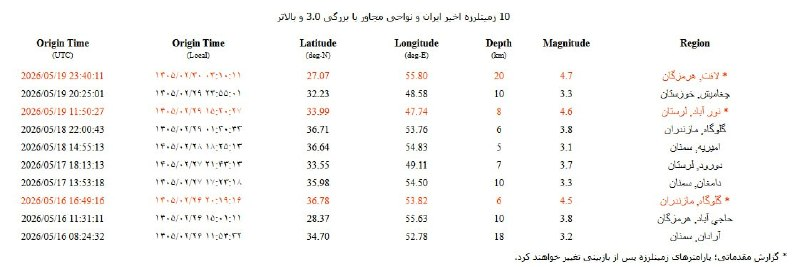

زمین‌لرزه در قشم

آپدیت:‌
تصویر بالا: #زلزله به بزرگی ۴٫۷ در عمق ۲۰ کیلومتری بندر لافت در جزیره قشم هرمزگان

پیام‌های دریافتی:
سلام وحید دو زلزله شدید بندرعباس رو لرزاند

ساعت ۳:۱۱ دقیقه بندرعباس زلزله اومد

همین الان ساعت ۳:۱۲ دوبار به مدت ۱۵ ثانیه وحشتناک بندرعباس لرزید

من بندرعباس هستم دو بار لرزید

زلزله اومده خیلی بد بود

زمین لرزه نسبتا شدید ساعت ٣:١٠ بامداد بندرعباس

بندرعباس هستم فکر کردیم باز زدن دقیقا ۲۰ ثانیه همه جا میلرزید

چند دقیقه پیش زمین لرزه نسبتا شدید اومد دوبار تو فاصله خیلی کم بندرعباس

📡 @VahidOnline

## IranIntlTV — post 338021

  

مستند «یک رفاقت از زندان وکیل‌آباد مشهد تا سن‌ دیگو» تهیه شده از سوی شبکه ایران‌اینترنشنال به کارگردانی اردوان روزبه، در بخش مستند و تحلیل سیاسی تلویزیونی برنده جایزه تلی سال ۲۰۲۶ شد.
جایزه تلی یک رقابت بین‌المللی در حوزه تولیدات ویدیویی، تلویزیونی، تبلیغات و محتوای دیجیتال است که از سال ۱۹۷۹ میلادی برگزار می‌شود و داورانی از شرکت‌هایی بزرگ مثل نتفلیکس و اچ.بی.او، هزاران اثر ارسالی را بررسی می‌کنند.
مستند «یک رفاقت: از زندان وکیل‌آباد مشهد تا سن‌ دیگو» امسال در رقابت با ۱۳ هزار اثر از از سراسر جهان برنده جایزه شد.
این مستند روایتگر داستان واقعی و غیرمنتظره دوستی میان مایکل وایت، کهنه‌سرباز آمریکایی، و مهدی وطن‌خواه، فعال سیاسی ایرانی است؛ دو زندانی که در بند عمومی زندان وکیل‌آباد مشهد با یکدیگر آشنا شدند.
مایکل وایت در سال ۲۰۱۸ پس از سفر به ایران بازداشت شد و در بازداشتگاه‌های امنیتی جمهوری اسلامی تحت بازجویی‌های سنگین، شکنجه روانی و فشار برای اعتراف اجباری قرار گرفت. او بعدها روایت کرد که بازجویان تلاش داشتند او را وادار کنند اعتراف کند برای آمریکا و اسرائیل جاسوسی می‌کرده است.

https://iranintl.com/2026051

## IranIntlTV — post 338020

  

زمین‌لرزه‌ای به بزرگی ۴.۷ حوالی ساعت ۳:۱۲ بامداد چهارشنبه لافت در استان هرمزگان را لرزاند. این زلزله در قشم و هرمز و مناطق روستایی بندرعباس نیز احساس شد.
https://iranintl.com/202605203241

## IranIntlTV — post 338019

  <a href="telegram/content/IranIntlTV_338019_1779241276.mp4" target="_blank">🎬 Download video</a>

صداوسیما روز ۲۹ اردیبهشت‌ماه، در برنامه «سلام صبح بخیر»، از تندیس «مشت گره‌کرده» علی خامنه‌ای، رهبر کشته‌شده جمهوری اسلامی، به‌عنوان نماد جدید میدان انقلاب تهران رونمایی کرد.
@iranintltv

## IranIntlTV — post 338018

  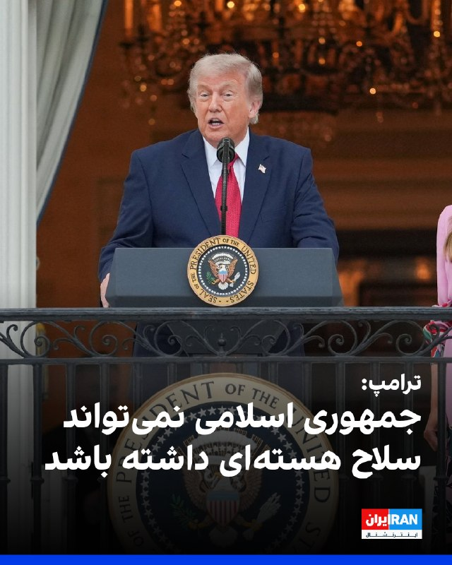

ترامپ در یک سخنرانی در کاخ سفید گفت: جمهوری اسلامی «قرار نیست به سلاح هسته‌ای دست پیدا کند. نمی‌توانند سلاح هسته‌ای داشته باشند. ما نمی‌توانیم چنین چیزی را تحمل کنیم و آن را تحمل نخواهیم کرد.»
او گفت: «ما نیروی دریایی جمهوری اسلامی را نابود کردیم. نیروی هوایی آنها از بین رفته است. سامانه‌های پدافند هوایی آنها از بین رفته است. تمام تجهیزاتی که برای جنگ استفاده می‌کردند از بین رفته است. تقریبا همه چیز از بین رفته است.»
ترامپ افزود: «نمی‌خواهم بگویم رهبران آنها از بین رفته‌اند، چون بیان آن چندان خوشایند نیست، اما واقعیت همین است.»
https://iranintl.com/202605197914

## IranIntlTV — post 338017

  

ترامپ در یک سخنرانی در کاخ سفید گفت: «ما جنگ ایران را خیلی سریع پایان خواهیم داد. آنها به شدت می‌خواهند توافق کنند. از این وضعیت خسته شده‌اند. این موضوع باید ۴۷ سال پیش حل می‌شد. کسی باید درباره آن کاری انجام می‌داد، و این اتفاق خواهد افتاد و سریع هم رخ خواهد داد.»
او افزود: «خواهید دید که قیمت نفت سقوط خواهد کرد. قیمت‌ها پایین خواهد آمد. نفت بسیار زیادی در بازار وجود دارد. قیمت‌ها به شدت کاهش خواهد یافت.»

https://iranintl.com/202605193673

## ManotoTV — post 105663

  <a href="telegram/content/ManotoTV_105663_1779241280.mp4" target="_blank">🎬 Download video</a>

‌
خبرگزاری فرانسه گزارش داد شرکت هواپیماسازی ایرباس به دلیل پیامدهای جنگ آمریکا و اسرائیل با جمهوری اسلامی، از تیم‌های خود خواسته هزینه‌های «غیرضروری» را ۱۰ درصد کاهش دهند.

بر اساس سندی که خبرگزاری فرانسه مشاهده کرده، ایرباس اعلام کرده هدف این شرکت «توقف قابل توجه فعالیت‌ها و هزینه‌هایی است که برای عملیات و فعالیت‌های صنعتی کاملاً ضروری نیستند.»

در این یادداشت از کارکنان خواسته شده از ایجاد هزینه‌های جدید یا واگذاری فعالیت‌های غیرضروری به پیمانکاران خودداری کنند.

ایرباس همچنین بر کاهش هزینه‌هایی مانند رویدادهای داخلی، برنامه‌های تیمی، همایش‌ها و مشارکت در کنفرانس‌ها تاکید کرده است.

## FarsiVOA — post 218196

🔺ترامپ: نمی‌خواهم بگویم که رهبران جمهوری اسلامی نیز نابود شده‌اند چون صحبت خیلی قشنگی نیست؛ آن‌ها به‌شدت مایل به توافقند

▪️دونالد ترامپ، رئیس‌جمهوری آمریکا، سه‌شنبه شب در سخنانی در مراسم «پیکنیک کنگره» در کاخ سفید گفت ایالات متحده «به‌سرعت» به «جنگ» با جمهوری اسلامی پایان خواهد داد و افزود رژیم ایران «به‌شدت مایل» به رسیدن به توافق است و از شرایط حاضر «خسته» شده است.

⬇️ بیشتر بخوانید:
https://ir.voanews.com/a/8151966.html
@FarsiVOA

## FarsiVOA — post 218195

🔺مایک والتز: جمهوری اسلامی ۴۷ سال است که صلح جهانی را تهدید می‌کند

▪️مایک والتز، سفیر آمریکا در سازمان ملل متحد، گفت جمهوری اسلامی به تاسیسات غیرنظامی در خاورمیانه حمله می‌کند.

⬇️ بیشتر بخوانید:
https://ir.voanews.com/a/8151759.html
@FarsiVOA

## FarsiVOA — post 218194

  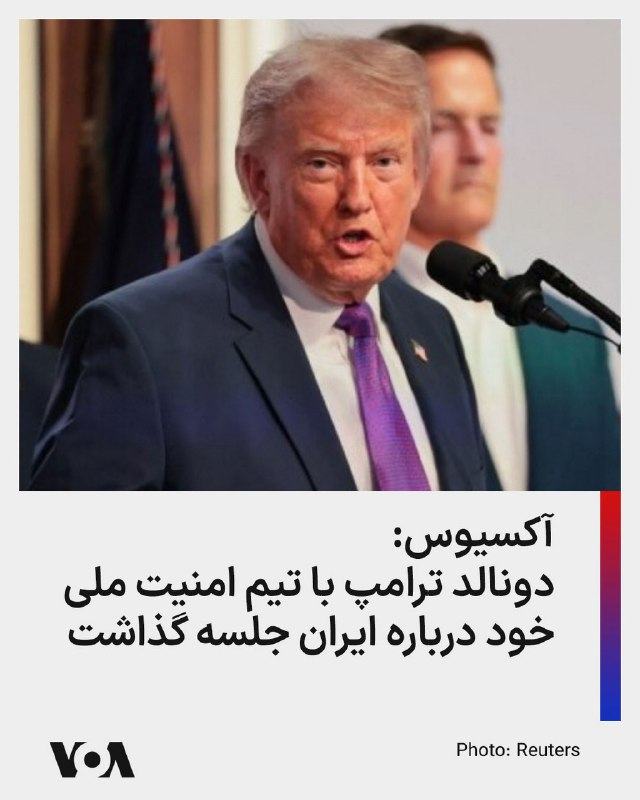

⚡️سایت خبری آکسیوس به نقل دو مقام آمریکایی گزارش داد دونالد ترامپ، رئیس جمهوری آمریکا، عصر دوشنبه جلسه‌ای با تیم ارشد امنیت ملی خود در مورد ایران تشکیل داد که شامل توضیحاتی در مورد گزینه‌های نظامی بود.
@FarsiVOA

## Persian_Trend_Official — post 14506

  

💢فیفا قصد دارد بار دیگر ورود پرچم «شیر و خورشید» پیش از انقلاب ایران و پوشاک مرتبط با آن را به استادیوم‌های جام جهانی در مسابقات ۲۰۲۶ ممنوع کند.

این پرچم همچنین در جام جهانی قطر ۲۰۲۲ محدود شده بود.

منبع: نیویورک تایمز

🫆:Tony

📌 @persian_trend_official
پرشین ترند | متفاوت‌ترین کانال نظامی

## Persian_Trend_Official — post 14505

  <a href="telegram/content/Persian_Trend_Official_14505_1779241282.webm" target="_blank">🎬 Download video</a>

🔴انتقاد تلویحی امارات از عربستان و قطر بر سر ارتباط با ایران

💢شبکه i24 گزارش داد «انور قرقاش» مشاور رئیس امارات، بدون نام بردن مستقیم از عربستان و قطر، به‌صورت تلویحی از ادامه ارتباط و تماس‌های این کشورها با ایران انتقاد کرده است.

بر اساس این گزارش:

▪️ ابوظبی نگران است فشار کشورهای عربی باعث توقف دوباره عملیات نظامی آمریکا علیه ایران شده باشد
▪️ برخی محافل اماراتی معتقدند عربستان و قطر در تلاش برای حفظ مسیر مذاکره با تهران هستند
▪️ این اختلاف می‌تواند نشانه شکاف در مواضع کشورهای خلیج فارس درباره نحوه برخورد با ایران باشد

🫆:Tony

📌 @persian_trend_official
پرشین ترند | متفاوت‌ترین کانال نظامی

## Persian_Trend_Official — post 14504

🔴 نیویورک‌تایمز: آمریکا و اسرائیل برای آزادسازی احمدی‌نژاد به خانه او حمله کردند

💢نیویورک‌تایمز مدعی شد آمریکا و اسرائیل در روزهای ابتدایی عملیات مشترک نظامی علیه ایران، خانه محمود احمدی‌نژاد را هدف حمله هوایی قرار داده‌اند.

▪️بر اساس این گزارش:

▪️ هدف از این حمله، آزاد کردن احمدی‌نژاد از حصر خانگی و استفاده از او در پروژه تغییر نظام در ایران بوده است
▪️ احمدی‌نژاد به‌دلیل اختلاف با آیت‌الله خامنه‌ای تحت حصر قرار داشت
▪️ برنامه‌ریزان اسرائیلی پیش از آغاز جنگ با او ارتباط برقرار کرده بودند

در ادامه گزارش آمده:

▪️ حمله اسرائیل محافظان مستقر مقابل منزل احمدی‌نژاد در تهران را هدف قرار داده بود
▪️ احمدی‌نژاد از حمله جان سالم به در برد اما زخمی شد
▪️ او پس از حمله نسبت به این طرح دچار تردید و ناامیدی شده است

💢طبق ادعای نیویورک‌تایمز:

▪️ طرح گسترده‌تر اسرائیل شامل حذف رهبران ارشد ایران، حمایت از ناآرامی‌های داخلی و ایجاد زمینه برای تشکیل دولت جایگزین بوده است
▪️ مقام‌های آمریکایی و اسرائیلی تصور می‌کردند برخی جریان‌های داخلی ایران پس از آغاز جنگ با واشینگتن همکاری خواهند کرد

این ادعاها تاکنون از سوی منابع رسمی ایران، آمریکا یا اسرائیل تأیید نشده‌اند.

🫆:Tony

📌 @persian_trend_official
پرشین ترند | متفاوت‌ترین کانال نظامی

## Persian_Trend_Official — post 14503

  <a href="telegram/content/Persian_Trend_Official_14503_1779241283.webm" target="_blank">🎬 Download video</a>

⭕️زلزله 4.7 ریشتری لافت هرمزگان را لرزاند

💢بنا بر اعلام مرکز لرزه نگاری زمین لرزه ای به قدرت 4.7 ریشتر ساعت 3:10 بامداد امروز - چهارشنبه- لافت هرمزگان را لرزاند

🫆:Tony

📌 @persian_trend_official
پرشین ترند | متفاوت‌ترین کانال نظامی

## Persian_Trend_Official — post 14502

  <a href="telegram/content/Persian_Trend_Official_14502_1779241284.mp4" target="_blank">🎬 Download video</a>

💢دونالد ترامپ :

💢ما همه چیز را نابود می‌کنیم و این جنگ را خیلی سریع به پایان می‌رسانیم.

💢آن‌ها آنقدر خسته‌اند که می‌خواهند به شدت معامله کنند.

💢این باید ۴۷ سال پیش اتفاق می‌افتاد. کسی باید کاری درباره‌اش انجام می‌داد. کسی باید کاری درباره‌اش انجام می‌داد.

💢این اتفاق خواهد افتاد و خیلی سریع خواهد بود.

🫆:Tony

📌 @persian_trend_official
پرشین ترند | متفاوت‌ترین کانال نظامی

## BBCPersian — post 281557

  

🔻ساعتی پس از حضور فرمانده سنتکام در کنگره امریکا و اظهارات جدیدش درباره روند «پیچیده» تحقیقات مرتبط با این حمله، وزارت خارجه ایران ادعای فرماندهی مرکزی ایالات متحده آمریکا مبنی براینکه مدرس ابتدایی شجره طیبه میناب در محدوده یک مرکز فعال موشکی بوده است را «کاملا بی‌اساس و انحرافی» خواند.

اسماعیل بقایی، سخنگوی وزارت خارجه ایران عصر سه‌شنبه گفت: «این تحریف آشکار، تلاشی واضح برای پنهان کردن ماهیت واقعی حملات موشکی ۲۸ فوریه است که موجب قتل عام بیش از ۱۷۰ دانش‌آموز و معلمان‌شان شد.»

آقای بقایی همچنین گفته است: «فرماندهان نظامی و مقامات آمریکایی که مسئول صدور دستور و اجرای این حمله فاجعه‌بار بوده‌اند، باید طبق قوانین بین‌المللی کاملا پاسخگو و محاکمه شوند.»

📸Anadolu via Getty Images
https://bbc.in/4uru8q4
@BBCPersian

## BBCPersian — post 281556

  

🔻سنای آمریکا با ۵۰ رای موافق در برابر ۴۷ رای مخالف به راه یافتن طرح محدود کردن اختیارات جنگی دونالد ترامپ، به صحن این مجلس رای مثبت داد.

این طرح که با محتوایی مشابه پیش‌تر در سنا رای نیاورده بود، روز سه‌شنبه با پیوستن به سناتور جمهوری‌خواه به اقلیت دموکرات‌ها، تصویب شد.

این طرح رئیس جمهور آمریکا را مکلف می‌کند برای هرگونه اقدام نظامی دیگر علیه ایران ابتدا از کنگره تاییدیه بگیرد.

راه یافتن این طرح به مرحله بعدی و اجازه مطرح شدن در صحن اصلی سنا و تصویب آن در این مجلس که اکثریت ان در دست جمهوری‌خواهان است، خیلی زود عصر سه شنبه در رسانه‌های آمریکا مورد توجه قرار گرفت.

در جریان رای‌گیری، جان فترمن، سناتور دموکرات ایالت پنسیلوانیا، به جمهوری‌خواهان پیوست و به آن رای منفی داد؛ در مقابل، رند پال، سوزان کالینز، لیزا مورکوفسکی و بیل کسیدی، چهار سناتور جمهوری‌خواه، همراه با دموکرات‌ها به طرح رای مثبت دادند.

این نخستین بار بود که آقای کسیدی در این موضوع با دموکرات‌ها هم‌سو رای می‌داد.

📸Anadolu via Getty Images
https://bbc.in/4dkphAX
@BBCPersian

## BBCPersian — post 281549

🔻ولادیمیر پوتین بلافاصله پس از سفر دونالد ترامپ به پکن، راهی دیدار با شی جین‌پینگ می‌شود؛ سفری که محور اصلی آن تلاش روسیه برای گسترش صادرات گاز به چین است.

پوتین و شی جین‌پینگ، دو رهبر اقتدارگرا، روابط نزدیکی دارند و بیش از ۴۰ بار دیدار کرده‌اند. هر دو خود را احیاکننده قدرت تاریخی کشورشان می‌دانند و مخالفان سیاسی را تحمل نمی‌کنند.
پس از حمله روسیه به اوکراین، مسکو جایگاه خود را به عنوان شریک برابر اروپا از دست داد و بیش از پیش به چین وابسته شد، تا جایی که اکنون عمدتا تامین‌کننده مواد خام برای چین محسوب می‌شود.

چین برخلاف اروپا پیش از جنگ اوکراین، تمایل چندانی به سرمایه‌گذاری گسترده یا انتقال فناوری به روسیه ندارد و ترجیح می‌دهد روابطش با مسکو عمدتا بر تامین انرژی و مواد خام متمرکز بماند.
کرملین امیدوار است جنگ ایران و اختلال در خلیج فارس، چین را به امضای قرارداد خط لوله «قدرت سیبری ۲» ترغیب کند؛ پروژه‌ای حیاتی برای جایگزینی بازار از دست‌رفته اروپا.

ادامه مطلب⬇️

📷Getty Images/BBCImages
https://bbc.in/3RjYEDE
@BBCPersian

## manototv — post 105663

  <a href="telegram/content/manototv_105663_1779241288.mp4" target="_blank">🎬 Download video</a>

‌
خبرگزاری فرانسه گزارش داد شرکت هواپیماسازی ایرباس به دلیل پیامدهای جنگ آمریکا و اسرائیل با جمهوری اسلامی، از تیم‌های خود خواسته هزینه‌های «غیرضروری» را ۱۰ درصد کاهش دهند.

بر اساس سندی که خبرگزاری فرانسه مشاهده کرده، ایرباس اعلام کرده هدف این شرکت «توقف قابل توجه فعالیت‌ها و هزینه‌هایی است که برای عملیات و فعالیت‌های صنعتی کاملاً ضروری نیستند.»

در این یادداشت از کارکنان خواسته شده از ایجاد هزینه‌های جدید یا واگذاری فعالیت‌های غیرضروری به پیمانکاران خودداری کنند.

ایرباس همچنین بر کاهش هزینه‌هایی مانند رویدادهای داخلی، برنامه‌های تیمی، همایش‌ها و مشارکت در کنفرانس‌ها تاکید کرده است.

---
📅 بروزرسانی: 1405/02/30 03:13
---

## VahidOOnLine — post 241063

  <a href="telegram/content/VahidOOnLine_241063_1779234235.mp4" target="_blank">🎬 Download video</a>

♦️احمد‌الشرع، رئیس‌جمهوری سوریه با انتشار پیامی در اکس از ارسال هدیه‌ از سوی دونالد ترامپ، رئیس‌جمهوری آمریکا تشکر کرد. در این پیام آمده است:
«بعضی دیدارها اثری ماندگار بر جا می‌گذارند؛ دیدار ما ظاهرا عطری از خود به جا گذاشت.
آقای دونالد ترامپ،بابت سخاوت شما و کامل‌تر کردن این هدیه ارزشمند سپاسگزارم. امیدوارم روح آن دیدار همچنان به شکل‌گیری رابطه‌ای قوی‌تر میان سوریه و ایالات متحده کمک کند.»

 در دیداری که در تاریخ ۲۱ آبان ۱۴۰۴ در سفر الشرع به آمریکا انجام شد دونالد ترامپ به او عطر هدیه داد و اکنون دوباره برای او عطر ارسال کرده است.
‌🇸🇦 Indypersian

🤖 @VahidOOnLine

## VahidOOnLine — post 241062

  

♦️اسماعیل بقایی، سخنگوی وزارت امور خارجه جمهوری اسلامی، در پیامی به مناسبت سالروز تولد محمد مصدق، نخست‌وزیر پیشین ایران، «کودتای ۲۸ مرداد ۱۳۳۲» را نقطه آغاز تقابل آمریکا با ایران دانست.
او با انتقاد از روایت مقامات آمریکایی درباره «۴۷ سال تقابل» تأکید کرد این نگاه، تحریف تاریخ است و ریشه اختلافات به سرنگونی دولت مصدق با نقش آمریکا و بریتانیا بازمی‌گردد. بقایی همچنین با اشاره به آنچه «دخالت‌ها، تحریم‌ها و تهدیدهای چند دهه‌ای» خواند، افزود تجربه کودتای ۲۸ مرداد نشان می‌دهد مسیر حفظ استقلال کشور، تکیه بر حاکمیت ملی و مقابله با نفوذ خارجی است.
این در حالی است که تا سال‌ها حتی خیابانی به نام محمد مصدق در تهران نام‌گذاری نشد. پس از انقلاب، خیابان پهلوی مدتی به نام او تغییر یافت اما در سال ۱۳۶۰ دوباره تغییر نام داد. در نهایت، در ۲۲ اسفند ۱۳۹۶ شورای شهر تهران خیابان نفت در بلوار میرداماد را به نام مصدق نام‌گذاری کرد.
‌🇸🇦 Indypersian

🤖 @VahidOOnLine

## VahidOOnLine — post 241061

  

♦️به دنبال چندین تلاش ناموفق دمکرات‌های سنای آمریکا برای تصویب قطعنامه محدود کردن اختیارات جنگی رئیس‌جمهوری آمریکا، آنها توانستند آیین‌نامه‌ای را در این زمینه به تصویب برسانند که به نوشته رویترز در پیشبرد قطعنامه مورد نظر موثر است. به گزارش این خبرگزاری بریتانیایی، این آیین‌نامه با ۵۰ رای موافق در برابر ۴۷ رای مخالف تصویب شد.به‌طوری که چهار جمهوری‌خواه هم‌حزبی ترامپ همراه با همه دموکرات‌ها به جز یک نفر، به آن رای مثبت دادند. سه سناتور جمهوری‌خواه نیز در رای‌گیری غایب بودند. باوجود تصویب این آیین‌نامه، حتی اگر قطعنامه‌ای در سنا با ۱۰۰ عضو هم به تایید برسد، کار دشواری در مجلس نمایندگان خواهد داشت که تحت کنترل جمهوری‌خواهان است و پس از آن نیز باید دو‌سوم رای کنگره و سنا را داشته باشد تا بتواند گزینه وتوی احتمالی رئیس‌جمهور را دور بزند. طبق قانون اختیارات جنگی آمریکا مصوب ۱۹۷۳ که در واکنش به جنگ ویتنام تصویب شد، رئیس‌جمهور آمریکا تنها ۶۰ روز می‌تواند بدون مجوز کنگره عملیات نظامی انجام دهد و پس از آن باید یا جنگ را متوقف کند، یا از کنگره مجوز بگیرد.
‌🇸🇦 Indypersian

🤖 @VahidOOnLine

## VahidOOnLine — post 241060

  

♦️خبرگزاری رویترز به نقل از منابع آگاه گزارش داد دولت ترامپ قصد دارد سطح نیروها و تجهیزات نظامی در دسترس برای حمایت از ناتو در زمان بحران یا جنگ را کاهش دهد.
بر اساس این گزارش، پنتاگون تصمیم گرفته سهم خود در چارچوب «مدل نیروی ناتو» را به‌طور قابل توجهی کاهش دهد؛ مدلی که کشورهای عضو در آن نیروهای قابل اعزام در شرایط اضطراری را مشخص می‌کنند. قرار است این تصمیم به‌صورت رسمی در نشست مقام‌های دفاعی ناتو در بروکسل اعلام شود.
این اقدام در راستای سیاست ترامپ برای واگذاری مسئولیت اصلی امنیت اروپا به کشورهای اروپایی ارزیابی شده است. با این حال، مقامات آمریکایی تأکید کرده‌اند که چتر هسته‌ای ایالات متحده همچنان برای حفاظت از متحدان ناتو حفظ خواهد شد.
رویترز همچنین گزارش داده این تصمیم نگرانی‌هایی در میان کشورهای اروپایی ایجاد کرده و می‌تواند فشارها بر ائتلاف ناتو را افزایش دهد، به‌ویژه در شرایطی که تنش‌ها میان آمریکا و برخی متحدان اروپایی بالا گرفته است.
‌🇸🇦 Indypersian

🤖 @VahidOOnLine

## WithYashar — post 11716

مرضیه حسینی، خبرنگار اینترنشنال:
منبع مطلع در کنگره به من گفت فردا شب یا پنجشنبه شب عملیات نظامی آمریکا علیه ایران آغاز میشه.

حملات برای یک عملیات دو سه روزه متمرکز است و به مراکزی با هدف بازگشایی تنگه هرمز انجام میشه.
@withyashar
یاشار : امیدوارم خبر زرد نباشه

## WithYashar — post 11715

## WithYashar — post 11714

## FoxNewsTwitter — post 341969

  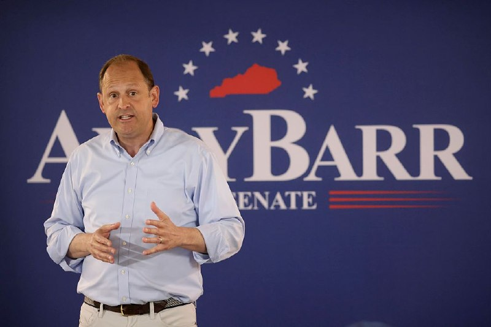

Fox News (Twitter/X)

President Trump's thumb on the scale proved to be the difference maker for Rep. Andy Barr.

Barr emerged from a packed Republican field to win Kentucky's Senate primary, setting him up for a November showdown to replace retiring Sen. Mitch McConnell.

The race quickly became one of the most closely watched GOP primaries in the country because of McConnell’s looming exit and the battle over the future direction of the Republican Party.

## FoxNewsTwitter — post 341968

  <a href="telegram/content/FoxNewsTwitter_341968_1779234239.mp4" target="_blank">🎬 Download video</a>

Fox News (Twitter/X)

"Either MAGA extremists are going to break the country, or we're going to break them."

House Minority Leader Hakeem Jeffries lays out what he says is the Democratic strategy against the MAGA movement — not just to defeat them in elections, but to "break their spirit” over what he described as "unacceptable" extremism.

## FoxNewsTwitter — post 341967

  

Fox News (Twitter/X)

WATCH LIVE: President Trump speaks at Congressional Picnic on White House South Lawn https://twitter.com/i/broadcasts/1pKkOylkjjEKj

## FoxNewsTwitter — post 341966

  

Fox News (Twitter/X)

BREAKING: The Trump administration is preparing a possible indictment against former Cuban president Raúl Castro, brother of Fidel Castro, sources tell Fox News Digital.

Sources pointed to a Department of Justice advisory Tuesday that announced a Miami press conference "in conjunction with a ceremony to honor the victims of the Brothers to the Rescue Murders of 1996."

## pm_afshaa — post 91075

  <a href="telegram/content/pm_afshaa_91075_1779234243.webm" target="_blank">🎬 Download video</a>

🔴مرضیه حسینی، خبرنگار اینترنشنال:
منبع مطلع در کنگره به من گفت فردا شب یا پنجشنبه شب عملیات نظامی آمریکا علیه ایران آغاز میشه.

حملات برای یک عملیات دو سه روزه متمرکز است و به مراکزی با هدف بازگشایی تنگه هرمز انجام میشه.

💧 Rainbet.com the #1 Non-KYC Crypto Casino & Sportsbook @rainbetcom

😁 @Pm_Afshaa

## pm_afshaa — post 91074

  <a href="telegram/content/pm_afshaa_91074_1779234244.webm" target="_blank">🎬 Download video</a>

🔴طرح «محدود کردن اختیارات جنگی ترامپ» بعد از 7 تلاش ناموفق، بالاخره با 47 مخالف و 50 موافق، تصویب شد! سنای آمریکا یه طرحی رو جلو برد که میگه ترامپ واسه ادامه درگیری نظامی با ایران، باید مجوز رسمی کنگره رو داشته باشه و نمیتونه خودسر وارد جنگ بشه. 
💧 Rainbet.com…

## pm_afshaa — post 91073

  <a href="telegram/content/pm_afshaa_91073_1779234245.webm" target="_blank">🎬 Download video</a>

🔴طرح «محدود کردن اختیارات جنگی ترامپ» بعد از 7 تلاش ناموفق، بالاخره با 47 مخالف و 50 موافق، تصویب شد! سنای آمریکا یه طرحی رو جلو برد که میگه ترامپ واسه ادامه درگیری نظامی با ایران، باید مجوز رسمی کنگره رو داشته باشه و نمیتونه خودسر وارد جنگ بشه. 
💧 Rainbet.com…

## pm_afshaa — post 91072

  <a href="telegram/content/pm_afshaa_91072_1779234246.webm" target="_blank">🎬 Download video</a>

🔴طرح «محدود کردن اختیارات جنگی ترامپ» بعد از 7 تلاش ناموفق، بالاخره با 47 مخالف و 50 موافق، تصویب شد!

سنای آمریکا یه طرحی رو جلو برد که میگه ترامپ واسه ادامه درگیری نظامی با ایران، باید مجوز رسمی کنگره رو داشته باشه و نمیتونه خودسر وارد جنگ بشه.

💧 Rainbet.com the #1 Non-KYC Crypto Casino & Sportsbook @rainbetcom

😁 @Pm_Afshaa

## VahidOnline — post 75562

  

سنای آمریکا روز سه‌شنبه قطعنامه‌ای را برای توقف اقدام نظامی در ایران پیش برد.

پیش بردن این قطعنامه پس از آن صورت گرفت که سناتور جمهوری‌خواه، بیل کسیدی از لوئیزیانا، به آن رای مثبت داد. کسیدی چند روز پیش، در رقابت‌های درون حزبی ایالتی برای ادامه حضورش در سنا، به نامزدی که از حمایت ترامپ برخوردار بود، باخت.

به گزارش سی‌ان‌بی‌سی، با وجود اینکه قطعنامه اختیارات جنگی با نتیجه ۵۰ به ۴۷ به تصویب رسید، اما هنوز احتمال کمی برای تبدیل شدن به قانون دارد. این قطعنامه باید ابتدا در سنا به تصویب نهایی برسد، سپس مجلس نمایندگان به رای بدهد و سپس نیز، دونالد ترامپ به احتمال قریب به یقین، آن را وتو خواهد کرد.
@VahidHeadline
چهار جمهوری‌خواه هم‌حزبی ترامپ همراه با همه دموکرات‌ها به جز یک نفر، به آن رای مثبت دادند. سه سناتور جمهوری‌خواه نیز در رای‌گیری غایب بودند.
باوجود تصویب این آیین‌نامه، حتی اگر قطعنامه‌ای در سنا با ۱۰۰ عضو هم به تایید برسد، کار دشواری در مجلس نمایندگان خواهد داشت که تحت کنترل جمهوری‌خواهان است و پس از آن نیز باید دو‌سوم رای کنگره و سنا را داشته باشد تا بتواند گزینه وتوی احتمالی رئیس‌جمهور را دور بزند.
طبق قانون اختیارات جنگی آمریکا مصوب ۱۹۷۳ که در واکنش به جنگ ویتنام تصویب شد، رئیس‌جمهور آمریکا تنها ۶۰ روز می‌تواند بدون مجوز کنگره عملیات نظامی انجام دهد و پس از آن باید یا جنگ را متوقف کند، یا از کنگره مجوز بگیرد.
@VahidOOnLine

📡 @VahidOnline

## IranIntlTV — post 338016

  <a href="telegram/content/IranIntlTV_338016_1779234247.mp4" target="_blank">🎬 Download video</a>

شورای امنیت سازمان ملل به درخواست بحرین نشست اضطراری برگزار کرد تا حمله به نیروگاه هسته‌ای براکه در امارات متحده عربی را بررسی کند.

مریم رحمتی، خبرنگار ایران‌اینترنشنال، گزارش می‌دهد
@iranintltv

## FarsiVOA — post 218193

⚡️امارات منشأ حملات پهپادی به نیروگاه اتمی «براکه» را خاک عراق اعلام کرد
@FarsiVOA

## FarsiVOA — post 218192

  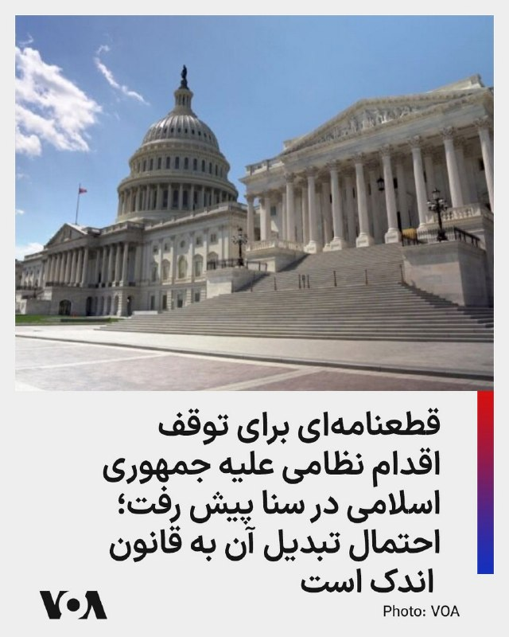

⚡️سنای آمریکا روز سه‌شنبه قطعنامه‌ای را برای توقف اقدام نظامی در ایران پیش برد. پیش بردن این قطعنامه پس از آن صورت گرفت که سناتور جمهوری‌خواه، بیل کسیدی از لوئیزیانا، به آن رای مثبت داد. کسیدی چند روز پیش، در رقابت‌های درون حزبی ایالتی برای ادامه حضورش در سنا، به نامزدی که از حمایت ترامپ برخوردار بود، باخت. به گزارش سی‌ان‌بی‌سی، با وجود اینکه قطعنامه اختیارات جنگی با نتیجه ۵۰ به ۴۷ به تصویب رسید، اما هنوز احتمال کمی برای تبدیل شدن به قانون دارد. این قطعنامه باید ابتدا در سنا به تصویب نهایی برسد، سپس مجلس نمایندگان به رای بدهد و سپس نیز، دونالد ترامپ به احتمال قریب به یقین، آن را وتو خواهد کرد.
@FarsiVOA

## IranianMinds — post 20417

🔴 برد کوپر، فرمانده سنتکام درباره مدرسه میناب:

ایالات متحده عمدا به غیرنظامیان حمله نمی‌کند. مردم ایران دشمن ما نیستند. سپاه پاسداران انقلاب اسلامی در این مورد دشمن است.
تحقیقات در حال انجام است. این یک تحقیق پیچیده است. چون این مدرسه داخل یک سایت فعال موشک‌های کروز جمهوری اسلامی قرار داشته
هر دو طرف باید اسناد مربوط به این مدرسه رو منتشر کنن و پرونده کشته‌شدن این تعداد دانش‌آموز نیاز به شفافیت کامل داره
انتظار شفاف‌سازی از طرف جمهوری اسلامی را نداریم
به محض اتمام تحقیقات، من کاملاً متعهد به شفافیت هستم.
به عنوان فرماندهان نظامی، ما از قوانین درگیری مسلحانه و مسئولیت‌های قانون اساسی خود پیروی می‌کنیم و همین کاری است که انجام داده‌ایم.

@IranianMinds

## IranianMinds — post 20416

  <a href="telegram/content/IranianMinds_20416_1779234250.webm" target="_blank">🎬 Download video</a>

💥 با هر ثبت نام 
🅰️
🅰️
🅰️  هزار تومن جایزه بگیرید

✔️ میتونید شرط‌بندی کنید و بونوس را به موجودی واقعی تبدیل کنید

⚽️  پوشش کامل مسابقات ورزشی 

💯  پیش‌بینی با بهترین ضرایب 

⭐️ تجربه سریع و حرفه‌ای

💰پرداخت مستقیم و سریع بدون واسطه، بدون دردسر، واریز و برداشت در سریع‌ترین زمان ممکن

☑️ کانال تلگرام: 

➡️ @winro_io  

🎁 هدیه خود را با ثبت نام در سایت دریافت کنید: 

➡️ Winro.io
A29
سایت اصلی در روزهای آینده بازگشایی خواهد شد A
💎

## IranianMinds — post 20415

  <a href="telegram/content/IranianMinds_20415_1779234250.mp4" target="_blank">🎬 Download video</a>

ما هم جام جهانی رو برای مزدوران جمهوری اسلامی تبدیل به جام جهنمی می‌کنیم.

@IranianMinds

## IranianMinds — post 20414

  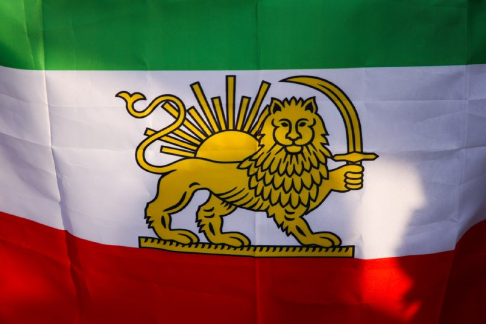

🔴 نیویورک تایمز :

فیفا قصد دارد دوباره ورود پرچم «شیر و خورشید» ایران پیش از انقلاب و لباس‌های مرتبط با آن را به ورزشگاه‌های جام جهانی ۲۰۲۶ ممنوع کند. این پرچم در جام جهانی ۲۰۲۲ قطر هم محدود شده بود.

@IranianMinds

## BBCPersian — post 281548

  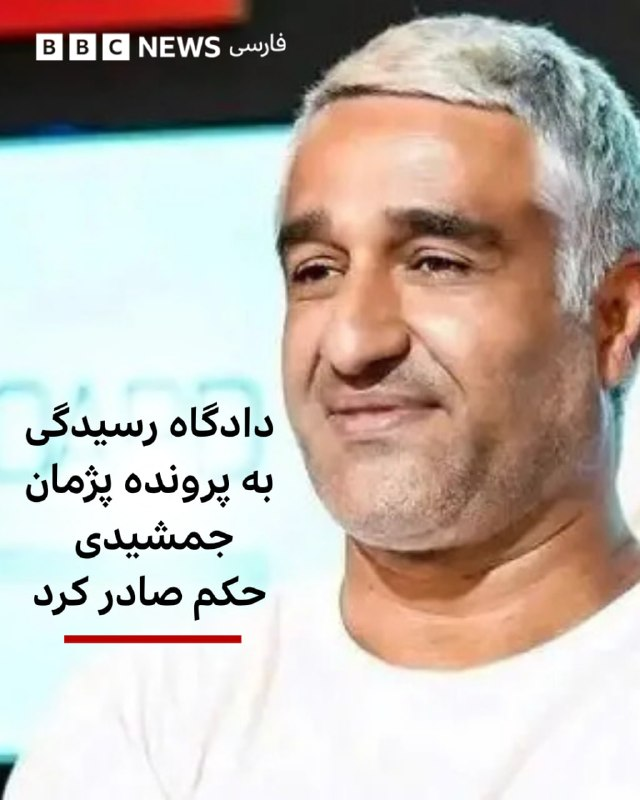

🔻دادگاه رسیدگی به شکایت از پژمان جمشیدی، بازیگر سرشناس و فوتبالیست سابق ایرانی، حکم خود را صادر کرده است هر چند وکیل آقای جمشیدی گفته در مهلت قانونی قصد درخواست تجدیدنظر دارد.

الهه محمدی، روزنامه‌نگار، در شبکه‌های اجتماعی محتوای حکم صادر شده را منتشر کرده که حکایت از تعیین «۹۹ ضربه شلاق تعزیری» دارد اما وکیل پژمان جمشیدی در گفتگو با رسانه‌ها مدعی شده تا زمان نهایی شدن حکم درباره تایید محتوای آن اظهار نظر نخواهد کرد.

روز سه‌شنبه - ۲۹ اردیبهشت - کامبیز برجاس، یکی از وکلای پژمان جمشیدی، ضمن تایید صدور و ابلاغ حکم دادگاه به خبرگزاری ایسنا گفت: «رای پرونده موکلم امروز صادر و ابلاغ شد. حکم بدوی است و ظرف ۲۰ روز قابل اعتراض است. تا زمانی که حکم قطعی نشده محتوای رای را اعلام نمی‌کنیم.»
ادامه مطلب⬇️

📸etemadonline
https://bbc.in/4v4ypQl
@BBCPersian

## alonews — post 121198

  <a href="telegram/content/alonews_121198_1779234254.webm" target="_blank">🎬 Download video</a>

👈کانال ۱۲ اسرائیل: رهبران عربستان، قطر و امارات طی ۲۴ ساعت گذشته با ترامپ تماس گرفته و گفته‌اند: «اگر حمله کنید، ایرانی‌ها به ما حمله خواهند کرد.» 
🔴آن‌ها از ترامپ خواسته‌اند که در تصمیم‌گیری خود آن‌ها را در نظر بگیرد و فرصت بیشتری برای مذاکره بدهد. ترامپ…

## alonews — post 121197

  <a href="telegram/content/alonews_121197_1779234254.webm" target="_blank">🎬 Download video</a>

👈کانال ۱۲ اسرائیل: رهبران عربستان، قطر و امارات طی ۲۴ ساعت گذشته با ترامپ تماس گرفته و گفته‌اند: «اگر حمله کنید، ایرانی‌ها به ما حمله خواهند کرد.»

🔴آن‌ها از ترامپ خواسته‌اند که در تصمیم‌گیری خود آن‌ها را در نظر بگیرد و فرصت بیشتری برای مذاکره بدهد. ترامپ نیز ظاهراً با این درخواست موافقت کرده و اعلام کرده حمله را به تعویق می‌اندازد.

🔴با این حال، برخی از این کشورها اکنون این ادعا را رد می‌کنند و می‌گویند چنین درخواستی نداده‌اند. در مقابل، مقامات آمریکایی می‌گویند هر سه کشور چنین درخواستی داشته‌اند.

✅ @AloNews خبر جنگ

## alonews — post 121196

  <a href="telegram/content/alonews_121196_1779234255.mp4" target="_blank">🎬 Download video</a>

👈وضعیت رئیس کانون هواداران پرسپولیس

احتمالا مدیرعامل آینده...

✅ @AloNews خبر جنگ

## alonews — post 121195

  <a href="telegram/content/alonews_121195_1779234257.webm" target="_blank">🎬 Download video</a>

👈خضریان:
ترکیه حد خودش ندونه باهاش برخورد میکنیم

✅ @AloNews خبر جنگ

---
📅 بروزرسانی: 1405/02/30 01:54
---

## VahidOOnLine — post 241059

  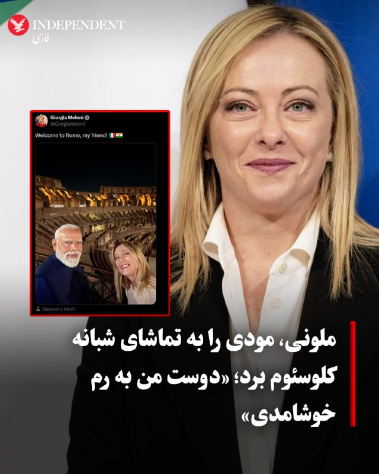

♦️جورجیا ملونی، نخست‌وزیر ایتالیا،  سه‌شنبه شب ۲۹ اردیبهشت با انتشار تصویری در شبکه اجتماعی ایکس، از حضورنارندرا مودی، نخست‌وزیر هند در رم خبر داد و نوشت :«دوست من به رم خوشامدی».
 نخست‌وزیر هند برای شرکت در گفتگوهای دوجانبه و رایزنی درباره همکاری‌های اقتصادی، سیاسی و مسائل بین‌المللی به ایتالیا سفر کرده است. این دیدار همچنین در چارچوب تقویت روابط میان دهلی‌نو و رم و هماهنگی در موضوعات جهانی از جمله انرژی و امنیت منطقه‌ای ارزیابی می‌شود.
‌🇸🇦 Indypersian

🤖 @VahidOOnLine

## VahidOOnLine — post 241058

  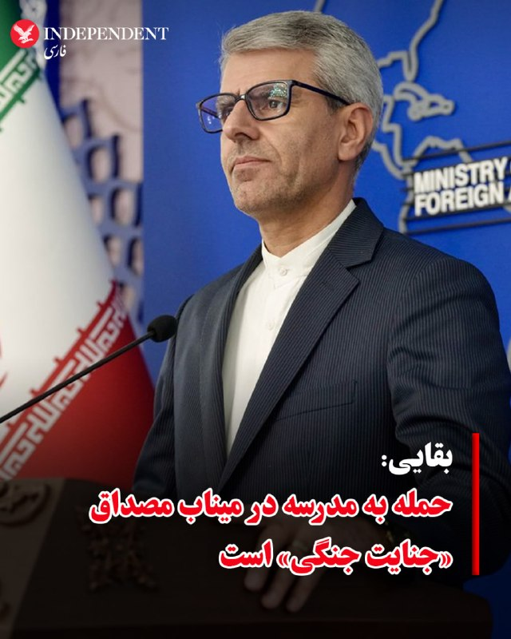

♦️اسماعیل بقایی، سخنگوی وزارت امور خارجه جمهوری اسلامی، بامداد چهارشنبه ۳۰ اردیبهشت با انتشار پیامی در شبکه اجتماعی ایکس بیانیه فرماندهی مرکزی آمریکا (سنتکام) درباره هدف قرار گرفتن یک «تأسیسات موشکی» در میناب را رد کرد و آن را «دروغی آشکار» خواند.
او افزود حمله موشکی ۲۸ فوریه به مدرسه ابتدایی «شجره طیبه» در میناب منجر به کشته شدن بیش از ۱۷۰ دانش‌آموز و معلم شده و تأکید کرد این مکان یک مرکز آموزشی فعال بوده است.
بقایی با اشاره به قوانین بین‌المللی گفت هدف قرار دادن مراکز آموزشی در زمان فعالیت، نقض جدی حقوق بشردوستانه و مصداق «جنایت جنگی» است و افزود مسئولان این حمله باید در برابر قانون پاسخگو باشند.
‌🇸🇦 Indypersian

🤖 @VahidOOnLine

## VahidOOnLine — post 241057

  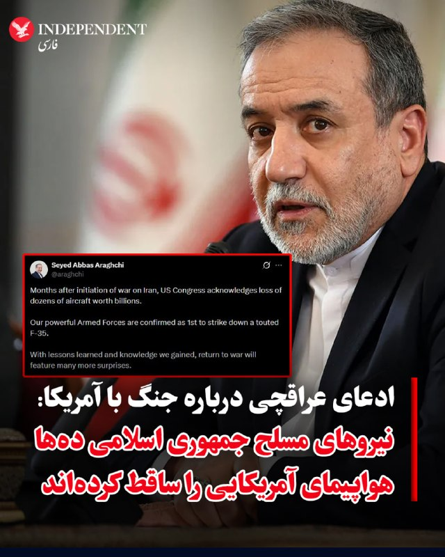

♦️عباس عراقچی، وزیر امور خارجه جمهوری اسلامی، سه‌شنبه شب در پیامی در شبکه‌های اجتماعی ایکس مدعی شد که کنگره آمریکا پس از ماه‌ها درگیری با ایران، از نابودی ده‌ها فروند هواپیمای نظامی به ارزش میلیاردها دلار خبر داده است.
او همچنین ادعا کرد نیروهای مسلح ایران نخستین طرفی بوده‌اند که موفق به سرنگونی جنگنده پیشرفته «اف-۳۵» شده‌اند و این موضوع را نشانه‌ای از توانمندی نظامی ایران دانست.
عراقچی در ادامه با اشاره به «تجربیات و دانش به‌دست‌آمده» از این درگیری‌ها، هشدار داد در صورت بازگشت به جنگ، ایران با «غافلگیری‌های بیشتری» وارد میدان خواهد شد.
‌🇸🇦 Indypersian

🤖 @VahidOOnLine

## VahidOOnLine — post 241056

  

اسماعیل بقایی، سخنگوی وزارت خارجه جمهوری اسلامی، سخنان فرمانده نیروهای مرکزی ایالات متحده، سنتکام، در مورد مدرسه ابتدایی شجره طیبه در میناب در جنوب ایران را «بی‌اساس و دروغی تکان‌دهنده» نامید.

برد کوپر، فرمانده سنتکام، سه‌شنبه در کنگره آمریکا گفت که تحقیقات نظامی ایالات متحده درباره انفجار در این مدرسه «پیچیده است، زیرا این مدرسه در یک سایت فعال موشک‌های کروز ایران قرار داشت.»

بقایی در ایکس نوشت: «این تحریف بی‌شرمانه، تلاشی آشکار برای پنهان کردن واقعیت تلخ حملات موشکی نهم اسفند است؛ حملاتی که به کشته شدن تراژیک بیش از ۱۷۰ دانش‌آموز و معلمان‌شان انجامید.»

او «هدف قرار دادن» این مرکز آموزشی را «نقض جدی حقوق بشردوستانه بین‌المللی و جنایت جنگی آشکار»‌ نامید است، و نوشت: «ماهیت غیرنظامی این محل را نمی‌توان با تحریف‌های فنی پنهان کرد. فرماندهان نظامی و مقام‌های آمریکایی مسئول صدور و اجرای این حمله فاجعه‌بار باید طبق حقوق بین‌الملل به‌طور کامل پاسخگو باشند.»
‌🏁 🇬🇧 IranintlTV

🤖 @VahidOOnLine

## VahidOOnLine — post 241055

  <a href="telegram/content/VahidOOnLine_241055_1779229462.mp4" target="_blank">🎬 Download video</a>

♦️علی خضریان، عضو کمیسیون امنیت ملی و سیاست خارجی مجلس شورای اسلامی، روز سه‌شنبه ۲۹ اردیبهشت درگفتگویی با اشاره به مواضع مقام‌های ترکیه تاکید کرد که جمهوری اسلامی اجازه نمی‌دهد هیچ کشوری برای آن «باید» تعیین کند.
او خطاب به هاکان فیدان، وزیر امور خارجه ترکیه، گفت که از این پس نباید خارج از مرزهای کشورش از واژه «باید» در قبال جمهوری اسلامی استفاده کند و افزود  ما سیاست‌های خود را به‌طور مستقل تعیین می‌کنیم.
خضریان همچنین با اشاره به ساختار تصمیم‌گیری در سیاست خارجی جمهوری اسلامی، گفت این سیاست‌ها تحت نظارت رهبر جمهوری اسلامی، در شورای عالی امنیت ملی تصویب و توسط نهادهای مرتبط از جمله مجلس شورای اسلامی مورد نظارت قرار می‌گیرد. او در پایان  گفت: «ترکیه حد و حدود کشور خودش رو نگه دارد تا احترام متقابل بین دو کشور همچنان باقی بماند.»
‌🇸🇦 Indypersian

🤖 @VahidOOnLine

## VahidOOnLine — post 241054

  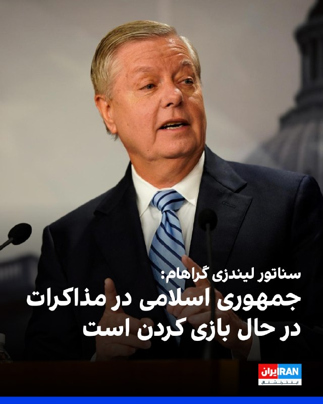

لیندزی گراهام، سناتور جمهوری‌خواه، با ابراز امیدواری مبنی بر اینکه دولت ترامپ پس از ماه‌ها مذاکره با تهران، هرگونه تلاش جمهوری اسلامی برای بار دیگر به تاخیر انداختن مذاکرات را رد کند، گفت حکومت ایران در حال وقت‌کشی و بازی کردن است.
گراهام گفت: «حکومت ایران ماه‌ها فرصت داشته است تا به توافق برسد، اما به نظر من روشن است که آنها در حال بازی کردن هستند. ترجیح من یک راه‌حل دیپلماتیک است، اما قدیمی‌ترین ترفند تهران در این زمینه تاخیر، تاخیر، تاخیر است. در مورد هر توافق احتمالی، مشتاقم آن را در سنا بررسی کنم.»

‌🏁 🇬🇧 IranintlTV

🤖 @VahidOOnLine

## VahidOOnLine — post 241053

  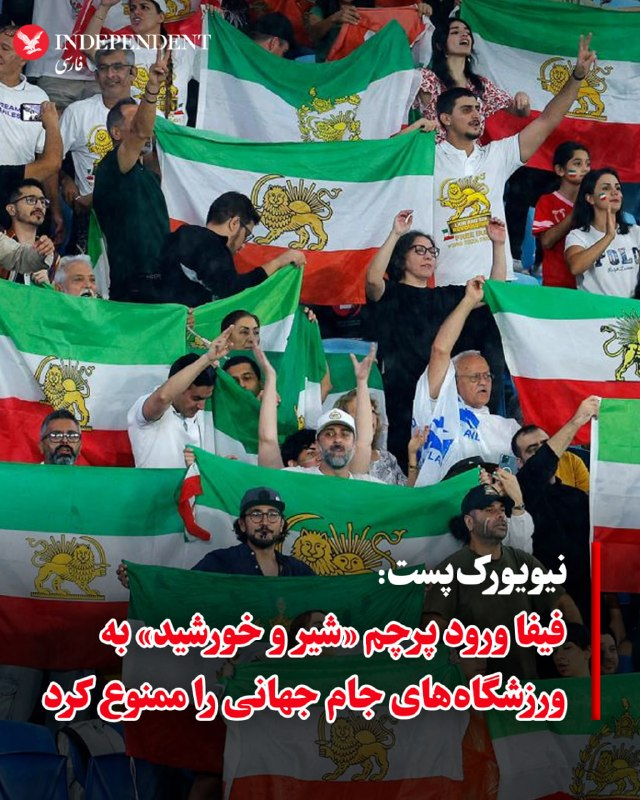

♦️نیویورک‌پست روز سه‌شنبه در گزارشی نوشت فیفا تصمیم گرفته ورود پرچم‌ها و نمادهای پیش از انقلاب ملی ایران «شیر و خورشید»، به ورزشگاه‌های جام جهانی ۲۰۲۶ را ممنوع کند.
بر اساس این گزارش، فیفا این نمادها را مغایر با قوانین مربوط به اقلام «سیاسی، توهین‌آمیز یا تبعیض‌آمیز» دانسته است. در مقابل، پرچم فلسطین به‌دلیل آن‌که مربوط به یکی از اعضای رسمی فیفا عنوان شده، مجاز اعلام شده است.
پرچم شیر و خورشید که پیش از انقلاب ۱۳۵۷ پرچم رسمی ایران بود، در سال‌های اخیر به نمادی اعتراضی در میان بخشی از ایرانیان خارج از کشور تبدیل شده و در مسابقات بین‌المللی فوتبال نیز بارها دیده شده است.
نیویورک‌پست همچنین به واکنش برخی فعالان ایرانی-آمریکایی اشاره کرده که گفته‌اند اجرای چنین ممنوعیتی می‌تواند با اعتراض گسترده هواداران ایرانی در جریان مسابقات همراه شود. گزارش‌های مشابهی نیز پیش‌تر درباره محدودیت این نماد در جام جهانی ۲۰۲۲ قطر منتشر شده بود.
‌🇸🇦 Indypersian

🤖 @VahidOOnLine

## WithYashar — post 11713

  <a href="telegram/content/WithYashar_11713_1779229464.mp4" target="_blank">🎬 Download video</a>

@withyashar

## WithYashar — post 11712

## WithYashar — post 11711

چه طوفانی میاد تهران
پشمام ریخته

## WithYashar — post 11710

سی‌بی‌اس: این طرح که توسط «تیم کین»، سناتور دموکرات ویرجینیا، ارائه شده، ترامپ را موظف می‌کند که «نیروهای مسلح ایالات متحده را از هرگونه مخاصمه در داخل یا علیه ایران خارج کند، مگر اینکه به‌وضوح با اعلام جنگ یا مجوز مشخصی برای استفاده از نیروی نظامی مجاز شده باشد.»

این رأی فقط گامی اولیه در سنا محسوب می‌شود. و حتی اگر هر دو مجلس کنگره این قطعنامه را تصویب کنند، انتظار می‌رود که رئیس‌جمهور آن را وتو کند.

اما دموکرات‌ها می‌گویند این اقدام حائز اهمیت خواهدبود و می‌تواند طرز فکر رئیس‌جمهور را در جنگ تغییر دهد.
@withyashar

## WithYashar — post 11709

پس از ۷ تلاش ناموفق، سنای آمریکا طرحی را تصویب کرد که مصوبه کنگره را برای ادامه حملات نظامی به ایران الزامی می‌کند.

سنا با رأی ۵۰ به ۴۷، اکنون به طور رسمی «قطعنامه اختیارات جنگ در ایران» را پیش برد.
@withyashar
🚨🚨🚨🚨🚨

## WithYashar — post 11708

## WithYashar — post 11707

میانجی‌های منطقه‌ای و مقامات آمریکایی:
موضع ایران در مذاکرات با آمریکا عمدتاً بدون تغییر نسبت به پیشنهادات قبلی باقی مانده.
@withyashar

## WithYashar — post 11706

## WithYashar — post 11705

## WithYashar — post 11704

ترامپ در تروث : این یکی از فاجعه‌های بزرگ دوران ریاست‌جمهوری بایدن بود؛ دوره‌ای که پر از بحران و فاجعه بود، از اینکه اجازه داد بقیهٔ جهان زندان‌ها و تیمارستان‌های خود را خالی کنند و افرادشان را به کشور بزرگ ما سرازیر کنند، تا تسلیم شدن در افغانستان
@withyashar

## WithYashar — post 11703

## WithYashar — post 11702

سناتور لیندسی گراهام ؛«من امیدوارم و انتظار دارم که پس از ماه‌ها مذاکره با ایرانی‌ها، دولت ترامپ هرگونه تلاش ایران برای به‌تعویق انداختن دوباره مذاکرات را رد کند. این رژیم ماه‌ها فرصت داشته تا به یک توافق برسد، اما به نظر من روشن است که در حال بازی دادن طرف مقابل است.

ترجیح من دستیابی به یک راه‌حل دیپلماتیک است، اما قدیمی‌ترین ترفند ایران در این‌گونه مذاکرات، تعویق، تعویق و باز هم تعویق است.

در مورد هر توافق احتمالی نیز، منتظر هستم تا آن را در سنای آمریکا بررسی کنم.»
@withyashar

## mwarmonitor — post 9331

🔻در ادامه...

🔸این موضوع با وجود همه درخواست‌ها برای یافتن «راه خروج (از بحران)»، می‌تواند برای انتخابات میان‌دوره‌ای بسیار آسیب‌زا باشد. با این حال، مسئله اصلی خودِ رژیم است، این‌طور نیست؟ اگر این رژیم جان سالم به در ببرد، چگونه آن را مهار کنیم؟

🔸برای اینکه کاملاً شفاف باشم، من هیچ اطلاعات محرمانه‌ای ندارم. در واقع، تا جایی که من می‌دانم، در پایان این فرصت ۲ تا ۳ روزه مذاکرات، اقدام نظامی علیه رژیم از سر گرفته خواهد شد. اما بسیار مهم است که به این مسائل و فراتر از آن فکر کنیم.

@mwarmonitor

## mwarmonitor — post 9330

🔴مارک لوین ؛ معامله یا عدم معامله

🔸وقتی ناگهان ترمز را کشیدیم و عملیات نظامی برنامه‌ریزی‌شده علیه رژیم ایران را لغو کردیم، مشخص بود که اتفاقاتی در پشت پرده در جریان است. ما به این رژیم ۲ تا ۳ روز فرصت دادیم تا به توافقی برسد که ظاهراً شامل «عدم دستیابی به سلاح هسته‌ای» است. اما «بدون سلاح هسته‌ای» واقعاً یعنی چه؟ آیا دانشمندان آن‌ها آنچه را که تا به حال توسعه داده‌اند، فراموش خواهند کرد؟ چقدر می‌توانیم این دانش را در جعبه محبوس نگه داریم؟ تکلیف اورانیوم غنی‌شده چه می‌شود؟ به ما گفته شده است که: ۱. آن‌ها اورانیوم کافی برای ساخت ۱۰ بمب در عرض ۱۱ روز را دارند، و ۲. تبدیل اورانیوم غنی‌شده از ۶۰ درصد به ۹۰ درصد (درجه تسلیحاتی) تنها چند هفته زمان می‌برد. در این میان، تکلیف پلوتونیوم چه می‌شود که هیچ‌کس درباره‌اش حرفی نمی‌زند؟
🔸و تکلیف موشک‌های بالستیکی که اهدافی را در سراسر خاورمیانه نابود می‌کردند، چه می‌شود؟ و برد آن موشک‌ها که حالا می‌توانند اروپا را هدف قرار دهند؟ ما حتی نمی‌دانستیم این موشک‌ها تا کجا می‌توانند برسند. حدس می‌زنم قرار است همه این‌ها تغییر کند؟ یعنی رژیم ایران که بازرسان را اخراج کرد، فعالیت‌هایش را پنهان کرد و تک‌تک توافق‌نامه‌هایی را که تا به حال امضا کرده بود نقض کرد، حالا به خاطر اقدامات نظامی ما تغییر رفتار خواهد داد؟ صادقانه بگویم، آیا این رفتارها شبیه به رژیمی است که شکست خورده یا برای مرگ و نابودی اهمیتی قائل است؟ به دلایلی، غرب نمی‌تواند این واقعیتِ جمعی را درک کند که ذهنیت رژیم ایران، ذهنیتِ همزیستی مسالمت‌آمیز نیست. این رژیم یک فرقه مذهبی، افراطی و بنیادگرا است که اصرار دارد هر کسی را که در برابر ایدئولوژی‌اش سر فرود نمی‌آورد، فتح یا نابود کند. آن‌ها این را به ما گفته‌اند. این را نوشته‌اند. این را موعظه می‌کنند. این در کتاب‌ها، جزوه‌ها، خطبه‌ها و غیره آن‌ها آمده است. این یک انقلاب بدون مرز است، نه صرفاً ملتی در میان ملت‌های دیگر. آیا ما تا الان این را یاد نگرفته‌ایم؟ در طول ۴۷ سال گذشته، آمریکایی‌های بسیاری در نتیجه جاه‌طلبی‌های این رژیم کشته شده‌اند.
🔸بزرگ‌ترین نگرانی من همیشه مسئله «ضمانت اجرا» بوده است که حتی پس از این همه مدت، بحث زیادی درباره آن نشده است. اگر معامله‌ای صورت گیرد—هر معامله‌ای که باشد، حتی اگر بزرگ‌ترین معامله تاریخ باشد—باز هم این رژیم تقلب می‌کند، دروغ می‌گوید و کارهایش را پنهان می‌کند. اطلاعات و ماهواره‌های ما به سادگی نمی‌توانند مچ همه‌چیز را بگیرند. و اگر تخلفی پیدا کردیم، بعدش چه؟ «خب، مارک، دوباره به آن‌ها ضربه می‌زنیم.» آیا قبل از ترامپ این کار را کردیم؟ آیا کسی باور می‌کند که بعد از ترامپ چنین کاری انجام دهیم؟ اگر کسی مثل گاوین نیوسام، کاملا هریس یا بقیه دموکرات‌ها رئیس‌جمهور شود، آیا چنین کاری خواهد کرد؟ هک (حتی)، رؤسای جمهور جمهوری‌خواه هم اقدامی نکردند. محض رضای خدا، نگاهی به این همه سروصدا، باج‌دهندگان، صلح‌طلبان، انزواطلبان و غیره بیندازید. این‌ها جریان‌های پر سروصدایی در سیاست و دولت ما هستند. و نگاهی به واکنش‌ها به افزایش موقت قیمت یک گالن بنزین بیندازید. آیا ما حتی چند سال دیگر اراده‌ای برای این کار خواهیم داشت؟
🔸و تکلیف حزب‌الله که هنوز یک نیروی تروریستی قدرتمند است، چه می‌شود؟ و حماس چطور؟ رژیم ایران قول خواهد داد که از آن‌ها حمایت نکند؟ پاسخ من این است: «مگر گوش گوشواره است که به این سادگی باور کنیم؟» (اشاره به ضرب‌المثل انگلیسی "پل بروکلین برای فروش است" به معنای ساده‌لوحی). اگر رژیم باز هم به آن‌ها کمک مالی کند، چگونه جلویش را بگیریم؟ چه کار خواهیم کرد؟ و مردم ایران؟ تکلیف آن‌ها چه می‌شود؟ می‌گویند: «آن‌ها باید قیام کنند.» خب، آن‌ها قیام کردند؛ آن هم دست‌خالی. و بهای وحشتناکی پرداختند و هنوز هم می‌پردازند. فقط می‌توانم تصور کنم که چه بلاهای بیشتری ممکن است سر آن‌ها بیاید.
🔸البته اروپایی‌ها همان‌طور که الان بی‌مصرف هستند، باز هم بی‌مصرف خواهند بود. حتی با وجود تنش‌زدایی با چین و چیزی شبیه به آن با روسیه، آن‌ها همچنان به حمایت از رژیم ایران ادامه خواهند داد. کره شمالی نیز همین‌طور. ما هیچ کنترلی روی کارشکنی آن‌ها در هرگونه توافقی نداریم. همه این‌ها باید در نظر گرفته شود.
🔸و دموکرات‌ها که همیشه تشنه یک فرصت سیاسی هستند، به طعنه خواهند پرسید: «چرا به جنگ رفتیم؟»، «این اوباما ۲.۰ است»، «میلیاردها دلار را هدر دادیم»، «ترامپ یک تاکو (بزدل/بی‌عرضه) است» و غیره و غیره. از همین حالا می‌توانم این حرف‌ها را بشنوم. حقیقت اهمیتی نخواهد داشت؛ جوسازی و وارونه جلوه دادن حقایق دائمی خواهد بود. البته اگر دموکرات‌ها راه خود را می‌رفتند، رژیم ایران تا الان سلاح هسته‌ای داشت. اما هیچ‌کدام از این‌ها مهم نخواهد بود.

@mwarmonitor

## mwarmonitor — post 9327

  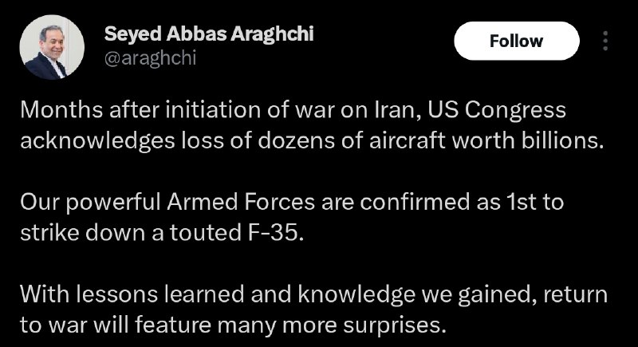

📝 عباس ماله کش که کل کارنامه‌اش آب‌بندی کردنِ رآکتور با بتنِ مرغوب و جابه‌جا کردن مرزهای «تقصیرِ قبلی‌ها بود» است، حالا وسط میدان توهماتِ هالیوودی جفتک می‌اندازد و از شکار F-35 قصه می‌بافد؛ اما شاهکارِ اصلی مال آن دلالِ مو زردِ برج‌ساز است؛ ترامپ که ادعایش گوش فلک را کر کرده بود و می‌خواست با یک توییت دنیا را جابه‌جا کند، حالا جوری اسیرِ امروز و فردا کردن‌های خاله‌زنک‌بازیِ دیپلماتیک شده که این کوتوله‌های لاف‌زن را شیر کرده است.

🔸آقای کله‌زردِ املاکی، آن‌قدر در کاخ سفید شل‌کن‌سفت‌کن درآوردی و برای این ماله به دست‌ها وقت خریدی که حالا از جیبِ تو حماسه می‌تراشند؛ آقای ترامپ، تحویل بگیر که این مسخره‌بازی و انفعال تو، چنان این کوتوله‌های سیاسی را شیر کرده که از دلِ فلاکت و انزوا، برای ابرقدرتت فاکتورِ میلیارد دلاری صادر می‌کنند؛ وقت آن است که یا این بازیِ لفت‌دادنِ احمقانه را تمام کنی یا بپذیری که با این شل‌کن‌سفت‌کن‌ها، قافیه را به چند ماله به دستِ متوهم باخته‌ای و مارِ آستینِ خودت شدی!

@mwarmonitor

## mwarmonitor — post 9326

🔴سناتور لیندسی گراهام ؛«من امیدوارم و انتظار دارم که پس از ماه‌ها مذاکره با ایرانی‌ها، دولت ترامپ هرگونه تلاش ایران برای به‌تعویق انداختن دوباره مذاکرات را رد کند. این رژیم ماه‌ها فرصت داشته تا به یک توافق برسد، اما به نظر من روشن است که در حال بازی دادن طرف مقابل است.

🔸ترجیح من دستیابی به یک راه‌حل دیپلماتیک است، اما قدیمی‌ترین ترفند ایران در این‌گونه مذاکرات، تعویق، تعویق و باز هم تعویق است.

🔸در مورد هر توافق احتمالی نیز، منتظر هستم تا آن را در سنای آمریکا بررسی کنم.»

@mwarmonitor

## FoxNewsTwitter — post 341965

  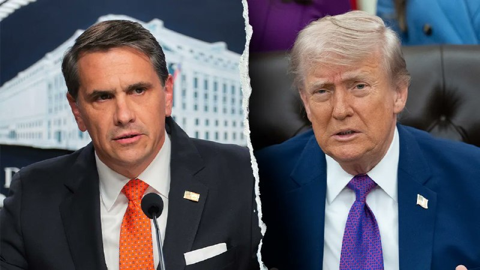

Fox News (Twitter/X)

BREAKING: Acting AG Todd Blanche signed an order Tuesday barring the IRS from examining President Trump’s prior tax returns and blocking the agency from pursuing pending claims against Trump, his family or his businesses.

## FoxNewsTwitter — post 341964

  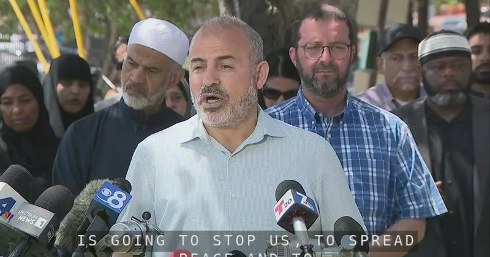

Fox News (Twitter/X)

WATCH LIVE: California Muslim leaders hold a press conference on San Diego mosque shooting (Courtesy: KSWB) https://twitter.com/i/broadcasts/1XGygmqmBBdxM

## pm_afshaa — post 91071

  <a href="telegram/content/pm_afshaa_91071_1779229466.webm" target="_blank">🎬 Download video</a>

🔴میانجی‌های منطقه‌ای و مقامات آمریکایی:
موضع ایران در مذاکرات با آمریکا عمدتاً بدون تغییر نسبت به پیشنهادات قبلی باقی مانده.

💧 Rainbet.com the #1 Non-KYC Crypto Casino & Sportsbook @rainbetcom

😁 @Pm_Afshaa

## pm_afshaa — post 91070

  <a href="telegram/content/pm_afshaa_91070_1779229466.webm" target="_blank">🎬 Download video</a>

🔴سناتور لیندسی گراهام:
من امیدوارم و انتظار دارم که پس از ماه‌ها مذاکره با ایرانی‌ها، دولت ترامپ هرگونه تلاش ایران برای به‌تعویق انداختن دوباره مذاکرات رو رد کنه؛ این رژیم ماه‌ها فرصت داشته تا به یک توافق برسه، اما به نظر من روشنه که در حال بازی دادن طرف مقابله.

ترجیح من دستیابی به یک راه‌حل دیپلماتیک است، اما قدیمی‌ترین ترفند ایران در این‌گونه مذاکرات، تعویق، تعویق و باز هم تعویق است. در مورد هر توافق احتمالی هم منتظر هستم تا در سنای آمریکا بررسی کنم.

💧 Rainbet.com the #1 Non-KYC Crypto Casino & Sportsbook @rainbetcom

😁 @Pm_Afshaa

## IranIntlTV — post 338015

  <a href="https://t.me/IranintlTV/338015" target="_blank">📎 Download file</a>

🎧نسخه صوتی سیاست با مراد ویسی: احتمال ابربحران بنزین و برق
@iranintlTV

## IranIntlTV — post 338014

  <a href="telegram/content/IranIntlTV_338014_1779229467.mp4" target="_blank">🎬 Download video</a>

ستاد فرماندهی مرکزی آمریکا، سنتکام، با انتشار ویدیویی در ایکس اعلام کرد تاکنون ۸۹ کشتی تجاری برای تضمین اجرای محاصره دریایی جمهوری اسلامی تغییر مسیر داده‌اند.

در این اطلاعیه آمده است نیروهای این فرماندهی همچنان به‌طور کامل محاصره دریایی را اجرا می‌کنند و مانع جریان تجارت به بنادر ایران و از آن‌ها می‌شوند.
@iranintltv

## IranIntlTV — post 338013

  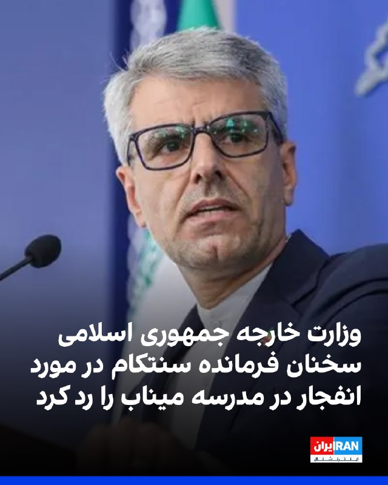

اسماعیل بقایی، سخنگوی وزارت خارجه جمهوری اسلامی، سخنان فرمانده نیروهای مرکزی ایالات متحده، سنتکام، در مورد مدرسه ابتدایی شجره طیبه در میناب در جنوب ایران را «بی‌اساس و دروغی تکان‌دهنده» نامید.

برد کوپر، فرمانده سنتکام، سه‌شنبه در کنگره آمریکا گفت که تحقیقات نظامی ایالات متحده درباره انفجار در این مدرسه «پیچیده است، زیرا این مدرسه در یک سایت فعال موشک‌های کروز ایران قرار داشت.»

بقایی در ایکس نوشت: «این تحریف بی‌شرمانه، تلاشی آشکار برای پنهان کردن واقعیت تلخ حملات موشکی نهم اسفند است؛ حملاتی که به کشته شدن تراژیک بیش از ۱۷۰ دانش‌آموز و معلمان‌شان انجامید.»

او «هدف قرار دادن» این مرکز آموزشی را «نقض جدی حقوق بشردوستانه بین‌المللی و جنایت جنگی آشکار»‌ نامید است، و نوشت: «ماهیت غیرنظامی این محل را نمی‌توان با تحریف‌های فنی پنهان کرد. فرماندهان نظامی و مقام‌های آمریکایی مسئول صدور و اجرای این حمله فاجعه‌بار باید طبق حقوق بین‌الملل به‌طور کامل پاسخگو باشند.»
https://iranintl.com/202605196354

## IranIntlTV — post 338012

  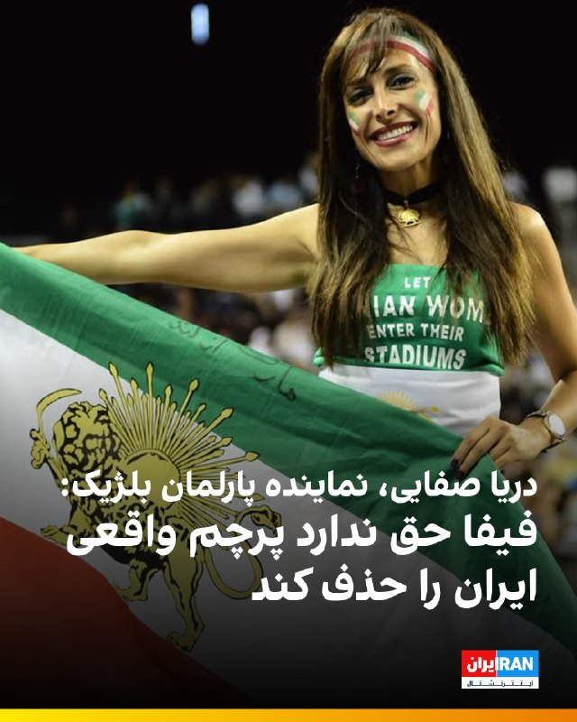

🔻دریا صفایی، نماینده پارلمان بلژیک در یک پست اینستاگرامی در واکنش به احتمال ممنوع شدن ورود پرچم شیر و خورشید به استادیوم‌های جام جهانی نوشت: «پرچم واقعی و ملی ایران پرچم شیر‌و‌خورشید است که هزاران سال قدمت دارد نه پرچم ایدئولوژیک جمهوری اسلامی با کلمه الله در وسط پرچم.»

🔹او با اشاره به تلاش‌هایش در سال‌های گذشته برای ورود آزادانه زنان به استادیوم‌ها در داخل ایران در صفحه اینستاگرام خود نوشت: «از سال ۲۰۱۴ که برای کمپین آزادی ورود زنان به ورزشگاه‌های ایران دور جهان میرفتم، همه جا پرچم واقعی ایران را همراه می‌بردم.»

🔹نماینده ایرانی‌تبار پارلمان بلژیک که این پست را به دو زبان فارسی و انگلیسی و خطاب به «جهانیان» نوشته، اضافه کرده است: «برای اینکه بفهمید پرچم کنونی جمهوری اسلامی چیست میتوانید آن را با پرچم کمونیستی داس و چکش و دیگر نمادهای ایدئولوژیک مقایسه کنید که هر کشوری را اشغال میکرد و پرچم ایدئولوژیکش را جایگزین پرچم تاریخی آن کشور می‌کرد.»

🔹صفایی همچنین خطاب به فدراسیون جهانی فوتبال نوشت: «فیفا حق ندارد پرچم واقعی یک کشور را از مسابقات حذف کند.»

@iranintltvsport

## IranIntlTV — post 338011

  <a href="telegram/content/IranIntlTV_338011_1779229469.mp4" target="_blank">🎬 Download video</a>

وزارت خزانه‌داری ایالات متحده سه‌شنبه ۲۹ اردیبهشت در بیانیه‌ای از اعمال تحریم‌های جدید علیه «صرافی امین» مستقر در ایران با نام دیگر «ابراهیمی و شرکا» و شبکه‌ای از شرکت‌های پوششی در چند کشور خبر داد.

اردوان روزبه، خبرنگار ایران‌اینترنشنال، گزارش می‌دهد
@iranintltv

## IranIntlTV — post 338010

  <a href="telegram/content/IranIntlTV_338010_1779229471.mp4" target="_blank">🎬 Download video</a>

فرماندهان ارشد نظامی کشورهای عضو ناتو، در بروکسل درباره افزایش آمادگی دفاعی، ادامه حمایت نظامی از اوکراین و نگرانی‌های امنیتی اروپا گفت‌وگو کردند.

گزارش لی‌لی نیکفر، خبرنگار ایران‌اینترنشنال
@iranintltv

## IranIntlTV — post 338009

  <a href="telegram/content/IranIntlTV_338009_1779229473.mp4" target="_blank">🎬 Download video</a>

مراد ویسی، تحلیل‌گر ارشد ایران‌اینترنشنال، گفت: «همزمانی بحران‌هایی مانند بنزین، برق، گرانی، بیکاری، قطع اینترنت، کمبود آب، گاز و پیامدهای جنگ، جمهوری اسلامی را با مجموعه‌ای از فشارهای همزمان روبه‌رو کرده است. مهم‌ترین بحران برای حکومت خطر از سرگیری قیام مردم است که مجموع این مشکلات را به ابربحران بقا برای حکومت تبدیل کرده و تاب‌آوری آن را زیر سوال برده است.»
@iranintltv

## IranIntlTV — post 338008

  <a href="telegram/content/IranIntlTV_338008_1779229474.mp4" target="_blank">🎬 Download video</a>

مراد ویسی، تحلیل‌گر ارشد ایران‌اینترنشنال، گفت: «اگر جنگ از سر گرفته شود و آمریکا و اسرائیل به تلافی حملات جمهوری اسلامی به پالایشگاه‌ها حمله کنند بحران کمبود بنزین به ابربحران بنزین و فروپاشی شبکه تولید و تامین بنزین منجر ‌می‌شود.»
@iranintltv

## IranIntlTV — post 338007

  <a href="telegram/content/IranIntlTV_338007_1779229475.mp4" target="_blank">🎬 Download video</a>

مراد ویسی، تحلیل‌گر ارشد ایران‌اینترنشنال، گفت: «دولت همه واقعیت موجود درباره احتمال وقوع ابربحران‌های بنزین و برق را به مردم نمی‌گوید. مسئله فقط کمبود بنزین و برق نیست مسئله احتمال فروپاشی شبکه تامین بنزین و برق در جریان جنگ است.»
@iranintltv

## IranIntlTV — post 338006

  

لیندزی گراهام، سناتور جمهوری‌خواه، با ابراز امیدواری مبنی بر اینکه دولت ترامپ پس از ماه‌ها مذاکره با تهران، هرگونه تلاش جمهوری اسلامی برای بار دیگر به تاخیر انداختن مذاکرات را رد کند، گفت حکومت ایران در حال وقت‌کشی و بازی کردن است.
گراهام گفت: «حکومت ایران ماه‌ها فرصت داشته است تا به توافق برسد، اما به نظر من روشن است که آنها در حال بازی کردن هستند. ترجیح من یک راه‌حل دیپلماتیک است، اما قدیمی‌ترین ترفند تهران در این زمینه تاخیر، تاخیر، تاخیر است. در مورد هر توافق احتمالی، مشتاقم آن را در سنا بررسی کنم.»

https://iranintl.com/202605190605

## IranIntlTV — post 338005

  <a href="telegram/content/IranIntlTV_338005_1779229476.mp4" target="_blank">🎬 Download video</a>

محمدمهدی جارچی، جوان ۳۸ ساله و متاهل، در فردیس استان البرز، عاشق ایران و شیفته موسیقی بود.

صبح ۱۹ دی، او با دیدن پیکر چند جان‌باخته انقلاب ملی در نزدیکی خانه‌اش عمیقاً تحت تأثیر قرار گرفت. همان شب در فردیس البرز به معترضان پیوست و با شلیک گلوله نیروهای حکومتی کشته شد.

او رویای آزادی ایران را در سر داشت؛ نامش حالا در میان جاویدنامان انقلاب ملی ماندگار شده است.

@iranintltv

## ManotoTV — post 105662

  <a href="telegram/content/ManotoTV_105662_1779229478.mp4" target="_blank">🎬 Download video</a>

‌
لیلا بهمنی، عضو «کمیته مقررات عدالت انتقالی» که از سوی شاهزاده رضا پهلوی انتخاب شده، در گفت‌وگو با منوتو از شهروندانی که اموالشان توسط جمهوری اسلامی مصادره شده خواست همه اسناد و مدارک مرتبط را حفظ کنند.

او گفت افرادی که با مصادره اموال روبه‌رو شده‌اند باید از نخستین تماس‌ها، پیامک‌ها، احضاریه‌ها و روند مصادره، یک «جدول زمانی» دقیق تهیه کنند و مشخصات افرادی را که در این روند حضور داشته‌اند ثبت کنند.

بهمنی تاکید کرد اسناد باید در چند نسخه، از جمله نسخه دیجیتال، نگهداری شوند و حتی در صورت از بین رفتن مدارک رسمی، شهادت شاهدان، همسایه‌ها و آشنایان نیز می‌تواند در آینده برای اثبات مالکیت یا مصادره اموال مورد استفاده قرار گیرد.

او در عین حال تاکید کرد امنیت افراد باید در اولویت باشد و شهروندان نباید برای جمع‌آوری یا نگهداری اسناد، جان یا امنیت خود را به خطر بیندازند.

این عضو کمیته مقررات عدالت انتقالی گفت هرچه اسناد و مدارک بیشتری وجود داشته باشد، اثبات «جرم مصادره» در آینده آسان‌تر خواهد بود.

## FarsiVOA — post 218191

⚡️حضور زنانی با پوشش اختیاری در تجمعات حکومتی در ایران؛ گفت‌وگو با نعیمه دوستدار
@FarsiVOA

## FarsiVOA — post 218190

⚡️پوشش ویژه | گفت‌وگوی رئیس جمهوری آمریکا با خبرنگاران؛ ترامپ: بسیاری از رهبران رژیم از بین رفته‌اند
@FarsiVOA

## FarsiVOA — post 218189

🔺جی‌دی ونس: در مذاکرات با جمهوری اسلامی پیشرفت حاصل شده اما واشنگتن برای ادامه اقدام نظامی آماده است

▪️جی‌دی ونس، معاون رئیس‌جمهوری آمریکا، روز سه‌شنبه ۲۹ اردیبهشت در کاخ سفید در یک کنفرانس خبری درباره ایران صحبت کرد و گفت رئیس‌جمهوری آمریکا، دونالد ترامپ، همچنان پیگیر دیپلماسی با رژیم ایران است اما برای از سرگیری حملات نظامی در صورت شکست مذاکرات هسته‌ای آماده است.

⬇️ بیشتر بخوانید:
https://ir.voanews.com/a/8151754.html
@FarsiVOA

## FarsiVOA — post 218188

⚡️جی‌دی ونس: پیشرفت‌های بسیاری در گفت‌وگو با جمهوری‌ اسلامی داشته‌ایم
@FarsiVOA

## FarsiVOA — post 218187

⚡️ماجرای مهار دستوری یک سقوط حتمی در بورس تهران پس از ۸۰ روز تعطیلی؛ گفت‌وگو با معصومه طاهرخانی
@FarsiVOA

## FarsiVOA — post 218186

⚡️مخفی ماندن «مجتبی خامنه‌ای»؛ علل، ریشه‌ها و پی‌آمدهای آن برای جمهوری اسلامی در گفت‌وگو با سعید آگنجی
@FarsiVOA

## FarsiVOA — post 218185

⚡️گسترش مدارس دینی در حاکمیت طالبان و نگرانی از افراط‌گرایی در منطقه
@FarsiVOA

## FarsiVOA — post 218184

  <a href="telegram/content/FarsiVOA_218184_1779229480.mp4" target="_blank">🎬 Download video</a>

⚡️مهدی نوربخش در برنامه تفسیر خبر: ایران در یک فرصت تاریخی قرار گرفته
@FarsiVOA

## FarsiVOA — post 218183

⚡️تازه‌ترین مواضع دموکرات‌ها و جمهوری‌خواهان در مورد تحولات مربوط به ایران
@FarsiVOA

## FarsiVOA — post 218182

🔺اسکات بسنت از متحدان آمریکا خواست منابع مالی جمهوری اسلامی را هدف قرار دهند

▪️اسکات بسنت، وزیر خزانه‌داری ایالات متحده، روز سه‌شنبه ۲۹ اردیبهشت در یک نشست مبارزه با تأمین مالی تروریسم در پاریس، از متحدان اروپایی خواست که به منابع مالی جمهوری اسلامی حمله کنند.

⬇️ بیشتر بخوانید:
https://ir.voanews.com/a/8151743.html
@FarsiVOA

## Persian_Trend_Official — post 14501

🔴 سنای آمریکا طرح محدودسازی اختیارات جنگی ترامپ علیه ایران را تصویب کرد 💢سنای آمریکا پس از ۷ تلاش ناموفق، طرحی را تصویب کرد که بر اساس آن ادامه هرگونه اقدام نظامی علیه ایران نیازمند مجوز کنگره خواهد بود. ▪️ این طرح با رأی ۵۰ موافق در برابر ۴۷ مخالف تصویب…

## Persian_Trend_Official — post 14500

🔴 سنای آمریکا طرح محدودسازی اختیارات جنگی ترامپ علیه ایران را تصویب کرد

💢سنای آمریکا پس از ۷ تلاش ناموفق، طرحی را تصویب کرد که بر اساس آن ادامه هرگونه اقدام نظامی علیه ایران نیازمند مجوز کنگره خواهد بود.

▪️ این طرح با رأی ۵۰ موافق در برابر ۴۷ مخالف تصویب شد

▪️ «قطعنامه اختیارات جنگ در ایران» توسط سناتور دموکرات «تیم کین» ارائه شده است

بر اساس متن طرح:

▪️ ترامپ موظف خواهد شد نیروهای مسلح آمریکا را از هرگونه درگیری در داخل یا علیه ایران خارج کند

▪️ مگر آنکه کنگره رسماً اعلان جنگ کند یا مجوز مشخص استفاده از نیروی نظامی صادر شود

با این حال:

▪️ این رأی تنها یک مرحله اولیه در سنا محسوب می‌شود

▪️ حتی در صورت تصویب نهایی در کنگره، احتمال وتوی آن توسط ترامپ بسیار بالاست

▪️دموکرات‌ها می‌گویند این اقدام می‌تواند بر تصمیمات کاخ سفید درباره جنگ با ایران تأثیر بگذارد.

🫆:Tony

📌 @persian_trend_official
پرشین ترند | متفاوت‌ترین کانال نظامی

## Persian_Trend_Official — post 14499

  <a href="telegram/content/Persian_Trend_Official_14499_1779229481.mp4" target="_blank">🎬 Download video</a>

شبتون بخیر 🔥❤️

📝 Nick
📌 @persian_trend_official
پرشین ترند | متفاوت‌ترین کانال نظامی

## Persian_Trend_Official — post 14498

هم اکنون طوفان در تهران.

📝 Nick

📌 @persian_trend_official
پرشین ترند | متفاوت‌ترین کانال نظامی

## Persian_Trend_Official — post 14497

https://youtube.com/live/iLtj3w_ZmNU?feature=share

## IranianMinds — post 20413

🔴 مجلس سنای آمریکا بلاخره بعد از ۷ دور رای به محدود کردن اختیارات جنگی ترامپ داد.

برای اینکه کامل تصویب بشه باید در کنگره هم رای گیری بشه.

@IranianMinds

## BBCPersian — post 281547

  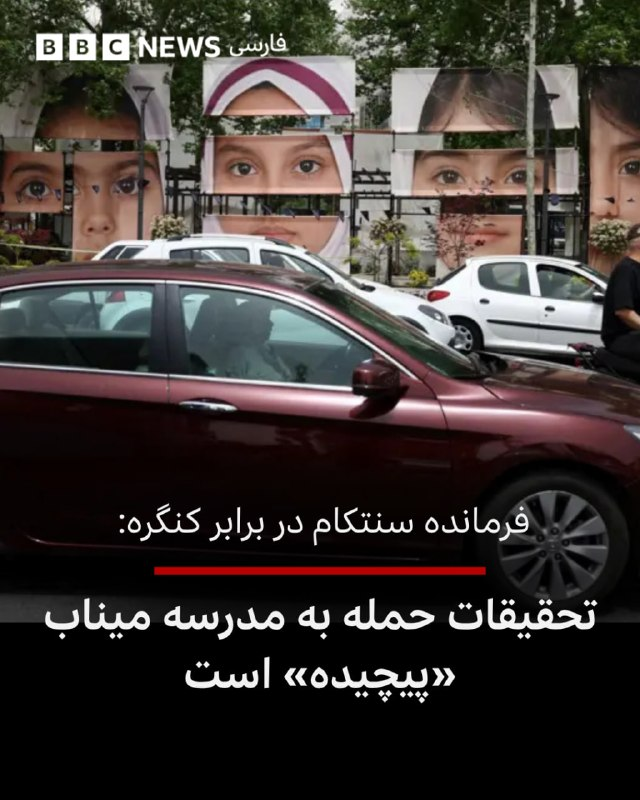

🔻دریاسالار برد کوپر، فرمانده ستاد فرماندهی مرکزی آمریکا (سنتکام) در برابر کنگره این کشور شهادت داد که تحقیقات ارتش آمریکا درباره انفجار در یک مدرسه ای در میناب در جنوب در ایران «پیچیده» است.

او گفت که این محل در یک سایت فعال موشک‌های کروز ایران قرار داشته است.

خبرگزاری رویترز پیشتر گزارش داده بود که یک بررسی اولیه داخلی در ارتش آمریکا نشان داده است که احتمالاً نیروهای آمریکایی مسئول تخریب این مدرسه بوده‌اند.

پنتاگون از آن زمان سطح این تحقیقات را ارتقا داده است.

این حمله موشکی در نهم اسفند (۲۸ فوریه،) اولین روز جنگ، رخ داد و به گفته مقام‌های ایرانی، در نتیجه آن ۱۶۸ نفر از دانش آموزان، معلمان و چند نفر از والدین کشته شدند.

بنابر آمار رسمی ایران، ۱۲۰ نفر از جان باختگان این حمله موشکی دانش‌آموزان دبستانی بودند.

مقام‌های آمریکایی تاکنون نقش داشتن نیروهای این کشور در این حمله را تکذیب نکرده‌اند اما می‌گویند درباره چگونگی شکل‌گیری این حمله و دلایل بروز اشتباهات احتمالی، در حال تحقیقاتی هستند که اکنون فرمانده سنتکام آن را «پیچیده» خوانده است.

📸REUTERS
https://bbc.in/4fvV8Qw
@BBCPersian

## BBCPersian — post 281546

🔻در چند هفته گذشته، دونالد ترامپ رئیس جمهوری آمریکا بارها گفته که به کردها اسلحه داده تا به دست معترضان در ایران برسانند،
اما کردها این سلاح ها را نگه داشته اند. این در حالی است که احزاب کرد ایرانی و مقامهای اقلیم کردستان عراق می گویند سلاحی به این منطقه فرستاده نشده.

اما تحقیقات بی بی سی نشان می‌دهد که قرار بوده احزاب کرد ایرانی سه روز پس از آغازجنگ ۳۹ روزه، وارد ایران شوند و به آنها کمک مالی شده بود.
@BBCPersian

## Dirty_Kids — post 389786

  <a href="telegram/content/Dirty_Kids_389786_1779229482.webm" target="_blank">🎬 Download video</a>

☢️خفن ترین و‌ قدیمی ترین  انالیزور  ایران ینی دکتر بت 
👍 
🔴هیچ سایت بتی دوست نداره شما کانال دکتر بت رو پیدا کنین چون خیلی سود میکنید🤷‍♂ رایگان بهترین شرط هارو براتون میذاره حتی هزار تومن هم دریافت نمیکنه روزانه میتونی از پیش بینی فوتبال باهاش پول در بیاری…

## Dirty_Kids — post 389785

  <a href="telegram/content/Dirty_Kids_389785_1779229483.webm" target="_blank">🎬 Download video</a>

☢️خفن ترین و‌ قدیمی ترین  انالیزور  ایران ینی دکتر بت 
👍

🔴هیچ سایت بتی دوست نداره شما کانال دکتر بت رو پیدا کنین چون خیلی سود میکنید🤷‍♂

رایگان بهترین شرط هارو براتون میذاره
حتی هزار تومن هم دریافت نمیکنه
روزانه میتونی از پیش بینی فوتبال باهاش پول در بیاری 👌
A29
اگ اهل پیش بینی فوتبالی این کانال اصلا از دست ندین👇

✅https://t.me/+4_ADqwB9e-QwYjlk

✅https://t.me/+4_ADqwB9e-QwYjlk

## Dirty_Kids — post 389784

  

#بخوابیم

@Dirty_Kids 👻

## Dirty_Kids — post 389783

  

به فیفا بگید ایران فقط و فقط یه پرچم داره.
اونم پرچم شیروخورشید هست...

@Dirty_Kids 👻

## Dirty_Kids — post 389782

پژمان جمشیدی به «اتهام تجاوز» به ۹۹ ضربه شلاق تعزیری محکوم شد!

سؤال ساده: اگر بی‌گناه است، شلاق چه معنایی دارد؟ و اگر واقعاً تجاوز کرده، ۹۹ ضربه شلاق( آن هم تعزیری) تمام مجازات اوست؟!

این تناقض عجیب «عدالت» ما را به خوبی نشان می‌دهد.

@Dirty_Kids 👻

## Dirty_Kids — post 389781

  

بزرگوار رو مجله پلی بوی سجده میکرده

@Dirty_Kids 👻

## Dirty_Kids — post 389780

  <a href="telegram/content/Dirty_Kids_389780_1779229484.mp4" target="_blank">🎬 Download video</a>

اهدای عضو اهدای زندگی

این جوان ال‌جی‌بی‌تی عضوش را به مجتبی خامنه‌ای اهدا کرد

@Dirty_Kids 👻

## Dirty_Kids — post 389779

  <a href="telegram/content/Dirty_Kids_389779_1779229486.mp4" target="_blank">🎬 Download video</a>

هم شعار سیاسی میدیم
هم فحشتون میدیم
هم پرچم شیر و خورشید میاریم تو ورزشگاه
هم کون‌تون میزاریم
هم پرچم خرچنگ نشان نظام آفتابه‌ایی جرررر میدیم
تخم حروم فکر کردی آمریکا و کانادا طویله اعراب که زد بند کنید

@Dirty_Kids 👻

## Dirty_Kids — post 389778

  <a href="telegram/content/Dirty_Kids_389778_1779229488.mp4" target="_blank">🎬 Download video</a>

اینجا نه کربلاست، نه بغداد، نه لندن
متاسفانه مشهده و شاهد جولان عراقیا و نیروهای حشدالشعبی در سطح شهر هستیم

@Dirty_Kids 👻

## Dirty_Kids — post 389777

از پارتیم شانس نیاوردیم

@Dirty_Kids 👻

## Dirty_Kids — post 389776

  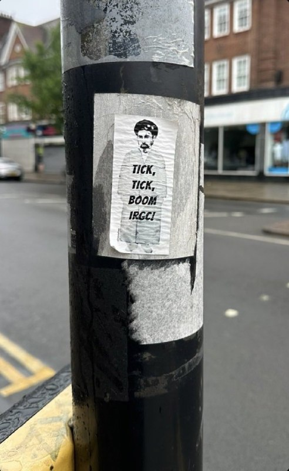

یه تیر برق رندومی تو خیابونهای لندن

مجتبی جهانی شده…

@Dirty_Kids 👻

## manototv — post 105662

  <a href="telegram/content/manototv_105662_1779229490.mp4" target="_blank">🎬 Download video</a>

‌
لیلا بهمنی، عضو «کمیته مقررات عدالت انتقالی» که از سوی شاهزاده رضا پهلوی انتخاب شده، در گفت‌وگو با منوتو از شهروندانی که اموالشان توسط جمهوری اسلامی مصادره شده خواست همه اسناد و مدارک مرتبط را حفظ کنند.

او گفت افرادی که با مصادره اموال روبه‌رو شده‌اند باید از نخستین تماس‌ها، پیامک‌ها، احضاریه‌ها و روند مصادره، یک «جدول زمانی» دقیق تهیه کنند و مشخصات افرادی را که در این روند حضور داشته‌اند ثبت کنند.

بهمنی تاکید کرد اسناد باید در چند نسخه، از جمله نسخه دیجیتال، نگهداری شوند و حتی در صورت از بین رفتن مدارک رسمی، شهادت شاهدان، همسایه‌ها و آشنایان نیز می‌تواند در آینده برای اثبات مالکیت یا مصادره اموال مورد استفاده قرار گیرد.

او در عین حال تاکید کرد امنیت افراد باید در اولویت باشد و شهروندان نباید برای جمع‌آوری یا نگهداری اسناد، جان یا امنیت خود را به خطر بیندازند.

این عضو کمیته مقررات عدالت انتقالی گفت هرچه اسناد و مدارک بیشتری وجود داشته باشد، اثبات «جرم مصادره» در آینده آسان‌تر خواهد بود.

## alonews — post 121194

  <a href="telegram/content/alonews_121194_1779229492.webm" target="_blank">🎬 Download video</a>

👈نخست وزیرهای ایتالیا و هند این وقت شب دوتایی رفتن کلوسئوم رو ببینن

✅ @AloNews خبر جنگ

## alonews — post 121193

👈ترامپ: آمریکا ممکن است دوباره به ایران حمله کند، اما تهران خواهان توافق است

🔴ترامپ گفت ایالات متحده ممکن است بار دیگر ایران را هدف حمله قرار دهد و افزود تنها یک ساعت تا صدور دستور حمله فاصله داشته، اما تصمیم گرفته آن را به تعویق بیندازد.

🔴ترامپ همچنین گفت که که مقام‌های ایرانی خواهان دستیابی به توافق هستند، اما هشدار داد اگر توافقی حاصل نشود، حمله جدید آمریکا ممکن است ظرف چند روز آینده انجام شود

✅ @AloNews خبر جنگ

## alonews — post 121192

  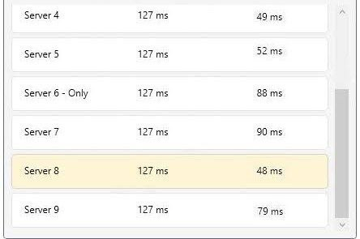

پائین‌ترین پینگ‌ها رو با ما تجربه کنید
✔️

🔄کانفیگ‌های استارلینگ با پشتیبانی 24ساعته و لینک ساب
🔄

💯مورد تایید مجموعه الونیوز
💯

📌تحویل زیر 1دقیقه

📌بدون هیچ گونه قطعی

💰خرید آسان و سریع
⬇️

💎@FastProxyMakerBot

💎@FastProxyMakerBot

## alonews — post 121191

  <a href="telegram/content/alonews_121191_1779229492.webm" target="_blank">🎬 Download video</a>

🔴خبر فووووووووووووری/پس از ۷ تلاش ناموفق، سنای آمریکا طرحی را تصویب کرد که مصوبه کنگره را برای ادامه حملات نظامی به ایران الزامی می‌کند. 
🔴سنا با رأی ۵۰ به ۴۷، اکنون به طور رسمی «قطعنامه اختیارات جنگ در ایران» را پیش برد. 
✅ @AloNews خبر جنگ

## alonews — post 121190

  <a href="telegram/content/alonews_121190_1779229493.webm" target="_blank">🎬 Download video</a>

🔴خبر فووووووووووووری/پس از ۷ تلاش ناموفق، سنای آمریکا طرحی را تصویب کرد که مصوبه کنگره را برای ادامه حملات نظامی به ایران الزامی می‌کند.

🔴سنا با رأی ۵۰ به ۴۷، اکنون به طور رسمی «قطعنامه اختیارات جنگ در ایران» را پیش برد.

✅ @AloNews خبر جنگ

## alonews — post 121188

  <a href="telegram/content/alonews_121188_1779229493.mp4" target="_blank">🎬 Download video</a>

👈تصاویر وایرال شده از مدرسه میناب

✅ @AloNews خبر جنگ

## alonews — post 121187

  <a href="telegram/content/alonews_121187_1779229494.webm" target="_blank">🎬 Download video</a>

👈جا داره قهرمانی آرسنال رو به جاویدنام عارف جعفرزاده تبریک بگیم

✅ @AloNews خبر جنگ

## alonews — post 121186

  <a href="telegram/content/alonews_121186_1779229494.webm" target="_blank">🎬 Download video</a>

👈لیندسی گراهام : امیدوارم و انتظار هم دارم بعد از این چند ماه مذاکره با ایرانی‌ها، دولت ترامپ هر تلاشی رو که برای دوباره کش دادن مذاکراته رد کنه
- این رژیم ماه‌ها وقت داشته به توافق برسه، ولی به نظرم واضحه دارن بازی درمیارن

-:من خودم ترجیحم راه‌حل دیپلماتیکه، ولی قدیمی‌ترین ترفند ایران همیشه این بوده : امروز و فردا کردن، کش دادن، کش دادن، کش دادن

- در مورد هر توافقی هم، منتظرم بره سنا و اونجا بررسیش کنیم

✅ @AloNews خبر جنگ

## alonews — post 121185

👈جهت رزرو تبلیغات vpn در کانال #الونیوز به کانال زیر مراجعه کنید👇

📃https://t.me/ads_alonews

📃https://t.me/ads_alonews

---
📅 بروزرسانی: 1405/02/30 00:33
---

## VahidOOnLine — post 241052

  

♦️نیویورک‌پست روز سه‌شنبه در گزارشی نوشت فیفا تصمیم گرفته ورود پرچم‌ها و نمادهای پیش از انقلاب ملی ایران «شیر و خورشید»، به ورزشگاه‌های جام جهانی ۲۰۲۶ را ممنوع کند.
بر اساس این گزارش، فیفا این نمادها را مغایر با قوانین مربوط به اقلام «سیاسی، توهین‌آمیز یا تبعیض‌آمیز» دانسته است. در مقابل، پرچم فلسطین به‌دلیل آن‌که مربوط به یکی از اعضای رسمی فیفا عنوان شده، مجاز اعلام شده است.
پرچم شیر و خورشید که پیش از انقلاب ۱۳۵۷ پرچم رسمی ایران بود، در سال‌های اخیر به نمادی اعتراضی در میان بخشی از ایرانیان خارج از کشور تبدیل شده و در مسابقات بین‌المللی فوتبال نیز بارها دیده شده است.
نیویورک‌پست همچنین به واکنش برخی فعالان ایرانی-آمریکایی اشاره کرده که گفته‌اند اجرای چنین ممنوعیتی می‌تواند با اعتراض گسترده هواداران ایرانی در جریان مسابقات همراه شود. گزارش‌های مشابهی نیز پیش‌تر درباره محدودیت این نماد در جام جهانی ۲۰۲۲ قطر منتشر شده بود.
‌🇸🇦 Indypersian

🤖 @VahidOOnLine

## VahidOOnLine — post 241051

  

حجت‌الله ناصحی‌پور، معاون گردشگری اداره میراث‌فرهنگی، گردشگری و صنایع‌دستی کاشان، گفت کافه مجموعه تاریخی عامری‌ها به دلیل گزارش وقوع دو مورد رعایت نکردن حجاب اجباری پلمب شد. او افزود مراجع ذی‌ربط پس از دریافت گزارش‌ها، دستور پلمب را صادر و اجرا کردند.
ناصحی‌پور گفت این کافه اقامتی و گردشگری که در یکی از بناهای شاخص تاریخی کاشان فعالیت می‌کرد، پس از طی روند قانونی و بررسی‌های انجام‌شده، مشمول برخورد و پلمب شد.
خانه عامری‌ها از شناخته‌شده‌ترین بناهای گردشگری دوره قاجار در کاشان است و همواره مورد توجه گردشگران داخلی و خارجی قرار دارد.
‌🏁 🇬🇧 IranintlTV

🤖 @VahidOOnLine

## VahidOOnLine — post 241050

  <a href="telegram/content/VahidOOnLine_241050_1779224603.mp4" target="_blank">🎬 Download video</a>

‌
مارک استون، خبرنگار اسکای‌نیوز، در مواجه با دریادار برد کوپر، فرمانده سنتکام، از او پرسید چرا ارتش آمریکا هنوز جزئیات حادثه مرگبار میناب را منتشر نکرده است.

استون با اشاره به ادعای فرمانده سنتکام گفت تیم اسکای‌نیوز در میناب حضور دارد و «هیچ نشانه‌ای از وجود پایگاه موشکی» در محل حادثه ندیده است.

او همچنین از کوپر پرسید تا چه زمانی ارتش آمریکا به ادامه تحقیقات استناد خواهد کرد و این تحقیقات چه زمانی به پایان می‌رسد.

دریادار کوپر در پاسخ تنها گفت: «تحقیقات ادامه دارد» و از پاسخ به دیگر سوال‌ها خودداری کرد.
‌🏁 🇬🇧 ManotoTV

🤖 @VahidOOnLine

## VahidOOnLine — post 241049

  

رافائل گروسی، مدیرکل آژانس بین‌المللی انرژی اتمی در نشست ویژه شورای امنیت سازمان ملل درباره حمله به نیروگاه هسته‌ای براکه در امارات متحده عربی هشدار داد که حمله مستقیم به این تاسیسات می‌تواند پیامدهای خطرناکی به همراه داشته باشد.

مدیرکل آژانس بین‌المللی انرژی اتمی افزود: «حمله به تاسیسات هسته‌ای که برای اهداف صلح‌آمیز استفاده می‌شوند، غیرقابل قبول است.»

نماینده بحرین در شورای امنیت سازمان ملل اعلام کرد که تهران مسیر تنش‌افزایی را در پیش گرفته و با هدف قرار دادن زیرساخت‌های منطقه، امنیت کشورهای منطقه را تهدید کرده است.

او گفت: «هدف قرار دادن نیروگاه هسته‌ای براکه در امارات متحده عربی تحول خطرناکی است که صلح و امنیت را تهدید می‌کند.»

همچنین نماینده یونان در شورای امنیت سازمان ملل حملات به نیروگاه هسته‌ای براکه در امارات متحده عربی را محکوم کرد و گفت نقض ایمنی هسته‌ای کاملا غیرقابل قبول است و منطقه توان تحمل موج گسترده‌تری از خشونت را ندارد.»
‌🏁 🇬🇧 IranintlTV

🤖 @VahidOOnLine

## VahidOOnLine — post 241048

  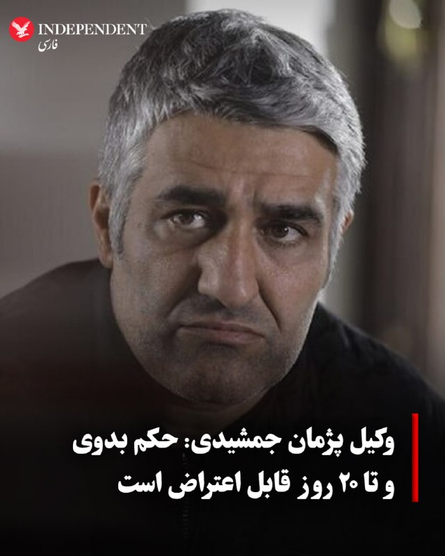

♦️وکیل مدافع پژمان جمشیدی از صدور حکم پرونده موکلش در شعبه ۹ دادگاه کیفری یک استان تهران خبر داد و اعلام کرد این رای بدوی بوده و ظرف ۲۰ روز قابل اعتراض است.
او در گفتگو با ایسنا تاکید کرد تا زمان قطعی شدن حکم، جزئیات و محتوای رای اعلام نخواهد شد.
در همین حال، ساعاتی پیش سایت امتداد به نقل از شاکی پرونده گزارش داد که حکم به وی ابلاغ شده و به گفته او، پژمان جمشیدی به ۹۹ ضربه شلاق تعزیری محکوم شده است. شاکی همچنین تاکید کرد، مدارک موجود در پرونده به نفع او بوده است.
‌🇸🇦 Indypersian

🤖 @VahidOOnLine

## VahidOOnLine — post 241047

  <a href="telegram/content/VahidOOnLine_241047_1779224606.mp4" target="_blank">🎬 Download video</a>

تماسی بغض‌آلود از ایران:
«می‌گفت زیر فشار زندگی مونده…
با مادری بیمار، اجاره عقب‌افتاده و بیماری خودش
‌🏁 🇬🇧 ManotoTV

🤖 @VahidOOnLine

## VahidOOnLine — post 241046

  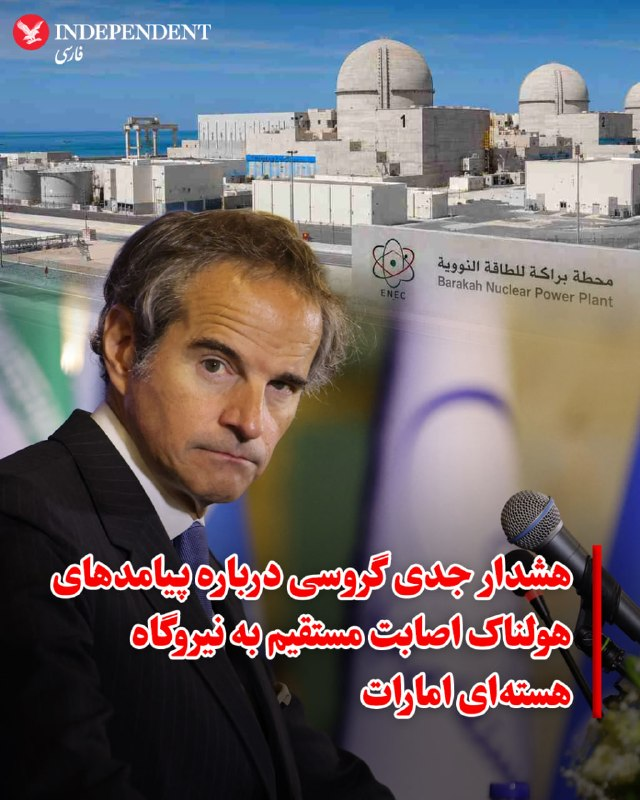

♦️رافائل گروسی، مدیرکل آژانس بین‌المللی انرژی اتمی، روز سه‌شنبه ۲۹ اردیبهشت، در نشست ویژه شورای امنیت سازمان ملل متحد درباره حمله پهپادی اخیر به نیروگاه هسته‌ای «برکه» در امارات، نسبت به پیامدهای فاجعه‌بار اصابت مستقیم به این تاسیسات هشدار داد.

گروسی اگرچه بازگشت برق پشتیبان به این نیروگاه را گامی مهم برای امنیت هسته‌ای خواند، اما تاکید کرد: «می‌خواهم کاملا شفاف بگویم؛ در صورت حمله به نیروگاه برکه، هرگونه اصابت مستقیم می‌تواند به نشت شدید مواد رادیواکتیو در محیط زیست منجر شود.»

او افزود آسیب به خطوط تامین برق نیروگاه، احتمال ذوب شدن قلب راکتورها را به شدت افزایش می‌دهد که این امر در بدترین سناریوها، اتخاذ اقدامات حفاظتی فوری نظیر تخلیه گسترده مناطق اطراف را ناگزیر می‌کند. گروسی در پایان تصریح کرد که حملات نظامی به تاسیسات هسته‌ای با اهداف صلح‌آمیز، به هیچ عنوان قابل قبول نیست.
‌🇸🇦 Indypersian

🤖 @VahidOOnLine

## VahidOOnLine — post 241045

  

نماینده آمریکا در شورای امنیت سازمان ملل اعلام کرد نیروگاه براکه در امارات متحده عربی یک تاسیسات هسته‌ای صلح‌آمیز است و واشینگتن هیچ‌گونه اغماضی در قبال تخلفات تهران در حوزه ایمنی هسته‌ای نخواهد داشت.

نماینده آمریکا در شورای امنیت سازمان ملل گفت جمهوری اسلامی باید حملات نیروهای نیابتی خود به کشورهای همسایه را متوقف کند.
‌🏁 🇬🇧 IranintlTV

🤖 @VahidOOnLine

## VahidOOnLine — post 241044

  

نوشین (طاهره) عرب‌نژاد، متولد ۲۱ دی ۱۳۶۶، دانش‌آموخته مدیریت و فعال در حوزه فیلم‌سازی بود.
او شامگاه ۱۹ دی‌ماه، در پشت‌بام خانه و در حالی‌ که خانواده‌اش برای جشن تولدش آماده می‌شدند، هدف گلوله قرار گرفت. بر اساس گزارش‌ها، نیروهای مسلح مستقر در میدان معراج مشهد به سوی معترضان و خانه‌های اطراف تیراندازی کردند و چندین نفر را هدف قرار دادند. نوشین نیز در جریان این تیراندازی، با اصابت گلوله به قفسه سینه‌اش زخمی شد.
خانواده او با اورژانس تماس گرفتند، اما آمبولانسی اعزام نشد و خانواده با کمک همسایگان او را به بیمارستان رضوی منتقل کردند. با این حال، تلاش‌ها برای نجات جان او بی‌نتیجه ماند.
بر اساس این گزارش، پیکر نوشین پس از اعمال فشار، تهدید و گرفتن تعهد به خانواده تحویل داده شد و مراسم خاکسپاری او نیز با محدودیت برگزار شد. همچنین به خانواده گفته شده بود باید اعلام کنند که نوشین به دست «اغتشاش‌گران» کشته شده است.
‌🏁 🇬🇧 IranintlTV

🤖 @VahidOOnLine

## VahidOOnLine — post 241043

  

سنتکام اعلام کرد از زمان آغاز محاصره دریایی جنوب ایران، ۸۹ کشتی تجاری ناچار به تغییر مسیر شده‌اند.این نهاد افزود نیروهای سنتکام به اجرای کامل محاصره بنادر ایران ادامه می‌دهند و مانع ورود و خروج جریان تجارت از این کشور می‌شوند.
‌🏁 🇬🇧 IranintlTV

🤖 @VahidOOnLine

## VahidOOnLine — post 241042

  <a href="telegram/content/VahidOOnLine_241042_1779224611.mp4" target="_blank">🎬 Download video</a>

♦️همزمان با ادامه محاصره بنادر جنوبی ایران، فرماندهی مرکزی ایالات متحده (سنتکام) سه‌شنبه ۲۹ اردیبهشت‌ماه با انتشار ویدیویی از ادامه عملیات دریایی و هوایی آمریکا در منطقه خبر داد.

در این تصاویر، بالگردهای نظامی آمریکا از جمله بالگردهای تهاجمی تفنگداران دریایی در حال پرواز بر فراز آب‌ها و شلیک شراره‌های دفاعی دیده می‌شوند. همچنین کشتی‌های تجاری و نفتکش در منطقه حضور دارند و نیروهای آمریکایی از روی شناورهای نظامی در حال رصد رفت‌وآمد دریایی هستند.

سنتکام اعلام کرد نیروهای آمریکایی همچنان «محاصره کامل» علیه ایران را اجرا می‌کنند و مانع ورود و خروج تجارت از بنادر ایران می‌شوند. بر اساس این بیانیه، تاکنون ۸۹ کشتی تجاری برای اجرای این محاصره تغییر مسیر داده‌اند.
‌🇸🇦 Indypersian

🤖 @VahidOOnLine

## VahidOOnLine — post 241041

  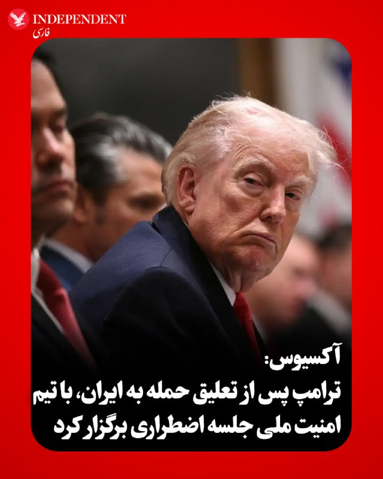

♦️ پایگاه خبری آکسیوس به نقل از دو مقام آمریکایی گزارش داد که دونالد ترامپ دوشنبه‌شب، چند ساعت پس از اعلام تعلیق حملات برنامه‌ریزی‌شده، جلسه‌ای با تیم امنیت ملی خود برگزار کرد که در آن طرح‌های نظامی حمله به ایران بررسی شد.

در این جلسه مقامات ارشدی چون جی‌دی ونس، مارکو روبیو، پیت هگست، ژنرال دن کین و جان رتکلیف حضور داشتند و محور گفتگوها روند جنگ، وضعیت تلاش‌های دیپلماتیک و نقشه‌های نظامی واشنگتن بود. این رایزنی‌ها نشان می‌دهد ترامپ علی‌رغم تهدیدهای مکرر، به‌طور جدی در حال بررسی ازسرگیری جنگ است.

ترامپ همچنان تاکید دارد که جمهوری اسلامی تنها چند روز (تا جمعه، شنبه یا اوایل هفته آینده) برای دستیابی به یک پیشرفت دیپلماتیک فرصت دارد. او روز سه‌شنبه نیز گفت: «شاید مجبور شویم ضربه بزرگ دیگری به ایران وارد کنیم؛ هنوز مطمئن نیستم، اما به‌زودی متوجه خواهید شد.»

هم‌زمان، یک منبع منطقه‌ای اعلام کرد میانجی‌ها در تلاشند تا تهران را به اتخاذ موضعی انعطاف‌پذیرتر در قبال خواسته‌های هسته‌ای آمریکا ترغیب کنند. کاخ سفید هنوز به درخواست‌ها برای اظهارنظر در این باره پاسخ نداده است.
‌🇸🇦 Indypersian

🤖 @VahidOOnLine

## VahidOOnLine — post 241040

  <a href="telegram/content/VahidOOnLine_241040_1779224613.mp4" target="_blank">🎬 Download video</a>

تماسی تلخ از دل ایران:
«می‌گفت در پتروشیمی تعدیل شده…
و برای تأمین هزینه‌های زندگی حتی به رحم اجاره‌ای فکر می‌کنه
‌🏁 🇬🇧 ManotoTV

🤖 @VahidOOnLine

## VahidOOnLine — post 241039

  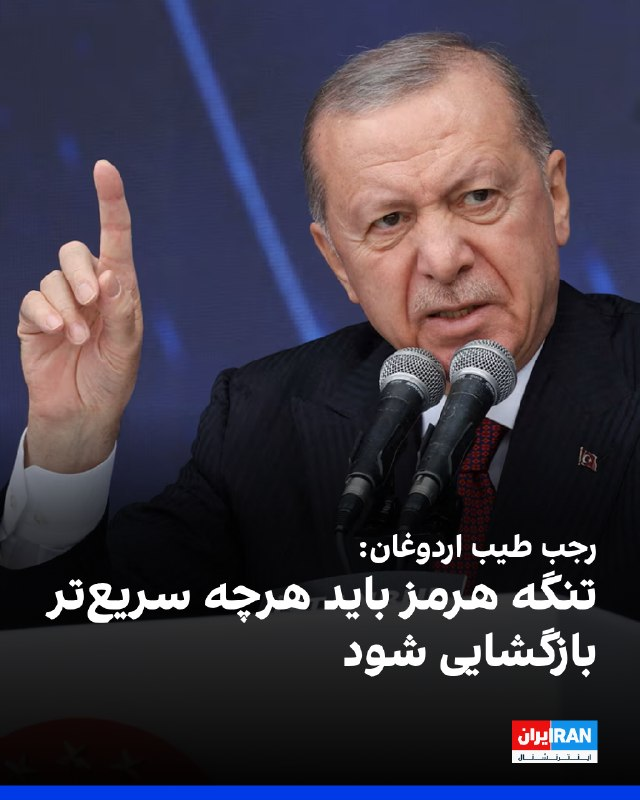

رجب طیب اردوغان، رییس‌جمهور ترکیه، در تماس تلفنی با اورسولا فون در لاین، رییس کمیسیون اروپا، تاکید کرد که تنگه هرمز باید هرچه سریع‌تر بازگشایی شود و آنکارا برای حفظ آتش‌بس و دستیابی به صلح در درگیری‌های جاری منطقه تلاش می‌کند.
‌🏁 🇬🇧 IranintlTV

🤖 @VahidOOnLine

## WithYashar — post 11701

اتاق جنگ با شما : عزیزم، ممکنه اون انفجار قارچی چند روز پیش در اسرائیل، تست یه بمب برای زدن اهداف عمیق و مخفی ایران بوده باشه؟

## WithYashar — post 11700

اتاق جنگ با شما : عزیزم، ممکنه اون انفجار قارچی چند روز پیش در اسرائیل، تست یه بمب برای زدن اهداف عمیق و مخفی ایران بوده باشه؟

## WithYashar — post 11699

## WithYashar — post 11698

جای یه b2 خشکل روی میزت خالیه ❤️

## WithYashar — post 11697

## WithYashar — post 11696

اینم پست جدید کارای اداریش رو انجام بدید 😍🔥💥🙌🏾 بمبه

https://www.instagram.com/reel/DYiHl04xutP/?igsh=MWZhNHllczYzNGtvaA==

⁨ اتاق جنگ با یاشار : طوفان ، رهگیری هواپیمای E-2D Advanced Hawkey ناو هواپیمابر آبی خاکی USS BOXER LHD4
و آب و هوای منطقه برای حمله

## WithYashar — post 11695

  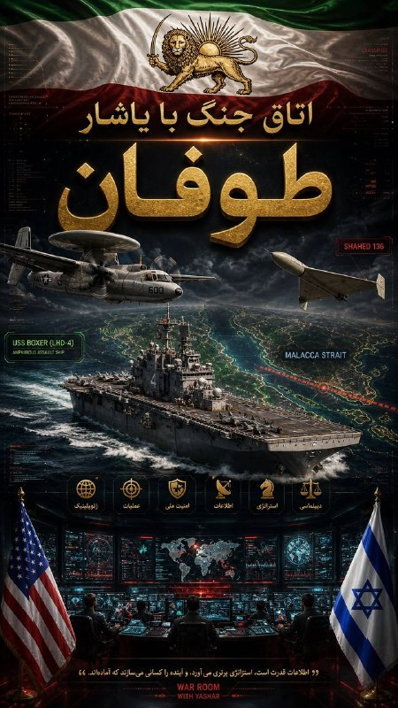

پوستر
@withyashar

## WithYashar — post 11694

برد کوپر: مردم ایران مخصوصا کودکان به هیچ عنوان دشمن و هدف ما نیستند، طبق هیچ پروتکلی هدف قرار دادن غیرنظامیان قابل توجیه نیست، سپاه پاسداران دشمن ماست
@withyashar

## WithYashar — post 11693

## mwarmonitor — post 9325

🔴دولت ترامپ قصد دارد این هفته به متحدان ناتو اعلام کند که در صورت بروز یک بحران بزرگ، دامنه توانمندی‌های نظامی آمریکا که برای کمک به کشورهای اروپایی در دسترس خواهد بود را کاهش می‌دهد. قرار است این تصمیم به‌طور رسمی روز جمعه در بروکسل ابلاغ شود. پنتاگون می‌گوید ایالات متحده همچنان به ارائه چتر هسته‌ای خود ادامه خواهد داد. (رویترز)

@mwarmonitor

## mwarmonitor — post 9324

  

«عبور از تنگه هرمز امشب:

🚢 نفتکش ATMOS (متعلق به روسیه 🇷🇺)
🚢 نفتکش OCEAN LILY (متعلق به چین 🇨🇳)
🚢 نفتکش YUAN GUI YANG (متعلق به چین 🇨🇳)
🚢 کشتی باری ZHANG GU NAN CHANG (متعلق به چین 🇨🇳)»

@mwarmonitor

## mwarmonitor — post 9323

  <a href="telegram/content/mwarmonitor_9323_1779224617.mp4" target="_blank">🎬 Download video</a>

🇺🇸«نیروهای سنتکام به اجرای کامل محاصره آمریکا علیه ایران ادامه می‌دهند و جریان تجارت به داخل و خارج از بنادر ایران را متوقف کرده‌اند. تاکنون ۸۹ کشتی تجاری برای اطمینان از رعایت این محاصره، تغییر مسیر داده‌اند.»

@mwarmonitor

## FoxNewsTwitter — post 341963

  <a href="telegram/content/FoxNewsTwitter_341963_1779224619.mp4" target="_blank">🎬 Download video</a>

Fox News (Twitter/X)

This veteran was expected to have almost no one at his funeral. Instead, an entire community showed up to honor him.

World War II veteran John Bernard Arnold III passed away with no known family and was expected to have only a small service in Massachusetts.

But after a local veterans official put out a call for support, dozens gathered outside Saint Joseph the Worker Church carrying flags, flowers, and wearing military uniforms to honor Arnold.

## FoxNewsTwitter — post 341962

  

Fox News (Twitter/X)

WATCH LIVE: Senate Appropriations panel reviews FY 2027 Department of Transportation budget https://twitter.com/i/broadcasts/1dGYljEqVYoKX

## FoxNewsTwitter — post 341961

  

Fox News (Twitter/X)

An Amazon driver saved a woman’s life after spotting a brutal attack unfolding in her house and calling police.

Authorities say 72-year-old James Alan Johnson is being charged with attempted murder and assault with a deadly weapon after allegedly attacking his wife with a hammer inside their home.

According to investigators, the victim told police Johnson struck her in the head twice before she managed to fight him off by kicking him in the crotch while he was on top of her.

Police say the assault was witnessed by an Amazon driver outside the home, who immediately called 911 for help.

## pm_afshaa — post 91069

  <a href="telegram/content/pm_afshaa_91069_1779224623.webm" target="_blank">🎬 Download video</a>

🔴اردوغان: تنگه هرمز باید هرچه سریع‌تر بازگشایی بشه.

💧 Rainbet.com the #1 Non-KYC Crypto Casino & Sportsbook @rainbetcom

😁 @Pm_Afshaa

## pm_afshaa — post 91068

  <a href="telegram/content/pm_afshaa_91068_1779224624.webm" target="_blank">🎬 Download video</a>

🔴استوری خواهر الهه حسینی نژاد:
امشب، قصاص مرهم داغ خواهرم نمی شود... اما شاید کمی از بی عدالتی این دنیا کم کند. الهه جانم...

+ طبق این استوری، بهمن فرزانه (قاتل الهه) امشب اعدام میشه.

💧 Rainbet.com the #1 Non-KYC Crypto Casino & Sportsbook @rainbetcom

😁 @Pm_Afshaa

## pm_afshaa — post 91067

  <a href="telegram/content/pm_afshaa_91067_1779224625.webm" target="_blank">🎬 Download video</a>

🔴مقام ارشد آمریکایی به فاکس نیوز:
نهاد نظامی اسرائیل و کاخ سفید امروز درباره حمله به ایران گفتگو کردن.

💧 Rainbet.com the #1 Non-KYC Crypto Casino & Sportsbook @rainbetcom

😁 @Pm_Afshaa

## mamlekate — post 103559

📝 ترامپ: رهبران ایران برای توافق «التماس» می‌کنند؛ توافق نکنند به‌زودی دوباره حمله می‌کنیم

رئیس جمهوری ایالات متحده روز سه‌شنبه ۲۹ اردیبهشت در جمع خبرنگاران حاضر در محوطه کاخ سفید گفت رهبران ایران برای توافق «التماس» می‌کنند. او هشدار داد که اگر توافقی حاصل نشود آمریکا در روزهای آینده به جمهوری اسلامی حمله خواهد کرد.

@mamlekate

## mamlekate — post 103558

📝 اتلتیک: فیفا قصد دارد ورود پرچم شیر و خورشید را به استادیوم‌های جام‌جهانی ممنوع کند

@mamlekate

## mamlekate — post 103557

📝 بازگشایی بورس تهران پس از ۸۰ روز؛ سهام شرکت‌های بزرگ همچنان بسته ماند

بورس اوراق بهادار تهران پس از ۸۰ روز توقف، فعالیت خود را از سر گرفت. این بازگشایی در شرایطی انجام شد که بخش مهمی از نمادهای بزرگ همچنان بسته ماندند و مجموعه‌ای از محدودیت‌های معاملاتی برای کنترل فشار فروش اعمال شد.

@mamlekate

## IranIntlTV — post 338003

  

🔻تیم فوتبال منچسترسیتی در هفته سی‌وهفتم لیگ برتر انگلستان با نتیجه یک بر یک برابر بورنموث متوقف شد. تیم پپ گواردیولا با این تساوی از رقابت برای قهرمانی جا ماند و آرسنال پس از ۲۲ سال قهرمان لیگ برتر شد. توپچی‌ها آخرین قهرمانی خود در لیگ برتر را در سال ۲۰۰۴ کسب کرده بودند.

🔹منچسترسیتی و آرسنال در هفته‌های گذشته رقابت نزدیکی برای صدرنشینی و قهرمانی داشتند، هرچند آرسنال در این رقابت دست بالاتر را داشت.

🔹با توجه به پیروزی شب گذشته آرسنال برابر برنلی، منچسترسیتی باید بازی امشب خود را با پیروزی پشت سر می‌گذاشت تا کورس قهرمانی به هفته پایانی کشیده شود، اما ناکامی سیتی برابر بورنموث به قهرمانی آرسنال و آرتتا، یک هفته پیش از پایان لیگ برتر، منجر شد.

@iranintltvsport

## IranIntlTV — post 338002

  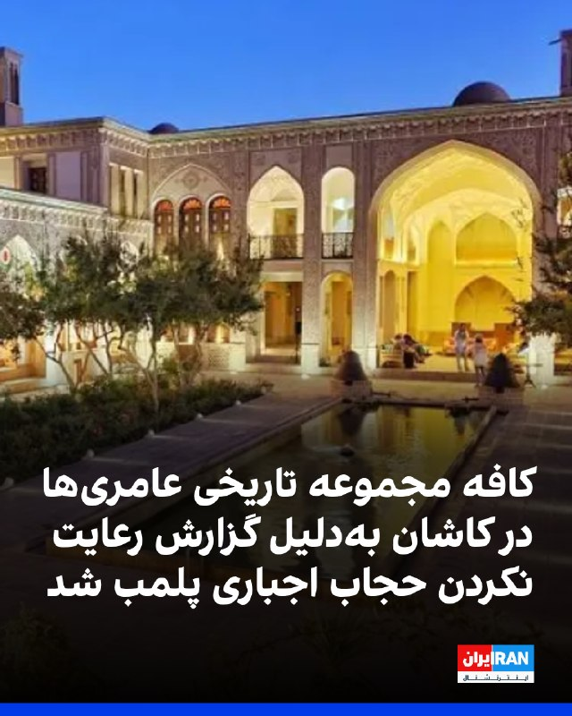

حجت‌الله ناصحی‌پور، معاون گردشگری اداره میراث‌فرهنگی، گردشگری و صنایع‌دستی کاشان، گفت کافه مجموعه تاریخی عامری‌ها به دلیل گزارش وقوع دو مورد رعایت نکردن حجاب اجباری پلمب شد. او افزود مراجع ذی‌ربط پس از دریافت گزارش‌ها، دستور پلمب را صادر و اجرا کردند.
ناصحی‌پور گفت این کافه اقامتی و گردشگری که در یکی از بناهای شاخص تاریخی کاشان فعالیت می‌کرد، پس از طی روند قانونی و بررسی‌های انجام‌شده، مشمول برخورد و پلمب شد.
خانه عامری‌ها از شناخته‌شده‌ترین بناهای گردشگری دوره قاجار در کاشان است و همواره مورد توجه گردشگران داخلی و خارجی قرار دارد.
https://iranintl.com/202605195284

## IranIntlTV — post 338001

  

رافائل گروسی، مدیرکل آژانس بین‌المللی انرژی اتمی در نشست ویژه شورای امنیت سازمان ملل درباره حمله به نیروگاه هسته‌ای براکه در امارات متحده عربی هشدار داد که حمله مستقیم به این تاسیسات می‌تواند پیامدهای خطرناکی به همراه داشته باشد.

مدیرکل آژانس بین‌المللی انرژی اتمی افزود: «حمله به تاسیسات هسته‌ای که برای اهداف صلح‌آمیز استفاده می‌شوند، غیرقابل قبول است.»

نماینده بحرین در شورای امنیت سازمان ملل اعلام کرد که تهران مسیر تنش‌افزایی را در پیش گرفته و با هدف قرار دادن زیرساخت‌های منطقه، امنیت کشورهای منطقه را تهدید کرده است.

او گفت: «هدف قرار دادن نیروگاه هسته‌ای براکه در امارات متحده عربی تحول خطرناکی است که صلح و امنیت را تهدید می‌کند.»

همچنین نماینده یونان در شورای امنیت سازمان ملل حملات به نیروگاه هسته‌ای براکه در امارات متحده عربی را محکوم کرد و گفت نقض ایمنی هسته‌ای کاملا غیرقابل قبول است و منطقه توان تحمل موج گسترده‌تری از خشونت را ندارد.»
https://iranintl.com/202605192527

## IranIntlTV — post 338000

  <a href="telegram/content/IranIntlTV_338000_1779224628.mp4" target="_blank">🎬 Download video</a>

نشست اضطراری شورای امنیت سازمان ملل به درخواست بحرین درباره بررسی حمله به نیروگاه هسته‌ای براکه در امارات متحده عربی برگزار شد.

گفت‌وگو با رضا گوهرزاد، روزنامه‌نگار و تحلیلگر سیاسی
@iranintltv

## IranIntlTV — post 337999

  <a href="telegram/content/IranIntlTV_337999_1779224630.mp4" target="_blank">🎬 Download video</a>

معاون رییس‌جمهور آمریکا، گفت واشینگتن در مذاکرات با جمهوری اسلامی به‌دنبال محدودیت‌های بلندمدت و پایدار بر برنامه هسته‌ای ایران است. جی‌دی ونس همچنین تاکید کرد آمریکا توافقی را که به ایران امکان دستیابی به سلاح هسته‌ای بدهد، نمی‌پذیرد.

گفت‌وگو با علیرضا نامورحقیقی، تحلیلگر سیاسی
@iranintltv

## IranIntlTV — post 337998

  <a href="telegram/content/IranIntlTV_337998_1779224632.mp4" target="_blank">🎬 Download video</a>

انور قرقاش، مشاور دیپلماتیک امارات، حملات ایران را تجاوز وحشیانه جمهوری اسلامی خواند و تاکید کرد سکوت و موضع خاکستری بعضی کشورها، خطرناک‌تر است و از آن‌ها به‌ خاطر حرکت به سمت میانجی‌گری انتقاد کرد.

ارزیابی علی صدرزاده، تحلیلگر مسائل خاورمیانه
@iranintltv

## IranIntlTV — post 337997

  <a href="telegram/content/IranIntlTV_337997_1779224634.mp4" target="_blank">🎬 Download video</a>

مستند «یک رفاقت؛ از زندان وکیل‌آباد مشهد تا سن‌دیگو» ساخته اردوان روزبه و تولید ایران‌اینترنشنال، برنده جایزه نقره‌ای تلی ۲۰۲۶ شد. این مستند روایت دوستی مایکل وایت، کهنه‌سرباز آمریکایی و مهدی وطن‌خواه، فعال سیاسی در زندان وکیل‌آباد مشهد است.

گفت‌وگو با اردوان روزبه، خبرنگار ایران‌اینترنشنال
@iranintltv

## IranIntlTV — post 337996

  <a href="telegram/content/IranIntlTV_337996_1779224636.mp4" target="_blank">🎬 Download video</a>

دونالد ترامپ گفت احتمال حمله دوباره آمریکا به ایران وجود دارد اما تصمیم نهایی هنوز گرفته نشده است. او افزود دستور حمله اخیر را در لحظات آخر متوقف کرده، چون مذاکرات با مشارکت چند کشور منطقه‌ای در حال پیشرفت است.

ارزیابی جمشید برزگر، روزنامه‌نگار و تحلیلگر سیاسی
@iranintltv

## IranIntlTV — post 337995

  <a href="telegram/content/IranIntlTV_337995_1779224638.mp4" target="_blank">🎬 Download video</a>

رییس‌جمهور آمریکا گفت شاید ایالات متحده دوباره مجبور شود به جمهوری اسلامی ضربه بزند، هرچند هنوز درباره انجام این اقدام تصمیم قطعی نگرفته است. او افزود فقط یک ساعت پیش از دستور حمله به ایران، آن را عقب انداخته است.

ارزیابی جمشید برزگر، روزنامه‌نگار و تحلیلگر سیاسی
@iranintltv

## IranIntlTV — post 337994

  

نماینده آمریکا در شورای امنیت سازمان ملل اعلام کرد نیروگاه براکه در امارات متحده عربی یک تاسیسات هسته‌ای صلح‌آمیز است و واشینگتن هیچ‌گونه اغماضی در قبال تخلفات تهران در حوزه ایمنی هسته‌ای نخواهد داشت.

نماینده آمریکا در شورای امنیت سازمان ملل گفت جمهوری اسلامی باید حملات نیروهای نیابتی خود به کشورهای همسایه را متوقف کند.
https://iranintl.com/202605191886

## IranIntlTV — post 337993

  

نوشین (طاهره) عرب‌نژاد، متولد ۲۱ دی ۱۳۶۶، دانش‌آموخته مدیریت و فعال در حوزه فیلم‌سازی بود.
او شامگاه ۱۹ دی‌ماه، در پشت‌بام خانه و در حالی‌ که خانواده‌اش برای جشن تولدش آماده می‌شدند، هدف گلوله قرار گرفت. بر اساس گزارش‌ها، نیروهای مسلح مستقر در میدان معراج مشهد به سوی معترضان و خانه‌های اطراف تیراندازی کردند و چندین نفر را هدف قرار دادند. نوشین نیز در جریان این تیراندازی، با اصابت گلوله به قفسه سینه‌اش زخمی شد.
خانواده او با اورژانس تماس گرفتند، اما آمبولانسی اعزام نشد و خانواده با کمک همسایگان او را به بیمارستان رضوی منتقل کردند. با این حال، تلاش‌ها برای نجات جان او بی‌نتیجه ماند.
بر اساس این گزارش، پیکر نوشین پس از اعمال فشار، تهدید و گرفتن تعهد به خانواده تحویل داده شد و مراسم خاکسپاری او نیز با محدودیت برگزار شد. همچنین به خانواده گفته شده بود باید اعلام کنند که نوشین به دست «اغتشاش‌گران» کشته شده است.
https://iranintl.com/202605191306

## IranIntlTV — post 337992

  

🔻وکیل مدافع پژمان جمشیدی با تایید صدور حکم پرونده موکلش از سوی شعبه ۹ دادگاه کیفری یک استان تهران به ایسنا گفت: «رای پرونده موکلم امروز صادر و ابلاغ شد. حکم بدوی است و ظرف ۲۰ روز قابل اعتراض است. تا زمانی که حکم قطعی نشده محتوای رای را اعلام نمی‌کنیم.»

🔹ساعتی پیش، سایت امتداد به نقل از شاکی پرونده پژمان جمشیدی خبر داد که حکم این پرونده صادر و به او ابلاغ شده است. به گفته او، پژمان جمشیدی به ۹۹ ضربه شلاق تعزیری محکوم شده است. شاکی پرونده گفته تمام مدارکی که به نفع او است در پرونده وجود دارد.

@iranintltvsport

## IranIntlTV — post 337991

  <a href="https://t.me/IranintlTV/337991" target="_blank">📎 Download file</a>

🎧نسخه صوتی ۲۴ با فرداد فرحزاد: ترامپ: شاید آمریکا دوباره به جمهوری اسلامی ضربه بزند
@iranintlTV

## IranIntlTV — post 337990

  

سنتکام اعلام کرد از زمان آغاز محاصره دریایی جنوب ایران، ۸۹ کشتی تجاری ناچار به تغییر مسیر شده‌اند.این نهاد افزود نیروهای سنتکام به اجرای کامل محاصره بنادر ایران ادامه می‌دهند و مانع ورود و خروج جریان تجارت از این کشور می‌شوند.
https://iranintl.com/202605198290

## IranIntlTV — post 337989

  <a href="telegram/content/IranIntlTV_337989_1779224643.mp4" target="_blank">🎬 Download video</a>

یک شهروند با ارسال پیامی به ایران اینترنشنال شرایط روانی و روحی جامعه را بد توصیف کرده و از بحران معیشتی روایت می‌کند. پیام او با هوش مصنوعی خوانده شده است.

## IranIntlTV — post 337988

  

رجب طیب اردوغان، رییس‌جمهور ترکیه، در تماس تلفنی با اورسولا فون در لاین، رییس کمیسیون اروپا، تاکید کرد که تنگه هرمز باید هرچه سریع‌تر بازگشایی شود و آنکارا برای حفظ آتش‌بس و دستیابی به صلح در درگیری‌های جاری منطقه تلاش می‌کند.
https://iranintl.com/202605192411

## ManotoTV — post 105661

  <a href="telegram/content/ManotoTV_105661_1779224646.mp4" target="_blank">🎬 Download video</a>

‌
مارک استون، خبرنگار اسکای‌نیوز، در مواجه با دریادار برد کوپر، فرمانده سنتکام، از او پرسید چرا ارتش آمریکا هنوز جزئیات حادثه مرگبار میناب را منتشر نکرده است.

استون با اشاره به ادعای فرمانده سنتکام گفت تیم اسکای‌نیوز در میناب حضور دارد و «هیچ نشانه‌ای از وجود پایگاه موشکی» در محل حادثه ندیده است.

او همچنین از کوپر پرسید تا چه زمانی ارتش آمریکا به ادامه تحقیقات استناد خواهد کرد و این تحقیقات چه زمانی به پایان می‌رسد.

دریادار کوپر در پاسخ تنها گفت: «تحقیقات ادامه دارد» و از پاسخ به دیگر سوال‌ها خودداری کرد.

## ManotoTV — post 105660

  <a href="telegram/content/ManotoTV_105660_1779224648.mp4" target="_blank">🎬 Download video</a>

تماسی بغض‌آلود از ایران:
«می‌گفت زیر فشار زندگی مونده…
با مادری بیمار، اجاره عقب‌افتاده و بیماری خودش

## ManotoTV — post 105659

  <a href="telegram/content/ManotoTV_105659_1779224650.mp4" target="_blank">🎬 Download video</a>

تماسی تلخ از دل ایران:
«می‌گفت در پتروشیمی تعدیل شده…
و برای تأمین هزینه‌های زندگی حتی به رحم اجاره‌ای فکر می‌کنه

## FarsiVOA — post 218181

⚡️چه کسی اینترنت در ایران را کنترل می‌کند؟
@FarsiVOA

## FarsiVOA — post 218180

  <a href="telegram/content/FarsiVOA_218180_1779224652.mp4" target="_blank">🎬 Download video</a>

⚡️فرزین کرباسی در برنامه تفسیر خبر: برای بخش تندروی نظام کمترین عقب‌نشینی پشت پا به تمام ارزش‌هاست
@FarsiVOA

## FarsiVOA — post 218179

⚡️ترامپ: وقفه در اقدام نظامی علیه جمهوری اسلامی کوتاه است؛ رژیم ایران نباید سلاح هسته‌ای داشته باشد
@FarsiVOA

## FarsiVOA — post 218178

  <a href="telegram/content/FarsiVOA_218178_1779224653.mp4" target="_blank">🎬 Download video</a>

⚡️کامبیز غفوری در برنامه تفسیر خبر: جمهوری اسلامی قمارباز بدی است

@FarsiVOA

## FarsiVOA — post 218177

⚡️جی دی ونس، معاون رئیس جمهوری آمریکا، روز سه‌شنبه ۲۹ اردیبهشت با حضور در سالن کنفرانس‌های مطبوعاتی کاخ سفید به پرسش‌های خبرنگاران، که بخش عمده‌ای از آن درباره وضعیت ایران و منطقه بود، پاسخ داد. صدای آمریکا این جلسه را به صورت مستفیم و با ترجمه همزمان پژواک کیومرثی پخش کرد.
@FarsiVOA

## FarsiVOA — post 218176

🔺پرزیدنت ترامپ: رهبران ایران برای توافق «التماس» می‌کنند؛ توافق نکنند به‌زودی دوباره حمله می‌کنیم

▪️رئیس جمهوری ایالات متحده روز سه‌شنبه ۲۹ اردیبهشت در جمع خبرنگاران حاضر در محوطه کاخ سفید گفت رهبران ایران برای توافق «التماس» می‌کنند. او هشدار داد که اگر توافقی حاصل نشود آمریکا در روزهای آینده به جمهوری اسلامی حمله خواهد کرد.

⬇️ بیشتر بخوانید:
https://ir.voanews.com/a/iran-trump-us-strike-epic-fury/8151680.html
@FarsiVOA

## FarsiVOA — post 218175

⚡️جی دی ونس، معاون رئیس جمهوری آمریکا، روز سه‌شنبه ۲۹ اردیبهشت با حضور در سالن کنفرانس‌های مطبوعاتی کاخ سفید به پرسش‌های خبرنگاران، که بخش عمده‌ای از آن درباره وضعیت ایران و منطقه بود، پاسخ داد. صدای آمریکا این جلسه را به صورت مستفیم و با ترجمه همزمان پژواک کیومرثی پخش کرد.
@FarsiVOA

## FarsiVOA — post 218174

⚡️جی دی ونس، معاون رئیس جمهوری آمریکا، روز سه‌شنبه ۲۹ اردیبهشت با حضور در سالن کنفرانس‌های مطبوعاتی کاخ سفید به پرسش‌های خبرنگاران، که بخش عمده‌ای از آن درباره وضعیت ایران و منطقه بود، پاسخ داد. صدای آمریکا این جلسه را به صورت مستفیم و با ترجمه همزمان پژواک کیومرثی پخش کرد.
@FarsiVOA

## FarsiVOA — post 218173

⚡️جی دی ونس، معاون رئیس جمهوری آمریکا، روز سه‌شنبه ۲۹ اردیبهشت با حضور در سالن کنفرانس‌های مطبوعاتی کاخ سفید به پرسش‌های خبرنگاران، که بخش عمده‌ای از آن درباره وضعیت ایران و منطقه بود، پاسخ داد. صدای آمریکا این جلسه را به صورت مستفیم و با ترجمه همزمان پژواک کیومرثی پخش کرد.
@FarsiVOA

## FarsiVOA — post 218172

🔺شهاب دلیلی که پس از سفر به ایران توسط جمهوری اسلامی دستگیر و زندانی شده بود پس از ده سال به آمریکا بازگشت

▪️سازمان «کمک به گروگان‌ها در سراسر جهان» اعلام کرد شهاب دلیلی، ایرانی مقیم آمریکا که از سال ۱۳۹۵ جمهوری اسلامی او را زندانی کرده بود، آزاد شد و به آمریکا بازگشت.

⬇️ بیشتر بخوانید:
https://ir.voanews.com/a/iran-us-hostage-shahab-dalili-captain-prison/8151618.html
@FarsiVOA

## FarsiVOA — post 218171

⚡️پرزیدنت ترامپ روز سه‌شنبه ۲۹ اردیبهشت در محل احداث تالار رقص کاخ سفید حاضر شد و به پرسش‌های متعدد خبرنگاران پاسخ داد. صدای آمریکا بخش‌هایی از این پرسش و پاسخ را با ترجمه همزمان پژواک کیومرثی پخش کرد.
@FarsiVOA

## FarsiVOA — post 218170

🔺رشید مظاهری در سلول انفرادی؛ همسر این فوتبالیست از مردم خواست تا صدای او باشند

◾️رشید مظاهری، دروازه‌بان پیشین تیم ملی فوتبال ایران که پس از انتقاد علنی از علی خامنه‌ای و کشتار دی ۱۴۰۴ بازداشت شده بود، به سلول انفرادی زندان مرکزی ارومیه منتقل شده است.

⬇️ بیشتر بخوانید:
https://ir.voanews.com/a/solitary-cell-urumiyah-central-prison-rashid-mazaheri/8151695.html
@FarsiVOA

## FarsiVOA — post 218169

⚡️پرزیدنت ترامپ روز سه‌شنبه ۲۹ اردیبهشت در محل احداث تالار رقص کاخ سفید حاضر شد و به پرسش‌های متعدد خبرنگاران پاسخ داد. صدای آمریکا بخش‌هایی از این پرسش و پاسخ را با ترجمه همزمان پژواک کیومرثی پخش کرد.
@FarsiVOA

## FarsiVOA — post 218168

⚡️پرزیدنت ترامپ روز سه‌شنبه ۲۹ اردیبهشت در محل احداث تالار رقص کاخ سفید حاضر شد و به پرسش‌های متعدد خبرنگاران پاسخ داد. صدای آمریکا بخش‌هایی از این پرسش و پاسخ را با ترجمه همزمان پژواک کیومرثی پخش کرد.
@FarsiVOA

## FarsiVOA — post 218167

⚡️کمیته نیروهای مسلح مجلس نمایندگان آمریکا روز سه‌شنبه ۲۹ اردیبهشت یک جلسه استماع را با حضور دریابد برد کوپر، فرمانده سنتکام، ژنرال داگوین اندرسون، فرمانده آفریکام، و دانیل زیمرمن، معاون وزیر جنگ در امور امنیت بین‌الملل، برگزار کرد. صدای آمریکا این جلسه را با ترجمه همزمان پژواک کیومرثی پخش کرد.
@FarsiVOA

## FarsiVOA — post 218166

⚡️کمیته نیروهای مسلح مجلس نمایندگان آمریکا روز سه‌شنبه ۲۹ اردیبهشت یک جلسه استماع را با حضور دریابد برد کوپر، فرمانده سنتکام، ژنرال داگوین اندرسون، فرمانده آفریکام، و دانیل زیمرمن، معاون وزیر جنگ در امور امنیت بین‌الملل، برگزار کرد. صدای آمریکا این جلسه را با ترجمه همزمان پژواک کیومرثی پخش کرد.
@FarsiVOA

## FarsiVOA — post 218165

🔺وال‌استریت ژورنال: آمریکا یک کشتی تحریم‌شده مرتبط با جمهوری اسلامی را توقیف کرد

◾️روزنامه آمریکایی وال‌استریت ژورنال روز سه‌شنبه ۲۹ اردیبهشت به نقل از سه مقام آمریکایی گزارش داد که ایالات متحده در طول شب یک نفتکش مرتبط با جمهوری اسلامی را در اقیانوس هند توقیف کرد.

⬇️ بیشتر بخوانید:
https://ir.voanews.com/a/8151734.html
@FarsiVOA

## FarsiVOA — post 218164

⚡️در برنامه تفسیر خبر امروز، مهدی آقازمانی با کارشناسان مهمان، درباره فرصت مجدد پرزیدنت ترامپ به جمهوری اسلامی برای دستابی یک توافق خوب بنا به درخواست کشورهای عربی منطقه گفتگو می‌کند
@FarsiVOA

## FarsiVOA — post 218163

⚡️کمیته نیروهای مسلح مجلس نمایندگان آمریکا روز سه‌شنبه ۲۹ اردیبهشت یک جلسه استماع را با حضور دریابد برد کوپر، فرمانده سنتکام، ژنرال داگوین اندرسون، فرمانده آفریکام، و دانیل زیمرمن، معاون وزیر جنگ در امور امنیت بین‌الملل، برگزار کرد. صدای آمریکا این جلسه را با ترجمه همزمان پژواک کیومرثی پخش کرد.

@FarsiVOA

## FarsiVOA — post 218162

⚡️روایت اقلیم کردستان عراق از اتهامات جدید جمهوری اسلامی؛ قاچاق سلاح یا توجیه بمباران؟
@FarsiVOA

## DW_Farsi — post 124907

🔶 ونس: ترجیح آمریکا دیپلماسی است اما برای ازسرگیری جنگ کاملا آماده‌ایم

جی‌دی ونس، معاون رئیس‌جمهور آمریکا با اعلام این که دولت دونالد ترامپ همچنان راهکار دیپلماتیک را برای حل مناقشه با ایران ترجیح می‌دهد افزود، اما کشور ما کاملا آماده است تا برای اطمینان از عدم دستیابی تهران به سلاح هسته‌ای، جنگ را ازسر بگیرد.

ونس سه‌شنبه ۱۹ مه در جریان یک نشست خبری در کاخ سفید گفت که ایالات متحده متعهد است از دسترسی ایران به تسلیحات هسته‌ای جلوگیری کند، زیرا در صورت وقوع چنین اتفاقی، یک رقابت تسلیحاتی منطقه‌ای شکل خواهد گرفت که امنیت جهان را کاهش می‌دهد.

او با بیان این که ایالات متحده در شش هفته اول جنگ، توانایی نظامی متعارف ایران را تضعیف کرده افزود: «این کار با موفقیت انجام شده است. همیشه می‌توان کارهای بیش‌تری انجام داد، اما در حال حاضر رئیس‌جمهور به ما دستور داده که با ایرانی‌ها به صورت تهاجمی مذاکره کنیم.»

ونس با اشاره به "پیشرفت‌های زیادی" که در مذاکره با مقام‌های ایرانی به دست آمده خاطرنشان ساخت: «اما یک گزینه دیگر [گزینه بی] نیز وجود دارد؛ و آن گزینه این است که می‌توانیم کارزار نظامی را برای دستیابی به اهداف آمریکا ازسر بگیریم... اما این چیزی نیست که رئیس‌جمهور بخواهد و فکر نمی‌کنم ایرانی‌ها هم چنین چیزی بخواهند.»

ونس همچنین تأکید کرد: «ما توافقی را نخواهیم پذیرفت که به ایرانی‌ها اجازه داشتن سلاح هسته‌ای را بدهد. بنابراین، همان‌طور که رئیس‌جمهور همین الان به من گفت، ما در وضعیت آماده‌باش کامل به‌سر می‌بریم.»

@dw_farsi

## DW_Farsi — post 124906

  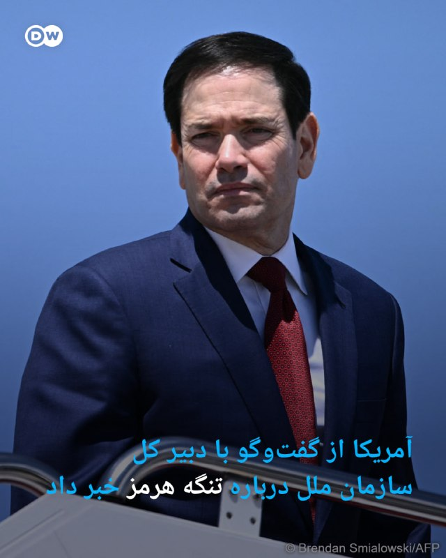

🔶 آمریکا از گفت‌وگو با دبیر کل سازمان ملل درباره تنگه هرمز خبر داد

وزارت خارجه آمریکا از گفت‌وگوی مارکو روبیو، وزیر خارجه این کشور با آنتونیو گوترش، دبیرکل سازمان ملل متحد در مورد محدودیت‌هایی که ایران برای کشتی‌رانی در تنگه هرمز ایجاد کرده خبر داد.

به گزارش خبرگزاری رویترز، در این گفت‌وگو درباره تلاش‌های آمریکا جهت جلوگیری از مین‌گذاری‌ و گرفتن عوارض از سوی ایران در این تنگه حیاتی، از جمله صدور قطعنامه شورای امنیت سازمان ملل تبادل نظر صورت گرفته است.

تامی پیگات، سخنگوی این وزارت‌خانه در بیانیه‌ای اعلام کرد که روبیو بر "حمایت قاطع طیف گسترده‌ای از اعضای سازمان ملل از این تلاش‌ها" تأکید کرده است.

بستن تنگه هرمز توسط ایران که در خلال جنگ اسرائيل و آمریکا علیه جمهوری اسلامی صورت گرفت از مباحث اساسی در گفت‌وگوهای صلح این کشور به شمار می‌‌آید.

آمریکا نیز در مقابل، بنادر ایران را تحت محاصره گرفته و تا کنون هیچ کدام از دو طرف از مواضع خود در این جنگ عقب ننشسته‌اند.

@dw_farsi

## Persian_Trend_Official — post 14496

  <a href="telegram/content/Persian_Trend_Official_14496_1779224655.mp4" target="_blank">🎬 Download video</a>

🔴خضریان،عضو کمیسیون امنیت ملی مجلس:

💢امیدوارم خبر سفر عراقچی به نیویورک برای مذاکره در خصوص تنگه هرمز دروغ باشد!

💢چرا ما در خصوص موضوع تنگه هرمز باید در خاک دشمن مذاکره کنیم؟

🫆:Tony

📌 @persian_trend_official
پرشین ترند | متفاوت‌ترین کانال نظامی

## Persian_Trend_Official — post 14495

  

نسخه صوتی لایو امشب در کست باکس:

https://castbox.fm/vi/946964459

نیاز به دانلود هیچ اپلیکیشنی ندارید، فقط کافیه لینک رو در مرورگر خودتون کپی کنید و فایل رو بشنوید

## Persian_Trend_Official — post 14494

نسخه صوتی لایو امشب در اسپاتیفای : https://open.spotify.com/episode/1E7uxKoNvLatPFATA5y8Jc?si=j4CwM-EiQDaOyw4ByYHJZw

## Persian_Trend_Official — post 14493

  

نسخه صوتی لایو امشب در اسپاتیفای :

https://open.spotify.com/episode/1E7uxKoNvLatPFATA5y8Jc?si=j4CwM-EiQDaOyw4ByYHJZw

## Persian_Trend_Official — post 14491

🔴 هواپیمای پیشرفته «E-2D» آمریکا بر روی آسمان خلیج فارس در حال گشت زنی است

💢گزارش‌ها حاکی از آن است که یک فروند هواپیمای هشدار زودهنگام و کنترل هوایی «E-2D Hawkeye» متعلق به نیروی دریایی آمریکا در حال گشت زنی در خلیج فارس است.

▪️ این هواپیما برای شناسایی اهداف هوایی و دریایی و مدیریت میدان نبرد استفاده می‌شود

🫆:Tony

📌 @persian_trend_official
پرشین ترند | متفاوت‌ترین کانال نظامی

## Persian_Trend_Official — post 14490

  

⭕️ قاتل الهه حسین زاده با اذان صبح فردا اعدام می‌شود.

استوری خواهر الهه: امشب، قصاص مرهم داغ خواهرم نمی شود... اما شاید کمی از بی عدالتی این دنیا کم کند. الهه جانم...

📝 Nick

📌 @persian_trend_official
پرشین ترند | متفاوت‌ترین کانال نظامی

## RadioFarda — post 157366

  <a href="https://t.me/radiofarda/157366" target="_blank">📎 Download file</a>

📻بشنوید: خبرهای ساعت ۲۱ با رادیوفردا، ۲۹ اردیبهشت ۱۴۰۵‌

@RadioFarda

## IranianMinds — post 20412

  

🔴 طبق گفته‌ی خواهر الهه حسین‌نژاد؛
بهمن فرزانه (قاتل) امشب اعدام میشه.

@IranianMinds

## IranianMinds — post 20411

  

ایران تنها کشوریه که وقتی به گذشته اش نگاه میکنی، انگار آینده اش را می بینی.

@IranianMinds

## IranianMinds — post 20410

🔴کارشناس صدا‌و‌سیما:

وقتی ترامپ میگه میخواهیم حمله کنیم، حمله نمی‌کنه.
ولی وقتی میگه داریم مذاکره می‌کنیم ، می‌خواد حمله کنه.

@IranianMinds

## BBCPersian — post 281545

  <a href="https://t.me/bbcpersian/281545" target="_blank">📎 Download file</a>

پادکست برنامه شصت دقیقه سه‌شنبه ۲۹ اردیبهشت ۱۴۰۵
این نسخه رادیویی برنامه شصت دقیقه تلویزیون فارسی بی‌بی‌سی است که هرشب بعد از پخش، با حجم کم از اپلیکیشن‌های پادگیر و صفحه تلگرام بی‌بی‌سی فارسی در دسترس است.
با هشتگ BBCPersianRadio با ما در ارتباط باشید.
@BBCPersian

## BBCPersian — post 281544

  <a href="https://t.me/bbcpersian/281544" target="_blank">📎 Download file</a>

پادکست برنامه جام جهان‌نما سه‌شنبه ۲۹ اردیبهشت ۱۴۰۵
این برنامه رادیویی را می‌توانید هر شب ساعت ۲۰ به وقت ایران، روی موج متوسط ۷۰۲ کیلوهرتز و موج کوتاه ۹۴۶۵ کیلوهرتز بشنوید.

تکرار برنامه را هم می‌توانید ساعت ۲۱:۳۰ روی موج متوسط ۷۰۲ کیلوهرتز و موج کوتاه ۵۳۹۵ کیلوهرتز گوش کنید.
@BBCPersian

## BBCPersian — post 281543

🔻وزیر خارجه آمریکا و دبیرکل سازمان ملل متحد درباره تنگه هرمز گفت‌وگو کردند

مارکو روبیو، وزیر خارجه آمریکا، و آنتونیو گوترش، دبیرکل سازمان ملل متحد، امروز درباره تلاش‌های آمریکا برای جلوگیری از مین‌گذاری ایران و اعمال عوارض در تنگه هرمز گفت‌وگو کردند.

این دو درباره پیش نویس قطعنامه‌ای در شورای امنیت سازمان ملل درباره وضعیت تنگه هرمز هم صحبت کردند.

سخنگوی وزارت خارجه آمریکا در بیانیه‌ای اعلام کرد: «وزیر خارجه بر حمایت گسترده شمار زیادی از اعضای سازمان ملل از این تلاش‌ها تأکید کرد.»

https://bbc.in/4ul18QJ
@BBCPersian

## BBCPersian — post 281542

🔻وال‌استریت جورنال: آمریکا یک نفتکش ایرانی را در اقیانوس هند توقیف کرد

روزنامه وال‌استریت جورنال به نقل از سه مقام آمریکایی گزارش داد که ایالات متحده طی شب گذشته یک نفتکش مرتبط با ایران را در اقیانوس هند توقیف کرده است.

بر اساس این گزارش، این نفتکش که اسکای‌ویو (Skywave) نام دارد، در ماه مارس از سوی آمریکا به دلیل نقش آن در انتقال نفت ایران تحریم شده بود.

وال‌استریت جورنال می گوید این نفتکش احتمالا در ماه فوریه بیش از یک میلیون بشکه نفت خام را در جزیره خارگ ایران بارگیری کرده بود.

مقام‌های ایرانی و آمریکا هنوز به این گزارش واکنشی نشان ندادند.
https://bbc.in/4wBY9ou
@BBCPersian

## BBCPersian — post 281541

🔻ایران از تشکیل ستادهای بازسازی صنایع فولادی و پتروشیمی‌اش خبر داد

وزیر صنعت، معدن، تجارت ایران از تشکیل دو ستاد تخصصی برای بازسازی صنایع فولاد و پتروشیمی که در جریان جنگ اخیر آسیب دیدند، خبر داده است.

محمد اتابک، وزیر صنعت ایران، گفته است که اصفهان از نظر میزان خسارات، دومین استان آسیب‌دیده کشور در جریان جنگ اخیر است و در این استان هم بخش عمده خسارات ها به گفته او مربوط به فولاد مبارکه است.

آقای اتابک گفته است که «اکنون کشور وارد مرحله بازسازی شده» و «بعضی زیرساخت‌ها و بخش‌های مهم صنعتی نیازمند بازسازی فوری هستند.»

با تشدید درگیری‌ها میان آمریکا و اسرائیل با جمهوری اسلامی ایران که نهم اسفند شروع شد و دامنه حملات به زیرساخت‌های کلیدی صنعتی کشیده شده است. مجتمع‌های فولادی، به‌ویژه فولاد مبارکه اصفهان و فولاد خوزستان، از جمله اینها بود.

جنگ اکنون در مرحله آتش‌بس قرار دارد و از سوی همه طرف‌ها شکننده توصیف می‌شود.
https://bbc.in/3PRbGrR
@BBCPersian

## BBCPersian — post 281540

  <a href="telegram/content/BBCPersian_281540_1779224662.mp4" target="_blank">🎬 Download video</a>

🔻آخرین خبرهای مهم روز سه‌شنبه ۲۹ اردیبهشت ۱۴۰۵

@BBCPersian

## Dirty_Kids — post 389775

  <a href="telegram/content/Dirty_Kids_389775_1779224664.mp4" target="_blank">🎬 Download video</a>

فیفا ورود پرچم شیرو خورشید به داخل ورزشگاه هارو ممنوع کرده ولی نمیدونه گل های تو غربت جام جهانی رو برای مزدوران جمهوری اسلامی تبدیل به جام جهنمی میکنن

@Dirty_Kids 👻

## Dirty_Kids — post 389774

  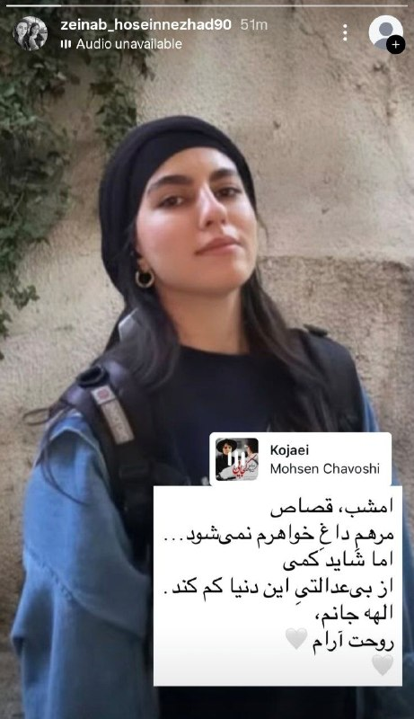

🔴 طبق گفته‌ی خواهر الهه حسین‌نژاد؛
بهمن فرزانه (قاتل) امشب اعدام میشه.

@Dirty_Kids 👻

## Dirty_Kids — post 389773

‏صدا و سیما میخواد امشب طرز کار کردن با بمب اتم را آموزش بده

@Dirty_Kids 👻

## Dirty_Kids — post 389772

  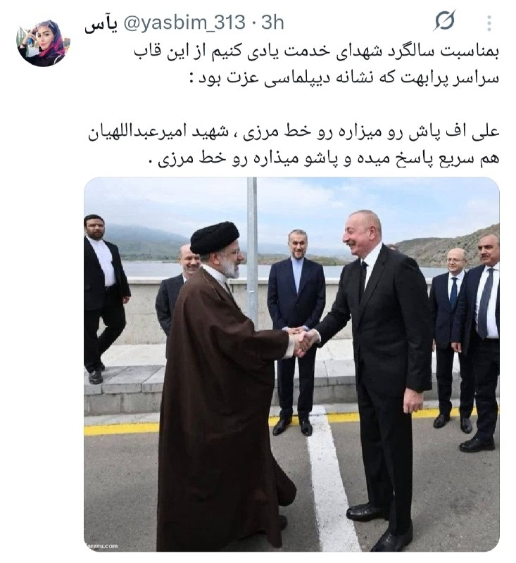

امروز سالگرد سقوط بالگرد آنگوزمان و درازعلی هست گویا. روز خرس مبارک. @Dirty_Kids 👻

## Dirty_Kids — post 389771

  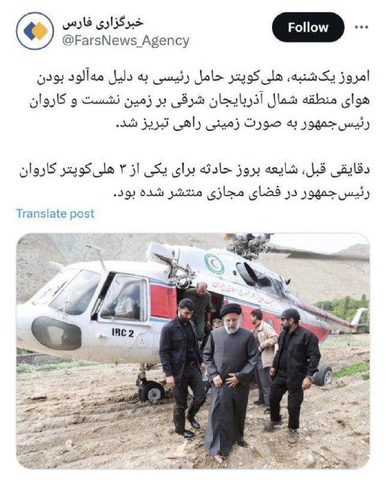

امروز سالگرد سقوط بالگرد آنگوزمان و درازعلی هست گویا. روز خرس مبارک. @Dirty_Kids 👻

## Dirty_Kids — post 389770

  <a href="telegram/content/Dirty_Kids_389770_1779224667.mp4" target="_blank">🎬 Download video</a>

امروز سالگرد سقوط بالگرد آنگوزمان و درازعلی هست گویا.
روز خرس مبارک.

@Dirty_Kids 👻

## Hranews — post 113049

  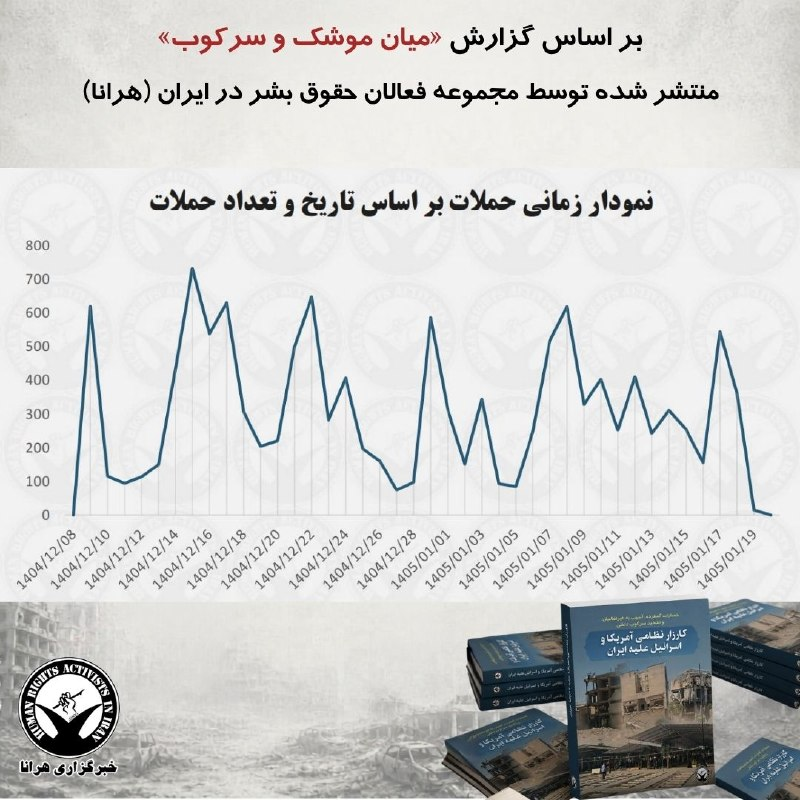

بر اساس گزارش «میان موشک و سرکوب»؛ روند زمانی حملات نظامی اخیر نشان می‌دهد که در ۲۴ ساعت نخست مخاصمات، نیروهای ایالات متحده بیش از ۱٬۰۰۰ هدف و اسرائیل نیز ۷۵۰ هدف را در ایران مورد حمله قرار داده‌اند.

بر اساس این گزارش، در نخستین روز حملات (۹ اسفند ۱۴۰۴)، ۷۰۱ رویداد ثبت شده و بالاترین میزان در ۱۵ اسفند با ثبت ۷۳۴ رویداد در یک روز رخ داده است. در مجموع، تا پایان ۳۸ روز درگیری، حدود ۱۳٬۰۰۰ هدف مورد حمله قرار گرفته است.

📎 گزارش را به زبان فارسی مطالعه کنید

📎 دانلود مستقیم فایل پی دی اف فارسی از تلگرام

📎 Complete report in English

📎Direct download of the English PDF

↘️
@hranews_bot تماس ✉️ - @Hranews کانال هرانا 🆑

## manototv — post 105661

  <a href="telegram/content/manototv_105661_1779224669.mp4" target="_blank">🎬 Download video</a>

‌
مارک استون، خبرنگار اسکای‌نیوز، در مواجه با دریادار برد کوپر، فرمانده سنتکام، از او پرسید چرا ارتش آمریکا هنوز جزئیات حادثه مرگبار میناب را منتشر نکرده است.

استون با اشاره به ادعای فرمانده سنتکام گفت تیم اسکای‌نیوز در میناب حضور دارد و «هیچ نشانه‌ای از وجود پایگاه موشکی» در محل حادثه ندیده است.

او همچنین از کوپر پرسید تا چه زمانی ارتش آمریکا به ادامه تحقیقات استناد خواهد کرد و این تحقیقات چه زمانی به پایان می‌رسد.

دریادار کوپر در پاسخ تنها گفت: «تحقیقات ادامه دارد» و از پاسخ به دیگر سوال‌ها خودداری کرد.

## manototv — post 105660

  <a href="telegram/content/manototv_105660_1779224670.mp4" target="_blank">🎬 Download video</a>

تماسی بغض‌آلود از ایران:
«می‌گفت زیر فشار زندگی مونده…
با مادری بیمار، اجاره عقب‌افتاده و بیماری خودش

## manototv — post 105659

  <a href="telegram/content/manototv_105659_1779224672.mp4" target="_blank">🎬 Download video</a>

تماسی تلخ از دل ایران:
«می‌گفت در پتروشیمی تعدیل شده…
و برای تأمین هزینه‌های زندگی حتی به رحم اجاره‌ای فکر می‌کنه

## alonews — post 121184

  <a href="telegram/content/alonews_121184_1779224674.webm" target="_blank">🎬 Download video</a>

👈حسین طاهری مداح:
اینکه دخترها بی حجاب میان تجمعات یعنی پیروزی انقلاب

✅ @AloNews خبر جنگ

## alonews — post 121183

  <a href="telegram/content/alonews_121183_1779224674.webm" target="_blank">🎬 Download video</a>

👈امروز سالگرد فرود سخت بالگرد ابراهیم رئیسی هست 
✅ @AloNews خبر جنگ

## alonews — post 121182

  <a href="telegram/content/alonews_121182_1779224675.webm" target="_blank">🎬 Download video</a>

👈امروز سالگرد فرود سخت بالگرد ابراهیم رئیسی هست

✅ @AloNews خبر جنگ

## alonews — post 121181

  

توی رستورانای تهران، یدونه سالاد شده 2 میلیون تومن!!

[@AloTweet]

## alonews — post 121180

  <a href="telegram/content/alonews_121180_1779224675.mp4" target="_blank">🎬 Download video</a>

👈تندروهای خیابونی این شبا تو تجمعات دارن یه‌ جوری قر میدن و میرقصن که انگاری ما رهبر آمریکا رو ترور کردیم

✅ @AloNews خبر جنگ

## alonews — post 121179

  

🏴󠁧󠁢󠁥󠁮󠁧󠁿
🤩رسمی : آرسنال قهرمان فصل 2025/2026 پریمیرلیگ شد

❤️پروژه آرتتا بلاخره جواب داد

@AloSport

## alonews — post 121178

  <a href="telegram/content/alonews_121178_1779224678.mp4" target="_blank">🎬 Download video</a>

👈حمله‌‌های شدید اسرائیل به کرانه باختری

✅ @AloNews خبر جنگ

## alonews — post 121177

  <a href="telegram/content/alonews_121177_1779224679.webm" target="_blank">🎬 Download video</a>

👈آای هیمتی:
مردم جلوی گرونیا مقاومت کنن

✅ @AloNews خبر جنگ

## alonews — post 121176

  <a href="telegram/content/alonews_121176_1779224679.webm" target="_blank">🎬 Download video</a>

👈با اعلام خواهر الهه حسین نژاد، بهمن فرزانه قاتل امشب اعدام خواهد شد

✅ @AloNews خبر جنگ

## alonews — post 121175

  <a href="telegram/content/alonews_121175_1779224680.webm" target="_blank">🎬 Download video</a>

👈تصویری وایرال شده و پربازدید از رشت

✅ @AloNews خبر جنگ

<!-- MSG END -->

<!-- NAV START -->

<a href="https://github.com/hhdoust2/aio-downloader/blob/main/telegram/content/archive_1.md" style="display:inline-block; padding:6px 12px; margin:0 4px; background-color:#2ea44f; color:white; text-decoration:none; border-radius:4px; font-weight:bold;">صفحه بعد</a>

<!-- NAV END -->
