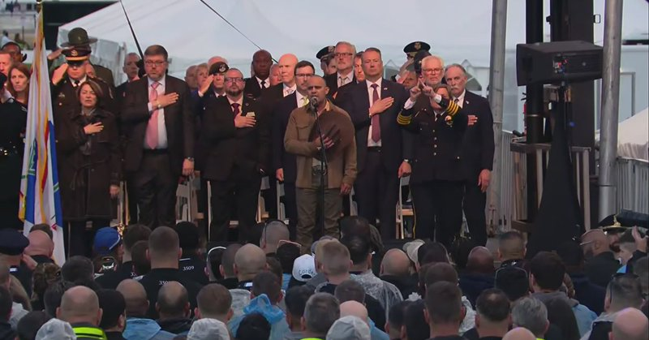
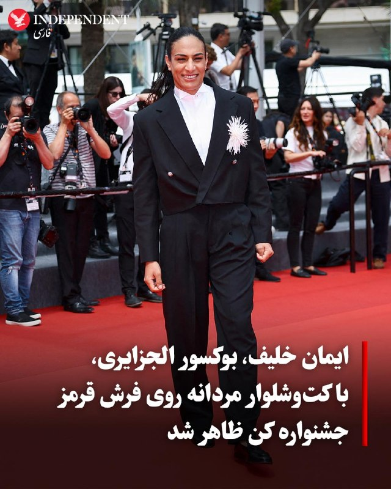
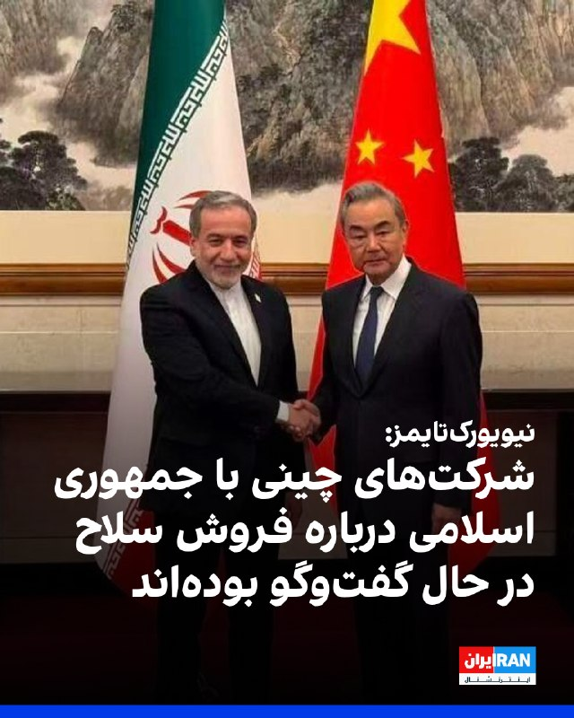
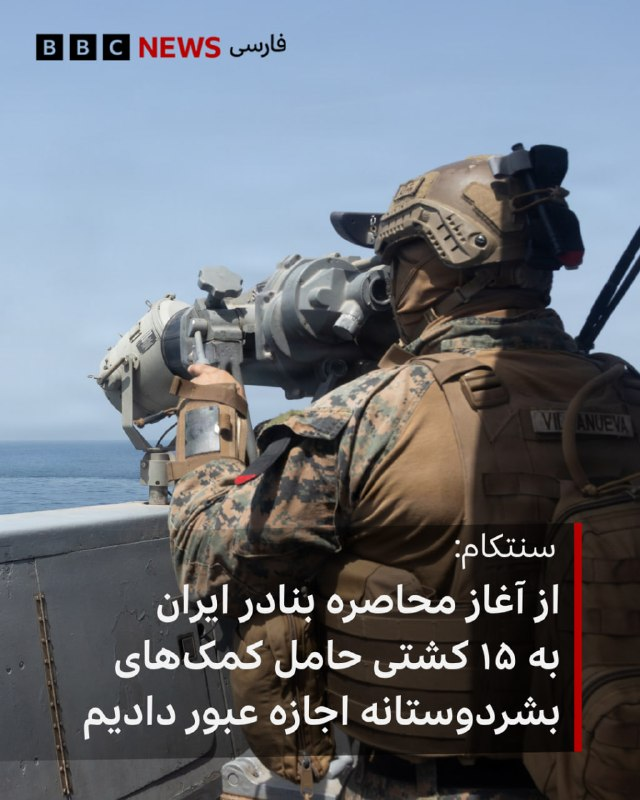

# خواننده تلگرام

<!-- TOP_NAV START -->

<!-- TOP_NAV END -->

<!-- MSG START -->

---
📅 بروزرسانی: 1405/02/24 03:46
---

## VahidOOnLine — post 240009

  

♦️پایگاه خبری «فرارو» چهارشنبه ۲۴ اردیبهشت‌ماه گزارش داد قیمت برخی مدل‌های تلفن همراه در بازار ایران به بیش از دو برابر نرخ جهانی رسیده و هم‌زمان توقف ورود گوشی به کشور از ابتدای سال، باعث جهش تازه قیمت‌ها شده است.

براساس این گزارش، گلکسی اس۲۵ اولترا نسخه ۲۵۶ گیگابایت با رم ۱۲ گیگ در بازار جهانی هزار و ۲۹۹ دلار قیمت دارد، اما همین مدل در بازار ایران تا ۴۸۷ میلیون تومان، معادل حدود دو هزار و ۷۰۰ دلار، فروخته می‌شود.

فرارو همچنین نوشت آیفون ۱۷ پرو مکس نسخه ۵۱۲ گیگ با قیمت جهانی هزار و ۳۹۹ دلار، در بازار موبایل ایران حدود ۵۱۴ میلیون تومان، معادل نزدیک دو هزار و ۸۵۰ دلار، قیمت‌گذاری شده است. آیفون ۱۷ نسخه معمولی نیز که حدود ۸۰۰ دلار ارزش دارد، در ایران تا حدود هزار و ۸۰۰ دلار فروخته می‌شود.

فعالان بازار موبایل به فرارو گفته‌اند روند ورود گوشی به کشور از ابتدای سال متوقف شده و کاهش عرضه، عامل اصلی افزایش قیمت‌ها بوده است. براساس این گزارش، گلکسی ای۰۷ که پیش از نوروز بین ۱۳ تا ۱۴ میلیون تومان فروخته می‌شد، اکنون به حدود ۲۲ میلیون تومان رسیده است. همچنین قیمت گلکسی ای۳۶ بین ۶۸ تا ۷۲ میلیون تومان و گلکسی ای۵۶ بین ۸۵ تا ۹۸ میلیون تومان اعلام شده است.
‌🇸🇦 Indypersian

🤖 @VahidOOnLine

## VahidOOnLine — post 240000

این‌ها فقط چند روایت کوتاه از دی‌ماه‌اند؛
از روزهایی که خیابان‌های ایران، شاهد خاموش شدن زندگی جوان‌هایی شد که هر کدام در حال ساختن آینده خود بودند.<
یکی ورزشکار بود،
یکی تازه زندگی مشترکش را شروع کرده بود،
یکی کار می‌کرد تا روی پای خودش بایستد،
و یکی پدر کودکی بود که حالا باید بدون او بزرگ شود.<
مهدی جعفری، سروش (حسین) دانشمندی، جواد زارعی، حامد بیابانی، حسین رضایی، امیرحسین میرزایی، محمدمهدی سیف‌الله‌پور و فاطمه اعزازی کله‌سر
جاویدنامان انقلاب ملی ایرانیان؛
نام‌هایی که در حافظه این سرزمین مانده‌اند، چون زندگی‌شان پیش از آن‌که فرصت کامل شدن پیدا کند، با گلوله متوقف شد.<
#جاویدنامان_انقلاب_ملی_ایرانیان
‌🏁 🇬🇧 IranintlTV

🤖 @VahidOOnLine

## VahidOOnLine — post 239999

  

♦️درحالی که مایک والتز، سفیر آمریکا در سازمان ملل با انتشار فهرستی از ۱۱۲ کشور حامی پیش‌نویس قطعنامه سازمان ملل در محکومیت اقدامات تهران در تنگه هرمز، این فهرست طولانی شامل هند، کره جنوبی و ژاپن را نشانه انزوای رژیم ایران توصیف کرده است، نمایندگی جمهوری اسلامی در سازمان ملل مدعی شد که آمریکا به کشورها برای حمایت از این قطعنامه فشار آورده است. والتز در پیامی در اکس نوشت: «ایران در اقدامات غیرقانونی خود برای مین‌گذاری در آب‌های بین‌المللی و دریافت عوارض، منزوی شده است. فهرست ۱۱۳ کشور هم‌حامی قطعنامه شورای امنیت سازمان ملل از جمله هند، ژاپن و کره جنوبی را ببینید که از ایران می‌خواهند به رفتار غیرقانونی و غیرقابل قبول خود پایان دهد.» در واکنش نمایندگی جمهوری اسلامی در سازمان ملل نیز آمده که نمایش تعداد کشورهای حمایت کننده از این قطعنامه «فریبکارانه و مضحک» است. نمایندگی جمهوری اسلامی مدعی شده که آمریکا به کشورها برای پیوستن به این قطعنامه فشار آورده است.
‌🇸🇦 Indypersian

🤖 @VahidOOnLine

## VahidOOnLine — post 239998

  

♦️طی روزهای اخیر ده‌ها اصله درخت تنومند و قدیمی در منطقه گردشگری سراب اسکان شازند که برخی از آن‌ها بین ۳۰ تا ۵۰ سال قدمت داشتند، بدون اعلام دلیل مشخصی قطع شده‌اند؛ اقدامی که واکنش شهروندان و فعالان محیط زیست را در پی داشته و نگرانی‌ها درباره آینده طبیعت این منطقه را افزایش داده است.

خبرگزاری ایسنا یکشنبه ۲۰ اردیبهشت‌ماه گزارش داد در روستای گردشگری اسکان در شهرستان شازند استان مرکزی، بیش از ۵۰ اصله درخت زنده قطع شده و بخش‌هایی از سیمای طبیعی منطقه دستخوش تغییر شده است.

این خبرگزاری نوشت پیگیری‌ها نشان می‌دهد این اقدام احتمالا بدون اطلاع‌رسانی شفاف و اخذ مجوزهای لازم انجام شده است.

گردشگران و اهالی منطقه با ابراز نگرانی از قطع درختان و نبود اطلاع‌رسانی، خواستار پیگیری موضوع و اعلام دلایل قطع ناگهانی درختان شده‌اند.

روستای اسکان در مسیر اراک ـ بروجرد و در مجاورت رودخانه قره‌چای قرار دارد و به‌دلیل طبیعت سرسبز و درختان کهنسال خود شناخته می‌شود.

به گزارش ایسنا، قطع این درختان علاوه بر تغییر سیمای طبیعی منطقه، نگرانی‌هایی درباره افزایش فرسایش خاک، تهدید منابع آبی و پیامدهای محیط زیستی ایجاد کرده است.
‌🇸🇦 Indypersian

🤖 @VahidOOnLine

## VahidOOnLine — post 239997

  

♦️کریس رایت، وزیر انرژی آمریکا، روز چهارشنبه هشدار داد که رژیم ایران «به‌طرز نگران‌کننده‌ای» به تولید اورانیوم غنی‌شده در سطح مورد نیاز برای ساخت سلاح هسته‌ای نزدیک شده است.
رایت گفت اورانیوم غنی‌شده ایران ـ که دونالد ترامپ، رئیس‌جمهوری آمریکا، مصرانه به‌دنبال توقیف آن است ـ رژیم جمهوری اسلامی را تنها چند هفته با رسیدن به آستانه لازم برای دستیابی به بمب هسته‌ای فاصله داده است.
او در جلسه کمیته نیروهای مسلح سنای آمریکا گفت: «آن‌ها فقط چند هفته با غنی‌سازی این مواد تا سطح تسلیحاتی فاصله دارند. البته پس از آن هنوز فرایند ساخت و تسلیحاتی‌کردن بمب باقی می‌ماند، اما آن‌ها بسیار نزدیک شده‌اند.»
استیو ویتکاف، فرستاده ویژه آمریکا، پیش‌تر به‌طور علنی گفته بود ایران مدعی است آن‌قدر اورانیوم با غنای ۶۰ درصد در اختیار دارد که در صورت غنی‌سازی بیشتر تا سطح ۹۰ درصد، برای ساخت ۱۱ بمب هسته‌ای کافی خواهد بود.
به گفته کارشناسان هسته‌ای، رسیدن به سطح غنی‌سازی ۶۰ درصد، از نظر فنی جهشی بسیار دشوارتر از حرکت از ۶۰ درصد به ۹۰ درصد است؛ سطحی که غنی‌سازی در حد تسلیحاتی محسوب می‌شود.
گفته می‌شود ایران حدود ۴۰۰ کیلوگرم اورانیوم با غنای ۶۰ درصد در اختیار دارد.
به گزارش نیویورک پست، رایت و سناتور ریچارد بلومنتال، دموکرات ایالت کنتیکت، در این جلسه توافق داشتند که جمهوری اسلامی «تنها چند هفته» با تبدیل این مواد به اورانیوم در سطح تسلیحاتی فاصله دارد.
ایران همچنین ۱۱ تن اورانیوم دیگر با سطح پایین‌تر غنی‌سازی در اختیار دارد.
رایت افزود: «آن‌ها مقداری اورانیوم ۲۰ درصدی هم دارند و [رسیدن آن] به سطح ۶۰ درصد، چند هفته بیشتر زمان می‌برد.»
او ادامه داد: «[در مورد] اورانیوم غنی‌نشده، رساندن آن به سطح تسلیحاتی فرایندی طولانی است. اما وقتی به ۶۰ درصد می‌رسید، هرچند اعداد شاید این را نشان ندهند، در واقع بیش از ۹۰ درصد مسیر لازم برای غنی‌سازی در سطح تسلیحاتی را طی کرده‌اید.»
او تاکید کرد: «این موضوع بسیار نگران‌کننده است.»
بلومنتال گفت اگر ترامپ بخواهد این تهدید را به‌طور کامل از بین ببرد، احتمالا باید علاوه بر حدود یک تن اورانیوم ۶۰ درصدی، ۱۱ تن اورانیوم ۲۰ درصدی ایران را نیز در اختیار بگیرد.
رایت در پاسخ گفت: «فکر می‌کنم این راهبرد عاقلانه‌ای است. در نهایت، هدف این است که از غنی‌سازی اورانیوم در آینده نیز جلوگیری شود. بله، برای داشتن جهانی امن، باید به برنامه هسته‌ای آن‌ها پایان دهیم.
‌🇸🇦 Indypersian

🤖 @VahidOOnLine

## WithYashar — post 11178

مارکو روبیو تایید کرد چین و آمریکا به توافق رسیدن که ایران نباید تو تنگه عوارض بگیره از کشوری

این «توافق» فعلاً در حد موضع مشترک سیاسی و دیپلماتیک گزارش شده، نه یک پیمان رسمی یا قطعنامه بین‌المللی.
چین هنوز در بسیاری از موضوعات از ایران فاصله نگرفته و حتی در شورای امنیت بعضی قطعنامه‌های ضد ایران را وتو کرده است.
دلیل حساسیت موضوع این است که حدود یک‌پنجم نفت جهان از تنگه هرمز عبور می‌کند و هرگونه عوارض یا محدودیت می‌تواند قیمت جهانی انرژی را به شدت تحت تأثیر قرار دهد
@withyashar

## WithYashar — post 11177

@withyashar سفر قاهره

## FoxNewsTwitter — post 341684

  

Fox News (Twitter/X)

WATCH LIVE: 38th annual candlelight vigil for fallen officers in Washington, DC https://twitter.com/i/broadcasts/1NGaraWVDYVJj

## pm_afshaa — post 90710

  <a href="telegram/content/pm_afshaa_90710_1778717801.webm" target="_blank">🎬 Download video</a>

🔴روبیو، وزیر خارجه آمریکا:

چین کلی کشتی تو خلیج فارس داره که گیر افتادن و آخر هفته هم یه کشتی باری چینی آسیب دید، فکر نمیکنم ایران عمدی زده باشه، ولی خب به هر حال اتفاق افتاده و الان همین باعث شده کشتی‌های چینی نتونن راحت رفت‌وآمد کنن؛ این وضعیت داره حسابی منطقه رو بی‌ثبات میکنه، مخصوصاً آسیا که بخش زیادی از انرژی‌شون از همین مسیر رد میشه. به نفع خود چینه که این قضیه جمع بشه.

ما هم امیدواریم پکن بیشتر وارد ماجرا بشه و ایران رو قانع کنه از کارهایی که الان داره تو خلیج فارس انجام میده عقب‌نشینی کنه.

💧 Rainbet.com the #1 Non-KYC Crypto Casino & Sportsbook @rainbetcom

😁 @Pm_Afshaa

## IranIntlTV — post 337082

این‌ها فقط چند روایت کوتاه از دی‌ماه‌اند؛
از روزهایی که خیابان‌های ایران، شاهد خاموش شدن زندگی جوان‌هایی شد که هر کدام در حال ساختن آینده خود بودند.
یکی ورزشکار بود،
یکی تازه زندگی مشترکش را شروع کرده بود،
یکی کار می‌کرد تا روی پای خودش بایستد،
و یکی پدر کودکی بود که حالا باید بدون او بزرگ شود.
مهدی جعفری، سروش (حسین) دانشمندی، جواد زارعی، حامد بیابانی، حسین رضایی، امیرحسین میرزایی، محمدمهدی سیف‌الله‌پور و فاطمه اعزازی کله‌سر
جاویدنامان انقلاب ملی ایرانیان؛
نام‌هایی که در حافظه این سرزمین مانده‌اند، چون زندگی‌شان پیش از آن‌که فرصت کامل شدن پیدا کند، با گلوله متوقف شد.
#جاویدنامان_انقلاب_ملی_ایرانیان

## IranIntlTV — post 337081

  <a href="telegram/content/IranIntlTV_337081_1778717802.mp4" target="_blank">🎬 Download video</a>

رسانه‌های جمهوری اسلامی از برگزاری رزمایش پنج‌روزه سپاه تهران بزرگ با محوریت مقابله با عملیات «هلی‌برن» نیروهای متخاصم خبر دادند.
در تصاویر منتشرشده، نیروهای پیاده با سلاح‌های سبک، نیمه‌سنگین و پهپاد به اهداف فرضی، همچون تصویر پارچه‌ای یک بالگرد، شلیک می‌کنند.
این رزمایش پس از ورود بالگردهای بلک‌هاوک و هواپیمای سوخت‌رسان آمریکا به خاک ایران، در جریان عملیات جست‌وجوی خلبان اف-۱۵، برگزار شده است.
@iranintltv

## IranIntlTV — post 337080

  <a href="telegram/content/IranIntlTV_337080_1778717803.mp4" target="_blank">🎬 Download video</a>

موج تازهٔ اعدام جوانان نخبه؛
احسان افرشته با اتهام «جاسوسی» اعدام شد

جمهوری اسلامی بامداد چهارشنبه حکم اعدام احسان افرشته، زندانی سیاسی متهم به «جاسوسی برای اسرائیل»، را اجرا کرد؛ پرونده‌ای که مانند بسیاری از پرونده‌های امنیتی مشابه، بدون انتشار سند و مدرک مستقل به پایان رسید.

نهادهای حقوق بشری پیش‌تر هشدار داده بودند که اتهامات مطرح‌شده علیه او بر پایهٔ اعترافات اجباری و تحت فشار مطرح شده است.

کامبیز حسینی در «برنامه» به این موضوع می‌پردازد.

«یک ایران صدای شما را می‌شنود»
دوشنبه تا پنجشنبه ۱۱ شب تهران
از تلویزیون ایران اینترنشنال

تماشای نسخه کامل این قسمت از «برنامه» در یوتیوب:
https://youtu.be/HsShW7razys
@iranintltv

## IranIntlTV — post 337079

  <a href="telegram/content/IranIntlTV_337079_1778717804.mp4" target="_blank">🎬 Download video</a>

محمد از آلمان: کسی که پول دارو ندارد، آب ندارد، برق ندارد، او هم اعدامی جمهوری اسلامی است

«یک ایران صدای شما را می‌شنود»
دوشنبه تا پنجشنبه ۱۱ شب تهران
از تلویزیون ایران اینترنشنال

تماشای نسخه کامل این قسمت از «برنامه» در یوتیوب:
https://youtu.be/HsShW7razys
@iranintltv

## IranIntlTV — post 337078

  <a href="telegram/content/IranIntlTV_337078_1778717806.mp4" target="_blank">🎬 Download video</a>

حمید از بندرعباس: می‌روم خرید، ولی فقط می‌توانم به اندازهٔ جیبم خرید کنم، نه نیازم

«یک ایران صدای شما را می‌شنود»
دوشنبه تا پنجشنبه ۱۱ شب تهران
از تلویزیون ایران اینترنشنال

تماشای نسخه کامل این قسمت از «برنامه» در یوتیوب:
https://youtu.be/HsShW7razys
@iranintltv

## IranIntlTV — post 337077

  <a href="telegram/content/IranIntlTV_337077_1778717807.mp4" target="_blank">🎬 Download video</a>

فریبرز از خوزستان: مردمی که اینترنت ندارند، چه کار کنند؟ ایرانی‌های خارج از کشور کمک کنند

«یک ایران صدای شما را می‌شنود»
دوشنبه تا پنجشنبه ۱۱ شب تهران
از تلویزیون ایران اینترنشنال

تماشای نسخه کامل این قسمت از «برنامه» در یوتیوب:
https://youtu.be/HsShW7razys
@iranintltv

## IranIntlTV — post 337076

  <a href="https://t.me/IranintlTV/337076" target="_blank">📎 Download file</a>

🎧نسخه صوتی سیاست با مراد ویسی: ایران کارت بازی دیگران
@iranintlTV

## IranIntlTV — post 337075

  <a href="telegram/content/IranIntlTV_337075_1778717810.mp4" target="_blank">🎬 Download video</a>

فرامرز از استکهلم: به ترامپ توجه نکنید؛ او در حال جنگ سرد است؛ما باید مسیر خودمان را برویم

«یک ایران صدای شما را می‌شنود»
دوشنبه تا پنجشنبه ۱۱ شب تهران
از تلویزیون ایران اینترنشنال

تماشای نسخه کامل این قسمت از «برنامه» در یوتیوب:
https://youtu.be/HsShW7razys
@iranintltv

## IranIntlTV — post 337074

  <a href="telegram/content/IranIntlTV_337074_1778717811.mp4" target="_blank">🎬 Download video</a>

احمد از انگلستان: مردم ایران صبرشان استراتژیک و تاریخی است و می‌دانند کی باید به آب بزنند

«یک ایران صدای شما را می‌شنود»
دوشنبه تا پنجشنبه ۱۱ شب تهران
از تلویزیون ایران اینترنشنال

تماشای نسخه کامل این قسمت از «برنامه» در یوتیوب:
https://youtu.be/HsShW7razys
@iranintltv

## FarsiVOA — post 217676

🔺مارکو روبیو: امیدواریم چین در واداشتن جمهوری اسلامی به اتمام بی‌ثبات‌سازی خلیج فارس نقش فعال‌تری ایفا کند

▪️مارکو روبیو، وزیر امور خارجه آمریکا، در یک گفت‌وگوی اختصاصی با شان هنیتی از شبکه فاکس‌نیوز درباره تلاش‌ها برای وادار کردن چین به برخورد با جمهوری اسلامی ایران در ارتباط با اقداماتش در خلیج فارس توضیح داد.

⬇️ بیشتر بخوانید:
https://ir.voanews.com/a/8149668.html
@FarsiVOA

## BBCPersian — post 280971

🔻در اوج دور جدید جنگ میان حزب‌الله و ارتش اسرائیل ساختمانی مسکونی در بیروت در مقابل دوربینها و پخش زنده تلویزیونی توسط جنگنده‌ های اسرائیلی بمباران و ویران شد. صحنه‌ای که از زوایای مختلف به تصویر کشیده شد و ذهنها ماند.

اسرائیل گفت یکی از زیرساختهای مالی مربوط به حزب‌الله را هدف گرفته. در این حمله که بعد از هشدار تخلیه بود، کسی کشته نشد اما دهها خانواده بی‌خانمان شدند. ساکنان محله و صاحبخانه‌ها در گفتگو با بی‌بی‌سی ادعای اسرائیل را رد کردند. پیگیریهای بی‌بی‌سی از این ارتش درباره جزییات این منابع مالی ادعایی بی‌جواب ماند.

این درحالیست که گروه‌های حقوق بشری می‌گویند این نوع حملات خلاف قوانین بین‌المللی هستند و می‌توانند جنایت جنگی محسوب شوند.

گزارش تحقیقی نفیسه کوهنورد از بیروت را ببینیم

@BBCPersian

## alonews — post 119836

  <a href="telegram/content/alonews_119836_1778717813.webm" target="_blank">🎬 Download video</a>

👈معین: مهدی تاج الکی میگه، من قرار نیست هیچ آهنگی واسه تیم فوتبال تو جام جهانی بخونم.

✅ @AloNews خبر جنگ

---
📅 بروزرسانی: 1405/02/24 02:35
---

## VahidOOnLine — post 239996

  

نیویورک‌تایمز به نقل از مقام‌های آمریکایی گزارش داد شرکت‌های چینی با جمهوری اسلامی درباره فروش سلاح در حال گفت‌وگو بوده‌اند و قصد داشته‌اند این تسلیحات را از طریق کشورهای دیگر ارسال کنند تا منشا کمک نظامی پنهان بماند.
مقام‌های آمریکایی گفتند دست‌کم یکی از کشورهای ثالث در آفریقا قرار دارد، اما مشخص نیست آیا محموله‌ای به آن کشور رسیده است یا نه.
مقام‌هایی که در جریان این اطلاعات قرار گرفته‌اند، درباره اینکه آیا سلاح‌ها پیش‌تر به کشورهای ثالث ارسال شده‌اند یا نه، به جمع‌بندی‌های متفاوتی رسیده‌اند. با این حال، از زمان آغاز جنگ کنونی علیه جمهوری اسلامی، به نظر نمی‌رسد هیچ سلاح چینی در میدان نبرد علیه نیروهای آمریکایی یا اسرائیلی استفاده شده باشد.
هنوز مشخص نیست چه تعداد سلاح منتقل شده یا مقام‌های چینی تا چه اندازه این فروش‌ها را تایید کرده‌اند.

‌🏁 🇬🇧 IranintlTV

🤖 @VahidOOnLine

## VahidOOnLine — post 239995

  

♦️ایمان خلیف، بوکسور الجزایری و قهرمان جنجالی المپیک، در نخستین حضور خود در جشنواره فیلم کن، با کت‌وشلوار رسمی مشکی مردانه روی فرش قرمز ظاهر شد.
حضور خلیف در شرایطی خبرساز شده که جنجال‌ها درباره نتایج آزمایش‌های پزشکی او همچنان ادامه دارد. نشریه تلگراف پیش‌تر گزارش داده بود اسناد آزمایش تعیین جنسیت این ورزشکار نشان می‌دهد او دارای ساختار کروموزومی XY (مردانه) است. فدراسیون جهانی بوکس نیز اعلام کرده ایمان خلیف بدون انجام آزمایش‌های جدید و تایید صلاحیت، نمی‌تواند در رقابت‌های آینده زنان شرکت کند.
دونالد ترامپ، رئیس‌جمهوری آمریکا، نیز پیش‌تر گفته بود ورزشکارانی که از نظر بیولوژیکی مرد هستند، نباید در رقابت‌های زنان المپیک شرکت کنند. با ادامه این جنجال‌ها، هنوز مشخص نیست ایمان خلیف امکان حضور در المپیک آینده را خواهد داشت یا خیر.
‌🇸🇦 Indypersian

🤖 @VahidOOnLine

## VahidOOnLine — post 239994

  

♦️مارکو روبیو، وزیر خارجه آمریکا، در گفتگو با فاکس‌نیوز گفت واشینگتن امیدوار است چین نقش فعال‌تری برای ترغیب جمهوری اسلامی به کنار گذاشتن اقداماتش در خلیج فارس ایفا کند.

روبیو در گفتگویی با شان هنیتی در هواپیمای ریاست‌جمهوری آمریکا گفت: «کشتی‌های چینی در خلیج فارس گیر افتاده‌اند.» او افزود یک کشتی حامل بار چینی آخر هفته هدف قرار گرفته است.

وزیر خارجه آمریکا همچنین گفت واشینگتن این موضوع را با مقام‌های چینی مطرح کرده و امیدوار است پکن از قطعنامه شورای امنیت سازمان ملل درباره محکومیت اقدامات جمهوری اسلامی در تنگه‌ها حمایت کند.

او تاکید کرد بحران در تنگه هرمز منبع بزرگی از بی‌ثباتی است و بیش از هر منطقه دیگری، آسیا را تهدید می‌کند، زیرا کشورهای آسیایی به‌شدت به مسیرهای انرژی در این منطقه وابسته‌اند.

روبیو افزود اقتصاد چین بر پایه صادرات بنا شده و ادامه بحران در تنگه هرمز می‌تواند باعث کاهش خرید کالاهای چینی و افت شدید صادرات این کشور شود.

وزیر خارجه آمریکا در پایان گفت: «حل این بحران به نفع چین است و امیدواریم آن‌ها نقش فعال‌تری برای وادار کردن ایران به عقب‌نشینی از اقداماتی که اکنون در خلیج فارس انجام می‌دهد، ایفا کنند.»
‌🇸🇦 Indypersian

🤖 @VahidOOnLine

## VahidOOnLine — post 239993

  

♦️به گزارش رویترز، وزارت امور خارجه ایالات متحده اعلام کرد که واشنگتن و پکن برای جلوگیری از دریافت هرگونه «عوارض کشتیرانی» در تنگه هرمز به توافق رسیده‌اند.
این توافق در جریان رایزنی‌های مارکو رابیو، وزیر امور خارجه آمریکا و وانگ یی، وزیر امور خارجه چین، پیش از دیدار سران دو کشور در پکن حاصل شده است. طبق بیانیه وزارت خارجه آمریکا، دو طرف تاکید کرده‌اند که به هیچ کشوری اجازه داده نخواهد شد برای تردد در آبراه‌های بین‌المللی مانند تنگه هرمز عوارض وضع کند.
این موضع مشترک در آستانه سفر دونالد ترامپ به چین و دیدار با شی جین‌پینگ منتشر می‌شود؛ نشستی که انتظار می‌رود فشار بر تهران برای پایان دادن به انسداد این آبراه حیاتی در صدر دستور کار آن باشد. در حالی که ایران دریافت عوارض را پیش‌شرطی برای بازگشایی مسیر اعلام کرده، این هماهنگی میان واشنگتن و پکن نشان‌دهنده تلاش برای تضمین «تردد آزاد و امن» در منطقه‌ای است که نقش کلیدی در تأمین انرژی جهان دارد.
‌🇸🇦 Indypersian

🤖 @VahidOOnLine

## VahidOOnLine — post 239992

  

مارکو روبیو، وزیر خارجه آمریکا، در گفت‌وگو با فاکس‌نیوز با تاکید بر اینکه حل بحران خاورمیانه به نفع چین است، ابراز امیدواری کرد واشینگتن بتواند پکن را متقاعد کند نقش فعال‌تری در ترغیب جمهوری اسلامی برای کنار گذاشتن اقداماتش در خلیج فارس ایفا کند.
او گفت: «چینی‌ها کشتی‌هایی دارند که در خلیج فارس گیر افتاده‌اند. یک محموله باری چینی آخر هفته هدف قرار گرفت. مطمئنم جمهوری اسلامی عمدا این کار را نکرد، اما این اتفاق افتاد. به همین دلیل این کشتی‌های چینی آنجا گیر افتاده‌اند.»
روبیو افزود: «این وضعیت منبع بزرگی از بی‌ثباتی است. بیش از هر نقطه دیگر جهان، آسیا را تهدید به بی‌ثباتی می‌کند، زیرا به شدت به این تنگه‌ها برای انرژی وابسته است.»

‌🏁 🇬🇧 IranintlTV

🤖 @VahidOOnLine

## VahidOOnLine — post 239991

  <a href="telegram/content/VahidOOnLine_239991_1778713541.mp4" target="_blank">🎬 Download video</a>

‌
مهدی تاج، رئیس فدراسیون فوتبال ایران، درباره انتشار آهنگی از سوی معین، برای تیم فوتبال در جام‌جهانی گفت فدراسیون فوتبال در تولید این کار دخیل نبوده، اما «در جریان» این موضوع است.
تاج افزود: «هر کسی از ایران حمایت کند، مورد تایید ماست.»
‌🏁 🇬🇧 ManotoTV

🤖 @VahidOOnLine

## VahidOOnLine — post 239990

  <a href="telegram/content/VahidOOnLine_239990_1778713542.mp4" target="_blank">🎬 Download video</a>

تماسی از ایران:
«می‌گفت تفاوت سیستم آموزش مدارس ایران با خارج از کشور زمین تا آسمونه…
می‌گفت به‌جای رشد و یادگیری،
بچه‌ها درگیر ظواهر و حاشیه‌ها شدن
و انگیزه برای پیشرفت کم‌رنگ شده.»
‌🏁 🇬🇧 ManotoTV

🤖 @VahidOOnLine

## VahidOOnLine — post 239989

  <a href="telegram/content/VahidOOnLine_239989_1778713544.mp4" target="_blank">🎬 Download video</a>

مارکو روبیو، وزیر خارجه آمریکا، در گفت‌وگویی اختصاصی با شان هنیتی، خبرنگار و مجری فاکس‌نیوز در هواپیمای ریاست جمهوری آمریکا، از تلاش‌های فشرده واشینگتن برای وادار کردن چین به مقابله با اقدامات جمهوری اسلامی در خلیج فارس سخن گفت.

روبیو گفت: «کشتی‌های چینی در خلیج فارس گیر افتاده‌اند... آخر هفته یک محموله باری چین هدف قرار گرفت. مطمئنم ایران عمداً این کار را نکرده، اما این اتفاق افتاده و به همین دلیل کشتی‌های چینی آنجا گرفتار شده‌اند.»

او افزود: «این وضعیت منبع بزرگی از بی‌ثباتی است. بیش از هر نقطه دیگری در جهان، آسیا را تهدید به بی‌ثباتی می‌کند، چون به‌شدت به این تنگه برای تامین انرژی وابسته است.»

وزیر خارجه آمریکا همچنین گفت: «حل این مسئله به نفع چین است. امیدواریم بتوانیم آن‌ها را قانع کنیم نقش فعال‌تری برای وادار کردن ایران به عقب‌نشینی از اقداماتی که اکنون در خلیج فارس انجام می‌دهد و در پی انجام آن است، ایفا کنند.»
‌🏁 🇬🇧 ManotoTV

🤖 @VahidOOnLine

## VahidOOnLine — post 239988

  <a href="telegram/content/VahidOOnLine_239988_1778713545.mp4" target="_blank">🎬 Download video</a>

‌
خبرگزاری رویترز به نقل از منابع آگاه گزارش داد جنگنده‌های عربستان سعودی در جریان جنگ میان آمریکا، اسرائیل و جمهوری اسلامی، مواضع شبه‌نظامیان شیعه مورد حمایت تهران در عراق را هدف قرار داده‌اند.

بر اساس این گزارش، حملات تلافی‌جویانه‌ای نیز از خاک کویت به داخل عراق انجام شده است. منابع مطلع گفته‌اند این عملیات‌ها بخشی از پاسخ‌های نظامی گسترده‌تر کشورهای خلیج فارس به درگیری‌های منطقه‌ای بوده که تاکنون به‌طور علنی فاش نشده بود.

رویترز به نقل از مقام‌های امنیتی و نظامی عراق، یک مقام غربی و منابع آگاه گزارش داده حملات عربستان توسط جنگنده‌های نیروی هوایی این کشور علیه مواضع گروه‌های نزدیک به جمهوری اسلامی در نزدیکی مرز شمالی عربستان با عراق انجام شده است.

به گفته منابع، این حملات مواضعی را هدف قرار داده که از آن‌ها پهپادها و موشک‌هایی به سمت عربستان و دیگر کشورهای خلیج فارس شلیک می‌شد.

منابع عراقی همچنین گفتند حملاتی نیز از خاک کویت علیه مواضع شبه‌نظامیان در جنوب عراق انجام شده که در جریان آن چندین عضو گروه کتائب حزب‌الله کشته و یک مرکز ارتباطات و عملیات پهپادی این گروه نابود شده است.
‌🏁 🇬🇧 ManotoTV

🤖 @VahidOOnLine

## WithYashar — post 11176

قصه بگم ؟ شایدم بهترین شرحی ‌باشه که لازم دارید بشنوید …

## WithYashar — post 11175

## WithYashar — post 11174

  <a href="telegram/content/WithYashar_11174_1778713545.mp4" target="_blank">🎬 Download video</a>

🎬 Video

## WithYashar — post 11173

درودی دوباره یاشار جان
میشه سوال منو ج بدین چرا ترامپ وقتی وارد چین شد نیومد ریس جمهور استقبالش در صورتی که باید بیاد ؟

## FoxNewsTwitter — post 341683

  <a href="telegram/content/FoxNewsTwitter_341683_1778713546.mp4" target="_blank">🎬 Download video</a>

Fox News (Twitter/X)

FOX NEWS REPORT: President Trump is in China and expected to talk trade and the Iran war with Chinese President Xi Jinping. @BillMelugin_ has the latest.

## IranIntlTV — post 337073

  

نیویورک‌تایمز به نقل از مقام‌های آمریکایی گزارش داد شرکت‌های چینی با جمهوری اسلامی درباره فروش سلاح در حال گفت‌وگو بوده‌اند و قصد داشته‌اند این تسلیحات را از طریق کشورهای دیگر ارسال کنند تا منشا کمک نظامی پنهان بماند.
مقام‌های آمریکایی گفتند دست‌کم یکی از کشورهای ثالث در آفریقا قرار دارد، اما مشخص نیست آیا محموله‌ای به آن کشور رسیده است یا نه.
مقام‌هایی که در جریان این اطلاعات قرار گرفته‌اند، درباره اینکه آیا سلاح‌ها پیش‌تر به کشورهای ثالث ارسال شده‌اند یا نه، به جمع‌بندی‌های متفاوتی رسیده‌اند. با این حال، از زمان آغاز جنگ کنونی علیه جمهوری اسلامی، به نظر نمی‌رسد هیچ سلاح چینی در میدان نبرد علیه نیروهای آمریکایی یا اسرائیلی استفاده شده باشد.
هنوز مشخص نیست چه تعداد سلاح منتقل شده یا مقام‌های چینی تا چه اندازه این فروش‌ها را تایید کرده‌اند.

https://iranintl.com/202605134264

## IranIntlTV — post 337072

  <a href="telegram/content/IranIntlTV_337072_1778713549.mp4" target="_blank">🎬 Download video</a>

دفتر نخست‌وزیری اسرائیل اعلام کرد بنیامین نتانیاهو در جریان جنگ علیه جمهوری اسلامی به‌صورت محرمانه به امارات سفر و با محمد بن زاید دیدار کرده است. رادیو ملی اسرائیل نیز گزارش داد این نخستین بار نیست که نتانیاهو به امارات رفته، اما برای نخستین‌بار است که این موضوع به‌صورت رسمی تایید می‌شود.

گفت‌وگو با بن سبطی، پژوهشگر ایران و اسرائیل
@iranintltv

## IranIntlTV — post 337071

  <a href="telegram/content/IranIntlTV_337071_1778713550.mp4" target="_blank">🎬 Download video</a>

در پی موج جدید بیکاری در ایران در سایه جنگ، سرکوب و قطعی اینترنت، آمار رسمی از بیش از ۲۰۰ هزار متقاضی دریافت بیمه بیکاری خبر می‌دهد. مسعود پزشکیان پیش‌تر در واکنش به تورم و گرانی گفته بود کشور به‌شدت به صرفه‌جویی نیاز دارد.

گفت‌وگو با جمشید اسدی، اقتصاددان
@iranintltv

## IranIntlTV — post 337070

  <a href="telegram/content/IranIntlTV_337070_1778713552.mp4" target="_blank">🎬 Download video</a>

گزارش‌ها حاکی است در کمتر از یک ماه، دست‌کم ۱۲ هسته مرتبط با تهران در کویت، بحرین، امارات و قطر شناسایی و متلاشی شده‌اند.
مقام‌های امنیتی این کشورها می‌گویند ده‌ها نفر به اتهام جاسوسی، پول‌شویی، طراحی ترور و همکاری با سپاه و حزب‌الله بازداشت شده‌اند.

گزارش نیلوفر منصوری، خبرنگار ایران‌اینترنشنال
@iranintltv

## IranIntlTV — post 337069

  

مارکو روبیو، وزیر خارجه آمریکا، در گفت‌وگو با فاکس‌نیوز با تاکید بر اینکه حل بحران خاورمیانه به نفع چین است، ابراز امیدواری کرد واشینگتن بتواند پکن را متقاعد کند نقش فعال‌تری در ترغیب جمهوری اسلامی برای کنار گذاشتن اقداماتش در خلیج فارس ایفا کند.
او گفت: «چینی‌ها کشتی‌هایی دارند که در خلیج فارس گیر افتاده‌اند. یک محموله باری چینی آخر هفته هدف قرار گرفت. مطمئنم جمهوری اسلامی عمدا این کار را نکرد، اما این اتفاق افتاد. به همین دلیل این کشتی‌های چینی آنجا گیر افتاده‌اند.»
روبیو افزود: «این وضعیت منبع بزرگی از بی‌ثباتی است. بیش از هر نقطه دیگر جهان، آسیا را تهدید به بی‌ثباتی می‌کند، زیرا به شدت به این تنگه‌ها برای انرژی وابسته است.»

https://iranintl.com/202605139871

## IranIntlTV — post 337068

  <a href="telegram/content/IranIntlTV_337068_1778713554.mp4" target="_blank">🎬 Download video</a>

مراد ویسی، تحلیل‌گر ارشد ایران‌اینترنشنال، گفت: «تشکیل ستاد ساماندهی فضای مجازی در عمل یعنی برنامه‌ریزی برای قطع سازمان یافته اینترنت و محدود کردن دسترسی ۹۰ میلیون ایرانی، در حالی که اینترنت ویژه فقط در اختیار حامیان حکومت قرار می‌گیرد. اصطلاحاتی مثل اینترنت پرو، اینترنت طبقاتی، سیم‌کارت سفید یا ناپایداری ارتباط، همگی نام‌های متفاوتی برای همان قطع و کنترل اینترنت هستند.»
@iranintltv

## ManotoTV — post 105424

  <a href="telegram/content/ManotoTV_105424_1778713555.mp4" target="_blank">🎬 Download video</a>

‌
مهدی تاج، رئیس فدراسیون فوتبال ایران، درباره انتشار آهنگی از سوی معین، برای تیم فوتبال در جام‌جهانی گفت فدراسیون فوتبال در تولید این کار دخیل نبوده، اما «در جریان» این موضوع است.
تاج افزود: «هر کسی از ایران حمایت کند، مورد تایید ماست.»

## ManotoTV — post 105423

  <a href="telegram/content/ManotoTV_105423_1778713557.mp4" target="_blank">🎬 Download video</a>

تماسی از ایران:
«می‌گفت تفاوت سیستم آموزش مدارس ایران با خارج از کشور زمین تا آسمونه…
می‌گفت به‌جای رشد و یادگیری،
بچه‌ها درگیر ظواهر و حاشیه‌ها شدن
و انگیزه برای پیشرفت کم‌رنگ شده.»

## ManotoTV — post 105422

  <a href="telegram/content/ManotoTV_105422_1778713558.mp4" target="_blank">🎬 Download video</a>

مارکو روبیو، وزیر خارجه آمریکا، در گفت‌وگویی اختصاصی با شان هنیتی، خبرنگار و مجری فاکس‌نیوز در هواپیمای ریاست جمهوری آمریکا، از تلاش‌های فشرده واشینگتن برای وادار کردن چین به مقابله با اقدامات جمهوری اسلامی در خلیج فارس سخن گفت.

روبیو گفت: «کشتی‌های چینی در خلیج فارس گیر افتاده‌اند... آخر هفته یک محموله باری چین هدف قرار گرفت. مطمئنم ایران عمداً این کار را نکرده، اما این اتفاق افتاده و به همین دلیل کشتی‌های چینی آنجا گرفتار شده‌اند.»

او افزود: «این وضعیت منبع بزرگی از بی‌ثباتی است. بیش از هر نقطه دیگری در جهان، آسیا را تهدید به بی‌ثباتی می‌کند، چون به‌شدت به این تنگه برای تامین انرژی وابسته است.»

وزیر خارجه آمریکا همچنین گفت: «حل این مسئله به نفع چین است. امیدواریم بتوانیم آن‌ها را قانع کنیم نقش فعال‌تری برای وادار کردن ایران به عقب‌نشینی از اقداماتی که اکنون در خلیج فارس انجام می‌دهد و در پی انجام آن است، ایفا کنند.»

## ManotoTV — post 105421

  <a href="telegram/content/ManotoTV_105421_1778713559.mp4" target="_blank">🎬 Download video</a>

‌
خبرگزاری رویترز به نقل از منابع آگاه گزارش داد جنگنده‌های عربستان سعودی در جریان جنگ میان آمریکا، اسرائیل و جمهوری اسلامی، مواضع شبه‌نظامیان شیعه مورد حمایت تهران در عراق را هدف قرار داده‌اند.

بر اساس این گزارش، حملات تلافی‌جویانه‌ای نیز از خاک کویت به داخل عراق انجام شده است. منابع مطلع گفته‌اند این عملیات‌ها بخشی از پاسخ‌های نظامی گسترده‌تر کشورهای خلیج فارس به درگیری‌های منطقه‌ای بوده که تاکنون به‌طور علنی فاش نشده بود.

رویترز به نقل از مقام‌های امنیتی و نظامی عراق، یک مقام غربی و منابع آگاه گزارش داده حملات عربستان توسط جنگنده‌های نیروی هوایی این کشور علیه مواضع گروه‌های نزدیک به جمهوری اسلامی در نزدیکی مرز شمالی عربستان با عراق انجام شده است.

به گفته منابع، این حملات مواضعی را هدف قرار داده که از آن‌ها پهپادها و موشک‌هایی به سمت عربستان و دیگر کشورهای خلیج فارس شلیک می‌شد.

منابع عراقی همچنین گفتند حملاتی نیز از خاک کویت علیه مواضع شبه‌نظامیان در جنوب عراق انجام شده که در جریان آن چندین عضو گروه کتائب حزب‌الله کشته و یک مرکز ارتباطات و عملیات پهپادی این گروه نابود شده است.

## FarsiVOA — post 217675

🔺آمریکا سپرده ضمانت ویزا برای اعضای واجد شرایط تیم‌های شرکت‌کننده در «جام جهانی» و برخی هواداران را لغو کرد

▪️ایالات متحده می‌گوید سپرده ضمانت ویزا برای اعضای واجد شرایط تیم‌ها و برخی هواداران تیم‌ها لغو کرده است.

⬇️ بیشتر بخوانید:
https://ir.voanews.com/a/8149664.html
@FarsiVOA

## FarsiVOA — post 217674

🔺مایک والتز: جمهوری اسلامی در انجام اقدامات غیرقانونی خود منزوی است

▪️مایک والتز، سفیر آمریکا در سازمان ملل متحد، فهرستی از ۱۱۳ کشور را بازنشر کرد که پیش‌نویس قطعنامه شورای امنیت سازمان ملل که جمهوری اسلامی را به دلیل بستن تنگه هرمز محکوم می‌کند،‌ امضا کرده‌اند.

⬇️ بیشتر بخوانید:
https://ir.voanews.com/a/8149663.html
@FarsiVOA

## FarsiVOA — post 217673

🔺امارات «گزارش‌ها درباره سفر نخست‌وزیر اسرائیل» را تکذیب کرد

▪️وزارت امور خارجه امارات در بیانیه‌ای «گزارش‌های منتشرشده درباره سفر ادعایی بنیامین نتانیاهو، نخست‌وزیر اسرائیل، به امارات یا پذیرش هرگونه هیئت نظامی اسرائیلی در این کشور را» تکذیب کرد.

⬇️ بیشتر بخوانید:
https://ir.voanews.com/a/8149657.html
@FarsiVOA

## FarsiVOA — post 217672

🔺وزارت خارجه آمریکا: واشنگتن آماده «کمک مستقیم» ۱۰۰میلیون دلاری به مردم کوبا است

▪️وزارت خارجه آمریکا روز چهارشنبه در بیانیه‌ای گفت که واشنگتن آماده است ۱۰۰ میلیون دلار به‌طور مستقیم به مردم کوبا کمک کند.

⬇️ بیشتر بخوانید:
https://ir.voanews.com/a/8149655.html
@FarsiVOA

## Persian_Trend_Official — post 14081

  <a href="telegram/content/Persian_Trend_Official_14081_1778713560.mp4" target="_blank">🎬 Download video</a>

شبتون بخیر ❤️🔥

📝 Nick
📌 @persian_trend_official
پرشین ترند | متفاوت‌ترین کانال نظامی

## IranianMinds — post 20095

  

🔴 رویترز :

طبق گزارش وزارت خارجه، آمریکا و چین توافق کردند که هیچ کشوری نباید در تنگه هرمز عوارض حمل و نقل دریایی دریافت کند.

این موضوع پیش از نشست ترامپ و شی در پکن، توسط مارکو روبیو، وزیر خارجه آمریکا، و وانگ یی، وزیر خارجه چین، مورد بحث قرار گرفت!

@IranianMinds

## IranianMinds — post 20094

  <a href="telegram/content/IranianMinds_20094_1778713562.mp4" target="_blank">🎬 Download video</a>

بچه ها اسم این بازی عبور مرغ از خیابون  هست ویدئو نگاه کنید خیلی راحت 8 میلیون ازش سود گرفتیم😍

😤اگ توم دوس داری خیلی راحت از بازی های انلاین پول در بیاری حتما عضو کازینو شبانه شو
✅

توی کازینو شبانه بهت اموزش میدیم از بازی های انلاین پول دربیاری👌

کازینو شبانه راهی برای چند برابر کردن سرمایت 🤷‍♂

کسب درامد انلاین با یه ادم حرفه ای یاد بگیر و‌ پول دربیار 
💵
ae23
🎯همین حالا عضو شو و شروع کن👇
https://t.me/+OS-QBvyDO4M2ZGY0
https://t.me/+OS-QBvyDO4M2ZGY0

## BBCPersian — post 280970

  

🔻فرماندهی مرکزی ارتش آمریکا، سنتکام، در منطقه در اطلاعیه‌ای گفته است از زمان آغاز محاصره بنادر ایران به ۱۵ کشتی حامل کمک‌های بشردوستانه اجازه عبور داده است.

این نهاد در اطلاعیه‌ای اعلام کرده است: «چهار هفته پیش، سنتکام اجرای محاصره کشتی‌هایی را که به بنادر ایران وارد و از آنها خارج می‌شدند، آغاز کرد. تا امروز، نیروهای آمریکایی ۶۷ کشتی تجاری را مجبور به تغییر مسیر کردند، به ۱۵ کشتی حامل کمک‌های بشردوستانه اجازه عبور دادند و ۴ کشتی را برای اطمینان از رعایت محاصره، غیرفعال کردند.»

در ادامه این اطلاعیه آمده است: «اوایل این هفته، نیروهای سنتکام پس از برقراری ارتباط رادیویی و شلیک گلوله‌های هشدار دهنده با سلاح‌های سبک، از بازگشت دو کشتی تجاری برای رعایت محاصره مطمئن شدند و به وضوح نشان دادند که اجرای قوانین ایالات متحده همچنان به طور کامل ادامه دارد.»

📸U.S. Navy via Getty Images
https://bbc.in/3RDx18x
@BBCPersian

## BBCPersian — post 280969

  <a href="https://t.me/bbcpersian/280969" target="_blank">📎 Download file</a>

🔻پادکست برنامه شصت دقیقه 
چهارشنبه ۲۳ اردیبهشت ۱۴۰۵ 

این نسخه رادیویی برنامه شصت دقیقه تلویزیون فارسی بی‌بی‌سی است که هرشب بعد از پخش، با حجم کم از اپلیکیشن‌های پادگیر و صفحه تلگرام بی‌بی‌سی فارسی در دسترس است. 
با هشتگ BBCPersianRadio# با ما در ارتباط باشید.
@BBCPersian

## Dirty_Kids — post 389415

  <a href="telegram/content/Dirty_Kids_389415_1778713564.webm" target="_blank">🎬 Download video</a>

☢️خفن ترین و‌ قدیمی ترین  انالیزور  ایران ینی دکتر بت 
👍 
🔴هیچ سایت بتی دوست نداره شما کانال دکتر بت رو پیدا کنین چون خیلی سود میکنید🤷‍♂ رایگان بهترین شرط هارو براتون میذاره حتی هزار تومن هم دریافت نمیکنه روزانه میتونی از پیش بینی فوتبال باهاش پول در بیاری…

## Dirty_Kids — post 389414

  <a href="telegram/content/Dirty_Kids_389414_1778713565.webm" target="_blank">🎬 Download video</a>

☢️خفن ترین و‌ قدیمی ترین  انالیزور  ایران ینی دکتر بت 
👍

🔴هیچ سایت بتی دوست نداره شما کانال دکتر بت رو پیدا کنین چون خیلی سود میکنید🤷‍♂

رایگان بهترین شرط هارو براتون میذاره
حتی هزار تومن هم دریافت نمیکنه
روزانه میتونی از پیش بینی فوتبال باهاش پول در بیاری 👌
A23
اگ اهل پیش بینی فوتبالی این کانال اصلا از دست ندین👇

✅https://t.me/+4_ADqwB9e-QwYjlk

✅https://t.me/+4_ADqwB9e-QwYjlk

## Dirty_Kids — post 389413

  

#بخوابیم

@Dirty_Kids 👻

## Dirty_Kids — post 389412

  <a href="telegram/content/Dirty_Kids_389412_1778713565.mp4" target="_blank">🎬 Download video</a>

زینب موشک دوست🤣🤣🤣

@Dirty_Kids 👻

## Dirty_Kids — post 389411

  <a href="telegram/content/Dirty_Kids_389411_1778713566.mp4" target="_blank">🎬 Download video</a>

جنگ انیمیشن‌های لگویی وارد فاز جدیدی شد!

لگوی شاه عالیه فقط! 👏🤩

@Dirty_Kids 👻

## Dirty_Kids — post 389410

  

درسته مکرون جلوی چشم دنیا چک خورد،
ولی مدال طلای واکنش به لو رفتن چت عاشقانه،
میرسه به زن ایرانی‌ای که وسط پرواز از خوابِ شوهرش استفاده کرد، با انگشتش گوشی رو باز کرد،
با دیدن پیامای عاشقانه،
چنان قشقرقی بپاکرد که هواپیما فرود اضطراری کرد تو هند 😭✈️
بدون چمدون پیاده‌شون کردن🤣

@Dirty_Kids 👻

## Dirty_Kids — post 389409

  

ایرانی بودن یعنی traumatized شدن با هر چیز ساده.

@Dirty_Kids 👻

## manototv — post 105424

  <a href="telegram/content/manototv_105424_1778713568.mp4" target="_blank">🎬 Download video</a>

‌
مهدی تاج، رئیس فدراسیون فوتبال ایران، درباره انتشار آهنگی از سوی معین، برای تیم فوتبال در جام‌جهانی گفت فدراسیون فوتبال در تولید این کار دخیل نبوده، اما «در جریان» این موضوع است.
تاج افزود: «هر کسی از ایران حمایت کند، مورد تایید ماست.»

## manototv — post 105423

  <a href="telegram/content/manototv_105423_1778713569.mp4" target="_blank">🎬 Download video</a>

تماسی از ایران:
«می‌گفت تفاوت سیستم آموزش مدارس ایران با خارج از کشور زمین تا آسمونه…
می‌گفت به‌جای رشد و یادگیری،
بچه‌ها درگیر ظواهر و حاشیه‌ها شدن
و انگیزه برای پیشرفت کم‌رنگ شده.»

## manototv — post 105422

  <a href="telegram/content/manototv_105422_1778713571.mp4" target="_blank">🎬 Download video</a>

مارکو روبیو، وزیر خارجه آمریکا، در گفت‌وگویی اختصاصی با شان هنیتی، خبرنگار و مجری فاکس‌نیوز در هواپیمای ریاست جمهوری آمریکا، از تلاش‌های فشرده واشینگتن برای وادار کردن چین به مقابله با اقدامات جمهوری اسلامی در خلیج فارس سخن گفت.

روبیو گفت: «کشتی‌های چینی در خلیج فارس گیر افتاده‌اند... آخر هفته یک محموله باری چین هدف قرار گرفت. مطمئنم ایران عمداً این کار را نکرده، اما این اتفاق افتاده و به همین دلیل کشتی‌های چینی آنجا گرفتار شده‌اند.»

او افزود: «این وضعیت منبع بزرگی از بی‌ثباتی است. بیش از هر نقطه دیگری در جهان، آسیا را تهدید به بی‌ثباتی می‌کند، چون به‌شدت به این تنگه برای تامین انرژی وابسته است.»

وزیر خارجه آمریکا همچنین گفت: «حل این مسئله به نفع چین است. امیدواریم بتوانیم آن‌ها را قانع کنیم نقش فعال‌تری برای وادار کردن ایران به عقب‌نشینی از اقداماتی که اکنون در خلیج فارس انجام می‌دهد و در پی انجام آن است، ایفا کنند.»

## manototv — post 105421

  <a href="telegram/content/manototv_105421_1778713572.mp4" target="_blank">🎬 Download video</a>

‌
خبرگزاری رویترز به نقل از منابع آگاه گزارش داد جنگنده‌های عربستان سعودی در جریان جنگ میان آمریکا، اسرائیل و جمهوری اسلامی، مواضع شبه‌نظامیان شیعه مورد حمایت تهران در عراق را هدف قرار داده‌اند.

بر اساس این گزارش، حملات تلافی‌جویانه‌ای نیز از خاک کویت به داخل عراق انجام شده است. منابع مطلع گفته‌اند این عملیات‌ها بخشی از پاسخ‌های نظامی گسترده‌تر کشورهای خلیج فارس به درگیری‌های منطقه‌ای بوده که تاکنون به‌طور علنی فاش نشده بود.

رویترز به نقل از مقام‌های امنیتی و نظامی عراق، یک مقام غربی و منابع آگاه گزارش داده حملات عربستان توسط جنگنده‌های نیروی هوایی این کشور علیه مواضع گروه‌های نزدیک به جمهوری اسلامی در نزدیکی مرز شمالی عربستان با عراق انجام شده است.

به گفته منابع، این حملات مواضعی را هدف قرار داده که از آن‌ها پهپادها و موشک‌هایی به سمت عربستان و دیگر کشورهای خلیج فارس شلیک می‌شد.

منابع عراقی همچنین گفتند حملاتی نیز از خاک کویت علیه مواضع شبه‌نظامیان در جنوب عراق انجام شده که در جریان آن چندین عضو گروه کتائب حزب‌الله کشته و یک مرکز ارتباطات و عملیات پهپادی این گروه نابود شده است.

## alonews — post 119835

  <a href="telegram/content/alonews_119835_1778713573.webm" target="_blank">🎬 Download video</a>

👈طبق گزارش رویترز، ایالات متحده و چین توافق کردند که هیچ کشوری نباید اجازه داشته باشد عوارض حمل و نقل در تنگه هرمز را دریافت کند.

🔴وزیر امور خارجه چین، وانگ یی، و وزیر امور خارجه ایالات متحده، مارکو روبیو، این موضوع را در تماس تلفنی آوریل مورد بحث قرار دادند.

✅ @AloNews خبر جنگ

## alonews — post 119834

  <a href="telegram/content/alonews_119834_1778713573.webm" target="_blank">🎬 Download video</a>

👈ارتش اسرائیل: مدتی پیش حزب‌الله لبنان از جنوب این کشور با پهپاد و چندین موشک ضدتانک بهمون حمله کرد که هیچکس آسیبی ندید.

✅ @AloNews خبر جنگ

---
📅 بروزرسانی: 1405/02/24 01:23
---

## VahidOOnLine — post 239987

  

♦️عباس عراقچی، وزیر امور خارجه جمهوری اسلامی، چهارشنبه ۲۳ اردیبهشت با انتشار پیامی در اکس نوشت بنیامین نتانیاهو «آنچه را که نهادهای امنیتی ایران پیش‌تر به رهبری ما منتقل کرده بودند» به‌صورت علنی بیان کرده است.
عراقچی در ادامه نوشت «دشمنی با مردم ایران یک قمار احمقانه است» و همکاری با اسرائیل برای ایجاد تفرقه را «بخشودنی نیست» توصیف کرد. او همچنین هشدار داد افرادی که با اسرائیل برای ایجاد اختلاف همکاری کنند، «پاسخگو خواهند شد».
پیش‌تر حساب رسمی وزارت خارجه اسرائیل روز چهارشنبه ۲۳ اردیبهشت‌ماه به نقل از دفتر نخست‌وزیری این کشور، سفر محرمانه بنیامین نتانیاهو به امارات متحده عربی هم‌زمان با حملات به جمهوری اسلامی را تایید کرده بود. دفتر نتانیاهو اعلام کرد او در این سفر با شیخ محمد بن زاید، رئیس امارات متحده عربی، دیدار کرده و این دیدار به «پیشرفتی تاریخی» در روابط دو کشور منجر شده است.
در مقابل، وزارت خارجه امارات اعلام کرد هرگونه گزارش درباره سفرها یا توافق‌های اعلام‌نشده، تا زمانی که از سوی نهادهای رسمی منتشر نشود، فاقد اعتبار است.
‌🇸🇦 Indypersian

🤖 @VahidOOnLine

## VahidOOnLine — post 239986

  <a href="telegram/content/VahidOOnLine_239986_1778709208.mp4" target="_blank">🎬 Download video</a>

وزارت خارجه امارات متحده عربی گزارش‌ها درباره سفر بنیامین نتانیاهو، نخست‌وزیر اسرائیل، یا استقبال از یک هیات نظامی اسرائیلی را رد کرد.

سخنگوی وزارت خارجه امارات گفت روابط این کشور با اسرائیل، روابطی علنی است که در چارچوب توافق ابراهیم و به‌صورت رسمی و عمومی شکل گرفته و مبتنی بر روابط پنهانی یا توافق‌های مخفی نیست.

او تاکید کرد هرگونه ادعا درباره سفرها یا توافق‌های اعلام‌نشده، تا زمانی که از سوی نهادهای رسمی امارات تایید نشود، بی‌اساس است.

سخنگوی وزارت خارجه امارات همچنین از رسانه‌ها خواست در انتشار اخبار دقت کنند و از بازنشر اطلاعات تاییدنشده خودداری کنند.
‌🏁 🇬🇧 ManotoTV

🤖 @VahidOOnLine

## VahidOOnLine — post 239984

  

وزارت خارجه امارات متحده عربی اعلام کرد گزارش‌های منتشرشده درباره سفر بنیامین نتانیاهو، نخست‌وزیر اسرائیل، به این کشور صحت ندارد.
پیش‌تر دفتر نخست‌وزیری اسرائیل اعلام کرد بنیامین نتانیاهو در جریان جنگ آمریکا و اسرائیل با جمهوری اسلامی، به‌طور مخفیانه به امارات متحده عربی سفر کرده و در این سفر با محمد بن زاید آل نهیان، رییس امارات متحده عربی، دیدار کرد.
وزارت خارجه امارات متحده عربی اعلام کرد روابط این کشور با اسرائیل علنی است و در چارچوب توافق‌نامه‌های ابراهیم که به‌طور عمومی اعلام شده‌اند، برقرار شده است.
وزارت خارجه امارات متحده عربی افزود این روابط مبتنی بر محرمانگی نیست و هرگونه ادعا درباره سفرها یا ترتیبات اعلام‌نشده «بی‌اساس» است، مگر آن‌که به‌صورت رسمی از سوی امارات متحده عربی اعلام شود.
عباس عراقچی در واکنش به سفر نتانیاهو به امارات متحده عربی در زمان جنگ، نوشت: همکاری با اسرائیل در این مسیر غیرقابل بخشش است. افرادی که برای ایجاد اختلاف با اسرائیل همکاری می‌کنند، پاسخگو خواهند شد.
‌🏁 🇬🇧 IranintlTV

🤖 @VahidOOnLine

## VahidOOnLine — post 239983

  

♦️وزارت خارجه امارات متحده عربی با انتشار بیانیه‌ای، گزارش‌ها درباره سفر بنیامین نتانیاهو، نخست‌وزیر اسرائیل، به این کشور و همچنین پذیرش هرگونه هیات نظامی اسرائیلی در خاک امارات را تکذیب کرد.

در این بیانیه آمده است روابط امارات و اسرائیل در چارچوب توافق ابراهیم، علنی و رسمی است و بر پایه دیدارها یا ترتیبات محرمانه شکل نگرفته است.

وزارت خارجه امارات همچنین اعلام کرد هرگونه گزارش درباره سفرها یا توافق‌های اعلام‌نشده، تا زمانی که از سوی نهادهای رسمی منتشر نشود، فاقد اعتبار است.

امارات در پایان از رسانه‌ها خواست از انتشار اطلاعات تاییدنشده و ایجاد برداشت‌های سیاسی خودداری کنند.

حساب رسمی وزارت خارجه اسرائیل چهارشنبه ۲۳ اردیبهشت‌ماه در شبکه اجتماعی اکس، به نقل از دفتر نخست‌وزیری اسرائیل، سفر محرمانه بنیامین نتانیاهو به امارات متحده عربی هم‌زمان با حملات به جمهوری اسلامی را تایید کرده بود. دفتر نتانیاهو اعلام کرده بود او در این سفر با شیخ محمد بن زاید، رئیس امارات متحده عربی، دیدار کرده و این دیدار به «پیشرفتی تاریخی» در روابط دو کشور منجر شده است.

پیش‌تر نیز گزارش‌هایی درباره انتقال سامانه دفاعی «گنبد آهنین» اسرائیل به امارات منتشر شده بود که مایک هاکبی، سفیر آمریکا در اسرائیل، آن را تایید کرده بود. همچنین گزارش‌هایی درباره مشارکت امارات در حملات علیه جمهوری اسلامی منتشر شده است.
‌🇸🇦 Indypersian

🤖 @VahidOOnLine

## VahidOOnLine — post 239982

  

♦️محمد عباسی، از بازداشت‌شدگان اعتراضات سراسری دی‌ماه ۱۴۰۴، چهارشنبه ۲۳ اردیبهشت در زندان قزل‌حصار اعدام شد. خبرگزاری میزان، وابسته به قوه قضاییه جمهوری اسلامی، خبر اجرای حکم اعدام او را منتشر کرد.
بر اساس گزارش‌ها، مسئولان زندان قزل‌حصار خانواده محمد عباسی را برای ملاقات دعوت کرده بودند، اما پس از حضور در زندان، اجازه ملاقات آخر به آن‌ها داده نشد و خانواده پس از ترک زندان، تلفنی از اجرای حکم مطلع شدند.
محمد عباسی در جریان انقلاب ملی ایران در ملارد بازداشت و سپس از سوی شعبه ۱۵ دادگاه انقلاب تهران به ریاست ابوالقاسم صلواتی، با اتهام «محاربه» به اعدام محکوم شده بود. در همین پرونده، حکم ۲۵ سال زندان فاطمه عباسی، دختر او، نیز تایید شده و او اکنون در زندان اوین نگهداری می‌شود.
‌🇸🇦 Indypersian

🤖 @VahidOOnLine

## WithYashar — post 11172

کانال N12: ترامپ داره به صدور دستور برای از سرگیری درگیری با ایران فکر می‌کنه
@withyashar

## WithYashar — post 11171

ائتلاف حاکم در اسرائیل پیشنهاد انحلال کنست در تدارک برای برگزاری انتخابات زودهنگام را ارائه کرد.
@withyashar

## WithYashar — post 11170

  

دارن تحلیل میکنن چیکار کنن 😂😅
@withyashar

## WithYashar — post 11169

خوش‌چشم: ترامپ رفته چین التماس کنه تا میانجی بشه که ایران جنگ رو تموم کنه
@withyashar

## mwarmonitor — post 9059

  

🔴 فوری: بنیامین نتانیاهو به‌طور محرمانه به امارات متحده عربی سفر کرده و در جریان عملیات «شیر غران» علیه ایران با محمد بن زاید دیدار کرده است. i24 news @mwarmonitor

## mwarmonitor — post 9058

✈️بمب‌افکن B-2 با شناسه «WENCH11» در یک پرواز رفت‌وبرگشت از پایگاه هوایی وایتمن (Whiteman AFB) به‌عنوان بخشی از یک تمرین فرماندهی راهبردی آمریکا (STRATCOM) در حال انجام عملیات است و از فرکانس HF سانتا ماریا 11309 استفاده می‌کند. @mwarmonitor

## FoxNewsTwitter — post 341682

  <a href="telegram/content/FoxNewsTwitter_341682_1778709211.mp4" target="_blank">🎬 Download video</a>

Fox News (Twitter/X)

EXCLUSIVE: Secretary of State Marco Rubio outlines the high-stakes push for China to confront Iran over its actions in the Persian Gulf in an exclusive sit-down with @seanhannity aboard Air Force One:

“The Chinese have ships stuck in the Persian Gulf... A Chinese cargo got hit over the weekend. I'm sure Iran didn't do it deliberately but they did it, it happened. And so that's why these Chinese ships are stuck in there.”

“It's a huge source of instability. It threatens to destabilize Asia more than any other part of the world because it's heavily reliant on the straits for energy.”

“It’s in [China’s] interest to resolve this. We hope to convince them to play a more active role in getting Iran to walk away from what they're doing now and trying to do now in the Persian Gulf."

## FoxNewsTwitter — post 341681

  <a href="telegram/content/FoxNewsTwitter_341681_1778709213.mp4" target="_blank">🎬 Download video</a>

Fox News (Twitter/X)

BREAKING: Secretary of State Marco Rubio outlines the high-stakes push for China to confront Iran over its actions in the Persian Gulf in an exclusive sit-down with @seanhannity aboard Air Force One:

“The Chinese have ships stuck in the Persian Gulf... A Chinese cargo got hit over the weekend. I'm sure Iran didn't do it deliberately but they did it, it happened. And so that's why these Chinese ships are stuck in there.”

“It's a huge source of instability. It threatens to destabilize Asia more than any other part of the world because it's heavily reliant on the straits for energy.”

“It’s in [China’s] interest to resolve this. We hope to convince them to play a more active role in getting Iran to walk away from what they're doing now and trying to do now in the Persian Gulf."

## FoxNewsTwitter — post 341680

  <a href="telegram/content/FoxNewsTwitter_341680_1778709215.mp4" target="_blank">🎬 Download video</a>

Fox News (Twitter/X)

BREAKING: Secretary of State Marco Rubio stresses the critical need for America to strategically navigate its complex relationship with China:

@seanhannity : “You view China as our top geopolitical foe.”

RUBIO: “Yeah, it’s both our top political challenge geopolitically and it’s also the most important relationship for us to manage.”

“We're going to have interests of ours that are going to be in conflict with interests of theirs; to avoid wars and maintain peace and stability in the world, we're gonna have to manage those.”

## pm_afshaa — post 90709

  <a href="telegram/content/pm_afshaa_90709_1778709216.webm" target="_blank">🎬 Download video</a>

🔴عباس عراقچی:
نتانیاهو اکنون به‌صورت علنی آنچه را که نهادهای امنیتی ایران مدت‌ها قبل به رهبری ما منتقل کرده بودند، افشا کرده. دشمنی با ملت بزرگ ایران، قماری احمقانه‌ است؛ و همکاری و همدستی با اسرائیل در این مسیر، غیرقابل بخشش است. کسانی که در همدستی با اسرائیل برای ایجاد تفرقه نقش دارند، باید پاسخگو باشند.

💧 Rainbet.com the #1 Non-KYC Crypto Casino & Sportsbook @rainbetcom

😁 @Pm_Afshaa

## VahidOnline — post 75454

  

وزارت خارجه امارات متحده عربی اعلام کرد گزارش‌های منتشرشده درباره سفر بنیامین نتانیاهو، نخست‌وزیر اسرائیل، به این کشور صحت ندارد.
پیش‌تر دفتر نخست‌وزیری اسرائیل اعلام کرد بنیامین نتانیاهو در جریان جنگ آمریکا و اسرائیل با جمهوری اسلامی، به‌طور مخفیانه به امارات متحده عربی سفر کرده و در این سفر با محمد بن زاید آل نهیان، رییس امارات متحده عربی، دیدار کرد.
وزارت خارجه امارات متحده عربی اعلام کرد روابط این کشور با اسرائیل علنی است و در چارچوب توافق‌نامه‌های ابراهیم که به‌طور عمومی اعلام شده‌اند، برقرار شده است.
وزارت خارجه امارات متحده عربی افزود این روابط مبتنی بر محرمانگی نیست و هرگونه ادعا درباره سفرها یا ترتیبات اعلام‌نشده «بی‌اساس» است، مگر آن‌که به‌صورت رسمی از سوی امارات متحده عربی اعلام شود.
عباس عراقچی در واکنش به سفر نتانیاهو به امارات متحده عربی در زمان جنگ، نوشت: همکاری با اسرائیل در این مسیر غیرقابل بخشش است. افرادی که برای ایجاد اختلاف با اسرائیل همکاری می‌کنند، پاسخگو خواهند شد.
@VahidOOnLine

📡 @VahidOnline

## IranIntlTV — post 337067

  <a href="telegram/content/IranIntlTV_337067_1778709217.mp4" target="_blank">🎬 Download video</a>

مراد ویسی، تحلیل‌گر ارشد ایران‌اینترنشنال، گفت: «مجموع تحولات اخیر نشان می‌دهد جمهوری اسلامی به رغم برخی تحرکات تاکتیکی در خلیج فارس با یک شکست راهبردی و امنیتی روبه‌رو شده؛ چون حملاتش باعث شده بسیاری از همسایگان جنوبی به دشمنان فعالش تبدیل شوند. نتیجه این سیاست‌ها، نزدیک‌تر شدن کشورهایی مثل امارات به اسرائیل و باز شدن پای اسرائیل و ناتو به معادلات امنیتی منطقه بوده است.»
@iranintltv

## IranIntlTV — post 337066

  <a href="https://t.me/IranintlTV/337066" target="_blank">📎 Download file</a>

🎧نسخه صوتی برنامه با کامبیز حسینی؛ خشم انباشتهٔ مردم کی فوران خواهد کرد؟
@iranintlTV

## IranIntlTV — post 337065

  <a href="telegram/content/IranIntlTV_337065_1778709219.mp4" target="_blank">🎬 Download video</a>

گمان می‌رود پرونده جنگ با ایران، یکی از محوری‌ترین موضوعات گفتگو میان دونالد ترامپ و شی جین‌پینگ باشد. بنا بر بعضی گزارش‌ها، احتمال می‌رود واشینگتن و پکن، تلاش تازه و مشترکی برای وادار کردن تهران به عقب‌نشینی و پذیرش شروط جدید کنند.
@iranintltv

## IranIntlTV — post 337064

  <a href="telegram/content/IranIntlTV_337064_1778709220.mp4" target="_blank">🎬 Download video</a>

مراد ویسی، تحلیل‌گر ارشد ایران‌اینترنشنال، گفت: « جمهوری اسلامی، ایران را به کارت بازی دیگران تبدیل کرده است. خیلی از تحلیل‌گران در انتظار تعیین سرنوشت ایران در دیدار ترامپ و رهبر چین هستند. سرنوشت ایران به غزه و لبنان و به جنگ اوکراین و به روابط روسیه و آمریکا و حالا روابط آمریکا و چین گره خورده است. این بلایی است که جمهوری اسلامی بر سر ایران آورده است.»
@iranintltv

## IranIntlTV — post 337063

  <a href="telegram/content/IranIntlTV_337063_1778709222.mp4" target="_blank">🎬 Download video</a>

کی‌یر استارمر، نخست‌وزیر بریتانیا، در مراسم بازگشایی رسمی پارلمان گفت سخنرانی پادشاه رویکردی امیدوارکننده‌تر به تحولات ایران و جنگ در دو جبهه ارائه می‌دهد و آن را فرصتی برای تغییر وضع موجود و ساختن بریتانیایی قوی‌تر و عادلانه‌تر دانست؛ مسیری که به گفته او باید مبنای آینده کشور قرار گیرد.

چارلز سوم، پادشاه بریتانیا، روز چهارشنبه ۲۳ اردیبهشت در این مراسم سخنرانی کرد. این مراسم به‌منزله آغاز رسمی فعالیت‌های دوره جدید پارلمان بریتانیا است.
@iranintltv

## IranIntlTV — post 337062

  <a href="telegram/content/IranIntlTV_337062_1778709222.mp4" target="_blank">🎬 Download video</a>

بلومبرگ گزارش داد بارگیری نفت از پایانه اصلی صادرات نفت ایران در جزیره خارک متوقف شده است.

بر اساس این گزارش، ظرفیت مخازن ذخیره نفت نیز در حال پر شدن است و در صورت تکمیل ظرفیت، ایران ممکن است ناچار به کاهش تولید نفت شود.

گفت‌وگو با ایمان ناصری، مشاور بازار نفت
@iranintltv

## IranIntlTV — post 337061

  <a href="telegram/content/IranIntlTV_337061_1778709224.mp4" target="_blank">🎬 Download video</a>

تجمعات حکومتی شبانه، بلای جان نظام و مجتبی

چشم‌انداز با مهدی مهدوی‌آزاد

نسخه کامل این برنامه در یوتیوب:
https://youtu.be/SepDBES4ITI
@iranintltv

## IranIntlTV — post 337060

  <a href="telegram/content/IranIntlTV_337060_1778709226.mp4" target="_blank">🎬 Download video</a>

تجمعات حکومتی شبانه، بلای جان نظام و مجتبی

چشم‌انداز با مهدی مهدوی‌آزاد

نسخه کامل این برنامه در یوتیوب:
https://youtu.be/SepDBES4ITI
@iranintltv

## IranIntlTV — post 337059

  <a href="https://t.me/IranintlTV/337059" target="_blank">📎 Download file</a>

🎧نسخه صوتی چشم‌انداز: تجمعات حکومتی شبانه، بلای جان نظام و مجتبی
@iranintlTV

## IranIntlTV — post 337058

  

وزارت خارجه امارات متحده عربی اعلام کرد گزارش‌های منتشرشده درباره سفر بنیامین نتانیاهو، نخست‌وزیر اسرائیل، به این کشور صحت ندارد.
پیش‌تر دفتر نخست‌وزیری اسرائیل اعلام کرد بنیامین نتانیاهو در جریان جنگ آمریکا و اسرائیل با جمهوری اسلامی، به‌طور مخفیانه به امارات متحده عربی سفر کرده و در این سفر با محمد بن زاید آل نهیان، رییس امارات متحده عربی، دیدار کرد.
وزارت خارجه امارات متحده عربی اعلام کرد روابط این کشور با اسرائیل علنی است و در چارچوب توافق‌نامه‌های ابراهیم که به‌طور عمومی اعلام شده‌اند، برقرار شده است.
وزارت خارجه امارات متحده عربی افزود این روابط مبتنی بر محرمانگی نیست و هرگونه ادعا درباره سفرها یا ترتیبات اعلام‌نشده «بی‌اساس» است، مگر آن‌که به‌صورت رسمی از سوی امارات متحده عربی اعلام شود.
عباس عراقچی در واکنش به سفر نتانیاهو به امارات متحده عربی در زمان جنگ، نوشت: همکاری با اسرائیل در این مسیر غیرقابل بخشش است. افرادی که برای ایجاد اختلاف با اسرائیل همکاری می‌کنند، پاسخگو خواهند شد.
https://iranintl.com/202605138383

## IranIntlTV — post 337057

🔻فدراسیون فوتبال ایران در بحران مالی؛ گوگل جمینای حامی تیم‌های ملی فوتبال عراق و مراکش شد

همزمان با تحریم‌های بانکی و مشکلات مالی فدراسیون فوتبال ایران، جمینای (هوش مصنوعی شرکت گوگل) اعلام کرد حامی مالی و فناوری تیم‌های ملی عراق و مراکش در جام جهانی ٢٠٢۶ شده است. گوگل گفته قصد دارد با این قرارداد اسپانسری، «فاصله میان تیم‌ها و هواداران جهانی آنها را کاهش دهد.»

در این بیانیه آمده است: «ما با هیجان اعلام می‌کنیم که گوگل جمینای به عنوان حامی رسمی فناوری تیم‌های ملی فوتبال عراق و مراکش انتخاب شده است. این حمایت با بهره‌گیری از فناوری پیشرفته هوش مصنوعی ما، فرهنگ غنی ورزشی منطقه را گرامی می‌دارد و تجربه هواداران را متحول خواهد کرد.»
این همکاری بر استفاده از هوش مصنوعی برای تولید محتوای فراگیر و فراهم کردن شیوه‌های نوآورانه تعامل هواداران با بازیکنان و تیم‌های محبوبشان متمرکز است.

گوگل جمینای گفته در همکاری با فدراسیون‌های فوتبال، طی سه ماه آینده مجموعه‌ای از برنامه‌های هوادارمحور اجرا خواهد شد: «هواداران می‌توانند با استفاده از مدل تبدیل متن به تصویر جمینی موسوم به «نانو بنانا» تصاویر تشویقی اختصاصی خلق کنند یا با مدل تبدیل متن به موسیقی «لایریا» سرودهای تیمی بسازند و حمایت خود را به شکلی زنده تجربه کنند؛ گویی در زمین حضور دارند.»

همچنین هواداران می‌توانند از گوگل جمینی برای توضیح قوانین پیچیده فوتبال، تحلیل عملکرد مسابقات و پیش‌بینی تیم‌های پیروز استفاده کنند.
همکاری مالی و فناوری جمینای با فدراسیون‌های فوتبال عراق و مراکش درحالی است که روز گذشته فارس، رسانه وابسته به سپاه پاسداران، گزارش داد تیم ملی فوتبال برای اجرای برنامه آماده‌سازی خود در ترکیه، به تزریق فوری منابع مالی نیاز دارد؛ منابعی که پیش‌تر وعده پرداخت آن داده شده بود.
🔗وب‌سایت ایران‌اینترنشنال
@iranintltv

## Shin_Persian — post 5995

  

↩️ Quoted tweet: DefenceGeek 🇬🇧 ✓ @DefenceGeek Wed, 13 May 2026 19:49:28 UTC B-2 Spirit on a training flight from CONUS as part of a suspected STRATCOM exercise involving the E-6B flying out of Stuttgart ↩️ توییت نقل‌قول شده — برای پاسخ، پست زیر را ببینید.…

## Shin_Persian — post 5994

↩️ Quoted tweet:
DefenceGeek 🇬🇧 ✓ @DefenceGeek
Wed, 13 May 2026 19:49:28 UTC

B-2 Spirit on a training flight from CONUS as part of a suspected STRATCOM exercise involving the E-6B flying out of Stuttgart

↩️ توییت نقل‌قول شده — برای پاسخ، پست زیر را ببینید.

فارسی

بمب‌افکن بی‌-۲ اسپیریت (B-2 Spirit) در یک پرواز آموزشی از خاک اصلی ایالات متحده (CONUS) به عنوان بخشی از یک رزمایش احتمالی فرماندهی راهبردی ایالات متحده (STRATCOM) که شامل هواپیمای ای-۶بی (E-6B) در حال پرواز از اشتوتگارت است.

𝕏 · @shin_persian

## Shin_Persian — post 5993

📦 mhrv-rs v1.9.25 released

• Install MITM CA into LibreWolf NSS stores (#1145, PR #1159)
• **Fix Full mode "Google + most websites broken while Telegram works"

Files (Android APKs, Windows, macOS, Linux, OpenWRT) on the files channel:

👉 v1.9.25 — all files with SHA-256

Channel:
https://t.me/mhrv_rs
or: https://t.me/+R1OyoHX2boA1ZDgx

#v1925

## ManotoTV — post 105420

  <a href="telegram/content/ManotoTV_105420_1778709229.mp4" target="_blank">🎬 Download video</a>

وزارت خارجه امارات متحده عربی گزارش‌ها درباره سفر بنیامین نتانیاهو، نخست‌وزیر اسرائیل، یا استقبال از یک هیات نظامی اسرائیلی را رد کرد.

سخنگوی وزارت خارجه امارات گفت روابط این کشور با اسرائیل، روابطی علنی است که در چارچوب توافق ابراهیم و به‌صورت رسمی و عمومی شکل گرفته و مبتنی بر روابط پنهانی یا توافق‌های مخفی نیست.

او تاکید کرد هرگونه ادعا درباره سفرها یا توافق‌های اعلام‌نشده، تا زمانی که از سوی نهادهای رسمی امارات تایید نشود، بی‌اساس است.

سخنگوی وزارت خارجه امارات همچنین از رسانه‌ها خواست در انتشار اخبار دقت کنند و از بازنشر اطلاعات تاییدنشده خودداری کنند.

## ManotoTV — post 105419

  <a href="telegram/content/ManotoTV_105419_1778709229.mp4" target="_blank">🎬 Download video</a>

تماسی از ایران:
«می‌گفت وضعیت آموزش فاجعه شده…
بچه‌هایی که حتی پایه‌ترین چیزها رو بلد نیستن.»

## FarsiVOA — post 217671

🔺نگاهی به دیدار‌های گذشته دونالد ترامپ با شی جین‌پینگ

▪️سفر دونالد ترامپ، رئیس‌جمهوری آمریکا، به پکن و دیدارهای پیش‌روی او با شی جین‌پینگ، رئیس‌جمهوری چین، یکی از تیترهای مهم خبری روزهای اخیر در رسانه‌ها و جراید معتبر جهان در چند روز اخیر بوده است.

⬇️ بیشتر بخوانید:
https://ir.voanews.com/a/8149652.html
@FarsiVOA

## FarsiVOA — post 217670

⚡️بررسی پوشش اخبار درگیری نظامی با جمهوری اسلامی در رسانه‌های غربی
@FarsiVOA

## FarsiVOA — post 217669

⚡️حملە امارات و عربستان بە جمهوری اسلامی و سفر مخفیانە نخست وزیر اسرائیل بە امارات
@FarsiVOA

## FarsiVOA — post 217668

🔺رویترز: عربستان و کویت در جریان عملیات «خشم حماسی» نیابتی‌های جمهوری اسلامی در عراق را هدف قرار دادند

▪️خبرگزاری رویترز به نقل از منابع امنیتی و نظامی گزارش داده است که عربستان سعودی در جریان عملیات «خشم حماسی» مواضع شبه‌نظامیان شیعه مورد حمایت رژیم ایران در عراق را هدف حملات هوایی قرار داد. علاوه بر این، حملات تلافی‌جویانه‌ای نیز از خاک کویت علیه اهدافی در عراق انجام شده است.

⬇️ بیشتر بخوانید:
https://ir.voanews.com/a/reuters-saudi-arabia-kuwait-attacked-iraq-iranian-militias/8149641.html
@FarsiVOA

## Persian_Trend_Official — post 14080

  

به این وضعیت اقتصادی می‌گویید امنیت؟ امنیت کجاست وقتی یک پدر شرمنده زن و بچه‌اش است چون سفره‌اش خالی مانده و حقوقش حتی کفاف اجاره خانه را نمی‌دهد؟

امنیت کجاست وقتی جوانی نمی‌تواند یک متر زمین بخرد و رؤیاهایش زیر بار تورم و فساد دفن شده است؟ امنیت کجاست وقتی جوانی عمر و آرزوهایش را در صف مهاجرت یا بیکاری از دست می‌دهد؟

امنیت اجتماعی بدون رفاه پایدار وجود ندارد. جامعه‌ای که نرخ بیکاری جوانانش بالاست تورم افسارگسیخته دارد و سرمایه انسانی‌اش مهاجرت می‌کند در واقع در وضعیت ناامنی ساختاری است. شما نام این فروپاشی را امنیت گذاشته‌اید. این تحریف واژه‌هاست واژه‌ها را از معنا تهی کرده‌اید تا واقعیت تلخ را بپوشانید.

امنیت واقعی همان چیزی است که مردم در همه‌پرسی انتخاب خواهند کرد آزادی، اینترنت، اقتصاد سالم، و زندگی انسانی. امنیت یعنی امید به آینده نه ترس از فردا.

امنیتی که شما از آن دم می‌زنید، در واقع پوششی است برای فقر، سرکوب، و بی‌عدالتی. امنیت یعنی آرامش روانی، یعنی آینده‌ای قابل پیش‌بینی یعنی فرصت رشد و شکوفایی. اما آنچه امروز مردم ایران تجربه می‌کنند چیزی جز اضطراب فروپاشی اقتصادی و نابودی امید نیست.

📝 Nick

📌 @persian_trend_official
پرشین ترند | متفاوت‌ترین کانال نظامی

## Persian_Trend_Official — post 14079

⭕️ بنیامین نتانیاهو: من می‌خواهم دانش‌آموزان اسرائیلی در استفاده از ChatGPT، Claude و پیشرفته‌ترین ابزارهای هوش مصنوعی جهان - و حتی قبل از فارغ‌التحصیلی از دبیرستان - بهترین باشند. 📝 Nick 📌 @persian_trend_official پرشین ترند | متفاوت‌ترین کانال نظامی

## Persian_Trend_Official — post 14078

  <a href="telegram/content/Persian_Trend_Official_14078_1778709231.mp4" target="_blank">🎬 Download video</a>

⭕️ بنیامین نتانیاهو:

من می‌خواهم دانش‌آموزان اسرائیلی در استفاده از ChatGPT، Claude و پیشرفته‌ترین ابزارهای هوش مصنوعی جهان - و حتی قبل از فارغ‌التحصیلی از دبیرستان - بهترین باشند.

📝 Nick

📌 @persian_trend_official
پرشین ترند | متفاوت‌ترین کانال نظامی

## Persian_Trend_Official — post 14077

  <a href="telegram/content/Persian_Trend_Official_14077_1778709233.webm" target="_blank">🎬 Download video</a>

💢امارات متحده عربی دیدار مخفیانه نتانیاهو از ابوظبی در طول جنگ با ایران را تکذیب کرد

🫆:Tony

📌 @persian_trend_official
پرشین ترند | متفاوت‌ترین کانال نظامی

## Persian_Trend_Official — post 14076

  <a href="telegram/content/Persian_Trend_Official_14076_1778709234.mp4" target="_blank">🎬 Download video</a>

🔴 انهدام پهپاد انتحاری روسی توسط سرباز اوکراینی در لحظات آخر

ویدئویی منتشر شده که نشان می‌دهد یک سرباز اوکراینی با استفاده از سلاح «آکا-۷۴» موفق می‌شود یک پهپاد انتحاری کواد را تنها لحظاتی پیش از برخورد منهدم کند.

🫆:Tony

📌 @persian_trend_official
پرشین ترند | متفاوت‌ترین کانال نظامی

## IranianMinds — post 20093

🔴 وزیر خارجه سوریه :

میخوایم روابطمون با داداشیمون اسرائیل رو قوی تر کنیم و به حاکمیت هم احترام بزاریم

@IranianMinds

## IranianMinds — post 20092

🔴 گوگل رسما اعلام کرد در جام جهانی اسپانسری تیم های ملی عراق و مراکش رو گرفته و تمامی هزینه های این تیم هارو‌ میده.

@IranianMinds

## IranianMinds — post 20091

🔴 عراقچی :

هرکسی بخواد با ما دشمنی کنه و با اسرائیل تبانی کنه بد پشیمون میشه

@IranianMinds

## IranianMinds — post 20090

  

املت هم‌ تو‌ این مملکت قسطی شد

@IranianMinds

## BBCPersian — post 280968

  

🔻وزارت خارجه امارات متحده عربی با انتشار بیانیه‌ای سفر بنیامین نتانیاهو به این کشور در خلال جنگ آمریکا و اسرائیل با ایران را تکذیب کرده است.

در بیانیه وزارت خارجه امارات آماده است: «امارات متحده عربی گزارش‌های منتشرشده درباره سفر نخست‌وزير اسرائيل يا استقبال از يک هيات نظامی اسرائيلی را تکذيب می‌کند.»

اين تکذيب در حالی مطرح می‌شود که رسانه‌های بين‌المللی از جمله رويترز و سی‌بی‌اس نيوز روز چهارشنبه به نقل از دفتر نخست‌وزير اسرائيل گزارش داده بودند که بنیامین نتانياهو در جريان جنگ ايران، سفری محرمانه به امارات داشته و با محمد بن زايد آل نهيان ديدار کرده است.

📸GettyImages
https://bbc.in/4tEOL0N
@BBCPersian

## BBCPersian — post 280967

  

🔻عباس عراقچی، وزیر امورخارجه ایران، به علنی شدن خبر سفر بنیامین نتانیاهو به امارات متحده عربی واکنش نشان داده و گفته است: «نتانیاهو اکنون به‌صورت علنی آنچه را که نهادهای امنیتی ایران مدت‌ها قبل به رهبری ما منتقل کرده بودند، افشا کرده است.»

آقای عراقچی همچنین در اظهاراتی تند که می‌تواند مخاطب آن امارات و کشورهای حاشیه خلیج فارس باشد گفته است: «دشمنی با ملت بزرگ ایران، قماری احمقانه‌ است؛ و همکاری و همدستی با اسرائیل در این مسیر، غیرقابل بخشش است. کسانی که در همدستی با اسرائیل برای ایجاد تفرقه نقش دارند، باید پاسخگو باشند.»

علاوه بر علنی شدن خبر سفر نخست وزیر اسرائیل به امارات در خلال جنگ، در چند روز گذشته اخبار رسانه‌های امریکایی درباره حملات نظامی مخفیانه امارات و عربستان به ایران هم بسیار بازتاب داشته است.

📸AFP via Getty Images
https://bbc.in/3R9GXqf
@BBCPersian

## BBCPersian — post 280965

🔻بعد از خبر حملات امارات به ایران، رویترز می‌گوید عربستان هم در خلال جنگ حملات متعددی علیه ایران انجام داده است

گزیده‌هایی از مصاحبه موسی شریفی، تحلیلگر جهان عرب از ریاض عربستان را با پریزاد نوبخت ببیند که می‌گوید که عربستان برخلاف امارات به‌دنبال شکست ایران نیست و نمی‌‌خواهد توازن قدرت در منطقه دچار خلاء شود.

@BBCPersian

## Dirty_Kids — post 389407

🔴دوست دختر جدید پوبون (رپر) از روی یه پُل تو مکزیک افتاده پایین و گویا کمر و گردنش شکسته؛

پوبون هم استوریش کرده و از مردم خواسته که پول دونیت کنن تا هزینه عملش دربیاد...

@Dirty_Kids 👻

## Dirty_Kids — post 389406

من دیگه اگه بگن قراره یه ابر بزرگ بیاد رو آسمون ایران ازش کیر بباره تعجب نمیکنم.

@Dirty_Kids 👻

## manototv — post 105420

  <a href="telegram/content/manototv_105420_1778709236.mp4" target="_blank">🎬 Download video</a>

وزارت خارجه امارات متحده عربی گزارش‌ها درباره سفر بنیامین نتانیاهو، نخست‌وزیر اسرائیل، یا استقبال از یک هیات نظامی اسرائیلی را رد کرد.

سخنگوی وزارت خارجه امارات گفت روابط این کشور با اسرائیل، روابطی علنی است که در چارچوب توافق ابراهیم و به‌صورت رسمی و عمومی شکل گرفته و مبتنی بر روابط پنهانی یا توافق‌های مخفی نیست.

او تاکید کرد هرگونه ادعا درباره سفرها یا توافق‌های اعلام‌نشده، تا زمانی که از سوی نهادهای رسمی امارات تایید نشود، بی‌اساس است.

سخنگوی وزارت خارجه امارات همچنین از رسانه‌ها خواست در انتشار اخبار دقت کنند و از بازنشر اطلاعات تاییدنشده خودداری کنند.

## manototv — post 105419

  <a href="telegram/content/manototv_105419_1778709237.mp4" target="_blank">🎬 Download video</a>

تماسی از ایران:
«می‌گفت وضعیت آموزش فاجعه شده…
بچه‌هایی که حتی پایه‌ترین چیزها رو بلد نیستن.»

## alonews — post 119833

  <a href="telegram/content/alonews_119833_1778709238.mp4" target="_blank">🎬 Download video</a>

تاج: احتمالا معین موزیک رسمی تیم‌ملی رو بخونه!

@AloSport

## alonews — post 119832

  <a href="telegram/content/alonews_119832_1778709240.webm" target="_blank">🎬 Download video</a>

👈گویا "نصرالله معین" قراره واسه تیم ملی فوتبال به مناسبت حضور تو جام جهانی 2026، آهنگ بخونه!

✅ @AloNews خبر جنگ

## alonews — post 119831

  <a href="telegram/content/alonews_119831_1778709240.mp4" target="_blank">🎬 Download video</a>

👈مارکو روبیو : کشتی‌های چین توی خلیج فارس گیر افتادن یه کشتی باری چینی هم آخر هفته آسیب دیده
- مطمئنم ایران عمداً این کار رو نکرده، ولی به هر حال اتفاق افتاده،واسه همین این کشتی‌های چینی اونجا گیر کردن
- این وضعیت خیلی بی‌ثبات‌کننده‌ست،حتی بیشتر از هر جای دیگه دنیا می‌تونه آسیا رو به هم بریزه، چون انرژی‌شون خیلی به این تنگه‌ها وابسته‌ست
- این به نفع خود چینه که این مسئله رو حل کنه
- ما امیدواریم بتونیم قانع‌شون کنیم نقش فعال‌تری بازی کنن تا ایران رو وادار کنن از کاری که الان تو خلیج فارس داره انجام می‌ده عقب‌نشینی کنه

✅ @AloNews خبر جنگ

## alonews — post 119830

  <a href="telegram/content/alonews_119830_1778709241.webm" target="_blank">🎬 Download video</a>

👈کانال N12: ترامپ داره به صدور دستور برای از سرگیری درگیری با ایران فکر می‌کنه

✅ @AloNews خبر جنگ

## alonews — post 119829

  <a href="telegram/content/alonews_119829_1778709242.webm" target="_blank">🎬 Download video</a>

👈خیلی شیک و‌ مجلسی روی شیشه دفاتر پیشخوان آگهی فروش اینترنت پرو میزنن که تلگرام هم روش بدون فیلتره.

✅ @AloNews خبر جنگ

## alonews — post 119828

  <a href="telegram/content/alonews_119828_1778709242.webm" target="_blank">🎬 Download video</a>

👈مدیرعامل شهر فرودگاهی امام : روزانه بین ۳۵ تا ۴۰ پرواز از فرودگاه انجام می‌شود.

✅ @AloNews خبر جنگ

## alonews — post 119827

  <a href="telegram/content/alonews_119827_1778709242.webm" target="_blank">🎬 Download video</a>

👈خوش‌چشم: ترامپ رفته چین التماس کنه تا میانجی بشه که ایران جنگ رو تموم کنه

✅ @AloNews خبر جنگ

## alonews — post 119826

  <a href="telegram/content/alonews_119826_1778709242.mp4" target="_blank">🎬 Download video</a>

👈تمرینه بمب‌افکنِ " B-52 " و فرود به پایگاه فِرفورد بریتانیا

✅ @AloNews خبر جنگ

## alonews — post 119825

  <a href="telegram/content/alonews_119825_1778709243.webm" target="_blank">🎬 Download video</a>

👈بابک زنجانی: در تاریخ ۲۸ خرداد، شبکه اجتماعی مای دات به‌صورت فراگیر برای عموم بازگشایی و طی مراسمی در برج میلاد رونمایی خواهد شد.

✅ @AloNews خبر جنگ

## alonews — post 119824

  <a href="telegram/content/alonews_119824_1778709244.webm" target="_blank">🎬 Download video</a>

👈روزنامه South China Morning Post: شرکت تصاویر ماهواره‌ای چینی MizarVision که با تحلیل‌های خود از استقرارهای نظامی آمریکا در جنگ آمریکا و اسرائیل علیه ایران به شهرت رسید، افزوده شدن خود به فهرست تحریم‌های آمریکا را به عنوان نشان افتخاری در کمپین استخدامی خود به کار می‌برد.

🔴این استارت‌آپ اطلاعاتی با منابع باز (OSINT) که با نام رسمی Meentropy Technology Hangzhou Co Ltd شناخته می‌شود، در تحلیل داده‌های ماهواره‌های تجاری تخصص دارد و در ماه‌های اخیر چندین بار تحرکات نظامی آمریکا را رصد کرده است.

🔴این شرکت روز جمعه به فهرست تحریم وزارت خزانه‌داری آمریکا اضافه شد که در  پی انتشار «تصاویر با منبع باز که جزئیات فعالیت نظامی آمریکا را در جریان عملیات خشم حماسی (Epic Fury) نشان می‌داد»، صورت گرفته است



✅ @AloNews خبر جنگ

## alonews — post 119822

  <a href="telegram/content/alonews_119822_1778709244.webm" target="_blank">🎬 Download video</a>

👈هزینه نجومی رجیستری گوشی آیفون ۱۷ و گلکسی سامسونگ!

🔴رجیستری پایین ترین گیگ آیفون ۱۷ پرومکس: ۶۰۰ دلار!

✅ @AloNews خبر جنگ

<!-- MSG END -->

<!-- NAV START -->

<!-- NAV END -->
