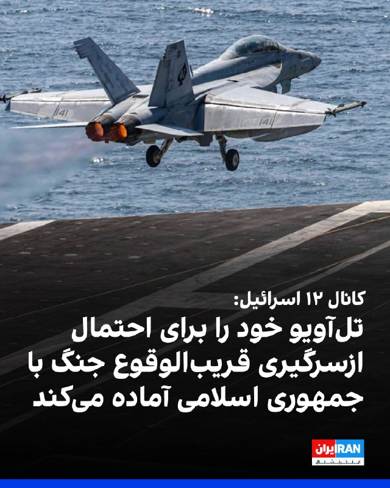
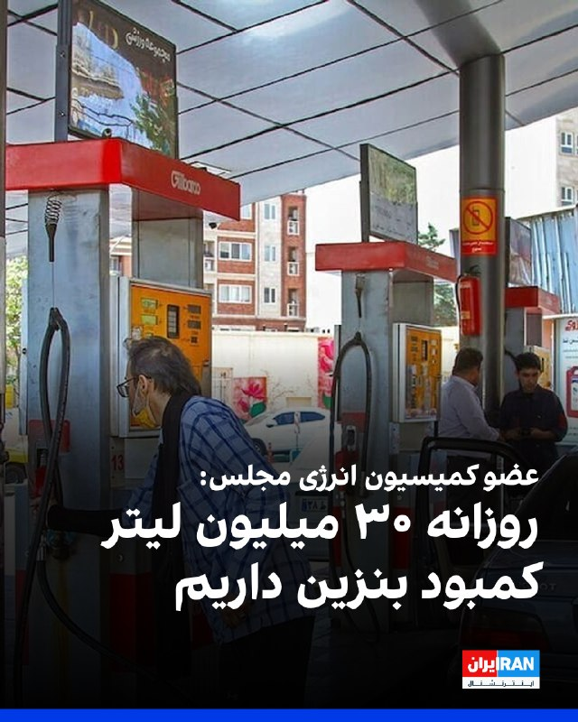
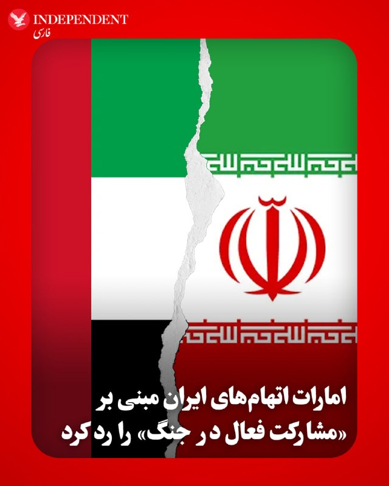
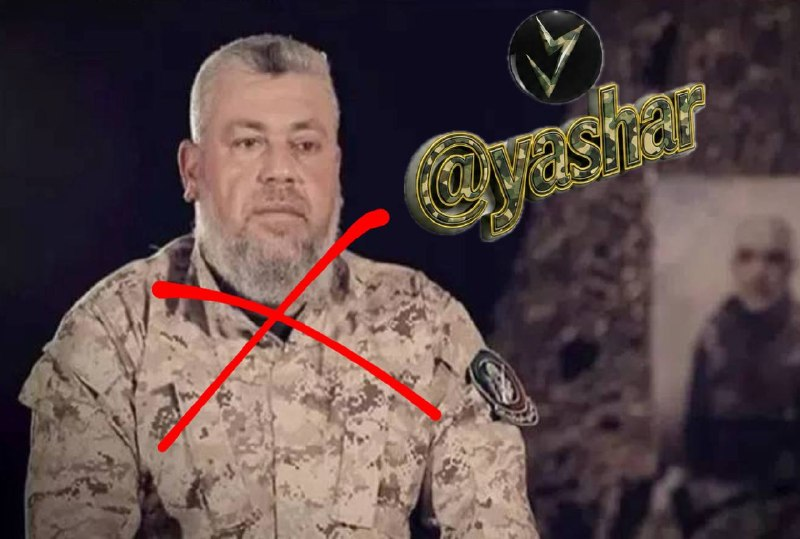
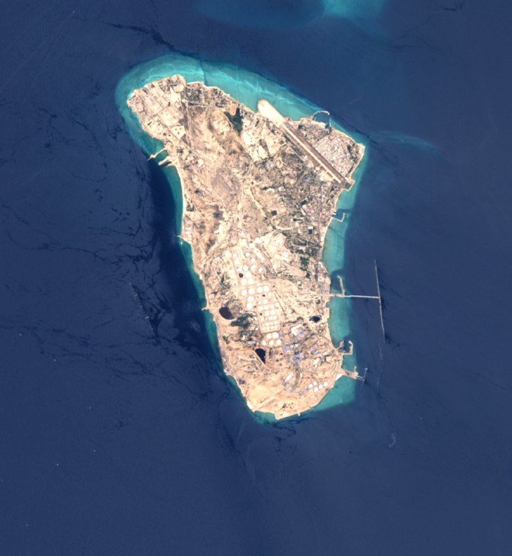
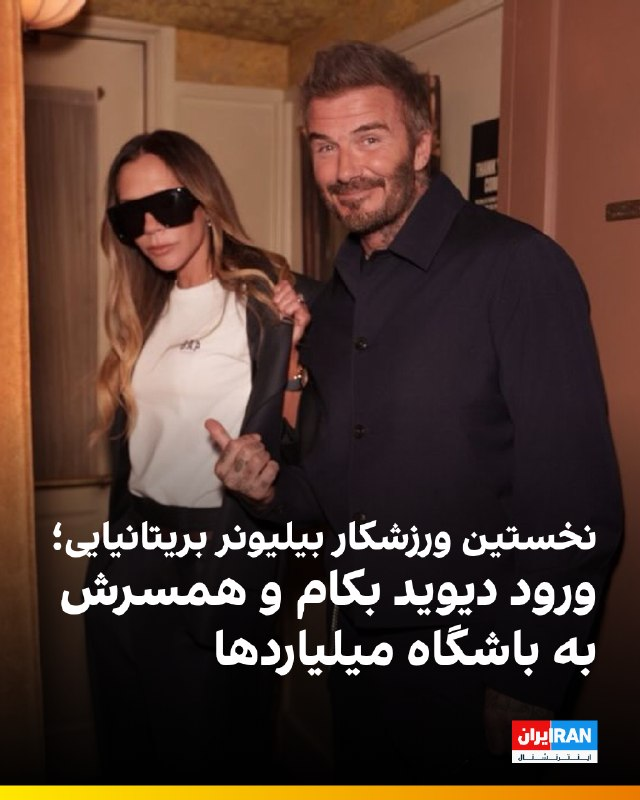
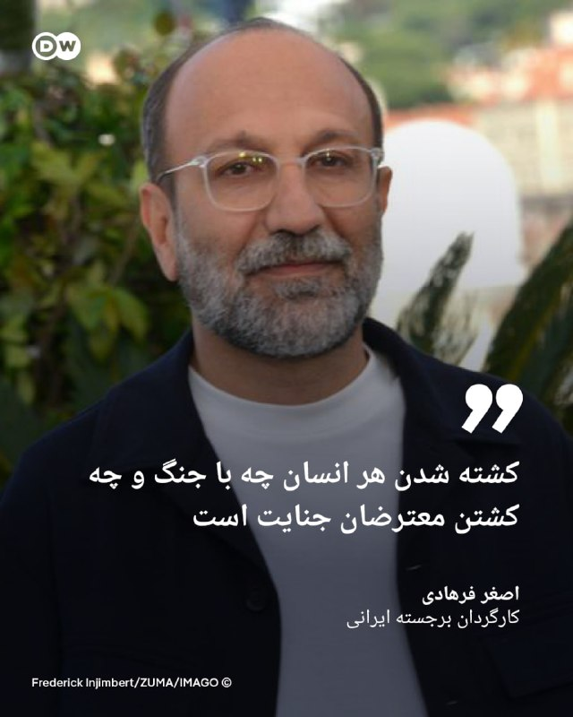
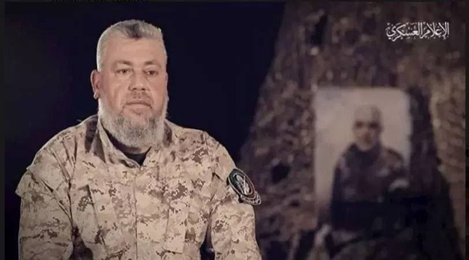
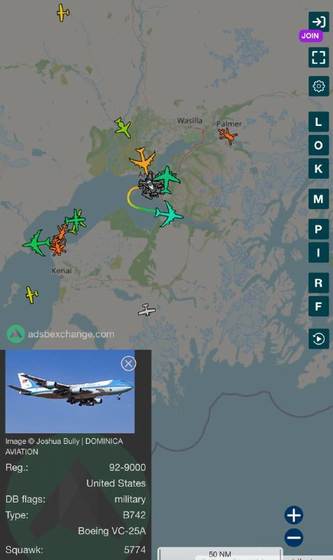

# خواننده تلگرام

<!-- TOP_NAV START -->

<a href="https://github.com/hhdoust2/aio-downloader/blob/main/telegram/content/archive_1.md" style="display:inline-block; padding:6px 12px; margin:0 4px; background-color:#2ea44f; color:white; text-decoration:none; border-radius:4px; font-weight:bold;">صفحه بعد</a>

<!-- TOP_NAV END -->

<!-- MSG START -->

---
📅 بروزرسانی: 1405/02/25 21:39
---

## VahidOOnLine — post 240359

  <a href="telegram/content/VahidOOnLine_240359_1778868549.mp4" target="_blank">🎬 Download video</a>

یکی از مخاطبان ایران‌اینترنشنال می‌گوید به اختلال دوقطبی مبتلاست و افزایش قیمت و کمبود داروهای اعصاب و روان نگرانی جدی برای او ایجاد کرده است. او تاکید می‌کند این وضعیت روند درمانش را تحت تأثیر قرار داده است.

بازخوانی این پیام و ساخت تصویر برای آن با هوش مصنوعی انجام گرفته است.
‌🏁 🇬🇧 IranintlTV

🤖 @VahidOOnLine

## VahidOOnLine — post 240358

  

یک مقام ارشد اسرائیلی به کانال ۱۲ گفت تل‌آویو خود را برای احتمال ازسرگیری قریب‌الوقوع جنگ با جمهوری اسلامی آماده می‌کند.
او با اشاره به روند مذاکرات تهران و واشینگتن گفت: «آمریکایی‌ها به این نتیجه رسیده‌اند که مذاکرات به جایی نمی‌رسد.»

پیش‌تر یسرائیل کاتز، وزیر دفاع اسرائیل گفته بود ماموریت ارتش این کشور درباره ایران کامل نشده و برای این احتمال آماده است که شاید دوباره ناچار به اقدام شود.
‌🏁 🇬🇧 IranintlTV

🤖 @VahidOOnLine

## VahidOOnLine — post 240357

  <a href="telegram/content/VahidOOnLine_240357_1778868552.mp4" target="_blank">🎬 Download video</a>

اداره تحقیقات فدرال آمریکا، اف‌بی‌آی، اعلام کرد برای اطلاعاتی که به بازداشت و محکومیت مونیکا ویت، افسر و مأمور سابق ضدجاسوسی ارتش آمریکا متهم به جاسوسی برای جمهوری اسلامی، منجر شود ۲۰۰ هزار دلار جایزه تعیین کرده است.

دفتر اف‌بی‌آی در واشنگتن اعلام کرد مونیکا ویت با وجود صدور کیفرخواست در سال ۲۰۱۹ همچنان متواری است.

او به اتهام جاسوسی و انتقال اطلاعات مرتبط با دفاع ملی آمریکا به ایران تحت پیگرد قرار دارد.

ویت بین سال‌های ۱۹۹۷ تا ۲۰۰۸ در نیروی هوایی آمریکا و دفتر تحقیقات ویژه این نیرو فعالیت می‌کرد و سپس تا سال ۲۰۱۰ به‌عنوان پیمانکار با دولت آمریکا همکاری داشت.

اف‌بی‌آی اعلام کرد او در دوران فعالیت خود به اطلاعات فوق‌محرمانه، از جمله هویت واقعی مأموران مخفی جامعه اطلاعاتی آمریکا، دسترسی داشته است.

بر اساس این بیانیه، ویت در سال ۲۰۱۳ به ایران پناهنده شد و سپس اطلاعات حساسی را در اختیار جمهوری اسلامی قرار داد که برنامه‌های محرمانه آمریکا و امنیت کارکنان آمریکایی را به خطر انداخت.

سی‌ان‌ان پیش‌تر گزارش داده بود مقام‌های آمریکایی معتقدند جمهوری اسلامی او را جذب کرده و ویت پس از فرار به ایران، هویت یک مأمور اطلاعاتی آمریکا و جزئیات یک برنامه فوق‌محرمانه اطلاعاتی را افشا کرده است.

کیفرخواست این پرونده همچنین نام چهار شهروند ایرانی را در ارتباط با اتهام‌هایی از جمله توطئه، تلاش برای هک رایانه‌ای و سرقت هویت ذکر کرده است.
‌🏁 🇬🇧 ManotoTV

🤖 @VahidOOnLine

## VahidOOnLine — post 240356

  <a href="telegram/content/VahidOOnLine_240356_1778868553.mp4" target="_blank">🎬 Download video</a>

ما صدای فاطمه سپهری هستیم
‌🏁 🇬🇧 ManotoTV

🤖 @VahidOOnLine

## VahidOOnLine — post 240355

  

بنیامین نتانیاهو، نخست‌وزیر و یسرائیل کاتز، وزیر دفاع اسرائیل در بیانیه‌ای اعلام کردند ارتش این کشور، عزالدین حداد، فرمانده شاخه نظامی حماس، را در یک حمله هوایی هدف قرار داده است.
عزالدین حداد، از فرماندهان ارشد گردان‌های عزالدین قسام، شاخه نظامی حماس است.
‌🏁 🇬🇧 IranintlTV

🤖 @VahidOOnLine

## VahidOOnLine — post 240354

  <a href="telegram/content/VahidOOnLine_240354_1778868556.mp4" target="_blank">🎬 Download video</a>

♦️دونالد ترامپ رئیس جمهوری ایالات متحده پیش از ترک چین به محل اقامت رهبر حزب کمونیست رفت و از آنجا دیدن کرد

محل اقامت رهبر حزب کمونیست معمولاً در یک مجموعه تاریخی و دولتی با معماری رسمی و کلاسیک قرار دارد که در دوره‌های گذشته ساخته شده و در طول سال‌ها بازسازی و تقویت شده است؛ این ساختمان‌ها اغلب قدمتی چند ده‌ساله دارند و با ترکیبی از طراحی سنتی و امکانات مدرن، هم‌زمان کاربری اداری و امنیتی دارند و به‌عنوان یکی از مهم‌ترین مراکز تصمیم‌گیری سیاسی کشور شناخته می‌شود.
‌🇸🇦 Indypersian

🤖 @VahidOOnLine

## VahidOOnLine — post 240353

  

رضا سپهوند، عضو کمیسیون انرژی مجلس گفت: «روزانه ۳۰ میلیون لیتر کمبود بنزین داریم و چون در کوتاه‌مدت امکان افزایش تولید وجود ندارد، باید مدیریت مصرف سوخت را جدی گرفت.»

او ادامه داد: «تولید روزانه بنزین در ایران ۱۰۵ میلیون لیتر و مصرف ۱۳۵ میلیون لیتر است.»

این نماینده مجلس افزود: «بخشی از تولید بنزین به دلیل بمباران در جنگ کاهش یافته و همچنین واردات کمتر شده است.»
‌🏁 🇬🇧 IranintlTV

🤖 @VahidOOnLine

## VahidOOnLine — post 240352

  <a href="telegram/content/VahidOOnLine_240352_1778868559.mp4" target="_blank">🎬 Download video</a>

یک شهروند با ارسال ویدیویی خریدهای خود را نشان می‌دهد و با اشاره به افزایش قیمت می‌گوید که برای یک شیر و چند قلم کالای دیگر ۴۵۰ هزار تومان پرداخت کرده است.
‌🏁 🇬🇧 IranintlTV

🤖 @VahidOOnLine

## VahidOOnLine — post 240351

  

♦️ امارات متحده عربی روز جمعه ۲۵ اردیبهشت، با رد اتهام‌های مطرح شده از سوی تهران مبنی بر «مشارکت فعال» این کشور در جنگ، این اظهارات را «تلاشی برای توجیه حملات تروریستی ایران» دانست.

خلیفه بن شاهین المرر، وزیر مشاور در امور خارجه امارات، در بیانیه‌ای اعلام کرد که کشورش «تلاش‌های ایران برای توجیه حملات تروریستی هدفمند علیه امارات» و دیگر کشورها را به شدت رد می‌کند.

پیش از این در روز جمعه، عباس عراقچی، وزیر امور خارجه جمهوری اسلامی، بار دیگر با تکرار مواضع تهران علیه امارات، گفته بود که این کشور در طول جنگ «در کنار ایالات متحده و اسرائیل» ایستاده و «حریم هوایی، خاک، امکانات و خدمات لجستیکی خود را در اختیار نیروهای آمریکایی قرار داده است.»

تنش دیپلماتیک میان تهران و ابوظبی، در روزهای اخیر و با انتشار گزارش سفر محرمانه بنیامین نتانیاهو به امارات و نیز گزارش حمله مستقیم امارات به خاک ایران، شدت گرفته است. امارات سفر نتانیاهو به این کشور را تکذیب کرده است.
‌🇸🇦 Indypersian

🤖 @VahidOOnLine

## VahidOOnLine — post 240350

  

تام کاتن، سناتور جمهوری‌خواه، طرحی با عنوان «قانون عدم پناه امن برای خانواده تروریست‌ها» معرفی کرده است که هدف آن لغو ویزاهای فعلی و جلوگیری از صدور ویزای جدید برای اعضای نزدیک خانواده افراد مرتبط با تروریسم است.

این اقدام پس از آن مطرح شد که گزارش‌ها نشان داد دو تن از بستگان قاسم سلیمانی، فرمانده پیشین نیروی قدس سپاه، به‌صورت قانونی در ایالات متحده زندگی می‌کردند.

بر اساس اعلام وزارت امنیت داخلی آمریکا، حمیده سلیمانی افشار ۴۷ ساله و سارینا سادات حسینی ۲۵ ساله، که به‌ترتیب خواهرزاده و نوه‌خواهرزاده قاسم سلیمانی هستند، در ماه آوریل بازداشت شدند. این وزارتخانه اعلام کرد هر دو نفر در سال ۲۰۱۹ از سوی قضات مهاجرت آمریکا پناهندگی دریافت کرده بودند.

به گفته وزارت امنیت داخلی آمریکا، حمیده سلیمانی افشار با وجود دریافت گرین‌کارت از طریق پناهندگی، در درخواست تابعیت خود در ژوئیه ۲۰۲۵ اعلام کرده بود که دست‌کم چهار بار پس از دریافت اقامت دائم به ایران سفر کرده است.
‌🏁 🇬🇧 IranintlTV

🤖 @VahidOOnLine

## VahidOOnLine — post 240349

  

♦️ سی‌بی‌اس نیوز به نقل از یکی از مقامات وزارت امور خارجه آمریکا، گزارش داد که دور جدید مذاکرات میان اسرائیل و لبنان صبح روز جمعه ۲۵ اردیبهشت برای دومین روز متوالی از سر گرفته شد. این دور از گفتگوها بدون حضور مقام‌های ارشد و میان سفیران دو کشور و با حضور نمایندگانی از وزارت امور خارجه آمریکا انجام می‌شود.

این دور از گفتگوها که از روز پنجشنبه در واشنگتن آغاز شده، سومین مرحله از مذاکرات دو کشور است و تنها چند روز پیش از پایان مهلت آتش‌بس انجام می‌شود. آتش‌بس فعلی که از ۱۷ آوریل (۲۸ فروردین) آغاز شده بود، تا روز یکشنبه ادامه خواهد داشت.

یک مقام ارشد وزارت امور خارجه در گفتگو با شبکه سی‌بی‌اس، مذاکرات روز پنجشنبه را که از ساعت ۹ صبح تا ۵ بعدازظهر به طول انجامید، «سازنده» و «مثبت» ارزیابی کرد. این گفتگوها در حالی دنبال می‌شود که دو طرف برای دستیابی به توافقی پایدار پیش از انقضای مهلت آتش‌بس تحت فشار هستند.
‌🇸🇦 Indypersian

🤖 @VahidOOnLine

## VahidOOnLine — post 240348

  <a href="telegram/content/VahidOOnLine_240348_1778868564.mp4" target="_blank">🎬 Download video</a>

«صدای فاطمه سپهری و همه زندانیان سیاسی باشیم»
‌🏁 🇬🇧 ManotoTV

🤖 @VahidOOnLine

## VahidOOnLine — post 240347

  <a href="telegram/content/VahidOOnLine_240347_1778868566.mp4" target="_blank">🎬 Download video</a>

دونالد ترامپ در گفت‌وگو با برت بایر، خبرنگار و مجری فاکس‌نیوز از عملکرد آمریکا در جنگ با جمهوری اسلامی دفاع کرد و گفت واشینگتن با وجود توانایی نابودی کامل زیرساخت‌های ایران، خویشتنداری نشان داده است.

ترامپ در پاسخ به منتقدانی که می‌گویند او وضعیت جنگ را دست‌کم گرفته، گفت: «من هیچ چیزی را دست‌کم نگرفتم. ما ضربه‌ای فوق‌العاده سنگین به آن‌ها زدیم.»

رئیس‌جمهوری آمریکا افزود: «ما پل‌هایشان را باقی گذاشتیم. ظرفیت برقشان را باقی گذاشتیم. می‌توانیم همه آن را ظرف دو روز نابود کنیم. همه‌چیز.»

ترامپ همچنین گفت آمریکا جز بخش مربوط به شیرهای خروج نفت، جزیره خارگ را هدف قرار داده است.
‌🏁 🇬🇧 ManotoTV

🤖 @VahidOOnLine

## VahidOOnLine — post 240346

  <a href="telegram/content/VahidOOnLine_240346_1778868568.mp4" target="_blank">🎬 Download video</a>

«شما هم به کمپین حمایت از خانم سپهری بپیوندید»
‌🏁 🇬🇧 ManotoTV

🤖 @VahidOOnLine

## WithYashar — post 11320

شاهزاده رضا پهلوی : هم‌میهنان عزیزم،

در روزهایی که شما با شجاعت در برابر رژیم اشغالگر ایران ایستاده‌اید، این نظام منفور و منزوی، همچنان به تجاوز به جان و مال مردم ادامه می‌دهد تا سرنگونی حتمی خود را اندکی به تعویق اندازد. در چنین شرایطی، وظیفه خود می‌دانم که تصویر عدالت در فردای ایران را برای کسانی که با جنایتکاران همکاری کنند، روشن‌تر ترسیم کنم.

در این راستا، از «کمیته‌ تدوین مقررات عدالت انتقالی ایران» خواستم درباره‌ دو موضوع مهم، نظر مشورتی خود را ارائه کند: نخست، موضوع مسئولیت کیفری افرادی که با ساختارهای سرکوبگر جمهوری اسلامی همکاری می‌کنند؛ و دوم، موضوع مصادره‌ اموال معترضان و خانواده‌های آنان.
@withyashar
این کمیته اکنون نخستین نظر مشورتی خود را صادر کرده و پیام آن روشن است: این اقدامات، همکاری‌های ساده یا بی‌اهمیت نیستند؛ بلکه «یاری‌رسانی به جنایت علیه بشریت» محسوب می‌شوند. هیچ مقام، هیچ دستور و هیچ بهانه‌ای نمی‌تواند مسئولیت کیفری فردی را از میان ببرد. بنابراین، هر فردی که آگاهانه و داوطلبانه با ساختارهای سرکوبگر رژیم همکاری کند، چه در داخل و چه در خارج از ایران، باید بداند که در معرض مسئولیت کیفری قرار خواهد گرفت:

خواه این همکاری از نوع گزارش‌دهی یا خبرچینی باشد؛
خواه از نوع مشارکت در ایست‌های بازرسی‌ باشد؛
خواه از نوع به‌کارگیری کودکان و نوجوانان در سرکوب معترضان باشد؛
و خواه از نوع تحصیل، انتقال یا خرید و فروش اموالی باشد که در جریان سرکوب از معترضان و خانواده‌های آنان مصادره شده‌ است.
@withyashar
از این رو، نه‌تنها افرادی که در صدور دستور، اجرای آن، یا تسهیل این مصادره‌ها نقش دارند در معرض مسئولیت قرار خواهند گرفت، بلکه کسانی که آگاهانه و داوطلبانه به خرید و فروش این اموال می‌پردازند نیز باید پاسخگو باشند. این مسئولیت، استفاده از اموال یا دارایی‌های آنان برای جبران خسارت واردشده به مالکان اصلی را نیز شامل می‌‌شود.

بنابراین، به همه‌ کسانی که امروز در صدد همکاری با دستگاه سرکوب رژیم هستند هشدار می‌دهم: پیش از آن‌که دست به اقدامی بزنید که به مردم ایران آسیب جانی، مالی و یا اجتماعی برساند، به آینده‌ خود و خانواده‌تان بیندیشید. به آن روز بیندیشید که ایران آزاد خواهد شد؛ روزی که حقیقت پنهان نخواهد ماند؛ روزی که اسامی آشکار خواهد شد؛ روزی که هیچ متجاوز و جنایتکاری از پاسخ‌گویی در برابر قانون در امان نخواهد ماند.

آن روز، ملت ایران حکومتی خواهد داشت که حقوق ایرانیان را محترم می‌دارد و ایران را به سرزمینی آزاد و آباد بدل می‌کند.

پاینده ایران،
رضا پهلوی
@withyashar

## WithYashar — post 11319

## WithYashar — post 11318

سازمان سازمان مجاهدین خلق ایران (که در آمریکا با نام‌های MEK یا PMOI شناخته می‌شود) به‌صورت رسمی در تاریخ ۲۸ سپتامبر ۲۰۱۲ از فهرست «سازمان‌های تروریستی خارجی» وزارت خارجه آمریکا خارج شد. این تصمیم توسط وزارت خارجه دولت هیلاری کلینتون اعلام شد و همان روز اجرایی گردید
@withyashar

## WithYashar — post 11317

## WithYashar — post 11316

یاشار مجاهدین الان دارن از کجا تغذیه میشن؟

## WithYashar — post 11315

## WithYashar — post 11314

آخرین فیلم مخفی وحید بنی عامریان، نخبه ریاضی در زندان اوین که از دفاعیه اش در مقابل بیدادگاه آخوندی می گوید. وحید روز 15 فروردین 1405 اعدام شد @withyashar

## WithYashar — post 11313

## WithYashar — post 11312

یاشار مجاهدین خیلی دارن به دانشجو های داخل ایران پیام میدن، واسه خودم تا الان از دو نفر مختلف پیش اومده، شروع میکنن به توضیح تاریخچه خودشون و همه چیزای خوب رو هم میچسبونن به خودشون و فلان
نمیدونم چه پروژه ای راه انداختن ولی از طریق

## WithYashar — post 11311

## WithYashar — post 11310

  

نخست‌وزیر و وزیر دفاع اسرائیل در بیانیه‌ای اعلام کردند ارتش این کشور عزالدین حداد، فرمانده شاخه نظامی حماس، را در یک حمله هوایی هدف قرار داده

@withyashar

## WithYashar — post 11309

## WithYashar — post 11308

## WithYashar — post 11307

امریکا زمانی حمله میکنه که کسی منتظر نیس.

## WithYashar — post 11306

## WithYashar — post 11305

  <a href="telegram/content/WithYashar_11305_1778868570.mp4" target="_blank">🎬 Download video</a>

🎬 Video

## WithYashar — post 11304

## WithYashar — post 11303

کانال ۱۳ اسرائیل:

سیستم امنیتی معتقد است که ترامپ با حمله‌ای محدود به ایران موافقت خواهد کرد.
@withyashar

## WithYashar — post 11302

## WithYashar — post 11301

یاشار بیا مثل سیاه جامگان یا حسن صباح یه فرقه راه بنداز 😅

## mwarmonitor — post 9142

🔴فایننشال تایمز (گزارش اختصاصی):
یک گروه مالی که با خانواده دونالد ترامپ ارتباط دارد، یک شرکت با هدف خاص (SPV) ایجاد کرده است که قصد دارد ۲۰۰ میلیون دلار سرمایه جذب کند تا یک کسب‌وکار در ونزوئلا را خریداری کند.

@mwarmonitor

## mwarmonitor — post 9141

  

🛰تصاویر ماهواره‌ای Landsat-8 وضعیت ترمینال‌های جزیره خارگ امروز: خالی. هیچ نفتکشی برای بارگیری نفت خام وجود ندارد .

@mwarmonitor

## mwarmonitor — post 9140

🔴این یک پرونده مهم است—یک «گنجینه اطلاعاتی» و یک دستاورد بزرگ برای نیروهای مجری قانون. یکی از فرماندهان گروه کتائب حزب‌الله وابسته به ایران به نام محمد باقر سعد داوود الساعدی بازداشت شده و قرار است امروز در دادگاه فدرال حاضر شود. او به طراحی حمله به اهداف یهودی در آمریکا، از جمله یک کنیسه در نیویورک، متهم است.

🔸در «شکایت کیفری» که روز جمعه از حالت محرمانه خارج شد، این فرمانده متهم شده که از اواخر فوریه حداقل ۱۸ حمله در اروپا و کانادا را برنامه‌ریزی کرده است؛ حملاتی که گفته می‌شود در واکنش به اقدامات آمریکا و اسرائیل علیه ایران بوده‌اند.

🔸نکته قابل توجه این است که گفته می‌شود تهران اکنون از گروه کتائب حزب‌الله عراق برای طراحی حملات تروریستی در خارج از کشور، از جمله در آمریکا و سراسر اروپا، استفاده می‌کند. به طور سنتی، این گروه بیشتر در عراق و منطقه فعال بوده و در آنجا حملاتی انجام می‌داده است. نیویورک تایمز

@mwarmonitor

## mwarmonitor — post 9139

🛰تصاویر ماهواره‌ای نشان می‌دهد که مرکز تحقیقاتی شهید میثمی ، واقع در غرب تهران، نزدیک کرج، در مارس ۲۰۲۶ دو بار هدف حمله قرار گرفته است.

📍این سایت پیش‌تر نیز در ژوئن ۲۰۲۵ به‌شدت مورد حمله قرار گرفته بود؛ حمله‌ای که اسرائیل آن را به برنامه توسعه سلاح‌های شیمیایی و بیولوژیکی ایران مرتبط دانسته بود، اما همچنین گفته شده بود که این مرکز تجهیزات مرتبط با سلاح‌های هسته‌ای را نیز در خود داشته است.

📌تصاویر مربوط به ۱۴ مارس ۲۰۲۶ نشان می‌دهد که در حمله اول مارس، چندین ساختمان پشتیبانی عملیاتی و همچنین محل‌های اقامت کارکنان رده‌بالا هدف قرار گرفته‌اند.

🔸سپس در یا پیش از ۲۴ مارس ۲۰۲۶، تصاویر نشان می‌دهد که حمله دوم انجام شده و یک تأسیسات احتمالی تولید مواد شیمیایی در بخش جنوبی مجموعه و همچنین چندین ساختمان دیگر مربوط به اقامت پرسنل نابود شده‌اند.

🔹تاکنون اطلاعات جدیدی از سوی ارتش اسرائیل (IDF) درباره دلیل این حملات منتشر نشده است، اما فعالیت‌های اخیر در این سایت می‌تواند یکی از دلایل باشد. پس از حملات ژوئن، فعالیت‌های گسترده پاک‌سازی و جمع‌آوری آوار در برخی ساختمان‌های تخریب‌شده مشاهده شد که احتمالاً مقدمه‌ای برای بازسازی بوده است. در واقع، یک ساختمان کوچک که در مارس ۲۰۲۶ تخریب شد، تنها چند ماه قبل از آن (پس از نوامبر ۲۰۲۵) در محل یک ساختمان تخریب‌شده در ژوئن ساخته شده بود.

🗂در گزارشی که در سپتامبر ۲۰۲۵ به شورای امنیت سازمان ملل ارائه شد، اسرائیل اعلام کرده بود:
«این سایت شامل مقدار زیادی تجهیزات متالورژی بوده که به مرکز مواد پیشرفته تحت گروه شهید میثمی، شاخه شیمی SPND، تعلق داشته است. این تجهیزات می‌توانند با تغییراتی در فرآیند متالورژی برای ساخت هسته شکافت‌پذیر به کار روند.»

📂همچنین در این گزارش آمده است که سایت شهید میثمی «یکی از مراکز اصلی برنامه سلاح‌های شیمیایی و بیولوژیکی ایران بوده که برای تحقیق و توسعه مواد شیمیایی مبتنی بر داروها مورد استفاده قرار می‌گرفته است.»

@mwarmonitor

## mwarmonitor — post 9138

  

🇮🇱اسرائیل اعلام کرد که در نوار غزه یک حمله انجام داده که هدف آن عزالدین الحداد، رئیس شاخه نظامی حماس بوده است. اسرائیل او را یکی از طراحان حمله ۷ اکتبر معرفی کرده است. 🇮🇱بنیامین نتانیاهو، نخست‌وزیر، و اسرائیل کاتس، وزیر دفاع، اعلام کردند که اسرائیل «به اقدامات…

## mwarmonitor — post 9137

  

🇮🇱اسرائیل اعلام کرد که در نوار غزه یک حمله انجام داده که هدف آن عزالدین الحداد، رئیس شاخه نظامی حماس بوده است. اسرائیل او را یکی از طراحان حمله ۷ اکتبر معرفی کرده است.

🇮🇱بنیامین نتانیاهو، نخست‌وزیر، و اسرائیل کاتس، وزیر دفاع، اعلام کردند که اسرائیل «به اقدامات خود علیه همه افراد دخیل ادامه خواهد داد».

@mwarmonitor

## mwarmonitor — post 9136

  

✈️ هم‌اکنون یک فروند هواپیمای Boeing E-3B Sentry در حال گشت زنی برفراز خلیج فارس

@mwarmonitor

## FoxNewsTwitter — post 341790

  <a href="telegram/content/FoxNewsTwitter_341790_1778868576.mp4" target="_blank">🎬 Download video</a>

Fox News (Twitter/X)

WATCH: Vice President JD Vance delivers a powerful tribute at the 45th Annual National Peace Officers' Memorial Service on Capitol Hill, honoring the "selflessness" of fallen heroes.

Addressing the families and colleagues of the fallen, Vance characterized the life of a peace officer as one defined by an unwavering sense of duty.

"We gather this afternoon to honor men and women who heard the exact same call, men and women whose selflessness led them toward danger when others fled. People who said, send me, not send somebody else, but send me. People whom service was a way of life, not a burden."

## FoxNewsTwitter — post 341789

  <a href="telegram/content/FoxNewsTwitter_341789_1778868579.mp4" target="_blank">🎬 Download video</a>

Fox News (Twitter/X)

RT @SpecialReport: TONIGHT at 6 PM ET: @BretBaier sits down with @POTUS for a full interview on @FoxNews during #SpecialReport. Watch live. #Trump #Interview

## FoxNewsTwitter — post 341788

  <a href="telegram/content/FoxNewsTwitter_341788_1778868581.mp4" target="_blank">🎬 Download video</a>

Fox News (Twitter/X)

BREAKING: U.S. Attorney Jeanine Pirro announces a major crackdown on parents who let their children take part in teen takeovers that have been causing chaos throughout Washington, D.C.

Pirro vows to prosecute parents who fail to supervise their children, threatening the adults with fines and even jail times.

"If the evidence shows the parent knew or should have known or permitted or failed to prevent participation, we're going to charge them."

"If you drop your kid off and you fail to supervise them, or you let them skip school to join the chaos, you are going to face fines, court ordered classes, and possible jail time"

## pm_afshaa — post 90805

  <a href="telegram/content/pm_afshaa_90805_1778868584.mp4" target="_blank">🎬 Download video</a>

هم‌میهنان عزیزم،

در روزهایی که شما با شجاعت در برابر رژیم اشغالگر ایران ایستاده‌اید، این نظام منفور و منزوی، همچنان به تجاوز به جان و مال مردم ادامه می‌دهد تا سرنگونی حتمی خود را اندکی به تعویق اندازد. در چنین شرایطی، وظیفه خود می‌دانم که تصویر عدالت در فردای ایران را برای کسانی که با جنایتکاران همکاری کنند، روشن‌تر ترسیم کنم.

در این راستا، از «کمیته‌ تدوین مقررات عدالت انتقالی ایران» خواستم درباره‌ دو موضوع مهم، نظر مشورتی خود را ارائه کند: نخست، موضوع مسئولیت کیفری افرادی که با ساختارهای سرکوبگر جمهوری اسلامی همکاری می‌کنند؛ و دوم، موضوع مصادره‌ اموال معترضان و خانواده‌های آنان.

این کمیته اکنون نخستین نظر مشورتی خود را صادر کرده و پیام آن روشن است: این اقدامات، همکاری‌های ساده یا بی‌اهمیت نیستند؛ بلکه «یاری‌رسانی به جنایت علیه بشریت» محسوب می‌شوند. هیچ مقام، هیچ دستور و هیچ بهانه‌ای نمی‌تواند مسئولیت کیفری فردی را از میان ببرد. بنابراین، هر فردی که آگاهانه و داوطلبانه با ساختارهای سرکوبگر رژیم همکاری کند، چه در داخل و چه در خارج از ایران، باید بداند که در معرض مسئولیت کیفری قرار خواهد گرفت:

خواه این همکاری از نوع گزارش‌دهی یا خبرچینی باشد؛
خواه از نوع مشارکت در ایست‌های بازرسی‌ باشد؛
خواه از نوع به‌کارگیری کودکان و نوجوانان در سرکوب معترضان باشد؛
و خواه از نوع تحصیل، انتقال یا خرید و فروش اموالی باشد که در جریان سرکوب از معترضان و خانواده‌های آنان مصادره شده‌ است.

از این رو، نه‌تنها افرادی که در صدور دستور، اجرای آن، یا تسهیل این مصادره‌ها نقش دارند در معرض مسئولیت قرار خواهند گرفت، بلکه کسانی که آگاهانه و داوطلبانه به خرید و فروش این اموال می‌پردازند نیز باید پاسخگو باشند. این مسئولیت، استفاده از اموال یا دارایی‌های آنان برای جبران خسارت واردشده به مالکان اصلی را نیز شامل می‌‌شود.

بنابراین، به همه‌ کسانی که امروز در صدد همکاری با دستگاه سرکوب رژیم هستند هشدار می‌دهم: پیش از آن‌که دست به اقدامی بزنید که به مردم ایران آسیب جانی، مالی و یا اجتماعی برساند، به آینده‌ خود و خانواده‌تان بیندیشید. به آن روز بیندیشید که ایران آزاد خواهد شد؛ روزی که حقیقت پنهان نخواهد ماند؛ روزی که اسامی آشکار خواهد شد؛ روزی که هیچ متجاوز و جنایتکاری از پاسخ‌گویی در برابر قانون در امان نخواهد ماند.

آن روز، ملت ایران حکومتی خواهد داشت که حقوق ایرانیان را محترم می‌دارد و ایران را به سرزمینی آزاد و آباد بدل می‌کند.

پاینده ایران،
رضا پهلوی
-----------------------------
متن کامل نظر مشورتی «کمیته‌ تدوین مقررات عدالت انتقالی ایران»:

https://iranopasmigirim.com/fa/transitional-justice

@OfficialRezaPahlavi

## pm_afshaa — post 90804

🔴نخست‌وزیر و وزیر دفاع اسرائیل در بیانیه‌ای اعلام کردند ارتش اسراییل عزالدین حداد، فرمانده شاخه نظامی حماس، را در یک حمله هوایی هدف قرار داده 
💧 Rainbet.com the #1 Non-KYC Crypto Casino & Sportsbook @rainbetcom 
😁 @Pm_Afshaa

## pm_afshaa — post 90803

🔴کانال 13 اسرائیل: سیستم امنیتی معتقد است که ترامپ با حمله‌ای محدود به ایران موافقت خواهد کرد

💧 Rainbet.com the #1 Non-KYC Crypto Casino & Sportsbook @rainbetcom

😁 @Pm_Afshaa

## pm_afshaa — post 90802

🔴نخست‌وزیر و وزیر دفاع اسرائیل در بیانیه‌ای اعلام کردند ارتش اسراییل عزالدین حداد، فرمانده شاخه نظامی حماس، را در یک حمله هوایی هدف قرار داده

💧 Rainbet.com the #1 Non-KYC Crypto Casino & Sportsbook @rainbetcom

😁 @Pm_Afshaa

## pm_afshaa — post 90801

🔴سفارت آمریکا در اسرائیل در حال بررسی صدور دستورالعمل برای خروج فوری شهروندان آمریکایی از تل‌آویو است

💧 Rainbet.com the #1 Non-KYC Crypto Casino & Sportsbook @rainbetcom

😁 @Pm_Afshaa

## pm_afshaa — post 90800

🔴مارکو روبیو: اگر جمهوری اسلامی تصور می‌کند که ما برای رسیدن به یک توافق امتیازاتی خواهيم داد، سخت در اشتباه است؛ تحت هیچ شرایطی یک توافق بد با ایران را نخواهیم پذیرفت

💧 Rainbet.com the #1 Non-KYC Crypto Casino & Sportsbook @rainbetcom

😁 @Pm_Afshaa

## pm_afshaa — post 90799

🔴طبق گزارش خبرنگاران آمریکایی، پیش از سوار شدن به «ایرفورس وان»، سرویس مخفی آمریکا تمام وسایل و هدایایی را که طرف چینی داده بود از جمله کارت‌ها، نشان‌ها، تلفن‌های موقت و اقلام هدیه جمع کردند و داخل سطل زباله انداختند و اجازه ندادند چیزی از چین وارد هواپیما شود

💧 Rainbet.com the #1 Non-KYC Crypto Casino & Sportsbook @rainbetcom

😁 @Pm_Afshaa

## DEJradio — post 4653

  <a href="telegram/content/DEJradio_4653_1778868586.mp4" target="_blank">🎬 Download video</a>

هم‌میهنان عزیزم،

در روزهایی که شما با شجاعت در برابر رژیم اشغالگر ایران ایستاده‌اید، این نظام منفور و منزوی، همچنان به تجاوز به جان و مال مردم ادامه می‌دهد تا سرنگونی حتمی خود را اندکی به تعویق اندازد. در چنین شرایطی، وظیفه خود می‌دانم که تصویر عدالت در فردای ایران را برای کسانی که با جنایتکاران همکاری کنند، روشن‌تر ترسیم کنم.

در این راستا، از «کمیته‌ تدوین مقررات عدالت انتقالی ایران» خواستم درباره‌ دو موضوع مهم، نظر مشورتی خود را ارائه کند: نخست، موضوع مسئولیت کیفری افرادی که با ساختارهای سرکوبگر جمهوری اسلامی همکاری می‌کنند؛ و دوم، موضوع مصادره‌ اموال معترضان و خانواده‌های آنان.

این کمیته اکنون نخستین نظر مشورتی خود را صادر کرده و پیام آن روشن است: این اقدامات، همکاری‌های ساده یا بی‌اهمیت نیستند؛ بلکه «یاری‌رسانی به جنایت علیه بشریت» محسوب می‌شوند. هیچ مقام، هیچ دستور و هیچ بهانه‌ای نمی‌تواند مسئولیت کیفری فردی را از میان ببرد. بنابراین، هر فردی که آگاهانه و داوطلبانه با ساختارهای سرکوبگر رژیم همکاری کند، چه در داخل و چه در خارج از ایران، باید بداند که در معرض مسئولیت کیفری قرار خواهد گرفت:

خواه این همکاری از نوع گزارش‌دهی یا خبرچینی باشد؛
خواه از نوع مشارکت در ایست‌های بازرسی‌ باشد؛
خواه از نوع به‌کارگیری کودکان و نوجوانان در سرکوب معترضان باشد؛
و خواه از نوع تحصیل، انتقال یا خرید و فروش اموالی باشد که در جریان سرکوب از معترضان و خانواده‌های آنان مصادره شده‌ است.

از این رو، نه‌تنها افرادی که در صدور دستور، اجرای آن، یا تسهیل این مصادره‌ها نقش دارند در معرض مسئولیت قرار خواهند گرفت، بلکه کسانی که آگاهانه و داوطلبانه به خرید و فروش این اموال می‌پردازند نیز باید پاسخگو باشند. این مسئولیت، استفاده از اموال یا دارایی‌های آنان برای جبران خسارت واردشده به مالکان اصلی را نیز شامل می‌‌شود.

بنابراین، به همه‌ کسانی که امروز در صدد همکاری با دستگاه سرکوب رژیم هستند هشدار می‌دهم: پیش از آن‌که دست به اقدامی بزنید که به مردم ایران آسیب جانی، مالی و یا اجتماعی برساند، به آینده‌ خود و خانواده‌تان بیندیشید. به آن روز بیندیشید که ایران آزاد خواهد شد؛ روزی که حقیقت پنهان نخواهد ماند؛ روزی که اسامی آشکار خواهد شد؛ روزی که هیچ متجاوز و جنایتکاری از پاسخ‌گویی در برابر قانون در امان نخواهد ماند.

آن روز، ملت ایران حکومتی خواهد داشت که حقوق ایرانیان را محترم می‌دارد و ایران را به سرزمینی آزاد و آباد بدل می‌کند.

پاینده ایران،
رضا پهلوی
-----------------------------
متن کامل نظر مشورتی «کمیته‌ تدوین مقررات عدالت انتقالی ایران»:

https://iranopasmigirim.com/fa/transitional-justice

@OfficialRezaPahlavi

## VahidOnline — post 75486

کاوه مدنی: وضعیت دردآور جزیره مارو (شیدور) ملقب به «مالدیو ایران»
نشت نفت به #خلیج_فارس پس از حمله به تأسیسات نفتی جزیره لاوان در فروردین ماه عامل این فاجعه بود.
#جزیره_مارو
[با کیفیت بیشتر: ۶۰ مگابایت]
KavehMadani
برشی از سی‌ثانیه سوم ویدیوی بالا درباره وضعیت ساحل بیشتر مورد توجه قرار گرفته: AzamBahrami

📡 @VahidOnline

## kianmeli1 — post 87413

🔴شبکه 13 اسرائیل: ساختار امنیتی [در اسرائیل] بر این ارزیابی است که ترامپ با انجام حمله‌ای محدود به ایران موافقت خواهد کرد.
https://t.me/kianmeli1

## kianmeli1 — post 87412

  <a href="telegram/content/kianmeli1_87412_1778868587.mp4" target="_blank">🎬 Download video</a>

🔴دقایقی پیش فرمانده حماس کشته شد
‏
نخست‌وزیر و وزیر دفاع اسرائیل در بیانیه‌ای اعلام کردند ارتش این کشور عزالدین حداد، فرمانده شاخه نظامی حماس، را در یک حمله هوایی هدف قرار داده است
https://t.me/kianmeli1

## IranIntlTV — post 337362

  <a href="telegram/content/IranIntlTV_337362_1778868588.mp4" target="_blank">🎬 Download video</a>

یکی از مخاطبان ایران‌اینترنشنال می‌گوید به اختلال دوقطبی مبتلاست و افزایش قیمت و کمبود داروهای اعصاب و روان نگرانی جدی برای او ایجاد کرده است. او تاکید می‌کند این وضعیت روند درمانش را تحت تأثیر قرار داده است.

بازخوانی این پیام و ساخت تصویر برای آن با هوش مصنوعی انجام گرفته است.

## IranIntlTV — post 337361

  

یک مقام ارشد اسرائیلی به کانال ۱۲ گفت تل‌آویو خود را برای احتمال ازسرگیری قریب‌الوقوع جنگ با جمهوری اسلامی آماده می‌کند.
او با اشاره به روند مذاکرات تهران و واشینگتن گفت: «آمریکایی‌ها به این نتیجه رسیده‌اند که مذاکرات به جایی نمی‌رسد.»

پیش‌تر یسرائیل کاتز، وزیر دفاع اسرائیل گفته بود ماموریت ارتش این کشور درباره ایران کامل نشده و برای این احتمال آماده است که شاید دوباره ناچار به اقدام شود.
https://iranintl.com/202605150617

## IranIntlTV — post 337360

  

🔻ساندی تایمز گزارش داد دیوید بکام و همسرش ویکتوریا با دارایی یک میلیارد و ۱۸۵ میلیون پوندی در فهرست ثروتمندان ۲۰۲۶ این رسانه، به نخستین ورزشکار میلیارد پوندی بریتانیا تبدیل شده‌اند. کاپیتان پیشین تیم ملی فوتبال انگلستان پس از سرمایه‌گذاری‌های سودآور در آمریکا به این ثروت دست یافت.

🔹به نوشته ساندی تایمز، سرمایه‌گذاری هوشمندانه در فوتبال آمریکا، بکام را به این جایگاه رسانده است. پرداخت ۲۵ میلیون دلار برای دریافت حق راه‌اندازی باشگاه اینتر میامی ۱۲ سال پیش، بهترین سرمایه‌گذاری دوران ح

🔹امروز سهم او در این باشگاه حدود ۳۰۰ میلیون پوند ارزش دارد. افزایش ارزش باشگاه تا حدی به قرارداد جدید لیونل مسی نیز مربوط است؛ بکام نقش مهمی در تصمیم این ستاره آرژانتینی برای تمدید سه‌ساله قراردادش داشت.

🔹همچنین ثروت ویکتوریا بکام، ۵۲ ساله، نیز به دلیل موفقیت برند مد او افزایش یافته است. دیوید در سال‌های ابتدایی ۲۳ میلیون پوند در این برند سرمایه‌گذاری کرد و اکنون درآمد سالانه آن از ۱۰۰ میلیون پوند فراتر رفته است.

🔹جزییات بیشتر را در سایت بخوانید

@iranintltvsport

## IranIntlTV — post 337359

  

بنیامین نتانیاهو، نخست‌وزیر و یسرائیل کاتز، وزیر دفاع اسرائیل در بیانیه‌ای اعلام کردند ارتش این کشور، عزالدین حداد، فرمانده شاخه نظامی حماس، را در یک حمله هوایی هدف قرار داده است.
عزالدین حداد، از فرماندهان ارشد گردان‌های عزالدین قسام، شاخه نظامی حماس است.
https://iranintl.com/202605154092

## IranIntlTV — post 337358

  <a href="telegram/content/IranIntlTV_337358_1778868593.mp4" target="_blank">🎬 Download video</a>

دونالد ترامپ گفت: «من از کسی امتیاز درخواست نمی‌کنم، چون وقتی امتیاز بخواهی، باید خودت هم امتیاز بدهی و ما نیازی به این کار نداریم.»

او افزود: «در عمل، نیروهای نظامی ایران را از بین بردیم. شاید هنوز کمی عملیات تکمیلی لازم باشد، چون حدود یک ماه پیش آتش‌بس اعلام کردیم. اما محاصره بسیار موثری ایجاد شد و هدف اصلی هم همین بود.»
@iranintltv

## IranIntlTV — post 337357

  <a href="https://t.me/IranintlTV/337357" target="_blank">📎 Download file</a>

🎧نسخه صوتی اخبار شبانگاهی | جمعه ۲۵ شهریور
@iranintlTV

## IranIntlTV — post 337356

  

رضا سپهوند، عضو کمیسیون انرژی مجلس گفت: «روزانه ۳۰ میلیون لیتر کمبود بنزین داریم و چون در کوتاه‌مدت امکان افزایش تولید وجود ندارد، باید مدیریت مصرف سوخت را جدی گرفت.»

او ادامه داد: «تولید روزانه بنزین در ایران ۱۰۵ میلیون لیتر و مصرف ۱۳۵ میلیون لیتر است.»

این نماینده مجلس افزود: «بخشی از تولید بنزین به دلیل بمباران در جنگ کاهش یافته و همچنین واردات کمتر شده است.»
https://iranintl.com/202605158254

## IranIntlTV — post 337355

  <a href="telegram/content/IranIntlTV_337355_1778868597.mp4" target="_blank">🎬 Download video</a>

یک شهروند با ارسال ویدیویی خریدهای خود را نشان می‌دهد و با اشاره به افزایش قیمت می‌گوید که برای یک شیر و چند قلم کالای دیگر ۴۵۰ هزار تومان پرداخت کرده است.

## IranIntlTV — post 337354

در میانه تنش‌ها با تهران، ابوظبی روابط دفاعی و انرژی خود با هند را گسترش می‌دهد

وزارت امور خارجه هند اعلام کرد که این کشور و امارات متحده عربی بر سر چارچوب یک مشارکت راهبردی دفاعی به توافق رسیده‌اند. این توافق در جریان سفر نارندرا مودی به ابوظبی و در میانه تشدید تنش‌ها میان امارات و جمهوری اسلامی به دست آمده است.

وزارت امور خارجه هند، جمعه ۲۵اردیبهشت، افزود که دو کشور در جریان این سفر، همچنین توافق‌نامه‌هایی درباره ذخایر راهبردی نفت و تأمین گاز نفتی مایع (ال‌پی‌جی) امضا کرده‌اند.

در بیانیه وزارت امور خارجه هند آمده است: «دو طرف بر تعمیق همکاری‌های صنعتی دفاعی و همکاری در زمینه نوآوری و فناوری پیشرفته، آموزش، رزمایش‌ها، امنیت دریایی، دفاع سایبری، ارتباطات امن و تبادل اطلاعات توافق کرده‌اند.»

پیش از این سفر، منابع هندی به رویترز گفته بودند که مودی احتمالا درباره قراردادهای بلندمدت تامین انرژی گفت‌وگو خواهد کرد و همچنین به‌دنبال جلب حمایت برای گسترش ذخایر راهبردی نفت هند خواهد بود.

تقویت روابط دفاعی و انرژی امارات و هند در شرایطی صورت می‌گیرد که در جریان جنگ اخیر، روابط تهران و ابوظبی به شدت تیره شد و جمهوری اسلامی حملات پهپادی و موشکی را علیه تاسیسات نفت و انرژی امارات انجام داد.

همچنین روزنامه وال‌استریت ژورنال ۲۱ اردیبهشت به‌نقل از منابع آگاه خبر داد که امارات متحده عربی به‌طور مخفیانه  حملاتی علیه جمهوری اسلامی انجام و در یکی از این حملات در ماه آوریل پالایشگاه نفتی جزیره لاوان ایران را هدف قرار داده است.

در حالی که هند، امارات و جمهوری اسلامی عضو بریکس هستند، وزارت امور خارجه هند جمعه در پایان نشست سالانه وزیران امور خارجه این گروه در دهلی نو به جای انتشار بیانیه مشترک، بیانیه‌ای به عنوان رییس نشست صادر کرد و اعلام کرد میان برخی اعضا درباره وضعیت خاورمیانه اختلاف نظر وجود دارد.

بسته شدن تنگه هرمز از سوی جمهوری اسلامی بازارهای جهانی انرژی را متلاطم و حمل‌ونقل و تجارت در سراسر منطقه را مختل کرده است.

تاثیر خروج امارات از اوپک بر کمک به هند
با تصمیم امارات برای خروج از اوپک در ماه گذشته، انتظار می‌رود ظرفیت تولید این کشور افزایش یابد و به واردکنندگانی مانند هند کمک کند.

طبق توافق نفتی اعلام‌شده در روز جمعه، احتمال افزایش ذخیره‌سازی نفت خام شرکت دولتی نفت ابوظبی «ادنوک» در هند تا سقف ۳۰ میلیون بشکه وجود دارد. این شرکت در بیانیه‌ای جداگانه اعلام کرد که این توافق همچنین امکان ذخیره‌سازی نفت خام در فجیره امارات را به‌عنوان بخشی از ذخایر راهبردی هند بررسی می‌کند.

شرکت «ادنوک» همچنین اعلام کرد که گسترش تامین و فرصت‌های تجاری گاز نفتی مایع (ال‌پی‌جی) با شرکت «ایندین اویل کورپوریشن» را بررسی خواهد کرد.

سلطان احمد الجابر، مدیرعامل و مدیر اجرایی «ادنوک»، گفت: «مقیاس و مسیر رشد هند، آن را به یکی از تعیین‌کننده‌ترین بازارهای انرژی عصر ما تبدیل کرده است. با شتاب گرفتن تقاضا هم‌زمان با رشد سریع جمعیت، اهمیت مشارکت انرژی میان امارات و هند بیش از پیش حیاتی می‌شود.»

نگاه امارات و هند به روابط نزدیک‌ عربستان و پاکستان
امارات متحده عربی سومین شریک تجاری بزرگ هند است. دهلی نو و ابوظبی در ماه ژانویه قراردادی سه میلیارد دلاری برای خرید گاز طبیعی مایع (ال‌ان‌جی) امارات از سوی هند امضا کرده بودند. همچنین نامه‌ای برای همکاری در جهت شکل‌گیری یک مشارکت راهبردی دفاعی میان دو کشور امضا شد.

این توافق‌ها پس از آن صورت گرفت که پاکستان، رقیب دیرینه هند، سال گذشته توافق دفاعی متقابلی با عربستان سعودی امضا کرد.

پاکستان به میانجی اصلی میان واشینگتن و تهران برای پایان دادن به جنگی تبدیل شده که با حملات ایالات متحده و اسرائیل به جمهوری اسلامی در نهم اسفند آغاز شد. همچنین پاکستان برای تقویت دفاع عربستان سعودی پس از آنکه این کشور هدف صدها حمله موشکی و پهپادی جمهوری اسلامی قرار گرفت، اقدام کرده است.

ریاض ماه گذشته اعلام کرد که سه میلیارد دلار دیگر برای کمک به پاکستان در پوشش بازپرداخت بدهی اسلام‌آباد به امارات ارائه خواهد کرد.

وزارت امور خارجه هند همچنین جمعه از سرمایه‌گذاری‌های پنج میلیارد دلاری امارات متحده عربی خبر داد و به توافق‌های پیشین از جمله خرید ۶۰ درصد سهام بانک «آر‌بی‌ال» از سوی «امیراتس ان‌بی‌دی» به ارزش سه میلیارد دلار در سال گذشته، و سرمایه‌گذاری یک میلیارد دلاری شرکت «آی‌اچ‌سی» ابوظبی در پروژه «سمّان» اشاره کرد.
 
🔗وب‌سایت ایران‌اینترنشنال
@iranintltv

## IranIntlTV — post 337353

  

تام کاتن، سناتور جمهوری‌خواه، طرحی با عنوان «قانون عدم پناه امن برای خانواده تروریست‌ها» معرفی کرده است که هدف آن لغو ویزاهای فعلی و جلوگیری از صدور ویزای جدید برای اعضای نزدیک خانواده افراد مرتبط با تروریسم است.

این اقدام پس از آن مطرح شد که گزارش‌ها نشان داد دو تن از بستگان قاسم سلیمانی، فرمانده پیشین نیروی قدس سپاه، به‌صورت قانونی در ایالات متحده زندگی می‌کردند.

بر اساس اعلام وزارت امنیت داخلی آمریکا، حمیده سلیمانی افشار ۴۷ ساله و سارینا سادات حسینی ۲۵ ساله، که به‌ترتیب خواهرزاده و نوه‌خواهرزاده قاسم سلیمانی هستند، در ماه آوریل بازداشت شدند. این وزارتخانه اعلام کرد هر دو نفر در سال ۲۰۱۹ از سوی قضات مهاجرت آمریکا پناهندگی دریافت کرده بودند.

به گفته وزارت امنیت داخلی آمریکا، حمیده سلیمانی افشار با وجود دریافت گرین‌کارت از طریق پناهندگی، در درخواست تابعیت خود در ژوئیه ۲۰۲۵ اعلام کرده بود که دست‌کم چهار بار پس از دریافت اقامت دائم به ایران سفر کرده است.
https://iranintl.com/202605158980

## IranIntlTV — post 337352

  <a href="telegram/content/IranIntlTV_337352_1778868601.mp4" target="_blank">🎬 Download video</a>

منابع اسرائیلی و آمریکایی به کانال ۱۱ اسرائیل گفته‌اند این کشور در پیامی روشن به واشینگتن خواستار از سرگیری جنگ با تهران شده است.

براساس این گزارش، یکی از گزینه‌ها انجام حملات محدود و هدفمند علیه تاسیسات سوخت و انرژی ایران است.

گزارش اشکان صفایی، خبرنگار ایران‌اینترنشنال
@iranintltv

## IranIntlTV — post 337351

  <a href="telegram/content/IranIntlTV_337351_1778868603.mp4" target="_blank">🎬 Download video</a>

ستاد فرماندهی مرکزی ایالات متحده، سنتکام، اعلام کرد از زمان آغاز محاصره دریایی ایران، ۷۵ کشتی تجاری تغییر مسیر داده و چهار کشتی دیگر از کار افتاده‌اند.

سنتکام این موضوع را نشانه اجرای کامل محاصره تنگه هرمز دانست.

گزارش اردوان روزبه، خبرنگار ایران‌اینترنشنال
@iranintltv

## IranIntlTV — post 337350

  <a href="telegram/content/IranIntlTV_337350_1778868606.mp4" target="_blank">🎬 Download video</a>

دونالد ترامپ در مسیر بازگشت از چین گفت اگر اورانیوم غنی‌شده ایران تحویل داده نشود، آمریکا در «مقطعی مناسب» وارد ایران خواهد شد.

او همچنین گفت شاید نیاز به «پاکسازی مجدد» در ایران باشد.

گزارش سمیرا قرایی، خبرنگار ایران‌اینترنشنال
@iranintltv

## Shin_Persian — post 6019

↩️ Quoted tweet: Emanuel (Mannie) Fabian ✓ @manniefabian Fri, 15 May 2026 17:18:34 UTC A senior Israeli security official tells reporters that there are "initial indications" that Izz al-Din al-Haddad was killed in the airstrike in Gaza City a short while…

## Shin_Persian — post 6018

↩️ Quoted tweet:
Emanuel (Mannie) Fabian ✓ @manniefabian
Fri, 15 May 2026 17:18:34 UTC

A senior Israeli security official tells reporters that there are "initial indications" that Izz al-Din al-Haddad was killed in the airstrike in Gaza City a short while ago.

↩️ توییت نقل‌قول شده — برای پاسخ، پست زیر را ببینید.

فارسی

یک مقام ارشد امنیتی اسرائیل به خبرنگاران می‌گوید که «نشانه های اولیه» وجود دارد که نشان می‌دهد عزالدین الحداد در حمله هوایی اندکی پیش در شهر غزه کشته شده است.

𝕏 · @shin_persian

## Shin_Persian — post 6017

↩️ Quoted tweet: Shin ✓ @hey_itsmyturn Fri, 15 May 2026 17:04:22 UTC Gazans report a blitz airstrike on western Gaza, highly likely a targeted assassination. ↩️ توییت نقل‌قول شده — برای پاسخ، پست زیر را ببینید. فارسی ساکنان غزه از یک حمله هوایی برق‌آسا…

## Shin_Persian — post 6016

↩️ Quoted tweet:
Shin ✓ @hey_itsmyturn
Fri, 15 May 2026 17:04:22 UTC

Gazans report a blitz airstrike on western Gaza, highly likely a targeted assassination.

↩️ توییت نقل‌قول شده — برای پاسخ، پست زیر را ببینید.

فارسی

ساکنان غزه از یک حمله هوایی برق‌آسا به غرب غزه خبر می‌دهند که به احتمال بسیار زیاد یک ترور هدفمند است.

𝕏 · @shin_persian

## Shin_Persian — post 6015

Shin ✓ @hey_itsmyturn
Fri, 15 May 2026 17:04:22 UTC

Gazans report a blitz airstrike on western Gaza, highly likely a targeted assassination.

فارسی

ساکنان غزه از یک حمله هوایی برق‌آسا به غرب غزه خبر می‌دهند که به احتمال بسیار زیاد یک ترور هدفمند بوده است.

𝕏 · @shin_persian

## ManotoTV — post 105497

  <a href="telegram/content/ManotoTV_105497_1778868609.mp4" target="_blank">🎬 Download video</a>

اداره تحقیقات فدرال آمریکا، اف‌بی‌آی، اعلام کرد برای اطلاعاتی که به بازداشت و محکومیت مونیکا ویت، افسر و مأمور سابق ضدجاسوسی ارتش آمریکا متهم به جاسوسی برای جمهوری اسلامی، منجر شود ۲۰۰ هزار دلار جایزه تعیین کرده است.

دفتر اف‌بی‌آی در واشنگتن اعلام کرد مونیکا ویت با وجود صدور کیفرخواست در سال ۲۰۱۹ همچنان متواری است.

او به اتهام جاسوسی و انتقال اطلاعات مرتبط با دفاع ملی آمریکا به ایران تحت پیگرد قرار دارد.

ویت بین سال‌های ۱۹۹۷ تا ۲۰۰۸ در نیروی هوایی آمریکا و دفتر تحقیقات ویژه این نیرو فعالیت می‌کرد و سپس تا سال ۲۰۱۰ به‌عنوان پیمانکار با دولت آمریکا همکاری داشت.

اف‌بی‌آی اعلام کرد او در دوران فعالیت خود به اطلاعات فوق‌محرمانه، از جمله هویت واقعی مأموران مخفی جامعه اطلاعاتی آمریکا، دسترسی داشته است.

بر اساس این بیانیه، ویت در سال ۲۰۱۳ به ایران پناهنده شد و سپس اطلاعات حساسی را در اختیار جمهوری اسلامی قرار داد که برنامه‌های محرمانه آمریکا و امنیت کارکنان آمریکایی را به خطر انداخت.

سی‌ان‌ان پیش‌تر گزارش داده بود مقام‌های آمریکایی معتقدند جمهوری اسلامی او را جذب کرده و ویت پس از فرار به ایران، هویت یک مأمور اطلاعاتی آمریکا و جزئیات یک برنامه فوق‌محرمانه اطلاعاتی را افشا کرده است.

کیفرخواست این پرونده همچنین نام چهار شهروند ایرانی را در ارتباط با اتهام‌هایی از جمله توطئه، تلاش برای هک رایانه‌ای و سرقت هویت ذکر کرده است.

## ManotoTV — post 105496

  <a href="telegram/content/ManotoTV_105496_1778868610.mp4" target="_blank">🎬 Download video</a>

ما صدای فاطمه سپهری هستیم

## ManotoTV — post 105495

  <a href="telegram/content/ManotoTV_105495_1778868612.mp4" target="_blank">🎬 Download video</a>

«صدای فاطمه سپهری و همه زندانیان سیاسی باشیم»

## ManotoTV — post 105494

  <a href="telegram/content/ManotoTV_105494_1778868614.mp4" target="_blank">🎬 Download video</a>

دونالد ترامپ در گفت‌وگو با برت بایر، خبرنگار و مجری فاکس‌نیوز از عملکرد آمریکا در جنگ با جمهوری اسلامی دفاع کرد و گفت واشینگتن با وجود توانایی نابودی کامل زیرساخت‌های ایران، خویشتنداری نشان داده است.

ترامپ در پاسخ به منتقدانی که می‌گویند او وضعیت جنگ را دست‌کم گرفته، گفت: «من هیچ چیزی را دست‌کم نگرفتم. ما ضربه‌ای فوق‌العاده سنگین به آن‌ها زدیم.»

رئیس‌جمهوری آمریکا افزود: «ما پل‌هایشان را باقی گذاشتیم. ظرفیت برقشان را باقی گذاشتیم. می‌توانیم همه آن را ظرف دو روز نابود کنیم. همه‌چیز.»

ترامپ همچنین گفت آمریکا جز بخش مربوط به شیرهای خروج نفت، جزیره خارگ را هدف قرار داده است.

## ManotoTV — post 105493

  <a href="telegram/content/ManotoTV_105493_1778868616.mp4" target="_blank">🎬 Download video</a>

«شما هم به کمپین حمایت از خانم سپهری بپیوندید»

## FarsiVOA — post 217831

علی جوانمردی: دورە تقویت تغییر در ایران بدون حملە نظامی

## FarsiVOA — post 217830

  <a href="telegram/content/FarsiVOA_217830_1778868618.mp4" target="_blank">🎬 Download video</a>

پیام تیری فرمو، مدیر انسیتو لومیر و دبیر هنری جشنواره فیلم کن، به مردم ایران - اختصاصی صدای آمریکا

## FarsiVOA — post 217829

اصغر فرهادی در نشست خبری فیلم «داستان‌های موازی» در جشنواره کن، کشته شدن غیرنظامیان در جنگ و همچنین کشته شدن معترضان در خیابان‌ها در دی را «بسیار دردناک» و فراموش‌نشدنی توصیف کرد.

## FarsiVOA — post 217828

پشت‌ پرده بازگشت عزیز جعفری به رسانه‌ها؛ دست‌های سپاه در مذاکره با آمریکا

## FarsiVOA — post 217827

بررسی اهمیت سفر تاریخی رئیس سازمان سیا به کوبا در گفت‌و‌گو با مهرزاد بروجردی، استاد علوم سیاسی دانشگاه علم و فناوری میزوری

## FarsiVOA — post 217826

پیامدهای ویرانگر قطع اینترنت توسط جمهوری اسلامی بر زندگی نابینایان و ناشنوایان ایران

## FarsiVOA — post 217825

پیامدهای بحران مزمن کمبود بنزین در ایران - گفت‌و‌گو با امید شکری، تحلیل‌گر سیاست خارجی و ژئوپولیتیک انرژی

## FarsiVOA — post 217824

کاوه فرنام، تهیه‌کننده سینما، که با فیلم «تمرین‌هایی برای یک انقلاب» ساخته پگاه آهنگرانی در فستیوال کن حضور دارد، در گفت‌وگو با صدای آمریکا از نقش و مسئولیت هنرمندان درباره مسائل اجتماعی صحبت کرد.

## FarsiVOA — post 217823

🔺تلاش عراق برای دریافت وام از سازمان‌های بین‌المللی با ادامه بحران در تنگه هرمز

▪️با ادامه یافتن بحران تنگه هرمز و کاهش شدید صادرات نفت عراق، این کشور که با کمبود درآمدهای ارزی مواجه است، اکنون تلاش می‌کند از دو نهاد مالی بین‌المللی - یعنی بانک جهانی و صندوق بین‌المللی پول - وام بگیرد.

⬇️ بیشتر بخوانید:

https://ir.voanews.com/a/iraq-export-oil-strait-hormuz/8150380.html/?nocach=1

## FarsiVOA — post 217822

ناسا روز جمعه ۲۵ اردیبهشت تصاویری از آزمایشگاه شبیه‌سازی سطح ماه در مرکز پژوهشی «ایمز» را منتشر کرد.

در این آزمایشگاه، جعبه‌های بزرگی از خاک شبیه‌سازی‌شده ماه برای آزمایش ابزارهای علمی، ربات‌ها، و مریخ‌نوردهای آینده استفاده می‌شود.

ناسا می‌گوید این مرکز به آماده‌سازی فناوری‌های مورد نیاز برای ماموریت‌های آینده به ماه کمک می‌کند.

@FarsiVOA

## DW_Farsi — post 124738

  

🔶 اصغر فرهادی: کشته شدن هر انسان چه با جنگ و چه کشتن معترضان جنایت است

اصغر فرهادی، کارگردان برجسته ایرانی در جشنواره فیلم کن کشته شدن هزاران نفر در سرکوب اعتراضات دی ماه و همچنین جنگ آمریکا و اسرائیل علیه جمهوری اسلامی ایران را "عمیقا دردناک" توصیف کرد.

او روز جمعه ۱۵ مه (۲۵ اردیبهشت) به خبرنگاران در جشنواره فیلم کن گفت: «هفته گذشته در تهران بودم و هنوز تاثیر این اتفاقات را با خودم حمل می‌کنم. هر دوی اتفاقا اخیر در ایران عمیقا دردناک هستند و هیچ‌کدام هرگز فراموش نخواهند شد.»

او اضافه کرد: «مخالفت با کشته شدن بی‌گناهان و غیرنظامیان و انسان‎‌های عادی در جنگ به معنی موافقت با کشته شدن معترضان در خیابان‌ها نیست.»

فرهادی که از سال ۲۰۲۳ عمدتا خارج از ایران زندگی می‌کند، همچنین افزود، "کشته شدن هر انسانی، یک جنایت است و با هر دیدگاهی، کشتن انسان‌ها قابل پذیرش نیست، چه با جنگ، چه اعدام، چه کشتن معترضان."

این کارگردان برجسته ایرانی برنده جایزه اسکار برای اکران فیلم "داستان‌های موازی" در جشنواره کن حضور دارد و در یک کنفرانس مطبوعاتی در جشنواره کن این سخنان را گفت.
@dw_farsi

## DW_Farsi — post 124737

  

🔶 شکاف در گروه بریکس در پی جنگ ایران؛ عدم صدور بیانیه پایانی

جنگ آمریکا و اسرائیل علیه جمهوری اسلامی ایران، کشورهای غیرغربی را نیز دچار اختلاف کرده است.

نشست وزرای خارجه کشورهای عضو گروه بریکس در دهلی نو به خاطر اختلافات جدی میان ایران و امارات متحده عربی بدون صدور بیانیه مشترک، به پایان رسید.

در این راستا تنها هند، به عنوان کشور میزبان بیانیه‌ای منتشر و در آن به وجود "دیدگاه‌های متفاوت" درباره وضعیت خاورمیانه اشاره کرد.
ایران در این نشست خواستار محکومیت جنگ آمریکا و اسرائیل علیه کشور خود شد و همچنین امارات متحده عربی را به مشارکت مستقیم در عملیات نظامی متهم کرد.

عباس عراقچی، وزیر امور خارجه جمهوری اسلامی در یک نشست خبری مدعی شد، "یکی از اعضای بریکس که نامش فاش نشده، بخش‌هایی از بیانیه را مسدود کرده است".

عراقچی همچنین گفت: «ایران با این کشور خاص مشکلی ندارد بلکه صرفا پایگاه‌های نظامی ایالات متحده را هدف قرار می‌دهد که متاسفانه در خاک آن کشور واقع شده‌اند.»
@dw_farsi

## Persian_Trend_Official — post 14208

تا دقایقی دیگه لایو شروع میشه

## Persian_Trend_Official — post 14207

  

📌 @persian_trend_official
پرشین ترند | متفاوت‌ترین کانال نظامی

## Persian_Trend_Official — post 14204

🔴تصاویری از ساختمانی که عزالدین حداد، در آن حذف شده است.

پ ن : چقدر شبیه انفجار گاز های ایران تخریب شده ...

🫆:Tony

📌 @persian_trend_official
پرشین ترند | متفاوت‌ترین کانال نظامی

## Persian_Trend_Official — post 14203

  

🔴نتانیاهو

💢نیروهای دفاعی اسرائیل (IDF) عزالدین الحدّاد، فرمانده نظامی حماس در غزه را هدف قرار داده‌اند.

🫆:Tony

📌 @persian_trend_official
پرشین ترند | متفاوت‌ترین کانال نظامی

## Persian_Trend_Official — post 14202

## Persian_Trend_Official — post 14201

  <a href="telegram/content/Persian_Trend_Official_14201_1778868623.webm" target="_blank">🎬 Download video</a>

منابع آگاه روز جمعه به بلومبرگ گفتند، امارات متحده عربی تلاش کرد کشورهای همسایه خلیج فارس، از جمله عربستان سعودی و قطر، را متقاعد کند تا در جریان جنگ اخیر، واکنش نظامی هماهنگ به حملات موشکی، راکتی و پهپادی ایران داشته باشند، اما پاسخ آنها امارات را ناامید کرد !
چرا؟
امشب در لایو توضیح میدم ...

📌 @persian_trend_official
پرشین ترند | متفاوت‌ترین کانال نظامی

## RadioFarda — post 157233

  <a href="https://t.me/radiofarda/157233" target="_blank">📎 Download file</a>

📻بشنوید: ایستگاه ۱۹ با رادیوفردا، ۲۵ اردیبهشت ۱۴۰۵

@RadioFarda

## RadioFarda — post 157232

  <a href="https://t.me/radiofarda/157232" target="_blank">📎 Download file</a>

چگونه برای مقابله با شدت گرفتن «تنش آبی» آماده شویم؟ گفت‌وگو با نیک‌آهنگ کوثر

🔸در هفته‌های اخیر خصوصا با آغاز بهار، بسیار از شهروندان ایرانی از میزان بارش باران در شهرهای خود، خصوصا در نقاطی مانند پایتخت که ماه‌هایی بسیار خشک را پشت سر گذاشته بود ابراز خشنودی می‌کردند و آن را دلیلی بر امیدواری نسبت به وضعیت ذخایر آب در ماه‌های پیش رو قلمداد می‌کردند. اما آن‌طور که عباس علی‌آبادی وزیر نیرو در ایران می‌گوید وضعیت آبی تهران چندان مناسب نیست و «توزیع نابرابر بارش باعث شده که ۱۰ استان با جمعیت بیش از ۳۵ میلیون نفر همچنان در شرایط زیرنرمال قرار داشته باشند». سال ۱۴۰۴ سالی بسیار نگران‌کننده برای وضعیت دخایر آب ایران بود و تهران به وضعیت «روز صفر آبی» بسیار نزدیک شده بود. حالا این هشدار وزیر نیرو یادآور شرایطی مشابه است که شهروندان باید برای آن آماده باشند. چه باید کرد؟ نیک‌آهنگ کوثر، زمین‌شناس و روزنامه‌نگار حوزه آب که ساکن آمریکاست، پاسخ می‌دهد.

@RadioFarda

## RadioFarda — post 157231

🔸تصاویری از نشت نفت و آلودگی شدید زیست محیطی در اطراف جزیره مارو به دلیل حمله هوایی در جنگ اخیر به تاسیسات نفتی مستقر در جزیره لاوان در شبکه‌های اجتماعی منتشر شده است.

🔸 کاوه مدنی، دانشمند ایرانی و مدیر مؤسسه آب، محیط‌زیست و سلامت دانشگاه سازمان ملل، با انتشار این ویدئو در صفحه ایکس خود نوشته است: «‏وضعیت دردآور جزیره مارو (شیدور) ملقب به «مالدیو ایران»، نشت نفت به خلیج فارس پس از حمله به تأسیسات نفتی جزیره لاوان در فروردین ماه عامل این فاجعه بود.»

🔸جزیره لاوان دارای محیط زیستی ارزشمند و تنوع زیستی قابل‌توجهی در خلیج فارس است. سواحل بکر، آب‌های شفاف و زیستگاه گونه‌های دریایی و پرندگان مهاجر از ویژگی‌های طبیعی این جزیره به شمار می‌رود.

@RadioFarda

## IranianMinds — post 20206

  <a href="telegram/content/IranianMinds_20206_1778868624.mp4" target="_blank">🎬 Download video</a>

هم‌میهنان عزیزم،

در روزهایی که شما با شجاعت در برابر رژیم اشغالگر ایران ایستاده‌اید، این نظام منفور و منزوی، همچنان به تجاوز به جان و مال مردم ادامه می‌دهد تا سرنگونی حتمی خود را اندکی به تعویق اندازد. در چنین شرایطی، وظیفه خود می‌دانم که تصویر عدالت در فردای ایران را برای کسانی که با جنایتکاران همکاری کنند، روشن‌تر ترسیم کنم.

در این راستا، از «کمیته‌ تدوین مقررات عدالت انتقالی ایران» خواستم درباره‌ دو موضوع مهم، نظر مشورتی خود را ارائه کند: نخست، موضوع مسئولیت کیفری افرادی که با ساختارهای سرکوبگر جمهوری اسلامی همکاری می‌کنند؛ و دوم، موضوع مصادره‌ اموال معترضان و خانواده‌های آنان.

این کمیته اکنون نخستین نظر مشورتی خود را صادر کرده و پیام آن روشن است: این اقدامات، همکاری‌های ساده یا بی‌اهمیت نیستند؛ بلکه «یاری‌رسانی به جنایت علیه بشریت» محسوب می‌شوند. هیچ مقام، هیچ دستور و هیچ بهانه‌ای نمی‌تواند مسئولیت کیفری فردی را از میان ببرد. بنابراین، هر فردی که آگاهانه و داوطلبانه با ساختارهای سرکوبگر رژیم همکاری کند، چه در داخل و چه در خارج از ایران، باید بداند که در معرض مسئولیت کیفری قرار خواهد گرفت:

خواه این همکاری از نوع گزارش‌دهی یا خبرچینی باشد؛
خواه از نوع مشارکت در ایست‌های بازرسی‌ باشد؛
خواه از نوع به‌کارگیری کودکان و نوجوانان در سرکوب معترضان باشد؛
و خواه از نوع تحصیل، انتقال یا خرید و فروش اموالی باشد که در جریان سرکوب از معترضان و خانواده‌های آنان مصادره شده‌ است.

از این رو، نه‌تنها افرادی که در صدور دستور، اجرای آن، یا تسهیل این مصادره‌ها نقش دارند در معرض مسئولیت قرار خواهند گرفت، بلکه کسانی که آگاهانه و داوطلبانه به خرید و فروش این اموال می‌پردازند نیز باید پاسخگو باشند. این مسئولیت، استفاده از اموال یا دارایی‌های آنان برای جبران خسارت واردشده به مالکان اصلی را نیز شامل می‌‌شود.

بنابراین، به همه‌ کسانی که امروز در صدد همکاری با دستگاه سرکوب رژیم هستند هشدار می‌دهم: پیش از آن‌که دست به اقدامی بزنید که به مردم ایران آسیب جانی، مالی و یا اجتماعی برساند، به آینده‌ خود و خانواده‌تان بیندیشید. به آن روز بیندیشید که ایران آزاد خواهد شد؛ روزی که حقیقت پنهان نخواهد ماند؛ روزی که اسامی آشکار خواهد شد؛ روزی که هیچ متجاوز و جنایتکاری از پاسخ‌گویی در برابر قانون در امان نخواهد ماند.

آن روز، ملت ایران حکومتی خواهد داشت که حقوق ایرانیان را محترم می‌دارد و ایران را به سرزمینی آزاد و آباد بدل می‌کند.

پاینده ایران،
رضا پهلوی
-----------------------------
متن کامل نظر مشورتی «کمیته‌ تدوین مقررات عدالت انتقالی ایران»:

https://iranopasmigirim.com/fa/transitional-justice

@OfficialRezaPahlavi

## IranianMinds — post 20205

  <a href="telegram/content/IranianMinds_20205_1778868625.mp4" target="_blank">🎬 Download video</a>

🔴دقایقی پیش فرمانده حماس کشته شد
‏
نخست‌وزیر و وزیر دفاع اسرائیل در بیانیه‌ای اعلام کردند ارتش این کشور عزالدین حداد، فرمانده شاخه نظامی حماس، را در یک حمله هوایی هدف قرار داده است

@IranianMinds

## IranianMinds — post 20204

🔴 امام جمعه کرج:

بر اساس توصیه قرآن باید تا پایان «فتنه»، جنگ رو ادامه بدیم؛ مجازات اسرائیل، محو کردن کامل اونه.

@IranianMinds

## IranianMinds — post 20203

قرارداد تبلیغاتی ۱ ماهه میبندم
غیر اخلاقی چیزی نمیزارم
دزدی و سیگنال ارز دیجیتال و این چیزا نمیزارم
خواستید پیام بزارید
اگر فیلترشکن میفروشید باید مدارک رضایت فروش بدید خیال راحتی باشه

«بازدهی تضمینی»
@AmirrPower

## IranianMinds — post 20202

  

🔴ترامپ چند دقیقه پیش از آلاسکا به سمت واشنگتن پرواز کرد. پس از توقف برای سوخت‌گیری در انکوریج

@IranianMinds

## BBCPersian — post 281148

  <a href="https://t.me/bbcpersian/281148" target="_blank">📎 Download file</a>

پادکست جام جهان‌نما جمعه جمعه ۲۵ اردیبهشت ۱۴۰۵

در این برنامه می‌شنوید:
پایان سفر ترامپ به چین،
پکن برای توافق صلح ایران و آمریکا قول کمک داد
سایه جنگ خاورمیانه بر نشست بریکس ...
بدنبال اختلاف ایران و امارات، نشست امسال بدون بیانیه مشترک پایان یافت
توافق‌های دفاعی و اقتصادی در سفر نخست‌وزیر هند به ابوظبی
مودی حملات ایران به امارات را به‌شدت محکوم کرد
و در روز فردوسی و زبان فارسی، نگاهی میکنیم به رابطه جمهوری اسلامی با نمادهای ملی، احترام واقعی یا نیاز سیاسی؟
این برنامه رادیویی را می‌توانید هر شب ساعت ۲۰ به وقت ایران، روی موج متوسط ۷۰۲ کیلوهرتز و موج کوتاه ۹۴۶۵ کیلوهرتز بشنوید.
تکرار برنامه را هم می‌توانید ساعت ۲۱:۳۰ روی موج متوسط ۷۰۲ کیلوهرتز و موج کوتاه ۵۳۹۵ کیلوهرتز گوش کنید.
@BBCPersian

## BBCPersian — post 281147

  <a href="telegram/content/BBCPersian_281147_1778868628.mp4" target="_blank">🎬 Download video</a>

🔻دونالد ترامپ، رئیس‌جمهور آمریکا، در گفتگو با خبرنگاران در هواپیمای ویژه ریاست‌جمهوری آمریکا، با اشاره به وضعیت تنگه هرمز گفت، برای بازگشایی این گذرگاه آبی، از چین نخواسته است که بر ایران فشار وارد کند، زیرا «به لطف کسی نیاز ندارد.» او گفت ایران بر اثر محاصره دریایی در دو هفته و نیم گذشته «روزی ۵۰۰ میلیون دلار» ضرر می‌‌‌کند.

آقای ترامپ گفت که به باورش شی جین‌پینگ، رئیس‌جمهور چین «طبیعتا مایل است تنگه باز شود» چرا که چین بخش قابل توجهی از انرژی خود را از این مسیر تامین می‌کند.

رئیس‌جمهور آمریکا درباره برنامه هسته‌ای ایران تاکید کرد که تهران «به‌هیچ‌ وجه نباید به سلاح هسته‌ای دست یابد» موضعی که به گفته او رئیس‌جمهور چین هم با آن موافق است.

دونالد ترامپ گفت با ازسرگیری احتمالی فعالیت‌های هسته‌ای ایران «پس از ۲۰ سال موافق است»، مشروط بر آنکه این دوره با تضمین‌های «معتبر» همراه باشد و «به هیچ شکلی هسته‌ای نداشته باشند.».»

https://bbc.in/43aBphT
@BBCPersian

## BBCPersian — post 281146

🔻پس از آنکه اندی بِرنهام، شهردار منچستر، اعلام کرد میخواهد در انتخابات میان‌دوره‌ای شرکت کند و به پارلمان بازگردد، گمانه‌زنی درباره سرنوشت کی‌یر استارمر، رهبر حزب کارگر و نخست وزیر بریتانیا، افزایش یافته. آقای برنهام برای ورود به رقابت بر سر رهبری حزب، ابتدا باید دوباره به‌عنوان نماینده وارد پارلمان شود. او برای نامزدی از حوزه انتخابیه اش در منچستر نیاز به تأیید کمیته اجرایی حزب کارگر دارد. بحث کناره گیری و جایگزینی آقای استارمر بعد از انتخابات محلی اخیر قوت گرفت، انتخاباتی که حزب کارگر در آن بسیاری از کرسی هایش را از دست داد. گزارش هری هارلی را ببینیم.
@BBCPersian

## BBCPersian — post 281145

با وصل شدن اندک اندک بعضی شهروندان ایران به اینترنت که بیش از دو ماه و نیم از قطع آن می‌گذرد، تصاویر جدیدی از  جنگ و آسیب‌های آن منتشر می‌شود.
 
یکی از شهروندان به تازگی تصاویری از جزیره شیدور (مارو) در نزدیکی جزیره لاوان در اینستاگرامش منتشر کرده که نشان می‌دهد در پی حمله هوایی ۱۹ فروردین ۱۴۰۵ به پالایشگاه لاوان در خلیج فارس، آلودگی نفتی این منطقه و جانوران بومی آن را آلوده کرده است.

مدیرکل حفاظت محیط زیست استان هرمزگان با تائید آلودگی نفتی در لاوان و مارو، ۱۰ اردیبهشت اعلام کرد این آلودگی نفتی «تبعات ماندگاری بر ساحل صخره‌ای و مرجان‌های این جزیره خواهد گذاشت.»
@BBCPersian

## BBCPersian — post 281144

🔻امارات ایران را به «تلاش برای توجیه» حملاتش به آن کشور متهم کرد

امارات متحده عربی یک روز پس از اینکه عباس عراقچی این کشور را به داشتن «نقش فعال» در حملات به ایران متهم کرد، این اظهارات را «تلاش‌ برای توجیه حملات تروریستی ایران» خواند و آن را رد کرد.

خلیفه بن شاهین المرار، از مقامات وزارت خارجه امارات متحده عربی که به نمایندگی این کشور در نشست وزرای خارجه بریکس در دهلی‌نو شرکت داشت، گفت «امارات متحده عربی به دنبال حمایت سایر کشورها نیست و کاملا قادر به جلوگیری از این تجاوز بی‌دلیل است.»

بر اساس بیانیه وزارت خارجه امارات،‌ آقای المرار به حملات ایران به امارات متحده در طول جنگ اخیر اشاره کرد و گفت: «از ۲۸ فوریه (۹ اسفند) امارات متحده عربی در معرض حملات تروریستی مکرر و غیرقابل توجیه ایران قرار گرفته است. پدافند هوایی امارات حدود سه هزار حمله شامل موشک‌های بالستیک، موشک‌های کروز و پهپادها را که عمدا و مستقیما تاسیسات غیرنظامی و زیرساخت‌های حیاتی از جمله فرودگاه‌ها، بنادر، تاسیسات نفتی، کارخانه‌های آب شیرین‌کن،‌ شبکه‌های انرژی، تاسیسات خدماتی و مناطق مسکونی را هدف قرار دادند،‌ رهگیری کرده است.»

این مقام اماراتی تاکید کرد که کشورش حق کامل و مشروع خود را برای دفاع از حاکمیت و تمامیت ارضی خود و تضمین امنیت شهروندان و ساکنان و بازدیدکنندگان از این کشور مطابق با ماده ۵۱ منشور سازمان ملل محفوظ می‌داند.

عباس عراقچی دیروز در حاشیه نشست بریکس، در تلگرامش امارات متحده عربی را «شریک فعال» آمریکا و اسرائیل در حمله به ایران توصیف کرده و گفته بود که این کشور مستقیما در جنگ آمریکا و اسرائیل با ایران «دخیل» بوده است.

https://bbc.in/3RIul9G
@BBCPersian

## Dirty_Kids — post 389516

  

🔴 کتاب اللمعة البيضاء نوشته آیت الله تبریزی، صفحه ۲۳۵: سینه های حضرت فاطمه انقدر بزرگ و دراز بوده که میتونسته اونو از شونه هاش بندازه پشت سرش و به بچه هاش شیر بده!

همچنین سینه های حضرت فاطمه همیشه بوی خوب میداده و پیامبر سرشو بین سینه های حضرت فاطمه میذاشته تا اونو بو کنه.

@Dirty_Kids 👻

## Dirty_Kids — post 389515

  

یعنی این فیلم The Odyssey که قراره بسازن مزخرف ترین فیلمی خواهد بود که تاحالا ساخته شده! نقش آشیل رو قراره یه زن تغییر جنسیت داده بازی کنه و نقش هلن رو قراره یه سیاه پوست لاغر.🥴 حتی به دول آشیل و رنگ پوست هلن هم رحم نگردن این چپهای کسخل @Dirty_Kids 👻

## Dirty_Kids — post 389514

بنیاد بین‌المللی رسانه‌های زنان (IWMF)، جایزه «شجاعت در خبرنگاری» رو داده به یک خبرنگار که اینترنت سفید داره.
قشنگ داریم یه جوک رو زندگی می‌کنیم

خواهران محمدی، خبرنگاران حوزه محور مقاومت، غزه و حومه.

@Dirty_Kids 👻

## Dirty_Kids — post 389513

  <a href="telegram/content/Dirty_Kids_389513_1778868632.mp4" target="_blank">🎬 Download video</a>

سهمیه بندی حوری برای شهدا ! 🤣🤣🤣

ارزش دانلود ۱۰/۱۰

@Dirty_Kids 👻

## Dirty_Kids — post 389512

  <a href="telegram/content/Dirty_Kids_389512_1778868633.webm" target="_blank">🎬 Download video</a>

سنتکام رسماً تأیید کرد که حمله به مدرسه میناب توسط آمریکا صورت گرفته.

❌ این خبر که تو فضای مجازی داره دست به دست میشه، فیکه؛ سنتکام تأیید نکرده و ترامپ هم امروز گفت که هنوز داریم بررسی می‌کنیم.

@Dirty_Kids 👻

## Dirty_Kids — post 389511

✖️ سایت بین المللی bet120x 
✖️  
👍دارای مجوز رسمی Gambling Judge سوئد
👍       
💳شارژ حساب از طریق ارز و یووچر و پرمیوم ووچر 
💳تسویه حساب دلاری سریع 💊بیمه شرط میکس 
⚠️فروش شرط 
🔔ویرایش شرط                    
3️⃣
2️⃣ 
🎁20%هدیه واریز از طریق ارز و ووچر ┅━━━━━━━━━━━…

## Dirty_Kids — post 389510

  

✖️ سایت بین المللی bet120x 
✖️

 
👍دارای مجوز رسمی Gambling Judge سوئد
👍
     

💳شارژ حساب از طریق ارز و یووچر و پرمیوم ووچر

💳تسویه حساب دلاری سریع
💊بیمه شرط میکس

⚠️فروش شرط

🔔ویرایش شرط                    
3️⃣
2️⃣

🎁20%هدیه واریز از طریق ارز و ووچر
┅━━━━━━━━━━━

🎁 10%برگشت باخت به صورت روزانه

🎁 10%برگشت باخت به صورت هفتگی

🎁10%برگشت باخت به صورت ماهانه

💻ادرس ورود به سایت:
https://bet120x.com/fa/?btag=971470
➖➖➖➖➖
   
👈 آموزش واریز و برداشت دلاری
👉

🔪کانال اطلاع رسانی:
👇

✈️https://t.me/+1Wv5nGY_a54xNzlk

## Dirty_Kids — post 389505

این شما و این منتخب ژانر از کِی فهمیدین کسخلید توی توییتر :))

@Dirty_Kids 👻

## Hranews — post 112956

گزارشی از مطالبات مزدی رانندگان سرویس مدارس مشهد

❗️
❗️
❗️
❗️
❗️ – شماری از #رانندگان سرویس مدارس مشهد، نسبت به بلاتکلیفی وضعیت شغلی و عدم دریافت حقوق در سه ماه پایانی سال تحصیلی انتقاد کردند.

ادامه مطلب

↘️
@hranews_bot تماس ✉️ -  @Hranews  کانال هرانا 🆑

## Hranews — post 112955

اردبیل؛ یک شهروند توسط ماموران سازمان اطلاعات سپاه بازداشت شد

❗️
❗️
❗️
❗️
❗️ – سازمان اطلاعات سپاه اردبیل از #بازداشت یک شهروند در این استان به اتهام «#جاسوسی از طریق ارسال تصاویر و اطلاعات به موساد» خبر داد. همزمان ویدیویی از اعترافات این شهروند نیز منتشر شده که شرایط ضبط آن مشخص نیست.

#اعترافات_اجباری

ادامه مطلب

↘️
@hranews_bot تماس ✉️ -  @Hranews  کانال هرانا 🆑

## Hranews — post 112954

  

مولوی عبدالحمید اسماعیل‌زهی، امام جمعه اهل سنت زاهدان، با انتقاد از افزایش اعدام‌ها در ایران خواستار توقف «اعدام‌های سیاسی» در کشور شد. او امروز در خطبه‌های نماز جمعه با تأکید بر اینکه اعدام‌ها به مصلحت کشور و مردم نیست، گفت: اعدام نمی‌تواند راه‌حل مشکلات جامعه باشد.

وی همچنین با انتقاد از «اعترافات اجباری» در بازداشتگاه‌ها تأکید کرد که این اعترافات با موازین شرعی، قانون اساسی و قوانین بین‌المللی مغایرت دارد و نباید مبنای صدور حکم قرار گیرد.

همزمان با آغاز درگیری‌های نظامی، روند صدور و اجرای احکام #اعدام در پرونده‌های سیاسی و امنیتی افزایش یافته و تاکنون ۳۲ زندانی با این اتهامات در این بازه زمانی اعدام شده‌اند.

↘️
@hranews_bot تماس ✉️ - @Hranews کانال هرانا 🆑

## officialrezapahlavi — post 1833

  <a href="telegram/content/officialrezapahlavi_1833_1778868636.mp4" target="_blank">🎬 Download video</a>

هم‌میهنان عزیزم،

در روزهایی که شما با شجاعت در برابر رژیم اشغالگر ایران ایستاده‌اید، این نظام منفور و منزوی، همچنان به تجاوز به جان و مال مردم ادامه می‌دهد تا سرنگونی حتمی خود را اندکی به تعویق اندازد. در چنین شرایطی، وظیفه خود می‌دانم که تصویر عدالت در فردای ایران را برای کسانی که با جنایتکاران همکاری کنند، روشن‌تر ترسیم کنم.

در این راستا، از «کمیته‌ تدوین مقررات عدالت انتقالی ایران» خواستم درباره‌ دو موضوع مهم، نظر مشورتی خود را ارائه کند: نخست، موضوع مسئولیت کیفری افرادی که با ساختارهای سرکوبگر جمهوری اسلامی همکاری می‌کنند؛ و دوم، موضوع مصادره‌ اموال معترضان و خانواده‌های آنان.

این کمیته اکنون نخستین نظر مشورتی خود را صادر کرده و پیام آن روشن است: این اقدامات، همکاری‌های ساده یا بی‌اهمیت نیستند؛ بلکه «یاری‌رسانی به جنایت علیه بشریت» محسوب می‌شوند. هیچ مقام، هیچ دستور و هیچ بهانه‌ای نمی‌تواند مسئولیت کیفری فردی را از میان ببرد. بنابراین، هر فردی که آگاهانه و داوطلبانه با ساختارهای سرکوبگر رژیم همکاری کند، چه در داخل و چه در خارج از ایران، باید بداند که در معرض مسئولیت کیفری قرار خواهد گرفت:

خواه این همکاری از نوع گزارش‌دهی یا خبرچینی باشد؛
خواه از نوع مشارکت در ایست‌های بازرسی‌ باشد؛
خواه از نوع به‌کارگیری کودکان و نوجوانان در سرکوب معترضان باشد؛
و خواه از نوع تحصیل، انتقال یا خرید و فروش اموالی باشد که در جریان سرکوب از معترضان و خانواده‌های آنان مصادره شده‌ است.

از این رو، نه‌تنها افرادی که در صدور دستور، اجرای آن، یا تسهیل این مصادره‌ها نقش دارند در معرض مسئولیت قرار خواهند گرفت، بلکه کسانی که آگاهانه و داوطلبانه به خرید و فروش این اموال می‌پردازند نیز باید پاسخگو باشند. این مسئولیت، استفاده از اموال یا دارایی‌های آنان برای جبران خسارت واردشده به مالکان اصلی را نیز شامل می‌‌شود.

بنابراین، به همه‌ کسانی که امروز در صدد همکاری با دستگاه سرکوب رژیم هستند هشدار می‌دهم: پیش از آن‌که دست به اقدامی بزنید که به مردم ایران آسیب جانی، مالی و یا اجتماعی برساند، به آینده‌ خود و خانواده‌تان بیندیشید. به آن روز بیندیشید که ایران آزاد خواهد شد؛ روزی که حقیقت پنهان نخواهد ماند؛ روزی که اسامی آشکار خواهد شد؛ روزی که هیچ متجاوز و جنایتکاری از پاسخ‌گویی در برابر قانون در امان نخواهد ماند.

آن روز، ملت ایران حکومتی خواهد داشت که حقوق ایرانیان را محترم می‌دارد و ایران را به سرزمینی آزاد و آباد بدل می‌کند.

پاینده ایران،
رضا پهلوی
-----------------------------
متن کامل نظر مشورتی «کمیته‌ تدوین مقررات عدالت انتقالی ایران»:

https://iranopasmigirim.com/fa/transitional-justice

@OfficialRezaPahlavi

## manototv — post 105497

  <a href="telegram/content/manototv_105497_1778868637.mp4" target="_blank">🎬 Download video</a>

اداره تحقیقات فدرال آمریکا، اف‌بی‌آی، اعلام کرد برای اطلاعاتی که به بازداشت و محکومیت مونیکا ویت، افسر و مأمور سابق ضدجاسوسی ارتش آمریکا متهم به جاسوسی برای جمهوری اسلامی، منجر شود ۲۰۰ هزار دلار جایزه تعیین کرده است.

دفتر اف‌بی‌آی در واشنگتن اعلام کرد مونیکا ویت با وجود صدور کیفرخواست در سال ۲۰۱۹ همچنان متواری است.

او به اتهام جاسوسی و انتقال اطلاعات مرتبط با دفاع ملی آمریکا به ایران تحت پیگرد قرار دارد.

ویت بین سال‌های ۱۹۹۷ تا ۲۰۰۸ در نیروی هوایی آمریکا و دفتر تحقیقات ویژه این نیرو فعالیت می‌کرد و سپس تا سال ۲۰۱۰ به‌عنوان پیمانکار با دولت آمریکا همکاری داشت.

اف‌بی‌آی اعلام کرد او در دوران فعالیت خود به اطلاعات فوق‌محرمانه، از جمله هویت واقعی مأموران مخفی جامعه اطلاعاتی آمریکا، دسترسی داشته است.

بر اساس این بیانیه، ویت در سال ۲۰۱۳ به ایران پناهنده شد و سپس اطلاعات حساسی را در اختیار جمهوری اسلامی قرار داد که برنامه‌های محرمانه آمریکا و امنیت کارکنان آمریکایی را به خطر انداخت.

سی‌ان‌ان پیش‌تر گزارش داده بود مقام‌های آمریکایی معتقدند جمهوری اسلامی او را جذب کرده و ویت پس از فرار به ایران، هویت یک مأمور اطلاعاتی آمریکا و جزئیات یک برنامه فوق‌محرمانه اطلاعاتی را افشا کرده است.

کیفرخواست این پرونده همچنین نام چهار شهروند ایرانی را در ارتباط با اتهام‌هایی از جمله توطئه، تلاش برای هک رایانه‌ای و سرقت هویت ذکر کرده است.

## manototv — post 105496

  <a href="telegram/content/manototv_105496_1778868638.mp4" target="_blank">🎬 Download video</a>

ما صدای فاطمه سپهری هستیم

## manototv — post 105495

  <a href="telegram/content/manototv_105495_1778868640.mp4" target="_blank">🎬 Download video</a>

«صدای فاطمه سپهری و همه زندانیان سیاسی باشیم»

## manototv — post 105494

  <a href="telegram/content/manototv_105494_1778868642.mp4" target="_blank">🎬 Download video</a>

دونالد ترامپ در گفت‌وگو با برت بایر، خبرنگار و مجری فاکس‌نیوز از عملکرد آمریکا در جنگ با جمهوری اسلامی دفاع کرد و گفت واشینگتن با وجود توانایی نابودی کامل زیرساخت‌های ایران، خویشتنداری نشان داده است.

ترامپ در پاسخ به منتقدانی که می‌گویند او وضعیت جنگ را دست‌کم گرفته، گفت: «من هیچ چیزی را دست‌کم نگرفتم. ما ضربه‌ای فوق‌العاده سنگین به آن‌ها زدیم.»

رئیس‌جمهوری آمریکا افزود: «ما پل‌هایشان را باقی گذاشتیم. ظرفیت برقشان را باقی گذاشتیم. می‌توانیم همه آن را ظرف دو روز نابود کنیم. همه‌چیز.»

ترامپ همچنین گفت آمریکا جز بخش مربوط به شیرهای خروج نفت، جزیره خارگ را هدف قرار داده است.

## manototv — post 105493

  <a href="telegram/content/manototv_105493_1778868644.mp4" target="_blank">🎬 Download video</a>

«شما هم به کمپین حمایت از خانم سپهری بپیوندید»

## alonews — post 120256

  <a href="telegram/content/alonews_120256_1778868646.mp4" target="_blank">🎬 Download video</a>

👈کاوه مدنی: وضعیت دردآور جزیره مارو (شیدور) ملقب به «مالدیو ایران»

🔴نشت نفت به خلیج فارس پس از حمله به تأسیسات نفتی جزیره لاوان در فروردین ماه عامل این فاجعه بود.

✅@AloNews

## alonews — post 120255

  <a href="telegram/content/alonews_120255_1778868648.webm" target="_blank">🎬 Download video</a>

👈ایلان ماسک : برنامه "اینستاگرام" برای دختراست

✅ @AloNews خبر جنگ

## alonews — post 120254

  <a href="telegram/content/alonews_120254_1778868648.mp4" target="_blank">🎬 Download video</a>

👈عضو کمیسیون انرژی مجلس: دولت به دنبال افزایش قیمت بنزین است؛ مجلس مخالف است و اجازه نخواهد داد!

✅ @AloNews خبر جنگ

## alonews — post 120253

  <a href="telegram/content/alonews_120253_1778868651.webm" target="_blank">🎬 Download video</a>

👈رضا پهلوی: هرکسی که در ایست بازرسی کمک کند و یا برای نهادهای امنیتی خبرچینی کند و یا اموال مصادره شده معترضان را خرید و فروش کند؛ در فردای آزادی مجازات می شود

✅ @AloNews خبر جنگ

## alonews — post 120252

  <a href="telegram/content/alonews_120252_1778868651.webm" target="_blank">🎬 Download video</a>

👈عراقچی وارد تهران شد

✅ @AloNews خبر جنگ

## alonews — post 120251

  <a href="telegram/content/alonews_120251_1778868651.webm" target="_blank">🎬 Download video</a>

👈رزماری کلانیک عضو ارشد موسسه Defense Priorities: به نظر می‌رسد ادعای مخالفت چین با دریافت عوارض در تنگه هرمز فقط از سوی منابع آمریکایی مطرح شده.

🔴خود چین چنین چیزی را نگفته است.

🔴تفاوت بزرگی وجود دارد.

✅ @AloNews خبر جنگ

## alonews — post 120250

  <a href="telegram/content/alonews_120250_1778868652.webm" target="_blank">🎬 Download video</a>

👈چادی هوپان : ما با زحمت و هزار دردسر به قله رسیدیم، نباید بازیچه دلقکان مجازی شویم

✅ @AloNews خبر جنگ

## alonews — post 120249

  <a href="telegram/content/alonews_120249_1778868652.webm" target="_blank">🎬 Download video</a>

👈امارات متحده عربی روز جمعه آنچه را «تلاش برای توجیه حملات ایران» خواند را غیر قابل قبول دانست. این واکنش پس از آن مطرح شد که تهران این کشور حاشیه خلیج فارس را به ایفای نقشی فعال در جنگ خاورمیانه متهم کرد.

✅ @AloNews خبر جنگ

## alonews — post 120248

  <a href="telegram/content/alonews_120248_1778868652.webm" target="_blank">🎬 Download video</a>

👈رئیس جمهوری‌خواه مجلس نمایندگان آمریکا: عملیات «خشم حماسی» آمریکا علیه ایران به پایان رسیده و ایالات متحده هم‌اکنون به دنبال بازگشایی تنگه هرمز است.

🔴دولت آمریکا در حال حاضر به جای اقدام نظامی، در حال مذاکره با ایران است

✅ @AloNews خبر جنگ

## alonews — post 120247

  <a href="telegram/content/alonews_120247_1778868653.mp4" target="_blank">🎬 Download video</a>

👈تصاویری از حملات به یکی از پایگاه هوای ایران طی جنگ که نشان دهنده انهدام تعدادی از هواگردها درون آشیانه و همچنین هواپیماهای فوکر نیروی دریایی بر روی زمین است

✅ @AloNews خبر جنگ

## alonews — post 120245

  <a href="telegram/content/alonews_120245_1778868655.mp4" target="_blank">🎬 Download video</a>

👈محل ترور عزالدین حداد فرمانده گردان های القسام در شهر غزه

✅ @AloNews خبر جنگ

## alonews — post 120244

  <a href="telegram/content/alonews_120244_1778868657.webm" target="_blank">🎬 Download video</a>

👈رضا سپهوند، عضو کمیسیون انرژی مجلس: یه دلیل بمباران جنگ، روزانه ۳۰ میلیون لیتر کمبود بنزین داریم و در کوتاه‌مدت هم امکان افزایش تولید وجود ندارد، راهی جز صرفه جویی نداریم

✅ @AloNews خبر جنگ

## alonews — post 120243

  <a href="telegram/content/alonews_120243_1778868657.webm" target="_blank">🎬 Download video</a>

🔴فوری / ارتش اسرائیل : عزالدین الحداد فرمانده گردان‌های القسام، همراه با محافظ‌هاش ترور شد

✅ @AloNews خبر جنگ

## alonews — post 120242

  <a href="telegram/content/alonews_120242_1778868658.webm" target="_blank">🎬 Download video</a>

👈رسانه پخش اسرائیل: تصمیم از سرگیری جنگ در ایران هنوز به رئیس‌جمهور ترامپ بستگی دارد

✅ @AloNews خبر جنگ

## alonews — post 120241

  <a href="telegram/content/alonews_120241_1778868658.webm" target="_blank">🎬 Download video</a>

👈کانال ۱۳ اسرائیل: سیستم امنیتی معتقد است که ترامپ با حمله‌ای محدود به ایران موافقت خواهد کرد.

✅ @AloNews خبر جنگ

## alonews — post 120240

  <a href="telegram/content/alonews_120240_1778868658.webm" target="_blank">🎬 Download video</a>

👈آتش سوزی در تاسیسات گازی در ونزوئلا
 

🔴رویترز از آتش‌سوزی در تاسیسات گازی تحت مدیریت شرکت PDVSA در دریاچه «ماراکایبو» در ونزوئلا خبر داد

✅ @AloNews خبر جنگ

## alonews — post 120236

  <a href="telegram/content/alonews_120236_1778868658.mp4" target="_blank">🎬 Download video</a>

👈چندین حمله هوایی اسرائیل چند لحظه پیش یک آپارتمان در محله ریمال شهر غزه را هدف قرار داد.

✅ @AloNews خبر جنگ

<!-- MSG END -->

<!-- NAV START -->

<a href="https://github.com/hhdoust2/aio-downloader/blob/main/telegram/content/archive_1.md" style="display:inline-block; padding:6px 12px; margin:0 4px; background-color:#2ea44f; color:white; text-decoration:none; border-radius:4px; font-weight:bold;">صفحه بعد</a>

<!-- NAV END -->
